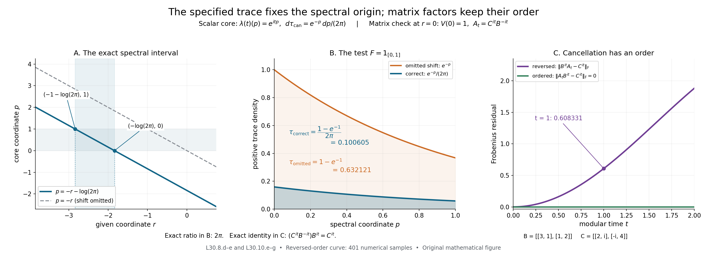

# Recovering a continuous core with its specified trace

*Self-checked by the writing AI. Original exposition and illustration sources: CC0-1.0; earlier and font components retain their recorded terms.*

A trace-scaling system already contains the unitaries needed to recover a continuous core. To find them, average the action and compare the resulting weight with the given trace. The logarithm of its density supplies modular time. Normal recognition then recovers the algebra; the complete averaging formula recovers the actual trace. We carry this construction through changes of weight and isomorphisms, and calculate three models in which the normalization can be seen directly.

## The given system and the core convention

Let \(N\ne0\) be an arbitrary von Neumann algebra, \(\theta:\mathbb R\to\operatorname{Aut}(N)\) a point-ultraweakly continuous action, and \(\tau\) a faithful normal semifinite trace satisfying
\[
 \tau\circ\theta_s=e^{-s}\tau\qquad(s\in\mathbb R).
\]
All equalities of weights mean equality on every positive element, including infinite values. Put \(M=N^\theta\). This is a von Neumann subalgebra: fixedness is preserved by products and adjoints, and \(M\) is the intersection of the ultraweakly closed kernels of \(\theta_s-\mathrm{id}\). It has the same unit as \(N\). No factor, type III, faithful-state, separability or countability hypothesis is imposed. The zero algebra has the separate unique zero-algebra interpretation.

For each faithful normal semifinite weight \(\psi\) on \(M\), form
\[
 C_\psi(M)=M\rtimes_{\sigma^\psi}\mathbb R
\]
with original Haar measure \(dt\), dual measure \(ds/(2\pi)\), and
\[
 \widehat{\sigma^\psi}_s(\pi_\psi(x))=\pi_\psi(x),\qquad
 \widehat{\sigma^\psi}_s(\lambda_\psi(t))=e^{-ist}\lambda_\psi(t).
\]
Let \(T_\psi\) be its canonical operator-valued weight into \(\pi_\psi(M)\), and let \(\widetilde\psi=\widehat{\psi\circ\pi_\psi^{-1}}\circ T_\psi\) be the complete dual weight. The outer hat denotes extension to the extended positive cone. [CORE1](OA-FLOW-CORE.md#core-1) and [CORE2](OA-FLOW-CORE.md#core-2) construct the nonsingular affiliated density and trace with
\[
 \begin{gathered}
 h_\psi^{it}=\lambda_\psi(t),\qquad
 \tau_{\mathrm{can},\psi}=(\widetilde\psi)_{h_\psi^{-1}},\\
 \widetilde\psi=(\tau_{\mathrm{can},\psi})_{h_\psi}.
 \end{gathered}
\]
The subscript means the whole-cone bounded-spectral construction in [CZ2](OA-FLOW-CZ.md#oa-flow.cz.2). We will construct a normal isomorphism \(\kappa_\psi:C_\psi(M)\to N\) fixing the named coefficient algebra, intertwining the flows and satisfying
\[
 \tau\circ\kappa_\psi=\tau_{\mathrm{can},\psi}.
\]
The given trace, including its scale on each central part, is part of the data.

## 1. Normalize the action integral

The trace-scaling averaging theorem [L19, Section 1](OA-FLOW-L19.md#l19-1) and [Section 2](OA-FLOW-L19.md#l19-2) constructs
\[
 E_0(y)=\int_{\mathbb R}\theta_s(y)\,ds,
 \qquad E(y)=\frac{1}{2\pi}E_0(y),\qquad y\in N_+.
 \tag{L30.1.a}
\]
The integral is the increasing extended-positive supremum of the bounded normal maps obtained by integration on \([-j,j]\). L19 proves that its spectral pair lies in the fixed algebra, that it is faithful and normal for arbitrary bounded increasing positive nets, and that it is \(M\)-bimodular. Its semifiniteness follows from the explicitly constructed wandering partition: the finite sums of its discrete translates increase to \(1\), and averaging every bounded positive element of the corresponding corner is bounded. This conclusion uses the scaling trace and requires no pre-existing recognition theorem.

Multiplication by \((2\pi)^{-1}\) preserves normality, faithfulness and bimodularity. It also preserves the entire bounded-value finite left ideal:
\[
 \mathfrak n_E=\mathfrak n_{E_0}
  =\{a\in N:E_0(a^*a)\text{ is bounded in }M_+\}.
 \tag{L30.1.b}
\]
This ideal is ultraweakly dense by L19. Thus \(E:N_+\to\widehat M_+\) is a faithful normal semifinite operator-valued weight. Translation of the integral and fixedness of \(M\) give, on its entire positive domain,
\[
 E\circ\theta_s=E,\qquad
 E(b^*yb)=b^*E(y)b\quad(b\in M).
 \tag{L30.1.c}
\]
These statements include values with an infinite part. The factor in (L30.1.a) is the Plancherel-dual Haar normalization; the infinite measure of the real line is not being normalized to a probability measure.

By [FR1](OA-FLOW-FR.md#oa-flow.fr.1), choose any faithful normal semifinite weight \(\psi\) on \(M\). Define
\[
 \Phi_\psi(y)=\widehat\psi(E(y)),\qquad y\in N_+.
 \tag{L30.1.d}
\]
[EP5](OA-FLOW-EP.md#oa-flow.ep.5) and [EP6](OA-FLOW-EP.md#oa-flow.ep.6) prove that this composition is faithful normal semifinite. Its entire finite left ideal is
\[
 \mathfrak n_{\Phi_\psi}
 =\{a\in N:\widehat\psi(E(a^*a))<\infty\}.
 \tag{L30.1.e}
\]
It need not equal \(\mathfrak n_E\): the latter requires a bounded operator-valued result, whereas the former requires a finite scalar evaluation of an extended value. From (L30.1.c) we have
\[
 \Phi_\psi\circ\theta_s=\Phi_\psi.
 \tag{L30.1.f}
\]

## 2. The density recovers the exact modular time

Apply [TD4](OA-FLOW-TD.md#oa-flow.td.4), [TD5](OA-FLOW-TD.md#oa-flow.td.5) and [TD6](OA-FLOW-TD.md#oa-flow.td.6) to the faithful normal semifinite trace \(\tau\) and weight \(\Phi_\psi\) on \(N\). There is a unique nonsingular positive self-adjoint operator \(H_\psi\), affiliated with \(N\), such that
\[
 \begin{gathered}
 \Phi_\psi=\tau_{H_\psi},\\
 \Phi_\psi(y)=\sup_n\tau\bigl((H_\psi\wedge n)^{1/2}
                   y(H_\psi\wedge n)^{1/2}\bigr),\qquad y\in N_+.
 \end{gathered}
 \tag{L30.2.a}
\]
[TD6](OA-FLOW-TD.md#oa-flow.td.6) shows that semifiniteness removes an infinite-value component of the density, and faithfulness removes its kernel. The uniqueness is uniqueness of the full affiliated spectral operator, not just equality of a formula on a dense finite algebra.

The full-cone covariance formula [CZ7](OA-FLOW-CZ.md#oa-flow.cz.7), invariance (L30.1.f) and the trace scaling give
\[
 \tau_{H_\psi}
 =\tau_{H_\psi}\circ\theta_s
 =\tau_{e^{-s}\theta_{-s}(H_\psi)}.
\]
[TD5](OA-FLOW-TD.md#oa-flow.td.5) therefore gives
\[
 H_\psi=e^{-s}\theta_{-s}(H_\psi),\qquad
 \theta_s(H_\psi)=e^{-s}H_\psi.
 \tag{L30.2.b}
\]
Both are affiliated-operator equalities under normal transport of spectral projections. In particular \(P_\psi=\log H_\psi\) is a self-adjoint affiliated operator and
\[
 U_\psi(t)=H_\psi^{it}=e^{itP_\psi},\qquad
 \theta_s(U_\psi(t))=e^{-ist}U_\psi(t).
 \tag{L30.2.c}
\]
The full spectral calculus in [SF](OA-FLOW-SF.md#oa-flow.sf.sf1) gives the group law and strong continuity: for each vector, dominated convergence applies to the squared modulus of \(e^{itr}-e^{iur}\) against its finite spectral measure. This is the negative-character group needed for our dual convention. The positive-character group in L19 is \(H_\psi^{-it}\).

We must identify its action on \(M\). Since \(\tau\) is a trace, [KT5](OA-FLOW-KT.md#oa-flow.kt.5) makes its modular group trivial. The full perturbation formula [CZ5](OA-FLOW-CZ.md#oa-flow.cz.5) gives
\[
 \sigma_t^{\Phi_\psi}=\operatorname{Ad}(H_\psi^{it})
 \quad\text{on all of }N.
 \tag{L30.2.d}
\]
For the unital inclusion \(M\subset N\), Section 1 establishes every hypothesis of the operator-valued modular-restriction theorem [OT5](OA-FLOW-OT.md#oa-flow.ot.5): \(E\) is faithful normal semifinite with a dense bounded-value ideal, and \(\psi\) is faithful normal semifinite. Its full finite-domain proof yields
\[
 \sigma_t^{\Phi_\psi}(x)=\sigma_t^\psi(x)
 \qquad(x\in M).
 \tag{L30.2.e}
\]
Consequently
\[
 H_\psi^{it}xH_\psi^{-it}=\sigma_t^\psi(x)
 \qquad(x\in M).
 \tag{L30.2.f}
\]
This determines the actual modular time. Scalar multiplication of \(E_0\) in Section 1 has introduced no change in that time: the same composition is also \(\widehat{\psi/(2\pi)}\circ E_0\), and the scalar covariance of [BC5](OA-FLOW-BC.md#oa-flow.bc.5) leaves the base modular group unchanged.

There is also a direct check using both conclusions of OT5. For \(u\in\mathcal U(M)\), bimodularity implies
\[
 \Phi_\psi\circ\operatorname{Ad}(u)
    =\widehat{\psi\circ\operatorname{Ad}(u)}\circ E.
\]
OT5's composition derivative and the inner-change identity [GDA8, equation (GDA34)](OA-FLOW-GDA.md#gda-8) therefore identify the two derivatives as
\[
 u^*\sigma_t^{\Phi_\psi}(u)=u^*\sigma_t^\psi(u).
 \tag{L30.2.g}
\]
Multiplication by \(u\) gives the restriction on every unitary. Their linear span is all of a unital von Neumann algebra: for a self-adjoint contraction \(a\), the spectral expression \(a+i(1-a^2)^{1/2}\) is unitary with real part \(a\), and real and imaginary parts reduce an arbitrary element to such contractions. Thus this check yields (L30.2.e) on the whole coefficient algebra.

## 3. Normal recognition recovers the full algebra

Apply the proved dual-system recognition theorem [L29, Section 4](OA-FLOW-L29.md#l29-4) and [Section 5](OA-FLOW-L29.md#l29-5) with \(G=\mathbb R\), \(\widehat G=\mathbb R\), characters \(\chi_s(t)=e^{ist}\), action \(\beta=\theta\), and eigenunitaries \(u_t=U_\psi(t)\). The fixed algebra is exactly \(M\); strong continuity and the required negative phase are (L30.2.c). The induced coefficient action is exactly \(\sigma^\psi\) by (L30.2.f). Recognition therefore gives a normal unital isomorphism with normal inverse
\[
 \begin{gathered}
 \kappa_\psi:C_\psi(M)\longrightarrow N,\\
 \kappa_\psi(\pi_\psi(x))=x,\qquad
 \kappa_\psi(\lambda_\psi(t))=H_\psi^{it}.
 \end{gathered}
 \tag{L30.3.a}
\]
It is unique with these generator values and satisfies
\[
 \kappa_\psi\widehat{\sigma^\psi}_s=\theta_s\kappa_\psi.
 \tag{L30.3.b}
\]
L29 proves generation of \(N\) by \(M\) and these eigenunitaries, using its finite-integral Fourier argument; its explicit onto unitary comparison then proves normality, faithfulness and surjectivity. Thus this application does not infer a normal extension for an arbitrary covariant representation merely from a universal algebraic property. All its representation and multiplicity spaces may have arbitrary Hilbert dimension.

The identity (L30.3.b) can also be checked directly on the two generating families: both actions fix \(M\), and both multiply the image of \(\lambda_\psi(t)\) by \(e^{-ist}\). Normality gives equality everywhere. The trace normalization still needs a separate argument.

## 4. Transport every positive value and recover the specified trace

Normal isomorphisms transport the extended positive cone by their predual maps, as proved in [EP2–4](OA-FLOW-EP.md#oa-flow.ep.4). Extend \(\kappa_\psi\) in that way, and write \(\widehat\kappa_\psi\) when its argument is extended. The canonical dual average [DA](OA-FLOW-DA.md#da-positive), its [whole-cone identification](OA-FLOW-DA.md#da-equality), and the complete dual-weight identification [GDA8](OA-FLOW-GDA.md#gda-8) give, for \(Y\in C_\psi(M)_+\) and every \(\rho\in N_*^+\),
\[
 \begin{aligned}
 \widehat\kappa_\psi(T_\psi(Y))(\rho)
 &=\int_{\mathbb R}\rho\bigl(\kappa_\psi(
             \widehat{\sigma^\psi}_s(Y))\bigr)\,\frac{ds}{2\pi}\\
 &=\int_{\mathbb R}\rho\bigl(\theta_s(\kappa_\psi(Y))\bigr)
                      \,\frac{ds}{2\pi}\\
 &=E(\kappa_\psi(Y))(\rho).
 \end{aligned}
 \tag{L30.4.a}
\]
The extended values in the coefficient subalgebras are viewed in their ambient extended cones through the normal inclusions. Equivalently one can first restrict each test to those subalgebras. Positive normal tests extend to the ambient algebra by [EP1](OA-FLOW-EP.md#oa-flow.ep.1), so they distinguish the same values. Each equality in (L30.4.a) holds first on bounded interval integrals and then on their increasing extended supremum. No finite-value hypothesis is present.

Separation by positive normal functionals yields
\[
 \widehat\kappa_\psi(T_\psi(Y))=E(\kappa_\psi(Y)).
 \tag{L30.4.b}
\]
Since \(\kappa_\psi\) fixes the coefficient copy of \(M\), composing this equality with the normal extension of \(\psi\) proves
\[
 \widetilde\psi(Y)=\Phi_\psi(\kappa_\psi(Y))
 \qquad(Y\in C_\psi(M)_+).
 \tag{L30.4.c}
\]
In particular complete weights are being identified on the whole cone, including their infinite values; equality on a dense set of finite squares is not a premise for this conclusion.

Normal spectral transport and (L30.3.a) give
\[
 \kappa_\psi(h_\psi)=H_\psi.
 \tag{L30.4.d}
\]
Indeed the transported imaginary powers agree at every real time, and [RF5](OA-FLOW-RF.md#oa-flow.rf.5) identifies the self-adjoint logarithmic generators uniquely. The equality therefore holds for all spectral projections and all affiliated real powers as well.

For any weight \(\omega\) on the core, set \(\kappa_{\psi*}\omega=\omega\circ\kappa_\psi^{-1}\). The isomorphism covariance of bounded-spectral perturbation proved in [CORE8](OA-FLOW-CORE.md#core-8), using the construction in [CZ7](OA-FLOW-CZ.md#oa-flow.cz.7), together with (L30.4.c) and (L30.4.d) imply
\[
 \begin{aligned}
 \kappa_{\psi*}\tau_{\mathrm{can},\psi}
 &=\bigl(\kappa_{\psi*}\widetilde\psi\bigr)_{
                      \kappa_\psi(h_\psi)^{-1}}\\
 &=(\Phi_\psi)_{H_\psi^{-1}}
   =(\tau_{H_\psi})_{H_\psi^{-1}}=\tau.
 \end{aligned}
 \tag{L30.4.e}
\]
The final equality is the general whole-cone inverse-perturbation identity proved in [CORE, Section 2](OA-FLOW-CORE.md#core-2). Its hypotheses hold: every spectral projection of \(H_\psi\) is fixed by the inner modular group (L30.2.d), so \(H_\psi^{-1}\) is affiliated with the centralizer of \(\Phi_\psi\). That proof compares normalized cocycles and uses their fixed-reference injectivity; it does not identify weights merely from equality of modular groups.

Equivalently, on each \(Y\in N_+\), the last equality in (L30.4.e) says
\[
 \tau(Y)=\sup_{n\ge1}\Phi_\psi\bigl(
 H_\psi^{-1/2}p_nYp_nH_\psi^{-1/2}\bigr),
 \qquad p_n=1_{[1/n,n]}(H_\psi).
 \tag{L30.4.f}
\]
Every operator product inside the weight is bounded. Its values increase by the parameter-order theorem in CZ, although the sandwiched positive operators need not increase. This is also an exact criterion for finiteness: the supremum is finite exactly when \(Y\) has finite \(\tau\)-value. Thus the transported trace is exactly the given trace and has its full finite and infinite domains. Pulling (L30.4.e) back proves
\[
 \tau\circ\kappa_\psi=\tau_{\mathrm{can},\psi}.
 \tag{L30.4.g}
\]
The scaling law alone would not determine this normalization; the normalized full action integral and its unique density have done so.

## 5. Ordered changes of weight and the glued core

Let \(\varphi,\psi\) be faithful normal semifinite weights on the full fixed algebra \(M=N^\theta\). Their weights on \(N\) use the same normalized operator-valued weight:
\[
 \Phi_\varphi=\widehat\varphi\circ E=\tau_{H_\varphi},\qquad
 \Phi_\psi=\widehat\psi\circ E=\tau_{H_\psi}.
\]
The complete [composition-derivative proof in OT5](OA-FLOW-OT.md#oa-flow.ot.5) applies: \(E\) and both base weights are faithful normal semifinite, and their extensions are evaluated on the entire extended positive cone. It gives the equality in \(M\subset N\)
\[
 c_{\varphi,\psi}(t):=(D\varphi:D\psi)_t
       =(D\Phi_\varphi:D\Phi_\psi)_t.
 \tag{L30.5.a}
\]
Since the centralizer of the trace \(\tau\) is all of \(N\), the nonsingular densities \(H_\varphi,H_\psi\) satisfy exactly the affiliation hypotheses of [CZ6](OA-FLOW-CZ.md#oa-flow.cz.6). Its normalized cocycle formula and the [BC4 chain and adjoint laws](OA-FLOW-BC.md#oa-flow.bc.4) yield
\[
 \begin{aligned}
 c_{\varphi,\psi}(t)
  &=(D\Phi_\varphi:D\tau)_t(D\tau:D\Phi_\psi)_t\\
  &=H_\varphi^{it}H_\psi^{-it},\\
 H_\varphi^{it}&=c_{\varphi,\psi}(t)H_\psi^{it}.
 \end{aligned}
 \tag{L30.5.b}
\]
These are products of bounded unitaries on the whole representation Hilbert space. The two densities need not commute. In particular the cocycle belongs on the left in the last formula; no product of unbounded real powers is used.

The actual [normal chart construction in CORE5](OA-FLOW-CORE.md#core-5) supplies
\[
 \begin{aligned}
 J_{\varphi,\psi}:C_\varphi(M)&\longrightarrow C_\psi(M),\\
 J_{\varphi,\psi}(\pi_\varphi(x))&=\pi_\psi(x),\\
 J_{\varphi,\psi}(\lambda_\varphi(t))
   &=\pi_\psi(c_{\varphi,\psi}(t))\lambda_\psi(t).
 \end{aligned}
 \tag{L30.5.c}
\]
That construction conjugates the faithful regular representations by the unitary field \(c_{\varphi,\psi}(-r)^*\). It proves normality, surjectivity and a normal inverse before transporting the map to any other regular model. Its equivariance and its preservation of the canonical trace on all positive elements are proved in [CORE5–6](OA-FLOW-CORE.md#core-6).

Apply \(\kappa_\psi\) to the last generator in (L30.5.c). Equation (L30.5.b) gives \(c_{\varphi,\psi}(t)H_\psi^{it}=H_\varphi^{it}\), the image under \(\kappa_\varphi\). The coefficient images also agree. The two normal maps therefore agree on the ultraweakly dense generated \(*\)-algebra and hence everywhere:
\[
 \kappa_\varphi=\kappa_\psi\circ J_{\varphi,\psi}.
 \tag{L30.5.d}
\]
For a third faithful normal semifinite weight \(\omega\), BC4 gives the ordered identities
\[
 \begin{gathered}
 c_{\varphi,\omega}(t)
    =c_{\varphi,\psi}(t)c_{\psi,\omega}(t),\\
 J_{\psi,\omega}\circ J_{\varphi,\psi}=J_{\varphi,\omega},
 \qquad J_{\psi,\psi}=\operatorname{id},
 \qquad J_{\varphi,\psi}^{-1}=J_{\psi,\varphi}.
 \end{gathered}
 \tag{L30.5.e}
\]
Indeed the composite sends \(\lambda_\varphi(t)\) to
\(\pi_\omega(c_{\varphi,\psi}(t)c_{\psi,\omega}(t))\lambda_\omega(t)\).
This checks the order without interchanging the two factors. As a normalization test, if \(\varphi=a\psi\), \(a>0\), [BC5](OA-FLOW-BC.md#oa-flow.bc.5) gives \(c_{\varphi,\psi}(t)=a^{it}1\), and whole-cone density uniqueness gives \(H_\varphi=aH_\psi\). The phase in the chart transition changes the dual weight and its density together, preserving the canonical trace.

For completeness, the [set-based gluing in CORE7](OA-FLOW-CORE.md#core-7) uses the nonempty set \(\mathcal W(M)\) of faithful normal semifinite weights, each regarded as a function on the set \(M_+\). Choose its regular charts in one faithful normal representation and impose
\[
 (\varphi,X)\sim(\psi,Y)
       \quad\Longleftrightarrow\quad Y=J_{\varphi,\psi}(X).
 \tag{L30.5.f}
\]
Equation (L30.5.e) makes this an equivalence relation. Every class has exactly one representative in any chosen chart. The algebra operations, positive cone, norm and ultraweak topology transported through that chart are independent of it, since every transition and its inverse are normal \(*\)-isomorphisms. Write \(C(M)\) for the resulting von Neumann algebra, \(j_M(x)=[\psi,\pi_\psi(x)]\) for its coefficient inclusion, \(\vartheta\) for its flow, and \(\tau_{\mathrm{can}}\) for its canonical trace.

Equation (L30.5.d) makes
\[
 \begin{gathered}
 \kappa:C(M)\longrightarrow N,\qquad
 \kappa([\psi,X])=\kappa_\psi(X),\\
 \kappa(j_M(x))=x,\qquad
 \kappa\vartheta_s=\theta_s\kappa,\qquad
 \tau\circ\kappa=\tau_{\mathrm{can}}.
 \end{gathered}
 \tag{L30.5.g}
\]
well defined. In any one chart it is the already proved normal isomorphism \(\kappa_\psi\), with a normal inverse. Its trace identity is an equality on the whole positive cone. Thus every specified trace-scaling system is the continuous core, with its trace and flow, of its full fixed algebra. All the weight charts recover this same isomorphism. The only countable sequences used here are spectral or real-line approximations; no countable decomposition of the algebra or faithful normal state is required.

## 6. Trace-preserving uniqueness and naturality

Fix a faithful normal semifinite \(\psi\) on \(M\). Denote its core dual weight by \(\widetilde\psi\), its positive affiliated generator by \(h_\psi\), and its canonical trace by \(\tau_{\mathrm{can},\psi}\). Thus [CORE2](OA-FLOW-CORE.md#core-2) proves
\(\widetilde\psi=(\tau_{\mathrm{can},\psi})_{h_\psi}\) on the entire positive cone.

**Uniqueness.** The map \(\kappa_\psi\) is the unique normal \(*\)-isomorphism \(L:C_\psi(M)\to N\), with normal inverse, satisfying
\[
 \begin{gathered}
 L(\pi_\psi(x))=x\quad(x\in M),\qquad
 L\vartheta_s^\psi=\theta_sL,\\
 \tau\circ L=\tau_{\mathrm{can},\psi}.
 \end{gathered}
 \tag{L30.6.a}
\]
Here \(\vartheta^\psi\) denotes the negative-character dual action in the \(\psi\)-chart.

To prove this, let \(T_\psi\) be its canonical operator-valued weight, and let \(\iota_L:\pi_\psi(M)\to M\) be the coefficient restriction of \(L\). Equivariance, the [complete dual-action average](OA-FLOW-DA.md#da-equality), and the same factor \(1/(2\pi)\) in \(E\) give
\[
 E(L(X))=\widehat\iota_L(T_\psi(X)),\qquad
 \Phi_\psi(L(X))=\widetilde\psi(X)
 \quad(X\in C_\psi(M)_+).
 \tag{L30.6.b}
\]
For the first equality, commute \(L\) with each bounded interval average and take the increasing extended-positive supremum. Testing with positive normal functionals proves equality, including the infinite-value part; [EP1](OA-FLOW-EP.md#oa-flow.ep.1) extends coefficient functionals to the ambient algebra. Composition with \(\widehat\psi\) proves the second equality. Thus these identities do not rest on agreement on a finite test algebra.

Write \(L_*\omega=\omega\circ L^{-1}\). Normal spectral transport defines \(L(h_\psi)\), with all its spectral domains. The isomorphism covariance of density perturbation is proved by transporting its bounded sandwiches in [CORE8](OA-FLOW-CORE.md#core-8), using the construction in [CZ7](OA-FLOW-CZ.md#oa-flow.cz.7). Hence
\[
 \Phi_\psi=L_*\widetilde\psi
    =(L_*\tau_{\mathrm{can},\psi})_{L(h_\psi)}
    =\tau_{L(h_\psi)}.
 \tag{L30.6.c}
\]
Both \(L(h_\psi)\) and \(H_\psi\) are nonsingular positive self-adjoint operators affiliated with \(N\). The [full-cone uniqueness theorem TD5](OA-FLOW-TD.md#oa-flow.td.5), applied to (L30.6.c) and \(\Phi_\psi=\tau_{H_\psi}\), gives \(L(h_\psi)=H_\psi\). Their imaginary powers show
\(L(\lambda_\psi(t))=H_\psi^{it}\).
The coefficient images were prescribed, so normality and generation prove \(L=\kappa_\psi\). Through one chart the same proof gives uniqueness of \(\kappa\) among normal trace-preserving equivariant isomorphisms \(C(M)\to N\) whose restriction to \(j_M(M)\) is the specified identification.

The trace condition carries information. For every \(s\), the map \(\theta_s\kappa_\psi\) still fixes the coefficient algebra and intertwines the actions, while
\[
 \tau\circ\theta_s\kappa_\psi=e^{-s}\tau_{\mathrm{can},\psi},\qquad
 (\theta_s\kappa_\psi)(\lambda_\psi(t))
       =e^{-ist}H_\psi^{it}.
 \tag{L30.6.d}
\]
For \(s\ne0\) the second formula differs for some \(t\); the first also differs on a positive element of finite nonzero trace, which exists by faithfulness and semifiniteness on the nonzero algebra. All positive scalar multiples of a trace have trivial modular group. The uniqueness proof used the actual normalized weight and density, so it distinguishes these multiples.

**Naturality.** Let \((N',\theta',\tau')\) be a second trace-scaling system, and let \(\rho:N\to N'\) be a normal \(*\)-isomorphism with normal inverse such that
\[
 \rho\theta_s=\theta'_s\rho,\qquad \tau'\circ\rho=\tau.
 \tag{L30.6.e}
\]
It restricts to a normal isomorphism \(\eta:M\to M'=(N')^{\theta'}\): equivariance gives one inclusion between the fixed algebras, and its inverse gives the other. Put \(\psi'=\psi\circ\eta^{-1}\). Faithfulness, normality and semifiniteness transport, with the entire finite positive cones. Bounded interval averages followed by their extended suprema give
\[
 E'\rho=\widehat\eta E,\qquad
 \Phi'_{\psi'}\circ\rho=\Phi_\psi.
 \tag{L30.6.f}
\]
Transport the density identity \(\Phi'_{\psi'}=\tau'_{H'_{\psi'}}\) through \(\rho\). Equation (L30.6.e) and the bounded spectral perturbation formula give
\(\Phi_\psi=\tau_{\rho^{-1}(H'_{\psi'})}\).
TD5 therefore proves the equality of affiliated operators
\[
 \rho(H_\psi)=H'_{\psi'}.
 \tag{L30.6.g}
\]

The [normal core lift in CORE8](OA-FLOW-CORE.md#core-8) is constructed in corresponding regular representations:
\[
 \begin{aligned}
 K_{\eta,\psi}:C_\psi(M)&\longrightarrow C_{\psi'}(M'),\\
 K_{\eta,\psi}(\pi_\psi(x))&=\pi_{\psi'}(\eta(x)),\\
 K_{\eta,\psi}(\lambda_\psi(t))&=\lambda_{\psi'}(t).
 \end{aligned}
 \tag{L30.6.h}
\]
Its normality and normal inverse follow from the identical regular coefficient fields after pulling back a faithful representation through \(\eta\), followed by [NR4](OA-FLOW-NR.md#oa-flow.nr.4). The [BC5 covariance formula](OA-FLOW-BC.md#oa-flow.bc.5) identifies the transformed normalized cocycles. It makes these lifts commute with every ordered transition (L30.5.c), so they descend to the core map \(C(\eta):C(M)\to C(M')\). CORE8 proves that this map preserves the canonical traces and flows, with their exact normalizations.

Equation (L30.6.g) identifies the two images of each group generator under \(\rho\kappa_\psi\) and \(\kappa'_{\psi'}K_{\eta,\psi}\); the coefficient images agree as well. Normality gives both the chart and intrinsic identities
\[
 \rho\kappa_\psi=\kappa'_{\psi'}K_{\eta,\psi},\qquad
 \rho\kappa=\kappa'C(\eta).
 \tag{L30.6.i}
\]

This gives the full correspondence on normal isomorphisms. Given any normal \(*\)-isomorphism \(\eta:M\to M'\) with normal inverse, define
\[
 \rho_\eta=\kappa' C(\eta)\kappa^{-1}:N\longrightarrow N'.
 \tag{L30.6.j}
\]
It is normal with normal inverse, preserves the specified traces, intertwines the actions, and restricts to \(\eta\) on the fixed algebra. Conversely every \(\rho\) in (L30.6.e) has this form by (L30.6.i), so the extension is unique. For composable \(\eta,\zeta\), CORE8's generator proof gives
\[
 \rho_{\operatorname{id}}=\operatorname{id},\qquad
 \rho_\zeta\rho_\eta=\rho_{\zeta\eta},\qquad
 \rho_{\eta^{-1}}=\rho_\eta^{-1}.
 \tag{L30.6.k}
\]
Restriction to the fixed algebra has the same identity and composition laws. Thus the core construction and passage to the full fixed algebra are inverse up to the specified natural isomorphisms on the groupoids whose arrows are these normal isomorphisms. On an algebra \(A\), the coefficient map identifies \(A\) normally with \(C(A)^{\vartheta}\) by [DA's full fixed-algebra proof](OA-FLOW-DA.md#da-fixed); on a trace-scaling system the inverse identification is \(\kappa\). This statement concerns normal isomorphisms, and supplies no lift for a general inclusion or homomorphism.

## 7. The second crossing and its remaining action

Let
\[
 D=N\rtimes_\theta\mathbb R
\]
and write \(j_N:N\to D\) and \(s\mapsto\ell_s\) for its coefficient map and implementing unitaries. Take the Haar measure of this outer real group to be \(ds/(2\pi)\), dual to the \(dt\) used for the modular group in \(C_\psi(M)\). The remaining negative-character dual action is
\[
 \delta_a(j_N(y))=j_N(y),\qquad
 \delta_a(\ell_s)=e^{-ias}\ell_s.
 \tag{L30.7.a}
\]

**The full normal isomorphism.** For every faithful normal semifinite \(\psi\) on \(M\), there is a normal \(*\)-isomorphism with normal inverse
\[
 \mathscr S_\psi:D\longrightarrow
        M\,\overline\otimes\,B(L^2(\mathbb R,dr)).
 \tag{L30.7.b}
\]
In a faithful normal realization of \(M\) on an arbitrary Hilbert space \(K\), its exact generator values on \(L^2(\mathbb R,K)\) are
\[
 \begin{aligned}
 [\mathscr S_\psi(j_N(x))\xi](r)
       &=\sigma_{-r}^\psi(x)\xi(r) &&(x\in M),\\
 \mathscr S_\psi(j_N(H_\psi^{it}))&=1\otimes L_t,
       & [L_t\xi](r)&=\xi(r-t),\\
 \mathscr S_\psi(\ell_s)&=1\otimes Q_s,
       & [Q_s\xi](r)&=e^{-isr}\xi(r).
 \end{aligned}
 \tag{L30.7.c}
\]

First extend the equivariant \(\kappa_\psi\) to
\[
 \kappa_\psi^{(2)}:
 C_\psi(M)\rtimes_{\vartheta^\psi}\mathbb R\longrightarrow D,
 \qquad
 j_C(X)\longmapsto j_N(\kappa_\psi(X)),\quad
 \ell_s^{,C}\longmapsto\ell_s.
 \tag{L30.7.d}
\]
This extension is normal for a concrete reason. Represent \(N\) faithfully normally on \(H\), and represent \(C_\psi(M)\) on the same \(H\) through \(\kappa_\psi\). Equivariance makes their regular coefficient fields on \(L^2(\mathbb R,ds/(2\pi);H)\) identical under the displayed relabeling; their outer translations are identical too. These identical generated von Neumann algebras give a normal isomorphism in both directions. NR4 transfers it to the named regular models. This establishes (L30.7.d) without asserting normal extension of an arbitrary covariant representation.

Apply the [Fourier-and-shear proof of normal double duality](OA-FLOW-ND.md#nd-construction) to \(\alpha=\sigma^\psi\). Its isomorphism \(\mathcal D_\psi\) from the left side of (L30.7.d) onto \(M\bar\otimes B(L^2(\mathbb R,dr))\) has the three generator values in (L30.7.c), with \(x\) and \(\lambda_\psi(t)\) in place of their images in \(N\). Define
\[
 \mathscr S_\psi=\mathcal D_\psi(\kappa_\psi^{(2)})^{-1},\qquad
 \mathscr S_\psi^{-1}=\kappa_\psi^{(2)}\mathcal D_\psi^{-1}.
 \tag{L30.7.e}
\]
The [full inverse in ND](OA-FLOW-ND.md#nd-inverse) is unitary conjugation composed with the faithful normal coefficient tensor map. Its domain is the entire spatial tensor algebra. In the forward proof the orbit fields together with the Weyl pair generate exactly that tensor algebra, by [ND's commutant argument](OA-FLOW-ND.md#nd-orbits). These facts prove surjectivity and normality on arbitrary nets for (L30.7.b), rather than only its algebraic generator formulas. Generation also makes the map with (L30.7.c) unique and independent of the faithful normal realization of \(M\).

Let \([R_a\xi](r)=\xi(r+a)\). The remaining action is exactly
\[
 \mathscr S_\psi\delta_a\mathscr S_\psi^{-1}
       =\sigma_a^\psi\otimes\operatorname{Ad}R_a.
 \tag{L30.7.f}
\]
Here is the sign check on all three generating families. The orbit field of \(x\) becomes
\(\sigma_a^\psi(\sigma_{-(r+a)}^\psi(x))=\sigma_{-r}^\psi(x)\), so it is fixed. Left and right translations commute, so \(1\otimes L_t\) is fixed. Finally
\[
 R_aQ_sR_a^*=e^{-ias}Q_s.
 \tag{L30.7.g}
\]
These are precisely (L30.7.a). All the maps are normal, so agreement on the generating algebra proves (L30.7.f) everywhere. ND also proves the normal coefficient tensor map used here, so applying \(\sigma_a^\psi\) to an orbit field is justified by its normal slice formulas.

The outer Haar constant can be changed without changing this represented algebra or action. If the second crossed product is formed using \(ds\) instead, the unitary
\[
 U:L^2(\mathbb R,ds/(2\pi);H)\longrightarrow L^2(\mathbb R,ds;H),
 \qquad (U\xi)(s)=(2\pi)^{-1/2}\xi(s)
 \tag{L30.7.h}
\]
intertwines every regular coefficient operator and every outer translation. Its norm identity is
\(\int\|U\xi(s)\|^2ds=\int\|\xi(s)\|^2ds/(2\pi)\), and multiplication by \((2\pi)^{1/2}\) is its inverse. The Fourier transform in ND uses the Plancherel-compatible pair \(dt,ds/(2\pi)\); biduality returns \(dt\), with no remaining scalar in (L30.7.c) or (L30.7.f). This Hilbert-space comparison makes no assertion about the normalization of a second dual weight.

Thus the second crossed product is a stabilization of the full fixed algebra. Its coefficient embedding in (L30.7.c) is the modular orbit field, which generally differs from \(x\mapsto x\otimes1\). The result identifies the second crossing and its remaining action; it does not cancel the operator tensor factor, assert that the original algebra absorbs that factor, or infer a type III classification from trace scaling alone.

## 8. A scalar trace fixes the origin of the spectral coordinate

Consider
\[
 N=L^\infty(\mathbb R,dr),\qquad
 (\theta_sf)(r)=f(r+s),\qquad
 \tau(f)=\int_{\mathbb R}e^rf(r)\,dr
 \quad(f\in N_+).
 \tag{L30.8.a}
\]
The weight is a faithful normal semifinite trace: its density is positive, and the interval projections \(1_{[-n,n]}\uparrow1\) have finite trace. Substitution gives \(\tau\theta_s=e^{-s}\tau\). Translation is continuous on the \(L^1\) predual by [the scalar translation proof](OA-FLOW-FF.md#oa-flow.ff.2), so this is a point-ultraweakly continuous action. The [translation-fixed multiplier argument](OA-FLOW-ND.md#nd-weyl-proof) gives \(M=\mathbb C1\).

Choose \(\psi(1)=1\). The normalized integral and its trace density are
\[
 E(f)=\frac1{2\pi}\int_{\mathbb R}f(r)\,dr,\qquad
 \Phi_\psi=E,\qquad H_\psi(r)=\frac{e^{-r}}{2\pi}.
 \tag{L30.8.b}
\]
These statements include infinite values. For example, pair the positive action integral with any positive \(L^1\) probability density, then apply [nonnegative scalar interchange](OA-FLOW-FF.md#oa-flow.ff.1). The inner integral in the translation variable is constant; its value is the expression in (L30.8.b).

The [full-cone Fourier model of the tracial core](OA-FLOW-CORE.md#core-9) uses the coordinate \(p\), with
\[
 \lambda_\psi(t)(p)=e^{itp},\qquad
 \widehat{\sigma^\psi}_sF(p)=F(p-s),\qquad
 \tau_{\mathrm{can},\psi}(F)
     =\int_{\mathbb R}F(p)e^{-p}\,\frac{dp}{2\pi}.
 \tag{L30.8.c}
\]
Consequently the precise coordinate change is
\[
 p=-r-\log(2\pi),\qquad
 [\kappa_\psi(F)](r)=F(-r-\log(2\pi)).
 \tag{L30.8.d}
\]
Both affine changes preserve Lebesgue null sets, so this is a normal isomorphism with a normal inverse. Its generator image is \(e^{it(-r-\log(2\pi))}=H_\psi^{it}\). Also
\[
 \theta_s\kappa_\psi(F)(r)
 =F(-r-\log(2\pi)-s)
 =\kappa_\psi(\widehat{\sigma^\psi}_sF)(r).
\]
For every \(F\in L^\infty(\mathbb R)_+\), nonnegative change of variables gives
\[
 \tau(\kappa_\psi(F))
 =\int_{\mathbb R}e^rF(-r-\log(2\pi))\,dr
 =\int_{\mathbb R}F(p)e^{-p}\,\frac{dp}{2\pi}.
 \tag{L30.8.e}
\]
This proves trace preservation on the entire positive cone, including infinite integrals. Omitting the shift would multiply the last value by \(2\pi\). Thus the specified trace determines a spectral origin that equivariance alone does not determine.

*Figure 1.* Left: the solid line is the exact map \(p=-r-\log(2\pi)\). The spectral interval \(0\le p\le1\) has preimage \(-1-\log(2\pi)\le r\le-\log(2\pi)\); the dashed line omits the shift. Middle: for \(F=1_{[0,1]}\), the correct trace is \((1-e^{-1})/(2\pi)\); omission gives \(1-e^{-1}\), exactly \(2\pi\) times as large. Right: with the matrices \(B,C\) in [Section 9](OA-FLOW-L30.md#l30-9) and [Diagnostic C](OA-FLOW-L30.md#l30-10), put \(A_t=C^{it}B^{-it}\). The identity \(A_tB^{it}=C^{it}\) is exact; the plotted reversed-order residual \(\|B^{it}A_t-C^{it}\|_{\mathrm F}\) is a numerical sample, not a proved lower bound. The point \(t=1\) is recorded in the source data. Exact proof locators are (L30.8.d)–(L30.8.e) and (L30.10.e)–(L30.10.g). The [further reading](OA-FLOW-L30.md#l30-reading) gives the human-source context. The [renderer](../assets/trace-scaling-core-converse/render.py), [data](../assets/trace-scaling-core-converse/data.json), [vector image](../assets/trace-scaling-core-converse/normalization-and-order.svg) and [terms](../assets/trace-scaling-core-converse/TERMS.md) are retained.

## 9. Noncommuting densities and an arbitrary central family

**A quadratic rotation of a matrix algebra.** Set
\[
 Z=\begin{pmatrix}2&0\\0&-1\end{pmatrix},\qquad
 B=\begin{pmatrix}3&1\\1&2\end{pmatrix},\qquad
 V(r)=e^{ir^2Z},\qquad
 N=L^\infty(\mathbb R)\,\overline\otimes\,M_2(\mathbb C).
 \tag{L30.9.a}
\]
Define
\[
 \begin{aligned}
 [\theta_s(f)](r)
 &=V(r)V(r+s)^*f(r+s)V(r+s)V(r)^*,\\
 \tau(f)&=\int_{\mathbb R}e^r\operatorname{Tr}(f(r))\,\frac{dr}{2\pi}.
 \end{aligned}
 \tag{L30.9.b}
\]
Here \(\operatorname{Tr}\) is the usual, unnormalized matrix trace. The map \(Q(f)(r)=V(r)^*f(r)V(r)\) is a normal automorphism, implemented by a unitary multiplication operator in the standard spatial representation. It conjugates \(\theta\) to ordinary translation. Translation is continuous on the finite matrix \(L^1\) predual, so the action law and point-ultraweak continuity follow. No uniform continuity of \(r\mapsto V(r)\) on the whole line is required. Trace cyclicity and scalar substitution give \(\tau\theta_s=e^{-s}\tau\). Bounded intervals times the matrix identity have finite trace and increase to the unit, proving semifiniteness.

The fixed algebra is \(j(M_2(\mathbb C))\), where
\[
 j(a)(r)=V(r)aV(r)^*,\qquad
 \psi_B(j(a))=\operatorname{Tr}(Ba).
 \tag{L30.9.c}
\]
Indeed, each entry of \(Q(f)\) is a translation-fixed scalar class, hence constant. Since
\(\operatorname{spec}(B)=\{(5-\sqrt5)/2,(5+\sqrt5)/2\}\), the weight \(\psi_B\) is faithful and finite.

The complete action average is
\[
 E(f)=j\left(\frac1{2\pi}
           \int_{\mathbb R}V(q)^*f(q)V(q)\,dq\right)
 \qquad(f\in N_+).
 \tag{L30.9.d}
\]
The integral is an extended-positive matrix element, and \(j\) in this formula means its normal extended-positive transport. To justify the formula when it has an infinite part, work after \(Q\). Test the average against a positive matrix functional and a positive scalar \(L^1\) probability density in the remaining spatial variable. Nonnegative interchange reduces its value to the indicated matrix functional of the integral. Such tests recover the extended element; no integral of individual off-diagonal entries with infinite absolute value is used.

Composing with \(\psi_B\) gives the full weight and density
\[
 \begin{aligned}
 \Phi_B(f)
  &=\int_{\mathbb R}\operatorname{Tr}
       \bigl(V(r)BV(r)^*f(r)\bigr)\,\frac{dr}{2\pi},\\
 H_B(r)&=e^{-r}V(r)BV(r)^*,\qquad
 \Phi_B=\tau_{H_B}.
 \end{aligned}
 \tag{L30.9.e}
\]
For clarity, the integrand is the nonnegative number
\(\operatorname{Tr}((VBV^*)^{1/2}f(VBV^*)^{1/2})\).
To prove the density identity on every positive \(f\), truncate \(H_B\) spectrally to \(D_n=H_B\wedge n\). Trace cyclicity gives
\[
 \tau(D_n^{1/2}fD_n^{1/2})
 =\int_{\mathbb R}e^r\operatorname{Tr}(D_n(r)f(r))\,\frac{dr}{2\pi}.
\]
The scalar integrands increase, because \(D_n(r)\) increases in matrix order and \(f(r)\ge0\). Their pointwise limit is the integrand in (L30.9.e). Monotone convergence proves the identity, including infinity. This does not assert that \(H_Bf\) is a positive operator. Bounds by the two positive eigenvalues of \(B\), after conjugation by \(V\), also prove directly that \(\Phi_B\) is faithful, normal and semifinite. The density \(H_B\) is nonsingular and noncentral.

The coefficient action is visible without commutative simplifications:
\[
 H_B^{it}(r)=e^{-irt}V(r)B^{it}V(r)^*,\qquad
 H_B^{it}j(a)H_B^{-it}=j(B^{it}aB^{-it}).
 \tag{L30.9.f}
\]
This is exactly \(\sigma_t^{\psi_B}\), by the [proved finite-matrix modular formula](OA-FLOW-BC.md#oa-flow.bc.6). It agrees with the restriction mechanism of [Section 2](OA-FLOW-L30.md#l30-2).

Identify the fixed algebra with \(M_2\) through \(j\). Apply the [normal matrix untwisting and whole-cone weight calculation](OA-FLOW-CORE.md#core-10) with the positive matrix \(B\). In its Fourier chart,
\[
 \begin{gathered}
 C_{\psi_B}(M)=M_2\,\overline\otimes\,L^\infty(\mathbb R,dp),\qquad
 \pi_{\psi_B}(a)(p)=a,\qquad
 \lambda_{\psi_B}(t)(p)=B^{it}e^{itp},\\
 \widetilde{\psi_B}(F)=
       \int\operatorname{Tr}(BF(p))\,\frac{dp}{2\pi},\qquad
 h_{\psi_B}(p)=e^pB,\qquad
 \tau_{\mathrm{can},\psi_B}(F)=
       \int e^{-p}\operatorname{Tr}(F(p))\,\frac{dp}{2\pi}.
 \end{gathered}
 \tag{L30.9.g}
\]
These formulas hold on the entire positive cone. In particular, the inverse-density resolvent cutoff gives the positive matrix factor
\(B(e^pB+\varepsilon)^{-1}\uparrow e^{-p}1\).
Cyclicity puts that factor against \(F(p)\), and monotone convergence gives the last weight formula, without a commutation assumption on \(B\) and \(F(p)\).

The recovering map and its inverse are
\[
 \kappa_B(F)(r)=V(r)F(-r)V(r)^*,\qquad
 \kappa_B^{-1}(f)(p)=V(-p)^*f(-p)V(-p).
 \tag{L30.9.h}
\]
Reflection and unitary conjugation are normal, so both maps are normal. They send \(a\) to \(j(a)\), \(\lambda_{\psi_B}(t)\) to \(H_B^{it}\), and the core translation to \(\theta\). Finally, for every positive matrix field \(F\),
\[
 \tau(\kappa_B(F))
  =\int e^r\operatorname{Tr}(F(-r))\,\frac{dr}{2\pi}
  =\int e^{-p}\operatorname{Tr}(F(p))\,\frac{dp}{2\pi}.
 \tag{L30.9.i}
\]
No logarithmic shift occurs here: the specified trace in (L30.9.b) already contains \(1/(2\pi)\).

**Uncountably many independent central trace scales.** Let \(I\) be any uncountable set, and choose finite real numbers \(a_i,b_i>0\) separately for each \(i\in I\). Neither family, nor their ratios, is required to have a uniform bound. Put
\[
 \begin{gathered}
 N=\prod_{i\in I}L^\infty(\mathbb R,dp),\qquad
 [\theta_s(f)]_i(p)=f_i(p-s),\\
 \tau_a(f)=\sum_{i\in I}a_i
       \int_{\mathbb R}f_i(p)e^{-p}\,\frac{dp}{2\pi}.
 \end{gathered}
 \tag{L30.9.j}
\]
Every nonnegative sum over \(I\) means the supremum of its finite subsums. Interchanging this supremum with an increasing positive supremum proves normality of \(\tau_a\). Positivity of all \(a_i\) proves faithfulness. Projections supported on finitely many coordinates and on bounded intervals have finite trace and increase strongly to \(1\); their corners prove semifiniteness. Substitution in every coordinate proves \(\tau_a\theta_s=e^{-s}\tau_a\).

The predual is the \(\ell^1\) sum of the coordinate \(L^1\) spaces. For any predual element and any error tolerance, choose finitely many coordinates with small remaining norm. Translation is isometric on the tail and norm continuous on the finite part. Hence every predual orbit is norm continuous, and \(\theta\) has the required continuity. Translation-fixedness in each coordinate gives \(M=\ell^\infty(I)\). This argument concerns equivalence classes coordinate by coordinate and requires no choice of a common conull set.

The faithful normal semifinite base weight
\(\psi_b(x)=\sum_i b_ix_i\) has finite-coordinate cuts. Direct normalized averaging and the trace-density formula give
\[
 [E(f)]_i=\int_{\mathbb R}f_i(p)\,\frac{dp}{2\pi},
 \qquad
 [H_b]_i(p)=\frac{b_i}{a_i}e^p.
 \tag{L30.9.k}
\]
To check the whole-cone density identity, apply scalar spectral truncations to \(H_b\), evaluate each coordinate against the positive trace measure, and interchange the supremum over truncations with the supremum over finite subsets of \(I\). The result is exactly
\(\tau_{a,H_b}(f)=\sum_i b_i\int f_i\,dp/(2\pi)=\psi_b(E(f))\).
Every coordinate of \(H_b\) is positive and finite almost everywhere. Its bounded spectral calculus therefore defines a nonsingular positive operator affiliated with \(N\), even when the ratios \(b_i/a_i\) are unbounded.

Here is the normal identification needed to apply the earlier Fourier theorem at this cardinality. Represent
\(\ell^\infty(I)\overline\otimes L^\infty(\mathbb R)\)
on \(\bigoplus_{i\in I}L^2(\mathbb R)\). Its coordinate projections \(z_i\otimes1\) show that it is contained in the product of the scalar multiplier algebras. Conversely, for a bounded family \((F_i)\), the net
\[
 \sum_{i\in J}z_i\otimes F_i,\qquad J\subset I\text{ finite},
 \tag{L30.9.l}
\]
is uniformly bounded and converges strongly to the coordinate multiplier \((F_i)\). The tensor algebra is strongly closed, so every such family belongs to it. Thus this is an identification of concrete von Neumann algebras, with a normal inverse. Finite-coordinate vectors also give the stated \(\ell^1\) predual description.

Since \(\psi_b\) is tracial, [the arbitrary semifinite Fourier proof on the whole positive cone](OA-FLOW-CORE.md#core-9) now gives the core chart
\[
 \begin{gathered}
 C_{\psi_b}(M)=\prod_{i\in I}L^\infty(\mathbb R,dq),\qquad
 [\lambda_{\psi_b}(t)]_i(q)=e^{itq},\\
 \tau_{\mathrm{can},\psi_b}(F)
   =\sum_{i\in I}b_i\int_{\mathbb R}F_i(q)e^{-q}\,\frac{dq}{2\pi}.
 \end{gathered}
 \tag{L30.9.m}
\]
To make the full-cone conclusion explicit, the bounded normal positive functionals below \(\psi_b\) are the \(\ell^1\) families \(0\le c_i\le b_i\). The scalar slice of \(F\ge0\) by such a functional is \(\sum_i c_iF_i\), with at most countably many nonzero summands. Its integral is \(\sum_i c_i\int F_i(q)e^{-q}\,dq/(2\pi)\), by nonnegative monotone convergence. The supremum over these functionals is exactly (L30.9.m): it is bounded above by that sum, and contains every finite choice \(c_i=b_i1_J(i)\). This is the [normal-minorant extension](OA-FLOW-EP.md#oa-flow.ep.5), including all infinite values.

The recovering map is
\[
 [\kappa_b(F)]_i(p)
    =F_i\bigl(p+\log(b_i/a_i)\bigr).
 \tag{L30.9.n}
\]
Each coordinate translation has a normal inverse and preserves the essential supremum norm. Their product is a normal isometric isomorphism even when the shifts have no common bound. It fixes the constant coordinate algebra, intertwines the flows, and sends the group generator to \(H_b^{it}\). Nonnegative coordinate substitution gives
\[
 \begin{aligned}
 \tau_a(\kappa_b(F))
 &=\sum_i a_i\int
       F_i(p+\log(b_i/a_i))e^{-p}\,\frac{dp}{2\pi}\\
 &=\sum_i b_i\int F_i(q)e^{-q}\,\frac{dq}{2\pi}
 =\tau_{\mathrm{can},\psi_b}(F).
 \end{aligned}
 \tag{L30.9.o}
\]
The finite-subsum supremum preserves these equalities even when their common value is infinite.

There is no faithful normal state on the fixed algebra \(\ell^\infty(I)\): the positive masses of a normal state on the coordinate projections form a summable family and therefore have at most countably many nonzero entries. A coordinate outside that set has zero mass. All constructions above nevertheless apply.

## 10. Five diagnostics with complete solutions

**A. Retain or remove the raw density.** Keep primal Haar measure \(dt\). Let
\(\Psi_0=\psi E_0=\tau_{H_0}\), where \(E_0=\int\theta_s\,ds\) is the unnormalized average. What trace is obtained by sending \(\lambda_\psi(t)\) to \(H_0^{it}\)? Give two coherent repairs.

**Solution.** Scalar homogeneity of the whole-cone weight and density uniqueness give
\[
 \Psi_0=2\pi\Phi_\psi,\qquad H_0=2\pi H_\psi.
 \tag{L30.10.a}
\]
The raw group still has the required negative character and implements the coefficient modular action, so recognition gives a normal equivariant isomorphism \(L\). Its complete average transports the dual weight to \(\Phi_\psi\), while its canonical density is transported to \(H_0\). With \(L_*\rho=\rho\circ L^{-1}\), the inverse perturbation calculation of [Section 4](OA-FLOW-L30.md#l30-4) gives
\[
 L_*\tau_{\mathrm{can},\psi}
    =(\Phi_\psi)_{H_0^{-1}}=\frac1{2\pi}\tau,
 \qquad
 \tau\circ L=2\pi\tau_{\mathrm{can},\psi}.
 \tag{L30.10.b}
\]
One can also see the exact scalar directly: \(L=\theta_{-\log(2\pi)}\kappa_\psi\), since both maps agree on coefficients and group generators, and the flow scales \(\tau\) by \(e^{-s}\).

The first repair keeps the \(\psi\) chart and uses \((H_0/(2\pi))^{it}\). The second keeps this same \(H_0\) and uses the \(2\pi\psi\) chart, because \((2\pi\psi)E=\Psi_0\). Recomputing a new raw density from \((2\pi\psi)E_0\) introduces an extra factor again. The ordered chart transition in [Section 5](OA-FLOW-L30.md#l30-5) multiplies the generator by \((2\pi)^{it}\).

**B. Select the correct imaginary powers.** Suppose \(\theta_s(H)=e^{-s}H\) and
\(\sigma_t^\psi=\operatorname{Ad}(H^{it})|_M\). Which group belongs in the recovering map? What does replacing it by its inverse-parameter group do to modular time?

**Solution.** Spectral calculus gives both signs:
\[
 \theta_s(H^{it})=e^{-ist}H^{it},\qquad
 \theta_s(H^{-it})=e^{ist}H^{-it}.
 \tag{L30.10.c}
\]
Thus \(H^{it}\) has the chosen negative dual eigencharacter. The group \(H^{-it}\) implements \(\sigma_{-t}^\psi\) on \(M\). Replacing the group while retaining both the original modular action and negative dual character changes two required signs. An inverse identification of the acting group can produce another consistent convention, but it does not allow those conventions to be mixed.

**C. Change the matrix weight without changing factor order.** In the rotating model, add
\[
 C=\begin{pmatrix}2&i\\-i&4\end{pmatrix}.
 \tag{L30.10.d}
\]
Compute \((D\psi_C:D\psi_B)_t\) in the fixed algebra, verify its cocycle law and determine the side on which it multiplies \(H_B^{it}\).

**Solution.** The leading minor of \(C\) is \(2\) and its determinant is \(7\), so \(C>0\). The matrices do not commute:
\((BC-CB)_{11}=-2i\).
The [normalized matrix derivative formula](OA-FLOW-BC.md#oa-flow.bc.6) gives
\[
 w_t=(D\psi_C:D\psi_B)_t=j(C^{it}B^{-it}).
 \tag{L30.10.e}
\]
Using the exact coefficient modular action (L30.9.f),
\[
 \begin{aligned}
 w_t\sigma_t^{\psi_B}(w_u)
 &=j\left(C^{it}B^{-it}B^{it}
            (C^{iu}B^{-iu})B^{-it}\right)\\
 &=j\left(C^{i(t+u)}B^{-i(t+u)}\right)=w_{t+u}.
 \end{aligned}
 \tag{L30.10.f}
\]
The cancellations here are adjacent, and the remaining \(B\) powers are powers of the same positive matrix. Moreover,
\[
 \begin{aligned}
 w_t(r)H_B^{it}(r)
 &=V(r)C^{it}B^{-it}V(r)^*
        e^{-irt}V(r)B^{it}V(r)^*\\
 &=e^{-irt}V(r)C^{it}V(r)^*=H_C^{it}(r).
 \end{aligned}
 \tag{L30.10.g}
\]
Thus the derivative multiplies on the left. Reversing the two factors would need a further commutation statement, which these matrices do not supply. Figure 1 samples the reversed-order residual at \(r=0\), where \(V(0)=1\).

**D. What does trace preservation add to uniqueness?** For \(s\in\mathbb R\), set \(L_s=\theta_s\kappa_\psi\). Which hypotheses of [Section 6](OA-FLOW-L30.md#l30-6) remain true? Why cannot equality of modular automorphisms replace equality of the traces?

**Solution.** Each \(L_s\) is a normal isomorphism fixing \(M\). It intertwines the flows because the real action commutes with itself. However,
\[
 \tau\circ L_s=e^{-s}\tau_{\mathrm{can},\psi},\qquad
 L_s(\lambda_\psi(t))=e^{-ist}H_\psi^{it}.
 \tag{L30.10.h}
\]
For \(s\ne0\), choose \(t=\pi/s\); the character is \(-1\), so \(L_s\ne\kappa_\psi\). A faithful semifinite trace on a nonzero algebra has a positive element with finite nonzero value, and multiplication by \(e^{-s}\ne1\) changes that value. Thus trace preservation also fails. Every positive scalar multiple of a trace has the same trivial modular automorphism group. Modular action alone cannot distinguish these normalizations. The uniqueness argument used the complete weight relative to the specified trace, which fixes the actual density.

**E. Can crossing a trace-scaling action give a semifinite algebra?** Apply [the second-crossing formula](OA-FLOW-L30.md#l30-7) to the scalar model. Determine the type of the crossed product and the central-flow condition relevant to type III.

**Solution.** Its fixed algebra is \(\mathbb C\), so the normal second-crossing isomorphism gives
\[
 N\rtimes_\theta\mathbb R\cong B(L^2(\mathbb R)).
 \tag{L30.10.i}
\]
The usual operator trace is faithful, normal and semifinite, with finite-rank projections giving a strongly dense finite domain. The algebra is properly infinite: on a countable orthonormal basis, the isometries into the even and odd basis vectors have orthogonal ranges whose projections sum to \(1\). Thus the original trace-scaling law does not force a type III crossed product.

In this example \(N\) is itself an equivariant central translation algebra. The [proved full central-corner criterion](OA-FLOW-L18.md#l18-6) says that the crossed product is type III exactly when there is no nonzero normal injective equivariant star homomorphism
\(J:L^\infty(\mathbb R)\to Z(N)\), with translation \(f(r)\mapsto f(r+s)\). The identity \(J(1)\) may be a proper invariant central projection: the map is unital into that corner. Such a supported copy supplies a semifinite central summand; its absence excludes every such summand. The scalar example has the whole-unit copy.

The core converse imposes no such exclusion. The second-crossing isomorphism alone does not absorb or cancel its \(B(L^2)\) factor, and does not prove the additional type III decomposition uniqueness discussed in the [further reading](OA-FLOW-L30.md#l30-reading).

## Reading and the further decomposition theorem

Masamichi Takesaki, *Theory of Operator Algebras II*, Proposition X.2.6, printed pages 263–265, supplies the recognition mechanism for dual systems. Lemma XII.1.2, printed pages 366–367, relates trace scaling to integrability and continuous eigenunitaries. Theorem XII.1.1(ii), proved on printed pages 367–368, establishes existence and uniqueness of continuous decompositions of type III algebras, using additional absorption and stabilization arguments.

The theorem here starts with an arbitrary trace-scaling system and recovers the continuous core of its full fixed algebra, including the specified trace and every weight chart. Its normalization, trace-preserving uniqueness and three models have been proved explicitly. The general operator-valued modular argument is [OT5](OA-FLOW-OT.md#oa-flow.ot.5); the whole-cone perturbation argument is [CZ2–7](OA-FLOW-CZ.md#oa-flow.cz.2) and [CORE2](OA-FLOW-CORE.md#core-2). These retain the independently developed analytic and free-source routes in the programme. None of the external references replaces a prerequisite proof.

Existence and classification of continuous decompositions for type III output algebras require those further absorption arguments. The present converse and its stabilization do not cancel a tensor factor or by themselves prove those further conclusions. The exact central-flow condition governing type III output is proved in [L18](OA-FLOW-L18.md#l18-6).
