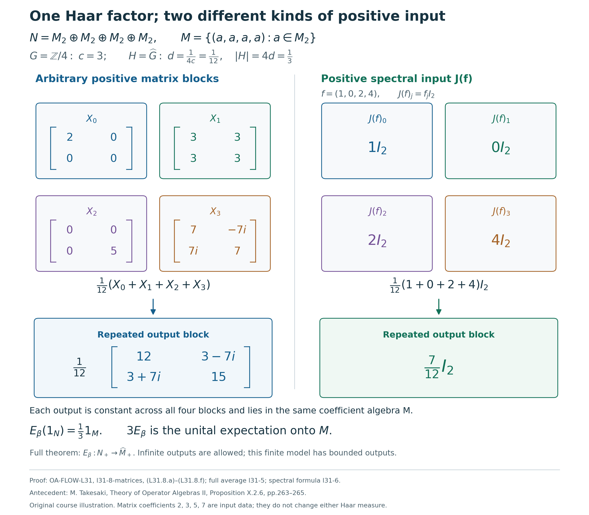

# Haar coordinates and integration after recognition

*Self-checked by the writing AI. Original exposition and illustration sources: CC0 1.0; font components retain their accompanying terms.*

Recognizing a crossed product also identifies the measure class of its eigenunitaries. Their spectral algebra has a normal Haar coordinate, and the action has a canonical operator-valued average. We construct both maps, retain their complete domains and infinite values, and compute the average of every bounded positive spectral function.

## The coefficient inclusion and Haar conventions

Let $G$ be a locally compact Hausdorff abelian group, written additively, and let $H=\widehat G$, written multiplicatively. Fix Plancherel-compatible Haar measures $ds$ and $d\chi$, with the [locally determined completion](OA-FLOW-L24.md#oa-flow.grp.haarconventions). Let $N\ne0$ be a von Neumann algebra, let $\beta:H\to\operatorname{Aut}(N)$ be a point-ultraweakly continuous action by normal star automorphisms, and let $u:G\to\mathcal U(N)$ be a strongly continuous representation with
\[
 \beta_\eta(u_s)=\overline{\eta(s)}u_s.
 \tag{L31.0.a}
\]
The [eigenunitary recognition theorem](OA-FLOW-L29.md#l29-5) supplies
\[
 \begin{gathered}
 M=N^\beta,\qquad \alpha_s=\operatorname{Ad}(u_s)|_M,\qquad
 C=M\rtimes_\alpha G,\qquad P=\pi_\alpha(M)\subset C,\\
 \Phi:C\longrightarrow N,\qquad
 \Phi(\pi_\alpha(a))=a,\qquad \Phi(\lambda_s)=u_s,\qquad
 \Phi\theta_\eta=\beta_\eta\Phi.
 \end{gathered}
 \tag{L31.0.b}
\]
Here $\Phi$ and its inverse are normal, and $\theta$ is the negative-character dual action. We keep the restriction
\[
 \gamma=\Phi|_P:P\longrightarrow M
 \tag{L31.0.c}
\]
explicit: it specifies the target of the transported operator-valued weight. Write $e_s(\chi)=\chi(s)$ and $(\tau_\eta f)(\chi)=f(\eta^{-1}\chi)$. Neither group is assumed sigma compact or metrizable; no state, factor, separable predual or countable Hilbert basis is assumed.

The whole canonical weight on $C$ was constructed in [Normal Schur maps and their extended supremum](OA-FLOW-GDA.md#gda-4), with its [coefficient value algebra](OA-FLOW-GDA.md#gda-5) and [semifiniteness](OA-FLOW-GDA.md#gda-6). Its agreement with the complete dual-action average is proved in [Equality of the extended-positive maps](OA-FLOW-AM.md#am-3). Those are the weight inputs used here. The normal Haar coordinate will be proved below from recognition.

For the zero algebra the averaging identities have their vacuous zero-algebra interpretation. The faithful spectral-coordinate assertion requires $N\ne0$: the nonzero unit of Haar $L^\infty(H)$ cannot map faithfully into the zero algebra.

## 1. Compact tests capture every nonnegative integral

We use the completed locally determined Haar measure on \(H\), as constructed in [Open sigma compact cosets](OA-FLOW-HR.md#hr-08) and [Locally determined Haar measure](OA-FLOW-HR.md#hr-09). Measurability is tested on the open sigma compact cosets, and a nonnegative integral is the supremum of its finite coset subsums. Null classes are determined on every compact restriction. This convention also gives the usual finite-exponent \(L^p\) classes, by [The Haar conventions and their comparison](OA-FLOW-L24.md#oa-flow.grp.haarconventions).

Put
\[
 \mathcal D=\{g\in C_c(H):0\le g\le1\}.
 \tag{L31.1.a}
\]
**Lemma.** For every measurable \(f:H\to[0,\infty]\),
\[
 \int_H f\,d\chi
 =\sup_{L\subset H\ {\rm compact}}\int_L f\,d\chi
 =\sup_{g\in\mathcal D}\int_H gf\,d\chi.
 \tag{L31.1.b}
\]
The convention in the last expression is \(0\cdot\infty=0\). Both equalities include an infinite integral. The set \(\mathcal D\), ordered pointwise, is directed, and its scalar multiplication operators satisfy
\[
 0\le M_g\uparrow I\quad\text{strongly on }L^2(H).
 \tag{L31.1.c}
\]

**Proof.** Choose a compact symmetric neighborhood \(Q\) of the identity that contains the identity, and put \(H_0=\bigcup_{n\ge1}Q^n\). This is a subgroup. It is open because each of its points has a translate of the interior of \(Q\) inside it. The other cosets are open, so \(H_0\) is also closed. The compact sets \(Q^n\) increase and exhaust \(H_0\). For a coset \(D=r_DH_0\), the sets \(r_DQ^n\) are an increasing compact exhaustion. A compact subset of \(H\) meets only finitely many cosets, since the cosets form a disjoint open cover.

Fix a finite set \(F\) of cosets and set \(L_{F,n}=\bigcup_{D\in F}r_DQ^n\). These are compact and increase to \(\bigcup_{D\in F}D\). Sequential monotone convergence on the completed sigma-finite coset restrictions gives
\[
 \sum_{D\in F}\int_D f\,d\chi
 =\sup_n\int_{L_{F,n}}f\,d\chi.
 \tag{L31.1.d}
\]
Taking the supremum over finite \(F\) is exactly the locally determined integral over \(H\). This proves that the integral is at most the supremum of all compact restrictions; the opposite inequality is monotonicity. Only sequences inside finitely many cosets were used in the convergence theorem.

Every compact \(L\) has a cutoff \(g\in\mathcal D\) equal to one on \(L\), by [Compact cutoffs on locally compact Hausdorff spaces](OA-FLOW-TOPOLOGY.md#l138-h0). Thus
\(\int_L f\le\int_Hgf\le\int_Hf\). Conversely \(gf\) vanishes off the compact support of \(g\), and \(gf\le f\). These inequalities prove the second equality in (L31.1.b).

The pointwise maximum of two members of \(\mathcal D\) is another member, proving directedness. For \(h\in C_c(H)\), multiplication by \(g\) fixes \(h\) whenever \(g=1\) on \(\operatorname{supp}h\), and every larger cutoff retains this property. Consequently \(M_gh\to h\). The [compact-continuous density theorem](OA-FLOW-L24.md#oa-flow.grp.translations) gives density of \(C_c(H)\) in \(L^2(H)\). Since \(\|M_g\|\le1\), approximation extends convergence to every vector. The operators are positive and increase with \(g\), which proves (L31.1.c). \(\square\)

The cutoff lemma localizes an integral by multiplying its integrand. It does not assert that an arbitrary measurable function is a pointwise supremum of continuous minorants. In particular, no monotone-convergence theorem for an arbitrary net of measurable representatives has been used.

A consequence needed later is the bounded operator-order identity
\[
 gf\uparrow f\quad\text{in }L^\infty(H)
 \qquad(f\in L^\infty(H)_+,\ g\in\mathcal D).
 \tag{L31.1.e}
\]
Indeed \(M_{gf}=M_gM_f\to M_f\) strongly by (L31.1.c); these operators increase and are bounded by \(M_f\). A bounded increasing net with this strong limit has it as its least upper bound, as one checks on vector quadratic forms. The faithful scalar multiplication representation identifies this with the displayed order identity. Its full von Neumann and predual properties are recalled next.

## 2. The faithful normal Haar coordinate

**Scalar multiplication and arbitrary multiplicity.** Write
\[
 \mathscr L=L^2(H),\qquad
 m(f)=M_f\in B(\mathscr L)
 \quad(f\in L^\infty(H)).
\]
The [Multiplication and predual theorem](OA-FLOW-ND.md#nd-multiplication) proves, for this Haar convention, that \(m\) is faithful and isometric, its image is a von Neumann algebra, and its intrinsic ultraweak topology is precisely the \(L^1(H)\) pairing. In particular \(m\) and its inverse onto its range are normal. The predual identification is concrete:
\[
 \langle M_f\xi,\zeta\rangle
   =\int_H f(\chi)\xi(\chi)\overline{\zeta(\chi)}\,d\chi,
 \qquad \xi\overline\zeta\in L^1(H).
 \tag{L31.2.a}
\]
Every normal vector-series functional on the multiplier algebra has an \(L^1\) density: Cauchy--Schwarz bounds the sum of the \(L^1\) norms of its vector products. Conversely, each \(h\in L^1(H)\) has the factorization
\[
 h=\xi\overline\zeta,\qquad
 \xi=|h|^{1/2},\qquad
 \zeta=\frac{\overline h}{|h|^{1/2}},
 \tag{L31.2.b}
\]
with both functions set to zero where \(h=0\). They are in \(L^2(H)\). These are the two directions of the normality assertion, including all normal functionals rather than only individual vector tests. Faithfulness is also concrete: if \(f\ne0\) as a Haar class, some coset contains a positive finite-measure set on which \(|f|\) is bounded below, and its indicator detects a nonzero multiplier.

Let \(K\ne0\) be any Hilbert space and define
\[
 A(f)=M_f\otimes1_K
 \quad\text{on }\mathscr L\otimes K.
 \tag{L31.2.c}
\]
We verify the full faithful normal representation statement directly. On finite tensor sums, expand the finitely many \(K\)-vectors in an orthonormal basis of their finite-dimensional span. The norm-square estimate on each orthogonal component gives
\(\|A(f)v\|\le\|f\|_\infty\|v\|\). Thus \(A(f)\) extends to the Hilbert completion. Products, adjoints and the identity agree on elementary tensors and hence everywhere, so \(A\) is a unital star representation. Fixing one unit vector \(k\in K\) gives
\[
 \|A(f)(\xi\otimes k)\|=\|M_f\xi\|,\qquad
 \|A(f)\|=\|M_f\|=\|f\|_\infty.
 \tag{L31.2.d}
\]
In particular \(A\) is faithful.

To prove normality without any countability restriction on \(K\), let \(0\le f_i\uparrow f\) be a bounded increasing net in \(L^\infty(H)\). Normality of \(m\) gives \(M_{f_i}\uparrow M_f\). These operators converge strongly: if \(R_i=M_f-M_{f_i}\), then \(0\le R_i\le\|f\|_\infty I\), and
\[
 \|R_i\xi\|^2
 \le\|f\|_\infty\langle R_i\xi,\xi\rangle
 \longrightarrow0.
 \tag{L31.2.e}
\]
The scalar convergence follows from normality of the positive vector functional; the order-to-topology facts for these functionals are proved in [Normal positive functionals and maps](OA-FLOW-NF.md#oa-flow.nf.6). For an elementary tensor,
\[
 \|(A(f_i)-A(f))(\xi\otimes k)\|
 =\|(M_{f_i}-M_f)\xi\|\,\|k\|
 \longrightarrow0.
 \tag{L31.2.f}
\]
The triangle inequality gives convergence on finite tensor sums. The common bound \(\|A(f_i)-A(f)\|\le\|f\|_\infty\), followed by approximation by such sums, gives it on the whole tensor product. Therefore \(A(f_i)\uparrow A(f)\). The full positive-map normality theorem just cited makes \(A\) ultraweakly continuous on its entire domain. This proof uses operator suprema and finite tensor approximations, without a pointwise version of the net \(f_i\).

By [Faithful normal representations and their inverses](OA-FLOW-ST12.md#oa-flow.st.2), \(A(L^\infty(H))\) is a von Neumann algebra and \(A^{-1}\) is normal on that range. This supplies the range and inverse assertions at arbitrary Hilbert multiplicity.

**Characters and continuous compact tests.** Set \(e_s(\chi)=\chi(s)\). The [Character-density proof](OA-FLOW-ND.md#nd-weyl-proof), applied to \(H\), shows that the character span is ultraweakly dense in \(L^\infty(H)\); topological biduality identifies these characters with the \(e_s\), \(s\in G\). To recall the density implication, an \(L^1(H)\) density annihilating every \(e_s\) has zero Fourier transform and therefore is zero. The predual description (L31.2.a)--(L31.2.b) and finite-dimensional separation of an ultraweak neighborhood from a linear subspace give the density. The full scalar Fourier uniqueness argument is part of the cited proof.

Normality of \(A\) transfers this linear density to its range. Since the range is ultraweakly closed,
\[
 \{A(e_s):s\in G\}''
 =A(L^\infty(H)).
 \tag{L31.2.g}
\]
Indeed the generated algebra is contained in the right side, while it contains the ultraweak closure of the image of the character span, which is the entire right side.

We also have
\[
 \overline{C_c(H)}^{\,\sigma(L^\infty,L^1)}
 =L^\infty(H).
 \tag{L31.2.h}
\]
For fixed \(s\), \(ge_s\in C_c(H)\) and \(M_{ge_s}=M_gM_{e_s}\to M_{e_s}\) strongly, with a common norm bound one, by Section 1. Bounded strong convergence is ultraweak convergence, and the normal inverse of \(m\) gives \(ge_s\to e_s\) in \(\sigma(L^\infty,L^1)\). Thus the ultraweak closure of \(C_c(H)\) contains every character, and character density proves (L31.2.h). This is linear ultraweak density; it does not select pointwise continuous approximants to all measurable functions.

**Construction after recognition.** The [Normal recognition isomorphism](OA-FLOW-L29.md#l29-5) gives the unique normal isomorphism \(\Phi:C\to N\) with normal inverse and the prescribed values on \(\pi_\alpha(M)\) and \(\lambda(G)\). Use a faithful normal unital representation of \(M\) on a nonzero Hilbert space \(K\), and realize \(C\) on \(L^2(G,K)\). Recognition includes independence of this regular model. Its group operators are the actual shifts
\
 [\lambda_s\xi=\xi(t-s).
 \tag{L31.2.i}
\]
The arbitrary-Hilbert tensor identification in [Vector integrals and Hilbert tensors](OA-FLOW-L24.md#oa-flow.grp.vectorintegration) identifies \(\mathscr L\otimes K\) with \(L^2(H,K)\), and we use \(A\) on this latter space.

Let
\
 \mathcal F_+:L^2(G,K)\longrightarrow L^2(H,K),
 \qquad
 [\mathcal F_+\xi=\int_G\chi(t)\xi(t)\,dt
 \quad(\xi\in C_c(G,K)).
 \tag{L31.2.j}
\]
This is the onto unitary supplied by [Plancherel with an arbitrary Hilbert target](OA-FLOW-DA.md#da-vector), followed by inversion of the dual variable to change the negative character there to the displayed positive character. Inversion preserves abelian Haar measure, so this change is unitary. The compact-vector integral has the stated value at every character, and represents the corresponding \(L^2\) vector.

For \(\xi\in C_c(G,K)\), Haar substitution \(t=r+s\) gives
\
 \begin{aligned}
 [\mathcal F_+\lambda_s\xi
 &=\int_G\chi(t)\xi(t-s)\,dt\\
 &=\chi(s)\int_G\chi(r)\xi(r)\,dr
 =A(e_s)\mathcal F_+\xi.
 \end{aligned}
 \tag{L31.2.k}
\]
The compact vectors are dense, and both sides define bounded operators. Consequently
\[
 \mathcal F_+\lambda_s\mathcal F_+^*=A(e_s),\qquad
 \mathcal F_+^*A(L^\infty(H))\mathcal F_+
   =\{\lambda_s:s\in G\}''\subseteq C.
 \tag{L31.2.l}
\]
Here the second identity follows from (L31.2.g). The unitary used in this calculation is \(\mathcal F_+\) itself: the factor \(D_u\) in the recognition proof belongs to its comparison with the regular coefficient representation of \(N\), not to (L31.2.k).

**Theorem.** There is a unique faithful normal unital isomorphism, with normal inverse,
\[
 J:L^\infty(H,d\chi)\longrightarrow u(G)'',
 \qquad J(e_s)=u_s.
 \tag{L31.2.m}
\]
It is given by
\[
 J(f)=\Phi\bigl(\mathcal F_+^*A(f)\mathcal F_+\bigr).
 \tag{L31.2.n}
\]

**Proof.** Formula (L31.2.l) places the argument of \(\Phi\) inside its domain \(C\). The map \(A\), unitary conjugation by \(\mathcal F_+^*\), and \(\Phi\) are faithful normal star isomorphisms onto their respective ranges, all with normal inverses. For unitary conjugation this follows directly by pulling back a normal vector-series functional through that fixed unitary, as in the proof of the recognition theorem. Their composite is therefore faithful, normal and unital. The character identity follows from (L31.2.l) and \(\Phi(\lambda_s)=u_s\).

The normal isomorphism \(\Phi\) maps the generated von Neumann algebra \(\{\lambda_s\}''\) onto \(\{u_s\}''\). More explicitly, normality sends the ultraweakly dense generated star algebra to a dense subalgebra of its image, and the normal inverse identifies the two ultraweak closures. Thus the range of (L31.2.n) is exactly \(u(G)''\). Its inverse on that range is
\[
 J^{-1}(b)
 =A^{-1}\bigl(\mathcal F_+\Phi^{-1}(b)\mathcal F_+^*\bigr)
 \qquad(b\in u(G)''),
 \tag{L31.2.o}
\]
and is normal by the same composition argument.

If two normal linear maps from \(L^\infty(H)\) into a von Neumann algebra have the same values on all \(e_s\), every normal functional composed with their difference vanishes on the ultraweakly dense character span, and hence on all of \(L^\infty(H)\). Normal functionals separate the target, so the maps agree. In particular the character values in (L31.2.m) determine \(J\). This proves independence of the faithful coefficient representation and of the regular model, for the specified eigenunitary family \(u\). \(\square\)

Continuous bounded functions are regarded as Haar classes; Haar positivity on nonempty open sets makes this inclusion faithful. The normal Haar coordinate extends the continuous coordinate already constructed in [The continuous spectral coordinate](OA-FLOW-L29.md#l29-1):
\[
 J|_{C_0(H)}=j.
 \tag{L31.2.p}
\]
Indeed, (L31.1.c) gives \(g\uparrow1\) in \(L^\infty(H)\). Normality and unitality of \(J\) imply \(J(g)\uparrow1\), with strong convergence in any faithful normal realization of \(N\). Thus \(J|_{C_0(H)}\) is nondegenerate. Moreover,
\[
 J(ge_s)=J(g)u_s\longrightarrow u_s
 \quad\text{strongly},
 \tag{L31.2.q}
\]
so its multiplier extension takes \(e_s\) to \(u_s\). The uniqueness statement in [The abelian spectral representation lemma](OA-FLOW-WRC.md#wr-spectral) identifies it with \(j\). The Haar \(L^\infty\) coordinate has therefore been obtained after recognition, with the same continuous character measurements.

## 3. Translation on every Haar measurable coordinate

Fix \(\eta\in H\). Translation preserves completed locally determined Haar measurable sets and their compact-local null ideal: the inverse image of a compact set is compact, and Haar invariance preserves nullity on each such restriction. These statements are proved for the full Haar convention in [Locally determined Haar measure](OA-FLOW-HR.md#hr-09) and [Haar translations](OA-FLOW-L24.md#oa-flow.grp.translations). Hence
\
 [\tau_\eta f=f(\eta^{-1}\chi)
 \tag{L31.3.a}
\]
is a well-defined isometric unital star automorphism of \(L^\infty(H)\), with inverse \(\tau_{\eta^{-1}}\).

It is normal on the full measurable algebra. On scalar \(L^2(H)\), the operator
\
 [L_\eta\xi=\xi(\eta^{-1}\chi)
\]
is unitary by Haar invariance, with inverse \(L_{\eta^{-1}}\). Multiplication of representatives for this fixed \(\eta\) gives
\[
 L_\eta M_fL_\eta^*=M_{\tau_\eta f}.
 \tag{L31.3.b}
\]
Since \(m\), its inverse on the multiplication algebra, and conjugation by \(L_\eta\) are normal, so is
\(\tau_\eta=m^{-1}\operatorname{Ad}(L_\eta)m\).
Equivalently its predual is the \(L^1\) isometry \(h(\rho)\mapsto h(\eta\rho)\), because the absolutely convergent pairing satisfies
\[
 \int_H(\tau_\eta f)(\chi)h(\chi)\,d\chi
 =\int_H f(\rho)h(\eta\rho)\,d\rho.
 \tag{L31.3.c}
\]

The spectral algebra \(u(G)''\) is invariant under \(\beta_\eta\), since the eigenrelation sends each generator to a scalar multiple of itself, and the inverse action gives equality of the generated algebras. On every bounded Haar class the coordinate covariance is
\[
 \beta_\eta(J(f))=J(\tau_\eta f)
 \qquad(f\in L^\infty(H),\ \eta\in H).
 \tag{L31.3.d}
\]
For the fixed \(\eta\), both sides define normal maps from \(L^\infty(H)\) into \(N\). On a character,
\[
 \beta_\eta(J(e_s))
 =\overline{\eta(s)}u_s,\qquad
 J(\tau_\eta e_s)
 =J(\overline{\eta(s)}e_s)
 =\overline{\eta(s)}u_s.
 \tag{L31.3.e}
\]
The character-density uniqueness argument from Section 2 proves equality on every \(f\). The argument fixes the translate before using representatives and then extends an equality of normal maps. It requires no common conull set for all translates or all spectral functions.

## 4. Transport the whole weight and its domains

We first specify how extended-positive values pass between the coefficient algebras. For a von Neumann algebra $A$, an element of $\widehat A_+$ is evaluated on $A_*^+$; the value at zero is zero, including when an infinite component is present. We use $0\cdot\infty=0$. The [spectral description](OA-FLOW-EP.md#ep-3) and [cone operations](OA-FLOW-EP.md#ep-4) identify these values with additive, positively homogeneous, norm lower semicontinuous functions on $A_*^+$. Increasing suprema, addition and nonnegative scalar multiplication are computed on those functionals. In particular,
\[
 h\le c1_A\quad\Longrightarrow\quad
 h\text{ is an element of }A_+\text{ with norm at most }c
 \qquad(0\le c<\infty).
 \tag{L31.4.a}
\]

If $A\subset B$ is a unital von Neumann subalgebra, define its extended-positive inclusion by
\[
 \iota_A^B:\widehat A_+\longrightarrow\widehat B_+,
 \qquad (\iota_A^B h)(\omega)=h(\omega|_A).
 \tag{L31.4.b}
\]
Restriction of normal functionals is norm continuous, so the resulting function is lower semicontinuous as well as additive and homogeneous. Thus it defines a full extended-positive value, not just its finite part. Every positive normal functional on $A$ has a positive normal extension to $B$, by the positive vector-series extension in [Every positive normal functional has a positive vector series](OA-FLOW-EP.md#ep-1). Evaluating at these extensions shows that $\iota_A^B$ is injective and reflects order. The other rules follow by evaluation: inclusion preserves increasing suprema, addition, nonnegative scalars and the sandwich operation by $a\in A$. It agrees with ordinary inclusion on bounded positive elements. In particular, a value whose inclusion is bounded by $c1_B$ is itself a bounded member of $A_+$, by (L31.4.a).

For a normal unital star isomorphism $\delta:A\to B$, the corresponding cone isomorphism is
\[
 (\widehat\delta h)(\psi)=h(\psi\circ\delta),
 \qquad \psi\in B_*^+.
 \tag{L31.4.c}
\]
The normality of $\delta$ and its inverse makes the predual pullback a norm homeomorphism. This formula therefore defines an order isomorphism with inverse $\widehat{\delta^{-1}}$. It preserves increasing suprema, addition and nonnegative scalars, and satisfies
\[
 \widehat\delta(a^*ha)=\delta(a)^*(\widehat\delta h)\delta(a).
 \tag{L31.4.d}
\]
Indeed, the sandwich convention is $(a^*ha)(\omega)=h(\omega_a)$, where $\omega_a(z)=\omega(a^*za)$; substitution gives (L31.4.d). Bounded values are transported by $\delta$ and are bounded in both directions. The same formulas transport the infinite spectral projection and the spectral cutoffs of the finite part, as in [Order, sums and bounded conjugation in the extended cone](OA-FLOW-EP.md#ep-4).

Let $T_\alpha:C_+\to\widehat P_+$ be the canonical normal, semifinite, faithful operator-valued weight from [Normal Schur maps and their whole extended supremum](OA-FLOW-GDA.md#gda-4), [The value algebra is precisely the coefficient algebra](OA-FLOW-GDA.md#gda-5), and [Bounded compact-square values, semifiniteness and group scaling](OA-FLOW-GDA.md#gda-6). Define
\[
 E_\beta:N_+\longrightarrow\widehat M_+,
 \qquad E_\beta(x)=\widehat\gamma\bigl(T_\alpha(\Phi^{-1}(x))\bigr).
 \tag{L31.4.e}
\]

**Theorem.** The map $E_\beta$ is a normal, semifinite, faithful operator-valued weight. For $a\in M$ and $x\in N_+$,
\[
 E_\beta(a^*xa)=a^*E_\beta(x)a.
 \tag{L31.4.f}
\]
Its complete finite domains, not merely a chosen core, are
\[
 \begin{aligned}
 \mathfrak n_{E_\beta}
   &:=\{z\in N:E_\beta(z^*z)\in M_+\}
     =\Phi(\mathfrak n_{T_\alpha}),\\
 \mathfrak m_{E_\beta}
   &:=\operatorname{span}\{z^*w:z,w\in\mathfrak n_{E_\beta}\}
     =\Phi(\mathfrak m_{T_\alpha}).
 \end{aligned}
 \tag{L31.4.g}
\]
The finite linear extension is defined on this whole second domain and satisfies
\[
 \dot E_\beta=\gamma\,\dot T_\alpha\,\Phi^{-1}
       \quad\text{on }\mathfrak m_{E_\beta}.
 \tag{L31.4.h}
\]

**Proof.** Additivity and positive homogeneity pass through the three maps in (L31.4.e). If $x_i\uparrow x$ is a bounded increasing net in $N_+$, then $\Phi^{-1}(x_i)\uparrow\Phi^{-1}(x)$. Normality of $T_\alpha$ and preservation of extended-positive suprema by $\widehat\gamma$ give $E_\beta(x_i)\uparrow E_\beta(x)$. If $E_\beta(x)=0$, the injectivity of $\widehat\gamma$, faithfulness of $T_\alpha$, and injectivity of $\Phi^{-1}$ give $x=0$.

For $a\in M$ we have $\Phi^{-1}(a)=\gamma^{-1}(a)\in P$. The $P$-sandwich rule for $T_\alpha$, followed by (L31.4.d), proves (L31.4.f) with its value in $\widehat M_+$. For $y\in C$, the value $T_\alpha(y^*y)$ is bounded exactly when its image under $\widehat\gamma$ is bounded. This proves the first domain equality in (L31.4.g). Multiplicativity and linearity of $\Phi$ prove the second. Since $\mathfrak n_{T_\alpha}$ is ultraweakly dense in $C$ and $\Phi$ is an ultraweak homeomorphism onto $N$, $\mathfrak n_{E_\beta}$ is ultraweakly dense. Thus $E_\beta$ is semifinite.

For completeness, the [finite-domain construction](OA-FLOW-EP.md#ep-6) shows that $\mathfrak n_{E_\beta}$ is a left ideal and an $M$-bimodule, that
\[
 \mathfrak m_{E_\beta}\cap N_+
   =\{x\in N_+:E_\beta(x)\in M_+\},
 \tag{L31.4.i}
\]
and that its finite positive values extend uniquely by differences and complexification to $\dot E_\beta$. Transport of that construction gives exactly (L31.4.h). Consequently, for $x\in\mathfrak m_{E_\beta}$ and $a,b\in M$, $axb\in\mathfrak m_{E_\beta}$ and
\[
 \dot E_\beta(axb)=a\dot E_\beta(x)b.
 \tag{L31.4.j}
\]
Every asserted linear operation here is on the full finite domain, so no subtraction of infinite values occurs. $\square$

## 5. The complete action integral and an explicit dense ideal

For a compact set $L\subset H$, write
\[
 A_L^\beta(x)=\int_L\beta_\eta(x)\,d\eta\in N.
 \tag{L31.5.a}
\]
These bounded ultraweak integrals are normal maps: the predual orbit is norm continuous, its compact integral is a bounded map on $N_*$, and $A_L^\beta$ is its adjoint. This is the construction in [Compact averages and a dense integrable positive cone](OA-FLOW-L29.md#l29-2). If $x\ge0$, the values increase as $L$ increases through compact subsets of $H$, directed by union.

**Theorem.** For every $x\in N_+$ and every $\omega\in N_*^+$,
\[
 E_\beta(x)(\omega|_M)
   =\int_H\omega(\beta_\eta(x))\,d\eta.
 \tag{L31.5.b}
\]
Equivalently, in the entire extended-positive cone of $N$,
\[
 \iota_M^N E_\beta(x)=\sup_{L\subset H\text{ compact}}A_L^\beta(x).
 \tag{L31.5.c}
\]
This includes every bounded positive $x$, whether its average is bounded, unbounded with dense finite form domain, or has a nonzero infinite spectral component.

**Proof.** Put $y=\Phi^{-1}(x)$. Equivariance and normality of $\Phi$, tested on each member of $N_*$, imply
\[
 \Phi\left(\int_L\theta_\eta(y)\,d\eta\right)
       =A_L^\beta(x).
 \tag{L31.5.d}
\]
The [equality of the extended-positive maps](OA-FLOW-AM.md#am-3) proves, on all of $C_+$, that
\[
 \sup_{L\subset H\text{ compact}}\int_L\theta_\eta(y)\,d\eta
       =\iota_P^C T_\alpha(y).
 \tag{L31.5.e}
\]
That proof compares the complete compact average with the directed strict minorants of the Haar weight. It therefore identifies the whole extended-positive value constructed in [Normal Schur maps and their whole extended supremum](OA-FLOW-GDA.md#gda-4), including its infinite part.

The two routes from $\widehat P_+$ to $\widehat N_+$ agree. Indeed, for $h\in\widehat P_+$ and $\omega\in N_*^+$ their evaluations are
\[
 \begin{aligned}
 (\widehat\Phi\,\iota_P^C h)(\omega)
     &=h((\omega\circ\Phi)|_P)\\
     &=h((\omega|_M)\circ\gamma)
       =(\iota_M^N\widehat\gamma h)(\omega).
 \end{aligned}
 \tag{L31.5.f}
\]
Apply $\widehat\Phi$ to (L31.5.e), use (L31.5.d), and preserve the increasing supremum as proved in [Section 4](#l31-4). The result is (L31.5.c). The scalar orbit $\eta\mapsto\omega(\beta_\eta(x))$ is continuous and nonnegative. Its full Haar integral is the supremum of its compact integrals by [the compact-test lemma](#l31-1). Evaluating (L31.5.c) now gives (L31.5.b). $\square$

The complete action integral determines $E_\beta$ uniquely: $\iota_M^N$ is injective by (L31.4.b). In particular, at fixed Haar measure on $H$, any other eigenunitary representation recognizing the same action gives the same weight on the same fixed algebra $M=N^\beta$. Haar translation of the compact sets, or of the nonnegative scalar integral, also gives
\[
 E_\beta\circ\beta_\rho=E_\beta\qquad(\rho\in H).
 \tag{L31.5.g}
\]
The proof uses operator suprema and continuous scalar orbits; it requires no interchange of an arbitrary measurable net with an integral.

There is also a concrete verification of semifiniteness that will be useful for spectral integration. Recall the cutoff family
\[
 \mathcal D=\{g\in C_c(H):0\le g\le1\},
 \tag{L31.5.h}
\]
from Section 1, directed by pointwise order; the maximum of two members is again a member. Then for every $a\in N$ and $g\in\mathcal D$,
\[
 \begin{gathered}
 aJ(g)\in\mathfrak n_{E_\beta},\\
 E_\beta\bigl(J(g)a^*aJ(g)\bigr)
    \le\|a\|^2\left(\int_Hg^2\,d\chi\right)1_M.
 \end{gathered}
 \tag{L31.5.i}
\]
To prove this, use $J(g)=j(g)$ and the [positive-sandwich bound](OA-FLOW-L29.md#l29-2): for every compact $L$,
\[
 A_L^\beta\bigl(J(g)a^*aJ(g)\bigr)
    \le\|a\|^2\left(\int_Hg^2\,d\chi\right)1_N.
 \tag{L31.5.j}
\]
Take the full supremum in (L31.5.c). The inclusion of cones reflects order, so the bound holds in $\widehat M_+$; (L31.4.a) then makes this value a bounded element of $M_+$. This is exactly the first assertion of (L31.5.i), since the sandwich is $(aJ(g))^*(aJ(g))$.

By the [cutoff convergence](#l31-1) and [normal Haar coordinate](#l31-2), $J(g)\uparrow1$ strongly. Thus $aJ(g)\to a$ strongly and ultraweakly for every $a\in N$. This explicitly proves ultraweak density of the left ideal and gives a second proof of semifiniteness. Approximating the identity alone would not prove density: the set $\{1\}\subset M_2(\mathbb C)$ already contains the identity but has only one-dimensional linear span. The sandwiches in (L31.5.i) need not form an increasing net.

## 6. Haar integration of every bounded positive spectral function

**Theorem.** For every $f\in L^\infty(H,d\chi)_+$,
\[
 E_\beta(J(f))=\left(\int_Hf\,d\chi\right)1_M
       \quad\text{in }\widehat M_+.
 \tag{L31.6.a}
\]
When the integral is infinite, the right side evaluates to infinity at every nonzero $\psi\in M_*^+$ and to zero at the zero functional.

**Proof.** First let $q\in C_c(H)_+$. For $q\ne0$, the function $\sqrt q/\|\sqrt q\|_\infty$ belongs to $\mathcal D$. The [compact spectral-square calculation](OA-FLOW-L29.md#l29-2), followed by multiplication by $\|q\|_\infty$, gives
\[
 A_L^\beta(J(q))\ \uparrow\
          \left(\int_Hq\,d\chi\right)1_N
       \quad\text{strongly}.
 \tag{L31.6.b}
\]
Here is the explicit mechanism. The compact average is the continuous spectral multiplier
\[
 A_L^\beta(J(q))=j(b_L),\qquad
 b_L(\chi)=\int_Lq(\eta^{-1}\chi)\,d\eta,
 \qquad 0\le b_L\le\int_Hq\,d\chi.
 \tag{L31.6.c}
\]
For $h\in C_c(H)$, once $L$ contains the compact set $\operatorname{supp}(h)\operatorname{supp}(q)^{-1}$, multiplication by $b_L$ on $h$ is exactly multiplication by $\int_Hq$. Thus (L31.6.b) is eventually an equality on each vector $j(h)\xi$ in a faithful normal representation of $N$. Such vectors have dense linear span by nondegeneracy of $j$. The common operator bound extends convergence to every vector. This proves strong convergence for the compact-set net without a measurable-net convergence assertion. The case $q=0$ is immediate. Equations (L31.5.c) and (L31.6.b), together with the injectivity of cone inclusion, prove (L31.6.a) for $q\in C_c(H)_+$.

Now fix an arbitrary $\psi\in M_*^+$ and define the normal scalar weight
\[
 w(f)=E_\beta(J(f))(\psi),\qquad f\in L^\infty(H)_+.
 \tag{L31.6.d}
\]
Additivity and positive homogeneity follow from those of $J$ and $E_\beta$. If $f_i\uparrow f$ is bounded, normality of $J$ and $E_\beta$ and pointwise evaluation of extended-positive suprema give $w(f_i)\uparrow w(f)$.

Fix $g\in C_c(H)_+$. The compact case makes localization by $g$ finite on every bounded positive function:
\[
 0\le w(gf)\le\|f\|_\infty w(g)
     =\|f\|_\infty\psi(1)\int_Hg\,d\chi<\infty
       \qquad(f\in L^\infty(H)_+).
 \tag{L31.6.e}
\]
It follows that $f\mapsto w(gf)$ extends to a bounded positive linear functional $\ell_g$ on all of $L^\infty(H)$. To see the extension directly, write a self-adjoint $f=f_1-f_2$ with $f_1,f_2\ge0$ and assign the difference of the two finite values. If also $f=k_1-k_2$, then $f_1+k_2=k_1+f_2$, so additivity proves independence of this choice. Complexification gives a linear functional. Positivity and (L31.6.e) bound it on self-adjoint elements, hence on all elements.

The map $f\mapsto gf$ preserves bounded increasing positive suprema: in the multiplication representation it is the fixed sandwich $M_f\mapsto M_{\sqrt g}M_fM_{\sqrt g}$. Normality of $w$ therefore makes $\ell_g$ order normal. The [normal-functional criterion](OA-FLOW-NF.md#oa-flow.nf.6) shows that $\ell_g$ is an ultraweakly continuous functional on the entire algebra.

For $h\in C_c(H)_+$ the compact case applied to $gh$ yields
\[
 \ell_g(h)=\psi(1)\int_Hgh\,d\chi.
 \tag{L31.6.f}
\]
Positive and negative parts of real and imaginary components extend this identity to every $h\in C_c(H)$. The expression on the right defines a bounded normal functional on $L^\infty(H)$, since $g\in L^1(H)$; this is the [concrete predual of the multiplication algebra](OA-FLOW-ND.md#nd-multiplication). The [ultraweak density of $C_c(H)$](#l31-2) now identifies two finite normal functionals and gives
\[
 \ell_g(f)=\psi(1)\int_Hgf\,d\chi
        \qquad(f\in L^\infty(H)).
 \tag{L31.6.g}
\]
Thus the density argument has been applied only after localization has made both sides bounded normal functionals.

Finally let $f\in L^\infty(H)_+$ be arbitrary. As $g$ increases in $\mathcal D$, the products $gf$ increase to $f$ in the von Neumann algebra order: $M_{gf}\le M_f$ and $M_{gf}\to M_f$ strongly by the [cutoff lemma](#l31-1). Normality, (L31.6.g), and the scalar compact-test identity give
\[
 \begin{aligned}
 w(f)&=\sup_{g\in\mathcal D}w(gf)\\
     &=\sup_{g\in\mathcal D}\psi(1)\int_Hgf\,d\chi
       =\psi(1)\int_Hf\,d\chi.
 \end{aligned}
 \tag{L31.6.h}
\]
If $\psi=0$, every term is zero. Otherwise $\psi(1)>0$, so the last equality is valid for both finite and infinite integrals. Testing all $\psi\in M_*^+$ proves (L31.6.a). The proof uses scalar compact tests, finite normal functional localization and an operator supremum. It does not infer equality of possibly infinite weights from agreement on a dense algebra, and it needs neither common pointwise orbit representatives nor a two-variable measurable integral. $\square$

## 7. Finite spectral domains and Haar normalization

For every $f\in L^1(H)\cap L^\infty(H)$, the complete finite-domain statement is
\[
 J(f)\in\mathfrak m_{E_\beta},\qquad
 \dot E_\beta(J(f))=\left(\int_Hf\,d\chi\right)1_M.
 \tag{L31.7.a}
\]
First suppose $f\ge0$. The bounded function $h=\sqrt f$ satisfies
\[
 E_\beta(J(h)^*J(h))=\left(\int_Hf\,d\chi\right)1_M\in M_+.
 \tag{L31.7.b}
\]
Consequently $J(h)\in\mathfrak n_{E_\beta}$ and $J(f)=J(h)^*J(h)\in\mathfrak m_{E_\beta}$. The finite extension agrees there with the positive weight, proving (L31.7.a). For complex $f$, each positive or negative part of its real or imaginary part is bounded and integrable, because it is at most $|f|$. Decompose $f$ into these four positive functions and use the linearity of $J$ and $\dot E_\beta$. This proves membership as well as the integral formula, with no difference of infinite values.

Taking $f=1$ in (L31.6.a) gives
\[
 E_\beta(1)=|H|1_M,\qquad |H|:=\int_H1\,d\chi.
 \tag{L31.7.c}
\]
The total Haar mass is finite precisely when $H$ is compact. Indeed, a compact group has finite positive mass. If $H$ is noncompact, choose a relatively compact nonempty open set $V$. Recursively choose $t_j\in H$ outside the finite union of the compact sets $t_i\overline V\,\overline V^{-1}$ already forbidden. Then the sets $t_jV$ are pairwise disjoint and have the same strictly positive measure. Their finite unions have arbitrarily large mass, so $|H|=\infty$.

In our dual pair, $H$ is compact precisely when $G$ is discrete. For clarity, if $G$ is discrete, every algebraic character is continuous, and the character equations define $\widehat G$ as a closed subgroup of the compact product $\mathbb T^G$. The compact-open topology is the topology of pointwise convergence, since compact subsets of a discrete group are finite. Conversely, for a compact abelian group $H$ the compact-open neighborhood
\[
 \left\{\chi\in\widehat H:
          \sup_{t\in H}|\chi(t)-1|<1\right\}
 \tag{L31.7.d}
\]
contains only the trivial character: any nontrivial subgroup of $\mathbb T$ has an element at distance at least $1$ from $1$, as one sees by taking a suitable power of a nontrivial element. Hence $\widehat H$ is discrete, and topological biduality identifies it with $G$. These are the compactness and biduality arguments in [Haar mass and the discrete endpoint](OA-FLOW-DA.md#da-haar). Since $N\ne0$, also $M\ne0$, so (L31.7.c) is a bounded value exactly when $G$ is discrete.

Suppose now that $G$ is discrete and its Haar measure assigns mass $c>0$ to each singleton. The positive Fourier transform of $1_{\{0\}}$ is the constant function $c$. Plancherel therefore gives
\[
 c=\|1_{\{0\}}\|_{L^2(G)}^2
   =\|c1_H\|_{L^2(H)}^2=c^2|H|,
 \qquad |H|=c^{-1}.
 \tag{L31.7.e}
\]
It follows that
\[
 \mathcal E=c\dot E_\beta:N\longrightarrow M
 \tag{L31.7.f}
\]
is a normal faithful conditional expectation. Here the finite extension is defined on all of $N$: for $x\in N_+$,
\[
 0\le E_\beta(x)\le\|x\|E_\beta(1)
       =c^{-1}\|x\|1_M,
 \tag{L31.7.g}
\]
so every positive element has bounded weight, and (L31.4.i) gives $\mathfrak m_{E_\beta}=N$. The map $\mathcal E$ is positive and unital, is normal and faithful, and is an $M$-bimodule map by Section 4. Since $\beta$ fixes $M$ pointwise, the integral formula gives $\mathcal E(a)=a$ for $a\in M$, so its range is exactly $M$ and it is idempotent. It is contractive as well: $H$ is compact, and the inclusion of $\mathcal E$ in $N$ is the average $c\int_H\beta_\eta(\,\cdot\,)\,d\eta$ with total scalar mass one. Evaluation at a normal functional bounds its norm by one. In particular, counting measure on $G$ gives $c=1$ and $E_\beta$ itself is the conditional expectation.

Finally consider changes of Haar scale. If only $d\chi$ is replaced by $b\,d\chi$, $b>0$, the actual action average becomes $bE_\beta$, by (L31.5.b) and injectivity of cone inclusion. With $ds$ held fixed, the new dual measure is Plancherel-compatible only when $b=1$: the squared Fourier norm of any nonzero compact continuous function is multiplied by $b$, whereas its squared norm on $G$ is unchanged.

If instead $ds'=a\,ds$ and compatibility is retained, then
\[
 d\chi'=a^{-1}d\chi,\qquad
 E_\beta'=a^{-1}E_\beta.
 \tag{L31.7.h}
\]
The comparison of crossed products is the normal isomorphism preserving the named coefficient and group generators. Equivalently, conjugate the regular representations by multiplication by $\sqrt a$ on their $G$ variable; this intertwines both $\pi_\alpha$ and $\lambda_s$. After recognition, both models are the same $N$, and the whole-average identity proves the second equality in (L31.7.h). The Haar coordinate $J$ is unchanged: the measure class of $L^\infty(H)$ is unchanged, and its values $J(e_s)=u_s$ determine it uniquely by [the normal-coordinate construction](#l31-2).

The Fourier operators verify the reciprocal constant directly. On compact continuous vectors $\mathcal F_+'=a\mathcal F_+$, because the source Haar measure was multiplied by $a$. The unitaries from the rescaled Hilbert spaces to the original ones are
\[
 \begin{aligned}
 V_G:L^2(G,a\,ds)&\longrightarrow L^2(G,ds),
       &V_G\xi&=\sqrt a\,\xi,\\
 V_H:L^2(H,a^{-1}d\chi)&\longrightarrow L^2(H,d\chi),
       &V_H\eta&=a^{-1/2}\eta.
 \end{aligned}
 \tag{L31.7.i}
\]
Thus, first on compact continuous vectors and then by density,
\[
 V_H\mathcal F_+'=\mathcal F_+V_G.
 \tag{L31.7.j}
\]
The norm calculation also forces the reciprocal Haar scale: if $d\chi'=b\,d\chi$, unitarity of $a\mathcal F_+$ from $L^2(G,a\,ds)$ requires $a^2b=a$, hence $b=a^{-1}$. There is no group-coordinate inversion in this comparison. At the discrete endpoint $c'=ac$, the normalized expectation is unchanged, since $c'E_\beta'=cE_\beta$.

## 8. Matrix averages, measurable inputs, and nonseparable models

**Four matrix blocks with two different output shapes.** Take \(G=\mathbb Z/4\mathbb Z\) with singleton Haar mass \(c=3\), and write \(H=\widehat G=\{\chi_0,\chi_1,\chi_2,\chi_3\}\), where \(\chi_j(s)=i^{js}\). The compatible dual singleton mass is \(d=1/12\). Indeed, the positive Fourier transform of the identity indicator has constant value \(3\), so Plancherel requires \(3=4d\cdot9\). Thus the total dual Haar mass is \(4d=1/3\).

Set
\[
 N=\bigoplus_{j=0}^3M_2(\mathbb C),\qquad
 [\beta_k(X)]_j=X_{j-k},\qquad
 [u_s]_j=i^{js}I_2.
 \tag{L31.8.a}
\]
All indices are modulo four. These unitaries form a representation, and
\([\beta_k(u_s)]_j=i^{(j-k)s}I_2=i^{-ks}[u_s]_j\), giving the required negative eigencharacter. The fixed algebra \(M\) is precisely the constant tuples \((a,a,a,a)\), and \(\alpha_s=\operatorname{Ad}(u_s)|_M\) is the trivial action.

The algebra generated by \(u(G)\) consists of the scalar-block tuples. To verify both inclusions, each \(u_s\) is such a tuple, while
\[
 p_j=\frac14\sum_{s=0}^3 i^{-js}u_s
 \tag{L31.8.b}
\]
is the projection onto block \(j\). At block \(\ell\), the sum is \(\frac14\sum_{s=0}^3 i^{(\ell-j)s}I_2\), equal to \(I_2\) if \(\ell=j\) and zero otherwise by the finite geometric sum. The \(p_j\) span every scalar-block tuple. Consequently the [normal coordinate of Section 2](OA-FLOW-L31.md#l31-2) is
\(J(f)_j=f(\chi_j)I_2\): it has the prescribed character values, and those characters span all functions on this four-point space.

For an arbitrary positive tuple \(X\), the [whole average](OA-FLOW-L31.md#l31-5) gives
\[
 [E_\beta(X)]_j=\frac1{12}\sum_{r=0}^3X_r
 \quad(j=0,1,2,3).
 \tag{L31.8.c}
\]
The matrix is repeated because, for each fixed output block \(j\), the index \(j-k\) runs once through all four input blocks. Its value lies in \(M_+\), which is a subset of the full target \(\widehat M_+\). Compactness of this finite dual makes every such average bounded.

Consider the positive inputs
\[
 X_0=2e_{11},\quad
 X_1=3\begin{pmatrix}1&1\\1&1\end{pmatrix},\quad
 X_2=5e_{22},\quad
 X_3=7\begin{pmatrix}1&-i\\i&1\end{pmatrix}.
 \tag{L31.8.d}
\]
The two nondiagonal matrices before multiplication by \(3\) and \(7\) are \(vv^*\), with column vectors \(v=(1,1)^T\) and \(v=(1,i)^T\), respectively. The diagonal matrices are positive too. Addition gives the repeated output block
\[
 A=\frac1{12}\begin{pmatrix}12&3-7i\\3+7i&15\end{pmatrix}.
 \tag{L31.8.e}
\]
The nonzero off-diagonal entry shows that \(A\) is not scalar. The coefficients \(2,3,5,7\) belong to the chosen input matrices; they do not alter the Haar masses.

In contrast, for the spectral values \(f(\chi_j)=(1,0,2,4)_j\), [Section 6](OA-FLOW-L31.md#l31-6) gives
\[
 E_\beta(J(f))=\frac7{12}1_M,\qquad
 E_\beta(1_N)=\frac13 1_M,\qquad
 F=3E_\beta,\qquad F(1_N)=1_M.
 \tag{L31.8.f}
\]
Here \(F(X)\) repeats \(\frac14\sum_rX_r\), so it fixes every constant tuple. The positivity and bimodule identity follow directly from the matrix sum; finite dimensionality gives normality. If a sum of positive matrices is zero, every summand is zero by their nonnegative quadratic forms, proving faithfulness. Thus \(F\) is the normal faithful conditional expectation. This also verifies [Section 7's normalization](OA-FLOW-L31.md#l31-7) in a noncommutative coefficient algebra.

*Figure 1. The four left inputs are exactly (L31.8.d); the right inputs are the four blocks of \(J(f)\) for \(f=(1,0,2,4)\). Both columns use dual singleton mass \(1/12\). Their outputs, (L31.8.e) and (L31.8.f), are constant tuples in the same coefficient algebra \(M\cong M_2(\mathbb C)\). The finite example has bounded output; the general map in [Section 5](OA-FLOW-L31.md#l31-5) takes values in all of \(\widehat M_+\). The exact computation is proved [above](OA-FLOW-L31.md#l31-8-matrices), and the full spectral formula is [Section 6](OA-FLOW-L31.md#l31-6). Mathematical antecedent: M. Takesaki, Theory of Operator Algebras II, Proposition X.2.6, pp.263–265; this finite illustration is original course artwork. [Reproduction source](../assets/recognized-dual-integration/render_haar_integration.py), [exact finite data](../assets/recognized-dual-integration/haar-integration-data.json), and [component terms](../assets/recognized-dual-integration/ASSET_TERMS.md).*

**Discontinuous bounded functions and an infinite answer.** Take \(G=\mathbb R\) with measure \(ds\), and \(H=\mathbb R\) with measure \(dp/(2\pi)\) and characters \(\chi_p(s)=e^{isp}\). On \(N=L^\infty(\mathbb R,dp/(2\pi))\), put
\
 [\beta_qf=f(p-q),\qquad u_s(p)=e^{isp}.
 \tag{L31.8.g}
\]
Dominated convergence on each \(L^2\) vector makes \(u\) strongly continuous. The [\(L^1\) translation proof](OA-FLOW-L24.md#oa-flow.grp.translations) makes the predual translations norm continuous, hence \(\beta\) point-ultraweakly continuous. The eigenrelation is \(\beta_q(u_s)=e^{-isq}u_s\).

The fixed algebra is \(\mathbb C1\). The exact [invariant-multiplier proof](OA-FLOW-ND.md#nd-weyl-proof) convolves a fixed bounded function with a compact continuous test, obtains a continuous translation-invariant function, and then uses a weak-star approximate identity. Its argument fixes one translate at a time, so no simultaneous invariant representative is needed. The same earlier proof gives character density in the full multiplication algebra. The identity map therefore has the normal coordinate's entire range and character values, and uniqueness in [Section 2](OA-FLOW-L31.md#l31-2) makes \(J\) the identity.

The bounded-positive formula now reads
\[
 E_\beta(1_{[0,4\pi]})=2,\qquad
 E_\beta\left(\frac1{1+p^2}\right)=\frac12,\qquad
 E_\beta(1_{[0,\infty)})=\infty.
 \tag{L31.8.h}
\]
The first value is \((4\pi)/(2\pi)\). For the second, \((\arctan p)'=(1+p^2)^{-1}\), obtained by differentiating \(\tan(\arctan p)=p\); the inverse tangent tends to \(\pm\pi/2\) at the two ends of the line. The [scalar fundamental theorem](OA-FLOW-SC.md#sc-08) gives \(\int_{-R}^R(1+p^2)^{-1}dp=2\arctan R\), tending to \(\pi\). Division by \(2\pi\) gives \(1/2\). The half-line integral is infinite because its restrictions to \([0,R]\) have values \(R/(2\pi)\) with no finite bound. All three inputs are bounded Haar classes, and the indicator inputs are discontinuous.

If the original Haar measure becomes \(5ds\) while compatibility is preserved, the dual measure becomes \(dp/(10\pi)\). By [Section 7](OA-FLOW-L31.md#l31-7), the finite answers become \(2/5\) and \(1/10\); the last answer remains infinite. The measure class and the coordinate map \(J\) remain unchanged.

**A normal expectation on a nonseparable Hilbert space.** Let \(I\) be uncountable, let \(G=\bigoplus_{i\in I}\mathbb Z/2\mathbb Z\) have the discrete topology and counting Haar measure, and let \(H=\prod_{i\in I}\{1,-1\}\) have its compact product topology and probability Haar measure. Pair them by the finite product \(\chi(s)\). On \(N=L^\infty(H)\), use
\
 [\beta_\eta f=f(\eta^{-1}\chi),\qquad u_s(\chi)=\chi(s).
 \tag{L31.8.i}
\]
The [complete compact-dual example in L29](OA-FLOW-L29.md#l29-7-uncountable) verifies the duality, eigenrelation and continuity at this uncountable scope. In particular, discreteness of \(G\) makes \(u\) continuous; uniform continuity on \(C(H)\), its density in \(L^1(H)\), and translation isometry prove norm-continuous predual orbits.

For clarity, the fixed-algebra argument also gives the integration mechanism. If \(f\) is fixed and \(h\in C(H)\), invariance allows any translate of \(h\) in \(\int fh\). Average this norm-continuous \(C(H)\)-valued orbit over probability Haar measure. Its integral is the constant \(\int h\), so bounded pairing with \(f\) gives \(\int fh=(\int f)(\int h)\). Density in \(L^1\) proves that \(f\) is scalar as an \(L^\infty\) class. Thus \(M=\mathbb C1\). Character density and [normal-coordinate uniqueness](OA-FLOW-L31.md#l31-2) again give \(J=\mathrm{id}\).

Consequently [the full spectral formula](OA-FLOW-L31.md#l31-6) gives
\[
 E_\beta(f)=\int_H f\,d\chi\quad(f\in N_+),\qquad
 E_\beta(1)=1,\qquad \mathfrak n_{E_\beta}=N.
 \tag{L31.8.j}
\]
The ideal assertion follows explicitly: \(E_\beta(x^*x)\le\|x\|^2\) for every \(x\in N\). Thus this is already a normal faithful expectation. For a cylinder event fixing \(m\) distinct coordinates, the \(2^m\) choices of their signs form disjoint events whose union is \(H\). Translations permute them transitively, so Haar invariance and total mass one give
\[
 E_\beta(1_{\text{cylinder}})=2^{-m}.
 \tag{L31.8.k}
\]
This includes \(m=0\). Formula (L31.8.j) applies to every bounded positive Haar class, whether or not it is represented by a cylinder function.

The coordinate characters \(\chi\mapsto\chi_i\) are orthogonal unit vectors in \(L^2(H)\): for distinct indices, translating by a sign flip at one of them negates their inner product, so it is zero. As proved in L29, an uncountable orthonormal family makes this Hilbert space nonseparable. The normal coordinate and expectation require no enumeration of that family, and the compact cutoff \(g=1\) is already available.

## 9. Five tests with complete solutions

**1. Recover a normal map from characters.** Suppose \(J_1,J_2:L^\infty(H)\to B\) are normal unital star homomorphisms into a von Neumann algebra, and \(J_1(e_s)=J_2(e_s)\) for every \(s\in G\). Prove equality without assuming either map faithful.

**Solution.** For \(\omega\in B_*\), the bounded functional \(\omega\circ(J_1-J_2)\) is normal and vanishes on the character span. That span is ultraweakly dense by the [character-density proof](OA-FLOW-ND.md#nd-weyl-proof), as used in [Section 2](OA-FLOW-L31.md#l31-2). Hence this functional vanishes on all of \(L^\infty(H)\). Normal functionals separate \(B\), so
\[
 J_1(f)=J_2(f)\quad(f\in L^\infty(H)).
 \tag{L31.9.a}
\]
Only normality and agreement on the characters enter this uniqueness argument. Faithfulness is needed for the constructed coordinate to be an isomorphism onto the spectral algebra, but is not a premise of this comparison. No countable subset of characters has been selected.

**2. Point evaluation in nonatomic and discrete measure spaces.** Why does evaluation at \(1\) on \(C(\mathbb T)\) fail to extend to a normal state on Haar \(L^\infty(\mathbb T)\)? What happens at a point of a discrete counting-measure space?

**Solution.** Let \(d(z,1)\) be the shorter angular distance and define
\[
 h_n(z)=\max\{1-n d(z,1),0\}.
 \tag{L31.9.b}
\]
These continuous positive contractions decrease to \(1_{\{1\}}\). A Haar singleton in the circle has measure zero: if it had mass \(c>0\), any \(m\) distinct points would have mass \(mc\), contradicting finite total Haar mass. Thus \(h_n\downarrow0\) in \(L^\infty(\mathbb T)\). [Normality on bounded monotone limits](OA-FLOW-NF.md#oa-flow.nf.4), applied to \(1-h_n\), would force the values of a normal state on \(h_n\) to decrease to zero. Evaluation sends them all to one, a contradiction. Moreover a general Haar class does not determine a value at that null singleton, so point evaluation cannot be defined simply by selecting values of arbitrary representatives.

On a discrete counting-measure space, the singleton indicator is a nonzero projection, and evaluation at a point \(x\) is the pairing with \(1_{\{x\}}\in\ell^1\). It is therefore a normal state on \(\ell^\infty\), including for an uncountable discrete space. The nonatomic hypothesis is essential. This is why a continuous spectral representation alone does not justify a normal Haar-coordinate extension; [Section 2](OA-FLOW-L31.md#l31-2) constructs the extension through the actual regular Fourier model.

**3. Alter one Haar measure or a compatible pair.** Give each point of \(G=\mathbb Z\) mass \(c=4\). Find the compatible dual mass, the average of the identity, and the unital expectation. Then triple only dual Haar measure. Finally start again with the compatible pair and double original Haar measure while retaining compatibility.

**Solution.** The Fourier transform of the identity indicator is the constant \(c\). Its squared norms give \(c=c^2|H|\), so \(|H|=1/4\). Write \(E\) for this initial average. [Section 7](OA-FLOW-L31.md#l31-7) gives all three cases:

| Choice of Haar measures | Total dual mass | Actual average | Value at \(1\) | Unital expectation |
| --- | --- | --- | --- | --- |
| Original compatible pair | \(1/4\) | \(E\) | \(\frac14 1_M\) | \(4E\) |
| Only dual measure multiplied by \(3\) | \(3/4\) | \(3E\) | \(\frac34 1_M\) | \(\frac43(3E)=4E\) |
| Original measure multiplied by \(2\), compatibility retained | \(1/8\) | \(E/2\) | \(\frac18 1_M\) | \(8(E/2)=4E\) |

The second row describes the actual action average, but the two measures in that row are not Plancherel compatible. In the third row, the original singleton mass is \(8\) and the compatible dual measure is half its original value. Multiplication by a positive scalar changes neither null classes nor character functions. The character values and uniqueness of the normal coordinate therefore keep \(J\) unchanged in every row.

**4. A spectral truncation value.** Let \(f\) be nonnegative and Haar measurable, possibly unbounded or infinite-valued. Put \(f_n=\min(f,n)\), and define using only bounded positive inputs
\[
 V_f=\sup_n E_\beta(J(f_n))\quad\text{in }\widehat M_+.
 \tag{L31.9.c}
\]
Compute \(V_f\). Does its definition extend the weight's original input domain to every element of \(\widehat N_+\)?

**Solution.** Each \(f_n\) is a bounded positive Haar class, so [Section 6](OA-FLOW-L31.md#l31-6) gives \(E_\beta(J(f_n))=(\int_H f_n)1_M\). The increasing supremum exists by [the extended-cone order theorem](OA-FLOW-EP.md#ep-4). [Sequential monotone convergence](OA-FLOW-SC.md#sc-04) gives
\[
 V_f=\left(\int_Hf\,d\chi\right)1_M.
 \tag{L31.9.d}
\]
At the stated locally determined Haar scope, this scalar equality can also be checked directly: on each finite collection of open sigma compact cosets, monotone convergence gives the limit of the integrals of \(f_n\). Taking the supremum over finite coset collections commutes with the supremum over \(n\), since both are suprema over the same pairs of indices. This includes an infinite final integral. At the zero normal functional all values are zero; at a nonzero positive normal functional, \(\psi(1)>0\) and the scalar formula has exactly the displayed finite or infinite value.

This calculation defines a value for this spectral truncation sequence. It does not assert that \(J(f)\) is a bounded algebra element when \(f\) is unbounded, or supply an extension of \(E_\beta\) to every extended-positive input. The weight used throughout still has input domain \(N_+\); its output domain already includes the whole \(\widehat M_+\).

**5. Infinite output remembers its support.** When is \(E_\beta(1)\) bounded? If \(H\) is noncompact and \(a\in M_+\), compute \(E_\beta(a)\), including nonfull support.

**Solution.** By [Section 7](OA-FLOW-L31.md#l31-7), \(E_\beta(1)=|H|1_M\), and Haar mass is finite exactly when \(H\) is compact, equivalently when \(G\) is discrete. Nondiscreteness of \(H\) does not imply infinite mass: the circle is both nondiscrete and compact.

If \(H\) is noncompact, a fixed coefficient has compact averages \(|L|a\). Their supremum, under the order-preserving and order-reflecting cone inclusion in [the whole-average theorem](OA-FLOW-L31.md#l31-5), is the value of \(E_\beta(a)\). Therefore for \(\psi\in M_*^+\),
\[
 E_\beta(a)(\psi)=
 \begin{cases}
 0,&\psi(a)=0,\\
 \infty,&\psi(a)>0.
 \end{cases}
 \tag{L31.9.e}
\]
Put \(p=s(a)\). The [bounded spectral calculus](OA-FLOW-SF.md#oa-flow.sf1.spectral-calculus) gives \(p_n=1_{[1/n,\infty)}(a)\uparrow p\) and \(a\ge n^{-1}p_n\). If \(\psi(a)=0\), then \(\psi(p_n)=0\) for every \(n\), so normality gives \(\psi(p)=0\). Conversely \(a\le\|a\|p\) implies \(\psi(p)=0\Rightarrow\psi(a)=0\). Thus the two tests vanish on exactly the same positive normal functionals. In the [full extended cone](OA-FLOW-EP.md#ep-3), this says precisely
\[
 E_\beta(a)=\infty\,s(a),\qquad E_\beta(0)=0.
 \tag{L31.9.f}
\]
Here \(\infty p\) means the value zero on functionals vanishing at \(p\), and infinity on the others, with \(0\cdot\infty=0\). It is \(\infty1_M\) exactly when \(p=1_M\), since positive normal functionals separate projections. Faithfulness is consistent with the infinite output: only the zero positive input has average zero.

## Further reading

Masamichi Takesaki, *Theory of Operator Algebras II*, Proposition X.2.6, printed pp. 263–265, relates dual-system recognition to Haar spectral coordinates and action integration. The full extended-positive average and the bounded-positive spectral formula used here are proved in the preceding sections. The coordinate is obtained after recognition; it is not needed in the earlier recognition proof.
