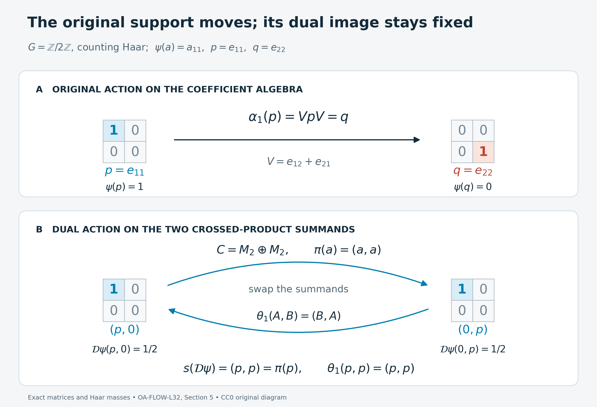

# Supported dual weights: normalization and models

*Self-checked by the writing AI. Original exposition and illustration sources: CC0-1.0; font components retain their accompanying terms.*

A weight can ignore a nonzero corner of its algebra. Crossing with a group preserves that information, although the original action may move the corner. We first give a second uniqueness proof using a common faithful completion, then compute how the Haar scale and the support affect the dual weight. Three models distinguish moving supports, invisible coefficients, and uncountably many finite corners.

## Setting and notation

Let \(G\) be a locally compact Hausdorff abelian group, let \(\alpha\) be a point-ultraweakly continuous action on an arbitrary von Neumann algebra \(M\), and fix a Plancherel-compatible pair \(ds,d\chi\) of Haar measures. Write
\[
 N=M\rtimes_\alpha G,\qquad
 \theta_\chi(\pi(a))=\pi(a),\qquad
 \theta_\chi(\lambda_s)=\overline{\chi(s)}\lambda_s.
\]
The full operator-valued weight is the [dual-action average](OA-FLOW-DA.md#da-equality)
\[
 T:N_+\longrightarrow\widehat{\pi(M)}_+,
 \qquad T(X)=\int_{\widehat G}\theta_\chi(X)\,d\chi.
\]
The integral has extended positive values, determined by all positive normal functionals. For a normal weight \(\psi\) on \(M\), define
\[
 \mathcal D\psi(X)=\widehat{\psi\circ\pi^{-1}}(T(X)).
\]
The hat is the [normal extension to the entire extended positive cone](OA-FLOW-EP.md#oa-flow.ep.5). We use \(0\cdot\infty=0\). A normal semifinite weight need not be faithful; the zero weight is allowed. No faithful normal state, separable predual, or countability hypothesis is imposed.

## 1. The support survives dualization

For a normal weight \(\psi\), let \(s(\psi)\) be the complement of the largest projection of weight zero. The [support proof](OA-FLOW-NWR.md#oa-flow.nwr.1) gives
\[
 \psi(a)=\psi(pap),\qquad p=s(\psi),\quad a\in M_+.
 \tag{L32.1.a}
\]
The support is a projection in the algebra, not the assertion that the total value of the weight is finite.

**Theorem.** Dualization is a bijection from normal semifinite weights on \(M\) to normal semifinite \(\theta\)-invariant weights on \(N\), and
\[
 s(\mathcal D\psi)=\pi(s(\psi)).
 \tag{L32.1.b}
\]
Equality here and below means equality on every positive element, including all infinite values.

**Proof from the earlier correspondence.** The [semifinite target construction](OA-FLOW-NWR.md#oa-flow.nwr.3), [forward semifiniteness proof](OA-FLOW-NWR.md#oa-flow.nwr.4), and [compact-square injectivity](OA-FLOW-NWR.md#oa-flow.nwr.6) give the asserted bijection. To see the support explicitly, put \(p=s(\psi)\), \(q=1-p\). Complete the faithful restriction of \(\psi\) to \(pMp\) by any faithful normal semifinite weight \(\eta\) on \(qMq\); existence on a nonzero corner is [FR1](OA-FLOW-FR.md#oa-flow.fr.1). Define
\[
 \varphi(a)=\psi(pap)+\eta(qaq).
 \tag{L32.1.c}
\]
If \(q=0\), the second term is zero. The block expectation and composition argument of [NWR2–4](OA-FLOW-NWR.md#oa-flow.nwr.2) proves that \(\varphi\) is faithful normal semifinite and \(p\) is fixed by its modular group. In particular this is a proved complementary-corner construction, with no assumption about the sum of arbitrary semifinite weights.

Let \(e=\pi(p)\). The same earlier proof makes \(e\) modular-fixed for \(\mathcal D\varphi\). The bimodule identity for \(T\) and normal extended evaluation give
\[
 \mathcal D\psi(X)=\mathcal D\varphi(eXe),\qquad X\in N_+.
 \tag{L32.1.d}
\]
The extended evaluation in this formula can be checked directly. If bounded \(a_i\uparrow H\) represent any \(H\in\widehat M_+\), then \(pa_ip\uparrow pHp\) represents its compression by [EP4](OA-FLOW-EP.md#oa-flow.ep.4). The arbitrary-approximation identity of [EP5](OA-FLOW-EP.md#oa-flow.ep.5), applied to (L32.1.a), gives \(\widehat\psi(H)=\widehat\varphi(pHp)\). Thus (L32.1.d) includes unbounded and infinite parts of \(T(X)\).

Since \(\mathcal D\varphi\) is faithful, (L32.1.d) vanishes exactly when \(eXe=0\). For a projection \(f\), this is equivalent to \(fe=0\): indeed \(efe=(fe)^*(fe)\). Hence the largest null projection is \(1-e\), proving (L32.1.b). The case \(p=0\) is the zero weight. If \(M=0\), both algebras have their unique zero weight and the assertion has that interpretation. \(\square\)

The dual action fixes \(\pi(p)\). Nothing in this conclusion requires \(\alpha_s(p)=p\). Section 5 gives a case where the original action moves \(p\).

## 2. Uniqueness by a common complementary weight

The compact-square proof in [NWR6](OA-FLOW-NWR.md#oa-flow.nwr.6) establishes injectivity for all normal weights. At the semifinite scope there is a different proof: complete two weights by the same complementary weight and then compress the resulting equality.

We first record the extended-cone addition identity. For any two normal weights \(\psi,\chi\),
\[
 \widehat{\psi+\chi}(H)=\widehat\psi(H)+\widehat\chi(H)
 \quad(H\in\widehat M_+).
 \tag{L32.2.a}
\]
The sum is normal because increasing numerical suprema commute with finite addition of nonnegative values. For a common bounded increasing approximation \(a_i\uparrow H\), EP5 gives
\[
 \widehat{\psi+\chi}(H)
 =\sup_i\bigl(\psi(a_i)+\chi(a_i)\bigr)
 =\sup_i\psi(a_i)+\sup_i\chi(a_i).
 \tag{L32.2.b}
\]
For the last equality, any two approximating indices have a common upper index. This argument covers an infinite supremum by comparison with every finite lower bound. Evaluation at \(T(X)\) now proves
\[
 \mathcal D(\psi+\chi)(X)
 =\mathcal D\psi(X)+\mathcal D\chi(X),\qquad X\in N_+.
 \tag{L32.2.c}
\]
No assertion that \(\psi+\chi\) is semifinite is included in this general identity.

**Proposition.** If \(\psi_1,\psi_2\) are normal semifinite and \(\mathcal D\psi_1=\mathcal D\psi_2\), then \(\psi_1=\psi_2\).

**Proof.** By (L32.1.b), their supports are the same projection \(p\). Choose one faithful normal semifinite \(\eta\) on \((1-p)M(1-p)\), and extend it by compression:
\[
 \chi(a)=\eta((1-p)a(1-p)),\qquad
 \varphi_j=\psi_j+\chi\quad(j=1,2).
 \tag{L32.2.d}
\]
If \(p=1\), use \(\chi=0\). The block construction in Section 1 proves that both \(\varphi_j\) are faithful normal semifinite. Addition gives, without cancellation,
\[
 \mathcal D\varphi_1
 =\mathcal D\psi_1+\mathcal D\chi
 =\mathcal D\psi_2+\mathcal D\chi
 =\mathcal D\varphi_2.
 \tag{L32.2.e}
\]
The [faithful injectivity theorem](OA-FLOW-FR.md#oa-flow.fr.2) gives \(\varphi_1=\varphi_2\) on \(M_+\). Compress this equality to the shared support:
\[
 \psi_1(a)=\varphi_1(pap)
 =\varphi_2(pap)=\psi_2(a),\qquad a\in M_+.
 \tag{L32.2.f}
\]
The complementary term is zero after compression, even when it has infinite values elsewhere. This proves the proposition. \(\square\)

The same argument proves independence of complementary choices in the inverse construction. Suppose an invariant normal semifinite \(\Omega\) has support \(e=\pi(p)\). For each of two choices, [NWR3](OA-FLOW-NWR.md#oa-flow.nwr.3) completes \(\Omega\) in \((1-e)N(1-e)\), applies faithful recognition, and compresses its coefficient weight by \(p\). Denote the resulting weights by \(\psi_1,\psi_2\). That proof gives \(\mathcal D\psi_j=\Omega\) on the whole positive cone. Apply the common coefficient complement just constructed to obtain \(\psi_1=\psi_2\). The two target complements need not coincide.

## 3. Fixing the Haar scale fixes the input weight

Rescale the original Haar measure to \(ds_b=b\,ds\), where \(b>0\). Its Plancherel dual is \(d\chi_b=b^{-1}d\chi\). Identify the regular algebras by their named generators; on the regular Hilbert spaces the unitary from the new measure to the old one is \(\xi\mapsto\sqrt b\,\xi\). It intertwines coefficient operators, translations, and characters.

The [whole-cone Haar comparison](OA-FLOW-DA.md#da-haar) gives
\[
 T_b=b^{-1}T,
 \qquad \mathcal D_b\psi=b^{-1}\mathcal D\psi.
 \tag{L32.3.a}
\]
The second identity follows from homogeneous extended evaluation. Its proof includes the zero weight and every infinite value. If a target weight \(\Omega=\mathcal D\psi\) is held fixed, then
\[
 \mathcal D_b(b\psi)=\Omega.
 \tag{L32.3.b}
\]
By Section 2, \(b\psi\) is its unique normal semifinite input in the rescaled convention. Thus changing the Haar pair changes the recovered input, even though the generators name the same algebra and action.

More generally the [normal-weight sum identities](OA-FLOW-GDA.md#gda-8) give
\[
 \mathcal D(c\psi)=c\,\mathcal D\psi\quad(c\ge0),
 \qquad
 \mathcal D\Bigl(\sum_{i\in I}\psi_i\Bigr)
 =\sum_{i\in I}\mathcal D\psi_i.
 \tag{L32.3.c}
\]
The sums are directed suprema of finite sums on the positive cone and apply to arbitrary normal inputs. If one wishes to use the semifinite correspondence, semifiniteness of the sum remains a separate hypothesis. The identities themselves do not require it.

## 4. What the coefficient restriction can lose

If \(G\) is discrete and \(c=ds(\{0\})\), its dual Haar measure has total mass \(c^{-1}\), as proved in [DA's Haar normalization](OA-FLOW-DA.md#da-haar). Every coefficient is fixed, so bimodularity and \(T(1)=c^{-1}1\) give
\[
 T(\pi(a))=c^{-1}\pi(a),\qquad
 \mathcal D\psi(\pi(a))=c^{-1}\psi(a)
 \quad(a\in M_+).
 \tag{L32.4.a}
\]
In this case the coefficient restriction recovers the entire input. The dual is a state exactly when
\[
 \psi(1)=c.
 \tag{L32.4.b}
\]
Indeed a normal weight with finite value at \(1\) is finite on every bounded positive element by \(a\le\|a\|1\). Its [positive linear extension](OA-FLOW-GW.md#oa-flow.gw.2) is a bounded normal functional. Formula (L32.4.a) at \(1\) is exactly its normalization. Faithfulness is unnecessary.

Suppose instead that \(G\) is nondiscrete. The dual Haar measure then has infinite mass, and the [fixed-coefficient computation](OA-FLOW-DA.md#da-problems) gives
\[
 T(\pi(a))=\infty\,\pi(s(a))\quad(a\in M_+).
 \tag{L32.4.c}
\]
Here \(s(a)\) is the support of the positive element \(a\), and \(\infty s(a)\) means the supremum of \(n s(a)\). It has zero value on the complementary support. This is distinct from the support of a weight.

For any normal \(\psi\),
\[
 \psi(a)=0\quad\Longleftrightarrow\quad\psi(s(a))=0.
 \tag{L32.4.d}
\]
One direction follows from \(a\le\|a\|s(a)\). For the other, the spectral cuts \(p_n=1_{[1/n,\infty)}(a)\) satisfy \(p_n\le n a\) and increase to \(s(a)\). If \(\psi(a)=0\), then \(\psi(p_n)=0\) for all \(n\), and normality gives \(\psi(s(a))=0\). The spectral calculus is the earlier [bounded Borel calculus](OA-FLOW-SF.md#oa-flow.sf1.spectral-calculus).

Extended evaluation of (L32.4.c) therefore yields
\[
 \mathcal D\psi(\pi(a))=
 \begin{cases}
 0,&\psi(a)=0,\\
 \infty,&\psi(a)>0.
 \end{cases}
 \tag{L32.4.e}
\]
The second case includes \(\psi(a)=\infty\). This restriction retains the zero set but loses every positive finite scale. For a nonzero normal semifinite \(\psi\), choose the [finite positive contractions](OA-FLOW-GW.md#oa-flow.gw.4) \(u_i\uparrow1\). Normality and \(\psi(1)>0\) give \(0<\psi(u_i)<\infty\) for some \(i\), so \(\psi\ne2\psi\). These weights have the same coefficient restriction, although Section 2 shows that their full dual weights differ. Section 6 computes a finite positive value away from the coefficient algebra that detects that difference.

Consequently, for nondiscrete \(G\), there is no nonzero finite normal \(\theta\)-invariant weight on \(N\). Such a weight is semifinite and so equals \(\mathcal D\psi\) for a nonzero normal semifinite \(\psi\). Nonzero weights have \(\psi(1)>0\), whereas (L32.4.e) would make \(\mathcal D\psi(1)=\infty\). This contradicts finiteness. In particular there is no invariant normal state. The zero weight still evaluates every extended positive element to zero and belongs to both sides of the correspondence.

## 5. A support moved by the original action

Let \(G=\mathbb Z/2\mathbb Z\) have counting Haar measure. On \(M=M_2(\mathbb C)\), put

\[
 V=\begin{pmatrix}0&1\\1&0\end{pmatrix},\qquad
 p=e_{11},\qquad q=e_{22},\qquad
 \alpha_1=\operatorname{Ad}V,\qquad \psi(a)=a_{11}.
 \tag{L32.5.a}
\]

The input is a normal finite weight with support \(p\). Indeed \(\psi(a)=\langle ae_1,e_1\rangle\), and its restriction to \(pMp=\mathbb Cp\) is faithful. The original action sends \(p\) to \(q\), so neither this support nor this weight is invariant under \(\alpha\).

We will identify the full normal crossed product explicitly. In its regular representation on \(\mathbb C^2\oplus\mathbb C^2\),

\[
 \pi(a)=\begin{pmatrix}a&0\\0&VaV\end{pmatrix},\qquad
 \lambda_1=\begin{pmatrix}0&I\\I&0\end{pmatrix}.
 \tag{L32.5.b}
\]

Let \(W=\operatorname{diag}(I,V)\), and let
\(S=2^{-1/2}\begin{pmatrix}I&I\\I&-I\end{pmatrix}\).
Both are unitaries. Conjugation first by \(W\), then by \(S\), gives

\[
 C=M_2\oplus M_2,\qquad
 \pi(a)=(a,a),\qquad \lambda_1=(V,-V).
 \tag{L32.5.c}
\]

This is an onto identification: \(\pi(V)\lambda_1=(I,-I)\), so the generated algebra contains the two central block projections and then every element of both matrix blocks. Spatial conjugation gives faithfulness and normality in both directions. Thus the calculation identifies the entire crossed product, rather than only an algebra of formal generators.

Identify the two characters with \(\mathbb Z/2\), so that \(\theta_1\) denotes the nontrivial dual automorphism. It fixes the diagonal coefficients and negates \(\lambda_1\). In (L32.5.c) it therefore swaps the two summands. Each point of the dual has Haar mass \(1/2\), so [the complete averaging formula](OA-FLOW-DA.md#da-equality) yields

\[
 T(x_+,x_-)=\pi\!\left(\frac{x_++x_-}{2}\right),\qquad
 \mathcal D\psi(x_+,x_-)
   =\frac{(x_+)_{11}+(x_-)_{11}}2.
 \tag{L32.5.d}
\]

Both terms are normal positive functionals. Their sum is finite and unchanged by the dual swap; its support is exactly \((p,p)=\pi(p)\). In particular,

\[
 \alpha_1(p)=q\ne p,\qquad
 \theta_1(p,p)=(p,p),\qquad
 \mathcal D\psi(p,0)=\mathcal D\psi(0,p)=\frac12.
 \tag{L32.5.e}
\]

The complementary input \(\chi(a)=a_{22}\) makes \(\psi+\chi=\operatorname{Tr}\), as in [the common-complement proof](OA-FLOW-L32.md#l32-2). The supported crossed-product corner is
\((p,p)C(p,p)\cong\mathbb C\oplus\mathbb C\). It cannot be written as the crossed product for a restriction of this original action to \(pMp\): \(\alpha_1\) sends \(pMp\) to the distinct corner \(qMq\), so that proposed restricted action is not defined.

The figure uses the exact matrices in (L32.5.a) and the exact normal chart (L32.5.c). The blue square is \(p=e_{11}\), and the red square is \(q=e_{22}\). The upper arrow is the original conjugation \(p\mapsto VpV=q\). The lower arrows interchange the two crossed-product summands; each carries support \(p\), so the complete support \((p,p)\) is fixed. The two displayed values \(1/2\) use counting Haar measure on \(G\) and mass \(1/2\) at each dual character. The matrix cells represent actual coordinates, not estimates of dimension or measure. Original illustration, data and renderer: CC0-1.0 to the extent of rights held; font terms are retained separately. For human-source context on faithful recognition and the normal-weight extension, see Haagerup I, Theorem 3.7, pp. 116–117, and II, Corollary 3.6, p. 138, in [Further reading](OA-FLOW-L32.md#l32-reading). [Editable SVG](../assets/supported-dual-models/supported-dual-models.svg), [exact data](../assets/supported-dual-models/supported-dual-models-data.json), [renderer](../assets/supported-dual-models/render_supported_dual_models.py), and [font terms](../assets/supported-dual-models/FONT-LICENSE.txt) are included.

## 6. A real Fourier model with invisible coefficients

Let \(\mathbb R\) act trivially on \(M_2\), with ordinary Lebesgue Haar measure \(ds\), and set \(\psi(a)=3a_{11}\). Use [the positive-sign Fourier unitary](OA-FLOW-FF.md#oa-flow.ff.3), applied to the two coordinates as in [FF's vector construction](OA-FLOW-FF.md#oa-flow.ff.4). Equivalently, use the reflected chart for the Fourier convention of DA. Then \(\lambda_s\) is multiplication by \(e^{its}\). The coefficient matrices are constant, and [the character-density proof](OA-FLOW-ND.md#nd-weyl-proof) gives the whole multiplier algebra. Consequently the normal chart and dual action are

\[
 C=M_2\,\overline\otimes\,L^\infty(\mathbb R),\qquad
 (\theta_qF)(t)=F(t-q),\qquad d\chi=\frac{dt}{2\pi}.
 \tag{L32.6.a}
\]

The translation sign follows already on \(e^{its}\): replacing \(t\) by \(t-q\) multiplies it by \(e^{-iqs}\), the prescribed negative dual character. Normality extends the equality to every element of the multiplier algebra.

For every bounded positive measurable matrix field \(F\), the complete weight is

\[
 \mathcal D\psi(F)=\frac{3}{2\pi}\int_{\mathbb R}F_{11}(t)\,dt.
 \tag{L32.6.b}
\]

Here is a whole-cone verification, including an infinite integral. The functional
\(\omega(F)=\int_0^1F_{11}(t)\,dt\) is normal by [the multiplier predual calculation](OA-FLOW-ND.md#nd-multiplication), and its restriction to constant matrices is \(a\mapsto a_{11}\). Apply DA's whole averaging formula, using [EP's extension of a normal positive functional](OA-FLOW-EP.md#oa-flow.ep.5). The nonnegative scalar interchange proved in [FF](OA-FLOW-FF.md#oa-flow.ff.1) gives

\[
 \begin{aligned}
 \mathcal D\psi(F)
 &=3\int_{\mathbb R}\int_0^1 F_{11}(t-q)\,dt\,\frac{dq}{2\pi}\\
 &=\frac{3}{2\pi}\int_0^1\left(\int_{\mathbb R}F_{11}(u)\,du\right)dt
 =\frac{3}{2\pi}\int_{\mathbb R}F_{11}(u)\,du.
 \end{aligned}
 \tag{L32.6.c}
\]

Thus the formula has been proved for every positive field, without assuming integrability in advance.

One can also see its weight properties directly. Integration is additive and positively homogeneous. The integrals over \([-n,n]\) are normal positive functionals, and their increasing supremum is (L32.6.b). Interchanging this supremum with a bounded increasing operator net proves normality. This uses the proved \(L^1\) predual, rather than an arbitrary-net pointwise monotone-convergence assertion. Translation invariance follows from change of variables. The central cutoffs \(1_{[-n,n]}F\) increase to \(F\), and

\[
 \mathcal D\psi(1_{[-n,n]}F)
 \leq\frac{3n}{\pi}\|F\|<\infty.
 \tag{L32.6.d}
\]

They prove semifiniteness. On the corner \((e_{11}\otimes1)C(e_{11}\otimes1)\), the formula is faithful scalar integration, while it vanishes on the complementary corner. Its support is therefore \(e_{11}\otimes1\).

For constant positive matrices the formula has just two outcomes: it is zero if \(a_{11}=0\), and infinite if \(a_{11}>0\). In particular,

\[
 \mathcal D\psi(e_{22}\otimes1)=0,\qquad
 \mathcal D\psi(e_{11}\otimes1)=\infty,\qquad
 \mathcal D\psi(e_{11}\otimes1_{[0,2]})=\frac3\pi.
 \tag{L32.6.e}
\]

Thus a nonzero coefficient can be invisible to the weight, while a bounded positive element in its support has finite positive value. The restriction to constant coefficients records neither the last value nor the numerical density \(3\); the complete weight does.

## 7. Arbitrarily many coordinates with mixed supports

Let \(I\) be any index set, possibly uncountable. For each \(i\in I\), choose a projection \(p_i\in M_2\) of rank zero, one or two, and a finite number \(k_i>0\). No common upper or lower bound on the numbers \(k_i\) is imposed. On the von Neumann product \(M=\prod_{i\in I}M_2\), define

\[
 \psi(a)=\sup_{F\subset I\ {\rm finite}}
          \sum_{i\in F}k_i\operatorname{Tr}(p_i a_i p_i),
 \qquad a\in M_+.
 \tag{L32.7.a}
\]

The supremum is over all finite subsets; there is no enumeration of \(I\). Each coordinate functional is normal: represent the product diagonally on \(\bigoplus_{i\in I}\mathbb C^2\), and write it as a finite sum of vector functionals. The union of two finite subsets gives the common upper index needed for additivity. For a bounded increasing net \(a_j\uparrow a\), normality of each finite sum and interchange of the two suprema give

\[
 \psi(a)
 =\sup_F\sup_j\sum_{i\in F}k_i\operatorname{Tr}(p_i(a_j)_i p_i)
 =\sup_j\psi(a_j).
 \tag{L32.7.b}
\]

This is also exactly [WS1's arbitrary-sum proof](OA-FLOW-WS.md#oa-flow.weight-sum.ws1). Homogeneity includes zero with \(0\cdot\infty=0\).

Let \(z_F\) be the central projection selecting the finitely many coordinates in \(F\). The net \(z_Fa\) increases to \(a\), and

\[
 \psi(z_Fa)\leq
 \|a\|\sum_{i\in F}k_i\operatorname{rank}(p_i)<\infty.
 \tag{L32.7.c}
\]

Hence \(\psi\) is semifinite. Put \(p=(p_i)_{i\in I}\). Compression by \(p\) leaves every summand in (L32.7.a) unchanged. On \(pMp\), a nonzero positive element has a nonzero positive coordinate, whose faithful finite-dimensional trace contributes strictly positively. Thus the support is exactly \(p\), including the all-zero choice.

The complementary weight and faithful completion are explicit:

\[
 \begin{aligned}
 \chi(a)&=\sum_{i\in I}k_i
     \operatorname{Tr}((1-p_i)a_i(1-p_i)),\\
 (\psi+\chi)(a)&=\sum_{i\in I}k_i\operatorname{Tr}(a_i).
 \end{aligned}
 \tag{L32.7.d}
\]

Every sum means the finite-subset supremum. The equality follows coordinatewise from the trace and then by taking a common finite subset for the two nonnegative sums. The same finite-coordinate proof gives normality and semifiniteness of both weights. Their supports are \(1-p\) and \(1\), respectively. The full weight is the complementary block completion in [Section 2](OA-FLOW-L32.md#l32-2); in particular \(p\) lies in its centralizer. Equivalently, each coordinate has scalar trace density \(k_iI\), which commutes with \(p_i\).

If \(I\) is uncountable, \(M\) has no faithful normal state. In fact it has no faithful state at all. If \(f\) were one, every nonzero central coordinate projection \(z_{\{i\}}\) would have positive value, while the sum of any finite family of these values would be at most one. For each positive integer \(n\), only finitely many could have value at least \(1/n\). Every positive value belongs to one of these countably many finite sets, contradicting uncountability. The normal semifinite weights just constructed do not require such a state.

Now let \(\mathbb Z/2\) act trivially on \(M\), with counting Haar measure. The two-point regular representation is \(\pi(a)=\operatorname{diag}(a,a)\) and \(\lambda_1=\begin{pmatrix}0&I\\I&0\end{pmatrix}\) on \(H\oplus H\), for any faithful normal representation \(M\subset B(H)\). The same scalar Hadamard unitary \(S\) from [Section 5](OA-FLOW-L32.md#l32-5) sends \(\lambda_1\) to \(\operatorname{diag}(I,-I)\) and leaves every \(\pi(a)\) diagonal. The resulting central block projections generate both copies of \(M\). Thus this is a normal spatial isomorphism
\(C=M\oplus M\), valid without any dimension or countability restriction. The dual action swaps the two blocks, and its whole average gives

\[
 \mathcal D\psi(a_+,a_-)
    =\frac12\bigl(\psi(a_+)+\psi(a_-)\bigr),\qquad
 s(\mathcal D\psi)=(p,p).
 \tag{L32.7.e}
\]

The identity holds even when either value is infinite. It follows from the bounded average \(\pi((a_++a_-)/2)\), additivity and homogeneity of \(\psi\). The two-block finite-coordinate cutoffs \((z_Fa_+,z_Fa_-)\) increase to \((a_+,a_-)\) and have finite dual weight, verifying semifiniteness directly. Rank-zero, rank-one and rank-two supports may all occur in the same example; if every \(p_i=0\), both weights in (L32.7.e) are zero. For \(I=\varnothing\), the zero-algebra convention gives the same endpoint.

## 8. Five diagnostics with complete solutions

### 1. Which action fixes the support?

In [the inner two-point model](OA-FLOW-L32.md#l32-5), determine the supports of the input and dual weights. Test invariance under the original and dual actions, and decide whether the supported corner comes from restricting the original action.

**Solution.** The input density is \(p=e_{11}\), so its support is \(p\). Since \(VpV=q=e_{22}\), the original action moves the support. Moreover \(\psi(\alpha_1(p))=\psi(q)=0\), while \(\psi(p)=1\), so the weight is not invariant either. Formula (L32.5.d) has support \((p,p)\) and is unchanged by swapping its two positive terms. Both the dual weight and its support are invariant under the dual action. Finally \(\alpha_1(pMp)=qMq\ne pMp\). There is no restriction of this action to \(pMp\), although the corner \((p,p)C(p,p)\cong\mathbb C\oplus\mathbb C\) exists.

### 2. Can two complementary completions recover different inputs?

Let \(\Psi\) be a normal semifinite dual-invariant weight with support \(e\). Suppose \(\Xi_1,\Xi_2\) are dual-invariant normal semifinite weights with support \(1-e\), and each \(\Psi+\Xi_j\) is faithful and semifinite. Apply faithful recognition to get coefficient weights \(\varphi_j\). Show that their supporting compressions agree, including when some displayed values are infinite.

**Solution.** The support belongs to the coefficient algebra by [NWR1](OA-FLOW-NWR.md#oa-flow.nwr.1), so write \(e=\pi(p)\). Each sum is a complementary block weight, and [NWR2–3](OA-FLOW-NWR.md#oa-flow.nwr.2) put \(e\) in its centralizer. The faithful modular restriction in [GDA8](OA-FLOW-GDA.md#gda-8) then puts \(p\) in the centralizer of \(\varphi_j\). Set \(\psi_j(a)=\varphi_j(pap)\). These are normal semifinite weights with support \(p\), and [the full extended compression identity](OA-FLOW-L32.md#l32-1) gives

\[
 \mathcal D\psi_j(X)
   =(\Psi+\Xi_j)(eXe)=\Psi(X),\qquad X\in N_+.
 \tag{L32.8.a}
\]

The complementary term is zero after compression. Choose one common normal semifinite complementary coefficient weight \(\chi\), faithful on \((1-p)M(1-p)\). As in [Section 2](OA-FLOW-L32.md#l32-2), both \(\psi_j+\chi\) are faithful normal semifinite and have equal duals, because each dual is \(\Psi+\mathcal D\chi\). [FR2's faithful injectivity](OA-FLOW-FR.md#oa-flow.fr.2) identifies those coefficient weights. Evaluation on \(pap\) now gives \(\psi_1(a)=\psi_2(a)\). The proof only adds nonnegative values and compresses; it never subtracts an infinite summand.

### 3. What happens at the endpoints?

Explain why zero is included in the supported-weight correspondence. Describe the inverse when the target support is zero or one. Can a nondiscrete crossed product have a nonzero dual-invariant normal state?

**Solution.** The zero weight is normal and finite on every positive element, hence semifinite. Its normal extension is zero on every extended-positive element, by [EP5](OA-FLOW-EP.md#oa-flow.ep.5), so its dual is zero even when \(T(X)\) has an infinite part. A target with zero support is itself zero. Completing it faithfully and then compressing by zero recovers zero. A target with support one is already faithful, so the complementary weight is zero and the inverse is the faithful inverse. For nondiscrete \(G\), a nonzero invariant normal state would have a nonzero normal semifinite input \(\psi\). Such an input has \(\psi(1)>0\), and [the coefficient dichotomy](OA-FLOW-L32.md#l32-4) would give \(\mathcal D\psi(1)=\infty\), contradicting the state value one.

### 4. Which normalization changes with Haar measure?

In [the real model](OA-FLOW-L32.md#l32-6), replace \(ds\) by \(4ds\) while keeping the target weight fixed. Find the new input and dual Haar measure. For a discrete group with singleton mass \(c>0\), give the exact condition for the dual of a possibly nonfaithful finite input to be a state.

**Solution.** [Paired Haar scaling](OA-FLOW-L32.md#l32-3) replaces the dual measure by \(dt/(8\pi)\) and the recovered coefficient weight by \(4\psi(a)=12a_{11}\). Their product is unchanged:

\[
 12\int_{\mathbb R}F_{11}(t)\,\frac{dt}{8\pi}
   =\frac{3}{2\pi}\int_{\mathbb R}F_{11}(t)\,dt.
 \tag{L32.8.b}
\]

In the discrete case the coefficient formula at the identity is \(\mathcal D\psi(1)=c^{-1}\psi(1)\). A normal positive weight with finite value at one is a bounded normal positive functional: every \(0\le a\le\|a\|1\) has value at most \(\|a\|\psi(1)\), and its additive positive-cone map extends linearly. Thus the dual is a state exactly when \(\psi(1)=c\). Faithfulness is irrelevant to this criterion.

### 5. Does an infinite ambient algebra force every nonzero value to be infinite?

In [the product model](OA-FLOW-L32.md#l32-7), suppose some \(p_i\ne0\). Find a nonzero positive element with finite positive weight. If some \(p_j\ne1\), find a nonzero positive element with weight zero. Explain why these features and the lack of a faithful normal state cause no failure of the correspondence.

**Solution.** Take \(a\) supported at the single coordinate \(i\), with \(a_i=p_i\). Then

\[
 \psi(a)=k_i\operatorname{rank}(p_i)\in(0,\infty).
 \tag{L32.8.c}
\]

If \(p_j\ne1\), the single-coordinate projection \(b_j=1-p_j\), with all other coordinates zero, is nonzero and satisfies \(\psi(b)=0\). Normality follows from (L32.7.b), and the entire net of finite-coordinate cutoffs proves semifiniteness. Those are the hypotheses of the supported-weight correspondence; no faithful normal state is needed. The dual has exactly support \((p,p)\). It therefore retains the zero coordinates and the rank-one null complements while still having many finite positive values.

## Further reading

Uffe Haagerup, [*On the dual weights for crossed products of von Neumann algebras I*](https://journals.msp.org/mscand/article/view/1879), Math. Scand. 43 (1978), Theorem 3.7, pp. 116–117, proves faithful normal semifinite recognition; its following remark announces the normal-weight extension. [Part II](https://journals.msp.org/mscand/article/view/1878), Corollary 3.6, p. 138, constructs that extension and gives scalar, addition, and compact-square identities. These articles provide the source context for the earlier full proofs in [FR](OA-FLOW-FR.md#oa-flow.fr.2) and [NWR](OA-FLOW-NWR.md#oa-flow.nwr.6). The complementary uniqueness argument and the concrete supported models above make the support and normalization explicit.
