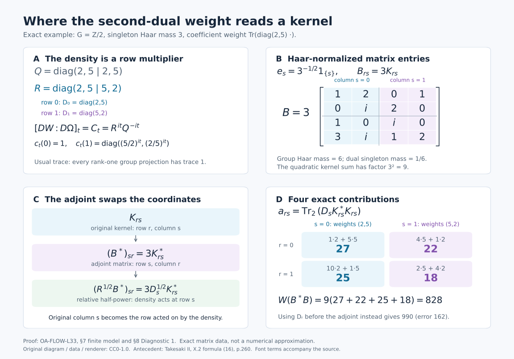

# The second dual weight and its normalization

*Self-checked by the writing AI. Original exposition and illustration sources: CC0-1.0; font components retain their accompanying terms.*

Crossing an abelian action twice gives a tensor algebra. To determine its weight, one must also fix the scale. The modular automorphisms alone leave a central density undetermined. We determine that density by following finite GNS vectors through Fourier transformation, placing their adjoints in the complete relative square-root domain, and comparing bounded normal functionals. The resulting equality applies to every positive element, including elements of infinite weight.

## Setting and conventions

Let \(G\) be any locally compact Hausdorff abelian group, with dual \(\widehat G\), and fix Plancherel-compatible Haar measures. Let \(M\ne0\) be a von Neumann algebra, \(\varphi\) a faithful normal semifinite weight, and \(\alpha:G\to\operatorname{Aut}(M)\) a point-ultraweakly continuous action. There is no assumption of a faithful normal state, a countable Hilbert basis, a separable predual, or invariance of \(\varphi\) under \(\alpha\). Inner products are linear in the first variable. Both dual actions use negative characters.

We use the full normal coordinate from [Two crossed products and the surviving action](OA-FLOW-ND.md#nd-construction), the actual dual weights from [A dual weight from compact coefficient graphs](OA-FLOW-GDW.md#gdw-6), and the usual trace and full tensor GNS model from [Tensoring a weight with the usual trace](OA-FLOW-TW.md#tw-4). A rank-one projection has trace one. All group-valued Hilbert spaces have the qualified Haar conventions of [Radon representation, qualified products and Haar measure](OA-FLOW-HR.md#hr-09). The proofs below retain these conventions when passing from compact vector functions to Hilbert-space completions.

The zero-algebra case has only zero weights and zero Hilbert spaces; its assertions are vacuous. The nonzero case below has faithful nondegenerate GNS representations.

## 1. Coordinates and the two weights to be compared

Let \(G\) be a locally compact Hausdorff abelian group, written additively, and let \(H=\widehat G\). Fix Plancherel-compatible Haar measures \(ds\) on \(G\) and \(d\chi\) on \(H\). Let \(M\ne0\) be a von Neumann algebra, let \(\alpha:G\to\operatorname{Aut}(M)\) be point-ultraweakly continuous, and let \(\varphi\) be faithful normal semifinite. Neither \(G\) nor a Hilbert space representing \(M\) is assumed separable or countable. The action need not preserve \(\varphi\), and \(M\) need not admit a faithful normal state.

We use the [locally determined Haar convention](OA-FLOW-L24.md#oa-flow.grp.haarconventions). For finite exponents it is canonically the completed Radon \(L^p\) space; every individual integrable class has a representative on a sigma compact carrier. Hilbert-valued spaces mean the [proved Hilbert tensor realizations](OA-FLOW-L24.md#oa-flow.grp.vectorintegration). Product substitutions will be checked on compact continuous vector fields and extended by Hilbert completion. For integrals of representatives we use the [Radon-product theorem with its carrier condition](OA-FLOW-HR.md#hr-05). No unrestricted Fubini assertion for a non-sigma-finite product is needed.

Write
\[
N=M\rtimes_\alpha G,\qquad P=N\rtimes_\theta H,
\]
with named generators \(i(x),\lambda_s\) in \(N\), and \(j(n),\ell_\chi\) in \(P\). Our dual action uses negative characters:
\[
\theta_\chi(i(x))=i(x),\qquad
\theta_\chi(\lambda_s)=\overline{\chi(s)}\lambda_s.
\tag{L33.1.a}
\]
The [normal duality theorem](OA-FLOW-ND.md#nd-construction) gives a normal star isomorphism with normal inverse
\[
\Phi:P\longrightarrow A=M\bar\otimes B(L^2(G)).
\tag{L33.1.b}
\]
In any faithful normal representation of \(M\), its values on the three generating families are
\
\begin{aligned}
[\Phi(j(i(x)))\xi&=\alpha_{-r}(x)\xi(r)=:A_x\xi,\\
\Phi(j(\lambda_s))\xi&=\xi(r-s)=:L_s\xi,\\
\Phi(\ell_\chi)\xi&=\overline{\chi(r)}\xi(r)=:Q_\chi\xi.
\end{aligned}
\tag{L33.1.c}
\]
Scalar operators on \(L^2(G)\) are written without the tensor identity. The coefficient \(A_x\) is the orbit multiplier \(\alpha_{-r}(x)\). The [orbit-field and Weyl-pair proof](OA-FLOW-ND.md#nd-orbits) says that these three families generate all of \(A\), at arbitrary Hilbert multiplicity. In particular the first family is not being replaced by the constant copy \(x\otimes1\).

Let \(\widetilde\varphi\) and \(\widetilde{\widetilde\varphi}\) be the actual dual weights obtained by applying [GDW's whole-cone construction](OA-FLOW-GDW.md#gdw-6) first to \((M,\alpha,\varphi)\) and then to \((N,\theta,\widetilde\varphi)\). Its normal representation transport lets both constructions be taken in a common faithful normal model. On \(A\) put
\[
W=\widetilde{\widetilde\varphi}\circ\Phi^{-1},
\qquad
\Omega=\varphi\otimes\operatorname{Tr}_{L^2(G)}.
\tag{L33.1.d}
\]
Both are faithful normal semifinite on their entire positive cones: this follows from GDW and normal transport for \(W\), and from [TW Sections 1–3](OA-FLOW-TW.md#tw-2) for \(\Omega\). The trace is the usual operator trace,
\[
\operatorname{Tr}(\theta_{u,u})=\|u\|_2^2,\qquad
\theta_{u,v}\xi=\langle\xi,v\rangle u.
\tag{L33.1.e}
\]
Thus a rank-one projection has trace one. [TW's full tensor GNS and modular calculation](OA-FLOW-TW.md#tw-4) supplies
\[
H_\Omega=H_\varphi\otimes HS(L^2(G)),\qquad
\Lambda_\Omega(b\otimes k)=\Lambda_\varphi(b)\otimes k,
\quad
\sigma_t^\Omega=\sigma_t^\varphi\otimes\mathrm{id},
\tag{L33.1.f}
\]
for \(b\in\mathfrak n_\varphi\), \(k\in HS(L^2(G))\), with its complete finite and spectral domains. Its [modular identity](OA-FLOW-TW.md#tw-5) concerns every element of \(A\).

The normalized formula to be proved is
\[
[DW:D\Omega]_t=C_t,\qquad
C_t\xi=c_t(r)\xi(r),\qquad
c_t(r)=[D(\varphi\circ\alpha_r):D\varphi]_t.
\tag{L33.1.g}
\]
We will first construct the weight having the displayed derivative. Actual GNS vectors of \(W\) will then determine whether it is that weight, including its absolute normalization.

Here are the finite coefficients used for this comparison. Let \(\mathcal K_\alpha\) be the algebra of norm-bounded, strongly-star continuous, compactly supported \(M\)-valued functions, with the convolution and involution of [GDW-1](OA-FLOW-GDW.md#gdw-1). In additive unimodular notation,
\[
f^\sharp(t)=\alpha_{-t}(f(-t)^*),\qquad
\mathfrak b_\varphi
 =\operatorname{span}\{k(\,\cdot\,)a:k\in\mathcal K_\alpha,\ a\in\mathfrak n_\varphi\},
\qquad
B_\varphi=\mathfrak b_\varphi\cap\mathfrak b_\varphi^\sharp .
\tag{L33.1.h}
\]
Identify the first crossed product with its normal image \(\Phi(j(N))\subset A\). Its right-coefficient integrated convention is
\[
F_\alpha(f)=\int_G L_tA_{f(t)}\,dt.
\tag{L33.1.i}
\]
The notation on \(N\) before applying \(\Phi j\) means the same integral with \(\lambda_ti(f(t))\). The class \(\mathfrak b_\varphi\) is a convolution left ideal. Its definition does not make it a right \(M\)-module. For every \(f\in\mathfrak b_\varphi\), [GDW25](OA-FLOW-GDW.md#equation-gdw25) proves
\[
F_\alpha(f)\in\mathfrak n_{\widetilde\varphi},
\qquad
\Lambda_{\widetilde\varphi}(F_\alpha(f))
 \longleftrightarrow \eta_f,\quad
\eta_f(t)=\Lambda_\varphi(f(t))\in C_c(G,H_\varphi).
\tag{L33.1.j}
\]
The statement about the weight is read in the first crossed product. If \(f=\sum_{\ell=1}^m k_\ell a_\ell\), its vector is the finite sum
\(\eta_f(t)=\sum_\ell k_\ell(t)\Lambda_\varphi(a_\ell)\); no unbounded GNS map has been passed through an integral. [GDW-2](OA-FLOW-GDW.md#gdw-2) proves that \(\eta_f\), \(f\in B_\varphi\), span densely in \(L^2(G,H_\varphi)\), and that \(F_\alpha(B_\varphi)\) is a nondegenerate star algebra with ultraweak closure equal to the first crossed product.

## 2. A prescribed cocycle and the remaining central density

Work in the faithful normal standard GNS representation of \(\varphi\), identifying \(M\) with its image. [GDW29](OA-FLOW-GDW.md#equation-gdw29) proves that
\[
(r,t)\longmapsto c_t(r)
\quad\text{is jointly strongly-star continuous}.
\tag{L33.2.a}
\]
This is a theorem derived there from the already constructed first dual weight, so it is available before making any claim about the second weight.

For fixed \(t\), multiplication by \(c_t(r)\) maps \(C_c(G,H_\varphi)\) continuously into itself and preserves the \(L^2\) norm. Multiplication by \(c_t(r)^*\) is its inverse. Hence it extends to the unitary \(C_t\) in (L33.1.g). It commutes with every \(a'\otimes1\), \(a'\in M'\), since each \(c_t(r)\) lies in \(M\). The [arbitrary-Hilbert tensor commutant identity](OA-FLOW-ND.md#nd-tensor)
\[
(M'\otimes1_{L^2(G)})'=M\bar\otimes B(L^2(G))
\]
therefore puts \(C_t\) in \(A\). This proves the algebra membership actually needed for cocycle reconstruction.

For a compactly supported continuous vector \(\xi\), joint continuity gives
\[
\sup_{r\in\operatorname{supp}\xi}
 \|(c_t(r)-c_{t_0}(r))\xi(r)\|\longrightarrow0
 \quad(t\to t_0).
\]
Indeed the norm is a continuous function of \((r,t)\), zero on the compact set with \(t=t_0\); finitely many product neighborhoods give a common time neighborhood. Multiplying its squared supremum by the finite Haar measure of the support proves \(L^2\) convergence. Density and the common unitary bound extend it to every vector, and the same reasoning for adjoints proves strong-star continuity of \(C_t\). The [faithful normal bounded-topology theorem](OA-FLOW-ST12.md#oa-flow.st.2) gives its intrinsic meaning in \(A\).

The [balanced cocycle identities](OA-FLOW-BC.md#oa-flow.bc.4) imply pointwise
\(c_{t+u}(r)=c_t(r)\sigma_t^\varphi(c_u(r))\).
In our representation, \(\sigma_t^\varphi\otimes\mathrm{id}\) is implemented by the constant operator \(\Delta_\varphi^{it}\) on the coefficient Hilbert factor. Thus its action on this multiplier is multiplication by \(\sigma_t^\varphi(c_u(r))\), and (L33.1.f) gives
\[
C_{t+u}=C_t\sigma_t^\Omega(C_u),\qquad C_0=1.
\tag{L33.2.b}
\]
The [unitary-cocycle reconstruction theorem](OA-FLOW-UR.md#ur-3), with the [exact derivative and uniqueness proof](OA-FLOW-UR.md#ur-5), now gives a unique faithful normal semifinite weight \(\Psi\) on all of \(A_+\) such that
\[
[D\Psi:D\Omega]_t=C_t,\qquad
\sigma_t^\Psi=\operatorname{Ad}(C_t)
                  (\sigma_t^\varphi\otimes\mathrm{id}).
\tag{L33.2.c}
\]
The numerator and its scale are fixed by this normalized derivative.

We next compare the modular groups of this weight and \(W\). Pullback transport and the cocycle intertwining identity give
\[
\operatorname{Ad}(c_t(r))\sigma_t^\varphi
 =\sigma_t^{\varphi\circ\alpha_r}
 =\alpha_{-r}\sigma_t^\varphi\alpha_r.
\tag{L33.2.d}
\]
Here the first equality is [BC19](OA-FLOW-BC.md#oa-flow.bc.4); the second is [full modular transport under a normal isomorphism](OA-FLOW-CT.md#oa-flow.ct.1). Applying it to \(\alpha_{-r}(x)\) yields the \(A_x\) formula below. For the shift, the ordered chain rule and [normal-isomorphism covariance](OA-FLOW-BC.md#oa-flow.bc.5) give
\[
\begin{aligned}
c_t(r)c_t(r-s)^*
 &=[D(\varphi\circ\alpha_r):D(\varphi\circ\alpha_{r-s})]_t\\
 &=\alpha_{s-r}(c_t(s)).
\end{aligned}
\tag{L33.2.e}
\]
Indeed the two weights in the middle line are the pullbacks of
\(\varphi\circ\alpha_s\) and \(\varphi\) by \(\alpha_{r-s}\).
On a compact vector section, conjugating \(L_s\) by \(C_t\) gives
\(c_t(r)c_t(r-s)^*\xi(r-s)\). Equation (L33.2.e) identifies it with
\(L_sA_{c_t(s)}\xi\). Scalar \(Q_\chi\) commutes with \(C_t\) and is fixed by \(\sigma^\Omega\). Consequently
\[
\begin{aligned}
\sigma_t^\Psi(A_x)&=A_{\sigma_t^\varphi(x)},\\
\sigma_t^\Psi(L_s)&=L_sA_{c_t(s)},\\
\sigma_t^\Psi(Q_\chi)&=Q_\chi.
\end{aligned}
\tag{L33.2.f}
\]
The factor \(A_{c_t(s)}\) stays to the right of \(L_s\).

For \(W\), apply the [dual modular generator theorem GDW27](OA-FLOW-GDW.md#equation-gdw27) to each crossing. At the first crossing it sends
\(i(x)\) to \(i(\sigma_t^\varphi(x))\), and
\(\lambda_s\) to \(\lambda_si(c_t(s))\).
The [whole-cone dual-action invariance](OA-FLOW-DA.md#da-invariant) says
\(\widetilde\varphi\circ\theta_\chi=\widetilde\varphi\), so the pullback derivative used for the second crossing's group generator is exactly one. Both groups are abelian and hence unimodular. Transport through \(\Phi\) therefore gives all three formulas (L33.2.f) for \(\sigma_t^W\) as well. At each fixed time the two normal automorphisms agree on the generating families (L33.1.c), and hence on all of \(A\):
\[
\sigma_t^W=\sigma_t^\Psi\qquad(t\in\mathbb R).
\tag{L33.2.g}
\]

The full [equal-modular-group comparison GDA31](OA-FLOW-GDA.md#equation-gda31) now supplies a positive nonsingular operator \(h\) affiliated with \(Z(A)\) such that
\[
\Psi(X)=W_h(X)
=\sup_{n\ge1}W(h_n^{1/2}Xh_n^{1/2}),
\qquad h_n=\min(h,n),\quad X\in A_+.
\tag{L33.2.h}
\]
This includes all infinite values and permits an unbounded central density. Equality of modular groups has not yet proved \(h=1\). The finite GNS comparison below is needed to determine it.

## 3. Actual second GNS vectors and a dense left module

For \(h_0\in C_c(H)\) and \(f\in\mathfrak b_\varphi\), put
\[
\begin{aligned}
\widehat h_0(r)
 &=\int_H\overline{\chi(r)}h_0(\chi)\,d\chi,\\
a(h_0,f)
 &=\Phi\!\left(\int_H
       \ell_\chi j(h_0(\chi)F_\alpha(f))\,d\chi\right)
   =M_{\widehat h_0}F_\alpha(f).
\end{aligned}
\tag{L33.3.a}
\]
Inside \(j\) the notation \(F_\alpha(f)\) denotes the element of \(N\), as stipulated after (L33.1.i); outside \(\Phi\) it denotes its image in \(A\). The last equality follows from the right-coefficient order and the third generator in (L33.1.c). The scalar Fourier integral is bounded and continuous, and its \(L^2\) transform is fixed by the compatible Haar pair.

The second coefficient \(\chi\mapsto h_0(\chi)F_\alpha(f)\) is in the second construction's right-finite class: the first factor \(h_0(\chi)1_N\) is a compact coefficient, and the second is the fixed member \(F_\alpha(f)\in\mathfrak n_{\widetilde\varphi}\). Thus applying GDW25 at the second crossing proves that \(a(h_0,f)\in\mathfrak n_W\) and gives its actual second GNS vector
\[
(\chi,t)\longmapsto h_0(\chi)\Lambda_\varphi(f(t))
\quad\text{in }L^2(H_\chi;L^2(G_t,H_\varphi)).
\tag{L33.3.b}
\]
This is a GNS identity for the constructed weight, not a proposed normalization.

Apply the scalar Fourier unitary in \(\chi\), tensored with the identity on \(L^2(G,H_\varphi)\), and then make the change \(t=r-s\). The [arbitrary-target Plancherel proof](OA-FLOW-DA.md#da-vector) and the [Radon Hilbert tensor identification](OA-FLOW-HR.md#hr-05) yield an onto unitary
\[
Z:H_W\longrightarrow
\mathscr K:=L^2(G_s;L^2(G_r,H_\varphi)).
\tag{L33.3.c}
\]
For completeness, the shear is first defined by
\(\zeta(r,t)\mapsto\zeta(r,r-s)\) on \(C_c(G\times G,H_\varphi)\).
For fixed \(r\), inversion and translation preserve Haar measure on the abelian group, so compact Radon-product integration proves preservation of its squared norm. The inverse substitution \(s=r-t\) has the same property. Compact-vector density therefore extends them as inverse unitaries on the entire tensor completion. Fourier transformation is likewise already onto on that completion. Together with GDW's onto GNS realization at both stages, this proves surjectivity of \(Z\).

For the specific vectors in (L33.3.b), its formula and norm are
\
\begin{aligned}
z_a(r,s)&:=[Z\Lambda_W(a(h_0,f))
 =\widehat h_0(r)\Lambda_\varphi(f(r-s)),\\
\|z_a\|^2
 &=\|h_0\|_{L^2(H)}^2
       \int_G\|\Lambda_\varphi(f(t))\|^2\,dt.
\end{aligned}
\tag{L33.3.d}
\]
One may obtain this formula first after compact \(L^2\) approximation of the Fourier output. Alternatively its scalar factor has an \(L^2\) representative on a sigma compact carrier, while \(\eta_f\) has compact support; their tensor and its shear are on sigma compact carriers, where the qualified product theorem applies. The displayed expression is the resulting Hilbert vector. This argument does not replace the given Haar spaces by a globally sigma-finite measure space. The vectors in (L33.3.b) span densely, because \(C_c(H)\) is dense in \(L^2(H)\) and GDW-2 gives density of the \(\eta_f\).

We identify the representation on \(\mathscr K\) before using these vectors as kernels. The [canonical standard implementation](OA-FLOW-NR.md#oa-flow.nr.1) provides a strongly continuous unitary group \(U_s\) on \(H_\varphi\) with
\[
U_sxU_s^*=\alpha_s(x),\qquad U_sJ_\varphi=J_\varphi U_s.
\tag{L33.3.e}
\]
The column unitary \(\mathcal U\) acts by
\((\mathcal U z)(r,s)=U_s z(r,s)\).
It exists without a measurable field of Hilbert bases: on compact continuous vector fields this is continuous and norm preserving, with inverse given by \(U_s^*\); density extends both maps. Conjugating the usual faithful normal tensor representation, with an extra \(s\)-multiplicity, gives a faithful normal representation \(\Pi\) of \(A\) characterized by
\
[\Pi(x\otimes b)z
=\alpha_s(x)\,b(z(\,\cdot\,,s)).
\tag{L33.3.f}
\]
For general \(b\), the formula means its bounded action on each Hilbert \(r\)-coordinate and the tensor completion; it does not posit a pointwise integral kernel for \(b\). Normality follows from the normal tensor representation and unitary conjugation, with normal tensor transport supplied by [TW-1](OA-FLOW-TW.md#tw-1).

Here is the check on every generator of the actual second GNS representation. In coordinates \((\chi,t)\), the second regular representation has
\
\begin{aligned}
[j(i(x))\xi&=\alpha_{-t}(x)\xi(\chi,t),\\
j(\lambda_v)\xi&=\chi(v)\xi(\chi,t-v),\\
\ell_\eta\xi&=\xi(\eta^{-1}\chi,t).
\end{aligned}
\tag{L33.3.g}
\]
These are the regular generator formulas in [ND's Fourier/shear calculation](OA-FLOW-ND.md#nd-construction), now acting on the actual first GNS space supplied by GDW. The positive factor \(\chi(v)\) occurs because the second regular coefficient representation evaluates \(\theta_{\chi^{-1}}\).

The negative-sign Fourier transform sends multiplication by \(\chi(v)\) to \(r\mapsto r-v\). Thus the second line shifts both \(r\) and \(t\) by \(-v\); after \(t=r-s\), it fixes \(s\) and gives \(z(r-v,s)\), exactly \(\Pi(L_v)\). Substitution \(\chi=\eta\chi'\) in the last line gives multiplication by \(\overline{\eta(r)}\), exactly \(\Pi(Q_\eta)\). The first line becomes \(\alpha_{s-r}(x)\), which is \(\Pi(A_x)\): conjugation by \(U_s\) acts on the coefficient \(\alpha_{-r}(x)\) as \(\alpha_s(\alpha_{-r}(x))\). This last field identity is also justified by the normal compact slices in the [ND coordinate proof](OA-FLOW-ND.md#nd-construction). All three computations start on compact vector tensors or integrable Fourier vectors and extend by the corresponding unitaries and boundedness. Agreement on the three families and normality prove, on all of \(A\),
\[
Z\pi_W(X)Z^*=\Pi(X),\qquad
Z\Lambda_W(Xa)=\Pi(X)Z\Lambda_W(a)
\quad(X\in A,\ a\in\mathfrak n_W).
\tag{L33.3.h}
\]

We also fix the pullback GNS convention that will be used for relative operators. For each \(s\), normal-isomorphism [GNS and graph transport](OA-FLOW-CT.md#oa-flow.ct.1) maps
\(\Lambda_{\varphi\circ\alpha_s}(y)\) to
\(\Lambda_\varphi(\alpha_s(y))\).
The transported closed graph intertwines the modular quarter powers, and the GNS map carries the closed positive finite-ideal cones of [NC-2](OA-FLOW-NC.md#oa-flow.nc.2) onto one another. It therefore transports their closed natural cones by the [quarter-power construction](OA-FLOW-NC.md#oa-flow.nc.3). Composing this unitary with \(U_s^*\) intertwines the same represented algebra and carries its natural cone to that of \(\varphi\). [Canonical standard-form uniqueness](OA-FLOW-MC.md#oa-flow.mc.1) therefore gives the cone-aligned identification
\[
\Lambda_{\varphi\circ\alpha_s}(y)
 =U_s^*\Lambda_\varphi(\alpha_s(y)),
\qquad
y\in\mathfrak n_{\varphi\circ\alpha_s}
     =\alpha_{-s}(\mathfrak n_\varphi).
\tag{L33.3.i}
\]
The equality is on this exact finite ideal.

Define the finite-rank star algebra
\(\mathcal F_c=\operatorname{span}\{\theta_{u,v}:u,v\in C_c(G)\}\), and set
\[
A_0=M\odot\mathcal F_c,\qquad
A_0^1=\mathbb C1+A_0,\qquad
\mathcal D_0=\operatorname{span}\{a(h_0,f):
        h_0\in C_c(H),\ f\in\mathfrak b_\varphi\},\qquad
\mathcal D=\operatorname{span}(A_0^1\mathcal D_0).
\tag{L33.3.j}
\]
Since \(\mathfrak n_W\) is a left ideal, \(\mathcal D\subseteq\mathfrak n_W\) and \(\mathcal D\) is a left \(A_0^1\)-module. Its GNS image is dense, since it contains the dense vectors from (L33.3.b). Its ultraweak density in the whole algebra needs a separate argument.

Let \(p_E\) range over projections onto finite-dimensional subspaces \(E\subset C_c(G)\), directed by inclusion. Orthonormalizing a finite list stays inside \(C_c(G)\), so each \(p_E\) belongs to \(\mathcal F_c\). The density of \(C_c(G)\) gives \(p_E\uparrow1\) strongly. For any \(X\in A\), the compression \((1\otimes p_E)X(1\otimes p_E)\) is a finite matrix over \(M\), hence is in \(A_0\). These uniformly bounded compressions converge strongly-star, and therefore ultraweakly, to \(X\). Thus \(A_0\) is ultraweakly dense; no enumerated orthonormal basis is involved.

Next choose nonnegative normalized compact bumps \(h_\nu\in C_c(H)\), with \(\int h_\nu\,d\chi=1\), whose supports shrink to the identity. Their existence is the [compact approximate-identity construction](OA-FLOW-L24.md#oa-flow.grp.algebra). Compact-open continuity of the characters gives
\[
|\widehat h_\nu(r)|\le1,\qquad
\widehat h_\nu\longrightarrow1
\text{ uniformly on each compact subset of }G,
\qquad M_{\widehat h_\nu}\longrightarrow1
\text{ strongly-*}.
\tag{L33.3.k}
\]
The final assertion follows first on compact vector fields, then by density and the bound one, for both the multipliers and their adjoints. For fixed \(x\in A_0\) and \(f\in B_\varphi\),
\(xM_{\widehat h_\nu}F_\alpha(f)\in\mathcal D\) converges boundedly strongly to \(xF_\alpha(f)\). Hence the ultraweak closure of \(\mathcal D\) contains all these latter operators. By GDW-2, \(F_\alpha(B_\varphi)\) is ultraweakly dense in the first crossed product and approximates its identity. Multiplication by the fixed \(x\) is normal, so this closure contains \(x\). As it contains every \(x\in A_0\), it equals \(A\). This step uses both crossings; first-crossing density alone would not give density in \(A\).

Finally we give the explicit kernels on this module. From (L33.1.i), on compact vector sections and after \(s=r-t\),
\[
K_a(r,s)=\widehat h_0(r)\alpha_{-s}(f(r-s)),
\qquad
z_a(r,s)=\Lambda_\varphi(\alpha_s(K_a(r,s))).
\tag{L33.3.l}
\]
Indeed \(L_tA_{f(t)}\xi(r)=\alpha_{-(r-t)}(f(t))\xi(r-t)\). Haar translation and inversion then give the displayed kernel, and its vector is (L33.3.d).

If \(x=b\otimes\theta_{u,v}\in A_0\), a compact row integration gives
\[
\begin{aligned}
K_{xa}(r,s)
 &=u(r)b\int_G\overline{v(t)}\widehat h_0(t)
                     \alpha_{-s}(f(t-s))\,dt,\\
z_{xa}(r,s)
 &=u(r)\alpha_s(b)\int_G\overline{v(t)}\widehat h_0(t)
                     \Lambda_\varphi(f(t-s))\,dt.
\end{aligned}
\tag{L33.3.m}
\]
The first formula follows by composing the finite-rank row operator with \(K_a\), testing on compact vector sections. All integrations then occur on compact coordinate sets, where the stated Radon-product theorem applies.

To justify the second formula and its finite domain, write \(f=\sum_\ell k_\ell a_\ell\) as in (L33.1.j). Applying \(\alpha_s\) to the first line leaves a finite sum of bounded coefficients multiplied on the right by the fixed \(a_\ell\). Each coefficient integral acts on the fixed vector \(\Lambda_\varphi(a_\ell)\). Bounded vector integration and the GNS module rule therefore give exactly the second line. In particular
\(\alpha_s(K_{xa}(r,s))\in\mathfrak n_\varphi\) pointwise. Equation (L33.3.f) gives the same vector as \(\Pi(x)z_a\). Linearity and (L33.3.h) prove for every \(X\in\mathcal D\) that
\
\alpha_s(K_X(r,s))\in\mathfrak n_\varphi,\qquad
z_X(r,s):=[Z\Lambda_W(X)
 =\Lambda_\varphi(\alpha_s(K_X(r,s))),\qquad
W(X^*X)=\|z_X\|^2.
\tag{L33.3.n}
\]
Here \(K_X\) is the finite sum of the kernels just constructed. These formulas are assertions on the actual module \(\mathcal D\); they do not assign kernels to arbitrary bounded operators.

We spell out their continuity and supports for subsequent cutoffs. In (L33.3.m), \(r\) lies in \(\operatorname{supp}u\), and a nonzero integrand requires
\(s\in\operatorname{supp}v-\operatorname{supp}f\). Both sets are compact. The action is [jointly strongly-star continuous on bounded sets](OA-FLOW-AT.md#oa-flow.at.4). Thus the operator integrands, and their adjoints on each fixed Hilbert vector, vary continuously on these compact parameter sets with a common bound. Finite-cover uniform estimates justify continuity after integration. For the GNS vectors, the finite fixed right factors above give norm-continuous integrands. For example their norm is bounded by
\[
\|u\|_\infty\|b\|\,\|v\|_1
 \|\widehat h_0\|_\infty\sup_t\|\eta_f(t)\|,
\tag{L33.3.o}
\]
so their continuous compact sections belong to \(\mathscr K\). The uncut terms \(a(h_0,f)\) retain the explicit \(L^2\) norm (L33.3.d). If an additional \(q\in A_0\) multiplies any \(X\in\mathcal D\) on the left, products within \(A_0\) reduce \(qX\) to a finite sum of terms of type \(xa\). Consequently both \(K_{qX}\) and \(z_{qX}\) have the compact continuity just proved, and
\[
z_{qX}=\Pi(q)z_X.
\tag{L33.3.p}
\]
This applies in particular to the finite-rank row cutoffs used in the next sections, while preserving the original column parameter \(s\) in (L33.3.n).

## 4. The maximal relative half-power domain

Use the onto kernel GNS model of [Tensoring a weight with the usual trace](OA-FLOW-TW.md#tw-4):
\[
 H_\Omega=\mathscr H
   :=L^2(G_r;L^2(G_s,H_\varphi)),\qquad
 \Delta_\Omega^{it}=\Delta_\varphi^{it}\otimes1.
 \tag{L33.4.a}
\]
The first coordinate is the row of the Hilbert–Schmidt kernel. These spaces are the Hilbert tensor completions proved there, at arbitrary Hilbert dimension. Let
\[
 D=\Delta_{\Psi,\Omega},\qquad
 D_r=\Delta_{\varphi\circ\alpha_r,\varphi},
 \qquad P=\log D,\quad P_r=\log D_r.
 \tag{L33.4.b}
\]
The operators are positive and nonsingular, so their logarithms are self-adjoint with the spectral domains of [Operator foundations: spectral domains, normal topology and scalar analysis](OA-FLOW-SF.md#oa-flow.sf1.spectral-calculus). The exact relative imaginary-power identity in [Recovering a weight from a unitary modular cocycle](OA-FLOW-UR.md#equation-ur38), the defining derivative $[D\Psi:D\Omega]_t=C_t$, and the tensor formula give
\
 [D^{it}\xi
   =c_t(r)\Delta_\varphi^{it}\xi(r,s)
   =D_r^{it}\xi(r,s).
 \tag{L33.4.c}
\]
The order of the two factors in the middle expression is part of this identity. The field $(r,t)\mapsto D_r^{it}$ is jointly strongly continuous: the previously proved joint continuity of $c_t(r)$ combines with the strong continuity and uniform bound of $\Delta_\varphi^{it}$.

**Lemma.** A vector $\xi\in\mathscr H$ belongs to $D(D^{1/2})$ if and only if it has the following pointwise description:
\[
 \xi(r,s)\in D(D_r^{1/2})\text{ almost everywhere},\qquad
 \eta(r,s):=D_r^{1/2}\xi(r,s)
     \text{ represents a vector of }\mathscr H.
 \tag{L33.4.d}
\]
The last clause includes strong measurability and square integrability. In that case
\[
 (D^{1/2}\xi)(r,s)=\eta(r,s),\qquad
 \|D^{1/2}\xi\|^2
   =\int_G\int_G\|D_r^{1/2}\xi(r,s)\|^2\,ds\,dr,
 \tag{L33.4.e}
\]
with the qualified Hilbert-kernel interpretation of the integral.

**Proof.** We first establish bounded functional calculus for this actual operator. If $k\in C_c^\infty(\mathbb R)$, the inverse-integral theorem in [Positive coefficients, the dual measure and scalar Plancherel](OA-FLOW-PLANCHEREL.md#scalar-plancherel-p4), applied to the real additive group with its dual Haar factor included in $a_k$, writes
\[
 k(p)=\int_{\mathbb R}a_k(t)e^{itp}\,dt,\qquad a_k\in L^1(\mathbb R).
 \tag{L33.4.f}
\]
For example, two integrations by parts in the Fourier coefficient give an integrable bound by a constant times $(1+t^2)^{-1}$. That coefficient is also bounded, so it lies in $L^1\cap L^2$; the inverse-integral theorem applies. Its inverse integral and $k$ are continuous, so their $L^2$ equality holds at every real $p$. Integrating the unitary group (L33.4.c) therefore yields
\
 [k(P)\xi=k(P_r)\xi(r,s).
 \tag{L33.4.g}
\]
Here is the domain-free justification of that integration. On finite compact continuous vector tensors, truncate the time integral to a compact interval and use the jointly strongly continuous unitary field. The compact and improper vector integrals in [Operator foundations: spectral domains, normal topology and scalar analysis](OA-FLOW-SF.md#oa-flow.sf3.compact-vector-integral) commute with the Hilbert tensor maps, and the tails are bounded in norm by
$\|\xi\|\int_{|t|>R}|a_k(t)|\,dt$.
Passing to the full time integral proves the identity on this dense vector space. The two bounded operators have norm at most $\|k\|_\infty$, so the identity extends to every vector. This is a proof of the multiplier identity from the specified unitary group, rather than an assumption about a decomposable unbounded operator.

To make the pointwise statements precise, use the scalar product and vector tensor identifications in [Radon representation, qualified products and Haar measure](OA-FLOW-HR.md#hr-05) and [Tensoring a weight with the usual trace](OA-FLOW-TW.md#tw-4). Every particular vector has a representative on a sigma compact carrier in $G\times G$, with essentially separable vector range. Indeed an open sigma compact subgroup has open cosets, only countably many of whose pairs can carry a nonzero part of a square-integrable vector. Their countable union is a sigma compact carrier. The finite-exponent convention in [Radon representation, qualified products and Haar measure](OA-FLOW-HR.md#hr-09) and the vector construction in [Unitary representations and the two group C* completions](OA-FLOW-L24.md#oa-flow.grp.vectorintegration) give the asserted representatives. On such a carrier, strong continuity of each bounded field $k(P_r)$ and approximation of vector sections by simple functions give strong measurability of its action. Representatives of countably many vectors and identities can be chosen after discarding a countable union of exceptional null sets. This concerns the vectors used in the proof; it puts no countability condition on either Hilbert space or on $G$.

Choose a real function $\chi\in C_c^\infty(\mathbb R)$ with $0\le\chi\le1$, equal to one near zero, and set
\[
 \chi_n(p)=\chi(p/n),\qquad h_n(p)=e^{p/2}\chi_n(p).
 \tag{L33.4.h}
\]
Both functions are bounded and smooth with compact support for each fixed $n$. Spectral calculus gives the complete bounded identities
\[
 D^{1/2}\chi_n(P)=h_n(P),\qquad
 D_r^{1/2}\chi_n(P_r)=h_n(P_r),\qquad
 \chi_n(P)\longrightarrow1\text{ strongly}.
 \tag{L33.4.i}
\]
There is no claim of a uniform bound on the $h_n$.

Suppose first that (L33.4.d) holds. The bounded multiplier identities and pointwise spectral calculus give
\[
 h_n(P)\xi=\chi_n(P)\eta\longrightarrow\eta,\qquad
 \chi_n(P)\xi\longrightarrow\xi.
 \tag{L33.4.j}
\]
Each $\chi_n(P)\xi$ lies in $D(D^{1/2})$, with image $h_n(P)\xi$. Closedness of $D^{1/2}$ proves $\xi\in D(D^{1/2})$ and $D^{1/2}\xi=\eta$.

Conversely, let $\xi\in D(D^{1/2})$ and $\eta=D^{1/2}\xi$. The pairs
\[
 (\xi_n,\eta_n)
   :=(\chi_n(P)\xi,h_n(P)\xi)
    =(\chi_n(P)\xi,\chi_n(P)\eta)
 \tag{L33.4.k}
\]
converge to $(\xi,\eta)$ in the direct sum of the two Hilbert spaces. Choose a subsequence $n_j$ for which
\[
 \sum_j\bigl(\|\xi_{n_j}-\xi\|^2+\|\eta_{n_j}-\eta\|^2\bigr)<\infty.
 \tag{L33.4.l}
\]
On the union of these individual carriers, countable scalar monotone convergence shows that the sum of the pointwise squared errors is finite almost everywhere. After discarding the countable union of exceptional sets for (L33.4.g), the graph pairs converge pointwise and satisfy
\[
 \eta_{n_j}(r,s)=D_r^{1/2}\xi_{n_j}(r,s).
\]
Closedness of each $D_r^{1/2}$ gives (L33.4.d) and the pointwise value in (L33.4.e). The norm identity is the Hilbert-space norm of this representative. Thus both domain inclusions have been proved. The subsequence is chosen for one convergent graph sequence, not as a cofinal sequence of group cutoffs or a basis of the ambient Hilbert space. $\square$

We will use the extended quadratic form
\[
 q_D(\xi)=
 \begin{cases}
   \|D^{1/2}\xi\|^2,&\xi\in D(D^{1/2}),\\
   \infty,&\xi\notin D(D^{1/2}).
 \end{cases}
 \tag{L33.4.m}
\]
The full relative-form theorem UR39 in [Recovering a weight from a unitary modular cocycle](OA-FLOW-UR.md#equation-ur39) states, for every $y\in\mathfrak n_\Omega$,
\[
 \begin{gathered}
 y^*\in\mathfrak n_\Psi
   \quad\Longleftrightarrow\quad
 \Lambda_\Omega(y)\in D(D^{1/2}),\\
 \Psi(yy^*)=q_D(\Lambda_\Omega(y)),\qquad
 \Lambda_\Psi(y^*)=J_\Omega D^{1/2}\Lambda_\Omega(y)
       \quad\text{when finite}.
 \end{gathered}
 \tag{L33.4.n}
\]
The vector equation uses the canonical common standard-form realization. UR39 proves the converse finite-domain implication by graph approximation and the closed GNS graph. Thus (L33.4.n) applies to the entire reference ideal, with infinity outside the form domain; it is stronger than a relative Tomita identity on a common core.

## 5. Finite cutoff vectors determine the whole weight

Let $(b_i)$ be increasing positive contractions in $M$ such that
\[
 \varphi(b_i)<\infty,\qquad b_i\uparrow1.
 \tag{L33.5.a}
\]
Their existence is proved in [Finite ideals and GNS spaces for arbitrary weights](OA-FLOW-GW.md#oa-flow.gw.4). Since $b_i^2\le b_i$, each $b_i$ also belongs to $\mathfrak n_\varphi\cap\mathfrak n_\varphi^*$. Direct the finite-dimensional subspaces $E_0\subset C_c(G)$ by inclusion, let $p_{E_0}$ be the corresponding orthogonal projections on $L^2(G)$, and put
\[
 e_{i,E_0}=b_i\otimes p_{E_0}.
 \tag{L33.5.b}
\]
These form an increasing net of positive contractions with strong limit one. Monotonicity follows from the two positive tensor differences when either index increases, and convergence follows on elementary Hilbert tensors, then by the contraction bound on every vector. The tensor-weight formula gives
\[
 \Omega(e_{i,E_0})=\varphi(b_i)\dim E_0<\infty.
 \tag{L33.5.c}
\]
In particular each cutoff belongs to the full finite-star ideal of $\Omega$.

**Lemma.** Let $X\in\mathcal D$ and let $e$ be one of these cutoffs or a finite complex linear combination of them. Put $B=eX$. Then
\[
 B^*\in\mathfrak n_\Omega,\qquad B\in\mathfrak n_W,
 \qquad
 \Lambda_\Omega(B^*)(s,r)
       =\Lambda_\varphi(K_B(r,s)^*).
 \tag{L33.5.d}
\]
Moreover, at every pair $(r,s)$ in their continuous representatives,
\
 \begin{gathered}
 K_B(r,s)^*\in\mathfrak n_\varphi,\qquad
 K_B(r,s)\in\mathfrak n_{\varphi\circ\alpha_s},\\
 \Lambda_\varphi(\alpha_s(K_B(r,s)))
       =[\Pi(e)z_X.
 \end{gathered}
 \tag{L33.5.e}
\]
The two GNS-vector sections in these formulas are continuous and compactly supported.

**Proof.** First take $e=b_i\otimes p_{E_0}$, and choose an orthonormal basis $u_1,\ldots,u_m$ of the finite-dimensional space $E_0$. All the $u_k$ belong to $C_c(G)$. By the left-ideal property,
$B^*=X^*e\in\mathfrak n_\Omega$ and $B=eX\in\mathfrak n_W$.
The kernel formulas on the previously constructed module give
\[
 \begin{aligned}
 K_B(r,s)
   &=\sum_{k=1}^m u_k(r)b_i
           \int_G\overline{u_k(t)}K_X(t,s)\,dt,\\
 K_B(r,s)^*
   &=\sum_{k=1}^m\overline{u_k(r)}
           \left(\int_Gu_k(t)K_X(t,s)^*\,dt\right)b_i.
 \end{aligned}
 \tag{L33.5.f}
\]
These compact operator integrals are evaluated in a faithful normal representation, using the bounded strong-star continuous coefficient fields. Their adjoints are the corresponding compact adjoint integrals. In the second line the fixed right factor is $b_i\in\mathfrak n_\varphi$, so that line belongs to the GNS ideal and its GNS vector is the integral of the bounded operators acting on the fixed vector $\Lambda_\varphi(b_i)$.

The actual tensor GNS vector, by [Tensoring a weight with the usual trace](OA-FLOW-TW.md#tw-4), is
\[
 \Lambda_\Omega(e)(s,r)
     =\sum_{k=1}^m u_k(s)\overline{u_k(r)}\Lambda_\varphi(b_i).
 \tag{L33.5.g}
\]
Apply the ordinary GNS module identity
$\Lambda_\Omega(X^*e)=\pi_\Omega(X^*)\Lambda_\Omega(e)$.
On each of the compact row vectors in (L33.5.g), the established kernel of $X^*$ acts by the compact integral in the second line of (L33.5.f). Hence its result is exactly
$\Lambda_\varphi(K_B(r,s)^*)$, proving (L33.5.d) as an equality of Hilbert-space vectors. This derives the formula from the full tensor GNS representation; no kernel description of an arbitrary bounded operator's weight domain is being assumed.

For the other finite-domain condition, write each original coefficient occurring in $X$ as
$f=\sum_l k_la_l$, where $a_l\in\mathfrak n_\varphi$ are fixed right-finite coefficients. In the kernel $K_a(t,s)=\widehat h_0(t)\alpha_{-s}(f(t-s))$, applying $\alpha_s$ puts these $a_l$ back on the right. Each left finite-rank multiplier in $A_0^1$, and the extra cutoff $e$, adds only bounded left factors and compact row integrals. Thus $\alpha_s(K_B(r,s))$ is a finite sum of bounded left factors times the same right-finite $a_l$, and belongs to $\mathfrak n_\varphi$. Passing those bounded factors through the GNS map gives exactly $\Pi(e)z_X$, by the established module representation. This proves both remaining statements of (L33.5.e).

The cutoff forces $r$ into the finite union of the supports of the $u_k$. For an uncut term $a(h_0,f)$, the integration variable $t$ is in this compact union and $t-s$ is in the compact support of $f$, so $s$ is also in a compact set. A term already multiplied by a finite-rank row operator has a compact column support by the earlier module calculation. Finite sums retain compact support. Joint strong-star continuity of the coefficient fields, acting on the finitely many fixed GNS vectors, and compact vector integration give continuity of both sections. These integrals require no separability of the whole representation space.

Finally let $e=\sum_\ell z_\ell e_\ell$ be a finite complex combination. Then
\[
 B^*=X^*e^*=\sum_\ell\overline{z_\ell}X^*e_\ell.
 \tag{L33.5.h}
\]
The first-domain and adjoint-vector formulas use these conjugated coefficients. The second finite-domain and $\Pi(e)z_X$ formulas use $z_\ell$. Linearity of the ideals and finite sums of compact continuous sections give all the assertions. In particular the lemma applies to every difference of two cutoffs. $\square$

**Proposition.** For every such $e$ and $X$,
\[
 eX\in\mathfrak n_\Psi,\qquad
 \Psi((eX)^*(eX))
       =\|\Pi(e)z_X\|^2=W((eX)^*(eX))<\infty.
 \tag{L33.5.i}
\]

**Proof.** Set $B=eX$. The tensor row of $\Lambda_\Omega(B^*)$ is $s$, whereas $s$ was the column of $K_B(r,s)$. Thus the relative half-power from Section 4 acts there by $D_s^{1/2}$. The two separate memberships in (L33.5.e) are precisely the hypotheses for the relative GNS identity applied to $y=K_B(r,s)^*$. In the common standard form of $M$, that identity and the canonical pullback GNS map give
\[
 \begin{aligned}
 J_\varphi D_s^{1/2}\Lambda_\varphi(K_B(r,s)^*)
   &=\Lambda_{\varphi\circ\alpha_s}(K_B(r,s))\\
   &=U_s^*\Lambda_\varphi(\alpha_s(K_B(r,s))).
 \end{aligned}
 \tag{L33.5.j}
\]
The common conjugation follows from [Canonical standard-form transport and finite balanced matrices](OA-FLOW-MC.md#mc-5); the strongly continuous $U_s$, commuting with $J_\varphi$, is the canonical implementation from [A normal regular construction on arbitrary Hilbert spaces](OA-FLOW-NR.md#oa-flow.nr.1). The pullback GNS identification is the full normal-isomorphism transport and cone alignment already proved in (L33.3.i), on the exact transported finite ideal.

Multiplying (L33.5.j) by $J_\varphi$ shows that the pointwise half-power image is
\
 J_\varphi U_s^*[\Pi(e)z_X.
 \tag{L33.5.k}
\]
This is a strongly measurable square-integrable section: the vector before multiplication is continuous and compactly supported, the unitaries are strongly continuous, and the antiunitary preserves its pointwise norm. Its Hilbert norm is $\|\Pi(e)z_X\|$. The maximal-domain lemma applies to the genuine vector $\Lambda_\Omega(B^*)$ and gives its membership in $D(D^{1/2})$ with that image. Now (L33.4.n), with $y=B^*$, yields
\[
 \Psi(B^*B)=\|D^{1/2}\Lambda_\Omega(B^*)\|^2
          =\|\Pi(e)z_X\|^2<\infty.
 \tag{L33.5.l}
\]
It also yields $B\in\mathfrak n_\Psi$. The GNS module identity for $W$ gives the other equality in (L33.5.i). The parameter is the original column $s$, because taking the adjoint made it the tensor row. $\square$

We next remove the cutoffs without replacing Hilbert-vector convergence by convergence of norms. Write the net in (L33.5.b) as $e_j$ and put $B_j=e_jX$. It is uniformly bounded by $\|X\|$ and converges strongly-star to $X$. The normal representation $\Pi$ sends $e_j$ to a strongly convergent net, so $\Pi(e_j)z_X\to z_X$. Applying (L33.5.i) to $e_j-e_k$ gives
\[
 \|\Lambda_\Psi(B_j)-\Lambda_\Psi(B_k)\|^2
       =\|\Pi(e_j-e_k)z_X\|^2.
 \tag{L33.5.m}
\]
Consequently these GNS vectors form a Cauchy net and have a norm limit $\xi$. The full bounded strong-star/norm graph result in [Order normality and ultraweak lower semicontinuity for every weight](OA-FLOW-EW.md#ew-2) gives $X\in\mathfrak n_\Psi$ and $\Lambda_\Psi(X)=\xi$.

One can see the precise use of the graph result from the full lower-semicontinuity theorem in [Order normality and ultraweak lower semicontinuity for every weight](OA-FLOW-EW.md#ew-3). For each fixed $k$, the bounded strong-star convergence of the coefficient differences and their products gives
\[
 \Psi((X-B_k)^*(X-B_k))
 \le\liminf_j\|\Lambda_\Psi(B_j)-\Lambda_\Psi(B_k)\|^2
 =\|\xi-\Lambda_\Psi(B_k)\|^2<\infty.
 \tag{L33.5.n}
\]
Thus $X-B_k$ and then $X$ belong to the ideal. The same inequality now identifies the GNS limit with $\Lambda_\Psi(X)$. Taking norms in (L33.5.i) proves
\[
 \mathcal D\subset\mathfrak n_\Psi\cap\mathfrak n_W,\qquad
 \Psi(X^*X)=W(X^*X)\quad(X\in\mathcal D).
 \tag{L33.5.o}
\]
The difference identity (L33.5.m), rather than lower semicontinuity alone, supplied equality.

For $a\in\mathcal D$ the maps
\[
 x\longmapsto\dot\Psi(a^*xa),\qquad
 x\longmapsto\dot W(a^*xa)
 \tag{L33.5.p}
\]
are bounded normal positive functionals on all of $A$. Their boundedness follows from $a$ belonging to each GNS ideal; their normality is the finite-sandwich theorem in [Order-normal positive functionals and ultraweak continuity](OA-FLOW-NF.md#oa-flow.nf.5). Polarizing (L33.5.o) on the linear space $\mathcal D$ gives all finite mixed pairings. If $x\in A_0^1$, then $xa\in\mathcal D$, so these pairings show equality in (L33.5.p). Ultraweak density of $A_0^1$ now gives
\[
 \dot\Psi(a^*xa)=\dot W(a^*xa)
          \qquad(a\in\mathcal D,\ x\in A).
 \tag{L33.5.q}
\]
Only finite normal functionals were extended by density.

The preceding modular calculation gave $\Psi=W_h$ for a positive nonsingular operator $h$ affiliated with $Z(A)$. Retain its complete positive-domain formula from [Whole-cone averaging and comparison of general dual weights](OA-FLOW-GDA.md#equation-gda31):
\[
 \Psi(z)=\sup_{n\ge1}W(h_n^{1/2}zh_n^{1/2}),
 \qquad h_n=\min(h,n),\qquad z\in A_+.
 \tag{L33.5.r}
\]
Fix $\varepsilon>0$ and let $p_+=1_{[1+\varepsilon,\infty)}(h)$. For $a\in\mathcal D$, the positive element $z=a^*p_+a\le a^*a$ has finite values under both weights and is supported on the central projection $p_+$. For $n\ge1+\varepsilon$, centrality gives
$h_n^{1/2}zh_n^{1/2}\ge(1+\varepsilon)z$.
Thus
\[
 W(z)=\Psi(z)\ge(1+\varepsilon)W(z),
\]
where the equality uses (L33.5.q). Finiteness forces $W(z)=0$, and faithfulness gives $p_+a=0$. Since $\mathcal D$ is ultraweakly dense and multiplication by $p_+$ is normal, $p_+=0$.

For $0<\varepsilon<1$, put $p_-=1_{[0,1-\varepsilon]}(h)$ and again $z=a^*p_-a$. Every $h_n$ satisfies
$h_n^{1/2}zh_n^{1/2}\le(1-\varepsilon)z$.
Equation (L33.5.r) now gives $W(z)=\Psi(z)\le(1-\varepsilon)W(z)$, and the same finite-value and density argument yields $p_-=0$. Taking $\varepsilon=1/n$ for the upper cuts and $n\ge2$ for the lower cuts removes every spectral value away from one. Hence
\[
 h=1,\qquad \Psi=W\quad\text{on every }z\in A_+,
 \tag{L33.5.s}
\]
including every infinite value. The whole-cone equality follows from (L33.5.r) after the central density has been determined; it was not inferred from equality on a dense algebra.

## 6. The normalized second-dual weight and its complete domains

**Theorem.** For the named duality isomorphism $\Phi$ and the usual trace on $L^2(G,ds)$,
\[
 \begin{gathered}
 W=\widetilde{\widetilde\varphi}\circ\Phi^{-1},\qquad
 \Omega=\varphi\otimes\operatorname{Tr},\\
 [DW:D\Omega]_t=C_t,\qquad
 C_t\xi=[D(\varphi\circ\alpha_r):D\varphi]_t\,\xi(r)
           \quad(t\in\mathbb R).
 \end{gathered}
 \tag{L33.6.a}
\]
The equality identifying $W$ with the recovered weight is on the full positive cone. It therefore identifies both complete finite domains and their finite linear extensions.

**Proof.** Section 5 proves $W=\Psi$ on every positive element. By construction $\Psi$ has derivative $C_t$ relative to $\Omega$, with the normalization of [Recovering a weight from a unitary modular cocycle](OA-FLOW-UR.md#ur-5). This proves (L33.6.a). In particular
\[
 \mathfrak n_W=\mathfrak n_\Psi,\qquad
 \mathfrak m_W=\mathfrak m_\Psi,\qquad
 \dot W=\dot\Psi\text{ on }\mathfrak m_W,
 \tag{L33.6.b}
\]
because the ideals are defined by the positive values on $x^*x$, the finite linear domain is their product span, and its extension is unique. $\square$

There is an explicit full-domain version of this conclusion. For every $y\in\mathfrak n_\Omega$, UR39 and Section 4 give
\[
 \begin{gathered}
 y^*\in\mathfrak n_W
      \quad\Longleftrightarrow\quad
 \Lambda_\Omega(y)\in D(D^{1/2}),\\
 W(yy^*)=q_D(\Lambda_\Omega(y)).
 \end{gathered}
 \tag{L33.6.c}
\]
The half-power criterion is exactly the maximal row-domain criterion (L33.4.d), not a statement only about compact vectors. In the canonical common standard form the finite GNS vector is
$\Lambda_W(y^*)=J_\Omega D^{1/2}\Lambda_\Omega(y)$.
This canonical identification is distinct from the Fourier-shear GNS unitary used to construct $z_X$.

Even the restriction $y\in\mathfrak n_\Omega$ can be handled by a full positive recovery formula. Use the increasing finite positive contractions $e_j$ of (L33.5.b). Since $\Omega(e_j)<\infty$, $e_j^{1/2}\in\mathfrak n_\Omega$. For every $z\in A_+$,
$z^{1/2}e_j^{1/2}\in\mathfrak n_\Omega$, and
$z^{1/2}e_jz^{1/2}\uparrow z$. Normality and (L33.6.c) give
\[
 W(z)=\sup_j q_D\!\left(
            \Lambda_\Omega(z^{1/2}e_j^{1/2})\right)
          \qquad(z\in A_+).
 \tag{L33.6.d}
\]
This is an equality of extended nonnegative numbers. Each term uses the actual reference GNS map on its finite ideal; no GNS vector for $z^{1/2}$ is presupposed. Equivalently, applying the same increasing sandwich to $x^*x$ gives the exact entire left ideal
\[
 \mathfrak n_W
   =\left\{x\in A:
       \sup_j q_D\!\left(\Lambda_\Omega(x^*e_j^{1/2})\right)<\infty
     \right\}.
 \tag{L33.6.e}
\]
Indeed the corresponding positive elements are $x^*e_jx\uparrow x^*x$. Thus the supremum is exactly $W(x^*x)$. Finally
\[
 \mathfrak m_W
   =\operatorname{span}(\mathfrak n_W^*\mathfrak n_W)
   =\operatorname{span}\{z\in A_+:W(z)<\infty\},
 \tag{L33.6.f}
\]
and differences followed by complexification give its unique finite linear extension, as proved in [Finite ideals and GNS spaces for arbitrary weights](OA-FLOW-GW.md#oa-flow.gw.2). Equations (L33.6.c)–(L33.6.f) retain every finite and infinite value.

If $\varphi\circ\alpha_r=\varphi$ for every $r$, the normalized coefficient cocycle is one. Equation (L33.6.a) and fixed-reference uniqueness on the whole cone therefore give
\[
 W=\varphi\otimes\operatorname{Tr}.
 \tag{L33.6.g}
\]
This absolute equality includes the usual trace normalization: a rank-one projection in the group Hilbert space has trace one. If the reference trace alone is replaced by $k\operatorname{Tr}$, $k>0$, the scalar law in [Balanced matrix weights, exact corner domains and cocycle identities](OA-FLOW-BC.md#bc-5), followed by its [ordered chain law](OA-FLOW-BC.md#bc-4), gives
\[
 [DW:D(k\Omega)]_t=k^{-it}C_t.
 \tag{L33.6.h}
\]
Thus equality of the modular automorphisms alone would not have determined the trace scale.

Compatible Haar rescaling preserves the normalized result. Replace $ds$ by $a\,ds$ and $d\chi$ by $a^{-1}d\chi$, $a>0$. The unitary
\[
 V_G:L^2(G,a\,ds)\longrightarrow L^2(G,ds),\qquad
 V_G\xi=\sqrt a\,\xi
 \tag{L33.6.i}
\]
intertwines the named translation and character operators. Conjugation preserves the usual trace, by its basis-independent construction in [Tensoring a weight with the usual trace](OA-FLOW-TW.md#tw-1). For fixed coefficient functions, $F_\alpha(f)$ acquires a factor $a$, whereas $\widehat h_0$ acquires a factor $a^{-1}$; the operator $a(h_0,f)=M_{\widehat h_0}F_\alpha(f)$ is unchanged under the named-generator comparison. Its two actual double-GNS norm factors acquire respectively $a^{-1}$ and $a$, so their product remains unchanged. The coefficient multiplier $C_t$ is also unchanged under $V_G$. Applying (L33.6.a) to each compatible pair and using fixed-reference injectivity therefore identifies the two transported weights on the whole positive cone. No group-coordinate inversion or extra Haar factor occurs in the ordinary operator trace.

There is also an ordered change-of-weight consequence. For two original faithful normal semifinite weights $\varphi,\psi$, put
\[
 u_t=[D\varphi:D\psi]_t,\qquad
 c_t^\eta(r)=[D(\eta\circ\alpha_r):D\eta]_t,
\]
and denote the respective transported second-dual weights by $W_\varphi,W_\psi$. The normalized tensor derivative in [Tensoring a weight with the usual trace](OA-FLOW-TW.md#tw-6) and the [chain and adjoint laws](OA-FLOW-BC.md#bc-4) give
\[
 [DW_\varphi:DW_\psi]_t
      =C_t^\varphi(u_t\otimes1)(C_t^\psi)^*.
 \tag{L33.6.j}
\]
At row $r$ its multiplier is
\[
 \begin{aligned}
 c_t^\varphi(r)u_t c_t^\psi(r)^*
   &=[D(\varphi\circ\alpha_r):D(\psi\circ\alpha_r)]_t\\
   &=\alpha_{-r}(u_t).
 \end{aligned}
 \tag{L33.6.k}
\]
The second equality is normal-isomorphism covariance from [Balanced matrix weights, exact corner domains and cocycle identities](OA-FLOW-BC.md#bc-5). Hence the derivative is exactly the orbit coefficient $A_{u_t}$, which is the image of the named double coefficient under $\Phi$. The order in (L33.6.j) is essential when the densities do not commute. This relative comparison follows from the already normalized individual weights; the full finite-domain argument above is what fixed their absolute scale.

## 7. Three models that expose the normalization

The equality on the whole positive cone in [Section 6](OA-FLOW-L33.md#l33-6) has an immediate invariant case. If \(\varphi\circ\alpha_r=\varphi\) for every \(r\), its normalized derivative relative to \(\Omega\) is one. The equal-weight identity and fixed-reference uniqueness therefore give
\[
 W=\varphi\otimes\operatorname{Tr}.
 \tag{L33.7.a}
\]
Here and below \(\operatorname{Tr}\) is the usual operator trace, whose rank-one normalization was proved in [Tensoring a weight with the usual trace](OA-FLOW-TW.md#tw-1). Invariance is an additional hypothesis for (L33.7.a); the theorem itself allows every action in the setting.

### A moving matrix density with singleton Haar mass three

Let \(G=\mathbb Z/2\), give each point Haar mass \(3\), and give each of its two characters dual Haar mass \(1/6\). Let
\[
 M=M_2,\quad D=\begin{pmatrix}2&0\\0&5\end{pmatrix},\quad
 V=\begin{pmatrix}0&1\\1&0\end{pmatrix},\quad
 \alpha_1=\operatorname{Ad}V,\quad
 \varphi(x)=\operatorname{Tr}_2(Dx).
 \tag{L33.7.b}
\]
Put \(D_0=D\) and \(D_1=VDV=\operatorname{diag}(5,2)\). The pullback \(\varphi\circ\alpha_r\) has density \(D_r\). Relative to the usual matrix trace, the exact density derivative is \(D_r^{it}D^{-it}\): apply the [centralizer-density derivative](OA-FLOW-CZ.md#cz-6) with the trace as reference, then the [ordered chain law](OA-FLOW-BC.md#bc-4). Consequently
\[
 c_t(0)=1,\qquad
 c_t(1)=\operatorname{diag}\bigl((5/2)^{it},(2/5)^{it}\bigr).
 \tag{L33.7.c}
\]

Use the Haar-normalized group vectors \(e_r=3^{-1/2}1_{\{r\}}\), and order the total matrix coordinates by group coordinate, then coefficient coordinate. In these coordinates the reference and second-dual densities are
\[
 Q=\operatorname{diag}(D,D),\qquad R=\operatorname{diag}(D_0,D_1),
 \qquad \Omega(T)=\operatorname{Tr}_4(QT),\quad
 W(T)=\operatorname{Tr}_4(RT)\quad(T\ge0).
 \tag{L33.7.d}
\]
Indeed \(R^{it}Q^{-it}\) is exactly the multiplier (L33.7.c), so the normalized theorem and fixed-reference uniqueness identify the displayed weight with \(W\). In particular, if \(p_r=|e_r\rangle\langle e_r|\), then
\[
 W(x\otimes p_r)=\operatorname{Tr}_2(D_rx)
     =\varphi(\alpha_r(x)),\qquad \operatorname{Tr}(p_r)=1.
 \tag{L33.7.e}
\]
The density is indexed by the tensor row. Its evaluation on the square of an integral kernel will involve the original column, because taking the adjoint interchanges the two coordinates.

To see both the coordinate and the Haar factor numerically, let \(T_K\) be the integral operator with the four coefficient blocks
\[
 \begin{array}{ll}
 K_{00}=\begin{pmatrix}1&2\\0&i\end{pmatrix},&
 K_{01}=\begin{pmatrix}0&1\\2&0\end{pmatrix},\\[6pt]
 K_{10}=\begin{pmatrix}1&0\\3&i\end{pmatrix},&
 K_{11}=\begin{pmatrix}i&0\\1&2\end{pmatrix}.
 \end{array}
 \tag{L33.7.f}
\]
Its normalized matrix is \(B=3[K_{rs}]\). The contributions \(\operatorname{Tr}_2(D_sK_{rs}^*K_{rs})\), arranged in the original row and column positions, are
\[
 \begin{pmatrix}27&22\\25&18\end{pmatrix},\qquad
 W(T_K^*T_K)=9(27+22+25+18)=828.
 \tag{L33.7.g}
\]
For example the two diagonal entries of \(K_{01}^*K_{01}\) are \(4,1\), so its contribution is \(5\cdot4+2\cdot1=22\). Replacing \(D_s\) by \(D_r\) changes the contribution array to \(\left(\begin{smallmatrix}27&13\\52&18\end{smallmatrix}\right)\), giving \(990\). The general kernel derivation and an independent relative-operator computation appear in [Diagnostic 1](OA-FLOW-L33.md#l33-kernel-diagnostic).

*Figure 1. Exact finite model (L33.7.b)–(L33.7.g). The upper panels display the reference density, the moving density and the normalized cocycle. The lower panels follow an original kernel entry through the adjoint and show the four exact quadratic contributions. Proof locators: this model and [Diagnostic 1](OA-FLOW-L33.md#l33-kernel-diagnostic); general relative-domain comparison: [Sections 4–6](OA-FLOW-L33.md#l33-4). The mathematical antecedent for the normalized second-dual formula is Takesaki, Theory of Operator Algebras II, Chapter X, §2, formula (16), p. 260; the proof discussion on p. 263 points to VIII.3.15. This diagram, its finite data and its renderer are original and dedicated under CC0-1.0. DejaVu font components retain the complete terms in the accompanying font file. [Reproducible renderer](../assets/second-dual-weight/render_second_dual_weight.py), [exact data](../assets/second-dual-weight/second-dual-weight-data.json), [font terms](../assets/second-dual-weight/FONT-LICENSE.txt).*

The Fourier normalization can also be checked without the kernel matrix. Given \(b\in M_2\) and \(r_0\in G\), choose
\[
 f(t)=\tfrac13 1_{\{0\}}(t)b,\qquad
 h(\chi)=3\chi(r_0).
 \tag{L33.7.h}
\]
The first integrated operator is \(F_\alpha(f)=A_b\). Character orthogonality with singleton dual mass \(1/6\) gives
\[
 \widehat h(r)=\tfrac12\sum_{\chi\in\widehat G}
          \overline{\chi(r)}\chi(r_0)=1_{\{r_0\}}(r),\qquad
 a(h,f)=\alpha_{-r_0}(b)\otimes p_{r_0}.
\]
The two factors of its actual double GNS norm are
\[
 \|h\|_2^2=2\cdot\tfrac16\cdot9=3,\qquad
 \int_G\varphi(f(t)^*f(t))\,dt=\tfrac13\varphi(b^*b).
 \tag{L33.7.i}
\]
Their product is \(\varphi(b^*b)\). Formula (L33.7.e) gives the same value for \(a(h,f)^*a(h,f)\), since \(\alpha_{r_0}\alpha_{-r_0}=\mathrm{id}\). The group has total Haar mass \(6\), but each rank-one group projection still has trace one.

### A continuous orbit with noncommuting densities

Take \(G=\mathbb R\), Haar \(dr\), and dual characters \(r\mapsto e^{ipr}\) with Haar \(dp/(2\pi)\). Set
\[
 V_r=\begin{pmatrix}\cos r&-\sin r\\\sin r&\cos r\end{pmatrix},\qquad
 \alpha_r=\operatorname{Ad}V_r,\qquad
 D=\operatorname{diag}(1,4),\qquad \varphi(x)=\operatorname{Tr}_2(Dx).
 \tag{L33.7.j}
\]
This is a continuous action, and its pullback density is
\[
 D_r=V_r^*DV_r
 =\begin{pmatrix}
  \cos^2r+4\sin^2r&3\sin r\cos r\\
  3\sin r\cos r&\sin^2r+4\cos^2r
 \end{pmatrix},\qquad c_t(r)=D_r^{it}D^{-it}.
 \tag{L33.7.k}
\]
At \(r=\pi/4\), the diagonal entries of \(D_r\) are \(5/2\), and both off-diagonal entries are \(3/2\); thus
\[
 [D_{\pi/4},D]=\begin{pmatrix}0&9/2\\-9/2&0\end{pmatrix}\ne0.
\]
The order in the cocycle can be tested exactly. At \(t_0=\pi/\log4\),
\[
 D_{\pi/4}^{it_0}D^{-it_0}
     =\begin{pmatrix}0&1\\-1&0\end{pmatrix},\qquad
 D^{-it_0}D_{\pi/4}^{it_0}
     =\begin{pmatrix}0&-1\\1&0\end{pmatrix}.
 \tag{L33.7.l}
\]
These two matrices differ, although both factors are unitary.

Let \(\mathcal R\) be multiplication by \(D_r\) on \(\mathbb C^2\otimes L^2(\mathbb R)\), and let \(\tau\) be its usual operator trace. Since \(1\le\mathcal R\le4\), the weight
\(T\mapsto\tau(\mathcal R^{1/2}T\mathcal R^{1/2})\)
is faithful, normal and semifinite. This also follows directly from the [trace-density construction](OA-FLOW-TD.md#oa-flow.td.6). The reference \(\Omega\) has density \(D\otimes1\) relative to \(\tau\), by the finite coefficient matrix calculation and the [whole tensor-weight definition](OA-FLOW-TW.md#tw-2). The trace-density derivative and chain law give the multiplier \(D_r^{it}D^{-it}\). Thus fixed-reference uniqueness identifies this weight with \(W\).

For a unit vector \(u\in L^2(\mathbb R)\) and \(x\in(M_2)_+\), decompose \(x\) into its two positive rank-one spectral summands. The trace of the corresponding sum of rank-one operators is the sum of their squared vector norms. Therefore
\[
 W(x\otimes|u\rangle\langle u|)
       =\int_{\mathbb R}|u(r)|^2\operatorname{Tr}_2(D_rx)\,dr.
 \tag{L33.7.m}
\]
The integral is finite, bounded by \(4\operatorname{Tr}_2(x)\). Taking \(u=\pi^{-1/2}1_{[0,\pi]}\) gives
\[
 W(e_{11}\otimes|u\rangle\langle u|)
     =\frac1\pi\int_0^\pi(\cos^2r+4\sin^2r)\,dr=\frac52,
 \qquad W(1\otimes|u\rangle\langle u|)=5.
 \tag{L33.7.n}
\]
The first value differs from the reference value \(\Omega(e_{11}\otimes|u\rangle\langle u|)=1\). Finite dimensionality of the coefficient algebra does not make its weight invariant.

### Uncountable coefficient and group Hilbert dimensions

Let \(I,J\) be uncountable sets. Take
\[
 M=B(\ell^2(I)),\qquad \varphi=\operatorname{Tr}_{\ell^2(I)},\qquad
 G=\prod_{j\in J}\mathbb Z/2
 \tag{L33.7.o}
\]
with Haar probability and the **trivial action**. Each continuous character depends on finitely many coordinates. Indeed continuity gives a finite-coordinate neighborhood on which its values lie in \(\{z:|z-1|<1\}\). The subgroup with those finitely many coordinates zero lies in that neighborhood. Its image is a subgroup of \(\{1,-1\}\) contained in that arc, hence is trivial. Every remaining character is a product of finitely many coordinate characters. Thus the dual is the discrete direct sum \(\bigoplus_{j\in J}\mathbb Z/2\), with counting Haar measure.

Different characters are orthogonal: their quotient is nontrivial, so translation by a point where that quotient is \(-1\) changes its integral to its negative. Each character has norm one. Scalar Plancherel, with its [arbitrary Hilbert-target extension](OA-FLOW-DA.md#da-vector), makes all these characters an orthonormal basis of \(L^2(G)\). In particular the coordinate characters already form an uncountable orthonormal family. Both \(\ell^2(I)\) and \(L^2(G)\) are nonseparable.

Here (L33.7.a) gives, on every positive element,
\[
 W=\operatorname{Tr}_{\ell^2(I)}\otimes\operatorname{Tr}_{L^2(G)}.
 \tag{L33.7.p}
\]
The constant group vector \(1_G\) is a unit vector. Choose \(h\) supported at the trivial character with value one, and \(f(t)=b\) for finite-rank \(b\in M\). Both are compactly supported on their respective groups. The Fourier factor is \(\widehat h=1\), while \(\int_G L_s\,ds\) is the projection \(p_{1_G}\): its value on a continuous function is its constant Haar integral, and density extends the identity to \(L^2(G)\). Hence
\[
 a(h,f)=b\otimes p_{1_G},\qquad
 W(a(h,f)^*a(h,f))=\operatorname{Tr}_{\ell^2(I)}(b^*b).
 \tag{L33.7.q}
\]

Let \(F\subset I\) and \(E\subset\widehat G\) range over finite subsets, and let \(p_F,q_E\) project onto their coordinate and character spans. The product-directed net \(p_F\otimes q_E\) increases strongly to one: finite tensor sums are dense, and each of their two factors is approximated by its finite-coordinate projections. Its weight is exactly \(|F||E|\). There is no sequence of these finite corners that exhausts either uncountable basis; the union of the coordinates used by a sequence is countable. This does not restrict an individual Hilbert vector, which is approximable in norm by a sequence of finite sums.

There is also no faithful normal state on \(B(\ell^2(I))\). If \(\omega\) were one, every coordinate rank-one projection \(p_i\) would have \(\omega(p_i)>0\). For each \(n\ge1\), at most \(n\) indices can satisfy \(\omega(p_i)\ge1/n\), because finite sums of these projections are bounded by one. Their countable union would have to contain all of \(I\), a contradiction. The whole tensor-weight construction and the second-dual theorem require neither such a state nor a separable faithful representation. One can also amplify any of these faithful representations by \(1_K\), for an arbitrary nonzero Hilbert space \(K\); this preserves the abstract weights and named operators. The extra representation multiplicity is not an additional trace factor.

## 8. Five solved diagnostics

### 1. Which coordinate weights the square of a kernel?

**Problem.** Let \(G\) be a finite abelian group with singleton Haar mass \(c>0\), \(M=M_n\), \(\varphi(x)=\operatorname{Tr}_n(Dx)\) for positive definite \(D\), and \(\alpha_s=\operatorname{Ad}U_s\). The chosen implementing unitaries need only implement the given action. For the operator
\[
 (T_K\xi)(r)=c\sum_s K(r,s)\xi(s),
\]
find its normalized matrix and \(W(T_K^*T_K)\). Verify the finite value 828 by a relative half-power calculation.

**Solution.** The normalized coordinate vectors are \(c^{-1/2}1_{\{s\}}\). Applying \(T_K\) and pairing with the normalized vector at \(r\) gives the coefficient matrix \(B_{rs}=cK(r,s)\). Put \(D_s=U_s^*DU_s\). The density of \(W\) is \(R=\operatorname{diag}(D_s)\), by the same derivative calculation as (L33.7.d). The \((s,s)\) block of \(B^*B\) is \(c^2\sum_rK(r,s)^*K(r,s)\). Consequently
\[
 \begin{aligned}
 W(T_K^*T_K)
  &=c^2\sum_{r,s}\operatorname{Tr}_n\bigl(D_sK(r,s)^*K(r,s)\bigr)\\
  &=c^2\sum_{r,s}\varphi\bigl(\alpha_s(K(r,s)^*K(r,s))\bigr).
 \end{aligned}
 \tag{L33.8.a}
\]
Every term is nonnegative. The parameter \(s\) is the original column, although \(R\) itself is a row multiplier. This formula involves two Haar integrations, which accounts for \(c^2\).

For the blocks in (L33.7.f), the diagonals of \(K_{rs}^*K_{rs}\) are respectively \((1,5),(4,1),(10,1),(2,4)\). Pairing with \(D_s\) gives \((27,22,25,18)\); pairing with \(D_r\) instead gives \((27,13,52,18)\). Thus the two candidate answers are exactly \(828\) and \(990\), differing by \(162\).

There is a second calculation in the standard Hilbert–Schmidt model. With \(Q,R,B\) as in (L33.7.d)–(L33.7.f), the GNS map and the relative operator are
\[
 \Lambda_\Omega(Y)=YQ^{1/2},\qquad
 \Delta_{W,\Omega}^{1/2}(Z)=R^{1/2}ZQ^{-1/2}.
 \tag{L33.8.b}
\]
To verify the operator formula, the relative Tomita map sends \(YQ^{1/2}\) to \(Y^*R^{1/2}\). The Hilbert–Schmidt conjugation \(JZ=Z^*\) therefore gives \(S_{W,\Omega}=J L_{R^{1/2}}R_{Q^{-1/2}}\). Left and right positive multiplication commute; their product is positive, so it is the relative square root. All matrices here are finite and both densities invertible, so every displayed domain is the whole Hilbert–Schmidt space. Hence
\[
 \begin{aligned}
 \Delta_{W,\Omega}^{1/2}\Lambda_\Omega(B^*)&=R^{1/2}B^*,\\
 \bigl\|R^{1/2}B^*\bigr\|_{HS}^2
     &=\operatorname{Tr}_4(BRB^*)
       =\operatorname{Tr}_4(RB^*B)=828.
 \end{aligned}
 \tag{L33.8.c}
\]
The \((s,r)\) block of this vector is \(cD_s^{1/2}K(r,s)^*\). Thus the row acted on by the relative operator is exactly the original column. In the general proof, [Section 4](OA-FLOW-L33.md#l33-4) supplies the maximal half-power domain, and [Section 5](OA-FLOW-L33.md#l33-5) proves both finite-domain conditions before applying it. The finite calculation illustrates those identities without replacing their domain arguments.

### 2. Why are differences of cutoffs needed?

**Problem.** Suppose \(B_j\to X\) boundedly strongly-star and the scalar numbers \(\Psi(B_j^*B_j)\) converge to \(W(X^*X)<\infty\). Why is this insufficient by itself? What completes the argument for the cutoffs in this lesson?

**Solution.** Lower semicontinuity yields only \(\Psi(X^*X)\le\liminf_j\Psi(B_j^*B_j)\). A convergent sequence of vector norms need not give a convergent sequence of vectors; an orthonormal sequence is a counterexample. In the present proof \(B_j=e_jX\), and the finite comparison applies to every difference \((e_j-e_k)X\). With the genuine GNS vector \(z_X\) and the normal representation \(\Pi\), it gives
\[
 \|\Lambda_\Psi(B_j)-\Lambda_\Psi(B_k)\|^2
       =\|\Pi(e_j-e_k)z_X\|^2\longrightarrow0.
 \tag{L33.8.d}
\]
Indeed \(\Pi(e_j)z_X\to z_X\), so its difference net is Cauchy. Completeness of the Hilbert space gives a norm limit \(\xi\) for \(\Lambda_\Psi(B_j)\). The [bounded strong-star/norm closed GNS graph](OA-FLOW-EW.md#oa-flow.ew.2) now gives \(X\in\mathfrak n_\Psi\) and \(\xi=\Lambda_\Psi(X)\). More explicitly, lower semicontinuity on each fixed-index difference gives
\[
 \Psi((X-B_k)^*(X-B_k))
       \le\|\xi-\Lambda_\Psi(B_k)\|^2.
 \tag{L33.8.e}
\]
This proves ideal membership and convergence to the actual GNS vector. Taking norms yields the required equality at \(X^*X\). The argument uses the original directed net; it does not choose a countable cofinal family of cutoffs.

### 3. A trace rescaling and a Haar rescaling are different operations

**Problem.** Keep \(W\) fixed and replace the reference trace by \(k\operatorname{Tr}\), where \(k>0\). Compute the derivative. Then replace the Haar pair \((ds,d\chi)\) by \((a\,ds,a^{-1}d\chi)\), \(a>0\), in the construction. Does a rank-one trace factor appear?

**Solution.** The first change replaces \(\Omega\) by \(k\Omega\). The [scalar derivative law](OA-FLOW-BC.md#bc-5) and ordered chain law give
\[
 [DW:D(k\Omega)]_t
       =[DW:D\Omega]_t[D\Omega:D(k\Omega)]_t
       =k^{-it}C_t.
 \tag{L33.8.f}
\]
For \(M=\mathbb C\) and trivial action, \(W=\operatorname{Tr}\). A rank-one projection has \(W\)-value one and new reference value \(k\), so it detects the scale directly. Equal modular automorphisms cannot remove the reciprocal factor in (L33.8.f).

For the second change, the map \(U_a:L^2(G,a\,ds)\to L^2(G,ds)\), \(U_a\xi=\sqrt a\,\xi\), is unitary. It intertwines translations and character multipliers. The usual trace is preserved by this conjugation: a rank-one operator \(|u\rangle\langle v|\) goes to \(|U_au\rangle\langle U_av|\), preserving the squared norm in the positive rank-one case; the whole positive trace follows by its basis-independent nonnegative sum.

For fixed coefficient functions, the first integrated operator acquires the factor \(a\) and the second integral acquires \(a^{-1}\). Their product, under the named-generator identification, is unchanged. The actual double GNS norm also has reciprocal factors:
\[
 \|h\|_{L^2(a^{-1}d\chi)}^2
       \int_G\|\Lambda_\varphi(f(s))\|^2a\,ds
 =\|h\|_{L^2(d\chi)}^2
       \int_G\|\Lambda_\varphi(f(s))\|^2ds.
 \tag{L33.8.g}
\]
Alternatively apply the completed theorem with the rescaled compatible pair. After conjugating by \(1\otimes U_a\), both the reference weight and \(C_t\) are unchanged, so fixed-reference uniqueness identifies the two transported weights on every positive element. This proves the full assertion beyond the finite coefficient tests. The compatible inverse scaling agrees with [Haar normalization of the dual average](OA-FLOW-DA.md#da-haar). Independently rescaling both Haar measures is outside this paired convention.

### 4. What does equality on all positive elements add?

**Problem.** For \(M=\mathbb C\) and \(G=\mathbb R\), let \((u_n)\) be an infinite orthonormal family and \(q\) its closed-span projection. Evaluate \(W(q)\). Explain why the general theorem required more than isolated rank-one tests, and identify the surviving action's behavior on \(W\).

**Solution.** The invariant scalar case gives \(W=\operatorname{Tr}\). The projections \(q_m=\sum_{n=1}^m|u_n\rangle\langle u_n|\) increase strongly to \(q\), and therefore normality gives
\[
 W(q)=\sup_m W(q_m)=\sup_m m=\infty.
 \tag{L33.8.h}
\]
Here the increasing positive approximation justifies passage to the infinite value. In the general proof, the finite GNS tests were not themselves an increasing exhaustion of the whole positive cone. Their left-module property first gave equality of bounded normal sandwich functionals. [Section 5](OA-FLOW-L33.md#l33-5) then applied those functionals to the spectral projections of the residual central density, forcing that density to equal one. Its whole-cone formula supplied equality at infinite values as well. That is the justification used before evaluating this example.

The [named surviving action](OA-FLOW-ND.md#nd-construction) is
\[
 \gamma_s=\alpha_s\otimes\operatorname{Ad}R_s,\qquad
 (R_s\xi)(r)=\xi(r+s).
 \tag{L33.8.i}
\]
The actual second dual weight is invariant under the second dual action by [invariance of the dual average](OA-FLOW-DA.md#da-invariant). Transporting that equality by the named isomorphism \(\Phi\) gives \(W\circ\gamma_s=W\) on the whole positive cone. This conclusion does not assert \(W=\Omega\) when the original weight is not \(\alpha\)-invariant. For example in the rotation model it says the translated density and the simultaneous coefficient rotation cancel: \(V_s^*D_{r-s}V_s=D_r\). This follows by \(V_{r-s}V_s=V_r\), and directly verifies the same sign convention.

### 5. Keep the order when changing the original weight

**Problem.** Let \(\varphi,\psi\) be faithful n.s.f. weights on \(M\), and put \(u_t=[D\varphi:D\psi]_t\). Write \(W_\varphi,W_\psi\) for the two transported second dual weights and \(c_t^\eta(r)=[D(\eta\circ\alpha_r):D\eta]_t\). Compute their relative derivative and compare with applying dual-weight change twice.

**Solution.** Let \(\Omega_\eta=\eta\otimes\operatorname{Tr}\). The [normalized tensor derivative](OA-FLOW-TW.md#tw-6) gives
\[
 [D\Omega_\varphi:D\Omega_\psi]_t=u_t\otimes1.
 \tag{L33.8.j}
\]
The [ordered chain and adjoint laws](OA-FLOW-BC.md#bc-4), applied through the three consecutive reference changes, give
\[
 [DW_\varphi:DW_\psi]_t
       =C_t^\varphi\,(u_t\otimes1)\,(C_t^\psi)^*.
 \tag{L33.8.k}
\]
At each fixed \(r,t\), use that chain law and [naturality under isomorphisms](OA-FLOW-BC.md#bc-5) in their indicated order:
\[
 \begin{aligned}
 c_t^\varphi(r)u_t c_t^\psi(r)^*
  &=[D(\varphi\circ\alpha_r):D\varphi]_t
    [D\varphi:D\psi]_t
    [D\psi:D(\psi\circ\alpha_r)]_t\\
  &=[D(\varphi\circ\alpha_r):D(\psi\circ\alpha_r)]_t
    =\alpha_{-r}(u_t).
 \end{aligned}
 \tag{L33.8.l}
\]
For the last step take the isomorphism \(\alpha_{-r}\): its transported weights are exactly \(\varphi\circ\alpha_r\) and \(\psi\circ\alpha_r\). The multiplier on the right is \(A_{u_t}=\Phi(j(i(u_t)))\), with the named coefficient convention. Applying the [normalized comparison of dual weights](OA-FLOW-GDA.md#gda-9) at each of the two crossings gives the same element. No commutation of the three factors in (L33.8.k)–(L33.8.l) has been used; the rotation model shows why such commutation would fail in general.

This pairwise check does not fix the absolute scale of either individual weight. Multiplying both \(W_\varphi\) and \(W_\psi\) by the same positive scalar leaves their relative derivative unchanged, by the scalar and chain laws. The finite GNS normalization and the complete positive-cone comparison are what determine the individual formulas.

## Further reading

Masamichi Takesaki, *Theory of Operator Algebras II*, Chapter X, §2, Theorem 2.3(v), formula (16), printed p. 260, gives the second-dual weight formula with the usual trace. The discussion on printed p. 263 leaves this clause to the reader and points to the finite-domain uniqueness criterion VIII.3.15. The finite GNS comparison and central-density argument above prove the normalization on the whole positive cone. The tensor-weight construction is treated in Chapter VIII, §4; its complete usual-trace specialization is proved in [Tensoring a weight with the usual trace](OA-FLOW-TW.md#tw-2).
