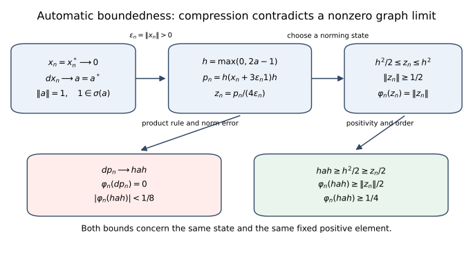
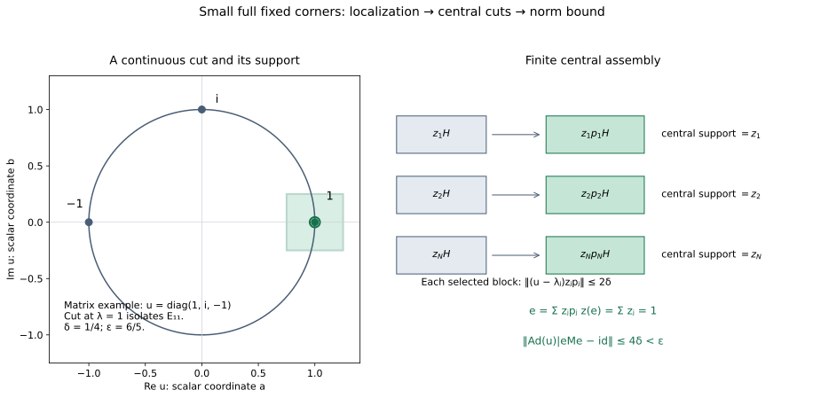
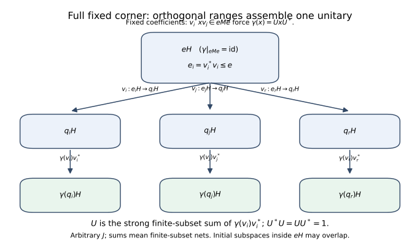

# Derivations and uniformly continuous automorphism groups

*Original exposition and illustration sources: CC0-1.0. Spot-checked by GPT-6 Astra in a separate session.*

An algebraic derivation on a C\*-algebra is a complex-linear map defined on every element and satisfying the product rule. Its definition does not include continuity. Nevertheless it is bounded. We prove this first, including for a nonunital algebra. We then identify the derivations which generate automorphism groups continuous in operator norm. Two implementation arguments complete the lesson: a one-vector construction on $B(H)$, and a construction from an arbitrary full fixed corner of a von Neumann algebra.

The arguments allow arbitrary Hilbert spaces and arbitrary index sets. No countability, separability, faithful state or factor hypothesis is imposed.

## 1. Conventions and the precise earlier foundations

The inner product is linear in its first variable. A C\*-algebra $A$ is a complex Banach algebra with an involution satisfying $\|x^*x\|=\|x\|^2$. It need not have an identity. A von Neumann algebra is a unital weak-operator-closed \*-subalgebra $M\subset B(H)$. The identity of a corner $eMe$ is $e$.

The C\*-identity and submultiplicativity give $\|x\|\le\|x^*\|$ for $x\ne0$, and applying this to $x^*$ gives equality. Thus the involution is isometric, and the real subspace $A_{\rm sa}$ is closed and complete. In a nonzero unital C\*-algebra the C\*-identity at $1$ gives $\|1\|=1$.

The following inputs are proved in the [preceding foundations](OA-FLOW-CF.md): F1 in Sections 2–6, F2 in Sections 7–8, F3 in Section 8, and F4 in Section 1. These are actual earlier proof sections in this reader.

* **F1. Continuous C\*-functional calculus.** For self-adjoint $a$ in a nonzero unital C\*-algebra, its spectrum is a nonempty compact subset of $\mathbb R$, the continuous calculus is an isometric unital \*-isomorphism $C(\sigma(a))\to C^*(1,a)$, and it preserves composition and spectra. The compact Stone–Weierstrass and polynomial-density steps in its earlier proof are supplied locally in Appendix A. In particular $\|a\|=\max_{t\in\sigma(a)}|t|$.
* **F2. Positivity and order.** The positive cone consists of the self-adjoint elements with nonnegative spectrum; it is closed under addition, nonnegative scalars and $x\mapsto b^*xb$. Its elements have a unique positive square root. For $0\le a\le b$, $\|a\|\le\|b\|$. On $B(H)$, positivity is equivalent to $\langle a\xi,\xi\rangle\ge0$ for every $\xi$.
* **F3. Hilbert space foundations.** Cauchy–Schwarz, the projection onto a closed subspace, existence of adjoints in $B(H)$, and the identities $\|T^*\|=\|T\|$ and $\|T^*T\|=\|T\|^2$.
* **F4. Choice.** Zorn's lemma, obtained from the programme's explicit axiom-of-choice convention.

All the analytic facts about bounded maps, closed graphs, norming states and uniformly continuous groups that are used below are proved within this lesson. Sections 8 and 9 also give the required projection joins and polar decomposition inside $M$. In particular neither the general innerness theorem of the next lesson nor a normal-map criterion is an input here.

Define $\|d\|=\sup_{\|x\|\le1}\|d(x)\|$ only after establishing boundedness. A \*-derivation means $d(x^*)=d(x)^*$. A group $(\alpha_t)_{t\in\mathbb R}$ is **uniformly continuous** when $\|\alpha_t-I\|\to0$ as $t\to0$, where this is the norm of a bounded operator on $A$. Continuity of each orbit $t\mapsto\alpha_t(x)$ is a weaker condition.

## 2. Algebraic reductions and the nonunital case

**Lemma 2.1 (complex and star parts).** If $d:A\to A$ is an everywhere-defined derivation, put

$$d^\dagger(x)=d(x^*)^*,\qquad
d_1=\frac{d+d^\dagger}{2},\qquad
d_2=\frac{d-d^\dagger}{2i}.$$

Then $d^\dagger,d_1,d_2$ are complex-linear derivations, $d_1,d_2$ are \*-derivations, and $d=d_1+i d_2$. This decomposition is unique. If $d$ is bounded, then $\|d_j\|\le\|d\|$.

**Proof.** The two conjugate-linear operations in $d^\dagger$ cancel. Applying the product rule to $y^*x^*$ and then taking adjoints gives

$$d^\dagger(xy)=d^\dagger(x)y+x d^\dagger(y).$$

The operation $\dagger$ is an involution and sends $c d$ to $\bar c d^\dagger$. Consequently $d_j^\dagger=d_j$. Taking $\dagger$ in any decomposition into star parts recovers the two displayed formulas, proving uniqueness. Since the involution is isometric, $\|d^\dagger\|=\|d\|$, which gives the bounds. If $A$ has an identity, $d(1)=d(1^2)=2d(1)$, so $d(1)=0$. $\square$

**Lemma 2.2 (C\*-unitization and extension).** [Theorem R1 of the preceding foundations](OA-FLOW-CF.md#oa-flow.cf.9) constructs an isometric unital C\* extension for every algebra, including the already unital and zero cases. An algebraic derivation extends by $\widetilde d(a+\lambda1)=d(a)$. Indeed, applying it to $(a+\lambda1)(b+\mu1)=ab+\lambda b+\mu a+\lambda\mu1$ gives $d(a)b+ad(b)+\lambda d(b)+\mu d(a)$, exactly the product rule for the extension. Taking adjoints in the same formula shows that a \*-derivation extends as a \*-derivation. No boundedness assumption was used.

## 3. Analytic tools proved locally

**Lemma 3.1 (norm-preserving extension).** A bounded complex-linear functional on a subspace of a normed space extends to the whole space with the same norm.

**Proof.** First consider a real-linear functional $f$ dominated by a real sublinear function $p$. To extend from $W$ across $v\notin W$, choose $c$ in the interval

$$\sup_{w\in W}\{f(w)-p(w-v)\}
\ \le c\le\
\inf_{w\in W}\{p(w+v)-f(w)\}.$$

The left bound does not exceed the right: for $w_1,w_2\in W$,
$f(w_1)+f(w_2)=f(w_1+w_2)\le p(w_1-v)+p(w_2+v)$.
The endpoints are finite on the required sides by setting $w=0$. Defining the extension at $v$ to be $c$ gives domination on $W+\mathbb Rv$, by positive homogeneity and the two inequalities. Ordered extensions have upper bounds formed by unions along chains; F4 gives a maximal extension, and the one-dimensional construction forces its domain to be the whole space.

For a complex functional $\varphi$ of norm $C$, extend $\operatorname{Re}\varphi$ real-linearly with domination $C\|x\|$, and call the extension $u$. Set $\Phi(x)=u(x)-i u(ix)$. It is complex-linear and agrees with $\varphi$. Choose a scalar $\lambda$ of modulus one making $\lambda\Phi(x)$ real and nonnegative. Then $|\Phi(x)|=u(\lambda x)\le C\|x\|$. The restriction supplies the opposite norm inequality. $\square$

**Lemma 3.2 (closed graph).** An everywhere-defined real-linear or complex-linear map between Banach spaces whose graph is closed is bounded.

**Proof.** We give the completeness argument behind this statement. A complete metric space is a Baire space: for open dense sets $U_n$ and a nonempty open set $V$, successively choose closed balls of positive radii tending to zero, each lying in the preceding ball's interior and in $U_n$, with the first in $V$. Their centres form a Cauchy sequence. Its limit belongs to every ball, hence to $V\cap\bigcap_n U_n$.

If a bounded linear map $T:E\to F$ between Banach spaces is onto, write
$F=\bigcup_{n\ge1}\overline{T(n\mathbb B_E)}$, with $\mathbb B_E$ the open unit ball. Baire gives a nonempty ball in one closure. Subtracting two points of this ball shows that a ball about zero lies in $\overline{T(2n\mathbb B_E)}$. Rescale: there is $c>0$ such that, for every $r>0$,

$$c r\mathbb B_F\subset\overline{T(r\mathbb B_E)}.$$

Given $\|y\|<c/2$, choose $x_1$ with $\|x_1\|<1/2$ and $\|y-Tx_1\|<c/4$. Choose $x_2$ with $\|x_2\|<1/4$ reducing the residual below $c/8$, and continue. The sum $x=\sum x_j$ exists, has norm less than one, and satisfies $Tx=y$. Thus $T$ is open. A bounded bijection has a bounded inverse by rescaling this ball inclusion.

Now a closed graph $G\subset E\oplus F$ is a Banach space in the sum norm. The projection $G\to E$ is a bounded bijection. Its bounded inverse $x\mapsto(x,Tx)$ yields $\|Tx\|\le C\|x\|$. The argument works over either scalar field. $\square$

We will also use norm-valued Riemann integration. A continuous function on a compact interval into a Banach space has a norm integral: uniform continuity makes sufficiently fine Riemann sums Cauchy, and completeness supplies their limit. The norm of the integral is at most the integral of the norm. The difference quotient of $t\mapsto\int_0^t f(s)\,ds$ is the average of $f$ on the small intervening interval, and therefore tends to $f(t)$, for either sign of the increment. Conversely, the integral of a continuous derivative gives the difference of endpoint values: partition the interval and compare each increment with its derivative times the subinterval length, using uniform continuity of the derivative. These observations prove the fundamental theorem used below.

The bounded operators on a Banach space form a Banach algebra: an operator-norm Cauchy sequence has pointwise limits, these define a bounded linear map, and the original sequence converges to it in operator norm. Absolutely summable operator series therefore converge. In particular $\sum_{n\ge0}R^n$ is the inverse of $I-R$ when $\|R\|<1$, by multiplying its partial sums and letting their remainders tend to zero.

## 4. Norming states and the compression proof

A **state** on a unital C\*-algebra is a positive complex-linear functional with value one at the identity. We require no faithful state.

**Lemma 4.1.** Every nonzero positive $p$ has a state $\varphi$ satisfying $\varphi(p)=\|p\|$. Every state has norm one and satisfies

$$|\varphi(y^*x)|^2\le\varphi(x^*x)\varphi(y^*y).$$

**Proof.** By F1, evaluation at the spectral point $\|p\|$ gives a norm-one functional on $C^*(1,p)$ with value one at $1$. Lemma 3.1 extends it to a norm-one functional $\varphi$ on the algebra.

We show that any norm-one functional with $\varphi(1)=1$ is positive. For self-adjoint $h$, the exponential $e^{ith}$ is unitary by F1, and

$$|\varphi(e^{ith})|^2=1-2t\operatorname{Im}\varphi(h)+O(t^2)\le1.$$

Both signs of $t$ force $\varphi(h)$ to be real. If $0\le x\le1$, F1 and F2 give $\|1-x\|\le1$, whence $|1-\varphi(x)|\le1$. Since $\varphi(x)$ is real, it is nonnegative. Scaling proves positivity for every positive element.

For any positive functional the form $B(x,y)=\varphi(y^*x)$ is positive semidefinite. Expanding $B(x-cy,x-cy)\ge0$ and minimizing over the complex scalar $c$ proves the displayed inequality when $B(y,y)>0$. When $B(y,y)=0$, the same quadratic inequality for arbitrary $c$ forces $B(x,y)=0$. Polarization supplies conjugate symmetry if needed. For a state,
$|\varphi(x)|^2\le\varphi(x^*x)\le\|x\|^2$, since $x^*x\le\|x\|^2 1$ by F1 and F2. Thus its norm is one. $\square$

**Lemma 4.2 (derivative at a positive maximum).** For any algebraic derivation $d$ on a unital C\*-algebra, any $p\ge0$, and any state with $\varphi(p)=\|p\|$, one has $\varphi(d(p))=0$.

**Proof.** If $p=0$ this follows from linearity. Otherwise rescale to $\|p\|=1$ and set $q=(1-p)^{1/2}$. Then $\varphi(q^2)=0$. Cauchy–Schwarz from Lemma 4.1 gives $\varphi((d q)q)=0$ and $\varphi(q(d q))=0$; here $dq$ is an element of the algebra because the domain is the entire algebra. Applying $d$ to $p=1-q^2$ proves the assertion. No continuity or differentiation of the square-root operation is involved. $\square$

**Theorem 4.3 (automatic boundedness).** Every everywhere-defined complex derivation on an arbitrary C\*-algebra is bounded.

**Proof.** The zero algebra is immediate. Begin with a nonzero unital algebra and a \*-derivation $d$. On the real Banach space $A_{\rm sa}$, it suffices by Lemma 3.2 to prove that if $x_n\to0$ and $d x_n\to a$ in norm, then $a=0$: subtracting $(x,dx)$ reduces any graph limit at $x$ to this case. The elements here are self-adjoint. If $a\ne0$, rescale and, if necessary, replace the sequence by its negative, so that $\|a\|=1$ and $1\in\sigma(a)$. Define

$$h=f(a),\qquad f(t)=\max(0,2t-1)\quad(-1\le t\le1).$$

F1 gives $0\le h\le1$, $\|h\|=1$, and $hah\ge\tfrac12h^2$. For sufficiently large $n$, $\varepsilon_n=\|x_n\|$ is positive: otherwise a subsequence with $x_n=0$ contradicts $d x_n\to a\ne0$. Put

$$y_n=x_n+3\varepsilon_n1,\quad
p_n=h y_n h,\quad z_n=\frac{p_n}{4\varepsilon_n}.$$

Since $-\varepsilon_n1\le x_n\le\varepsilon_n1$,

$$2\varepsilon_n1\le y_n\le4\varepsilon_n1,
\qquad\tfrac12h^2\le z_n\le h^2,
\qquad \|z_n\|\ge\tfrac12.$$

Choose separately for each $n$ a state $\varphi_n$ norming $z_n$. It also norms $p_n$, so Lemma 4.2 gives $\varphi_n(d p_n)=0$. On the other hand the product rule gives

$$d p_n=(dh)y_nh+h(d x_n)h+h y_n(dh)\longrightarrow hah.$$

Only the fixed element $dh$ occurs in the first and last terms; their convergence does not assume boundedness of $d$. For large $n$ the norm error is less than $1/8$, and hence $|\varphi_n(hah)|<1/8$. But the order inequalities give

$$\varphi_n(hah)\ge\tfrac12\varphi_n(h^2)
\ge\tfrac12\varphi_n(z_n)=\tfrac12\|z_n\|\ge\tfrac14,$$

a contradiction. Thus $d|_{A_{\rm sa}}$ has a closed graph and is bounded as a real-linear map. Writing $x=u+iv$, with self-adjoint $u=(x+x^*)/2$ and $v=(x-x^*)/(2i)$, gives $\|u\|,\|v\|\le\|x\|$, so $d$ is bounded on $A$.

For a general complex derivation, apply this result to the two star parts in Lemma 2.1. For a nonunital algebra, extend each star part by Lemma 2.2 and restrict the resulting bounded map back to $A$. $\square$

The diagram records the exact constants in Theorem 4.3: the positive normalized compressions satisfy $h^2/2\le z_n\le h^2$, while $d p_n\to hah$ forces the displayed state's value below $1/8$. It requires a sequence of separate states, rather than any compactness theorem for the state space.

The free source ancestry of the compression construction is Sakai's [*On a conjecture of Kaplansky*, pp. 31–32](https://www.jstage.jst.go.jp/article/tmj1949/12/1/12_1_31/_pdf). The proof above includes its own norming-state lemma, star-part reduction and nonunital bridge; the citation is not a substitute for them.

## 5. Exponentials and bounded generators

**Theorem 5.1.** For a bounded derivation $d$, $e^{td}$ is an algebra automorphism for every real $t$. It is a \*-automorphism for every real $t$ if $d$ is a \*-derivation. Conversely a uniformly continuous group of \*-automorphisms of $A$ is $\alpha_t=e^{td}$ for a unique bounded \*-derivation $d$, and

$$d=\lim_{h\to0}\frac{\alpha_h-I}{h}\quad\hbox{in operator norm}.$$

**Proof.** The series $e^{td}=\sum_{n\ge0}t^n d^n/n!$ converges absolutely in operator norm. Induction using the product rule and Pascal's identity yields

$$d^n(xy)=\sum_{j=0}^n\binom nj d^j(x)d^{n-j}(y).$$

Absolute convergence permits regrouping the resulting double series; it gives $e^{td}(xy)=e^{td}(x)e^{td}(y)$. Multiplying the two operator series gives $e^{sd}e^{td}=e^{(s+t)d}$, so $e^{-td}$ is the inverse. In the star case, each $d^n$ respects adjoints and the coefficients are real. Moreover

$$\|e^{td}-I\|\le e^{|t|\|d\|}-1.$$

A \*-automorphism is isometric. An onto multiplicative map fixes the identity, since its image of $1$ acts as the identity on every element of its range. In the unital case algebraic inverses are therefore preserved, and hence spectra are preserved. F1 gives $\|\alpha(x)\|^2=\|\alpha(x^*x)\|=\|x^*x\|$. In the nonunital case extend the automorphism to the unitization and apply the same argument there; the zero case is immediate.

For the converse we prove the generator statement for a uniformly continuous group of bounded operators on a Banach space. The group law extends operator-norm continuity at zero to every time, since $\|\alpha_{t+h}-\alpha_t\|\le\|\alpha_t\|\,\|\alpha_h-I\|$. For a small fixed $\varepsilon>0$ define

$$S=\frac1\varepsilon\int_0^\varepsilon\alpha_s\,ds.$$

Norm continuity makes $\|S-I\|<1$ for sufficiently small $\varepsilon$, so $S$ is invertible by the series established after Lemma 3.2. Translation of the integral gives, for either sign of $h$,

$$\frac{\alpha_h-I}{h}S
=\frac1\varepsilon\left(\frac1h\int_\varepsilon^{\varepsilon+h}\alpha_r\,dr
-\frac1h\int_0^h\alpha_r\,dr\right)
\longrightarrow\frac{\alpha_\varepsilon-I}{\varepsilon}.$$

Therefore the derivative at zero exists in operator norm and equals the bounded operator
$d=(\alpha_\varepsilon-I)S^{-1}/\varepsilon$. The group law gives $\alpha'_t=\alpha_t d=d\alpha_t$. Termwise differentiation of the exponential is valid uniformly on bounded $t$-intervals by its norm majorant. The product $e^{-td}\alpha_t$ has derivative zero; the fundamental theorem proved in Section 3 makes it constant, equal to $I$. Thus $\alpha_t=e^{td}$.

If the operators are algebra automorphisms, differentiating $\alpha_h(xy)=\alpha_h(x)\alpha_h(y)$ at zero in norm proves the product rule. Differentiating the adjoint identity proves the star property. The derivative formula proves uniqueness. $\square$

In particular an everywhere-defined algebraic \*-derivation automatically supplies the hypotheses of Theorem 5.1, by Theorem 4.3. Conversely a bounded generator cannot lose the star property of its automorphism group. These are statements about the domain being all of $A$ and continuity in operator norm; neither statement turns an arbitrary densely defined derivation into a bounded one.

### 5a. The implemented-flow formula

**Corollary.** Let $B$ be a unital C\*-algebra, $A\subset B$ a norm-closed \*-subalgebra, and $h=h^*\in B$ with $[h,A]\subset A$. The bounded \*-derivation $d(x)=i[h,x]$ on $A$ satisfies

$$e^{td}(x)=e^{ith}xe^{-ith}\qquad(x\in A,\ t\in\mathbb R).$$

In particular this applies to an internal implementer in a von Neumann algebra or a unital C\*-algebra. It applies to a nonunital $A$ by taking $B=\widetilde A$ when $h\in\widetilde A$.

**Proof.** On all of $B$ let $L_h(x)=hx$ and $R_h(x)=xh$. These are bounded commuting operators. Expanding the binomial and the absolutely convergent exponential series gives

$$e^{it(L_h-R_h)}=e^{itL_h}e^{-itR_h}.$$

Indeed the double series is dominated by $e^{2|t|\|h\|}$, so regrouping is justified, and each coefficient is the binomial formula for commuting operators. The two factors act by left multiplication by $e^{ith}$ and right multiplication by $e^{-ith}$, respectively, because $L_h^n(x)=h^nx$ and $R_h^n(x)=xh^n$. This proves the formula on $B$.

The commutator preserves $A$ by hypothesis and has norm at most $2\|h\|$. Its exponential series on $A$ converges in $A$, because $A$ is norm complete. Each term is also the corresponding term of the series on $B$, so the two limits agree. Thus the displayed conjugation actually preserves $A$; we did not assume that $L_h$ and $R_h$ individually preserve it. The formula at $-t$ gives the inverse, and $e^{ith}$ is unitary by multiplying the norm-convergent series with $e^{-ith}$ and taking adjoints. This proves the general implemented bounded-flow statement. $\square$

## 6. Closed ideals

**Lemma 6.1 (approximate identities).** A closed two-sided ideal $I$ in a C\*-algebra has a net $(e_j)$ of positive contractions in $I$ such that $e_jx\to x$ and $xe_j\to x$ for every $x\in I$.

**Proof.** For a finite set $F\subset I$ and $\varepsilon>0$, work in the unitization and put

$$a=\sum_{x\in F}(x^*x+xx^*),\qquad
e=a(a+\varepsilon1)^{-1}.$$

The inverse belongs to the unitization by F1; multiplying by $a\in I$ makes $e\in I$. The scalar function $t/(t+\varepsilon)$ gives $0\le e\le1$. Since $x^*x,xx^*\le a$ for $x\in F$, F2 implies

$$\|x(1-e)\|^2,\ \|(1-e)x\|^2
\le\|(1-e)a(1-e)\|
\le\sup_{t\ge0}\frac{\varepsilon^2t}{(t+\varepsilon)^2}
=\frac\varepsilon4.$$

For the second squared norm use $\|T\|^2=\|TT^*\|$, and for the first use $\|T\|^2=\|T^*T\|$. Order pairs $(F,\varepsilon)$ by enlarging $F$ and decreasing $\varepsilon$. Every fixed $x$ is eventually in $F$, proving both limits. This also proves that $I$ is self-adjoint without assuming it: $x^*e_j=(e_jx)^*\to x^*$, and each $x^*e_j$ belongs to $I$. $\square$

**Proposition 6.2.** An everywhere-defined derivation preserves every closed two-sided ideal $I$. It induces a bounded derivation on the quotient normed algebra $A/I$, of norm at most $\|d\|$. In the star case the induced map respects the quotient involution.

**Proof.** The quotient seminorm is a norm because $I$ is closed. Its triangle and scalar rules follow by choosing representatives; choosing representatives of both factors and taking infima also proves submultiplicativity. Thus the indicated quotient normed algebra is well defined. For $x\in I$, both $(de_j)x$ and $e_j(dx)$ lie in $I$, so $d(e_jx)\in I$. Theorem 4.3 and Lemma 6.1 give $d(e_jx)\to dx$, and closedness yields $dx\in I$. The induced map is well defined. For any representative $x+y$ of $x+I$,

$$\|d(x)+I\|\le\|d(x+y)\|\le\|d\|\,\|x+y\|.$$

Taking the infimum over $y\in I$ proves the quotient bound. The product and adjoint rules pass directly to cosets. $\square$

Here the quotient assertion uses only its quotient norm and algebraic operations; no theorem about the C\*-identity on a quotient is needed for this proposition.

## 7. Two implementations on an arbitrary $B(H)$

Assume $H\ne\{0\}$, fix a unit vector $\eta$, and define

$$R_\xi\zeta=\langle\zeta,\eta\rangle\xi,\qquad p=R_\eta.$$

Then $\|R_\xi\|=\|\xi\|$ and $xR_\xi=R_{x\xi}$. The centre of $B(H)$ consists of scalar operators: if $T$ commutes with every operator, commuting with $p$ gives $T\eta=\lambda\eta$, and then $TR_\xi\eta=R_\xi T\eta$ gives $T\xi=\lambda\xi$ for every $\xi$.

**Theorem 7.1 (type-I derivation implementation).** Every derivation $d:B(H)\to B(H)$ is $d(x)=Kx-xK$ for a bounded $K\in B(H)$ with $\|K\|\le\|d\|$. For a \*-derivation it is $d(x)=i[h,x]$ with $h=h^*\in B(H)$ and $\|h\|\le\|d\|$.

**Proof.** Boundedness comes from Theorem 4.3. Define $K\xi=d(R_\xi)\eta$. This is a bounded linear operator with the indicated bound. Applying the product rule to $xR_\xi$ and then to $\eta$ gives

$$Kx\xi=d(x)\xi+xK\xi,$$

so $d=[K,\cdot]$. The adjoint operation on this inner derivation is $d^\dagger=[-K^*,\cdot]$. In the star case $K+K^*$ is therefore central. Taking $h=(K-K^*)/(2i)$ gives $i[h,x]=[K,x]$ and $\|h\|\le\|K\|$. $\square$

The half-norm bound for an optimally centred implementer is a separate theorem; it is not needed in this lesson and is not asserted by this one-vector construction.

**Theorem 7.2 (type-I automorphism implementation).** Every \*-automorphism $\theta$ of $B(H)$ is $\theta(x)=UxU^*$ for a unitary $U\in B(H)$. No normality assumption is necessary.

**Proof.** A nonzero projection $q$ is rank one exactly when $qB(H)q=\mathbb Cq$: rank one makes this immediate, whereas a range of dimension at least two contains a nontrivial rank-one subprojection. Thus $\theta(p)$ has rank one. Choose a unit vector $\zeta$ in its range and define $U\xi=\theta(R_\xi)\zeta$. Because

$$R_\nu^*R_\xi=\langle\xi,\nu\rangle p,$$

we have $\langle U\xi,U\nu\rangle=\langle\xi,\nu\rangle$. Thus $U$ is a linear isometry. For $v\in H$, let $T_v(w)=\langle w,\zeta\rangle v$. It satisfies $T_v\theta(p)=T_v$. Hence $A_v=\theta^{-1}(T_v)$ satisfies $A_vp=A_v$, and any such operator is $R_{A_v\eta}$. Consequently

$$v=T_v\zeta=\theta(R_{A_v\eta})\zeta=U(A_v\eta).$$

So $U$ is onto, hence unitary. Finally $\theta(x)U\xi=\theta(xR_\xi)\zeta=Ux\xi$, proving the formula. $\square$

The proofs use a single rank-one column rather than a countable matrix decomposition, and therefore apply on nonseparable spaces as written.

## 8. Projections and polar decomposition inside $M$

We now prove the von Neumann algebra constructions needed for the full-corner theorem. A weak-operator-closed algebra is strong-operator closed, since strong convergence implies convergence of every matrix coefficient. It is also norm closed and therefore a C\*-algebra. For the zero algebra the following constructions are immediate.

**Lemma 8.1 (support and joins).** For $a\ge0$ in $M$, the projection $s(a)$ onto $\overline{\operatorname{Ran}a}=(\ker a)^\perp$ belongs to $M$. Every family of projections in $M$ has a join in $M$, with range the closed span of their ranges.

**Proof.** Set $r_n=a(a+n^{-1}1)^{-1}$. These positive contractions belong to $M$. They vanish on $\ker a$, and

$$\|(1-r_n)a\|\le n^{-1}$$

by F1. Hence $r_n\to I$ on $\operatorname{Ran}a$ and, by the uniform bound, on its closure. Hilbert orthogonal decomposition from F3 gives the strong limit $s(a)\in M$. For finitely many projections $p_j$, the kernel of $\sum_jp_j$ is their common kernel, since $\langle(\sum_jp_j)\xi,\xi\rangle=\sum_j\|p_j\xi\|^2$. Its support is their join. The finite joins for an arbitrary family form an increasing net. On each of the constituent ranges they eventually act as the identity, hence converge strongly to the projection onto the closed span, and vanish on its orthogonal complement. The limit lies in $M$.

For an orthogonal family $(q_i)$, the finite sums are these finite joins. For every $\xi$, $\sum_i\|q_i\xi\|^2\le\|\xi\|^2$, where the sum means the supremum over finite subsets. The tails tend to zero by the definition of this supremum. This explicitly proves strong convergence of the finite-subset sums, even for an uncountable family. $\square$

**Lemma 8.2 (polar decomposition).** Every $x\in M$ is $x=v|x|$, where $|x|=(x^*x)^{1/2}\in M$ and $v\in M$ is a partial isometry with

$$v^*v=s(x^*x),\qquad vv^*=s(xx^*).$$

If $x=qxe$ for projections $q,e\in M$, these initial and final projections are at most $e$ and $q$ respectively.

**Proof.** Define $v$ on $\operatorname{Ran}|x|$ by $v(|x|\xi)=x\xi$. The equality $\||x|\xi\|=\|x\xi\|$ makes this well defined and isometric. Extend it to the closure of that range and make it zero on the perpendicular complement. Its final range is $\overline{\operatorname{Ran}x}$. The kernels of $|x|$ and $x$ agree; the kernel of $xx^*$ is $\ker x^*$, so the indicated support formulas follow from F3 and Lemma 8.1.

To see that $v$ belongs to $M$, use $v_n=x(|x|+n^{-1}1)^{-1}$. These are contractions, since the square of their norm is the norm of $|x|^2(|x|+n^{-1}1)^{-2}$, at most one. They vanish on $\ker|x|$, while

$$\|(v_n|x|-x)\xi\|
=\|n^{-1}x(|x|+n^{-1}1)^{-1}\xi\|\le n^{-1}\|\xi\|.$$

Thus $v_n\to v$ strongly on a dense subspace and, by the uniform bound, on all $H$. Strong closedness gives $v\in M$. If $x=qxe$, its range is contained in $qH$ and it vanishes on $(1-e)H$, giving the final assertion. $\square$

**Lemma 8.3 (central support).** The least central projection greater than $e$ exists and equals

$$z_M(e)=\bigvee_{u\text{ unitary in }M}ueu^*.$$

If $z_M(e)=1$ and $q\ne0$ is a projection, then $qMe\ne\{0\}$.

**Proof.** The join exists by Lemma 8.1 and is invariant under conjugation by every unitary. It therefore commutes with every unitary. Every self-adjoint contraction $a$ is $(u+u^*)/2$ for the unitary $u=a+i(1-a^2)^{1/2}$, by F1. Splitting any element into its real and imaginary parts and rescaling shows that unitaries linearly span $M$. Thus the join is central. A central projection above $e$ is above every $ueu^*$, proving minimality.

If $qMe=0$, then $que=0$ for every unitary $u$. The range of every $ueu^*$ is therefore perpendicular to $qH$, so $qz_M(e)=0$. Full central support forces $q=0$, proving the assertion. $\square$

### 8a. A full fixed corner on which an inner automorphism is small

**Theorem.** Let $M\subset B(H)$ be a von Neumann algebra and $\theta=\operatorname{Ad}u$ for a unitary $u\in M$. For every $\varepsilon>0$ there is a projection $e\in M$ such that

$$z_M(e)=1,\qquad\theta(e)=e,\qquad
\|\theta|_{eMe}-\operatorname{id}_{eMe}\|<\varepsilon.$$

We use only self-adjoint continuous calculus and positivity, and the internal support/join/central-support constructions proved in this lesson, Section 8. The elementary grid construction below replaces any imported Borel spectral-subspace theorem.

**Central-cut identity.** For a central projection $z$ and any projection $p$,

$$z_M(zp)=z\,z_M(p).$$

Indeed the right side is central and is above $zp$, so $c=z_M(zp)\le z z_M(p)$. Conversely $c+(1-z)z_M(p)$ is a central projection above $p$: multiply $p$ by the two complementary central cuts $z$ and $1-z$. Minimality of $z_M(p)$ gives $z_M(p)\le c+(1-z)z_M(p)$, and multiplication by $z$ gives $z z_M(p)\le c$. This proves equality, including zero cuts. This argument uses the defining least-central-projection property, not a factor representation.

**Proof of the theorem.** The zero algebra is immediate, with $e=0=1$. Choose $0<\delta<\varepsilon/4$ and write

$$a=\frac{u+u^*}{2},\qquad b=\frac{u-u^*}{2i}.$$

These are commuting self-adjoint contractions and $u=a+ib$. Choose finitely many real centres $r_k$ in $[-1,1]$ with spacing less than $\delta$, including both endpoints. The continuous functions

$$g_k(t)=\max(0,1-|t-r_k|/\delta),\qquad
f_k(t)=\frac{g_k(t)}{\sum_jg_j(t)}\quad(-1\le t\le1)$$

are defined because the denominator is strictly positive on the interval. They are nonnegative, sum to $1$, and $f_k(t)>0$ only when $|t-r_k|<\delta$. Use the same family on the spectra of $a$ and $b$.

Their continuous-calculus operators all commute. For example polynomial approximation in the self-adjoint calculus shows that $f_k(a)$ commutes with $b$, hence with every $f_l(b)$; the compact polynomial-density proof is Appendix A of this lesson. Put

$$c_{kl}=f_k(a)f_l(b)\ge0,\qquad q_{kl}=s(c_{kl}).$$

Positivity follows since commuting positive elements satisfy
$f_k(a)f_l(b)=f_k(a)^{1/2}f_l(b)f_k(a)^{1/2}\ge0$.
Supports are strong limits of $c_{kl}(c_{kl}+n^{-1}1)^{-1}$. They commute with $a,b,u$ and with each other: every approximant commutes with these elements, and commutation with a fixed bounded operator passes to strong limits, first in one support and then the other. Since $\sum_{k,l}c_{kl}=1$, a vector in all their kernels is zero. Hence $\bigvee_{k,l}q_{kl}=1$ by the support and join description in Lemma 8.1.

We record the exact localization bound. On the range of $f_k(a)$,

$$\|(a-r_k)f_k(a)\xi\|^2
\le\delta^2\|f_k(a)\xi\|^2.$$

This follows from the continuous scalar inequality
$(t-r_k)^2f_k(t)^2\le\delta^2 f_k(t)^2$, positivity, and the concrete positive-operator criterion. By continuity it holds on the closed range, which is $s(f_k(a))H$. The range of $c_{kl}$ is contained in that closed range, so $q_{kl}\le s(f_k(a))$ and
$\|(a-r_k)q_{kl}\|\le\delta$. The same argument gives $\|(b-r_l)q_{kl}\|\le\delta$. Consequently

$$\|(u-\lambda_{kl})q_{kl}\|\le2\delta,
\qquad\lambda_{kl}=r_k+i r_l.$$

The centres $\lambda_{kl}$ need not lie on the unit circle; only their scalar commutators are used.

Enumerate the finite family $q_{kl}$ as $q_1,\ldots,q_N$ and make it disjoint by

$$p_1=q_1,\qquad
p_j=q_j\prod_{k<j}(1-q_k)\quad(j>1).$$

Commutativity makes these projections pairwise orthogonal. Their sum is $1-\prod_{j=1}^N(1-q_j)=1$, because the product projects onto the common kernel. Every $p_j$ commutes with $u$ and inherits $\|(u-\lambda_j)p_j\|\le2\delta$ from its containing $q_j$.

Write $c_j=z_M(p_j)$. Their join is $1$, since a central projection above all $p_j$ is above their sum. Define disjoint central cuts

$$z_1=c_1,\qquad z_j=c_j\prod_{k<j}(1-c_k).$$

They are orthogonal, have sum $1$, and satisfy $z_j\le c_j$. Set

$$e=\sum_{j=1}^N z_jp_j.$$

This is a projection commuting with $u$, so $\theta(e)=e$. The central-cut identity gives $z_M(z_jp_j)=z_j c_j=z_j$. The central support of a finite sum of orthogonal projections is the join of their central supports, by the least-upper-bound property. Thus $z_M(e)=\bigvee_j z_j=1$.

For $x\in eMe$ put $x_j=z_jx$. It belongs to $(z_jp_j)M(z_jp_j)$. Scalars commute with this element, and multiplication by a unitary is isometric, so

$$\|\theta(x_j)-x_j\|
=\|[u,x_j]\|
\le2\|(u-\lambda_j)z_jp_j\|\,\|x_j\|
\le4\delta\|x_j\|.$$

Finally a finite family of orthogonal central projections summing to $1$ decomposes $H$ into the orthogonal spaces $z_jH$, each invariant under $M$. For every $y\in M$ this gives $\|y\|=\max_j\|z_jy\|$: the upper bound follows by summing the squared norms on these spaces, and the lower bound follows by restriction to any one space. Apply this to $x$ and $\theta(x)-x$. The preceding inequalities yield

$$\|\theta(x)-x\|\le4\delta\|x\|,
\qquad\|\theta|_{eMe}-\operatorname{id}_{eMe}\|\le4\delta<\varepsilon.$$

This completes the arbitrary-algebra proof. Every sum in this proof is finite; the supports used to construct it are the arbitrary-representation strong limits already justified above. $\square$

**Exact matrix check.** In $M_3(\mathbb C)$ take $u=\operatorname{diag}(1,i,-1)$, $\delta=1/4$, and $\varepsilon=6/5$. A grid with centres spaced by $1/5$ includes $0$ and $1$. The continuous cut at $(r_k,r_l)=(1,0)$ has support $E_{11}$: its value on the first diagonal entry is positive, and at the other two entries one factor vanishes. Enumerate this support first. Then $p_1=E_{11}$, $z_M(p_1)=1$, and the central disjointization gives $z_1=1$ and all other $z_j=0$. Thus $e=E_{11}$ is full, is fixed, and the restricted automorphism is exactly the identity. The general proof's estimate is $4\delta=1<6/5$; it is deliberately an upper bound, not the exact zero norm in this example.

The left panel shows the exact three matrix eigenvalues and the cut rectangle $|\operatorname{Re}\lambda-1|<1/4$, $|\operatorname{Im}\lambda|<1/4$. The right panel is a schematic of the arbitrary-algebra finite central assembly in the proof, not a spectral measure or a matrix decomposition. The bounds are $2\delta$ on localized $u-\lambda_j$ and $4\delta$ on the commutator. The reproducible source and numerical coordinates are in [make-proof-figures.py](../assets/cf-foundations/make-proof-figures.py) and [figure-data.json](../assets/cf-foundations/figures/figure-data.json).

## 9. Detecting innerness on a full fixed corner

**Theorem 9.1 (full fixed corner).** Let $M$ be an arbitrary von Neumann algebra, let $\theta$ be a normal \*-automorphism, and let $e$ be a projection with $\theta(e)=e$ and $z_M(e)=1$. Then $\theta$ is inner if and only if its restriction to $eMe$ is inner, with a unitary of that corner as implementer.

**Proof.** If $\theta=\operatorname{Ad}T$, then $TeT^*=e$, so $T$ commutes with $e$. The corner unitary $Te$ implements the restriction.

Conversely suppose the restriction is implemented by $u\in eMe$, with $u^*u=uu^*=e$. The element $w=u+(1-e)$ is a unitary in $M$, and
$\gamma=\operatorname{Ad}(w^*)\circ\theta$ fixes $eMe$ pointwise. It suffices to implement $\gamma$.

Choose by F4 a maximal family $(v_i)_{i\in J}$ of nonzero partial isometries with $v_i^*v_i\le e$ and pairwise orthogonal range projections $q_i=v_iv_i^*$. Require that the family contains $v_0=e$ when $M\ne0$. Chains of families have unions with these properties. If $q=1-\bigvee_i q_i$ were nonzero, Lemma 8.3 would give a nonzero $x=qye$ in $qMe$. Its polar partial isometry from Lemma 8.2 would have initial projection at most $e$ and nonzero final projection at most $q$, contradicting maximality. Therefore

$$\sum_{i\in J}q_i=1\quad\hbox{strongly, over finite subsets}.$$

The family $(\gamma(q_i))$ also has join one: an automorphism is an order isomorphism of projections and preserves least upper bounds. For finite $F\subset J$ put

$$U_F=\sum_{i\in F}\gamma(v_i)v_i^*.$$

Different summands have orthogonal initial projections $q_i$ and orthogonal final projections $\gamma(q_i)$. Indeed $v_i^*v_j=0$ for $i\ne j$ because their ranges are orthogonal, and $\gamma(v_i^*v_i)=v_i^*v_i$ since the initial projection belongs to $eMe$. It follows that

$$U_F^*U_F=\sum_{i\in F}q_i,\qquad
U_FU_F^*=\sum_{i\in F}\gamma(q_i).$$

In particular $\|U_F\|\le1$. For a tail $F$ disjoint from a fixed finite set,
$\|U_F\xi\|^2=\sum_{i\in F}\|q_i\xi\|^2$; the corresponding identity holds for $U_F^*$ with $\gamma(q_i)$. Lemma 8.1 proves that both nets converge strongly, say to $U$ and $V$. Passing matrix coefficients to the limit gives $V=U^*$. Products of uniformly bounded strongly convergent nets converge strongly, since

$$\|(A_jB_j-AB)\xi\|
\le\|A_j\|\,\|(B_j-B)\xi\|+\|(A_j-A)B\xi\|.$$

Hence $U^*U=UU^*=1$, and strong closedness gives $U\in M$.

For every $i$, $Uv_i=\gamma(v_i)$: once the finite subset includes $i$, all other summands vanish on $v_i$, and the remaining one is $\gamma(v_i)v_i^*v_i=\gamma(v_i)$, since $v_i^*v_i$ is fixed. For $x\in M$, the element $v_i^*xv_j$ belongs to $eMe$, so

$$\gamma(v_i)^*\gamma(x)\gamma(v_j)
=\gamma(v_i^*xv_j)=v_i^*xv_j
=\gamma(v_i)^*(UxU^*)\gamma(v_j).$$

Multiplying by the partial isometries shows that every block
$\gamma(q_i)(\gamma(x)-UxU^*)\gamma(q_j)$ is zero. Their finite sums converge strongly to $1$, so the operator itself is zero. Thus $\gamma=\operatorname{Ad}U$ and $\theta=\operatorname{Ad}(wU)$. The zero algebra is vacuous. $\square$

In this schematic the index set $J$ is arbitrary. Each $v_i$ maps $(v_i^*v_i)H\subset eH$ onto $q_iH$. The map $\gamma(v_i)v_i^*$ maps $q_iH$ onto $\gamma(q_i)H$, and their finite-subset strong sum is the unitary $U$. The coefficient $v_i^*xv_j\in eMe$ is fixed by $\gamma$, which forces the implementation on all blocks. The picture asserts no disjointness of the initial subspaces inside $eH$.

The argument proves the theorem under its declared normality hypothesis without invoking a normal-map criterion. In fact the projection-order argument also shows that the proof itself needs no additional continuity hypothesis on $\theta$.

## 10. Examples and problems, with complete solutions

**Problem 1 (a real exponential can fail to be a star map).** In $M_2(\mathbb C)$ let $b=\operatorname{diag}(0,2)$ and $d(x)=bx-xb$. Compute its star parts and $e^{td}$ on the matrix units. Decide when this exponential preserves adjoints.

**Solution.** Since $b=b^*$, $d^\dagger=-d$. Thus $d_1=0$ and $d_2=-i[b,\cdot]=i[-b,\cdot]$. For a diagonal matrix with entries $\lambda_i$, $[b,E_{ij}]=(\lambda_i-\lambda_j)E_{ij}$. Therefore

$$e^{td}(E_{11})=E_{11},\quad e^{td}(E_{22})=E_{22},\quad
e^{td}(E_{12})=e^{-2t}E_{12},\quad
e^{td}(E_{21})=e^{2t}E_{21}.$$

For real $t$, the adjoint of the third expression is $e^{-2t}E_{21}$, whereas the image of $E_{12}^*$ is $e^{2t}E_{21}$. They agree exactly when $t=0$. The maps remain algebra automorphisms for every real $t$, as Theorem 5.1 says. By contrast $e^{t d_2}=\operatorname{Ad}(e^{-itb})$ is a \*-automorphism group; multiplication of the two exponential series, or differentiation and the zero-derivative argument of Section 5, proves this formula.

**Problem 2 (central support must be taken in the ambient algebra).** On $M=M_2(\mathbb C)\oplus M_2(\mathbb C)$ let $\theta(x,y)=(y,x)$. Describe its nonzero fixed corners and show that its restriction there is outer. Then enlarge to $N=\mathbb C\oplus M$ with automorphism $\widetilde\theta=\operatorname{id}\oplus\theta$ and explain why an inner scalar fixed corner does not imply innerness on $N$.

**Solution.** A fixed projection in $M$ is $(p,p)$. For $p\ne0$, the corner is $pM_2p\oplus pM_2p$ and $\theta$ still interchanges its two summands. An inner automorphism fixes every central element, since a central element commutes with its implementing unitary. Here $(p,0)$ is central in the corner and is moved to $(0,p)$, so the restriction is outer. The same argument at $(1,0)$ shows that $\theta$ is outer on $M$. Every nonzero $p$ has central support $1$ in $M_2$: its only central projections are $0$ and $1$, by the centre computation in Section 7. Thus $(p,p)$ is full in $M$, in agreement with Theorem 9.1.

In $N$, the fixed projection $f=(1,0,0)$ has scalar corner and identity restriction. Its central support is $f$, not $1_N$. The central projections of the other two summands are exchanged, so $\widetilde\theta$ is outer. This identifies the exact missing hypothesis; fullness in the corner alone says nothing about the other central summands of $N$.

**Problem 3 (what the one-vector recipe produces).** If $d=[a,\cdot]$ on $B(H)$, compute the $K$ constructed from a unit vector $\eta$ in Theorem 7.1. If $a=ih$ with $h=h^*$, compute the resulting self-adjoint implementer.

**Solution.** Evaluating $[a,R_\xi]$ at $\eta$ gives

$$K\xi=a\xi-\langle a\eta,\eta\rangle\xi,
\qquad K=a-\langle a\eta,\eta\rangle I.$$

When $a=ih$, $\langle h\eta,\eta\rangle$ is real and $K=i(h-\langle h\eta,\eta\rangle I)$. Thus $(K-K^*)/(2i)=h-\langle h\eta,\eta\rangle I$. Different choices of $\eta$ change only a scalar, which leaves the commutator unchanged. This recipe need not give the centre of the spectral interval.

**Problem 4 (a finite full-corner assembly).** In $M_3(\mathbb C)$ take $e=E_{11}$ and $D=\operatorname{diag}(1,e^{i\alpha},e^{i\beta})$, with $\theta=\operatorname{Ad}D$. Carry out the construction in Theorem 9.1.

**Solution.** The corner is scalar and is fixed pointwise. Set $v_1=E_{11}$, $v_2=E_{21}$ and $v_3=E_{31}$. Each initial projection is $e$, while the range projections are $E_{11},E_{22},E_{33}$ and sum to $1$. Write $\omega_1=1$, $\omega_2=e^{i\alpha}$ and $\omega_3=e^{i\beta}$. Then $\theta(v_j)=\omega_jv_j$ and

$$U=\sum_{j=1}^3\theta(v_j)v_j^*
=\sum_{j=1}^3\omega_jE_{jj}=D.$$

For every matrix $x$, $v_i^*xv_j=x_{ij}e$ is fixed. These are precisely all its scalar matrix coefficients, so the block argument recovers $\theta(x)=DxD^*$. The initial projections coincide; they were not required to be orthogonal.

**Problem 5 (why the whole domain matters).** On $\ell^2(\mathbb N)$ let $\mathcal E$ be the algebraic span of the matrix units $E_{mn}$, and define $d(E_{mn})=i(m-n)E_{mn}$. Prove that this is a \*-derivation and that it is unbounded for the operator norm. Explain why Theorem 4.3 does not apply.

**Solution.** The rule is complex-linear on the indicated basis. Since $E_{mn}E_{pq}=\delta_{np}E_{mq}$, the two terms of the product rule, when $n=p$, have total coefficient $i(m-n)+i(n-q)=i(m-q)$; when $n\ne p$, both sides vanish. Taking adjoints gives $d(E_{mn})^*=-i(m-n)E_{nm}=d(E_{nm})$. But $\|E_{n1}\|=1$ and $\|d(E_{n1})\|=n-1$, so no uniform bound exists. The algebra $\mathcal E$ is not complete: let $T(\xi_n)_n=(2^{-n}\xi_n)_n$. The diagonal norm calculation gives $\|T-\sum_{n=1}^N2^{-n}E_{nn}\|=2^{-(N+1)}$, while $T\notin\mathcal E$. The derivation is not defined on every element of a C\*-algebra, and the closed-graph step of Theorem 4.3 has no such domain on which to operate.

The next lesson can now use Theorems 4.3 and 5.1 as earlier programme proof providers. The general von Neumann algebra innerness theorem requires further arguments; the two implementation results here establish their own stated cases without assuming that theorem.

## Appendix A. Compact polynomial density

The following complete proof supplies the compact Stone–Weierstrass and polynomial-density inputs used by the earlier continuous-calculus proof.

**Lemma A.1 (polynomial approximation of absolute value).** For every $R>0$, real polynomials approximate $s\mapsto|s|$ uniformly on $[-R,R]$, with error at most $R/\sqrt n$ for the polynomial constructed below.

**Proof.** For $0\le t\le1$ put

$$w_k(t)=\binom nk t^k(1-t)^{n-k},\qquad 0\le k\le n.$$

They are nonnegative and sum to one by the binomial formula. The identities $k\binom nk=n\binom{n-1}{k-1}$ and $k(k-1)\binom nk=n(n-1)\binom{n-2}{k-2}$, with out-of-range terms taken as zero, give

$$\sum_k k w_k=nt,\qquad
\sum_k k(k-1)w_k=n(n-1)t^2,\qquad
\sum_k (k/n-t)^2w_k=\frac{t(1-t)}n.$$

For $n=1$, the middle identity reads zero on both sides and the remaining formulas still hold. Finite weighted Cauchy–Schwarz gives
$\sum_k w_k|k/n-t|\le(\sum_k w_k(k/n-t)^2)^{1/2}$.
This inequality follows directly by expanding the nonnegative sum $\sum_k w_k(a_k-c)^2$ and minimizing in $c$, or by ordinary finite-sum Cauchy–Schwarz with factors $\sqrt{w_k}$ and $\sqrt{w_k}|k/n-t|$.

The polynomial

$$B_n(t)=\sum_{k=0}^n |2Rk/n-R|w_k(t)$$

satisfies, using $||u|-|v||\le|u-v|$,

$$|B_n(t)-|2Rt-R||
\le2R\sum_k w_k|k/n-t|
\le2R\sqrt{\frac{t(1-t)}n}\le\frac R{\sqrt n}.$$

Set $P_n(s)=B_n((s+R)/(2R))$. This is a real polynomial in $s$ and has the claimed bound. If $R=0$, the zero polynomial is sufficient. $\square$

**Theorem A.2 (real compact Stone–Weierstrass).** Let $K$ be a compact Hausdorff space and $\mathcal A$ a real subalgebra of $C(K;\mathbb R)$ containing the constants and separating points. Its uniform closure is all of $C(K;\mathbb R)$.

**Proof.** The statement is immediate for empty $K$. Let $\mathcal B$ be the uniform closure. Uniform limits of continuous functions are continuous, by the triangle inequality applied near any point. They are bounded because continuous functions on a compact space are bounded: the open sets where the absolute value is less than the positive integers cover $K$ and have a finite subcover. Thus the uniform norm is well defined. Products pass to uniform limits since convergent functions have uniformly bounded norms; consequently $\mathcal B$ is a closed algebra containing the constants.

For $g\in\mathcal B$, apply Lemma A.1 on $[-\|g\|,\|g\|]$. Every $P_n(g)$ belongs to $\mathcal B$ and converges uniformly to $|g|$. It follows that $\mathcal B$ is a lattice, because

$$\max(g,h)=\frac{g+h+|g-h|}{2},\qquad
\min(g,h)=\frac{g+h-|g-h|}{2}.$$

Fix $f\in C(K;\mathbb R)$ and $\varepsilon>0$. For each pair $x,y\in K$ choose $a_{xy}\in\mathcal A$ satisfying $a_{xy}(x)=f(x)$ and $a_{xy}(y)=f(y)$. When $x=y$ use the constant $f(x)$. Otherwise, if $g\in\mathcal A$ separates $x$ and $y$, the explicit affine function

$$a_{xy}=f(x)+\frac{f(y)-f(x)}{g(y)-g(x)}(g-g(x))$$

does the job. For a fixed $x$, the open sets
$\{z:a_{xy}(z)>f(z)-\varepsilon\}$, indexed by $y$, cover $K$. Choose finitely many, and let $g_x$ be the maximum of their $a_{xy}$. Then $g_x\in\mathcal B$, $g_x>f-\varepsilon$ everywhere, and $g_x(x)=f(x)$.

The open sets $\{z:g_x(z)<f(z)+\varepsilon\}$, indexed by $x$, also cover $K$. Choose a finite subcover and take the minimum $h$ of its $g_x$'s. This $h$ belongs to $\mathcal B$. All its constituent functions exceed $f-\varepsilon$, so $h>f-\varepsilon$. At any point at least one constituent is less than $f+\varepsilon$, so $h<f+\varepsilon$. Therefore $\|h-f\|\le\varepsilon$. Taking $\varepsilon\downarrow0$ and using closedness gives $f\in\mathcal B$. $\square$

**Corollary A.3 (complex compact form).** If a complex subalgebra $\mathcal A\subset C(K;\mathbb C)$ contains the constants, is closed under complex conjugation, and separates points, its uniform closure is $C(K;\mathbb C)$.

**Proof.** The real-valued elements of $\mathcal A$ form a real algebra containing the real constants. They separate points: if a complex function distinguishes two points, either its real part or its imaginary part does, and both belong to $\mathcal A$ because it is closed under conjugation. Theorem A.2 approximates each real continuous function by these elements. Applying this separately to the real and imaginary parts of a complex function proves the claim. $\square$

**Corollary A.4 (the exact polynomial-density inputs).** For compact $S\subset\mathbb R$, polynomials in the coordinate are uniformly dense in $C(S;\mathbb C)$. For compact $S\subset\mathbb C$, polynomials in $z$ and $\bar z$ are uniformly dense in $C(S;\mathbb C)$. On the compact character space of a unital commutative C\*-algebra, a closed self-adjoint subalgebra containing $1$ and separating points equals the whole continuous-function algebra.

**Proof.** In each case the indicated algebra contains constants, is self-adjoint and separates points; the coordinate itself separates distinct points of $S$. Apply Corollary A.3. The last case additionally uses the assumed closedness to turn density into equality. $\square$
