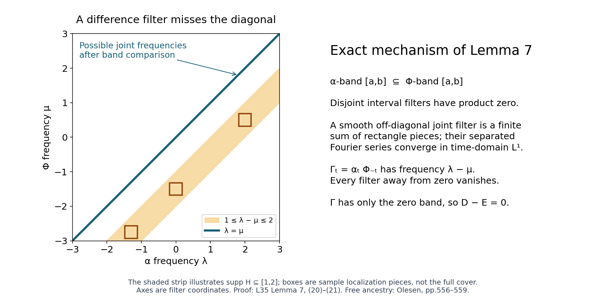
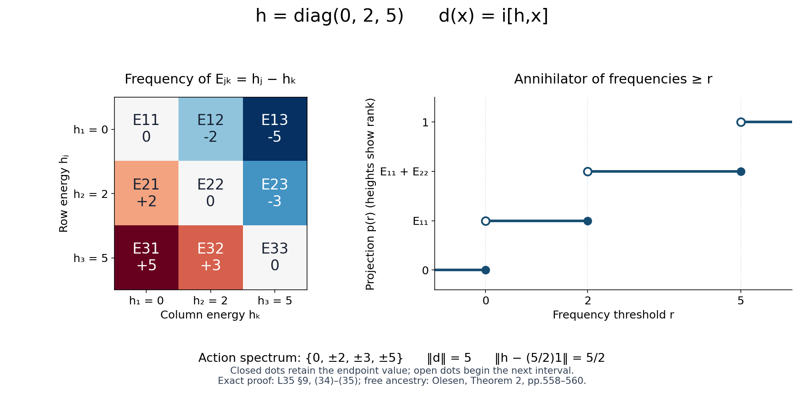

# Inner derivations in an arbitrary von Neumann algebra

*Self-checked by the writing AI. Original exposition and illustration sources: CC0 1.0.*

Spectral subspaces of the derivation determine projection tails, and those tails reconstruct an implementer inside the von Neumann algebra. After the construction and its norm estimates, we extend derivations to represented algebras, prove invariance of closed dual bimodules, and give a separate normality proof through automorphisms.

The implementer will be constructed inside the algebra. No factor decomposition, separability, faithful state, countable central partition, or standard representation is assumed.

## 1. Statement and the earlier boundedness proof

Let $M\subseteq B(H)$ be a unital von Neumann algebra on an arbitrary complex Hilbert space. A derivation means an everywhere-defined complex-linear map $d:M\to M$ satisfying

$$d(xy)=d(x)y+xd(y).$$

A star derivation also satisfies $d(x^*)=d(x)^*$. The conclusion is:

**Theorem 1.** Every derivation of $M$ is bounded and inner. For a star derivation there is a positive $b\in M$ such that

$$d(x)=i[b,x],\qquad \|b\|=\|d\|,\qquad
\left\|b-\frac{\|d\|}{2}1\right\|=\frac{\|d\|}{2}. \tag{1}$$

For every central projection $z$,

$$\|bz\|=\|d|_{Mz}\|. \tag{2}$$

This $b$ is the least positive implementer and is the unique positive implementer satisfying (2). A general complex derivation has an implementer $k\in M$ with

$$d(x)=[k,x],\qquad \|k\|\leq\|d\|. \tag{3}$$

The zero algebra and zero derivation have the stated conclusions with zero implementer. Below we may therefore assume $M\ne0$; in constructions divided by a generator norm we separately handle norm zero.

**Earlier programme proof.** Automatic boundedness is proved in [L34, Section 4, Norming states and the compression proof](OA-FLOW-L34.md#oa-flow.dfd.algebra), Lemmas 4.1–4.2 and Theorem 4.3. It covers every everywhere-defined complex derivation on an arbitrary, possibly nonunital C*-algebra. The nonunital extension and decomposition are proved in Section 2; norm-preserving complex extension and the real closed-graph theorem are proved in Section 3. The compression argument requires no compactness of the state space and uses neither innerness nor any result of this lesson. L34 precedes L35 in the reader.

For clarity, the algebraic decomposition used again here is

$$d^\dagger(x)=d(x^*)^*,\qquad
d_1=(d+d^\dagger)/2,\qquad d_2=(d-d^\dagger)/(2i). \tag{4}$$

Reversing a product twice proves $d^\dagger(xy)=xd^\dagger(y)+d^\dagger(x)y$, and the two conjugations make it complex linear. The identity $(d^\dagger)^\dagger=d$ proves that $d_1,d_2$ are star derivations and $d=d_1+id_2$. Once boundedness has been supplied by L34, the isometry of star gives

$$\|d_j\|\leq\|d\|\quad(j=1,2). \tag{5}$$

The only C*- and Hilbert-space foundations used without reproving them here are the earlier programme proofs of continuous functional calculus for a bounded selfadjoint element, the C*-identity, completeness of a C*-algebra and of its bounded-operator space, and orthogonal projection onto a closed Hilbert subspace. We prove the arbitrary projection joins needed below directly from these foundations and strong closedness of $M$.

## 2. The elementary integration and Fourier tools

All integrals in the spectral argument are absolutely convergent improper integrals of continuous functions. A Banach-valued integral on a compact interval is the limit of Riemann sums: uniform continuity makes sums Cauchy under refinement, completeness supplies the limit, and the triangle inequality gives

$$\left\|\int_a^b v(t)\,dt\right\|\leq\int_a^b\|v(t)\|\,dt. \tag{6}$$

If the scalar integral of $\|v\|$ on the line is finite, compact integrals form a Cauchy net, so (6) extends to the line. To interchange the integrals used below, first work on finite rectangles, where uniform Riemann sums agree in either order. Then bound the omitted tails by the integral of the absolute value. Our tails are bounded by products of integrable scalar functions, or become such products after the explicitly stated linear changes of variables. This proves the required Fubini formulas for these continuous integrands. Similarly, uniform convergence on each compact interval together with a common integrable tail bound implies convergence of the integrals. These arguments suffice here; no general measurable-vector integration or unproved measure theorem is imported.

The elementary compact-interval substitution, integration by parts and fundamental theorem follow from Riemann sums and difference quotients: uniform continuity bounds the difference between each sum and the corresponding integral, and integrating a uniformly continuous derivative gives the increments of its primitive. They extend to the improper integrals when the boundary terms and tails have the bounds given below.

We use the positive Fourier sign

$$\widehat f(\lambda)=\int_{\mathbb R}f(t)e^{it\lambda}\,dt,\qquad
\check F(t)=\frac1{2\pi}\int_{\mathbb R}F(\lambda)e^{-it\lambda}\,d\lambda. \tag{7}$$

**Lemma 2 (smooth filters and the precise Plancherel estimate).** If $F\in C_c^\infty(\mathbb R)$, then $f=\check F$ is rapidly decreasing together with all derivatives, $\widehat f=F$, and

$$\|f\|_2^2=\frac1{2\pi}\|F\|_2^2,\qquad
\|tf\|_2^2=\frac1{2\pi}\|F'\|_2^2,\qquad
\|f\|_1\leq\frac1{\sqrt2}
\big(\|F\|_2^2+\|F'\|_2^2\big)^{1/2}. \tag{8}$$

Here the $L^p$ notation only denotes the displayed scalar improper integrals; no completion theorem for an $L^p$ space is needed.

**Proof.** Repeated integration by parts in (7), with zero boundary terms because $F$ is smooth with compact support, proves rapid decrease. Differentiation falls on powers of $\lambda$ and gives the same conclusion for all time derivatives.

We spell out the Gaussian fact used for inversion. The integral $J=\int e^{-u^2}\,du$ is finite. Its square is the plane integral of $e^{-u^2-v^2}$. A circle is a Riemann-null boundary: its Lipschitz parametrization, divided into intervals of mesh $\delta$, covers it by rectangles of area at most a constant times $\delta^2$ each, with at most a constant times $1/\delta$ rectangles. Their total area tends to zero. Thus discs and the finitely many annular step functions below are Riemann integrable, and the finite rectangle sums justify their section integrals as well. The area of the disc of radius $r$ is $\pi r^2$ (integrate the vertical sections $2\sqrt{r^2-u^2}$ and substitute $u=r\sin\theta$). Approximate the radial function on each disc uniformly by constant functions on finitely many annuli. Their integrals are the annular areas times those constants. Refining the annuli therefore gives $2\pi\int_0^R r e^{-r^2}\,dr$; the omitted square or disc tails are bounded by the integrable Gaussian tails. Letting $R$ increase gives $J^2=\pi$, hence $J=\sqrt\pi$.

For $a>0$, differentiate $\int e^{-at^2}e^{itu}\,dt$ with respect to $u$. Compact differentiation is valid directly and tails are controlled by $|t|e^{-at^2}$. Integration by parts shows that the derivative equals $-u/(2a)$ times the original integral. Its value at zero is $\sqrt{\pi/a}$, so

$$\int e^{-at^2}e^{itu}\,dt
=\sqrt{\pi/a}\,e^{-u^2/(4a)}. \tag{9}$$

Put $q_a(u)=(4\pi a)^{-1/2}e^{-u^2/(4a)}$. It has integral one, and its integral outside $|u|<\varepsilon$ tends to zero as $a\downarrow0$, by scaling and the Gaussian tail. Uniform continuity of a bounded uniformly continuous $F$ now gives $F*q_a\to F$ uniformly: split the convolution into $|u|<\varepsilon$ and its complement. Fubini and (9) give

$$\int e^{it\lambda}e^{-at^2}\check F(t)\,dt=(F*q_a)(\lambda).$$

Since $\check F$ is integrable, removing the factor $e^{-at^2}$ by compact convergence and small tails proves $\widehat{\check F}=F$.

Expanding $|\check F|^2$, inserting the same Gaussian and using (9) gives

$$\int e^{-at^2}|\check F(t)|^2\,dt
=\frac1{2\pi}\int F(\lambda)\overline{(F*q_a)(\lambda)}\,d\lambda.$$

The triple integral is absolutely integrable before the interchange: the frequency variables range over compact supports and $e^{-at^2}$ is integrable. Uniform convergence of the convolution and the compact support of $F$ give the right-hand limit. Rapid decrease gives the left-hand limit by compact convergence and an integrable $|\check F|^2$ tail. This proves the first identity in (8). Integration by parts gives $\check {F'}=it\check F$, and proves the second one. Finally, integral Cauchy–Schwarz follows by expanding the integral of $|u-cv|^2\geq0$ and minimizing over $c$ (with the zero-norm case separate). Apply it to $(1+t^2)^{1/2}|f(t)|$ and $(1+t^2)^{-1/2}$. The latter has squared integral $\pi$, as the primitive is $\arctan t$. The two identities just proved give the last estimate. $\square$

Smooth cutoffs used below also have an elementary construction. The function $\beta(t)=e^{-1/(1-t^2)}$ for $|t|<1$, extended by zero, is smooth: each derivative inside is the exponential times a rational function, and all limits at the endpoints vanish because $u^Ne^{-u}\to0$. Translate and scale its integral to make smooth functions equal to one on a prescribed compact interval and supported in a slightly larger interval. A finite cover of a compact set by open intervals has a smooth partition of unity near that set: choose finitely many such bumps whose positive sets cover it and divide by their positive sum, with one additional cutoff supported in that neighborhood. The same construction with products of bumps works in the plane.

**Lemma 3 (dyadic reconstruction at an endpoint).** Suppose $F\in C_c^\infty(\mathbb R)$ vanishes on $(-\infty,a]$. It is a sum of filters supported strictly inside $(a,\infty)$ whose inverse transforms converge absolutely in $L^1$. In particular a test filter flat at a closed endpoint is recovered from strictly separated filters, without a spectral-synthesis theorem.

**Proof.** Write $u=\lambda-a$. Choose a smooth $\chi$ on the line equal to one for $|u|\leq1$ and zero for $|u|\geq2$. For $u>0$ set

$$\theta_n(u)=\chi(2^nu)-\chi(2^{n+1}u),\qquad n\geq0.$$

Its support is contained in $[2^{-n-1},2^{1-n}]$, and telescoping gives $\sum_{n\geq0}\theta_n(u)=\chi(u)$. Thus

$$F=F(1-\chi(u))+\sum_{n\geq0}F\theta_n(u). \tag{10}$$

The first term has compact support away from $a$. Since all derivatives of $F$ vanish at $a$, repeated fundamental theorems of calculus give, on $0\leq u\leq2$,

$$|F(a+u)|\leq C_Nu^N,\qquad |F'(a+u)|\leq C_Nu^N$$

for every integer $N$ (apply the repeated integral formula to $F$ and $F'$ separately). For $F_n=F\theta_n$, the support length is at most $2^{1-n}$, the cutoff derivative is at most a fixed constant times $2^n$, and (8) consequently gives

$$\|\check F_n\|_1\leq C_N'2^{-n(N-1/2)}. \tag{11}$$

Take $N=2$. The series of these norms converges. Its pointwise frequency sum is (10), and it converges uniformly, so frequency integration on the common compact support identifies the pointwise inverse transform of the sum with $\check F$. The absolutely convergent $L^1$ series has that same sum. Reflection proves the left-end version. For a finite closed interval use cutoffs near its two endpoints and an interior cutoff; the two endpoint arguments apply separately. $\square$

## 3. Smooth spectral subspaces, proved locally

Let $X$ be a nonzero Banach space and let $\alpha_t$ be an operator-norm-continuous group of isometries. We first supply its bounded generator, so no differentiability assumption is hidden in that description.

**Bounded-generator lemma.** There is a unique $D\in B(X)$ with $\alpha_t=e^{itD}$.

**Proof.** For a sufficiently small $\varepsilon>0$ let $S_\varepsilon=\varepsilon^{-1}\int_0^\varepsilon\alpha_s\,ds$. Norm continuity gives $\|S_\varepsilon-I\|<1$. The geometric series $\sum_{n\geq0}(I-S_\varepsilon)^n$ converges in $B(X)$ and, multiplying its partial sums and passing to the limit, gives the inverse of $S_\varepsilon$. The group law and the oriented norm integral give

$$\frac{(\alpha_h-I)S_\varepsilon}{h}
=\frac1\varepsilon\left(
\frac1h\int_\varepsilon^{\varepsilon+h}\alpha_r\,dr
-\frac1h\int_0^h\alpha_r\,dr\right)
\longrightarrow\frac{\alpha_\varepsilon-I}{\varepsilon}$$

in operator norm, for either sign of $h$. Right multiplication by $S_\varepsilon^{-1}$ therefore proves differentiability at zero with bounded derivative $B=(\alpha_\varepsilon-I)S_\varepsilon^{-1}/\varepsilon$. Differentiating the group law gives $\alpha'_t=\alpha_tB$ and $\alpha_tB=B\alpha_t$. Termwise differentiation of the norm-convergent exponential series shows that $e^{-tB}\alpha_t$ has derivative zero. The compact-interval fundamental theorem from Section 2 makes it constant, with value $I$ at zero. Thus $\alpha_t=e^{tB}=e^{itD}$ for $D=-iB$. Its uniqueness follows by differentiation at zero. $\square$

Define

$$T_F^\alpha x=\int\check F(t)\alpha_t x\,dt,
\qquad F\in C_c^\infty(\mathbb R). \tag{12}$$

For a closed set $K$, define

$$X_\alpha(K)=\{x:T_F^\alpha x=0\text{ whenever }\operatorname{supp}F\cap K=\varnothing\}. \tag{13}$$

These spaces are norm closed and invariant under $\alpha$, since filters are bounded and commute with the group. This definition fixes all endpoint conventions.

**Lemma 4 (filter identities and compact frequency).**

$$T_F^\alpha T_G^\alpha=T_{FG}^\alpha,
\qquad DT_F^\alpha=T_{\lambda F}^\alpha,
\qquad X=X_\alpha([-\|D\|,\|D\|]). \tag{14}$$

If $F=1$ on a neighborhood of the compact frequency set of a vector $x$, then $T_F^\alpha x=x$.

**Proof.** The double time integral in the first identity is absolutely bounded by $\|\check F\|_1\|\check G\|_1\|x\|$. Change variable from $(t,s)$ to $(t,t+s)$; convolution of the inverse transforms is the inverse of $FG$, as follows by (7), Fubini and Fourier inversion. The derivative identity follows by integration by parts: $\alpha_t'=iD\alpha_t$, $\check F'=\check {(-i\lambda F)}$, and the rapidly decreasing boundary term vanishes.

For the frequency bound put $C=\|D\|$. If $F$ has support where $|\lambda|\geq a>C$, let $G_n(\lambda)=F(\lambda)/\lambda^n$ on that support, zero near zero. The derivative identity gives $T_F=D^nT_{G_n}$. Moreover

$$\|G_n\|_2\leq a^{-n}\|F\|_2,\qquad
\|G_n'\|_2\leq a^{-n}(\|F'\|_2+n\|F\|_2/a).$$

By (8), $\|T_F\|\leq C_F(1+n)(C/a)^n$, which tends to zero. Every compact support disjoint from $[-C,C]$ has such an $a$, so the last identity in (14) follows. This is the compact-frequency bound; it uses no analytic half-plane estimate.

For a smooth $\chi$ with $\chi=1$ near zero set $F_R(\lambda)=\chi(\lambda/R)$. Its inverse is $R\check\chi(Rt)$, has integral $\chi(0)=1$ and constant $L^1$ norm. The substitution $u=Rt$ and norm continuity of $\alpha$ show $T_{F_R}x\to x$: the integral of $\check\chi(u)(\alpha_{u/R}x-x)$ is small on a fixed compact interval and bounded by $2\|x\|$ times the small tail elsewhere. If $F=1$ near a compact $K$ and $x\in X_\alpha(K)$, then for large $R$, $F_R-F$ vanishes near $K$ and has compact support disjoint from it. Therefore $T_Fx=T_{F_R}x\to x$. $\square$

A filter range has the stated band:

$$T_FX\subseteq X_\alpha(\operatorname{supp}F). \tag{15}$$

Indeed a disjoint test $G$ has $GF=0$. Also

$$X_\alpha(K)\cap X_\alpha(L)=X_\alpha(K\cap L) \tag{16}$$

for closed $K,L$: cover the compact support of a test disjoint from $K\cap L$ by neighborhoods disjoint from one of $K,L$, and use the finite smooth partition just constructed. The reverse inclusion follows directly from the definition. The same argument proves the finite-cover versions used below. Thus every vector in a half-line band also belongs to its intersection with $[-C,C]$.

For comparison with spectral spaces defined by closure of filtered vectors, let $R_\alpha(I)$ be the norm closure of the linear span of $T_FX$ for $\operatorname{supp}F\subset I$ compact and $I$ open. For a bounded closed interval $[a,b]$,

$$X_\alpha([a,b])=\bigcap_{\varepsilon>0}R_\alpha((a-\varepsilon,b+\varepsilon)). \tag{17}$$

In one direction choose a filter equal to one near $[a,b]$ and supported in the enlarged interval, and apply Lemma 4. In the other direction a test support disjoint from $[a,b]$ is disjoint from a sufficiently small enlargement; its filter kills all the corresponding filter ranges by multiplication, and then their closures. The same proof, after intersection with the common compact frequency band, handles half-lines. Lemma 3 also proves that a smooth filter supported in a closed interval is a norm limit of sums of filters supported in its interior, when its endpoint values are zero as smoothness requires. There is no unstated endpoint synthesis in (17).

**Lemma 5 (products and adjoints).** Suppose $X$ is a C*-algebra and $\alpha$ consists of star automorphisms. For compact $K,L$,

$$X_\alpha(K)X_\alpha(L)\subseteq X_\alpha(K+L),\qquad
X_\alpha(K)^*=X_\alpha(-K). \tag{18}$$

In particular $S_r=X_\alpha([r,\infty))$ satisfies $S_rS_s\subseteq S_{r+s}$.

**Proof.** The adjoint assertion follows from

$$\big(T_Fx\big)^*=T_{F^\#}(x^*),\qquad F^\#(\lambda)=\overline{F(-\lambda)}.$$

For the product, let $x\in X_\alpha(K)$, $y\in X_\alpha(L)$, and let $H$ have support disjoint from $K+L$. Compactness gives positive distance. Choose $F,G$ equal to one near $K,L$, with supports so close to those sets that $H(\lambda+\mu)F(\lambda)G(\mu)=0$. Then $x=T_Fx$, $y=T_Gy$. Expanding the product and its $H$ filter gives

$$T_H(xy)=\int\!\int\!\int h(t)f(s)g(u)
\alpha_{t+s}(x)\alpha_{t+u}(y)\,dt\,ds\,du,$$

where $f=\check F,g=\check G,h=\check H$. The absolute norm bound is $\|h\|_1\|f\|_1\|g\|_1\|x\|\|y\|$. Set $v=t+s,w=t+u$. The scalar kernel of $\alpha_v(x)\alpha_w(y)$ is

$$\int h(t)f(v-t)g(w-t)\,dt
=\frac1{(2\pi)^2}\int\!\int
F(\lambda)G(\mu)H(\lambda+\mu)e^{-iv\lambda-iw\mu}\,d\lambda\,d\mu=0.$$

The inner interchange is justified by the compact frequency supports and $h\in L^1$. This proves (18). For half-lines intersect each vector's band with $[-C,C]$ and apply (18). $\square$

**Lemma 6 (a point band is fixed).** $X_\alpha(\{0\})=\ker D$.

**Proof.** If $x$ has band $\{0\}$, take $\chi_\varepsilon(\lambda)=\chi(\lambda/\varepsilon)$, with $\chi=1$ near zero. Lemma 4 gives $x=T_{\chi_\varepsilon}x$ and $Dx=T_{\lambda\chi_\varepsilon}x$. The inverse of $\lambda\chi_\varepsilon$ is $\varepsilon^2\check {u\chi(u)}(\varepsilon t)$, whose $L^1$ norm is $\varepsilon\|\check {u\chi(u)}\|_1$. Therefore $Dx=0$. Conversely $Dx=0$ implies $\alpha_t x=x$ by the exponential series, so $T_Fx=F(0)x$; all disjoint tests vanish. $\square$

## 4. Commuting diagonal localization

This supplies the comparison of two actions that would otherwise be an imported spectral-subspace theorem.

**Lemma 7.** Let $\alpha_t=e^{itD}$ and $\Phi_t=e^{itE}$ be commuting norm-continuous groups of isometric star automorphisms of a C*-algebra. Suppose

$$X_\alpha([r,\infty))\subseteq X_\Phi([r,\infty))
\quad\text{for every real }r. \tag{19}$$

Then $D=E$ and $\alpha=\Phi$.

**Proof.** Adjoints turn (19) into the analogous inclusions for lower half-lines. By (16), every vector with $\alpha$ band $[a,b]$ has $\Phi$ band $[a,b]$. Consequently

$$T_A^\alpha T_B^\Phi=0
\quad\text{if the compact supports of }A,B
\text{ lie in disjoint closed intervals}. \tag{20}$$

To see this, $T_A^\alpha x$ has $\alpha$ band $\operatorname{supp}A$, hence the same containing interval as a $\Phi$ band; apply its disjoint $B$ test. Filters of the commuting actions commute, by their double norm integral.

We give the small two-variable localization detail. For $K\in C_c^\infty(\mathbb R^2)$ define

$$T_K^{\alpha,\Phi}x=\int\!\int\check K(t,s)\alpha_t\Phi_sx\,dt\,ds,$$

using inverse Fourier factor $(2\pi)^{-2}$. Twice integrating by parts in each variable makes $\check K$ integrable. If $K$ is supported in a rectangle $I\times J$ with disjoint closures, choose slightly larger still disjoint intervals and regard $K$ as a smooth periodic function on their rectangle, zero near its edges. Its Fourier coefficients $c_{mn}$ obey

$$|c_{mn}|\leq C(1+m^2)^{-1}(1+n^2)^{-1}$$

by applying integration by parts with $(1-\partial_\theta^2)(1-\partial_\psi^2)$ in the rescaled periodic coordinates. Thus its Fourier series converges absolutely and uniformly. Here is the elementary uniqueness check: the nonnegative kernel

$$P_N(\theta)=\frac1N\left|\sum_{j=0}^{N-1}e^{ij\theta}\right|^2$$

has integral $2\pi$ and, outside a neighborhood of zero modulo $2\pi$, is bounded by $1/(N\sin^2(\theta/2))$. Its normalized convolution therefore converges uniformly to every continuous periodic function, by uniform continuity and this tail estimate. The two-variable product kernels do the same. A continuous function with all Fourier coefficients zero must consequently be zero. This identifies the uniformly convergent coefficient series with $K$.

Multiply that series by smooth cutoffs $A(\lambda),B(\mu)$ supported in the larger intervals and equal to one near the support of $K$. We obtain

$$K(\lambda,\mu)=\sum_{m,n}c_{mn}A_m(\lambda)B_n(\mu),$$

where $A_m=Ae^{im\omega\lambda}$ and $B_n=Be^{in\nu\mu}$, with harmless constant phases if the coordinates were translated. Frequency modulation translates the inverse transform, so its $L^1$ norm is unchanged. Hence the inverses of this series converge absolutely in $L^1(\mathbb R^2)$, bounded by $\sum|c_{mn}|\|\check A\|_1\|\check B\|_1$. Compact frequency integration also identifies its pointwise inverse with $\check K$. Each term's operator is zero by (20), so $T_K^{\alpha,\Phi}=0$.

Any compact support disjoint from the diagonal $\lambda=\mu$ has a finite cover by such disjoint-interval rectangles. The smooth plane partition of unity from Section 2 reduces it to the preceding case. Thus

$$\operatorname{supp}K\cap\{\lambda=\mu\}=\varnothing
\quad\Longrightarrow\quad T_K^{\alpha,\Phi}=0. \tag{21}$$

Choose $F,G$ equal to one near the full compact frequency bands of $\alpha,\Phi$, so their filters are identity operators by Lemma 4. The commuting group $\Gamma_t=\alpha_t\Phi_{-t}=e^{it(D-E)}$ is again norm continuous and isometric. For a smooth $H$ supported away from zero, expand its $\Gamma$ filter and insert these two identity filters. The change of variables $(v,w)=(s+t,u-t)$ gives precisely

$$T_H^\Gamma=T_K^{\alpha,\Phi},\qquad
K(\lambda,\mu)=F(\lambda)G(\mu)H(\lambda-\mu).$$

The same absolute triple-integral bound as in Lemma 5 justifies the change and Fourier computation. This $K$ is supported off the diagonal, so (21) makes the filter zero. Every vector therefore has $\Gamma$ band $\{0\}$. Lemma 6 gives $(D-E)x=0$ for every $x$. Exponentiating proves the claim. $\square$

## 5. The annihilator projections

Return to a bounded star derivation $d$ of $M$. Put $D=-id$, $C=\|d\|=\|D\|$, and

$$\alpha_t=e^{td}=e^{itD}. \tag{22}$$

Repeated use of the product rule gives

$$d^n(xy)=\sum_{j=0}^n\binom njd^j(x)d^{n-j}(y).$$

The exponential series and its product series converge absolutely in operator norm; grouping by total degree proves multiplicativity of $\alpha_t$. Real coefficients prove preservation of star. The group law gives inverse $\alpha_{-t}$. A star automorphism is isometric: it preserves invertibility and hence spectra, and the C*-identity and the positive-element spectral norm give

$$\|\alpha_t(x)\|^2=\|\alpha_t(x^*x)\|
=\max\operatorname{Sp}(x^*x)=\|x\|^2.$$

The bound $\|\alpha_t-I\|\leq e^{|t|\|d\|}-1$ supplies norm continuity. All preceding filter lemmas apply.

We first verify the arbitrary annihilator property in this concrete von Neumann algebra. For $x\in M$, the elements

$$r_n=xx^*(xx^*+1/n)^{-1}$$

belong to $M$, are positive contractions and converge strongly to the projection $\ell(x)$ onto $\overline{\operatorname{Ran}x}$. Indeed they vanish on $\ker x^*$; on the range of $xx^*$ the estimate $\|(1-r_n)xx^*\|\leq1/n$ gives convergence, and this range is dense in $(\ker x^*)^\perp=\overline{\operatorname{Ran}x}$. The equality of these orthogonal complements follows from $\langle xx^*v,v\rangle=\|x^*v\|^2$. Uniform boundedness extends convergence from that dense range. Strong closedness gives $\ell(x)\in M$. Thus

$$ax=0\quad\Longleftrightarrow\quad a\ell(x)=0. \tag{23}$$

For an arbitrary family of projections in $M$, a finite join is the support projection of their sum, by the same argument: the kernel of that positive sum is the intersection of their kernels. The finite joins increase strongly to projection onto the closed span of all their ranges. To check strong convergence, approximate a vector in that span by a vector in a finite sum of ranges; on its orthogonal complement every join is zero. Strong closedness puts the arbitrary join in $M$. This proof uses finite-subset nets, not countable enumeration.

For $S_r=M_\alpha([r,\infty))$, set

$$p(r)=1-\bigvee_{x\in S_r}\ell(x). \tag{24}$$

By (23), $ap(r)=a$ is exactly the condition $ax=0$ for all $x\in S_r$. Thus the left annihilator is $Mp(r)$. Uniqueness follows since the projection is the orthogonal complement of the indicated closed span.

The projections $p(r)$ increase with $r$. Since $1\in S_0$, $p(r)=0$ for $r\leq0$. Lemma 4 gives $S_r=0$ and $p(r)=1$ when $r>C$. The spaces $S_r$ are invariant under $\alpha$; the automorphism maps their left annihilator onto itself. Uniqueness of its projection gives

$$\alpha_t(p(r))=p(r). \tag{25}$$

## 6. Norm Stieltjes construction and finite-block transfer

If $C=0$, $d=0$ and take $b=0$. Otherwise choose $L>C$ and a partition $0=\lambda_0<\cdots<\lambda_n=L$. Its commuting orthogonal increments

$$q_j=p(\lambda_j)-p(\lambda_{j-1})$$

sum to one. For tags $\tau_j\in[\lambda_{j-1},\lambda_j]$ form

$$b_\pi=\sum_j\tau_jq_j.$$

Two tagged sums, compared on a common refinement, differ by norm at most the sum of their meshes: on each orthogonal refined increment their scalar tags differ by at most that sum. The norm of a sum of scalar multiples of mutually orthogonal projections is at most the largest scalar modulus, by applying the squared norm to each vector. Hence the sums are norm Cauchy and define

$$b=\int_0^L\lambda\,dp(\lambda)\in M. \tag{26}$$

This integral needs neither countable additivity nor one-sided continuity of $p$. Tags in intervals beginning above $C$ multiply zero increments. In the sole interval crossing $C$, a tag is at most $C$ plus the mesh. It follows that

$$0\leq b\leq C1. \tag{27}$$

Changing $L>C$ does not change the limit because $p$ is already constant there. By (25), $b$ is fixed by $\alpha$. Therefore the inner group

$$\Phi_t(x)=e^{itb}xe^{-itb}$$

commutes with $\alpha$. Its unitaries are supplied by the exponential series and selfadjointness, and $\Phi$ is a norm-continuous isometric star-automorphism group.

For $x\in S_r$ and $y\in S_s$, Lemma 5 gives $xy\in S_{r+s}$. Thus $p(r+s)xy=0$ for every such $y$, and the annihilator identity gives

$$p(r+s)x(1-p(s))=0\qquad(s\in\mathbb R). \tag{28}$$

Here is the complete transfer from this projection inequality to an inner-action spectral band. Use a partition of mesh $\eta$ and its sum $b_\pi$. If $q_jxq_k\ne0$, put $s=\lambda_{k-1}$. Since $q_k\leq1-p(s)$, (28) shows that $\lambda_j\leq r+s$ would force this block to vanish. A surviving block therefore has

$$\tau_j-\tau_k>r-2\eta. \tag{29}$$

The action implemented by $b_\pi$ has the finite expansion

$$e^{itb_\pi}xe^{-itb_\pi}
=\sum_{j,k}e^{it(\tau_j-\tau_k)}q_jxq_k.$$

Consequently its $H$ filter is $\sum_{j,k}H(\tau_j-\tau_k)q_jxq_k$. If $\operatorname{supp}H$ is disjoint from $[r,\infty)$, its compact support has positive distance below $r$. For sufficiently small $\eta$, (29) makes this filter zero. Norm convergence $b_\pi\to b$ gives norm convergence of the exponentials uniformly for $t$ in every compact interval (use the power series, or telescope each power). All these actions are isometries; the remaining filter tails are bounded by $\|H^\vee\|_1\|x\|$. Passing to the norm integral gives $T_H^\Phi x=0$. Therefore

$$M_\alpha([r,\infty))\subseteq M_\Phi([r,\infty))\qquad(r\in\mathbb R). \tag{30}$$

Lemma 7 proves $\alpha=\Phi$. Differentiating their norm-convergent series at zero gives

$$d(x)=i[b,x]. \tag{31}$$

*Band comparison places the possible joint frequencies on $\lambda=\mu$. A test of the difference action has symbol $H(\lambda-\mu)$; when $H$ is supported away from zero, the joint filter misses that diagonal and vanishes by rectangle localization. The illustrated strip is the specific filter condition $\operatorname{supp}H\subseteq[1,2]$, and the drawn boxes illustrate pieces of a finite cover rather than its entirety. Proof: Lemma 7, (20)–(21). Free mathematical ancestry: Olesen.*

By (27), $h=b-(C/2)1$ has norm at most $C/2$, and

$$C=\|d\|\leq2\|h\|\leq C.$$

Thus the centered bound in (1) is sharp. Also any positive implementer $c$ satisfies $\|i[c,\cdot]\|\leq\|c\|$: subtract $(\|c\|/2)1$ and use $0\leq c\leq\|c\|1$. Apply this to $b$ and combine with (27) to get $\|b\|=C$. This finishes the star-derivation existence and norm claims.

## 7. Center, arbitrary assembly and complex derivations

**Center claim.** A bounded derivation vanishes on the center. For a central projection $z$, the product rule gives $d(z)=2zd(z)$; multiplication by $z$ gives $zd(z)=0$, and hence $d(z)=0$. To pass to all selfadjoint central elements, approximate them in norm by finite linear combinations of central projections. Here is the required approximation from continuous calculus and the support construction above. For central selfadjoint $a$ and a real threshold $t$, the support $e_t$ of $(a-t)_+$ is central: its approximating contractions commute with all of $M$, hence so does the strong limit. It is decreasing in $t$. On $e_t$, $a\geq t$, while on $1-e_t$, $a\leq t$; these assertions follow because the positive and negative parts of $a-t$ have product zero, so the negative part vanishes on the support of the positive part and the positive part vanishes on its complement. Finite successive differences of such projections on a partition of $[-\|a\|-1,\|a\|+1]$ put $a$ between the two endpoint scalars on each block. The tagged step sum consequently differs from $a$ by at most the mesh. Boundedness of $d$ passes its zero values on the step sums to $a$. Real and imaginary parts give the whole center.

In particular every central corner $Mz$ is invariant under $d$ and $\alpha$. Filters commute with multiplication by $z$, and a vector in $Mz$ has the same filter equations there as in $M$. Thus

$$S_r\cap Mz=S_rz=S_r^{\,Mz}.$$

The left-annihilator projection in the corner is $zp(r)$: apply the annihilator identity to vectors supported in $z$, or restrict the closed range-span construction (24). Every Stieltjes increment and tag therefore restricts to the corner, and its constructed positive implementer is $bz$. Repeating the already proved norm statement in $Mz$ gives exactly (2). There is no restriction on the central projection.

If another positive $c$ implements the same star derivation, $b-c$ is central and selfadjoint, because $[b-c,x]=0$ for every $x$. Suppose $b-c$ had a nonzero positive part. For some $\varepsilon>0$, its central projection $z=\operatorname{supp}(b-c-\varepsilon)_+$ would be nonzero. As in the center claim, $(b-c)z\geq\varepsilon z$. Positivity gives

$$0\leq cz\leq bz-\varepsilon z,
\qquad
\|cz\|\leq\|bz\|-\varepsilon.$$

But the preceding positive-implementer estimate in that corner gives

$$\|bz\|=\|d|_{Mz}\|\leq\|cz\|,$$

a contradiction. Hence $b\leq c$: it is the least positive implementer. This argument used only positivity, implementation and the corner calibration (2), so it applies to any positive calibrated implementer as well. Applying it in both directions proves uniqueness in (2).

**Arbitrary central assembly, explicitly.** Let $(z_i)_{i\in I}$ be any orthogonal family of central projections with join one. Let $b_i\in Mz_i$ be the canonical positive implementers of the corner derivations. They satisfy $\|b_i\|=\|d|_{Mz_i}\|\leq C$. The finite sums $\sum_{i\in F}b_i$ converge strongly: for each $\xi$ their squared disjoint-tail norm is bounded by $C^2\sum_{i\in F\triangle G}\|z_i\xi\|^2$, and the finite-subset sums of these nonnegative numbers converge to $\|\xi\|^2$. Strong closedness gives $b\in M$, positive, with norm $\sup_i\|b_i\|$. It implements $d$ because its commutator has the required value in every central corner, and a vector annihilated by every $z_i$ is zero. Its construction agrees with (26) by the corner identities and uniqueness just proved.

The same orthogonal calculation gives $\|d\|=\sup_i\|d|_{Mz_i}\|$: the lower bound is restriction; for the upper bound, each $d(x)z_i$ has norm at most this supremum times $\|x\|$, and orthogonal squared vector norms give the global operator bound. Local centered implementers $b_i-(\|d|_{Mz_i}\|/2)z_i$ therefore assemble strongly to an implementer of norm $\|d\|/2$. This is an optional central centering; the uniform centering in (1) already achieves the same norm. The family and the Hilbert space may be uncountable.

For an arbitrary complex derivation, use (4), (5). Let $h_j$ be the centered selfadjoint implementer for $d_j$, of norm $\|d_j\|/2$. Then

$$d=i[h_1,\cdot]+i\,i[h_2,\cdot]
=[ih_1-h_2,\cdot].$$

Set $k=ih_1-h_2$. Its norm is at most $(\|d_1\|+\|d_2\|)/2\leq\|d\|$. This proves (3) and Theorem 1. Two complex implementers differ by a central element, by the definition of the center; the positive normalization is asserted only in the star case.

### Ultraweak continuity as a consequence of the constructed implementer

Every derivation in Theorem 1 is ultraweakly continuous. We give a direct proof after constructing its implementer, so no normal-map criterion is needed in the innerness argument.

Recall the concrete ultraweak topology on a von Neumann algebra in $B(H)$: it is the topology induced by the functionals

$$x\longmapsto\sum_{n=1}^{\infty}\langle x\xi_n,\eta_n\rangle,
\qquad \sum_n\|\xi_n\|^2<\infty,\quad
\sum_n\|\eta_n\|^2<\infty.$$

The series is absolutely convergent, since its absolute sum is at most $\|x\|(\sum_n\|\xi_n\|^2)^{1/2}(\sum_n\|\eta_n\|^2)^{1/2}$ by Cauchy–Schwarz for finite sums and passage to the limit. Fix $a,b\in M$. Composing one such functional with $x\mapsto axb$ gives

$$\sum_n\langle axb\xi_n,\eta_n\rangle
=\sum_n\langle x(b\xi_n),a^*\eta_n\rangle.$$

The two new vector families remain square summable, bounded by $\|b\|^2\sum_n\|\xi_n\|^2$ and $\|a\|^2\sum_n\|\eta_n\|^2$. Thus each defining functional pulls back to another defining functional. This proves ultraweak continuity of $x\mapsto axb$ directly from the topology's definition, on arbitrary Hilbert spaces and for nets as well as sequences.

Theorem 1 supplies $d(x)=kx-xk$ with $k\in M$. The difference of the two continuous multiplication maps is ultraweakly continuous. In the star case, $\alpha_t(x)=e^{itb}xe^{-itb}$ and its inverse are also such multiplication maps, so each is an ultraweak homeomorphism. The spectral construction above did not use this conclusion as an input.

## 8. Action spectrum equals bounded-generator spectrum

The filters above also prove the complete spectrum assertion, rather than just the bounded frequency containment used in the construction.

For an isometric group $\alpha_t=e^{itD}$ on a nonzero Banach space, define its action spectrum $\Sigma_\alpha$ by declaring $\lambda\notin\Sigma_\alpha$ when there is an open interval $U$ containing $\lambda$ such that $T_F^\alpha=0$ for every smooth compact filter supported in $U$. This is a closed subset of $[-\|D\|,\|D\|]$ by Lemma 4. If a filter has compact support disjoint from $\Sigma_\alpha$, a finite smooth partition subordinate to the defining annihilating intervals shows that its operator is zero. A cutoff equal to one near $\Sigma_\alpha$ is therefore identity: compare it with the approximate-identity filters $F_R$ from Lemma 4. In particular $\Sigma_\alpha$ is nonempty, since otherwise every filter would vanish and their approximate identity would be zero on $X$.

**Theorem 8.**

$$\Sigma_\alpha=\operatorname{Sp}_{B(X)}(D). \tag{32}$$

**Proof.** First the spectrum of $D$ is real. If $\operatorname{Im}z>0$, the norm-convergent improper integral

$$R_z=-i\int_0^\infty e^{itz}\alpha_{-t}\,dt$$

is a two-sided inverse to $z-D$. Its integrand has derivative $i(z-D)e^{itz}\alpha_{-t}$; integration of the derivative gives the identity, since the endpoint at infinity is zero and the one at zero is identity. The integrand commutes with $D$, giving the other inverse as well. If $\operatorname{Im}z<0$, the same verification uses $R_z=i\int_0^\infty e^{-itz}\alpha_t\,dt$. The exponential scalar decay bounds all tails and differentiated tails.

If a real $\lambda$ is outside $\Sigma_\alpha$, choose a smooth compact cutoff $\chi=1$ near $\Sigma_\alpha$ with $\chi=0$ near $\lambda$. Then $G(\mu)=\chi(\mu)/(\lambda-\mu)$ is smooth with compact support. By (14),

$$(\lambda-D)T_G=T_{(\lambda-\mu)G}=T_\chi=I.$$

The same calculation on the right gives a two-sided inverse. Thus $\operatorname{Sp}(D)\subseteq\Sigma_\alpha$.

Conversely let $\lambda\in\Sigma_\alpha$. For every $\varepsilon>0$ there is an $F$ supported in $(\lambda-\varepsilon,\lambda+\varepsilon)$ with $T_F\ne0$. Choose a norm-one nonzero vector $y$ in its range. By (15), $y$ has that closed compact band. Choose once for all a smooth $\chi$ equal to one on $[-1,1]$ and supported in $(-2,2)$ and use $\chi_\varepsilon(\mu)=\chi((\mu-\lambda)/\varepsilon)$. Lemma 4 gives

$$(D-\lambda)y=T_{(\mu-\lambda)\chi_\varepsilon(\mu)}y.$$

The inverse transform of this filter is an irrelevant unit-modulus modulation of $\varepsilon^2\check {u\chi(u)}(\varepsilon t)$, so

$$\|(D-\lambda)y\|\leq
\varepsilon\|\check {u\chi(u)}\|_1. \tag{33}$$

If $D-\lambda$ were invertible, its inverse would give a positive lower bound $1/\|(D-\lambda)^{-1}\|$ on the left for every norm-one $y$. This contradicts (33) as $\varepsilon$ tends to zero. The reverse inclusion follows. $\square$

For our star derivation, $D=-id$ and $\alpha_t=e^{td}$. Hence

$$\operatorname{Sp}_{B(M)}(d)=i\Sigma_\alpha,$$

since $w-d=i(w/i-D)$ gives the elementary scalar-scaling identity for invertibility when $d=iD$. Equation (32) concerns the complete bounded operator generator on all of $X$; it makes no assertion about an unbounded generator defined only on a proper smooth domain.

## 9. A matrix calculation with every sign visible

Take $M=M_3(\mathbb C)$ and $h=\operatorname{diag}(0,2,5)$. Let $d=i[h,\cdot]$. For the matrix unit $E_{jk}$,

$$D(E_{jk})=(h_j-h_k)E_{jk},\qquad
\alpha_t(E_{jk})=e^{it(h_j-h_k)}E_{jk}.$$

The frequency array, with rows $j$ and columns $k$, is

$$\begin{pmatrix}0&-2&-5\\2&0&-3\\5&3&0\end{pmatrix}. \tag{34}$$

Thus $\Sigma_\alpha=\{0,\pm2,\pm3,\pm5\}$: a filter evaluates at the indicated frequency on each matrix unit, so every listed frequency is detected by a sufficiently small smooth filter and all others are annihilated. The ordinary matrix-unit basis gives the same spectrum for $D$; $\operatorname{Sp}(d)=i\Sigma_\alpha$.

The high-frequency subspace $S_r$ consists of matrix units with $h_j-h_k\geq r$. Its left range span contains precisely the row vectors for which $h_j\geq r$, when $r>0$. The annihilator staircase is therefore

$$p(r)=\begin{cases}
0,&r\leq0,\\
E_{11},&0<r\leq2,\\
E_{11}+E_{22},&2<r\leq5,\\
1,&r>5.
\end{cases} \tag{35}$$

The jump at frequency zero belongs to the limit immediately to its right; the value at zero remains zero. The Stieltjes increments reconstruct $b=h$. The centered implementer is

$$h-\tfrac52 1=\operatorname{diag}(-\tfrac52,-\tfrac12,\tfrac52),$$

of norm $5/2$. The commutator upper bound gives $\|d\|\leq5$, while $\|d(E_{31})\|=5$ and $\|E_{31}\|=1$ give equality. Since the center is scalar, every selfadjoint implementer is $h+c1$; the positive ones have $c\geq0$, making $h$ the least positive one.

*The frequency of $E_{jk}$ is row energy minus column energy, exactly as in (34). A row survives in $S_r$ when it contains a frequency at least $r$; $p(r)$ projects onto the remaining rows. The closed dots in the staircase show the values at $0,2,5$, with the next value beginning immediately to their right. Proofs: (24), (26), (34)–(35). Mathematical ancestry: Olesen, freely readable paper above, Theorem 2. Reproducible figure data and source accompany this lesson.*

## 10. Exercises with complete solutions

**Exercise 1.** Explain why changing an implementer by a central element preserves the derivation. For a star derivation prove that any selfadjoint implementer can be shifted to a positive one. Explain which normalization selects the implementer in Theorem 1.

**Solution.** $[k+z,x]=[k,x]$ when $z$ is central. Conversely equality of the two commutators for every $x$ means their difference is central. If $a=a^*$ implements $d=i[a,\cdot]$, continuous functional calculus gives $a+\|a\|1\geq0$, with the same commutator. Positivity alone permits further positive central shifts. The corner conditions $\|bz\|=\|d|_{Mz}\|$ for every central projection, together with positivity, give uniqueness by Section 7. The simpler global condition alone need not calibrate every central corner.

**Exercise 2.** In the matrix example calculate $S_3$, $S_5$ and $p(3)$. Check the transfer inequality (28) for $x=E_{32}$, $r=3$, $s=2$.

**Solution.** Equation (34) gives $S_3=\operatorname{span}\{E_{31},E_{32}\}$ and $S_5=\operatorname{span}\{E_{31}\}$. Their range is the third coordinate, so $p(3)=E_{11}+E_{22}$. At the exact threshold $5$, $p(5)=E_{11}+E_{22}$; at $2$, $p(2)=E_{11}$. Thus $p(5)E_{32}(1-p(2))=0$, since the left projection kills the third row. Replacing the frequency $3$ of $E_{32}$ by $-3$ would give the wrong row and violate the sign convention.

**Exercise 3.** Let $M=\prod_{i\in I}M_3(\mathbb C)$ for an arbitrary index set and choose numbers $a_i\geq0$. On each factor use $h_i=\operatorname{diag}(0,2a_i,5a_i)$. When does the coordinate commutator define a bounded derivation of the whole product? What are its norm and a centered implementer?

**Solution.** If $A=\sup_i a_i<\infty$, the family $h=(h_i)$ belongs to $M$ and gives the derivation. The matrix calculation in each corner and the product norm give $\|d\|=5A$. The centered family $\operatorname{diag}(-5a_i/2,-a_i/2,5a_i/2)$ has norm $5A/2$. If the $a_i$ are unbounded, the family with coordinate $E_{31}$ in every factor has norm one but its purported derivative has coordinate norm $5a_i$, and is not an element of $M$. Thus this coordinate prescription is not an everywhere-defined derivation $M\to M$. No countability is used in either argument.

**Exercise 4.** On $\ell^2(\mathbb N)$ let the diagonal unbounded operator have entries $n$. What goes wrong with applying automatic boundedness to its commutator on the finite matrix span?

**Solution.** On that span the commutator is well defined and sends $E_{jk}$ to $(j-k)E_{jk}$, so its norm on norm-one matrix units is unbounded. The span is not complete in the C*-norm and is a proper subalgebra of $B(\ell^2)$, whereas L34 assumes an everywhere-defined derivation of a complete C*-algebra. The diagonal unitaries $e^{itn}$ do act on the whole Hilbert space, but their adjoint action is not operator-norm continuous at zero: at $t_m=\pi/m$, its value on $E_{m+1,1}$ is the negative of that matrix unit, so the action's distance from identity is at least $2$ although $t_m\to0$. There is consequently no bounded generator on all of $B(\ell^2)$ to which Theorem 8 could apply.

**Exercise 5.** Show that the dyadic reconstruction in Lemma 3 can be passed through any isometric action filter, and explain why mere pointwise frequency convergence would not suffice.

**Solution.** For the decomposition (10), the operator norm of each filter is at most the $L^1$ norm of its inverse transform, by (6) and isometry. Estimate (11) makes their operator series absolutely convergent. The $L^1$ equality of the inverse transforms identifies its sum with $T_F$, again by (6). Pointwise convergence of the frequency symbols by itself gives no bound on these time-domain $L^1$ norms and therefore no justified convergence of the operator filters. Flatness at the endpoint is precisely what supplied the summable derivative/Plancherel estimate.

## 11. Extend a derivation to the entire bidual

Let \(A\) be an arbitrary complex C*-algebra, possibly nonunital or zero, and let \(d:A\to A\) be an everywhere-defined complex-linear derivation. It is bounded by [L34's automatic-boundedness theorem](OA-FLOW-L34.md#oa-flow.dfd.algebra). Neither the algebra nor any Hilbert space in this section is assumed separable.

We use the complete [construction of the universal bidual](../../foundations-of-von-neumann-algebras/the-universal-enveloping-von-neumann-algebra-of-a-c-star-algebra-and-w-star-algebras.html#constructing-the-bidual-before-using-it). It identifies the Banach bidual \(A^{**}\) with a von Neumann algebra, with predual \(A^*\) and its original evaluation pairing. The canonical map \(j:A\to A^{**}\) is an isometric star homomorphism; its image is ultraweakly dense, and its unit ball is ultraweakly dense in the bidual unit ball. Multiplication is separately ultraweakly continuous, and the involution is ultraweakly continuous. These assertions hold for nonunital \(A\), and give the zero algebra when \(A=0\).

For clarity, \(d^*\) below denotes the Banach adjoint, not the involution of an operator. Define
\[
 d^*\varphi=\varphi\circ d\quad(\varphi\in A^*),\qquad
 \langle d^{**}X,\varphi\rangle
       =\langle X,d^*\varphi\rangle
 \quad(X\in A^{**}).
 \tag{R1}
\]
The bound \(\|d^*\varphi\|\le\|d\|\|\varphi\|\) proves that this defines a bounded \(d^{**}\), of norm at most \(\|d\|\). For each fixed \(\varphi\), its evaluation on \(d^{**}X\) is evaluation on \(X\) at \(d^*\varphi\); hence \(d^{**}\) is ultraweakly continuous. Moreover,
\[
 d^{**}j(a)=j(d(a)),\qquad \|d^{**}\|=\|d\|.
 \tag{R2}
\]
The first equality follows by testing against every \(\varphi\), and isometry of \(j\) then gives the reverse norm inequality. Ultraweak density shows that \(d^{**}\) is the unique ultraweakly continuous linear extension of \(d\) to the bidual.

**Proposition 11.1.** The map \(d^{**}\) is a normal derivation on all of \(A^{**}\). If \(d\) is a star derivation, so is \(d^{**}\).

**Proof.** Identify \(A\) with \(j(A)\). Fix \(a\in A\) and \(Y\in A^{**}\), and choose a net \(b_i\in A\) converging ultraweakly to \(Y\). The product rule on \(A\), normality of \(d^{**}\), and separate continuity of multiplication give
\[
 d^{**}(aY)=d(a)Y+a\,d^{**}(Y).
 \tag{R3}
\]
Now keep \(Y\) fixed and let \(a_i\in A\) converge ultraweakly to \(X\in A^{**}\). Applying the same continuity properties to (R3) yields
\[
 d^{**}(XY)=d^{**}(X)Y+X\,d^{**}(Y).
 \tag{R4}
\]
Only one variable was varied at each step. No assertion of joint ultraweak continuity of multiplication is needed.

If \(d(a^*)=d(a)^*\), approximate \(X\) ultraweakly by a net from \(A\) and use continuity of the two involutions and of \(d^{**}\). It follows that \(d^{**}(X^*)=d^{**}(X)^*\). The zero algebra has these identities with every map zero. \(\square\)

A central projection is fixed infinitesimally by every derivation. Indeed, if \(z\in Z(A^{**})\) is a projection, (R4) gives
\[
 d^{**}(z)=d^{**}(z)z+z\,d^{**}(z)=2z\,d^{**}(z).
 \tag{R5}
\]
Since \((1-2z)^2=1\), this forces \(d^{**}(z)=0\). Thus
\[
 d^{**}(Xz)=d^{**}(X)z
 \quad\text{and}\quad
 d^{**}(A^{**}z)\subseteq A^{**}z.
 \tag{R6}
\]
This argument uses complex linearity and the product rule, not star preservation.

## 12. Descend through any representation

Let \(\pi:A\to B(\mathcal H)\) be a representation, with no assumption of faithfulness or nondegeneracy. The representation and \(\mathcal H\) may be zero. Set
\[
 \mathcal H_0=\overline{\pi(A)\mathcal H},\qquad
 p=P_{\mathcal H_0},\qquad
 \pi_0(a)=\pi(a)|_{\mathcal H_0},\qquad N=\pi_0(A)''.
 \tag{R7}
\]
When \(\mathcal H_0=0\), interpret \(N\) as the zero algebra. Operators of \(N\) will also be regarded as zero on \(\mathcal H_0^\perp\).

The proved [representation-extension theorem, Lemma 2.1](../../foundations-of-von-neumann-algebras/the-universal-enveloping-von-neumann-algebra-of-a-c-star-algebra-and-w-star-algebras.html#oa-fnd-wa-02), supplies a normal surjective star homomorphism
\[
 q:A^{**}\longrightarrow N,\qquad q(j(a))=\pi_0(a),
 \tag{R8}
\]
and a central projection \(z\in A^{**}\) such that
\[
 \ker q=A^{**}(1-z),\qquad
 q_z=q|_{A^{**}z}:A^{**}z\longrightarrow N
 \quad\text{is a normal star isomorphism with normal inverse}.
 \tag{R9}
\]
The theorem includes surjectivity on unit balls and proves inverse normality through the preadjoint. In particular, no continuity of the inverse is being inferred merely from algebraic bijectivity.

**Theorem 12.1.** There is a unique normal derivation \(d_N:N\to N\) with
\[
 d_N(\pi_0(a))=\pi_0(d(a))\quad(a\in A).
 \tag{R10}
\]
It is a star derivation when \(d\) is, and
\[
 \begin{aligned}
 \|d_N\|
 &=\|d^{**}|_{A^{**}z}\|\\
 &=\sup\{\|\pi_0(d(a))\|:a\in A,\ \|\pi_0(a)\|\le1\}
 \le\|d\|.
 \end{aligned}
 \tag{R11}
\]
On the full-Hilbert-space bicommutant there is likewise a unique normal derivation extending the represented values. It is
\[
 \begin{gathered}
 \pi(A)''=N\oplus\mathbb C1_{\mathcal H_0^\perp},\\
 \widehat d_\pi(x\oplus\lambda1_{\mathcal H_0^\perp})
      =d_N(x)\oplus0,\qquad
 \|\widehat d_\pi\|=\|d_N\|\le\|d\|.
 \end{gathered}
 \tag{R12}
\]
The complementary scalar summand is absent when \(\mathcal H_0^\perp=0\).

**Proof.** By (R6), \(d^{**}\) preserves the surviving central corner. Define
\[
 d_N=q_z\bigl(d^{**}|_{A^{**}z}\bigr)q_z^{-1}.
 \tag{R13}
\]
The three maps are normal. The product rule and, when applicable, the star rule pass through the star isomorphism. Since \(q_z\) and its inverse are isometric, the first equality and the inequality in (R11) follow. Also \(q(j(a))=q(j(a)z)\), and (R6) gives
\[
 d^{**}(j(a)z)=j(d(a))z.
 \tag{R14}
\]
Equations (R8), (R13) and (R14) prove (R10). This in particular proves that \(\pi_0(a)=0\) implies \(\pi_0(d(a))=0\), so the represented formula is well defined. Normality and ultraweak density of \(\pi_0(A)\) give uniqueness on \(N\).

For the supremum equality in (R11), let its displayed supremum be \(C\). Formula (R10) gives \(C\le\|d_N\|\). Given a contraction \(x\in N\), its inverse image \(q_z^{-1}(x)\) is a contraction of \(A^{**}\). Unit-ball density gives a net \(a_i\in A\), \(\|a_i\|\le1\), with \(j(a_i)\) converging ultraweakly to that inverse image. Consequently \(\pi_0(a_i)\to x\) and \(d_N(\pi_0(a_i))\to d_N(x)\) ultraweakly. The former are contractions, and the latter have norm at most \(C\). The norm ball of a von Neumann algebra is ultraweakly closed, so \(\|d_N(x)\|\le C\). Taking the supremum over \(x\) proves equality. No bound on the norm of an arbitrary preimage \(a\) of a represented contraction was assumed.

We verify the full-Hilbert-space formula as well. Every \(\pi(a)\) vanishes on \(\mathcal H_0^\perp\): if \(\eta\) is perpendicular to \(\pi(A)\mathcal H\), then
\(\langle\pi(a)\eta,\xi\rangle=\langle\eta,\pi(a^*)\xi\rangle=0\).
An approximate identity of \(A\) converges under \(\pi\) strongly to \(p\), by its convergence on the dense vectors \(\pi(a)\xi\) in the essential space and its uniform contraction bound. Thus every operator commuting with \(\pi(A)\) commutes with \(p\). Its essential block belongs to \(\pi_0(A)'\), and its complementary block is arbitrary. Hence
\[
 \pi(A)'=\pi_0(A)'\oplus B(\mathcal H_0^\perp),
 \qquad
 \pi(A)''=N\oplus\mathbb C1_{\mathcal H_0^\perp}.
 \tag{R15}
\]
This also covers a zero essential space and a zero complementary space.

Define \(\widehat d_\pi\) by (R12). Compression and inclusion of the two blocks are normal, so the map is normal; its product and star rules are immediate from those of \(d_N\). The norm on a direct sum is the maximum of the block norms, giving the norm equality in (R12). Any derivation on this bicommutant kills its central projection \(p\), by the calculation (R5), and therefore preserves each summand. It is zero on the complementary scalar algebra by complex linearity and its value zero at that summand's unit. On \(N\), a normal extension is already uniquely determined by (R10). This proves full uniqueness. \(\square\)

The normal extension of \(\pi\) itself has range \(N\oplus0\) on \(\mathcal H\); when the complement is nonzero it does not map onto the additional scalar summand of \(\pi(A)''\). Extending the derivation by zero on that summand is the separate step in (R12).

**Internal implementers and their bounds.** Apply the [innerness theorem and central normalization already proved above](#oa-flow.gi.innerness) to \(N\). With \(c=\|d_N\|\), an arbitrary complex derivation has an implementer \(k\in N\) such that
\[
 d_N(x)=[k,x],\qquad \|k\|\le c\le\|d\|.
 \tag{R16}
\]
If \(d\) is a star derivation, it has a positive implementer \(b\in N\) and a centered selfadjoint implementer \(h\in N\) with
\[
 \begin{gathered}
 d_N(x)=i[b,x]=i[h,x],\qquad
 \|b\|=c,\qquad
 h=b-\tfrac c2\,1_N,\qquad \|h\|=\tfrac c2.
 \end{gathered}
 \tag{R17}
\]
For \(N=0\) take \(b=h=k=0\). On the whole \(\mathcal H\), the implementers \(k\oplus0\), \(b\oplus0\) and \(h\oplus0\) implement \(\widehat d_\pi\) with the same norms. In particular,
\[
 \pi(d(a))=[k\oplus0,\pi(a)]
 \quad\text{or, in the star case,}\quad
 \pi(d(a))=i[h\oplus0,\pi(a)].
 \tag{R18}
\]
These implementers lie in the represented von Neumann algebra \(\pi(A)''\); no membership in \(\pi(A)\) is asserted. Two implementers of the same complex commutator differ by an element of the center. The canonical least-positive normalization of Section 7 supplies its stated uniqueness in the star case; an arbitrary implementer is not unique.

## 13. Preserve every closed invariant dual bimodule

Let \(V\subseteq A^*\) be a norm-closed complex-linear subspace invariant under both module actions
\[
 (a\varphi)(b)=\varphi(ba),\qquad
 (\varphi a)(b)=\varphi(ab)
 \quad(a,b\in A,\ \varphi\in V).
 \tag{R19}
\]
Both sides of invariance are hypotheses. Define its annihilator in the bidual by
\[
 I=V^\perp
   =\{X\in A^{**}:\langle X,\varphi\rangle=0
                       \text{ for every }\varphi\in V\}.
 \tag{R20}
\]
It is an ultraweakly closed linear subspace.

We record explicitly why it is a two-sided ideal. Regard \(\varphi\in A^*\) as its canonical normal extension to \(A^{**}\). For fixed \(a\in A\), the normal extensions of the two functionals in (R19) are \(X\mapsto\varphi(Xj(a))\) and \(X\mapsto\varphi(j(a)X)\): they are normal by separate continuity, and they agree with (R19) on the ultraweakly dense copy of \(A\). Thus, for \(X\in I\),
\[
 \begin{aligned}
 \langle Xj(a),\varphi\rangle&=\langle X,a\varphi\rangle=0,\\
 \langle j(a)X,\varphi\rangle&=\langle X,\varphi a\rangle=0
 \qquad(\varphi\in V).
 \end{aligned}
 \tag{R21}
\]
So \(I\) is stable under multiplication on both sides by \(A\). Fixing \(X\in I\), approximate any \(Y\in A^{**}\) ultraweakly by a net in \(j(A)\). Separate continuity and ultraweak closedness of \(I\) give \(XY,YX\in I\). This proves the ideal assertion without requiring norm continuity of the module action in an ultraweakly varying multiplier.

The proved [closed-ideal classification, Lemma 4.2](../../foundations-of-von-neumann-algebras/the-universal-enveloping-von-neumann-algebra-of-a-c-star-algebra-and-w-star-algebras.html#oa-fnd-wa-06), gives \(I=A^{**}e\) for a central projection \(e\). By (R5)–(R6),
\[
 d^{**}(I)\subseteq I.
 \tag{R22}
\]
There is also a direct earlier route to (R22): an ultraweakly closed subspace is norm closed, and [L34's ideal-invariance proof](OA-FLOW-L34.md#oa-flow.l34.6), Proposition 6.2, applies to the C*-algebra \(A^{**}\) and its bounded derivation \(d^{**}\).

**Theorem 13.1.** Every such \(V\) is invariant under the transpose derivation:
\[
 d^*(V)\subseteq V,\qquad
 \|d^*|_V\|\le\|d\|.
 \tag{R23}
\]

**Proof.** For \(X\in I\) and \(\varphi\in V\), (R1) and (R22) give
\[
 \langle X,d^*\varphi\rangle
   =\langle d^{**}X,\varphi\rangle=0.
 \tag{R24}
\]
It remains to identify the annihilator of \(I\) inside \(A^*\). We give the required norm-closed annihilator argument, also proved in the [dual-subspace theorem, Theorem 4.3](../../foundations-of-von-neumann-algebras/the-universal-enveloping-von-neumann-algebra-of-a-c-star-algebra-and-w-star-algebras.html#oa-fnd-wa-07). Certainly \(V\subseteq I_\perp\). If \(\psi\notin V\), Hahn–Banach on the normed space \(A^*\) supplies a bounded complex-linear functional \(X\in(A^*)^*=A^{**}\) vanishing on \(V\) and nonzero at \(\psi\). Thus \(X\in I\) and \(\psi\notin I_\perp\). Hence
\[
 I_\perp=V.
 \tag{R25}
\]
Equations (R24)–(R25) prove the inclusion. The norm bound is the elementary adjoint bound in (R1), restricted to \(V\). \(\square\)

As an application, regard a von Neumann algebra \(M\) as a C*-algebra and take \(V=M_*\subseteq M^*\). The [concrete-predual theorem, CP-06](OA-FLOW-CP.md#oa-flow.cp.6), proves that \(M_*\) is a norm-closed subspace of \(M^*\), consisting exactly of restricted vector-series functionals \(\varphi(x)=\sum_j\langle x\xi_j,\eta_j\rangle\) with \(\xi,\eta\in\ell^2(\mathcal H)\). For \(a\in M\), the functional \(x\mapsto\varphi(ax)\) replaces \(\eta_j\) by \(a^*\eta_j\), while \(x\mapsto\varphi(xa)\) replaces \(\xi_j\) by \(a\xi_j\). The resulting sequences remain square summable, since their squared norms sum to at most \(\|a\|^2\) times the original sum. Thus both module actions preserve \(M_*\), without using innerness or the normality of \(d\). Theorem 13.1 gives \(d^*(M_*)\subseteq M_*\). For an ultraweakly convergent net \(x_i\to x\) and every \(\varphi\in M_*\),
\[
 \varphi(d(x_i))=(d^*\varphi)(x_i)
     \longrightarrow(d^*\varphi)(x)=\varphi(d(x)).
 \tag{R26}
\]
Thus \(d\) is normal. This supplies a dual-module proof of the normality already obtained from the internal implementer in Section 7; this route uses automatic boundedness and the bidual, but does not use innerness.

The annihilator in this argument is taken in \(A^{**}\). For \(A=M\), replacing it by the preannihilator of \(M_*\) inside \(M\) would give only zero, because normal functionals separate \(M\), and would lose the information needed for (R25).

## 14. Normality before choosing an implementer

The ultraweak continuity of a derivation can be proved directly from boundedness. The argument first exponentiates a star derivation, uses the positive-map normality theorem for the resulting automorphisms, and then takes a limit inside the predual.

**Theorem.** Every everywhere-defined complex-linear derivation \(d:M\to M\) of an arbitrary von Neumann algebra is ultraweakly continuous. This conclusion does not require an implementer, a faithful state, or a separability hypothesis.

We use three precise earlier facts. [L34, Theorem 4.3](OA-FLOW-L34.md#oa-flow.dfd.algebra) proves automatic boundedness for an everywhere-defined derivation on any C*-algebra, including a nonunital one. [CP-6](OA-FLOW-CP.md#oa-flow.cp.6) identifies \(M_*\) isometrically with a Banach subspace of \(M^*\), proves that this subspace is norm closed, and identifies its elements exactly with the ultraweakly continuous linear functionals. The ultraweak topology is \(\sigma(M,M_*)\). Finally, [NF-6](OA-FLOW-NF.md#oa-flow.nf.6) proves that a positive linear map between arbitrary von Neumann algebras is ultraweakly continuous if and only if it preserves bounded increasing positive suprema. Its scalar input is the complete [NF-1–4 proof for bounded positive functionals](OA-FLOW-NF.md#oa-flow.nf.1), not an assumption about derivations.

**Exponentiating a bounded star derivation.** First suppose
\[
 d(x^*)=d(x)^*.
 \tag{N1}
\]
By L34 the operator \(d\) is bounded. The zero algebra has only the zero map, which is ultraweakly continuous; suppose henceforth that \(M\ne0\). Its identity satisfies \(d(1)=2d(1)\), so \(d(1)=0\). For real \(t\), define in the Banach algebra of bounded linear maps on \(M\)
\[
 \alpha_t=\exp(td)=\sum_{n=0}^{\infty}\frac{t^n}{n!}d^n,
 \qquad
 \|\alpha_t-I\|\leq e^{|t|\|d\|}-1.
 \tag{N2}
\]
The series converges absolutely in operator norm. Here \(I\) is the identity map and \(d^0=I\).

Repeated use of the derivation rule gives
\[
 d^n(xy)=\sum_{j=0}^{n}\binom nj d^j(x)d^{n-j}(y).
 \tag{N3}
\]
For completeness, applying \(d\) to each product in the formula for \(n\) gives two sums; terms of a fixed new index combine by
\(\binom nj+\binom n{j-1}=\binom{n+1}j\). This proves (N3) by induction, starting with \(n=0\). The double series
\[
 \sum_{j,k\geq0}\frac{t^{j+k}}{j!\,k!}d^j(x)d^k(y)
 \tag{N4}
\]
is absolutely convergent, since the sum of the norms is at most
\(e^{2|t|\|d\|}\|x\|\|y\|\).
Regrouping by \(j+k\), and using (N3), proves
\(\alpha_t(xy)=\alpha_t(x)\alpha_t(y)\).
Real coefficients and (N1) give
\(\alpha_t(x^*)=\alpha_t(x)^*\), and \(d(1)=0\) gives \(\alpha_t(1)=1\).
The same absolutely convergent product calculation in the algebra of bounded maps gives
\[
 \alpha_s\alpha_t=\alpha_{s+t},
 \qquad \alpha_0=I,\qquad
 \alpha_t^{-1}=\alpha_{-t}.
 \tag{N5}
\]
Thus every \(\alpha_t\) is a unital star automorphism.

Both \(\alpha_t\) and its inverse are positive: a positive element is a square \(x^*x\), and multiplicativity preserves that expression. In particular,
\[
 0\leq \alpha_t(x)^*\alpha_t(x)
       =\alpha_t(x^*x)\leq\|x\|^2 1
\]
gives \(\|\alpha_t(x)\|\leq\|x\|\). Applying the same inequality to the inverse gives equality. Hence \(\|\alpha_t\|=1\), and (N2) together with (N5) gives operator-norm continuity at every time.

**From order preservation to the predual.** Fix a real \(t\), and let \(a_\lambda\uparrow a\) be a bounded increasing positive net in \(M\), with \(a\) its supremum. Positivity makes \(\alpha_t(a)\) an upper bound of all \(\alpha_t(a_\lambda)\). If \(b\) is another self-adjoint upper bound, the order-preserving inverse gives
\(\alpha_{-t}(b)\geq a_\lambda\) for every \(\lambda\).
The least-upper-bound property implies \(\alpha_{-t}(b)\geq a\), hence \(b\geq\alpha_t(a)\). Therefore
\[
 \sup_\lambda \alpha_t(a_\lambda)
       =\alpha_t\!\left(\sup_\lambda a_\lambda\right).
 \tag{N6}
\]
This is an order argument for arbitrary nets.

The passage from (N6) to ultraweak continuity is precisely the proved NF-6 criterion. To see the role of its functional input, take \(\omega\in M_*^+\). The functional \(\omega\circ\alpha_t\) is bounded and positive. By (N6) and the order-normality of positive predual functionals, it preserves bounded increasing positive suprema. NF-1–4 therefore put it in \(M_*\). NF-6 also proves explicitly, by polarization of the CP vector series, that every member of \(M_*\) is a complex linear combination of four positive members. Consequently
\[
 \omega\circ\alpha_t\in M_*
       \qquad(\omega\in M_*,\ t\in\mathbb R).
 \tag{N7}
\]
Since the functionals in \(M_*\) define the ultraweak topology, (N7) proves that \(\alpha_t\) is ultraweakly continuous on all of \(M\). Applying this to \(-t\) proves that it is an ultraweak homeomorphism. No identification of order continuity with ultraweak continuity has been left unproved.

**Differentiating inside the closed predual.** For \(t\ne0\), put
\[
 T_t=\frac{\alpha_t-I}{t}.
 \tag{N8}
\]
Equation (N7) and linearity of \(M_*\) imply
\(\omega\circ T_t\in M_*\) for every \(\omega\in M_*\).
The exponential remainder gives the quantitative operator-norm estimate
\[
 \begin{aligned}
 \|T_t-d\|
 &\leq \sum_{n=2}^{\infty}
              \frac{|t|^{n-1}\|d\|^n}{n!}\\
 &\leq \frac{|t|\|d\|^2}{2}e^{|t|\|d\|}
       \longrightarrow0\qquad(t\longrightarrow0).
 \end{aligned}
 \tag{N9}
\]
The second inequality follows by writing \(n=k+2\) and using
\((k+2)!\geq2k!\); it also covers \(d=0\).
For each fixed \(\omega\in M_*\),
\[
 \|\omega\circ T_t-\omega\circ d\|_{M^*}
       \leq\|\omega\|\|T_t-d\|\longrightarrow0.
 \tag{N10}
\]
The norm-closedness proved in CP-6 now gives
\(\omega\circ d\in M_*\).
For an arbitrary ultraweakly convergent net \(x_\lambda\to x\), it follows that
\[
 \omega(d(x_\lambda))
       =(\omega\circ d)(x_\lambda)
       \longrightarrow(\omega\circ d)(x)
       =\omega(d(x))
       \qquad(\omega\in M_*).
 \tag{N11}
\]
Thus \(d(x_\lambda)\to d(x)\) ultraweakly. There is no interchange of the \(t\)-limit with the \(\lambda\)-net: (N10) first places each fixed pulled-back functional in the predual, and (N11) then uses that functional.

**The general complex derivation.** For an arbitrary \(d\), L34 again gives boundedness. Set
\[
 d^\dagger(x)=d(x^*)^*,\qquad
 d_1=\frac{d+d^\dagger}{2},\qquad
 d_2=\frac{d-d^\dagger}{2i}.
 \tag{N12}
\]
The two conjugations make \(d^\dagger\) complex linear, and reversing the product twice gives
\[
 d^\dagger(xy)
       =x\,d^\dagger(y)+d^\dagger(x)y.
 \tag{N13}
\]
Thus it is a derivation. Moreover
\((d^\dagger)^\dagger=d\), and the dagger operation conjugates scalar coefficients. These identities give
\(d_j^\dagger=d_j\) for \(j=1,2\); both \(d_j\) are star derivations. The isometry of star also gives
\(\|d^\dagger\|=\|d\|\), hence \(\|d_j\|\leq\|d\|\).
The star case makes both \(d_1\) and \(d_2\) ultraweakly continuous. Their sum
\[
 d=d_1+i d_2
 \tag{N14}
\]
is therefore ultraweakly continuous, proving the theorem. \(\square\)

The exponential product argument (N2)–(N5) also works in a possibly nonunital C*-algebra: \(I\) denotes its identity linear map, and the statements involving an algebra identity are simply omitted. L34's boundedness theorem already covers that convention. The order and predual part above concerns the von Neumann algebra \(M\), with its own identity and its specified predual; the zero algebra was handled separately.

This proof establishes normality before any inner implementer is chosen. The direct vector-series proof after the innerness theorem remains useful: once \(d(x)=kx-xk\) is known, it proves the same continuity by substituting vectors in the two multiplication maps. The present argument gives an independent order-and-predual route to that conclusion.

## 15. A represented derivation with a silent summand

Take
\[
 A=M_2(\mathbb C)\oplus M_2(\mathbb C),\qquad
 \|(a,b)\|=\max\{\|a\|,\|b\|\},\qquad
 \mathcal H=(\mathbb C^2\otimes\mathbb C^2)\oplus\mathbb C^3,
 \qquad
 \pi(a,b)=(a\otimes I_2)\oplus0_3.
 \tag{E1}
\]
The second algebra summand is in the kernel, and the representation vanishes on the final three Hilbert-space coordinates. These are distinct features: the first is nonfaithfulness, the second degeneracy. Put
\[
 z=(I_2,0),\qquad p=I_4\oplus0_3=\pi(1_A),\qquad
 q=1_{\mathcal H}-p=0_4\oplus I_3.
 \tag{E2}
\]
The essential space is \(p\mathcal H=\mathbb C^2\otimes\mathbb C^2\). Since \(A\) is finite dimensional, its canonical bidual is \(A\) itself. Its surviving central corner \(Az=M_2\oplus0\) maps isomorphically onto \(N=M_2\otimes I_2\) on the essential space. The kernel is \(A(1-z)=0\oplus M_2\). The extension \(\overline\pi\) has exactly the same range as \(\pi\); its unit is sent to \(p\).

### Compute both commutants

Every operator commuting with \(\pi(A)\) commutes with \(p=\pi(1_A)\), so its two off-diagonal blocks between \(p\mathcal H\) and \(q\mathcal H\) vanish. On the essential space, write an operator as a two-by-two matrix of operators on the second \(\mathbb C^2\). Commutation with \(e_{11}\otimes I_2\) and \(e_{22}\otimes I_2\) makes its off-diagonal blocks zero. Commutation with \(e_{12}\otimes I_2\) makes the two diagonal blocks equal. The complementary block is arbitrary, because \(\pi(A)\) is zero there. Thus
\[
 \begin{aligned}
 \pi(A)'&=(I_2\otimes M_2)\oplus M_3,\\
 M:=\pi(A)''&=(M_2\otimes I_2)\oplus\mathbb C I_3.
 \end{aligned}
 \tag{E3}
\]
For the second equality, \(p\) also lies in \(\pi(A)'\), so another commutant again has no off-diagonal blocks. The same matrix-unit calculation, with the tensor factors exchanged, gives \((I_2\otimes M_2)'=M_2\otimes I_2\). An operator on \(\mathbb C^3\) commuting with every matrix unit is diagonal by the diagonal units and has all diagonal entries equal by the off-diagonal units. Hence its commutant is \(\mathbb C I_3\).

In particular \(q\in M\), while \(q\notin\overline\pi(A^{**})\). The extra scalar summand in the bicommutant comes from taking the commutant of all operators on the silent space. It is not the image of the discarded second summand of \(A\). This agrees with the [normal representation-extension theorem](../../foundations-of-von-neumann-algebras/the-universal-enveloping-von-neumann-algebra-of-a-c-star-algebra-and-w-star-algebras.html#oa-fnd-wa-02).

### A derivation whose norm decreases under the representation

Let \(h_1=\operatorname{diag}(0,2)\), \(h_2=\operatorname{diag}(0,5)\), and set
\[
 \begin{aligned}
 d(a,b)&=\bigl(i[h_1,a],\ i[h_2,b]\bigr),\\
 i[h_1,a]&=i\begin{pmatrix}0&-2a_{12}\\2a_{21}&0\end{pmatrix},\qquad
 i[h_2,b]=i\begin{pmatrix}0&-5b_{12}\\5b_{21}&0\end{pmatrix}.
 \end{aligned}
 \tag{E4}
\]
Expanding \([h,ac]=[h,a]c+a[h,c]\) verifies the product rule, and taking adjoints verifies the star rule. Centering the two diagonal matrices gives
\(\|h_1-I_2\|=1\) and \(\|h_2-(5/2)I_2\|=5/2\). Therefore the two commutator maps have norms at most \(2\) and \(5\), respectively. Both bounds are attained:
\[
 h_1e_{21}=2e_{21},\quad e_{21}h_1=0,\qquad
 h_2e_{21}=5e_{21},\quad e_{21}h_2=0,\qquad
 \|d\|=5.
 \tag{E5}
\]
Here \(\|e_{21}\|=1\), since it sends the first unit vector to the second and kills its orthogonal complement. For the last equality, the upper bound follows from the maximum norm in (E1), and the input \((0,e_{21})\) attains the value \(5\).

On the whole represented algebra (E3), the induced derivation is
\[
 D\bigl((a\otimes I_2)\oplus\lambda I_3\bigr)
       =(i[h_1,a]\otimes I_2)\oplus0_3,
 \qquad D\pi(a,b)=\pi d(a,b),\qquad
 \|D\|=2<5=\|d\|.
 \tag{E6}
\]
The formula is well defined by its unique pair of coordinates \((a,\lambda)\), and the product rule follows componentwise from (E4). Its norm is at most \(2\), because the norm in \(M\) is \(\max\{\|a\|,|\lambda|\}\). The norm-one input \((e_{21}\otimes I_2)\oplus0_3\) has derivative \(2i(e_{21}\otimes I_2)\oplus0_3\), proving equality. All these maps are normal: the finite matrix coordinates determine both the weak-star topology and every linear functional.

Two useful selfadjoint implementers are
\[
 \begin{aligned}
 S&=((h_1-I_2)\otimes I_2)\oplus0_3
       =\operatorname{diag}(-1,-1,1,1,0,0,0),\\
 B&=(h_1\otimes I_2)\oplus0_3
       =\operatorname{diag}(0,0,2,2,0,0,0),\\
 D(x)&=i[S,x]=i[B,x],\qquad
 \|S\|=1=\tfrac12\|D\|,\qquad B\ge0,\quad\|B\|=2=\|D\|.
 \end{aligned}
 \tag{E7}
\]
The first norm is optimal among selfadjoint implementers: \(D=i[T,\cdot]\) always implies \(\|D\|\le2\|T\|\). The positive implementer \(B\) is the least positive one. Indeed, if \(C=C^*\in M\) also implements \(D\), the difference \(C-B\) commutes with all of \(M\); (E3) shows it has the form \(c p+\lambda q\), with real \(c,\lambda\). Positivity forces \(c\ge0\) from the zero eigenvalue of \(h_1\), and \(\lambda\ge0\) on the complement. Thus \(C\ge B\).

This example also distinguishes global norm normalization from central-corner calibration:
\[
 \begin{gathered}
 D=i[B+q,\cdot],\qquad B+q\ge0,\qquad\|B+q\|=2,\\
 \|(B+q)q\|=1\quad\text{whereas}\quad\|D|_{Mq}\|=0.
 \end{gathered}
 \tag{E8}
\]
The least positive implementer is zero on the central summand on which the derivation is zero. Adding \(q\) retains the global norm but loses that corner normalization. Also \(S+q\in M\setminus\pi(A)\) still implements \(D\) and has norm \(1\). The choices \(S,B\) happen to belong to \(\pi(A)\) here, because its essential part is already a finite-dimensional von Neumann algebra. The general representation theorem guarantees an implementer in \(\pi(A)''\); it makes no assertion that one belongs to \(\pi(A)\).

*The lost algebra summand and the silent Hilbert summand play different roles.* The ordered tensor basis gives the displayed \(a\otimes I_2\) entries. Every off-diagonal block between the four-dimensional essential space and its three-dimensional complement is zero. The bidual image has a zero complementary block, while the full bicommutant permits \(\lambda I_3\). [Equations (E1)–(E8)](OA-FLOW-L35.md#oa-flow.gi.representation-example) prove the algebra identities and all displayed norms. [Reproduction source](../assets/derivation-representations/render_representation.py), [exact matrix checks](../assets/derivation-representations/exact_checks.json), [SVG](../assets/derivation-representations/surviving-corner-silent-summand.svg), and [figure/font terms](../assets/derivation-representations/ASSET_TERMS.md) accompany the original illustration.

### The dual bimodule can be checked by multiplication

For \(T\in M_2\), define \(\varphi_T(a,b)=\operatorname{Tr}(Ta)\), and let \(V=\{\varphi_T:T\in M_2\}\subseteq A^*\). It is a finite-dimensional, hence norm-closed, linear subspace. With the conventions
\((c\cdot\varphi\cdot e)(x)=\varphi(exc)\), where \(c=(c_1,c_2)\) and \(e=(e_1,e_2)\), direct multiplication gives
\[
 (c\cdot\varphi_T\cdot e)(a,b)
   =\operatorname{Tr}(Te_1ac_1)
   =\operatorname{Tr}(c_1Te_1a),\qquad
 c\cdot\varphi_T\cdot e=\varphi_{c_1Te_1}.
 \tag{E9}
\]
Thus \(V\) is invariant on both sides. The cyclic trace identity here is elementary: \(\operatorname{Tr}(XY)=\sum_{j,k}X_{jk}Y_{kj}=\operatorname{Tr}(YX)\); apply it after grouping the finite products.

The dual derivation has the exact sign
\[
 \begin{aligned}
 (d^*\varphi_T)(a,b)
 &=\operatorname{Tr}\bigl(Ti(h_1a-ah_1)\bigr)
   =\operatorname{Tr}\bigl(i(Th_1-h_1T)a\bigr),\\
 d^*\varphi_T&=\varphi_{i[T,h_1]},\qquad
 i[T,h_1]=i\begin{pmatrix}0&2T_{12}\\-2T_{21}&0\end{pmatrix}.
 \end{aligned}
 \tag{E10}
\]
For instance \(\varphi_{e_{12}}(a,b)=a_{21}\), and (E4) gives \(d^*\varphi_{e_{12}}=2i\varphi_{e_{12}}\). In particular \(d^*(V)\subseteq V\).

The annihilator mechanism is equally explicit. In this finite-dimensional example \(A^{**}=A\), and
\[
 I=V^\perp=0\oplus M_2,\qquad d^{**}(I)=d(I)\subseteq I,
 \qquad I_\perp=V.
 \tag{E11}
\]
To verify the first identity, the values \(\operatorname{Tr}(Ta)\) for all matrix units \(T\) recover every entry of \(a\); they all vanish exactly when \(a=0\). Every linear functional on \(A\) has the form \(\operatorname{Tr}(Ta)+\operatorname{Tr}(Ub)\). It vanishes on \(I\) exactly when \(U=0\), proving the last identity. For \(x\in I\), the equality \((d^*\varphi_T)(x)=\varphi_T(d(x))=0\) is therefore the annihilator proof written in coordinates.

### Two solved checks

**1. Replace the representation by zero.** On the same nonzero \(\mathcal H\), take \(\pi_0(a,b)=0\). Find its essential algebra, commutant, full bicommutant and represented derivation.

**Solution.** Now \(p=0\), the essential Hilbert space is zero, and its algebra \(N\) is zero. Every operator commutes with \(\pi_0(A)\). The matrix-unit argument used for (E3), now in dimension seven, gives
\[
 \pi_0(A)'=M_7,\qquad \pi_0(A)''=\mathbb C I_7,
 \qquad \overline\pi_0(A^{**})=0,\qquad D_0=0.
 \tag{E12}
\]
A complex-linear derivation of the scalars is zero, since its value on the unit equals twice that value by the product rule. This proves uniqueness as well as existence of \(D_0\); the implementer is zero. If the Hilbert space itself is zero, \(B(\{0\})=\{0\}\), the identity operator is zero, and the displayed scalar summand is also zero. The same block statement covers that edge case.

**2. Why must the annihilator be taken in \(A^{**}\)?** The equality \(A^{**}=A\) in (E11) is special to finite dimensions. For this check take \(A=\ell^\infty(\mathbb N)\) and
\[
 V_0=\left\{\varphi_a:x\longmapsto\sum_{n\ge1}a_nx_n:
                         a\in\ell^1(\mathbb N)\right\}\subset A^*.
 \tag{E13}
\]
Show that \(V_0\) is a proper norm-closed dual bimodule, but its annihilator inside \(A\) is zero.

**Solution.** The estimate \(|\varphi_a(x)|\le\|a\|_1\|x\|_\infty\) is sharp: choose \(x_n=\overline{a_n}/|a_n|\) when \(a_n\ne0\), and zero otherwise. Thus \(\|\varphi_a\|=\|a\|_1\). To see closedness directly, a norm-Cauchy sequence of these functionals gives a Cauchy sequence of coefficient vectors. Their coordinate limits \(a_n\) satisfy each finite partial-sum bound obtained by taking the limit in \(\sum_{n\le N}|a_n^{(j)}-a_n^{(k)}|\le\|a^{(j)}-a^{(k)}\|_1\). Taking the supremum over \(N\) proves both \(a\in\ell^1\) and convergence in \(\ell^1\). The corresponding functionals therefore converge to \(\varphi_a\). Left and right multiplication by a bounded sequence multiply the coefficients by that sequence and preserve \(\ell^1\), proving both module invariances.

The coordinate functionals \(x\mapsto x_n\) belong to \(V_0\), so a sequence annihilated by all of \(V_0\) is zero. Nevertheless \(V_0\ne A^*\). On the subspace of convergent sequences, the limit functional has norm one. The Hahn–Banach theorem extends it to a bounded functional \(\Lambda\) on \(\ell^\infty\), with \(\Lambda(1)=1\) and \(\Lambda(e_n)=0\) for every coordinate vector. No \(\varphi_a\) can have these properties: the second property forces every \(a_n=0\), contradicting the first. Hence \(\Lambda\notin V_0\).

Finally, the [norm-closed-subspace annihilator proof](../../foundations-of-von-neumann-algebras/the-universal-enveloping-von-neumann-algebra-of-a-c-star-algebra-and-w-star-algebras.html#oa-fnd-wa-07) applies Hahn–Banach in the dual pair \((A^*,A^{**})\). Since \(V_0\) is norm closed and \(\Lambda\notin V_0\), it gives \(X\in A^{**}\) with
\[
 X|_{V_0}=0,\qquad X(\Lambda)=1.
 \tag{E14}
\]
Thus \(V_0^\perp\) inside \(A^{**}\) is nonzero, while the annihilator inside \(A\) was zero. The latter has lost exactly the information that distinguishes this proper norm-closed subspace from the whole dual.

## 16. Further reading

Dorte Olesen, [*Derivations of AW\*-algebras are inner*](https://msp.org/pjm/1974/53-2/pjm-v53-n2-p23-s.pdf), Theorem 2 and Proposition 3, printed pages 560–561, gives the spectral innerness argument and the positive normalization. The present von Neumann algebra proof develops the smooth-filter localization and comparison in Sections 3–4, the derivative/Plancherel estimate for the frequency bound in Sections 2–3, and the finite projection-block transfer in Section 6. Section 7 proves the calibration on every central corner and the least-positive property.

Masamichi Takesaki, *Theory of Operator Algebras II*, Lemma XI.3.4, printed page 354, gives the represented-derivation and invariant-dual-subspace conclusions developed in Sections 11–13. Propositions XI.3.2–3.3, printed pages 352–353, concern automatic boundedness and exponentiation; Theorem XI.3.5, printed page 354, states innerness. The representation argument here includes the essential space, the complementary scalar summand, uniqueness and norm estimates, with the bidual and annihilator proofs linked at their points of use. Section 14 gives the separate normality argument through automorphisms and their difference quotients.
