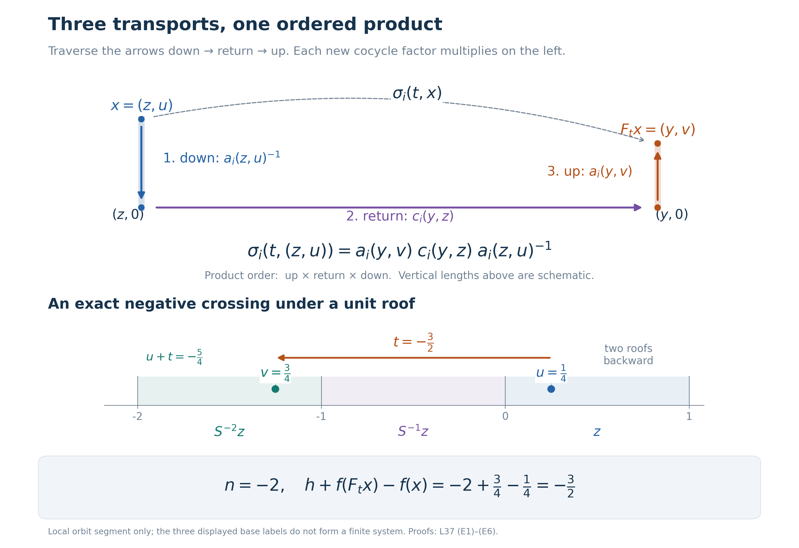

# Cohomology reduction for measurable flows

*Self-checked by the writing AI. New original prose and proof expression are dedicated under CC0.*

A return section converts a real flow into a countable relation. Cocycles require one preliminary step: identities that hold almost everywhere for each fixed time cannot simply be evaluated on that section. We first obtain strict representatives, reduce their return cocycles, and reconstruct the continuous motion. A second proof retains the original path-selector construction and makes the cohomological changes of coordinates explicit.

## The statement and the null-section issue

Let \(F:\mathbb R\times X\to X\) be a strict jointly Borel action on a standard Borel space carrying a nonzero sigma-finite measure \(\mu\). Every \(F_t\) is nonsingular, meaning that it and its inverse preserve null sets. Assume the flow is **properly ergodic**: invariant Borel sets are null or conull, and the measure is not concentrated on one orbit. Replacing \(\mu\) by an equivalent probability changes none of these hypotheses or any almost-everywhere assertion below.

Let \(P\) be a Polish group, let \(H\) be a Borel normal subgroup, and put \(K=\overline H\). The group \(H\) need not be closed, and \(P\) need not be locally compact or abelian. We are given jointly Borel maps \(\rho_i:\mathbb R\times X\to P\), \(i=1,2\), satisfying
\[
 \rho_i(t+s,x)=\rho_i(t,F_sx)\rho_i(s,x)
 \quad\text{for almost every }x,\text{ for each fixed }s,t.
 \tag{F1}
\]
Suppose also that
\[
 \rho_2(t,x)\rho_1(t,x)^{-1}\in K
 \quad\text{for almost every }x,\text{ for each fixed }t.
 \tag{F2}
\]

**Cocycle reduction theorem.** There are Borel maps \(f:X\to K\) and \(h:\mathbb R\times X\to H\) such that
\[
 \rho_2(t,x)=h(t,x)f(F_tx)\rho_1(t,x)f(x)^{-1}
 \quad\text{for almost every }x,\text{ for each fixed }t.
 \tag{F3}
\]

This is a statement about the given representatives, with the displayed quantifiers. It does not assert that those representatives satisfy an identity at every time on one common conull set. The discrepancy \(h\) is generally not an ordinary cocycle. If
\(\widetilde\rho_1(t,x)=f(F_tx)\rho_1(t,x)f(x)^{-1}\), substitution in (F1) gives
\[
 \begin{aligned}
 h(t+s,x)={}&h(t,F_sx)\widetilde\rho_1(t,F_sx)
                 h(s,x)\widetilde\rho_1(t,F_sx)^{-1}
 \end{aligned}
 \tag{F4}
\]
almost everywhere for each fixed \(s,t\). Normality of \(H\) keeps this product in \(H\).

The false premise to avoid is that a fixed-time almost-everywhere identity remains valid after restriction to a return section. In suspension coordinates the section has ambient measure zero. Strictification must precede restriction. The [strict-version theorem proved by Haar repair](../../OA-ERGODIC/reader/localizing-factor-actions-and-uniform-cocycles.html#3-making-a-measurable-cocycle-strict) supplies one route; a complete cohomologous strictification is proved later in this lesson.

We use [standard Borel coding and Borel inverses](OA-FLOW-L75.md#oa-flow.kernel.coding), and the proved [countable-section theorem](../../NCG-FOLIATIONS/transverse-measures-of-foliations.html#a-proof-of-the-countable-section-theorem), Theorem 5.4 and Corollary 5.5. In particular, a Borel relation with countable vertical sections has a Borel projection and countably many Borel partial maps enumerating those sections. These precise assertions justify the finite-class and marker selections below. The scalar integration inputs are [monotone convergence](OA-FLOW-SC.md#sc-04) and [dominated convergence](OA-FLOW-SC.md#sc-05), including its bounded finite-measure case. For a nonnegative Borel function on a product with a fixed sigma-finite measure, its parameter integral is Borel: indicator rectangles, the monotone-class theorem, and increasing simple approximation prove this successively, first on finite-measure pieces and then on their countable union.

## Suspension coordinates and signed crossings

The [suspension theorem](OA-FLOW-L38.md#oa-flow.suspension.theorem) gives an invariant conull Borel model
\[
 X_r=\{(z,u):z\in Z,\ 0\le u<r(z)\},
 \qquad [\mu_r]=[(\nu\times du)|_{X_r}],
 \qquad r(z)\ge\delta>0,
 \tag{F5}
\]
where \(Z\) is standard Borel, \(\nu\) is a nonzero sigma-finite measure, \(r\) is finite and Borel, and \(S:Z\to Z\) is an ergodic nonsingular Borel automorphism. The model map and its inverse are Borel and intertwine every time. Thus cocycles transfer by composition without any loss of joint Borel measurability, and conclusions can be transferred back.

The base can be restricted to an invariant conull aperiodic set. Indeed, the periodic part is Borel and invariant. If it were conull, one of the countably many least positive periods would hold conull by ergodicity. The corresponding finite classes have a Borel root selector: enumerate each class and minimize a fixed injective Borel real code over it. Push an equivalent probability to these roots. Every Borel event in this pushforward has probability zero or one, because its inverse image is invariant. Such a probability on a standard Borel space is a point mass: push it further by an injective code into \([0,1]\), and use nested dyadic intervals of probability one. The base is consequently concentrated on one finite orbit, and its suspension on one real orbit. This contradicts proper ergodicity. Remove the periodic part and keep the notation \(Z,S,r\).

Define signed roof sums for every integer \(n\):
\[
 R_n(z)=
 \begin{cases}
 \displaystyle\sum_{j=0}^{n-1}r(S^jz),&n>0,\\
 0,&n=0,\\
 \displaystyle-\sum_{j=n}^{-1}r(S^jz),&n<0.
 \end{cases}
 \qquad
 R_{m+n}(z)=R_m(S^nz)+R_n(z).
 \tag{F6}
\]
The identity follows by joining the successive oriented roof intervals; cancelling common terms proves it also when the indices have opposite signs. The lower bound makes the sums tend to the appropriate infinities. For \(x=(z,u)\) and \(t\in\mathbb R\), there is therefore one integer \(n=n(t,x)\) with
\[
 R_n(z)\le u+t<R_{n+1}(z),\qquad
 v=u+t-R_n(z),\qquad F_tx=(S^nz,v).
 \tag{F7}
\]
The countably many Borel inequalities make \(n,v\) jointly Borel. Aperiodicity makes \(n\) unique for the base arrow \((S^nz,z)\) as well. We orient that arrow from \(z\) to \(S^nz\).

## Strictify the pair in one Polish group

Independent changes of representatives should not be allowed to lose the subgroup condition. Package it into the target:
\[
 L=\{(p_1,p_2)\in P\times P:p_2p_1^{-1}\in K\}.
 \tag{F8}
\]
It is closed. It is a subgroup because the quotient map to \(P/K\) makes it the equal-image subgroup of \(P\times P\); equivalently, direct multiplication and inversion use normality of \(K\). A closed subgroup of a Polish group is Polish.

Replace \((\rho_1(t,x),\rho_2(t,x))\) by \((1,1)\) wherever it is outside \(L\). This is a jointly Borel modification. For each fixed \(t\), the changed set is null by (F2). For each fixed \(s,t\), its cocycle law can change only on the union of the three modification sets at \(s,t+s\), and the inverse image under \(F_s\) of the modification set at \(t\), together with the original law's null set. Nonsingularity makes this union null.

Apply [Theorem 3.1, strict versions](../../OA-ERGODIC/reader/localizing-factor-actions-and-uniform-cocycles.html#3-making-a-measurable-cocycle-strict), with acting group \(\mathbb R\) and target \(L\). Its hypotheses are exactly a strict nonsingular standard measured action of an lcsc group, a Polish target, joint Borel measurability, and the fixed-pair almost-everywhere cocycle law. Its path-space and Haar-repair proof yields an invariant conull Borel \(E\subseteq X_r\) and a strict jointly Borel pair \((\sigma_1,\sigma_2):\mathbb R\times E\to L\), satisfying
\[
 \sigma_i(t,\cdot)=\rho_i(t,\cdot)\quad\text{almost everywhere for each fixed }t,
 \qquad
 \sigma_2(t,x)\sigma_1(t,x)^{-1}\in K\quad(t\in\mathbb R,\ x\in E).
 \tag{F9}
\]
The strict law includes the unit value and holds for all time pairs and all points of \(E\).

We can now pass to the section. Put \(Z_0=\{z:(z,0)\in E\}\). This is Borel. Invariance gives \((z,u)\in E\) exactly when \(z\in Z_0\), and \(z\in Z_0\) exactly when \(Sz\in Z_0\). The complement's zero product measure in (F5), together with \(r(z)>0\), makes \(\nu(Z\setminus Z_0)=0\). Restrict to this base. The strict pair is now defined at every section point and every point above it.

## Finite relations from decreasing markers

We give the complete countable construction needed for the return cocycles.

**Marker lemma.** If \(S\) is an aperiodic Borel automorphism of a standard Borel \(Z\), its orbit relation \(R_S\) is an increasing union of finite Borel equivalence relations.

**Proof.** Start with \(Q_0=Z\). At stage \(n\ge1\), join distinct \(x,y\in Q_{n-1}\) when \(y=S^kx\) for some integer \(k\) with \(0<|k|<n\). This is a Borel graph with finitely many neighbours at each vertex.

Here is the Borel selection used at that stage. Fix an injective Borel code \(b:Z\to\{0,1\}^{\mathbb N}\). At a vertex \(x\), choose the least prefix length that distinguishes \(b(x)\) from the codes of every neighbour. It exists because there are finitely many neighbours. Its choice is Borel: failure at a given length is a finite-section Borel projection, or directly the finite union of the tests at the finitely many iterates \(S^kx\). The pair consisting of that length and the prefix is a countable Borel coloring. Adjacent vertices cannot share a color.

Enumerate the colors. At each color select all vertices having no already selected neighbour. Each such set is Borel, and same-color vertices are nonadjacent. Their countable union is a Borel independent set; every omitted vertex has a selected neighbour, because this was the reason for its rejection. Apply this rule to obtain a maximal independent \(Q_n\subseteq Q_{n-1}\).

Two distinct points of \(Q_n\) on one orbit are at least \(n\) integer steps apart. Every point of \(Q_{n-1}\) is within \(n-1\) steps of \(Q_n\), including distance zero for selected points. Induction gives
\[
 \text{every point of }Z\text{ is within }
 L_n=\sum_{j=1}^n(j-1)
 \text{ steps of a point of }Q_n.
 \tag{F10}
\]
For \(n=1\) this simply says \(Q_1=Z\). Thus, on each orbit, markers occur in both directions and have bounded finite gaps.

The intersection \(Q_\infty=\bigcap_nQ_n\) meets an orbit in at most one point: two points at a finite distance cannot meet every separation bound. Its saturation
\[
 B=\bigcup_{k\in\mathbb Z}S^kQ_\infty
 \tag{F11}
\]
is Borel and invariant. On \(Z\setminus B\), let the stage-\(n\) classes be the finite intervals starting at a \(Q_n\)-marker and ending just before the next marker. The last marker at or before a point is found by a bounded search using (F10); membership in an interval is consequently Borel. Finiteness follows from the bounded gaps. Since \(Q_{n+1}\subseteq Q_n\), these relations increase. The adjacent pair \(x,Sx\) lies in different stage-\(n\) intervals exactly when \(Sx\) is a marker. As \(Sx\notin Q_\infty\), this obstruction disappears at some stage and remains absent thereafter. Any two orbit points are joined by finitely many adjacent pairs, so eventually lie in one class.

On \(B\), every point has a unique representation \(S^kq\) with \(q\in Q_\infty\); uniqueness uses aperiodicity. Countable search gives Borel \(q\) and \(k\). At stage \(n\), put all coordinates \(-n\le k\le n\) over a fixed \(q\) in one class and leave the other points as singletons. These are finite Borel equivalence relations, increasing to the whole relation on \(B\).

Combine the two constructions on their invariant Borel pieces. The resulting finite relations have every unit, increase, and exhaust \(R_S\) exactly. \(\square\)

This proof needs no ergodicity, invariant measure, or uniform bound on the sizes of all finite classes. It selects markers, not one representative of every nonsmooth orbit.

## Reduce the returns and reconstruct every flow arrow

For the strict pair define
\[
 a_i(z,u)=\sigma_i(u,(z,0)),\qquad
 c_i(S^nz,z)=\sigma_i(R_n(z),(z,0)).
 \tag{F12}
\]
The graph of each \(S^n\) is Borel; the graphs are disjoint by aperiodicity, and their countable union is \(R_S\). Thus the second formula is Borel on \(R_S\). The strict law and (F6) make \(c_i\) a cocycle on this relation. The closed-pair condition gives \(c_2c_1^{-1}\in K\) at every arrow.

For \(F_t(z,u)=(y,v)\), the three successive arrows go down to \((z,0)\), through the return arrow to \((y,0)\), and up to \((y,v)\). Their times sum to \(-u+R_n(z)+v=t\). The strict inverse and composition laws therefore give
\[
 \sigma_i(t,(z,u))=a_i(y,v)c_i(y,z)a_i(z,u)^{-1}.
 \tag{F13}
\]
This includes negative crossings. In particular the gauge removing vertical transport uses the inverse at the range:
\(a_i(F_tx)^{-1}\sigma_i(t,x)a_i(x)=c_i(y,z)\).

The marker lemma supplies the exact finite exhaustion. Apply the fully proved [finite-relation cohomology reduction, Theorem 6.1](../../OA-ERGODIC/reader/compatible-lifts-and-cohomology-reduction.html#6-the-limiting-correction), with its [small-correction and extension proofs](../../OA-ERGODIC/reader/compatible-lifts-and-cohomology-reduction.html#4-a-small-correction-on-a-finite-class). The return system is nonsingular, and a probability equivalent to \(\nu\) supplies its standard measured base. The theorem gives Borel \(g:Z\to K\) and \(\ell:R_S\to H\) with
\[
 c_2(y,z)=\ell(y,z)g(y)c_1(y,z)g(z)^{-1}.
 \tag{F14}
\]
Its construction preserves each old arrow's discrepancy exactly when enlarging a finite stage; only the corrections on units converge. Hence \(\ell\) takes values in \(H\), even when \(H\) is nonclosed. Neither ergodicity nor a uniform bound on finite class sizes is required by that proof.

Put, for \(x=(z,u)\) and \(F_tx=(y,v)\),
\[
 \begin{aligned}
 k(z,u)&=a_2(z,u)g(z)a_1(z,u)^{-1},\\
 h_\sigma(t,x)&=a_2(y,v)\ell(y,z)a_2(y,v)^{-1}.
 \end{aligned}
 \tag{F15}
\]
All maps are Borel. Normality gives \(h_\sigma\in H\). Also
\[
 k(z,u)=
 \bigl[a_2(z,u)g(z)a_2(z,u)^{-1}\bigr]
 \bigl[a_2(z,u)a_1(z,u)^{-1}\bigr]\in K,
 \tag{F16}
\]
using normality for the first factor and the pair condition for the second.

The factor order can be checked without commuting anything:
\[
 \begin{aligned}
 &k(y,v)\sigma_1(t,(z,u))k(z,u)^{-1}\\
 &\quad=a_2(y,v)g(y)c_1(y,z)g(z)^{-1}a_2(z,u)^{-1}.
 \end{aligned}
 \tag{F17}
\]
Multiplication on the left by \(h_\sigma\), followed by (F14) and (F13), yields
\[
 \sigma_2(t,x)
   =h_\sigma(t,x)k(F_tx)\sigma_1(t,x)k(x)^{-1}
 \qquad(t\in\mathbb R,\ x\in E).
 \tag{F18}
\]
For the exact-representative strictification in (F9), take \(f=k\) and \(h=h_\sigma\), transfer them to the original invariant conull model, and extend them by the identity elsewhere. For each fixed \(t\), the two equalities in (F9) then turn (F18) into (F3). This proves the theorem.

## An alternative: paths and a selected constant orbit

We now prove the cohomologous strictification used in the second route. It needs only a strict nonsingular Borel real flow on a standard sigma-finite space; proper ergodicity will be used only when the strict cocycle is reduced on a suspension. Let \(L\) be any Polish group with a compatible complete metric \(d\), and write
\[
 w(t)=\tfrac12e^{-|t|},\qquad
 \mathcal P=L^0(\mathbb R,L),\qquad
 D(p,q)=\int_{\mathbb R}\min\{1,d(p(t),q(t))\}w(t)\,dt.
 \tag{F19}
\]
Paths are identified modulo Lebesgue null sets. The metric is convergence in the finite measure \(w(t)dt\), whose null sets are the Lebesgue null sets.

The space \(\mathcal P\) is Polish. For completeness, choose from a metric Cauchy sequence a subsequence whose consecutive distances are at most \(2^{-2n}\). The set where its consecutive pointwise distance exceeds \(2^{-n}\) has probability at most \(2^{-n}\). The measure of the union of these sets after index \(N\) tends to zero. Outside their limsup the path values are Cauchy in \(d\), so have a pointwise limit in \(L\). Set a default value on the remaining null set. The limit is measurable, and bounded convergence gives metric convergence of the subsequence; the Cauchy property gives convergence of the whole sequence.

For separability, first approximate any measurable path by a countably valued path with values in a fixed countable dense subset of \(L\), using first-index choices in balls of a prescribed radius. Truncate to finitely many values outside a set of small probability. Every Borel subset of \(\mathbb R\) is approximable in the probability \(w(t)dt\) by the algebra of finite unions of rational intervals: the class of approximable sets contains that algebra and is closed under complements and countable unions by finite-measure truncation, so the monotone-class theorem applies. Completed-measurable sets have the same approximation by Borel versions. This produces a countable dense family of simple paths.

Pointwise multiplication and inversion make \(\mathcal P\) a Polish group. Indeed, convergence in measure has a pointwise almost-everywhere convergent subsequence; continuity of multiplication and inversion, followed by the same subsequence argument for every subsequence, proves continuity of these operations. Constant paths form a closed subgroup identified with \(L\). On constants the metric is \(\min\{1,d\}\), so the inverse identification, denoted \(\Gamma\), is continuous.

Translation \(T_sp(t)=p(t+s)\) satisfies
\[
 D(T_sp,T_sq)\le e^{|s|}D(p,q).
 \tag{F20}
\]
For simple paths on rational intervals, continuity in \(s\) follows by estimating the measure of the small intervals swept out by their endpoints. Density and (F20) extend it to all paths and give joint continuity in \((s,p)\). Translations commute with multiplication by right constants.

For a jointly Borel \(L\)-valued cocycle \(\rho\), define
\[
 \Phi(x)=[t\mapsto\rho(t,x)]\in\mathcal P.
 \tag{F21}
\]
Its distances to the countable dense simple paths are Borel parameter integrals. Consequently \(\Phi\) is Borel.

Every right-constant orbit \(pL=\{pa:a\in L\}\) is closed. If \(pa_n\to q\) in measure, choose a subsequence converging pointwise almost everywhere. At one time in that conull set,
\(a_n\to p(t)^{-1}q(t)=a\); at every other good time the same limit gives \(q=pa\). Thus \(q\in pL\).

We construct a Borel choice depending only on this closed orbit. Fix dense sequences \((a_j)\) in \(L\) and \((p_j)\) in \(\mathcal P\). For every open \(V\subseteq\mathcal P\),
\[
 pL\cap V\ne\varnothing
 \quad\Longleftrightarrow\quad
 pa_j\in V\text{ for some }j.
 \tag{F22}
\]
These are Borel tests. Choose the first centre \(p_j\) whose open ball of radius \(1/2\) meets \(pL\). At stage \(n>1\), choose the first centre whose ball of radius \(2^{-n}\) meets \(pL\) and whose distance from the preceding centre is less than \(2^{-(n-1)}+2^{-n}\). Such a centre exists: start at a point of the orbit in the preceding open ball, then choose a dense centre sufficiently close to it. Every choice is Borel.

The centre sequence is Cauchy, and its distances from the closed orbit tend to zero. Let \(Q(p)\) be its limit. It belongs to \(pL\), and it is Borel as a pointwise limit of Borel maps into a Polish space. Since all the tests depend only on the orbit,
\[
 Q(pa)=Q(p),\qquad Q(Q(p))=Q(p).
 \tag{F23}
\]
Hence \(Y=\{p:Q(p)=p\}\) is a standard Borel subset of \(\mathcal P\), selecting exactly one path from each constant orbit. On \(Y\), put
\[
 A_sy=Q(T_sy).
 \tag{F24}
\]
This is a jointly Borel action: translation takes constant orbits to constant orbits, so (F23) gives \(A_sA_t=A_{s+t}\) and \(A_0=\operatorname{id}\).

## Recover one equivariant map by essential values

Suppose a Borel \(j:X\to Y\) satisfies \(j(F_sx)=A_sj(x)\) almost everywhere for every fixed \(s\). Put
\[
 \Theta_x(t)=A_{-t}j(F_tx).
 \tag{F25}
\]
Fubini gives essential constancy with value \(j(x)\) for almost every \(x\). There is also an explicit Borel test for all sources at which essential constancy holds. Choose an injective Borel code \(\chi:Y\to[0,1]\) with Borel image and inverse. Take the mean of \(\chi(\Theta_x(t))\) against \(w(t)dt\), require its variance to be zero and its mean to lie in \(\chi(Y)\). Each condition is Borel by parameter integration and Borel coding. Call the resulting set \(X_0\); applying \(\chi^{-1}\) to the mean gives a Borel \(j':X_0\to Y\).

Variance zero means the scalar function equals its mean almost everywhere, and injectivity of the code gives the unique essential value in \(Y\). Conversely any essentially constant path passes the test. Thus \(X_0\) is conull and \(j'=j\) almost everywhere. The exact point actions give
\[
 \Theta_{F_sx}(t)=A_s\Theta_x(t+s).
 \tag{F26}
\]
Translation preserves Lebesgue null sets. A bijection of \(Y\) carries a path with one essential value to a path with one essential value, and its inverse proves the converse. Therefore \(X_0\) is invariant under every \(F_s\), and (F26) identifies the values:
\[
 j'(F_sx)=A_sj'(x)\qquad(s\in\mathbb R,\ x\in X_0).
 \tag{F27}
\]
No uncountable intersection of good sets was used.

## A strict cocycle in the same measurable cohomology class

Apply this repair to \(j=Q\Phi\), where \(\Phi\) is (F21). For a fixed \(s\), the cocycle law and Fubini give
\[
 T_s\Phi(x)=\Phi(F_sx)\rho(s,x)
 \quad\text{in }\mathcal P\text{ for almost every }x.
 \tag{F28}
\]
Thus \(j(F_sx)=A_sj(x)\) almost everywhere, as required. Regard its repaired map \(j'\) as a path-valued Borel function \(\zeta:X_0\to Y\subseteq\mathcal P\). Exact equivariance says that \(T_s\zeta(x)\) and \(\zeta(F_sx)\) belong to the same constant orbit. Their quotient is consequently a constant path. Define
\[
 \sigma(s,x)=\Gamma\!\left(\zeta(F_sx)^{-1}T_s\zeta(x)\right),
 \qquad
 T_s\zeta(x)=\zeta(F_sx)\sigma(s,x).
 \tag{F29}
\]
The formula and continuity of \(\Gamma\) on constants make \(\sigma\) jointly Borel.

For all \(s,t,x\), translate the second equation in (F29) by \(t\), apply it at \(F_sx\), and use commutation with right constants. One obtains
\[
 T_{t+s}\zeta(x)
   =\zeta(F_{t+s}x)\sigma(t,F_sx)\sigma(s,x).
\]
The constant in (F29) is unique; hence \(\sigma\) satisfies the strict cocycle law. At zero its value is the identity.

On the conull Borel set where \(j'=j\), the paths \(\Phi(x)\) and \(\zeta(x)\) are in the same constant orbit. Set
\[
 b(x)=\Gamma(\zeta(x)^{-1}\Phi(x))
\]
there, and set \(b=1\) elsewhere. For each fixed \(s\), both \(x\) and \(F_sx\) lie in this good set almost everywhere by nonsingularity. Comparing (F28) with (F29) gives
\[
 \sigma(s,x)=b(F_sx)\rho(s,x)b(x)^{-1}
 \quad\text{almost everywhere for each fixed }s.
 \tag{F30}
\]
This proves cohomologous strictification with no Haar measure on the target group.

Apply this entire construction to the single \(L\)-valued pair from (F8). Then \(b=(b_1,b_2)\) also takes values in \(L\), including its default identity values. In particular,
\[
 b_2(x)b_1(x)^{-1}\in K,\qquad
 \sigma_2(t,x)\sigma_1(t,x)^{-1}\in K
 \tag{F31}
\]
at every source where the strict pair is used. The pair is strictified together; the closure condition survives the change of coordinates.

## Return through the two gauges

For this alternative pair, the suspension, marker and return arguments give the same \(k,h_\sigma\) and exact identity (F18). Define
\[
 \begin{aligned}
 f(x)&=b_2(x)^{-1}k(x)b_1(x),\\
 h(t,x)&=b_2(F_tx)^{-1}h_\sigma(t,x)b_2(F_tx).
 \end{aligned}
 \tag{F32}
\]
Normality of \(H\) gives \(h\in H\). For the correction,
\[
 f(x)=
 \bigl[b_2(x)^{-1}k(x)b_2(x)\bigr]
 \bigl[b_2(x)^{-1}b_1(x)\bigr]\in K.
 \tag{F33}
\]
The first factor belongs to \(K\) by normality. The second is the conjugate by \(b_2(x)^{-1}\) of \((b_2(x)b_1(x)^{-1})^{-1}\), so (F31) and normality put it in \(K\) as well.

Fix \(t\). Substitute both equalities (F30) in (F18), on their common conull set. Multiplying by \(b_2(F_tx)^{-1}\) on the left and \(b_2(x)\) on the right leaves precisely (F3) with (F32). Extend \(f,h\) by the identity on the omitted invariant null set and transfer through the suspension isomorphism. This proves the same theorem while retaining the explicit cohomological gauges.

The exact-representative route uses (F9) directly. The path-selector route uses (F30) and the additional cancellations (F32). Both keep the subgroup-valued discrepancy and the closure-valued correction distinct, and both return the stated fixed-time conclusion for the original cocycles.

## Reading the transports in order

In the [return reconstruction](OA-FLOW-L37.md#oa-flow.flowcocycle.returns), write \(x=(z,u)\) and \(F_tx=(y,v)\), where \(y=S^nz\) and \(t=R_n(z)+v-u\). For a strict cocycle \(\sigma_i\), set
\[
 a_i(z,u)=\sigma_i(u,(z,0)),\qquad
 c_i(y,z)=\sigma_i(R_n(z),(z,0)).
 \tag{E1}
\]
The arrow from \((z,u)\) down to \((z,0)\) has value \(a_i(z,u)^{-1}\). Indeed, the strict cocycle law at times \(u,-u\), together with its value \(1\) at time zero (a group element equal to its own square), makes these two vertical values inverses. Next travel from \((z,0)\) to \((y,0)\), with value \(c_i(y,z)\), and finally up to \((y,v)\), with value \(a_i(y,v)\). Each new arrow multiplies on the left, so
\[
 \sigma_i(t,(z,u))
   =\underbrace{a_i(y,v)}_{\text{up}}
      \underbrace{c_i(y,z)}_{\text{return}}
      \underbrace{a_i(z,u)^{-1}}_{\text{down}}.
 \tag{E2}
\]
For example, applying the cocycle law first to the times \(-u,R_n(z)\) and then to \(R_n(z)-u,v\) gives exactly (E2). The signed sum \(R_n\) handles negative returns as well. The path is traversed down, return, up; its group factors are read from right to left. No commutation of factors is involved.

### Integer discrepancy for a unit roof

Take an aperiodic ergodic nonsingular base, roof \(r=1\), and the additive target \(P=\mathbb R\) with \(H=\mathbb Q\) and \(K=\overline H=\mathbb R\). Use the strict cocycles \(\rho_1(t,x)=0\) and \(\rho_2(t,x)=t\). For \(0\le u<1\), put
\[
 n=\lfloor u+t\rfloor,\qquad v=u+t-n,\qquad
 F_t(z,u)=(S^nz,v),\qquad 0\le v<1.
 \tag{E3}
\]
The floor convention includes an exact roof hit in the next interval. It also works when \(u+t<0\); replacing the floor by truncation toward zero would give the wrong base point.

The return cocycles are \(c_1(S^nz,z)=0\) and \(c_2(S^nz,z)=n\). Thus the base reduction takes \(g=0\) and \(\ell(S^nz,z)=n\). The vertical correction and its discrepancy are
\[
 f(z,u)=u,\qquad h(t,(z,u))=n,\qquad
 \rho_2(t,(z,u))=n+v-u=t.
 \tag{E4}
\]
Here \(f\) can be irrational, whereas \(h\) is always an integer and therefore lies in \(H\). Its additive cocycle law can also be checked without an appeal to the reduction theorem: if \(n_s=\lfloor u+s\rfloor\) and \(u_s=u+s-n_s\), then
\[
 \lfloor u_s+t\rfloor+n_s
   =\lfloor u+s+t-n_s\rfloor+n_s
   =\lfloor u+s+t\rfloor.
 \tag{E5}
\]
This is a special additive example; a discrepancy in a general noncommutative reduction need not satisfy the ordinary untwisted cocycle law.

Two exact calculations check both signs:
\[
 \begin{array}{c|c|c|c|c}
 u&t&n&v&n+v-u\\\hline
 \tfrac34&\tfrac74&2&\tfrac12&\tfrac74\\
 \tfrac14&-\tfrac32&-2&\tfrac34&-\tfrac32
 \end{array}
 \tag{E6}
\]
In the second row, \(u+t=-5/4\) lies in \([-2,-1)\), so the endpoint lies over \(S^{-2}z\), at height \(3/4\). These are local orbit calculations within the stated suspension, and do not replace its base by a finite system.

*Travel order and multiplication order.* The upper panel shows the three transports in (E1)–(E2): the chronological path is down, return, up, so the cocycle is \(a_i(y,v)c_i(y,z)a_i(z,u)^{-1}\). The horizontal arrow denotes the signed return transport, and the vertical lengths are schematic. The lower panel is an exact unit-roof calculation: \(u=1/4\), \(t=-3/2\), \(u+t=-5/4\in[-2,-1)\), \(n=-2\), and \(v=3/4\). Therefore \(h+f(F_tx)-f(x)=-2+3/4-1/4=-3/2\), as proved in (E3)–(E6). The finitely many displayed cells are a local segment of an orbit, not a finite base system. See [the transport and unit-roof calculations](OA-FLOW-L37.md#oa-flow.flowcocycle.examples). [Reproduction source](../assets/flow-cocycle-reduction/render_transports.py), [exact constants and checks](../assets/flow-cocycle-reduction/exact_checks.json), [SVG](../assets/flow-cocycle-reduction/three-transports-crossings.svg), and [figure/font terms](../assets/flow-cocycle-reduction/ASSET_TERMS.md).

## Three checks on the gauges and the section

### Which gauge removes the vertical term?

**Problem.** For an additive kernel cocycle \(\rho(x_1,x_2)=a(x_1)-a(x_2)\), compare \(a(x_1)+\rho(x_1,x_2)-a(x_2)\) with \(-a(x_1)+\rho(x_1,x_2)+a(x_2)\). Here \(x_2\) is the source and \(x_1\) the range.

**Solution.** Substitution gives
\[
 \begin{aligned}
 a(x_1)+\rho(x_1,x_2)-a(x_2)&=2\bigl(a(x_1)-a(x_2)\bigr),\\
 -a(x_1)+\rho(x_1,x_2)+a(x_2)&=0.
 \end{aligned}
 \tag{X1}
\]
In multiplicative notation, if \(\rho(x_1,x_2)=a(x_1)a(x_2)^{-1}\), the cancellation is
\[
 a(x_1)^{-1}\rho(x_1,x_2)a(x_2)=1.
 \tag{X2}
\]
More generally (E2) gives \(a_i(y,v)^{-1}\sigma_i(t,(z,u))a_i(z,u)=c_i(y,z)\). The inverse belongs at the range, and the non-inverted factor at the source.

### Why can an almost-everywhere cocycle fail on the entire section?

**Problem.** In a unit-roof suspension put \(Q=Z\times\{0\}\), and define an additive real-valued map by
\[
 \rho(t,x)=
 \begin{cases}1,&x\in Q\text{ and }t\ne0,\\0,&\text{otherwise.}\end{cases}
 \tag{X3}
\]
Check its fixed-parameter cocycle law almost everywhere, and its failure when restricted to \(Q\).

**Solution.** The map is jointly Borel. The product measure class makes \(Q\) null: on each finite-measure member \(Z_k\) of a countable base cover, the rectangle \(Z_k\times\{0\}\) has measure \(\nu(Z_k)\,du(\{0\})=0\); take their union. For fixed \(t\), the function \(\rho(t,\cdot)\) equals the zero cocycle off \(Q\). For fixed \(s,t\), all terms in the cocycle identity vanish off \(Q\cup F_{-s}Q\), a null set by nonsingularity. However, for every \(x=(z,0)\),
\[
 \rho(2,x)=1,\qquad
 \rho(1,F_1x)+\rho(1,x)=1+1=2,
 \qquad F_1(z,0)=(Sz,0).
 \tag{X4}
\]
A section can consist entirely of exceptional points. One must obtain the strict representative before restricting it to the section; the ambient fixed-parameter almost-everywhere laws alone provide no such restriction.

### Why must the two gauges satisfy the closed-pair condition?

**Problem.** Suppose \(H\) is normal in \(P\), \(K=\overline H\), and \(k(x)\in K\). If strictification uses gauges \(b_1,b_2\), why is the condition \(b_2(x)b_1(x)^{-1}\in K\) needed when recovering \(f(x)=b_2(x)^{-1}k(x)b_1(x)\)?

**Solution.** Write \(d=b_2b_1^{-1}\). Normality of \(K\) gives
\[
 f=(b_2^{-1}kb_2)(b_2^{-1}b_1),\qquad
 b_2^{-1}b_1=b_2^{-1}d^{-1}b_2.
 \tag{X5}
\]
Thus \(d\in K\) puts both factors in \(K\). In fact, for \(k\in K\), this condition is equivalent to \(f\in K\): if \(f\in K\), the first factor in (X5) is already in \(K\), so \(b_2^{-1}b_1\in K\), and conjugating its inverse puts \(d\) in \(K\).

Constant independent gauges can violate it. In the additive group \(P=\mathbb R\), take \(H=K=\{0\}\), \(k=0\), \(b_1=0\), \(b_2=1\), and both original cocycles identically zero. Both transformed cocycles are still zero, but this choice gives \(f=-1\notin K\). The example shows the defect in the independent choice of gauges; choosing the two gauges together removes it.

The order also determines how the discrepancy returns to the original representatives in the [paired-gauge argument](OA-FLOW-L37.md#oa-flow.flowcocycle.gauges). If
\[
 \begin{aligned}
 \sigma_i(t,x)&=b_i(F_tx)\rho_i(t,x)b_i(x)^{-1},\\
 \sigma_2(t,x)&=h_\sigma(t,x)k(F_tx)\sigma_1(t,x)k(x)^{-1},
 \end{aligned}
\]
then, writing \(x'=F_tx\), multiplication by \(b_2(x')^{-1}\) on the left and by \(b_2(x)\) on the right gives
\[
 \begin{aligned}
 \rho_2(t,x)
 &=\underbrace{b_2(x')^{-1}h_\sigma(t,x)b_2(x')}_{h(t,x)}\\
 &\quad{}\cdot\underbrace{b_2(x')^{-1}k(x')b_1(x')}_{f(x')}
   \rho_1(t,x)
   \underbrace{b_1(x)^{-1}k(x)^{-1}b_2(x)}_{f(x)^{-1}}.
 \end{aligned}
 \tag{X6}
\]
Normality puts \(h(t,x)\) in \(H\), and (X5) puts \(f\) in \(K\). If the gauge identities hold almost everywhere for each fixed \(t\), (X6) has that same quantifier. The exact factor calculation does not convert it into an identity for all times on one common conull set.

### Further reading

Masamichi Takesaki, *Theory of Operator Algebras III*, Corollary XIII.3.29, printed pages 51–52, gives the flow reduction theorem; Theorem XIII.3.26 and Lemmas XIII.3.27–3.28 treat finite-relation reduction. The suspension theorem is in *Theory of Operator Algebras II*, Theorem XII.3.2, printed pages 385–388. The linked proofs above specify the standard Borel, strictification and finite-relation results used here.
