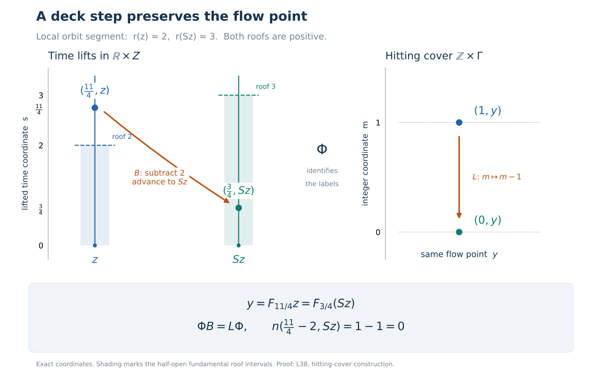

# A suspension from separated crossings

Self-checked by the writing AI.

A return section turns a real flow into upward motion between successive visits. There are three separate tasks: find visits separated by a fixed positive time, retain visits in both time directions, and identify the measure class in the resulting coordinates. We first prove the measure-class mechanism, then construct the section directly from coded orbit paths.

## What the suspension theorem assumes

Let \(X\) be a standard Borel space with a nonzero sigma-finite Borel measure \(\mu\), and let
\[
 F:\mathbb R\times X\longrightarrow X,\qquad
 F_0x=x,\quad F_sF_tx=F_{s+t}x
 \tag{S1}
\]
be jointly Borel. Every \(F_t\) is assumed nonsingular: it and its inverse preserve null sets. The flow is **ergodic** if every invariant Borel set is null or conull, and **properly ergodic** if it is ergodic and its measure is not concentrated on one orbit. Completed measure spaces are interpreted through these underlying Borel data.

The proper-ergodicity assumption matters. A fixed-point flow cannot be a positive-roof suspension, since sufficiently short nonzero vertical motions move every point. A periodic circle flow can have a finite return orbit. Our conclusion will have an aperiodic return transformation, on an invariant conull Borel part of the original space.

We may replace \(\mu\) by an equivalent probability. Explicitly, choose a Borel partition \(X=\bigsqcup_{n\geq1}E_n\) with \(\mu(E_n)<\infty\), set
\[
 h(x)=\sum_{n\geq1}\frac{2^{-n}1_{E_n}(x)}{1+\mu(E_n)},
 \qquad
 \mu_0=\frac{h\,\mu}{\int h\,d\mu}.
 \tag{S2}
\]
The denominator is finite and strictly positive, and \(h>0\) everywhere. Thus \(\mu_0\) is equivalent to \(\mu\). This operation preserves all the hypotheses and the desired measure-class conclusion.

The [standard Borel coding construction](OA-FLOW-L75.md#oa-flow.kernel.coding) gives an injective Borel coordinate into \([0,1]\), with Borel image and inverse. We also use the [injective Borel image theorem](../../NCG-FOLIATIONS/companions/polish-spaces-and-standard-borel-spaces.html#oa-fnd-pb-06) for other injective maps between standard Borel spaces. The countable enumerations below are supplied by the proved countable-section theorem, Theorem 5.4 and Corollary 5.5: a Borel relation with countable sections is a countable union of graphs of partial Borel maps with Borel domains, and its projection is Borel. The no-repetition version follows from Corollary 5.5. These results are applied only to countable sections.

All parameter integrals use the [probability-kernel integration proof](OA-FLOW-L75.md#oa-flow.kernel.integration), simple approximation and [monotone convergence](OA-FLOW-SC.md#sc-04), together with [dominated convergence](OA-FLOW-SC.md#sc-05) when a dominating integrable function is specified. Its parameter space may be any measurable space. A fixed sigma-finite measure is handled by partitioning into finite-measure pieces and summing. The corresponding Tonelli identity follows first for rectangles, then for all measurable sets by the same finite-measure pi–lambda argument, and finally for nonnegative functions by monotone convergence. This supplies the product integrations used below without a new selection hypothesis.

## A translation-invariant measure class is a product class

Let \(Z\) be standard Borel. Suppose \(\kappa\ne0\) is a sigma-finite Borel measure on \(\mathbb R\times Z\) whose null sets are preserved by every translation
\[
 R_t(s,z)=(s+t,z).
 \tag{S3}
\]
Choose an equivalent probability \(\kappa_0\), using (S2), and let \(\nu\) be its marginal on \(Z\). We claim
\[
 [\kappa]=[ds\,\nu(dz)].
 \tag{S4}
\]
This is a statement about null sets, not about equality of the two measures.

Take the everywhere positive probability density \(w(t)=e^{-|t|}/2\) and define
\[
 \overline\kappa(E)=\int_{\mathbb R}w(t)\kappa_0(R_{-t}E)\,dt
 \quad(E\subseteq\mathbb R\times Z\text{ Borel}).
 \tag{S5}
\]
The integrand is measurable by parameter integration, since
\(\kappa_0(R_{-t}E)=\int1_E(s+t,z)\,d\kappa_0(s,z)\).
Countable additivity follows from monotone convergence on disjoint partial sums, and \(\overline\kappa\) has mass one. If \(\kappa_0(E)=0\), every translate in (S5) is null. If \(\overline\kappa(E)=0\), the nonnegative integrand vanishes for almost every \(t\). At any one such time, nonsingularity of the translation gives \(\kappa_0(E)=0\). Thus \(\overline\kappa\) is equivalent to \(\kappa_0\).

Interchanging the two nonnegative integrals and substituting \(u=s+t\) gives
\[
 \overline\kappa(E)
 =\int_{\mathbb R\times Z}
       \left(\int_{\mathbb R}w(u-s)1_E(u,z)\,du\right)
       d\kappa_0(s,z).
 \tag{S6}
\]
For each fixed \((s,z)\), the inner integral vanishes precisely when the vertical section \(E_z\) is Lebesgue null, because \(w(u-s)>0\) for every \(u\). The function \(z\mapsto |E_z|\) is measurable by parameter integration on bounded intervals followed by an increasing limit. Hence the zero-integral condition in (S6) depends only on \(z\), and the marginal definition gives
\[
 \overline\kappa(E)=0
 \quad\Longleftrightarrow\quad
 |E_z|=0\text{ for }\nu\text{-almost every }z
 \quad\Longleftrightarrow\quad
 (ds\,\nu)(E)=0.
 \tag{S7}
\]
Together with equivalence to \(\kappa\), this proves (S4). Both measures are sigma finite, and completing them gives the same completed null sets. In particular, no measure obtained by restricting an ambient measure to a generally null section is needed.

## An exact continuous model of the Borel flow

Choose the injective Borel code \(\chi:X\to[0,1]\) just described. Let \(P\) be the space of Lebesgue-measurable paths \(p:\mathbb R\to[0,1]\), modulo almost-everywhere equality, with
\[
 d_P(p,q)=\frac12\int_{\mathbb R}|p(t)-q(t)|e^{-|t|}\,dt,
 \qquad
 J(x)=[t\mapsto\chi(F_tx)].
 \tag{S8}
\]
The positive weight means that its null sets are exactly the Lebesgue null sets. The metric is complete. From any Cauchy sequence select a subsequence whose successive distances have finite sum. Tonelli makes the sum of its successive pointwise absolute differences finite almost everywhere, so that subsequence has a pointwise limit in \([0,1]\). Dominated convergence gives convergence in \(d_P\), and the original Cauchy sequence has the same limit.

The space is separable. By [finite-exponent approximation](OA-FLOW-HR.md#hr-03) for the finite measure \(e^{-|t|}dt/2\), continuous compactly supported functions approximate integrable functions in \(L^1\). Truncating their values to \([0,1]\) preserves the approximation to a \([0,1]\)-valued path. On a compact interval, uniform continuity then approximates them by step functions with rational interval endpoints and rational values in \([0,1]\), zero outside a bounded interval. These step functions form a countable dense family. Thus \(P\) is Polish.

Translation \(T_sp(t)=p(t+s)\) satisfies
\[
 d_P(T_sp,T_sq)\leq e^{|s|}d_P(p,q).
 \tag{S9}
\]
This follows by \(u=t+s\) and \(e^{-|u-s|}\leq e^{|s|}e^{-|u|}\). A rational step path changes only on intervals of total length tending to zero when translated through a small time, so its translations are continuous in this metric. Approximation and (S9) prove continuity for every path. The same locally bounded estimate, together with continuity in \(s\) for a fixed path, proves joint continuity of \((s,p)\mapsto T_sp\).

The map \(J\) is Borel: its distances to the countable dense step paths are Borel parameter integrals, and rational balls about those paths generate the topology of \(P\). It is injective. If \(J(x)=J(y)\), at almost every time \(t\) one has \(\chi(F_tx)=\chi(F_ty)\). Choose any one such time. Injectivity of \(\chi\) and the bijectivity of \(F_t\) give \(x=y\). The Borel image theorem therefore makes \(Y=J(X)\) Borel and \(J^{-1}:Y\to X\) Borel. Moreover,
\[
 J(F_sx)=T_sJ(x)\qquad(s\in\mathbb R,\ x\in X)
 \tag{S10}
\]
holds exactly.

Put \(v=J_*\mu_0\) on \(P\), and let \(\Gamma=\operatorname{supp}v\). A countable base shows that \(\Gamma\) is closed and conull: its complement is the union of the basic open sets of measure zero. Each \(T_s\) is a homeomorphism and \((T_s)_*v\) is equivalent to \(v\), by (S10) and nonsingularity. Consequently \(T_s\Gamma=\Gamma\) for every \(s\). Thus \(\Gamma\) carries a continuous flow with full-support probability \(v\), and \(Y\cap\Gamma\) is an invariant conull Borel subset exactly isomorphic to an invariant conull part of the original flow. We write \(F_t\) for this continuous action on \(\Gamma\) during the construction.

We will repeatedly use one elementary consequence of ergodicity. If a Borel map on an invariant conull part is constant along orbits and has values in a standard Borel space, its pushforward probability takes only the values zero and one on Borel sets. Such a probability is a point mass. Indeed, in a countable point-separating family, select each set or its complement to have probability one. Their countable intersection has probability one and contains at most one point. This proves the assertion without a point-selection theorem.

The continuous model remains ergodic and properly ergodic. Its individual orbits are Borel, since each is the countable union of the compact sets \(F_{[-n,n]}y\). A conull orbit would intersect the invariant conull set \(Y\cap\Gamma\), hence would be an orbit there and contradict the original hypothesis.

## A Borel section with a fixed separation time

The continuous action on \(\Gamma\) is not everywhere trivial. Otherwise the identity map would be orbit constant, and the preceding observation would concentrate \(v\) at a point. Choose \(y_0\in\Gamma\) and \(t_0>0\) with \(F_{t_0}y_0\ne y_0\). In the metric space \(\Gamma\), choose neighbourhoods \(U,W\) of these two points with disjoint closures. Joint continuity supplies a nonempty open neighbourhood \(V\) of \(y_0\) and \(a\in(0,t_0)\) such that
\[
 F_sV\subset U,\qquad F_{t_0+s}V\subset W
       \quad(0\leq s\leq a).
 \tag{S11}
\]
For example, first choose sufficiently small product neighbourhoods at \((0,y_0)\) and \((t_0,y_0)\), then shrink their common spatial neighbourhood and their time intervals.

Choose \(b:\Gamma\to[0,1]\) continuous, equal to one on \(\overline U\) and zero on \(\overline W\). The formula
\(b(y)=d(y,\overline W)/(d(y,\overline U)+d(y,\overline W))\)
has these properties. Define
\[
 \psi(y)=\frac1a\int_0^a b(F_sy)\,ds,\qquad
 \delta=\frac a4.
 \tag{S12}
\]
This function is continuous: joint continuity gives uniform convergence of the integrands on the compact time interval near any fixed \(y\), by a finite product-neighbourhood cover. It equals one on \(V\) and zero on \(F_{t_0}V\). Comparing the two translated integration intervals gives
\[
 |\psi(F_ty)-\psi(F_sy)|\leq\frac2a|t-s|.
 \tag{S13}
\]
Indeed the symmetric difference of intervals of length \(a\), translated by \(t-s\), has length at most \(2|t-s|\), and \(0\leq b\leq1\).

Set
\[
 Z_0=\{y\in\Gamma:\psi(y)=1/2,\
                 \psi(F_ty)<1/2\text{ for all }0<t<\delta\}.
 \tag{S14}
\]
The strict uncountable-time condition has an exact Borel test. The compact intervals
\[
 I_n=[\delta/(n+2),\,\delta-\delta/(n+2)]
       \quad(n\geq1)
 \tag{S15}
\]
increase to \((0,\delta)\). Membership in \(Z_0\) is equivalent to \(\psi(y)=1/2\) and
\(\max_{t\in I_n}\psi(F_ty)<1/2\) for every \(n\). Each maximum is continuous in \(y\): continuity on a compact parameter set gives a locally uniform bound on the change of the integrand, which bounds the change of its maximum. The compact tests therefore make \(Z_0\) Borel. They allow a different positive gap below \(1/2\) on each \(I_n\); continuity at zero would preclude demanding one positive gap for all \(0<t<\delta\).

For \(y\in\Gamma\), let \(\mathcal T(y)=\{t:F_ty\in Z_0\}\). Distinct hits differ by at least \(\delta\). If \(t_1<t_2<t_1+\delta\) were hits, (S14) at \(F_{t_1}y\) would give \(\psi(F_{t_2}y)<1/2\), contradicting the second hit. Thus \(\mathcal T(y)\) is countable and locally finite; it is also closed, since a convergent sequence of distinct hits would contradict the same separation.

Every orbit through \(V\) meets \(Z_0\). For \(y\in V\), the continuous function \(t\mapsto\psi(F_ty)\) starts at one and has value zero at \(t_0\). On \([0,t_0]\), let \(t_1\) be its first zero and \(t_2\) its last value \(1/2\) before that zero. The relevant closed subsets of the compact interval attain these times. Between \(t_2\) and \(t_1\) the function is strictly below \(1/2\), since a later value at least \(1/2\) would force another equality before the zero. By (S13), \(t_1-t_2\geq a/4=\delta\). Hence \(F_{t_2}y\in Z_0\).

The relation \(\{(y,t):F_ty\in Z_0\}\) is Borel with countable time sections. The countable-section theorem makes its projection, the saturation of \(Z_0\), Borel. It is invariant and contains \(V\), whose measure is positive by full support. Ergodicity therefore makes this saturation conull.

## Removing orbits with a first or last hit

Enumerate the hitting times by partial Borel functions, using the same theorem. Within the saturation, the event that all hits are bounded above is Borel: it says that for some integer \(N\), every defined enumerated value is at most \(N\). It is invariant, because moving the starting point translates its set of hitting times. A nonempty separated set bounded above has a largest member: a sequence approaching its supremum must eventually be constant, by separation. The maximum \(t_{\max}(y)\) is Borel, as the supremum of the enumerated partial values. Thus
\[
 q(y)=F_{t_{\max}(y)}y
 \tag{S16}
\]
is Borel on this event. Since
\(\mathcal T(F_sy)=\mathcal T(y)-s\), its value is unchanged by every \(F_s\).

If the event had positive measure, ergodicity would make it conull. The orbit-constant map observation would make \(q(y)\) one fixed point almost everywhere. Every such \(y\) belongs to the orbit of that point, contradicting proper ergodicity. Thus the last-hit event is null. Applying the identical argument to the minimum of a hitting set bounded below shows that the first-hit event is null.

Remove these two invariant Borel null sets and the nonsaturated set, and intersect with \(Y\cap\Gamma\). Denote the retained invariant conull standard Borel space by \(\Gamma_1\), and put \(Z=Z_0\cap\Gamma_1\). Every orbit in \(\Gamma_1\) now meets \(Z\) at times unbounded in both directions. The unique increasing enumeration relative to time zero is
\[
 \cdots<\tau_{-1}(y)<\tau_0(y)\leq0
              <\tau_1(y)<\tau_2(y)<\cdots.
 \tag{S17}
\]
Each \(\tau_j\) is Borel. For instance, \(\tau_0\) is the largest enumerated value at most zero and \(\tau_1\) the smallest positive one; these extrema are attained by separation and unboundedness. Their values are countable suprema or infima of Borel partial values. Subsequent extrema beyond an already selected time are obtained in the same way, and recover every hit. When zero is a hit, it is \(\tau_0\); the half-open interval containing zero begins at that hit.

For \(z\in Z\), one has \(\tau_0(z)=0\). Define
\[
 r(z)=\tau_1(z),\qquad
 Sz=F_{r(z)}z,\qquad
 S^{-1}z=F_{\tau_{-1}(z)}z.
 \tag{S18}
\]
The predecessor and successor are inverse by their order among the hits. Hence \(S\) is a Borel automorphism and \(r\) is Borel, finite, and at least \(\delta\).

## The integer hitting cover and the deck map

For \(t\in\mathbb R\) and \(y\in\Gamma_1\), define
\[
 n(t,y)=j\quad\Longleftrightarrow\quad
          \tau_j(y)\leq t<\tau_{j+1}(y).
 \tag{S19}
\]
This integer-valued function is jointly Borel, because its level sets have the displayed Borel inequalities. Translating and reindexing the ordered hit list gives
\[
 \tau_j(F_ty)=\tau_{j+n(t,y)}(y)-t,\qquad
 n(s+t,y)=n(s,F_ty)+n(t,y).
 \tag{S20}
\]
The first identity follows by observing which hit is the last one at or before the new time zero. It is valid also when \(t\) is itself a hit, by the half-open convention. The second follows by testing which two consecutive terms contain \(s\).

On \(\widehat\Gamma=\mathbb Z\times\Gamma_1\), put
\[
 \widehat F_t(m,y)=(m+n(t,y),F_ty),\qquad
 L(m,y)=(m-1,y).
 \tag{S21}
\]
Equation (S20) proves the action law for \(\widehat F\), including the inverse at \(-t\); \(n(0,y)=0\) gives the identity. The action commutes with \(L\). Their useful coordinates are the Borel isomorphism
\[
 \begin{aligned}
 \Phi:\mathbb R\times Z&\longrightarrow\widehat\Gamma,\\
 \Phi(s,z)&=(n(s,z),F_sz),\\
 \Phi^{-1}(m,y)&=
       \bigl(-\tau_{-m}(y),\,F_{\tau_{-m}(y)}y\bigr).
 \end{aligned}
 \tag{S22}
\]
To verify the inverse, let \(z=F_{\tau_{-m}(y)}y\) and \(s=-\tau_{-m}(y)\). At the chosen hit, \(n(\tau_{-m}(y),y)=-m\); (S20) then gives \(n(s,z)=m\), while \(F_sz=y\). Conversely, if \(m=n(s,z)\) and \(y=F_sz\), the first part of (S20) gives
\(\tau_{-m}(y)=\tau_0(z)-s=-s\), recovering the original \((s,z)\). Countable pasting over \(m\) proves Borel measurability of the inverse. No injectivity of a single flow orbit map is needed for this calculation.

In these coordinates the two commuting actions are
\[
 R_t(s,z)=(s+t,z),\qquad
 B(s,z)=(s-r(z),Sz),\qquad
 \Phi R_t=\widehat F_t\Phi,\quad \Phi B=L\Phi.
 \tag{S23}
\]
The first intertwining identity is (S20). For the second, \(n(r(z),z)=1\), so
\(n(s-r(z),Sz)=n(s,z)-1\), and \(F_{s-r(z)}Sz=F_sz\). This fixes the minus sign in \(B\): crossing from a chosen section point to its successor reduces the real coordinate by one roof and reduces the integer coordinate by one. The inverse is
\(B^{-1}(s,z)=(s+r(S^{-1}z),S^{-1}z)\).

The diagram shows a local orbit segment with \(r(z)=2\), \(r(Sz)=3\), and \(s=11/4\). The two lifts \((11/4,z)\) and \((3/4,Sz)\) represent the same point \(y=F_{11/4}z=F_{3/4}(Sz)\). Formula (S23) sends them to the cover points \((1,y)\) and \((0,y)\): the orange deck arrow subtracts \(2\) from the time coordinate and \(1\) from the hitting label. Shading marks the half-open fundamental roof intervals; it does not depict a finite return system. The proof is (S19)–(S23). [Reproduction source](../assets/suspension-sections/render_signed_deck.py), [exact rational checks](../assets/suspension-sections/exact_checks.json), and [component terms](../assets/suspension-sections/ASSET_TERMS.md) accompany the original figure.

## Applying the product-class lemma to the cover

Restrict \(v\) to \(\Gamma_1\), still a probability. Give \(\widehat\Gamma\) the measure \(M=\#_{\mathbb Z}\otimes v\) and transport it by (S22) to a measure \(\kappa\) on \(\mathbb R\times Z\). It is nonzero and sigma finite. The integer shift \(L\) preserves \(M\). For the flow lift, a nonnegative Borel test \(f\) gives
\[
 \int f(\widehat F_t(m,y))\,dM(m,y)
   =\int_{\Gamma_1}\sum_{k\in\mathbb Z}f(k,F_ty)\,dv(y).
 \tag{S24}
\]
The equality simply reindexes \(k=m+n(t,y)\) for each \(y\). Nonsingularity of \(F_t\) shows that this integral is zero exactly when \(\int f\,dM=0\). Thus each \(\widehat F_t\) preserves the measure class of \(M\). By (S23), every \(R_t\) and \(B\) preserves the class of \(\kappa\).

There is an explicit equivalent probability on the cover: replace counting measure by \(p_m=2^{-|m|}/3\), whose sum is one, and pull back \(p\otimes v\) through \(\Phi\). Let \(\nu\) be its marginal on \(Z\). The product-class lemma now gives
\[
 [\kappa]=[ds\,\nu(dz)].
 \tag{S25}
\]
Moreover \(S\) is nonsingular for \(\nu\). For every Borel \(A\subseteq Z\),
\[
 B^{-1}(\mathbb R\times A)=\mathbb R\times S^{-1}A.
 \tag{S26}
\]
A full vertical cylinder is product-null exactly when its base is \(\nu\)-null. Equations (S25)–(S26) and nonsingularity of \(B\) therefore give
\(\nu(A)=0\) if and only if \(\nu(S^{-1}A)=0\).

## The fundamental domain, ergodicity and aperiodicity

Let
\[
 D_r=\{(z,u)\in Z\times\mathbb R:0\leq u<r(z)\},
 \qquad
 \Psi(z,u)=F_uz.
 \tag{S27}
\]
For these points \(n(u,z)=0\). Thus
\(\Phi(u,z)=(0,\Psi(z,u))\); note the order of coordinates in \(\Phi\).
The zero-integer slice in (S22) proves that \(\Psi\) is a Borel isomorphism onto \(\Gamma_1\), with inverse
\[
 \Psi^{-1}(y)=\bigl(F_{\tau_0(y)}y,\,-\tau_0(y)\bigr).
 \tag{S28}
\]
The restriction of \(M\) to \(\{0\}\times\Gamma_1\) is \(v\). Consequently (S25), with the two product coordinates interchanged, proves that
\(\Psi_*(\nu(dz)\,du|_{D_r})\) is equivalent to \(v\).
The product restriction is sigma finite, by the vertical slabs \(0\leq u\leq n\), even when \(r\) is unbounded.

Define the signed roof sums
\[
 R_0(z)=0,\qquad
 R_k(z)=\sum_{j=0}^{k-1}r(S^jz)\ (k>0),\qquad
 R_k(z)=-\sum_{j=k}^{-1}r(S^jz)\ (k<0).
 \tag{S29}
\]
They are exactly \(\tau_k(z)\). Since \(r\geq\delta\), they tend to \(+\infty\) and \(-\infty\) in the two directions. For each \((t,z,u)\), there is a unique integer \(k\) with
\(R_k(z)\leq u+t<R_{k+1}(z)\), and the suspension action is
\[
 F_t^{\,r}(z,u)
       =\bigl(S^kz,\ u+t-R_k(z)\bigr).
 \tag{S30}
\]
The integer \(k\) is Borel by these countably many inequalities. The second coordinate lies in \([0,r(S^kz))\). Only finitely many roofs are crossed in any bounded time interval, by the lower bound \(\delta\). Equation (S20), or direct concatenation of consecutive roof intervals, proves
\(\Psi F_t^{\,r}=F_t\Psi\) for every \(t,z,u\).
Thus (S30) is a strict jointly Borel nonsingular flow on the product measure class.

If a Borel set \(A\subseteq Z\) is \(S\)-invariant, the part of \(D_r\) above \(A\) is flow invariant. Its product measure is zero exactly when \(\nu(A)=0\), because every roof is positive; the same statement applies to its complement. Flow ergodicity therefore implies that \(S\) is ergodic. For an \(S\)-invariant set modulo null sets, remove the \(S\)-saturation of its invariance failure set. This is a countable union of null sets by nonsingularity, and outside it the set is exactly invariant. Thus the equivalent measured formulation of ergodicity holds as well.

We can now make \(S\) aperiodic on an invariant conull Borel set. The sets of points of exact finite period \(n\) are Borel and invariant. If their union had positive measure, one of them would be conull by ergodicity. On that set, choose in each finite orbit the point with smallest value of a fixed injective Borel real code. This is a Borel orbit-constant map: its finitely many comparisons are Borel and its minimum is unique. The zero-or-one probability argument then concentrates \(\nu\) on a single finite \(S\)-orbit. The whole tube above that finite orbit is one flow orbit, by (S29)–(S30). The product-class identification would concentrate \(v\), and hence the original measure, on that flow orbit, a contradiction.

Remove the periodic points from \(Z\) and their corresponding tube from \(\Gamma_1\). These are invariant Borel null sets in their respective spaces. Keep the same notation for the restrictions. Now
\[
 S^nz\ne z\quad(z\in Z,\ n\in\mathbb Z\setminus\{0\}).
 \tag{S31}
\]
The retained flow is free as well. If a point \(F_uz\) has period \(t>0\), then \(F_tz=z\). Thus \(t\) is a positive hit time at \(z\), and (S29) gives \(S^kz=z\) for its positive hit index \(k\), contradicting (S31).

## The complete suspension theorem

**Theorem.** Every nonzero standard sigma-finite nonsingular properly ergodic Borel real flow has an invariant conull Borel subset \(X_*\) with the following description. There are a standard Borel probability space \((Z,\nu)\), an aperiodic ergodic nonsingular Borel automorphism \(S:Z\to Z\), a finite Borel function \(r:Z\to(0,\infty)\), and a constant \(\delta>0\) such that \(r(z)\geq\delta\) everywhere. There is a Borel isomorphism
\[
 \Xi:D_r\longrightarrow X_*,
 \qquad
 [\Xi_*(\nu(dz)\,du|_{D_r})]=[\mu|_{X_*}],
 \qquad
 \Xi F_t^{\,r}=F_t\Xi
       \quad(t\in\mathbb R).
 \tag{S32}
\]
The last equality holds at every point, with \(F^r\) given by (S29)–(S30). In particular the invariant conull original flow is free.

**Proof.** Combine \(\Psi\) with the Borel inverse \(J^{-1}\) on the retained part of \(Y\cap\Gamma\). Every deletion made above was Borel, invariant and null. Equations (S10), (S25), (S27)–(S31) supply respectively exact equivariance, the measure class, the Borel chart, all-time vertical motion and aperiodicity. The initial replacement (S2) was equivalent to \(\mu\), which proves exactly the measure-class identity in (S32). \(\square\)

There is also a useful uniformly bounded-roof construction. The [bounded-section theorem for every free Borel flow](../../OA-ERGODIC/reader/dense-roof-groups-periods-and-eigenfunctions.html#3a4-uniform-gaps-and-the-full-suspension-chart) constructs successive gaps in \([a,3a)\) for any prescribed \(a>0\), using smoothing, sparse levels and Borel finite-degree selection. Its [measure-class passage](../../OA-ERGODIC/reader/dense-roof-groups-periods-and-eigenfunctions.html#suspension-coordinates-and-the-base-measure) applies positive-density averaging to that chart. The direct proof here obtains the required finite roof and fixed positive lower bound from separated crossings and the explicit hitting cover.

## Two free integrable coordinate actions on one cover

The cover also gives a useful operator-algebra conclusion. Equip
\(\widehat\Gamma=\mathbb Z\times\Gamma_1\) with the class of \(M=\#\otimes v\), and use the commuting actions \(L\) and \(\widehat F\) in (S21). Through \(\Phi\), this is the class of \(ds\,\nu(dz)\) on \(\mathbb R\times Z\), with actions \(B\) and \(R\) in (S23).

Both coordinate actions are free: \(L\) shifts the integer coordinate, and \(R_t\) shifts the real coordinate. They generate a free joint \(\mathbb Z\times\mathbb R\) action on the final retained cover. If \(L^k\widehat F_t(m,y)=(m,y)\), the second coordinate gives \(F_ty=y\); freeness of the retained original flow gives \(t=0\), then \(k=0\).

Their actions on the corresponding \(L^\infty\) algebra are normal. For example the real-coordinate action preserves \(ds\,\nu\) and is implemented on \(L^2(ds\,\nu)\) by ordinary translation. The integer-coordinate action similarly preserves \(\#\otimes v\). Pullback through the measure-class Borel isomorphism is a unital star isomorphism and an order isomorphism on the self-adjoint parts. An order isomorphism carries each bounded positive supremum to the corresponding supremum: an upper bound in the target pulls back to an upper bound in the source, and conversely. It is therefore normal, so these are normal actions on the same algebra.
The real action is continuous in the predual norm: finite sums \(a(s)b(z)\), with \(a\in C_c(\mathbb R)\) and bounded Borel \(b\), are dense in \(L^1(ds\,\nu)\). To see density, first truncate to bounded vertical intervals and use simple approximation; finite linear combinations of rectangle indicators are dense on each finite product by the finite-measure pi–lambda approximation argument, and the scalar indicators are approximated in \(L^1(ds)\) by continuous compact functions as in [HR3](OA-FLOW-HR.md#hr-03). Scalar translation is \(L^1\)-continuous by the common-compact-support argument in [L24](OA-FLOW-L24.md#oa-flow.grp.translations). The isometry of translation extends continuity from these finite sums to all \(L^1\). The discrete action is automatically continuous in its parameter.

Here **integrable** has the [bounded positive averaging-cone meaning](OA-FLOW-L72.md#oa-flow.model.domain): the positive bounded elements with bounded group averages have ultraweakly dense linear span. That section proves equivalently that there is an increasing family of positive contractive such elements tending strongly to one. Both actions have explicit sequences:
\[
 \begin{array}{lll}
 e_N(m,y)=1_{\{|m|\leq N\}},&
 \displaystyle\sum_{k\in\mathbb Z}e_N(L^k(m,y))=2N+1,
 &e_N\uparrow1,\\[4pt]
 f_N(s,z)=1_{[-N,N]}(s),&
 \displaystyle\int_{\mathbb R}f_N(R_t(s,z))\,dt=2N,
 &f_N\uparrow1.
 \end{array}
 \tag{S33}
\]
Positive scalar tests and Tonelli identify each displayed bounded orbit integral with its ultraweak average, or merely bound every compact partial average by the displayed constant. Increasing convergence to one is strong in the multiplication representation by scalar dominated convergence on each \(L^2\) vector. Thus both coordinate actions are integrable in that exact sense.

The fixed algebra of the integer action is the original algebra:
\[
 L^\infty(\widehat\Gamma,M)^{L}
       \cong L^\infty(\Gamma_1,v).
 \tag{S34}
\]
Indeed, invariance under the generator identifies \(f(m,y)\) with \(f(0,y)\) almost everywhere for each integer \(m\); one countable union of null sets gives the assertion for all \(m\). The residual real action on this fixed algebra is \(h(y)\mapsto h(F_{-t}y)\).

Likewise, in the real coordinates,
\[
 L^\infty(\mathbb R\times Z,ds\,\nu)^{R}
       \cong L^\infty(Z,\nu).
 \tag{S35}
\]
For completeness, if a bounded Borel \(f\) is invariant as a class under every translation, Fubini applied on countably many bounded intervals gives
\(f(s+t,z)=f(s,z)\) for almost every \((s,t,z)\). The substitution \(u=s+t\) shows that, for almost every \(z\), its values at almost every pair \(s,u\) are equal. Thus it is almost everywhere the function of \(z\) alone obtained by integrating \(f(s,z)\) against \(e^{-|s|}ds/2\). This function is Borel by parameter integration. The residual integer action is \(g(z)\mapsto g(S^{-1}z)\), since \(B^{-1}\) has base coordinate \(S^{-1}z\).

The joint action is ergodic. At the level of exactly invariant Borel sets, (S34) reduces this to ergodicity of \(F\). The same conclusion holds for fixed \(L^\infty\) classes. To justify the passage, let a bounded Borel \(h\) on \(\Gamma_1\) satisfy \(h\circ F_t=h\) almost everywhere for each \(t\). Fubini gives, for almost every \(y\), that the path \(t\mapsto h(F_ty)\) is essentially constant. The set of such \(y\)'s is Borel, for example by the vanishing of
\[
 \int_{\mathbb R^2}
     |h(F_ty)-h(F_sy)|^2
     \frac{e^{-|t|}}2\frac{e^{-|s|}}2\,dt\,ds.
 \tag{S36}
\]
It is invariant under every \(F_t\), since translations preserve Lebesgue null sets. On that set the integral
\(\int h(F_ty)e^{-|t|}dt/2\)
is its unique constant path value, is Borel, is exactly invariant, and equals \(h(y)\) almost everywhere. Set it to zero on the invariant null complement. Ergodicity makes this invariant representative constant: its real and imaginary level sets are invariant. Thus the joint fixed algebra is scalar. Statements (S33)–(S35) concern the two coordinate actions individually; no integrability assertion about their joint action is needed.

## Exercises with complete solutions

**1. Check one return and the deck sign.** For \(z\in Z\), verify the hitting cocycle at the first return and determine the integer change under \(B\).

**Solution.** The first positive hit is \(\tau_1(z)=r(z)\), so \(n(r(z),z)=1\). Equation (S20) with the times \(r(z)\) and \(s-r(z)\) gives
\[
 n(s,z)=n(s-r(z),Sz)+1.
 \tag{S37}
\]
Thus replacing \((s,z)\) by \((s-r(z),Sz)\) lowers the integer coordinate by one while leaving \(F_sz\) unchanged. It is exactly the deck transformation \(B\) satisfying \(\Phi B=L\Phi\). The inverse adds \(r(S^{-1}z)\) and uses the predecessor base point.

**2. A positive gap on every compact time interval.** Suppose locally
\(\psi(F_ty)=\tfrac12(1-t/\delta)\) for \(0\leq t\leq\delta\). Does (S14) require a single \(\varepsilon>0\) such that
\(\psi(F_ty)\leq1/2-\varepsilon\) for every \(0<t<\delta\)?

**Solution.** No. The values tend to \(1/2\) as \(t\downarrow0\), so no such uniform gap exists. On the particular compact interval \(I_n\) in (S15), the maximum occurs at \(t=\delta/(n+2)\), and its gap from \(1/2\) is
\[
 \frac1{2(n+2)}>0.
 \tag{S38}
\]
These gaps shrink with \(n\). This is precisely why the Borel test uses a separate strict maximum inequality for each compact interval.

**3. Why the averaging density is positive everywhere.** Explain the role of \(w(u-s)>0\) in (S6), and what fails in that argument if the weight is supported on a short interval.

**Solution.** With an everywhere positive weight, the inner integral is zero exactly when \(E_z\) is Lebesgue null, independently of the starting point \(s\). A short supported weight can miss a positive-measure part of \(E_z\). For example, if its support lies in \([-1,1]\), \(s=0\) and \(E_z=[2,3]\), the weighted integral is zero although \(|E_z|=1\). The implication identifying the inner zero set with a condition depending only on the nullity of the entire vertical section would therefore fail. The positive exponential weight proves exactly the equivalence needed in (S7).

The suspension and cover constructions can be compared with Masamichi Takesaki, *Theory of Operator Algebras II*, Theorem XII.3.2 and Corollary XII.3.3, printed pages 385–388. The Borel coding, countable-section, measure and operator-algebra inputs used here are the complete programme proofs linked at their points of use. The original exposition and proof organization in this lesson are dedicated under CC0-1.0; separately supplied figure and font terms remain with their components.
