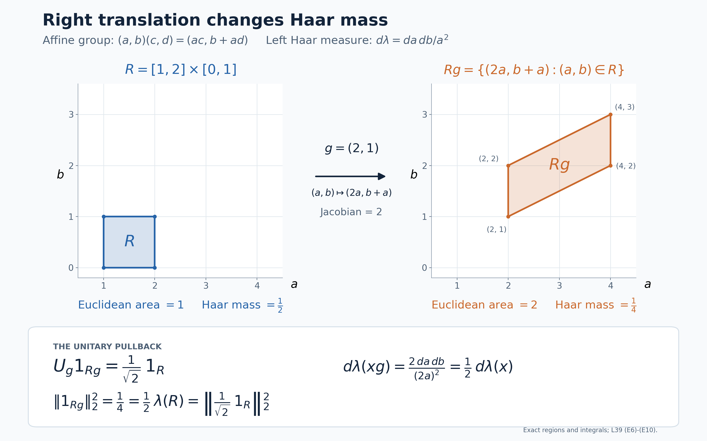

# Covariant representations over a moving diagonal

Self-checked by the writing AI.

A diagonal algebra assigns scalar coordinates to a Hilbert space. A unitary
normalizing that algebra can move those coordinates, so its disintegration has
two ingredients: a unitary between the appropriate fibres and a positive scalar
that compensates for the change of measure. We first construct this description
for a given covariant representation. We then build a different representation
from a measure on the state space and prove exactly when its Hilbert integral is
the GNS space of the barycentre.

## Two constructions and their precise conclusions

Let $A$ be a separable, possibly nonunital C*-algebra, and let $G$ be a separable
locally compact Hausdorff group. Let $\alpha:G\to\operatorname{Aut}(A)$ be
point-norm continuous. Suppose $\pi:A\to B(H)$ is a nondegenerate representation
on a separable Hilbert space, $U:G\to\mathcal U(H)$ is strongly continuous, and

$$U_g\pi(a)U_g^*=\pi(\alpha_g(a)).\tag{T1}$$

Fix a unital abelian von Neumann algebra $D\subseteq\pi(A)'$ satisfying
$U_gDU_g^*=D$. We do not assume $D\subseteq\pi(A)''$. The zero Hilbert space
has an empty direct integral; below we give the construction for $H\ne0$.

There are a compact metrizable space $X$, a continuous action $T:G\times X\to X$,
a full-support nonsingular probability $\mu$, a measurable field of separable
Hilbert spaces $K_x$, and a unitary

$$V:H\longrightarrow\mathcal K:=\int_X^\oplus K_x\,d\mu(x)$$

for which

$$VDV^*=\{M_f:f\in L^\infty(X,\mu)\},\qquad
V\pi(a)V^*=\int_X^\oplus\pi_x(a)\,d\mu(x).\tag{T2}$$

The representations $\pi_x$ are nondegenerate almost everywhere. For each fixed
$g$ there are measurable unitary arrows $u(g,x):K_x\to K_{T_gx}$, defined almost
everywhere, such that, with $j_g=d((T_g)_*\mu)/d\mu$,

$$ (VU_gV^*\eta)(y)
=j_g(y)^{1/2}u(g,T_g^{-1}y)\eta(T_g^{-1}y).\tag{T3}$$

For each fixed pair $g,h$ the identity

$$u(gh,x)=u(g,T_hx)u(h,x)\tag{T4}$$

holds almost everywhere. For each fixed $g$, one conull set works for all $a\in A$
in

$$u(g,x)\pi_x(a)u(g,x)^*=\pi_{T_gx}(\alpha_g(a)).\tag{T5}$$

These are fixed-parameter assertions. They do not assert one common invariant
conull set for every group parameter. The subsequent state-space construction
has canonical arrows at every state and an exact cocycle there; its stronger
pointwise conclusion comes from that additional construction.

Every operator of $\pi(A)''$ becomes a measurable field in the fibre algebras
$\pi_x(A)''$. The converse inclusion can fail: the two algebras in question are
not identified merely by (T2). An explicit constant-matrix example below will
separate them.

For the second construction let $\nu$ be a quasi-invariant Borel probability
on the weak-star state space $S(A)$. The canonical GNS spaces over $S(A)$ carry
an explicitly defined weighted, strongly continuous covariant representation.
We prove the following exact criterion: its canonical isometric embedding from
the GNS space of $\varphi=\int\omega\,d\nu(\omega)$ is onto if and only if,
for every Borel set $F$, the two partial barycentres
$\int_F\omega\,d\nu$ and $\int_{F^c}\omega\,d\nu$ have no nonzero common
positive minorant. This is the orthogonality convention used here; it is weaker
than norm orthogonality of the two functionals.

The proofs use the previously constructed
[sequential approximate identity](OA-FLOW-L40.md#oa-flow.istate.approximation),
[nonunital GNS representation](OA-FLOW-GNS.md#gns-theorem-5-1),
continuous functional calculus, and
[scalar monotone convergence](OA-FLOW-SC.md#sc-04).
Exact field, measure and operator-topology inputs are linked where they enter.

## A continuous compact model of the specified diagonal

Retain the nondegenerate covariant representation \((\pi,U,H)\), with \(H\ne0\) separable, of the separable, possibly nonunital \(C^*\)-system \((A,G,\alpha)\). The group \(G\) is separable locally compact Hausdorff, \(U\) is strongly continuous, and the unital abelian von Neumann algebra \(D\subseteq\pi(A)'\) is normalized by \(U\). Put
\[
 \beta_g(d)=U_gdU_g^*\qquad(d\in D).
 \tag{D1}
\]
The algebra \(D\) has separable predual, and \(\beta\) is predual-continuous. Indeed, the [concrete predual theorem CP6](OA-FLOW-CP.md#oa-flow.cp.6) realizes its predual as a quotient of the completed projective tensor product of the separable Hilbert space and its conjugate. For the norm continuity, write a normal functional as a summable vector series. Pullback by \(\beta_g\) replaces its two vector sequences by their \(U_g^*\)-translates. Each finite sum is norm-continuous, and Cauchy–Schwarz bounds the remaining tail uniformly in \(g\). This proves norm continuity of the complete functional orbit.

There is a faithful normal probability state \(\tau\) on \(D\). For example, choose a countable dense sequence of unit vectors \((v_n)\) in \(H\) and set
\[
 \tau(d)=\sum_{n\geq1}2^{-n}\langle dv_n,v_n\rangle.
 \tag{D2}
\]
The series converges in predual norm and has value one at the identity. If \(d\geq0\) has \(\tau(d)=0\), then \(d^{1/2}v_n=0\) for every \(n\), and density gives \(d=0\). No invariance of \(\tau\) is assumed.

Apply the [continuous compact-base construction](OA-FLOW-L41.md#oa-flow.cstd.setup) to the algebra \(M=D\), its whole centre \(D\), and \(\beta\). Its hypotheses are exactly those just checked; no centrality of \(D\) inside \(\pi(A)''\) is involved. It gives a unital separable invariant \(C^*\)-subalgebra \(C\subseteq D\), ultraweakly dense in \(D\), on which all orbits are norm-continuous.

The countability mechanism is useful here. Choose a countable ultraweakly dense family in the unit ball of \(D\) and countably many norm-dense predual tests. For each chosen \(d\) and integer \(n\), smooth \(d\) with a nonnegative normalized compactly supported Haar kernel that makes the first \(n\) tests differ from those of \(d\) by less than \(1/n\). The [normal integral and translation estimate](OA-FLOW-NR.md#oa-flow.nr.2) show that each smoothed element has norm at most one and a norm-continuous orbit. The smoothed elements converge ultraweakly to \(d\), because the tests are dense and the elements uniformly bounded. Generate \(C\) by the identity and their translates through a countable dense subset of \(G\). Every further translate is a norm limit of these translates: inverse images of norm balls are open and meet that dense subset. Thus \(C\) is invariant and still generates \(D\). This uses finite predual tests, not a countable neighbourhood base for \(G\).

Let \(X=\operatorname{Spec}C\), so \(C=C(X)\). It is a nonempty compact metrizable space. The compact-base construction, with the faithful state \(\tau\) as reference, gives its full-support Radon probability \(\mu\) and the normal isomorphism
\[
 \rho:L^\infty(X,\mu)\longrightarrow D,\qquad
 \rho(c)=c\quad(c\in C),\qquad
 \tau(\rho(f))=\int_X f\,d\mu.
 \tag{D3}
\]
This is the whole scalar algebra, not just \(C(X)\): in the faithful normal cyclic representation of \(D\) associated with \(\tau\), the map \(c\Omega\mapsto c\) is onto \(L^2(X,\mu)\), continuous multipliers generate all bounded measurable multipliers, and \(C\) generates \(D\). Those steps, including normality, are proved in the linked compact-base construction.

Define the continuous action on this very spectrum by
\[
 (T_gx)(c)=x(\beta_{g^{-1}}(c)),\qquad
 \beta_g(\rho(f))=\rho(f\circ T_g^{-1}).
 \tag{D4}
\]
The first formula is defined for all \(g,x\). Norm continuity on \(C\) proves joint continuity by testing characters on each \(c\). To see nonsingularity before extending the second formula to all \(f\), the faithful normal state \(\tau\circ\beta_{g^{-1}}\), transported through \(\rho\), defines a probability equivalent to \(\mu\). On continuous functions its value is integration against \((T_g)_*\mu\). Uniqueness of the finite Radon measure therefore makes \((T_g)_*\mu\) equivalent to \(\mu\). Both maps in the second formula of (D4) are normal, so their agreement on \(C(X)\) extends to all of \(L^\infty(X,\mu)\). These are exactly the nonsingularity and whole-algebra steps of the compact-base proof. Neither an invariant probability nor unimodularity has been used.

## The Hilbert field on that same compact base

We construct the field directly on \(X\); there is no separate spectral base left to identify. Decompose \(H\) into at most countably many nonzero orthogonal cyclic reducing subspaces for \(C\):
\[
 H=\bigoplus_{j\in J}H_j,\qquad
 H_j=\overline{C\eta_j},\qquad \|\eta_j\|=1.
 \tag{D5}
\]
Here \(J\) is nonempty and finite or countably infinite. To construct them, successively project a fixed countable dense sequence in \(H\) onto the complement of the previously chosen subspaces. When the result is nonzero, normalize it and take its cyclic subspace. A cyclic subspace for the abelian star algebra \(C\) reduces \(C\), so its orthogonal complement is invariant. It also reduces \(D\), by ultraweak closure. Every member of the original dense sequence lies in the accumulated subspaces after its step; hence they span \(H\).

Let \(\mu_j\) be the probability on \(X\) representing
\(c\mapsto\langle c\eta_j,\eta_j\rangle\). The [Radon representation theorem](OA-FLOW-HR.md#hr-02) and the continuous-function density proved in the [full Hilbert-integral argument](OA-FLOW-L40.md#oa-flow.istate.onto) give the onto cyclic isometry
\[
 H_j\longrightarrow L^2(X,\mu_j),\qquad c\eta_j\longmapsto c.
 \tag{D6}
\]
The scalar density assertion used here applies to every finite Radon measure on a compact metric space; it does not require an invariant state.

Each \(\mu_j\) is absolutely continuous with respect to the already chosen \(\mu\). In fact
\[
 \mu_j(F)=\langle\rho(1_F)\eta_j,\eta_j\rangle
 \quad(F\subseteq X\text{ Borel}).
 \tag{D7}
\]
The right side is a countably additive probability by normality. It is Radon by the [finite metric-measure regularity proof](OA-FLOW-IS.md#is-2), and its continuous integrals agree with the definition of \(\mu_j\), so Radon uniqueness proves (D7). If \(\mu(F)=0\), then \(\rho(1_F)=0\), proving the asserted absolute continuity.

The finite Radon–Nikodym construction gives nonnegative finite Borel versions
\[
 r_j=\frac{d\mu_j}{d\mu},\qquad
 E_j=\{x:r_j(x)>0\}.
 \tag{D8}
\]
One null set suffices for all the density versions because \(J\) is countable. The union of the \(E_j\)'s is conull. Indeed, on its complement \(F\), (D7) shows that the projection \(\rho(1_F)\) annihilates every \(\eta_j\). It commutes with \(C\), so it annihilates every \(H_j\) and hence all of \(H\). Faithfulness of \(\rho\) implies \(\mu(F)=0\).

Inside \(\ell^2(J)\), set
\[
 K_x=\overline{\operatorname{span}}\{\delta_j:x\in E_j\},
 \qquad s_j(x)=1_{E_j}(x)\delta_j.
 \tag{D9}
\]
The countable sections \(s_j\) specify the measurable structure by the Gram-field construction: their Gram entries are Borel, and they are total at each point. These fibres are nonzero almost everywhere and can have varying dimension. Combining (D6) with
\[
 (f_j)_{j\in J}\longmapsto
       \bigl(\sqrt{r_j(x)}\,f_j(x)\bigr)_{j\in J}
 \tag{D10}
\]
gives a unitary
\[
 V:H\longrightarrow\mathcal K
       :=\int_X^\oplus K_x\,d\mu(x).
 \tag{D11}
\]
Here the norm identity is the complete one:
\[
 \int_X\sum_j r_j(x)|f_j(x)|^2\,d\mu(x)
       =\sum_j\int_X|f_j|^2\,d\mu_j.
 \tag{D12}
\]
Tonelli proves it also for countably many coordinates. For surjectivity, take an arbitrary square-integrable measurable section \(\eta=(\eta_j)\) of (D9), and put
\(f_j=\eta_j/\sqrt{r_j}\) on \(E_j\), with value zero elsewhere. Its coordinates are measurable, and (D12) shows that the resulting \(f_j\)'s belong to the full Hilbert sum on the right. This is an inverse, not merely an isometry on a chosen dense subspace. The construction is the cyclic-subspace mechanism of the diagonal theorem, now performed using the prescribed \(C(X)\) and \(\mu\).

On continuous functions the construction intertwines \(\rho(c)\) with scalar multiplication. In fact it identifies all of \(D\):
\[
 V\rho(f)V^*=M_f,\qquad
 VDV^*=\{M_f:f\in L^\infty(X,\mu)\}.
 \tag{D13}
\]
Both sides of the first formula are normal in \(f\). For scalar multiplication, its vector coefficients are the \(L^1\) densities \(\langle\eta(x),\zeta(x)\rangle\). Integration against an \(L^1\) density is a normal functional: for a nonnegative density, truncate it to bounded densities, use the normal state in (D3), and pass to the predual norm limit; complex densities are linear combinations of positive ones. The vector-series criterion in CP6 therefore proves normality of the multiplication representation. Agreement on the ultraweakly dense \(C(X)\) proves (D13). Since \(K_x\ne0\) almost everywhere, this scalar representation is faithful.

## Genuine nondegenerate fibre representations

We henceforth use \(V\) to display operators on \(\mathcal K\). Every \(\pi(a)\) commutes with \(D\). The whole diagonal commutant theorem consequently supplies a measurable field representing \(V\pi(a)V^*\), with
\[
 \|V\pi(a)V^*\|=\operatorname*{ess\,sup}_x\|\pi_x(a)\|.
 \tag{D14}
\]
It also proves uniqueness almost everywhere, and that sums, products and adjoints correspond to pointwise operations. To obtain representations rather than unrelated fields for individual \(a\)'s, take a countable norm-dense star algebra \(A_0\) over \(\mathbb Q(i)\) in \(A\). Include the increasing positive contractive approximate identity \((e_n)\) constructed in [L40's approximation proof](OA-FLOW-L40.md#oa-flow.istate.approximation) among its generators.

Choose Borel field versions for the elements of \(A_0\). The operator-field norm is measurable, and equality of fields is tested on the countable sections \(s_j\). Uniqueness of the diagonal decomposition therefore permits removal of one Borel null set so that, at every remaining point, all of the following hold for every \(a,b\in A_0\) and \(\lambda\in\mathbb Q(i)\):
\[
 \begin{gathered}
 \pi_x(a+b)=\pi_x(a)+\pi_x(b),\qquad
 \pi_x(\lambda a)=\lambda\pi_x(a),\\
 \pi_x(ab)=\pi_x(a)\pi_x(b),\qquad
 \pi_x(a^*)=\pi_x(a)^*,\qquad
 \|\pi_x(a)\|\leq\|a\|.
 \end{gathered}
 \tag{D15}
\]
There are only countably many identities and bounds here. The norm bound makes \(a\mapsto\pi_x(a)\) extend uniquely to all of \(A\). Approximating elements and scalars by the dense rational algebra proves complex linearity, multiplicativity and preservation of adjoints for the extension. Thus it is a contractive star representation at every such point. For each \(a\in A\), approximation by \(A_0\) gives a norm limit of measurable operator fields, hence a measurable field, and the uniform operator estimate gives
\[
 V\pi(a)V^*=\int_X^\oplus\pi_x(a)\,d\mu(x).
 \tag{D16}
\]
This equality holds for all \(a\); it does not require choosing a new version on a new exceptional set for every \(a\).

Nondegeneracy is a further step. Globally \(\pi(e_n)\to I_H\) strongly, by the nondegeneracy hypothesis and the [strong approximate-identity limit](OA-FLOW-L40.md#oa-flow.istate.approximation). Each \(s_j\) in (D9) belongs to \(\mathcal K\), since \(\mu\) is a probability and \(\|s_j(x)\|\leq1\). Choose increasing integers \(n_k\) such that
\[
 \sum_{j\leq k}
   \bigl\|(V\pi(e_{n_k})V^*-I)s_j\bigr\|_{\mathcal K}^{\,2}
       \leq2^{-k},
 \tag{D17}
\]
where only existing indices are used when \(J\) is finite. Strong convergence on finitely many vectors makes this possible. Tonelli applied to the sum of these nonnegative errors gives, outside one Borel null set,
\[
 \pi_x(e_{n_k})s_j(x)\longrightarrow s_j(x)
       \quad\text{for every }j.
 \tag{D18}
\]
Since \(\|\pi_x(e_{n_k})\|\leq1\), fibrewise density of the \(s_j(x)\)'s extends this to strong convergence on every vector in \(K_x\). Each approximating vector lies in \(\pi_x(A)K_x\), so \(\pi_x\) is nondegenerate.

Denote by \(X_0\subseteq X\) the Borel conull set where the fibres are nonzero and the preceding representations are defined and nondegenerate. All fibre statements about \(\pi_x\) use this set. The continuous action remains defined on the original compact \(X\); \(X_0\) is not asserted to be invariant. On the null complement one may put \(K_x=0\) and \(\pi_x=0\), without changing \(V\), any operator integral, or (D13). For a fixed \(g\), the set \(X_0\cap T_g^{-1}X_0\) is conull by nonsingularity. This suffices for the moving arrows below.

### What an operator in \(\pi(A)''\) gives in the fibres

There is a useful inclusion even though no whole-algebra equality has been asserted. For every fixed \(B\in\pi(A)''\), its unique decomposable field satisfies
\[
 VBV^*=\int_X^\oplus B_x\,d\mu(x),\qquad
 B_x\in\pi_x(A)''\quad\text{for almost every }x.
 \tag{D19}
\]
First, \(B\) commutes with \(D\), so its field exists by the diagonal commutant theorem. Choose a countable dense family \((\eta_j)\) in \(\mathcal K\) that includes all the \(s_j\)'s. Such a family exists by the separability and localization proof for direct integrals, since the base is standard and the fibres have countable fundamental sections.

The [bounded strong-star density theorem](OA-FLOW-BD.md#oa-flow.bd.4), applied to the norm closure of \(\pi(A)\), supplies approximants bounded by \(\|B\|\) in its von Neumann closure. Choose one approximant for each finite list \(V^*\eta_1,\ldots,V^*\eta_n\), testing both the operator and its adjoint. Approximate it sufficiently closely in operator norm by some \(\pi(a_n)\), and, if desired, approximate \(a_n\) further in \(A\) by an element of \(A_0\). We can arrange
\[
 \begin{gathered}
 \|\pi(a_n)\|\leq\|B\|+1,\\
 \sum_{j\leq n}\left(
   \|(V\pi(a_n)V^*-VBV^*)\eta_j\|^2
   +\|(V\pi(a_n)^*V^*-VB^*V^*)\eta_j\|^2
   \right)\leq2^{-n}.
 \end{gathered}
 \tag{D20}
\]
No boundedness of \(\|a_n\|\) in \(A\) is needed or claimed. The bound is on their represented operators.

The exact norm identity in the diagonal theorem makes
\(\|\pi_x(a_n)\|\leq\|B\|+1\) outside a null set for each \(n\). Remove their countable union, along with the exceptions for \(B_x\) and its adjoint. Tonelli applied to (D20) gives convergence of both fibre operators on every \(\eta_j(x)\), outside one further null set. In particular it gives convergence on every \(s_j(x)\). Their fibrewise totality and the common operator bound imply
\[
 \pi_x(a_n)\longrightarrow B_x
       \quad\text{strongly-star for almost every }x.
 \tag{D21}
\]
The strongly closed algebra \(\pi_x(A)''\) contains each \(\pi_x(a_n)\), so it contains \(B_x\). This proves (D19). Its exceptional set is allowed to depend on \(B\). It gives no converse: measurable choices of elements of the separate fibre algebras need not come from one operator in \(\pi(A)''\).

## A normalizing unitary moves the fibres with a square-root density

Fix \(g\in G\), and put \(\widetilde U_g=VU_gV^*\). Nonsingularity and the scalar Radon–Nikodym theorem give a positive finite Borel version of
\[
 j_g(y)=\frac{d(T_g)_*\mu}{d\mu}(y).
 \tag{D22}
\]
Consider the pulled-back field \(K^{(g)}_y=K_{T_g^{-1}y}\), with its pulled-back fundamental sections. The map
\[
 \begin{aligned}
 W_g:\mathcal K&\longrightarrow
       \int_X^\oplus K_{T_g^{-1}y}\,d\mu(y),\\
 (W_g\eta)(y)&=j_g(y)^{1/2}\eta(T_g^{-1}y)
 \end{aligned}
 \tag{D23}
\]
is unitary onto the whole target. Indeed, the pushforward identity gives
\(\int j_g(y)\|\eta(T_g^{-1}y)\|^2\,d\mu(y)=\int\|\eta(x)\|^2\,d\mu(x)\).
Its inverse is
\[
 (W_g^{-1}\zeta)(x)=j_g(T_gx)^{-1/2}\zeta(T_gx).
 \tag{D24}
\]
The same change of variables proves square integrability of every inverse image. Nonsingularity preserves the null ideals, so both maps are well defined on Hilbert-space classes.

Both \(W_g\) and \(\widetilde U_g\) conjugate the scalar diagonal by \(f\mapsto f\circ T_g^{-1}\). Hence \(\widetilde U_gW_g^{-1}\), from the pulled-back integral to \(\mathcal K\), intertwines corresponding scalar multipliers at the same point \(y\). The two-space diagonal intertwiner proof applies: put this intertwiner into the off-diagonal block of the sum field, apply the whole diagonal commutant theorem, and use both unitarity identities of the original two-space intertwiner. It yields measurable unitaries
\[
 w_g(y):K_{T_g^{-1}y}\longrightarrow K_y
       \quad\text{for almost every }y.
 \tag{D25}
\]
This is a reconstruction of the specified global unitary, not a selection of arbitrary isomorphisms between spaces of equal dimension.

In source coordinates set \(u(g,x)=w_g(T_gx)\). Then
\[
 \begin{gathered}
 u(g,x):K_x\longrightarrow K_{T_gx},\\
 (\widetilde U_g\eta)(y)
   =j_g(y)^{1/2}u(g,T_g^{-1}y)\eta(T_g^{-1}y).
 \end{gathered}
 \tag{D26}
\]
The field is measurable for this fixed \(g\), and its arrows are unitary almost everywhere. Formula (D26) is an identity on the entire direct integral, in the sense of Hilbert-space classes. It makes no single pointwise assertion about all representatives of all vectors.

The reciprocal orientation is sometimes useful. Put
\[
 p_g(x)=\frac{d(T_{g^{-1}})_*\mu}{d\mu}(x)
       =\frac{d(\mu\circ T_g)}{d\mu}(x).
 \tag{D27}
\]
Here \((\mu\circ T_g)(F)=\mu(T_gF)\). The inverse density identity gives
\(j_g(T_gx)p_g(x)=1\) almost everywhere. Consequently (D26) is equivalently
\[
 u(g,x)\eta(x)
    =p_g(x)^{1/2}(\widetilde U_g\eta)(T_gx)
 \tag{D28}
\]
for each fixed \(g,\eta\), almost everywhere. The positive square root in (D26) is at the range point; the reciprocal factor in (D28) is at the source point.

For fixed \(g,h\), testing positive Borel functions in the two successive pushforwards proves
\[
 j_{gh}(y)=j_g(y)j_h(T_g^{-1}y)
       \quad\text{almost everywhere}.
 \tag{D29}
\]
Substitute (D26) twice in \(\widetilde U_g\widetilde U_h=\widetilde U_{gh}\), cancel the positive scalar factors using (D29), and apply uniqueness in the two-space diagonal theorem. Writing \(y=T_{gh}x\) gives
\[
 u(gh,x)=u(g,T_hx)u(h,x)
       \quad\text{almost everywhere for this fixed pair }g,h.
 \tag{D30}
\]
All comparisons can be made on the countable fundamental sections; equality on them identifies the bounded fibre maps.

The exceptional sets must be shifted correctly. If \(N_g,N_h,N_{gh}\) are null sets of sources where the corresponding arrow fields or endpoint conditions fail, a valid source exception for composition includes
\[
 N_h\ \cup\ T_h^{-1}N_g\ \cup\ N_{gh}\ \cup\ N^{\mathrm{chain}}_{g,h}.
 \tag{D31}
\]
The last null set includes the density-law failure after pulling it from \(y\) to \(x=T_{gh}^{-1}y\), and the null set from uniqueness of the composed field. Nonsingularity keeps every term null. The condition for the \(g\)-arrow is \(T_hx\notin N_g\), not merely \(x\notin N_g\). One may choose \(u(e,x)=I_{K_x}\) on \(X_0\); the inverse formula \(u(g^{-1},T_gx)=u(g,x)^*\) then follows almost everywhere for each fixed \(g\).

## Covariance, with its parameter quantifiers

For a fixed \(g\), conjugation by (D26) sends any bounded measurable operator field \(B_x\) to
\[
 B'_y=u(g,T_g^{-1}y)B_{T_g^{-1}y}u(g,T_g^{-1}y)^*.
 \tag{D32}
\]
The two density factors cancel, using (D24); measurability follows by testing the pulled-back fundamental sections, and the bound on the field is unchanged. Thus this is an identity for all decomposable bounded operators, independently of whether they belong to \(\pi(A)''\).

Apply it to the field in (D16). Global covariance
\(U_g\pi(a)U_g^*=\pi(\alpha_g(a))\) and uniqueness of the diagonal decomposition give, for fixed \(g,a\),
\[
 u(g,x)\pi_x(a)u(g,x)^*
       =\pi_{T_gx}(\alpha_g(a))
       \quad\text{almost everywhere}.
 \tag{D33}
\]
For a fixed \(g\), first impose this equality only for a countable norm-dense subset of \(A\), and remove its countable union of null exceptions, together with the failure sets for the unitary arrow and its two endpoints. On the resulting conull source set, both sides of (D33) are norm-continuous in \(a\), by contractivity of the representations and isometry of \(\alpha_g\). They therefore agree for **all** \(a\in A\) on this one fixed-\(g\) conull set.

Equations (D11), (D13), (D16), (D26), (D30) and (D33) prove the diagonal disintegration of the given covariant representation. The nondegenerate fibre representations share the static conull set \(X_0\). Each fixed group element has a conull set on which its arrow is unitary and covariance holds for every algebra element; each fixed pair has a conull set for the cocycle law. No common conull set for all group parameters is asserted. In particular no uncountable union of null exceptions has been taken.

The additional conclusion (D19) places every operator of \(\pi(A)''\) in the appropriate fibre von Neumann algebras almost everywhere. It does not identify \(\pi(A)''\) with their whole algebra of measurable fields. The scalar diagonal is exactly \(D\), and the hypothesis gives \(D\subseteq\pi(A)'\), not \(D\subseteq\pi(A)''\). This is the distinction retained by the constant-matrix example.

## The state space and its actual cyclic Hilbert spaces

Let \(A\) be a separable \(C^*\)-algebra, possibly without an identity. Let \(G\) be a separable locally compact Hausdorff group and let \(\alpha:G\to\operatorname{Aut}(A)\) be point-norm continuous. Inner products are linear in their first variable. We construct a field over the whole state space
\(\Omega=S(A)\), before choosing any measure on that space.

### A complete metric for the weak-star state space

The positive contractive functionals form
\[
 P=\{\omega\in A^*:\omega\geq0,\ \|\omega\|\leq1\}.
 \qquad
 \|\omega\|=\lim_{n\to\infty}\omega(e_n)\quad(\omega\in P),
 \tag{S1}
\]
where \((e_n)\) is the increasing positive contractive approximate identity constructed in [L40](OA-FLOW-L40.md#oa-flow.istate.approximation). The compact dual-ball proof applies to \(A^*\). Positivity is the closed condition \(\omega(a^*a)\geq0\) for every \(a\), so \(P\) is weak-star compact. If \((a_n)\) is norm dense in the unit ball of \(A\), the metric
\(d(\omega,\eta)=\sum_n2^{-n}|\omega(a_n)-\eta(a_n)|\)
induces its weak-star topology. Indeed the uniform bound on the norms of the functionals extends convergence on the dense sequence to convergence on every \(a\in A\); the reverse implication follows by controlling finitely many summands and then the uniformly bounded tail. It is a metric because the dense sequence separates bounded functionals. In particular \(P\) is compact metrizable and \(d\) is complete.

For clarity, the norm identity in (S1) does not presuppose that a positive restriction is a state. Let \(L=\lim_n\omega(e_n)\leq\|\omega\|\). Cauchy–Schwarz for the positive form \(\omega(b^*a)\), proved in the [GNS positive-form lemma](OA-FLOW-GNS.md#gns-lemma-2-1), gives
\[
 |\omega(e_na)|^2
 \leq\omega(e_n^2)\omega(a^*a)
 \leq\omega(e_n)\|\omega\|\|a\|^2.
\]
Since \(e_na\to a\) in norm, taking the limit and then the supremum over the unit ball gives \(\|\omega\|^2\leq L\|\omega\|\). The zero functional is immediate, and division in the remaining case proves (S1).

Consequently
\[
 \Omega
 =\bigcap_{k\geq2}O_k,\qquad
 O_k=\bigcup_{n\geq1}
       \{\omega\in P:\omega(e_n)>1-1/k\}.
 \tag{S2}
\]
Each \(O_k\) is open in \(P\). Here is a complete-metric proof of the resulting Polish assertion. Write \(F_k=P\setminus O_k\). On \(\Omega\), put \(r_k(\omega)=1/d(\omega,F_k)\) when \(F_k\ne\varnothing\), and \(r_k=0\) otherwise. Every displayed denominator is positive because \(F_k\) is closed and \(\omega\notin F_k\). The metric
\[
 \rho(\omega,\eta)=d(\omega,\eta)
   +\sum_{k\geq2}2^{-k}
       \min\{1,|r_k(\omega)-r_k(\eta)|\}
 \tag{S3}
\]
induces the subspace topology: continuity of finitely many \(r_k\)'s and the bounded tail prove one direction, and \(\rho\geq d\) proves the other. If a sequence is \(\rho\)-Cauchy, it has a \(d\)-limit \(\omega\in P\), and each real sequence \(r_k(\omega_n)\) is Cauchy and bounded. Its distances from every nonempty \(F_k\) are therefore bounded below by a positive number. Passing to the \(d\)-limit shows \(\omega\notin F_k\) for all \(k\), so \(\omega\in\Omega\). Coordinate convergence and the tail estimate then give convergence in \(\rho\). Thus \(\rho\) is complete. The inherited topology is second countable, hence separable: choose one point from each nonempty member of a countable base. This proves that \(S(A)\) with its weak-star topology is Polish. The argument includes the empty space when \(A=0\); choosing a probability on \(S(A)\) later automatically excludes that case.

### The nonunital cyclic vector is a measurable section

For each \(\omega\in\Omega\), take the completion of the quotient of \(A\) by its zero-norm vectors for
\[
 \langle[a]_\omega,[b]_\omega\rangle
       =\omega(b^*a),\qquad
 \pi_\omega(a)[b]_\omega=[ab]_\omega.
 \tag{S4}
\]
The [complete nonunital GNS construction](OA-FLOW-GNS.md#gns-theorem-5-1) gives a contractive nondegenerate representation on this very completion \(H_\omega\) and a cyclic unit vector \(\xi_\omega\) with
\(\pi_\omega(a)\xi_\omega=[a]_\omega\).
In particular this is not an arbitrary Hilbert space of the appropriate dimension.
The approximate identity gives the useful pointwise description
\[
 [e_n]_\omega\longrightarrow\xi_\omega,\qquad
 \|\xi_\omega-[e_n]_\omega\|^2
 =1-2\omega(e_n)+\omega(e_n^2)
 \leq1-\omega(e_n)\longrightarrow0.
 \tag{S5}
\]
The norm identity and convergence follow either from that GNS theorem or from its strong approximate-identity conclusion. Equivalently, the state extends to the unitization by
\(\widetilde\omega(a+\lambda1)=\omega(a)+\lambda\), and \(\xi_\omega\) is \([1]_{\widetilde\omega}\). Its positivity follows from
\(|\omega(a)|^2\leq\omega(a^*a)\), the state case of the positive-form bound: the value on \((a+\lambda1)^*(a+\lambda1)\) is at least
\(|\omega(a)+\lambda|^2\).
Equation (S5) shows that this unitization model has no extra Hilbert summand beyond the completion of \(A\).

Choose a countable norm-dense family \((b_n)\) in \(A\), including every \(e_n\), and put \(s_a(\omega)=[a]_\omega\), \(s_n=s_{b_n}\). Then
\[
 \langle s_n(\omega),s_m(\omega)\rangle
       =\omega(b_m^*b_n),\qquad
 \|s_a(\omega)-s_b(\omega)\|\leq\|a-b\|.
 \tag{S6}
\]
The Gram functions are continuous, and the values of the \(s_n\)'s have dense linear span in each fibre. The countable Gram construction, as used in [L40's measurable GNS field](OA-FLOW-L40.md#oa-flow.istate.gns), therefore supplies a measurable Hilbert field. Explicitly, a section \(\eta\) is Borel if and only if every function \(\omega\mapsto\langle\eta(\omega),s_n(\omega)\rangle\) is Borel. Enumerating the rational finite linear combinations \(d_l\) of the \(s_n\)'s gives
\(\|\eta(\omega)\|=\sup_l|\langle\eta(\omega),d_l(\omega)\rangle|/\|d_l(\omega)\|\), with \(0/0=0\). This proves measurable norms and closure under Borel scalar multiplication, countable pasting and pointwise norm limits.

In particular every \(s_a\) is Borel by norm approximation in (S6), and (S5) makes \(\omega\mapsto\xi_\omega\) a Borel unit section. The measurable Gram–Schmidt construction gives a countable orthonormal frame, with measurable dimension strata: at each step take the least index having nonzero residual, normalize on that Borel event, and use zero once the residuals all vanish. Thus variable finite or infinite dimensions are included.

For every \(a\in A\), the field \(\pi_\omega(a)\) is measurable and uniformly bounded, since
\[
 \pi_\omega(a)s_n(\omega)=s_{ab_n}(\omega),\qquad
 \langle\pi_\omega(a)s_n(\omega),s_m(\omega)\rangle
       =\omega(b_m^*ab_n),\qquad
 \|\pi_\omega(a)\|\leq\|a\|.
 \tag{S7}
\]
The operator-field test extends the assertion from fundamental vectors to all measurable sections. Nondegeneracy holds at every state: on \(s_b(\omega)\), the vectors \(\pi_\omega(e_n)s_b(\omega)=s_{e_nb}(\omega)\) tend to \(s_b(\omega)\); the contraction bound extends this to all of \(H_\omega\).

## Canonical arrows and weighted global transport

The action on states is
\[
 T_g\omega=\omega\circ\alpha_{g^{-1}}.
 \tag{S8}
\]
It is jointly continuous. For a net \((g_i,\omega_i)\to(g,\omega)\) and fixed \(a\), the difference of the corresponding evaluations is bounded by
\(\|\alpha_{g_i^{-1}}(a)-\alpha_{g^{-1}}(a)\|
+|\omega_i(\alpha_{g^{-1}}(a))-\omega(\alpha_{g^{-1}}(a))|\), which tends to zero. This proves continuity for the weak-star topology, and hence for the compatible topology just constructed on \(\Omega\).

Define on quotient vectors
\[
 v(g,\omega)[a]_\omega
      =[\alpha_g(a)]_{T_g\omega}
      :H_\omega\longrightarrow H_{T_g\omega}.
 \tag{S9}
\]
Its Gram form is unchanged, since
\((T_g\omega)(\alpha_g(b)^*\alpha_g(a))=\omega(b^*a)\).
It is therefore well defined and isometric. Its range contains every quotient vector in the target because \(\alpha_g\) is onto. An isometry from a complete Hilbert space has closed range; its dense range is thus the whole target. Hence (S9) extends to a unitary. Checking the quotient vectors proves simultaneously, at every indicated point,
\[
 \begin{aligned}
 v(e,\omega)&=I,&
 v(gh,\omega)&=v(g,T_h\omega)v(h,\omega),\\
 v(g,\omega)\xi_\omega&=\xi_{T_g\omega},&
 v(g,\omega)\pi_\omega(a)v(g,\omega)^*
      &=\pi_{T_g\omega}(\alpha_g(a)).
 \end{aligned}
 \qquad(g,h\in G,\ \omega\in\Omega,\ a\in A).
 \tag{S10}
\]
For the cyclic vector identity, apply \(v(g,\omega)\) to (S5). The sequence \((\alpha_g(e_n))\) is a positive contractive approximate identity, and its quotient vectors converge to \(\xi_{T_g\omega}\) by the nonunital GNS theorem. For covariance, evaluate on \([\alpha_g(b)]_{T_g\omega}\); both sides give \([\alpha_g(ab)]_{T_g\omega}\). These computations also prove the asserted exact group law on a dense subspace.

The arrow coefficients are jointly continuous:
\[
 \begin{aligned}
 &\langle v(g,\omega)s_n(\omega),s_m(T_g\omega)\rangle\\
 &\hspace{1cm}
 =(T_g\omega)(b_m^*\alpha_g(b_n))
 =\omega\bigl(\alpha_{g^{-1}}(b_m)^*b_n\bigr).
 \end{aligned}
 \tag{S11}
\]
Here \(g\mapsto\alpha_{g^{-1}}(b_m)^*b_n\) is norm continuous and the states have norm one, so the same two-term estimate as for (S8) applies. The topology of \(G\) need not be second countable. Because \(\Omega\) has a countable base \((B_n)\), each open subset \(O\subset G\times\Omega\) is a countable union \(O=\bigcup_n V_n\times B_n\): let \(V_n\) be the union of all open \(V\subset G\) for which \(V\times B_n\subset O\). The product-neighbourhood definition of openness proves the equality. Thus
\(\mathcal B(G\times\Omega)=\mathcal B(G)\otimes\mathcal B(\Omega)\).
In particular (S11) is jointly Borel for the product sigma-algebra. Applied to the source field \(H_\omega\) and target field \(H_{T_g\omega}\) over \(G\times\Omega\), the Gram and operator-field tests prove joint Borel measurability of the arrows in their measurable frames.

For a fixed \(g\), transporting any Borel section is also explicit. The scalar test against \(s_m(\omega)\) of
\(v(g,T_g^{-1}\omega)\eta(T_g^{-1}\omega)\)
is
\[
 \left\langle
    \eta(T_g^{-1}\omega),
    s_{\alpha_{g^{-1}}(b_m)}(T_g^{-1}\omega)
 \right\rangle.
\]
It is Borel, so the transported section is Borel. The same argument using adjoints and matrix coefficients shows that conjugating a measurable operator field by these arrows, with the base pullback, gives a measurable operator field.

Now choose any quasi-invariant Borel probability \(\mu\) on \(\Omega\); thus \((T_g)_*\mu\) and \(\mu\) have the same null sets for every \(g\). Form
\[
 \mathcal K_\mu=\int_\Omega^\oplus H_\omega\,d\mu(\omega),
 \qquad
 \Pi_\mu(a)=\int_\Omega^\oplus\pi_\omega(a)\,d\mu(\omega).
 \tag{S12}
\]
The direct-integral construction and (S7) give a bounded representation. It is nondegenerate: \(\pi_\omega(e_n)\to I\) strongly in every fibre and the integrand errors are bounded by \(4\|\eta(\omega)\|^2\), so [dominated convergence](OA-FLOW-SC.md#sc-05) gives \(\Pi_\mu(e_n)\eta\to\eta\).

The finite Radon–Nikodym theorem gives positive finite Borel versions, up to null sets, of
\[
 J_g^\mu=\frac{d(T_g)_*\mu}{d\mu},\qquad
 J_{gh}^\mu(\omega)
   =J_g^\mu(\omega)J_h^\mu(T_g^{-1}\omega)
       \quad\text{for \(\mu\)-almost every \(\omega\), for each fixed \(g,h\)}.
 \tag{S13}
\]
Positivity and finiteness almost everywhere follow from equivalence and finite total mass. For the chain rule, integration of the right-hand side against a nonnegative Borel \(F\) gives successively
\(\int F(T_g\omega)J_h^\mu(\omega)\,d\mu(\omega)\)
and \(\int F(T_gT_h\omega)\,d\mu(\omega)\). Uniqueness of densities proves (S13).

Define, as an operator on Hilbert-space classes,
\[
 (\mathcal U_g^\mu\eta)(\omega)
   =J_g^\mu(\omega)^{1/2}
      v(g,T_g^{-1}\omega)\eta(T_g^{-1}\omega).
 \tag{S14}
\]
The field and scalar factors are measurable. Nonsingularity makes the rule independent of the section's null-set representative. If one works with completed measures, each scalar coordinate in a measurable frame has a Borel version: replace the countably many sets of simple approximants by Borel sets and discard their null discrepancies. This supplies Borel field representatives and makes the same formula apply to all completed classes.

Change of variables proves
\[
 \|\mathcal U_g^\mu\eta\|^2
 =\int_\Omega J_g^\mu(\omega)
        \|\eta(T_g^{-1}\omega)\|^2\,d\mu(\omega)
 =\int_\Omega\|\eta(\omega)\|^2\,d\mu(\omega).
 \tag{S15}
\]
Combining (S13) with the pointwise arrow law gives \(\mathcal U_g^\mu \mathcal U_h^\mu=\mathcal U_{gh}^\mu\). In using the arrow at \(g\), its argument is \(T_g^{-1}\omega\); after the next pullback it is \(T_h^{-1}T_g^{-1}\omega=T_{gh}^{-1}\omega\), exactly as required. The density laws need only hold almost everywhere for the specified pair, and nonsingularity preserves the relevant null sets. In particular \(\mathcal U_{g^{-1}}^\mu\) is the inverse of the isometry \(\mathcal U_g^\mu\), so these are unitaries.

Fibre covariance proves
\[
 \mathcal U_g^\mu\Pi_\mu(a)(\mathcal U_g^\mu)^*
       =\Pi_\mu(\alpha_g(a)),\qquad
 \mathcal U_g^\mu(\omega\mapsto\xi_\omega)
       =(\omega\mapsto\sqrt{J_g^\mu(\omega)}\,\xi_\omega).
 \tag{S16}
\]
The canonical unit section belongs to \(\mathcal K_\mu\) because \(\mu\) is a probability. Its weighted image records precisely how the reference probability changes.

## Strong continuity through an equivalent averaged probability

We prove strong continuity of (S14). First consider any continuous action of this same group \(G\) on a Polish space \(\Omega\), with a quasi-invariant Borel probability \(\mu\).

### A strictly positive Haar weight and a variation estimate

Choose a relatively compact open identity neighbourhood \(V\) and a countable dense set \(\{d_n:n\geq1\}\) in \(G\). For each \(x\), the nonempty open set \(xV^{-1}\) meets that dense set, so \(G=\bigcup_n d_nV\). Hence the increasing compact sets
\(K_n=\bigcup_{j\leq n}d_j\overline V\)
cover \(G\). With left Haar measure \(dg\), define
\[
 w_0(g)=\sum_{n\geq1}\frac{2^{-n}1_{K_n}(g)}{1+|K_n|},
 \qquad
 c=\int_Gw_0(g)\,dg,\qquad w=c^{-1}w_0.
 \tag{S17}
\]
Haar measure is finite on the compact \(K_n\)'s. The series is bounded above by one and is strictly positive at every \(g\), because some \(K_n\) contains that point. By [monotone convergence](OA-FLOW-SC.md#sc-04), \(c\leq1\). Moreover \(c>0\): \(K_1\) contains the nonempty open set \(d_1V\), which has positive Haar measure by [Haar existence and positivity](OA-FLOW-HR.md#hr-06). Thus \(w\) is a strictly positive bounded Borel integrable function with integral one. This also proves the sigma compactness and Haar sigma finiteness needed here directly from separability of \(G\).

The continuous action is measurable for \(\mathcal B(G)\otimes\mathcal B(\Omega)\) by the countable-base argument above. The [parameter-integration theorem](OA-FLOW-L75.md#oa-flow.kernel.integration) applies to an arbitrary measurable parameter base and a probability kernel. Use \(G\) as the parameter base and the constant probability kernel \(\mu\) on \(\Omega\). It makes \(g\mapsto\mu(T_g^{-1}E)\) Borel: on rectangles the section integral is measurable, complements subtract from one, disjoint unions give increasing sums, and the proved pi–lambda argument extends the result to the product sigma-algebra. Thus
\[
 \nu(E)=\int_Gw(g)\,\mu(T_g^{-1}E)\,dg
       =\int_G\int_\Omega
          w(g)1_E(T_g\omega)\,d\mu(\omega)\,dg
 \tag{S18}
\]
defines a Borel probability. Countable additivity follows by applying monotone convergence to disjoint partial sums, and its total mass is \(\int w=1\). The corresponding iterated-integral identity for nonnegative Borel functions follows from indicators by simple approximation and monotone convergence; bounded complex tests follow by taking real and imaginary positive and negative parts. If \(\mu(E)=0\), quasi-invariance makes every integrand \(\mu(T_g^{-1}E)\) zero. Conversely, if \(\mu(E)>0\), every such integrand is strictly positive. Multiplication by the everywhere positive \(w\) gives a positive measurable function on all of \(G\), whose integral is positive. Indeed, if its integral were zero, all its positive level sets would be null, and their countable union \(G\) would be Haar null. Thus \(\nu\) and \(\mu\) are equivalent, and \(\nu\) is also quasi-invariant.

For a finite signed measure \(\lambda\), use the variation norm
\(\|\lambda\|_{\mathrm{var}}=\sup_{|F|\leq1}|\int F\,d\lambda|\), with bounded Borel tests. Left Haar substitution \(k=sg\) gives
\[
 \begin{aligned}
 (T_s)_*\nu(E)
    &=\int_G w(s^{-1}k)\,\mu(T_k^{-1}E)\,dk,\\
 \|(T_s)_*\nu-\nu\|_{\mathrm{var}}
    &\leq\|L_sw-w\|_1,\qquad
      (L_sw)(k)=w(s^{-1}k).
 \end{aligned}
 \tag{S19}
\]
The first identity uses \(T_sT_g=T_{sg}\). For the inequality, integrate any test \(F\) with \(|F|\leq1\), move the difference of the two scalar weights outside the inner probability integral, and take absolute values and the supremum. Only a left translation is used in this change of variables, so it has no modular multiplier.

Here \(\|L_sw-w\|_1\to0\) as \(s\to e\) in the full neighbourhood sense. To recall why, [HR's finite-set approximation](OA-FLOW-HR.md#hr-03) makes \(C_c(G)\) dense in \(L^1(G)\). For \(f\in C_c(G)\) and \(s\) in a relatively compact identity neighbourhood, all supports of \(L_sf-f\) lie in a common compact set. Joint continuity and a finite compact cover give \(\|L_sf-f\|_\infty\to0\), hence also its \(L^1\) norm tends to zero. The isometry of left translation then gives
\[
 \|L_sw-w\|_1
   \leq2\|w-f\|_1+\|L_sf-f\|_1\longrightarrow0
 \quad\text{after first choosing \(f\) close to \(w\)}.
 \tag{S20}
\]
The compact-cover assertion follows from the continuous function
\((s,t)\mapsto f(s^{-1}t)-f(t)\), which vanishes at \(s=e\): finitely many product neighbourhoods control it on the common compact support. This argument treats arbitrary nets converging to the identity.

Let \(q_s=d(T_s)_*\nu/d\nu\). The density of the signed difference in (S19) is \(q_s-1\), so its variation norm is exactly \(\int|q_s-1|\,d\nu\), by testing its measurable sign. Since \(q_s\geq0\),
\[
 \|\sqrt{q_s}-1\|_{L^2(\nu)}^2
 \leq\|q_s-1\|_{L^1(\nu)}
 =\|(T_s)_*\nu-\nu\|_{\mathrm{var}}
 \leq\|L_sw-w\|_1\longrightarrow0.
 \tag{S21}
\]
The pointwise inequality is
\((\sqrt t-1)^2\leq|t-1|\) for \(t\geq0\).

### Tightness, scalar density and the neighbourhood argument

We need compact tightness of the Borel probability \(\nu\), even when the Polish space is not locally compact. Choose a complete compatible metric and a countable dense sequence. Given \(\varepsilon>0\), for each positive integer \(n\) choose a finite union \(F_n\) of closed balls of radius \(2^{-n}\) with
\(\nu(F_n)>1-\varepsilon2^{-n}\). Such a finite union exists because the corresponding countable open balls cover the space, and finite partial unions have measures increasing to one. Then
\[
 K=\bigcap_{n\geq1}F_n
 \quad\text{is closed and totally bounded},\qquad
 \nu(\Omega\setminus K)<\varepsilon.
 \tag{S22}
\]
It is complete as a closed subset. Completeness and total boundedness make it compact: successive finite \(2^{-n}\)-covers give a Cauchy subsequence of every sequence, and that subsequence converges in \(K\). To pass from sequential compactness to the finite-subcover property, an open cover with no Lebesgue radius would give \(x_n\in K\) such that the relative ball \(B_K(x_n,1/n)\) lies in no cover member. A convergent subsequence contradicts openness of a member containing its limit. A positive Lebesgue radius, together with a finite sufficiently small net, gives a finite subcover. This proves the compactness used in (S22).

Bounded continuous functions are dense in \(L^2(\nu)\). Here is a direct metric proof. If \(F\) is closed, the continuous functions
\(\max\{0,1-n\,d(\,\cdot\,,F)\}\) decrease to \(1_F\), with the empty set treated by the zero function. Dominated convergence gives \(L^2\) convergence. Let \(\mathcal E\) be the class of sets whose indicators are \(L^2\) limits of continuous functions with values in \([0,1]\). It contains the closed sets and is closed under complements. It is closed under finite unions by taking maxima of approximants and using
\(|\max(a,b)-\max(c,d)|\leq|a-c|+|b-d|\). For a countable union, finite unions approximate its indicator in \(L^2\) by continuity of the finite measure from below, and then their continuous approximants do also. Thus \(\mathcal E\) is a sigma-algebra containing the closed sets, and hence all Borel sets. Simple-function approximation and truncation from [SC's \(L^2\) construction](OA-FLOW-SC.md#sc-07) prove the density assertion. The same holds for the completed measure, since its measurable sets have Borel versions.

Fix \(f\in C_b(\Omega)\) and a compact \(K\). The function
\((s,\omega)\mapsto f(T_s^{-1}\omega)-f(\omega)\)
is continuous and vanishes on \(\{e\}\times K\). For each point of \(K\), choose a product neighbourhood where its absolute value is less than a prescribed \(\delta>0\). A finite subcover of \(K\) and the intersection of the corresponding identity neighbourhoods give
\[
 \sup_{\omega\in K}|f(T_s^{-1}\omega)-f(\omega)|<\delta
       \quad(s\text{ in one identity neighbourhood}),
 \qquad
 \|f\circ T_s^{-1}-f\|_2^2
       \leq\delta^2+4\|f\|_\infty^2\nu(\Omega\setminus K).
 \tag{S23}
\]
First choosing \(K\) by (S22), then \(\delta\), proves the \(L^2\) limit as \(s\to e\). This is a neighbourhood proof; it does not apply a sequential dominated-convergence statement to a net.

For the scalar weighted operators \(R_s^\nu f=\sqrt{q_s}\,f\circ T_s^{-1}\), equations (S21) and (S23) give
\[
 \|R_s^\nu f-f\|_2
 \leq \|f\|_\infty\|\sqrt{q_s}-1\|_2
       +\|f\circ T_s^{-1}-f\|_2
 \longrightarrow0\qquad(f\in C_b(\Omega)).
 \tag{S24}
\]
Change of variables and the density chain rule make each \(R_s^\nu\) a unitary and give the group law, exactly as in (S13)–(S15) with scalar fibres. For arbitrary \(f\in L^2(\nu)\), choose \(f_0\in C_b(\Omega)\) with small \(L^2\) error and use
\[
 \|R_s^\nu f-f\|_2
 \leq2\|f-f_0\|_2+\|R_s^\nu f_0-f_0\|_2.
 \tag{S25}
\]
This proves strong continuity at the identity on all scalar \(L^2\). At any \(s_0\), the group law reduces the assertion to \(s_0^{-1}s\to e\).

### Localized GNS vectors and return to the original measure

Return to the state-space field of (S4). Its Hilbert direct integral over \(\nu\) has the dense subspace
\[
 \operatorname{span}\{
       f(\omega)s_{b_n}(\omega):
       f\text{ bounded Borel},\ n\geq1\}.
 \tag{S26}
\]
To prove density, suppose \(\eta\) is orthogonal to this span. For each \(n\), the scalar function \(c_n(\omega)=\langle\eta(\omega),s_n(\omega)\rangle\) is integrable by Cauchy–Schwarz and \(\|s_n(\omega)\|\leq\|b_n\|\). Orthogonality says \(\int\overline f\,c_n\,d\nu=0\) for every bounded Borel \(f\). Take a Borel version of \(f=c_n/|c_n|\) on its nonzero set and zero elsewhere to obtain \(\int|c_n|=0\). Off one countable union of null sets all the \(c_n\)'s vanish. Fibrewise totality of the \(s_n\)'s then gives \(\eta=0\). The Hilbert projection theorem makes (S26) dense. Moreover \(f\) in that formula can be approximated in scalar \(L^2\) by bounded continuous functions, and
\(\|(f-f_0)s_n\|_2\leq\|b_n\|\|f-f_0\|_2\).
Thus bounded continuous localized GNS vectors are dense as well.

The global weighted transport has the exact formula
\[
 \mathcal U_s^\nu(fs_a)
    =(R_s^\nu f)\,s_{\alpha_s(a)}.
 \tag{S27}
\]
It follows from (S9) evaluated at \(T_s^{-1}\omega\). For every \(f\in L^2(\nu)\) and \(a\in A\), (S6) and scalar unitarity therefore give
\[
 \|\mathcal U_s^\nu(fs_a)-fs_a\|_2
 \leq \|a\|\,\|R_s^\nu f-f\|_2
      +\|\alpha_s(a)-a\|\,\|f\|_2
 \longrightarrow0.
 \tag{S28}
\]
The first term uses the scalar strong continuity just proved; the second uses point-norm continuity of \(\alpha\). Equation (S26) and \(\|\mathcal U_s^\nu\|=1\) extend the limit to every vector, with error at most twice the chosen approximation error. The group law again gives strong continuity at every group element.

Finally let \(r=d\nu/d\mu\), which is positive and finite almost everywhere by equivalence. The exact change of measure is
\[
 C:\mathcal K_\nu\longrightarrow\mathcal K_\mu,\qquad
 (C\eta)(\omega)=\sqrt{r(\omega)}\,\eta(\omega).
 \tag{S29}
\]
It is an isometry by the density formula and is onto by multiplication by \(r^{-1/2}\). Both maps preserve measurability on their common conull set; arbitrary values on its null complement are irrelevant.
For each fixed \(g\), the densities satisfy
\[
 J_g^\nu(\omega)
    =\frac{r(T_g^{-1}\omega)}{r(\omega)}J_g^\mu(\omega)
       \quad\text{almost everywhere}.
 \tag{S30}
\]
Indeed integration of
\(r(T_g^{-1}\omega)J_g^\mu(\omega)\)
against \(F(\omega)\,d\mu(\omega)\) gives
\(\int F(T_g\omega)r(\omega)\,d\mu(\omega)\),
the integral for \((T_g)_*\nu\). Dividing the resulting density identity by \(r\) proves (S30). Substitution in the two weighted formulas gives
\[
 C \mathcal U_g^\nu=\mathcal U_g^\mu C,\qquad
 C\Pi_\nu(a)=\Pi_\mu(a)C.
 \tag{S31}
\]
The first equality uses
\(\sqrt r\,\sqrt{J_g^\nu}
=\sqrt{J_g^\mu}\,\sqrt{r\circ T_g^{-1}}\); scalar multiplication commutes with the fibre arrow. Thus the original \(\mathcal U^\mu\) is strongly continuous as well.

We have obtained a strongly continuous covariant representation on the actual direct integral of the cyclic state-space GNS fibres for every quasi-invariant Borel probability \(\mu\). The fibre arrows and their cyclic-vector, cocycle and covariance identities hold at every state for all group parameters. The scalar density identities are identities of measure classes for each specified parameter or pair, which suffices for the global unitary representation. Identifying this Hilbert direct integral with the GNS space of a particular barycentre is a further onto statement.

## When the barycentre GNS map is onto

Let $A\ne0$ be separable and possibly nonunital. In this section no group is
needed. Let $\nu$ be a Borel probability on $S(A)$ and use the canonical GNS
field constructed above. Define bounded positive functionals

$$\varphi(a)=\int_{S(A)}\omega(a)\,d\nu(\omega),\qquad
\varphi_F(a)=\int_F\omega(a)\,d\nu(\omega).\tag{O1}$$

Here $F$ is Borel. The increasing approximate identity $(e_n)$ proved in
[L40](OA-FLOW-L40.md#oa-flow.istate.approximation) satisfies
$\omega(e_n)\uparrow1$ for every state, by the
[nonunital GNS theorem](OA-FLOW-GNS.md#gns-theorem-5-1). Therefore

$$\varphi(e_n)\longrightarrow1,\qquad
\varphi_F(e_n)\longrightarrow\nu(F).\tag{O2}$$

Monotone convergence justifies both limits. Integration bounds the functional
norms by $1$ and $\nu(F)$, and (O2) gives the reverse inequalities. Thus
$\varphi$ is a state and $\|\varphi_F\|=\nu(F)$, also without a unit in $A$.

We call $\nu$ **orthogonal** when, for every Borel $F$,

$$0\le\eta\le\varphi_F,\qquad0\le\eta\le\varphi_{F^c},
\qquad\eta\in A^*_+\quad\Longrightarrow\quad\eta=0.\tag{O3}$$

The order here is the usual order on positive functionals: an inequality means
that their difference is nonnegative on all positive elements of $A$.

Write $s_a(\omega)=\pi_\omega(a)\xi_\omega$ and
$\xi(\omega)=\xi_\omega$. The canonical field has $\|s_a(\omega)\|\le\|a\|$
and a countable fibrewise total family $s_{a_k}$ from a norm-dense sequence in
$A$. Its unit section $\xi$ is measurable. The barycentre identity makes

$$V\pi_\varphi(a)\xi_\varphi=s_a,\qquad
V:H_\varphi\longrightarrow\mathcal K_\nu:=
\int_{S(A)}^\oplus H_\omega\,d\nu(\omega)\tag{O4}$$

an isometry: the two squared norms are both $\varphi(a^*a)$. It extends from
the dense GNS vectors to an isometry with closed range $K_0$. On generating
vectors it intertwines $\pi_\varphi(a)$ with
$\Pi(a)=\int^\oplus\pi_\omega(a)\,d\nu$. Also $V\xi_\varphi=\xi$.
Indeed, $\pi_\varphi(e_n)\xi_\varphi\to\xi_\varphi$ and
$s_{e_n}(\omega)\to\xi_\omega$ in every fibre; the squared errors are at most
$4$, so [dominated convergence](OA-FLOW-SC.md#sc-05) gives convergence in the
integral Hilbert space. Consequently

$$K_0=\overline{\Pi(A)\xi}.\tag{O5}$$

We have not yet proved that this cyclic subspace is the whole integral.

### Positive derivatives in the GNS commutant

The [dominated-functional lemma in L25](OA-FLOW-L25.md#oa-flow.ccov.extremality)
gives a unique positive contraction $T_F\in\pi_\varphi(A)'$ with

$$\varphi_F(a)=\langle T_F\pi_\varphi(a)\xi_\varphi,\xi_\varphi\rangle.
\tag{O6}$$

That part of the lemma needs no invariance hypothesis: it can be applied with
the trivial group action. To recall its construction, the form
$\varphi_F(b^*a)$ on the vectors $\pi_\varphi(a)\xi_\varphi$ is bounded by
their GNS norms, since $0\le\varphi_F\le\varphi$. Its positive representing
contraction commutes with $\pi_\varphi(A)$ by moving an algebra element between
the two arguments of the form. Taking the second argument along $e_n$ proves
(O6). Thus the construction and its uniqueness apply to nonunital $A$ as well.
We use inner products linear in the first variable.

For a positive commutant operator $T$, put
$\psi_T(a)=\langle T\pi_\varphi(a)\xi_\varphi,\xi_\varphi\rangle$.
It is positive because it is the vector functional of $T^{1/2}\xi_\varphi$.
This correspondence preserves and reflects order. Preservation is immediate;
for reflection, if $\psi_S\le\psi_T$, then

$$\langle(T-S)\pi_\varphi(a)\xi_\varphi,
                 \pi_\varphi(a)\xi_\varphi\rangle
=(\psi_T-\psi_S)(a^*a)\ge0.\tag{O7}$$

These vectors are dense, so $T-S\ge0$. In particular the correspondence is
injective and $T_{F^c}=I-T_F$.

Assume (O3). Functional calculus gives

$$0\le T_F(I-T_F)\le T_F,\qquad
0\le T_F(I-T_F)\le I-T_F.\tag{O8}$$

The corresponding positive functional is a common minorant in (O3), hence
zero. Injectivity gives $T_F(I-T_F)=0$: every $T_F$ is a projection.

Conversely, if $T_F$ is a projection and $0\le\eta\le\varphi_F,\varphi_{F^c}$,
the derivative $R$ of $\eta$ relative to $\varphi$ satisfies
$0\le R\le T_F,I-T_F$. For any projection $P$, $0\le R\le P$ implies
$R=PRP$: on $(I-P)H$ the quadratic form of $R$ vanishes, so
$R^{1/2}(I-P)=0$. Apply this to the two complementary projections to obtain
$R=0$, and hence $\eta=0$. Condition (O3) is therefore equivalent to all of
these derivatives being projections.

### Why compression produces all localized vectors

Let $Q_F=M_{1_F}$ on $\mathcal K_\nu$. On every pair of dense GNS vectors,

$$\begin{aligned}
\langle V^*Q_FV\pi_\varphi(a)\xi_\varphi,
                  \pi_\varphi(b)\xi_\varphi\rangle
&=\int_F\omega(b^*a)\,d\nu(\omega)\\
&=\langle T_F\pi_\varphi(a)\xi_\varphi,
                  \pi_\varphi(b)\xi_\varphi\rangle.
\end{aligned}\tag{O9}$$

Thus $V^*Q_FV=T_F$. More generally, if $V$ is an isometry, $Q$ is a projection
and $T=V^*QV$, expansion gives the exact identity

$$\|QVh-VTh\|^2=\langle(T-T^2)h,h\rangle.\tag{O10}$$

The squared norm of the first term is $\langle Th,h\rangle$; the cross term
is $-2\|Th\|^2$; the last squared norm is $\|Th\|^2$. If $T_F$ is a projection,
(O10) proves

$$Q_FV=VT_F.\tag{O11}$$

It follows that $K_0$ contains every localized fundamental section $1_Fs_{a_k}$.
These have dense span in $\mathcal K_\nu$. To prove this directly, suppose
$\eta$ is orthogonal to them. For each $k$, the function
$r_k(\omega)=\langle\eta(\omega),s_{a_k}(\omega)\rangle$ is measurable and
integrable by Cauchy–Schwarz. Its integral over every Borel $F$ is zero, so it
vanishes almost everywhere: test the positive and negative sets of its real and
imaginary parts. Completed measurable sets give the same integrals through
Borel representatives. Removing the countable union of these null sets, each
$\eta(\omega)$ is orthogonal to the fibrewise total family $s_{a_k}(\omega)$.
Hence $\eta=0$. The closed range $K_0$ is therefore the entire integral.

Conversely, if $V$ is onto, $V^*Q_FV$ is a projection. Equation (O9) identifies
it with $T_F$, and the derivative criterion just proved yields (O3). We have
proved both directions of the canonical GNS-surjectivity criterion.

For an orthogonal measure, unitary conjugation gives a faithful normal unital
diagonal embedding

$$D_\nu=\{V^*M_fV:f\in L^\infty(S(A),\nu)\}
\subseteq\pi_\varphi(A)',\qquad V^*Q_FV=T_F.\tag{O12}$$

Faithfulness can also be read from the unit section:
$\|M_f\xi\|^2=\int|f|^2\,d\nu$ for bounded $f$. No inclusion of $D_\nu$ in
$\pi_\varphi(A)''$ is asserted.

To compare the orthogonality conventions, let $f,g$ be positive functionals and
$0\le\eta\le f,g$. The
[additivity of the norm on positive functionals](OA-FLOW-GNS.md#gns-theorem-4-1)
gives

$$\|f-g\|\le\|f-\eta\|+\|g-\eta\|
=\|f\|+\|g\|-2\|\eta\|.\tag{O13}$$

Thus the norm-orthogonality condition $\|f-g\|=\|f\|+\|g\|$ forces
$\eta=0$. The nonorthogonal-vector example below proves that the converse can
fail; condition (O3) retains that example.

## Quasi-invariant orthogonal barycentres give normal actions

Return to the point-norm continuous system $(A,G,\alpha)$. Suppose the original
probability $\nu$ on $S(A)$ is orthogonal in the precise sense (O3) and is
quasi-invariant under $T_g\omega=\omega\circ\alpha_{g^{-1}}$.
Let $\mathcal U_g$ be the weighted representation on its canonical integral,
whose unitarity, covariance and strong continuity were proved above. The onto
unitary (O4) defines

$$\widetilde U_g=V^*\mathcal U_gV\quad\hbox{on }H_\varphi.
\tag{O14}$$

It is a strongly continuous unitary representation and
$\widetilde U_g\pi_\varphi(a)\widetilde U_g^*=\pi_\varphi(\alpha_g(a))$.
Consequently it normalizes $M=\pi_\varphi(A)''$, because unitary conjugation
commutes with taking commutants. Its restriction defines normal automorphisms
$\beta_g=\operatorname{Ad}\widetilde U_g$ of $M$.

The action is continuous also in the predual sense. A normal functional on $M$
has the summable vector-series representation in
[CP6](OA-FLOW-CP.md#oa-flow.cp.6). Pullback under $\beta_g$ replaces its vectors
by their $\widetilde U_g^*$-translates. Each finite initial sum is norm-continuous
by strong continuity of $\widetilde U$ and the coefficient norm estimate

$$\|\omega_{v,w}-\omega_{v',w'}\|
\le\|v-v'\|\|w\|+\|v'\|\|w-w'\|.$$

Cauchy–Schwarz bounds the vector-series tail uniformly in $g$. Approximating
first by a finite sum proves norm continuity of the full predual orbit.

Every $B\in VMV^*$ commutes with the scalar diagonal (O12), and hence is
decomposable. The [bounded-approximation argument (D19)–(D21)](#oa-flow.covrep.representations),
applied to this already constructed GNS field, puts its fibres
$B(\omega)$ in $\pi_\omega(A)''$ almost everywhere. If
$v(g,\omega):H_\omega\to H_{T_g\omega}$ are the canonical GNS arrows, then

$$\bigl(\operatorname{Ad}\mathcal U_g(B)\bigr)(\omega)
=v(g,T_g^{-1}\omega)B(T_g^{-1}\omega)v(g,T_g^{-1}\omega)^*.
\tag{O15}$$

The right side is a measurable bounded operator field, by the measurable
operator-field calculus. Substituting the formulas for $\mathcal U_g$ and
$\mathcal U_{g^{-1}}$ proves (O15) on arbitrary square-integrable sections:
the two positive density factors multiply to one by the inverse density law.
The equality holds almost everywhere for each fixed $g$ and $B$. It does not
assert that every measurable field in $\pi_\omega(A)''$ belongs to $VMV^*$.

The averaged equivalent probability used above established strong continuity
of transport. Orthogonality is required for the original $\nu$ in (O3);
there is no need to assert that the averaged probability is orthogonal.

## Three examples that distinguish the conclusions

### Constant matrix operators over a nonconstant diagonal

Let \(K=L^2([0,1],dt)\), let \(A=M_2(\mathbb C)\), and represent \(A\) on \(H=K\otimes\mathbb C^2\) by
\[
 \pi(a)=I_K\otimes a,\qquad
 D=\{M_f\otimes I_2:f\in L^\infty([0,1])\}.
 \tag{E1}
\]
Take the trivial group action and \(U_g=I_H\). This is a nondegenerate representation and an invariant unital abelian algebra \(D\subseteq\pi(A)'\). Its displayed field has \(H_t=\mathbb C^2\) and \(\pi_t(a)=a\) at every point.

Here the represented von Neumann algebra consists only of constant matrix fields. To verify this directly, write an operator on \(K\oplus K\) in two-by-two blocks. Commutation with both diagonal matrix units makes the off-diagonal blocks zero, and commutation with the off-diagonal matrix units makes the two diagonal blocks equal. Thus
\[
 \pi(A)'=\{T\otimes I_2:T\in B(K)\}.
 \tag{E2}
\]
Commuting with this algebra makes every block of an operator scalar. Indeed, an operator commuting with all rank-one projections preserves every one-dimensional subspace; evaluating it on two independent vectors and their sum makes its scalar the same on both lines. Therefore
\[
 \pi(A)''=I_K\otimes M_2(\mathbb C)
 \subsetneq
 \int_{[0,1]}^\oplus M_2(\mathbb C)\,dt.
 \tag{E3}
\]
The right side means all essentially bounded measurable matrix fields. For example \(t\mapsto1_{[0,1/2]}(t)e_{11}\) belongs to it and cannot equal one constant matrix on both half intervals. Consequently its multiplication operator is absent from \(\pi(A)''\). The diagonal is also not contained in \(\pi(A)''\): a nonconstant scalar multiplier already witnesses this.

No cyclicity is needed in this example. In fact the orbit \(\pi(A)\eta\) of any single vector has dimension at most four, whereas \(H\) is infinite dimensional. The general covariant-representation theorem assumes nondegeneracy, and gives the stated field without requiring a cyclic vector.

### Right translation on the affine group

Consider
\[
 G=\{(a,b):a>0,\ b\in\mathbb R\},\qquad
 (a,b)(c,d)=(ac,b+ad),\qquad
 (a,b)^{-1}=(a^{-1},-b/a).
 \tag{E4}
\]
Its left Haar measure is
\[
 d\lambda(a,b)=\frac{da\,db}{a^2}.
 \tag{E5}
\]
The substitutions needed here follow directly from [one-dimensional Lebesgue translation and scaling](OA-FLOW-SC.md#sc-02). For \(c>0\), that result first gives \(\int q(ct+d)\,dt=c^{-1}\int q(t)\,dt\) for indicators, then for nonnegative simple functions, and then for every nonnegative measurable \(q\) by [monotone convergence](OA-FLOW-SC.md#sc-04). The [product integration theorem](OA-FLOW-HR.md#hr-05) permits the iterated integrals below. Its sigma-finiteness condition holds because the rectangles \([1/n,n]\times[-n,n]\) exhaust the half-plane and have finite measure. These arguments also cover the completed measures: Borel null sets transform to Borel null sets, and a completed measurable set differs from a Borel set by a subset of such a null set.

For \(g=(a_0,b_0)\), left multiplication sends \((a,b)\) to \((a_0a,b_0+a_0b)\). In an integral of \(q(a_0a,b_0+a_0b)/a^2\), first substitute \(b'=b_0+a_0b\) at fixed \(a\), contributing \(db=db'/a_0\), then substitute \(a'=a_0a\), contributing \(da=da'/a_0\) and \(a^{-2}=a_0^2/(a')^2\). The factors cancel, so
\[
 \int_0^\infty\!\int_{\mathbb R}
 q(a_0a,b_0+a_0b)\frac{db\,da}{a^2}
 =\int_0^\infty\!\int_{\mathbb R}q(a',b')\frac{db'\,da'}{(a')^2}
 \qquad(q\ge0).
\]
This proves left invariance. The measure is nonzero and finite on compact sets; the [continuous positive-density result](OA-FLOW-HR.md#hr-03) makes it Radon, since \(a^{-2}\) is positive and continuous on the open half-plane. The Euclidean Jacobian \(a_0^2\) records the same two scalar scaling factors.

Right multiplication instead sends
\[
 R_g(a,b)=(aa_0,b+ab_0),\qquad
 D R_g=\begin{pmatrix}a_0&0\\b_0&1\end{pmatrix},\qquad
 \det D R_g=a_0.
 \tag{E6}
\]
Thus
\[
 d\lambda(xg)=\frac{a_0\,da\,db}{(aa_0)^2}
       =a_0^{-1}d\lambda(x),\qquad
 \lambda(Fg)=a_0^{-1}\lambda(F).
 \tag{E7}
\]
To justify (E7) for every measurable set, first substitute \(b'=b+ab_0\) at fixed \(a\), a one-dimensional translation. Then substitute \(a'=aa_0\); the factor \(da=da'/a_0\) and the denominator \(a^{-2}=a_0^2/(a')^2\) leave exactly \(a_0\). Thus the same indicator, simple-function and monotone-convergence argument gives
\[
 \int_0^\infty\!\int_{\mathbb R}q(aa_0,b+ab_0)\frac{db\,da}{a^2}
 =a_0\int_0^\infty\!\int_{\mathbb R}q(a',b')\frac{db'\,da'}{(a')^2}
 \qquad(q\ge0).
\]
Taking \(q=1_{Fg}\) proves \(\lambda(F)=a_0\lambda(Fg)\), which is (E7). Thus the Jacobian notation in (E6)–(E7) summarizes these proved triangular substitutions. In the [Haar convention of L24](OA-FLOW-L24.md#oa-flow.grp.translations), \(\Delta(g)=a_0^{-1}\). In particular the group is not unimodular.

Use the left action \(T_gx=xg^{-1}\) and the action on \(A=C_0(G)\)
\[
 (\alpha_gf)(x)=f(xg).
 \tag{E8}
\]
The order is correct: \(T_gT_hx=xh^{-1}g^{-1}=T_{gh}x\), and \(\alpha_g\alpha_h=\alpha_{gh}\). The right-translation proof in [L25](OA-FLOW-L25.md#oa-flow.ccov.transformations) gives norm-continuity on \(C_0(G)\), and its multiplication representation on \(L^2(G,\lambda)\) is faithful and nondegenerate.

For a measurable set \(F\), \(T_g^{-1}F=Fg\), so (E7) determines the density with precisely the orientation used in the theorem:
\[
 J_g(x)=\frac{d(T_g)_*\lambda}{d\lambda}(x)=a_0^{-1},
 \qquad
 (U_g\eta)(a,b)=a_0^{-1/2}\eta(aa_0,b+ab_0).
 \tag{E9}
\]
The diagonal is \(L^\infty(G,\lambda)\), and every Hilbert fibre is \(\mathbb C\). Its unitary arrow is the scalar identity; the factor \(a_0^{-1/2}\) comes entirely from the measure.

The norm calculation applies exactly these two scalar substitutions to \(q=|\eta|^2\). With \(a'=aa_0\) and \(b'=b+ab_0\), their factors give
\[
 \begin{aligned}
 \|U_g\eta\|_2^2
 &=\frac1{a_0}\int_0^\infty\int_{\mathbb R}
      |\eta(aa_0,b+ab_0)|^2\frac{db\,da}{a^2}\\
 &=\frac1{a_0}\int_0^\infty\int_{\mathbb R}
      |\eta(a',b')|^2\,
      a_0\frac{db'\,da'}{(a')^2}
 =\|\eta\|_2^2.
 \end{aligned}
 \tag{E10}
\]
Also \(U_gU_h=U_{gh}\), since the first coordinates multiply, and \(U_{g^{-1}}\) is the inverse. For \(\eta\in C_c(G)\), continuity of right translation is uniform on a locally common compact support; together with \(a_0^{-1/2}\to1\), it gives \(L^2\)-continuity at the identity. Density of \(C_c(G)\), proved in [L24](OA-FLOW-L24.md#oa-flow.grp.translations), and the norm identity extend continuity to every vector. Direct multiplication gives \(U_gM_fU_g^*=M_{\alpha_gf}\).

*The square-root density compensates exactly for the Haar mass.* The figure uses \(g=(2,1)\) and \(R=[1,2]\times[0,1]\). Its image has vertices \((2,1),(4,2),(4,3),(2,2)\). The Euclidean areas are \(1\) and \(2\), whereas \(\lambda(R)=1/2\) and \(\lambda(Rg)=1/4\). Equation (E9) gives \(U_g1_{Rg}=2^{-1/2}1_R\), whose squared norm is \((1/2)(1/2)=1/4\), agreeing with \(\|1_{Rg}\|_2^2\). The displayed regions are exact, not numerical approximations. The general calculation is (E6)–(E10). [Reproduction code](../assets/covariant-representation-fields/render_affine_haar.py), [exact checks](../assets/covariant-representation-fields/exact_checks.json), and [SVG](../assets/covariant-representation-fields/affine-haar-norm.svg) are retained with the figure; [font terms](../assets/covariant-representation-fields/ASSET_TERMS.md) accompany the original CC0 illustration.

The Haar model is sigma-finite: the compact rectangles \([1/n,n]\times[-n,n]\) exhaust \(G\) and have finite measure. An explicit probability convention gives the same representation. Set
\[
 h(a,b)=\frac{a^2e^{-a}}{2(1+|b|)^2},\qquad d\mu=h\,d\lambda.
 \tag{E11}
\]
This density is strictly positive, and \(\int h\,d\lambda=1\), because \(\int_0^\infty e^{-a}\,da=1\) and \(\int_{\mathbb R}(1+|b|)^{-2}\,db=2\). Therefore \(\mu\) and \(\lambda\) have the same null sets. The probability-space density and change-of-measure unitary are
\[
 J_g^\mu(x)=\frac{h(xg)}{a_0h(x)},\qquad
 W:L^2(G,\mu)\to L^2(G,\lambda),\quad W\eta=\sqrt h\,\eta.
 \tag{E12}
\]
The same two scalar substitutions in \(\int_{T_g^{-1}F}h\,d\lambda\) prove the density formula. Multiplication by \(h^{-1/2}\) is the inverse of \(W\) on the respective \(L^2\) classes, so \(W\) is onto. Substitution shows that \(W\), the \(J_g^\mu\)-weighted pullback, and \(W^{-1}\) compose to exactly (E9). No unimodularity assumption enters either convention.

### Orthogonal barycenters from nonperpendicular pure states

In \(M_2(\mathbb C)\), let \(v=(1,0)\) and \(w=(1,1)/\sqrt2\), and write \(\omega_z(a)=\langle az,z\rangle\) for a unit vector \(z\). The probability
\[
 \mu=\tfrac12\delta_{\omega_v}+\tfrac12\delta_{\omega_w}
 \tag{E13}
\]
is orthogonal in the barycenter sense. To check this, the only nontrivial measurable partition separates its two atoms. A positive functional below both partial barycenters is represented by a positive matrix below both \(vv^*/2\) and \(ww^*/2\). Positivity forces its range into both distinct one-dimensional ranges, so it is zero. Here the representation of a functional as \(a\mapsto\operatorname{Tr}(ra)\) is just the matrix-unit identification; positivity of the functional is equivalent to positivity of \(r\), by testing rank-one positive matrices.

The two lines are not perpendicular, and the norm-separation condition is stronger:
\[
 \left\|\tfrac12\omega_v-\tfrac12\omega_w\right\|
 =\frac1{\sqrt2}
 <1=\left\|\tfrac12\omega_v\right\|
       +\left\|\tfrac12\omega_w\right\|.
 \tag{E14}
\]
Indeed \((vv^*-ww^*)/2\) has eigenvalues \(\pm1/(2\sqrt2)\). Diagonalization bounds the norm of its matrix functional by the sum of the absolute eigenvalues, and the diagonal matrix of their signs attains this bound. Orthogonality of the representing measure asks for the absence of a common positive minorant, not this norm equality.

The canonical GNS map is onto in this example without a dimension argument alone: the map \(a\mapsto(av,aw)\) reaches any two prescribed vectors because \(v,w\) form a basis. Its target has norm squared \((\|av\|^2+\|aw\|^2)/2\), exactly the barycenter GNS norm. The cyclic vector is \((v,w)\), and the represented algebra acts by \(a\oplus a\). Thus even this cyclic orthogonal-barycenter example gives the common-matrix algebra, rather than the whole \(M_2\oplus M_2\) of independent fields.

## Two checks on the moving-fibre formula

**The shifted exceptional set.** For a fixed pair \(g,h\), suppose the chosen fibre formulas have exceptional sets \(N_g,N_h,N_{gh}\). Which point must avoid \(N_g\) when composing \(u(g,T_hx)u(h,x)\)?

The first arrow ends at \(T_hx\), where the next arrow must be evaluated, so \(x\) must avoid \(T_h^{-1}N_g\). Let \(D_{g,h}\) be a null set of target points \(y\) outside which the density chain rule \(J_{gh}(y)=J_g(y)J_h(T_g^{-1}y)\) holds with the required finite positive densities. Let \(N^{\mathrm{op}}_{g,h}\) also contain the source null set obtained from uniqueness of the composed operator field in (D30). A valid exceptional set in the source variable is
\[
 \mathcal N_{g,h}=N_h\cup T_h^{-1}N_g\cup N_{gh}
                    \cup T_{gh}^{-1}D_{g,h}\cup N^{\mathrm{op}}_{g,h}.
 \tag{X1}
\]
It is null because nonsingularity preserves nullity under each inverse base map. At \(x\notin\mathcal N_{g,h}\), the operator-field comparison holds, all arrows are defined, and the density law is valid at the final target \(y=T_{gh}x\). This justifies the identity for the fixed pair \(g,h\); no union over all group parameters is needed or asserted.

**An invariant reference measure.** Suppose \((T_g)_*\mu=\mu\) for every \(g\). Then \(J_g=1\) almost everywhere for each fixed \(g\), and the integrated formula becomes
\[
 (U_g\eta)(y)=u(g,T_g^{-1}y)\eta(T_g^{-1}y).
 \tag{X2}
\]
The scalar density has disappeared; the argument still moves from \(T_g^{-1}y\) to \(y\). This is generally a field of arrows between different Hilbert spaces, even though the reference measure is invariant.

For comparison, M. Takesaki, *Theory of Operator Algebras II*,
Lemmas X.3.4–3.5, Proposition X.3.6 and Theorem X.3.8, pp. 280–284,
treat the state-space action and equivariant disintegration. The orthogonality
criterion is in *Theory of Operator Algebras I*, Theorem IV.6.19 and
Definition IV.6.20, pp. 239–240; the canonical GNS-surjectivity equivalence
is Theorem IV.8.31, p. 283. The proofs above include the nonunital normalization,
the exact density factors and exceptional-set quantifiers, and the strong
continuity of the canonical weighted representation.
