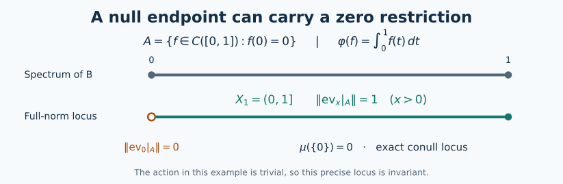

# Invariant states over an abelian commutant

Self-checked by the writing AI.

An invariant state supplies more than an invariant probability measure. Its
cyclic vector gives a canonical vector in each conditional GNS space, and those
vectors determine transport maps whose composition law holds at every retained
base point. We construct the conditional states first, so the transport maps do
not require separate choices of representatives for each group element.

## The invariant-state field theorem

Let $A$ be a separable, possibly nonunital C*-algebra, let $G$ be a separable
locally compact Hausdorff group, and let $\alpha:G\to\operatorname{Aut}(A)$ be
point-norm continuous. Let $\varphi$ be an $\alpha$-invariant state, and write
$(\pi,H,\xi)$ for its nondegenerate cyclic GNS representation, with $\|\xi\|=1$.
Let $U_g$ be its canonical implementing unitaries. Fix a unital abelian von
Neumann algebra

$$D\subset\pi(A)',\qquad U_gDU_g^*=D\quad(g\in G).$$

The algebra $D$ need not be contained in $\pi(A)''$; no centrality assumption
on $\pi(A)''$ is imposed. We will obtain a compact metrizable $G$-space
$X$, an invariant full-support probability $\mu$, and an invariant conull Borel
subset $X_1\subset X$, together with a measurable field
$(K_x,\pi_x,\zeta_x)$ of cyclic GNS representations of states of $A$ on $X_1$.
There are a unitary

$$V:H\longrightarrow\int_{X_1}^{\oplus}K_x\,d\mu(x)$$

and jointly Borel unitary arrows $u(g,x):K_x\to K_{T_gx}$ satisfying, for every
$g,h\in G$ and every $x\in X_1$,

$$u(gh,x)=u(g,T_hx)u(h,x),\qquad
u(g,x)\zeta_x=\zeta_{T_gx},$$

$$u(g,x)\pi_x(a)u(g,x)^*=\pi_{T_gx}(\alpha_g(a))\qquad(a\in A).$$

Here $T$ is a continuous action on $X$. The global identifications are

$$V\xi=(\zeta_x)_x,\qquad
V\pi(a)V^*=\int_{X_1}^{\oplus}\pi_x(a)\,d\mu(x),$$

$$VDV^*=\{M_f:f\in L^\infty(X_1,\mu)\},\qquad
(VU_gV^*\eta)(T_gx)=u(g,x)\eta(x).$$

The last identity is an equality of Hilbert-space sections; it therefore holds
almost everywhere for each section and fixed $g$. The arrow identities above
hold pointwise, simultaneously for all their parameters. No density factor
appears because $\mu$ is invariant. When $A$ is unital we may take $X_1=X$.

These assertions concern the full Hilbert direct integral and the specified
diagonal $D$. They do not identify $\pi(A)''$ with the full algebra of
decomposable operators having fibres $\pi_x(A)''$; the two-column example below
shows why that stronger conclusion would be false.

The initial cyclic representation is supplied by the
[nonunital GNS theorem](OA-FLOW-GNS.md#gns-theorem-5-1). We also use the earlier constructions of
[continuous functional calculus](OA-FLOW-CF.md#oa-flow.cf.6),
[positivity and order](OA-FLOW-CF.md#oa-flow.cf.7), and
[unitization](OA-FLOW-CF.md#oa-flow.cf.9).
The proofs below provide the further precise links when they use measure
representation, the abelian spectral model, and measurable Hilbert fields.

## A sequential approximate identity, including its strong limit

Choose a sequence $(a_k)_{k\ge1}$ dense in the unit ball of $A$. Put

$$h=\sum_{k\ge1}2^{-k}(a_k^*a_k+a_ka_k^*)\in A_+,
\qquad e_n=nh(1+nh)^{-1}.\tag{P1}$$

The sum converges in norm. The inverse in (P1) is taken in the unitization.
The function $t\mapsto nt/(1+nt)$ vanishes at zero, so its calculus lies in
$A$, even when $A$ has no unit. Functional calculus gives
$0\le e_n\le e_{n+1}\le1$. With $q_n=1-e_n=(1+nh)^{-1}$, the two inequalities
$a_k^*a_k\le2^kh$ and $a_ka_k^*\le2^kh$ give

$$\|a_kq_n\|^2\le2^k\|q_nhq_n\|,
\qquad\|q_na_k\|^2\le2^k\|q_nhq_n\|
\le\frac{2^k}{4n}.\tag{P2}$$

For the second norm use $\|q_na_k\|^2=\|q_na_ka_k^*q_n\|$.
The last bound follows from
$\sup_{t\ge0}t/(1+nt)^2=1/(4n)$, since $(1-nt)^2\ge0$.
Consequently $e_na\to a$ and $ae_n\to a$ for each element of the dense
sequence; approximation and $\|q_n\|\le1$ prove both limits for every $a\in A$.

If $\sigma:A\to B(K)$ is any representation, let

$$K^{\mathrm{ess}}=\overline{\operatorname{span}\{\sigma(a)v:a\in A,v\in K\}},
\qquad R=\text{the orthogonal projection onto }K^{\mathrm{ess}}.$$

On each vector $\sigma(a)v$ we have
$\sigma(e_n)\sigma(a)v\to\sigma(a)v$. On $(K^{\mathrm{ess}})^\perp$ every
$\sigma(a)$ is zero: its inner products against all vectors vanish by moving
$\sigma(a)$ to the other side as $\sigma(a^*)$. The uniform bound
$\|\sigma(e_n)\|\le1$ now proves

$$\sigma(e_n)\longrightarrow R\quad\text{strongly},\qquad
\sigma(a)=R\sigma(a)R.\tag{P3}$$

In particular the strong limit is the identity for every nondegenerate
representation. This supplies the approximate identity and its limit wherever
they are used below.

## The invariant vector and its abelian observables

Let \(A\) be a separable \(C^*\)-algebra, possibly without an identity, let \(G\) be a separable locally compact Hausdorff group, and let \(\alpha:G\to\operatorname{Aut}(A)\) have norm-continuous orbits. Let \(\varphi\) be an invariant state and \((\pi,H,\xi)\) its cyclic GNS representation, with \(\|\xi\|=1\). Inner products are linear in their first variable. Define initially on the dense subspace \(\pi(A)\xi\)
\[
 U_g\pi(a)\xi=\pi(\alpha_g(a))\xi.
 \tag{A1}
\]
Invariance gives
\[
 \langle\pi(\alpha_g(a))\xi,\pi(\alpha_g(b))\xi\rangle
 =\varphi(\alpha_g(b^*a))=\varphi(b^*a).
 \tag{A2}
\]
Thus (A1) is well defined and isometric. Its range is dense because \(\alpha_g\) is onto, so it extends to a unitary on \(H\). Checking on \(\pi(A)\xi\) proves \(U_gU_h=U_{gh}\) and
\[
 U_g\pi(a)U_g^*=\pi(\alpha_g(a)).
 \tag{A3}
\]
For example, applying the left side to \(\pi(b)\xi\) gives \(\pi(\alpha_g(a)b)\xi\). Furthermore
\[
 \|(U_g-U_h)\pi(a)\xi\|
 \leq\|\alpha_g(a)-\alpha_h(a)\|.
 \tag{A4}
\]
Norm continuity on this dense subspace, followed by approximation and \(\|U_g-U_h\|\leq2\), proves strong continuity on all of \(H\).

The cyclic vector is fixed, including when \(A\) is nonunital. Indeed, for every \(a\in A\),
\[
 \langle U_g\xi,\pi(a)\xi\rangle
 =\langle\xi,\pi(\alpha_{g^{-1}}(a))\xi\rangle
 =\overline{\varphi(\alpha_{g^{-1}}(a))}
 =\langle\xi,\pi(a)\xi\rangle.
 \tag{A5}
\]
Density gives \(U_g\xi=\xi\). Equivalently, the [increasing approximate identity](#oa-flow.istate.approximation) converges strongly to the identity in this nondegenerate representation and gives the same conclusion from (A1). A countable norm-dense family \((a_n)\) in \(A\) has \((\pi(a_n)\xi)\) dense in \(H\), so \(H\) is separable and nonzero.

Fix a unital abelian von Neumann algebra
\[
 D\subseteq\pi(A)',\qquad U_gDU_g^*=D\quad(g\in G),
 \qquad \gamma_g=\operatorname{Ad}U_g.
 \tag{A6}
\]
In particular \(\pi(A)\subseteq D'\), and \(D'\) is also \(\gamma\)-invariant. Define the normal vector state
\[
 \psi(b)=\langle b\xi,\xi\rangle\quad(b\in B(H)).
 \tag{A7}
\]
It is \(\gamma\)-invariant by (A5). Its restriction to \(D\) is faithful. If \(d\in D_+\) and \(\psi(d)=0\), then \(d^{1/2}\xi=0\). Since \(d^{1/2}\) commutes with \(\pi(A)\), it annihilates the dense subspace \(\pi(A)\xi\); hence \(d=0\).

The [concrete predual construction CP6](OA-FLOW-CP.md#oa-flow.cp.6) makes the predual of \(D\) a quotient of the completed projective tensor product of \(H\) and its conjugate. This tensor product is separable: rational finite combinations from countable dense vector sets are dense, by the elementary projective-norm estimate. Its quotient is separable. The action on \(D\) is predual-continuous. To check this without imposing a countable neighbourhood basis on \(G\), write a normal functional as the restricted vector series supplied by CP6. Pullback by \(\gamma_g\) replaces its two vector sequences by their \(U_g^*\)-translates. Each finite initial sum is norm-continuous, using
\[
 \|\omega_{v,w}-\omega_{v',w'}\|
 \leq\|v-v'\|\,\|w\|+\|v'\|\,\|w-w'\|,
 \qquad \omega_{v,w}(b)=\langle bv,w\rangle.
 \tag{A8}
\]
Cauchy–Schwarz bounds the remaining series uniformly in \(g\) by its summable vector tail. The whole predual orbit is therefore norm-continuous. This also agrees with the general [continuity equivalence AT3](OA-FLOW-AT.md#oa-flow.at.3).

## A conditional expectation obtained from scalar densities

There is a normal positive unital contraction
\[
 E:D'\longrightarrow D
 \quad\text{such that}\quad
 \psi(dE(b))=\psi(db)\qquad(d\in D,\ b\in D').
 \tag{A9}
\]
We construct it and prove its properties. First use the [abelian diagonal model DC6](../../OA-MOD/OA-MOD-DC.html#realizing-an-abelian-algebra-as-the-diagonal-algebra) for \(D\), which applies because \(H\) is separable and nonzero. It gives a normal isomorphism \(\theta:L^\infty(Y,\lambda)\to D\), where \(\lambda\) is a Borel probability on a compact metric space. Set
\[
 \nu(F)=\psi(\theta(1_F)).
 \tag{A10}
\]
Normality of \(\psi\) makes this a countably additive probability measure. It has exactly the same null sets as \(\lambda\): faithfulness of \(\psi|_D\) says \(\nu(F)=0\) exactly when \(\theta(1_F)=0\). Thus the same \(\theta\) identifies \(L^\infty(Y,\nu)\) normally with \(D\). On nonnegative simple functions, and then by monotone approximation, \(\psi(\theta(f))=\int f\,d\nu\). This is a temporary scalar model for constructing \(E\).

For \(b\in D'_+\), let
\[
 \nu_b(F)=\psi(\theta(1_F)b).
 \tag{A11}
\]
The factors commute. More generally \(d\mapsto\psi(db)\) on \(D\) is the normal positive vector functional \(d\mapsto\langle d b^{1/2}\xi,b^{1/2}\xi\rangle\). Consequently \(\nu_b\) is a finite positive measure and
\[
 0\leq\nu_b(F)\leq\|b\|\nu(F).
 \tag{A12}
\]
The full [finite scalar Radon–Nikodym proof DC5](../../OA-MOD/OA-MOD-DC.html#a-finite-radon-nikodym-density-from-hilbert-representation) supplies a density \(h_b\). Testing the sets where \(h_b>\|b\|\) shows \(0\leq h_b\leq\|b\|\) almost everywhere. Define \(E(b)=\theta(h_b)\). Equality of the measures gives (A9), first for indicator \(d\), then simple \(d\), then every bounded \(d\) by uniform simple approximation.

Uniqueness of the density proves additivity and nonnegative homogeneity on \(D'_+\). This extends consistently to self-adjoint differences and then complex linearly to \(D'\): if \(b_1-b_2=c_1-c_2\) with all four elements positive, apply additivity to \(b_1+c_2=c_1+b_2\). The extension is positive, preserves adjoints and satisfies (A9). That identity determines \(E(b)\) uniquely in \(D\). Indeed, if \(z\in D\) pairs to zero against every \(d\in D\), take \(d=z^*\) and use faithfulness of \(\psi|_D\).

Taking \(b\in D\) in (A9) proves \(E(b)=b\), so \(E(1)=1\), \(E^2=E\), and its range is exactly \(D\). The norm bound holds for arbitrary complex \(b\), not just positive \(b\). For a projection \(p\in D\), commutation with \(b\) gives
\[
 |\psi(pb)|=|\langle bp\xi,p\xi\rangle|
 \leq\|b\|\psi(p).
 \tag{A13}
\]
Write \(h=\theta^{-1}(E(b))\). Equations (A9) and (A13) imply
\(\operatorname{Re}\int_F\zeta h\,d\nu\leq\|b\|\nu(F)\)
for every measurable \(F\) and every scalar \(\zeta\) of modulus one. For a fixed \(\zeta\), the sets where \(\operatorname{Re}(\zeta h)>\|b\|+1/n\) must have measure zero. Use only a countable dense family of such \(\zeta\)'s, take their common conull set, and pass to all phases by continuity. There \(|h|\leq\|b\|\). Therefore
\[
 \|E(b)\|\leq\|b\|\qquad(b\in D').
 \tag{A14}
\]

For \(c_1,c_2,d\in D\), all these elements commute with \(b\in D'\), and (A9) gives
\[
 \begin{aligned}
 \psi(dE(c_1bc_2))
 &=\psi(dc_1c_2b)
 =\psi(dc_1c_2E(b)).
 \end{aligned}
\]
The uniqueness just proved yields
\[
 E(c_1bc_2)=c_1E(b)c_2.
 \tag{A15}
\]
In particular \(E\) is \(D\)-bimodular and preserves \(\psi\). Invariance of \(\psi\) and (A9), now tested against \(\gamma_{g^{-1}}(d)\in D\), give
\[
 \begin{aligned}
 \psi(dE(\gamma_g(b)))
 &=\psi(\gamma_{g^{-1}}(d)b)\\
 &=\psi(\gamma_{g^{-1}}(d)E(b))
 =\psi(d\gamma_g(E(b))).
 \end{aligned}
\]
Again uniqueness proves
\[
 E\circ\gamma_g=\gamma_g\circ E\qquad(g\in G).
 \tag{A16}
\]

For normality, let \(0\leq b_i\uparrow b\) be any bounded increasing net in \(D'\). The net \(E(b_i)\) is increasing and bounded above by \(E(b)\); write \(c=\sup_iE(b_i)\in D\). For every \(d\in D_+\), the functionals involved are normal vector functionals, evaluated at the vector \(d^{1/2}\xi\). Thus
\[
 \begin{aligned}
 \psi(dc)
 &=\sup_i\psi(dE(b_i))
 =\sup_i\psi(db_i)
 =\psi(db)
 =\psi(dE(b)).
 \end{aligned}
 \tag{A17}
\]
Normal vector functionals preserve these suprema because bounded increasing positive operator nets converge strongly to their supremum; this is the arbitrary-net implication proved in [NF4](OA-FLOW-NF.md#oa-flow.nf.4). Linear combinations of positive \(d\)'s cover \(D\), so uniqueness in (A9) gives \(c=E(b)\). Hence \(E\) preserves every bounded increasing positive supremum. The full positive-map equivalence [NF6](OA-FLOW-NF.md#oa-flow.nf.6) now proves that \(E\) is ultraweakly continuous. No interchange of an arbitrary measurable-function net with a scalar integral is used.

## Closing a separable algebra under the expectation

Apply the [continuous-core construction in L41](OA-FLOW-L41.md#oa-flow.cstd.setup) to the von Neumann algebra \(M=D\), with its whole centre \(D\) and the restricted action \(\gamma\). The separable predual and predual continuity required there were proved above. This produces a unital separable invariant \(C^*\)-subalgebra \(C_0\subseteq D\), with norm-continuous orbits and ultraweak closure \(D\).

Here is the countable construction explicitly. Choose an ultraweakly dense sequence \((d_j)\) in the unit ball of \(D\) and a norm-dense sequence \((\omega_\ell)\) in the unit ball of \(D_*\). These choices are available from [CP6](OA-FLOW-CP.md#oa-flow.cp.6) and [weak-star compactness ST1](OA-FLOW-ST12.md#oa-flow.st.1): on a bounded ball the countably many dense predual tests metrize the ultraweak topology. For each \(j,n\), choose an identity neighbourhood on which
\( |\omega_\ell(\gamma_s(d_j)-d_j)|<1/n\) for \(\ell\leq n\), and a nonnegative \(f_{j,n}\in C_c(G)\) supported there with Haar integral one. The [compact-bump construction](OA-FLOW-L24.md#oa-flow.grp.algebra) supplies these kernels for a locally compact Hausdorff group. Set
\[
 d_{j,n}=\int_G f_{j,n}(s)\gamma_s(d_j)\,ds.
 \tag{A18}
\]
The predual integral and its translation estimate are proved in [NR2](OA-FLOW-NR.md#oa-flow.nr.2). They give \(\|d_{j,n}\|\leq1\) and norm-continuous orbits. Moreover \(|\omega_\ell(d_{j,n}-d_j)|\leq1/n\) for \(n\geq\ell\). Approximation of any predual functional by a scalar multiple of an \(\omega_\ell\), together with the uniform bound, proves \(d_{j,n}\to d_j\) ultraweakly for each \(j\).

Take a countable dense subset \(Q\subseteq G\), containing the identity, and put
\[
 C_0=C^*(1,\ \gamma_q(d_{j,n}):q\in Q,\ j,n\geq1).
 \tag{A19}
\]
This algebra is separable and lies in the norm-continuous part. Every orbit value \(\gamma_{sq}(d_{j,n})\) is a norm limit of values whose parameter lies in \(Q\): each inverse image of a norm ball is an open set meeting \(Q\). Consequently \(\gamma_s(C_0)\subseteq C_0\), and applying this to \(s^{-1}\) gives equality. Since \(e\in Q\), the algebra contains all \(d_{j,n}\), so its ultraweak closure is \(D\). Only finite predual tests were used to choose the kernels; \(G\) need not be second countable.

Inside \(D'\), define
\[
 \begin{gathered}
 B_0=C^*(1,\pi(A),C_0),\qquad
 B_{n+1}=C^*(B_n,E(B_n)),\\
 B=\overline{\bigcup_{n\geq0}B_n}^{\|\cdot\|},
 \qquad C=B\cap D.
 \end{gathered}
 \tag{A20}
\]
Each \(B_n\) is a unital separable \(C^*\)-algebra. For the induction, contractivity makes \(E(B_n)\) separable, and rational \(*\)-polynomials in countable dense sets give a countable dense set in the generated algebra. All the algebras lie in \(D'\), because \(D\) is abelian and \(E(B_n)\subseteq D\). They are \(\gamma\)-invariant by (A16). Their elements have norm-continuous orbits: this holds for \(\pi(A)\), for \(1\) and for \(C_0\); and
\[
 \|\gamma_g(E(b))-E(b)\|
 \leq\|\gamma_g(b)-b\|
 \tag{A21}
\]
passes it to the new generators. Products, adjoints, sums and norm limits preserve the same property by elementary norm estimates. Thus \(B\) is also separable, unital, invariant and contained in the norm-continuous part of \(D'\).

The intersection \(C\) is a unital separable invariant abelian \(C^*\)-algebra. It is central in \(B\), since \(B\subseteq D'\), and its ultraweak closure is \(D\), since \(C_0\subseteq C\subseteq D\). For \(b\in B\), choose \(b_k\) in the increasing union of the \(B_n\)'s with \(b_k\to b\) in norm. Each \(E(b_k)\) lies in a later \(B_n\) and in \(D\). Contractivity therefore gives \(E(b)\in B\cap D\). We have proved
\[
 E(B)\subseteq C,\qquad \overline C^{\,\mathrm{ultraweak}}=D.
 \tag{A22}
\]
Finally let \(F=C^*(\pi(A),C)\); it is unital because \(1\in C\). Clearly \(F\subseteq B\). Conversely \(B_0\subseteq F\), and if \(B_n\subseteq F\), then \(E(B_n)\subseteq C\subseteq F\) by (A22), so \(B_{n+1}\subseteq F\). Taking norm closures gives
\[
 B=C^*(\pi(A),C).
 \tag{A23}
\]
In this argument the centrality used is \(C\subseteq Z(B)\), which follows from the commutant relation (A6).

## A compact probability model of the whole diagonal

Let \(X=\operatorname{Spec}(C)\). The [Gelfand theorem CF6](OA-FLOW-CF.md#oa-flow.cf.6) identifies \(C\) isometrically with \(C(X)\), writing \(\widehat c(x)=x(c)\). The space is compact Hausdorff and nonempty. It is metrizable: a countable norm-dense family in \(C\) separates characters, and evaluation embeds \(X\) into a countable product of compact metric disks. A continuous injection from a compact space into a Hausdorff space is a homeomorphism onto its image.

The [Radon representation theorem HR2](OA-FLOW-HR.md#hr-02) gives a probability \(\mu\) with
\[
 \psi(c)=\int_X\widehat c(x)\,d\mu(x)\qquad(c\in C).
 \tag{A24}
\]
It has full support. Every nonempty open set contains a nonzero nonnegative continuous function supported there, and faithfulness of \(\psi|_D\) makes its integral positive. Define
\[
 (T_gx)(c)=x(\gamma_{g^{-1}}(c)),\qquad
 \widehat{\gamma_g(c)}(x)=\widehat c(T_{g^{-1}}x).
 \tag{A25}
\]
These are homeomorphisms with \(T_gT_h=T_{gh}\). For nets \(g_i\to g\) and \(x_i\to x\), the difference of the first expression when evaluated at a fixed \(c\) is bounded by
\[
 \|\gamma_{g_i^{-1}}(c)-\gamma_{g^{-1}}(c)\|
 +|x_i(\gamma_{g^{-1}}(c))-x(\gamma_{g^{-1}}(c))|.
 \tag{A26}
\]
It tends to zero, so \(T:G\times X\to X\) is jointly continuous. Invariance of \(\psi\) implies that \((T_g)_*\mu\) and \(\mu\) agree on every continuous function. Both are Radon measures, since \(T_g\) is a homeomorphism; HR2's uniqueness gives
\[
 (T_g)_*\mu=\mu\qquad(g\in G).
 \tag{A27}
\]

We need a model of all of \(D\), not only its continuous subalgebra. The whole-algebra step in [L41](OA-FLOW-L41.md#oa-flow.cstd.setup), or equivalently [the compact-model theorem](../../OA-ERGODIC/reader/measurable-actions-and-compact-models.html#4-the-compact-space-and-its-nonsingular-measure), applies to this particular faithful state and this particular \(C\). Its construction here is as follows. Let \(H_D=\overline{D\xi}\subseteq H\). This subspace reduces \(D\); restriction \(d\mapsto d|_{H_D}\) is normal, and faithful because \(d\xi=0\) implies \(\psi(d^*d)=0\). The [faithful normal representation theorem ST2](OA-FLOW-ST12.md#oa-flow.st.2) makes its image a von Neumann algebra with normal inverse. The subspace \(C\xi\) is dense in \(H_D\): a vector orthogonal to it defines a normal vector functional vanishing on \(C\), hence on \(D\) by (A22), and hence is orthogonal to \(H_D\).

Equation (A24) makes
\[
 V_D(c\xi)=\widehat c
 \tag{A28}
\]
an isometry into \(L^2(X,\mu)\). Its target range is dense. In detail, for any Borel set \(F\), finite Radon regularity gives compact \(K_n\subseteq F\subseteq O_n\) with \(O_n\) open and \(\mu(O_n\setminus K_n)\to0\). Compact cutoffs give continuous \(0\leq f_n\leq1\), equal to one on \(K_n\) and zero off \(O_n\). Thus \(\|f_n-1_F\|_2^2\leq\mu(O_n\setminus K_n)\to0\). Simple functions and truncation now prove density in \(L^2\), also for the completed measure, whose measurable functions have Borel versions modulo null sets. Hence \(V_D\) extends to an onto unitary.

It carries multiplication by \(c\in C\) to \(M_{\widehat c}\). These operators generate the entire bounded multiplication algebra. Indeed, the preceding uniformly bounded approximants to \(1_F\) converge strongly as multiplication operators: first test on bounded vectors, then approximate any \(L^2\) vector by a bounded one. All indicator multiplications, and then all bounded multiplications by bounded simple approximation, belong to the generated von Neumann algebra. Conversely the bounded multiplication algebra is a von Neumann algebra: an operator commuting with every indicator multiplication has \(f=T1\in L^2\), satisfies \(T1_F=1_Ff\), and the bound \(\|1_Ff\|_2\leq\|T\|\mu(F)^{1/2}\) forces \(|f|\leq\|T\|\) almost everywhere. It therefore equals \(M_f\) first on simple functions and then by density on all of \(L^2\). The multiplication algebra is its own commutant and hence is weakly closed.

Since \(C\) generates \(D\) ultraweakly, (A28) consequently gives a normal isomorphism
\[
 \rho:L^\infty(X,\mu)\longrightarrow D,
 \qquad \rho(\widehat c)=c,\qquad
 \psi(\rho(f))=\int_X f\,d\mu.
 \tag{A29}
\]
Here \(V_D\xi=1\), which gives the last identity for every bounded measurable class. This construction specifies the final base using \(C\); it does not identify its point space with the temporary space \(Y\) in (A10).

Pullback by the measure-preserving \(T_g\) is a normal automorphism of \(L^\infty(X,\mu)\). For instance it is implemented on \(L^2\) by \(f\mapsto f\circ T_{g^{-1}}\). The two normal maps in
\[
 \gamma_g(\rho(f))=\rho(f\circ T_{g^{-1}})
 \qquad(f\in L^\infty(X,\mu))
 \tag{A30}
\]
agree on \(C(X)\) by (A25), and its ultraweak density proves agreement everywhere. The identities are equalities of measurable classes for each fixed \(g\); the action on the compact space itself is defined for every \(g,x\).

For the conditional construction, the output of the expectation is especially concrete. If \(b\in B\), then \(E(b)\in C\), so \(\widehat{E(b)}\) is a continuous function on this same \(X\). Equations (A9), (A16) and (A24) give
\[
 \begin{gathered}
 \psi(b)=\int_X\widehat{E(b)}(x)\,d\mu(x),\\
 \widehat{E(\gamma_g(b))}(x)
 =\widehat{E(b)}(T_{g^{-1}}x)
 \qquad(g\in G,\ x\in X).
 \end{gathered}
 \tag{A31}
\]
The second identity holds at every point because it is the Gelfand transform of an equality in \(C\). These continuous coefficients, together with \(B=C^*(\pi(A),C)\), supply the states and cyclic vectors over the invariant compact base.

## Conditional states at every point

Use the expectation and separable algebras just constructed:
\[
 E:D'\longrightarrow D,\qquad
 B=C^*(\pi(A),C),\qquad C=B\cap D,\qquad E(B)\subseteq C.
 \tag{G1}
\]
The algebra \(B\) is unital and separable, \(C\) is central in \(B\), and its ultraweak closure is \(D\). The action \(\gamma_g=\operatorname{Ad}U_g\) preserves \(B\) and is norm continuous there. Write \(X=\operatorname{Spec}C\), identify \(C=C(X)\), and use the continuous action and invariant full-support probability already obtained:
\[
 \gamma_g(c)(x)=c(T_g^{-1}x),\qquad
 \psi(c)=\int_X c(x)\,d\mu(x),\qquad
 \psi(b)=\langle b\xi,\xi\rangle.
 \tag{G2}
\]
Inner products are linear in the first variable.

For **every** \(x\in X\), define
\[
 \psi_x(b)=E(b)(x)\qquad(b\in B).
 \tag{G3}
\]
These are states at every point: \(E\) is positive and unital, and evaluation on \(C(X)\) is positive and unital. For fixed \(b\), the function \(x\mapsto\psi_x(b)\) is continuous. The bimodule and equivariance identities for \(E\) give the exact formulas
\[
 \begin{aligned}
 \psi_x(cb)&=c(x)\psi_x(b) &&(c\in C,\ b\in B),\\
 \psi_{T_gx}(\gamma_g(b))&=\psi_x(b)
       &&(g\in G,\ x\in X,\ b\in B).
 \end{aligned}
 \tag{G4}
\]
For the second identity, both sides are evaluations of the equality
\(E(\gamma_gb)=\gamma_gE(b)\) in \(C(X)\). Thus
\(\psi_{T_gx}=\psi_x\circ\gamma_g^{-1}\) holds simultaneously for all \(g,x\).
No representatives of merely measurable functions have been selected in (G3)–(G4).

The defining property of the expectation, with the diagonal test \(1\), also gives the barycentre identity
\[
 \psi(b)=\psi(E(b))=\int_X\psi_x(b)\,d\mu(x)\qquad(b\in B).
 \tag{G5}
\]
This identity will determine the global Hilbert norm.

## The actual measurable GNS field

For each \(x\), take the GNS quotient of \(B\) by
\(\mathcal N_x=\{b:\psi_x(b^*b)=0\}\), with
\[
 \langle[b]_x,[a]_x\rangle=\psi_x(a^*b).
 \tag{G6}
\]
Complete this quotient to \(K_x\). Let
\(\rho_x(b)[a]_x=[ba]_x\) and \(\zeta_x=[1]_x\).
The [GNS construction](OA-FLOW-GNS.md#gns-theorem-5-1) proves these assertions directly: positivity gives Cauchy–Schwarz and makes the zero-norm vectors a linear null space, while
\[
 \psi_x(a^*b^*ba)\leq\|b\|^2\psi_x(a^*a)
 \tag{G7}
\]
makes the null space a left ideal and proves \(\|\rho_x(b)\|\leq\|b\|\).
Multiplication and adjoints are checked on quotient vectors and extend by continuity. Since \(B\) is unital, \(\zeta_x=[1]_x\) is a cyclic unit vector and \(K_x\ne0\).

The diagonal acts by its prescribed character on the **whole** fibre:
\[
 \rho_x(c)=c(x)I_{K_x}\qquad(c\in C,\ x\in X).
 \tag{G8}
\]
Indeed, for \(a=c-c(x)1\), the equality \(E|_C=\operatorname{id}\) gives
\(\|\rho_x(a)\zeta_x\|^2=|a(x)|^2=0\).
Because \(C\) is central in \(B\), \(\rho_x(a)\) commutes with every \(\rho_x(b)\). It therefore vanishes on all the dense vectors \(\rho_x(b)\zeta_x\), proving (G8).

Choose a countable norm-dense unital star subalgebra of \(B\) over \(\mathbb Q(i)\), and enumerate it as \((b_n)_{n\geq1}\), including \(b_1=1\). Such a subalgebra is obtained from countably many norm-dense elements by finite rational star-polynomials. Put
\[
 h_b(x)=\rho_x(b)\zeta_x,\qquad h_n=h_{b_n}.
 \tag{G9}
\]
For all \(x\) one has
\[
 \langle h_n(x),h_m(x)\rangle
      =E(b_m^*b_n)(x),\qquad
 \|h_b(x)-h_a(x)\|\leq\|b-a\|.
 \tag{G10}
\]
The Gram entries are continuous, every finite Gram matrix is positive, and the \(h_n(x)\) span a dense subspace of each \(K_x\). The [countable Gram construction](../../OA-MOD/OA-MOD-DF.html#countable-gram-data-determines-the-whole-measurable-structure) therefore gives the actual measurable Hilbert field: a section \(\eta\) is measurable exactly when every scalar test \(\langle\eta(x),h_n(x)\rangle\) is measurable. The field is obtained by quotienting and completing these very Gram matrices, so its fibres are the GNS spaces just specified, not unrelated Hilbert spaces of the same dimension.

For completeness, the scalar tests also give the required measurability of norms. Enumerate the rational finite linear combinations \(d_l\) of the \(h_n\). Their values are dense in every fibre, and
\[
 \|\eta(x)\|
   =\sup_l\frac{|\langle\eta(x),d_l(x)\rangle|}
                   {\|d_l(x)\|},\qquad \frac00=0.
 \tag{G11}
\]
Consequently measurable sections are closed under measurable scalar multiplication, countable Borel pasting and fibrewise norm limits. The inequality in (G10) makes \(h_b\) measurable for every \(b\in B\), by norm approximation from the chosen sequence, and gives the uniform bound \(\|h_b(x)\|\leq\|b\|\). In particular \(x\mapsto\zeta_x=h_1(x)\) is a measurable unit section.

For fixed \(b\in B\), the operator field \(\rho_x(b)\) is measurable: it sends \(h_n(x)\) to \(h_{bb_n}(x)\), a measurable section, and its norm is at most \(\|b\|\). The [fundamental-section test for operator fields](../../OA-MOD/OA-MOD-DF.html#pointwise-bounded-operator-fields-adjoints-and-exact-norm-tests) then applies to all measurable inputs. Indeed, measurable orthonormal coordinates express each input as a fibrewise limit of measurable finite sums, and the fibrewise operator bound allows passage to that limit.

These statements hold on all of \(X\). The positive functional
\(\varphi_x=\psi_x\circ\pi\) on a nonunital \(A\) can still have norm less than one at some points. The [full-norm locus](#oa-flow.istate.nonunital), addressed next, is an invariant conull set on which it is a state and \(\rho_x\circ\pi\) is cyclic and nondegenerate on all of \(K_x\).

## The invariant locus where the restricted functionals have norm one

Retain the conditional state $\psi_x$ on $B$ and its cyclic GNS triple
$(\rho_x,K_x,\zeta_x)$ from the preceding sections. Define

$$\sigma_x(a)=\rho_x(\pi(a)),\qquad
\varphi_x(a)=\psi_x(\pi(a))\quad(a\in A).\tag{N1}$$

For nonunital $A$, restriction of a state on $B$ can have norm less than one.
We identify exactly the points where that loss does not occur. Use the
increasing approximate identity (P1), and set

$$c_n(x)=E(\pi(e_n))(x).
\tag{N2}$$

These are continuous functions on $X$, with $0\le c_n\le c_{n+1}\le1$.
Let $R_x$ be the projection onto the essential subspace of $\sigma_x$.
Equation (P3) and $\|\zeta_x\|=1$ imply

$$c_n(x)=\langle\sigma_x(e_n)\zeta_x,\zeta_x\rangle
\longrightarrow\|R_x\zeta_x\|^2=\|\varphi_x\|.
\tag{N3}$$

For the last equality, $\sigma_x(a)=R_x\sigma_x(a)R_x$ and contractivity
bound the vector functional by $\|R_x\zeta_x\|^2\|a\|$; evaluation on the
contractions $e_n$ gives the reverse norm inequality. Thus (N3) does not
assume that the restricted functional is a state.

The full-norm set is

$$X_1=\{x:\|\varphi_x\|=1\}
=\bigcap_{k\ge2}\bigcup_{n\ge1}\{x:c_n(x)>1-1/k\}.
\tag{N4}$$

It is a Borel set. The expectation preserves the original vector state, hence

$$\int_Xc_n\,d\mu
=\langle\pi(e_n)\xi,\xi\rangle\longrightarrow1.
\tag{N5}$$

The convergence follows from nondegeneracy of the original GNS representation
and (P3). Monotone convergence, proved in the earlier
[measure-theory construction](OA-FLOW-SC.md#sc-04), gives
$\int_X\|\varphi_x\|\,d\mu=1$. Since this integrand lies in $[0,1]$,
$\mu(X_1)=1$.

The every-point equivariance of $\psi_x$ gives
$\varphi_{T_gx}=\varphi_x\circ\alpha_{g^{-1}}$ for every $g,x$.
An automorphism maps the unit ball onto itself, so it preserves the norm of a
functional. Therefore $X_1$ is invariant under every $T_g$. This argument uses
an invariant numerical condition; it does not take an uncountable intersection
of conull sets.

For $x\in X_1$, positivity and $0\le\sigma_x(e_n)\le I$ give

$$\|(I-\sigma_x(e_n))\zeta_x\|^2
\le1-c_n(x)\longrightarrow0.
\tag{N6}$$

Now $B=C^*(\pi(A),C)$ and $\rho_x(c)=c(x)I$ for $c\in C$. Products of its
generators show that $\rho_x(B)\zeta_x$ lies in the closure of
$\mathbb C\zeta_x+\sigma_x(A)\zeta_x$. Equation (N6) places $\zeta_x$ itself
in $\overline{\sigma_x(A)\zeta_x}$. Since $\zeta_x$ is cyclic for $\rho_x(B)$,

$$\overline{\sigma_x(A)\zeta_x}=K_x.
\tag{N7}$$

Thus $\pi_x:=\sigma_x$ is nondegenerate and cyclic on all of $K_x$, and
$(\pi_x,K_x,\zeta_x)$ is a GNS triple for the state $\varphi_x$.
If $A$ is unital, $\pi(1_A)=I$ and (N1) already has norm one at every point;
then $X_1=X$. Restricting the previously constructed measurable field to the
Borel set $X_1$ preserves its countable fundamental family and removes only a
null set from all direct integrals.

## Recovering the entire Hilbert space

Now restrict to the invariant conull Borel set \(X_1\) established in the [full-norm argument](#oa-flow.istate.nonunital). On this set
\[
 \pi_x=\rho_x\circ\pi,\qquad
 (K_x,\pi_x,\zeta_x)
       \text{ is the cyclic GNS representation of }\varphi_x.
 \tag{G12}
\]
Use the restricted invariant probability, still denoted \(\mu\). The [Hilbert direct-integral construction and localization proof](../../OA-MOD/OA-MOD-DF.html#the-hilbert-direct-integral-localization-and-subsequences) gives the complete Hilbert space
\(\mathcal K=\int_{X_1}^{\oplus}K_x\,d\mu(x)\) of square-integrable measurable sections.

Define, initially on \(B\xi\),
\[
 V(b\xi)=h_b,\qquad
 \|h_b\|_{\mathcal K}^2
       =\int_{X_1}\psi_x(b^*b)\,d\mu(x)
       =\psi(b^*b)=\|b\xi\|^2.
 \tag{G13}
\]
The norm identity proves that this is well defined even if \(b\xi=0\), and polarization proves that it preserves inner products. Since \(\pi(A)\xi\subseteq B\xi\) is dense in the original GNS space \(H\), it extends to an isometry \(V:H\to\mathcal K\). Its range is closed.

We prove that this range is all of \(\mathcal K\). For \(c\in C=C(X)\), (G8) gives
\[
 V(cb_n\xi)(x)=c(x)h_n(x).
 \tag{G14}
\]
Continuous functions restricted from \(X\) are dense in \(L^2(X_1,\mu)\). Here is the measure argument. Regard the probability as a finite Borel measure on the compact metric space \(X\). The [finite metric-measure regularity argument](OA-FLOW-IS.md#is-2) gives, for a Borel set \(F_0\) and \(\epsilon>0\), a closed \(F\subseteq F_0\) and open \(O\supseteq F_0\) with \(\mu(O\setminus F)<\epsilon\). A continuous function \(0\leq c\leq1\) equal to one on \(F\) and zero outside \(O\) is obtained from the distance functions to these two disjoint closed sets; the cases of an empty set are handled by constants. Then
\(\|c-1_{F_0}\|_2^2\leq\mu(O\setminus F)\).
Simple-function approximation proves the density, and completed sets are handled by Borel representatives. Restriction to the conull \(X_1\) preserves the \(L^2\) space.

Thus for every bounded measurable \(f\) on \(X_1\) there are \(c_j\in C(X)\) with \(c_j\to f\) in \(L^2\). By the uniform bound in (G10),
\[
 \|(c_j-f)h_n\|_{\mathcal K}
      \leq\|b_n\|\,\|c_j-f\|_2\longrightarrow0.
 \tag{G15}
\]
The closed range of \(V\) contains every \(fh_n\). These sections span a dense subspace of the entire direct integral: if \(\eta\) is orthogonal to all of them, then
\(\int_F\langle h_n(x),\eta(x)\rangle\,d\mu(x)=0\)
for every Borel \(F\). This scalar integrand is in \(L^1\) by Cauchy–Schwarz and the bound on \(h_n\), so it is zero almost everywhere. Remove the countable union of these null sets over \(n\). Density of the \(h_n(x)\) now gives \(\eta(x)=0\) almost everywhere. Therefore \(V\) is onto.

On the dense sections \(h_b\), multiplication gives
\[
 Vb_0V^*=\int_{X_1}^{\oplus}\rho_x(b_0)\,d\mu(x)
 \quad(b_0\in B),\qquad
 V\xi=(x\mapsto\zeta_x).
 \tag{G16}
\]
Each operator field on the right is measurable and uniformly bounded, so equality on that dense set proves equality on the whole Hilbert space. In particular
\[
 V\pi(a)V^*=\int_{X_1}^{\oplus}\pi_x(a)\,d\mu(x)
       \qquad(a\in A).
 \tag{G17}
\]

The scalar diagonal is exactly the prescribed \(D\):
\[
 VDV^*=\{M_f:f\in L^\infty(X_1,\mu)\},\qquad
 (M_f\eta)(x)=f(x)\eta(x).
 \tag{G18}
\]
To verify the whole equality, (G14) identifies \(VCV^*\) with the continuous scalar multipliers. Their von Neumann closure equals the full scalar multiplication algebra. For one inclusion, approximate a bounded measurable \(f\) in \(L^2\) by continuous functions having a common bound: radial truncation to the closed disc of radius \(\|f\|_\infty\) preserves continuity and \(L^2\) convergence. The case \(f=0\) is immediate. The estimate (G15), also after bounded measurable localization, gives strong convergence of these multipliers on the dense sections \(kh_n\), and their common bound extends it to all of \(\mathcal K\). Thus \(M_f\) belongs to that closure.

For the reverse inclusion, [bounded strong-star density](OA-FLOW-BD.md#oa-flow.bd.4) approximates any operator \(S\) in the von Neumann closure by a net of continuous scalar multipliers \(M_{c_i}\) with a common bound. Apply this net to the unit section \(\zeta=(\zeta_x)\). Since
\(\|(c_i-c_j)\zeta\|_{\mathcal K}=\|c_i-c_j\|_2\),
the functions converge in \(L^2\) to some \(f\). Their common essential bound passes to \(f\), by choosing an almost-everywhere convergent subsequence of an \(L^2\)-approximating sequence from the net. The same localized estimate (G15) makes \(M_{c_i}\) converge strongly to \(M_f\) on all of \(\mathcal K\), so \(S=M_f\). Finally \(D\) is the ultraweak closure of \(C\), and unitary conjugation preserves that closure. This proves (G18).

Equations (G16)–(G18) identify the representation and its chosen commutant diagonal. They do not assert that \(\pi(A)''\) is the algebra of all measurable fields in \(\pi_x(A)''\). The hypothesis places \(D\) in the commutant, and need not place it in \(\pi(A)''\) or its centre.

## Canonical arrows and a jointly Borel perfect cocycle

The exact state identity (G4) defines the arrows directly, without repairing exceptional sets. In fact this step already works on all of \(X\). For \(g\in G\) and \(x\in X\), set
\[
 u(g,x)h_b(x)=h_{\gamma_g(b)}(T_gx)\qquad(b\in B).
 \tag{G19}
\]
For \(a,b\in B\), the inner product of their proposed images is
\[
 \psi_{T_gx}\bigl(\gamma_g(a)^*\gamma_g(b)\bigr)
       =\psi_x(a^*b).
 \tag{G20}
\]
Thus the map is well defined on the GNS quotient, linear and isometric. Since \(\gamma_g(B)=B\), its range contains a dense subset of \(K_{T_gx}\); the extended isometry has closed range and is onto. It is a unitary \(K_x\to K_{T_gx}\). Its value is uniquely determined by (G19).

Computing on \(h_b(x)\), using \(\gamma_g\gamma_h=\gamma_{gh}\), proves at every point
\[
 \begin{aligned}
 u(e,x)&=I_{K_x},&
 u(gh,x)&=u(g,T_hx)u(h,x),\\
 u(g,x)\zeta_x&=\zeta_{T_gx},&
 u(g,x)\rho_x(b)u(g,x)^*
      &=\rho_{T_gx}(\gamma_g(b)).
 \end{aligned}
 \tag{G21}
\]
For example, the two sides of the cocycle formula send \(h_b(x)\) to the same vector \(h_{\gamma_{gh}(b)}(T_{gh}x)\). For covariance, apply the two operators to a vector \(h_a\) and use \(\gamma_g(ba)=\gamma_g(b)\gamma_g(a)\). Density then proves the operator equalities. Substituting \(b=\pi(a)\) gives
\[
 u(g,x)\pi_x(a)u(g,x)^*
       =\pi_{T_gx}(\alpha_g(a)).
 \tag{G22}
\]
Restricting these identities to the invariant \(X_1\) preserves every group element and every composable pair, including stabilizer arrows.

There is also **joint** Borel measurability in \((g,x)\), without a second-countability assumption on \(G\). The fundamental matrix coefficients are
\[
 \begin{aligned}
 F_{nm}(g,x)
  &=\langle u(g,x)h_n(x),h_m(T_gx)\rangle\\
  &=\psi_{T_gx}\bigl(b_m^*\gamma_g(b_n)\bigr)
    =E\bigl(b_m^*\gamma_g(b_n)\bigr)(T_gx).
 \end{aligned}
 \tag{G23}
\]
They are jointly continuous on \(G\times X\). Indeed
\(g\mapsto E(b_m^*\gamma_g(b_n))\) is continuous in the norm of \(C(X)\), by contractivity of \(E\) and norm continuity of \(\gamma\). Evaluation \((c,y)\mapsto c(y)\) is jointly continuous in the uniform norm, and \((g,x)\mapsto T_gx\) is continuous. Composing these maps proves the claim.

In particular the coefficients are measurable for
\(\mathcal B(G)\otimes\mathcal B(X)\). To justify this even for a non-second-countable \(G\), every open subset of \(G\times X\) is a countable union of rectangles with second factors in a countable basis of \(X\): for each basis member, union all first-factor open sets whose corresponding rectangle lies in the given open set. This proves equality of the product Borel sigma-field and the Borel sigma-field of the product topology. Restriction to \(G\times X_1\) retains the assertion.

Over the measurable base \(G\times X_1\), consider the source field \(K_x\) and the range field \(K_{T_gx}\), with fundamental sections \(h_n(x)\) and \(h_m(T_gx)\), respectively. Their Gram matrices are Borel by (G10). The Gram and operator-field tests used above work over any measurable base; they require no standardness or measure on this parameter product. Equation (G23) shows that the image of each fundamental source section is measurable in the range field. The operator-field test and the unitary norm bound now prove that \((g,x)\mapsto u(g,x)\) is jointly Borel as an operator between these pullback fields. Equivalently, measurable orthonormal frames give jointly Borel matrices for these unitaries on each dimension stratum. This is stronger than choosing a measurable field separately for each fixed \(g\).

On the entire direct integral define, for fixed \(g\),
\[
 (\mathcal U_g\eta)(y)
      =u(g,T_g^{-1}y)\eta(T_g^{-1}y).
 \tag{G24}
\]
The field measurability just proved makes this a measurable section for measurable \(\eta\). Invariance of \(\mu\) and fibrewise unitarity give
\[
 \|\mathcal U_g\eta\|_{\mathcal K}^2
   =\int_{X_1}\|\eta(T_g^{-1}y)\|^2\,d\mu(y)
   =\|\eta\|_{\mathcal K}^2.
 \tag{G25}
\]
Null classes are preserved, and the exact cocycle formula makes \(\mathcal U_{g^{-1}}\) its inverse. No density multiplier occurs because the base probability is invariant.

For a dense section \(h_b=V(b\xi)\), (G19) gives \(\mathcal U_gh_b=h_{\gamma_g(b)}\). On the original Hilbert space, \(U_g\xi=\xi\) gives
\(U_gb\xi=\gamma_g(b)\xi\). Consequently
\[
 \mathcal U_g=VU_gV^*
 \quad\text{on all of }\mathcal K.
 \tag{G26}
\]
This also proves strong continuity: for every \(\eta\in\mathcal K\), its orbit under \(\mathcal U\) is the unitary image of the strongly continuous orbit of \(V^*\eta\) under the original \(U\).

Thus the invariant-state GNS representation has an onto Hilbert-space disintegration over its specified commutant diagonal, with a jointly Borel cocycle preserving the cyclic section and satisfying (G21) at every point of the invariant base. The word *perfect* refers to those simultaneous arrow identities. When \(T_gx\ne x\), the arrow goes between different Hilbert spaces; it is not a representation of \(G\) on one fixed fibre.

## Exact examples of the invariant-state construction

### A noncentral diagonal that separates the matrix columns

Let
\[
 A=M_2(\mathbb C),\qquad
 \varphi(a)=\frac12\operatorname{Tr}(a),\qquad
 W_t=\operatorname{diag}(e^{it},1),\qquad
 \alpha_t(a)=W_taW_t^*
 \quad(t\in\mathbb R).
 \tag{E1}
\]
This is a norm-continuous action of the additive group \(\mathbb R\). Cyclicity of the matrix trace gives \(\varphi\circ\alpha_t=\varphi\). Its GNS space and canonical implementation are
\[
 H=M_2(\mathbb C),\quad
 \langle b,c\rangle=\frac12\operatorname{Tr}(c^*b),\quad
 \pi(a)b=ab,\quad \xi=I,\quad U_tb=W_tbW_t^*.
 \tag{E2}
\]
The factor \(1/2\) makes \(\|\xi\|=1\). The vector \(\xi\) is cyclic because \(\pi(a)\xi=a\) ranges over \(H\). Conjugation by \(W_t\) preserves the displayed norm, fixes \(I\), satisfies the group law, and implements \(\alpha_t\). It is strongly continuous by its matrix entries.

For a diagonal matrix \(d=\operatorname{diag}(d_1,d_2)\), let \(R_d b=bd\), and put
\[
 D=\{R_{\operatorname{diag}(d_1,d_2)}:d_1,d_2\in\mathbb C\}.
 \tag{E3}
\]
It is a unital abelian von Neumann algebra contained in \(\pi(A)'\). Since diagonal \(d\) commutes with \(W_t\), every \(R_d\) commutes with \(U_t\); the action fixes \(D\) pointwise. This \(D\) is not contained in \(\pi(A)\), whose centre is scalar. Indeed \(L_a=R_d\) would give \(a=d\) by evaluation at \(I\), then \(db=bd\) for every \(b\), forcing \(d\) to be scalar. Thus \(D\cap\pi(A)=\mathbb CI\), although \(D\) itself is two-dimensional.

Write \(e_1=(1,0)^{\mathsf T}\) and \(e_2=(0,1)^{\mathsf T}\). The exact direct-integral coordinate map is the two-column map
\[
 V:H\longrightarrow
       \mathbb C^2\oplus_{\mu}\mathbb C^2,\qquad
 Vb=(be_1,be_2),\qquad
 \mu(\{1\})=\mu(\{2\})=\frac12.
 \tag{E4}
\]
The target norm is \(\frac12(\|\eta_1\|^2+\|\eta_2\|^2)\). The sum of squared column norms is \(\operatorname{Tr}(b^*b)\), so \(V\) is isometric. It is onto: given \(\eta_1,\eta_2\), use the matrix whose columns are exactly those vectors. The fibre representations, cyclic vectors and diagonal coordinates are consequently
\[
 K_j=\mathbb C^2,\qquad
 \pi_j(a)=a,\qquad
 \zeta_j=e_j,\qquad
 V\xi=(e_1,e_2),\qquad
 VR_dV^{-1}(\eta_1,\eta_2)=(d_1\eta_1,d_2\eta_2).
 \tag{E5}
\]
The diagonal vector state is
\(\langle R_d\xi,\xi\rangle=(d_1+d_2)/2\), confirming the two base masses. Each \(e_j\) is cyclic for \(M_2\) on \(\mathbb C^2\), because \(ae_j\) can be any vector.

The base action is \(T_t(j)=j\), and its measure derivative is identically one. Right multiplication by \(W_t^*\) nevertheless produces different **unit complex phases** in the two columns:
\[
 \begin{aligned}
 (VU_tb)_1&=e^{-it}W_tbe_1,&
 u(t,1)&=e^{-it}W_t=\operatorname{diag}(1,e^{-it}),\\
 (VU_tb)_2&=W_tbe_2,&
 u(t,2)&=W_t=\operatorname{diag}(e^{it},1).
 \end{aligned}
 \tag{E6}
\]
These unit complex phases belong to the fibre unitaries. Both fibres have a fixed base point. The [exact cocycle construction](#oa-flow.istate.cocycle) here is verified by direct matrix multiplication: for every \(s,t\in\mathbb R\) and \(j=1,2\),
\[
 \begin{gathered}
 u(s+t,j)=u(s,j)u(t,j),\qquad
 u(t,j)\zeta_j=\zeta_j,\\
 u(t,j)\pi_j(a)u(t,j)^*=\pi_j(\alpha_t(a))
       \quad(a\in M_2),\\
 (VU_tV^{-1}\eta)_j=u(t,j)\eta_j.
 \end{gathered}
 \tag{E7}
\]
For the vector identity at \(j=1\), the scalar \(e^{-it}\) cancels \(W_te_1=e^{it}e_1\); at \(j=2\), \(W_te_2=e_2\). In covariance the scalar phases cancel with their conjugates, leaving \(\operatorname{Ad}W_t\). Thus the exact vector-fixing condition determines information not visible in operator covariance alone.

The downward arrows act **inside** the labelled fibres; neither base point moves. The diagonal scalar measure is \((1/2,1/2)\), so no positive density multiplier is present. The orange phase in the first column cancels on its cyclic vector and remains on the other coordinate. This is the exact system in (E1)–(E7), with arbitrary matrix entries \(b_{kl}\). [Reproduction code](../assets/invariant-state-fields/render_column_phases.py), [exact symbolic data](../assets/invariant-state-fields/exact-data.json) and [component terms](../assets/invariant-state-fields/README.md) accompany the diagram.

### The expectation on the entire diagonal commutant

An operator commuting with the two column projections preserves each column subspace. Conversely arbitrary operators on those two subspaces commute with every scalar column multiplier. Therefore \(V\) identifies
\[
 D'=B(\mathbb C^2)\oplus B(\mathbb C^2),\qquad
 B=C^*(\pi(A),D)=D',
 \qquad
 E(T_1,T_2)=
   \bigl(\langle T_1e_1,e_1\rangle I,\,
         \langle T_2e_2,e_2\rangle I\bigr)\in D.
 \tag{E8}
\]
The equality for \(B\) follows because the two diagonal projections select the two entries of \((a,a)=V\pi(a)V^{-1}\): their linear combinations produce every \((a_1,a_2)\).

Let \(\Psi(T)=\langle T\xi,\xi\rangle\) be the global vector state on \(D'\). For \(d=(d_1I,d_2I)\),
\[
 \Psi(dT)
  =\frac12\sum_{j=1}^2d_j\langle T_je_j,e_j\rangle
  =\Psi(dE(T)).
 \tag{E9}
\]
Thus (E8) is the [expectation determined by the diagonal testing identity](#oa-flow.istate.expectation). It is positive and unital because its two coordinates are vector states. The estimate
\(|\langle T_je_j,e_j\rangle|\le\|T_j\|\)
proves contractivity. Scalar multiplication in each block proves \(D\)-bimodularity and \(E|_D=\mathrm{id}\). Normality follows directly in finite dimension, where matrix coefficients describe the entire linear topology. Finally (E7) implies
\(\langle u(t,j)T_ju(t,j)^*e_j,e_j\rangle=\langle T_je_j,e_j\rangle\), so \(E\) is equivariant; the action on its range \(D\) is trivial.

It is not faithful on \(D'\). For the rank-one orthogonal projection \(P_{e_2}\),
\[
 T=(P_{e_2},0)\ne0,\qquad T\ge0,\qquad E(T)=0.
 \tag{E10}
\]
This causes no conflict with faithfulness of \(\Psi|_D\): both diagonal masses are positive. The conditional states on \(B\) are
\(\Psi_j(T)=\langle T_je_j,e_j\rangle\); their restrictions to \(A\) are the pure vector states \(a\mapsto\langle ae_j,e_j\rangle\). Each has GNS space \(K_j=\mathbb C^2\) and the cyclic vector in (E5).

### Fibre algebras do not imply a whole algebra of fields

The same example already has all the cyclic invariant-state hypotheses and a noncentral commutant diagonal. Nevertheless,
\[
 V\pi(A)''V^{-1}=\{(a,a):a\in M_2\}
 \ \varsubsetneqq\
 \int_{\{1,2\}}^\oplus \pi_j(A)''\,d\mu(j)
     =M_2\oplus M_2.
 \tag{E11}
\]
The left-hand algebra is finite-dimensional and closed, so its bicommutant is just its displayed image. The pair \((I,0)\) is an explicit element of the right side absent from the left. Adjoining \(D\) gives the whole right side by (E8). The invariant-state theorem decomposes the Hilbert space and the represented operators; a merely commutant diagonal does not make the original algebra the whole field algebra.

There is also a continuous-base version in the more general setting of covariant representations. On
\(H=L^2([0,1],dt)\otimes\mathbb C^2\), take
\(\pi(a)=I\otimes a\) and
\(D=L^\infty([0,1])\otimes I\), with a trivial group action. Then
\[
 \pi(M_2)''
    =I\otimes M_2
 \ \varsubsetneqq\
 \int_{[0,1]}^\oplus M_2\,dt.
 \tag{E12}
\]
The left side consists of constant matrix fields. The bounded measurable field \(1_{[0,1/2]}(t)I\) belongs to the right side and cannot be constant almost everywhere: testing on vector functions supported in each half forces its putative constant value to be both \(I\) and zero. This representation is not cyclic. For any \(\eta\in H\), its orbit span \(\{\pi(a)\eta:a\in M_2\}\) has dimension at most four, while \(H\) is infinite-dimensional. Thus (E12) is explicitly a general-representation example; (E11) supplies the warning within the invariant-state GNS hypotheses themselves.

### A zero boundary restriction in a faithful diffuse model

Let
\[
 B=C([0,1]),\qquad
 A=\{f\in B:f(0)=0\}\cong C_0((0,1]),\qquad
 \varphi(f)=\int_0^1 f(t)\,dt\quad(f\in A).
 \tag{E13}
\]
Use Lebesgue probability, which is diffuse and has full support on \([0,1]\). The functional is faithful on \(A\): any nonzero nonnegative continuous function is positive on a relative open set of positive Lebesgue measure. It has norm one. In fact the increasing positive contractive approximate identity
\[
 a_n(t)=\min(1,nt),\qquad
 \varphi(a_n)=1-\frac1{2n}\longrightarrow1
 \tag{E14}
\]
has this property and makes the [approximate-identity argument](#oa-flow.istate.approximation) explicit. It is an approximate identity because, for \(f\in A\),
\(\|(1-a_n)f\|_\infty\le\sup_{0\le t\le1/n}|f(t)|\to0\).
The upper bound \(\|\varphi\|\le1\) follows from integration; (E14) proves the reverse bound.

For every \(x\in[0,1]\), let \(\Psi_x=\mathrm{ev}_x\), a state on the unital algebra \(B\), and let \(\varphi_x=\Psi_x|_A\). Then
\[
 \|\varphi_0\|=0,\qquad
 \|\varphi_x\|=1\ (0<x\le1),\qquad
 X_1=\{x:\|\varphi_x\|=1\}=(0,1].
 \tag{E15}
\]
At zero every member of \(A\) vanishes. At a positive \(x\), choose \(n\ge1/x\); then \(a_n(x)=1\), which proves that the positive restriction has norm one. The [full-norm locus](#oa-flow.istate.nonunital) \(X_1\) is Borel and conull, although it is a proper subset of the compact spectrum.

The interval endpoints and open marker describe the exact sets in (E13)–(E15). The omitted point has a zero restricted functional despite the faithful integrated state. This diagram uses the same [reproduction code and exact data](../assets/invariant-state-fields/README.md) as the column diagram.

This is an actual invariant-state instance with the trivial action of \(\mathbb R\). Its GNS representation is multiplication on \(L^2([0,1],dt)\), with cyclic vector \(1\). Functions vanishing at zero are dense in \(L^2\): continuous functions are dense by finite metric-measure regularity, and multiplying them by \(a_n\) gives convergence by dominated convergence. Thus \(1\) is cyclic and the representation of \(A\) is nondegenerate. Take the multiplication diagonal \(D=L^\infty([0,1])\). Its commutant is itself, by the [whole diagonal-commutant theorem](../../OA-MOD/OA-MOD-DF.html#the-diagonal-commutant-is-exactly-the-decomposable-algebra) on one-dimensional fibres, or by the probability multiplication-commutant proof in [ED](OA-FLOW-ED.md#oa-flow.ergdec.multiplication). Here \(E\) is the identity and the expectation-closed unital algebra is \(B\).

The GNS space of each \(\Psi_x\) on \(B\) is \(\mathbb C\). At \(x=0\), restricting its representation to \(A\) makes every operator zero on that nonzero space, so the restriction is degenerate and its vector functional has norm zero. At every point of \(X_1\), it is the one-dimensional cyclic GNS representation of a state. Removing the null boundary is therefore needed for the every-point state and nondegeneracy conclusions, even though it changes no global \(L^2\) class.

Conullness alone does not prove invariance of such a locus. In this example the action is trivial, so \(X_1\) is invariant. More generally, if an action on \(B\) preserves \(A\) and the conditional states satisfy
\(\varphi_{T_gx}=\varphi_x\circ\alpha_g^{-1}\) for all \(g,x\), isometry of composition by a star automorphism gives \(\|\varphi_{T_gx}\|=\|\varphi_x\|\) for all \(g,x\). This exact identity makes \(X_1\) invariant. An arbitrary action on \(B\) need not preserve the ideal: reflection \(t\mapsto1-t\) preserves Lebesgue measure but carries the ideal of functions vanishing at zero to the ideal of functions vanishing at one. Its image of \((0,1]\) is \([0,1)\), so it does not give an action on this chosen \(A\).

## Exercises with solutions

**1. Determine the phase from the cyclic vector.** Suppose a unitary \(v_j\) on \(K_j=\mathbb C^2\) implements \(a\mapsto W_taW_t^*\) and fixes \(e_j\). Why is it the unitary in (E6)?

**Solution.** The operator \(W_t^*v_j\) commutes with every matrix. Commutation with the two coordinate projections makes it diagonal, and commutation with \(E_{12}\) makes its two diagonal entries equal. Thus \(v_j=c_jW_t\) for a scalar of absolute value one. The equation \(v_je_j=e_j\) forces
\[
 c_1=e^{-it},\qquad c_2=1.
 \tag{X1}
\]
This proves both formulas and their uniqueness. If the first phase were omitted, the proposed unitary would send \(e_1\) to \(e^{it}e_1\) and would fail to fix the conditional cyclic vector except at integer multiples of \(2\pi\).

**2. Compute the expectation without assuming faithfulness.** Write
\[
 T_1=\begin{pmatrix}a&b\\c&d\end{pmatrix},
 \qquad
 T_2=\begin{pmatrix}r&s\\t&v\end{pmatrix}.
 \tag{X2}
\]
Find \(E(T_1,T_2)\), and exhibit a positive nonzero operator in its kernel.

**Solution.** Formula (E8) gives \(E(T_1,T_2)=(aI,vI)\). Take \(T_1=E_{22}\), \(T_2=0\); then \(a=v=0\), although the first block is a nonzero positive projection. The testing identity (E9), rather than an unproved faithfulness assertion, determines this expectation.

**3. Identify the lost boundary state.** Which evaluation state on \(C([0,1])\) becomes zero on \(C_0((0,1])\), and why does this not contradict faithfulness of the integrated state in (E13)?

**Solution.** Exactly evaluation at zero becomes zero. Every positive-point evaluation has norm one by (E14). Lebesgue measure assigns zero mass to the point zero, so the integrated state gives no weight to that exceptional restriction. Faithfulness of its integral follows instead because every nonzero positive continuous function is positive on a set of positive Lebesgue measure. Neither statement says that every individual evaluation is faithful or that every restriction is a state.

**4. Prove exact invariance of the full-norm locus.** Assume
\(\varphi_{T_gx}=\varphi_x\circ\alpha_g^{-1}\) is given at every point and every parameter. Show that \(X_1=\{x:\|\varphi_x\|=1\}\) is invariant for the whole group.

**Solution.** The automorphism \(\alpha_g^{-1}\) maps the closed unit ball of \(A\) onto itself. Taking the supremum of
\(|\varphi_x(\alpha_g^{-1}(a))|\) over that ball proves
\[
 \|\varphi_{T_gx}\|=\|\varphi_x\|
 \quad(g\in G,\ x\in X).
 \tag{X3}
\]
Membership in \(X_1\) is therefore unchanged by every \(T_g\); applying the same argument to \(g^{-1}\) gives equality of its image with itself. No union or saturation of parameter-dependent null sets is used.

**5. Separate Hilbert-space surjectivity from a whole-algebra claim.** In the matrix example \(V\) is onto both column spaces. Does this force \(\pi(A)''=D'\)?

**Solution.** No. Onto-ness reconstructs every pair of vectors as the columns of a matrix, but a represented algebra element acts by the same left multiplier on both columns. The operator \((I,0)\in D'\) acts differently on them and is absent from \(\pi(A)''\), as (E11) shows. Adjoining \(D\) allows the columns to be selected separately and yields \(C^*(\pi(A),D)=D'\). These are three distinct assertions: the Hilbert map is onto, the original operator algebra is the constant-pair algebra, and its enlargement by the diagonal is the whole two-block algebra.

For comparison, see M. Takesaki, *Theory of Operator Algebras II*,
Proposition X.3.10, pp. 284–285, for invariant-state equivariant disintegration.
The preceding construction proves its required conditional-state, Hilbert-field,
and cocycle assertions within the programme. The scalar expectation route also
makes explicit the nonunital full-norm locus and the distinction between a
commutant diagonal and a central diagonal.
