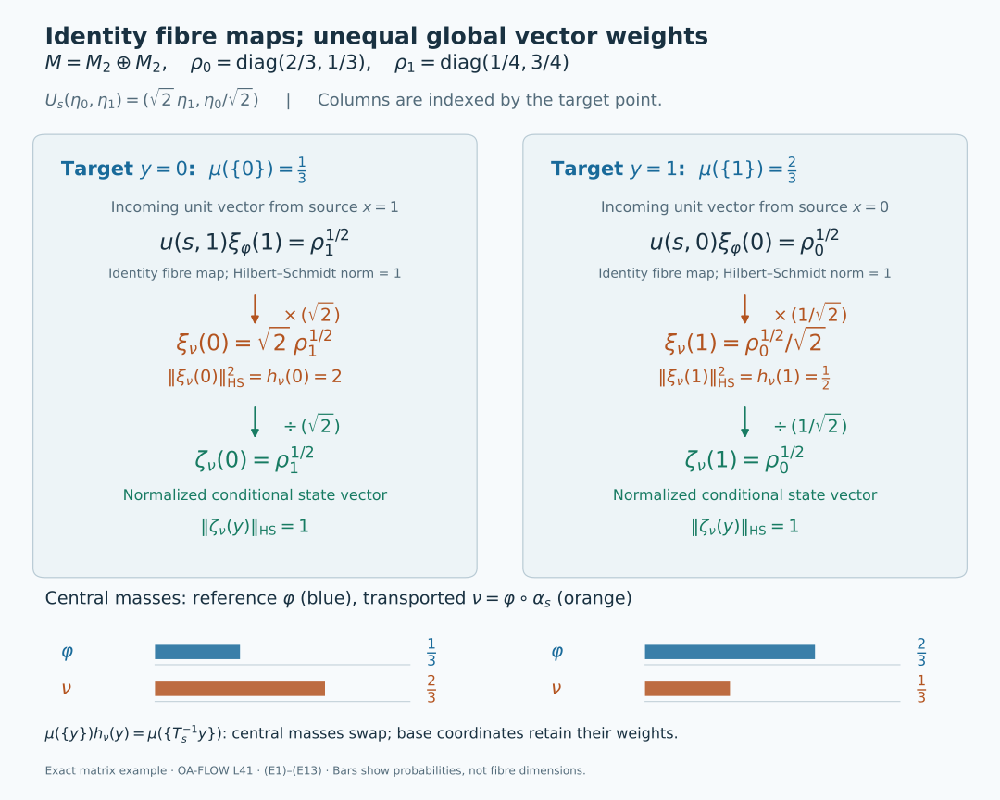

# Standard forms over a moving central base

*Self-checked by the writing AI. Original lesson, figure and reproduction code: CC0-1.0; accompanying font terms retained.*

The central observables of a von Neumann algebra can move under an action. Decomposing over an invariant part of the centre therefore produces arrows between Hilbert spaces at different base points. Each arrow is unitary, but integrating the arrows requires a square root of a measure density. The same density explains why a global representing vector need not be a unit vector in each fibre.

A two-point calculation shows what the density must do. Give points \(0,1\) masses \(1/3,2/3\), and let \(s\) interchange them. An unweighted swap sends the squared norm \(|a|^2/3+2|b|^2/3\) to \(|b|^2/3+2|a|^2/3\), which is generally different. The map
\[
 (a,b)\longmapsto \bigl(\sqrt2\,b,\;a/\sqrt2\bigr)
 \tag{T0}
\]
preserves the norm and squares to the identity. The fibre arrows are still identities between one-dimensional spaces. The two positive factors account entirely for the change of base measure.

We first construct compatible algebra and standard-form fields over a continuous model of the specified central algebra. The normalizer theorem then gives the arrows and their exact exceptional-set quantifiers. After computing conditional state vectors, we obtain arrows satisfying every group law on one invariant conull base. A final change-of-density calculation separates the underlying action from the reference probability used to display it.

## The moving-field theorem

Let \(M\ne0\) have separable predual, let \(G\) be a separable locally compact Hausdorff group, and let \(\alpha:G\to\operatorname{Aut}(M)\) be continuous in the predual topology. Thus \(g\mapsto\omega\circ\alpha_g\) is norm continuous for every \(\omega\in M_*\); the equivalent point-ultraweak formulation is proved in [Continuity of normal actions](OA-FLOW-AT.md#oa-flow.at.3). Fix a unital von Neumann algebra
\[
 D\subseteq Z(M),\qquad \alpha_g(D)=D\quad(g\in G).
 \tag{T1}
\]
The reference state below is faithful and normal. It is not required to be invariant. Separability of \(G\) is not a second-countability assumption.

There is a compact metrizable probability model \((X,\mu)\) of \(D\), a continuous nonsingular action \(T\) on \(X\), and a measurable field of nonzero standard forms \((M_x,H_x,J_x,P_x)\) such that
\[
 \begin{gathered}
 D=L^\infty(X,\mu),\qquad
 H=\int_X^\oplus H_x\,d\mu(x),\qquad
 M=\int_X^\oplus M_x\,d\mu(x),\\
 J=\int_X^\oplus J_x\,d\mu(x),\qquad
 P=\{\eta\in H:\eta(x)\in P_x\text{ almost everywhere}\}.
 \end{gathered}
 \tag{T2}
\]
The algebra equality contains **every** essentially bounded measurable field in the fibre algebras. Fibres need not be factors: the chosen \(D\) may be strictly smaller than the centre.

Write
\[
 j_g(y)=\frac{d(T_g)_*\mu}{d\mu}(y),\qquad
 u(g,x):H_x\longrightarrow H_{T_gx}.
 \tag{T3}
\]
For each fixed \(g\), the fibre arrows are measurable unitaries and the canonical standard implementation is
\[
 (U_g\eta)(y)=j_g(y)^{1/2}
       u(g,T_g^{-1}y)\eta(T_g^{-1}y).
 \tag{T4}
\]
At first, the following identities hold almost everywhere for each fixed \(g\), or each fixed pair \(g,h\):
\[
 \begin{aligned}
 u(g,x)M_xu(g,x)^*&=M_{T_gx},&
 u(g,x)J_x&=J_{T_gx}u(g,x),\\
 u(g,x)P_x&=P_{T_gx},&
 u(gh,x)&=u(g,T_hx)u(h,x).
 \end{aligned}
 \tag{T5}
\]
The induced normal isomorphisms
\[
 \alpha_{g,x}(a)=u(g,x)a\,u(g,x)^*
 \tag{T6}
\]
disintegrate the whole action:
\(\alpha_g(m)(T_gx)=\alpha_{g,x}(m(x))\) almost everywhere for each fixed \(g,m\).

The [strict construction](#oa-flow.cstd.strict) chooses Borel representatives on an invariant conull base so that the arrows, their composition law and their preservation of the whole standard-form data hold for every group element and every retained point. It retains all arrows, including those from the stabilizer of a point to itself. The statement about the integrated operator \(U_g\) remains an almost-everywhere identity for each fixed \(g\). It makes no claim that arbitrary initial versions of every scalar Radon–Nikodym derivative already satisfy simultaneous pointwise identities.

The construction and the [final deduction](#oa-flow.cstd.conclusion) prove these assertions. [Decomposition over the fixed centre](OA-FLOW-L42.md#oa-flow.centerg.conclusion) is the stationary-base case with its further central-ergodicity conclusion. Here \(D\) is any invariant central algebra and the base can move.

## A continuous compact base for the specified central algebra

Let \(M\ne0\) have separable predual, let \(G\) be a separable locally compact Hausdorff group, and let \(\alpha:G\to\operatorname{Aut}(M)\) be an action by normal automorphisms. Assume predual continuity: \(g\mapsto\omega\circ\alpha_g\) is norm-continuous for every \(\omega\in M_*\). This is equivalent to point-ultraweak continuity by [AT3](OA-FLOW-AT.md#oa-flow.at.3). Fix a unital von Neumann subalgebra
\[
 D\subseteq Z(M),\qquad \alpha_g(D)=D\quad(g\in G).
 \tag{A1}
\]
The action on \(D\) can move its elements. The fibres below need not be factors, and the reference state need not be invariant. No unimodularity or second-countability assumption on \(G\) is made.

Choose a standard form \((M,H,J,P)\). Its canonical implementers are the strongly continuous unitary representation furnished by [NR1](OA-FLOW-NR.md#oa-flow.nr.1):
\[
 U_gaU_g^*=\alpha_g(a),\qquad
 U_gJ=JU_g,\qquad U_gP=P,\qquad U_gU_h=U_{gh}.
 \tag{A2}
\]
We first verify the separability and normalization needed for a measurable field. Choose a norm-dense sequence \(f_n\) in \(M_*^+\). The cone-vector theorem [CR8](OA-FLOW-CR.md#oa-flow.cr.8) and the bound [CR6](OA-FLOW-CR.md#oa-flow.cr.6) give
\[
 \|\xi_f-\xi_{f_n}\|^2\leq\|f-f_n\|.
 \tag{A3}
\]
Thus \(P\) is separable. Its complex span is \(H\), by [CR1](OA-FLOW-CR.md#oa-flow.cr.1), so finite rational complex combinations of those vectors form a countable dense subset of \(H\).

The positive normal functional
\[
 \psi=\sum_{n\geq1}2^{-n}\frac{f_n}{1+\|f_n\|},
 \qquad \varphi=\frac{\psi}{\psi(1)}
 \tag{A4}
\]
is well defined in predual norm and is faithful. Indeed, if \(a\in M_+\) and \(\psi(a)=0\), every \(f_n(a)=0\); density then makes every positive normal functional vanish on \(a\). Positive vector functionals in a faithful concrete representation separate positive operators, hence \(a=0\). In particular \(\psi(1)>0\). The vector \(\Omega=\xi_\varphi\in P\) is cyclic and separating, and [CR4](OA-FLOW-CR.md#oa-flow.cr.4) identifies its GNS standard form with the chosen one, including its conjugation and cone.

We require a separable invariant algebra whose diagonal part still generates all of \(D\):
\[
 A\subseteq M,\qquad C=A\cap D,\qquad
 A''=M,\quad C''=D,\quad
 \alpha_g(A)=A,\quad\alpha_g(C)=C.
 \tag{A5}
\]
Here \(A\) and \(C\) will be unital \(C^*\)-algebras, and all their orbit maps will be norm-continuous.

Here is the construction, including its countability requirement. The compact-ball proof [ST1](OA-FLOW-ST12.md#oa-flow.st.1), together with a dense sequence in \(M_*\), makes the unit ball of \(M\) compact metrizable in its ultraweak topology. The closed unit ball of \(D\) is an ultraweakly closed subset. Choose countable ultraweakly dense families in both balls and a norm-dense sequence \((\omega_\ell)\) in the unit ball of \(M_*\).

For each chosen element \(a\) and positive integer \(n\), continuity supplies an identity neighbourhood \(V_{a,n}\) such that
\[
 |\omega_\ell(\alpha_s(a)-a)|<1/n
 \quad(s\in V_{a,n},\ 1\leq\ell\leq n).
 \tag{A6}
\]
Choose \(f_{a,n}\in C_c(G)_+\), supported there, with Haar integral one. The compact cutoffs and positive Haar mass used to choose such kernels are proved in [L24's approximate-identity construction](OA-FLOW-L24.md#oa-flow.grp.algebra). The normal integral and translation calculation in [NR2](OA-FLOW-NR.md#oa-flow.nr.2) give
\[
 b_{a,n}=\int_G f_{a,n}(s)\alpha_s(a)\,ds,\qquad
 \|b_{a,n}\|\leq1,\qquad
 \|\alpha_t(b_{a,n})-b_{a,n}\|
 \leq\|L_tf_{a,n}-f_{a,n}\|_1.
 \tag{A7}
\]
Thus \(b_{a,n}\) has a norm-continuous orbit. If \(a\in D\), then \(b_{a,n}\in D\), because \(D\) is invariant and ultraweakly closed. Equation (A6) gives convergence against every \(\omega_\ell\); the uniform bound and approximation of an arbitrary predual functional give \(b_{a,n}\to a\) ultraweakly.

Let \(Q\subseteq G\) be countable and dense, containing the identity. Generate \(A\) by \(1\) and all \(\alpha_q(b_{a,n})\), for \(q\in Q\) and both chosen families of \(a\)'s. This is separable and contained in the norm-continuous part of \(M\), which is a closed invariant \(C^*\)-algebra by NR2. For every \(s\in G\), each orbit value \(\alpha_{sq}(b_{a,n})\) is a norm limit of values with parameter in \(Q\): for error \(1/k\), the inverse image of the corresponding norm ball is an open neighbourhood meeting \(Q\). Hence \(\alpha_s(A)\subseteq A\), and applying this to \(s^{-1}\) gives equality. The ultraweak limits above give \(A''=M\). The diagonal generators belong to \(C=A\cap D\) and generate \(D\), proving \(C''=D\). The intersection is closed, unital and separable, and invariance of both algebras proves its invariance. This argument uses finite predual tests, not a countable neighbourhood basis of \(G\).

The [Gelfand theorem CF6](OA-FLOW-CF.md#oa-flow.cf.6) identifies \(C\) with \(C(X)\) on its nonempty compact character space \(X=\operatorname{Spec}(C)\). A countable norm-dense family in \(C\) separates the characters, so evaluation embeds \(X\) into a countable product of compact metric disks. The continuous injection is a homeomorphism onto its compact image, making \(X\) metrizable. Define
\[
 (T_gx)(c)=x(\alpha_{g^{-1}}(c)),\qquad
 \widehat{\alpha_g(c)}(x)=\widehat c(T_g^{-1}x).
 \tag{A8}
\]
These are homeomorphisms with \(T_gT_h=T_{gh}\). The action is jointly continuous: for nets \(g_i\to g\) and \(x_i\to x\), the difference when evaluating \(c\) is bounded by
\(\|\alpha_{g_i^{-1}}(c)-\alpha_{g^{-1}}(c)\|+
 |x_i(\alpha_{g^{-1}}(c))-x(\alpha_{g^{-1}}(c))|\), which tends to zero.

Let \(\mu\) be the Radon probability representing \(\varphi|_C\), as constructed in [HR2](OA-FLOW-HR.md#hr-02). It has full support: every nonempty open set contains a nonzero positive continuous function, whose integral is positive by faithfulness. The compact-model proof in [Theorem 4.1](../../OA-ERGODIC/reader/measurable-actions-and-compact-models.html#4-the-compact-space-and-its-nonsingular-measure) identifies the **whole** algebra \(D\) with \(L^\infty(X,\mu)\). Its application here can be seen directly. In the faithful normal GNS representation of \(\varphi|_D\), the subspace \(C\Omega_D\) is dense: a vector orthogonal to it defines a normal vector functional vanishing on \(C\), then on \(D\) by ultraweak density, and hence is zero. The map \(c\Omega_D\mapsto\widehat c\) extends to an onto unitary to \(L^2(X,\mu)\), since continuous functions are dense there. Continuous multiplication generates all bounded measurable multiplication, by the same theorem's regularity and monotone-class proof. We therefore obtain a normal isomorphism
\[
 \rho:L^\infty(X,\mu)\longrightarrow D,
 \qquad \rho(\widehat c)=c,\qquad
 \varphi(\rho(f))=\int_Xf\,d\mu.
 \tag{A9}
\]

For a fixed \(g\), the faithful normal state \(\varphi\circ\alpha_{g^{-1}}\) restricted to \(D\), and transported through \(\rho\), has a strictly positive \(L^1(\mu)\) density. This follows also from the finite density proof [DC5](../../OA-MOD/OA-MOD-DC.html#a-finite-radon-nikodym-density-from-hilbert-representation): its measure on projections is equivalent to \(\mu\), by faithfulness. On continuous functions this measure is \((T_g)_*\mu\), by (A8); uniqueness of the finite Radon measure gives equality. Thus each \(T_g\) is nonsingular. Normality and ultraweak density extend (A8) to
\[
 \alpha_g(\rho(f))=\rho(f\circ T_g^{-1})
 \quad(f\in L^\infty(X,\mu)).
 \tag{A10}
\]
The action \(T\) is defined on all of the compact space \(X\), including any null points used below.

## Put the weighted field on this particular compact base

The static decomposition and the compact construction initially give two bases. We now identify them, while keeping track of the reference state.

Apply [DC7](../../OA-MOD/OA-MOD-DC.html#existence-over-any-specified-central-abelian-subalgebra) to \((M,H,D)\). Its hypotheses are separability of \(H\) and centrality of the specified unital \(D\); it does not require \(D=Z(M)\), or pointwise invariance under \(G\). Its [DC6 diagonal construction](../../OA-MOD/OA-MOD-DC.html#realizing-an-abelian-algebra-as-the-diagonal-algebra) supplies a compact Borel base in \([0,1]\). Choose the countable generators in DC7 from \(A\): its norm-dense sequence generates \(M\), and its contraction ball is ultraweakly dense in the contraction ball of \(M\) by the [bounded-density theorem](OA-FLOW-BD.md#oa-flow.bd.4). The DC7 commutant proof then gives the entire integral algebra and fibre generation by \(A\).

Next apply [MW7](../../OA-MOD/OA-MOD-MW.html#central-disintegration-of-a-separable-weighted-algebra) to the faithful normal state \(\varphi\) and this central diagonal. Its [DI13 construction](../../OA-MOD/OA-MOD-DI.html#reverse-assembly-over-a-specified-central-diagonal) starts with that whole algebra decomposition, localizes the actual left and right involution graphs, and recovers the full fibre Hilbert algebras and the same represented algebra. The compatible GNS realization is part of MW7's proof: the canonical fibre maps are made measurable by pulling back a fundamental family, and both operator transports satisfy the [GFR10 comparison](../../OA-MOD/OA-MOD-GFR.html#the-reverse-comparison-and-the-realization-obstruction). Thus a bare algebra decomposition is not being treated as a standard-form decomposition.

Write the initial base and weights as \((Y,\widetilde\nu)\) and \(\widetilde\varphi_y\), retaining a Borel realization \(Y\subseteq[0,1]\). Zero fibres and exceptional sets can first be removed. The all-positive evaluation formula [MW5](../../OA-MOD/OA-MOD-MW.html#every-positive-value-and-the-exact-finite-left-ideal), applied to the identity, gives
\[
 r(y)=\widetilde\varphi_y(1),\qquad
 0<r(y)<\infty\ \text{a.e.},\qquad
 \int_Yr\,d\widetilde\nu=\varphi(1)=1.
 \tag{A11}
\]
Strict positivity follows from faithfulness and nonzero fibres; finiteness follows from the finite integral. Set
\[
 d\nu=r\,d\widetilde\nu,\qquad
 \varphi_y=r(y)^{-1}\widetilde\varphi_y.
 \tag{A12}
\]
These are faithful normal states. This is precisely the inverse-density normalization proved in MW7. On the GNS core its coordinate map is
\(I_y\Lambda_{\widetilde\varphi_y}(a)=\Lambda_{\varphi_y}(a)\), with norm factor \(r(y)^{-1/2}\). Consequently \(\eta_y\mapsto I_y\eta_y\) is an onto unitary of the **integrals**, because the new measure is \(r\,d\widetilde\nu\). Its fibre maps need not themselves be unitary. The compensation preserves the entire integrated involution graphs and weight, as MW7 proves.

In these coordinates \(\nu\) is a probability, the fibre vectors \(\Omega_y=\Lambda_{\varphi_y}(1)\) have norm one, and the diagonal identification \(\theta:D\to L^\infty(Y,\nu)\) satisfies
\[
 \int_Y\theta(d)\,d\nu=\varphi(d)\quad(d\in D).
 \tag{A13}
\]
We construct a measure-preserving Borel identification with \((X,\mu)\), rather than assuming these bases coincide.

Choose a countable norm-dense unital \(\mathbb Q(i)\)-star algebra in \(C\). Select Borel representatives of its \(\theta\)-images. Off one Borel null set, all its countably many linear, multiplicative, star and unit relations hold, as do the inequalities \(|\theta(c)(y)|\leq\|c\|\). At such a point, evaluation extends by norm continuity to a character of \(C\). Denote this character by \(\kappa(y)\in X\). It is Borel, since a countable dense family of continuous functions determines the topology of \(X\). Extend \(\kappa\) arbitrarily over the null set. Equation (A13) gives
\[
 \widehat c(\kappa(y))=\theta(c)(y)\ \text{a.e.},\qquad
 \kappa_*\nu=\mu,\qquad
 \theta(\rho(f))=f\circ\kappa.
 \tag{A14}
\]
The middle equality follows by integrating every \(c\in C(X)\). The last follows first there and then on all of \(L^\infty\): both maps are normal, and continuous multiplication is ultraweakly dense. In particular pullback by \(\kappa\) is onto \(L^\infty(Y,\nu)\).

The real coordinate \(s(y)=y\) on \(Y\subseteq[0,1]\) therefore has the form \(s=\ell\circ\kappa\) almost everywhere for a bounded Borel function \(\ell:X\to[0,1]\). A completed measurable representative can be replaced by a Borel one; this is the same scalar coding step used in the actual [DC11 base-change proof](../../OA-MOD/OA-MOD-DC.html#change-of-base-and-the-square-root-density-in-general-uniqueness). Put
\[
 \begin{split}
 Y_0&=\{y\in Y:\ell(\kappa(y))=y\},\\
 X_0&=\{x\in X:\ell(x)\in Y_0,\ \kappa(\ell(x))=x\}.
 \end{split}
 \tag{A15}
\]
These sets are Borel. The first is conull. For \(y\in Y_0\), \(\kappa(y)\in X_0\), so (A14) makes the second conull. The restrictions \(\kappa:Y_0\to X_0\) and \(\ell:X_0\to Y_0\) are inverse Borel bijections. They preserve the probabilities by (A14). This proves the required identification, including atomic and finite bases.

Pull all fibre objects back through \(\ell\). Pullback of their fundamental sections gives the measurable structures, and \(\eta(y)\mapsto\eta(\ell(x))\) is an onto unitary of the two integrals. It intertwines every scalar multiplier in (A14), every algebra field, and the GNS maps. Thus from now on we have actual compatible identifications
\[
 \begin{aligned}
 H&=\int_X^\oplus H_x\,d\mu(x),&
 M&=\int_X^\oplus M_x\,d\mu(x),&
 \rho(f)&=M_f,\\
 \varphi(a)&=\int_X\varphi_x(a(x))\,d\mu(x),&
 \Omega(x)&=\Omega_x=\Lambda_{\varphi_x}(1),&
 \|\Omega_x\|&=1,\\
 J&=\int_X^\oplus J_x\,d\mu(x),&
 \Delta_\varphi&=\int_X^\oplus\Delta_x\,d\mu(x).
 \end{aligned}
 \tag{A16}
\]
The middle algebra consists of **all** measurable essentially bounded sections with values in \(M_x\). [MW4](../../OA-MOD/OA-MOD-MW.html#constructing-the-integral-weight-and-its-full-operators) supplies the full closed-operator domains in (A16), their bounded Borel functional calculus, and the square-integrability domains of unbounded powers. MW5 supplies the GNS vector identity on the whole finite left ideal, which here includes every \(a\in M\).

Each nonzero \(H_x\) is separable, and \(M_x\) has separable predual: [CP6](OA-FLOW-CP.md#oa-flow.cp.6) realizes that predual as a quotient of \(H_x\widehat\otimes_\pi\overline{H_x}\), which is separable. The representatives of a countable dense star algebra in \(A\) give contractive fibre representations, extended to all of \(A\) by norm continuity, and
\[
 M_x=\{a(x):a\in A\}''\quad\text{a.e.}
 \tag{A17}
\]
This is the generator conclusion of DC7, retained through the compatible GNS and base transports. On the discarded Borel null set choose a fixed copy of the standard form and state of \(M\), with its original representation of \(A\). Such Borel pasting retains measurable fields and nonzero fibres. The compact space and its continuous action have not been restricted to a possibly noninvariant subset. All later equalities will specify their almost-everywhere quantifiers.

## The natural cone, with countable measurable tests

Let
\[
 P_x=\overline{\Delta_x^{1/4}(M_x)_+\Omega_x}.
 \tag{A18}
\]
The faithful-state construction [NC3–5](OA-FLOW-NC.md#oa-flow.nc.3) proves that \((M_x,H_x,J_x,P_x)\) is a standard form. We prove both measurability of these cones and the exact equality
\[
 P=\{\eta\in H:\eta(x)\in P_x\text{ for a.e. }x\}.
 \tag{A19}
\]

The [GFR7 construction](../../OA-MOD/OA-MOD-GFR.html#a-common-countable-strong-dense-contraction-family) supplies measurable contraction sections \(q_j(x)\) which are strong-star dense in the unit ball of each represented \(M_x\), off one common null set. Extend the family on the discarded set using a countable strong-star dense family in the fixed copy of \(M\). Such a family exists on a separable Hilbert space. Hence the same property holds at every point of the chosen realization.

Include zero and enumerate all positive fields \(a_j=kq_i^*q_i\), where \(k\) is a positive integer. Every \(a_j\) is globally bounded and lies in the whole algebra in (A16). At a fixed \(x\), any \(b\in(M_x)_+\) is a strong-star limit of fields from this list evaluated at \(x\): choose \(k\geq\|b\|\), approximate \((b/k)^{1/2}\) by the contractions \(q_i(x)\), and use bounded strong-star continuity of multiplication.

For every \(c\in M_x\), the Tomita identity gives \(c\Omega_x\in D(\Delta_x^{1/2})\), and
\[
 \|\Delta_x^{1/4}c\Omega_x\|^2
 =\langle\Delta_x^{1/2}c\Omega_x,c\Omega_x\rangle
 \leq\|c^*\Omega_x\|\,\|c\Omega_x\|.
 \tag{A20}
\]
The equality is spectral calculus on this domain; the last step uses \(S_xc\Omega_x=c^*\Omega_x\) and the antiunitarity of \(J_x\). Applied to differences of positive approximants, (A20) proves that
\[
 v_j(x)=\Delta_x^{1/4}a_j(x)\Omega_x
 \tag{A21}
\]
are norm-dense in \(P_x\). These sections are measurable: bounded spectral truncations of the quarter power in (A16) converge pointwise to them. Also \(\|v_j(x)\|\leq\|a_j\|\), so each belongs to \(H\).

By [NC5](OA-FLOW-NC.md#oa-flow.nc.5) and [CR4](OA-FLOW-CR.md#oa-flow.cr.4), the global cone is the closure of \(\Delta_\varphi^{1/4}M_+\Omega\). Equation (A16) sends each such vector into the right side of (A19). That side is closed: an \(L^2\)-convergent sequence has a fibrewise almost-everywhere convergent subsequence by [DF6](../../OA-MOD/OA-MOD-DF.html#the-hilbert-direct-integral-localization-and-subsequences), and each \(P_x\) is closed. This proves one inclusion.

Conversely, take a square-integrable section \(\eta(x)\in P_x\). For each \(n\), let \(j_n(x)\) be the least index with \(\|\eta(x)-v_{j_n(x)}(x)\|<1/n\). It is measurable by countable distance tests. Choose an integer \(k_n\) for which
\(\int_{\{j_n>k_n\}}\|\eta(x)\|^2\,d\mu<1/n^2\), using dominated convergence. The finite paste
\[
 b_n(x)=\sum_{j=1}^{k_n}1_{\{j_n=j\}}(x)a_j(x)
 \tag{A22}
\]
is a bounded positive section, hence an element of \(M_+\). Its global quarter-power vector equals \(v_{j_n(x)}(x)\) on \(\{j_n\leq k_n\}\) and is zero elsewhere. Since \(\mu(X)=1\),
\[
 \|\eta-\Delta_\varphi^{1/4}b_n\Omega\|^2
 \leq n^{-2}+\int_{\{j_n>k_n\}}\|\eta(x)\|^2\,d\mu
 <2n^{-2}.
 \tag{A23}
\]
Each approximant belongs to \(P\), proving (A19).

For later simultaneous tests, the sections
\[
 w_j(x)=\frac{v_j(x)}{\max(1,\|v_j(x)\|)}
 \tag{A24}
\]
are measurable, have norm at most one, and are norm-dense in \(P_x\cap(H_x)_1\). Indeed radial truncation is continuous and fixes that closed unit part. Thus we have both countable strong-star dense operator-unit-ball sections and countable norm-dense cone-unit-ball sections on the entire chosen base.

## Factor a fixed implementer into base motion and a fibre unitary

For each fixed \(g\in G\), choose a Borel representative
\[
 j_g(y)=\frac{d(T_g)_*\mu}{d\mu}(y),\qquad 0<j_g(y)<\infty\ \text{a.e.}
 \tag{A25}
\]
Values on its exceptional null set can be set to one. For the identity choose \(j_e=1\). At this stage no joint choice in \((g,y)\) is asserted.

The pulled-back field \(K_y=H_{T_g^{-1}y}\) is measurable by its pulled-back fundamental sections. Define the weighted base map
\[
 B_g:H\longrightarrow\int_X^\oplus K_y\,d\mu(y),\qquad
 (B_g\eta)(y)=\sqrt{j_g(y)}\,\eta(T_g^{-1}y).
 \tag{A26}
\]
The defining pushforward identity gives
\[
 \int_X j_g(y)\|\eta(T_g^{-1}y)\|^2\,d\mu(y)
 =\int_X\|\eta(x)\|^2\,d\mu(x).
 \tag{A27}
\]
The inverse sends \(\zeta\) to
\(x\mapsto j_g(T_gx)^{-1/2}\zeta(T_gx)\), and the same identity proves its square integrability. Thus \(B_g\) is onto, including for unbounded densities. It satisfies \(B_gM_f=M_{f\circ T_g^{-1}}B_g\).

By (A2) and (A10), \(U_g\) has that same diagonal covariance. Consequently \(U_gB_g^{-1}\), between the two integrals over \(X\), intertwines every scalar multiplication. The two-space proof [DC10](../../OA-MOD/OA-MOD-DC.html#uniqueness-over-the-same-diagonal-structure) applies: place this operator in the off-diagonal block on \(K_y\oplus H_y\), use the [DF8 diagonal-commutant theorem](../../OA-MOD/OA-MOD-DF.html#the-diagonal-commutant-is-exactly-the-decomposable-algebra), and decompose both identities for the unitary and its adjoint. It gives a measurable unitary field \(v_g(y):H_{T_g^{-1}y}\to H_y\), unique almost everywhere. Set \(u(g,x)=v_g(T_gx)\). Then
\[
 \boxed{\ (U_g\eta)(y)=\sqrt{j_g(y)}\,
 u(g,T_g^{-1}y)\eta(T_g^{-1}y),\qquad
 u(g,x):H_x\longrightarrow H_{T_gx}.\ }
 \tag{A28}
\]
Measurability here means measurability of the operator between the indicated source and pulled-back target fields. The formula holds in the Hilbert integral for every \(\eta\); each pointwise representative equality has its usual almost-everywhere meaning.

For every fixed pair \(g,h\), scalar integration against a bounded Borel test function gives
\[
 j_{gh}(y)=j_g(y)j_h(T_g^{-1}y)\quad\text{a.e.}
 \tag{A29}
\]
Indeed successive changes of variables transform the right-hand integral into \(\int F(T_gT_hx)\,d\mu(x)\), which is the defining integral for the left side. Uniqueness of the finite Radon–Nikodym derivative proves (A29). Substitute (A28) twice into \(U_gU_h=U_{gh}\); the positive square-root factors agree by (A29). Uniqueness in DF8, applied to the resulting two maps over the same pulled-back field, gives
\[
 u(gh,x)=u(g,T_hx)u(h,x)\quad\text{for a.e. }x.
 \tag{A30}
\]
This is an almost-everywhere assertion for each fixed pair. If \(N_g\) denotes a null set excluded for the source-coordinate field of \(u(g,\cdot)\), composition also excludes \(T_h^{-1}N_g\), as well as \(N_h\), \(N_{gh}\), the pulled-back density-law exception and the null set supplied by uniqueness. Nonsingularity makes this finite union null. There is no uncountable intersection. In particular \(u(e,x)=I\) almost everywhere, and for each fixed \(g\),
\(u(g^{-1},T_gx)=u(g,x)^*\) almost everywhere.

## The algebra, conjugation and cone are transported together

Fix \(g\). Global covariance in (A2), the normalizer formula and decomposable-field uniqueness first give, for each \(a\in A\),
\[
 u(g,x)a(x)u(g,x)^*=\alpha_g(a)(T_gx)\quad\text{a.e.}
 \tag{A31}
\]
Choose a countable norm-dense subset of \(A\) and remove its common exceptional set, together with the null sets where (A17) fails at \(x\) or \(T_gx\). Contractivity of both fibre representations extends (A31) to every \(a\in A\) on this same set. Since \(\alpha_g(A)=A\), taking bicommutants proves
\[
 u(g,x)M_xu(g,x)^*=M_{T_gx}\quad\text{a.e.}
 \tag{A32}
\]
Thus this is transport of the entire fibre von Neumann algebra, not only of a selected operator family.

Next use \(U_gJ=JU_g\) and the conjugation decomposition in (A16). Test (A28) on a countable fundamental family of bounded vector sections. They are square integrable on the probability base. The scalar \(\sqrt{j_g}\) is real and positive, so passing it through the conjugate-linear \(J_y\) leaves it unchanged. After cancellation and nonsingular change from \(y\) to \(x=T_g^{-1}y\), equality on the fundamental family gives
\[
 u(g,x)J_x=J_{T_gx}u(g,x)\quad\text{a.e.}
 \tag{A33}
\]
The equality extends to all fibre vectors by continuity of the two conjugate-linear operators.

Finally the bounded cone sections \(w_j\) from (A24) are global members of \(P\), by (A19). Since \(U_gP=P\), equations (A19) and (A28), positivity of the density, and nonsingularity show
\(u(g,x)w_j(x)\in P_{T_gx}\) almost everywhere. Remove the countable union of these null sets. Density, closure and positive scaling give \(u(g,x)P_x\subseteq P_{T_gx}\). Applying the same argument to \(g^{-1}\), and using the fixed-pair inverse identity following (A30), gives
\[
 u(g,x)P_x=P_{T_gx}\quad\text{a.e.}
 \tag{A34}
\]
The union of the exceptional sets used for (A32)–(A34) is still null for this fixed \(g\). Hence these are simultaneous identities of standard forms for that parameter.

Define the normal isomorphism
\[
 \alpha_{g,x}:M_x\longrightarrow M_{T_gx},\qquad
 \alpha_{g,x}(b)=u(g,x)b\,u(g,x)^*.
 \tag{A35}
\]
Equations (A33)–(A34) and [MC1's uniqueness](OA-FLOW-MC.md#oa-flow.mc.1) say that \(u(g,x)\) is its canonical standard-form unitary. For every \(m\in M\) and fixed \(g\), conjugating its full operator field in (A28) yields
\[
 \alpha_g(m)(T_gx)=\alpha_{g,x}(m(x))\quad\text{a.e.},
 \qquad
 \alpha_{gh,x}=\alpha_{g,T_hx}\circ\alpha_{h,x}
 \quad\text{a.e. for each fixed }(g,h).
 \tag{A36}
\]
The first pointwise null set may depend on the chosen representative of \(m\); the whole-algebra identity (A32) holds on the fixed-\(g\) conull domain. The density in (A28) cancels in operator conjugation. It remains indispensable on Hilbert vectors. We have constructed the compact nonsingular diagonal model, its compatible whole standard-form field and its fixed-parameter transport, with the exact hypotheses (A1).

## Conditional positive-functional vectors and their masses

Keep the [static standard-form field](#oa-flow.cstd.static) over the specified invariant unital algebra \(D\subseteq Z(M)\). Its probability base \((X,\mu)\) realizes the restriction of the faithful reference state \(\varphi\) to \(D\). The [cone-field identity](#oa-flow.cstd.cone) identifies the actual global natural cone with the square-integrable sections of the fibre cones \(P_x\). No invariance of \(\varphi\) is assumed, and the algebras \(M_x\) need not be factors.

Fix a positive normal functional \(\psi\in M_*^+\), allowing \(\psi=0\). Its restriction to \(D=L^\infty(X,\mu)\) is a finite positive measure absolutely continuous with respect to \(\mu\): a \(\mu\)-null indicator is the zero element of \(D\), and its value under \(\psi\) is zero. The [finite Radon–Nikodym theorem](../../OA-MOD/OA-MOD-DC.html#a-finite-radon-nikodym-density-from-hilbert-representation) gives
\[
 h_\psi=\frac{d(\psi|_D)}{d(\varphi|_D)}
       =\frac{d(\psi|_D)}{d\mu},\qquad
 h_\psi\ge0,\qquad
 \int_Xh_\psi\,d\mu=\psi(1)<\infty.
 \tag{V1}
\]
We choose a finite nonnegative Borel version after changing it on a null set. The [cone-vector representation theorem](OA-FLOW-CR.md#oa-flow.cr.8) gives a unique \(\xi_\psi\in P\) with
\(\psi(a)=\langle a\xi_\psi,\xi_\psi\rangle\). Choose a measurable fibre representative \(\xi_\psi(x)\), belonging to \(P_x\) almost everywhere. For every Borel \(E\subseteq X\), the scalar diagonal projection gives
\[
 \int_E\|\xi_\psi(x)\|^2\,d\mu(x)
   =\langle1_E\xi_\psi,\xi_\psi\rangle
   =\psi(1_E)
   =\int_Eh_\psi(x)\,d\mu(x).
 \qquad
 \boxed{\ \|\xi_\psi(x)\|^2=h_\psi(x)\quad\text{a.e.}\ }
 \tag{V2}
\]
Uniqueness of finite densities proves the boxed equality. Thus the conditional mass is the squared norm of the actual fibre vector, not a separate normalization convention.

On the measurable positive locus \(X_\psi^+=\{x:h_\psi(x)>0\}\), outside the fixed null set just removed, define
\[
 \zeta_\psi(x)=h_\psi(x)^{-1/2}\xi_\psi(x),\qquad
 \psi_x(b)=\langle b\zeta_\psi(x),\zeta_\psi(x)\rangle
       \quad(b\in M_x).
 \tag{V3}
\]
These are measurable unit cone vectors. Each \(\psi_x\) is a normal state, because it is a vector functional of a unit vector. The uniqueness assertion for the fibre standard form says that its natural-cone representative is exactly
\(\xi_{\psi_x}=\zeta_\psi(x)\). On \(\{h_\psi=0\}\), (V2) makes \(\xi_\psi(x)=0\); this vector determines no normalized state. We leave \(\psi_x\) unspecified there and set any integrand multiplied by \(h_\psi(x)\) to zero.

For every \(a\in M\), viewed as its bounded measurable field, the full disintegration identity is
\[
 \psi(a)
   =\int_X\langle a(x)\xi_\psi(x),\xi_\psi(x)\rangle\,d\mu(x)
   =\int_{X_\psi^+}h_\psi(x)\psi_x(a(x))\,d\mu(x).
 \tag{V4}
\]
The integrand is measurable by the operator-field and vector-field criteria. Its absolute value is at most \(\|a\|h_\psi(x)\), so the identity is valid for every \(a\), not just positive or integrable core elements. On any fixed bounded measurable field the state evaluation in (V3) is measurable. Replacing the chosen representatives of \(h_\psi\) or \(\xi_\psi\) changes the resulting field only on a null set for this fixed \(\psi\). If \(\psi\) is faithful, then \(h_\psi>0\) almost everywhere: a positive-measure zero locus would give a nonzero diagonal projection with \(\psi\)-value zero. Faithfulness is not needed for (V1)–(V4).

Now also fix \(g\in G\), and put \(\nu=\psi\circ\alpha_g^{-1}\), where \(\nu\) denotes a positive functional in this paragraph. The [canonical implementation identity](OA-FLOW-NR.md#oa-flow.nr.1) gives
\[
 U_g\xi_\psi=\xi_\nu.
 \tag{V5}
\]
Indeed \(U_g\xi_\psi\) lies in the natural cone and its vector functional is
\(a\mapsto\psi(U_g^*aU_g)=\psi(\alpha_g^{-1}(a))\); uniqueness proves the equality.

Use the [moving normalizer formula](#oa-flow.cstd.normalizer), with
\(j_g=d(T_g)_*\mu/d\mu\) and
\(u(g,x):\mathcal H_x\to\mathcal H_{T_gx}\). In the source coordinate \(x\), (V5) becomes
\[
 \xi_\nu(T_gx)
     =j_g(T_gx)^{1/2}u(g,x)\xi_\psi(x)
 \quad\text{for almost every }x.
 \tag{V6}
\]
The normalizer formula initially holds in the target coordinate. Nonsingularity of \(T_g\) permits its null exceptional set to be pulled back to the source coordinate. For the fixed pair \((\psi,g)\), include also the vector, mass and unitary-transport exceptional sets. Their finite union remains null.

Taking squared norms in (V6), using that \(u(g,x)\) is unitary, gives the mass law
\[
 \boxed{\displaystyle
 h_\nu(T_gx)=j_g(T_gx)\,h_\psi(x)
 \quad\text{for almost every }x.}
 \tag{V7}
\]
It also follows directly at the scalar-measure level, which checks the direction of the density. For Borel \(E\subseteq X\),
\[
 \begin{aligned}
 \int_Eh_\nu\,d\mu
 &=\nu(1_E)=\psi(\alpha_g^{-1}(1_E))
   =\int_{T_g^{-1}E}h_\psi(x)\,d\mu(x),\\
 h_\nu(y)&=j_g(y)h_\psi(T_g^{-1}y)\quad\text{a.e.},\\
 h_\nu\,\mu&=(T_g)_*(h_\psi\,\mu).
 \end{aligned}
 \tag{V8}
\]
Here \(\alpha_g^{-1}(1_E)(x)=1_E(T_gx)\). The second line is the pushforward change-of-variables formula tested on the first line; it uses the derivative at the target point \(y\). The total masses on both sides are \(\psi(1)\).

Since \(j_g\) is positive and finite almost everywhere, (V7) identifies the positive mass loci under \(T_g\), modulo null sets. On that positive locus we may divide (V6) by the square root of (V7), obtaining
\[
 \boxed{\displaystyle
 \zeta_\nu(T_gx)=u(g,x)\zeta_\psi(x)
 \quad\text{for almost every }x\in X_\psi^+.}
 \tag{V9}
\]
The fibre map preserves the cone by the [standard-form transport theorem](#oa-flow.cstd.transport), so these are the normalized natural-cone representatives on both sides. With
\(\alpha_{g,x}=\operatorname{Ad}u(g,x):M_x\to M_{T_gx}\),
the corresponding states satisfy
\[
 \nu_{T_gx}=\psi_x\circ\alpha_{g,x}^{-1}
 \quad\text{on }M_{T_gx}.
 \tag{V10}
\]
For any \(b\in M_{T_gx}\), insert (V9) into its vector functional and move the unitary to \(b\). This proves the equality for all \(b\) on each retained fibre; no union of exceptional sets over its elements is involved.

The quantifiers in (V6)–(V10) are **for each fixed \(\psi\) and each fixed \(g\), almost everywhere in \(x\)**. A finite or countable list of these identities can be localized on one common conull set. The calculation does not assert one set on which representatives for every positive functional and every group parameter all satisfy their identities. Even a separately constructed strict field of arrows does not, by itself, select all those functional representatives simultaneously.

For the reference state, \(h_\varphi=1\) and
\(\xi_\varphi(x)=\xi_{\varphi_x}\). Therefore
\[
 h_{\varphi\circ\alpha_g^{-1}}(y)=j_g(y),\qquad
 \zeta_{\varphi\circ\alpha_g^{-1}}(T_gx)
       =u(g,x)\xi_{\varphi_x}.
 \tag{V11}
\]
This transported unit vector need not equal \(\xi_{\varphi_{T_gx}}\). Invariance of the global reference state would impose both invariance of its base probability and compatibility of its conditional states. More precisely, for a fixed \(g\),
\[
 \varphi\circ\alpha_g^{-1}=\varphi
 \quad\Longleftrightarrow\quad
 \begin{cases}
 j_g=1&\text{a.e.},\\
 u(g,x)\xi_{\varphi_x}=\xi_{\varphi_{T_gx}}
      &\text{a.e.}
 \end{cases}
 \tag{V12}
\]
The forward implication follows from (V7) and (V9). Conversely the two identities inserted in the normalizer formula give \(U_g\xi_\varphi=\xi_\varphi\), and equality of vector functionals proves the left side. Thus a nonsingular base and a non-invariant reference state are fully compatible with canonical standard-form transport.

## One invariant base for all standard-form arrows

The preceding construction gives the whole standard-form field over the specified invariant central algebra \(D\), together with its canonical transport for each fixed group element. We now choose representatives with simultaneous arrow identities. The group remains an arbitrary **separable locally compact Hausdorff group**. The fibres remain arbitrary nonzero von Neumann algebras with separable standard Hilbert spaces; they need not be factors.

**Theorem.** On an invariant conull Borel subset \(E\subseteq X\), one can choose measurable standard-form data and jointly Borel fibre unitaries
\[
 b(g,x):H_x\longrightarrow H_{T_gx}
 \tag{R1}
\]
such that, for every \(g,h\in G\) and \(x\in E\),
\[
 \begin{aligned}
 b(e,x)&=1,& b(gh,x)&=b(g,T_hx)b(h,x),\\
 b(g,x)M_xb(g,x)^*&=M_{T_gx},&
 b(g,x)J_x&=J_{T_gx}b(g,x),\\
 b(g,x)P_x&=P_{T_gx}.
 \end{aligned}
 \tag{R2}
\]
The new data agree almost everywhere with the preceding data, in measurable Hilbert coordinates. For each fixed \(g\), the new arrow field agrees almost everywhere with its original fixed-\(g\) transport, and
\[
 (U_g\eta)(y)=j_g(y)^{1/2}
       b(g,T_g^{-1}y)\eta(T_g^{-1}y)
 \tag{R3}
\]
is the same operator on the whole direct integral. Thus
\(\operatorname{Ad}b(g,x):M_x\to M_{T_gx}\) gives normal isomorphisms satisfying the groupoid composition law at every arrow. Their integrated action is the original \(\alpha\).

Here and below, a jointly Borel map between varying Hilbert fibres means a jointly Borel unitary field after measurable orthonormal coordinates on each dimension stratum. Changing those coordinates gives the same intrinsic assertion. Equality in (R3) is an identity of Hilbert-space classes for each fixed \(g\). It does not impose an everywhere chain rule on arbitrary representatives of the scalar derivatives \(j_g\).

### The inputs to the repair

We use the actual static field and fixed-parameter arrows already constructed in this lesson. In particular, their operator unit balls have countable measurable strong-star dense sections, their cones have countable norm-dense sections, and their Hilbert dimensions are measurable. The operator sections are supplied by the [common strong-star dense contraction construction](../../OA-MOD/OA-MOD-GFR.html#a-common-countable-strong-dense-contraction-family); measurable dimension and coordinates are proved in [Compact orthonormal frames and measurable dimension](../../OA-MOD/OA-MOD-DF.html#compact-orthonormal-frames-and-measurable-dimension). Null-set defaults can first be chosen to be valid nonzero standard forms. No equivariant field theorem is needed as an input to this step.

The two measurable repair results used below are the [Haar section theorem](../../OA-ERGODIC/reader/localizing-factor-actions-and-uniform-cocycles.html#1-repairing-an-equivariant-section), Theorem 1.2, and the [strict Polish cocycle theorem](../../OA-ERGODIC/reader/localizing-factor-actions-and-uniform-cocycles.html#3-making-a-measurable-cocycle-strict), Theorem 3.1. The former applies to a standard Borel target with a strict Borel family of bijections, over a strict nonsingular standard measured action. The latter applies to a jointly Borel cocycle with values in a Polish group whose cocycle law holds almost everywhere for each fixed parameter pair, when the parameter group is second countable and locally compact. We establish that group hypothesis before applying it. We also give the constructions that explain how they act on the present data.

### The effective group and the dimension strata

Let \(U\) be the canonical standard implementation. It is strongly continuous by [Canonical implementation is strongly continuous](OA-FLOW-NR.md#oa-flow.nr.1). The standard Hilbert space is separable by the preceding construction. Hence \(\mathcal U(H)\), with the strong topology, is Polish: test a unitary and its adjoint on a countable orthonormal basis in a bounded sum metric. A Cauchy sequence has strong limits \(v,w\) of the operators and their adjoints; the uniform bounds and multiplication give \(vw=wv=1\) and \(w=v^*\). This proves completeness, and the embedding into two countable products of \(H\) gives separability. The resulting topology is the strong topology, since inversion on unitaries is strongly continuous. The kernel of \(U\) is exactly \(\ker\alpha\): if \(U_g=1\), its conjugation on \(M\) is the identity; if \(\alpha_g=\operatorname{id}\), [uniqueness of canonical standard-form transport](OA-FLOW-MC.md#oa-flow.mc.1) gives \(U_g=1\). Put
\[
 K=\ker\alpha=\ker U,\qquad Q=G/K.
 \tag{R4}
\]
The kernel is closed and normal. The quotient is locally compact Hausdorff and separable, and its induced map into \(\mathcal U(H)\) is continuous and injective. A compact identity neighbourhood in \(Q\) embeds homeomorphically into this Polish group, because a continuous injection from a compact space into a Hausdorff space is a homeomorphism onto its image. That neighbourhood is therefore metrizable. Its interior gives a countable local base at the identity in \(Q\). Translates of a symmetric countable local base by a countable dense subset then give a countable base for \(Q\): given \(x\in O\), choose a symmetric basic neighbourhood \(V\) with \(xV^2\subset O\) and a dense-set point \(a\in xV\); then \(x\in aV\subset O\). Thus \(Q\) is second countable. This is the [effective Polish image argument](../../OA-ERGODIC/reader/localizing-factor-actions-and-uniform-cocycles.html#4-the-full-separable-locally-compact-scope), with the actual canonical implementation as its homomorphism.

The chosen compact model of \(D\) has full-support probability. If \(k\in K\), then \(f\circ T_k^{-1}=f\) almost everywhere for every \(f\in C(X)\), since \(\alpha_k\) fixes \(D\). The two continuous functions are equal everywhere: a nonzero continuous difference would be nonzero on a nonempty open set, which has positive measure. Continuous functions separate points, so \(T_kx=x\) for every \(x\). Consequently the continuous base action factors through \(Q\). The quotient action is continuous because the quotient map \(G\to Q\) is open, as is its product with the identity on \(X\). It is nonsingular. The algebra action and \(U\) also factor continuously through \(Q\).

Write \(T_q\) and \(U_q\) for these factored actions. Let \(d_0(x)=\dim H_x\), with values in the countable set \(\{1,2,\ldots,\infty\}\). The already proved fixed-\(q\) normalizer gives a unitary \(H_x\to H_{T_qx}\) almost everywhere. Therefore
\[
 d_0(T_qx)=d_0(x)\quad\text{almost everywhere for each fixed }q.
 \tag{R5}
\]
Apply Haar section repair to this countable target with the trivial target action. It yields an invariant conull Borel set \(E_0\) and a Borel function \(d\) satisfying
\[
 d=d_0\ \text{almost everywhere},\qquad
 d(T_qx)=d(x)\quad(q\in Q,\ x\in E_0).
 \tag{R6}
\]
Explicitly, take a positive probability density \(a(t)\) with respect to Haar measure on \(Q\). For a point where \(t\mapsto d_0(T_tx)\) is essentially constant, define \(d(x)\) to be that essential value. Encoding the countable target injectively in \([0,1]\), the vanishing of its variance is a Borel test for this condition. Fubini and (R5) show that it holds almost everywhere and returns \(d_0(x)\) almost everywhere. Right translations preserve Haar null sets, so the set of such points is invariant, and its essential value is unchanged along every orbit. This proves (R6) with no union of parameter-dependent exceptional sets.

Set \(X_d=\{x\in E_0:d(x)=d\}\). These Borel strata are exactly invariant. Discard their countably many zero-measure members. For every remaining dimension, choose one valid standard form of that dimension occurring in the original field; it exists because \(X_d\) has positive measure and \(d=d_0\) almost everywhere. On the part where \(d_0=d\), measurable orthonormal bases identify the fibres with a fixed Hilbert space \(H_d\). At the remaining null points of \(X_d\), use the chosen reference standard form on \(H_d\). This changes no direct integral or represented algebra. A reference must be a standard form of the actual dimension: a scalar algebra on a larger Hilbert space would not supply the required standard form.

We can work separately on each positive-measure \(X_d\), normalizing its finite measure to a probability. Its projection belongs to \(D\), is fixed by every \(\alpha_q\), and commutes with every \(U_q\). Thus restricting \(U\) to this summand preserves strong continuity. A constant rescaling of the base measure has no effect on the fibre formulas or their Radon–Nikodym derivatives. Until the final reassembly, all fields are on one such stratum and its Hilbert space is
\[
 \mathcal H_d=L^2(X_d,\mu_d;H_d).
 \tag{R7}
\]

### From fixed-element transports to a strict unitary cocycle

The [jointly measurable derivative construction](../../OA-ERGODIC/reader/measurable-actions-and-compact-models.html#1-a-jointly-measurable-derivative), Lemma 1.1, supplies a positive finite jointly Borel representative \(r(q,y)\) of \(d(T_q)_*\mu_d/d\mu_d\), for every fixed \(q\). Define the coordinate-identity base transport by
\[
 (W_q\eta)(y)=r(q,y)^{1/2}\eta(T_q^{-1}y).
 \tag{R8}
\]
The change-of-variables identity proves that \(W_q\) is unitary. The fixed-pair derivative chain rule gives \(W_qW_h=W_{qh}\) as operators. Coefficients are Borel by parameter integration on Borel vector representatives; their absolute integrability follows from Cauchy–Schwarz. The [measurable-unitary continuity proof](../../OA-ERGODIC/reader/measurable-actions-and-compact-models.html#2-why-measurable-unitary-representations-are-continuous), Lemma 2.1, therefore makes \(W\) strongly continuous. Its hypotheses hold because \(\mathcal H_d\) is separable and \(Q\) is locally compact with sigma-finite Haar measure. Restricting the base to a Borel dimension stratum does not require that stratum to be compact.

Both \(U_q\) and \(W_q\) implement the same automorphism of the scalar diagonal. Consequently
\[
 V_q=U_qW_q^*\in L^\infty(X_d)' .
 \tag{R9}
\]
The [whole diagonal commutant theorem](../../OA-MOD/OA-MOD-DF.html#the-diagonal-commutant-is-exactly-the-decomposable-algebra) gives a unique measurable unitary field for \(V_q\). Unitarity follows by decomposing \(V_q^*V_q=V_qV_q^*=1\), not just by knowing its norm. The topology of this decomposable unitary group is exactly convergence in measure into \(\mathcal U(H_d)\). Indeed, strong convergence of the integrated unitaries and their adjoints gives convergence in \(L^2\) on each constant basis vector. These countably many tests give convergence in measure in a bounded metric testing a unitary and its adjoint. Conversely, convergence in that metric in measure gives \(L^2\) convergence on each constant basis vector, by the uniform unitary bound. It gives convergence on localized finite linear combinations, and their density gives strong convergence on all of \(\mathcal H_d\). The same holds for adjoints. On a unitary group the strong topology already makes inversion continuous.

Thus the continuous map \(q\mapsto V_q\) is a Borel map into \(L^0(X_d,\mathcal U(H_d))\). The general representative construction in [Parameterized fields](../../OA-ERGODIC/reader/localizing-factor-actions-and-uniform-cocycles.html#5-localizing-the-automorphism-action), Lemma 5.1, provides a jointly Borel field \(D(q,y)\) for it. This part of that lemma requires only a standard probability base, a Polish value group and a Borel parameter map; it does not require a constant factor algebra. To recall the construction, choose a bounded complete metric on the value group and a countable dense family of Borel simple fields. For each class choose the first simple field within \(2^{-2n}\) at step \(n\), in the integral metric. The choice is Borel. The successive distances are summable, so for each class the chosen fields converge pointwise almost everywhere to a representative. The Cauchy set is jointly Borel; use the identity outside it. This gives the desired joint representative for every parameter's class.

Define the source-coordinate field
\[
 b_0(q,x)=D(q,T_qx).
 \tag{R10}
\]
It is jointly Borel. For each fixed \(q\), it is the preceding fixed-\(q\) normalizer field, by uniqueness in the diagonal theorem and the identity \(U_q=V_qW_q\). In particular it transports the original standard-form data almost everywhere for that \(q\). Multiplication of these operators gives
\[
 \begin{aligned}
 D(qh,y)&=D(q,y)D(h,T_q^{-1}y)\quad\text{almost everywhere},\\
 b_0(qh,x)&=b_0(q,T_hx)b_0(h,x)\quad\text{almost everywhere},
 \end{aligned}
 \tag{R11}
\]
for each fixed pair \(q,h\). For the first formula, write
\(V_{qh}=V_q(W_qV_hW_q^*)\). Conjugation by (R8) sends a decomposable field \(A(y)\) to \(A(T_q^{-1}y)\); its two scalar factors cancel by the fixed-\(q\) derivative identity. Uniqueness of the operator field proves the formula simultaneously on a countable basis. Changing \(y\) to \(T_{qh}x\) gives the second formula. The shifted exceptions remain null by nonsingularity. These are fixed-pair identities at this stage.

For clarity, the strict-cocycle construction can now be applied entirely in ambient Hilbert coordinates. Put
\[
 \mathcal P=L^0(Q,\mathcal U(H_d)),\qquad
 p_x(t)=b_0(t,x),\qquad (R_hp)(t)=p(th),
 \tag{R12}
\]
using a probability equivalent to Haar measure in the integral metric. The path-space and closed-orbit arguments in [Polish paths and closed constant orbits](../../OA-ERGODIC/reader/localizing-factor-actions-and-uniform-cocycles.html#2-polish-paths-and-closed-constant-orbits), Lemmas 2.1–2.2, show that \(\mathcal P\) is Polish, right translation acts continuously, and every constant right orbit \(p\mathcal U(H_d)\) is closed. Its closed-set code is Borel. Also
\((p,k)\mapsto(p,pk)\) has continuous inverse on its closed image, and nonempty closed sets have Borel selectors. The map \(x\mapsto p_x\) is Borel because its distances to countably many dense simple paths are Borel parameter integrals.

Fubini applied to (R11), with \(h\) fixed, gives
\[
 p_{T_hx}=R_hp_x\,b_0(h,x)^{-1}
 \quad\text{in }\mathcal P\text{ for almost every }x.
 \tag{R13}
\]
Therefore \(x\mapsto p_x\mathcal U(H_d)\) is equivariant almost everywhere for each fixed \(h\). Haar section repair makes this closed-set field exactly equivariant on an invariant conull set; denote the repaired field by \(C_x\). Each \(C_x\) is still a constant right orbit. It is the attained essential value of right translates of original constant right orbits, and right translation commutes with constant multiplication. Choose Borel \(v_x\in C_x\), taking \(v_x=p_x\) whenever \(p_x\in C_x\). This condition is Borel and holds almost everywhere, so \(v=p\) almost everywhere.

Exact equivariance and the free constant right action define a unique \(b(h,x)\in\mathcal U(H_d)\) by
\[
 v_{T_hx}=R_hv_x\,b(h,x)^{-1}.
 \tag{R14}
\]
The inverse orbit-coordinate map makes \(b\) jointly Borel. Substituting (R14) twice and using \(R_qR_h=R_{qh}\) gives
\[
 b(qh,x)=b(q,T_hx)b(h,x),\qquad b(e,x)=1
 \tag{R15}
\]
at every source of the invariant reduction. For each fixed \(h\), compare (R14) with (R13) outside their null exceptions and the exceptions of \(v=p\) at \(x,T_hx\). Nonsingularity makes this a null source exception, and uniqueness gives \(b(h,x)=b_0(h,x)\) almost everywhere. We have obtained a strict Hilbert-space cocycle without changing any fixed-element operator class.

### Repairing the algebra, conjugation and cone together

The strict ambient unitaries need not preserve every initially chosen fibre datum at every point. We now repair those data. This is precisely where making a strict Hilbert cocycle alone would be insufficient.

Let \(\mathcal B_d\) be the unit ball of \(B(H_d)\) with the strong-star topology. It is Polish: a metric testing operators and adjoints on a countable orthonormal basis is complete on this ball, since the two strong limits of a Cauchy sequence are adjoints of one another and are contractions. It is separable, for example by finite matrix compressions and rational approximations. Let \(\mathcal F(Z)\) be the space of nonempty closed subsets of a Polish space \(Z\), with the sigma-field of open-set hits. The closed-set construction cited after (R12) proves that this is a standard Borel space, with Borel membership and countably many Borel selectors dense in each closed set. Set
\[
 \mathcal Y_d=
   \mathcal F(\mathcal B_d)\times
   \operatorname{AntiU}(H_d)\times\mathcal F(H_d),
 \qquad
 \sigma_x=((M_x)_1,J_x,P_x).
 \tag{R16}
\]
Antiunitaries form a Polish space by composition with a fixed conjugation. The field \(\sigma\) is Borel: countable fundamental sections detect open hits for the algebra balls and cones, and countably many vector coefficients detect the conjugation field. This argument and the following action are the [standard-form data coding construction](../../OA-ERGODIC/reader/strict-variable-fields-and-ancillary-conjugacy.html#2-coding-the-fibre-data), applied to arbitrary standard forms.

The formula
\[
 z\cdot(C,J,P)=(zCz^*,zJz^*,zP)
 \quad(z\in\mathcal U(H_d))
 \tag{R17}
\]
defines a jointly Borel action on the entire target \(\mathcal Y_d\). To see this, conjugation is jointly continuous on the operator ball in the strong-star topology, and unitary multiplication is jointly continuous on vectors. Transform countably many dense selectors of a closed set; their closure is its transformed closed set. An open hit is equivalent to a hit by one transformed selector, proving joint Borelness of both closed-set components. Composition with a fixed conjugation gives the same assertion for the antiunitary component. This does not require a classification, or even a separate Borel description, of the subset consisting of valid standard forms.

For each fixed \(q\), the previous fixed-element transport and the agreement of \(b(q,\cdot)\) with \(b_0(q,\cdot)\) give
\[
 \sigma_{T_qx}=b(q,x)\cdot\sigma_x
 \quad\text{for almost every }x.
 \tag{R18}
\]
The bijections \(\sigma\mapsto b(q,x)\cdot\sigma\) obey the strict cocycle law by (R15). Apply Haar section repair again, now to the standard Borel target \(\mathcal Y_d\). The mechanism is particularly useful here. Set
\[
 Z(t,x)=b(t,x)^{-1}\cdot\sigma_{T_tx}.
 \tag{R19}
\]
For each fixed \(t\), (R18) says \(Z(t,x)=\sigma_x\) almost everywhere. A Borel injection of \(\mathcal Y_d\) into \([0,1]\) and the variance test used for (R6) detect the Borel set where \(Z(\cdot,x)\) has a single Haar-essential value. It is conull by Fubini. The strict identities give, for all \(t,h,x\),
\[
 Z(t,T_hx)=b(h,x)\cdot Z(th,x).
 \tag{R20}
\]
Right translations preserve Haar null sets, and (R17) is an invertible map. Thus the essential-constancy set is invariant. Its essential value \(\sigma'_x\) is Borel, agrees almost everywhere with \(\sigma_x\), and satisfies
\[
 \sigma'_{T_hx}=b(h,x)\cdot\sigma'_x
 \quad\text{for every }h\text{ and every retained }x.
 \tag{R21}
\]

Every \(\sigma'_x\) is a **valid nonzero standard form**. Indeed its essential value in (R19) is attained for Haar-almost every \(t\). Each such value is unitary transport of a valid standard form, because the initial null-point defaults were valid. Unitary transport preserves the standard-form axioms: it carries the represented algebra and its commutant, conjugation, the self-dual cone, and the relations between them to their conjugates. Hence the attained value is valid. This conclusion does not depend on the set of valid data being Borel.

The new closed operator balls and cones have countable Borel dense selectors; the new conjugations form a Borel field. They consequently give a measurable standard-form field. Since \(\sigma'=\sigma\) almost everywhere, its whole direct-integral algebra, conjugation and cone are the ones already constructed. Every essentially bounded measurable section of the repaired algebras is a section of the old algebras almost everywhere, and conversely. In particular, the whole-algebra equality is retained, rather than just an equality for a selected countable family of operators.

By (R21), \(b(h,x)\) carries the repaired algebra, conjugation and cone onto those at \(T_hx\) for every arrow. The resulting algebra isomorphism is normal: conjugation by a unitary carries increasing bounded positive nets to nets with the corresponding strong supremum, and its inverse has the same property. Equivalently, it carries every vector-series normal functional to a vector-series normal functional by transporting the vectors. Canonical standard-form uniqueness now identifies \(b(h,x)\) as the canonical implementer of that fibre isomorphism.

Neither factoriality nor the equality \(D=Z(M)\) entered this coding or repair. They were not used for the closed operator ball, the measurable conjugation and cone, the Polish unitary group, or preservation of the standard-form axioms. Centrality of the specified \(D\) was used earlier to obtain the whole static algebra field; its invariance supplies the moving diagonal and (R5). The repaired fibres are not thereby asserted to be factors or to have scalar fixed centres.

### Reassembling the original action and its isotropy

Unite the countably many repaired positive-measure dimension strata. Their union \(E\) is Borel, invariant and conull. Countably many Borel maps on disjoint Borel strata give one Borel field. Pull the arrow field back along the continuous quotient map \(G\to Q\), retaining the label \((g,x)\) for every original group element. This gives (R1)–(R2).

For each fixed \(g\), the cocycle repair agrees with the original fixed-element arrow almost everywhere. Replacing \(\sigma\) by \(\sigma'\) changes data on a fixed null set \(N\); comparisons at both endpoints only add \(N\cup T_g^{-1}N\), which is null. Uniqueness of decomposable fields in (R9), followed by (R8), therefore proves exactly (R3). Normalization of a stratum's measure was constant, so its derivatives are the restrictions of \(j_g\); the countable union yields (R3) for the original probability \(\mu\). Conjugating a decomposable \(m\) by (R3) cancels the scalar multipliers and gives
\[
 \alpha_g(m)(T_gx)=b(g,x)m(x)b(g,x)^*
 \quad\text{almost everywhere for every fixed }g,m.
 \tag{R22}
\]
The measurable positive-functional and conditional-vector identities proved earlier retain their classes as well. The reference state is still not assumed invariant.

An element of the stabilizer \(\{g:T_gx=x\}\) still gives an arrow on \(H_x\), possibly with a nontrivial algebra automorphism. The construction has not replaced the transformation groupoid by the relation recording only its two endpoints. Elements of \(\ker\alpha\) have identity arrows because the construction factors through \(Q\), but their original labels remain available after pullback. All other isotropy is retained. No freeness, invariance of the reference probability, unimodularity, factoriality or second countability of the original group has been imposed. \(\square\)

## Changing the reference probability

The Hilbert multiplier is forced by the chosen measure, while the fibre arrows describe the action independently of that choice. This can be checked without reconstructing any field.

Let \(r:X\to(0,\infty)\) be measurable with \(\int r\,d\mu=1\), and put \(d\mu'=r\,d\mu\). Values on a null set can be chosen arbitrarily. The map
\[
 W:\int_X^\oplus H_x\,d\mu\longrightarrow
          \int_X^\oplus H_x\,d\mu',
 \qquad (W\eta)(x)=r(x)^{-1/2}\eta(x)
 \tag{B1}
\]
is unitary: integration of its squared norm cancels the factor \(r\), and multiplication by \(r^{1/2}\) is its inverse. No boundedness of \(r\) or \(r^{-1}\) is needed. The formula itself gives the exact square-integrable domains.

For each fixed \(g\), testing against bounded nonnegative Borel \(f\) gives
\[
 \begin{aligned}
 \int_X f(y)\,d(T_g)_*\mu'(y)
 &=\int_X f(T_gx)r(x)\,d\mu(x)\\
 &=\int_X f(y)\,r(T_g^{-1}y)j_g(y)\,d\mu(y).
 \end{aligned}
\]
The scalar Radon–Nikodym uniqueness proved in the
[finite density theorem](../../OA-MOD/OA-MOD-DC.html#a-finite-radon-nikodym-density-from-hilbert-representation)
therefore yields
\[
 j'_g(y)=j_g(y)\frac{r(T_g^{-1}y)}{r(y)}
 \quad\text{almost everywhere}.
 \tag{B2}
\]
Substituting (B1) into (T4) shows
\[
 (WU_gW^{-1}\zeta)(y)
   =j'_g(y)^{1/2}u(g,T_g^{-1}y)\zeta(T_g^{-1}y).
 \tag{B3}
\]
The **same** fibre arrows work in the new probability coordinates. Since \(r^{-1/2}\) is real and positive, \(W\) also intertwines the conjugations, the cones and every decomposable algebra element. Essential boundedness and equality of fields are unchanged because \(\mu'\sim\mu\).

For a positive normal functional \(\psi\), its representing section in the new Hilbert coordinates is \(r^{-1/2}\xi_\psi(x)\). Its central mass and its normalized conditional vector obey
\[
 h'_\psi=\frac{h_\psi}{r},\qquad
 (h'_\psi)^{-1/2}r^{-1/2}\xi_\psi
       =h_\psi^{-1/2}\xi_\psi
 \quad\text{where }h_\psi>0.
 \tag{B4}
\]
Thus changing the reference probability changes both the raw section and its mass, but their normalized cone vector is unchanged. This includes using another faithful normal state as the reference: its restriction to \(D\) is an equivalent probability, and its own conditional states have their cone vectors in these same standard-form fibres.

## What the field represents

The static construction gives (T2) over the specified \(D\). The normalizer factorization supplies (T4); its localized algebra, conjugation and cone identities give (T5). Conjugating an arbitrary decomposable operator by (T4) cancels the two positive square-root factors and gives (T6), first on fundamental vector sections and then on the whole direct integral. The cocycle law for \(u\) gives
\[
 \alpha_{gh,x}=\alpha_{g,T_hx}\circ\alpha_{h,x}.
 \tag{B5}
\]
The strict construction makes these standard-form arrows and their composition exact on the retained invariant base. These steps prove the moving-field theorem.

Two different uses of the centre should be distinguished. Taking \(D=Z(M)\) gives central factor fields by the
[factor criterion for the full centre](../../OA-MOD/OA-MOD-DC.html#centers-and-the-factor-decomposition).
Taking \(D=Z(M)^\alpha\) makes the base stationary and yields the centrally ergodic components proved in
[Decomposition over the fixed centre](OA-FLOW-L42.md#oa-flow.centerg.conclusion).
For an intermediate invariant \(D\), neither assertion follows merely from (T2). For example, with the trivial action on \(M_2\oplus M_2\) and \(D=\mathbb C1\), the base is a single point and its fibre algebra is the nonfactor \(M_2\oplus M_2\). Its fixed centre is also larger than the scalars. This example satisfies all the moving-field hypotheses.

## A two-summand swap with unequal central masses

Let \(M=M_2(\mathbb C)\oplus M_2(\mathbb C)\), let \(G=C_2=\{e,s\}\), and let
\(\alpha_s(a_0,a_1)=(a_1,a_0)\). Take the full centre \(D=\mathbb C\oplus\mathbb C\) in this example, and set
\[
 \begin{gathered}
 p=\frac13,\qquad q=\frac23,\qquad
 \rho_0=\operatorname{diag}\!\left(\frac23,\frac13\right),\qquad
 \rho_1=\operatorname{diag}\!\left(\frac14,\frac34\right),\\
 \varphi(a_0,a_1)
       =p\,\operatorname{Tr}(\rho_0a_0)
        +q\,\operatorname{Tr}(\rho_1a_1).
 \end{gathered}
 \tag{E1}
\]
Both density matrices are strictly positive and have trace one, so \(\varphi\) is a faithful state. Its central base is \(X=\{0,1\}\), with \(\mu(\{0\})=p\), \(\mu(\{1\})=q\), and \(T_s(0)=1,\ T_s(1)=0\).

Use the same Hilbert–Schmidt standard form on each fibre:
\[
 \mathcal H_i=M_2(\mathbb C),\qquad
 \langle b,c\rangle_{\mathrm{HS}}=\operatorname{Tr}(c^*b),
 \qquad
 J_ib=b^*,\qquad P_i=\{b:b=b^*\ge0\}.
 \tag{E2}
\]
The algebra acts by left multiplication. These are standard forms directly: the commutant of all left multiplications consists of right multiplications, since a commuting operator is determined by its value at the identity; \(J_iL_aJ_i\) is right multiplication by \(a^*\). The positive matrix cone is self-dual for this inner product. In detail, a matrix pairing real and nonnegatively with every positive rank-one matrix has all quadratic forms real and nonnegative, hence is self-adjoint positive. Also \(J_i\) fixes that cone pointwise, and \(L_aJ_iL_aJ_i\) sends \(b\ge0\) to \(aba^*\ge0\). The centre condition follows because \(J_i\) conjugates scalar multiplications.

The global space is the weighted direct sum, with
\[
 \|\eta\|_{\mathcal H}^2
    =p\|\eta_0\|_{\mathrm{HS}}^2
      +q\|\eta_1\|_{\mathrm{HS}}^2,\qquad
 J(\eta_0,\eta_1)=(\eta_0^*,\eta_1^*),\qquad
 P=P_0\oplus P_1.
 \tag{E3}
\]
The positive weights preserve self-duality on this direct sum. The base swap has derivative
\[
 j_s(0)=\frac qp=2,\qquad
 j_s(1)=\frac pq=\frac12.
 \tag{E4}
\]
The fibre maps are simply the identities between the two labelled copies of \(M_2\):
\[
 u(s,0)b=b\in\mathcal H_1,\qquad
 u(s,1)b=b\in\mathcal H_0.
 \tag{E5}
\]
They are onto Hilbert–Schmidt unitaries, preserve \(J_i\) and \(P_i\), and satisfy the arrow composition law because two swaps return to the original copy. The global canonical implementer includes the target density:
\[
 \boxed{\displaystyle
 U_s(\eta_0,\eta_1)
       =\left(\sqrt2\,\eta_1,\frac1{\sqrt2}\eta_0\right).}
 \tag{E6}
\]
Its weighted norm is unchanged:
\[
 p\|\sqrt2\,\eta_1\|_{\mathrm{HS}}^2
   +q\left\|\frac1{\sqrt2}\eta_0\right\|_{\mathrm{HS}}^2
 =q\|\eta_1\|_{\mathrm{HS}}^2+p\|\eta_0\|_{\mathrm{HS}}^2.
 \tag{E7}
\]
Moreover \(U_s^2=1\), so this is onto and \(U_s^*=U_s\). The factors are positive real, hence \(U_sJ=JU_s\) and \(U_sP=P\). Direct multiplication gives
\[
 U_sL_{(a_0,a_1)}U_s^*\eta=(a_1\eta_0,a_0\eta_1)
     =L_{\alpha_s(a_0,a_1)}\eta.
 \tag{E8}
\]
The defining standard-form properties therefore identify (E6) with the canonical implementer. The fibre transport (E5) is unitary without any scalar; the scalar in (E6) compensates for the unequal weights of the two base points.

The reference vector and its two unit conditional values are
\[
 \xi_\varphi=(\rho_0^{1/2},\rho_1^{1/2}),\qquad
 \rho_0^{1/2}=\operatorname{diag}\!\left(\sqrt{\frac23},\frac1{\sqrt3}\right),
 \qquad
 \rho_1^{1/2}=\operatorname{diag}\!\left(\frac12,\frac{\sqrt3}{2}\right).
 \tag{E9}
\]
Indeed \(\|\rho_i^{1/2}\|_{\mathrm{HS}}^2=\operatorname{Tr}(\rho_i)=1\), and its global vector functional is (E1).

Set \(\nu=\varphi\circ\alpha_s^{-1}=\varphi\circ\alpha_s\). Equations (V5) and (E6) give
\[
 \xi_\nu=
   \left(\sqrt2\,\rho_1^{1/2},
           \frac1{\sqrt2}\rho_0^{1/2}\right),\qquad
 h_\nu(0)=2,\quad h_\nu(1)=\frac12.
 \tag{E10}
\]
The vector still has global norm one, since \(p\cdot2+q\cdot\frac12=1\). Its central masses are
\[
 \nu(1_{\{0\}})=p\,h_\nu(0)=\frac23,\qquad
 \nu(1_{\{1\}})=q\,h_\nu(1)=\frac13.
 \tag{E11}
\]
In particular \(\varphi\) is not invariant: its original first central mass was \(1/3\).

Dividing the vector values by the square roots of their conditional masses yields
\[
 \zeta_\nu(0)=\rho_1^{1/2},\qquad
 \zeta_\nu(1)=\rho_0^{1/2},\qquad
 \nu_0(a)=\operatorname{Tr}(\rho_1a),\quad
 \nu_1(a)=\operatorname{Tr}(\rho_0a).
 \tag{E12}
\]
Both conditional states have norm one, and the disintegration is
\[
 \nu(a_0,a_1)
   =p\cdot2\,\nu_0(a_0)+q\cdot\frac12\,\nu_1(a_1)
   =q\,\operatorname{Tr}(\rho_1a_0)
      +p\,\operatorname{Tr}(\rho_0a_1).
 \tag{E13}
\]
This checks the whole functional, the central masses and the normalized vectors separately.

The columns are indexed by the **target** point. The incoming vectors originate in the opposite fibres. The orange multipliers are \(\sqrt{j_s(y)}\); the green divisions use \(\sqrt{h_\nu(y)}\). These happen to be equal because the source functional is the reference state, whose conditional mass is one. The bars compare the original central masses with the transported masses from (E11); they do not depict fibre dimensions. All values are exact. [Reproduction code](../assets/moving-standard-fields/render_moving_fields.py), [exact data](../assets/moving-standard-fields/exact-data.json) and [component terms](../assets/moving-standard-fields/README.md) accompany the diagram.

## Exercises with solutions

**1. A zero conditional mass.** In the same example take
\(\psi(a_0,a_1)=\operatorname{Tr}(\rho_0a_0)\). Find its mass density and vector, then transport it by \(s\). Which normalized conditional states are determined?

**Solution.** Its central masses are \(1,0\), whereas the base masses remain \(1/3,2/3\). Thus
\[
 h_\psi=(3,0),\qquad
 \xi_\psi=(\sqrt3\,\rho_0^{1/2},0).
 \tag{X1}
\]
For \(\nu=\psi\circ\alpha_s\), formula (E6) gives
\[
 h_\nu=\left(0,\frac32\right),\qquad
 \xi_\nu=\left(0,\sqrt{\frac32}\,\rho_0^{1/2}\right).
 \tag{X2}
\]
The mass law at source \(0\) reads \(h_\nu(1)=j_s(1)h_\psi(0)=\frac12\cdot3\). The normalized vector of \(\psi\) exists at \(0\), that of \(\nu\) at \(1\), and both are \(\rho_0^{1/2}\); identity fibre transport gives (V9). At the other point the respective vector is zero and determines no conditional state. Assigning a state there would be an additional arbitrary choice with zero weight in the global integral.

**2. An invariant base does not force an invariant reference state.** Replace the masses in (E1) by \(p=q=1/2\), leaving the two matrices unchanged. Determine the density and decide whether the resulting reference state is invariant.

**Solution.** Both densities \(j_s(i)\) equal one, and \(U_s\) is the plain swap. The reference state is still not invariant. For \(a=(E_{11},0)\),
\[
 \varphi(a)=\frac12\cdot\frac23=\frac13,\qquad
 (\varphi\circ\alpha_s)(a)=\frac12\cdot\frac14=\frac18.
 \tag{X3}
\]
The obstruction is now entirely in the conditional states: \(\rho_0\ne\rho_1\). This isolates the second condition in (V12).

**3. Why the modular conjugation permits the density factor.** Explain why the square-root density passes unchanged through the conjugate-linear \(J_{T_gx}\) in the moving normalizer formula.

**Solution.** Its chosen value \(j_g(T_gx)^{1/2}\) is real and positive. Conjugate linearity conjugates that scalar, leaving it unchanged. After canceling it, global commutation with \(J\) becomes
\(u(g,x)J_x=J_{T_gx}u(g,x)\). No commutation with the modular operator of a non-invariant reference state follows from this.

For an explicit check of the last sentence, the faithful-state modular operator in the Hilbert–Schmidt model is
\(\Delta_{\varphi_i}(b)=\rho_i b\rho_i^{-1}\).
Indeed the Tomita operator on \(b=a\rho_i^{1/2}\) is
\(S_ib=a^*\rho_i^{1/2}=\rho_i^{-1/2}b^*\rho_i^{1/2}\);
its polar decomposition is \(J_i\Delta_{\varphi_i}^{1/2}\).
In the original weighted example,
\(\Delta_{\varphi_0}E_{12}=2E_{12}\) and
\(\Delta_{\varphi_1}E_{12}=\frac13E_{12}\). Therefore
\[
 U_s\Delta_\varphi(0,E_{12})
     =\left(\frac{\sqrt2}{3}E_{12},0\right),\qquad
 \Delta_\varphi U_s(0,E_{12})
     =(2\sqrt2\,E_{12},0).
 \tag{X4}
\]
Thus \(U_s\) preserves the standard conjugation and cone while it need not commute with \(\Delta_\varphi\). It transports the modular data of the state to those of the transported state.

Here is the positive transport assertion, including its domain statement. For a faithful normal state \(\varphi\), put \(\nu=\varphi\circ\alpha_g^{-1}\). Then \(\nu\) is faithful and \(U_g\xi_\varphi=\xi_\nu\). The unitary sends the Tomita core \(M\xi_\varphi\) onto \(M\xi_\nu\). On the latter core,
\[
 U_gS_\varphi U_g^*(a\xi_\nu)
  =U_gS_\varphi(\alpha_g^{-1}(a)\xi_\varphi)
  =U_g\alpha_g^{-1}(a)^*\xi_\varphi
  =a^*\xi_\nu.
 \tag{X5}
\]
The closures of these antilinear core operators are the Tomita operators themselves, and unitary conjugation carries their graphs and closures to each other. Therefore \(U_gS_\varphi U_g^*=S_\nu\), including equality of the full domains. Uniqueness of polar decomposition then gives
\(U_g\Delta_\varphi U_g^*=\Delta_\nu\) and \(U_gJ_\varphi U_g^*=J_\nu\). In the present standard form the latter conjugations are the same \(J\); the modular operators belong to their respective states.

**4. Fixed parameters and common null sets.** Does having a null exceptional set for every real parameter imply one conull set where all the parameter identities hold?

**Solution.** No. On \([0,1]\) with Lebesgue measure, each \(N_t=\{t\}\) is null, but \(\bigcup_{t\in[0,1]}N_t=[0,1]\). Countable fundamental-section tests justify the common conull sets for a fixed \(g\), a fixed group pair, or a fixed \((\psi,g)\) used above. A [strict field construction](#oa-flow.cstd.strict) needs its additional repair argument for an all-arrow statement; the fixed-parameter calculation alone does not provide it.

For further reading, M. Takesaki, *Theory of Operator Algebras II*, §X.3, Theorem 3.11 and Corollary 3.12, pp. 285–288, treat equivariant disintegration of standard forms and its algebraic form. The programme proofs linked above supply the static fields, normalizer theorem and measurable repair tools used here.
