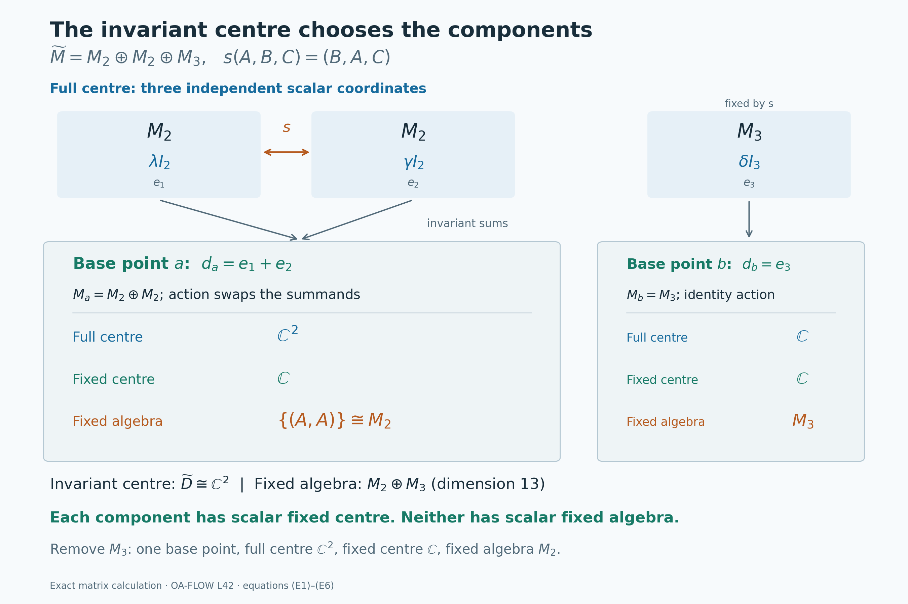

# Decomposing an action over its fixed centre

*Self-checked by the writing AI. Original lesson, figure and reproduction code: CC0-1.0; accompanying font terms retained.*

A group can move the centre of a von Neumann algebra even when it leaves some central observables fixed. Those fixed observables provide a base over which the action can be separated into components. We will prove that each component has no further fixed central observable except scalars. The main difficulty is to obtain a genuine continuous action on each component: separate choices of an operator field for each group element do not supply that conclusion.

We first construct the algebra field and then give two ways to recover continuous fibre representations. One integrates an almost representation against Haar measure; the other uses strict measurable cocycles. We finish by computing the entire fixed-centre field with countably many compact equations. This last step distinguishes central ergodicity from both factoriality and ergodicity of the full algebra.

## The decomposition to be proved

Let \(M\ne0\) be a von Neumann algebra with separable predual. Let \(G\) be a separable locally compact Hausdorff group, and let \(\alpha:G\to\operatorname{Aut}(M)\) be an action continuous in the predual topology: \(g\mapsto\omega\circ\alpha_g\) is norm-continuous for every \(\omega\in M_*\). Set
\[
 D=Z(M)^\alpha
   =\{z\in Z(M):\alpha_g(z)=z\text{ for every }g\in G\}.
 \tag{T1}
\]
We call the system **centrally ergodic** if \(D=\mathbb C1\), and **ergodic** if \(M^\alpha=\mathbb C1\). Ergodicity implies central ergodicity because \(D\subseteq M^\alpha\).

**Central-ergodic decomposition theorem.** There are a standard probability space \((Y,\nu)\), a measurable field of nonzero separable Hilbert spaces \(H_y\), and a whole measurable field of von Neumann algebras \(M_y\subseteq B(H_y)\) such that
\[
 H=\int_Y^\oplus H_y\,d\nu(y),\qquad
 M=\int_Y^\oplus M_y\,d\nu(y),\qquad
 D=L^\infty(Y,\nu)1_y.
 \tag{T2}
\]
On one conull measurable subset of \(Y\), each fibre admits a strongly continuous unitary representation \(V_y:G\to\mathcal U(H_y)\) normalizing \(M_y\). Write \(\alpha_{g,y}=\operatorname{Ad}V_y(g)|_{M_y}\). Each \(\alpha_{\cdot,y}\) is a continuous action in the predual topology, and
\[
 \alpha_g(a)=\int_Y^\oplus\alpha_{g,y}(a_y)\,d\nu(y)
 \quad(g\in G,\ a=\textstyle\int_Y^\oplus a_y\,d\nu(y)\in M),
 \qquad Z(M_y)^{\alpha_y}=\mathbb C1_y.
 \tag{T3}
\]
Here “whole” means every essentially bounded measurable section of the indicated fibre algebras belongs to the integral algebra. For each fixed \(g\), the field \(V_y(g)\) is measurable and integrates to the canonical global implementer. The pointwise group law and continuity of each retained \(V_y\) hold for all \(g,h\); we will not infer them by taking an uncountable intersection of conull sets. The theorem is proved at the [conclusion](#oa-flow.centerg.conclusion).

The field can be chosen as standard forms \((M_y,H_y,J_y,P_y)\), with \(J=\int^\oplus J_y\) and \(P\) the cone of square-integrable sections taking values in \(P_y\). On a single conull set, the representations preserve \(J_y\) and \(P_y\) for every group element, so they are the canonical standard implementations of the fibre actions.

No invariant state is assumed. Separability of \(G\) is not strengthened to second countability. The zero algebra, if permitted as a von Neumann algebra, has the empty direct-integral decomposition and requires no nonzero fibre assertion.

## The fixed central algebra and its standard Hilbert field

Let \(M\ne0\) be a von Neumann algebra with separable predual, let \(G\) be a separable locally compact Hausdorff group, and let \(\alpha:G\to\operatorname{Aut}(M)\) be a continuous action by normal automorphisms. Continuity means norm continuity on each predual orbit; [AT-1–3](OA-FLOW-AT.md#oa-flow.at.3) also proves the equivalence with point-ultraweak continuity. Set

\[
 D=Z(M)^G=\{z\in Z(M):\alpha_g(z)=z\text{ for every }g\in G\}.
 \tag{A1}
\]

This is a unital abelian von Neumann algebra. Indeed the center and each fixed-point space are ultraweakly closed, and their intersection is a unital, adjoint-closed algebra. We use a standard form \((M,H,J,P)\). Its canonical implementation, proved in [NR-1](OA-FLOW-NR.md#oa-flow.nr.1), satisfies

\[
 U_g aU_g^*=\alpha_g(a),\qquad U_gJ=JU_g,\qquad U_gP=P,
 \qquad U_gU_h=U_{gh}.
 \tag{A2}
\]

The representation \(U\) is strongly continuous. None of these assumptions requires an invariant state or a unimodular group.

The Hilbert space \(H\) is separable. To see this directly, choose a norm-dense sequence \((f_n)\) in \(M_*^+\). Such a sequence exists because the positive cone is a subspace of the separable metric space \(M_*\). By [CR-8](OA-FLOW-CR.md#oa-flow.cr.8), every \(f\in M_*^+\) has a unique representing vector \(\xi_f\in P\), and [CR-6](OA-FLOW-CR.md#oa-flow.cr.6) gives

\[
 \|\xi_f-\xi_{f_n}\|^2\leq\|f-f_n\|.
 \tag{A3}
\]

Consequently the vectors \(\xi_{f_n}\) are dense in \(P\). The complex span of \(P\) is all of \(H\), by [CR-1](OA-FLOW-CR.md#oa-flow.cr.1). Finite rational complex combinations of the \(\xi_{f_n}\) therefore form a countable dense set in \(H\).

We will also need a faithful normal state. The norm-convergent positive series

\[
 \psi=\sum_{n\geq1}2^{-n}\frac{f_n}{1+\|f_n\|},
 \qquad \varphi=\frac{\psi}{\psi(1)}
 \tag{A4}
\]

supplies one. If \(a\in M_+\) and \(\psi(a)=0\), every \(f_n(a)\) is zero, so density gives \(f(a)=0\) for every positive normal functional \(f\). Positive vector functionals in any faithful concrete representation separate positive operators, whence \(a=0\). In particular \(\psi(1)>0\). Its cone vector \(\Omega=\xi_\varphi\) is cyclic and separating by [CR-8](OA-FLOW-CR.md#oa-flow.cr.8), and [CR-4](OA-FLOW-CR.md#oa-flow.cr.4) identifies the GNS standard form of \(\varphi\) with our given \((M,H,J,P)\).

### The whole algebra over the specified diagonal

Apply [DC-7, existence over a specified central algebra](../../OA-MOD/OA-MOD-DC.html#existence-over-any-specified-central-abelian-subalgebra) to \((M,H,D)\). Its hypotheses are exactly that \(H\) is separable and \(D\subseteq Z(M)\) is unital. Together with [DC-6](../../OA-MOD/OA-MOD-DC.html#realizing-an-abelian-algebra-as-the-diagonal-algebra), it gives a standard Borel probability base, completed when taking equivalence classes, and a faithful diagonal realization

\[
 H=\int_Y^\oplus H_y\,d\nu(y),\qquad
 M=\int_Y^\oplus M_y\,d\nu(y),\qquad
 D=\{M_f:f\in L^\infty(Y,\nu)\}.
 \tag{A5}
\]

Here \(H_y\ne0\) is separable and \(M_y\subseteq B(H_y)\) is a nonzero unital von Neumann algebra almost everywhere. The middle identity denotes **all** measurable essentially bounded fields with values in \(M_y\), not just a chosen generating family. DC-7 proves it by constructing the measurable fiber commutants and identifying their entire integral commutant. The diagonal has no kernel on the retained base. Every \(M_y\) also has separable predual: [CP-6](OA-FLOW-CP.md#oa-flow.cp.6) realizes it as a quotient of \(H_y\widehat\otimes_\pi\overline{H_y}\), whose finite rational tensors from a countable dense subset are norm dense.

Since \(\alpha_g\) fixes \(D\) pointwise, \(U_g\) commutes with every scalar multiplication \(M_f\). The [DF-8 diagonal-commutant theorem](../../OA-MOD/OA-MOD-DF.html#the-diagonal-commutant-is-exactly-the-decomposable-algebra) therefore supplies, for each fixed \(g\), a measurable unitary field representing \(U_g\). Unitarity follows by decomposing \(U_g^*U_g=U_gU_g^*=I\) and using DF-8 uniqueness. At this stage its exceptional null set can depend on \(g\).

### A compatible field of standard forms

We can choose (A5) with the full standard-form data as well. The additional input is the proved [MW-7 central weight disintegration](../../OA-MOD/OA-MOD-MW.html#central-disintegration-of-a-separable-weighted-algebra). That theorem applies to a faithful normal semifinite weight on a separably acting algebra and **any** specified unital \(D\subseteq Z(M)\). In particular it applies to \(\varphi\) from (A4). Its [DI-13 reverse assembly](../../OA-MOD/OA-MOD-DI.html#reverse-assembly-over-a-specified-central-diagonal) begins with the whole algebra decomposition of \((M,H,D)\), localizes both closed involution graphs, and constructs the full fiber Hilbert algebras. The [GFR comparison](../../OA-MOD/OA-MOD-GFR.html#the-reverse-comparison-and-the-realization-obstruction) transports those fibers to their actual GNS spaces. Thus the resulting GNS, algebra and diagonal identifications are compatible with each other.

Initially write the fiber weights as \(\widetilde\varphi_y\) and the reference measure as \(\widetilde\nu\). [MW-5](../../OA-MOD/OA-MOD-MW.html#every-positive-value-and-the-exact-finite-left-ideal) gives the identity for every positive element, including the unit. Hence the measurable function

\[
 h(y)=\widetilde\varphi_y(1),\qquad
 0<h(y)<\infty\text{ almost everywhere},\qquad
 \int h\,d\widetilde\nu=1
 \tag{A6}
\]

is a strictly positive density. Positivity uses nonzero fibers and faithfulness; finiteness follows from the displayed integral. Replace the base by \(d\nu=h\,d\widetilde\nu\) and the fiber weights by \(\varphi_y=h^{-1}\widetilde\varphi_y\). The resulting \(\varphi_y\) are faithful normal states. The density change and its GNS unitary are proved in MW-7: on the GNS core, the map \(\Lambda_{\widetilde\varphi_y}(a)\mapsto\Lambda_{\varphi_y}(a)\) has norm factor \(h(y)^{-1/2}\), precisely compensated by \(d\nu=h\,d\widetilde\nu\). We use these normalized coordinates in (A5).

The full GNS-ideal assertion of MW-5 and the full closed-operator assertion of [MW-4](../../OA-MOD/OA-MOD-MW.html#constructing-the-integral-weight-and-its-full-operators) now give

\[
 \begin{aligned}
 \varphi(a)&=\int_Y\varphi_y(a(y))\,d\nu(y)&& (a\in M_+),\\
 \Omega(y)&=\Omega_y=\Lambda_{\varphi_y}(1),&\quad \|\Omega_y\|&=1,\\
 J&=\int_Y^\oplus J_y\,d\nu(y),&
 \Delta_\varphi&=\int_Y^\oplus\Delta_y\,d\nu(y).
 \end{aligned}
 \tag{A7}
\]

The last equality includes the full operator domain. Bounded Borel functions of \(\Delta\) integrate fiberwise; unbounded powers are recovered by spectral truncation with their exact square-integrability domains. Notice also that, for \(f\in L^\infty(Y,\nu)\),
\(\varphi(M_f)=\int f\,d\nu\). Thus this normalization realizes the restriction of \(\varphi\) to the specified diagonal.

Each faithful-state GNS space has its natural cone

\[
 P_y=\overline{\Delta_y^{1/4}(M_y)_+\Omega_y}.
 \tag{A8}
\]

[NC-5](OA-FLOW-NC.md#oa-flow.nc.5) proves this formula and the standard-form axioms. We next prove that these are a measurable field of cones and that their integral is the original cone:

\[
 P=\left\{\eta\in H:\eta(y)\in P_y
               \text{ for almost every }y\right\}.
 \tag{A9}
\]

The [GFR-7 common contraction family](../../OA-MOD/OA-MOD-GFR.html#a-common-countable-strong-dense-contraction-family) provides measurable contractions \(q_j(y)\) strongly-star dense in the unit ball of every \(M_y\), in this actual GNS realization, off one null set. Include zero and form all fields \(a_j=kq_i^*q_i\), for positive integers \(k\); enumerate them as one sequence. Each is positive and globally bounded. For every positive \(b\in M_y\), suitable such fields approximate \(b\) strongly at that fiber: approximate \((b/k)^{1/2}\) strongly-star in the contraction ball, with \(k\geq\|b\|\).

For \(b\in M_y\), the Tomita identity and Cauchy–Schwarz in the spectral measure give

\[
 \begin{aligned}
 \|\Delta_y^{1/4}b\Omega_y\|^2
 &=\langle\Delta_y^{1/2}b\Omega_y,b\Omega_y\rangle\\
 &\leq\|b\Omega_y\|\,\|b^*\Omega_y\|.
 \end{aligned}
 \tag{A10}
\]

All domains here are valid because \(M_y\Omega_y\subseteq D(S_y)=D(\Delta_y^{1/2})\). For self-adjoint differences, (A10) shows that strong approximation of the positive elements passes to their quarter-power vectors. Consequently the measurable sections

\[
 v_j(y)=\Delta_y^{1/4}a_j(y)\Omega_y
 \tag{A11}
\]

are dense in \(P_y\). Measurability follows by applying the bounded spectral truncations of the quarter power from (A7), then taking the pointwise norm limit. Moreover \(\|v_j(y)\|\leq\|a_j\|\), so every \(v_j\) is square integrable on our probability base.

By [NC-5](OA-FLOW-NC.md#oa-flow.nc.5) and [CR-4](OA-FLOW-CR.md#oa-flow.cr.4), \(P=\overline{\Delta_\varphi^{1/4}M_+\Omega}\). Equations (A7)–(A8) put every one of these generating vectors in the right side of (A9). That side is norm closed: from an \(L^2\)-convergent sequence choose a subsequence converging pointwise almost everywhere, and use closedness of every \(P_y\). This proves one inclusion.

For the reverse inclusion, let \(\eta(y)\in P_y\) be square integrable. For each \(n\), choose the first index \(j_n(y)\) such that \(\|\eta(y)-v_{j_n(y)}(y)\|<1/n\). This is measurable, since each of the countably many distance functions is measurable. Choose a finite \(k_n\) so that
\(\int_{\{j_n>k_n\}}\|\eta(y)\|^2\,d\nu<1/n^2\), possible by dominated convergence. On \(\{j_n=j\}\), \(j\leq k_n\), put \(b_n(y)=a_j(y)\), and put \(b_n(y)=0\) elsewhere. This is a bounded positive measurable field, so the **whole algebra** identity in (A5) places \(b_n\) in \(M_+\). Its global quarter-power vector has the corresponding values \(v_j(y)\), by (A7), and

\[
 \|\eta-\Delta_\varphi^{1/4}b_n\Omega\|^2\leq\frac{2}{n^2}.
 \tag{A12}
\]

Thus \(\eta\in P\), proving (A9). This also constructs a countable measurable family dense in each fiber cone. We have established the compatible field of standard forms \((M_y,H_y,J_y,P_y)\) over the fixed diagonal \(D\).

## Repairing an almost representation by integration

Let \(G\) be a separable locally compact Hausdorff group. Fix left Haar measure \(dg\) and use the convention
\[
 \int_G f(th)\,dt=\Delta_G(h)^{-1}\int_Gf(t)\,dt,\qquad
 f^*(t)=\Delta_G(t^{-1})\,\overline{f(t^{-1})}.
 \tag{I1}
\]
These are the [translation and inversion conventions of L24](OA-FLOW-L24.md#oa-flow.grp.translations). The group need not have a countable neighborhood base. It is nevertheless sigma compact: if \(O\) is a relatively compact identity neighborhood and \(Q\) is a countable dense subset, then every open \(gO^{-1}\) meets \(Q\), so
\[
 G=\bigcup_{q\in Q}qO\subseteq\bigcup_{q\in Q}q\overline O=G.
 \tag{I2}
\]
Thus Haar measure is sigma-finite. Products below use the completed Radon product of Haar measures, for which [HR5](OA-FLOW-HR.md#hr-05) proves Borel Tonelli and Fubini on sigma-finite carriers. All of \(G^n\) is such a carrier. No equality between the full Borel sigma-algebra of \(G^2\) and \(\mathcal B(G)\otimes\mathcal B(G)\) is needed.

**Almost-representation lemma.** Let \(K\) be a separable Hilbert space and \(W:G\to\mathcal U(K)\) weakly Haar-measurable. Assume
\[
 W(st)=W(s)W(t)
 \quad\text{for product-Haar-almost every }(s,t)\in G^2.
 \tag{I3}
\]
Then there is a unique strongly continuous unitary representation \(V:G\to\mathcal U(K)\) such that \(V(g)=W(g)\) for Haar-almost every \(g\).

The zero Hilbert space has its unique representation, so we can suppose \(K\ne0\). Weak measurability becomes strong measurability on each vector here. Indeed, in a finite or countable orthonormal basis, the coefficients of \(W(g)\xi\) are measurable, and their finite coordinate sums converge in norm for every \(g\). A countable net in the separable space \(K\), with least-index choices and a sigma-finite exhaustion, then gives the simple-function approximants in [L24's vector-integration construction](OA-FLOW-L24.md#oa-flow.grp.vectorintegration).

We can also use a Borel unitary representative. Choose Borel versions of the countably many vector maps \(g\mapsto W(g)e_n\), changing them on one Borel Haar-null set; Borel versions for completed measurable functions follow from [the completion argument in L75](OA-FLOW-L75.md#oa-flow.kernel.completion), applied to their countably many coordinates and a finite-measure exhaustion. Explicitly, the coordinate versions have square-summable values off one null set. On the Borel set where their squared sum is finite, their finite coordinate sums reconstruct a Borel vector map; use zero elsewhere. Countably many columns have one common null carrier. The chosen columns define a unitary exactly when they have the prescribed basis Gram matrix and have dense range. The latter has the countable tests
\[
 \inf_{a\in\mathbb Q(i)^{(\mathbb N)}}
       \left\|e_m-\sum_n a_n w_n(g)\right\|=0
       \qquad(m\ge1),
 \tag{I4}
\]
where the coefficients have finite support; in finite dimension use only the existing basis vectors. These tests and the Gram equalities are Borel. On their common good set the columns extend to an isometry with dense, hence full, range; on the complement use the identity. The resulting matrix coefficients are Borel and agree with those of \(W\) off one null set. They define a Borel map into the strong unitary group, whose topology is determined by those countably many vector columns.

Replacing \(W\) by this representative preserves (I3). If \(N\) is the Borel null set of changes, the possible failures occur where \(s\in N\), \(t\in N\), or \(st\in N\). The first two sets are product null by sigma-finiteness. The last is Borel, and its section for every fixed \(s\) is \(s^{-1}N\), which is Haar-null; HR5 makes it product null. We henceforth use this Borel representative.

For \(f\in L^1(G)\) define
\[
 \Pi(f)\xi=\int_G f(g)W(g)\xi\,dg,\qquad
 \|\Pi(f)\|\le\|f\|_1.
 \tag{I5}
\]
This is a vector integral, not an assertion of norm measurability into \(B(K)\). The separability just proved and the bound
\(\|f(g)W(g)\xi\|=|f(g)|\|\xi\|\)
give existence. The [vector Fubini theorem in L24](OA-FLOW-L24.md#oa-flow.grp.vectorintegration), the almost-everywhere law (I3), and the substitution \(r=st\) give
\[
 \begin{aligned}
 \Pi(f)\Pi(h)\xi
 &=\int_{G^2}f(s)h(t)W(s)W(t)\xi\,ds\,dt\\
 &=\int_G\left(\int_G f(s)h(s^{-1}r)\,ds\right)W(r)\xi\,dr\\
 &=\Pi(f*h)\xi.
 \end{aligned}
 \tag{I6}
\]
The double norm integral is bounded by
\(\|f\|_1\|h\|_1\|\xi\|\), so every exchange is justified. The changes of variables act on Borel functions and preserve the relevant completed null classes.

The involution requires a separate null-set argument. The maps
\[
 (g,t)\longmapsto(g,g^{-1}t),\qquad
 (g,t)\longmapsto(g^{-1},t)
 \tag{I7}
\]
are homeomorphisms. The first preserves the Radon product, by left Haar invariance in the second coordinate and the [product-change proof of HR7](OA-FLOW-HR.md#hr-07). The second preserves its null ideal: inversion changes the first Haar measure by the everywhere positive density \(\Delta_G(g^{-1})\), by (I1). Their inverses have the same null-class properties. Apply (I3) along these two legitimate transformations. For almost every \((g,t)\),
\[
 W(t)=W(g)W(g^{-1}t),\qquad
 W(g^{-1}t)=W(g^{-1})W(t).
 \tag{I8}
\]
Multiplication and the unitarity of \(W(t)\) give \(W(g)W(g^{-1})=1\). Fubini now makes this true for almost every \(g\): for each such \(g\), its conull set of valid \(t\)'s is nonempty since Haar measure is nonzero. Hence
\[
 W(g^{-1})=W(g)^*\quad\text{for Haar-almost every }g.
 \tag{I9}
\]
In particular we have made no substitution on the potentially null graph \(t=g^{-1}\). Scalar matrix coefficients, (I9) and the full inversion formula give
\[
 \Pi(f)^*
 =\int_G\overline{f(g)}W(g^{-1})\,dg
 =\int_G\Delta_G(t^{-1})\overline{f(t^{-1})}W(t)\,dt
 =\Pi(f^*).
 \tag{I10}
\]
Each displayed operator integral means its vector or scalar-coefficient integral. Equations (I5), (I6), (I10), together with [L24's Banach star algebra](OA-FLOW-L24.md#oa-flow.grp.algebra), make \(\Pi\) a bounded star representation of \(L^1(G)\).

This representation is nondegenerate. If \(\zeta\) is orthogonal to the span of all \(\Pi(f)\eta\), then
\[
 \int_G f(g)\langle W(g)\eta,\zeta\rangle\,dg=0
 \quad(f\in L^1(G),\ \eta\in K).
 \tag{I11}
\]
A bounded measurable scalar function \(b\) whose integrals against every \(L^1\) function vanish is zero almost everywhere: on a finite-Haar-measure exhaustion \(E_n\), take
\(f=1_{E_n}\overline b\) and obtain \(\int_{E_n}|b|^2=0\).
Apply this to (I11) for a countable dense set of \(\eta\)'s. Off one common null set, \(W(g)^*\zeta=0\), so \(\zeta=0\) by unitarity. Therefore
\[
 \mathcal K_0=\operatorname{span}\{\Pi(f)\eta:
                    f\in L^1(G),\ \eta\in K\}
 \quad\text{is dense in }K.
 \tag{I12}
\]

For clarity, we retain the explicit continuous recovery construction from [L24](OA-FLOW-L24.md#oa-flow.grp.recovery). Write \(L_gf(t)=f(g^{-1}t)\) and prescribe
\[
 V(g)\left(\sum_{j=1}^m\Pi(f_j)\eta_j\right)
       =\sum_{j=1}^m\Pi(L_gf_j)\eta_j.
 \tag{I13}
\]
The identity
\[
 (L_gh)^**(L_gf)=h^**f
 \tag{I14}
\]
preserves all pairwise inner products of these finite sums. One direct verification starts from
\((h^**f)(r)=\int_G\overline{h(t)}f(tr)\,dt\), obtained by the weighted inversion formula. Substitution \(t=gs\) proves (I14) for compact continuous functions, and the \(L^1\) convolution estimate and density extend it to all \(f,h\in L^1(G)\). Thus (I13) is independent of the expression of a vector and is an isometry on \(\mathcal K_0\). Its inverse there is the formula for \(g^{-1}\). It extends to an onto unitary on \(K\), and \(L_gL_h=L_{gh}\) proves the representation law.

For every generating vector,
\[
 \|(V(g)-V(h))\Pi(f)\eta\|
 \le\|L_gf-L_hf\|_1\,\|\eta\|.
 \tag{I15}
\]
[L24's translation-continuity proof](OA-FLOW-L24.md#oa-flow.grp.translations) applies to arbitrary locally compact groups. It proves continuity on \(\mathcal K_0\), and the uniform unitary bound extends it to every vector of \(K\).

The recovered representation has exactly the original integral. The identity
\(\int_G f(g)L_gh\,dg=f*h\) is a Bochner identity in \(L^1(G)\), proved in L24 by vector Fubini and its bilinear norm bound. Its measurability does not require \(L^1(G)\) to be separable: the continuous orbit \(g\mapsto L_gh\) has separable image, because \(G\) is sigma compact and each compact image in a metric space is separable. Applying (I13) gives
\[
 \left(\int_G f(g)V(g)\,dg\right)\Pi(h)\eta
   =\Pi(f*h)\eta=\Pi(f)\Pi(h)\eta.
 \tag{I16}
\]
Both operators are bounded and agree on the dense space (I12). Their integrals therefore agree for every \(f\). Test this equality against countably many dense pairs of vectors and apply the scalar test following (I11). It gives \(W(g)=V(g)\) on one Haar-conull set.

Finally, two strongly continuous representations agreeing almost everywhere agree everywhere. Each of their scalar coefficient differences is continuous and zero almost everywhere. A continuous scalar function nonzero at a point is bounded away from zero on a nonempty open set, whose Haar measure is positive. This is impossible here. This proves uniqueness and the lemma.

## Why separable Hilbert fibres matter

Scalar weak measurability alone does not allow the Hilbert-space separability hypothesis in the preceding almost-representation lemma to be removed. Let
\[
 K=\ell^2(\mathbb R_{\mathrm{discrete}}),\qquad
 W(t)e_s=e_{s+t}\quad(s,t\in\mathbb R).
 \tag{N1}
\]
Each \(W(t)\) permutes the orthonormal basis, hence is unitary; \(W(t+u)=W(t)W(u)\) for every pair.

Every vector \(\xi\in K\) has countable support. Indeed for each integer \(n\ge1\) the set \(\{s:|\xi_s|\ge1/n\}\) is finite, since any finite subset of it has cardinality at most \(n^2\|\xi\|^2\); the support is the countable union of these sets. If \(\xi,\eta\) have supports \(A,B\), respectively, then
\[
 \langle W(t)\xi,\eta\rangle=0\qquad(t\notin B-A).
 \tag{N2}
\]
The set \(B-A\) is countable. A scalar function supported on a countable subset of \(\mathbb R\) is Borel: away from zero its inverse images are subsets of that countable set, hence countable unions of closed singletons, and sets containing zero are handled by complements. Thus \(W\) is scalar weakly measurable. Each coefficient is zero Lebesgue-almost everywhere and is bounded by \(\|\xi\|\|\eta\|\). Consequently every weak operator integral \(\int f(t)W(t)\,dt\), for \(f\in L^1(\mathbb R)\), equals the zero operator.

Suppose a strongly continuous representation \(V\) agreed with \(W\) as operators almost everywhere. The continuous scalar function \(c(t)=\langle V(t)e_0,e_0\rangle\) would vanish almost everywhere by (N2). A continuous function on \(\mathbb R\) vanishing almost everywhere vanishes everywhere: a nonzero value would give an open interval on which its absolute value is bounded below. Hence \(c(0)=0\), contradicting \(V(0)=1\). This also disproves a weaker assertion requiring only coefficientwise almost-everywhere agreement, by applying it to \(e_0,e_0\).

The failure concerns nondegeneracy of the integrated operators. In the separable proof, a countable total vector family lets one choose a single conull set on which all relevant coefficients vanish. There is no such countable total family in (N1). The present lesson obtains separable fibres from the separable predual, so its application retains exactly the hypothesis needed by that proof.

## Joint unitary fields from a decomposable representation

Let
\[
 \mathscr H=\int_X^\oplus H_x\,d\mu(x)
 \tag{I17}
\]
be a separable Hilbert direct integral over a standard Borel probability space, with separable fibers and a specified countable measurable fundamental family. Suppose \(U:G\to\mathcal U(\mathscr H)\) is strongly continuous and every \(U_g\) commutes with the diagonal \(L^\infty(X,\mu)\). We prove that there are continuous unitary representations \(V_x\) on the fibers such that, for each fixed \(g\), their field is measurable and integrates to \(U_g\). We will in fact obtain joint Borel matrix coefficients for the repaired field.

The exact field inputs are the [measurable orthonormal frame](../../OA-MOD/OA-MOD-DF.html#compact-orthonormal-frames-and-measurable-dimension), its [ambient realization](../../OA-MOD/OA-MOD-DF.html#ambient-realization-and-the-effros-closed-subspace-condition), and the [full diagonal-commutant theorem](../../OA-MOD/OA-MOD-DF.html#the-diagonal-commutant-is-exactly-the-decomposable-algebra). Choose a frame \(e_n(x)\), with each vector either zero or norm one, whose nonzero members are an orthonormal basis of \(H_x\). Realize \(H_x\) as the corresponding coordinate subspace of \(\ell^2\). Its projection is diagonal with Borel zero-or-one entries. Countably many completed scalar coordinates can be replaced by Borel versions and their null carriers discarded once; thus these frame data can be taken Borel on a common Borel conull base. We work on that base. The zero fibers, if any, cause no difficulty.

Because \(\mu(X)=1\), every \(e_n\) is a vector of \(\mathscr H\). By the diagonal-commutant theorem, for each fixed \(g\), \(U_g\) has a measurable operator field. Its field is unitary almost everywhere: both equations \(U_g^*U_g=U_gU_g^*=1\) localize by the [field integration and adjoint theorem](../../OA-MOD/OA-MOD-DF.html#integrating-operator-fields-norm-domains-and-adjoints), followed by its countable-frame uniqueness. These separate choices will be replaced by a joint one.

Choose a countable dense family \((v_j)\) in \(\mathscr H\) and Borel field representatives for its members. For \(n,k\ge1\) let
\[
 j(n,k,g)=\min\{j:\|U_ge_n-v_j\|_{\mathscr H}<2^{-k}\},
 \qquad b_{n,k}(g,x)=v_{j(n,k,g)}(x).
 \tag{I18}
\]
The least index is Borel in \(g\), since its defining norm functions are continuous. Countable pasting makes \(b_{n,k}\) jointly Borel as a vector in the ambient \(\ell^2\). For a fixed \(g,n\),
\[
 \sum_{k\ge1}\|b_{n,k+1}(g,\cdot)-b_{n,k}(g,\cdot)\|_{L^2}
 \le \sum_{k\ge1}(2^{-k-1}+2^{-k})<\infty.
 \tag{I19}
\]
The \(L^1(\mu)\) norm of a nonnegative function is bounded by its \(L^2(\mu)\) norm here. Monotone convergence applied to the sum of pointwise norms shows that this vector sequence is Cauchy in \(H_x\) for almost every \(x\), for the fixed \(g,n\). Its limit represents \(U_ge_n\): take any representative of that vector and apply Fatou to the squared differences, whose integrals tend to zero by (I18).

The Cauchy condition is a countable Borel condition in \((g,x)\). Define \(b_n(g,x)\) to be the limit where it exists and zero elsewhere. The coordinate limits are Borel; the ambient spaces \(H_x\) are closed, so these limits lie in the right fiber. The resulting section is jointly Borel, and for every fixed \(g\),
\[
 b_n(g,\cdot)\text{ represents }U_ge_n
 \quad\text{for every }n
 \quad\text{outside one }\mu\text{-null set}.
 \tag{I20}
\]

Now impose, jointly in \((g,x)\), both the Gram and the dense-range tests
\[
 \begin{aligned}
 \langle b_n(g,x),b_m(g,x)\rangle
       &=\langle e_n(x),e_m(x)\rangle &&(n,m\ge1),\\
 \inf_{a\in\mathbb Q(i)^{(\mathbb N)}}
       \left\|e_m(x)-\sum_n a_n b_n(g,x)\right\|
       &=0 &&(m\ge1).
 \end{aligned}
 \tag{I21}
\]
They define a Borel set \(\mathcal T\subseteq G\times X\). For each fixed \(g\), its section has measure one, by (I20) and the already known unitary decomposition of \(U_g\). On \(\mathcal T\), the assignment \(e_n(x)\mapsto b_n(g,x)\) preserves all finite linear relations and inner products. It extends to an isometry on \(H_x\). The second line says that its range is dense. The range of an isometry from a complete Hilbert space is closed, so the extension is onto. Define that unitary to be \(u(g,x)\); off \(\mathcal T\), set \(u(g,x)=1_{H_x}\). Thus \(u(g,x)\) is unitary for every pair, not merely isometric.

Its matrix coefficients in the frame are jointly Borel. Indeed, on \(\mathcal T\) they are the coefficients of \(b_n\), and off it they are those of the identity. Finite coordinate sums then prove that \(u(g,x)\) applied to a jointly Borel section is jointly Borel. By construction and decomposable uniqueness,
\[
 U_g=\int_X^\oplus u(g,x)\,d\mu(x)
 \qquad\text{for every fixed }g.
 \tag{I22}
\]
The exceptional set in comparison with an earlier representative may depend on \(g\). The jointly Borel field \(u\) itself has been specified everywhere.

We next justify the product Fubini step at the actual group scope. A standard Borel base can be [coded as a Borel subset of \([0,1]\)](OA-FLOW-L75.md#oa-flow.kernel.coding); extend \(\mu\) by zero to that compact metric interval, and use zero fibers off the coded subset. Its extended finite Borel measure is Radon by [finite metric-measure regularity](OA-FLOW-IS.md#is-2). The failure set of
\[
 u(gh,x)=u(g,x)u(h,x)
 \tag{I23}
\]
is Borel in \(G^2\times X\): test its countably many frame entries. On the left compose the joint Borel entries of \(u\) with the continuous multiplication map \((g,h)\mapsto gh\); on the right use the convergent coordinate sums for a product of bounded operators. Products with the second-countable interval have
\(\mathcal B(G^2\times[0,1])=\mathcal B(G^2)\otimes\mathcal B([0,1])\):
every open set is a countable union of rectangles using a fixed countable basis in the interval and the corresponding open unions in \(G^2\). This assertion concerns \(G^2\) as one space and does not assume a product-Borel assertion for the two group coordinates.

For every fixed pair \(g,h\), (I22), \(U_{gh}=U_gU_h\), and uniqueness of decomposable fields make the \(x\)-section of that failure set null. Apply HR5 to the Radon product on \(G^2\) and the interval, on their sigma-finite carrier. On this mixed product its rectangle values agree with the ordinary sigma-finite product, so uniqueness of the product measure identifies the two on the displayed product sigma-algebra. Fubini shows that the failure set has zero product measure, and that its \(G^2\)-section is Haar-product-null for almost every \(x\). A Borel common good base can be chosen: the section measure is Borel in \(x\), by ordinary parameter integration for the sigma-finite measure on the single Borel space \(G^2\) and the displayed product sigma-algebra. Equivalently, exhaust \(G^2\) by finite-measure compact sets and apply the finite rectangle-class argument to each. Let
\[
 X_{\mathrm{law}}
 =\left\{x:
     \int_{G^2}1_{\{u(gh,x)\ne u(g,x)u(h,x)\}}\,dg\,dh=0
       \right\}.
 \tag{I24}
\]
It is Borel and conull. For each \(x\) in it, \(g\mapsto u(g,x)\) is a weakly Borel unitary almost representation on the separable Hilbert space \(H_x\). The lemma produces its unique strongly continuous representative \(V_x\). The next step proves measurability and the correct fixed-parameter integral of these representatives.

## Recovering each fixed group element from integrated vectors

For \(f\in L^1(G)\), with a Borel representative, define on every fiber
\[
 T_f(x)\xi=\int_G f(t)u(t,x)\xi\,dt,\qquad
 \|T_f(x)\|\le\|f\|_1.
 \tag{I25}
\]
These integrals exist for every \(x\), since the fibers are separable and \(u(t,x)\) is unitary and weakly Borel. The field \(T_f\) is Borel. Its frame coefficients are parameter integrals of the product-measurable functions
\(f(t)\langle u(t,x)e_n(x),e_m(x)\rangle\), with absolute integral at most \(\|f\|_1\). Here the original construction (I18)–(I21) is measurable for \(\mathcal B(G)\otimes\mathcal B(X)\); this also follows from the interval argument above with one group coordinate. Finite coordinate sums show that \(T_f(x)\eta(x)\) is Borel for every Borel section \(\eta\), by the [bounded-operator field criterion](../../OA-MOD/OA-MOD-DF.html#pointwise-bounded-operator-fields-adjoints-and-exact-norm-tests).

Let
\[
 \Pi_U(f)=\int_G f(t)U_t\,dt.
\]
Scalar Fubini against arbitrary \(\xi,\eta\in\mathscr H\) gives
\[
 \Pi_U(f)=\int_X^\oplus T_f(x)\,d\mu(x).
 \tag{I26}
\]
Indeed the absolute value of the joint scalar integrand is bounded by
\(|f(t)|\,\|\xi(x)\|\,\|\eta(x)\|\), whose integral is at most
\(\|f\|_1\|\xi\|_{\mathscr H}\|\eta\|_{\mathscr H}\).
For each \(t\), (I22) gives the global scalar coefficient. Integrating it in \(t\) and exchanging integrals yields (I26). This proves the equality on the entire Hilbert space. The pointwise formula (I25), rather than arbitrary separately chosen representatives of \(\Pi_U(f)\), is used from now on.

For every \(x\in X_{\mathrm{law}}\), the almost-representation lemma gives operator equality \(u(t,x)=V_x(t)\) for Haar-almost every \(t\). Consequently
\[
 T_f(x)=\int_Gf(t)V_x(t)\,dt,\qquad
 V_x(g)T_f(x)=T_{L_gf}(x)
 \quad(f\in L^1(G),\ g\in G)
 \tag{I27}
\]
for that same \(x\). There is no additional exceptional base set depending on \(f\): the lemma's almost-everywhere operator equality in \(t\) gives all its integrals at once.

The global integrated representation \(\Pi_U\) is nondegenerate by [L24's integrated-representation theorem](OA-FLOW-L24.md#oa-flow.grp.integration). The short approximation behind this assertion is useful here. Choose nonnegative normalized compact bumps \(a_O\), supported in sufficiently small identity neighborhoods. Strong continuity gives
\[
 \|\Pi_U(a_O)\eta-\eta\|
 \le\sup_{t\in O}\|U_t\eta-\eta\|\longrightarrow0.
 \tag{I28}
\]
These are neighborhoods in a net; no countable neighborhood basis is assumed. A countable dense family of vectors in the separable \(\mathscr H\), with errors \(2^{-k}\), needs only one chosen bump for each vector and each error. We thus obtain countably many individual integrated vectors
\[
 \zeta_j=\Pi_U(f_j)\eta_j,\qquad
 \overline{\operatorname{span}}\{\zeta_j:j\ge1\}=\mathscr H.
 \tag{I29}
\]
This selection uses separability of \(\mathscr H\). It does not select or presume a dense countable subset of \(L^1(G)\). Fix Borel representatives of the \(\eta_j\) and choose the particular representatives
\[
 \zeta_j(x)=T_{f_j}(x)\eta_j(x).
 \tag{I30}
\]
They are Borel and square integrable by (I25)–(I26).

The vectors \(\zeta_j(x)\) are total in \(H_x\) on a common Borel conull set. To prove this, let \(P_x\) be the projection onto their closed span. The [specified-subfield projection construction](../../OA-MOD/OA-MOD-DF.html#subfields-projections-conjugates-and-direct-sums) makes \(P_x\) a Borel projection field: it applies measurable Gram–Schmidt to the countable family and sums the resulting orthogonal rank-one projections. The event \(P_x=1\) is the countable Borel test
\(\|(1-P_x)e_n(x)\|=0\) for all \(n\).
If it failed on a positive-measure set, for some \(n\) the bounded Borel section
\((1-P_x)e_n(x)\) would have positive \(L^2\) norm. This section is pointwise orthogonal to every \(\zeta_j(x)\), hence globally orthogonal to every \(\zeta_j\), contradicting (I29). Thus
\[
 X_1=X_{\mathrm{law}}\cap\{x:P_x=1\}
 \quad\text{is Borel and conull}.
 \tag{I31}
\]

For all \(x\in X_1\), all \(g\in G\), and all \(j\), the recovery formula is
\[
 V_x(g)\zeta_j(x)
       =T_{L_gf_j}(x)\eta_j(x).
 \tag{I32}
\]
For a fixed \(g\), its right side is a Borel section by (I25). The family \(\zeta_j(x)\) is total on \(X_1\), so it determines \(V_x(g)\) measurably. Here is an explicit test rather than just a determination assertion. For each \(m,k\), choose on \(X_1\) the first rational finite combination of the \(\zeta_j(x)\) whose distance from \(e_m(x)\) is below \(2^{-k}\). These choices are Borel by countably many Borel norm tests. Replacing each \(\zeta_j(x)\) in that combination by the right side of (I32) gives Borel approximants to \(V_x(g)e_m(x)\), with errors below \(2^{-k}\) because \(V_x(g)\) is unitary. Their pointwise limits are Borel. The field criterion therefore makes \(x\mapsto V_x(g)\) a measurable unitary field. Off \(X_1\) put \(V_x(g)=1_{H_x}\) for every \(g\); this is also a continuous representation.

It remains to prove that this field gives the prescribed global implementer for every fixed \(g\). Left Haar substitution in the vector integral gives
\[
 U_g\Pi_U(f)=\Pi_U(L_gf).
 \tag{I33}
\]
This is also the group recovery identity in [L25](OA-FLOW-L25.md#oa-flow.ccov.grouprecovery), here with scalar coefficients. Equations (I26), (I30), (I32) imply
\[
 \left(\int_X^\oplus V_x(g)\,d\mu(x)\right)\zeta_j
   =\Pi_U(L_gf_j)\eta_j
   =U_g\zeta_j
       \qquad(j\ge1).
 \tag{I34}
\]
Both sides are bounded unitaries; the globally dense span in (I29) proves
\[
 \boxed{\displaystyle
 U_g=\int_X^\oplus V_x(g)\,d\mu(x)
 \quad\text{for every }g\in G.}
 \tag{I35}
\]
This is a separate fixed-\(g\) identity of operators, proved for every \(g\), while each \(V_x\) on \(X_1\) obeys its continuous representation law for every pair \(g,h\). Neither assertion is obtained by taking an uncountable union of exceptional sets.

The repaired field can be made jointly Borel in these same representatives. Fix a countable dense set \(Q=\{q_l\}\subseteq G\). For each one of the chosen functions \(f_j\), the family \(\{L_{q_l}f_j:l\ge1\}\) is dense in its left-translation orbit: continuity of \(g\mapsto L_gf_j\) sends the dense set to a dense subset of that image. Let
\[
 l(j,k,g)=\min\{l:\|L_gf_j-L_{q_l}f_j\|_1<2^{-k}\}.
 \tag{I36}
\]
It is Borel in \(g\), by norm continuity. For every \(x\),
\[
 \left\|
 T_{L_gf_j}(x)\eta_j(x)
 -
 T_{L_{q_{l(j,k,g)}}f_j}(x)\eta_j(x)
 \right\|
 \le 2^{-k}\|\eta_j(x)\|.
 \tag{I37}
\]
Each approximant is jointly Borel by countable pasting of the Borel sections for the fixed functions \(L_{q_l}f_j\). The pointwise norm limit is therefore jointly Borel. In (I32)'s rational approximants to \(V_x(g)e_m(x)\), the choices of combinations depend only on \(x\), and their image sections are now jointly Borel by (I37). Passing to their limits gives joint Borel frame columns and hence joint Borel matrix coefficients of \((g,x)\mapsto V_x(g)\). The definition by the identity off \(X_1\) preserves that assertion.

This last argument uses countable dense subsets of the individual translation orbits of the selected \(f_j\); it never asserts that the whole \(L^1(G)\) space is separable. Together, (I31), (I35) and the joint columns give the required field of genuine continuous representations at the full separable locally compact group scope.

## A second construction of continuous fiber implementations

There is a useful route to continuous fiber representations through a Polish group of unitaries. It applies even when the original separable locally compact group is not second countable.

### An effective second-countable group

On a nonzero separable Hilbert space \(K\), the strong topology makes \(\mathcal U(K)\) a Polish group. For clarity, take a countable dense sequence \((e_n)\) in its unit ball. A compatible complete metric is

\[
 d(v,w)=\sum_{n\geq1}2^{-n-1}
       \bigl(\|(v-w)e_n\|+\|(v^*-w^*)e_n\|\bigr).
 \tag{A13}
\]

Completeness follows as follows. A Cauchy sequence has strong limits \(v\) and \(w\) for its unitaries and their adjoints, by completeness of \(K\) and their common norm bound. Passing to products shows \(vw=wv=I\) and \(w=v^*\); hence the limit is unitary. The adjoint is strongly continuous within the unitary group because \(\|(v_n^*-v^*)\xi\|=\|(v-v_n)v^*\xi\|\). Separability follows by embedding this metrizable group into the countable product of the separable spaces containing \((ve_n,v^*e_n)_n\); that product, and every subspace of it, is second countable.

Apply the [effective Polish-image lemma](../../OA-ERGODIC/reader/localizing-factor-actions-and-uniform-cocycles.html#4-the-full-separable-locally-compact-scope) to the actual continuous homomorphism \(U:G\to\mathcal U(H)\). If

\[
 K_0=\ker U,\qquad Q=G/K_0,\qquad
 \kappa:G\longrightarrow Q,
 \tag{A14}
\]

then \(Q\) is second countable, locally compact and Hausdorff, and \(U\) factors through a continuous representation \(\overline U:Q\to\mathcal U(H)\). Here is the relevant mechanism. The kernel is closed and normal, the quotient is locally compact and separable, and the induced map from \(Q\) to \(\mathcal U(H)\) is injective and continuous. On a compact identity neighborhood it is a homeomorphism onto its compact metrizable image. This gives a countable local base in \(Q\); translates by a countable dense subset then give a countable base for \(Q\). There is no assumption that \(U(G)\) is closed, or that its subspace topology is the quotient topology everywhere.

The group \(Q\) acts on \(M\) by \(\overline\alpha_q=\operatorname{Ad}\overline U_q|_M\). This is well defined: every element of \(K_0\) implements the identity. It fixes \(D\) pointwise. We will perform the measurable construction for \(Q\), then pull it back along \(\kappa\).

### Measurable unitary fields with a Borel group parameter

The [DF-2 compact-frame construction](../../OA-MOD/OA-MOD-DF.html#compact-orthonormal-frames-and-measurable-dimension) gives measurable dimension strata
\(Y_d=\{y:\dim H_y=d\}\), where \(d\in\{1,2,\ldots,\infty\}\), and an orthonormal frame on each. Completed measurable data can be replaced by Borel versions outside one null set: the frame has countably many coordinates, so one common deletion suffices for all its identities. We identify the fibers on \(Y_d\) with \(H^{(d)}=\mathbb C^d\) or \(\ell^2(\mathbb N)\), according as \(d\) is finite or infinite. Null strata can be discarded; on every remaining stratum normalize the restricted finite measure to a probability. This normalization is used only to describe its \(L^0\) topology. The global integral still uses \(\nu\).

Decomposability and uniqueness from DF-8 define a map

\[
 F_d:Q\longrightarrow L^0\bigl(Y_d,\mathcal U(H^{(d)})\bigr),
 \qquad F_d(q)=[\text{field of }\overline U_q|_{Y_d}].
 \tag{A15}
\]

This map is continuous for convergence in measure. Indeed strong convergence of the global unitaries and their adjoints gives \(L^2\) convergence of their fields on every constant frame vector of this finite-measure stratum. Chebyshev's inequality gives convergence in measure of each coordinate difference. The finite head and uniformly bounded tail in (A13) give convergence in measure for that metric. Conversely, convergence in measure for (A13), with the uniform bound on unitaries, gives \(L^2\) convergence on every constant vector: split its squared error into where it is at most \(\varepsilon^2\) and its complement. Finite simple vector sections are dense in the Hilbert integral, so strong convergence follows. Both spaces in question are metrizable; these sequential implications establish the asserted continuity. Restriction to a stratum is legitimate since its scalar projection commutes with every \(\overline U_q\).

The parameter space \(Q\) is standard Borel and the value group \(\mathcal U(H^{(d)})\) is Polish. The general representative assertion of [Lemma 5.1](../../OA-ERGODIC/reader/localizing-factor-actions-and-uniform-cocycles.html#5-localizing-the-automorphism-action) therefore gives a jointly Borel map

\[
 u_d:Q\times Y_d\longrightarrow\mathcal U(H^{(d)})
 \quad\text{with}\quad [u_d(q,\cdot)]=F_d(q)
 \text{ for every fixed }q.
 \tag{A16}
\]

For this assertion, only its general Polish-valued representative construction is used. Briefly, take a bounded complete value metric and countably many dense Borel simple fields. For each \(L^0\) class choose the first such field within \(2^{-2n}\) in the integral metric. These indices are Borel in the class. Successive integral distances are summable, so for each class Tonelli gives pointwise Cauchy convergence almost everywhere. Take the limit on the joint Borel Cauchy set and the identity elsewhere. This supplies a Borel representative of each parameter's class.

For each fixed \(q,r\in Q\), the global representation identity and DF-8 uniqueness give

\[
 u_d(qr,y)=u_d(q,y)u_d(r,y)
 \quad\text{for almost every }y\in Y_d.
 \tag{A17}
\]

The quantifier in (A17) is exactly the hypothesis needed next; it does not assert that the original representatives obey all these equations outside one null set.

### Strict group laws, continuity, and the original group

Give \(Q\) the **trivial** action on the standard measured space \(Y_d\). This is a strict Borel nonsingular action, and (A17) is its cocycle identity. The [strict Polish-cocycle theorem, Theorem 3.1](../../OA-ERGODIC/reader/localizing-factor-actions-and-uniform-cocycles.html#3-making-a-measurable-cocycle-strict), applied with value group \(\mathcal U(H^{(d)})\), now gives a conull Borel \(E_d\subseteq Y_d\) and a jointly Borel \(v_d:Q\times E_d\to\mathcal U(H^{(d)})\) such that

\[
 \begin{aligned}
 v_d(qr,y)&=v_d(q,y)v_d(r,y),& v_d(e,y)&=I
       &&(q,r\in Q,\ y\in E_d),\\
 v_d(q,y)&=u_d(q,y)&&&\text{for almost every }y
       \text{ for each fixed }q.
 \end{aligned}
 \tag{A18}
\]

All hypotheses have now been checked: a second-countable locally compact group, a standard measured base, a strict nonsingular base action, a Polish value group, a joint Borel input and the fixed-pair almost-everywhere law. The theorem changes representatives, while preserving every fixed group element's field class. Since the base action is trivial, every Borel subset of the base is invariant.

For each \(y\in E_d\), the map \(q\mapsto v_d(q,y)\) is a Borel homomorphism. It is continuous by [Lemma 4.2](../../OA-ERGODIC/reader/localizing-factor-actions-and-uniform-cocycles.html#4-the-full-separable-locally-compact-scope). The proof explains why mere Borel dependence is enough here. Given an identity neighborhood \(W\) in the Polish target, choose an open \(V\) with \(VV^{-1}\subseteq W\). Countably many right translates \(Vc_i\) cover the target. One Borel inverse image has positive Haar measure, since \(Q\) is sigma finite. Take a finite positive-measure subset \(B\) of it. Continuity of translations in \(L^1(Q)\) gives \(|B\cap sB|>0\) for every \(s\) sufficiently close to the identity. Hence \(s\in BB^{-1}\) and \(v_d(s,y)\in VV^{-1}\subseteq W\). This proves continuity at the identity and therefore everywhere.

Combining the countably many strata and transporting back through their orthonormal frames, define

\[
 V_y(g)=v_d(\kappa(g),y)\quad(y\in E_d).
 \tag{A19}
\]

On \(E=\bigcup_d E_d\), these are strongly continuous unitary representations of the original \(G\), with the group law true for every \(g,h,y\). Their coordinate coefficients are jointly Borel in \((g,y)\). Indeed they are compositions of Borel functions on the standard Borel product \(Q\times Y_d\) with \((g,y)\mapsto(\kappa(g),y)\); the latter is measurable for the product Borel sigma algebras. Equations (A15)–(A18) give the exact global equality

\[
 U_g=\int_E^\oplus V_y(g)\,d\nu(y)
 \qquad(g\in G).
 \tag{A20}
\]

This equality means that for each fixed \(g\), the new field represents the global operator \(U_g\). It asserts no simultaneous pointwise equality with previously chosen representatives at all group parameters.

### The standard forms are preserved on one common conull set

The representations from (A19) can be restricted to a further conull Borel set on which, simultaneously for every \(g\in G\),

\[
 V_y(g)M_yV_y(g)^*=M_y,\qquad
 V_y(g)J_y=J_yV_y(g),\qquad
 V_y(g)P_y=P_y.
 \tag{A21}
\]

Here are the countable tests giving that conclusion. Choose a countable dense subgroup \(Q_0\subseteq Q\). Such a subgroup is generated by a countable dense set. For a fixed \(q\in Q_0\), apply the covariance of \(\overline U_q\) to every global contraction field \(q_j\) from GFR-7. Both its conjugate and the conjugate by \(q^{-1}\) belong to the whole algebra \(M\). Decomposable-field uniqueness therefore gives
\(v_d(q,y)q_j(y)v_d(q,y)^*\in M_y\) almost everywhere for each \(j\), and likewise for \(q^{-1}\). Removing the countably many exceptional sets and using the strong density of the \(q_j(y)\) proves that these unitaries normalize \(M_y\).

The equality \(\overline U_qJ=J\overline U_q\), tested on the countable measurable frame, gives commutation with \(J_y\). For the cone, every section \(v_j\) from (A11) belongs to the global \(P\), by (A9). Since \(\overline U_qP=P\), equations (A9) and (A20) give \(v_d(q,y)v_j(y)\in P_y\) almost everywhere. Countably many \(j\), density in \(P_y\), and the same argument for \(q^{-1}\) prove cone equality. Take the countable union of these null sets over \(q\in Q_0\); choose Borel representatives for the exceptional sets before deleting them.

For a remaining \(y\), let \(q_n\in Q_0\) converge to any \(q\in Q\). Continuity of the fiber representation implies strong convergence of both \(v_d(q_n,y)\) and their adjoints. For \(a\in M_y\), their conjugates of \(a\) converge strongly to the conjugate by \(v_d(q,y)\), which belongs to \(M_y\) by strong closedness. Applying this also to the inverse gives equality of algebras. Passing to the limit in the conjugation equation proves commutation with \(J_y\), and closedness of \(P_y\), followed again by the inverse, proves cone equality. This establishes (A21) for every \(q\), and hence every \(g\), on a single conull set.

In particular

\[
 \alpha_{g,y}(a)=V_y(g)aV_y(g)^*\quad(a\in M_y)
 \tag{A22}
\]

is a continuous action by normal automorphisms in every retained fiber. Strong continuity of its implementing unitaries gives point-ultraweak continuity: it gives continuity first for vector coefficients, then for every normal functional by its norm-convergent vector-functional expansion from [CP-4–6](OA-FLOW-CP.md#oa-flow.cp.4) and uniform boundedness. The equivalence in [AT-1–3](OA-FLOW-AT.md#oa-flow.at.3) gives predual norm continuity as well. Each \(V_y(g)\) is the canonical standard implementer of \(\alpha_{g,y}\), by the uniqueness theorem [MC-1](OA-FLOW-MC.md#oa-flow.mc.1) and (A21). For every fixed \(g\) and every \(a\in M\), global covariance yields

\[
 \alpha_g(a)(y)=\alpha_{g,y}(a(y))
 \quad\text{for almost every }y.
 \tag{A23}
\]

The base remains stationary throughout: \(D\) is represented by scalar functions of \(y\), and \(G\) acts trivially on these functions. The construction has imposed neither second countability on the original \(G\) nor a factoriality assumption on the fibers.

## Covariance on one common conull base

We now use the [recovered fibre representations](#oa-flow.centerg.recovery). Let \(G\) be a separable locally compact Hausdorff group and suppose that
\[
 H=\int_Y^\oplus H_y\,d\nu(y),\qquad
 M=\int_Y^\oplus M_y\,d\nu(y),\qquad
 D=Z(M)^\alpha=L^\infty(Y,\nu)1_y.
 \tag{C1}
\]
The base is the standard finite base obtained by decomposing over the specified central algebra \(D\); each retained \(H_y\) is separable and nonzero. The middle equality denotes the **whole algebra of essentially bounded measurable sections** with values in \(M_y\). The preceding recovery theorem gives, on one conull base, genuine strongly continuous unitary representations \(V_y:G\to\mathcal U(H_y)\), such that for every fixed \(g\)
\[
 U_g=\int_Y^\oplus V_y(g)\,d\nu(y),\qquad
 \alpha_g(x)=U_gxU_g^*\quad(x\in M).
 \tag{C2}
\]
Here \(U\) is the strongly continuous global representation. We must still show that all these fibre unitaries normalize their fibre algebras on a single conull base.

The [whole-algebra construction over a specified central subalgebra](../../OA-MOD/OA-MOD-DC.html#existence-over-any-specified-central-abelian-subalgebra) supplies countably many measurable contraction fields \(a_j(y)\) generating \(M_y\). Their integrals \(a_j\) belong to \(M\). Include their adjoints. The [measurable commutant-generator construction](../../OA-MOD/OA-MOD-DC.html#countable-measurable-generators-for-fibre-commutants) gives measurable contractions \(b_l(y)\) generating \(M_y'\), again with adjoints included. Its [exact integral commutant proof](../../OA-MOD/OA-MOD-DC.html#the-integral-algebra-and-its-exact-commutant) shows that their integrals \(b_l\) belong to \(M'\), and that
\[
 M'=\int_Y^\oplus M_y'\,d\nu(y).
 \tag{C3}
\]
These are assertions about all bounded measurable commutant sections, not just the displayed generators.

Choose a countable dense subgroup \(Q\subseteq G\): take the subgroup generated by any countable dense subset. For every \(q\in Q\) and all \(j,l\),
\[
 [U_qa_jU_q^*,b_l]=0.
 \tag{C4}
\]
Indeed the first operator is in \(M\) and the second is in \(M'\). Products and adjoints of bounded decomposable fields integrate to the corresponding operator products and adjoints. The [countable common-null localization proof](../../OA-MOD/OA-MOD-DC.html#exact-common-null-set-localization-of-specified-data), or its localized frame tests, therefore yields one conull set on which
\[
 [V_y(q)a_j(y)V_y(q)^*,b_l(y)]=0
 \qquad(q\in Q,\ j,l\ge1).
 \tag{C5}
\]
Only countably many operator identities were localized. Since the \(b_l(y)\) generate \(M_y'\), (C5) implies
\(V_y(q)a_j(y)V_y(q)^*\in(M_y')'=M_y\).
Conjugation by a fixed unitary preserves weak operator convergence. Taking the von Neumann algebra generated by the \(a_j(y)\) gives
\(V_y(q)M_yV_y(q)^*\subseteq M_y\).
Apply this to \(q^{-1}\in Q\) and use the genuine representation law. It gives the reverse inclusion, so
\[
 V_y(q)M_yV_y(q)^*=M_y\qquad(q\in Q)
 \tag{C6}
\]
on that same set.

Fix a retained \(y\). Continuity sends the dense set \(Q\) to a dense subset of \(V_y(G)\) in the strong unitary topology. Explicitly, the inverse image of any neighbourhood of \(V_y(g)\) is an open set containing \(g\), hence meets \(Q\). That topology is metrizable on the unitary group of the separable space \(H_y\), using a countable dense vector set. Thus for each \(g\) there are \(q_n\in Q\) with \(V_y(q_n)\to V_y(g)\) strongly. The inverses converge strongly too: if unitaries \(W_n\to W\) strongly and \(W\) is unitary, then
\[
 \|(W_n^*-W^*)\xi\|=\|\xi-W_nW^*\xi\|\longrightarrow0.
 \tag{C7}
\]
For \(x\in M_y\), boundedness and (C7) give
\(V_y(q_n)xV_y(q_n)^*\to V_y(g)xV_y(g)^*\) strongly. The strong closedness of \(M_y\) proves inclusion in \(M_y\); use \(g^{-1}\) for equality. Consequently, on one conull base,
\[
 \alpha_{g,y}=\operatorname{Ad}V_y(g)|_{M_y}
 \quad\hbox{defines an action on }M_y\text{ for every }g\in G.
 \tag{C8}
\]
There was no requirement that \(G\) have a countable neighbourhood basis. The sequential limit was taken in the unitary group of one separable fibre. There was also no uncountable union of exceptional sets: after (C6), the argument is entirely pointwise on the retained fibres.

Each \(\alpha_{g,y}\) and its inverse are normal. Indeed the [concrete-predual vector-series description](OA-FLOW-CP.md#oa-flow.cp.6) expresses every normal functional as
\(\omega(x)=\sum_n\langle x\xi_n,\eta_n\rangle\), with \(\sum_n\|\xi_n\|\|\eta_n\|<\infty\). Pulling it back by unitary conjugation replaces its vectors by \(V_y(g)^*\xi_n,V_y(g)^*\eta_n\), retaining that summable bound. This gives ultraweak continuity in both directions. The same description proves continuity in the predual norm. For a vector functional \(\omega_{\xi,\eta}(x)=\langle x\xi,\eta\rangle\),
\[
 \begin{aligned}
 \|\omega_{\xi,\eta}\circ\alpha_{g,y}
       -\omega_{\xi,\eta}\circ\alpha_{h,y}\|
 &\le \|(V_y(g)^*-V_y(h)^*)\xi\|\,\|\eta\|\\
 &\quad+\|\xi\|\,\|(V_y(g)^*-V_y(h)^*)\eta\|.
 \end{aligned}
 \tag{C9}
\]
Strong continuity makes this tend to zero as \(g\to h\). For a summable vector series, approximate by its finite partial sums; the discarded difference has norm at most twice the sum of the discarded products, uniformly in \(g,h\). Thus
\[
 g\longmapsto\omega\circ\alpha_{g,y}
 \quad\hbox{is norm continuous for every }\omega\in(M_y)_*.
 \tag{C10}
\]
Finally, for every fixed \(g\) and every \(x=\int^\oplus x_y\in M\), measurable multiplication in (C2) yields
\[
 \alpha_g(x)=\int_Y^\oplus\alpha_{g,y}(x_y)\,d\nu(y).
 \tag{C11}
\]
This is an equality of global operators for every \(g,x\). It does not select a universal representative for all elements of \(M\).

## The entire fixed-centre field

Taking the intersection of the whole-algebra equalities (C1) and (C3) gives
\[
 Z(M)=\int_Y^\oplus Z(M_y)\,d\nu(y).
 \tag{C12}
\]
For completeness, a central global operator lies in both integral algebras. The uniqueness of decomposable fields identifies its two representatives off a null set, so its fibre belongs to both \(M_y\) and \(M_y'\). Conversely every essentially bounded measurable field in their intersection integrates to an element of both \(M\) and \(M'\). This is the full [centre-field argument](../../OA-MOD/OA-MOD-DC.html#centers-and-the-factor-decomposition).

On each retained fibre put
\[
 F_y=Z(M_y)\cap\{V_y(q):q\in Q\}'
     =Z(M_y)^{\alpha_y}.
 \tag{C13}
\]
The last equality follows from strong continuity: commutation with every \(V_y(q)\) passes to the strong limit \(V_y(g)\). We verify measurability of this algebra field and of the tests for its nonscalar elements.

Realize the measurable Hilbert field as \(H_y=P_y\ell^2\), using the [ambient Hilbert-field realization](../../OA-MOD/OA-MOD-DF.html#ambient-realization-and-the-effros-closed-subspace-condition). Extend each fibre operator by zero on \(H_y^\perp\). In the WOT compact metrizable unit ball of \(B(\ell^2)\), the unit ball of \(F_y\) is exactly the set of solutions of
\[
 \begin{gathered}
 T=P_yTP_y,\\
 [T,a_j(y)]=0,\qquad [T,b_l(y)]=0,\qquad
 [T,V_y(q)]=0\quad(j,l\ge1,\ q\in Q).
 \end{gathered}
 \tag{C14}
\]
The first two commutation families say precisely that the restriction of \(T\) is in \(M_y'\cap M_y\). The last one is the fixedness condition. For each fixed \(y\), every matrix coefficient of the equations is WOT continuous in \(T\), since multiplication by a fixed bounded operator is WOT continuous. For each fixed \(T\), the coefficients are measurable in \(y\), by measurability of operator products and adjoints. Enumerate the coefficients against the ambient basis and their real and imaginary parts. These are countably many closed equations, with the zero operator as a solution at every point.

The [compact-equation selector and dense-selector proof](../../OA-MOD/OA-MOD-DC.html#measurable-selectors-for-countably-many-continuous-closed-equations) applies to exactly these equations. It supplies measurable contraction sections \(z_k(y)\) such that
\[
 \{z_k(y):k\ge1\}\quad\hbox{is WOT dense in }(F_y)_1
 \quad\hbox{for every retained }y.
 \tag{C15}
\]
Its construction works on the original measurable base, not just after completion. A measurable map into the ambient WOT unit ball is a measurable operator field: its basis images are limits of measurable finite coordinate sections, and uniform boundedness extends the assertion to all measurable vector sections. Restricting to \(H_y\) therefore gives the claimed sections. These arguments supply both the field and its countable dense families; measurability of an unspecified fibrewise fixed algebra has not been assumed.

We now have the whole fixed-centre equality
\[
 D=Z(M)^\alpha
   =\left\{\int_Y^\oplus z_y\,d\nu(y):
       z_y\in F_y\text{ a.e.},\ z\text{ measurable and essentially bounded}\right\}.
 \tag{C16}
\]
To prove the inclusion from left to right, use (C12) and localize the equalities \(U_qzU_q^*=z\) for the countably many \(q\in Q\). On their common conull set, (C2) puts \(z_y\) in \(F_y\). For the converse, any such field is central by (C12). It commutes with every \(U_q\) after integration. Global strong continuity, density of \(Q\), and the same fixed-operator strong-limit argument show that it commutes with every \(U_g\). It therefore belongs to \(D\). Both inclusions concern all essentially bounded measurable sections, so (C16) is not merely a generator inclusion.

## Detecting and excluding nonscalar fixed centres

Choose the compact measurable orthonormal frame \((e_r(y))\) supplied by the [Hilbert-field frame construction](../../OA-MOD/OA-MOD-DF.html#compact-orthonormal-frames-and-measurable-dimension): the nonzero vectors are an orthonormal basis, and zero vectors follow when the dimension is finite. In particular \(\|e_1(y)\|=1\) on our nonzero fibres. Following the explicit centre test in the preceding DC result, define
\[
 c_k(y)=\langle z_k(y)e_1(y),e_1(y)\rangle,
 \qquad t_k(y)=z_k(y)-c_k(y)1_y.
 \tag{C17}
\]
The function \(c_k\) is measurable and bounded by one. The field \(t_k\) is measurable, lies in \(F_y\), is bounded by two, and has first diagonal coefficient zero. Its nonzero event has the explicit measurable description
\[
 B_k=\{y:t_k(y)\ne0\}
 =\bigcup_{r,s,m\ge1}
   \left\{y:\left|\langle t_k(y)e_r(y),e_s(y)\rangle\right|>1/m\right\}.
 \tag{C18}
\]
Indeed an operator is zero exactly when every matrix coefficient on a total orthonormal frame is zero. This also handles variable finite dimension, because zero frame vectors contribute zero coefficients.

For a fixed nonzero \(H_y\), the scalar operators form a WOT closed subspace. To see this without a selection argument, if \(\lambda_i1_y\) converges weakly to \(T\), its coefficient against \(e_1(y)\) makes \(\lambda_i\) converge to \(c=\langle Te_1,e_1\rangle\). Every other coefficient then equals that of \(c1_y\), so \(T=c1_y\). It follows from (C15) that
\[
 \{y:F_y\ne\mathbb C1_y\}=\bigcup_{k\ge1}B_k.
 \tag{C19}
\]
If all the dense selectors at a point are scalar, their WOT closure is scalar; if one is nonscalar, subtracting its first diagonal coefficient in (C17) is nonzero. Thus (C19) is also a proof that the nonscalar event is measurable.

By (C16), each \(t_k\) integrates to an element of \(D\). But (C1) says that every element of \(D\) has a scalar representative \(f(y)1_y\). Uniqueness of decomposable fields therefore makes
\(t_k(y)=f(y)1_y\) almost everywhere. The first diagonal coefficient of \(t_k\) is identically zero, so \(f=0\) almost everywhere and \(\nu(B_k)=0\). The countable union in (C19) is null. On its complement,
\[
 Z(M_y)^{\alpha_y}=\mathbb C1_y.
 \tag{C20}
\]
Removing this one further null set leaves all the representations, covariance and continuity assertions above intact. Thus decomposition over the invariant centre gives centrally ergodic continuous systems on almost every component.

The conclusion concerns the **fixed part of the centre**. A fibre can have a larger centre whose elements are moved by the group. Its full fixed algebra \(M_y^{\alpha_y}\) can also contain nonscalar operators. If \(M\) is abelian, the countable generating fields commute on one conull set by localization of their pairwise commutators; hence every retained \(M_y\) is abelian. In that case (C20) is ordinary ergodicity, \(M_y^{\alpha_y}=\mathbb C1_y\).

## A centrally ergodic component with a matrix fixed algebra

Let \(G=C_2=\{e,s\}\) and
\[
 M=M_2(\mathbb C)\oplus M_2(\mathbb C),\qquad
 \alpha_s(A,B)=(B,A).
 \tag{E1}
\]
On \(\mathbb C^2\oplus\mathbb C^2\), the unitary \(U_s(\xi,\eta)=(\eta,\xi)\) implements this action, and \(U_s^2=1\). The finite discrete group makes continuity automatic. A matrix commuting with every matrix unit has zero off-diagonal entries, by commutation with the diagonal matrix units, and has all diagonal entries equal, by commutation with the remaining units. Thus \(Z(M_d(\mathbb C))=\mathbb CI_d\), and in (E1)
\[
 \begin{aligned}
 Z(M)&=\{(\lambda I_2,\gamma I_2):\lambda,\gamma\in\mathbb C\},\\
 D=Z(M)^\alpha&=\{(\lambda I_2,\lambda I_2):\lambda\in\mathbb C\},\\
 M^\alpha&=\{(A,A):A\in M_2(\mathbb C)\}\cong M_2(\mathbb C).
 \end{aligned}
 \tag{E2}
\]
The equality for the fixed algebra follows directly from \((A,B)=(B,A)\), which is equivalent to \(A=B\). The two minimal central projections \((I_2,0)\) and \((0,I_2)\) are exchanged. Their individual values cannot define invariant-centre coordinates. The algebra \(D=\mathbb C1\) gives a one-point base, and its single component is the whole system (E1). It is centrally ergodic, has a two-dimensional centre and is not a factor. Its fixed algebra has complex dimension four and is not scalar, so it is not ergodic.

To see a nontrivial invariant-centre base in the same calculation, adjoin an unswapped summand:
\[
 \widetilde M=M_2(\mathbb C)\oplus M_2(\mathbb C)\oplus M_3(\mathbb C),
 \qquad \widetilde\alpha_s(A,B,C)=(B,A,C).
 \tag{E3}
\]
The full centre, invariant centre and fixed algebra are respectively
\[
 \begin{aligned}
 Z(\widetilde M)&=\{(\lambda I_2,\gamma I_2,\delta I_3)\}
                      \cong\mathbb C^3,\\
 \widetilde D&=\{(\lambda I_2,\lambda I_2,\delta I_3)\}
                      \cong\mathbb C^2,\\
 \widetilde M^{\widetilde\alpha}
       &=\{(A,A,C):A\in M_2(\mathbb C),\ C\in M_3(\mathbb C)\}
                      \cong M_2(\mathbb C)\oplus M_3(\mathbb C).
 \end{aligned}
 \tag{E4}
\]
Here the unspecified Greek parameters range independently over \(\mathbb C\). The two minimal projections of \(\widetilde D\) are
\[
 d_a=(I_2,I_2,0),\qquad d_b=(0,0,I_3).
 \tag{E5}
\]
The figure denotes the three minimal central projections by \(e_1=(I_2,0,0)\), \(e_2=(0,I_2,0)\), and \(e_3=(0,0,I_3)\), so \(d_a=e_1+e_2\) and \(d_b=e_3\). Consequently the invariant-centre base is \(Y=\{a,b\}\), with either strictly positive mass at each point; for definiteness use \(\nu(\{a\})=\nu(\{b\})=1/2\). The two fibre systems are
\[
 \begin{array}{c|c|c|c|c}
 y&M_y&\alpha_{s,y}&Z(M_y)^{\alpha_y}&M_y^{\alpha_y}\\ \hline
 a&M_2\oplus M_2&(A,B)\mapsto(B,A)&\mathbb C(I_2,I_2)&\{(A,A)\}\cong M_2\\
 b&M_3&C\mapsto C&\mathbb CI_3&M_3.
 \end{array}
 \tag{E6}
\]
These identifications come from multiplying by \(d_a,d_b\), so the algebra integral is the entire direct sum (E3). On the corresponding Hilbert fibres \(\mathbb C^4\) and \(\mathbb C^3\), the direct-integral inner product with weights \(1/2,1/2\) is identified with the original Hilbert sum by multiplying each original vector component by \(\sqrt2\). This unitary identification leaves the displayed multiplication operators and swap implementer unchanged.

Both fibre systems are centrally ergodic. The first is still not a factor; the second is a factor with the trivial action. Neither has scalar full fixed algebra. The full centre has three independent scalar coordinates, the invariant centre has two, and the fixed algebra has complex dimension \(4+9=13\). Those are three different calculations.

*Figure 42.1. Exact finite-dimensional decomposition for (E3)–(E6). The action exchanges the first two central projections and fixes the third. Their invariant sums label the two base points. The component at \(a\) has full centre \(\mathbb C^2\) and fixed centre \(\mathbb C\), whereas its full fixed algebra is \(M_2\). Removing the unswapped \(M_3\) summand leaves the original one-point example (E1)–(E2).*

**Problem.** Why would replacing central ergodicity by a factor conclusion be wrong?

**Solution.** A factor conclusion would require the whole centre to be scalar. In (E1) the two nonzero central projections are exchanged, so only their equal-coefficient combinations are fixed. The fixed centre is scalar although the whole centre is not.

## The central-ergodic decomposition theorem follows

Use the [separable global representation and central algebra decomposition](#oa-flow.centerg.setup). The [joint-field construction](#oa-flow.centerg.joint), the [almost-representation lemma](#oa-flow.centerg.almost), and [fixed-parameter recovery](#oa-flow.centerg.recovery) supply continuous \(V_y\) and the equality \(U_g=\int^\oplus V_y(g)\,d\nu(y)\) for every fixed \(g\). Alternatively use the [strict-cocycle construction](#oa-flow.centerg.strict). Both constructions retain the original separable locally compact Hausdorff group.

The [covariance proof](#oa-flow.centerg.covariance) puts \(\alpha_{g,y}=\operatorname{Ad}V_y(g)|_{M_y}\) on one conull set and proves its predual continuity. For any fixed \(g\) and any \(a\in M\), multiplication and adjoints of decomposable fields give
\[
 U_gaU_g^*=
 \int_Y^\oplus V_y(g)a_yV_y(g)^*\,d\nu(y).
 \tag{T4}
\]
The left side equals \(\alpha_g(a)\) by the canonical implementation. Finally, the [whole fixed-centre identity](#oa-flow.centerg.fixed) and the [scalar-fibre argument](#oa-flow.centerg.scalar) give \(Z(M_y)^{\alpha_y}=\mathbb C1_y\) on one further conull set. Intersecting the finitely many common sets used in these constructions proves (T2)–(T3) with all their quantifiers.

The standard-form assertion follows from (A7)–(A12) and the common-conull tests proving (A21). Those tests also apply to the integrated construction: take a countable dense subgroup of the original \(G\), localize \(U_gJ=JU_g\) against the frame and \(U_gP=P\) against the countable cone sections (A11), and include the inverse elements. On the common conull set the equations extend to every \(g\) by strong continuity, exactly as in (C7) and the argument after (A21). Thus either route gives canonical standard implementers. In particular the standard-form refinement is proved using the compatible modular field, rather than inferred from the algebra decomposition alone.

When \(M\) is abelian, each \(M_y\) is abelian almost everywhere: choose a countable adjoint-closed generating family for \(M\), localize its countably many pairwise commutator equations, and take the strong closure in each fibre. Thus \(Z(M_y)=M_y\), and the conclusion becomes \(M_y^{\alpha_y}=\mathbb C1_y\), ordinary ergodicity of each abelian component. This operator-algebra conclusion by itself does not assert a pointwise conditional-probability model for a given measured space.

## Two null-set checks

**Problem 1.** Explain why a countable dense subgroup suffices in the covariance and fixed-centre proofs, even if \(G\) has no countable neighbourhood base.

**Solution.** A countable dense subset generates a countable dense subgroup \(Q\). For a continuous map \(V_y\), every neighbourhood of \(V_y(g)\) pulls back to a neighbourhood of \(g\), so it meets \(Q\). Therefore \(V_y(g)\) lies in the strong closure of \(V_y(Q)\). On a separable Hilbert space the strong topology on its unitary group is metrizable, for example by summing the truncated distances on a countable dense vector family. Hence one may approximate \(V_y(g)\) by a sequence of \(V_y(q_n)\), without obtaining or needing a sequence \(q_n\to g\) in \(G\). Strong convergence of unitaries to a unitary implies strong convergence of their adjoints: \(\|u_n^*\xi-u^*\xi\|=\|\xi-u_nu^*\xi\|\to0\). Normalizer equalities and commutation equations consequently pass to the limit.

**Problem 2.** A jointly measurable field \(u(g,y)\) obeys \(u(gh,y)=u(g,y)u(h,y)\) for almost every \(y\), for every fixed pair \((g,h)\). Why does this not yet give fibre representations? Why can one not obtain the adjoint relation by substituting \(h=g^{-1}\) into a product-almost-everywhere law?

**Solution.** The exceptional set may depend on the pair, and an uncountable union of null sets need not be null. Product measurability and sigma-finite Haar measure first yield the law for Haar-almost every pair on almost every fibre. The almost-representation lemma then supplies the missing pointwise representation. A product-null exceptional set can contain the entire inversion graph: in \(\mathbb R^2\) the line \(h=-g\) has product Lebesgue measure zero. The involution proof therefore uses nonsingular changes of variables in two independent Haar variables and Fubini, as carried out in the lemma, rather than a substitution on that graph.

**Reading.** M. Takesaki, *Theory of Operator Algebras II*, §X.3, especially Corollary X.3.14, Lemma X.3.15 and Definition X.3.16, pp. 288–289, treats decomposition over the fixed centre. For the scalar-weakly-measurable almost-representation step, keep the separable Hilbert-space hypothesis used here; (N1)–(N2) show why the unrestricted formulation needs an additional hypothesis. All mathematical inputs for this lesson are proved above or linked to their programme proofs at the point of use.
