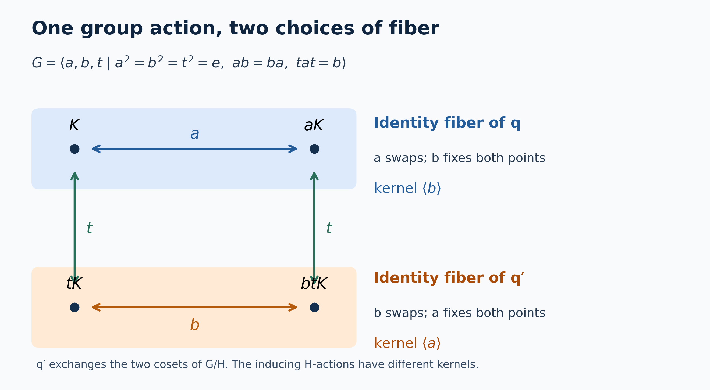

# Recognizing induced actions from a central quotient

*Self-checked by the writing AI. Original lesson, illustration and code: CC0-1.0; the accompanying font terms are retained.*

A quotient algebra inside the center tells us where the fibers of a group action sit. Keeping that quotient map is essential: the same action of an eight-element group can arise from two different actions of its four-element subgroup. We first give the precise recognition theorem, then recover the fiber algebra and explain this finite example.

Throughout, $G$ is a locally compact Hausdorff group, $H\leq G$ is closed, and $Y=G/H$. No countability, separability or sigma-finiteness assumption is imposed until the explicitly marked countable-coordinate alternative. Haar measures are left Haar measures, with

$$
\int_G f(sh)\,ds=\Delta_G(h)^{-1}\int_G f(s)\,ds.
\tag{IR1}
$$

We use the quotient measure class constructed in [Quotient measure and the subgroup modular correction](OA-FLOW-L43.md#oa-flow.qm.class). A von Neumann algebra and its action are nonzero and unital; an action means a point-ultraweakly continuous action by normal automorphisms. The normal tensor and implementation facts are proved in [Normal representations of a crossed product](OA-FLOW-NR.md#oa-flow.nr.1) and [Normal tensor transport](OA-FLOW-NCF.md#ncf-1). The reconstruction proof is [Pulling a central quotient back to the group](OA-FLOW-IW.md#iw-0).

## The quotient map belongs to the theorem

For an $H$-action $\beta$ on $N$, write

$$
\begin{aligned}
\operatorname{Ind}_H^G(N,\beta)
 &=\bigl(N\bar\otimes L^\infty(G)\bigr)^{\beta_h\otimes\rho_h,\ h\in H},\\
(\rho_h f)(s)&=f(sh),\qquad (\lambda_gf)(s)=f(g^{-1}s),\\
\alpha_g&=({\rm id}_N\otimes\lambda_g)|_{\operatorname{Ind}_H^G(N,\beta)}.
\end{aligned}
\tag{IR2}
$$

Its canonical quotient embedding is $\iota_N(F)=1_N\otimes(F\circ q)$, where $q(s)=sH$.

**Recognition theorem.** An action $(M,G,\alpha)$ is isomorphic to an induced action from $H$ if and only if it has a normal unital injective star homomorphism

$$
\iota:L^\infty(Y)\longrightarrow Z(M),\qquad
\alpha_g(\iota(F))=\iota(\lambda_gF).
\tag{IR3}
$$

For a specified $\iota$, an inducing system and an isomorphism can be chosen so that $\iota$ becomes $\iota_N$. Moreover, if two induced systems are isomorphic by a normal $G$-equivariant isomorphism preserving their canonical quotient embeddings, their inducing $H$-systems are normally conjugate. Here normal conjugacy means a normal star isomorphism $\phi:N_1\to N_2$ with $\phi\beta^1_h=\beta^2_h\phi$ for every $h\in H$.

The requirement that the isomorphism preserve the quotient embedding cannot be omitted. The [four-point example](#oa-flow.isys.two-fibers) below has different inducing kernels after that requirement is dropped.

## Building the action and its central quotient

Represent $N$ faithfully in standard form, so that [the canonical implementation](OA-FLOW-NR.md#oa-flow.nr.1) gives a strongly continuous unitary representation $V$ of $H$ implementing $\beta$. On $K\otimes L^2(G)$, the operators

$$
D_h=V_h\otimes R_h,\qquad
(R_hf)(s)=\Delta_G(h)^{1/2}f(sh)
\tag{IR4}
$$

are a strongly continuous unitary representation. Their conjugation on $N\bar\otimes L^\infty(G)$ is $\beta_h\otimes\rho_h$. The fixed algebra in (IR2) is therefore a von Neumann algebra: it is the intersection of the tensor algebra with $\{D_h:h\in H\}'$. Left translations commute with right translations, and $1_K\otimes L_g$ normalizes that intersection. Strong continuity of $L_g$ gives point-ultraweak continuity of the resulting action: test first against a single vector pair, then against the absolutely summable vector series of the [concrete predual](OA-FLOW-CP.md#oa-flow.cp.4).

Here is also the normality of the scalar quotient map. Let $\rho>0$ be the continuous quotient density from [the Weil formula](OA-FLOW-L43.md#oa-flow.qm.rho), and let $Qf(sH)=\int_H f(sh)\,dh$. For $g\in C_c(G)$ and bounded $F$ on $Y$, that formula gives

$$
\int_G F(q(s))g(s)\,ds
 =\int_Y F(y)\,Q(g/\rho)(y)\,d\mu_\rho(y),
\qquad
\|Q(g/\rho)\|_1\leq\|g\|_1.
\tag{IR5}
$$

The inequality follows by positivity and applying the same identity to $|g|$. Compactly supported continuous functions are dense in $L^1(G)$, so $g\mapsto Q(g/\rho)$ extends to a contraction $L^1(G)\to L^1(Y)$. Every normal functional on a scalar multiplication algebra is integration against an $L^1$ function: vector coefficients give products of two $L^2$ functions, their absolutely summable series converge in $L^1$, and the factorization $g=(\operatorname{phase}g)\sqrt{|g|}\sqrt{|g|}$ gives the converse. Thus (IR5), extended by density, makes every normal functional pull back normally. This proves normality, including in the locally Haar measurable convention for non-sigma-finite groups. Faithfulness is the [equivalence of quotient null sets and their full inverse images](OA-FLOW-L43.md#oa-flow.qm.class). Multiplication, adjoints and the unit are preserved by pullback.

The scalar field $F(q(s))1_N$ is right-$H$ invariant, commutes with every tensor coefficient, and transforms under left translation exactly as in (IR3). Consequently

$$
\iota_N:L^\infty(Y)\hookrightarrow Z(\operatorname{Ind}_H^G(N,\beta))
\tag{IR6}
$$

is a normal faithful equivariant unital embedding. This proves the forward implication. The center can be larger than this scalar quotient algebra when the fibers have their own centers.

## Recovering the algebra at the identity coset

Now suppose (IR3) is given. Choose the standard representation of $M$, with its strongly continuous implementing $G$-representation $U$. The restriction $\pi=\iota|_{C_0(Y)}$ is nondegenerate. Indeed compact cutoffs converge to $1$ against every $L^1(Y)$ function; normality then gives the strong convergence of their positive contractions to the unit in this representation.

[Recovering the subgroup representation from imprimitivity](OA-FLOW-L45.md#oa-flow.impr.unitary) supplies a Hilbert space $K$, a strongly continuous $H$-representation $V$, and a unitary identification with its induced representation. There is no separability assumption in that theorem. In these coordinates, $M$ and $M'$ both commute with the quotient multiplication algebra, since that algebra lies inside $Z(M)$.

Let $A$ be the norm-continuous part of the action on $M$. The complete pullback theorem in [the preceding lesson](OA-FLOW-IW.md#iw-0) has the following concrete consequences:

1. The whole commutant of quotient multiplication is faithfully and normally identified with
   $\bigl(B(K)\bar\otimes L^\infty(G)\bigr)^{\operatorname{Ad}V_h\otimes\rho_h}$.
2. Every member of $A$ has a unique bounded norm-continuous operator field $a(s)$ in this identification. Its identities are pointwise:

$$
a(sh)=V_h^*a(s)V_h,
\qquad
(\alpha_ga)(s)=a(g^{-1}s).
\tag{IR7}
$$

3. With

$$
N=W^*\{a(e):a\in A\}\subseteq B(K),
\qquad
\beta_h=\operatorname{Ad}V_h|_N,
\tag{IR8}
$$

the pulled-back algebra $M$ is exactly $\operatorname{Ind}_H^G(N,\beta)$.

For clarity, the reverse inclusion in the third assertion is an actual part of that proof. Apply the same pullback to $M'$. Continuous fields from $M$ and $M'$ commute at every point, so the values at $e$ of the latter commute with $N$. Thus every fixed $N$-tensor commutes with the pulled-back $M'$. Surjectivity of the pullback on the full quotient commutant transfers it to an operator in $M''=M$. No selection of almost-everywhere fibers, countable generating family or unproved direct-integral generation statement enters this argument.

The pullback carries $\iota(F)$ to $F(q(s))1$, and intertwines the left $G$-actions. It therefore proves the converse of the recognition theorem, with the specified quotient embedding respected. The subgroup action in (IR8) is point-ultraweakly continuous because $V$ is strongly continuous.

## Normal conjugacy with the quotient map fixed

Let \(G\) be a locally compact Hausdorff group, \(H\le G\) closed, and let \(\beta\) and \(\beta'\) be continuous actions of \(H\) on von Neumann algebras \(N\) and \(N_2\). Continuity means the equivalent point-ultraweak and predual-norm conditions proved in [AT3](OA-FLOW-AT.md#oa-flow.at.3). The [normal action averages and bounded continuous core](OA-FLOW-AT.md#oa-flow.at.6), [concrete vector-series predual](OA-FLOW-CP.md#oa-flow.cp.4), [its norm closure and duality](OA-FLOW-CP.md#oa-flow.cp.6), [compact extension](OA-FLOW-QF.md#qf-1), [quotient averaging](OA-FLOW-QF.md#qf-2), [compact cutoffs](OA-FLOW-TOPOLOGY.md#l138-h0), and [vector integration](OA-FLOW-L24.md#oa-flow.grp.vectorintegration) are the earlier inputs used below. Set
\[
M=(N\bar\otimes L^\infty(G))^{\beta\otimes\rho(H)},\qquad
M_2=(N_2\bar\otimes L^\infty(G))^{\beta'\otimes\rho(H)},
\]
where \((\rho_hf)(s)=f(sh)\). The induced actions are \(\alpha_t=\mathrm{id}\otimes\lambda_t\), with \((\lambda_tf)(s)=f(t^{-1}s)\). Write \(\iota,\iota'\) for the canonical central embeddings of \(L^\infty(G/H)\).

Suppose \(\Theta:M\to M_2\) is a normal unital star isomorphism satisfying
\[
\Theta\alpha_t=\alpha'_t\Theta,\qquad
\Theta\iota(F)=\iota'(F).
\tag{RU1}
\]
Then there is a unique normal unital star isomorphism \(\overline\varphi:N\to N_2\), intertwining \(\beta\) and \(\beta'\), whose induced map is \(\Theta\). In fact it suffices to assume the second identity in (RU1) for \(F\in C_0(G/H)\).

The central embedding is part of the assertion. The accompanying finite example disproves the corresponding assertion without it.

### 1. The norm-continuous core has canonical fields

We first justify the point evaluations that will be used; evaluation on an arbitrary measurable representative is not being asserted. Put
\[
A=\{x\in M:\|\alpha_tx-x\|\longrightarrow0\text{ as }t\to e\}.
\]
This is a unital norm-closed star subalgebra, by the product estimate, the isometry of the action and norm limits. AT6 proves that its unit ball is ultraweakly dense in the unit ball of \(M\).

A bounded norm-continuous function \(F:G\to N\) defines an element of \(N\bar\otimes L^\infty(G)\), acting by multiplication, and
\[
\|F\|=\sup_{s\in G}\|F(s)\|.
\tag{RU2}
\]
Here is a construction that works on an arbitrary faithful concrete representation \(N\subseteq B(K)\). On a compact set, the range of \(F\) is compact in operator norm. A finite cover and a finite partition of unity therefore approximate it uniformly by finite sums \(\sum_j a_j f_j(s)\). A cutoff permits compactly supported approximants with uniform norm bound \(\sup_s\|F(s)\|\); the same approximants approximate adjoints. Test first on finite sums of vectors \(\xi\otimes g\), \(g\in C_c(G)\). The compact approximation proves convergence of their images and of the images under adjoints. These vectors are dense in \(K\otimes L^2(G)\), so the uniformly bounded net defines a multiplier in the strong-star closure of the elementary tensor algebra. Its norm is at most the right side of (RU2). For the reverse inequality, choose unit vectors \(\xi,\eta\) almost norming \(F(s_0)\). The continuous coefficient \(\langle F(s)\xi,\eta\rangle\) remains close to its value at \(s_0\) on a relatively compact open neighborhood of positive Haar measure. Testing on \(\xi\otimes1_U/\sqrt{|U|}\) and \(\eta\otimes1_U/\sqrt{|U|}\) gives the reverse bound. This also proves uniqueness of the continuous field. No common null set for uncountably many vector tests is used.

For \(x\in N\bar\otimes L^\infty(G)\) and \(f\in C_c(G)\), normal slices define
\[
F_{x,f}(s)=(\mathrm{id}\otimes\ell_{s,f})(x),\qquad
\ell_{s,f}(r)=f(sr^{-1})\Delta_G(r)^{-1}.
\tag{RU3}
\]
Haar inversion gives \(\|\ell_{s,f}\|_1=\|f\|_1\). Translation continuity in \(L^1(G)\) proves that \(s\mapsto\ell_{s,f}\) is norm continuous, so \(F_{x,f}\) is bounded and norm continuous. Its multiplier is precisely
\[
\alpha_f(x)=\int_G f(t)\alpha_t(x)\,dt.
\tag{RU4}
\]
To verify (RU4), test against \(\omega\otimes g\), with \(\omega\in N_*\) and \(g\in C_c(G)\). Haar inversion changes \(r\) to \(t^{-1}s\), giving the same scalar integral as the normal action average. For compactly supported \(f,g\), all contributing \((t,s,r)\) lie in compact carriers, so ordinary finite-measure Fubini applies. Such tests separate the tensor algebra: CP4 approximates its vector-series functionals by finite sums of vector functionals, and approximation of tensor vectors by finite elementary tensors reduces these to products of normal functionals. Scalar \(C_c(G)\) is dense in the scalar \(L^1\) predual. The same argument proves norm density of these finite product tests in the tensor predual.

If \(x\in M\), the multiplier in (RU4) is fixed by \(\beta_h\otimes\rho_h\) for every \(h\). Both sides have norm-continuous fields, so (RU2) changes this equality into the pointwise identity
\[
F_{x,f}(sh)=\beta_h^{-1}(F_{x,f}(s)).
\tag{RU5}
\]
This is an equality for every pair \((s,h)\), obtained separately for each fixed \(h\); no uncountable intersection of conull sets occurs. If \(x\in A\), take a positive normalized \(C_c(G)\) approximate identity in (RU4). The averages converge to \(x\) in norm. Equation (RU2) makes their fields uniformly Cauchy. Their uniform limit is the unique bounded norm-continuous field of \(x\), satisfies (RU5), and obeys
\[
(\alpha_tx)(s)=x(t^{-1}s),\qquad
\|x\|=\sup_s\|x(s)\|.
\tag{RU6}
\]
Products and adjoints are pointwise. The same construction applies to \(A_2=(M_2)_c^{\alpha'}\).

The normal tensor transport used here is [NCF1](OA-FLOW-NCF.md#ncf-1); its restriction to the scalar multiplication factor follows on elementary tensors and then by normal closure. The normal slice construction and continuous tensor multipliers are [IW14–IW20](OA-FLOW-IW.md#iw-2). The only representation choice in this paragraph constructs the usual spatial tensor product; it does not require the given actions to be spatial on that representation.

### 2. Localization at the identity coset

For \(x\in A\), covariance makes \(s\mapsto\|x(s)\|\) constant on right \(H\)-cosets. Since the quotient map is open, it descends to a continuous function on \(G/H\). Hence
\[
\|x(e)\|=
\inf\{\|\iota(\psi)x\|:\psi\in C_c(G/H),\ 0\le\psi\le1,\ \psi(eH)=1\}.
\tag{RU7}
\]
The lower bound is evaluation at \(e\). For the upper bound, choose \(\psi\) supported in a neighborhood where the descended norm is below \(\|x(e)\|+\varepsilon\). Such cutoffs exist by H0. Each \(\iota(\psi)\) belongs to \(A\): translations of a compactly supported continuous function on \(G/H\) are continuous in supremum norm, by compactness and joint continuity of the action.

Let \(E=\{x(e):x\in A\}\). Evaluation is a contractive unital star homomorphism. Its range is norm closed, as one can see without invoking a separate closed-range theorem. Equation (RU7) says that every \(a\in E\) has a lift in \(A\) of norm at most \(\|a\|+\varepsilon\). For a convergent sequence in \(E\), choose a subsequence with summable successive differences; lift those differences with summable norms. The norm-convergent series in the closed algebra \(A\), added to a lift of the first term, lifts the limit. Thus \(E\) is a unital C*-subalgebra of \(N\).

### 3. Elementary sections and their normality

For \(f\in C_c(G)\) and \(a\in N\), set
\[
\mathcal F_f(a)(s)=\int_H f(sh)\beta_h(a)\,dh.
\tag{RU8}
\]
This is an ultraweak integral: for fixed \(s\), its \(h\)-carrier is compact and AT3 gives continuous predual coefficient functions. QF2 yields
\[
\|\mathcal F_f(a)\|\le C_f\|a\|,\qquad
C_f=\|Q|f|\|_\infty<\infty,
\quad Qb(sH)=\int_H b(sh)\,dh.
\tag{RU9}
\]
Near any \(s_0\), the contributing \(h\)'s lie in one compact subset of \(H\). Uniform continuity of the scalar kernel there proves norm continuity of the field, even when \(a\) itself has only an ultraweakly continuous orbit. Consequently it defines a tensor multiplier by the preceding construction.

Left invariance of Haar measure on \(H\), using \(h=r^{-1}k\), gives
\[
\mathcal F_f(a)(sr)=\beta_r^{-1}(\mathcal F_f(a)(s)).
\tag{RU10}
\]
There is no modular factor in this substitution. Therefore the multiplier belongs to \(M\). Also
\[
\alpha_t\mathcal F_f(a)=\mathcal F_{L_tf}(a),\qquad
\|\alpha_t\mathcal F_f(a)-\mathcal F_f(a)\|
\le\|a\|\delta_f(t),
\quad\delta_f(t)=\|Q|L_tf-f|\|_\infty\longrightarrow0.
\tag{RU11}
\]
Indeed, for \(t\) in a compact identity neighborhood, all supports lie in one compact set \(C\subset G\). Choose \(c\in C_c(G)_+\) with \(c\ge1\) on \(C\). Then \(\delta_f(t)\le\|L_tf-f\|_\infty\|Qc\|_\infty\to0\). Thus \(\mathcal F_f:N\to A\) has a common norm-orbit modulus on the unit ball of \(N\).

The bounded linear map \(\mathcal F_f:N\to M\) is normal. Here are the predual details. For an elementary normal test \(\omega\otimes g\), \(g\in C_c(G)\), compact-carrier Fubini gives
\[
(\omega\otimes g)(\mathcal F_f(a))
=\int_H w_{f,g}(h)(\omega\circ\beta_h)(a)\,dh,
\qquad
w_{f,g}(h)=\int_G g(s)f(sh)\,ds.
\tag{RU12}
\]
The function \(w_{f,g}\) is continuous and its support lies in the compact set \(H\cap(\operatorname{supp}g)^{-1}\operatorname{supp}f\). AT3 makes the integrand in (RU12) a continuous, compactly supported \(N_*\)-valued function. Its Bochner integral is a member of \(N_*\). Finite elementary normal tests are norm dense in the tensor predual, as proved after (RU4). The bound (RU9) and CP6, which makes \(N_*\) norm closed in \(N^*\), extend normality to every normal test. Restriction to \(M\) loses no tests: CP4/CP6 represent every normal functional of a concrete von Neumann subalgebra by a vector series on the same Hilbert space, and that series extends normally to the ambient tensor algebra.

In particular, writing \(k=f|_H\),
\[
\mathcal F_f(a)(e)=\beta_k(a):=\int_H k(h)\beta_h(a)\,dh.
\tag{RU13}
\]

### 4. The evaluation range is exactly the subgroup norm core

Put \(N_c^\beta=\{a:\|\beta_h(a)-a\|\to0\}\). For \(x\in A\), covariance gives
\[
\beta_h(x(e))=x(h^{-1})=(\alpha_hx)(e).
\tag{RU14}
\]
So \(E\subseteq N_c^\beta\). Conversely, let \(k_j\in C_c(H)_+\) be a normalized approximate identity. QF1 extends each \(k_j\) to \(f_j\in C_c(G)_+\). For \(a\in N_c^\beta\), (RU13) gives \(\beta_{k_j}(a)\in E\) and \(\beta_{k_j}(a)\to a\) in norm. Closedness of \(E\) proves
\[
E=N_c^\beta.
\tag{RU15}
\]
Moreover, for arbitrary \(a\in N\), AT6 gives \(\beta_{k_j}(a)\in N_c^\beta\), \(\|\beta_{k_j}(a)\|\le\|a\|\), and ultraweak convergence to \(a\). Thus the unit ball of \(E\) is ultraweakly dense in the unit ball of \(N\). These facts also hold for \(E_2=(N_2)_c^{\beta'}\). No countable generating family or separate Kaplansky-density argument is needed.

### 5. Recover the isomorphism on the norm cores

Equivariance and isometry give \(\Theta(A)=A_2\). Equations (RU1) and (RU7) imply
\[
\|(\Theta x)(e)\|=\|x(e)\|\qquad(x\in A).
\tag{RU16}
\]
They therefore identify the two evaluation kernels, and define an isometric unital star isomorphism
\[
\varphi:E\longrightarrow E_2,\qquad
\varphi(x(e))=(\Theta x)(e).
\tag{RU17}
\]
Its inverse comes from \(\Theta^{-1}\). Equation (RU14) proves \(\varphi\beta_h=\beta'_h\varphi\) on \(E\). Applying (RU17) to \(\alpha_{s^{-1}}x\) also gives
\[
(\Theta x)(s)=\varphi(x(s))\qquad(x\in A, s\in G).
\tag{RU18}
\]

### 6. Normality cannot be assumed from evaluation: prove it

Fix \(f\in C_c(G)\) and define
\[
S_f:N\longrightarrow N_2,\qquad S_f(a)=(\Theta\mathcal F_f(a))(e).
\tag{RU19}
\]
For a relatively compact identity neighborhood \(V\), choose \(g_V\in C_c(G)_+\), supported in \(V\), with integral one. The slice
\[
L_V(y)=(\mathrm{id}\otimes g_V)(y)
\]
is normal by [the slice construction IW14–IW15](OA-FLOW-IW.md#iw-2). Thus \(L_V\Theta\mathcal F_f:N\to N_2\) is normal. For \(y=\Theta\mathcal F_f(a)\), (RU6) and (RU11) give
\[
\|y(s)-y(e)\|
\le\|\alpha'_{s^{-1}}y-y\|
\le\|a\|\delta_f(s^{-1}).
\]
Consequently
\[
\|L_V\Theta\mathcal F_f-S_f\|
\le\sup_{s\in V}\delta_f(s^{-1})\longrightarrow0.
\tag{RU20}
\]
For each \(\omega'\in (N_2)_*\), its pullbacks along these normal maps converge in functional norm to \(\omega'\circ S_f\). CP6 proves that this limit is normal. Hence \(S_f\) is normal. This is uniform approximation of evaluation on the indicated bounded family; it does not assert normality of unrestricted point evaluation.

If \(a\in E\) and \(k=f|_H\), equations (RU13) and (RU17) yield
\[
S_f(a)=\varphi(\beta_k(a))=\beta'_k(\varphi(a)).
\tag{RU21}
\]
The last identity is legitimate in operator norm: the compactly supported orbit integral of \(a\in E\) is a Banach-space integral, and the bounded intertwiner \(\varphi\) passes through it.

### 7. Extend normally to the full algebras

Choose the normalized positive \(k_j\) and extensions \(f_j\) from Section 4. Given \(\omega'\in (N_2)_*\), define
\[
\lambda_j=\omega'\circ S_{f_j}\in N_*.
\]
Its restriction to \(E\) equals \((\omega'\circ\beta'_{k_j})\circ\varphi\). A normal functional has the same norm on \(N\) as on \(E\), since their unit balls have the density proved in Section 4. The analogous assertion holds for \(N_2\) and \(E_2\). Therefore
\[
\|\lambda_j-\lambda_l\|
\le\|\omega'\circ\beta'_{k_j}-\omega'\circ\beta'_{k_l}\|
\longrightarrow0.
\tag{RU22}
\]
The convergence follows from AT3/AT6: the averages of the norm-continuous predual orbit of \(\omega'\) converge in predual norm to \(\omega'\). In particular \(\|\lambda_j\|\le\|\omega'\|\). CP6 gives a limit \(L\omega'\in N_*\), with
\[
(L\omega')(a)=\omega'(\varphi(a))\quad(a\in E),
\qquad \|L\omega'\|\le\|\omega'\|.
\tag{RU23}
\]
The limit is unique by ultraweak density, and \(L:(N_2)_*\to N_*\) is bounded and complex linear. The concrete predual duality CP6 constructs its adjoint
\[
\overline\varphi=L^*:N=(N_*)^*\longrightarrow N_2=((N_2)_*)^*.
\tag{RU24}
\]
This is a normal map extending \(\varphi\).

It preserves multiplication: first fix the second factor in \(E\) and approximate the first factor by a bounded net from \(E\); then approximate the second factor as well. Normality and separate ultraweak continuity of multiplication pass each identity to the limit. The same argument proves preservation of adjoints, of the unit, and of the intertwining identity for each \(h\). Apply the construction to \(\Theta^{-1}\). The resulting normal map is inverse to \(\overline\varphi\), because their compositions are the identity on the ultraweakly dense norm cores. Thus \(\overline\varphi\) is the required normal \(H\)-equivariant star isomorphism.

The normal tensor extension \(\overline\varphi\bar\otimes\mathrm{id}\) carries \(M\) onto \(M_2\). On the bounded norm-continuous fields in \(A\), its field is \(s\mapsto\overline\varphi(x(s))\): check the compact finite-tensor approximants used for (RU2), or all normal slices. Equation (RU18) identifies this with \(\Theta\) on \(A\). Both maps are normal and \(A\) is ultraweakly dense in \(M\), so they agree everywhere. Any other inducing normal isomorphism would agree on \(E\) by (RU17), hence on \(N\) by density. This proves uniqueness.

## One induced action can have two different subgroup actions

Let $H=\langle a,b\rangle\cong C_2\times C_2$, and adjoin an involution $t$ that exchanges $a$ and $b$:

$$
G=H\rtimes\langle t\rangle,
\qquad t^2=e,\quad tat=b,\quad tbt=a.
\tag{IR9}
$$

This group has eight elements: they are uniquely $a^i b^j t^k$, with $i,j,k\in\{0,1\}$, and multiplication is addition of the first two coordinates after exchanging them when $k=1$. This defines the semidirect product directly and verifies the displayed relations.

Let $N=\mathbb C^2$. Define an $H$-action by making $\beta_a$ interchange the two coordinates and $\beta_b$ fix them. Define a second action by

$$
\beta'_h=\beta_{t^{-1}ht}.
\tag{IR10}
$$

Their kernels differ:

$$
\ker\beta=\langle b\rangle,
\qquad
\ker\beta'=\langle a\rangle.
\tag{IR11}
$$

Conjugating an action by any algebra isomorphism leaves its kernel unchanged, because $\phi\beta_h\phi^{-1}=\mathrm{id}$ holds exactly when $\beta_h=\mathrm{id}$. Therefore $(N,H,\beta)$ and $(N,H,\beta')$ are not conjugate as actions of the fixed group $H$.

Nevertheless, right translation by $t$ defines a normal $G$-equivariant star isomorphism between their induced algebras:

$$
\Theta:\operatorname{Ind}_H^G(N,\beta)\longrightarrow
       \operatorname{Ind}_H^G(N,\beta'),
\qquad (\Theta x)(g)=x(gt).
\tag{IR12}
$$

Everything is finite-dimensional here. To check the subgroup condition, write $ght=gt(t^{-1}ht)$ and use the covariance of $x$:

$$
(\Theta x)(gh)
 =\beta_{t^{-1}ht}^{-1}(x(gt))
 = (\beta'_h)^{-1}((\Theta x)(g)).
\tag{IR13}
$$

The map preserves products and adjoints pointwise; $t^2=e$ makes its inverse the same right-translation formula. Left translations commute with it, proving equivariance.

For the quotient embeddings, however,

$$
\Theta(\iota_N(F))=\iota'_N(r_tF),
\qquad (r_tF)(gH)=F(gtH).
\tag{IR14}
$$

Right translation by $t$ exchanges the two points of $G/H$. Thus (IR12) does not preserve the specified quotient map, exactly the hypothesis in the normal-conjugacy statement.

The figure is the left $G$-set $G/K$ for $K=\langle b\rangle$. Its four points are $K,aK,tK,btK$. The generator $a$ exchanges the upper pair and fixes the lower pair; $b$ exchanges the lower pair and fixes the upper pair; $t$ exchanges the two rows vertically. The natural quotient $q:G/K\to G/H$ has the upper row as its identity fiber. Composing $q$ with the equivariant exchange of $G/H$ gives $q'$ with the lower identity fiber. The two $H$-actions on those fibers have the different kernels (IR11). On functions this is precisely the pair of induced actions above: the invariant functions on $G$ with values in $\mathbb C(H/K)$ identify with $\mathbb C(G/K)$ by $x(g)(hK)=F(ghK)$.

[Exact permutations and quotient maps](../assets/induced-system-recognition/data.json), [editable SVG](../assets/induced-system-recognition/two-fibers.svg), and [reproduction source](../assets/induced-system-recognition/render.py) accompany the figure.

## An alternative proof with separable fibres

There is a second way to recover the inducing algebra when the group and the implementing representation satisfy countability assumptions. It replaces algebra-valued direct-integral theory by countable matrices and measurable approximation.

Assume in this section that \(G\) is a second-countable locally compact Hausdorff group, \(H\subseteq G\) is closed, \(M\subseteq B(\mathcal L)\) is faithfully and normally represented on a **separable** Hilbert space, and \(U:G\to\mathcal U(\mathcal L)\) is strongly continuous with \(\alpha_t=\operatorname{Ad}U_t|_M\). Suppose a specified equivariant normal unital embedding \(\iota:L^\infty(G/H)\to Z(M)\) is given. We prove that this system, with its specified quotient embedding, is induced from a von Neumann algebra on a separable subgroup Hilbert space.

Put \(Y=G/H\), \(q(s)=sH\), and use the quotient measure \(\mu=\mu_\rho\) and the positive continuous density \(\rho\) of [L43](OA-FLOW-L43.md#oa-flow.qm.rho). Thus, with \(\chi(h)=\Delta_G(h)/\Delta_H(h)\),

\[
 \rho(sh)=\chi(h)^{-1}\rho(s),\qquad
 \int_G f(s)\rho(s)\,ds=\int_Y\int_H f(sh)\,dh\,d\mu(sH).
 \tag{SC1}
\]

The all-Borel extension and equality of completed measure classes are proved in [IS2](OA-FLOW-IS.md#is-2). The measures here are sigma-finite because \(G,H,Y\) have countable compact covers. A normal unital representation of \(L^\infty(Y)\) restricts nondegenerately to \(C_0(Y)\): compact cutoffs increase to one, and normality preserves their supremum. Hence [L45's imprimitivity theorem](OA-FLOW-L45.md#oa-flow.impr.unitary) identifies \((\mathcal L,\iota,U)\) with the induced covariant system of a strongly continuous representation \(V:H\to\mathcal U(K)\).

Here \(K\) is separable as well. In L45 it is the completion of the classes of finite sums \(U(f)\zeta\), with \(f\in C_c(G)\). The bound following [L45(M5)](OA-FLOW-L45.md#oa-flow.impr.smooth) bounds the norm of such a class by a support-dependent constant times \(\|f\|_\infty\|\zeta\|\). Choose countably many compact supports with interiors covering \(G\). On each support the space of continuous functions is separable in the uniform norm: on a compact metric space, finite partitions subordinate to balls from a countable basis, with rational complex coefficients, give a countable family of uniform approximants. Its subspace of functions vanishing outside that support is separable too. These tests and a countable dense set in \(\mathcal L\) give a countable dense set of classes in \(K\).

### Quotient coordinates on the entire induced Hilbert space

Let \(\sigma:Y\to G\) be the Borel section constructed in [IS1](OA-FLOW-IS.md#is-1), and put \(h(s)=\sigma(q(s))^{-1}s\in H\). For \(\eta\in L^2(Y,\mu;K)\), define

\[
 (J\eta)(s)=\rho(s)^{1/2}V_{h(s)}^*\eta(q(s)).
 \tag{SC2}
\]

These are measurable fields and satisfy the subgroup covariance of [L44](OA-FLOW-L44.md#oa-flow.ind.setting). If \(k\ge0\) is its quotient cutoff, so \(\int_H k(sh)\,dh=1\), then (SC1) gives

\[
 \|J\eta\|_{\mathrm{ind}}^2
 =\int_G k(s)\rho(s)\|\eta(q(s))\|^2\,ds
 =\int_Y\|\eta(y)\|^2\,d\mu(y).
 \tag{SC3}
\]

The map is onto. Every continuous elementary field \(\xi\) from [L44(I9)](OA-FLOW-L44.md#oa-flow.ind.elementary) has exact subgroup covariance, and is the image under \(J\) of

\[
 \eta(y)=\rho(\sigma(y))^{-1/2}\xi(\sigma(y)).
 \tag{SC4}
\]

Its square integrability follows again from (SC3), calculated for this continuous field. Elementary fields span a dense subspace, and the range of an isometry is closed. Thus \(J\) is unitary. Formula (SC4) has only evaluated a continuous field; it does not assign values on the image of \(\sigma\) to an arbitrary almost-everywhere class. Under \(J\), quotient multiplication becomes ordinary scalar multiplication on \(L^2(Y;K)\).

### Decomposability from countable matrices

First recall an elementary scalar fact. If \(T\in B(L^2(Y))\) commutes with every scalar multiplier, partition \(Y\) into countably many finite-measure sets \(E_n\). On \(E_n\), put \(b_n=T1_{E_n}\). For a bounded function \(f\) supported there, commutation gives \(Tf=fb_n\). Testing indicators of the sets where \( |b_n|>\|T\|+\varepsilon\) shows \( |b_n|\le\|T\|\) almost everywhere. The functions \(b_n\) combine to a bounded measurable \(b\), and density of simple functions gives \(T=M_b\). This is the finite-partition proof in [IS4, immediately before (IS25)](OA-FLOW-IS.md#is-4); its argument applies to any sigma-finite measure space.

Now let \(T\in B(L^2(Y;K))\) commute with all scalar multipliers. Choose an orthonormal basis \((e_j)\) of the separable \(K\). Every matrix entry \(T_{ij}\) is a scalar multiplier \(M_{f_{ij}}\). For a finite vector \(u\) with rational complex coordinates and each finite number \(r\) of output coordinates, the operator bound, tested on \(1_Eu\) for finite-measure \(E\), implies

\[
 \sum_{i\le r}\left|\sum_j f_{ij}(y)u_j\right|^2
 \le \|T\|^2\|u\|^2
 \quad\text{for almost every }y.
 \tag{SC5}
\]

A positive-measure violation would have a positive finite-measure subset and contradict the same integrated inequality. There are countably many tests in (SC5). Remove their common null exception. The resulting matrix extends uniquely to an operator \(X(y)\in B(K)\) with \(\|X(y)\|\le\|T\|\); set it equal to zero on that exception. Its matrix coefficients are measurable, and finite sums of simple vector functions show

\[
 (T\eta)(y)=X(y)\eta(y).
 \tag{SC6}
\]

Countably many coefficients also prove uniqueness almost everywhere. Conversely any such bounded measurable matrix field defines a bounded operator by (SC6). Measurability of its action on vectors follows by finite-coordinate approximation. Its operator norm is the essential supremum of the fibre norms, by the same finite-vector tests. Finite basis compressions show that these operators form \(B(K)\bar\otimes L^\infty(Y)\): each compression is a finite matrix of scalar multipliers, and the compressions converge strongly to the operator.

Since the quotient algebra is central in \(M\), every element of \(M\) has this description in the coordinates (SC2). Its corresponding field on \(G\) is

\[
 \widetilde X(s)=V_{h(s)}^*X(q(s))V_{h(s)}.
 \tag{SC7}
\]

This formula is well defined on almost-everywhere classes by (SC1). It has the exact right-subgroup covariance \(\widetilde X(sh)=V_h^*\widetilde X(s)V_h\), and intertwining with induced left translation gives the field of \(\alpha_t(X)\) as \(\widetilde X(t^{-1}s)\).

The field map (SC7) is a faithful normal unital *-homomorphism into \(B(K)\bar\otimes L^\infty(G)\). Indeed [IS2's full coordinate unitary](OA-FLOW-IS.md#is-2) identifies it with amplification \(X\mapsto X\otimes1_{L^2(H)}\), followed by conjugation by the measurable unitary field \(V_h\). Amplification is normal: on finite sums of elementary tensor vectors, every vector coefficient pulls back to a finite sum of normal vector coefficients of \(X\). Approximation of arbitrary vectors and the uniform operator bound give convergence of those pullbacks in functional norm. The predual norm closure and vector-series test of [CP4–6](OA-FLOW-CP.md#oa-flow.cp.6) give normality on the whole algebra. It is faithful since \(L^2(H)\ne0\). The unitary conjugations preserve these properties. This proves the needed normality without a theorem on fields of von Neumann algebras.

### Continuous fields and the evaluation algebra

Let

\[
 A=\{x\in M:\|\alpha_t(x)-x\|\longrightarrow0\text{ as }t\to e\}.
 \tag{SC8}
\]

It is an invariant unital C* algebra. For \(f\in C_c(G)\), define \(x_f=\int f(t)\alpha_t(x)\,dt\) ultraweakly. This integral belongs to \(M\): bounded scalar integration of its normal coefficients gives the weak operator integral, and an operator in \(M'\) commutes with the integral because it commutes with every integrand. Moreover

\[
 \|\alpha_t(x_f)-x_f\|\le\|L_tf-f\|_1\|x\|,
 \qquad L_tf(r)=f(t^{-1}r).
 \tag{SC9}
\]

Thus \(x_f\in A\). Normalized nonnegative compact kernels supported in shrinking identity neighborhoods give \(x_f\to x\) ultraweakly, by continuity of every normal coefficient of the implemented action. For \(x\in A\) the convergence is in norm. Hence \(A\) is ultraweakly dense in \(M\).

Using the field embedding (SC7), scalar Fubini and the Haar inversion formula give a representative

\[
 \widetilde{x_f}(s)
 =\int_G f(sr^{-1})\widetilde x(r)\Delta_G(r)^{-1}\,dr.
 \tag{SC10}
\]

The integral is ultraweak; no norm measurability of the original \(B(K)\)-valued field is required. For \(s\) in a compact neighborhood, the scalar kernels have a common compact support in \(r\). Their differences tend to zero in \(L^1\), so (SC10) is norm continuous. The covariance equations, initially almost everywhere for each fixed group parameter, then hold everywhere by continuity and positivity of Haar measure on nonempty open sets. A bounded continuous field has supremum norm equal to essential supremum norm, for the same reason. Norm approximation of \(x\in A\) by \(x_f\) is therefore uniform approximation of their continuous representatives. Every \(x\in A\) has a unique norm-continuous representative, which we now denote simply by \(x(s)\).

Evaluation at \(e\) is a contractive unital *-homomorphism. Put

\[
 N=W^*\{a(e):a\in A\}\subseteq B(K),\qquad
 \beta_h=\operatorname{Ad}V_h|_N.
 \tag{SC11}
\]

For every \(s\in G\), \(a(s)=(\alpha_{s^{-1}}a)(e)\in N\). The exact subgroup law and invariance of \(A\) give \(V_hNV_h^*=N\). Strong continuity of \(V\) makes \(\beta\) a point-ultraweakly continuous normal action. A continuous field \(a(s)\in N\) belongs to \(N\bar\otimes L^\infty(G)\): its norm range is separable since \(G\) is separable, so uniformly accurate countable simple \(N\)-valued approximants exist; the associated multiplication operators belong to that tensor product by bounded strong convergence of the partial sums. Their uniform limit is \(a\). The normality of (SC7), ultraweak density of \(A\), and ultraweak closedness of the fixed algebra now give

\[
 M\ \subseteq\ \bigl(N\bar\otimes L^\infty(G)\bigr)^{\beta\otimes\rho(H)}
 =\operatorname{Ind}_H^G(N,\beta).
 \tag{SC12}
\]

### One countable family dense in every fibre

Choose \(b_m\in A\) whose values \(b_m(e)\) generate \(N\). Here is the countability justification. On the unit ball of \(B(K)\), strong-star convergence is given by the actions of an operator and its adjoint on the countable basis \((e_j)\). That ball embeds in a countable product of separable metric spaces \(K\), so every subspace is separable and metrizable. [BD4](OA-FLOW-BD.md#oa-flow.bd.4) makes the unit ball of the evaluation algebra strong-star dense in \(N_1\). Countably many approximants suffice, by a countable neighborhood basis. They can be lifted to \(A\) and clipped to global contractions by the continuous transform used below, which leaves a contractive value at \(e\) unchanged. Thus a countable choice of \(b_m\) is possible.

Let \(D\subseteq G\) be countable and dense, and let \(C\subseteq A\) be the unital C* algebra generated by all \(\alpha_qb_m\), \(q\in D\). It is norm separable. For each fixed \(s\in G\), every value of \(C\) lies in \(N\), while

\[
 (\alpha_qb_m)(s)=b_m(q^{-1}s)\longrightarrow b_m(e)
 \quad\text{as }q\longrightarrow s\text{ through }D.
 \tag{SC13}
\]

Consequently the evaluated algebra \(C_s=\{c(s):c\in C\}\) generates all of \(N\), for **every** \(s\).

Enumerate a norm-dense family \(P_n\) of rational complex *-polynomials in the countable generators of \(C\). Define

\[
 F(c)=c\,g(c^*c),\qquad
 g(t)=\begin{cases}1,&0\le t\le1,\\t^{-1/2},&t\ge1,\end{cases}
 \qquad a_n=F(P_n).
 \tag{SC14}
\]

Continuous functional calculus puts \(a_n\) in \(A_1\). Evaluation commutes with \(F\). The values \(a_n(s)\) are norm dense in the unit ball of the norm closure of \(C_s\). A contraction in that closure is a norm limit of values \(c_j(s)\); continuity of the bounded transform gives \(F(c_j)(s)\) converging to that same contraction. For each \(c_j\in C\), polynomial approximation in norm also approximates \(F(c_j)\). Since the norm closure of \(C_s\) generates \(N\), BD4 proves

\[
 \{a_n(s):n\ge1\}\text{ is strong-star dense in }N_1
 \quad\text{for every }s\in G.
 \tag{SC15}
\]

The same global contractions work simultaneously at all points. No countable generating family of the global von Neumann algebra \(M\) is needed.

### An invariant target has quotient coordinates

Take a contraction \(z\in\operatorname{Ind}_H^G(N,\beta)\). Applying the matrix argument [(SC5)–(SC6)](#isys-separable-matrices) over \(G\) represents it by a bounded measurable field \(z(s)\in B(K)\). Its values belong to \(N\) almost everywhere. To verify this, it commutes with every constant operator from \(N'\); choose a countable strong-star dense subset of \((N')_1\), discard the countably many matrix-coefficient exceptions for these commutations, and use \(N=(N')'\). This proves the claim without a choice of a von Neumann algebra field.

Use the Borel measure coordinates (SC1), and set

\[
 B(y,h)=V_hz(\sigma(y)h)V_h^*.
 \tag{SC16}
\]

This is a well-defined joint measurable operator field up to product null sets, not evaluation on a null section. It is contractive and \(N\)-valued almost everywhere. The fixed-point condition says that for every fixed \(k\in H\), \(B(y,hk)=B(y,h)\) almost everywhere in \((y,h)\).

Choose \(a\in C_c(H)_+\) with integral one. After setting the field to zero on a null exceptional set, assume its norm is bounded everywhere. Form the ultraweak integral

\[
 F(y,h)=\int_H a(k)B(y,hk)\,dk
       =\int_H a(h^{-1}r)B(y,r)\,dr.
 \tag{SC17}
\]

For each \(y\), this is norm continuous in \(h\), by the \(L^1\) continuity of the translated scalar kernel and the uniform bound on \(B\). Fubini applied to countably many matrix coefficients gives \(F=B\) almost everywhere jointly: for each fixed \(k\) the integrand's difference from \(B(y,h)\) is zero almost everywhere. For each fixed \(k\), it follows that \(F(y,hk)=F(y,h)\) almost everywhere jointly as well, since right translation preserves Haar null sets.

Take a countable dense subset of \(H\). Fubini and a countable union of exceptions give a conull set of \(y\)'s for which the last identities hold for almost every \(h\), for all of these \(k\)'s. Norm continuity extends them first to every \(h\), then by density to every \(k\in H\). Thus \(F(y,h)\) is constant in \(h\). Put \(Z(y)=F(y,e)\), and set it to zero on the exceptional set of \(y\)'s. This field is measurable and contractive. It is \(N\)-valued, since the integral in (SC17) is an ultraweak limit of \(N\)-valued averages. We have proved

\[
 B(y,h)=Z(y)\quad\text{almost everywhere},\qquad
 z(s)=V_{h(s)}^*Z(q(s))V_{h(s)}\quad\text{almost everywhere}.
 \tag{SC18}
\]

The last equality is exactly (SC7). Hence the target \(z\) acts in the induced Hilbert space as multiplication by \(Z(y)\) in the quotient coordinates (SC2).

### Central pasting gives every target

Put \(A_n(y)=a_n(\sigma(y))\). These are measurable contractions, with a strong-star dense set of values in \(N_1\) at every \(y\), by (SC15). For each positive integer \(r\), choose the least \(n=n_r(y)\) satisfying

\[
 \sum_{j\le r}\left(
   \|(A_n(y)-Z(y))e_j\|^2+
   \|(A_n(y)^*-Z(y)^*)e_j\|^2
 \right)<\frac1r.
 \tag{SC19}
\]

In finite dimension use all existing indices \(j\le r\). Such an \(n\) exists by (SC15). The norms in (SC19) are measurable, as countable sums of squares of measurable coordinates. Least-index selection is therefore measurable: its level set is the set satisfying the \(n\)-th inequality with the finitely many preceding such sets removed. Denote the resulting partition by \(E_{r,n}=\{y:n_r(y)=n\}\).

Central inclusion of the quotient algebra permits the sum

\[
 z_r=\sum_{n\ge1}\iota(1_{E_{r,n}})a_n\ \in M_1.
 \tag{SC20}
\]

Indeed the scalar projections are pairwise orthogonal and central. Every finite partial sum is a contraction, and, for any vector \(\xi\), the squared norm of a tail is at most the corresponding tail of

\[
 \sum_n\|\iota(1_{E_{r,n}})\xi\|^2=\|\xi\|^2.
 \tag{SC21}
\]

The partial sums therefore converge strongly; strong closedness puts their limit in \(M_1\). In quotient coordinates its field is \(A_{n_r(y)}(y)\).

For each basis vector, (SC19) gives convergence of both this field and its adjoint to \(Z(y)\) and \(Z(y)^*\). Uniform boundedness extends the convergence to every vector of \(K\), at each \(y\). For any \(\eta\in L^2(Y;K)\), the squared norm of the difference acting on \(\eta(y)\) is bounded by \(4\|\eta(y)\|^2\). Dominated convergence gives strong-star convergence of the multiplication operators \(z_r\to Z\) on \(L^2(Y;K)\). Thus \(Z\in M\), and (SC7) identifies its image with the original \(z\). Scaling proves the reverse inclusion in (SC12):

\[
 (M,G,\alpha,\iota)\ \cong
 \bigl(\operatorname{Ind}_H^G(N,\beta),G,\lambda,
             F\mapsto F\circ q\bigr).
 \tag{SC22}
\]

This proof explains the role of central inclusion. Commutation with quotient multipliers gives operator fields; having those multipliers inside \(M\) makes the measurable pasting (SC20) possible. Countability is used explicitly in the matrix construction, the fibre approximants and the common exceptional sets, so this alternative has the separable scope stated at its start.

## Two checks on the hypotheses

**Exercise 1.** Why is having quotient multiplication in $M'$ weaker than (IR3)?

**Solution.** The weaker condition lets us pull $M$ back to operator fields, but it need not put all scalar quotient multipliers inside $M$. Condition (IR3) puts quotient multiplication in both $M$ and $M'$. That allows the same pullback for the two commuting algebras and is the hypothesis used in the bicommutant step proving the full reverse inclusion. In the countable-coordinate alternative it permits the central measurable pasting of local approximants.

**Exercise 2.** What do the two extreme subgroups give?

**Solution.** If $H=\{e\}$, there is no fixed-point condition and the result is $N\bar\otimes L^\infty(G)$ with left translation in the second factor. If $H=G$, the quotient has one point. The map $n\mapsto[s\mapsto\beta_{s^{-1}}(n)]$ gives the induced algebra and identifies its left action with $\beta$: at $s$, left translation by $g$ changes the value to $\beta_{s^{-1}g}(n)=\beta_{s^{-1}}(\beta_g(n))$. To see that these are all fixed tensors, smooth a fixed tensor by the left action as in [IW2](OA-FLOW-IW.md#iw-2). Its continuous field satisfies $x(s)=\beta_{s^{-1}}(x(e))$ by subgroup covariance. The evaluations of the bounded smoothed tensors remain bounded in $N$. [Ultraweak compactness of the unit ball](OA-FLOW-ST12.md#oa-flow.st.1) gives a convergent subnet of those evaluations. The [normal regular coefficient map](OA-FLOW-NR.md#oa-flow.nr.3) carries its limit to the original tensor, because the smoothed tensors already converge ultraweakly. Thus surjectivity also holds for tensors without a chosen pointwise representative.

The historical recognition statement is M. Takesaki, [*Theory of Operator Algebras II*, Definition X.4.10 and Proposition X.4.11](https://doi.org/10.1007/978-3-662-10451-4). The recognition theorem here includes the specified quotient embedding in its uniqueness statement; (IR9)–(IR14) explain why that datum matters.
