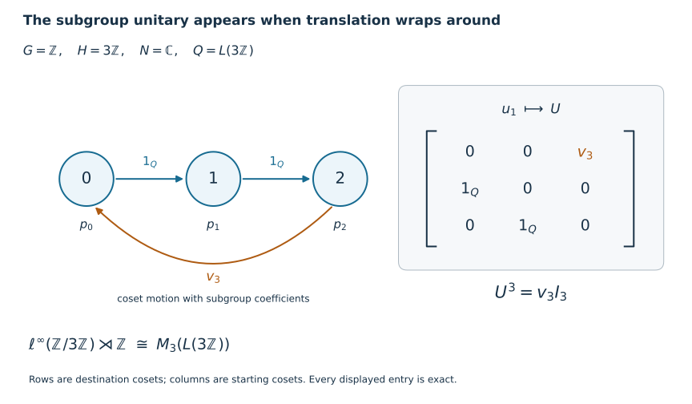

# Induction and crossed products for discrete groups

*Self-checked by the writing AI. Original lesson, illustration and code: CC0-1.0; the accompanying font terms are retained.*

An induced algebra places one copy of the subgroup algebra at every coset. In its crossed product, the group unitaries move between these copies. Cutting down to one coset recovers the subgroup crossed product; the moves between cosets then become matrix units. We prove both identifications as normal isomorphisms and give a second proof of the corner using its coefficient expectation.

The group may be any discrete group, and the von Neumann algebra and its Hilbert spaces may be nonseparable. Infinite sums of orthogonal projections below mean nets over finite subsets. No faithful normal state is assumed. The zero algebra gives zero on both sides of every crossed-product formula; we state the proof for a nonzero algebra.

The elementary operator tools are [Positivity and order](OA-FLOW-CF.md#oa-flow.cf.7), [Hilbert space facts and the concrete positive-operator criterion](OA-FLOW-CF.md#oa-flow.cf.8), and [Inner product completions](OA-FLOW-CF.md#oa-flow.cf.10). Each later use of a normal representation, bounded density or tensor transport is linked to its earlier proof below.

## The induced algebra in coordinates

Let \(H\leq G\), let \(N\ne0\) be a von Neumann algebra, and let \(\beta:H\to\operatorname{Aut}(N)\) be an action by normal automorphisms. Put \(Y=G/H\), write \(o=H\), and choose representatives \(t_y\) with \(t_o=e\). The induced algebra is
\[
M=\{x:G\to N:\sup_g\|x(g)\|<\infty,\quad
x(gh)=\beta_h^{-1}(x(g))\},\qquad
(\alpha_sx)(g)=x(s^{-1}g).
\tag{D12}
\]
Evaluation at the representatives is a star isomorphism onto \(\ell^\infty(Y,N)\): given \((a_y)\), its inverse is \(x(t_yh)=\beta_h^{-1}(a_y)\). On a faithful normal representation \(N\subseteq B(K)\), the product algebra acts diagonally on \(\ell^2(Y)\otimes K\). Its ultraweak topology is determined by coordinate normal tests and their norm-convergent sums. Indeed a vector has square-summable coordinate norms, and finite-coordinate approximation, followed by the vector-series description in [The concrete predual and its intrinsic norm](OA-FLOW-CP.md#oa-flow.cp.6), gives precisely these tests. Evaluation and the displayed inverse are therefore normal. In the discrete fixed-point model \(N\bar\otimes\ell^\infty(G)\), the same coordinate calculation gives exactly (D12).

Write \(p_y\) for the central coordinate projection in \(M\). Then
\[
p_yp_z=\delta_{y,z}p_y,\qquad
\sum_{y\in Y}p_y=1\quad\text{strongly},\qquad
\alpha_g(p_y)=p_{gy}.
\tag{D1}
\]
Strong convergence follows first on finite-coordinate vectors and then on all vectors by the uniform projection bound. It remains true in the regular representation below.

We use the regular crossed product
\[
P=M\rtimes_\alpha G
=\{\pi(M),u_g:g\in G\}'',
\quad
(\pi(x)\xi)(g)=\alpha_{g^{-1}}(x)\xi(g),
\quad(u_s\xi)(g)=\xi(s^{-1}g).
\tag{D13}
\]
Here \(\xi\in\ell^2(G,\ell^2(Y)\otimes K)\); the coefficients act in the diagonal representation just described. We usually omit \(\pi\) in products. The faithful normality of this coefficient representation and independence of the faithful normal starting representation are proved in [Normal representations of a crossed product](OA-FLOW-NR.md#oa-flow.nr.3) and [Amplification and normal independence of the initial representation](OA-FLOW-NR.md#oa-flow.nr.4). For discrete groups, finite sums \(\sum_g x_gu_g\) form a unital star algebra: covariance gives
\[
(xu_g)(zu_h)=x\alpha_g(z)u_{gh},\qquad
(xu_g)^*=\alpha_{g^{-1}}(x^*)u_{g^{-1}}.
\tag{D14}
\]
Its bounded strong-star density, and hence ultraweak density, in \(P\) follows from [Norm-controlled density on arbitrary Hilbert spaces](OA-FLOW-BD.md#oa-flow.bd.4) and [its vector-series convergence proof](OA-FLOW-BD.md#oa-flow.bd.5).

## Coefficients and a faithful normal expectation

We prove the coefficient fact for any discrete action \(\gamma:D\to\operatorname{Aut}(B)\), with \(B\subseteq B(L)\) a faithful normal concrete representation. On \(\ell^2(D)\otimes L\), write \(V_s\eta=\delta_s\otimes\eta\), and let \(T_{s,t}=V_s^*TV_t\). A finite Fourier polynomial has entries
\[
\left(\sum_{r\in F}\pi_\gamma(b_r)u_r\right)_{s,t}
=\gamma_{s^{-1}}(b_{st^{-1}}),
\tag{D15}
\]
where a missing coefficient is zero. This follows because \(u_r\) sends coordinate \(t\) to \(rt\), and the coefficient at coordinate \(s\) acts by \(\gamma_{s^{-1}}\).

For every \(T\in B\rtimes_\gamma D\), its compression \(T_{e,e}\) lies in \(B\). To see this, approximate \(T\) ultraweakly by Fourier polynomials, use normality of compression, and use ultraweak closedness of \(B\). Thus
\[
E_D(T)=T_{e,e},\qquad
E_D(bu_r)=
\begin{cases}b,&r=e,\\0,&r\ne e.
\end{cases}
\tag{D6}
\]
Compression is normal, unital and completely positive: its matrix amplifications are compressions by the corresponding direct sums of \(V_e\). It is contractive, and fixes the coefficient algebra. Since \(\pi_\gamma(b)V_e=V_eb\), it is bimodular:
\[
E_D(bTc)=bE_D(T)c\qquad(b,c\in B).
\tag{D16}
\]
It is therefore a normal conditional expectation of norm one.

Formula (D15), normality and density give, for every \(T\),
\[
T_{s,t}=\gamma_{s^{-1}}\!\left(E_D(Tu_{st^{-1}}^*)\right),
\qquad
T_{s,s}=\gamma_{s^{-1}}(E_D(T)).
\tag{D17}
\]
In particular the coefficients \(E_D(Tu_r^*)\) determine \(T\): zero entries make all pairings between finite-coordinate vectors zero, and those vectors are dense. If \(T\ge0\) and \(E_D(T)=0\), every diagonal entry is zero. Hence
\[
\|T^{1/2}V_s\eta\|^2=\langle T_{s,s}\eta,\eta\rangle=0
\]
for all \(s,\eta\). Density makes \(T^{1/2}=0\). This proves faithfulness. For finite \(D\), (D17) also proves the exact finite expansion \(T=\sum_{r\in D}\pi_\gamma(E_D(Tu_r^*))u_r\). For infinite \(D\), we use coefficient uniqueness and bounded density; no convergence of arbitrary raw Fourier truncations is asserted.

Apply this construction to \(P\) and call its expectation \(E_G\).

## The subgroup corner, with its actual regular representation

Set \(p=p_o\) and \(Q=pPp\), whose identity is \(p\). Evaluation at \(e\) identifies \(pMp\) normally with \(N\). We denote the element supported on \(H\), with value \(n\) at \(e\), by \(n\) when working in this corner. It has values \(\beta_h^{-1}(n)\) at \(h\in H\). For \(h\in H\), set \(v_h=pu_hp\). Because \(h\) fixes \(o\), \(u_h\) commutes with \(p\), and the \(v_h\) form a unitary representation of \(H\) in \(Q\). Bimodularity of \(E_G\) gives the normal faithful expectation
\[
F:Q\longrightarrow N,\qquad
F(T)=\bigl(pE_G(T)p\bigr)(e).
\tag{D7}
\]
For faithfulness, if \(T\in Q_+\) and \(F(T)=0\), then \(E_G(T)=pE_G(T)p=0\); faithfulness of \(E_G\) gives \(T=0\). Direct evaluation of the induced action gives
\[
v_hnv_h^*=\beta_h(n),\qquad
F(nv_h)=\delta_{h,e}n.
\tag{D8}
\]
Indeed \((\alpha_hx)(e)=x(h^{-1})=\beta_h(x(e))\). Also \(pxu_gp=0\) for \(g\notin H\), since \(u_gpu_g^*=p_{gH}\). Compressing the bounded Fourier approximants in (D14) proves
\[
Q=\operatorname{vN}(N,v_h:h\in H).
\tag{D18}
\]

We now identify this algebra with the regular crossed product, including its topology. In the concrete space of (D13), use coordinates \((g,y)\in G\times Y\). For \(x\in M\),
\[
(\pi(x)\xi)(g,y)=x(gt_y)\xi(g,y).
\tag{D19}
\]
Consequently \(p\) keeps exactly those coordinates with \(gy=o\). Such a pair has a unique expression
\[
(g,y)=(ht_y^{-1},y),\qquad h\in H.
\tag{D20}
\]
The coordinate bijection defines a unitary
\[
J:p\mathcal H_P\longrightarrow
\ell^2(Y)\otimes\ell^2(H)\otimes K,
\qquad
J(\delta_{ht_y^{-1}}\otimes\delta_y\otimes\eta)
=\delta_y\otimes\delta_h\otimes\eta.
\tag{D21}
\]
It is isometric on finite-coordinate vectors and onto a dense such span, so it extends to the stated unitary for arbitrary index sets.

For a corner coefficient \(n\), its value in (D19) at \((ht_y^{-1},y)\) is \(\beta_{h^{-1}}(n)\). The unitary \(v_s\), \(s\in H\), changes \(h\) to \(sh\) and keeps \(y\) unchanged. Thus
\[
JnJ^*=1_{\ell^2(Y)}\otimes\pi_\beta(n),\qquad
Jv_sJ^*=1_{\ell^2(Y)}\otimes\lambda_s,
\tag{D22}
\]
where \(\pi_\beta,\lambda\) are the regular generators of \(R=N\rtimes_\beta H\) on \(\ell^2(H)\otimes K\).

The constant-amplification algebra \(1_{\ell^2(Y)}\otimes R\) is ultraweakly closed. Matrix entries in the \(Y\)-coordinate characterize it by zero off-diagonal entries, identical diagonal entries and membership of the common entry in \(R\); all these conditions are ultraweakly closed. Its algebra is generated by the constant amplifications of the generators of \(R\): bounded strong-star approximants in \(R\) remain strongly convergent after arbitrary amplification, by finite-coordinate approximation and the uniform norm bound. Equation (D18) now proves
\[
JQJ^*=1_{\ell^2(Y)}\otimes R,
\qquad
Q\cong N\rtimes_\beta H,
\quad n\mapsto\pi_\beta(n),\quad v_h\mapsto\lambda_h.
\tag{D10}
\]
Conjugation by \(J\) is normal by vector-series tests. Removing the constant amplification is normal by compression to any one \(Y\)-coordinate; its inverse is normal because vector coefficients are sums of coordinate coefficients with uniformly summable tails. These facts prove normality in both directions, not just an algebraic correspondence between generators.

## A second corner proof using its expectation

The following argument explains why the expectation and coefficient rule already determine the regular crossed product. It applies to any von Neumann algebra \(Q\) generated by a normal faithful copy of \(N\) and unitaries \(v_h\) satisfying (D8), with a normal faithful expectation \(F\) obeying that coefficient rule.

Choose a family \((\varphi_i)_{i\in I}\) of normal states on \(N\) that separates its positive elements. Such a family always exists: the unit-vector states of a faithful normal concrete representation suffice, since \(n\ge0\) and \(\langle n\eta,\eta\rangle=0\) for all \(\eta\) imply \(n^{1/2}=0\). Put \(\psi_i=\varphi_i\circ F\). These are normal states and separate positive elements of \(Q\), because \(F\) is faithful.

For a normal state \(\omega\) on a concrete von Neumann algebra \(B\), its GNS construction is the completion of \(B/\{a:\omega(a^*a)=0\}\) in the form \(\langle a,b\rangle=\omega(b^*a)\), linear in the first variable. Positivity applied to \((a+zb)^*(a+zb)\) gives Cauchy–Schwarz and makes the quotient form well defined. Left multiplication is bounded because
\[
\omega(b^*a^*ab)\le\|a\|^2\omega(b^*b).
\tag{D23}
\]
It is a unital star representation \(\pi_\omega\). It is normal: for dense quotient vectors \(\Lambda(b),\Lambda(c)\), the pulled-back coefficient is \(a\mapsto\omega(c^*ab)\). Multiplication by fixed operators preserves vector-series normal functionals, so this coefficient is normal. Approximation of arbitrary GNS vectors makes the remaining coefficients norm limits of these functionals. The norm closure of the concrete predual in [The concrete predual and its intrinsic norm](OA-FLOW-CP.md#oa-flow.cp.6), followed by its summable vector-series criterion, proves full ultraweak continuity.

Write \(K_i\) for the GNS space of \(\varphi_i\) on \(N\), and \(L_i\) for that of \(\psi_i\) on \(Q\). For finite Fourier sums the coefficient rule gives
\[
\begin{aligned}
\left\langle\sum_hn_hv_h,\sum_hm_hv_h\right\rangle_{\psi_i}
&=\varphi_i\!\left(F\left((\sum_hm_hv_h)^*(\sum_hn_hv_h)\right)\right)\\
&=\sum_h\varphi_i\!\left(\beta_{h^{-1}}(m_h^*n_h)\right).
\end{aligned}
\tag{D9}
\]
The Fourier sums are dense in \(L_i\). In fact bounded strong-star approximants to \(a\in Q\) satisfy \(\psi_i((a_j-a)^*(a_j-a))\to0\), by bounded strong convergence and the vector-series tail estimate. Hence their GNS vectors converge to \(\Lambda_{\psi_i}(a)\).

Equation (D9) therefore defines an isometry, and then a unitary,
\[
W_i:L_i\longrightarrow\ell^2(H)\otimes K_i,
\qquad
W_i\Lambda_{\psi_i}(n v_h)
=\delta_h\otimes\Lambda_{\varphi_i}(\beta_{h^{-1}}(n)).
\tag{D24}
\]
Surjectivity holds because, for each \(h\), the elements \(\beta_{h^{-1}}(n)\) run through all of \(N\). Direct multiplication on the dense Fourier vectors gives
\[
W_i\pi_{\psi_i}(n)W_i^*
=\pi_{\beta,\pi_{\varphi_i}}(n),\qquad
W_i\pi_{\psi_i}(v_s)W_i^*=\lambda_s.
\tag{D25}
\]
For the second identity, \(v_s(nv_h)=\beta_s(n)v_{sh}\), and
\(\beta_{(sh)^{-1}}(\beta_s(n))=\beta_{h^{-1}}(n)\), so the coefficient vector stays fixed while its group coordinate moves from \(h\) to \(sh\).

Take the direct sums over \(i\). The representations \(\rho=\bigoplus_i\pi_{\varphi_i}\) of \(N\) and \(\sigma=\bigoplus_i\pi_{\psi_i}\) of \(Q\) are normal: their vector coefficients are norm-convergent sums of normal coefficients, with the square-summable tail estimate. They are faithful because their vacuum states separate positive elements. The elementary tensor interchange
\(\bigoplus_i(\ell^2(H)\otimes K_i)\cong\ell^2(H)\otimes\bigoplus_iK_i\)
is an isometry on dense finite-coordinate vectors and hence a unitary. Under this interchange, (D25) becomes the regular representation built from the faithful normal \(\rho\).

[An ultraweakly continuous faithful representation](OA-FLOW-ST12.md#oa-flow.st.2) proves that \(\sigma(Q)\) is a von Neumann algebra and that \(\sigma^{-1}\) on its image is normal. Since the Fourier algebra is ultraweakly dense in \(Q\), normality and the two generator identities identify its image exactly with the regular crossed product of \(N\) on \(\rho\). [Normal representation independence](OA-FLOW-NR.md#oa-flow.nr.4) identifies this normally with \(N\rtimes_\beta H\). This proves (D10) a second time. When \(N\) has one faithful normal state, the family may consist of that state alone, and (D9) is the corresponding single-state proof.

## Moving between cosets gives the full matrix algebra

In \(P\), define
\[
E_{yz}=p_yu_{t_yt_z^{-1}}p_z
=u_{t_y}p\,u_{t_z}^*\qquad(y,z\in Y).
\tag{D2}
\]
The second expression follows from \(p_y=u_{t_y}pu_{t_y}^*\). For distinct \(z,v\), the projection \(p\) is orthogonal to its translate by \(t_z^{-1}t_v\); for \(z=v\), the middle translate is the identity. Multiplication and adjoints therefore give
\[
E_{yz}E_{vw}=\delta_{z,v}E_{yw},\qquad
E_{yz}^*=E_{zy},\qquad E_{yy}=p_y.
\tag{D3}
\]
In particular \(E_{yo}\) is a partial isometry from the \(p\)-corner onto the \(p_y\)-corner. The map
\[
U:\ell^2(Y)\otimes p\mathcal H_P\longrightarrow\mathcal H_P,
\qquad U(\delta_y\otimes\xi)=E_{yo}\xi
\tag{D4}
\]
is isometric on finite-coordinate vectors by (D3). The range contains every \(p_y\mathcal H_P\), and (D1) makes their orthogonal span dense. Thus \(U\) is a unitary.

If \(a\in Q\), then
\[
U^*E_{yo}aE_{oz}U=|\delta_y\rangle\langle\delta_z|\otimes a.
\tag{D26}
\]
For an arbitrary \(T\in P\), its \((y,z)\)-entry under \(U\) is the corner element
\[
q_{yz}=E_{oy}TE_{zo}\in Q.
\tag{D27}
\]
To justify the entire tensor product, not merely its finite matrices, let \(p_F=\sum_{y\in F}p_y\) for finite \(F\subset Y\). Then
\[
p_FTp_F=\sum_{y,z\in F}E_{yo}q_{yz}E_{oz}
\longrightarrow T\quad\text{strongly*},\qquad
\|p_FTp_F\|\le\|T\|.
\tag{D28}
\]
For example,
\(p_FTp_F\xi-T\xi=p_FT(p_F-1)\xi+(p_F-1)T\xi\to0\), and the same calculation applies to \(T^*\). Thus (D26)–(D28) put \(U^*PU\) inside \(B(\ell^2(Y))\bar\otimes Q\).

Conversely (D26) puts every finite matrix with entries in \(Q\) inside \(U^*PU\). If \(b\in B(\ell^2(Y))\), its finite coordinate compressions converge strongly* to \(b\), with common norm bound. The corresponding compressions of \(b\otimes a\) converge strongly* as well, first on elementary vectors and then on all vectors. Therefore \(U^*PU\) contains every elementary tensor and hence the von Neumann algebra they generate. We have proved the onto spatial, and therefore normal, isomorphism
\[
P\cong B(\ell^2(Y))\bar\otimes Q.
\tag{D5}
\]

Combining it with the normal corner isomorphism (D10) gives
\[
\boxed{\displaystyle
\bigl(\operatorname{Ind}_H^G N\bigr)\rtimes_\alpha G
\cong B(\ell^2(G/H))\bar\otimes(N\rtimes_\beta H).}
\tag{D11}
\]
The normal extension of a coefficient isomorphism across an arbitrary operator-matrix factor is proved in [Matrix entries and normal tensor transport](OA-FLOW-NCF.md#ncf-1). Alternatively its proof applies directly to (D27): apply the corner isomorphism entry by entry on finite compressions, retain the uniform norm bound, and use normality on each entry and the vector-series tail estimate. The tensor flip, defined on elementary vectors and extended by completion, puts the factors in the opposite order if desired.

## A three-coset example with an infinite subgroup

Take \(G=\mathbb Z\), \(H=3\mathbb Z\), \(N=\mathbb C\), and the trivial action. Choose representatives \(0,1,2\). Then \(M=\ell^\infty(\mathbb Z/3\mathbb Z)\), \(Q=L(3\mathbb Z)\), and
\[
M\rtimes\mathbb Z\cong M_3(L(3\mathbb Z)).
\tag{D29}
\]
Here \(L(3\mathbb Z)\) means its regular group von Neumann algebra, generated by the subgroup translation \(v_3\). Formula (D27) sends the translation by one to
\[
u_1\longmapsto
\begin{pmatrix}
0&0&v_3\\1&0&0\\0&1&0
\end{pmatrix},\qquad
u_1^3\longmapsto
\begin{pmatrix}v_3&0&0\\0&v_3&0\\0&0&v_3\end{pmatrix}.
\tag{D30}
\]
The two ordinary steps between representatives contribute the identity of the subgroup algebra. Returning from representative \(2\) to representative \(0\) crosses a difference of \(3\), which contributes \(v_3\).

*The arrows describe translation on the three cosets; their labels are the subgroup coefficients in (D30). The matrix is an exact element of \(M_3(L(3\mathbb Z))\). Its third power retains the subgroup translation in every diagonal block. The original illustration is generated by the accompanying [figure code](../assets/induction-alternatives/draw_discrete_coset_matrix.py).*

## Changing representatives and checking the endpoints

Suppose \(t'_y=t_yh_y\), with \(h_y\in H\) and \(h_o=e\). The new matrix units obey
\[
E'_{yo}=E_{yo}v_{h_y},\qquad
E'_{yz}=E_{yo}v_{h_y}v_{h_z}^*E_{oz}.
\tag{D31}
\]
On \(\ell^2(Y)\otimes p\mathcal H_P\), let \(D\) be the diagonal unitary whose \(y\)-entry is \(v_{h_y}\). It is unitary because it preserves each coordinate norm and has the diagonal adjoint as inverse. The new unitary in (D4) is \(U'=UD\). Hence its matrix description is \(D^*(U^*TU)D\). Equivalently, the bounded strong sum
\[
w=\sum_{y\in Y}E_{yo}v_{h_y}E_{oy}
\tag{D32}
\]
is a unitary in \(P\), with \(E'_{yz}=wE_{yz}w^*\). The partial sums have norm at most one and act on orthogonal corners; they and their adjoints converge strongly by (D1). Their products converge strongly to \(1\), proving the asserted unitarity. Thus a choice of representatives changes the matrix coordinates by a diagonal unitary, while the amplification and corner isomorphism classes stay the same.

When \(G/H\) has \(n<\infty\) elements, (D11) is \(M_n(N\rtimes_\beta H)\), even if \(G\) and \(H\) are infinite. This includes the finite-group matrix proof. If \(H=G\), there is just one coset, so the corner is the whole crossed product and there is no amplification.

**Problem.** Let \(H=\{e\}\) and let \(G\) be any infinite discrete group. Identify the corner and the induced crossed product. Does an infinite matrix have to be an algebraic sum of finitely many matrix entries?

**Solution.** The induced algebra is \(\ell^\infty(G,N)\), the subgroup crossed product is \(N\), and the theorem gives
\[
\ell^\infty(G,N)\rtimes G\cong B(\ell^2(G))\bar\otimes N.
\tag{D33}
\]
The finite-coset compressions in (D28) converge strongly* to each operator; their number of entries may grow without bound. An operator need not belong to the algebraic finite-matrix span. For example the identity has a nonzero diagonal entry at every group element. The proof applies equally to countable and uncountable \(G\), using the net of all finite subsets.

**Problem.** Why does the expectation proof require more than a covariant pair \((N,v_h)\)?

**Solution.** Covariance alone gives the product rule in (D14), but does not require the regular coefficient inner product (D9). For example, with \(N=\mathbb C\) and nontrivial \(H\), taking every \(v_h=1\) is a covariant representation. It cannot satisfy \(F(v_h)=0\) for \(h\ne e\), since a unital expectation has \(F(1)=1\). The normal faithful expectation with its precise coefficient rule is what makes the GNS comparison recover the regular crossed product.

The distinguished-coset projection is the geometric reason this proof is short for discrete groups. For a general measured quotient, a singleton can be null and this corner construction is unavailable. The separate [Stabilization of a normal induced crossed product](OA-FLOW-IS.md) gives the measured route in its stated locally compact scope.

## Mathematical source

Takesaki, [*Theory of Operator Algebras II*](https://doi.org/10.1007/978-3-662-10451-4), Theorem X.4.12, printed pp.303–305, is the source for the induced crossed-product formula. The discrete proof here uses explicit coset matrix units, a normal corner reindexing, and the independently proved expectation comparison above. The arbitrary discrete-group formulation includes uncountable groups and requires no separability or faithful-state hypothesis.
