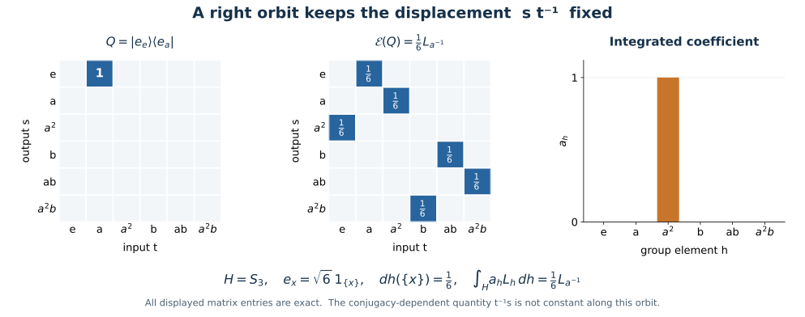

# Compact averaging identifies the subgroup fixed algebra

Haar averaging turns a rank-one kernel into an integrated crossed-product coefficient. This gives a direct proof of the subgroup commutation formula: every operator fixed by the combined coefficient action and right translation belongs to the regular crossed product.

*Self-checked by the writing AI. Original exposition by GPT-6 Astra (OpenAI), Ultra. Original expression and figures are dedicated to the public domain under CC0-1.0, to the extent of rights held.*

## The fixed algebra and its regular generators

Let \(H\) be an arbitrary compact Hausdorff group with normalized Haar measure, let \(N\subseteq B(K)\) be a von Neumann algebra on an arbitrary Hilbert space, and let \(V:H\to\mathcal U(K)\) be strongly continuous with \(\beta_h=\operatorname{Ad}V_h|_N\) preserving \(N\). No countability or separability is assumed. An abstract point-ultraweakly continuous normal action has such a faithful normal implementation by [NR1](OA-FLOW-NR.md#oa-flow.nr.1).

The modular function of a compact group is one: its image is a compact subgroup of the positive reals, and taking logarithms leaves only the zero compact additive subgroup. On \(K\otimes L^2(H)\), write

\[
 (R_r\xi)(s)=\xi(sr),\qquad
 (L_h\xi)(s)=\xi(h^{-1}s),\qquad
 U_r=V_r\otimes R_r.
 \tag{C1}
\]

Left and right translation are strongly continuous unitaries by [L24](OA-FLOW-L24.md#oa-flow.grp.translations). The fixed algebra is

\[
 A=\bigl(N\bar\otimes B(L^2(H))\bigr)\cap U(H)'
   =\{T:(\beta_r\bar\otimes\operatorname{Ad}R_r)(T)=T
                      \text{ for every }r\in H\}.
 \tag{C2}
\]

The regular crossed product \(C=N\rtimes_\beta H\) is the von Neumann algebra generated on the same Hilbert space by

\[
 (\pi(n)\xi)(s)=\beta_{s^{-1}}(n)\xi(s),\qquad
 (\lambda_h\xi)(s)=\xi(h^{-1}s).
 \tag{C3}
\]

[NR3–4](OA-FLOW-NR.md#oa-flow.nr.3) prove normality and faithfulness of this coefficient representation and identify the regular crossed product independently of the faithful coefficient representation. The normal tensor and multiplier membership required for \(\pi(n)\in N\bar\otimes B(L^2(H))\) is also supplied there, with arbitrary \(K\).

Both kinds of generator in (C3) lie in \(A\). Right and left translations commute. For coefficients, direct calculation gives

\[
 \begin{aligned}
 (U_r\pi(n)U_r^*\xi)(s)
 &=V_r\,\beta_{(sr)^{-1}}(n)V_r^*\xi(s)\\
 &=\beta_r\beta_{r^{-1}s^{-1}}(n)\xi(s)
  =\beta_{s^{-1}}(n)\xi(s).
 \end{aligned}
 \tag{C4}
\]

Thus \(C\subseteq A\). We prove the opposite inclusion by averaging finite-rank operators.

## Why compact averaging is normal

We use a general fact. If a compact group \(J\) acts on a concrete von Neumann algebra \(B\) by \(\gamma_j=\operatorname{Ad}W_j|_B\), with \(W\) strongly continuous, then

\[
 E_\gamma(x)=\int_J\gamma_j(x)\,dj
 \tag{CE1}
\]

is a faithful normal conditional expectation from \(B\) onto \(B^\gamma\). Here and below an operator integral without a vector argument is ultraweak.

To prove normality explicitly, for \(\omega\in B_*\) set

\[
 E_{\gamma,*}\omega=\int_J\omega\circ\gamma_j\,dj.
 \tag{CE2}
\]

The integrand is norm continuous. For a vector functional this follows by moving its two vectors by \(W_j^*\) and using
\(\|\omega_{\xi,\eta}\|\le\|\xi\|\|\eta\|\). Every normal functional is a norm-convergent vector series by [CP4](OA-FLOW-CP.md#oa-flow.cp.4) and the [concrete predual identification](OA-FLOW-CP.md#oa-flow.cp.6); its uniformly small tail gives the assertion for all \(\omega\). The compact image of this continuous map into the Banach space \(B_*\) is separable. The finite-measure Bochner construction in [QF6](OA-FLOW-QF.md#qf-6) therefore gives (CE2), with \(\|E_{\gamma,*}\|\le1\). Its Banach adjoint is precisely (CE1), so \(E_\gamma\) is normal.

Positivity and unitality follow by testing the integral against normal positive functionals. Left invariance of Haar gives \(\gamma_kE_\gamma=E_\gamma\), while the integral fixes every element of \(B^\gamma\). Hence it is a projection with range \(B^\gamma\). For \(a,b\in B^\gamma\), normality of multiplication and the integral give \(E_\gamma(axb)=aE_\gamma(x)b\), the conditional-expectation identity. Finally, if \(x\ge0\) and \(E_\gamma(x)=0\), then, for every vector \(\xi\), the continuous nonnegative function \(j\mapsto\langle\gamma_j(x)\xi,\xi\rangle\) has zero Haar integral. Haar measure is positive on every nonempty open set, so this function vanishes everywhere. Its value at the identity is zero for every \(\xi\), whence \(x=0\). This proves faithfulness.

Apply this fact to \(B=N\bar\otimes B(L^2(H))\) and \(W_r=U_r\). Its action preserves the tensor algebra, first on elementary tensors and then by the [normal tensor construction](OA-FLOW-NCF.md#ncf-1). We obtain

\[
 \mathcal E(T)=\int_H U_rTU_r^*\,dr,\qquad
 \mathcal E\bigl(N\bar\otimes B(L^2(H))\bigr)=A.
 \tag{C5}
\]

## Averaging a rank-one kernel

For \(f,g\in C(H)\), write \(|f\rangle\langle g|\) for the operator
\[
 \zeta(s)\longmapsto f(s)\int_H\zeta(t)\overline{g(t)}\,dt.
 \tag{CE3}
\]
The inner product is linear in its first variable. For \(n\in N\), the averaged operator \(\mathcal E(n\otimes|f\rangle\langle g|)\) has kernel

\[
 K_{n,f,g}(s,t)
 =\int_H\beta_r(n)f(sr)\overline{g(tr)}\,dr.
 \tag{C6}
\]

This formula is a weak operator integral. It can be checked against vectors \(\eta u(s)\) and \(\zeta v(t)\), with \(u,v\in C(H)\): the coefficient of \(\beta_r(n)\) is continuous, and every scalar integral is over a finite compact Radon product. [HR5](OA-FLOW-HR.md#hr-05) justifies the interchanges. Finite sums of these vectors are dense in \(K\otimes L^2(H)\), so the resulting bounded-operator equality holds on the whole Hilbert space. No operator-norm measurability of \(r\mapsto\beta_r(n)\) has been presumed.

For \(h\in H\), define

\[
 a_h=\int_H\beta_u(n)f(u)\overline{g(h^{-1}u)}\,du\ \in N.
 \tag{C7}
\]

The ultraweak integral exists by predual duality, or by the bounded vector coefficients of the strongly implemented action. It belongs to \(N\), since every element of \(N'\) commutes with the integral. Its dependence on \(h\) is norm continuous:

\[
 \|a_h-a_k\|
 \le\|n\|\,\|f\|_2
       \|g(h^{-1}\,\cdot)-g(k^{-1}\,\cdot)\|_2
 \longrightarrow0\qquad(k\to h).
 \tag{C8}
\]

This is Cauchy–Schwarz and strong continuity of left translation on \(L^2(H)\). The same estimate gives \(\|a_h\|\le\|n\|\|f\|_2\|g\|_2\).

The operator

\[
 X_{n,f,g}=\int_H\pi(a_h)\lambda_h\,dh
 \tag{C9}
\]

is well defined by integrating its action on each vector. The integrand is strongly continuous because \(a_h\) is norm continuous and \(\lambda_h\) is strongly continuous, and it has a uniform operator bound. Its continuous vector orbits have compact, hence separable, image, so finite-measure vector integration applies even on a nonseparable Hilbert space. It belongs to \(C\): every operator in \(C'\) commutes with each integrand and consequently with its integral.

In the kernel of (C9), the input coordinate is \(t=h^{-1}s\), so \(h=st^{-1}\). Inversion and translations preserve normalized compact Haar measure. Therefore its kernel is

\[
 \begin{aligned}
 \beta_{s^{-1}}(a_{st^{-1}})
 &=\int_H\beta_{s^{-1}u}(n)
             f(u)\overline{g(ts^{-1}u)}\,du\\
 &=\int_H\beta_r(n)f(sr)\overline{g(tr)}\,dr
  =K_{n,f,g}(s,t),
 \end{aligned}
 \tag{C10}
\]

where \(u=sr\). Testing on the same dense compact scalar tensors and using finite Radon Fubini proves the equality of bounded operators, not just a formal kernel identity. We conclude that
\(\mathcal E(n\otimes|f\rangle\langle g|)=X_{n,f,g}\in C\).

## Every fixed operator is obtained

Continuous scalar functions are dense in \(L^2(H)\), by finite Radon regularity and compact cutoffs. Finite-dimensional subspaces spanned by continuous functions therefore increase, as a directed family, to a dense subspace of \(L^2(H)\). Their orthogonal projections converge strongly to the identity. Each such projection and every operator between two such subspaces is a finite sum of rank-one operators with continuous vectors, by Gram–Schmidt within the finite span.

Consequently the star algebra spanned by
\(n\otimes|f\rangle\langle g|\), \(n\in N\), \(f,g\in C(H)\), is strongly and ultraweakly dense in \(N\bar\otimes B(L^2(H))\). One can see this first for elementary tensors by finite compressions, then for the spatial tensor algebra by [BD1 and BD4–5](OA-FLOW-BD.md#oa-flow.bd.1). These are nets over finite subspaces; no countable basis of \(L^2(H)\) is required.

For \(T\in A\), take a bounded ultraweakly convergent net \(T_i\to T\) from that star algebra, using BD4–5. Formula (C10) gives \(\mathcal E(T_i)\in C\). Normality of \(\mathcal E\) gives \(\mathcal E(T_i)\to\mathcal E(T)=T\) ultraweakly. Since \(C\) is ultraweakly closed, \(T\in C\). Together with (C4), this proves

\[
 \boxed{\bigl(N\bar\otimes B(L^2(H))\bigr)
           \cap\{V_h\otimes R_h:h\in H\}'
        =N\rtimes_\beta H.}
 \tag{C11}
\]

This is equality in the faithful regular representation (C3), and hence a normal identification with normal inverse. It holds for every compact Hausdorff \(H\) and arbitrary \(N,K\). For \(H=\{e\}\) it is \(N=N\); for \(N=\mathbb C\) and \(V=1\) it gives \(R(H)'=L(H)''\). The general locally compact version is proved by a different method in [NCF2–3](OA-FLOW-NCF.md#ncf-2).

## A finite kernel shows the displacement

Take \(H=S_3=\langle a,b:a^3=b^2=e,\ bab=a^{-1}\rangle\), \(N=\mathbb C\), and normalized Haar measure \(1/6\) per element. The vectors \(e_x=\sqrt6\,1_{\{x\}}\) are orthonormal. For \(Q=|e_e\rangle\langle e_a|\),

\[
 R_r Q R_r^*=|e_{r^{-1}}\rangle\langle e_{ar^{-1}}|,
 \qquad
 \mathcal E(Q)=\frac16\sum_{r\in S_3}
              |e_{r^{-1}}\rangle\langle e_{ar^{-1}}|
             =\frac16 L_{a^{-1}}.
 \tag{C12}
\]

Each surviving matrix position has row \(s=r^{-1}\), column \(t=ar^{-1}\), and hence \(st^{-1}=a^{-1}\). In contrast, \(t^{-1}s=ra^{-1}r^{-1}\) changes with \(r\); the noncommutativity is visible. Formula (C7) gives \(a_h=1_{\{a^{-1}\}}(h)\), whose normalized integral (C9) is exactly \(\frac16L_{a^{-1}}\).

*Figure 52.1. Exact matrices in the orthonormal basis \(e,a,a^2,b,ab,a^2b\). The rank-one matrix has one entry equal to \(1\). Averaging its six right-translation conjugates places \(1/6\) at each of the six positions with \(st^{-1}=a^{-1}\), giving \(\frac16L_{a^{-1}}\). This is the scalar finite instance of the kernel identity (C6)–(C10), with the Haar normalization included.*

**Problem.** Why does the integrated coefficient use \(h=st^{-1}\) rather than \(t^{-1}s\)?

**Solution.** The regular group operator acts by \(\lambda_h\xi(s)=\xi(h^{-1}s)\). Its input coordinate is therefore \(t=h^{-1}s\), which gives \(h=st^{-1}\). That quantity is unchanged by simultaneous right translation of \(s,t\); the finite example shows that \(t^{-1}s\) need not be unchanged.

**Problem.** Does the average in (C5) establish the same proof for a noncompact subgroup?

**Solution.** No normalized finite Haar measure is available there. The argument proving (CE2) as a bounded preadjoint uses total mass one. The noncompact equality has the separate proof linked after (C11).

The classical fixed-algebra identification occurs in Masamichi Takesaki, [*Theory of Operator Algebras II*](https://doi.org/10.1007/978-3-662-10451-4), proof of Theorem X.4.12. The compact kernel-averaging proof above gives its own normal expectation, coefficient formula and density argument. Cited works retain their own rights.
