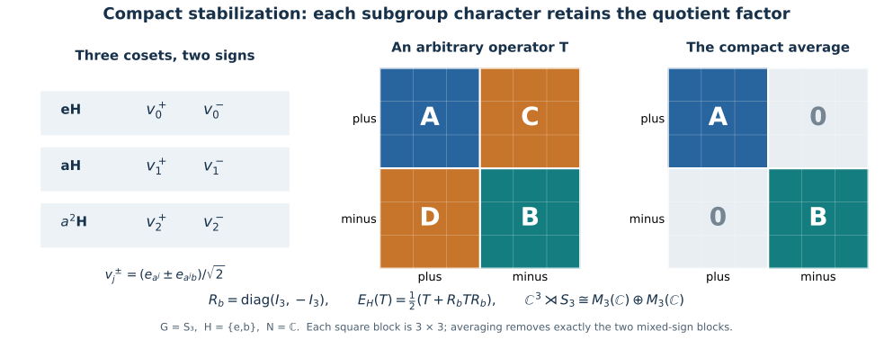

# Stabilization through compact averaging

Compact averaging supplies an alternative proof of two steps in induced stabilization. It passes fixed points through a crossed product, and it identifies the subgroup fixed algebra by averaging kernels. The quotient coordinates then exhibit the full operator factor.

*Self-checked by the writing AI. Original exposition by GPT-6 Astra (OpenAI), Ultra. Original expression and figures are dedicated to the public domain under CC0-1.0, to the extent of rights held.*

## Compact fixed points commute with crossing

We first prove an interchange statement at a scope wider than the subgroup application. Let \(G\) be an arbitrary locally compact Hausdorff group, \(J\) an arbitrary compact Hausdorff group with Haar mass one, and \(B\) an arbitrary von Neumann algebra. Let \(\alpha:G\to\operatorname{Aut}(B)\) and \(\gamma:J\to\operatorname{Aut}(B)\) be point-ultraweakly continuous actions by normal automorphisms, with

\[
 \alpha_g\gamma_j=\gamma_j\alpha_g,\qquad F=B^\gamma.
 \tag{T1}
\]

There are no coefficient or Hilbert-space separability assumptions. Choose a faithful normal representation of \(B\) in which \(\gamma\) is implemented by a strongly continuous unitary representation \(W\), using [NR1](OA-FLOW-NR.md#oa-flow.nr.1). Form the regular crossed product \(B\rtimes_\alpha G\) on that coefficient Hilbert space tensored with \(L^2(G)\), as in [NR3–4](OA-FLOW-NR.md#oa-flow.nr.3). Write its coefficient and group generators as \(\pi_B(b)\) and \(\lambda_g\).

Conjugation by \(W_j\otimes1\) preserves the regular crossed product. Indeed its coefficient formula is
\[
 W_j\,\alpha_{s^{-1}}(b)\,W_j^*
 =\gamma_j\alpha_{s^{-1}}(b)
 =\alpha_{s^{-1}}\gamma_j(b),
\]
and it commutes with translation of the regular coordinate. It therefore induces a normal action satisfying

\[
 \widetilde\gamma_j(\pi_B(b))=\pi_B(\gamma_j(b)),\qquad
 \widetilde\gamma_j(\lambda_g)=\lambda_g.
 \tag{T2}
\]

Strong continuity of the implementing unitaries proves point-ultraweak continuity of this action: test vector pairs, then use the uniformly small tails of the [concrete predual vector series](OA-FLOW-CP.md#oa-flow.cp.4).

The [normal compact-averaging proof](OA-FLOW-L52.md#oa-flow.compactcomm.expectation) gives faithful normal expectations

\[
 E(b)=\int_J\gamma_j(b)\,dj,\qquad
 \widetilde E(T)=\int_J\widetilde\gamma_j(T)\,dj
 \tag{T3}
\]

onto \(F\) and \((B\rtimes_\alpha G)^{\widetilde\gamma}\). Its preadjoints are the Bochner averages of the norm-continuous predual orbits; compactness makes the continuous Banach-valued images separable even when the preduals themselves are not. Normality of \(\pi_B\) and of multiplication by \(\lambda_g\) gives

\[
 \widetilde E(\pi_B(b)\lambda_g)=\pi_B(E(b))\lambda_g.
 \tag{T4}
\]

The linear span of the monomials \(\pi_B(b)\lambda_g\) is a unital star algebra: multiplication uses covariance and produces another such monomial, and the adjoint has the same form. It contains the coefficient and group generators, so it is ultraweakly dense in the crossed product. [BD4–5](OA-FLOW-BD.md#oa-flow.bd.4) give bounded approximating nets from that algebra.

Let \(C_F\) be the von Neumann algebra generated in this same representation by \(\pi_B(F)\) and \(\lambda(G)\). Its generators are fixed by \(\widetilde\gamma\), so \(C_F\) is contained in the fixed algebra. Conversely, for a fixed \(T\), choose a bounded ultraweakly convergent net \(T_i\to T\) from the monomial algebra. Formula (T4) puts \(\widetilde E(T_i)\) in \(C_F\). Normality yields \(\widetilde E(T_i)\to T\) ultraweakly, and \(C_F\) is ultraweakly closed. Thus \(T\in C_F\).

The restriction of the coefficient representation to \(F\) is faithful and normal. Hence [NR4](OA-FLOW-NR.md#oa-flow.nr.4) identifies \(C_F\), with these exact generators, with the regular crossed product \(F\rtimes_{\alpha|_F}G\). We have proved

\[
 \boxed{(B\rtimes_\alpha G)^{\widetilde\gamma}
        =B^\gamma\rtimes_{\alpha|_{B^\gamma}}G}
 \tag{T5}
\]

in the common regular representation. The identification and its inverse are normal. This is an averaging proof of the compact case of the more general [NCF4 interchange theorem](OA-FLOW-NCF.md#ncf-4).

## The transformation algebra and the quotient coordinates

For the stabilization application, now assume \(G\) is second countable and locally compact Hausdorff, \(H\subseteq G\) is compact, and \(N\) is an arbitrary von Neumann algebra with a point-ultraweakly continuous normal action \(\beta\) of \(H\). Represent \(N\) faithfully on an arbitrary \(K\), with a strongly continuous implementation \(V_h\), using NR1. Define

\[
 \begin{aligned}
 B&=N\bar\otimes L^\infty(G),&
 \alpha_g&=\operatorname{id}_N\bar\otimes\lambda_g,\\
 \Theta_h&=\beta_h\bar\otimes\rho_h,&
 (\lambda_gf)(s)&=f(g^{-1}s),\quad(\rho_hf)(s)=f(sh),\\
 M&=B^\Theta=\operatorname{Ind}_H^G(N,\beta).
 \end{aligned}
 \tag{T6}
\]

These are normal continuous actions, and they commute. On \(K\otimes L^2(G)\), \(\Theta_h\) is implemented by \(V_h\otimes R_G(h)\). The normal tensor construction and these continuity statements are proved in [IS3](OA-FLOW-IS.md#is-3). Applying (T5) with \(J=H\) gives \(M\rtimes_\alpha G=(B\rtimes_\alpha G)^{\widetilde\Theta}\).

The exact regular transformation model is [IS4–5](OA-FLOW-IS.md#is-4):

\[
 B\rtimes_\alpha G
 \cong N\bar\otimes\bigl(L^\infty(G)\rtimes_{\rm left}G\bigr).
 \tag{T7}
\]

For clarity, its scalar regular generators on \(L^2(G_s\times G_t)\) are
\((\Pi(f)\zeta)(s,t)=f(ts)\zeta(s,t)\) and
\((\Lambda_g\zeta)(s,t)=\zeta(s,g^{-1}t)\). The unitary

\[
 (W\zeta)(s,t)=\Delta_G(t)^{-1/2}\zeta(t,st^{-1}),
 \qquad
 (W^*\zeta)(s,t)=\Delta_G(s)^{1/2}\zeta(ts,s)
 \tag{T8}
\]

satisfies

\[
 W\Pi(f)W^*=M_f\otimes1,\qquad
 W\Lambda_gW^*=L_g\otimes1,\qquad
 W(R_h\otimes1)W^*=R_h\otimes R_h.
 \tag{T9}
\]

The full proof, including the Haar change and generation of all \(B(L^2(G))\), is IS4. In the norm calculation put \(r=st^{-1}\), so \(ds=\Delta_G(t)\,dr\); this cancels the square of the factor in (T8). Thus no unimodularity of the ambient \(G\) is needed. For arbitrary \(N\), (T7) and its normal extension follow from the coefficient map and bounded strong approximation by elementary tensors, as proved in IS5.

Before this conjugation, \(\widetilde\Theta_h\) is implemented by \(V_h\otimes R_h\otimes1\). Afterwards it is implemented by \(V_h\otimes R_h\otimes R_h\), while the algebra is \(N\bar\otimes B(L^2(G))\otimes1\). Its fixed algebra is therefore \(\mathcal A_G\otimes1\), where

\[
 \mathcal A_G=
 \bigl(N\bar\otimes B(L^2(G))\bigr)
       \cap\{V_h\otimes R_G(h):h\in H\}'.
 \tag{T10}
\]

Removing the last identity factor is a faithful normal isomorphism with normal inverse: a single unit-vector slice in that factor is the inverse. Combined with (T5), this identifies \(M\rtimes_\alpha G\) normally with \(\mathcal A_G\). The coefficient of \(m\in M\) maps to that same tensor operator \(m\), and the group generator maps to \(1_K\otimes L_g\). These statements extend from elementary coefficients by normality; no evaluation of a nonseparable operator-valued measurable field is involved.

Compactness of \(H\) implies \(\Delta_H=1\) and \(\Delta_G|_H=1\), since both restrictions are positive continuous characters of a compact group. Thus [L43](OA-FLOW-L43.md#oa-flow.qm.rho) permits the density \(\rho=1\). It gives a \(G\)-invariant quotient measure \(\mu\) on \(Y=G/H\). The [Borel section](OA-FLOW-IS.md#is-1) and the [full Borel integration formula](OA-FLOW-IS.md#is-2) yield

\[
 \int_G F(s)\,ds
 =\int_Y\int_H F(\sigma(y)h)\,dh\,d\mu(y)
 \qquad(F\ge0\text{ Borel}).
 \tag{T11}
\]

This is the point where the second-countable group assumption supplies the quotient coordinates. Both the preceding interchange proof and L52's subgroup fixed-algebra proof have the wider cardinality scope stated in those results.

The quotient unitary and its inverse are

\[
 \begin{aligned}
 (J_\sigma\xi)(y,h)&=\xi(\sigma(y)h),&
 (J_\sigma^*\eta)(\sigma(y)h)&=\eta(y,h),\\
 J_\sigma R_G(r)J_\sigma^*&=1\otimes R_H(r)
 \qquad(r\in H).
 \end{aligned}
 \tag{T12}
\]

Formula (T11) proves the norm identities and the full null-class correspondence, and the Borel coordinate bijection proves that these maps are onto. The last identity follows by substitution; both subgroup modular factors are one.

Conjugate (T10) by \(1_K\otimes J_\sigma\), then reorder the factors as \(K,H,Y\). If
\[
 D=\bigl(N\bar\otimes B(L^2(H))\bigr)
           \cap\{V_h\otimes R_H(h):h\in H\}',
\]
the resulting algebra is

\[
 \begin{aligned}
 &\bigl(N\bar\otimes B(L^2(H))\bar\otimes B(L^2(Y))\bigr)
       \cap\{V_h\otimes R_H(h)\otimes1:h\in H\}'\\
 &\hspace{35mm}=D\bar\otimes B(L^2(Y)).
 \end{aligned}
 \tag{T13}
\]

Here is the full tensor factorization argument. Choose any orthonormal basis \((e_i)_{i\in I}\) of the quotient Hilbert space. Every matrix slice \(T_{ij}\) of an operator on the first line lies in \(N\bar\otimes B(L^2(H))\): finite-coordinate compression preserves the uniformly bounded strong approximation by elementary tensors. Slicing its commutation equations puts \(T_{ij}\) in \(D\). For finite \(F\subseteq I\),

\[
 (1\otimes p_F)T(1\otimes p_F)
 =\sum_{i,j\in F}T_{ij}\otimes|e_i\rangle\langle e_j|
 \in D\bar\otimes B(L^2(Y)).
 \tag{T14}
\]

As the finite subsets increase, \(p_F\to1\) strongly. These compressions and their adjoints converge strongly to \(T,T^*\), with norms at most \(\|T\|\), so strong closedness gives one inclusion in (T13). Conversely the elementary tensors on its right lie on its left, and the membership and commutation equations are strongly closed on bounded sets. This proves the other inclusion. The argument uses no separability of \(K\) or of the indexing set \(I\).

## The compact-subgroup stabilization

[L52's averaged-kernel equality](OA-FLOW-L52.md#oa-flow.compactcomm.equality) identifies \(D\) with the regular \(N\rtimes_\beta H\), in its exact representation on \(K\otimes L^2(H)\). Combining (T5), (T10), (T12) and (T13) gives

\[
 \boxed{\bigl(\operatorname{Ind}_H^G(N,\beta)\bigr)\rtimes_\alpha G
 \ \cong\ (N\rtimes_\beta H)\bar\otimes B(L^2(G/H,\mu)).}
 \tag{T15}
\]

This is a normal isomorphism with normal inverse for a second-countable locally compact Hausdorff \(G\), compact \(H\), and arbitrary von Neumann algebra \(N\). The maps are the regular-coordinate conjugation (T8), the inverse spectator slice, the quotient unitary (T12), and the tensor reordering. Every map is unitary conjugation or a specified faithful normal identification. The abstract crossed products are independent of the initial faithful normal representation by NR4.

Changing the Borel section to \(\sigma'(y)=\sigma(y)k(y)\) changes \(J_\sigma\) by
\((T_k\eta)(y,h)=\eta(y,k(y)h)\). This is unitary by left Haar invariance and commutes with every \(1\otimes R_H(r)\), as in [IS7](OA-FLOW-IS.md#is-7). Rescaling Haar measure on \(G\) rescales \(\mu\) in (T11); multiplication by the inverse square root of that scalar gives the corresponding quotient Hilbert-space unitary. Thus the numerical choices give explicit equivalent realizations.

The same stabilization statement for a general closed subgroup at this group scope is established by the [completed stabilization proof](OA-FLOW-IS.md#is-6). Compactness here provides the two finite Haar averages, making (T4) and (C10) an additional route to the result.

## Three cosets and two subgroup characters

Let \(G=S_3=\langle a,b:a^3=b^2=e,\ bab=a^{-1}\rangle\), \(H=\{e,b\}\), \(N=\mathbb C\), and let the coefficient action be trivial. Give \(G\) Haar mass \(1/6\) per point and \(H\) mass \(1/2\). The quotient has representatives \(e,a,a^2\), each with measure \(1/3\), as follows by inserting a singleton into (T11).

The induced algebra is \(\mathbb C^3\), the functions on the three right cosets. Indeed its defining fixed-point condition is exactly right-\(H\) invariance. Right translation by \(b\) on \(\ell^2(G)\) swaps the two elements of each coset. For the normalized point masses \(e_x=\sqrt6\,1_{\{x\}}\), its eigenspaces have orthonormal bases

\[
 v_j^\pm=\frac{e_{a^j}\pm e_{a^jb}}{\sqrt2},
 \qquad j=0,1,2.
 \tag{T16}
\]

It is \(+1\) on the three-dimensional plus space and \(-1\) on the three-dimensional minus space. In these coordinates,

\[
 R_b=\begin{pmatrix}I_3&0\\0&-I_3\end{pmatrix},\qquad
 \frac12(T+R_bTR_b)
 =\begin{pmatrix}A&0\\0&B\end{pmatrix}
 \quad\text{if }T=\begin{pmatrix}A&C\\D&B\end{pmatrix}.
 \tag{T17}
\]

Hence the fixed algebra is \(M_3(\mathbb C)\oplus M_3(\mathbb C)\). On the other side, the two eigenspaces of the regular flip on \(\ell^2(H)\) give
\(\mathbb C\rtimes H\cong\mathbb C\oplus\mathbb C\). Thus (T15) reads

\[
 \mathbb C^3\rtimes S_3
 \cong(\mathbb C\oplus\mathbb C)\bar\otimes M_3(\mathbb C)
 \cong M_3(\mathbb C)\oplus M_3(\mathbb C).
 \tag{T18}
\]

*Figure 53.1. Exact finite model \(G=S_3\), \(H=\{e,b\}\), \(N=\mathbb C\). The three cosets each contribute a plus and a minus vector (T16). Averaging the right-\(H\) conjugation removes precisely the two off-diagonal blocks in (T17). Each remaining block acts on the three-dimensional quotient factor, giving the two copies of \(M_3(\mathbb C)\) in (T18).*

**Problem.** What does (T15) say when \(H=G\) is compact?

**Solution.** The quotient has one point and \(B(L^2(G/H,\mu))=\mathbb C\), regardless of the positive mass assigned to that point. The result has no extra operator factor: the induced crossed product is normally isomorphic to \(N\rtimes_\beta G\).

**Problem.** Why does a normal average of a dense monomial algebra suffice for (T5)?

**Solution.** For a fixed \(T\), first approximate it ultraweakly by bounded monomial combinations \(T_i\). Formula (T4) puts every \(\widetilde E(T_i)\) in the proposed smaller crossed product. Normality gives \(\widetilde E(T_i)\to T\), and the smaller algebra is ultraweakly closed. It is this approximation argument, rather than an assertion that continuous maps always preserve closures of images, that proves the inclusion.

The classical stabilization theorem is Masamichi Takesaki, [*Theory of Operator Algebras II*](https://doi.org/10.1007/978-3-662-10451-4), Theorem X.4.12. The compact proof here uses the explicitly normal average and the rank-one-kernel calculation in L52, together with the fully proved coordinate maps in IS. Cited works retain their own rights.
