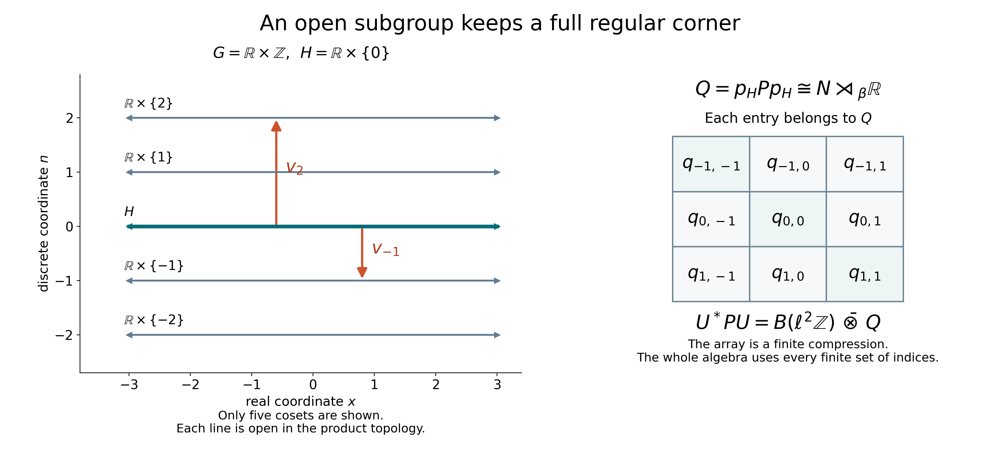

# Open subgroups and the regular corner

*Self-checked by the writing AI. Original lesson, diagram and reproduction code: CC0-1.0; accompanying font terms retained.*

For an open subgroup, each coset is a measurable piece of positive Haar measure. Those pieces give projections in the induced algebra. Moving one projection to the others produces matrix units; the remaining corner is exactly the subgroup's regular crossed product. The proof below retains the full Haar measure in that corner, even when the subgroup is nondiscrete.

Let \(G\) be an arbitrary locally compact Hausdorff group, \(H\leq G\) an open subgroup, \(N\) an arbitrary von Neumann algebra, and \(\beta:H\to\operatorname{Aut}(N)\) a point-ultraweakly continuous action. There is no countability or separability assumption. Haar measure on \(H\) is the restriction of a fixed left Haar measure \(m_G\). We use
\[
 m_G(Er)=\Delta_G(r)m_G(E),\qquad
 \int_G f(sr)\,dm_G(s)=\Delta_G(r)^{-1}\int_G f(s)\,dm_G(s).
 \tag{OS1}
\]
The scalar measure and Hilbert direct-sum convention are those of [Haar measure on arbitrary locally compact groups](OA-FLOW-HR.md#hr-09). The [normal regular crossed product](OA-FLOW-NR.md#oa-flow.nr.3) and its [representation independence](OA-FLOW-NR.md#oa-flow.nr.4) allow any faithful normal representation of the coefficient algebra. The proof uses [bounded strong-star density](OA-FLOW-BD.md#oa-flow.bd.4) and [normal tensor transport](OA-FLOW-NCF.md#ncf-1).

## The induced algebra is a product over the cosets

Put \(Y=G/H\), \(o=H\), and choose representatives \(t_y\) with \(t_o=e\). The complement of \(H\) is the union of its other open cosets, so \(H\) is closed. The quotient \(Y\) is discrete. Every compact subset of \(G\) meets only finitely many cosets, since the cosets are an open cover. Consequently the usual orthogonal decomposition
\[
 L^2(G)=\bigoplus_{y\in Y}L^2(t_yH)
 \tag{OS2}
\]
holds for arbitrary \(Y\). Indeed compact continuous functions have only finitely many components, and they are dense in \(L^2(G)\). Finite partial sums of the coset projections therefore converge strongly to the identity. After any Hilbert tensor amplification the same is true. This also proves the corresponding product decomposition of the scalar multiplier algebra, using the locally determined Haar convention.

Define the induced algebra by the fixed tensors
\[
 M=(N\bar\otimes L^\infty(G))^{\beta_h\otimes\rho_h,\ h\in H},
 \qquad (\rho_h f)(s)=f(sh).
 \tag{OS3}
\]
On the coset \(t_yH\), left translation by \(t_y\) identifies Haar measure with \(m_H\). The fixed tensor on that coset is the normal regular coefficient
\[
 h\longmapsto\beta_{h^{-1}}(a_y),\qquad a_y\in N.
 \tag{OS4}
\]
Here (OS4) means the normal coefficient operator, not evaluation of an arbitrary operator-valued measurable representative. The complete \(H=G\) case of [Recognizing induced actions, Exercise 2](OA-FLOW-L47.md#oa-flow.isys.exercises) proves both surjectivity and normality of this identification for arbitrary \(H,N\). Its proof smooths fixed tensors and uses ultraweak compactness before taking a normal limit.

Applying that identification separately to all the summands in (OS2) gives the normal unital isomorphism
\[
 M\cong\prod_{y\in Y}N
 =\{a=(a_y):\sup_y\|a_y\|<\infty\}.
 \tag{OS5}
\]
To check the whole product assertion, a bounded family of the operators (OS4) acts diagonally on the direct sum, with norm \(\sup_y\|a_y\|\). Its finite central compressions belong to \(N\bar\otimes L^\infty(G)\), and converge strongly together with their adjoints to the whole diagonal operator. The tensor algebra is strongly closed. The fixed-point identities hold on every summand and hence on the sum. Conversely a fixed tensor restricts to (OS4) on every summand. Increasing bounded positive nets have their suprema coordinate by coordinate, so this identification and its inverse are normal.

For \(g\in G\) set
\[
 c(g,y)=t_{gy}^{-1}gt_y\in H.
 \tag{OS6}
\]
Left translation on \(G\) gives the induced action in these coordinates:
\[
 (\alpha_g a)_y
   =\beta_{c(g^{-1},y)^{-1}}(a_{g^{-1}y}).
 \tag{OS7}
\]
Indeed \(g^{-1}t_y=t_{g^{-1}y}c(g^{-1},y)\); substitute this into (OS4). The identity
\(c(g_1g_2,y)=c(g_1,g_2y)c(g_2,y)\) follows directly from (OS6), and verifies the action law.

This action is point-ultraweakly continuous. For fixed \(y\) and \(g_0\), the point \(g^{-1}y\) is constant near \(g_0\), because the stabilizer of \(y\) is open. On that neighborhood the cocycle in (OS7) is continuous into \(H\), so each normal functional of the \(y\)-coordinate is continuous. Every vector in a Hilbert direct sum has at most countably many nonzero coordinates, and finite coordinate truncations approximate it in norm. Applying this to the vector-series description of normal functionals, with the uniform bound \(\|\alpha_g(a)\|=\|a\|\), extends continuity to all normal functionals on the product.

Write \(p_y\in Z(M)\) for the identity in coordinate \(y\) and zero elsewhere. Then
\[
 p_yp_z=\delta_{yz}p_y,\qquad
 \sum_{y\in Y}p_y=1\ \text{strongly},\qquad
 \alpha_g(p_y)=p_{gy}.
 \tag{OS8}
\]
The sum is the net over finite subsets of \(Y\).

## One corner gives the whole matrix algebra

Let \(P=M\rtimes_\alpha G\), let \(\pi\) denote its coefficient embedding, and write \(u_g\) for its canonical group unitaries. In formulas involving \(P\), abbreviate \(\pi(p_y)\) by \(p_y\). Put \(p=p_o\), \(Q=pPp\), and
\[
 v_y=u_{t_y}p,\qquad E_{yz}=v_yv_z^*.
 \tag{OS9}
\]
Covariance and (OS8) give \(v_y^*v_y=p\), \(v_yv_y^*=p_y\), and \(v_y^*v_z=0\) when \(y\ne z\). Thus \(E_{yz}\) are matrix units with diagonal \(p_y\).

In any faithful normal representation of \(P\) on \(\mathcal H\), define
\[
 U:\ell^2(Y)\otimes p\mathcal H\longrightarrow\mathcal H,
 \qquad U(\delta_y\otimes\xi)=v_y\xi.
 \tag{OS10}
\]
The orthogonality identities make \(U\) isometric on finite sums. Equation (OS8) makes its range dense, hence \(U\) is unitary. For \(x\in P\), the \((y,z)\)-matrix entry of \(U^*xU\) is \(v_y^*xv_z\in Q\). For finite \(F\subset Y\), compression to \(\ell^2(F)\otimes p\mathcal H\) therefore lies in \(B(\ell^2Y)\bar\otimes Q\). Those compressions converge strongly to \(U^*xU\), proving one inclusion. Conversely
\[
 U\bigl(|\delta_y\rangle\langle\delta_z|\otimes q\bigr)U^*
   =v_yqv_z^*\in P\qquad(q\in Q).
 \tag{OS11}
\]
Strong closedness proves the reverse inclusion. We obtain a spatial, and therefore normal, isomorphism with normal inverse:
\[
 U^*PU=B(\ell^2Y)\bar\otimes Q.
 \tag{OS12}
\]
No enumeration of \(Y\) was used.

## The corner has only subgroup generators

The algebraic span of the monomials \(\pi(a)u_g\), \(a\in M,g\in G\), is a unital star algebra: covariance verifies closure under multiplication and adjoints. It generates \(P\). If \(g\notin H\), then \(go\ne o\), and orthogonality gives
\[
 p\pi(a)u_gp=0.
 \tag{OS13}
\]
For \(h\in H\), both \(u_h\) and \(\pi(a)\) commute with \(p\). It follows that the corner is generated by
\[
 q(a)=p\pi(\widetilde a)p,\qquad
 w_h=u_hp,\qquad
 a\in N,\ h\in H,
 \tag{OS14}
\]
where \(\widetilde a\in M\) is \(a\) in coordinate \(o\) and zero elsewhere. For precision, bounded strong-star approximation of any \(x\in P\) by elements of the algebraic star algebra, followed by compression, puts \(pxp\) in the strongly closed algebra generated by (OS14). The opposite inclusion is immediate. Thus this is an equality of von Neumann algebras, not just an algebraic spanning assertion.

The relations \(w_hw_k=w_{hk}\) and
\(w_hq(a)w_h^*=q(\beta_h(a))\) follow from covariance and (OS7). To identify this covariant representation as the faithful *normal regular* subgroup crossed product, we now give its whole Hilbert-space model.

## The regular corner, with the Haar factor included

Choose a faithful normal representation \(N\subseteq B(K)\). Represent \(M=\prod_Y N\) diagonally on \(\mathcal K=\bigoplus_YK\). The regular representation of \(P\) acts on \(L^2(G;\mathcal K)\), with
\
 [\pi(a)\xi
   =\beta_{c(g,y)^{-1}}(a_{gy})\xi(g,y),\qquad
 u_r\xi=\xi(r^{-1}g,y).
 \tag{OS15}
\]
These formulas are first checked on finite-coordinate elementary vectors; the normal regular construction extends them to the entire Hilbert space. The vector-integration and tensor identification in [Haar conventions and Hilbert-valued integration](OA-FLOW-L24.md#oa-flow.grp.vectorintegration) are valid for arbitrary \(K\) and \(G\).

The projection \(p\) retains exactly those pairs \((g,y)\) for which \(gy=o\). For fixed \(y\), this is the open set \(Ht_y^{-1}\). Write \(g=ht_y^{-1}\). Then \(c(g,y)=h\), since \(gy=o\) and \(t_o=e\). Define
\[
 T:pL^2(G;\mathcal K)\longrightarrow
       \bigoplus_{y\in Y}L^2(H;K),\qquad
 (T\xi)_y(h)=\Delta_G(t_y)^{-1/2}\xi(ht_y^{-1},y).
 \tag{OS16}
\]
The scalar is forced by right Haar transport. Since \(m_H=m_G|_H\),
\[
 \int_{Ht_y^{-1}}\|\xi(g,y)\|^2\,dm_G(g)
 =\Delta_G(t_y)^{-1}
       \int_H\|\xi(ht_y^{-1},y)\|^2\,dm_H(h).
 \tag{OS17}
\]
Thus \(T\) preserves norms on every summand. The inverse multiplies by
\(\Delta_G(t_y)^{1/2}\) and transports \(h\) to \(ht_y^{-1}\). Both transformations preserve completed null sets because their measures differ by a positive scalar. They give inverse isometries on the full summands, and hence a unitary on their arbitrary Hilbert direct sum.

For \(a\in N\), \(r,h\in H\), (OS15) gives on every \(y\)-summand
\[
 [Tq(a)T^*\eta]_y(h)=\beta_{h^{-1}}(a)\eta_y(h),\qquad
 [Tw_rT^*\eta]_y(h)=\eta_y(r^{-1}h).
 \tag{OS18}
\]
In the second formula, \(r^{-1}ht_y^{-1}\) stays in the same sector and the two constant Haar factors cancel. These are precisely the regular coefficient and left regular group operators for \(N\rtimes_\beta H\), repeated identically on every summand. Equations (OS14) and (OS18) therefore prove
\[
 TQT^*=(N\rtimes_\beta H)\otimes1_{\ell^2Y},
 \qquad Q\cong N\rtimes_\beta H.
 \tag{OS19}
\]
The order of the displayed tensor factors uses the canonical direct-sum identification. Amplification is normal; compression to any one \(y\)-summand is its normal inverse. Its faithfulness is immediate from that compression. In particular we have proved the required regular topology of the corner, rather than inferring it from covariance alone.

## Stabilization and the meaning of the quotient factor

Combining (OS12) and (OS19), and exchanging the tensor factors, proves
\[
 \boxed{\bigl(\operatorname{Ind}_H^G N\bigr)\rtimes G
       \cong (N\rtimes_\beta H)\bar\otimes B(\ell^2(G/H)).}
 \tag{OS20}
\]
Every map is normal with normal inverse. If \(N=0\), both algebras are zero, giving the omitted degenerate case. Otherwise the corner and the Hilbert spaces used above are nonzero.

A Radon quotient measure on the discrete space \(Y\) in the Haar quotient class has
\(0<\mu(\{y\})<\infty\) at each point. With the locally determined measure convention, the map
\[
 L^2(Y,\mu)\longrightarrow\ell^2Y,\qquad
 \zeta\longmapsto\bigl(\mu(\{y\})^{1/2}\zeta(y)\bigr)_{y\in Y}
 \tag{OS21}
\]
is unitary: its squared norm is the sum, defined as the supremum of finite partial sums, of the coordinate squared norms. Its inverse divides by the same positive scalars. Thus (OS20) also has the usual quotient-measure formulation. No numerical normalization of the quotient measure is part of the isomorphism class.

For \(G=\mathbb R\times\mathbb Z\), \(H=\mathbb R\times\{0\}\), every coset is a horizontal copy of \(\mathbb R\), and \(Y=\mathbb Z\). The ambient topology is the product of the usual topology on \(\mathbb R\) and the discrete topology on \(\mathbb Z\). The subgroup is open and noncompact, and
\[
 \bigl(\operatorname{Ind}_{\mathbb R}^{\mathbb R\times\mathbb Z}N\bigr)
       \rtimes(\mathbb R\times\mathbb Z)
 \cong (N\rtimes_\beta\mathbb R)\bar\otimes B(\ell^2\mathbb Z).
 \tag{OS22}
\]
Here \(\Delta_G=1\). The corner keeps an entire \(L^2(\mathbb R;K)\) variable, while the matrix factor records the discrete cosets.

## The corner and the coset directions

The horizontal lines show a finite window of the cosets \(\mathbb R\times\{n\}\); each line continues in both horizontal directions, and there are cosets for all \(n\in\mathbb Z\). The highlighted line is \(H\). The arrows show translations by \(t_n=(0,n)\), which give the partial isometries \(v_n\) in (OS9). The displayed \(3\times3\) matrix is a finite compression of the full algebra \(B(\ell^2\mathbb Z)\bar\otimes(N\rtimes_\beta\mathbb R)\), not a finite-dimensional replacement. Each entry \(q_{mn}\) is an operator in the subgroup crossed product. The proof of the whole amplification is (OS10)–(OS12), and the subgroup corner is identified by (OS16)–(OS19).

[Editable SVG](../assets/induction-alternatives/open/open-cosets.svg), [reproduction code](../assets/induction-alternatives/open/render.py), [coordinate data](../assets/induction-alternatives/open/data.json).

## Exercises with solutions

**1. Why does evaluation at the identity of \(G\) not appear?**

**Solution.** The useful projection is the indicator of the open coset \(H\), not the indicator of \(\{e\}\). The corner carries the whole left Haar space \(L^2(H;K)\). When \(H\) is nondiscrete, the singleton \(\{e\}\) has zero Haar measure: if it had positive measure, all singletons would have the same positive measure; every compact set would then be finite, and a compact neighborhood would force discreteness. Thus identity evaluation cannot be substituted for the Hilbert-space unitary (OS16).

**2. Is the countability of \(G/H\) needed for the matrix construction?**

**Solution.** No. Equations (OS8), (OS10) and (OS12) use nets indexed by finite subsets. Every vector has summable squared coordinate norms, so its finite partial sums converge in norm. This proves the needed strong convergence for arbitrary cardinality.

**3. What changes if the Haar measure on \(H\) is multiplied by \(b>0\)?**

**Solution.** Replace \(T\) in (OS16) by \(b^{-1/2}T\). This is unitary into \(L^2(H,bm_H;K)\). The scalar cancels in both conjugation formulas (OS18), so the same abstract normal isomorphism results.

For the general second-countable closed-subgroup theorem, see [Stabilization of a normal induced crossed product](OA-FLOW-IS.md#is-6). Further reading: M. Takesaki, [*Theory of Operator Algebras II*, Theorem X.4.12](https://doi.org/10.1007/978-3-662-10451-4), pp.303–305.
