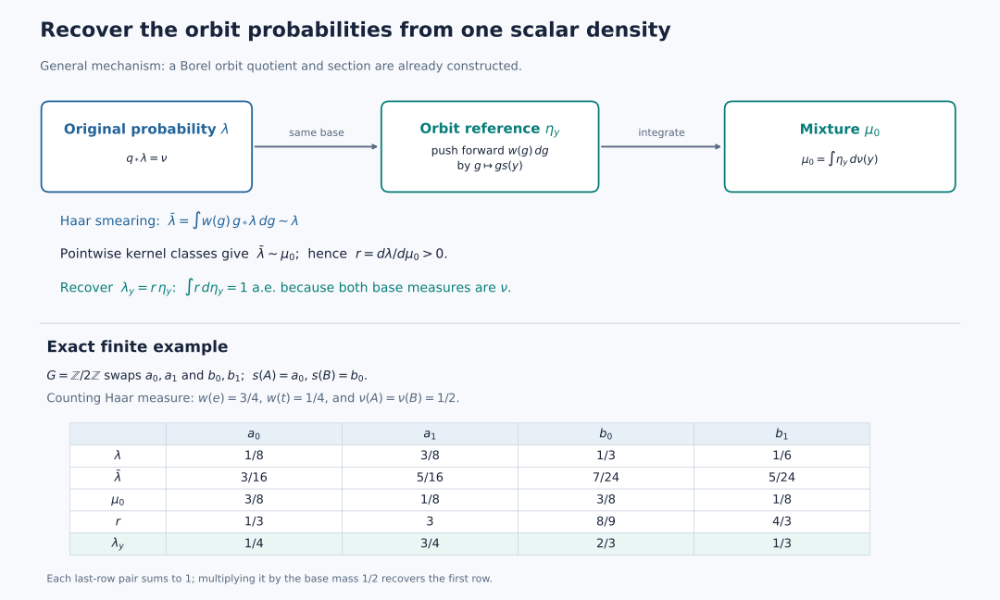

# Conditional probabilities in the Haar class of each orbit

An integrable continuous action admits a conull measurable quotient by its actual orbits. Haar averaging supplies reference probabilities on these orbits. One positive scalar density then recovers the original probability, orbit by orbit.

*Self-checked by the writing AI. Original exposition by GPT-6 Astra (OpenAI), Ultra. Original expression, diagram, code and data are dedicated under CC0-1.0, to the extent of rights held. Font terms are retained with the figure.*

## The measured action and the conclusion

Throughout, \(G\) is a locally compact Hausdorff group with a countable base, acting continuously on a locally compact Hausdorff space \(X\) with a countable base. The Borel probability \(\lambda\) is quasi-invariant: \(g_*\lambda\) and \(\lambda\) have the same null sets for every \(g\). Fix left Haar measure \(dg\). The scalar orbit average of a bounded nonnegative Borel function is
\[
 E(p)(x)=\int_Gp(g^{-1}x)\,dg.
 \tag{K-1}
\]
Let \(\mathcal P_b\) consist of the positive classes in \(L^\infty(X,\lambda)\) for which \(E(p)\) is essentially bounded. Assume that the linear span of \(\mathcal P_b\) is ultraweakly dense in \(L^\infty(X,\lambda)\). Quasi-invariance and Tonelli imply that changing a Borel representative changes its average only on a \(\lambda\)-null set. All kernels below are defined on Borel sets; completion gives the same multiplication algebras.

We prove that an invariant conull Borel subset has a Borel quotient \(q:X_1\to Y\), with exactly one orbit in each fiber and a Borel section \(s\). For \(\nu=q_*\lambda\), there are conditional probabilities \(\lambda_y\) supported on those fibers whose mixture is \(\lambda\). On a single conull set of \(y\), each \(\lambda_y\) is equivalent to the Haar image on \(Gs(y)\). The stabilizers \(H_y=G_{s(y)}\) are compact, form a Borel field, and admit a countable Borel family dense in every \(H_y\). Each measured fiber is equivariantly isomorphic to \(G/H_y\) with its quotient Haar class.

The preceding [continuous-model transport theorem](OA-FLOW-L72.md#oa-flow.model.transport) supplies these hypotheses from its abstract abelian action. Here the continuous measured action and the dense cone are the explicit hypotheses.

The analytic inputs are [scalar convergence and approximation](OA-FLOW-SC.md#sc-04), [Radon products](OA-FLOW-HR.md#hr-05), [Haar translation and inversion](OA-FLOW-L24.md#oa-flow.grp.translations), [compact cutoffs](OA-FLOW-TOPOLOGY.md#l138-h0), compact polynomial density, [compact Lusin approximation](OA-FLOW-QF.md#qf-6), and Hilbert representation of a bounded functional. The selection and conditional-probability constructions needed here are proved below.

## Borel parameter integrals

Let \(S,T\) be second-countable spaces or Borel subspaces of such spaces, and let \(m\) be a sigma-finite Borel measure on \(T\). For every nonnegative Borel function \(F\) on \(S\times T\), the map \(s\mapsto\int_TF(s,t)\,dm(t)\) is Borel. Here is the complete parameter-integration argument: on each finite-measure piece the sets whose section integrals are Borel form a class containing the whole product, closed under complements and countable disjoint unions, and containing all rectangles. Such a class containing a family closed under intersections contains its generated sigma-algebra. Here is the short class argument. In the smallest class with those three closure properties containing the rectangles, first fix a rectangle and apply the same closure properties to the sets whose intersection with that rectangle remains in the class. Then fix an arbitrary member and repeat. This proves closure under intersections of any two members. Complements and disjoint countable unions now give arbitrary countable unions, by replacing a sequence by its successive disjoint differences. Thus the class is a sigma-algebra. Countable finite-measure pieces, simple approximation and monotone convergence handle all nonnegative functions. The product Borel sigma-algebra is the product sigma-algebra because both factors have countable bases.

## A positive integrable witness

First choose a countable family \(p_j\in\mathcal P_b\) whose positive sets cover almost all of \(X\). Here is a direct justification. Let \(a\) be the supremum of the \(\lambda\)-masses of finite unions of positive sets of members of \(\mathcal P_b\). Choose finite unions with masses tending to \(a\), and let \(S\) be their countable union. Then \(\lambda(S)=a\). The positive set of any other \(p\in\mathcal P_b\) is contained in \(S\) up to a null set; otherwise adjoining it to sufficiently large finite unions would exceed \(a\). Thus the [normal integral functional](OA-FLOW-IW.md#iw-1) \(z\mapsto\int_{X\setminus S}z\,d\lambda\) vanishes on the dense linear span, hence on \(1\). Consequently \(a=1\). Enumerating the finitely many functions used in these unions gives the required sequence.

Choose bounded nonnegative Borel representatives and put
\[
 f=\sum_{j\ge1}\frac{2^{-j}p_j}
 {1+\|p_j\|_\infty+\|E(p_j)\|_\infty}.
 \tag{K0}
\]
Take representatives satisfying \(0\le p_j\le\|p_j\|_\infty\) everywhere. The series converges uniformly, \(f>0\) almost everywhere, and [scalar monotone convergence](OA-FLOW-SC.md#sc-04) gives \(E(f)\le1\) almost everywhere. Quasi-invariance and sigma-finite Tonelli applied to \(1_{\{f=0\}}(g^{-1}x)\) give \(f(g^{-1}x)>0\) for Haar-almost every \(g\), for \(\lambda\)-almost every \(x\). Haar measure is sigma-finite because \(G\) has a countable compact cover. Both conditions define Borel sets: nonnegative parameter integrals are Borel by the preceding argument. Both are invariant, by the substitution \(g=hk\) when replacing \(x\) by \(hx\). Their intersection \(X_0\) is invariant and conull. The orbit integral of \(f\) is strictly positive there, because Haar measure is nonzero and the integrand is positive almost everywhere. Formula (K1) therefore defines a probability kernel. Its Borel dependence follows from parameter integration, its invariance follows from the same left Haar substitution, and it is concentrated on the actual orbit.

The witness gives the probability kernel
\[
 P_{gx}=P_x,\qquad P_x(Gx)=1,\qquad
 P_x(D)=\frac{\int_G1_D(g^{-1}x)f(g^{-1}x)\,dg}
                  {\int_Gf(g^{-1}x)\,dg}.
 \tag{K1}
\]
Its denominator is finite and strictly positive on \(X_0\), and \(f(g^{-1}x)>0\) for Haar-almost every \(g\), for every \(x\in X_0\). The equality \(P_{gx}=P_x\) says the assignment is constant along an orbit; an individual \(P_x\) need not be an invariant measure. Each orbit is Borel: it is the countable union of the compact images of a compact exhaustion of \(G\).

## A conull selector from an orbit probability kernel

For precision, the elementary countability facts can be obtained without a metrization theorem. Choose a countable relatively compact open basis, with closure refinements. For each pair of basis members with the first closure contained in the second, select a compact continuous bump equal to one on that closure and supported in the second. The resulting countable family separates points and recovers neighborhoods. Writing these bumps as \(b_j\), with values in \([0,1]\), the metric \(d_X(x,x\prime)=\sum_j2^{-j}|b_j(x)-b_j(x\prime)|\) induces the original topology. Separation makes it a metric; the finite-coordinate neighborhoods are open, and a bump equal to one near a point and supported in a given neighborhood proves the converse topology inclusion. Rational complex star polynomials in these bumps form a countable dense subset of \(C_0(X)\): adjoin constants on the one-point compactification and apply compact polynomial density, then subtract the value at the added point. Thus choose a countable norm-dense family \((u_n)\) in the real unit ball of \(C_0(X)\).

Define the probability code
\[
 T(x)=\left(\int_Xu_n\,dP_x\right)_{n\ge1}\in Q=[-1,1]^{\mathbb N}.
 \tag{K2}
\]
Use the compact metric \(d_Q(t,t')=\sum_n2^{-n}|t_n-t_n'|\). Compactness follows either from compact product construction or from successive subsequences in each coordinate and the uniform tail bound. The code is Borel: inverse images of coordinate cylinders are Borel, and the product has a countable basis. It is constant on orbits. Conversely \(T(x)=T(x')\) implies equality of integrals for every \(C_0(X)\) function by norm density, hence \(P_x=P_{x'}\) by [Radon uniqueness](OA-FLOW-HR.md#hr-02). These probabilities are Radon: a finite Borel measure on an lcsc metric space is regular by the [finite metric-measure regularity proof](OA-FLOW-IS.md#is-2), and a countable compact exhaustion makes it inner regular by compact sets. Different orbits are disjoint Borel sets carrying their respective probabilities; therefore equality of the probabilities implies \(Gx=Gx'\).

There are compact subsets \(K_j\subseteq X_0\) such that
\[
 \lambda\left(X\setminus\bigcup_jK_j\right)=0,
 \qquad T|_{K_j}\text{ is continuous}.
 \tag{K3}
\]
To apply [compact Lusin approximation](OA-FLOW-QF.md#qf-6), embed \(Q\) continuously into \(\ell^2\) by \(t\mapsto(2^{-n}t_n)\). Truncating the coordinates and replacing their values by rational mesh points gives finite-valued Borel functions converging uniformly to this map. On a compact carrier omitting arbitrarily little \(\lambda\)-mass, that result makes the map continuous on a further compact set. Finite Radon regularity allows this set to lie in the conull Borel set \(X_0\). Repeat with omitted masses tending to zero. The coordinate embedding and its inverse on its compact image are continuous.

We record a small selection fact with its proof. A continuous map \(F:K\to Q\) from a compact metric space has a Borel section on its compact image. For a relatively open subset \(U\subseteq K\), write \(U\) as a countable union of compact sets by using positive distance from \(K\setminus U\). The case \(U=K\) uses \(K\) itself. Thus \(F(U)\) is a countable union of compact sets, hence Borel. Choose a countable basis in \(K\) with closure refinement and arbitrarily small diameter. For \(t\in F(K)\), select recursively the first basis member whose closure lies in the preceding one, whose diameter is below \(2^{-n}\), and whose image contains \(t\). All tests are Borel by the preceding image calculation. Fix one point in each basis member. The selected points form a Cauchy sequence in \(K\), and its limit is in \(F^{-1}(t)\): each selected member meets that closed fiber. The nested closure condition keeps the limit in every preceding member. The limit is Borel, because distance from it to each closed set is the limit of the corresponding Borel distance functions. This is the [nested-basis section mechanism](OA-FLOW-IS.md#is-1), with its needed hitting sets proved Borel here.

Apply this fact to \(T|_{K_j}\). Put \(Z=\bigcup_jT(K_j)\), a Borel subset of \(Q\). On \(Z\), choose the section \(s_0(t)\) from the first \(K_j\) whose image contains \(t\). This is Borel, takes values in \(K=\bigcup_jK_j\), and satisfies \(T(s_0(t))=t\).

The correct invariant restriction is
\[
 X_1=\{x\in X_0:P_x(K)=1\},\qquad
 Y=\{t\in Z:P_{s_0(t)}(K)=1\}.
 \tag{K4}
\]
Both sets are Borel. The first is invariant. It is conull: by quasi-invariance \(\lambda(g(X\setminus K))=0\) for every fixed \(g\), so sigma-finite Tonelli gives
\[
 \int_G1_{X\setminus K}(g^{-1}x)f(g^{-1}x)\,dg=0
 \quad\text{for }\lambda\text{-almost every }x.
 \tag{K5}
\]
Divide by the positive denominator in (K1). If \(x\in X_1\), its orbit meets \(K\), and therefore \(T(x)\in Z\). The point \(s_0(T(x))\) lies in that same orbit, so its probability assigns mass one to \(K\). It follows that \(T(X_1)=Y\). Conversely, the definition of \(Y\) puts \(s_0(t)\) in \(X_1\).

Consequently
\[
 q=T|_{X_1}:X_1\to Y,\qquad s=s_0|_Y:Y\to X_1
 \tag{K6}
\]
are Borel, \(qs=\mathrm{id}\), and the fibers of \(q\) are exactly the orbits. The base \(Y\) is explicitly a Borel subset of a compact metric cube. We have proved the required conull selector without asserting that the original entire image \(T(X_0)\) is Borel.

## Reference probabilities in the Haar class

Choose a Borel \(w:G\to(0,\infty)\) with \(\int_Gw\,dg=1\). Such a function exists: partition a countable compact exhaustion into finite-Haar-measure Borel pieces and give the \(n\)-th piece value \(2^{-n}/(1+m(E_n))\), then normalize. Haar measure is nonzero, so the normalizing integral is positive.

Put \(\nu=q_*\lambda\), regarding \(\lambda\) as a probability on \(X_1\), and define
\[
 \eta_y(D)=\int_Gw(g)1_D(gs(y))\,dg,\qquad
 \mu_0(D)=\int_Y\eta_y(D)\,d\nu(y).
 \tag{K7}
\]
The integrands are jointly Borel, since the action and \(s\) are Borel. The parameter-integration result above applies. Thus \(\eta\) is a probability kernel. Each \(\eta_y\) is concentrated on \(q^{-1}(y)\), and \(q_*\mu_0=\nu\).

For \(x\in X_1\), also set
\[
 \kappa_x(D)=\int_Gw(g)1_D(gx)\,dg,\qquad
 \bar\lambda(D)=\int_{X_1}\kappa_x(D)\,d\lambda(x)
              =\int_Gw(g)\lambda(g^{-1}D)\,dg.
 \tag{K8}
\]
Quasi-invariance gives \(\bar\lambda\sim\lambda\). One implication follows because every translate of a \(\lambda\)-null set is null. For the other, if \(\bar\lambda(D)=0\), then \(\lambda(g^{-1}D)=0\) for Haar-almost every \(g\). At least one such \(g\) exists, and quasi-invariance implies \(\lambda(D)=0\). Moreover \(q(gx)=q(x)\) gives \(q_*\bar\lambda=\nu\), so smearing preserves the quotient distribution.

For every \(x\), choose merely for this argument one \(h\) with \(x=hs(q(x))\). No measurable choice of \(h\) is needed. Since \(w>0\) everywhere and right translation preserves the Haar null ideal,
\[
 \kappa_x(D)=0
 \quad\Longleftrightarrow\quad
 \eta_{q(x)}(D)=0
 \qquad(D\text{ Borel}).
 \tag{K9}
\]
For each fixed \(D\), integrate this equivalence. It gives
\[
 \bar\lambda(D)=0
 \Longleftrightarrow \eta_{q(x)}(D)=0\ \lambda\text{-a.e. }x
 \Longleftrightarrow \eta_y(D)=0\ \nu\text{-a.e. }y
 \Longleftrightarrow \mu_0(D)=0.
 \tag{K10}
\]
Therefore \(\mu_0\sim\lambda\). This argument is before, and independent of, any conditional measure construction. It does not intersect uncountably many exceptional sets.

## One finite scalar density

Let \(\tau=\lambda+\mu_0\). The functional \(F\mapsto\int F\,d\lambda\) on \(L^2(\tau)\) is bounded, by scalar Cauchy–Schwarz and \(\lambda\le\tau\). The Hilbert representation theorem supplies \(a\in L^2(\tau)\) with \(\int F\,d\lambda=\int Fa\,d\tau\): take the complex conjugate of its representing vector under the inner-product convention linear in the first variable. Testing indicators shows that \(a\) is real, \(0\le a\le1\), and
\[
 \lambda(D)=\int_Da\,d\tau,\qquad
 \mu_0(D)=\int_D(1-a)\,d\tau.
 \tag{K11}
\]
The sign tests are explicit: an integrable real function with nonnegative integral on every measurable set is nonnegative, by testing where it is below \(-1/n\); apply the same argument to \(1-a\). The imaginary part integrates to zero on every set and thus vanishes. Equivalence of \(\lambda,\mu_0\) makes both \(\{a=0\}\) and \(\{a=1\}\) \(\tau\)-null. Choose a Borel representative and put
\[
 r=\frac{a}{1-a}
 \quad\text{where }0
## The conditional probabilities

Define \(c(y)=\int r\,d\eta_y\). This is Borel, nonnegative, and finite \(\nu\)-almost everywhere, since its integral is one. For every Borel \(B\subseteq Y\), concentration of \(\eta_y\) on \(q^{-1}(y)\) gives
\[
 \int_Bc(y)\,d\nu(y)
 =\int_{q^{-1}(B)}r\,d\mu_0
 =\lambda(q^{-1}(B))
 =\nu(B).
 \tag{K14}
\]
The sign tests imply \(c=1\) \(\nu\)-almost everywhere. Let \(Y_1=\{c=1\}\); it is Borel and conull. On that set put
\[
 \lambda_y(D)=\int_Dr(x)\,d\eta_y(x);
 \tag{K15}
\]
off that set use \(\lambda_y=\eta_y\). This is a probability kernel everywhere, concentrated on the actual orbit \(q^{-1}(y)\), and
\[
 \lambda(D)=\int_Y\lambda_y(D)\,d\nu(y),\qquad
 \lambda_y\sim\eta_y\quad(y\in Y_1).
 \tag{K16}
\]
The common good set is precisely \(Y_1\); positivity and finiteness of \(r\) were imposed globally, so equivalence holds for every Borel set on every one of its fibers. Restricting to \(q^{-1}(Y_1)\) gives an invariant conull model on which all assertions hold.

This kernel also has almost-everywhere uniqueness. If another probability kernel is orbit-concentrated and integrates to \(\lambda\), test \(D\cap q^{-1}(B)\) for arbitrary Borel \(B\). For each fixed \(D\), the two measurable functions \(y\mapsto\lambda_y(D)\) have equal integrals on all \(B\), so they agree almost everywhere. A countable algebra generated by a countable basis of \(X\) gives one common exceptional set. Equality on that algebra extends to its sigma-algebra: the sets on which two probability measures agree contain the whole space and are closed under complements and countable disjoint unions, so the preceding parameter-integration class argument applies. These are Borel kernels, and the integrated identity determines the same multiplication algebra after completing \(\lambda\).

The kernel in (K1) has the same orbit measure class as \(\eta_y\): [Haar inversion](OA-FLOW-L24.md#oa-flow.grp.translations) preserves Haar null sets, and its multiplier \(f(g^{-1}s(y))\) is positive almost everywhere. Thus on the common conull set \(Y_1\),
\[
 \lambda_y\sim\eta_y\sim P_{s(y)}.
 \tag{K16a}
\]
These are equivalences of measures on the whole orbit, including when \(G\) is nonunimodular.

The conditional probabilities of the smeared measure in (K8) can also be written explicitly:
\[
 \bar\lambda_y(D)=\int_{q^{-1}(y)}\kappa_x(D)\,d\lambda_y(x)
 =\int_{q^{-1}(y)}\int_Gw(g)1_D(gx)\,dg\,d\lambda_y(x).
 \tag{K16b}
\]
This is a Borel kernel: integration of a nonnegative Borel function against a Borel kernel is Borel, first for simple functions and then by monotone convergence. Its values are probabilities concentrated on the same orbit. Integrating (K16b) over \(\nu\), and applying (K16) first to simple functions and then to \(x\mapsto\kappa_x(D)\), recovers \(\bar\lambda(D)\). Finally (K9) shows \(\bar\lambda_y\sim\eta_y\) for every \(y\): a Borel set is \(\eta_y\)-null exactly when its \(\kappa_x\)-measure is zero for every point of the fiber; otherwise that measure is strictly positive at every point, and its probability integral is positive. Thus, on \(Y_1\), the original conditional probability, its smearing and the reference orbit probability have identical null sets.

## Compactness of the stabilizers

For \(x\in X_0\), put \(v_x(k)=f(k^{-1}x)\in L^1(G)\). Choose \(0\ne\phi\in C_c(G)_+\) and define \(u(z)=\int\phi(h)f(h^{-1}z)\,dh\). Then
\[
 u(t^{-1}x)=\int_G\phi(t^{-1}k)v_x(k)\,dk.
 \tag{K17}
\]
The [compact continuous approximation in \(L^1\)](OA-FLOW-HR.md#hr-03) approximates \(v_x\) by functions in \(C_c(G)\). With such a function in place of \(v_x\), the right side is continuous by dominated convergence on a compact set; its support is contained in the compact set \(\operatorname{supp}(v_x^{\rm approx})\operatorname{supp}(\phi)^{-1}\). The error is at most \(\|\phi\|_\infty\) times the \(L^1\) error. Thus the function in (K17) lies in \(C_0(G)\). Positivity almost everywhere gives \(u(x)>0\), and for \(t\in G_x\) its value is \(u(x)\). The stabilizer is closed, because it is the inverse image of the closed singleton \(\{x\}\) under \(g\mapsto gx\). It lies in the compact level set where (K17) is at least \(u(x)/2\); hence it is compact.

## The measured homogeneous fiber

Put \(H_y=G_{s(y)}\). The continuous orbit map
\[
 G/H_y\longrightarrow Gs(y),\qquad gH_y\longmapsto gs(y)
 \tag{K18}
\]
is bijective and Borel in both directions. Indeed, \(G/H_y\) is locally compact Hausdorff and has a countable compact cover, by the [quotient topology proof](OA-FLOW-QF.md#qf-1). On each compact member, (K18) is a continuous bijection onto a compact subset of the Hausdorff space \(X\), hence a homeomorphism. Every Borel subset of the domain intersects these compact members in Borel sets whose images are Borel in \(X\). Their countable union is Borel. This proves Borel measurability of the inverse.

Normalize Haar measure on \(H_y\) to have mass one. Compactness gives \(\Delta_{H_y}=1\) and \(\Delta_G|_{H_y}=1\): a continuous positive character of a compact group has compact image, whose logarithm is the zero additive subgroup of \(\mathbb R\). Thus \(\rho=1\) is an allowed quotient density in [L43](OA-FLOW-L43.md#oa-flow.qm.rho). The resulting invariant Radon measure \(m_{G/H_y}\) has the exact [null correspondence](OA-FLOW-L43.md#oa-flow.qm.class)
\[
 m_{G/H_y}(D)=0
 \quad\Longleftrightarrow\quad
 dg\bigl(\{g:gH_y\in D\}\bigr)=0
 \qquad(D\subseteq G/H_y\text{ Borel}).
 \tag{K18a}
\]
The positive density \(w\) and (K16) therefore show that (K18) carries the quotient Haar class to \(\lambda_y\), for every \(y\in Y_1\).

Composition with (K18) and its Borel inverse gives mutually inverse star isomorphisms of the corresponding \(L^\infty\) algebras. Null correspondence makes both maps well defined on equivalence classes; both preserve bounded increasing suprema. The [positive-map order-to-topology theorem](OA-FLOW-NF.md#oa-flow.nf.6) therefore makes both maps ultraweakly continuous, giving normality in both directions. The orbit map is equivariant, so the measured fiber and its action are conjugate to
\[
 \bigl(L^\infty(G/H_y,m_{G/H_y}),\
       k\cdot(gH_y)=kgH_y\bigr).
 \tag{K19}
\]
This establishes the measured homogeneous model. The argument uses the Borel inverse of the orbit map and does not require an inverse continuous in the subspace topology on \(Gs(y)\).

## A Borel family dense in each stabilizer

We now prove the asserted measurable variation of \(H_y\). Choose compatible metrics on \(G\) and \(X\) using the countable compact-bump construction preceding (K2). For any nonempty compact \(C\subseteq G\), take a fixed countable dense subset \(D_C\). Continuity in \(g\) gives
\[
 \{y:H_y\cap C\ne\varnothing\}
 =\left\{y:\inf_{g\in D_C}d_X(gs(y),s(y))=0\right\}.
 \tag{K20}
\]
The right side is Borel, because \(s\) and the action are Borel. Compactness of \(C\) ensures that a zero infimum is attained at an element of \(H_y\). Every open \(U\subseteq G\) is a countable union of compact subsets: choose relatively compact basis neighborhoods whose closures lie in \(U\). It follows that \(\{y:H_y\cap U\ne\varnothing\}\) is Borel. This is the Borel-field property for closed subsets, here with every value compact.

For completeness it also supplies actual Borel dense selectors. Fix a countable relatively compact open basis \((U_j)\) of \(G\), with closure refinement and arbitrarily small metric diameters, and a point \(c_j\in U_j\). For a fixed \(i\), on the Borel set \(\{y:H_y\cap U_i\ne\varnothing\}\), recursively choose the first \(U_j\) whose compact closure lies in the preceding selected neighborhood, whose diameter is below \(2^{-n}\), and which meets \(H_y\); at the first stage require its closure to lie in \(U_i\). Such a member exists around any stabilizer point in the preceding neighborhood. Each test is Borel by the open hitting-set property, so each selected index and point is Borel.

The closures are nested inside the first compact closure and their diameters tend to zero. The selected points have a unique limit \(h_i(y)\); choosing a stabilizer point in each selected set shows that this limit lies in the closed set \(H_y\), and the first closure puts it in \(U_i\). Distances to every closed set are limits of Borel distance functions, so the limit map is Borel. Off the hitting set define \(h_i(y)=e\). Thus
\[
 h_i:Y\longrightarrow G\ \text{is Borel},\qquad
 h_i(y)\in H_y,\qquad
 \overline{\{h_i(y):i\ge1\}}=H_y.
 \tag{K21}
\]
Every relative neighborhood of a stabilizer point contains a basis member \(U_i\) meeting \(H_y\), and its selector lies in that neighborhood; this proves density.

## An exact finite kernel

Let \(G=\mathbb Z/2\mathbb Z=\{e,t\}\), with counting Haar measure, act on \(X=\{a_0,a_1,b_0,b_1\}\) by swapping each pair. Give these four points probabilities
\[
 \lambda=(1/8,\,3/8,\,1/3,\,1/6).
 \tag{K22}
\]
Both orbits have base mass \(1/2\). Select \(s(A)=a_0\), \(s(B)=b_0\), and put \(w(e)=3/4\), \(w(t)=1/4\). The reference probability on each ordered pair is \((3/4,1/4)\), so
\[
 \begin{aligned}
 \mu_0&=(3/8,\,1/8,\,3/8,\,1/8),\\
 r=\lambda/\mu_0&=(1/3,\,3,\,8/9,\,4/3),\\
 \lambda_A&=(1/4,\,3/4),\qquad
 \lambda_B=(2/3,\,1/3).
 \end{aligned}
 \tag{K23}
\]
Each conditional probability sums to one; multiplying each pair by its base mass \(1/2\) recovers (K22). All entries are positive, so all the probabilities on a given orbit have the same null sets.

*Figure 69.1. The top diagram shows the construction (K7)–(K16). The exact table below uses counting Haar measure on \(\mathbb Z/2\mathbb Z\). Its last-row pairs are the probabilities in (K23), while the first row is their mixture over the two base masses. The smearing probability is \((3/16,5/16,7/24,5/24)\); it has the same null sets as \(\lambda\) and \(\mu_0\).*

**Problem.** Why is choosing compact continuity sets for \(T\) insufficient by itself to produce an invariant conull domain?

**Solution.** Their union \(K\) is conull but need not be invariant. The set \(\{x:P_x(K)=1\}\) in (K4) is invariant because \(P_x\) is constant on each orbit. Tonelli and quasi-invariance prove that it is conull. This restriction also ensures that its code belongs to the Borel union \(\bigcup_jT(K_j)\), on which the section was constructed.

**Problem.** Why does \(r>0\) and \(\lambda=r\mu_0\) not immediately make \(r\eta_y\) a probability for every \(y\)?

**Solution.** The fiber mass is \(c(y)=\int r\,d\eta_y\). Equality of both base distributions with \(\nu\) proves \(c=1\) almost everywhere by (K14). The explicit Borel set \(Y_1=\{c=1\}\) supplies one common conull domain. Positivity and finiteness of \(r\) everywhere then give the equivalence of the whole measures on each of these fibers.

For the classical Haar-orbit theorem, see Masamichi Takesaki, [*Theory of Operator Algebras II*](https://doi.org/10.1007/978-3-662-10451-4), Theorem X.4.17(i). Cited works retain their own rights.
