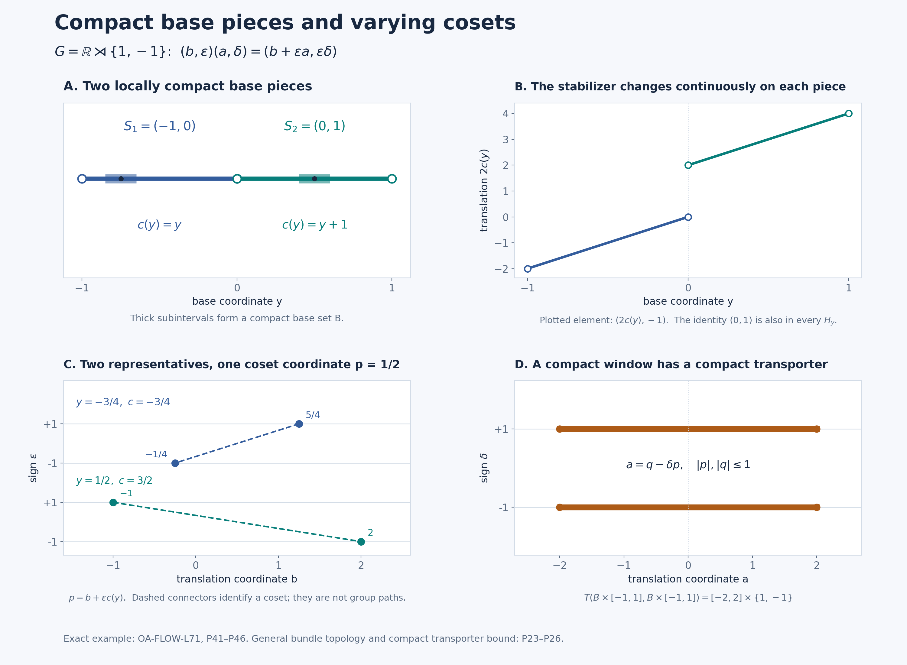

# A proper topology for an integrable orbit model

*Self-checked by the writing AI. Original lesson, figure and reproduction code: CC0-1.0; accompanying font terms retained.*

An orbit decomposition records which points belong together and which measure class each orbit carries. We now give a locally compact topology to that measured model. Compact pieces of the orbit space make the stabilizers vary continuously and keep them inside one compact part of the group. Those two properties produce a proper action.

Throughout, **lcsc** means locally compact Hausdorff with a countable base. We use left Haar measure on \(G\), completed scalar \(L^p\) spaces, and the action convention
\[
 \alpha_gF(x)=F(g^{-1}x).
 \tag{P1}
\]
An action on a Hausdorff space \(\Gamma\) is **proper** if
\[
 G\times\Gamma\longrightarrow\Gamma\times\Gamma,\qquad
 (g,z)\longmapsto(gz,z)
 \tag{P2}
\]
has compact inverse images of compact sets.

## The proper-model theorem

Let an lcsc group \(G\) act continuously on an lcsc space \(X\), and let \(\lambda\) be a quasi-invariant Borel probability on \(X\). Thus \(g_*\lambda\) and \(\lambda\) have the same null sets for every \(g\). Suppose the linear span of
\[
 P_b=\left\{f\in L^\infty(X,\lambda)_+:
       x\longmapsto\int_G f(g^{-1}x)\,dg
       \text{ is essentially bounded}\right\}
 \tag{P3}
\]
is ultraweakly dense in \(L^\infty(X,\lambda)\). In (P3), use a bounded nonnegative Borel representative. Quasi-invariance makes a change of representative null for each fixed \(g\); sigma-finite Haar Tonelli then makes the resulting orbit integral independent of that representative almost everywhere.

Then there are an invariant conull Borel set \(X_*\subseteq X\), an lcsc space \(\Gamma\) with a proper continuous \(G\)-action, a full-support quasi-invariant Radon probability \(\mu\) on \(\Gamma\), and an equivariant Borel bijection
\[
 J:X_*\longrightarrow\Gamma
 \tag{P4}
\]
whose inverse is Borel. It pushes \(\lambda|_{X_*}\) to \(\mu\) and induces a normal equivariant star isomorphism, with normal inverse,
\[
 L^\infty(X,\lambda)\cong L^\infty(\Gamma,\mu).
 \tag{P5}
\]
Moreover, \(C_0(\Gamma)\) is separable, invariant, point-norm continuous under \(G\), and ultraweakly dense in \(L^\infty(\Gamma,\mu)\). For every \(F\in C_c(\Gamma)\),
\[
 \mathcal E(F)(z)=\int_G F(g^{-1}z)\,dg
 \quad\text{belongs to }C_b(\Gamma).
 \tag{P6}
\]
These averages are \(G\)-invariant. The topology on \(\Gamma\) is part of the construction; \(J\) is a measured Borel isomorphism.

The earlier [Haar-class orbit decomposition](OA-FLOW-L69.md#oa-flow.orbits.selector) supplies an invariant conull Borel set \(X_0\subseteq X\), a Borel subset \(Y\) of a compact metric cube \(Q\), and Borel maps
\[
 q:X_0\to Y,\qquad s:Y\to X_0,\qquad qs=\mathrm{id}_Y,
 \qquad q^{-1}(y)=Gs(y).
 \tag{P7}
\]
Its [conditional probabilities](OA-FLOW-L69.md#oa-flow.orbits.conditional) give
\[
 \nu=q_*\lambda,\qquad
 \lambda(D)=\int_Y\lambda_y(D)\,d\nu(y),
 \tag{P8}
\]
with \(\lambda_y\) concentrated on \(q^{-1}(y)\) and equivalent to the pushforward of Haar measure by \(g\mapsto gs(y)\). Its [compact-stabilizer conclusion](OA-FLOW-L69.md#oa-flow.orbits.stabilizers) says
\[
 H_y=G_{s(y)}\text{ is compact}.
 \tag{P9}
\]
Replace \(Y\) by the common conull Borel set on which these conclusions hold and \(X_0\) by its inverse image. We may therefore use them for every retained \(y\).

The topological and measure inputs below are [compact cutoffs](OA-FLOW-TOPOLOGY.md#l138-h0), [compact Lusin approximation](OA-FLOW-QF.md#qf-6), [the nested-neighborhood section construction](OA-FLOW-IS.md#is-1), and [finite metric-measure regularity](OA-FLOW-IS.md#is-2). The full \(L^\infty\)-\(L^1\) normal interface is [the scalar multiplier theorem](OA-FLOW-IW.md#iw-1).

## A selection rule with explicit hitting tests

We first record the elementary selection rule used three times below. Every lcsc space \(Z\) has a compatible metric and a countable basis of relatively compact open sets with closure refinement. Here is a direct metric construction. Start with a countable basis. For each pair of basis members whose first closure is compact and lies in the second, choose a continuous compact bump that is one on the first closure and supported in the second. The countable family \((b_j)\), with \(0\le b_j\le1\), separates points and recovers neighborhoods: for \(z\in O\) one of these bumps is one at \(z\) and vanishes off \(O\). Thus
\[
 d_Z(z,z')=\sum_{j\ge1}2^{-j}|b_j(z)-b_j(z')|
 \tag{P10}
\]
is a metric inducing the topology. Small metric balls and compact neighborhood refinement give the stated basis. Every open subset of \(Z\) has a countable compact cover: cover it by relatively compact open sets with closures inside that subset and extract a countable subcover using the basis.

**Selection rule.** Let \(B\) be a measurable parameter space. Suppose \(F_b\subseteq Z\) is nonempty and closed for every \(b\), and
\[
 \{b:F_b\cap U\ne\varnothing\}
 \tag{P11}
\]
is measurable for every open \(U\subseteq Z\). Then there is a measurable choice \(v(b)\in F_b\). If a prescribed open set meets every fiber on a measurable part of \(B\), the choice on that part can be made inside that open set.

To prove this, choose a countable relatively compact basis \((U_j)\), and fix \(a_j\in U_j\). Choose the first \(U_{j_1(b)}\) meeting \(F_b\) and having diameter below \(1/2\), with its closure inside the prescribed open set if one is given. Recursively choose the first \(U_{j_{k+1}(b)}\) satisfying
\[
 F_b\cap U_{j_{k+1}(b)}\ne\varnothing,\quad
 \overline{U_{j_{k+1}(b)}}\subset U_{j_k(b)},\quad
 \operatorname{diam}U_{j_{k+1}(b)}<2^{-k-1}.
 \tag{P12}
\]
Such a neighborhood exists around a point of the preceding intersection. The hitting tests are measurable; closure inclusion and diameter are tests on fixed basis members. Partitioning by the previous index shows inductively that every selected index is measurable.

The points \(a_{j_k(b)}\) form a Cauchy sequence inside the compact set \(\overline{U_{j_1(b)}}\), so they converge. For clarity, a sequence in a compact metric space has a convergent subsequence: otherwise each point would have a neighborhood containing only finitely many sequence indices, and a finite subcover would contradict infinitude; a cluster point gives the subsequence by successively smaller balls. The Cauchy property then gives convergence of the whole sequence.

Choose a point of \(F_b\) in each selected basis member. Its distance from \(a_{j_k(b)}\) tends to zero. Closedness of \(F_b\) puts the limit \(v(b)\) in that fiber. The nested closures also keep it in every preceding selected open set, including the prescribed one. For each nonempty closed \(C\subseteq Z\),
\[
 v(b)\in C
 \Longleftrightarrow
 \lim_k d_Z(a_{j_k(b)},C)=0.
 \tag{P13}
\]
The right side is measurable; the empty closed set is immediate. Closed sets generate the Borel sigma-algebra, proving the rule.

## Measurable stabilizers and compact control

For the original continuous action, the stabilizer graph
\[
 \mathcal H=\{(g,x)\in G\times X:gx=x\}
 \tag{P14}
\]
is closed. If \(U\subseteq G\) is open, take a compact cover \(U=\bigcup_mC_m\). Then
\[
 \{x:G_x\cap U\ne\varnothing\}
 =
 \bigcup_m\operatorname{pr}_X
 \bigl(\mathcal H\cap(C_m\times X)\bigr)
 \tag{P15}
\]
is Borel. Each projection in this union is closed: for a point outside it, compactness of \(C_m\) gives a neighborhood whose product with \(C_m\) misses the graph. Pulling (P15) back through \(s\) gives Borel hitting tests for \(H_y\).

Applying the selection rule inside the \(n\)-th basis member of \(G\), and taking the identity when that member misses the subgroup, gives Borel maps
\[
 h_n:Y\to G,\qquad h_n(y)\in H_y,\qquad
 \overline{\{e,h_1(y),h_2(y),\ldots\}}=H_y.
 \tag{P16}
\]
Indeed every nonempty relatively open subset of \(H_y\) meets a basis member contained in the corresponding ambient open set. Its selector lies in that subset. This retains a measurable dense sequence in the whole stabilizer, not just one representative.

Choose increasing compact sets \(K_n\subseteq G\) whose interiors cover \(G\). They can be obtained by finite unions of closures of a countable relatively compact open cover. The condition \(H_y\subseteq K_n\) is Borel, since its complement is the hitting condition for \(G\setminus K_n\). Compactness of \(H_y\) makes it lie in some \(K_n\). Partition \(Y\) into Borel sets \(Y_n\) according to the first such \(n\).

On \(Y_n\), view \(H_y\) as a nonempty compact subset of the compact metric space \(K_n\), with Hausdorff distance
\[
 d_{\rm H}(A,B)=
 \max\left\{\sup_{a\in A}d(a,B),\
              \sup_{b\in B}d(b,A)\right\}.
 \tag{P17}
\]
The stabilizer map is Borel for this metric. The lower tests \(H_y\cap U\ne\varnothing\), for \(U\) relatively open in \(K_n\), were just proved Borel. For the upper test \(H_y\subset U\), write \(F=K_n\setminus U\). If \(F\ne\varnothing\), that condition is the union over \(m\) of the conditions that \(H_y\) miss the relatively open \(1/m\)-neighborhood of \(F\). A compact subset of \(U\) has positive distance from \(F\); conversely missing one such neighborhood implies disjointness from \(F\). If \(F=\varnothing\), the condition is automatic. These are Borel tests.

The finite upper and lower tests give the Hausdorff topology. For one direction, compactness supplies a finite cover of a compact set by small balls, so finitely many lower hits and one upper containment control the Hausdorff distance. For the other, a sufficiently small Hausdorff perturbation preserves each lower hit and each upper containment. Countable ball centers and radii give a countable base.

We also have finite approximations. A finite \(\epsilon\)-net in \(K_n\) gives a finite \(\epsilon\)-net of its compact subsets by taking all nonempty subsets of that point net. For a given compact set, use precisely those net points at distance below \(\epsilon\) from it; both Hausdorff bounds follow. Consequently the stabilizer field has finite-valued Borel approximants converging uniformly in \(d_{\rm H}\).

To apply QF6 in its Hilbert-valued form, enumerate a countable dense family \((A_r)\) of these finite sets. Since the metric (P10) is bounded, the map
\[
 H\longmapsto\bigl(2^{-r}d_{\rm H}(H,A_r)\bigr)_{r\ge1}
 \quad\text{into }\ell^2
 \tag{P18}
\]
is continuous and injective, and its inverse on its image is continuous. For the inverse statement, choose \(A_r\) close to a fixed \(H\); convergence of the \(r\)-th coordinate and two triangle inequalities force nearby coded sets to be close to \(H\). The finite approximants give finite-valued Hilbert-valued approximants. Thus compact Lusin approximation applies to this actual Borel map.

## Giving the base a locally compact topology

Extend \(\nu|_{Y_n}\) to the compact metric cube \(Q\) by giving \(Q\setminus Y_n\) measure zero. This is a finite Borel measure, hence Radon by the finite metric regularity proof in IS2. Inner regularity and QF6 give compact sets
\[
 C_{n,j}\subseteq Y_n,\qquad C_{n,j}\subseteq C_{n,j+1},\qquad
 \nu\left(Y_n\setminus\bigcup_j C_{n,j}\right)=0
 \tag{P19}
\]
on each of which \(y\mapsto H_y\) is Hausdorff-continuous. To see all qualifications, choose compact carriers inside \(Y_n\), then compact Lusin subsets omitting mass tending to zero. Replace those subsets by their finite unions to make them increasing. A function continuous on finitely many closed pieces is continuous on their union: inverse images of closed sets are finite unions of closed sets.

Put
\[
 D_{n,j}=C_{n,j}\setminus C_{n,j-1},
 \qquad C_{n,0}=\varnothing.
 \tag{P20}
\]
This is open in a compact metric space and therefore lcsc. Restrict its finite measure to its support \(S_{n,j}\). Explicitly, discard the union of all zero-measure members of a countable basis of \(D_{n,j}\). The discarded open set has measure zero. Its complement \(S_{n,j}\) is closed in \(D_{n,j}\), is lcsc, and has full support for its restricted measure: an open neighborhood of a retained point cannot have measure zero. Empty components are omitted.

Define
\[
 S=\coprod_{n,j}S_{n,j},\qquad
 Y_*=\bigcup_{n,j}S_{n,j}\subseteq Y.
 \tag{P21}
\]
The first union is topological disjoint union; the second uses the original Borel subsets of \(Q\). Their evident bijection is Borel in both directions, since there are countably many components and each has its subspace Borel structure. We use the letter \(y\) for the corresponding point in either space.

The space \(S\) is lcsc. Its measure, still denoted \(\nu\), has total mass one and full support. It is Radon: on any lcsc metric space the finite closed/open approximations from IS2, intersected with a countable compact exhaustion, give compact inner approximation, and finite inner approximation gives outer regularity by taking complements. On each open-and-closed component \(S_i=S_{n,j}\), the stabilizer field is continuous and
\[
 H_y\subseteq K_n\qquad(y\in S_i).
 \tag{P22}
\]
These are the two controls needed for the topology of the coset bundle.

## The varying cosets form a proper space

For one component \(S_i=S_{n,j}\), set
\[
 \Gamma_i=(S_i\times G)/\!\sim,\qquad
 (y,a)\sim(y,b)\Longleftrightarrow a^{-1}b\in H_y,
 \tag{P23}
\]
and let \(p_i:S_i\times G\to\Gamma_i\) be the quotient map. Its points are written \([y,a]\); its fiber over \(y\) is the set of right cosets \(G/H_y\).

The relation is closed. If related pairs converge, their base coordinates have the same limit, their group differences converge, and Hausdorff continuity of \(H_y\) puts the limiting difference in the limiting subgroup. The quotient map is open. It suffices to consider a rectangle \(U\times V\). A point in its saturation has the form \((y_0,b_0)\), where \(b_0=a_0h_0\), \(a_0\in V\) and \(h_0\in H_{y_0}\). For nearby \(y\), Hausdorff continuity supplies \(h\in H_y\) close to \(h_0\). For nearby \(b\), continuity of multiplication gives \(bh^{-1}\in V\). Taking \(y\) inside \(U\) shows that the saturation contains a neighborhood of \((y_0,b_0)\).

The quotient is Hausdorff. For inequivalent representatives choose product neighborhoods whose product misses the closed relation. Their open quotient images are disjoint, since an intersection would give related representatives in the chosen neighborhoods. Images of a countable basis form a countable basis. If \(O\) is a relatively compact source neighborhood, \(p_i(O)\) is an open neighborhood whose closure lies in the compact, hence closed, set \(p_i(\overline O)\). Thus \(\Gamma_i\) is locally compact and is lcsc.

The action
\[
 g[y,a]=[y,ga]
 \tag{P24}
\]
is well-defined and jointly continuous. Multiplication gives a continuous map on \(G\times S_i\times G\); the product of \(p_i\) with the identity is an open quotient map, as follows from the images of product rectangles. Hence the continuous map descends.

We prove properness with an explicit transporter bound. Let \(A,B\subseteq\Gamma_i\) be compact. Cover each by finitely many open images of relatively compact source rectangles. The union of the compact group-coordinate closures in those rectangles gives compact sets \(P_A,P_B\subseteq G\) such that every point of \(A\), respectively \(B\), has a representative with group coordinate in \(P_A\), respectively \(P_B\).

If \(gA\cap B\ne\varnothing\), choose such representatives \([y,a]\in A\) and \([y,b]=g[y,a]\in B\). Then \(b^{-1}ga\in H_y\), so
\[
 T(B,A):=\{g:gA\cap B\ne\varnothing\}
 \subseteq P_BK_nP_A^{-1}.
 \tag{P25}
\]
The transporter is closed. If \(g_m\in T(B,A)\) converges to \(g\), select witnesses \(z_m\in A\) with \(g_mz_m\in B\). Compactness of the metric space \(A\) gives a convergent subsequence. Continuity and closedness of \(B\) put \(gz\) in \(B\), so \(g\in T(B,A)\). Since \(G\) is metrizable, this sequential test proves closedness. The right side of (P25) is compact, hence so is the transporter.

For a compact \(C\subseteq\Gamma_i\times\Gamma_i\), let \(B,A\) be its coordinate projections. The inverse image of \(C\) under (P2) is a closed subset of the compact set \(T(B,A)\times A\). It is compact. This proves properness.

Finally put
\[
 \Gamma=\coprod_i\Gamma_i.
 \tag{P26}
\]
It is lcsc, and the action is proper. A compact set meets only finitely many open-and-closed components, since those components form an open cover. The inverse image of a compact subset of \(\Gamma\times\Gamma\) is therefore a finite union of the compact inverse images just proved; pairs in different components have empty inverse image.

## Both directions of the Borel isomorphism

Let \(X_*=q^{-1}(Y_*)\). It is invariant, Borel and conull. We first choose a Borel transporter \(a_x\in G\) satisfying
\[
 a_xs(q(x))=x.
 \tag{P27}
\]
This choice needs a new hitting calculation, since the section \(s\) need not be continuous.

For a nonempty compact \(C\subseteq G\), the function
\[
 (z,x)\longmapsto \min_{g\in C}d_X(gz,x)
 \tag{P28}
\]
is continuous. Fixing a minimizer gives the upper limit inequality. For the lower inequality, first pass to a subsequence realizing the lower limit of the minimum values. Its minimizers have a further convergent subsequence in \(C\), and joint continuity gives the limiting value at least the minimum at the limiting pair. The domain is metrizable, so these two sequential inequalities prove continuity. The minimum is attained by compactness.

Cover an open \(U\subseteq G\) by nonempty compact sets \(C_m\subseteq U\), ignoring empty members. Then
\[
 \begin{aligned}
 &\{x:\exists g\in U,\ gs(q(x))=x\}\\
 &\qquad=
 \bigcup_m\left\{x:
    \min_{g\in C_m}d_X(gs(q(x)),x)=0\right\}.
 \end{aligned}
 \tag{P29}
\]
The right side is Borel, since \(s\circ q\) is Borel and (P28) is continuous. The transporter fibers in (P27) are nonempty and closed. The selection rule therefore gives a Borel \(x\mapsto a_x\).

Define
\[
 J(x)=[q(x),a_x].
 \tag{P30}
\]
The map \(q(x)\) into the refined base \(S\) is Borel by (P21), so \(J\) is Borel. A different transporter \(b_x\) has \(a_x^{-1}b_x\in H_{q(x)}\), hence gives the same coset. The map is onto: \([y,a]\) is the image of \(as(y)\). It is one-to-one, since equivalent representatives carry \(s(y)\) to the same point. Also \(ga_x\) is a transporter for \(gx\), so the independence just proved yields \(J(gx)=gJ(x)\).

We verify the inverse's Borel property directly. Each \(p_i:S_i\times G\to\Gamma_i\) is an open continuous surjection between lcsc spaces and has closed fibers. For an open source set \(U\), the fiber-hitting set is exactly \(p_i(U)\), which is open. The selection rule gives a Borel section \(b_i:\Gamma_i\to S_i\times G\). The Borel function
\[
 (y,a)\longmapsto as(y)
 \tag{P31}
\]
is constant on the equivalence classes and, after composition with \(b_i\), is \(J^{-1}|_{\Gamma_i}\). A countable union over the components proves that \(J^{-1}\) is Borel on all of \(\Gamma\). Thus neither Borel direction rests on an assertion about images of arbitrary Borel maps.

## The transported measure has full support

Set
\[
 \mu=J_*(\lambda|_{X_*}).
 \tag{P32}
\]
It is a Borel probability. Equivariance and quasi-invariance of \(\lambda\) make it quasi-invariant. It is Radon by finite metric regularity and a compact exhaustion of the lcsc space \(\Gamma\).

To prove full support, take a nonempty open \(O\subseteq\Gamma_i\). Its inverse image under \(p_i\) contains a nonempty rectangle \(U\times V\), with \(U\subseteq S_i\), \(V\subseteq G\) open. Full support of the base measure gives \(\nu(U)>0\). For each \(y\in U\), the set of \(g\) for which \(gs(y)\in J^{-1}(O)\) contains \(V\). Haar measure gives \(V\) positive measure. Since \(\lambda_y\) has exactly the Haar-pushforward null sets, \(\lambda_y(J^{-1}(O))>0\). Integrating (P8) gives
\[
 \mu(O)=\int_Y\lambda_y(J^{-1}(O))\,d\nu(y)>0.
 \tag{P33}
\]
The integral is positive because a nonnegative measurable function positive on a set of positive measure has positive integral: some positive level set \(\{f>1/n\}\) has positive measure. This proves full support.

Borel null sets correspond under \(J\) and \(J^{-1}\), and hence so do their completed null ideals. The change-of-variables map
\[
 V:L^2(\Gamma,\mu)\longrightarrow L^2(X_*,\lambda),
 \qquad VF=F\circ J
 \tag{P34}
\]
is a unitary, with inverse composition by \(J^{-1}\). The same formulas are onto isometries on \(L^1\). Therefore the pullback
\[
 \Theta:L^\infty(\Gamma,\mu)\longrightarrow L^\infty(X_*,\lambda),
 \qquad \Theta(F)=F\circ J
 \tag{P35}
\]
is a normal star isomorphism with normal inverse: its preadjoint is the \(L^1\) map \(k\mapsto k\circ J^{-1}\), as direct integration shows. The scalar multiplier theorem identifies the \(L^1\) spaces on \(X\) and \(\Gamma\) with their actual concrete preduals. Restriction from \(X\) to its conull Borel subset \(X_*\) is a unitary on \(L^2\), an onto isometry on \(L^1\), and a normal identification of the multiplier algebras; its inverse extends functions by zero on the discarded null set. This supplies the same predual identification on \(X_*\) without a local-compactness claim for that subset. Equivariance follows from \(J(gx)=gJ(x)\), proving (P5).

## Properness makes compact averages continuous and bounded

Let \(F\in C_c(\Gamma)\) and \(K=\operatorname{supp}F\). Choose a compact neighborhood \(L\) of \(z_0\). For \(z\in L\),
\[
 F(g^{-1}z)\ne0\Longrightarrow
 g\in T(L,K)=\{g:gK\cap L\ne\varnothing\}.
 \tag{P36}
\]
This transporter is compact by properness. Thus the integral in (P6) is absolutely convergent on \(L\). The integrand is continuous on the compact product \(T(L,K)\times L\). Uniform continuity on this compact metric product shows that its integral varies continuously with \(z\) near \(z_0\): the integral difference is bounded by the finite Haar measure of \(T(L,K)\) times the supremum of the integrand difference. Hence \(\mathcal E(F)\) is continuous everywhere.

Left Haar substitution gives invariance:
\[
 \mathcal E(F)(az)
 =\int_G F(g^{-1}az)\,dg
 =\int_G F(h^{-1}z)\,dh
 =\mathcal E(F)(z).
 \tag{P37}
\]
If the average is nonzero on an orbit, that orbit meets \(K\). Its value is therefore a value at a point of \(K\), where the continuous function \(\mathcal E(F)\) is bounded. It is zero on every orbit missing \(K\). This proves the global bound and (P6), including complex-valued \(F\).

Here are the \(C^*\)-algebra consequences in full. Compact cutoffs show that \(C_c(\Gamma)\) is norm dense in \(C_0(\Gamma)\). A countable family of compact bumps as in (P10), with rational complex star polynomials, is norm dense: adjoin constants on the one-point compactification, apply [continuous polynomial density](OA-FLOW-CF.md#oa-flow.cf.5), and subtract the value at infinity. Hence \(C_0(\Gamma)\) is separable.

It is invariant because each group element is a homeomorphism. Its action is point-norm continuous. For \(F\in C_c(\Gamma)\), take a compact identity neighborhood \(W\subseteq G\). The compact set \(WK\cup K\) contains every support relevant to \(F(g^{-1}\,\cdot)-F\) for \(g\in W\). Joint continuity on that compact set makes
\[
 \|F(g^{-1}\,\cdot)-F\|_\infty\longrightarrow0
 \quad(g\to e).
 \tag{P38}
\]
Uniform approximation by \(C_c\) and the isometric action extend this to every \(F\in C_0\); the group law gives continuity at every group element.

Full support of \(\mu\) makes the multiplication representation of \(C_0(\Gamma)\) faithful: a nonzero continuous function is bounded away from zero on a nonempty open set. The scalar multiplier theorem gives
\[
 C_0(\Gamma)''=L^\infty(\Gamma,\mu).
 \tag{P39}
\]
This is ultraweak density in the actual normal representation. Since \(|F|\in C_c(\Gamma)\), (P6) puts \(C_c(\Gamma)\) in the bounded absolute-averaging domain. Thus that domain meets \(C_0(\Gamma)\) in a norm-dense subspace, proving all the theorem's conclusions.

## The conclusion for an abstract abelian system

Let \(M\ne0\) be abelian with separable predual, and let an lcsc group act point-ultraweakly continuously on \(M\). Suppose the positive elements with bounded positive Haar average have ultraweakly dense linear span. The [continuous-model theorem and domain transport](OA-FLOW-L72.md#oa-flow.model.transport) gives an lcsc action space \(X\), a full-support quasi-invariant Radon probability \(\lambda\), and precisely the hypothesis (P3). Its [normal equivariant identification](OA-FLOW-L72.md#oa-flow.model.normal), followed by (P35), gives
\[
 M\cong L^\infty(\Gamma,\mu)
 \tag{P40}
\]
normally and equivariantly, with normal inverse, where \(G\curvearrowright\Gamma\) is proper. The inverse image of \(C_0(\Gamma)\) in \(M\) is separable, invariant, point-norm continuous and ultraweakly dense, with a norm-dense compactly supported domain whose averages are bounded continuous functions on \(\Gamma\).

The zero algebra is represented by the empty space with zero measure. No probability state is assigned to that case. The conclusions here use the stated lcsc and separable-predual hypotheses; they concern the orbit model and its topology.

## Reflections with a varying fixed point

An explicit example shows the coordinates in the bundle. Let
\[
 G=\mathbb R\rtimes\{1,-1\},\qquad
 (b,\epsilon)(a,\delta)=(b+\epsilon a,\epsilon\delta).
 \tag{P41}
\]
Expanding either association of three factors gives translation coordinate \(b+\epsilon a+\epsilon\delta c\) and sign \(\epsilon\delta\eta\). The identity is \((0,1)\), and the inverse of \((b,\epsilon)\) is \((-\epsilon b,\epsilon)\). This is the isometry group of the line, acting by \(p\mapsto b+\epsilon p\). Give the sign group the discrete topology; its group operations are continuous. The product of Lebesgue measure in \(b\) and counting measure in \(\epsilon\) is left Haar: left multiplication translates and possibly reflects the real coordinate and permutes the two signs.

Take \(S=(-1,0)\coprod(0,1)\), with base probability \(\tfrac12\,dy\), and set
\[
 c(y)=
 \begin{cases}y,&-1<y<0,\\y+1,&0<y<1,\end{cases}
 \qquad
 H_y=\{(0,1),(2c(y),-1)\}.
 \tag{P42}
\]
The second element squares to the identity by (P41); it is reflection about \(c(y)\). Thus \(H_y\) is a compact subgroup of order two. It varies continuously on each base component. On the first it lies in the compact set consisting of \((0,1)\) and \([-2,0]\times\{-1\}\); on the second use \((0,1)\) and \([2,4]\times\{-1\}\).

The quotient coordinates are
\[
 [y,(b,\epsilon)]\longmapsto(y,p),\qquad
 p=b+\epsilon c(y),
 \tag{P43}
\]
giving a homeomorphism \(\Gamma\cong S\times\mathbb R\). The formula is continuous and constant on right cosets; its continuous inverse is \((y,p)\mapsto[y,(p-c(y),1)]\). To check injectivity, the elements of \(G\) fixing \(c(y)\) are exactly the two elements of \(H_y\). Thus two representatives have the same value of \(p\) exactly when they belong to the same coset. The action becomes
\[
 (a,\delta)(y,p)=(y,a+\delta p).
 \tag{P44}
\]
For a compact base set \(B\subset S\) and \(R\ge0\), every group element transporting a point of \(B\times[-R,R]\) back into that set satisfies \(|a|\le2R\), by \(a=q-\delta p\). Conversely every \(|a|\le2R\), for either sign, has such witnesses when \(B\ne\varnothing\). Hence its transporter is exactly the compact set
\[
 [-2R,2R]\times\{1,-1\}.
 \tag{P45}
\]

The probability
\[
 d\mu(y,p)=\tfrac14 e^{-|p|}\,dy\,dp
 \tag{P46}
\]
has full support on \(S\times\mathbb R\), since its density is strictly positive and each open rectangle has positive Lebesgue measure. It has mass one because \(S\) has length two and \(\int_{\mathbb R}e^{-|p|}\,dp=2\), by the elementary exponential integral. It is quasi-invariant under (P44): translation and reflection preserve Lebesgue null sets, and the density is everywhere positive. This example displays a varying compact stabilizer field and its exact coset coordinates.

## The compact pieces and the coset coordinates

[Full-size figure](../assets/measure-models/proper/proper-coset-model.png), [editable SVG](../assets/measure-models/proper/proper-coset-model.svg), [reproduction code](../assets/measure-models/proper/render_proper_cosets.py), [exact coordinate data](../assets/measure-models/proper/figure-data.json).

The figure uses the exact group (P41) and field (P42). The upper-left panel distinguishes the two open base intervals; the point zero is excluded. The thick subintervals are the compact set \(B=[-17/20,-13/20]\cup[2/5,3/5]\). This is a finite explicit instance of the base-piece mechanism (P19)–(P22), whose proof permits countably many pieces. The upper-right panel plots the nonidentity stabilizer element's translation coordinate \(2c(y)\); its sign coordinate is \(-1\) throughout, while the identity \((0,1)\) is also in every stabilizer.

The lower-left panel uses \(p=1/2\). At \(y=-3/4\), the two representatives are \((5/4,1)\) and \((-1/4,-1)\); at \(y=1/2\), they are \((-1,1)\) and \((2,-1)\). In both cases (P43) gives the same quotient coordinate \(p=1/2\) in the indicated fiber. Dashed segments join representatives of one coset; they are not paths in the disconnected group. The lower-right panel takes \(R=1\) in (P45), so the translation coordinate of the transporter is exactly \([-2,2]\), for each of its two signs. The numerical samples illustrate the coordinate formulas; (P25) proves the general compact transporter bound.

## Exercises with solutions

**1. Why do both continuity of \(H_y\) and containment in a fixed compact \(K_n\) appear in the proof?**

Continuity makes the relation closed and the quotient map open, hence gives the locally compact Hausdorff bundle topology. Uniform compact containment supplies the transporter bound (P25). Pointwise compactness alone would not supply one compact bound for witnesses over a compact set of base parameters.

**2. Can the two Borel directions in (P4) be replaced by the statement that \(J\) is bijective?**

No. Pulling back measurable functions and pushing forward measures require measurable maps. The forward direction uses the compact minimum test (P29); the inverse uses a Borel section of each open quotient map. These are separate verifications, both completed above.

**3. Why does continuity of the orbit average give a global bound even if \(\Gamma\) is noncompact?**

Its nonzero values occur on orbits meeting \(K=\operatorname{supp}F\). Invariance moves each such value to \(K\), and continuity bounds the values on that compact set. The average is zero on all remaining orbits.

For the classical integrable-action setting and orbit-space problem, see M. Takesaki, [*Theory of Operator Algebras II*](https://doi.org/10.1007/978-3-662-10451-4), §X.4, especially pp.306–307. The proofs above construct the compact base pieces, proper bundle and measured conjugacy explicitly.
