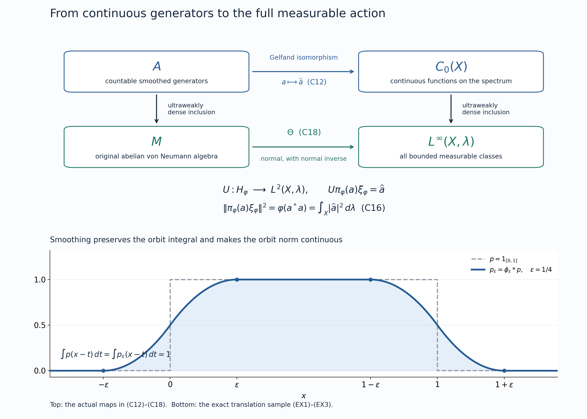

# A continuous spectrum for an integrable abelian action

*Self-checked by the writing AI.*

A group action on an abelian von Neumann algebra can be realized by homeomorphisms of a locally compact space. The construction below chooses a countable family of positive elements with bounded orbit averages, smooths their orbits, and takes the spectrum of the resulting C* algebra. A faithful normal state then supplies the measure. We prove the normal identification with the entire measurable-function algebra, including the action and its full bounded averaging domain.

**Continuous-model theorem.** Let \(G\) be a locally compact second-countable Hausdorff group with left Haar measure \(dg\). Let \(M\ne0\) be an abelian von Neumann algebra with separable predual, carrying a point-ultraweakly continuous action \(\alpha:G\to\operatorname{Aut}(M)\) by normal automorphisms. Suppose the positive bounded averaging cone \(P_b\), defined below, has ultraweakly dense complex linear span. There exist an invariant norm-separable C* subalgebra \(A\subseteq M\), not required to be unital, a locally compact second-countable Hausdorff space \(X\), a jointly continuous action of \(G\) on \(X\), and a full-support quasi-invariant Radon probability \(\lambda\) such that
\[
 A\cong C_0(X),\qquad
 \Theta:M\xrightarrow{\ \cong\ }L^\infty(X,\lambda),\qquad
 \Theta(\alpha_g(a))(x)=\Theta(a)(g^{-1}x).
 \tag{CM}
\]
The isomorphism \(\Theta\) and its inverse are normal, and its restriction to \(A\) is the Gelfand transform. The algebra \(A\) is ultraweakly dense in \(M\), its action is point-norm continuous, and its bounded averaging domain is norm dense. In fact every \(f\in C_c(X)\) belongs to that domain. For every positive \(a\in M\), the abstract bounded-average condition is exactly essential boundedness of the measurable orbit integral of \(\Theta(a)\).

We use the earlier [concrete predual](OA-FLOW-CP.md#oa-flow.cp.6), [bounded density theorem](OA-FLOW-BD.md#oa-flow.bd.4), compact predual balls, [normal GNS representation](OA-FLOW-STC.md#oa-flow.st.coefficient), Gelfand calculus, [Radon representation](OA-FLOW-HR.md#hr-02), and [scalar multiplication algebra](OA-FLOW-IW.md#iw-1). The particular uses are identified in the proof.

## Bounded averages and an increasing integrable net

This section allows an arbitrary von Neumann algebra \(M\), an arbitrary locally compact Hausdorff group \(G\), and the same continuity assumption on \(\alpha\). Neither commutativity nor a countability hypothesis is needed here. For compact \(K\subseteq G\) and \(a\in M_+\), put
\[
 E_K(a)=\int_K\alpha_g(a)\,dg,\qquad
 P_b=\left\{a\in M_+:\sup_{K\subseteq G\ \text{compact}}
                         \|E_K(a)\|<\infty\right\}.
 \tag{C1}
\]
The integral is ultraweak: on \(\omega\in M_*\) it has value \(\int_K\omega(\alpha_g(a))\,dg\). This defines an element of \(M=(M_*)^*\), with norm at most \(m(K)\|a\|\), by [CP6](OA-FLOW-CP.md#oa-flow.cp.6). Positive vector tests make it positive. The compact sets are directed by inclusion, since a finite union of compact sets is compact.

For \(a\in P_b\) the increasing net \(E_K(a)\) has a bounded supremum, denoted \(E(a)\), and converges strongly and ultraweakly to it. Here is the operator argument for the monotone completeness used throughout this lesson. If \(0\le x_i\uparrow\) and \(\|x_i\|\le C\), the limits of \(\langle x_i\xi,\xi\rangle\), polarized, define a bounded positive operator \(x\) by the Hilbert representation theorem. It lies in \(M=M''\), since the limiting form commutes with every operator in \(M'\). It is the least upper bound, and
\[
 \|(x-x_i)\xi\|^2\le C\langle(x-x_i)\xi,\xi\rangle\longrightarrow0.
 \tag{D1}
\]
The inequality follows from continuous calculus for \(0\le x-x_i\le C1\). Bounded strong convergence is ultraweak convergence by [BD5](OA-FLOW-BD.md#oa-flow.bd.5). Conversely, a bounded positive supremum bounds every \(E_K(a)\). Thus (C1) is precisely the bounded positive integral condition.

The cone \(P_b\) is closed under addition and nonnegative scaling and is hereditary: \(0\le b\le a\in P_b\) implies \(E_K(b)\le E_K(a)\), hence \(b\in P_b\). We will use the following equivalent density tests:

1. \(\operatorname{span}_{\mathbb C}P_b\) is ultraweakly dense in \(M\).
2. The support projections of the elements of \(P_b\) have join \(1\).
3. There is an increasing net \(e_i\in P_b\), with \(0\le e_i\le1\), converging strongly to \(1\).
4. There is a net in \(P_b\) converging ultraweakly to \(1\).

For clarity, the support \(s(a)\) of a positive operator is the projection onto \(\overline{aH}\) in a faithful normal representation. It belongs to \(M\): that closed subspace reduces \(M'\). Joins of support projections are obtained by taking the closed span of their ranges; the same argument puts the join in \(M\).

**Proof of the equivalence.** If (1) holds and \(q=\bigvee_{a\in P_b}s(a)\), multiplication by \(1-q\) kills the dense span. Multiplication is ultraweakly continuous, as follows by multiplying the vectors in [CP4's vector series](OA-FLOW-CP.md#oa-flow.cp.4). It therefore kills \(1\), so \(q=1\). The same reasoning applied just to a net tending to \(1\) proves (4) implies (2).

Assume (2). Direct pairs \((F,n)\), with \(F\subset P_b\) finite and \(n\ge1\) integral, by inclusion and increase, and set
\[
 b_{F,n}=n\sum_{a\in F}a,\qquad
 e_{F,n}=b_{F,n}(1+b_{F,n})^{-1}
        =1-(1+b_{F,n})^{-1}.
 \tag{D2}
\]
Continuous calculus gives \(0\le e_{F,n}\le1\) and \(e_{F,n}\le b_{F,n}\), so heredity puts \(e_{F,n}\) in \(P_b\). The net is increasing even when its terms do not commute. Indeed, for invertible positive \(B\le C\), the operator \(D=B^{-1/2}CB^{-1/2}\) satisfies \(D\ge1\); calculus gives \(D^{-1}\le1\), and conjugation gives \(C^{-1}\le B^{-1}\). Apply this to \(1+b_{F,n}\).

For fixed \(a\ge0\), the contractions \(na(1+na)^{-1}\) vanish on \(\ker a\) and converge to the identity on \(\overline{aH}\). To prove the latter directly, on vectors \(a\eta\) the norm of the difference is at most \(\|\eta\|/n\), since \(\|a(1+na)^{-1}\|\le1/n\); density and contractivity finish the proof. Consequently the supremum of (D2) dominates every \(s(a)\), and so equals \(1\). The monotone argument (D1) gives (3), which implies (4).

Finally assume (3). Calculus gives \((1-e_i^{1/2})^2\le1-e_i\), so \(e_i^{1/2}\to1\) strongly. For every \(x\in M_+\),
\[
 0\le e_i^{1/2}xe_i^{1/2}\le\|x\|e_i,
 \qquad e_i^{1/2}xe_i^{1/2}\longrightarrow x
 \quad\text{strongly and ultraweakly}.
 \tag{D3}
\]
The convergence is bounded strong convergence: expand the difference as
\(e_i^{1/2}x(e_i^{1/2}-1)+(e_i^{1/2}-1)x\) on each vector. Heredity puts all these positive compressions in \(P_b\). Positive and negative parts of the real and imaginary parts of an arbitrary element, supplied by CF7, prove (1). This completes all four implications. \(\square\)

In particular the bounded-cone density hypothesis can be expressed by an increasing integrable contraction net. This assertion concerns bounded orbit averages and needs no theorem about arbitrary unbounded operator-valued weights.

## A countable family that generates and has full support

From now on impose the continuous-model theorem's hypotheses: \(M\ne0\) is abelian with separable predual, \(G\) is second-countable, and the equivalent conditions above hold.

First construct a faithful normal state. The normal state space is a separable metric subspace of \(M_*\): a countable base of the ambient separable normed space gives a countable dense subset by selecting one state from each base member that meets it. Let \((\omega_j)\) be such a sequence, repeating states if needed, and put \(\varphi=\sum_{j\ge1}2^{-j}\omega_j\). This is a normal state because the series converges in the norm-closed predual. For \(0\ne a\ge0\), a normal vector state has positive value on \(a\). A sufficiently close \(\omega_j\) still has positive value, so \(\varphi(a)>0\). Thus \(\varphi\) is faithful.

We next choose \(p_j\in P_b\) satisfying both
\[
 W^*(p_j:j\ge1)=M,\qquad \bigvee_{j\ge1}s(p_j)=1.
 \tag{C2}
\]
Here \(W^*\) denotes unital von Neumann generation. To justify countability, take a norm-dense sequence \((\rho_n)\) in the predual unit ball. On the unit ball of \(M\), the metric
\[
 d(x,y)=\sum_{n\ge1}2^{-n}
       \frac{|\rho_n(x-y)|}{1+|\rho_n(x-y)|}
 \tag{D4}
\]
induces exactly the ultraweak topology. Coordinate convergence implies convergence on every predual functional by norm approximation and the uniform operator bound; convergence of the series follows from its uniform tail bound. The converse is immediate from the same tail bound. The ball is compact by ST1. Finite covers by radius-\(1/n\) balls produce a countable dense set.

The unital algebra \(C^*(1,P_b)\) generates \(M\). [BD4–5](OA-FLOW-BD.md#oa-flow.bd.4) therefore gives bounded ultraweak approximants from it to every point of that countable dense ball. Metrizability permits a sequence of approximants for each point. Approximate every selected element in norm by finite *-polynomials in \(P_b\), with a constant term allowed at this stage. The countably many actual elements of \(P_b\) appearing in these polynomials generate all of \(M\).

For the support condition, let \(q_F=\bigvee_{p\in F}s(p)\), where \(F\subset P_b\) is finite. These projections increase strongly to \(1\) by the domain equivalence. Normality of \(\varphi\) gives finite sets \(F_n\) with \(\varphi(q_{F_n})>1-2^{-n}\). The join of the supports from \(\bigcup_n F_n\) has \(\varphi\)-value one, so its complement is zero by faithfulness. Append this countable family to the generators already chosen. The resulting enumeration proves (C2).

Both requirements matter. In \(\mathbb C^2\), the element \((1,0)\) generates the entire algebra when a unit is adjoined, but its support omits the second coordinate.

## Smoothing and the invariant C* algebra

We use the [left Haar convention of L24](OA-FLOW-L24.md#oa-flow.grp.translations):
\[
 \int_G F(hg)\,dh=\Delta_G(g)^{-1}\int_G F(h)\,dh.
 \tag{C3}
\]
Since \(G\) is locally compact and second-countable, it has a countable cover by relatively compact open sets. Finite unions of their closures give increasing compact sets \(K_n\) whose interiors cover \(G\). Every compact subset is contained in some \(K_n\). Thus [scalar monotone convergence](OA-FLOW-SC.md#sc-04) along this exhaustion computes every positive group integral below. Applying (C3) to each positive normal functional and using [HR5's Tonelli theorem](OA-FLOW-HR.md#hr-05) gives
\[
 E(\alpha_g(p))=\Delta_G(g)^{-1}E(p),\qquad p\in P_b.
 \tag{C4}
\]
In detail, the right-translated compact sets are cofinal, and the corresponding scalar integrals have the displayed supremum. Positive vector tests determine the bounded positive operator. Hence every translate of an element of \(P_b\) still belongs to \(P_b\).

Choose \(\phi_k\in C_c(G)_+\) with integral one and supports shrinking to the identity. A countable neighbourhood base and the [compact cutoff construction](OA-FLOW-TOPOLOGY.md#l138-h0) supply these functions; every nonempty open set has positive Haar measure, so the normalization is possible. Define
\[
 d_{jk}=\int_G\phi_k(g)\alpha_g(p_j)\,dg.
 \tag{C5}
\]
These are positive elements, by [AT5](OA-FLOW-AT.md#oa-flow.at.5). Testing the double positive integral against a positive normal functional, using Tonelli on the sigma-finite Haar product and then (C4), proves
\[
 E(d_{jk})=
 \left(\int_G\phi_k(g)\Delta_G(g)^{-1}\,dg\right)E(p_j).
 \tag{C6}
\]
The factor is finite because \(\phi_k\) has compact support. To justify moving \(\alpha_h\) through (C5), compose its normal predual functional with the defining ultraweak integral. This reduces the entire calculation to the scalar positive double integral. The finite bound in (C6) then bounds every compact average of \(d_{jk}\), so \(d_{jk}\in P_b\).

Left translation of the smoothing variable gives, with no modular factor,
\[
 \|\alpha_h(d_{jk})-d_{jk}\|
 \le\|p_j\|\,\|\phi_k(h^{-1}\,\cdot)-\phi_k\|_1
 \longrightarrow0\quad(h\to e).
 \tag{C7}
\]
Norm continuity of left translation in \(L^1(G)\) was proved in [L24](OA-FLOW-L24.md#oa-flow.grp.translations); the same smoothing estimate is [AT6](OA-FLOW-AT.md#oa-flow.at.6). Point-ultraweak continuity and the shrinking supports imply \(d_{jk}\to p_j\) ultraweakly as \(k\to\infty\): test against \(\omega\in M_*\) and bound the scalar difference by its supremum on \(\operatorname{supp}\phi_k\). It follows that the \(d_{jk}\) generate \(M\) as a unital von Neumann algebra. Their supports also have join one, since a projection annihilating every \(d_{jk}\) annihilates every \(p_j\) by ultraweak continuity of multiplication.

Enumerate the \(d_{jk}\) as \((d_\ell)\), and define
\[
 A=C^*(\alpha_g(d_\ell):g\in G,\ \ell\ge1)
 \quad\text{inside }M,
 \tag{C8}
\]
where no unit is adjoined. The resulting algebra may itself contain \(1\). A countable dense subset of \(G\) suffices in (C8), by (C7) and continuity of every orbit. Rational complex *-polynomials in these countably many elements form a countable norm-dense set, so \(A\) is separable. It is invariant under \(\alpha\). The action is point-norm continuous on finite *-polynomials, by the product estimate and (C7), and hence on \(A\) by norm approximation and isometry of the automorphisms.

To prove nondegeneracy without adjoining a unit, put
\[
 h=\sum_{\ell\ge1}\frac{2^{-\ell}}{1+\|d_\ell\|}d_\ell\in A_+.
 \tag{C9}
\]
This norm-convergent positive sum has support one: \(h\xi=0\) implies \(\langle d_\ell\xi,\xi\rangle=0\) for every \(\ell\), so every \(d_\ell\xi=0\). The joint support condition forces \(\xi=0\). Consequently
\[
 e_n=h(h+n^{-1}1)^{-1}\in A_+,\qquad
 0\le e_n\le1,\qquad e_n\uparrow1\text{ strongly}.
 \tag{C10}
\]
Membership in \(A\) follows from CF9's calculus vanishing at zero; the inverse is computed in \(M\). The strong limit follows by the same range-density argument used after (D2). Thus \(A\) acts nondegenerately. Its bicommutant contains all \(d_\ell\), hence all \(p_j\), and equals \(M\). [BD1 and BD4–5](OA-FLOW-BD.md#oa-flow.bd.1) now prove ultraweak density of \(A\), including bounded strong-star approximation.

In the abelian algebra put
\[
 D_b=\{a\in M:|a|\in P_b\}.
 \tag{C11a}
\]
Commutative calculus gives \(|a+b|\le|a|+|b|\) and \(|ca|\le\|c\||a|\); heredity shows that \(D_b\) is a linear ideal of \(M\). Every generator in (C8) is positive and belongs to \(P_b\). For a nonconstant monomial in these commuting positive generators,
\[
 0\le b_1\cdots b_r\le
       \left(\prod_{j=2}^r\|b_j\|\right)b_1.
 \tag{C11}
\]
Finite linear combinations are dominated in absolute value by the sum of their positive majorants. The defining *-polynomials without constant terms therefore belong to \(D_b\). They are norm dense in \(A\), so \(A\cap D_b\) is norm dense in \(A\). Commutativity is used in this paragraph; the compression proof (D3) is the corresponding argument that remains valid in general von Neumann algebras.

## The spectrum, its action, and a full-support probability

Here is the nonunital form of the Gelfand construction, with its countability and topology explicit. Form the forced unitization \(A^\dagger\) of CF9. Its character space \(K\) is compact Hausdorff, and CF6 identifies \(A^\dagger\) with \(C(K)\). The scalar quotient is a distinguished character \(\infty\in K\). Its kernel is \(A\), so, on setting \(X=K\setminus\{\infty\}\),
\[
 A\xrightarrow{\ a\mapsto\widehat a\ }C_0(X)
 \quad\text{is an isometric onto *-isomorphism}.
 \tag{C12}
\]
Indeed functions on \(K\) vanishing at \(\infty\) restrict to \(C_0(X)\), since their positive absolute-value level sets are compact and avoid \(\infty\). Conversely a function in \(C_0(X)\) extends continuously by zero at \(\infty\), by that same level-set condition. This also covers unital \(A\): the extra character is then isolated and \(X\) is compact.

Choose a norm-dense sequence in \(A^\dagger\). Its character evaluations separate points of \(K\); the uniform bound on characters extends equality on the sequence to equality everywhere. These countably many coordinates embed \(K\) continuously and injectively in a countable product of bounded discs. The metric obtained by the summable coordinate formula of (D4) induces that product topology. Compactness and the Hausdorff property make the embedding a homeomorphism onto its image. A compact metric space has a countable base, obtained from finite \(1/n\)-nets and rational-radius balls. Thus \(K\), and its open subspace \(X\), are second-countable; \(X\) is locally compact Hausdorff by the [compact shrinking argument](OA-FLOW-TOPOLOGY.md#l138-h0).

Define \(gx=x\circ\alpha_{g^{-1}}\) on characters of \(A\). This preserves nonzero characters and gives
\[
 \widehat{\alpha_g(a)}(x)=\widehat a(g^{-1}x).
 \tag{C13}
\]
It is a jointly continuous action. For \(g_i\to g\), \(x_i\to x\), and \(a\in A\),
\[
 \begin{aligned}
 |x_i(\alpha_{g_i^{-1}}a)-x(\alpha_{g^{-1}}a)|
 &\le\|\alpha_{g_i^{-1}}a-\alpha_{g^{-1}}a\|\\
 &\quad+|x_i(\alpha_{g^{-1}}a)-x(\alpha_{g^{-1}}a)|
 \longrightarrow0.
 \end{aligned}
 \tag{C14}
\]
The character topology is exactly the topology tested by these coordinates.

By [HR2](OA-FLOW-HR.md#hr-02), the positive functional \(\varphi|_A\) is integration against a finite Radon measure \(\lambda\) on \(X\). Its mass is one. In fact \(\|\varphi|_A\|\le1\), while (C10), normality, and bounded strong convergence give \(\varphi(e_n)\uparrow1\); HR2 identifies the functional norm with total mass. It has full support: every nonempty open subset contains a nonzero nonnegative compactly supported continuous function by H0. Faithfulness of \(\varphi\) makes its integral strictly positive.

There is also a useful improvement of norm density of the averaging domain:
\[
 C_c(X)\subseteq\widehat{A\cap D_b}.
 \tag{C12a}
\]
To prove it, let \(K_0\subset X\) be compact. Every \(x\in K_0\) has \(\widehat b(x)>0\) for some positive generator \(b=\alpha_g(d_\ell)\): otherwise its character would vanish on every generator, all their *-polynomials, and hence all of \(A\), a contradiction. Finitely many such positivity sets cover \(K_0\). Their generators have a sum \(b\in A\cap P_b\) with \(\widehat b\ge\delta>0\) on \(K_0\), by compactness. If \(f\in C_c(X)\) has support in \(K_0\), then globally
\[
 |f|\le\delta^{-1}\|f\|_\infty\widehat b.
 \tag{C12b}
\]
The inverse Gelfand transform and heredity give (C12a). The empty support case is zero. This proves boundedness of these averages, not continuity of the resulting measurable functions.

## The complete normal identification with measurable functions

Let \((H_\varphi,\pi_\varphi,\xi_\varphi)\) be the GNS representation of \(\varphi\). [ST-C](OA-FLOW-STC.md#oa-flow.st.coefficient) proves that \(\pi_\varphi\) is faithful and normal, and ST2 proves that its image is a von Neumann algebra with normal inverse. On the dense subspace generated by \(A\), prescribe
\[
 U(\pi_\varphi(a)\xi_\varphi)=\widehat a,\qquad a\in A.
 \tag{C15}
\]
This is well-defined and isometric because
\[
 \|\pi_\varphi(a)\xi_\varphi\|^2
 =\varphi(a^*a)=\int_X|\widehat a|^2\,d\lambda.
 \tag{C16}
\]
The domain is dense in \(H_\varphi\): the full \(M\)-cyclic domain is dense, and bounded strong-star approximation from \(A\), proved after (C10), transfers through the faithful normal representation by ST2. Applying the resulting operators to \(\xi_\varphi\) gives the required vector approximation. The range of (C15) contains \(C_c(X)\), which is dense in \(L^2(X,\lambda)\) by [HR3](OA-FLOW-HR.md#hr-03). Hence \(U:H_\varphi\to L^2(X,\lambda)\) extends to an onto unitary.

For \(a,b\in A\), multiplicativity on this dense vector domain gives
\[
 U\pi_\varphi(a)U^*\widehat b=\widehat a\,\widehat b.
 \tag{C17}
\]
Thus conjugation carries \(\pi_\varphi(A)\) to multiplication by \(C_0(X)\). Its von Neumann closure is the full scalar multiplication algebra \(L^\infty(X,\lambda)\), by [IW1](OA-FLOW-IW.md#iw-1). That theorem applies to the present sigma-compact locally compact space with its finite Radon measure, without any Hilbert multiplicity assumption. On the other side, normality and ultraweak density of \(A\) give \(\pi_\varphi(M)=W^*(\pi_\varphi(A))\). Therefore
\[
 \Theta(a)=U\pi_\varphi(a)U^*,\qquad
 \Theta:M\xrightarrow{\ \cong\ }L^\infty(X,\lambda)
 \tag{C18}
\]
is onto, normal, and has normal inverse. Unitary conjugation is normal because it carries each concrete vector-series functional to another such series. This establishes the whole measurable-function identification, rather than only equality on continuous functions.

The top row is (C12); the vertical arrows are inclusions with ultraweakly dense range, and the bottom row is the normal isomorphism (C18). The common norm identity (C16) constructs the displayed GNS unitary. The lower panel illustrates smoothing in the translation action, as computed below. [Vector figure](../assets/measure-models/continuous/continuous-model.svg) and [reproduction source](../assets/measure-models/continuous/render_continuous_model.py).

## Quasi-invariance and the entire averaging cone

We first establish quasi-invariance so that the pullback formula makes sense on every measurable class. For \(g\in G\), write \(g_*\lambda(E)=\lambda(g^{-1}E)\). On \(a\in A\), (C13) gives
\[
 \int_X\widehat a\,d(g_*\lambda)
 =\varphi(\alpha_{g^{-1}}(a)).
 \tag{C19}
\]
The functional \(\varphi\circ\alpha_{g^{-1}}\circ\Theta^{-1}\) on \(L^\infty(X,\lambda)\) is normal, positive, faithful and has value one at \(1\). The explicit predual identification in [IW1](OA-FLOW-IW.md#iw-1) represents it by \(r_g\in L^1(X,\lambda)_+\) of integral one. Positivity follows by testing indicators; faithfulness similarly implies \(r_g>0\) almost everywhere. Choose a Borel representative by [HR3](OA-FLOW-HR.md#hr-03). The measure \(r_g\lambda\) is finite Radon by HR3's finite-density proof; \(g_*\lambda\) is Radon because \(x\mapsto gx\) is a homeomorphism. Their integrals agree on \(C_c(X)\) by (C19), so HR2's uniqueness gives \(g_*\lambda=r_g\lambda\). Thus \(g_*\lambda\) and \(\lambda\) have the same null sets.

The pullback \(B_gF=F(g^{-1}\,\cdot)\) is consequently well-defined on \(L^\infty(X,\lambda)\). It is normal: its explicit preadjoint on \(L^1(X,\lambda)\) is
\[
 (B_g)_*k(x)=r_{g^{-1}}(x)k(gx).
 \tag{C20}
\]
Indeed substitution against the measure \((g^{-1})_*\lambda\) proves
\(\int F(g^{-1}x)k(x)\,d\lambda(x)
=\int F(x)r_{g^{-1}}(x)k(gx)\,d\lambda(x)\).
The same formula with \(|k|\) shows equality of the two \(L^1\) norms, so the preadjoint is bounded on all of \(L^1\). Equation (C13) identifies \(B_g\) with \(\Theta\alpha_g\Theta^{-1}\) on \(C_0(X)\). Both maps are normal and this subalgebra is ultraweakly dense, so they agree on all of \(L^\infty\). In particular the transported action is point-ultraweakly continuous.

Now fix \(a\in M_+\), and choose a bounded nonnegative Borel representative \(F\) of \(\Theta(a)\), using HR3 and truncation on a Borel null set. For every compact \(K\subseteq G\),
\[
 \Theta(E_K(a))(x)=\int_K F(g^{-1}x)\,dg
 \quad\text{for almost every }x.
 \tag{C21}
\]
Here is the full test of this identity. The action is continuous, so the integrand is jointly Borel. The two second-countable spaces have a countable rectangle base, hence the Borel sigma algebra of their product is generated by Borel rectangles. Haar measure is sigma-finite by the compact exhaustion above and \(\lambda\) is finite. For any \(k\in L^1(X,\lambda)\), the double integral after multiplication by \(k(x)\) has absolute value integral at most \(m(K)\|F\|_\infty\|k\|_1\). [HR5](OA-FLOW-HR.md#hr-05) permits Fubini on this sigma-finite product. The defining ultraweak integral, normality of \(\Theta\), and the action identity therefore give
\[
 \begin{aligned}
 \int_X\Theta(E_K(a))(x)k(x)\,d\lambda(x)
 &=\int_K\int_X F(g^{-1}x)k(x)\,d\lambda(x)\,dg\\
 &=\int_X\left(\int_KF(g^{-1}x)\,dg\right)
                   k(x)\,d\lambda(x).
 \end{aligned}
 \tag{C21a}
\]
These tests separate \(L^\infty\), proving (C21). If the chosen representative of \(F\) is changed on a null set, quasi-invariance makes its pullback null for each fixed \(g\); Tonelli on each compact \(K\), followed by the countable exhaustion, proves that the full orbit integral is unchanged almost everywhere.

Apply (C21) to the nested compact exhaustion \(K_n\) and discard the union of its countably many exceptional null sets. Scalar monotone convergence gives the measurable positive extended function
\(I_F(x)=\int_GF(g^{-1}x)\,dg\).
The essential bounds of its compact partial integrals are uniformly finite if and only if \(I_F\) is essentially bounded. Cofinality of \(K_n\) among compact sets makes the same condition equivalent to \(a\in P_b\). If these conditions hold, the partial multipliers converge strongly to multiplication by \(I_F\), by [dominated convergence](OA-FLOW-SC.md#sc-05) on each squared vector norm. Normality, or the predual tests in (C21a), identifies their supremum with \(\Theta(E(a))\). We have proved
\[
 \boxed{\quad
 a\in P_b\ \Longleftrightarrow\ I_F\in L^\infty(X,\lambda)_+,
 \qquad \Theta(E(a))=I_F\quad(a\in P_b).
 \quad}
 \tag{C22}
\]
Since \(\Theta(|a|)=|\Theta(a)|\), the same statement identifies \(D_b\) with all bounded measurable classes whose absolute-value orbit integral is essentially bounded. This proves every assertion of the continuous-model theorem. For the zero algebra one may take the empty space and the zero measure; the probability conclusion was stated for \(M\ne0\).

## A translation example and the two changes of variables

For \(G=\mathbb R\), \(M=L^\infty(\mathbb R)\), and \(\alpha_t f(x)=f(x-t)\), take \(p=1_{[0,1]}\) and the normalized triangular kernel
\[
 \phi_\varepsilon(t)=\frac{(\varepsilon-|t|)_+}{\varepsilon^2},
 \qquad \varepsilon=\tfrac14.
 \tag{EX1}
\]
Its integral is one by integrating its two affine pieces, using the [fundamental theorem of scalar integration](OA-FLOW-SC.md#sc-08). Let
\[
 H_\varepsilon(u)=
 \begin{cases}
 0,&u\le-\varepsilon,\\
 (u+\varepsilon)^2/(2\varepsilon^2),&-\varepsilon<u\le0,\\
 1-(\varepsilon-u)^2/(2\varepsilon^2),&0<u<\varepsilon,\\
 1,&u\ge\varepsilon.
 \end{cases}
 \tag{EX2}
\]
Direct integration gives the exact smoothed function
\[
 p_\varepsilon(x)=\int\phi_\varepsilon(t)p(x-t)\,dt
                 =H_\varepsilon(x)-H_\varepsilon(x-1).
 \tag{EX3}
\]
It is continuous, equals one on \([\varepsilon,1-\varepsilon]\), and vanishes off \([-\varepsilon,1+\varepsilon]\). Tonelli and translation invariance give \(\int p(x-t)\,dt=\int p_\varepsilon(x-t)\,dt=1\) for every \(x\). Yet \(\|\alpha_h(p)-p\|_\infty=1\) for \(0<|h|<1\), since a positive-length interval belongs to just one of the shifted supports. The continuous compactly supported \(p_\varepsilon\) has norm-continuous translates by uniform continuity on a compact neighbourhood of its support. The figure plots precisely (EX3), including its support endpoints and plateau.

**Problem.** Why does norm continuity in (C7) use a left translate of the kernel, while preservation of the orbit average in (C6) contains \(\Delta_G(g)^{-1}\)?

**Solution.** In \(\alpha_h(\int\phi(g)\alpha_g(p)\,dg)\), substitute \(k=hg\). Left invariance changes the kernel to \(\phi(h^{-1}k)\) and introduces no scalar. In \(E(\alpha_g(p))\), the integration variable occurs as \(hg\) with \(g\) fixed on its right; (C3) gives the factor \(\Delta_G(g)^{-1}\). Integrating that factor against the compactly supported kernel proves (C6).

The bounded-integral convention and the continuous-spectrum construction are classical; compare M. Takesaki, *Theory of Operator Algebras II*, §X.2, printed pp.265–266, and the construction preceding Lemma X.4.14, printed p.306. The theorem proved here concerns a continuous measured model. It makes no assertion that this chosen space is proper or that all of its bounded orbit averages are continuous.

Original exposition, proofs as expressed here, and diagrams are dedicated under CC0-1.0 to the extent of rights held. The accompanying figure uses DejaVu Sans and its mathematical font; the [DejaVu font terms](../assets/measure-models/continuous/LICENSE_DEJAVU.txt) remain applicable.
