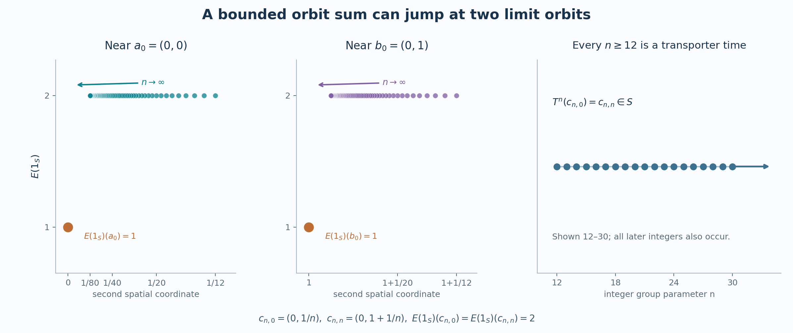

# Bounded orbit sums need not be continuous

A compact support can meet every orbit only a few times while the return times, taken across all orbits, are unbounded. The following countable example separates these two facts. It also shows why a proper model can require a change of topology even when the measure and the action stay the same.

*Self-checked by the writing AI. Original exposition, diagram, data and code: CC0-1.0. Accompanying font terms are retained.*

## Two limiting rows and the intervening orbits

For every integer \(k\), put
\[
 a_k=(k,0),\qquad b_k=(k,1).
 \tag{W1}
\]
For every integer \(n\ge12\), let \(p_n=\lfloor n/3\rfloor\), \(q_n=\lceil2n/3\rceil\), and add the points
\[
 c_{n,k}=
 \begin{cases}
 (k,1/n),&k\le p_n,\\
 (k,n+2),&p_n<k<q_n,\\
 (k-n,1+1/n),&k\ge q_n
 \end{cases}
 \qquad(k\in\mathbb Z).
 \tag{W2}
\]
Let \(X\) be their union in \(\mathbb R^2\). All displayed points are distinct: the two rows and the three kinds of heights are disjoint, each height identifies \(n\) when necessary, and the first coordinate identifies \(k\) within a branch.

The space \(X\) is closed. To prove this, consider any convergent sequence of its points. If the indices \(n\) of the points of type \(c\) stay bounded, a bounded rectangle contains only finitely many such points; a subsequence is constant. If they tend to infinity along a subsequence, the middle height \(n+2\) cannot remain bounded. On the first branch, convergence forces its integer first coordinate to be eventually a fixed \(k\), and the limit is \(a_k\). On the third branch the integer coordinate \(k-n\) is eventually a fixed \(j\), and the limit is \(b_j\). A sequence of row points has an eventual constant subsequence as well. Every possible limit is in \(X\). In a metric space a set containing all its sequential limits is closed: a point in its closure can otherwise be approached by points at distance below \(1/m\).

A closed bounded rectangle is compact directly from real completeness. If an open cover had no finite subcover, divide the rectangle into four closed subrectangles and choose one still lacking a finite subcover. Repetition gives nested rectangles with diameters tending to zero. Their coordinate intervals have a common point by completeness; an open cover member containing it contains a whole sufficiently small rectangle, a contradiction. A closed subset of a compact space is compact, by adjoining its open complement to any cover.

It follows that \(X\) is locally compact, Hausdorff and second countable. Its intersections with closed bounded rectangles are compact, and the intersections with rational open balls give a countable base. Every \(c_{n,k}\) is isolated, because its height is isolated among the relevant heights and the first coordinates on that height are discrete. The only nonconstant convergences to a row point have the forms
\[
 c_{n,k}\longrightarrow a_k,\qquad
 c_{n,n+k}\longrightarrow b_k
 \quad(n\longrightarrow\infty).
 \tag{W3}
\]

Define \(T:X\to X\) by increasing every orbit index by one:
\[
 T(a_k)=a_{k+1},\quad T(b_k)=b_{k+1},\quad
 T(c_{n,k})=c_{n,k+1}.
 \tag{W4}
\]
This is a bijection. It and its inverse are continuous at isolated points. At a lower-row limit in (W3), a fixed \(k\) and both \(k\pm1\) eventually lie on the first branch, so the images converge to \(a_{k\pm1}\). At an upper-row limit, \(n+k\) and \(n+k\pm1\) eventually lie on the third branch, so the images converge to \(b_{k\pm1}\). The preceding classification of convergent sequences proves continuity everywhere. Thus \(T\) is a homeomorphism, and its iterates give a continuous action of the discrete group \(\mathbb Z\). The action is free: a nonzero iterate changes the index of every point.

## The measured action and its bounded averaging domain

Enumerate the countable set \(X\) without repetitions as \((x_j)_{j\ge1}\), and give \(x_j\) mass \(2^{-j}\). This defines a full-support probability \(\lambda\). All subsets of \(X\) are Borel, since they are countable unions of closed singletons. The measure is Radon: finite subsets approximate the mass of every subset from below; to approximate a set from above, choose a finite subset of its complement and remove that closed finite set. Its only null set is empty. Consequently it is quasi-invariant under every permutation, including \(T\).

The measured algebra is \(M=L^\infty(X,\lambda)=\ell^\infty(X)\). Its predual is the weighted \(L^1(X,\lambda)\), by [the scalar multiplier and predual theorem](OA-FLOW-IW.md#iw-1). Finite-support simple functions with rational real and imaginary parts are dense in that predual, so it is separable. Set
\[
 \alpha_m(f)=f\circ T^{-m},\qquad A=C_0(X)\subset M.
 \tag{W5}
\]
The inclusion is faithful and ultraweakly dense by the same multiplier theorem. The algebra is invariant, because \(T\) is a homeomorphism. Every orbit map from the discrete group is norm continuous. The countable compact-bump argument in [the orbit probability construction](OA-FLOW-L69.md#oa-flow.orbits.selector) shows that \(C_0(X)\) is norm separable.

For a compact \(K\subset X\), choose \(R\ge1\) with \(K\subset[-R,R]^2\). Each of the three branches of one \(c_n\)-orbit has integer first coordinates and therefore contributes at most \(2\lfloor R\rfloor+1\) points to this rectangle. Either limiting row contributes at most the same number. Thus
\[
 \sup_{x\in X}\#(K\cap\mathbb Zx)
 \le N_K:=3(2\lfloor R\rfloor+1).
 \tag{W6}
\]
For \(f\in C_c(X)\) supported in \(K\), freeness ensures that each orbit point occurs at exactly one time. Hence
\[
 E(f)(x)=\sum_{m\in\mathbb Z}f(T^{-m}x),\qquad
 \sum_{m\in\mathbb Z}|f(T^{-m}x)|\le N_K\|f\|_\infty.
 \tag{W7}
\]
In particular every member of \(C_c(X)_+\) belongs to the bounded positive averaging cone. Compact cutoffs from [the locally compact topology theorem](OA-FLOW-TOPOLOGY.md#l138-h0) show that \(C_c(X)\) is norm dense in \(C_0(X)\): for \(f\in C_0(X)\), choose a bump equal to one on the compact set where \(|f|\ge\varepsilon\), and multiply by it. The sup norm error is at most \(\varepsilon\).

The action is integrable in the exact [bounded-cone sense](OA-FLOW-L72.md#oa-flow.model.domain). Indeed a point projection \(1_{\{x\}}\) has orbit average equal to the indicator of its orbit, so it is integrable. Their finite linear span is ultraweakly dense in \(\ell^\infty(X)\): bounded finite truncations of any bounded function converge against every \(L^1\) function, by the summable tail estimate. Thus the averaging cone has ultraweakly dense linear span.

## One compact open set gives both failures

Consider
\[
 S=\{a_0,b_0\}\cup\{c_{n,0},c_{n,n}:n\ge12\}.
 \tag{W8}
\]
It is compact, being the union of two convergent sequences and their limits. It is also open. The points \(c_{n,0},c_{n,n}\) are isolated. A sufficiently small neighborhood of \(a_0\) meets only first-branch points with integer first coordinate zero, hence only \(a_0\) and points \(c_{n,0}\). A sufficiently small neighborhood of \(b_0\) meets only third-branch points with first coordinate zero, hence only \(b_0\) and points \(c_{n,n}\). Therefore \(f=1_S\) belongs to \(C_c(X)\).

Each limiting-row orbit meets \(S\) once, and each \(c_n\)-orbit meets it twice. Thus
\[
 E(1_S)(a_0)=E(1_S)(b_0)=1,\qquad
 E(1_S)(c_{n,0})=E(1_S)(c_{n,n})=2.
 \tag{W9}
\]
The two sequences in (W3), with \(k=0\), prove that this bounded orbit sum is discontinuous at both limit points. Its \(L^\infty\) class has no continuous representative: no nonempty subset is null, so every representative has exactly these values.

At the same time,
\[
 T^n(c_{n,0})=c_{n,n}\in S,\qquad
 \{m\in\mathbb Z:T^mS\cap S\ne\varnothing\}
 \supseteq\{n:n\ge12\}.
 \tag{W10}
\]
This transporter has infinite counting measure. A bound on the number of visits of each orbit to \(S\) does not bound the union of the return times of all orbits.

*Figure 73.1. The first two panels plot (W9) against the second coordinate at first coordinate zero. They display \(12\le n\le80\); the limits concern the entire sequences. The last panel displays the return times \(12\le n\le30\) from (W10), with an arrow indicating all later integers. The points are exact values of the construction, not numerical estimates. The [plot script](../assets/measure-models/counterexample/render-73-lemma-414-counterexample.py) and [display data](../assets/measure-models/counterexample/73-lemma-414-counterexample-data.json) reproduce the image.*

## The same measured action has a proper model

Give the same countable set the discrete topology, and call the resulting space \(X_d\). It is locally compact and second countable, and every bijection of it is a homeomorphism. Its Borel sets are still all subsets, and the same atomic probability is Radon, full-support and quasi-invariant. The identity map \(X\to X_d\) is a Borel bijection with Borel inverse and is equivariant. It therefore gives the same measured algebra and the same action (W5).

The action on \(X_d\) is proper. Compact subsets of a discrete space are finite: the singleton cover has a finite subcover. If \(A,B\subset X_d\) are finite, each pair \((a,b)\in A\times B\) determines at most one integer \(m\) with \(T^ma=b\), since the action is free. Its transporter is therefore finite. More directly, for a finite subset of \(X_d\times X_d\), its inverse image under
\[
 \mathbb Z\times X_d\longrightarrow X_d\times X_d,\qquad
 (m,x)\longmapsto(T^mx,x)
 \tag{W11}
\]
has at most one point per target pair, hence is finite and compact. This is the definition of a proper action.

Every compactly supported function on \(X_d\) has finite support. Its orbit sum is bounded by the sum of the absolute values on that finite support, and is continuous because the topology is discrete. Here the proper model exists on the whole underlying set, with no discarded points.

There is no contradiction with (W9). The set \(S\) is infinite and therefore is not compact in \(X_d\). In fact \(1_S\notin C_0(X_d)\), since its level set above \(1/2\) is not compact. Changing the topology changes the continuous algebra and its compactly supported tests, while preserving the measured action. This is the distinction realized generally by [the proper-model construction](OA-FLOW-L71.md#oa-flow.proper.abstract).

## Two checks on the example

**Problem.** Could an almost-everywhere change in \(1_S\) or its orbit sum remove the discontinuity?

**Solution.** Every point has strictly positive probability. Equality almost everywhere is therefore equality everywhere, both for \(1_S\) and for its sum. The values in (W9) cannot be changed within their measured classes.

**Problem.** Where does the proof that compactly supported averages are continuous for a proper action fail in the original topology?

**Solution.** It confines the integration variable to one compact transporter for all points in a compact neighborhood. Here \(S\) is itself compact and open, but (W10) proves that its transporter is not compact. The pointwise finite visit bound (W6) gives no common bounded set of integration times as the orbit varies.

Further reading: Masamichi Takesaki, [*Theory of Operator Algebras II*](https://doi.org/10.1007/978-3-662-10451-4), §X.4, Lemma 4.14. The example proves directly that the listed algebraic and integrability properties of a chosen continuous model do not suffice for continuity of its compactly supported averages.
