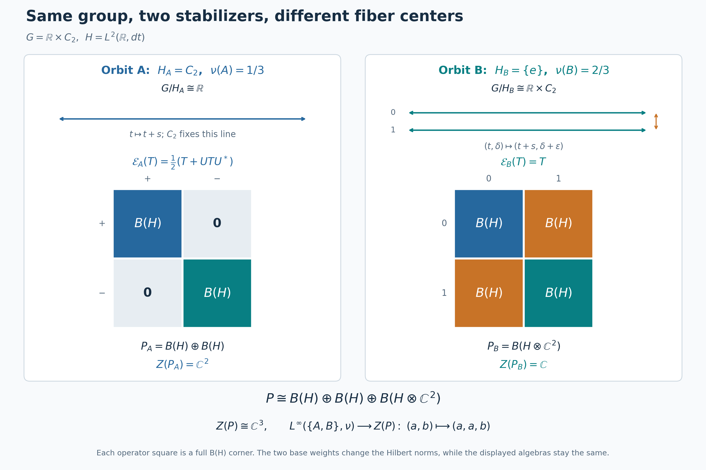

# Crossed products over varying compact stabilizers

*Self-checked by the writing AI. Original lesson, figure and reproduction code: CC0-1.0; accompanying font terms retained.*

A compact stabilizer leaves a group von Neumann algebra inside the crossed product of its orbit. When the stabilizer varies, the orbit calculations must fit together measurably. We will build that fit on one fixed Hilbert space, first by averaging operators and then by changing to quotient coordinates.

## The system and the formula to be proved

Let \(G\) be a locally compact Hausdorff group with a countable base, with left Haar measure \(dg\) and modular function \(\Delta_G\). Let \(M\ne0\) be an abelian von Neumann algebra with separable predual. Let \(\alpha\) be a point-ultraweakly continuous action of \(G\) by normal star automorphisms. Assume that the linear span of the bounded positive elements whose Haar averages are bounded is ultraweakly dense in \(M\). The average and this exact domain are defined in [the bounded averaging cone](OA-FLOW-L72.md#oa-flow.model.domain).

The [normal continuous model](OA-FLOW-L72.md#oa-flow.model.normal), [transport of the averaging domain](OA-FLOW-L72.md#oa-flow.model.transport), and [proper-model theorem](OA-FLOW-L71.md#oa-flow.proper.abstract) identify this system normally and equivariantly with \(L^\infty(\Gamma,\mu)\), with action
\[
 \alpha_gF(z)=F(g^{-1}z).
 \tag{S1}
\]
Here \(\Gamma\) is a locally compact space with a countable base, the action is proper, and \(\mu\) is a full-support quasi-invariant Radon probability. More precisely, [the base construction](OA-FLOW-L71.md#oa-flow.proper.base) and [the coset bundle](OA-FLOW-L71.md#oa-flow.proper.bundle) give
\[
 S=\coprod_i S_i,\qquad
 \Gamma=\coprod_i (S_i\times G)/H_y,\qquad
 p(y,g)=[y,g],\qquad q([y,g])=y.
 \tag{S2}
\]
The base probability is \(\nu=q_*\mu\). Each \(S_i\) is locally compact with a countable base, the compact subgroups \(H_y\) vary continuously in the Hausdorff metric on \(S_i\), and all of them on that piece lie in one compact subset of \(G\). The quotient fiber \(\Gamma_y\) is \(G/H_y\).

The [conditional-measure construction](OA-FLOW-L69.md#oa-flow.orbits.conditional), transported by [the Borel conjugacy in both directions](OA-FLOW-L71.md#oa-flow.proper.conjugacy), gives a Borel probability kernel \(\mu_y\), concentrated on \(\Gamma_y\), such that
\[
 \mu(D)=\int_S\mu_y(D)\,d\nu(y),\qquad
 \mu_y\sim (g\mapsto[y,g])_*dg.
 \tag{S3}
\]
The base in (S2) was already chosen inside the common conull set where these conclusions hold. Its [dense stabilizer selectors](OA-FLOW-L69.md#oa-flow.orbits.stabilizer-field) are Borel maps \(h_n:S\to G\) with
\[
 h_n(y)\in H_y,\qquad \overline{\{h_n(y):n\ge1\}}=H_y.
 \tag{S4}
\]
The [quotient section](OA-FLOW-L71.md#oa-flow.proper.conjugacy) supplies a Borel \(\sigma(z)\in G\) with \(p(q(z),\sigma(z))=z\). We also write it as \(\sigma(y,z)\) when displaying the base coordinate.

We will prove a normal isomorphism, with normal inverse,
\[
 M\rtimes_\alpha G\cong
 \int_S^\oplus
 \left[\mathcal R(H_y)\bar\otimes
 B\bigl(L^2(G/H_y,m_y)\bigr)\right]d\nu(y),
 \qquad m_y=(g\mapsto gH_y)_*dg.
 \tag{S5}
\]
Here \(\mathcal R(H_y)\) is generated by the **left** regular representation on \(L^2(H_y,\kappa_y)\), where \(\kappa_y\) has mass one. The direct integral on the right will be defined concretely by countable measurable Hilbert coordinates. Both the measurable algebra and the isomorphism onto it are constructed below. No countability assumption is imposed on the set of subgroup values \(\{H_y:y\in S\}\).

We use inner products linear in the first variable and completed scalar \(L^2\) spaces. The left and right regular operators on \(H_0=L^2(G,dg)\) are
\[
 (L_g\xi)(s)=\xi(g^{-1}s),\qquad
 (R_G(h)\xi)(s)=\Delta_G(h)^{1/2}\xi(sh).
 \tag{S6}
\]
Their unitarity, strong continuity and commutation are proved in [the regular translations](OA-FLOW-IS.md#is-3). Compactness of \(H_y\) makes \(\Delta_G|_{H_y}=1\): the logarithm of a positive continuous character has compact additive image in \(\mathbb R\), and such a subgroup is zero. The ambient modular function remains present in the transformation unitary below.

We use the [proper coset model](OA-FLOW-L71.md#oa-flow.proper.bundle) of the preceding lesson. Thus \(G\) is a locally compact Hausdorff group with a countable base, \(S=\coprod_iS_i\) is an lcsc space with Radon probability \(\nu\), and
\[
 \Gamma=\coprod_i(S_i\times G)/\!\sim,\qquad
 p(y,g)=[y,g],\qquad
 (y,g)\sim(y,g')\ \Longleftrightarrow\ g^{-1}g'\in H_y.
 \tag{A1}
\]
Each \(H_y\) is a compact subgroup. On every component \(S_i\), the map \(y\mapsto H_y\) is Hausdorff-continuous and its values lie in one compact subset \(K_i\subset G\). These are the [compact controls proved in L71](OA-FLOW-L71.md#oa-flow.proper.base). Write \(q([y,g])=y\). The probability \(\mu\) on \(\Gamma\) and the base measure satisfy \(q_*\mu=\nu\).

The [Borel sections in L71](OA-FLOW-L71.md#oa-flow.proper.conjugacy) give a single Borel function \(\sigma:\Gamma\to G\) with
\[
 p(q(z),\sigma(z))=z.
 \tag{A2}
\]
We also retain the [Borel selectors of L69](OA-FLOW-L69.md#oa-flow.orbits.stabilizer-field), denoted \(h_n:S\to G\), whose values are dense in each \(H_y\). They remain Borel after the base refinement. All measures are completed when forming Hilbert spaces or multiplication algebras; pointwise formulas use Borel representatives.

## A normalized Haar kernel for all the compact subgroups

Let \(\kappa_y\) be Haar measure on \(H_y\), normalized to mass one and viewed as a measure on \(G\). Existence and uniqueness follow from [HR6](OA-FLOW-HR.md#hr-06) and [HR7](OA-FLOW-HR.md#hr-07). Compactness makes its total mass finite and positive. The normalized measure is also right invariant: a right translate is another left Haar probability. Inversion then preserves it, since the inversion image is a left Haar probability as well.

We prove the parameter dependence, rather than assume a theorem about measurable families of Haar measures. On a fixed component, suppose \(y_n\to y\). All subgroups lie in the compact metrizable set \(K_i\). Its metrizability follows from the [countable compact-bump metric](OA-FLOW-L71.md#oa-flow.proper.selection). The space \(C(K_i)\) is separable: a countable family of continuous functions separating points, together with constants, has a countable rational complex *-algebra, dense by [compact Stone–Weierstrass](OA-FLOW-CF.md#oa-flow.cf.5).

Choose a countable norm-dense family in \(C(K_i)\). Given any subsequence of \((\kappa_{y_n})\), successive subsequences and a diagonal choice make its integrals converge on every member of that family. Uniform approximation then makes the integrals converge on all of \(C(K_i)\). Their limit is a positive functional of norm one, with value one at the constant function. [HR2](OA-FLOW-HR.md#hr-02) represents it by a probability \(\eta\) on \(K_i\).

This probability is supported on \(H_y\). Indeed Hausdorff convergence gives
\(\sup_{h\in H_{y_n}}d(h,H_y)\to0\), so \(\int d(h,H_y)\,d\eta(h)=0\). Each set where that distance is at least \(1/m\) is therefore null, and their union is \(K_i\setminus H_y\).

For \(h\in H_y\), choose \(h_n\in H_{y_n}\) tending to \(h\). If \(f\in C_c(G)\), continuity of multiplication and compactness give
\[
 \sup_{k\in K_i}|f(h_nk)-f(hk)|\longrightarrow0.
 \tag{A3}
\]
For example, failure would give \(k_n\in K_i\) and a convergent subsequence contradicting continuity. Left invariance of \(\kappa_{y_n}\), weak convergence on \(K_i\), and (A3) show \(\int f(hk)\,d\eta(k)=\int f(k)\,d\eta(k)\). HR2's uniqueness makes \(\eta\) left invariant under \(H_y\); regarded on that subgroup, it is its normalized Haar measure by HR7. Thus every subsequential limit is \(\kappa_y\). If convergence failed on one continuous test, a subsequence staying a fixed distance from its desired integral would have the convergent subsubsequence just constructed, a contradiction. We have proved
\[
 y\longmapsto\int_G f(h)\,d\kappa_y(h)
 \quad\text{is continuous on each }S_i
 \quad(f\in C_b(G)).
 \tag{A4}
\]
Only the restriction of \(f\) to \(K_i\) is used. Sequential continuity suffices because \(S_i\) is metrizable.

For every open \(O\subset G\), choose \(0\le f_j\in C_c(G)\) increasing pointwise to \(1_O\). To construct them, cover \(O\) by countably many compact sets contained in it, choose a compact bump equal to one on each, and take successive maxima. [H0](OA-FLOW-TOPOLOGY.md#l138-h0) gives the bumps. Then \(\kappa_y(O)=\sup_j\kappa_y(f_j)\) is Borel. The Borel sets \(D\) for which \(y\mapsto\kappa_y(D)\) is Borel form a class closed under complements and countable disjoint unions, and containing the open sets, which are closed under finite intersections. The [elementary class argument of L69](OA-FLOW-L69.md#oa-flow.orbits.integration) proves that this class contains every Borel set. Countably many base components cause no change. Thus \(\kappa\) is a Borel probability kernel on the fixed space \(G\).

The same argument proves the parameter formula we shall use repeatedly:
\[
 y\longmapsto\int_G F(y,h)\,d\kappa_y(h)
 \text{ is Borel for every nonnegative Borel }F:S\times G\to[0,\infty].
 \tag{A5}
\]
For indicators of rectangles it follows from the kernel property; the complement and disjoint-union argument gives indicators of all Borel sets, and simple approximation and monotone convergence give the formula. Both spaces are second-countable, so rectangles generate the product Borel sigma-algebra. Extra Borel parameters, such as \((y,g)\), are handled by the kernel \(\kappa_y\) on that larger parameter space. Bounded complex integrands follow by their real and imaginary parts.

Fix left Haar measure \(dg\), with the [L24 convention](OA-FLOW-L24.md#oa-flow.grp.translations), and put
\[
 H_0=L^2(G,dg),\qquad
 (R_G(h)\xi)(g)=\Delta_G(h)^{1/2}\xi(gh).
 \tag{A6}
\]
Haar substitution gives \(\|R_G(h)\xi\|_2=\|\xi\|_2\), the inverse is \(R_G(h^{-1})\), and direct substitution gives \(R_G(hk)=R_G(h)R_G(k)\). For compact continuous \(\xi\), right translates converge uniformly with supports in one compact set near the identity; continuity of \(\Delta_G\) then gives convergence in \(L^2\). Approximation by compact continuous functions and the isometry extend this to every \(\xi\), proving strong continuity. The continuous positive character \(\Delta_G\) is one on every compact subgroup: its image is a compact multiplicative subgroup of \((0,\infty)\), and any value different from one has unbounded positive or negative powers. In particular the scalar in (A6) is one for \(h\in H_y\), even when \(G\) is nonunimodular.

We will need the explicit countability of \(H_0\). The compact-bump construction gives a countable family separating points of \(G\) and nonzero at every point. Its rational complex star polynomials, with no constant term, are uniformly dense in \(C_0(G)\): adjoin constants on the one-point compactification, apply CF5, then subtract the value at the added point. This is also the explicit countability construction in [L69](OA-FLOW-L69.md#oa-flow.orbits.selector). Choose compact cutoffs \(\chi_m\) equal to one on a compact exhaustion of \(G\). Products of \(\chi_m\) with that countable algebra form an \(L^2\)-dense countable family: for a fixed compactly supported target, choose one cutoff equal to one on its support and use uniform approximation on the cutoff's finite-measure support. [HR3](OA-FLOW-HR.md#hr-03) makes compact continuous functions dense in \(L^2\). Gram–Schmidt and completion therefore give an orthonormal basis \((e_j)_{j\in I}\), where \(I\) is finite or countably infinite. We do not assume infinite dimension when \(G\) is finite.

The vector integral
\[
 Q_y\xi=\int_{H_y}R_G(h)\xi\,d\kappa_y(h)
 \tag{A7}
\]
exists by the [compact vector-integration construction](OA-FLOW-L24.md#oa-flow.grp.vectorintegration). Left invariance, inversion invariance, and Fubini for the finite Haar probability give
\[
 Q_y^2=Q_y=Q_y^*,\qquad
 \operatorname{Ran}Q_y=\{\xi:R_G(h)\xi=\xi\text{ for every }h\in H_y\}.
 \tag{A8}
\]
Indeed left invariance gives \(R_G(k)Q_y=Q_y\); it follows that \(Q_y\) fixes its image, while it acts as the identity on every invariant vector. Inversion gives self-adjointness by pairing vectors in (A7). For each \(\xi\), the map \(y\mapsto Q_y\xi\) is norm continuous on \(S_i\): the continuous vector function \(h\mapsto R_G(h)\xi\) on \(K_i\) is uniformly approximated by finite sums of fixed vectors times restrictions of compact continuous scalar functions on \(G\), using the finite compact partition from H0. Equation (A4) gives continuity of those integrals, and the uniform error bounds the vector-integral error. This proves the assertion for the limit.

## Scalar diagonals and measurable matrices on one Hilbert space

Set
\[
 \mathcal H=L^2(S,\nu)\otimes H_0
             =L^2(S,\nu;H_0),\qquad
 \mathcal D=L^\infty(S,\nu)\bar\otimes B(H_0).
 \tag{A9}
\]
The Hilbert identification sends \(f\otimes\xi\) to \(y\mapsto f(y)\xi\). In the basis \((e_j)\) its squared norm is \(\sum_j\|f_j\|_2^2\), so finite-coordinate fields are dense and completion proves that it is onto. A measurable \(H_0\)-valued field here means one with measurable scalar coordinates; its finite-coordinate truncations show strong measurability and supply a Borel representative after changing a null set. This includes the finite-basis case.

**Matrix-field lemma.** The following are exactly the same operators:

1. Operators on \(\mathcal H\) commuting with every \(M_f\otimes1\), \(f\in L^\infty(S,\nu)\).
2. Elements of \(\mathcal D\).
3. Fields \(y\mapsto T_y\in B(H_0)\) with Borel scalar matrix entries, bounded in operator norm outside a \(\nu\)-null set, acting by \((T\xi)(y)=T_y\xi(y)\).

Fields are identified if they agree outside one null set. Their algebra operations and positivity are pointwise, and
\[
 \|T\|=\operatorname*{ess\,sup}_{y\in S}\|T_y\|,
 \qquad
 (L^\infty(S,\nu)\otimes1)'=\mathcal D.
 \tag{A10}
\]

**Proof.** Let \(V_jf=f\otimes e_j\). If \(T\) commutes with the scalar diagonal, each \(T_{ij}=V_i^*TV_j\) commutes with all scalar multiplication on \(L^2(S,\nu)\). The [scalar multiplier theorem IW1](OA-FLOW-IW.md#iw-1) says \(T_{ij}=M_{t_{ij}}\), with \(t_{ij}\in L^\infty(S,\nu)\). Choose Borel representatives for this finite or countable family.

For finite-coordinate vectors \(u,v\) with rational complex coordinates, compression of \(T\) between the maps \(f\mapsto f\otimes u\) and \(f\mapsto f\otimes v\) is multiplication by
\(\sum_{i,j}t_{ij}(y)u_j\overline{v_i}\), with norm at most \(\|T\|\|u\|\|v\|\). Thus
\[
 \left|\sum_{i,j}t_{ij}(y)u_j\overline{v_i}\right|
 \le\|T\|\|u\|\|v\|
 \tag{A11}
\]
outside a null set. There are only countably many such pairs; remove their union of exceptional Borel null sets. Density of rational-coordinate vectors extends (A11) to a bounded sesquilinear form on all of \(H_0\), for every remaining \(y\). The [Hilbert representation theorem](OA-FLOW-CF.md#oa-flow.cf.8) gives a unique \(T_y\in B(H_0)\) of norm at most \(\|T\|\) with the prescribed entries. Set \(T_y=0\) on the discarded set.

Conversely, given such a field with bound \(C\), every coordinate of \(T_y\xi(y)\) is the pointwise limit of its finite-coordinate sums and is measurable. The pointwise bound gives
\(\int\|T_y\xi(y)\|^2d\nu\le C^2\int\|\xi(y)\|^2d\nu\), so the rule defines a bounded operator commuting with the scalar diagonal. Its entries are the original \(M_{t_{ij}}\). In particular this construction recovers the preceding \(T\), since matrix entries determine a bounded operator. It proves equality of the operator norm with the essential supremum: one inequality is the integral bound, and the other follows by applying (A11) to the resulting operator. The function \(y\mapsto\|T_y\|\) is measurable, as the supremum of countably many normalized rational-vector tests.

Pointwise adjoints have conjugate-transposed entries. Products act pointwise by composition on every vector field; their entries are the convergent sums \(\sum_k t_{ik}(y)s_{kj}(y)\), whose absolute convergence follows from Cauchy–Schwarz for the two \(\ell^2\) rows and columns. Positivity is also pointwise: countably many rational quadratic-form tests give one common set on which \(T_y\ge0\) when \(T\ge0\), and the converse follows by integration. Equality of two operators is equality of their countably many entries outside one common null set, hence equality of their fields there.

Finally let \(P_n=1\otimes p_n\), where \(p_n\) projects onto the first \(n\) basis vectors, and take \(p_n=1\) once a finite basis is exhausted. Then
\[
 P_nTP_n=\sum_{i,j\le n}M_{t_{ij}}\otimes|e_i\rangle\langle e_j|
       \longrightarrow T\quad\text{strongly, together with adjoints}.
 \tag{A12}
\]
The bounds are \(\|P_nTP_n\|\le\|T\|\); convergence follows by expanding
\(P_nT(P_n-1)\xi+(P_n-1)T\xi\), and likewise for \(T^*\). Thus \(T\in\mathcal D\). The reverse inclusion follows from commutation of the tensor generators with the scalar diagonal. This proves all assertions. \(\square\) The same proof applies to any nonzero separable Hilbert space in place of \(H_0\); its only Hilbert-space input was a finite or countable orthonormal basis.

Define measurable unitary fields
\[
 U_n(y)=R_G(h_n(y)).
 \tag{A13}
\]
Their entries are Borel, since the selectors are Borel and \(R_G\) is strongly continuous; the lemma gives unitaries \(U_n\in\mathcal D\). Put
\[
 \begin{aligned}
 \mathcal D_H
 &=\mathcal D\cap\{U_n:n\ge1\}'\\
 &=\{T\in\mathcal D:
       T_yR_G(h)=R_G(h)T_y\ (h\in H_y)
       \text{ for almost every }y\}.
 \end{aligned}
 \tag{A14}
\]
The second equality has a precise common-null-set meaning. For \(T\) in the first algebra, the countably many equations \(TU_n=U_nT\) and the matrix lemma give one conull Borel set on which all corresponding field equations hold. For each \(y\) there, density of \(\{h_n(y)\}\) in \(H_y\) and strong continuity extend commutation to every \(h\in H_y\). The converse is immediate. The first line makes \(\mathcal D_H\) a von Neumann algebra, as an intersection of commutants; no interchange of a fiber commutant and a direct integral has been used.

## A faithful normal expectation with an explicit dilation

The formula
\[
 \mathcal E(T)_y
   =\int_{H_y}R_G(h)T_yR_G(h)^*\,d\kappa_y(h)
 \tag{A15}
\]
uses the bounded operator determined by integration of scalar vector coefficients. It defines a normal unital completely positive expectation \(\mathcal E:\mathcal D\to\mathcal D_H\). We prove normality on the whole von Neumann algebra, rather than infer it from individual fibers.

The subgroup graph
\[
 Z_H=\{(y,h)\in S\times G:h\in H_y\},\qquad
 \zeta(E)=\int_S\int_{H_y}1_E(y,h)\,d\kappa_y(h)\,d\nu(y)
 \tag{A16}
\]
is a closed subset of \(S\times G\): on each open-and-closed component its closedness follows from Hausdorff continuity, and the componentwise complements are open. Formula (A5) makes \(\zeta\) a Borel probability, with countable additivity furnished by monotone convergence. The space \(Z_H\) is lcsc. Thus this finite Borel measure is Radon by the [metric-measure regularity proof](OA-FLOW-IS.md#is-2) and a countable compact exhaustion. Its completion has Borel representatives, by simple approximation as in [HR3](OA-FLOW-HR.md#hr-03).

Multiplication in the base coordinate is a faithful normal unital representation
\[
 \pi_0:L^\infty(S,\nu)\longrightarrow B(L^2(Z_H,\zeta)),
 \qquad (\pi_0(f)\eta)(y,h)=f(y)\eta(y,h).
 \tag{A17}
\]
To verify all qualifications, null base sets pull back to \(\zeta\)-null sets because \(\kappa_y\) has mass one. The map \(f(y)\mapsto f(y)\), viewed as a function constant in \(h\), embeds \(L^2(S,\nu)\) isometrically into \(L^2(Z_H,\zeta)\); compression of \(\pi_0(f)\) to this subspace is \(M_f\), proving faithfulness. For vectors \(\eta,\theta\in L^2(Z_H,\zeta)\), their coefficient has the density
\[
 k_{\eta,\theta}(y)=
      \int_{H_y}\eta(y,h)\overline{\theta(y,h)}\,d\kappa_y(h),
 \qquad \|k_{\eta,\theta}\|_1\le\|\eta\|_2\|\theta\|_2.
 \tag{A18}
\]
Kernel integration and Cauchy–Schwarz prove measurability and the bound, with arbitrary values on the null set where the fiber integral is not finite. Since \(L^1(S,\nu)\) is the actual predual of scalar multiplication by [IW1](OA-FLOW-IW.md#iw-1), all these coefficients are normal. For a square-summable pair of vector sequences, the densities (A18) form a norm-convergent \(L^1\) series by Cauchy–Schwarz for their norm tails. The [CP4–6 vector-series description](OA-FLOW-CP.md#oa-flow.cp.4) therefore proves normality of \(\pi_0\) for every predual functional.

By [NCF1's normal tensor transport](OA-FLOW-NCF.md#ncf-1), this representation extends to a normal unital representation
\[
 \pi=\pi_0\bar\otimes\mathrm{id}_{B(H_0)}:
 \mathcal D\longrightarrow B(\widetilde{\mathcal H}),\qquad
 \widetilde{\mathcal H}=L^2(Z_H,\zeta;H_0).
 \tag{A19}
\]
It acts as \((\pi(T)\eta)(y,h)=T_y\eta(y,h)\). This follows first on finite matrix compressions from their entries \(\pi_0(t_{ij})\), and then by the bounded finite-coordinate convergence (A12). Define
\[
 (V\xi)(y,h)=\xi(y),\qquad
 (U\eta)(y,h)=R_G(h)\eta(y,h).
 \tag{A20}
\]
The map \(V:\mathcal H\to\widetilde{\mathcal H}\) is an isometry. The map \(U\) is a unitary: strong continuity and a countable basis make its action on every Borel vector field measurable, it preserves the norm pointwise, and its inverse is multiplication by \(R_G(h)^*\). Its adjoint formula is literal, with no measurable-choice issue. The adjoint of \(V\) is the vector integral
\(V^*\eta(y)=\int_{H_y}\eta(y,h)\,d\kappa_y(h)\); fiberwise Cauchy–Schwarz bounds its \(L^2\) norm, and pairing with finite-coordinate fields proves the formula.

Now set
\[
 \mathcal E(T)=V^*U\pi(T)U^*V.
 \tag{A21}
\]
Normality follows from normality of \(\pi\) and from normality of unitary conjugation and compression, which send each vector-series functional to another such series. The map is unital since \(V^*V=1\). At every finite matrix amplification (A21) remains a compression of a representation, so it preserves positive matrices; thus it is completely positive. Also \(\|\mathcal E(T)\|\le\|T\|\).

Testing (A21) on finite-coordinate fields gives (A15). The scalar integrands in that formula are Borel: expand \(R_G(h)^*e_j\) and \(R_G(h)^*e_i\) in the fixed countable basis and take limits of finite sums involving the Borel entries of \(T_y\). Their absolute value is bounded by \(\|T\|\), after a Borel null change of \(T_y\). Formula (A5) therefore gives measurable entries for the average, and the matrix-field lemma puts it in \(\mathcal D\). This also verifies that (A15) is independent of the chosen operator-field representative.

For \(k\in H_y\), left invariance of \(\kappa_y\) gives
\[
 R_G(k)\mathcal E(T)_yR_G(k)^*=
 \int_{H_y}R_G(kh)T_yR_G(kh)^*\,d\kappa_y(h)
 =\mathcal E(T)_y.
 \tag{A22}
\]
Consequently the range is contained in \(\mathcal D_H\). Every member of \(\mathcal D_H\) is fixed by the average on its common conull set, so the range is exactly \(\mathcal D_H\) and \(\mathcal E^2=\mathcal E\). If \(A,B\in\mathcal D_H\), commuting them through the integrand proves
\(\mathcal E(ATB)=A\mathcal E(T)B\). This is bimodularity over the entire range.

Finally the expectation is faithful. If \(T\ge0\) and \(\mathcal E(T)=0\), positivity in the matrix lemma and countably many diagonal entries give one conull set on which \(T_y\ge0\) and
\[
 \int_{H_y}
  \langle T_yR_G(h)^*e_j,R_G(h)^*e_j\rangle\,d\kappa_y(h)=0
 \quad(j\in I).
 \tag{A23}
\]
For fixed \(y,j\) the integrand is continuous and nonnegative. Haar probability on a compact group gives positive mass to every nonempty open set: finitely many translates of such a set cover the group, and invariance would otherwise make its total mass zero. Thus the integrand vanishes everywhere. At \(h=e\) this gives \(\langle T_ye_j,e_j\rangle=0\) for all \(j\). Positivity implies \(T_y^{1/2}e_j=0\), so density of the basis gives \(T_y=0\). Hence \(T=0\), as asserted.

## The invariant coefficients are exactly the measured coset algebra

Inside \(\mathcal D\), put
\[
 \mathcal B=L^\infty(S,\nu)\bar\otimes L^\infty(G,dg)
             =L^\infty(S\times G,\nu\times dg).
 \tag{A24}
\]
Here the right side is scalar multiplication on the Hilbert space (A9), identified with \(L^2(S\times G)\) by [HR5's scalar tensor theorem](OA-FLOW-HR.md#hr-05). To verify equality of the algebras, the tensor product contains multiplication by every rectangle indicator. The Borel sets whose indicators belong to it form a class closed under complements and countable disjoint unions, because the corresponding projection sums converge strongly. The elementary class argument used in (A5) gives all Borel indicators. Bounded simple approximation gives all bounded multipliers. The reverse inclusion holds on the elementary tensors and under von Neumann closure by [IW1](OA-FLOW-IW.md#iw-1). Completions do not change the algebra.

Under the matrix-field lemma, a bounded Borel multiplier \(F\) has fiber \(M_{F(y,\,\cdot)}\): its scalar entries are \(\int_G F(y,g)e_j(g)\overline{e_i(g)}\,dg\), and scalar Fubini verifies the action on finite-coordinate fields. For such a representative \(F\), the restriction of \(\mathcal E\) to \(\mathcal B\) is multiplication by
\[
 (E_{\mathcal B}F)(y,g)=
      \int_{H_y}F(y,gh)\,d\kappa_y(h).
 \tag{A25}
\]
Indeed conjugating multiplication by \(R_G(h)\) replaces \(F(y,g)\) by \(F(y,gh)\); the modular factors in the two unitaries cancel. Equations (A19)–(A21), first paired against finite-coordinate vectors and then by bounded approximation, give (A25). The right side is bounded and Borel by (A5). Null changes of \(F\) cause a null change of this average: for almost every \(y\) their discrepancy is Haar-null in \(g\), every right translate has the same Haar null ideal, and Tonelli with \(\kappa_y\) and then \(\nu\) proves the assertion. These are sigma-finite integrals, since Haar measure on lcsc \(G\) has a countable compact cover.

In particular \(\mathcal E(\mathcal B)\subseteq\mathcal B\). Its range is
\[
 \mathcal A:=E_{\mathcal B}(\mathcal B)
            =\mathcal B\cap\mathcal D_H,
 \tag{A26}
\]
a von Neumann algebra. Inclusion in the intersection follows from (A22), and every member of the intersection is fixed by \(\mathcal E\). The restriction \(E_{\mathcal B}:\mathcal B\to\mathcal A\) is a faithful normal unital expectation, with the same bimodularity and complete positivity already proved.

We identify its range with \(L^\infty(\Gamma,\mu)\), including the precise null ideal. Retain the *same* bounded, everywhere strictly positive Borel function \(w\) of integral one used in [L69's reference probabilities](OA-FLOW-L69.md#oa-flow.orbits.reference). Its construction by positive constants on a countable compact partition is bounded even after normalization. Transport those reference probabilities and [L69's single finite positive density](OA-FLOW-L69.md#oa-flow.orbits.density) through the Borel isomorphism of L71. In the coordinates (A1) they give
\[
 \begin{aligned}
 \rho_y(D)&=\int_G w(g)1_D([y,g])\,dg,\\
 \rho_0(D)&=\int_S\rho_y(D)\,d\nu(y),\qquad
 \mu(D)=\int_D r(z)\,d\rho_0(z),
 \end{aligned}
 \tag{A27}
\]
where \(r:\Gamma\to(0,\infty)\) is finite and Borel everywhere. These are the actual previously constructed measures and density; no new derivative theorem is needed. On the common conull base chosen in [L69's conditional construction](OA-FLOW-L69.md#oa-flow.orbits.conditional), the conditional probability is \(\mu_y=r\rho_y\). We use the already restricted base of L71, where these identities hold.

For every Borel \(D\subseteq\Gamma\), positivity of \(r\) and \(w\), followed by scalar Tonelli, proves
\[
 \mu(D)=0
 \ \Longleftrightarrow\ \rho_0(D)=0
 \ \Longleftrightarrow\ (\nu\times dg)(p^{-1}(D))=0.
 \tag{A28}
\]
The last equivalence uses the everywhere positive density \(w(g)\), which has exactly the same null ideal as product Haar measure. Thus pullback defines an isometric faithful unital star homomorphism
\[
 \vartheta:L^\infty(\Gamma,\mu)\longrightarrow\mathcal B,
 \qquad (\vartheta f)(y,g)=f([y,g]).
 \tag{A29}
\]
Borel representatives exist for the completed measurable classes by [HR3](OA-FLOW-HR.md#hr-03); (A28) handles their changes on null sets. The norm equality follows by applying (A28) to each positive absolute-value level set. Every pulled-back Borel function is exactly right-\(H_y\)-invariant, and hence fixed by (A25). So the image is contained in \(\mathcal A\).

Conversely, for any bounded Borel \(F\), its average \(A_F=E_{\mathcal B}F\) in (A25) is exactly invariant for every \(y,g\) and \(k\in H_y\): replace \(h\) by \(kh\) and use left invariance of \(\kappa_y\). Therefore the bounded Borel function
\[
 f_F(z)=A_F(q(z),\sigma(z))
 \tag{A30}
\]
is independent of the chosen representative of its coset and satisfies \(\vartheta f_F=A_F\) pointwise. Equations (A2) and (A5) give its Borel property. Every member of \(\mathcal A\) has this form, by applying the expectation to a bounded Borel representative of that member. Thus (A29) is onto \(\mathcal A\). In particular we descended an exactly invariant averaged representative; no pointwise claim was made about an arbitrary representative of a fixed \(L^\infty\) class.

The isomorphism and its inverse are normal. Indeed both preserve order, and an onto order isomorphism preserves every bounded increasing positive supremum: upper bounds correspond in both directions. Both algebras are von Neumann algebras, so [NF6's proved order-to-ultraweak criterion](OA-FLOW-NF.md#oa-flow.nf.6) applies to each map. We have obtained the full normal identification
\[
 L^\infty(\Gamma,\mu)\xrightarrow[\text{normal inverse}]{\ \vartheta\ }\mathcal A
      =\mathcal B\cap\mathcal D_H.
 \tag{A31}
\]
It is equivariant for the left \(G\)-action: \(\vartheta(\alpha_t f)(y,g)=f([y,t^{-1}g])\). This is left translation on the group coordinate of \(\mathcal B\). Left translation commutes with the right subgroup averaging in (A25), so \(E_{\mathcal B}\) is equivariant as well. All conclusions retain nonabelian and nonunimodular \(G\), and the subgroups may vary through uncountably many compact values.

## The whole crossed product is the fixed algebra

Retain the common Hilbert space \(H_0=L^2(G)\), the algebras
\(\mathcal B=L^\infty(S,\nu)\bar\otimes L^\infty(G)\) and
\(\mathcal D=L^\infty(S,\nu)\bar\otimes B(H_0)\), and the [normal operator average](#oa-flow.field.average)
\[
 \mathcal E(T)_y
 =\int_{H_y}R_G(h)T_yR_G(h)^*\,d\kappa_y(h).
 \tag{B1}
\]
Its range is the von Neumann algebra \(\mathcal D_H\) proved there. The [coefficient identification](#oa-flow.field.coefficients) gives a normal isomorphism with normal inverse
\[
 \vartheta:L^\infty(\Gamma,\mu)\longrightarrow
 \mathcal A:=E_{\mathcal B}(\mathcal B),\qquad
 (\vartheta f)(y,s)=f([y,s]),\qquad
 E_{\mathcal B}F(y,s)=\int_{H_y}F(y,sh)\,d\kappa_y(h).
 \tag{B2}
\]
We will identify the full regular crossed product of \(\mathcal A\) with \(\mathcal D_H\).

Let \((\alpha_gF)(y,s)=F(y,g^{-1}s)\) on \(\mathcal B\). Left translations implement this action on \(L^2(S,\nu)\otimes H_0\), so it is point-ultraweakly continuous; vector coefficients and their summable series give this implication, as in [NR3](OA-FLOW-NR.md#oa-flow.nr.3). Left and right translations commute, and substitution in (B2) gives \(E_{\mathcal B}\alpha_g=\alpha_gE_{\mathcal B}\). Thus \(\mathcal A\) is invariant. The map \(\vartheta\) intertwines this restricted action with \(f(z)\mapsto f(g^{-1}z)\).

On
\(\mathscr H=L^2(S,\nu)\otimes L^2(G_s)\otimes L^2(G_t)\),
the regular representation of \(\mathcal B\rtimes_\alpha G\) is
\
 \begin{aligned}
 [\Pi(F)\zeta&=F(y,ts)\zeta(y;s,t),\\
 \Lambda_g\zeta&=\zeta(y;s,g^{-1}t).
 \end{aligned}
 \tag{B3}
\]
The coefficient map is faithful and normal, by [the full regular coefficient proof](OA-FLOW-NR.md#oa-flow.nr.3). These formulas are well defined on completed \(L^2\) classes: for each \(t\), \(s\mapsto ts\) preserves left Haar measure, and sigma-finite product integration transfers null sets. The action satisfies \(\Lambda_g\Pi(F)\Lambda_g^*=\Pi(\alpha_gF)\).

The exact [regular transformation unitary](OA-FLOW-IS.md#is-4), with the base coordinate unchanged, is
\[
 \begin{aligned}
 (\mathscr W\zeta)(y;s,t)
   &=\Delta_G(t)^{-1/2}\zeta(y;t,st^{-1}),\\
 (\mathscr W^*\eta)(y;s,t)
   &=\Delta_G(s)^{1/2}\eta(y;ts,s).
 \end{aligned}
 \tag{B4}
\]
These Borel formulas are inverse. For fixed \(t\), put \(r=st^{-1}\); in the convention of IS4, \(ds=\Delta_G(t)\,dr\). Thus
\[
 \int_S\int_{G^2}
   \Delta_G(t)^{-1}|\zeta(y;t,st^{-1})|^2\,ds\,dt\,d\nu(y)
 =\int_S\int_{G^2}|\zeta(y;t,r)|^2\,dr\,dt\,d\nu(y).
 \tag{B5}
\]
The same identity for the inverse proves surjectivity. Both formulas therefore define operators on their entire completed \(L^2\) spaces.

Direct substitution, first on compact scalar tensors and then by boundedness, gives
\[
 \begin{aligned}
 \mathscr W\Pi(F)\mathscr W^*&=M_F\otimes1,\\
 \mathscr W\Lambda_g\mathscr W^*&=(1\otimes L_g)\otimes1,\\
 \mathscr W(1\otimes R_G(h)\otimes1)\mathscr W^*
   &=1\otimes R_G(h)\otimes R_G(h).
 \end{aligned}
 \tag{B6}
\]
Here \(M_F\) is multiplication on \(L^2(S)\otimes L^2(G_s)\). In the last formula the two right-regular square roots multiply to \(\Delta_G(h)\); the resulting vector formula is \(\eta(y;s,t)\mapsto\Delta_G(h)\eta(y;sh,th)\). The first identity for all \(F\in\mathcal B\) also follows from elementary \(F=b(y)f(s)\), normality and bounded approximation, exactly as in [the normal tensor extension](OA-FLOW-IS.md#is-5).

The scalar generation proof in [IS4](OA-FLOW-IS.md#is-4) establishes \(\{M_f,L_g:f\in L^\infty(G),g\in G\}''=B(H_0)\). Consequently (B6) yields the whole generated algebra
\[
 \mathscr W(\mathcal B\rtimes G)\mathscr W^*
   =\mathcal D\otimes1_{H_0}.
 \tag{B7}
\]
Indeed the transformed generators belong to its right side, while the central multipliers \(M_b\) and the scalar transformation generators generate that right side.

Remove the final identity factor and write the resulting isomorphism as
\[
 \begin{aligned}
 \Phi:\mathcal B\rtimes G&\longrightarrow\mathcal D,\\
 \Phi(\Pi(F))&=M_F,\qquad
 \Phi(\Lambda_g)=1\otimes L_g.
 \end{aligned}
 \tag{B8}
\]
It and its inverse are normal. Amplification and unitary conjugation are normal by their vector-series coefficients, as proved in [NR4](OA-FLOW-NR.md#oa-flow.nr.4); a slice by any fixed unit vector in the final \(H_0\) factor is the normal inverse to \(T\mapsto T\otimes1\).

Transport (B1) through this isomorphism:
\[
 \widetilde{\mathcal E}
     =\Phi^{-1}\mathcal E\Phi.
 \tag{B9}
\]
This is a faithful normal conditional expectation onto
\(\Phi^{-1}(\mathcal D_H)\). Its normality follows from actual normal maps on the whole algebras.

We need its value on each regular monomial. Since \(R_G(h)L_g=L_gR_G(h)\),
\[
 R_G(h)M_{F(y,\cdot)}L_gR_G(h)^*
   =M_{F(y,\,\cdot\,h)}L_g.
 \tag{B10}
\]
For a bounded Borel representative \(F\), test the average of (B10) against \(\xi,\eta\in H_0\). The absolute integral in \(s,h\) is at most
\(\|F\|_\infty\|L_g\xi\|_2\|\eta\|_2
=\|F\|_\infty\|\xi\|_2\|\eta\|_2\),
because \(\kappa_y\) is a probability. Scalar Fubini therefore gives
\[
 \begin{aligned}
 &\int_{H_y}
   \langle M_{F(y,\,\cdot\,h)}L_g\xi,\eta\rangle\,d\kappa_y(h)\\
 &\quad=\int_G
    \left(\int_{H_y}F(y,sh)\,d\kappa_y(h)\right)
       \xi(g^{-1}s)\overline{\eta(s)}\,ds\\
 &\quad=\langle M_{E_{\mathcal B}F(y,\cdot)}L_g\xi,\eta\rangle .
 \end{aligned}
 \tag{B11}
\]
The [Borel Haar kernel](#oa-flow.field.haar) makes these expressions measurable in \(y\). Testing the countably many basis pairs from the [matrix description](#oa-flow.field.matrices) identifies the operators in \(\mathcal D\) on a common conull set. Thus
\[
 \boxed{\quad
 \widetilde{\mathcal E}\bigl(\Pi(F)\Lambda_g\bigr)
     =\Pi(E_{\mathcal B}F)\Lambda_g.
 \quad}
 \tag{B12}
\]
The calculation allows arbitrary measurable coefficients. The changing subgroup is handled by its kernel \(\kappa_y\), with normality already supplied by (B9).

Let \(\mathcal N=\{\Pi(\mathcal A),\Lambda(G)\}''\) in the common regular representation. Its coefficient representation is faithful and normal on \(\mathcal A\), and (B3) is exactly the regular representation of the restricted action. [NR4](OA-FLOW-NR.md#oa-flow.nr.4) therefore identifies \(\mathcal N\) normally, with normal inverse, with \(\mathcal A\rtimes G\).

Under \(\Phi\), its coefficient generators belong to \(\mathcal D_H\) by (B2), and every group generator commutes with \(R_G(H_y)\). The fixed algebra is a von Neumann algebra, so \(\mathcal N\subseteq\Phi^{-1}(\mathcal D_H)\).

For the reverse inclusion, the linear span \(\mathscr S\) of all \(\Pi(F)\Lambda_g\) is a unital star algebra. Its multiplication and adjoint are
\[
 \begin{aligned}
 (\Pi(F)\Lambda_g)(\Pi(K)\Lambda_h)
    &=\Pi(F\alpha_g(K))\Lambda_{gh},\\
 (\Pi(F)\Lambda_g)^*
    &=\Pi(\alpha_{g^{-1}}(F^*))\Lambda_{g^{-1}}.
 \end{aligned}
 \tag{B13}
\]
It contains both sorts of generator, hence its bicommutant is \(\mathcal B\rtimes G\).

If \(T\in\Phi^{-1}(\mathcal D_H)\), [bounded strong-star density](OA-FLOW-BD.md#oa-flow.bd.4) gives a bounded approximating net from the norm closure of \(\mathscr S\). Approximate its members in norm by elements of \(\mathscr S\), with errors tending to zero. Explicitly, if \(C_i\to T\) strongly* and \(\|C_i\|\le\|T\|\), choose \(T_{i,n}\in\mathscr S\) with \(\|T_{i,n}-C_i\|<1/n\). The product-directed net converges strongly* to \(T\) and is bounded by \(\|T\|+1\). The [vector-series tail argument](OA-FLOW-BD.md#oa-flow.bd.5) makes this convergence ultraweak.

Formula (B12) puts \(\widetilde{\mathcal E}(T_{i,n})\) in \(\mathcal N\). Normality now gives
\[
 \widetilde{\mathcal E}(T_{i,n})
       \longrightarrow\widetilde{\mathcal E}(T)=T
       \quad\hbox{ultraweakly}.
 \tag{B14}
\]
Since \(\mathcal N\) is ultraweakly closed, \(T\in\mathcal N\). This proves equality of the entire algebras.

Combining it with the equivariant normal coefficient isomorphism (B2), we obtain
\[
 \boxed{\quad
 L^\infty(\Gamma,\mu)\rtimes G
       \ \cong\ \mathcal A\rtimes G
       \ \cong\ \mathcal D_H .
 \quad}
 \tag{B15}
\]
Both directions are normal. In the common regular representation the map sends a coefficient \(f\) to multiplication by \(f([y,s])\), sends the group generator for \(g\) to \(1\otimes L_g\), and preserves the central copy of \(L^\infty(S,\nu)\).

The proof applies to a nonunimodular ambient \(G\). Its transformation unitary contains the factor in (B4). Compactness is used for the Haar probability averages on \(H_y\) and for \(\Delta_G|_{H_y}=1\).

## Returning to the abstract abelian action

Let \(\theta:M\to L^\infty(\Gamma,\mu)\) be the normal equivariant isomorphism supplied by [the proper-model theorem](OA-FLOW-L71.md#oa-flow.proper.abstract), with the bounded-cone hypothesis transported by [L72](OA-FLOW-L72.md#oa-flow.model.transport). Compose \(\theta\) with the faithful normal coefficient representation used in (B3). The resulting representation of \(M\) is faithful and normal, and its regular coefficients are exactly \(\Pi(\vartheta\theta(a))\), while its group generators are the same \(\Lambda_g\). The representation-independence proof [NR4](OA-FLOW-NR.md#oa-flow.nr.4) consequently supplies the normal crossed-product isomorphism, with normal inverse,
\[
 M\rtimes_\alpha G
     \cong L^\infty(\Gamma,\mu)\rtimes G
     \cong\mathcal D_H.
 \tag{B16}
\]
This identifies the full crossed product of the original system at the stated separable-predual abelian and second-countable locally compact group hypotheses.

## Quotient Haar kernels and their global measure

Keep the base \(S=\coprod_iS_i\), the bundle \(\Gamma\), the quotient maps \(p(y,g)=[y,g]\), \(q:\Gamma\to S\), and the probability \(\nu\) from the setting. Write \(\Gamma_y=q^{-1}(y)\). On \(S_i\), all \(H_y\) lie in a fixed compact set \(K_i\). The [Borel Haar kernel](#oa-flow.field.haar) is denoted \(\kappa_y\), with \(\kappa_y(H_y)=1\). The [Borel sections of the bundle](OA-FLOW-L71.md#oa-flow.proper.conjugacy) give one Borel map \(\sigma:\Gamma\to G\) satisfying
\[
 p(q(z),\sigma(z))=z.
 \tag{C1}
\]
We write \(\sigma(y,z)\) when \(z\in\Gamma_y\).

Define, on Borel subsets of the single space \(\Gamma\),
\[
 m_y(D)=\int_G1_D(p(y,g))\,dg,\qquad
 \bar m(D)=\int_Sm_y(D)\,d\nu(y).
 \tag{C2}
\]
The map \(p:S\times G\to\Gamma\) is continuous, component by component, and hence Borel. The [Borel parameter-integral argument](OA-FLOW-L69.md#oa-flow.orbits.integration), applied to the sigma-finite Haar measure on the second-countable group \(G\), proves that \(y\mapsto m_y(D)\) is Borel. Each \(m_y\) is a measure concentrated on \(\Gamma_y\). For a nonnegative Borel function \(F(y,z)\), the same argument applied to \(F(y,p(y,g))\) gives the Borel function \(\int F(y,z)\,dm_y(z)\). In particular this is a Borel measure kernel, including its parameter-dependent integrands.

We need sigma-finiteness on the whole bundle. Choose compact sets \(C_n\subseteq G\) covering \(G\). Set
\[
 D_{i,n}=p(S_i\times C_n)\subseteq\Gamma_i.
 \tag{C3}
\]
These sets are closed in \(\Gamma_i\), hence Borel in \(\Gamma\). Indeed, if \(z_j=[y_j,c_j]\in D_{i,n}\) converges to \(z\in\Gamma_i\), then \(y_j=q(z_j)\to q(z)\); a subsequence of the \(c_j\) converges in \(C_n\), say to \(c\). Continuity of \(p\) gives \(z=[q(z),c]\). The spaces are metrizable, so this sequential closedness suffices. For \(y\in S_i\),
\[
 \{g:p(y,g)\in D_{i,n}\}=C_nH_y\subseteq C_nK_i,\qquad
 m_y(D_{i,n})\le m_G(C_nK_i)<\infty.
 \tag{C4}
\]
For \(y\notin S_i\), this measure is zero. Therefore
\[
 \bar m(D_{i,n})\le \nu(S_i)m_G(C_nK_i)<\infty,\qquad
 \Gamma=\bigcup_{i,n}D_{i,n}.
 \tag{C5}
\]
This proves global sigma-finiteness with a specified countable cover. By taking successive differences, the cover may be made a Borel partition. It also justifies integration against \(m_y\) by finite-kernel arguments on these pieces.

For each fixed \(y\), (C2) is the usual quotient Haar measure on \(G/H_y\), with compact subgroup Haar mass one. We verify the complete integration identity directly. Compactness gives
\(\Delta_G(h)=1\) for \(h\in H_y\), and normalized compact Haar measure is invariant under both left and right translation. For a nonnegative Borel \(F:G\to[0,\infty]\), put
\[
 A_yF(g)=\int_{H_y}F(gh)\,d\kappa_y(h).
 \tag{C6}
\]
Left invariance of \(\kappa_y\) makes \(A_yF\) constant on every right coset. Its value there is \(A_yF(\sigma(y,z))\). Right translation of ambient left Haar measure by \(h\in H_y\) preserves that measure because \(\Delta_G(h)=1\). Nonnegative Tonelli therefore gives
\[
 \begin{aligned}
 \int_{\Gamma_y}\int_{H_y}F(\sigma(y,z)h)\,
                  d\kappa_y(h)\,dm_y(z)
 &=\int_G A_yF(g)\,dg\\
 &=\int_{H_y}\int_GF(gh)\,dg\,d\kappa_y(h)
  =\int_GF(g)\,dg .
 \end{aligned}
 \tag{C7}
\]
This holds with infinite integrals allowed, for every nonnegative Borel \(F\), and for every retained \(y\). In particular it gives the normalization of the quotient measure in [L43's quotient construction](OA-FLOW-L43.md#oa-flow.qm.rho). It is left invariant since \(dg\) is. It is Radon: for fixed \(y\), the inverse image of a compact subset of \(G/H_y\) is compact. To see the last assertion, cover that compact set by finitely many images of relatively compact neighborhoods in \(G\); their compact closures give a compact representative set \(C\), and its inverse image lies in \(CH_y\) and is closed. Thus \(m_y\) is finite on compact sets. Finite metric-measure regularity on a countable compact exhaustion, as in [IS2](OA-FLOW-IS.md#is-2), supplies Radon regularity.

The graph \(Z_H=\{(y,h):h\in H_y\}\) is Borel: on each \(S_i\times G\) it is closed by Hausdorff continuity. Consequently
\[
 Z_Q=\{(y,z,h):z\in\Gamma_y,\ h\in H_y\}
       \subseteq S\times\Gamma\times G
 \tag{C8}
\]
is Borel. Its measure is defined by the kernel integral
\[
 \int_{Z_Q}\Phi\,d\omega
 =\int_S\int_{\Gamma_y}\int_{H_y}
       \Phi(y,z,h)\,d\kappa_y(h)\,dm_y(z)\,d\nu(y)
       \quad(\Phi\ge0\text{ Borel}).
 \tag{C9}
\]
When applying parameter integration, extend a Borel function on \(Z_Q\) by zero off that Borel set. All parameter integrals here are Borel. For \(\kappa_y\), prove this first for rectangles, then use simple approximation and the probability-kernel class argument. For the \(m_y\) integral, substitute \(z=p(y,g)\) and use Haar parameter integration, as above. Monotone convergence proves countable additivity. The sets above \(D_{i,n}\) have \(\omega\)-mass \(\bar m(D_{i,n})\), so \(\omega\) is sigma-finite.

Apply (C7) to \(g\mapsto F(y,g)\) and integrate in \(y\). We obtain the global nonnegative formula
\[
 \int_{S\times G}F(y,g)\,d\nu(y)\,dg
 =
 \int_{Z_Q} F(y,\sigma(y,z)h)\,d\omega(y,z,h).
 \tag{C10}
\]
Measurability of the right side was just proved. No interchange of uncountably many exceptional sets is involved, because (C7) holds on each fiber for every Borel integrand.

## One coordinate bijection and the onto unitary

The map and its inverse are
\[
 \begin{aligned}
 \Theta:Z_Q&\longrightarrow S\times G,
   &\Theta(y,z,h)&=(y,\sigma(y,z)h),\\
 \Theta^{-1}(y,g)&=
  \bigl(y,p(y,g),\,\sigma(y,p(y,g))^{-1}g\bigr).
 \end{aligned}
 \tag{C11}
\]
They are Borel. The last coordinate of the inverse lies in \(H_y\) by (C1). Every \(g\) has exactly this expression after its representative \(\sigma(y,p(y,g))\) is fixed, so these maps really are inverse bijections. Formula (C10) states
\(\Theta_*\omega=\nu\otimes dg\).

It follows that composition defines mutually inverse isometries on the completed scalar \(L^2\) spaces:
\[
 \begin{aligned}
 \mathcal J &:L^2(S\times G,\nu\otimes dg)\longrightarrow L^2(Z_Q,\omega),\\
 (\mathcal J\xi)(y,z,h)&=\xi(y,\sigma(y,z)h),\\
 (\mathcal J^{-1}\eta)(y,g)
   &=\eta\bigl(y,p(y,g),\sigma(y,p(y,g))^{-1}g\bigr).
 \end{aligned}
 \tag{C12}
\]
For completeness, every completed \(L^2\) class has a Borel representative: approximate it in \(L^2\) by Borel simple functions, take a subsequence converging almost everywhere, and set its pointwise limit to zero on the Borel set where convergence fails. The equality of measures under the Borel bijection carries null sets in both directions. Thus both expressions in (C12) are well defined on all completed classes, have the asserted norms, and compose to the identity. This proves onto-ness globally.

For fixed \(y\), the same argument gives
\[
 J_y:H_0=L^2(G,dg)\longrightarrow
       K_y\otimes L_y,\qquad
 K_y=L^2(\Gamma_y,m_y),\quad L_y=L^2(H_y,\kappa_y),
 \qquad (J_y\xi)(z,h)=\xi(\sigma(y,z)h).
 \tag{C13}
\]
The tensor-product identification is the scalar product-measure identification of [HR5](OA-FLOW-HR.md#hr-05). We now build the measurable tensor coordinates explicitly, including their global completeness.

Choose a countable family \((v_j)\subset C_c(G)\) dense in \(C_0(G)\) for the supremum norm. Such a family is supplied by the compact-bump and compact polynomial-density construction in [L69](OA-FLOW-L69.md#oa-flow.orbits.selector), applied to \(G\). Choose compact cutoffs \(\chi_n\), with \(0\le\chi_n\le1\), equal to one on an increasing compact exhaustion. Enumerate all \(\chi_nv_j\) as \((u_j)\). This is a countable total family in \(H_0\). Indeed, if \(f\in C_c(G)\), choose \(n\) with \(\chi_nf=f\) and approximate \(f\) uniformly by \(v_j\); the functions \(\chi_nv_j-f\) have one fixed compact support, so their \(L^2\) norms tend to zero. Finally \(C_c(G)\) is \(L^2\)-dense by [HR3](OA-FLOW-HR.md#hr-03).

Let
\[
 Q_y=\int_{H_y}R_G(h)\,d\kappa_y(h),\qquad
 k_j(y,z)=\int_{H_y}u_j(\sigma(y,z)h)\,d\kappa_y(h),\qquad
 \ell_j(y,h)=v_j(h).
 \tag{C14}
\]
The first integral acts on each vector of \(H_0\). Strong continuity and compactness give its vector integral. Haar invariance and inversion give \(Q_y^2=Q_y=Q_y^*\); its range is exactly the vectors fixed by all \(R_G(h)\), \(h\in H_y\). Indeed averaging produces a fixed vector and fixes every such vector.

The field \(y\mapsto Q_y\xi\) is norm-continuous on each \(S_i\). The continuous map \(h\mapsto R_G(h)\xi\) on \(K_i\) can be uniformly approximated by finite sums \(\sum_a f_a(h)\xi_a\), with \(f_a\in C(K_i)\): take a finite cover on which the oscillation is small and a continuous partition of unity. Such a finite partition is obtained from compact-neighborhood bumps, divided by their everywhere positive sum. The Borel Haar kernel was proved weakly continuous on \(S_i\). Integrating the finite approximation proves norm continuity, since its uniform error bounds the error of every probability integral. This also proves strong Borel measurability of \(Q_y\) without selecting bases of its ranges.

Quotient pullback is an isometry
\[
 I_y:K_y\longrightarrow H_0,\qquad
 (I_yf)(g)=f(p(y,g)),\qquad I_yK_y=Q_yH_0.
 \tag{C15}
\]
The norm identity is (C2). Its image is closed and consists of right-\(H_y\)-fixed vectors. Conversely, \(Q_yu_j\) is represented by the continuous right-invariant function \(g\mapsto\int u_j(gh)\,d\kappa_y(h)\). It descends through the open quotient map to \(k_j(y,\cdot)\), and (C2) shows that this function belongs to \(K_y\). The span of \(Q_yu_j\) is dense in \(Q_yH_0\), because the \(u_j\) are total and \(Q_y\) is a projection. This proves the reverse range inclusion in (C15). Consequently the \(k_j(y,\cdot)\) are total in \(K_y\).

For every \(y\), the restrictions \(\ell_j(y,\cdot)\) are total in \(L_y\). The restrictions of \(C_0(G)\) to \(H_y\) form a self-adjoint algebra separating points and containing the constant function: a compact cutoff can equal one on \(H_y\). [Compact polynomial density](OA-FLOW-CF.md#oa-flow.cf.5) therefore makes those restrictions uniformly dense in \(C(H_y)\). The chosen \(v_j\) have dense restrictions, and continuous functions are \(L^2(\kappa_y)\)-dense by HR3. This proves the assertion.

The functions \(k_j\) on \(\Gamma\) and \(\ell_j\) on \(Z_H\) are Borel. Their Gram matrices are Borel kernel integrals:
\[
 \begin{aligned}
 \langle k_j(y),k_l(y)\rangle
  &=\int_{\Gamma_y}k_j(y,z)\overline{k_l(y,z)}\,dm_y(z),\\
 \langle \ell_j(y),\ell_l(y)\rangle
  &=\int_{H_y}v_j(h)\overline{v_l(h)}\,d\kappa_y(h).
 \end{aligned}
 \tag{C16}
\]
Absolute integrability follows from Cauchy–Schwarz and the finite \(L^2\) norms. Split the real and imaginary parts into positive and negative parts to obtain measurability from the nonnegative kernel integrals.

Here is a coordinate construction that permits dimensions to vary. Apply Gram–Schmidt separately to the two countable families, retaining a zero vector whenever the new residual is zero. For the first family the recursion is
\[
 b_j(y)=k_j(y)-\sum_{a<j}\langle k_j(y),e_a(y)\rangle e_a(y),
 \qquad
 e_j(y)=
 \begin{cases}
 b_j(y)/\|b_j(y)\|,&\|b_j(y)\|>0,\\
 0,&\|b_j(y)\|=0.
 \end{cases}
 \tag{C17}
\]
For the second family write the resulting vectors as \(f_j(y)\). Equations (C16) and finite induction show that these vectors have Borel representatives on their respective bundles and Borel Gram coefficients. Their nonzero members are orthonormal bases of \(K_y,L_y\): at each stage the original vector belongs to the span already obtained, and totality proves completeness. Define the Borel functions and diagonal projections
\[
 \epsilon_j(y)=\|e_j(y)\|^2\in\{0,1\},\qquad
 \delta_j(y)=\|f_j(y)\|^2\in\{0,1\},\qquad
 P_K(y)=\operatorname{diag}(\epsilon_j(y)),\quad
 P_L(y)=\operatorname{diag}(\delta_j(y)).
 \tag{C18}
\]
Thus \(K_y\cong P_K(y)\ell^2\) and \(L_y\cong P_L(y)\ell^2\), with the coefficient of a vector at a zero basis slot defined to be zero. This handles finite, infinite and changing dimensions in the same coordinates.

The products
\[
 E_{a,b}(y,z,h)=e_a(y,z)f_b(y,h),\qquad
 P(y)=P_K(y)\otimes P_L(y)
 \tag{C19}
\]
are Borel. Their nonzero members form an orthonormal basis of \(K_y\otimes L_y\). Identify \(\ell^2(\mathbb N^2)\) with a fixed countable Hilbert space \(\mathcal V\), using a fixed enumeration of the pairs. The diagonal field \(P(y)\) defines an orthogonal projection \(P\) on \(L^2(S,\nu;\mathcal V)\).

There is an onto unitary
\[
 \begin{aligned}
 \mathcal C:L^2(Z_Q,\omega)&\longrightarrow
             P L^2(S,\nu;\mathcal V),\\
 (\mathcal C\eta)_{a,b}(y)
  &=\int_{\Gamma_y}\int_{H_y}
       \eta(y,z,h)\overline{E_{a,b}(y,z,h)}
          \,d\kappa_y(h)\,dm_y(z).
 \end{aligned}
 \tag{C20}
\]
We prove both measurability and onto-ness. Tonelli shows that a Borel representative of \(\eta\) has finite fiber \(L^2\) norm for almost every \(y\); the exceptional set is Borel. On its complement the displayed coefficients are absolutely convergent by Cauchy–Schwarz and are Borel by kernel integration. Set them to zero on the exceptional set. Fiberwise Parseval and nonnegative Tonelli give
\[
 \|\eta\|_{L^2(\omega)}^2
 =\int_S\sum_{a,b}|(\mathcal C\eta)_{a,b}(y)|^2\,d\nu(y).
 \tag{C21}
\]
The zero slots vanish, so the image lies in \(P L^2(S;\mathcal V)\).

Conversely take Borel coordinate representatives \(c_{a,b}(y)\) of a vector in that range, with all inactive coordinates zero. The finite sums
\(\sum_{(a,b)\in F}c_{a,b}(y)E_{a,b}(y,z,h)\), for increasing finite initial subsets \(F\subset\mathbb N^2\), are Borel and are Cauchy in \(L^2(\omega)\): the squared norm of a tail is exactly the integral of the corresponding sum of \(|c_{a,b}|^2\). Their \(L^2\) limit \(\eta\) satisfies \(\mathcal C\eta=c\), by the isometry already proved. This proves surjectivity and completeness of the global tensor coordinates. It proves, rather than assumes, the meaning of
\[
 L^2(Z_Q,\omega)=\int_S^\oplus(K_y\otimes L_y)\,d\nu(y).
 \tag{C22}
\]
The same argument with \(e_a\) alone realizes \(L^2(\Gamma,\bar m)\) as the integral of the \(K_y\); with \(f_b\) alone it realizes \(L^2(Z_H,\nu\kappa_y)\) as the integral of the \(L_y\).

## The entire measurable operator algebra

An operator field \(A_y\in B(K_y\otimes L_y)\) is called measurable here when all its coefficients in the countable family \(E_{a,b}(y)\) are Borel, up to one common null set. Its essential bound means that \(\|A_y\|\le C\) outside one null set for a finite constant \(C\). Fields agreeing almost everywhere are identified. In the coordinates (C20), this is exactly the set of bounded measurable matrices supported on the corners \(P(y)\).

The [global matrix lemma](#oa-flow.field.matrices), applied to \(\mathcal V\), identifies the corresponding full algebra on \(P L^2(S;\mathcal V)\) as
\[
 P\bigl(L^\infty(S,\nu)\bar\otimes B(\mathcal V)\bigr)P.
 \tag{C23}
\]
Here the matrix lemma applies to \(\mathcal V\) because its proof uses only a countable orthonormal basis, independent of the original choice \(H_0=L^2(G)\). The algebra acts on the range of \(P\), with identity \(P\). It is also the commutant of the scalar base algebra on that range. Indeed any operator on \(P L^2(S;\mathcal V)\) commuting with the base extends by zero on \((1-P)L^2(S;\mathcal V)\). The extension commutes with the base on the whole space, since \(P\) does. The matrix lemma puts the extension in \(L^\infty(S)\bar\otimes B(\mathcal V)\), and its support on the range of \(P\) gives (C23). Conversely every operator in (C23) commutes with the base. This proves the assertion for the whole operator algebra, including fields not presented as combinations of designated generators.

Both \(\mathcal J\) and \(\mathcal C\) commute with multiplication by a function of \(y\). Hence conjugation by \(\mathcal C\mathcal J\) takes
\[
 \mathcal D=L^\infty(S,\nu)\bar\otimes B(H_0)
 \quad\hbox{onto the algebra in (C23).}
 \tag{C24}
\]
The onto statement follows by conjugating the scalar commutants just computed, on both sides; it does not depend on a claim about closing a family of generating fields.

We also verify the exact pointwise interpretation of (C24). Choose a countable orthonormal basis \((\phi_j)\) of \(H_0\); it can be obtained by Gram–Schmidt from the \(u_j\), omitting zero residuals. For a product basis section \(E_n\), with pairs enumerated by \(n\), set
\[
 v_n(y,g)
 =E_n\bigl(y,p(y,g),\sigma(y,p(y,g))^{-1}g\bigr).
 \tag{C25}
\]
This is Borel, and its \(H_0\) norm is zero or one by (C7). Its coefficients against each \(\phi_j\) are Borel Haar integrals. Their finite basis sums converge in \(H_0\) for every \(y\), so \(y\mapsto v_n(y)\) is a measurable \(H_0\)-valued map. If \(T_y\) is a bounded measurable matrix field on \(H_0\), the functions
\(\langle T_yv_n(y),v_m(y)\rangle\) are Borel: approximate both vectors by their finite basis sums and use the common operator bound. They are precisely the coefficients of
\[
 A_y=J_yT_yJ_y^*.
 \tag{C26}
\]
Formula (C10), tested on finite sums of the \(E_n\) with bounded Borel base coefficients, proves that the global conjugation in (C24) acts by this field. Those test vectors are dense by (C20).

Conversely let \(A_y\) be any essentially bounded measurable operator field in the target. The coefficients
\(d_{n j}(y)=\langle J_y\phi_j,E_n(y)\rangle\) are Borel kernel integrals, since \((J_y\phi_j)(z,h)=\phi_j(\sigma(y,z)h)\) has a Borel representative. If
\(a_{mn}(y)=\langle A_yE_n(y),E_m(y)\rangle\), the coefficients of \(J_y^*A_yJ_y\) are the limits of the finite sums
\[
 \langle J_y^*A_yJ_y\phi_j,\phi_k\rangle
 =\lim_{N\to\infty}
   \sum_{m,n\le N}a_{mn}(y)d_{n j}(y)\overline{d_{m k}(y)}.
 \tag{C27}
\]
The finite product-basis projections converge strongly to the identity on each fiber, so the limit has the displayed value. It is Borel, and the operator norm has the same bound as \(A_y\). The matrix lemma therefore supplies an element of \(\mathcal D\) giving this inverse field. This also gives a direct matrix proof of global surjectivity.

The stabilizer unitaries have particularly simple coordinates. For \(r\in H_y\), \(\Delta_G(r)=1\), and (C13) gives
\[
 J_yR_G(r)J_y^*=1_{K_y}\otimes R_{H_y}(r),
 \qquad (R_{H_y}(r)f)(h)=f(hr).
 \tag{C28}
\]
Indeed both sides, applied before taking equivalence classes, substitute
\(\sigma(y,z)hr\) into the original function. In particular the countably many global unitaries \(U_n(y)=R_G(h_n(y))\) become the measurable fields
\[
 V_n(y)=1_{K_y}\otimes R_{H_y}(h_n(y)).
 \tag{C29}
\]
Their measurability follows already from (C25)–(C26); it can also be checked on the original \(\ell_j\) by the Borel integrals
\(\int v_j(hh_n(y))\overline{v_l(h)}\,d\kappa_y(h)\), then by the finite Gram–Schmidt formulas. The corresponding left translations are measurable as well, using
\(\int v_j(h_n(y)^{-1}h)\overline{v_l(h)}\,d\kappa_y(h)\).

Commutation with all global \(V_n\) is equivalent to commutation with \(V_n(y)\) for all \(n\) on a single conull set. In the corner model (C23), test the equations on the countably many matrix entries and take the countable union of their exceptional sets. The matrix lemma then recovers the pointwise operator equations; the converse follows by integrating their matrix entries. Density of the \(h_n(y)\) and strong continuity of right translation extend these equations, on that same set, to every \(r\in H_y\).

For each fixed \(y\), we have the full tensor identity
\[
 \{A\in B(K_y\otimes L_y):
      A(1\otimes R_{H_y}(r))=(1\otimes R_{H_y}(r))A
                         \text{ for every }r\in H_y\}
 =
 B(K_y)\bar\otimes R_{H_y}(H_y)'.
 \tag{C30}
\]
To prove it, choose an orthonormal basis of \(K_y\), ignoring its zero slots. The matrix entry \(A_{ij}\in B(L_y)\) of an operator on the left commutes with every \(R_{H_y}(r)\). Thus each finite compression is a finite sum of matrix units on \(K_y\) tensored with elements of \(R_{H_y}(H_y)'\). These compressions have uniformly bounded norm and converge strongly to \(A\), because the finite basis projections converge strongly to one. The right side is strongly closed, proving this inclusion. Elementary tensors on the right commute with \(1\otimes R_{H_y}(H_y)\), and strong closure gives the converse. This is the [finite-matrix argument of L53](OA-FLOW-L53.md#oa-flow.compactstab.coordinates), with all entries specified here.

The [compact regular commutant equality](OA-FLOW-L52.md#oa-flow.compactcomm.equality), applied with scalar coefficient algebra, says
\[
 R_{H_y}(H_y)'=\mathcal R(H_y)
 :=\{L_{H_y}(r):r\in H_y\}'',
 \qquad (L_{H_y}(r)f)(h)=f(r^{-1}h).
 \tag{C31}
\]
Thus the image of
\(\mathcal D_H=\mathcal D\cap\{U_n:n\ge1\}'\)
under \(\mathcal J\) is exactly the algebra of all essentially bounded measurable fields with values
\(B(K_y)\bar\otimes\mathcal R(H_y)\). Every such field pulls back by (C27) to an element of \(\mathcal D\); (C28) and the common conull commutation tests put that element in \(\mathcal D_H\). This proves the reverse inclusion for the whole target.

The tensor flip is global and measurable. In the coordinates (C19) it is the fixed permutation of \(\ell^2(\mathbb N^2)\) sending the slot \((a,b)\) to \((b,a)\), and it carries \(P_K(y)\otimes P_L(y)\) to \(P_L(y)\otimes P_K(y)\). Therefore it defines an onto unitary of the completed global Hilbert spaces. After this flip, define
\[
 \int_S^\oplus
       [\,\mathcal R(H_y)\bar\otimes B(K_y)\,]\,d\nu(y)
 \tag{C32}
\]
to mean all essentially bounded measurable operator fields with these values, using the product basis \(f_b(y)\otimes e_a(y)\) just constructed. Equations (C23)–(C31) prove that (C32) is a von Neumann algebra and is exactly the unitary image of \(\mathcal D_H\). They also prove that equality of fields means equality on one common conull set, independently of the initially chosen countable test families.

The [common-space crossed-product theorem](#oa-flow.field.crossed) now gives
\[
 \boxed{\displaystyle
 M\rtimes_\alpha G
 \cong L^\infty(\Gamma,\mu)\rtimes G
 \cong \int_S^\oplus
   \left[\mathcal R(H_y)\bar\otimes
     B\!\left(L^2(G/H_y,m_y)\right)\right]\,d\nu(y).}
 \tag{C33}
\]
All the coordinate changes in this section are onto unitaries. Their conjugations and inverses are normal: pulling back a normal vector-series functional replaces its vectors by their inverse-unitary images, preserving the summability bound from [CP4](OA-FLOW-CP.md#oa-flow.cp.4). The earlier common-space identification is normal in both directions. This proves normality of the full isomorphism and its inverse.

No unimodularity of \(G\), commutativity of \(G\), or countability of the possible subgroups was used. Compactness is used for each \(H_y\); the ambient modular factor remains in the preceding regular-transformation unitary. Formula (C28) has no additional factor because the restriction of \(\Delta_G\) to a compact subgroup is one.

## The conditional and quotient-Haar Hilbert spaces

We finish by specifying the measure change from the actual conditional probabilities. Use exactly the function \(w\) used to construct the [reference probabilities in L69](OA-FLOW-L69.md#oa-flow.orbits.reference), and the single global positive density \(r\) obtained from those probabilities in [its scalar-density proof](OA-FLOW-L69.md#oa-flow.orbits.density). The stated construction of \(w\) is bounded: before normalization it gives the \(n\)-th finite-Haar-measure Borel piece the value \(2^{-n}/(1+m_G(E_n))\), hence at most one. Its integral is positive and finite. After division by that integral,
\[
 w:G\longrightarrow(0,\infty)\text{ is bounded Borel},
 \qquad \int_Gw(g)\,dg=1.
 \tag{C34}
\]
The density \(r\) in L69 is everywhere Borel, finite and strictly positive. Transport it by the [Borel isomorphism of the proper model](OA-FLOW-L71.md#oa-flow.proper.conjugacy) and denote the transported function by \(r_\Gamma(z)\). Transporting L69's actual kernels gives, for every retained \(y\),
\[
 \rho_y(D)=\int_Gw(g)1_D(p(y,g))\,dg,\qquad
 \mu_y(D)=\int_D r_\Gamma(z)\,d\rho_y(z).
 \tag{C35}
\]
These assertions hold on the common conull base already used in the setting: L69 chose it by the single condition
\(\int r\,d\eta_y=1\). Thus the \(\mu_y\) here really are probability kernels. The reference function \(w\) has not been changed after \(r\) was constructed.

Define
\[
 a(y,z)=\int_{H_y}w(\sigma(y,z)h)\,d\kappa_y(h),
 \qquad d(y,z)=r_\Gamma(z)a(y,z)
       \quad(z\in\Gamma_y).
 \tag{C36}
\]
They are Borel by probability-kernel integration and the Borel section. For every \(y,z\),
\[
 0<a(y,z)\le\|w\|_\infty<\infty,\qquad
 0<d(y,z)<\infty.
 \tag{C37}
\]
For strict positivity, the positive integrand exceeds \(1/n\) on sets whose countable union is all of \(H_y\). At least one of those sets has positive \(\kappa_y\)-mass. Multiplying by the finite positive value of \(r_\Gamma\) proves the second assertion. Changing the section multiplies it on the right by an element of \(H_y\), and left invariance of \(\kappa_y\) leaves \(a\) unchanged.

Apply the full nonnegative formula (C7) to \(g\mapsto F(p(y,g))w(g)\). Since \(p(y,\sigma(y,z)h)=z\), it yields
\[
 \int_{\Gamma_y}F(z)\,d\rho_y(z)
 =\int_{\Gamma_y}F(z)a(y,z)\,dm_y(z),\qquad
 d\mu_y(z)=d(y,z)\,dm_y(z).
 \tag{C38}
\]
These are identities of whole Borel measures for each retained \(y\). Integrating over \(S\) gives \(d\mu=d\,d\bar m\), where \(d(z)\) means \(d(q(z),z)\). The measures \(\mu\) and \(\bar m\) therefore have the same null sets, and their completions correspond.

In particular the global map and its inverse are
\[
 \begin{aligned}
 \mathcal W_d:L^2(\Gamma,\mu)&\longrightarrow L^2(\Gamma,\bar m),
   &(\mathcal W_d\xi)(z)&=\sqrt{d(z)}\,\xi(z),\\
 (\mathcal W_d^{-1}\eta)(z)&=d(z)^{-1/2}\eta(z).
 \end{aligned}
 \tag{C39}
\]
Equation (C38) proves both norm identities; positivity and finiteness give inverse maps on every completed class. This is one onto unitary on the entire measured bundle. Its restriction to each fiber is the explicit onto map \(L^2(\Gamma_y,\mu_y)\to K_y\). The square-root factors need not be bounded: the change of measure supplies the precise \(L^2\) norm identity. The functions \(e_a(y,z)/\sqrt{d(y,z)}\) are Borel and their nonzero members are orthonormal bases in the conditional Hilbert spaces. Applying (C20)'s one-factor coordinate argument gives the full equalities
\[
 L^2(\Gamma,\mu)=\int_S^\oplus L^2(\Gamma_y,\mu_y)\,d\nu(y),
 \qquad
 L^\infty(\Gamma,\mu)=\int_S^\oplus L^\infty(\Gamma_y,\mu_y)\,d\nu(y).
 \tag{C40}
\]
The second equality means equality of multiplication-operator algebras, and its onto assertion has a short proof. A bounded Borel global multiplier has Borel matrix coefficients in the displayed conditional bases, by kernel integration. Conversely an essentially bounded measurable field of fiber multiplication operators gives a bounded global operator by the corner matrix lemma. It commutes with every global multiplier, since the two operators commute on each fiber and their matrix equations integrate. The [scalar multiplication commutant theorem](OA-FLOW-IW.md#iw-1) on \(L^2(\Gamma,\mu)\) makes it one global multiplication operator. Thus every such field occurs. The kernel norm identities and this commutant argument establish both full statements in (C40).

Every bounded multiplication operator \(M_F\) is carried to the same \(M_F\) by \(\mathcal W_d\). In the regular crossed-product model on
\(L^2(G_t)\otimes L^2(\Gamma,\mu)\), the generators are
\[
 (\pi_\mu(F)\zeta)(t,z)=F(tz)\zeta(t,z),\qquad
 (\lambda_g\zeta)(t,z)=\zeta(g^{-1}t,z).
 \tag{C41}
\]
The unitary \(1\otimes\mathcal W_d\) changes only the coefficient coordinate. It intertwines the two multiplication representations of \(F(tz)\) and commutes with the regular translations of \(t\). Hence it gives the exact normal identification of the regular crossed products formed with \(\mu\) and with \(\bar m\). This argument makes no assertion that \(d\) is invariant under the action on \(\Gamma\); the commuting translations in (C41) act on the separate regular group coordinate.

## The full normal isomorphism

Equation (B16) identifies the entire crossed product of the original action normally with \(\mathcal D_H\). Apply the proved [common-space crossed-product equality](#oa-flow.field.crossed), followed by [the global quotient unitary](#oa-flow.field.unitary) and [the full target-algebra identification](#oa-flow.field.fibers). This gives
\[
 \boxed{M\rtimes_\alpha G\cong
 \int_S^\oplus
 \mathcal R(H_y)\bar\otimes B\bigl(L^2(G/H_y,m_y)\bigr)
 \,d\nu(y).}
 \tag{T1}
\]
Every step has its specified inverse. Unitary conjugation is normal by vector coefficients, the removal of the identity amplification has a normal unit-vector slice, and the coefficient and representation identifications have normal inverses. Hence (T2) is a normal isomorphism of the full algebras, rather than only an agreement of generating symbols.

The same construction preserves the scalar base: \(b\circ q\) maps to the operator field \(b(y)1\). Thus the base algebra \(L^\infty(S,\nu)\) is central. The fiber algebra may itself have a nontrivial center; the orbit base is not asserted to be a decomposition into factors.

The proof keeps the second-countable locally compact group, the separable-predual abelian algebra, and the stated bounded-average integrability hypothesis throughout. Compactness is imposed on the stabilizers, not on \(G\). No unimodularity or commutativity of \(G\) is used. If the original algebra is zero, the crossed product and the corresponding empty direct integral are zero; the probability-model construction above is needed only for the nonzero case.

## Two stabilizers give different fiber centers

Take the additive product group
\[
 G=\mathbb R\times C_2,\qquad
 C_2=\{0,1\},\qquad
 dg=dt\,\frac{\delta_0+\delta_1}{2}.
 \tag{B17}
\]
Let \(S=\{A,B\}\), with \(\nu(A)=1/3\) and \(\nu(B)=2/3\), and set
\[
 H_A=\{0\}\times C_2,\qquad H_B=\{(0,0)\}.
 \tag{B18}
\]
The two homogeneous spaces are \(\Gamma_A=\mathbb R\) and
\(\Gamma_B=\mathbb R\times C_2\). The action is
\((s,\epsilon)t=t+s\) on the first and
\((s,\epsilon)(t,\delta)=(t+s,\delta+\epsilon)\) on the second.

For an explicit full-support quasi-invariant probability, put
\[
 p(t)=\tfrac12e^{-|t|},\qquad
 d\mu_A(t)=p(t)\,dt,\qquad
 d\mu_B(t,\delta)=p(t)\,dt\,\frac{\delta_0+\delta_1}{2},
 \qquad
 \mu=\tfrac13\mu_A+\tfrac23\mu_B.
 \tag{B19}
\]
The integral of \(p\) is \(\tfrac12(1+1)=1\), by integrating \(e^{-t}\) on the two half-lines. Its strict positivity makes these the Haar measure classes on their orbits; translations and the sheet swap preserve the null ideals. The measures are Radon by the [finite-density regularity proof](OA-FLOW-QF.md#qf-7). They have full support. The action is proper: for compact subsets of either orbit, the possible real translations lie in a fixed bounded interval and the \(C_2\) coordinate has only two values. Taking convergent subsequences of compact-set witnesses proves that the transporter is closed, hence compact. If a compact subset of \(\Gamma\times\Gamma\) has coordinate projections \(B,A\), its inverse image under \((g,x)\mapsto(gx,x)\) is closed in the compact set \(\{g:gA\cap B\ne\varnothing\}\times A\). It is therefore compact. The two components are disjoint and invariant, so the transporter for their union is a finite union of the compact transporters just proved.

The action satisfies the bounded-cone hypothesis. For a bounded nonnegative function \(F\) supported in \(|t|\le n\), direct Haar integration gives constants on the respective orbits:
\[
 \begin{aligned}
 E(F)(A)&=\int_{\mathbb R}F_A(u)\,du,\\
 E(F)(B)&=\frac12\int_{\mathbb R}
                      \bigl(F_B(u,0)+F_B(u,1)\bigr)\,du.
 \end{aligned}
 \tag{B20}
\]
Both are at most \(2n\|F\|_\infty\). For an arbitrary bounded positive \(F\), its truncations \(F1_{\{|t|\le n\}}\) therefore belong to the bounded positive averaging cone and converge ultraweakly to \(F\): test against any \(L^1(\Gamma,\mu)\) function and use its vanishing tails. Positive and negative real and imaginary parts then give density of the linear span. The predual is separable, since rational step functions on the two real sheets and the first real orbit are dense in \(L^1\).

Write \(H=L^2(\mathbb R,dt)\). With our normalization of Haar measure,
\[
 K_A=L^2(G/H_A,m_A)=H,\qquad
 K_B=L^2(G/H_B,m_B)=H\otimes\mathbb C^2.
 \tag{B21}
\]
Indeed pushing (B17) to \(\Gamma_A\) sums the two masses \(1/2\), giving \(dt\); pushing it to \(\Gamma_B=G\) leaves it unchanged. Use the orthonormal point vectors \(e_0=\sqrt2\,1_{\{0\}}\), \(e_1=\sqrt2\,1_{\{1\}}\) in \(L^2(C_2)\).

On the common space \(H_0=H\otimes\mathbb C^2\), the nontrivial element of \(H_A\) acts on the right by
\[
 U=1_H\otimes
       \begin{pmatrix}0&1\\1&0\end{pmatrix}.
 \tag{B22}
\]
In the orthonormal sign basis \(v_\pm=(e_0\pm e_1)/\sqrt2\), it is \(\operatorname{diag}(1_H,-1_H)\). Its vector projection is \(Q_A=(1+U)/2\), with range \(H\otimes\mathbb Cv_+\). Its operator expectation retains both diagonal corners:
\[
 \mathcal E_A
   \left(\begin{pmatrix}T_{++}&T_{+-}\\T_{-+}&T_{--}\end{pmatrix}\right)
 =\frac12(T+UTU^*)
 =\begin{pmatrix}T_{++}&0\\0&T_{--}\end{pmatrix},
 \qquad T_{\epsilon\delta}\in B(H).
 \tag{B23}
\]
Commutation with \(U\) forces precisely those two off-diagonal corners to vanish. At \(B\) the subgroup is trivial, so its expectation is the identity on all of \(B(H_0)\). Formula (B15), applied to either singleton base, proves
\[
 P_A:=L^\infty(\Gamma_A,\mu_A)\rtimes G
       \cong B(H)\oplus B(H),\qquad
 P_B:=L^\infty(\Gamma_B,\mu_B)\rtimes G
       \cong B(H\otimes\mathbb C^2).
 \tag{B24}
\]
These also have the stated compact-subgroup form: the left regular flip on \(L^2(C_2)\) has the two spectral projections \((1\pm U_{C_2})/2\), so its generated algebra is \(\mathbb C\oplus\mathbb C\); the trivial group's algebra is \(\mathbb C\). Thus (B24) is respectively \(\mathcal R(H_A)\bar\otimes B(K_A)\) and \(\mathcal R(H_B)\bar\otimes B(K_B)\).

For every nonzero Hilbert space \(K\), \(B(K)\) has scalar center. To see this, commutation with each rank-one projection makes every one-dimensional subspace invariant; commutation with rank-one maps between two such subspaces forces the scalar values to agree. Applying this fact to the two block algebras gives
\[
 Z(P_A)=\mathbb C\oplus\mathbb C,\qquad Z(P_B)=\mathbb C.
 \tag{B25}
\]
Each block \(B(H)\) is infinite dimensional; (B23) is an exact operator-block formula.

For the two-point base, multiplying the \(A\) and \(B\) Hilbert coordinates by \(1/\sqrt3\) and \(\sqrt{2/3}\) removes the base weights from their Hilbert direct sum. Every bounded pair of fiber operators is measurable. Therefore (B15) is the exact algebraic direct sum
\[
 \begin{aligned}
 P&\cong B(H)\oplus B(H)\oplus B(H\otimes\mathbb C^2),\\
 Z(P)&\cong\mathbb C^3,\qquad
 L^\infty(S,\nu)\longrightarrow Z(P),\quad
 (a,b)\longmapsto(a,a,b).
 \end{aligned}
 \tag{B26}
\]
The quotient base records the two orbits; the two characters of the first stabilizer give the additional central projection inside its orbit crossed product.

*Figure 74.1. The same group acts on one real line over \(A\) and on two real sheets over \(B\). In (B23) the sign basis splits the first fiber into two full \(B(H)\) blocks. The second fiber retains all four \(B(H)\) corners on \(H\otimes\mathbb C^2\). The bottom line gives the exact center and the inclusion of the two-point base from (B26). Lines depict entire real orbits; operator squares denote whole operator algebras.*

**Problem.** Does the central quotient algebra \(L^\infty(S,\nu)\) exhaust the center of the crossed product in this example?

**Solution.** No. Its elements have equal values on the \(+\) and \(-\) blocks over \(A\), as shown by \((a,b)\mapsto(a,a,b)\). The central projection \((1_H,0,0)\) distinguishes those blocks and is outside that image. Both blocks occur because the stabilizer \(C_2\) has two regular characters.

## Choices of coordinates

**Problem.** Change the Borel section to \(\sigma'(y,z)=\sigma(y,z)k(y,z)\), where \(k(y,z)\in H_y\). Show explicitly that this preserves the target algebra.

**Solution.** Both sections are Borel, so \(k=\sigma^{-1}\sigma'\) is Borel. In the unflipped quotient coordinates (C13), their maps are related by
\[
 (T_k\eta)(y,z,h)=\eta(y,z,k(y,z)h).
 \tag{T2}
\]
For each \((y,z)\), left invariance of normalized Haar measure on \(H_y\) preserves the inner integral of \(|\eta|^2\). The full kernel integration formula therefore makes \(T_k\) an isometry on the global Hilbert space. Replacing \(k\) by \(k^{-1}\) gives its Borel inverse, so it is onto. It commutes with the base multipliers. It also commutes with every right-translation field, since
\(k(y,z)(hr)=(k(y,z)h)r\). The target algebra was proved to be precisely the scalar-diagonal commutant subject to these right-translation commutation equations. Conjugation by \(T_k\) therefore preserves it, with inverse conjugation by \(T_k^*\). After the tensor flip, use the conjugate of \(T_k\) by that flip. The quotient-coordinate isomorphisms therefore differ by an explicitly normal conjugation.

**Problem.** Why can the subgroups have uncountably many values even though the proof uses countably many coordinates?

**Solution.** The countable coordinates are test vectors and Borel selectors; they are not a list of the subgroup values. The Haar kernel evaluates each actual \(H_y\). The countable selectors are dense in that subgroup, and strong continuity extends their commutation equations to all of \(H_y\) on one common conull set. The measurable Hilbert coordinates and the single global quotient map then construct the full operator field algebra. None of these steps partitions the base by equality of subgroup values.

For the classical structure theorem, see Masamichi Takesaki, [*Theory of Operator Algebras II*](https://doi.org/10.1007/978-3-662-10451-4), Theorem X.4.17. Cited works retain their own rights.
