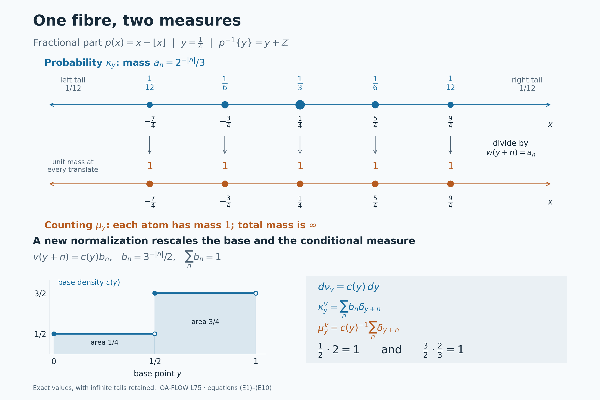

# Conditional measures for arbitrary Borel maps

*Self-checked by the writing AI. Original lesson, figure and reproduction code: CC0-1.0; accompanying font terms retained.*

A conditional measure describes the distribution inside a fibre. Its construction must produce a countably additive measure for each retained base point, and the resulting measures must depend measurably on that point. We construct them by sampling a conditional distribution function with one uniform variable. This also lets us separate two different operations: making an infinite measure finite, and choosing the measure on the base.

The [Haar-class orbit kernels](OA-FLOW-L69.md#oa-flow.orbits.conditional) used an available orbit measure. Here the map is arbitrary: no group action, reference measure on its fibres, or choice of one point from each fibre is assumed. The result applies to standard Borel spaces, meaning measurable spaces isomorphic to Polish spaces with their Borel sigma-algebras. All kernels below act on Borel sets. Completions enter only when taking equivalence classes of functions.

We use the earlier construction of [Lebesgue measure and its translation rule](OA-FLOW-SC.md#sc-02), [scalar L2 completeness](OA-FLOW-SC.md#sc-07), [measure continuity and monotone convergence](OA-FLOW-SC.md#sc-04), [integral convergence estimates](OA-FLOW-SC.md#sc-05), and [the Hilbert Cauchy–Schwarz inequality](OA-FLOW-CF.md#oa-flow.cf.8). Borel coding and finite densities are linked at the precise points where they enter.

## Disintegrating a Borel probability

Let \(X,Y\) be standard Borel spaces, let \(p:X\to Y\) be Borel, and let \(\mu\) be a Borel probability on \(X\). Set \(\nu=p_*\mu\). We use the underlying Borel sigma-algebras in constructing kernels.

A **Borel probability kernel** \(y\mapsto\mu_y\) on \(X\) assigns a countably additive Borel probability \(\mu_y\) to every \(y\in Y\), and makes \(y\mapsto\mu_y(A)\) Borel for every Borel \(A\subseteq X\).

**Probability-disintegration theorem.** There is a Borel probability kernel on \(X\) and a single Borel set \(Y_*\subseteq Y\), with \(\nu(Y_*)=1\), such that
\[
 \begin{aligned}
 \mu_y(p^{-1}\{y\})&=1 &&(y\in Y_*),\\
 \mu(A\cap p^{-1}(D))
   &=\int_D\mu_y(A)\,d\nu(y)
       &&(A\in\mathcal B(X),\ D\in\mathcal B(Y)).
 \end{aligned}
 \tag{P1}
\]
Any two such kernels agree as whole Borel measures on one common conull Borel subset of \(Y\). The kernel also satisfies
\[
 \int_X F(p(x),x)\,d\mu(x)
 =
 \int_Y\int_X F(y,x)\,d\mu_y(x)\,d\nu(y)
 \quad(F:Y\times X\to[0,\infty]\text{ Borel}).
 \tag{P2}
\]
For extra Borel parameters the inner integral is jointly Borel. We will construct the kernel as the pushforward of ordinary Lebesgue probability by a jointly Borel map \(Y\times(0,1)\to X\).

Neither surjectivity of \(p\) nor a section of \(p\) is assumed. A probability on \(X\) makes \(X\) nonempty, so fix one point \(x_0\in X\); it will supply harmless values on discarded base sets. All statements about concentration use the explicit common set \(Y_*\), whereas each \(\mu_y\) is a probability for every \(y\).

## Parameter integrals for a probability kernel

We first give the elementary measure argument used throughout the construction. A family of subsets of a set \(\Omega\) is a **lambda-system** if it contains \(\Omega\), is closed under relative differences \(B\setminus A\) when \(A\subseteq B\) are in the family, and is closed under countable disjoint unions. A **pi-system** is closed under finite intersections. A lambda-system containing a pi-system contains its generated sigma-algebra.

Here is a proof of the last assertion. Include \(\Omega\) in the pi-system if necessary, and let \(\mathcal L\) be the smallest lambda-system containing it. For a member \(P\) of the pi-system, the sets \(A\in\mathcal L\) for which \(A\cap P\in\mathcal L\) form a lambda-system: the whole-space test uses \(P\in\mathcal L\), nested differences remain nested after intersection, and intersections preserve disjoint unions. This lambda-system contains the pi-system, so it contains \(\mathcal L\). Now fix any \(A\in\mathcal L\) and repeat the argument with the sets \(B\in\mathcal L\) such that \(A\cap B\in\mathcal L\). The first step shows that this family contains the pi-system. Hence \(\mathcal L\) is closed under all finite intersections. It is closed under complements by the difference property. Replace an arbitrary countable union by its successive disjoint differences; finite intersections and complements put those differences in \(\mathcal L\), so the union belongs to \(\mathcal L\). Thus \(\mathcal L\) is a sigma-algebra. In particular, two finite measures with the same total mass and agreeing on a generating pi-system agree everywhere.

Suppose \(K_y\) is any Borel probability kernel on a standard Borel space \(E\), with parameter \(y\in Y\). If \(T\) is another standard Borel space and \(f:T\times Y\times E\to[0,\infty]\) is Borel, then
\[
 (t,y)\longmapsto
        \int_E f(t,y,x)\,dK_y(x)
 \quad\hbox{is Borel}.
 \tag{P3}
\]
Indeed the Borel structure of these products is the product sigma-algebra: realize the spaces as Borel subspaces of Polish spaces and use their countable bases. Every section of a product-measurable set is measurable; the sets with that property form a sigma-algebra containing rectangles.

For a Borel subset \(C\subseteq (T\times Y)\times E\), consider the function \(K_y(C_{t,y})\). The sets \(C\) for which this function is Borel form a lambda-system. Its whole-space value is one, nested differences subtract finite measurable functions, and disjoint unions give sums by countable additivity. A rectangle \(B\times A\) has value \(1_B(t,y)K_y(A)\), so all rectangles belong. The preceding pi–lambda proof gives the assertion for every Borel \(C\). Nonnegative simple approximation and monotone convergence prove (P3). This is the [parameter-integration argument used in L69](OA-FLOW-L69.md#oa-flow.orbits.integration), now with an explicitly varying probability kernel. The proof works for arbitrary measurable parameter spaces with their product sigma-algebras as well.

Bounded complex integrands follow by real and imaginary parts. For a Borel complex integrand with finite integral of its absolute value, the same conclusion holds on that Borel finiteness set, with a chosen value such as zero on its complement.

If \(\rho\) is a finite Borel measure on \(Y\), the formula
\[
 \Lambda(C)=\int_YK_y(C_y)\,d\rho(y),
 \qquad C\in\mathcal B(Y\times E),
 \tag{P4}
\]
defines a finite measure. Countable additivity follows by applying countable additivity in every fiber and then scalar monotone convergence. For every nonnegative Borel \(f\), simple approximation gives
\(\int f\,d\Lambda=\int_Y\int_Ef(y,x)\,dK_y(x)\,d\rho(y)\).
The same argument defines the mixture on \(E\) by \(\int K_y(A)\,d\rho(y)\). In the special case of a fixed probability on \(E\), (P3) is ordinary Borel parameter integration. We will use it with Lebesgue measure on \((0,1)\). The limiting integral arguments here use [scalar monotone convergence](OA-FLOW-SC.md#sc-04).

## One real coordinate and countably many derivatives

We need a Borel isomorphism
\[
 c:X\longrightarrow B,\qquad B\subseteq[0,1]\text{ Borel}.
 \tag{P5}
\]
Here are its exact inputs. A standard Borel space has a countable Borel family \((U_n)\) that generates its sigma-algebra and separates its points, obtained from a countable basis in a Polish realization. Define
\[
 c(x)=\sum_{n\ge1}2\,3^{-n}1_{U_n}(x).
 \tag{P6}
\]
Partial sums prove Borel measurability. If two codes first differ at position \(n\), the difference in that term is \(2\,3^{-n}\), while the sum of all subsequent possible differences is \(3^{-n}\). Thus the codes are distinct. The [Borel image and inverse theorem, Theorem 4.3(5)](../../NCG-FOLIATIONS/companions/polish-spaces-and-standard-borel-spaces.html#oa-fnd-pb-06) makes \(B=c(X)\) Borel and \(c^{-1}:B\to X\) Borel. This applies to finite and countable spaces too; the [standard Borel isomorphism theorem](../../NCG-FOLIATIONS/companions/polish-spaces-and-standard-borel-spaces.html#oa-fnd-pb-07) explicitly includes those cases. In particular \(c(A)\) is Borel in \([0,1]\) for every Borel \(A\subseteq X\).

The sets
\[
 A_r=\{x:c(x)\le r\},\qquad r\in\mathbb Q,
 \tag{P7}
\]
form a countable pi-system containing \(X\), and generate \(\mathcal B(X)\). Rational half-lines generate the Borel sets of \([0,1]\), and (P5) transfers that assertion to \(X\). Choose also a countable point-separating Borel family \((D_n)\) for \(Y\), for later use.

For each rational \(r\) define a finite Borel measure on \(Y\) by
\[
 \lambda_r(D)=\mu(A_r\cap p^{-1}(D)),
 \qquad 0\le\lambda_r\le\nu.
 \tag{P8}
\]
The [finite Radon–Nikodym proof from Hilbert representation](../../OA-MOD/OA-MOD-DC.html#oa-mod-dc-05) gives a Borel function \(a_r\) with
\[
 \lambda_r(D)=\int_Da_r(y)\,d\nu(y),
 \qquad 0\le a_r(y)\le1.
 \tag{P9}
\]
To justify the last bound, a nonnegative density greater than one on a positive-measure set would give \(\lambda_r(D)>\nu(D)\) on some set where it exceeds \(1+1/n\). Clip the Borel density to \([0,1]\); this changes it only on a null set. The cited finite-density proof applies directly on the Borel sigma-algebra. If \(L^2\) is taken after completion, its measurable representatives have Borel versions by the simple-approximation argument in the completion section below.

We will repeatedly use the elementary uniqueness test: two real integrable Borel functions having equal integrals over all Borel sets agree almost everywhere. If their difference is positive on a positive-measure set, one of its sets where it is at least \(1/n\) has positive measure, contradicting its zero integral there; apply the same argument to the negative difference.

For \(r<s\), the inequality \(\lambda_r\le\lambda_s\) gives \(a_r\le a_s\) almost everywhere by that sign test. Also \(a_r=0\) almost everywhere for \(r<0\), and \(a_r=1\) almost everywhere for \(r\ge1\). We can enforce all of these relations on one Borel conull set because the rational indices and their pairs are countable.

Right continuity needs a further countable condition. For each rational \(r\),
\(A_{r+1/n}\downarrow A_r\). Continuity from above of the finite measure \(\mu\) gives, for every Borel \(D\subseteq Y\),
\[
 \lambda_{r+1/n}(D)\longrightarrow\lambda_r(D).
 \tag{P10}
\]
This continuity follows from monotone convergence on the increasing complements inside the finite-measure set \(A_{r+1}\cap p^{-1}(D)\).
Outside the null set just removed, \(a_{r+1/n}\) decreases as \(n\) increases and remains in \([0,1]\). Its limit is \(\inf_n a_{r+1/n}\). Apply monotone convergence to \(1-a_{r+1/n}\) on any Borel \(D\), disregarding that fixed null set, and subtract from \(\nu(D)\). This proves convergence of their density integrals to the integral of their infimum. Equation (P10) and the uniqueness test then prove
\(a_r=\inf_n a_{r+1/n}\) almost everywhere. This argument uses only one chosen decreasing sequence for each rational \(r\). Monotonicity implies that this infimum also equals \(\inf_{s\in\mathbb Q,\ s>r}a_s\).

Let \(Y_0\) be the Borel set where all the preceding countably many conditions hold. It has measure one. With \(b_0=c(x_0)\), define for every \(y\in Y\)
\[
 F_r(y)=
 \begin{cases}
  a_r(y),&y\in Y_0,\\
  1_{\{b_0\le r\}},&y\notin Y_0.
 \end{cases}
 \tag{P11}
\]
These functions are Borel, have the same density identities (P9), and now satisfy everywhere
\[
 \begin{gathered}
 0\le F_r\le1,\qquad F_r\le F_s\quad(r<s),\\
 F_r=0\quad(r<0),\qquad F_r=1\quad(r\ge1),\qquad
 F_r=\inf_{\substack{s\in\mathbb Q\\s>r}}F_s.
 \end{gathered}
 \tag{P12}
\]
Thus every base point has a consistent rational distribution function.

## A jointly Borel quantile makes genuine probability measures

Extend the rational data by
\[
 F(y,t)=\inf_{\substack{r\in\mathbb Q\\r>t}}F_r(y),
 \qquad y\in Y,\ t\in\mathbb R.
 \tag{P13}
\]
For each \(y\) this function is nondecreasing, equals zero for \(t<0\), equals one for \(t\ge1\), and has \(F(y,r)=F_r(y)\) at every rational \(r\). It is right-continuous. In fact, if \(t_n\downarrow t\), monotonicity gives \(F(y,t_n)\ge F(y,t)\); for every rational \(r>t\), eventually \(t_n<r\), whence \(F(y,t_n)\le F_r(y)\). Taking the limit and then the infimum in \(r\) proves convergence to \(F(y,t)\). Joint Borel measurability follows from
\[
 \{(y,t):F(y,t)<a\}
 =
 \bigcup_{r\in\mathbb Q}
   \{(y,t):t<r,\ F_r(y)<a\},
 \qquad a\in\mathbb R.
 \tag{P14}
\]

For \(0<u<1\), define
\[
 Q(y,u)=\inf\{r\in\mathbb Q:F_r(y)\ge u\}.
 \tag{P15}
\]
The set in this infimum is nonempty, because it contains every rational \(r\ge1\), and contains no rational \(r<0\). Hence \(Q(y,u)\in[0,1]\). Its strict sublevel sets are
\[
 \{(y,u):Q(y,u)<a\}
 =
 \bigcup_{\substack{r\in\mathbb Q\\r<a}}
       \{(y,u):u\le F_r(y)\}.
 \tag{P16}
\]
An infimum is less than \(a\) exactly when some member of the set is less than \(a\). Each set on the right is Borel. Thus \(Q:Y\times(0,1)\to[0,1]\) is jointly Borel.

Its closed sublevels satisfy the exact equivalence
\[
 Q(y,u)\le t\quad\Longleftrightarrow\quad u\le F(y,t).
 \tag{P17}
\]
For the forward implication, take a rational \(r>t\). Since the infimum in (P15) is less than \(r\), some member \(s<r\) satisfies \(F_s(y)\ge u\). Monotonicity gives \(F_r(y)\ge u\). This holds for every rational \(r>t\), so \(F(y,t)\ge u\). Conversely, if \(u\le F(y,t)\), every rational \(r>t\) satisfies \(F_r(y)\ge u\) and belongs to the set in (P15). Its infimum is at most \(t\). This proof also covers \(t=0,1\) and all possible atoms of the distribution.

Let \(du\) be Lebesgue probability on \((0,1)\) and set
\[
 \kappa_y(E)=\int_0^1 1_E(Q(y,u))\,du,
 \qquad E\in\mathcal B([0,1]).
 \tag{P18}
\]
For each \(y\), this is the pushforward of an actual probability measure. In particular, if the \(E_j\) are disjoint, their inverse images under \(Q(y,\cdot)\) are disjoint, and countable additivity of Lebesgue measure gives countable additivity of \(\kappa_y\). No extension of a finitely additive prescription is being used. Joint Borel measurability of \(Q\) and the fixed-probability case of (P3) make \(\kappa\) a Borel probability kernel.

Equation (P17) gives, for every real \(t\),
\[
 \kappa_y([0,1]\cap(-\infty,t])
 =\int_0^1 1_{\{u\le F(y,t)\}}\,du=F(y,t).
 \tag{P19}
\]
The length of the interval in this integral is \(F(y,t)\), including values zero and one. For rational \(r\), (P9), (P11) and (P19) imply the localized identity
\[
 \mu(\{x:c(x)\in E\}\cap p^{-1}(D))
 =\int_D\kappa_y(E)\,d\nu(y)
 \tag{P20}
\]
when \(E=[0,1]\cap(-\infty,r]\), for every Borel \(D\subseteq Y\).

To obtain (P20) for every Borel \(E\subseteq[0,1]\), fix an arbitrary Borel \(D\). Both sides, as functions of \(E\), are finite measures of total mass \(\nu(D)\). The right side is a measure by (P4), or directly by countable additivity in each fiber and monotone convergence. They agree on the generating pi-system of rational half-lines. The finite-measure uniqueness argument above gives equality for all Borel \(E\). Since \(D\) was arbitrary, (P20) holds for every pair \(E,D\). This is an identity of integrated measures; it introduces no exceptional set depending on \(E\) or \(D\).

Because \(c(x)\in B\) for every \(x\), (P20) with \(E=B\) and \(D=Y\) gives \(\int_Y\kappa_y(B)\,d\nu(y)=1\). Therefore
\[
 Y_B=\{y:\kappa_y(B)=1\}
 \quad\hbox{is Borel and }\nu(Y_B)=1.
 \tag{P21}
\]
The return to \(X\) can itself be made as one Borel randomization:
\[
 \mathcal Q(y,u)=
 \begin{cases}
 c^{-1}(Q(y,u)),&y\in Y_B\text{ and }Q(y,u)\in B,\\
 x_0,&\text{otherwise}.
 \end{cases}
 \tag{P22}
\]
Its defining condition is Borel. On that condition it is a composition of Borel maps; off it the map is constant. Thus \(\mathcal Q:Y\times(0,1)\to X\) is Borel. Put \(\mu_y=(\mathcal Q(y,\cdot))_*du\). These are countably additive probabilities for every \(y\), and (P3) makes them a Borel kernel. More explicitly,
\[
 \mu_y(A)=
 \begin{cases}
 \kappa_y(c(A)),&y\in Y_B,\\
 1_A(x_0),&y\notin Y_B
 \end{cases}
 \qquad(A\in\mathcal B(X)).
 \tag{P23}
\]
On \(Y_B\), the discarded set where \(Q(y,u)\notin B\) has Lebesgue measure zero, which proves this formula. The set \(c(A)\) is Borel by (P5). Applying (P20) to it and using \(\nu(Y\setminus Y_B)=0\) gives
\[
 \int_D\mu_y(A)\,d\nu(y)
 =\mu(A\cap p^{-1}(D))
 \quad(A\in\mathcal B(X),\ D\in\mathcal B(Y)).
 \tag{P24}
\]
The localized integral assertion of the theorem is proved.

## Concentration on one common set of fibers

Use the countable point-separating family \((D_n)\) in \(Y\) chosen above. Set \(A=p^{-1}(D_n)\) in (P24). For every Borel \(D\subseteq Y\),
\[
 \int_D\mu_y(p^{-1}(D_n))\,d\nu(y)
 =\nu(D\cap D_n)
 =\int_D1_{D_n}(y)\,d\nu(y).
 \tag{P25}
\]
The integrands are Borel and lie in \([0,1]\). The uniqueness test therefore gives equality almost everywhere for each \(n\). Define
\[
 Y_*=
 Y_B\cap\bigcap_{n\ge1}
 \{y:\mu_y(p^{-1}(D_n))=1_{D_n}(y)\}.
 \tag{P26}
\]
It is one Borel conull set.

For a fixed \(y\in Y_*\), let \(E_n(y)=p^{-1}(D_n)\) if \(y\in D_n\), and let \(E_n(y)=X\setminus p^{-1}(D_n)\) otherwise. Each \(E_n(y)\) has \(\mu_y\)-measure one. Countable additivity implies that their intersection has measure one, because the union of their null complements is null. Point separation gives the exact set identity
\[
 \bigcap_{n\ge1}E_n(y)=\{x:p(x)=y\}=p^{-1}\{y\}.
 \tag{P27}
\]
Indeed membership means that \(p(x)\) and \(y\) have the same membership in every \(D_n\), which forces equality. This proves the concentration in (P1), simultaneously for all \(y\in Y_*\). In particular \(Y_*\subseteq p(X)\); no Borel-image assertion about the entire set \(p(X)\) was needed.

We can now prove the full integration statement (P2). From (P24) with \(D=Y\), simple approximation and monotone convergence give
\[
 \int_Xg(x)\,d\mu(x)
 =\int_Y\int_Xg(x)\,d\mu_y(x)\,d\nu(y)
 \quad(g:X\to[0,\infty]\text{ Borel}).
 \tag{P28}
\]
For a nonnegative Borel \(F(y,x)\), put \(g(x)=F(p(x),x)\), which is Borel. When \(y\in Y_*\), concentration gives \(F(y,x)=g(x)\) for \(\mu_y\)-almost every \(x\). Integrating (P28) proves (P2). All inner integrals are Borel by (P3). Both sides allow the value \(+\infty\), so this argument imposes no hidden integrability restriction.

The same construction also makes the set
\(\{(y,u):p(\mathcal Q(y,u))=y\}\) Borel. Equality of two points of \(Y\) is the countable intersection of the conditions that their memberships in every \(D_n\) agree. For each \(y\in Y_*\), this set's section has Lebesgue measure one by (P27). Thus the quantile construction represents the conditional laws by one genuinely joint Borel map, with the asserted fiber concentration.

## Uniqueness of the whole conditional measure

Suppose \(y\mapsto\widetilde\mu_y\) is another Borel probability kernel satisfying the localized identity (P24). For each rational \(r\), both Borel functions \(\mu_y(A_r)\) and \(\widetilde\mu_y(A_r)\) have the same integrals on every Borel \(D\subseteq Y\). Hence they agree almost everywhere. The countable intersection
\[
 Y_{\mathrm{eq}}
 =\bigcap_{r\in\mathbb Q}
       \{y:\mu_y(A_r)=\widetilde\mu_y(A_r)\}
 \tag{P29}
\]
is Borel and conull. For each fixed \(y\) in it, the two probabilities agree on the countable generating pi-system (P7). The finite-measure uniqueness principle from the integration section therefore gives
\[
 \mu_y(A)=\widetilde\mu_y(A)
 \quad\hbox{for every Borel }A\subseteq X
 \quad(y\in Y_{\mathrm{eq}}).
 \tag{P30}
\]
The exceptional set is independent of \(A\). Intersecting it with the two kernels' concentration sets, if desired, retains one Borel conull set for all conclusions.

The common alternate formulation assumes only that the second kernel is concentrated on \(p^{-1}\{y\}\) on a conull set and that
\(\mu(A)=\int\widetilde\mu_y(A)\,d\nu(y)\).
It implies the localized hypothesis used above. On that concentration set, for every Borel \(A,D\),
\[
 \widetilde\mu_y(A\cap p^{-1}(D))
       =1_D(y)\widetilde\mu_y(A).
 \tag{P31}
\]
Integrate this identity and use the mixture formula for the single Borel set \(A\cap p^{-1}(D)\). Thus uniqueness as whole Borel measures holds under either formulation.

## Borel kernels and completed measure spaces

The construction has given a kernel on \(\mathcal B(X)\), with Borel dependence on the original Borel base. Completion does not change any of the integral identities for fixed measurable classes, but its use must be stated precisely.

First, a function measurable for the completion of a finite Borel measure has a Borel version. For a nonnegative function, choose a sequence of finite-valued measurable functions converging to it, for instance its truncated dyadic approximations. Each of the countably many measurable sets used by these simple functions differs from a Borel set by a subset of a Borel null set, by the definition of completion. Replace all those sets by their Borel versions and take the countable union \(N\) of their Borel null carriers. Off \(N\), the resulting Borel simple functions have the same pointwise limit as the original sequence. Their pointwise upper limit is Borel; define it to be zero on \(N\). This is the required Borel version, with infinite values allowed when appropriate. Apply the argument to real and imaginary positive and negative parts for a finite complex function, and set the value to zero on any Borel null set where those differences are not finite. The same proof applies to \(\mu\) and to \(\nu\).

If \(N\subseteq X\) is a Borel \(\mu\)-null set, (P28) gives
\[
 \int_Y\mu_y(N)\,d\nu(y)=0,\qquad
 \mu_y(N)=0\quad\text{for }\nu\text{-almost every }y.
 \tag{P32}
\]
The good set \(\{y:\mu_y(N)=0\}\) is Borel. If \(f_0,f_1\) are two Borel versions of the same completed measurable function, their disagreement is contained in such a Borel null set. Hence their integrals against \(\mu_y\) agree almost everywhere whenever those integrals are defined. For a nonnegative completed function use either Borel version in (P28); (P32) makes the resulting extended-valued base function well defined modulo \(\nu\)-null sets. For a complex \(L^1(\mu)\) function, (P28) applied to its absolute value makes its conditional absolute integral finite almost everywhere, and the complex integrals give a well-defined \(L^1(\nu)\) class.

More explicitly, if \(E\) belongs to the \(\mu\)-completion, choose Borel sets \(A,B\) with
\(A\subseteq E\subseteq B\) and \(\mu(B\setminus A)=0\). For every \(y\) in the Borel conull set supplied by (P32) for \(N=B\setminus A\), the set \(E\) belongs to the completion of \(\mu_y\), and
\[
 \overline{\mu_y}(E)=\mu_y(A)=\mu_y(B).
 \tag{P33}
\]
Here the bar denotes completion of that individual measure. This assertion is for the specified \(E\); its conull set may depend on \(E\). The theorem does not require a single Borel kernel defined on all subsets added by the completion of \(\mu\).

Likewise, if \(D\) is in the \(\nu\)-completion, choose a Borel \(D_0\) whose symmetric difference with it is contained in a Borel \(\nu\)-null set \(N_Y\). Since \(\mu(p^{-1}(N_Y))=\nu(N_Y)=0\), the set \(p^{-1}(D)\) is in the \(\mu\)-completion and agrees there with \(p^{-1}(D_0)\). The localized identities therefore extend to such fixed completed sets and to fixed completed function classes by choosing Borel versions. Joint parameter statements such as (P3), and the kernel itself, retain their explicit underlying-Borel meaning.

## The completed probability disintegration theorem

For any Borel map \(p:X\to Y\) of standard Borel spaces and Borel probability \(\mu\) on \(X\), put \(\nu=p_*\mu\). The jointly Borel map \(\mathcal Q:Y\times(0,1)\to X\) in (P22) produces a Borel probability kernel \(\mu_y\) at every base point. Its localized identity holds for every pair of Borel sets, and its measures are concentrated on \(p^{-1}\{y\}\) on one Borel \(\nu\)-conull set. Any other kernel with these properties agrees as a whole measure on one common conull set. Every nonnegative jointly Borel integrand satisfies (P2), with extra-parameter measurability (P3).

The complete proof is the [rational-density construction](#oa-flow.kernel.coding), the [joint quantile and return map](#oa-flow.kernel.quantile), [concentration and full integration](#oa-flow.kernel.concentration), and [whole-measure uniqueness](#oa-flow.kernel.uniqueness). The [kernel integration proof](#oa-flow.kernel.integration) supplies parameter measurability throughout. The [completion argument](#oa-flow.kernel.completion) gives precisely the corresponding statements for fixed completed classes. Thus the construction proves all assertions of (P1)–(P2), with no restriction on the fibres or on the image of \(p\).

## Sigma-finite measures and a finite normalization

Let \(X,Y\) be standard Borel spaces, let \(p:X\to Y\) be Borel, and let \(\mu\) be a nonzero sigma-finite Borel measure on \(X\). We construct a disintegration without assuming that \(p_*\mu\) is sigma-finite. Kernels are defined on the Borel sets; completed equivalence classes are handled by Borel representatives.

Choose a countable Borel partition \((E_j)_{j\ge1}\) of \(X\) with \(\mu(E_j)<\infty\). Such a partition is obtained by taking successive differences of a finite-measure exhaustion. Put
\[
 \widetilde w(x)=\sum_{j\ge1}
       \frac{2^{-j}}{1+\mu(E_j)}1_{E_j}(x),\qquad
 Z=\int_X\widetilde w\,d\mu,\qquad w=Z^{-1}\widetilde w.
 \tag{S1}
\]
The function \(\widetilde w\) is Borel, strictly positive and finite at every point. Its integral is at most \(\sum_j2^{-j}=1\) and is positive because \(\mu\ne0\). Thus \(w\) is bounded, strictly positive and finite everywhere, with \(\int_Xw\,d\mu=1\). The argument below applies to any such positive finite Borel normalization, whether or not it is bounded.

Set
\[
 \rho=w\mu,\qquad \nu_0=p_*\rho.
 \tag{S2}
\]
These are probabilities. Apply the [probability disintegration theorem](#oa-flow.kernel.probability) to \((X,\rho,p)\). It gives a Borel probability kernel \(\kappa_y\) with mixture \(\rho\), and a Borel \(\nu_0\)-conull set on which \(\kappa_y\) is concentrated on \(p^{-1}\{y\}\).

Define, for every Borel \(A\subseteq X\),
\[
 \mu_y(A)=\int_X\frac{1_A(x)}{w(x)}\,d\kappa_y(x).
 \tag{S3}
\]
For each \(y\), this is a measure: countable additivity follows from monotone convergence applied to disjoint sums of indicators. The [kernel integration theorem](#oa-flow.kernel.integration) shows that \(y\mapsto\mu_y(A)\) is Borel, with the value \(+\infty\) permitted. In fact every one of these measures is sigma-finite, with the same explicit exhaustion:
\[
 X_n=\{x:w(x)\ge1/n\},\qquad
 X_n\uparrow X,\qquad \mu_y(X_n)\le n\kappa_y(X_n)\le n.
 \tag{S4}
\]
There is no exceptional set in (S4). Since \(0<w<\infty\), \(\mu_y\) and \(\kappa_y\) have exactly the same null sets. Hence the retained fibres have the required support. Integration of a nonnegative simple function, followed by monotone convergence, also gives the normalization
\[
 \int_X w(x)\,d\mu_y(x)=1\qquad(y\in Y).
 \tag{S5}
\]

For Borel \(A\subseteq X\) and \(D\subseteq Y\), the localized probability identity, applied first to simple functions and then to \(1_A/w\), gives
\[
 \begin{aligned}
 \int_D\mu_y(A)\,d\nu_0(y)
 &=\int_{p^{-1}D}\frac{1_A(x)}{w(x)}\,d\rho(x)\\
 &=\mu(A\cap p^{-1}D).
 \end{aligned}
 \tag{S6}
\]
Both sides may be infinite. Every step uses nonnegative integration, so no subtraction of infinite values occurs.

More generally, for every nonnegative Borel function \(F:Y\times X\to[0,\infty]\),
\[
 \int_Y\int_X F(y,x)\,d\mu_y(x)\,d\nu_0(y)
       =\int_X F(p(x),x)\,d\mu(x).
 \tag{S7}
\]
Indeed the inner integral equals \(\int_X F(y,x)/w(x)\,d\kappa_y(x)\), first for simple functions and then by monotone convergence. The probability-kernel integration theorem therefore makes it Borel in \(y\). For that probability kernel, the analogous identity follows from its localized indicator identity by the rectangle class argument and nonnegative simple approximation. Apply that identity to \(F(y,x)/w(x)\) and use (S3). This proves (S7) in its full parameter-dependent form. For a complex Borel \(F\) whose corresponding absolute-value integral is finite, apply the nonnegative result to its positive and negative real and imaginary parts. In particular (S6) is a disintegration of the entire measure, rather than only of a prescribed finite family of sets.

The probabilities in (S2) and the sigma-finite measures in (S3) have different roles. The base measure is the pushforward of a chosen finite normalization. The conditional measures recover the original, possibly infinite, mass.

## Uniqueness and change of normalization

The normalization in (S5) fixes the base as well as the conditional measures. To prove this, suppose that \(\tau_y\) is a Borel measure kernel and \(\nu\) is a sigma-finite Borel measure on \(Y\), with

- \(\tau_y\) concentrated on \(p^{-1}\{y\}\) for \(\nu\)-almost every \(y\);
- \(\mu(A)=\int_Y\tau_y(A)\,d\nu(y)\) for every Borel \(A\subseteq X\);
- \(\int_Xw\,d\tau_y=1\) for \(\nu\)-almost every \(y\).

The mixture identity extends to all nonnegative Borel functions by simple approximation. Fibre support and normalization therefore imply, for every Borel \(D\subseteq Y\),
\[
 \begin{aligned}
 \nu(D)
 &=\int_Y\int_X1_D(p(x))w(x)\,d\tau_y(x)\,d\nu(y)\\
 &=\int_{p^{-1}D}w\,d\mu=\nu_0(D).
 \end{aligned}
 \tag{S8}
\]
Thus \(\nu=\nu_0\). The normalizing condition also implies sigma-finiteness of \(\tau_y\) on its conull set, since the sets \(X_n\) from (S4) have \(\tau_y\)-mass at most \(n\).

The kernel
\[
 \widetilde\kappa_y(A)=\int_Aw\,d\tau_y
 \tag{S9}
\]
is a probability kernel on that conull set. On its Borel null complement choose any fixed point mass on \(X\), which is nonempty because \(\mu\ne0\). Its mixture is \(\rho\) and it has the same fibre support. The uniqueness part of the probability theorem gives \(\widetilde\kappa_y=\kappa_y\) as measures on all Borel sets, on one common conull set. Multiplying these equal measures by the Borel density \(w^{-1}\) gives \(\tau_y=\mu_y\) there. This proves normalized uniqueness, including uniqueness of the base.

If the base has already been fixed as \(\nu_0\) and the entire localized identity (S6) is assumed, the normalization is automatic. Its extension to \(w\) gives \(\int_D\int_Xw\,d\tau_y\,d\nu_0=\nu_0(D)\) for every \(D\); testing the measurable sets where the inner function is above or below one proves that it equals one almost everywhere.

Now choose another strictly positive finite Borel function \(v\) with \(\int_Xv\,d\mu=1\), and define
\[
 r(y)=\int_Xv(x)\,d\mu_y(x)
     =\int_X\frac{v(x)}{w(x)}\,d\kappa_y(x).
 \tag{S10}
\]
This function is Borel and strictly positive: the integrand in the last integral is everywhere positive and \(\kappa_y\) has mass one. Formula (S7) gives \(\int_Yr\,d\nu_0=1\), so \(r<\infty\) almost everywhere. On the Borel conull set where \(0<r<\infty\), put
\[
 \begin{aligned}
 \nu_v&=r\nu_0=p_*(v\mu),\\
 \mu_y^{\,v}&=r(y)^{-1}\mu_y,\\
 \kappa_y^{\,v}(A)
   &=r(y)^{-1}\int_Av\,d\mu_y
     =\int_A\frac{v(x)}{r(y)w(x)}\,d\kappa_y(x).
 \end{aligned}
 \tag{S11}
\]
The base equality follows by applying (S7) to \(1_D(y)v(x)\). Thus \(\nu_v\) and \(\nu_0\) have the same null sets. On the common conull set, \(\kappa_y^{\,v}\) has mass one, \(\int_Xv\,d\mu_y^{\,v}=1\), and the two kernels have the original fibre support. On the discarded set choose \(\kappa_y^{\,v}=\delta_{x_0}\) and \(\mu_y^{\,v}=v(x_0)^{-1}\delta_{x_0}\), for a fixed \(x_0\in X\). These choices make whole-base Borel kernels and preserve their normalization. Each \(\mu_y^{\,v}\) is sigma-finite; alternatively its sets \(\{v\ge1/n\}\) have mass at most \(n\).

For every Borel \(A,D\), cancellation of the positive finite scalar on the conull set yields
\[
 \int_D\mu_y^{\,v}(A)\,d\nu_v(y)
      =\int_D\mu_y(A)\,d\nu_0(y)
      =\mu(A\cap p^{-1}D).
 \tag{S12}
\]
The same formula with \(v1_A\) proves that \(\kappa_y^{\,v}\) disintegrates \(v\mu\). The probability theorem's uniqueness identifies it with any independently constructed probability disintegration of that measure. Thus (S11) is the exact normalization-change formula, on one conull set as an equality of measures, including their infinite values.

More generally, if \(s:Y\to(0,\infty)\) is finite and Borel, then
\[
 d\widehat\nu=s\,d\nu_0,\qquad
 \widehat\mu_y=s(y)^{-1}\mu_y,
 \qquad \int_Xw\,d\widehat\mu_y=s(y)^{-1}.
 \tag{S13}
\]
The measure \(\widehat\nu\) is sigma-finite, since \(\{s\le n\}\) has measure at most \(n\); these sets cover \(Y\). The same cancellation proves the localized mixture identity for \((\widehat\nu,\widehat\mu_y)\). The last formula shows exactly how this base change affects the fixed \(w\)-normalization.

## When the original pushforward is a suitable base

Suppose now that \(\theta=p_*\mu\) is sigma-finite. It is nonzero. Choose a strictly positive finite Borel function \(b\) on \(Y\) with \(\int_Yb\,d\theta=1\), using the construction in (S1) on \(Y\), and take
\[
 w=b\circ p,\qquad \rho=(b\circ p)\mu,
 \qquad \nu_0=b\theta.
 \tag{S14}
\]
On every retained fibre, \(w(x)=b(y)\) for \(\mu_y\)-almost every \(x\). The normalization (S5) gives \(b(y)\mu_y(X)=1\). Consequently
\[
 \lambda_y=b(y)\mu_y=\kappa_y,
 \qquad \lambda_y(X)=1,
 \qquad
 \mu(A\cap p^{-1}D)=\int_D\lambda_y(A)\,d\theta(y).
 \tag{S15}
\]
Here equality with \(\kappa_y\) follows from \(\kappa_y=w\mu_y\) and the fibre support. Taking \(\lambda_y=\kappa_y\) everywhere provides a whole-base probability kernel, with the support assertion outside one \(\theta\)-null set; \(\theta\) and \(\nu_0\) have the same null sets. Probability-kernel uniqueness is retained over the sigma-finite base: multiply it by \(b\), use the finite probability theorem, and then cancel \(b>0\).

Conversely, if a mixture of probability kernels supported on the fibres represents \(\mu\) over a sigma-finite base \(\theta\), applying the mixture to \(p^{-1}D\) gives \(p_*\mu(D)=\theta(D)\). Thus sigma-finiteness of the pushforward is necessary for such a probability disintegration over a sigma-finite base. It is not automatic from sigma-finiteness of \(\mu\).

If \(\mu=0\), no positive normalization can have integral one. Use instead the zero measure on \(Y\) and the zero kernel \(\mu_y=0\). All mixture identities hold, and every zero conditional measure is sigma-finite. Assertions required only almost everywhere on this zero base are vacuous. If probability fibres are desired, restrict to the empty conull base; this also handles \(X=\varnothing\), where a probability measure on \(X\) does not exist. If \(Y=\varnothing\) and a map \(p:X\to Y\) is given, then \(X=\varnothing\) necessarily. These cases require no choice of a nonexistent point mass.

## Fractional part: probabilities become counting measures

Let \(X=\mathbb R\) with Lebesgue measure \(\mu\), let \(Y=[0,1)\), and put
\[
 p(x)=x-\lfloor x\rfloor,\qquad
 x=y+n\quad(y\in[0,1),\ n\in\mathbb Z).
 \tag{E1}
\]
The half-open partition \(\mathbb R=\coprod_{n\in\mathbb Z}[n,n+1)\) makes this representation unique, including at integers. The map \(p\) is Borel because it is continuous on each partition piece.

Choose
\[
 a_n=\frac{2^{-|n|}}3,\qquad w(y+n)=a_n,
 \qquad
 \sum_{n\in\mathbb Z}a_n
   =\frac13\left(1+2\sum_{n\ge1}2^{-n}\right)=1.
 \tag{E2}
\]
The function \(w\) is positive, finite and Borel. Nonnegative integration on the half-open partition gives \(\int_\mathbb Rw(x)\,dx=\sum_na_n=1\). For every Borel \(D\subseteq[0,1)\), translation invariance of Lebesgue measure gives
\[
 \nu_0(D)=\int_{p^{-1}D}w(x)\,dx
          =\sum_na_n\,|D|=|D|.
 \tag{E3}
\]
Thus the normalized base is ordinary Lebesgue probability on \([0,1)\).

Define for every \(y\in[0,1)\)
\[
 \kappa_y=\sum_{n\in\mathbb Z}a_n\delta_{y+n},
 \qquad
 \mu_y=\sum_{n\in\mathbb Z}\delta_{y+n}.
 \tag{E4}
\]
For each Borel \(A\subseteq\mathbb R\), the functions \(1_A(y+n)\) are Borel. Their nonnegative sums show that both displayed families are Borel kernels. The first has total mass one. The second is counting measure on the complete fibre \(y+\mathbb Z\), is infinite on that fibre, and is sigma-finite: its restriction to the points with \(|n|\le N\) has mass \(2N+1\). Division of the mass \(a_n\) by \(w(y+n)=a_n\) gives exactly the second kernel, as in (S3).

For every nonnegative Borel \(f\) and Borel \(D\subseteq[0,1)\), countable additivity, Tonelli and translation of the integration variable give
\[
 \begin{aligned}
 \int_D\int_\mathbb R f(x)\,d\mu_y(x)\,dy
 &=\sum_{n\in\mathbb Z}\int_D f(y+n)\,dy\\
 &=\int_{p^{-1}D}f(x)\,dx.
 \end{aligned}
 \tag{E5}
\]
Replacing the summands by \(a_nf(y+n)\) proves the corresponding identity for \(\kappa_y\) and \(w\mu\). Also \(\int w\,d\mu_y=\sum_na_n=1\) for every \(y\). Thus all parts of the normalized disintegration are verified directly in this example.

The original pushforward behaves differently:
\[
 (p_*\mu)(D)=\sum_{n\in\mathbb Z}|D|
 =\begin{cases}
 0,&|D|=0,\\
 +\infty,&|D|>0.
 \end{cases}
 \tag{E6}
\]
It is not sigma-finite. If countably many sets of finite \(p_*\mu\)-measure covered \([0,1)\), each would have Lebesgue measure zero by (E6), and their union would still be Lebesgue-null. This contradicts the Lebesgue measure one of \([0,1)\). Notice that each individual fibre is countable and hence \(\mu\)-null; the infinite conditional counting measure is nevertheless the correct measure on that fibre.

We can change both the normalization and its resulting base. Put
\[
 b_n=\frac{3^{-|n|}}2,
 \qquad
 c(y)=\begin{cases}
 \tfrac12,&0\le y<\tfrac12,\\
 \tfrac32,&\tfrac12\le y<1,
 \end{cases}
 \qquad v(y+n)=c(y)b_n.
 \tag{E7}
\]
The geometric sum is \(\sum_nb_n=\tfrac12(1+2\cdot\tfrac12)=1\), and \(\int_0^1c(y)\,dy=\tfrac14+\tfrac34=1\). Hence \(v\) is another strictly positive finite Borel function of integral one on \(\mathbb R\). Its function (S10) is
\[
 r(y)=\int v\,d\mu_y=\sum_nc(y)b_n=c(y).
 \tag{E8}
\]
The complete change-of-normalization formulas are therefore
\[
 \begin{aligned}
 d\nu_v(y)&=c(y)\,dy,\\
 \kappa_y^{\,v}&=\sum_nb_n\delta_{y+n},\\
 \mu_y^{\,v}&=c(y)^{-1}\sum_n\delta_{y+n}
 =\begin{cases}
 2\displaystyle\sum_n\delta_{y+n},&0\le y<\tfrac12,\\
 \tfrac23\displaystyle\sum_n\delta_{y+n},&\tfrac12\le y<1.
 \end{cases}
 \end{aligned}
 \tag{E9}
\]
For example, at each point \(y+n\), formula (S11) changes the old probability mass by
\[
 \frac{v(y+n)}{r(y)w(y+n)}a_n
       =\frac{c(y)b_n}{c(y)a_n}a_n=b_n.
 \tag{E10}
\]
Moreover \(\int v\,d\mu_y^{\,v}=\sum_nb_n=1\). Multiplication of the conditional mass \(c(y)^{-1}\) by the base density \(c(y)\) recovers exactly (E5). All these equalities hold at every base point, including \(y=1/2\) with the convention in (E7).

*Figure 75.1. The displayed fibre is \(y+\mathbb Z\) at \(y=1/4\). Five atoms are shown; the arrows continue the whole infinite fibre. The probability tails beyond those five atoms each have mass \(1/12\), so the displayed probability is not a finite truncation renormalized to one. Dividing each mass by \(w(y+n)=a_n\) gives unit counting mass at every integer translate, as in (E4). The lower panel gives the exact base density and reciprocal conditional masses for (E7)–(E9).*

**Problem.** In the second normalization, what are the masses of the point \(y+2\) at \(y=1/4\) and \(y=3/4\), for the probability kernel and for the kernel representing Lebesgue measure? How do the base densities compensate?

**Solution.** In both probability kernels, the point has mass \(b_2=1/18\). In \(\mu_y^{\,v}\), it has mass \(2\) at \(y=1/4\) and \(2/3\) at \(y=3/4\). The respective base densities are \(1/2\) and \(3/2\), whose products with those conditional masses are both one. These are density values at the indicated base points, not positive masses of singleton base sets. The base measure remains nonatomic.

## Composing conditional measures

Let \(X,Y,Z\) be standard Borel spaces, let \(p:X\to Y\) and \(q:Y\to Z\) be Borel, and let \(\mu\) be a probability on \(X\). Put \(\nu=p_*\mu\) and \(\eta=q_*\nu\). Apply [the probability theorem](#oa-flow.kernel.probability) to obtain kernels \(\mu_y\) for \(p\) and \(\nu_z\) for \(q\). Define
\[
 \rho_z(A)=\int_Y\mu_y(A)\,d\nu_z(y),\qquad A\in\mathcal B(X).
 \tag{T1}
\]
For each \(z\), this is a probability: the value at \(X\) is one, and countable additivity follows by applying monotone convergence to a disjoint union inside the integral. The value in (T1) is Borel in \(z\) by [kernel integration](#oa-flow.kernel.integration). Thus \(\rho\) is a Borel probability kernel.

For every Borel \(A\subseteq X\) and \(E\subseteq Z\), the localized identities for the two original kernels give
\[
 \begin{aligned}
 \int_E\rho_z(A)\,d\eta(z)
 &=\int_{q^{-1}E}\mu_y(A)\,d\nu(y)\\
 &=\mu\bigl(A\cap(q\circ p)^{-1}E\bigr).
 \end{aligned}
 \tag{T2}
\]
The first equality holds for the bounded Borel function \(y\mapsto\mu_y(A)\), by simple approximation of the localized identity for \(\nu_z\). No interchange of signed or undefined integrals is involved.

The fibre support can be checked on one common set. Let \(N\subseteq Y\) be a Borel \(\nu\)-null set outside which \(\mu_y(p^{-1}\{y\})=1\). Since
\[
 \int_Z\nu_z(N)\,d\eta(z)=\nu(N)=0,
 \tag{T3}
\]
the Borel condition \(\nu_z(N)=0\) holds off one \(\eta\)-null set. Intersect it with the Borel conull set on which \(\nu_z(q^{-1}\{z\})=1\). For each retained \(z\), almost every \(y\) under \(\nu_z\) lies in \(q^{-1}\{z\}\setminus N\). For each such \(y\), the inclusion
\(p^{-1}\{y\}\subseteq(q\circ p)^{-1}\{z\}\)
forces \(\mu_y((q\circ p)^{-1}\{z\})=1\). Equation (T1) therefore gives
\[
 \rho_z((q\circ p)^{-1}\{z\})=1.
 \tag{T4}
\]
Together with (T2), this proves that \(\rho\) is a conditional probability kernel for \(q\circ p\). The [whole-measure uniqueness theorem](#oa-flow.kernel.uniqueness) identifies it with any other such kernel on one conull set, simultaneously for all Borel \(A\).

## Conditional averaging and the tower identity

For a nonnegative Borel function \(f\) on \(X\), define
\[
 (T_pf)(y)=\int_X f(x)\,d\mu_y(x).
 \tag{T5}
\]
It is Borel, and its integral is \(\int_X f\,d\mu\). If \(f\) is complex and integrable, then \(T_p|f|\) is finite almost everywhere; define \(T_pf\) by its absolutely convergent integral there and set it to zero on the exceptional Borel set. This represents a well-defined element of \(L^1(Y,\nu)\). Indeed, if two Borel versions of \(f\) agree \(\mu\)-almost everywhere, integrating the absolute value of their difference shows that their kernel integrals agree \(\nu\)-almost everywhere. The pointwise triangle inequality gives
\[
 \|T_pf\|_{L^1(\nu)}\leq\|f\|_{L^1(\mu)}.
 \tag{T6}
\]
For each Borel \(D\subseteq Y\), simple approximation, followed by the positive and negative parts, proves
\[
 \int_D T_pf\,d\nu=\int_{p^{-1}D}f\,d\mu.
 \tag{T7}
\]
Thus \((T_pf)\circ p\) is conditional expectation onto the sigma-algebra \(p^{-1}\mathcal B(Y)\): it is measurable for that sigma-algebra and has the defining integral on every member. The same representative gives conditional expectation for its completion, since changing an integration set by a null set changes neither integral. The existence of Borel versions for the completed equivalence classes is justified in [the completion discussion](#oa-flow.kernel.completion).

If \(b\) is a bounded Borel function on \(Y\), fibre support gives, for almost every \(y\),
\[
 T_p\bigl((b\circ p)f\bigr)(y)=b(y)T_pf(y).
 \tag{T8}
\]
Here the function \(b\circ p\) is the constant \(b(y)\) on the full-measure subset \(p^{-1}\{y\}\) of that fibre. This proves the multiplication rule directly. The essential \(L^\infty\) bound follows in the same way from integrating the null set on which a chosen version exceeds its bound. For \(f\in L^2(\mu)\), Cauchy–Schwarz in the probability \(\mu_y\), followed by integration, gives
\[
 |T_pf(y)|^2\leq T_p(|f|^2)(y),\qquad
 \|T_pf\|_{L^2(\nu)}\leq\|f\|_{L^2(\mu)}.
 \tag{T9}
\]
The exceptional set where the right side is infinite is null. These estimates apply to completed \(L^p\) classes through their Borel versions, without asserting that every subset of a globally null set has been added to every fibre sigma-algebra.

Finally (T1) and nonnegative simple approximation give the tower identity
\[
 \int_Xf\,d\rho_z
 =\int_Y\left(\int_Xf\,d\mu_y\right)d\nu_z(y),
 \qquad T_{q\circ p}f=T_q(T_pf)
 \quad\text{in }L^1(Z,\eta).
 \tag{T10}
\]
For nonnegative Borel \(f\), the first equality is valid for every \(z\), with extended nonnegative values, when \(T_pf\) is the pointwise integral. For integrable complex \(f\), apply it first to \(|f|\); the resulting finite integral almost everywhere justifies subtraction and complex linearity. Replacing the pointwise integral by its chosen \(L^1\) representative changes the answer only on an \(\eta\)-null set, because \(\nu_z\) gives zero mass to any fixed \(\nu\)-null set for almost every \(z\), as in (T3). This proves the identity for the full integrable class.

## Exercises with solutions

**1. Conditional masses and a tower.** Give \(X=\{a,b,c,d\}\) masses \(1/6,1/3,1/4,1/4\), respectively. Let \(p\) send \(a,b\) to \(0\) and \(c,d\) to \(1\). Compute its conditional probabilities and the conditional average of \(f(a)=0,f(b)=3,f(c)=2,f(d)=4\). Then send both base points to a single point.

**Solution.** Both fibres have mass \(1/2\). Dividing the original masses by that fibre mass gives
\[
 \mu_0=\tfrac13\delta_a+\tfrac23\delta_b,\qquad
 \mu_1=\tfrac12\delta_c+\tfrac12\delta_d.
 \tag{X1}
\]
These probabilities satisfy the localized identity by summing the indicated atoms, for every pair of subsets. The averages are \(T_pf(0)=2\) and \(T_pf(1)=3\). The conditional measure for the map to a single point is \(\mu\) itself. The tower average is \((2+3)/2=5/2\), equal to
\(0/6+3/3+2/4+4/4\).

**2. Why fibre support must be simultaneous.** Suppose a probability kernel satisfies the localized identity for a Borel map \(p:X\to Y\). Let \((D_n)\) be a countable family of Borel sets separating points of \(Y\). Derive fibre support without taking a union over all Borel subsets of \(Y\).

**Solution.** Put \(g_n(y)=\mu_y(p^{-1}D_n)\). Localization gives \(\int_D g_n\,d\nu=\nu(D\cap D_n)\) for every Borel \(D\). Uniqueness of finite densities yields \(g_n=1_{D_n}\) almost everywhere. Discard the countable union of these Borel null sets. For any remaining \(y\), all sets
\[
 A_{n,y}=\begin{cases}p^{-1}D_n,&y\in D_n,\\
 X\setminus p^{-1}D_n,&y\notin D_n\end{cases}
 \tag{X2}
\]
have \(\mu_y\)-mass one. Their countable intersection has mass one, and point separation makes it exactly \(p^{-1}\{y\}\). The same exceptional set works for every fibre-support assertion.

**3. Recovering an infinite measure from a probability.** In the fractional-part example, let \(f\geq0\) be Borel on \(\mathbb R\). Explain why removing the geometric masses gives the full Lebesgue integral, even if that integral is infinite.

**Solution.** At the point \(y+n\), the conditional probability mass is \(a_n=2^{-|n|}/3\) and the normalizing function is \(w(y+n)=a_n\). Weighting by \(w^{-1}\) therefore gives mass one. Consequently the integral is
\[
 \int_0^1\sum_{n\in\mathbb Z}f(y+n)\,dy
 =\sum_{n\in\mathbb Z}\int_{[n,n+1)}f(x)\,dx
 =\int_{\mathbb R}f(x)\,dx.
 \tag{X3}
\]
Monotone convergence for finite partial sums justifies both the sum and the infinite value; the half-open intervals form a disjoint partition of the real line. No finite measure is attributed to a whole counting fibre.
