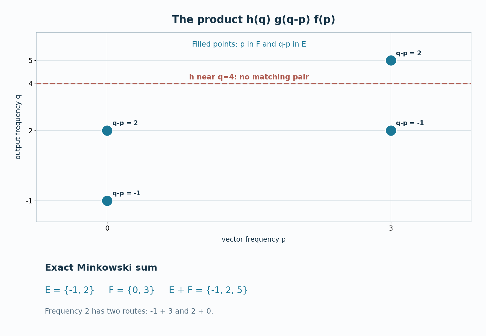

# Why operator and vector frequencies add

An operator carrying a frequency can shift a vector's frequency. For general dual Banach actions, this principle must be proved through normal maps and weak-star limits: multiplication of a varying operator and a varying vector is not jointly weak-star continuous. A two-variable Fourier transform of an explicit three-kernel integral gives the frequency-sum law first for filtered objects. Closed/open localization then removes the filters one at a time. The result has the full closed-set generality of Takesaki II, Corollary XI.1.7.

*Written in Codex (OpenAI), September 2026; provider restoration October 2026. No human review is claimed. Newly written original expression in this lesson and its figure is dedicated under CC0.*

## The three actions and the claim

Use [MX0–3](OA-FLOW-MX.md#mx-0) and the earlier specified-dual [BS0–4](OA-FLOW-BS.md#bs-0), with the positive Fourier sign (MX1). Thus \(G\) is an arbitrary locally compact Hausdorff abelian group, \(H=\widehat G\), \(X=X_*^*\) and \(Y=Y_*^*\) have specified preduals, and \(\alpha,\beta\) are uniformly bounded normal actions with norm-continuous predual orbits. The induced action on \(\mathcal L_w(X,Y)\) is \(\gamma_t(B)=\beta_tB\alpha_{-t}\), with Fourier filter \(\Gamma_g\). Its relative topology \(\sigma_0\) is tested by the full projective tensor product; MX2 proves filter continuity for arbitrary convergent nets in this topology. It implies pointwise weak-star convergence, which is the implication used for the final operator limit here. For a closed set \(E\subset H\), \(\mathcal L_w^\gamma(E)=V_\gamma(E)\) denotes operators whose \(\gamma\)-spectrum lies in \(E\). The vector filter laws used below as (S5), (S14) and (S16) are respectively BS1's norm bound, BS3's closed-space annihilator test and BS3's filtered support inclusion, transported by (MX1).

**Spectral-sum theorem.** For any closed \(E,F\subset H\), normal operator \(A\in\mathcal L_w^\gamma(E)\) and vector \(x\in X_\alpha(F)\),

$$Ax\in Y_\beta\bigl(\overline{E+F}\bigr),\qquad
E+F=\{e+f:e\in E,\ f\in F\}. \tag{T1}$$

No compactness, regular-closedness or identity-frequency assumption is made on \(E\) or \(F\). The closure cannot be dropped in general: a sum of two closed subsets of a noncompact locally compact group need not be closed. We prove the assertion by testing every compactly supported Fourier filter \(h\) whose support misses \(\overline{E+F}\), using the closed-space criterion (S14) for \(\beta\).

## A three-kernel identity for filtered objects

Take \(g=\mathcal Fa\), \(f=\mathcal Fb\), \(h=\mathcal Fc\) in \(A(H)\), with \(a,b,c\in L^1(G)\). Let \(B=\Gamma_g A\) and \(y=\alpha_f x\). For the moment take compactly supported continuous kernels; all changes of integration order then concern compactly supported scalar integrands. The covariance relation \(\beta_tA=\gamma_t(A)\alpha_t\) and the normality of every \(\gamma_r(A)\) give, after pairing with \(\psi\in Y_*\),

$$\begin{aligned}
\bigl\langle\beta_h(By),\psi\bigr\rangle
&=\int_{G^3}c(t)a(r)b(s)
\bigl\langle\beta_{t+r}A\alpha_{s-r}x,\psi\bigr\rangle
\,dt\,dr\,ds.
\end{aligned}\tag{T2}$$

For example, \(\beta_t\gamma_r(A)\alpha_sx=\beta_{t+r}A\alpha_{s-r}x\); this fixes all three signs. The scalar integrand is bounded in absolute value by a constant times \(|c(t)a(r)b(s)|\|A\|\|x\|\|\psi\|\). Approximation from \(C_c(G)\) in each \(L^1\) variable, together with the filter bounds (S5) and (O13), extends (T2) to arbitrary \(a,b,c\in L^1(G)\). On a non-sigma-compact group, this is a limit of compact-support Fubini calculations and does not invoke a global sigma-finite product-measure convention.

Set \(u=t+r\) and \(v=s-r\). Haar translation invariance rewrites (T2) using the scalar \(L^1(G\times G)\) kernel

$$k(u,v)=\int_G a(r)b(v+r)c(u-r)\,dr,\qquad
\|k\|_1\le\|a\|_1\|b\|_1\|c\|_1. \tag{T3}$$

The estimate follows by Tonelli for the nonnegative absolute-value integrand, first for compact-support approximants and then by \(L^1\) completion. For \(q,p\in H\), its two-variable Fourier transform, with the positive sign of (S3), factors exactly:

$$\begin{aligned}
\widehat k(q,p)
&=\int_{G^3}c(t)a(r)b(s)(t+r,q)(s-r,p)
\,dt\,dr\,ds\\
&=h(q)\,g(q-p)\,f(p).
\end{aligned}\tag{T4}$$

Here \(q-p\) is the character satisfying \((r,q-p)=(r,q)\overline{(r,p)}\). Formula (T4) is the exact reason for the sum \(E+F\): simultaneous nonvanishing requires \(p\in\operatorname{supp}(f)\), \(q-p\in\operatorname{supp}(g)\), and \(q\in\operatorname{supp}(h)\).

Suppose

$$\operatorname{supp}(h)\cap
\bigl(\operatorname{supp}(g)+\operatorname{supp}(f)\bigr)=\varnothing. \tag{T5}$$

Then (T4) is zero at every \((q,p)\in H\times H\). Fourier injectivity on \(L^1(G\times G)\) gives \(k=0\) almost everywhere, and (T2)–(T3) yield

$$\beta_h\bigl((\Gamma_gA)(\alpha_fx)\bigr)=0. \tag{T6}$$

This is a filtered transfer lemma. It does not require a product theorem for Banach-valued Fourier transforms or any joint weak-star continuity of \((B,y)\mapsto By\).

For precision on the arbitrary-group integration, [HR5](OA-FLOW-HR.md#hr-05) constructs the full Radon product. It is Haar measure on \(G^2\): its compact-continuous integral is translation invariant by successive translation in each coordinate, and Riesz uniqueness extends the equality to the measure. Every character on \(G^2\) is \((u,v)\mapsto(u,q)(v,p)\), since its restrictions to the coordinate subgroups multiply to the original character. The same construction applies on \(G^3\). Choose the \(L^1\) kernels as Borel functions on sigma compact carriers as in L24. The triple products and their continuous shear images then have sigma compact carriers; HR5's qualified Tonelli/Fubini applies to their absolute-value bounds. The coefficient \(\langle\beta_u A\alpha_vx,\psi\rangle=\langle\alpha_vx,A_*\beta_{u,*}\psi\rangle\) is jointly continuous, by the norm continuity of the second vector and bounded weak-star continuity of the first. Thus all tested kernels are Borel. Translation substitution preserves the iterated Haar integrals; approximation or HR5 gives the displayed \(L^1(G^2)\) kernel and bound. [H1](OA-FLOW-HARMONIC.md#l138-h1), applied to this arbitrary product LCA group, proves precisely the Fourier injectivity used after (T5).

## Localizing near two arbitrary closed sets

We now prove (T1). Fix \(h\in A_c(H)\) whose compact support \(K\) is disjoint from the closed set \(C=\overline{E+F}\). There is a symmetric identity neighborhood \(W\subset H\) small enough that

$$K\cap(C+W+W)=\varnothing. \tag{T7}$$

Indeed, for each point of compact \(K\), regularity separates it from \(C\); continuity of the group difference and a finite subcover give one neighborhood \(W\) whose double translate avoids \(K\). We may shrink \(W\) once more to make it symmetric. Put \(V_E=E+W\) and \(V_F=F+W\), both open. Since \(E+F\subset C\), (T7) implies

$$K\cap(V_E+V_F)=\varnothing. \tag{T8}$$

[MX3](OA-FLOW-MX.md#mx-3)'s operator localization sandwich gives

$$A\in\mathcal L_{w,0}^\gamma(V_E), \tag{T9}$$

so \(A\) is a \(\sigma_0\)-limit of finite linear combinations of filtered operators \(\Gamma_gB\) with \(\operatorname{supp}(g)\subset V_E\). Independently, [BS4](OA-FLOW-BS.md#bs-4), reflected by (MX1), gives

$$x\in X_0^\alpha(V_F), \tag{T10}$$

so \(x\) is a weak-star limit of finite linear combinations of filtered vectors \(\alpha_fy\) with \(\operatorname{supp}(f)\subset V_F\). By (T8), every pair of generators satisfies (T5), hence (T6).

Fix first one filtered operator \(B=\Gamma_gB_0\). The map \(z\mapsto\beta_h(Bz)\) is normal because \(B\) and \(\beta_h\) are normal. It vanishes on all generators used in (T10), so weak-star continuity makes it vanish at \(x\). Linearity gives the same result for every finite combination of operators used in (T9). Now keep \(x\) fixed. If \(B_i\to A\) in \(\sigma_0\), then \(B_ix\to Ax\) weak-star by the definition of \(\sigma_0\); normality of \(\beta_h\) gives \(\beta_h(Ax)=0\). These are two **separate** limits, so no joint continuity assumption is hidden.

The argument holds for every compactly supported \(h\) whose support misses \(C\). Formula (S14), applied to the action \(\beta\) on \(Y\), now gives \(Ax\in Y_\beta(C)\), proving (T1). \(\square\)

[View the figure for the spectral sum kernel at full size](../assets/spectral-transfer/80-spectral-sum-kernel.png).

*Figure 80.1.* The four filled points are the sampled eigenfrequency pairs \((p,q)\) in the finite model: \(p\in F=\{0,3\}\) and \(q-p\in E=\{-1,2\}\). They show the possible output frequencies \(q\in E+F=\{-1,2,5\}\), rather than the full supports of continuous Fourier filters on \(\mathbb R\). For the filtered argument, take the supports of \(f\) and \(g\) in sufficiently small neighborhoods of \(F\) and \(E\), and the support of \(h\) in a small neighborhood of \(q=4\) disjoint from their support sum. The dashed line marks the center of that neighborhood; it does not depict a nonzero continuous filter supported at one point. Then (T4) vanishes. The repeated value \(2=-1+3=2+0\) has two routes; the theorem gives containment, not an assertion that every possible sum frequency must occur for a particular \(A,x\).

**Problem.** Let \(G=\mathbb R\), \(X=Y=\mathbb C^2\), \(\alpha_t=\operatorname{diag}(1,e^{3it})\), \(\beta_t=\operatorname{diag}(e^{-it},e^{2it})\), and \(A\) be the matrix whose four entries are \(1\). Take \(x=e_2\). Compute \(\operatorname{Sp}_\gamma(A)\), \(\operatorname{Sp}_\alpha(x)\) and \(\operatorname{Sp}_\beta(Ax)\), and compare with (T1).

**Solution.** The entry frequencies of \(A\) are \(b_i-a_j\), with \(a=(0,3)\) and \(b=(-1,2)\), hence \(-1,-4,2,-1\). Every entry is nonzero, so \(\operatorname{Sp}_\gamma(A)=\{-4,-1,2\}\). The vector \(x=e_2\) has spectrum \(\{3\}\). Their sum is \(\{-1,2,5\}\). But \(Ax=(1,1)\) has \(\beta\)-spectrum \(\{-1,2\}\), a proper subset: the operator entry at frequency \(2\) lies in the first column and cannot act on \(e_2\). This illustrates why (T1) is an inclusion rather than equality. \(\square\)

The source is [Takesaki, Theory of Operator Algebras II](https://doi.org/10.1007/978-3-662-10451-4), Corollary XI.1.7 and the preceding argument on pages 317–318. The preserved programme derivation writes the full two-variable kernel, its Fourier transform and the two separate limits. Its actual earlier proofs are MX0–3, BS1/BS3/BS4, LF6, HR5 and H1, all at the full hypotheses declared above. This is a proof of the displayed mixed-operator sum theorem; it makes no claim of general closed-set synthesis or of closure of a broader course programme.
