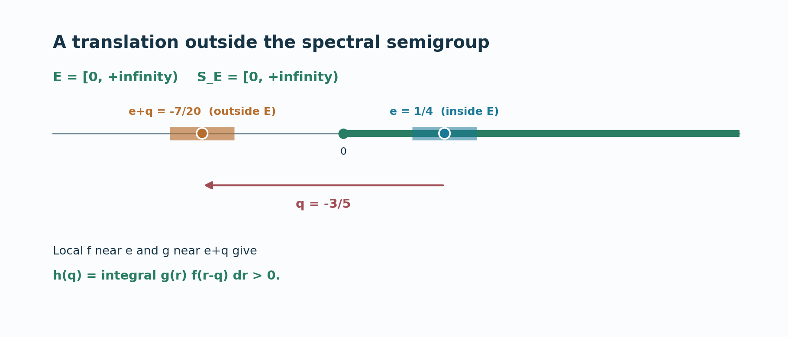

# A spectral filtration determines operator frequencies

An operator may preserve every translate of a spectral region even though it does not intertwine the two actions. The frequencies of that operator are precisely constrained by the translations that keep the region inside itself. The forward implication follows from the spectral-sum theorem of lesson 80. For the converse, translated input and output filters produce a scalar convolution kernel whose Fourier transform vanishes for every translation. A pointwise value of that kernel then supplies an annihilating filter for the conjugation action. This lesson proves Takesaki II, Theorem XI.1.5 under its regular-closed hypothesis.

*Written in Codex (OpenAI), September 2026; provider restoration October 2026. No human review is claimed. Newly written original expression in this lesson and its figure is dedicated under CC0.*

## Translation semigroup and theorem

Keep the full arbitrary LCA and specified dual-Banach setting of [MX0–4](OA-FLOW-MX.md#mx-0) and the [spectral-sum theorem](OA-FLOW-L80.md#sum-claim). Thus \(\alpha,\beta\) are uniformly bounded normal actions on \(X=X_*^*\) and \(Y=Y_*^*\), with norm-continuous predual orbits; \(\gamma_t(A)=\beta_tA\alpha_{-t}\) acts on \(\mathcal L_w(X,Y)\). The vector filter laws (S4), (S14), (S16) below are the full weak-star integral, closed-space annihilator test and support inclusion proved in BS1/BS3 and reflected to (MX1). Let \(E\subset H=\widehat G\) be closed, contain \(0\), and satisfy

$$E=\overline{\operatorname{int}E}. \tag{R1}$$

Define its translation semigroup

$$S_E=\{q\in H:q+E\subset E\}
=\bigcap_{p\in E}(E-p). \tag{R2}$$

It is closed, contains \(0\), and is closed under addition. Because \(0\in E\), it is a subset of \(E\). A closed set such as \(E=[-1,1]\subset\mathbb R\) has \(S_E=\{0\}\), whereas \(E=[0,\infty)\) has \(S_E=[0,\infty)\). The regular-closed condition (R1) will be used in only one direction of the proof.

**Spectral-filtration theorem.** For \(A\in\mathcal L_w(X,Y)\), the following are equivalent:

$$\begin{aligned}
\text{(i)}\quad&\operatorname{Sp}_\gamma(A)\subset S_E;\\
\text{(ii)}\quad&A X_\alpha(E+p)\subset Y_\beta(E+p)
\quad\text{for every }p\in H.
\end{aligned}\tag{R3}$$

Neither action is assumed isometric, and \(G\) need not be second countable or sigma compact. The operator \(A\) may be zero. The same proof therefore covers empty operator spectrum without adding a spurious nonzero assumption.

## Frequencies in the semigroup preserve every translate

Assume (i), fix \(p\in H\) and \(x\in X_\alpha(E+p)\). The spectral-sum theorem (T1) gives

$$Ax\in Y_\beta\bigl(\overline{S_E+E+p}\bigr). \tag{R4}$$

The defining property of \(S_E\) gives \(S_E+E\subset E\). Since \(E+p\) is closed, \(\overline{S_E+E+p}\subset E+p\); hence \(Ax\in Y_\beta(E+p)\). This proves (ii). Notice that regular-closedness was not used here.

## Translating input and output filters

Assume (ii). Fix \(f,g\in A_c(H)\) with

$$\operatorname{supp}(f)\subset\operatorname{int}E,
\qquad \operatorname{supp}(g)\cap E=\varnothing. \tag{R5}$$

For \(p\in H\), put \(f_p(r)=f(r-p)\) and \(g_p(r)=g(r-p)\). The support of \(f_p\) lies inside \(E+p\), so (S16) makes \(\alpha_{f_p}x\in X_\alpha(E+p)\) for every \(x\). The support of \(g_p\) misses \(E+p\), so (S14) makes \(\beta_{g_p}\) annihilate \(Y_\beta(E+p)\). Hypothesis (ii) therefore implies the operator identity

$$\beta_{g_p}A\alpha_{f_p}=0\quad(p\in H). \tag{R6}$$

Let \(f=\mathcal Fa\) and \(g=\mathcal Fb\). Their defining kernels lie in \(L^1(G)\). [MX4](OA-FLOW-MX.md#mx-4) proves that their compact continuous Fourier transforms put these very \(L^1\) classes in \(L^2(G)\), with the same transform under the unitary extension. Thus \(a,b\in L^1\cap L^2\); this is an actual domain identification, not a converse silently inferred from the definition of Plancherel. Use the paired dual Haar measure of H2–4. Translation in frequency gives

$$f_p=\mathcal F\bigl((\,\cdot,-p)a\bigr),\qquad
g_p=\mathcal F\bigl((\,\cdot,-p)b\bigr). \tag{R7}$$

For fixed \(x\in X\) and \(\psi\in Y_*\), expand (R6) with the weak-star integral formula (S4), using normality of \(A\) and the filtered maps. This gives a scalar Fourier transform in the translation parameter:

$$0=\int_{G^2}b(t)a(s)(t+s,-p)
\langle\beta_tA\alpha_sx,\psi\rangle\,dt\,ds
\quad(p\in H). \tag{R8}$$

The absolute bound is \(C_\alpha C_\beta\|A\|\|x\|\|\psi\|\|a\|_1\|b\|_1\). Compact-support approximants justify Fubini and then the \(L^1\) estimate passes to (R8), without a global sigma-finite Haar assumption.

Set \(u=t+s\) and define the scalar kernel

$$k(u)=\int_G b(t)a(u-t)
\langle\beta_tA\alpha_{u-t}x,\psi\rangle\,dt. \tag{R9}$$

The same absolute estimate makes \(k\in L^1(G)\). Equation (R8) says \(\widehat k(-p)=0\) for all \(p\in H\), so Fourier injectivity gives \(k=0\) almost everywhere. We need its value at \(0\), not just its equivalence class. Put
\[
 \Phi(t,u)=\langle\beta_tA\alpha_{u-t}x,\psi\rangle,\qquad
 M=C_\alpha C_\beta\|A\|\|x\|\|\psi\|.
\]
This function is jointly continuous and bounded by \(M\): write the pairing as \(\langle\alpha_{u-t}x,A_*\beta_{t,*}\psi\rangle\), split the difference, and use a norm-continuous predual vector and a bounded weak-star-continuous vector. Cauchy–Schwarz shows the integral (R9) exists at every \(u\), bounded by \(M\|a\|_2\|b\|_2\), and null changes to the kernels do not change any one of these integrals. For a fixed \(u_0\), split the difference by first changing \(a(u-t)\), then \(\Phi(t,u)\). If \(K\subset G\) is compact, the resulting bounds are

\[
 \begin{aligned}
 |k(u)-k(u_0)|\le{}&
 M\|b\|_2\|a(u-\cdot)-a(u_0-\cdot)\|_2\\
 &+\|a\|_2\|b\|_2\sup_{t\in K}|\Phi(t,u)-\Phi(t,u_0)|\\
 &+2M\|a\|_2\|1_{G\setminus K}b\|_2 .
 \end{aligned}\tag{R9a}
\]
L24's \(L^2\) translation continuity makes the first term tend to zero. Joint continuity and a finite cover of \(K\) make the second tend to zero. The third is arbitrarily small for a suitably chosen compact \(K\), by HR3 finite-exponent compact approximation. These estimates prove continuity for arbitrary nets \(u\to u_0\), without a net version of dominated convergence. This continuous representative agrees almost everywhere with the \(L^1\) kernel already used in (R8), by HR5. A continuous function zero almost everywhere is identically zero, because every nonempty open set has positive Haar measure. Evaluating at \(u=0\),

$$0=k(0)=\int_G b(t)a(-t)
\langle\gamma_t(A)x,\psi\rangle\,dt. \tag{R10}$$

This step is the reason for the \(L^2\) observation. An arbitrary convolution of two \(L^1\) kernels only defines an \(L^1\) function almost everywhere, so setting \(u=0\) without more regularity would be unjustified.

## Annihilators outside the translation semigroup

Define \(c(t)=b(t)a(-t)\). By Cauchy–Schwarz, \(c\in L^1(G)\); let \(h_{f,g}=\mathcal Fc\in A(H)\). Since (R10) holds for every \(x,\psi\), the operator filter of MX2 satisfies

$$\Gamma_{h_{f,g}}(A)=0. \tag{R11}$$

Fourier inversion and Plancherel give a second, frequency-side description:

$$h_{f,g}(q)=\int_H g(r)f(r-q)\,dr. \tag{R12}$$

All functions in (R12) are compactly supported and continuous, so the integral is ordinary Haar integration. The equality is [MX4](OA-FLOW-MX.md#mx-4), equation (MX9), which binds the complete \(L^2\) product theorem in LF0, the reflection of \(a\), and the actual \(L^1\) Fourier transform of \(c\). It holds at every \(q\). In particular, \(h_{f,g}\) is an annihilator of \(A\) for every pair satisfying (R5).

Now take \(q\notin S_E\). Some \(e\in E\) has \(e+q\notin E\). Since \(E=\overline{\operatorname{int}E}\) and \(H\setminus E\) is open, \(e\) can be chosen in \(\operatorname{int}E\) while retaining \(e+q\notin E\). Choose small open neighborhoods \(U\ni e\) and \(V\ni e+q\) with compact closures, \(\overline U\subset\operatorname{int}E\), \(\overline V\subset H\setminus E\), and \(U+q\subset V\). [LF1/LF4](OA-FLOW-LF.md#lf-1) give local Fourier cutoffs \(c_U,c_V\in A_c(H)\) supported in \(U,V\) and equal to \(1\) near their center points. Set \(f=|c_U|^2\), \(g=|c_V|^2\), which are nonnegative members of \(A_c(H)\) satisfying (R5). On an open neighborhood of \(r=e+q\), both \(g(r)\) and \(f(r-q)\) are positive. Haar measure of that neighborhood is positive, so (R12) yields

$$h_{f,g}(q)>0,\qquad h_{f,g}\in I_\gamma(A). \tag{R13}$$

Thus \(q\) is not in the hull \(\operatorname{Sp}_\gamma(A)\). Every point outside \(S_E\) is excluded this way, proving (i) and the theorem. \(\square\)

[View the figure for spectral transfer on a half-line at full size](../assets/spectral-transfer/81-transfer-semigroup-witness.png).

*Figure 81.1.* The example uses \(E=[0,\infty)\subset\mathbb R\), so \(S_E=[0,\infty)\). The negative candidate frequency is \(q=-3/5\). An interior point \(e=1/4\) moves to \(e+q=-7/20\notin E\). Local nonnegative Fourier cutoffs \(f\) near \(e\) and \(g\) near \(e+q\) make the convolution value \(h_{f,g}(q)\) in (R12) positive. The figure shows exact coordinates and the direction of the translation. The shaded support intervals are schematic neighborhoods, not a claim about the shape of the Fourier cutoffs.

**Problem.** For \(E=[-1,1]\subset\mathbb R\), compute \(S_E\) and interpret (R3) when \(\alpha=\beta\) and \(A\) is the identity operator.

**Solution.** A translation \(q\) satisfies \(q+[-1,1]\subset[-1,1]\) only when \(q=0\), so \(S_E=\{0\}\). The identity maps each \(X_\alpha(E+p)\) to itself, satisfying (ii). Its conjugation orbit is constant, so its \(\gamma\)-spectrum is contained in \(\{0\}\), satisfying (i). If \(X=\{0\}\), the identity is the zero map and its spectrum is empty; the containment remains true. \(\square\)

## Support-preserving Fourier approximation

The source proof also uses a Tauberian approximation that preserves a filter's support restriction. Let \(e_V=\mathcal Fa_V\), where \(a_V\ge0\), \(\int a_V=1\), and \(\operatorname{supp}(a_V)\) shrinks to the identity as in [L24](OA-FLOW-L24.md#oa-flow.grp.algebra). Translation continuity in \(L^1(G)\) gives \(e_Vf\to f\) in \(A\)-norm for every \(f\in A(H)\), because Fourier multiplication corresponds to convolution. Choose \(d_{V,n}\in A_c(H)\) with \(\|d_{V,n}-e_V\|_A<1/n\), possible by [LF5](OA-FLOW-LF.md#lf-5), and direct the pairs \((V,n)\) by shrinking \(V\) and increasing \(n\). Then

$$\|d_{V,n}f-f\|_A
\le\frac{\|f\|_A}{n}+\|e_Vf-f\|_A\longrightarrow0. \tag{R14}$$

Each \(d_{V,n}f\) belongs to \(A_c(H)\subset A(H)\cap L^1(H)\), and

$$\operatorname{supp}(d_{V,n}f)
\subset\operatorname{supp}(f). \tag{R15}$$

Also \(A(H)\cap L^1(H)\) is an ideal of \(A(H)\): multiplying an integrable Fourier function by a bounded Fourier function remains integrable. Thus the ideal is dense and approximation can respect a prescribed closed support set. The converse proof above starts with compactly supported filters, so its Fourier-uniqueness step does not discard any support condition through approximation.

The source is [Takesaki, Theory of Operator Algebras II](https://doi.org/10.1007/978-3-662-10451-4), Theorem XI.1.5. The preserved programme argument uses the translated-filter mechanism, with an explicit scalar kernel and a local positive annihilator. MX4 and (R9a) supply full inverse-domain and pointwise-continuity details. The earlier inputs are MX0–4, the spectral-sum theorem, BS1/BS3, LF0/LF1/LF4/LF5, L24/HR3/HR5 and H1–4 at their exact declared hypotheses. No one-sided action-recovery theorem is substituted for (R3), and neither an arbitrary closed-set synthesis assertion nor a full-dual identification of the normal-operator space is used.
