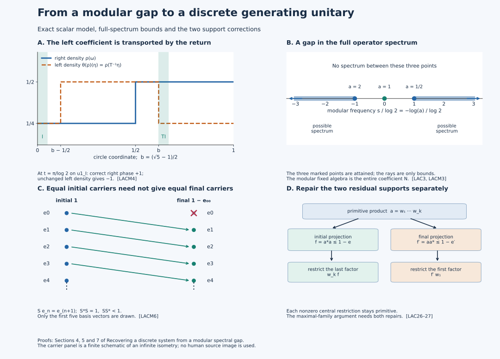

# Recovering a discrete system from a modular spectral gap

## Statements and conventions

The unitary that generates a discrete crossed product can be recovered from a gap in a modular spectrum. The useful intermediate object is a faithful normal expectation onto the centralizer. Once a positive-frequency normalizing unitary generates the algebra, that expectation identifies the entire regular crossed product, including its weight. The construction below produces the unitary by joining central partial normalizers and checking both missing supports.

Let \(M\) be a nonzero type \(\mathrm{III}_0\) factor with separable predual. Let \(\phi\) be a faithful normal semifinite weight whose modular operator has \(1\) isolated in its full spectrum. This is the meaning of **lacunary** here. Assume that the centralizer \(N=M_\phi\) is properly infinite; this is **infinite multiplicity**. Then there is a unitary \(U\in M\) normalizing \(N\) and a constant \(0<\lambda_0<1\) such that
\[
 N\text{ is type }\mathrm{II}_\infty,\qquad
 \phi\circ\operatorname{Ad}U\le\lambda_0\phi,\qquad
 M\cong N\rtimes_{\theta}\mathbb Z,\quad
 \theta=\operatorname{Ad}U|_N.
 \tag{LACA}
\]
The isomorphism and its inverse are normal. It carries the dual of the trace \(\tau=\phi|_N\) to \(\phi\), on the whole positive cone and with infinite values retained. Type \(\mathrm{II}_\infty\) does not require the coefficient algebra \(N\) to be a factor.

Two complementary statements are proved below. For any nonzero semifinite \(N\), a specified faithful normal semifinite trace satisfying \(\tau\theta\le\lambda\tau\), \(0<\lambda<1\), gives a lacunary dual weight on its integer crossed product; this implication needs neither separable predual nor proper infiniteness. Also, on **every** type \(\mathrm{III}_0\) factor, the center of the centralizer of **every** faithful normal semifinite weight is nonatomic. This last assertion has no lacunarity, multiplicity or separability assumption.

Our regular integer representation is
\
 [\pi_\theta(x)\xi=\theta^{-k}(x)\xi(k),\qquad
 u\xi=\xi(k-1),\qquad uxu^*=\theta(x).
 \tag{LACB}
\]
A modular frequency \(s\) has phase \(e^{-its}\). Thus the coordinate of a modular eigenvalue \(a>0\) is \(-\log a\). Spectral products add these coordinates, and adjoints reverse them. Every spectral window in this lesson uses this convention.

### Lacunarity, infinite multiplicity, and the modular gap
An n.s.f. faithful weight \(\phi\) is **lacunary** when \(1\) is an isolated point of \(\operatorname{Sp}(\Delta_\phi)\). It has **infinite multiplicity** when its centralizer

\[
 N=M_\phi=\{x\in M:\sigma_t^\phi(x)=x\text{ for all }t\}
 \tag{LAC4}
\]

is properly infinite.

Now let \(M\) be a separable type \({\rm III}_0\) factor and let \(\phi\) be lacunary with infinite multiplicity. Write \(\Sigma\) for the modular-action spectrum in the negative phase convention just specified. The standard-weight spectral theorem identifies it with the reflected logarithmic nonzero spectrum of \(\Delta_\phi\). All windows \(M_\phi(I)\) below use this coordinate; the product and adjoint rules are preserved by reflection. The modular action is nontrivial: otherwise the whole-cone trace criterion [VR-01](../../OA-MOD/OA-MOD-VR.html#nonvacuous-weights-and-the-meaning-of-a-trivial-flow) would make \(\phi\) a faithful semifinite trace. The [singleton-spectrum converse](OA-FLOW-SS.md#ss-3) therefore excludes \(\Sigma=\{0\}\). Adjoint symmetry gives both positive and negative frequencies; thus the following infimum is finite as well as strictly positive. Hence

\[
 \mu_0=\inf(\Sigma\cap(0,\infty))>0,
 \qquad
 \Sigma\cap(-\mu_0,\mu_0)=\{0\},
 \qquad
 \lambda_0=e^{-\mu_0}\in(0,1).
 \tag{LAC5}
\]

Equivalently, \(\lambda_0\) is the supremum of \(e^{-\mu}\) over \(\mu>0\) for which \(\Sigma\cap(0,\mu]\neq\varnothing\).

## 1. Recover a trace-preserving expectation from the gap

### The gap projection onto the centralizer
Choose a real smooth compactly supported Fourier multiplier \(f\) that is one on
\((-\mu_0/3,\mu_0/3)\) and zero off \((-2\mu_0/3,2\mu_0/3)\). The map integrates the inverse Fourier kernel \(g=\check f\), as in [AL1](OA-FLOW-AL.md#al-1); the symbol \(f\) is the frequency multiplier. The [full spectral transfer](OA-FLOW-MG.md#oa-flow.mg.1) and [singleton converse](OA-FLOW-SS.md#ss-3) give the integrated modular map

\[
 E=\sigma_f^\phi:M\longrightarrow N
 \tag{LAC6}
\]

retains only frequency zero. Its range lies in \(N\), it is the identity there,
and \(E\sigma_t^\phi=\sigma_t^\phi E=E\). The gap makes it independent of the
chosen flat-top function.

There is an explicit positive-average approximation. With the negative phase
convention stated after (LACB), put

\[
 b(\xi)=\frac{1-f(\xi)}{i\xi},\qquad b(0)=0,\qquad
 A_Rx=\frac1R\int_0^R\sigma_t^\phi(x)\,dt.
 \tag{LAC6a}
\]

Both \(b\) and its derivative belong to \(L^2(\mathbb R)\). Plancherel and
Cauchy--Schwarz with \((1+t^2)^{-1}\) show that its inverse Fourier transform
\(\check b\) belongs to \(L^1\). More precisely, smooth cutoffs approximate \(b\) in the joint \(L^2\) norms of \(b,b'\); integration by parts and closedness of multiplication by \(t\) then give \(t\check b\in L^2\), so the weighted Cauchy–Schwarz estimate applies. Multiplication of Fourier transforms gives
\(A_R-E=(\sigma_b^\phi-\sigma_R^\phi\sigma_b^\phi)/R\): here
\(A_RE=E\), and the difference kernel is the difference of two translates of
\(\check b\). Hence

\[
 \|A_R-E\|_{M\to M}\leq\frac{2\|\check b\|_1}{R}\longrightarrow0.
 \tag{LAC6b}
\]

There is also a direct integrable-kernel construction. Let \(g=\check f\). [RF1](OA-FLOW-RF.md#rf-1) gives rapid decay, \(\int g=1\), and a finite first absolute moment. Define
\[
 k(t)=\begin{cases}-\int_{-\infty}^t g(s)\,ds,&t<0,\\
                    \int_t^\infty g(s)\,ds,&t\ge0.
       \end{cases}
 \qquad \|k\|_1\le\int |s|\,|g(s)|\,ds.
 \tag{LACN5}
\]
Integration by parts on the two half-lines, including the jump one at zero, gives \(\widehat k=b\). Direct integration also gives
\(k(s)-k(s-R)=1_{[0,R]}(s)-\int_0^R g(s-t)\,dt\) almost everywhere. Scalar Fubini and the normal integrated maps therefore prove (LAC6b) with \(k\) in place of \(\check b\), without pointwise inversion of the nonintegrable multiplier \(b\).

Each \(A_R\) is unital, completely positive and \(N\)-bimodular. Their limit
has those properties. Normality follows separately from the \(L^1\) integrated
Fourier formula for \(E\); it is not inferred from an arbitrary pointwise limit.
Thus \(E\) is a normal conditional expectation. To check faithfulness, let
\(s\) be the join of the supports of all normal positive functionals
\(\omega E\). Since \(E\sigma_t^\phi=E\), each support and their join are
modular invariant. The common null projection \(1-s\) lies in \(N\), while
\(E(1-s)=0\). Since \(E|_N\) is the identity, \(1-s=0\).

For \(x\geq0\), finite positive averages of its modular orbit have weight
\(\phi(x)\). Approximation of \(A_Rx\) by such averages and lower
[whole-cone lower semicontinuity](OA-FLOW-EW.md#ew-3) give \(\phi(A_Rx)\leq\phi(x)\). Equation (LAC6b) then gives
\(\phi(Ex)\leq\phi(x)\), including infinite values. This inequality alone
does not prove equality.

The exact finite-domain inputs are
[OA-MOD WG-008](../../OA-MOD/OA-MOD-WG.html#finite-positive-cutoffs-characterize-semifiniteness)
and the full analytic right-multiplier lemma
[CX-03, (CX.13)--(CX.14)](../../OA-MOD/OA-MOD-CX.html#two-identities-on-the-full-finite-left-ideal).
WG-008 supplies finite-weight positive contractions \(c_j\uparrow1\).
Then \(Ec_j\uparrow1\) and \(\phi(Ec_j)<\infty\); applying WG-008 on \(N\)
proves that \(\tau=\phi|_N\) is semifinite.
For every fixed element \(a\in N\), CX-03 specializes to
\(\Lambda_\phi(xa)=J_\phi a^*J_\phi\Lambda_\phi(x)\) on the entire finite
left ideal. If \(y\in N\) has finite \(\phi(y^*y)\), apply this formula to its
polar partial isometry to get \(\phi(yy^*)=\phi(y^*y)\); the initial-support
projection fixes \(\Lambda_\phi(|y|)\). Applying the same calculation to
\(y^*\) treats the other finite case, and otherwise both values are infinite.
This is the whole-cone trace argument of
[VR-01, (VR.2)--(VR.3)](../../OA-MOD/OA-MOD-VR.html#nonvacuous-weights-and-the-meaning-of-a-trivial-flow),
used here only with polar factors in \(N\). Thus \(\tau\) is an n.s.f. trace.

There are finite-\(\tau\) projections \(e_i\uparrow1\) in \(N\). Indeed,
a nonzero projection contains a nonzero finite-trace spectral cut, by
semifiniteness and the trace compression inequality. A maximal orthogonal
family of such projections fills \(1\). It is countable because \(N\)
has separable predual, and its finite partial sums give the required sequence.
For \(\phi(x)<\infty\), the right-multiplier formula gives

\[
 \phi(e_i x e_i)=
 \|J_\phi e_iJ_\phi\Lambda_\phi(x^{1/2})\|^2\leq\phi(x).
 \tag{LAC6c}
\]

The inequality is automatic when the right side is infinite. Apply it inside
\(e_jxe_j\) for \(i\leq j\). The values \(\phi(e_i x e_i)\) are increasing;
lower semicontinuity and \(e_i x e_i\to x\) strongly give
\(\phi(x)=\sup_i\phi(e_i x e_i)\).
Each \(\omega_i(x)=\phi(e_i x e_i)\) is a finite normal modular-invariant
functional, so the integrated Fourier formula gives \(\omega_iE=\omega_i\).
Consequently, on the entire positive cone,

\[
 E^2=E,\qquad E|_N=\operatorname{id},\qquad
 \phi(Ex)=\sup_i\omega_i(Ex)=\sup_i\omega_i(x)=\phi(x).
 \tag{LAC7}
\]

No cycling of \(x^{1/2}\) through a nontracial weight is used in this argument.

## 2. What a generating normalizer already determines

For this section assume that \(U\) is a unitary satisfying
\[
 UNU^*=N,\qquad M=(N\cup\{U\})'',\qquad
 U\in M_\phi([\mu_0,\infty)).
 \tag{LACR1}
\]
Set \(\theta=\operatorname{Ad}U|_N\). We prove a recognition criterion under these stated hypotheses; Sections 3–4 will construct such a unitary. The expectation and the trace used here have already been proved in Section 1.

### Fourier moments and crossed-product recognition
Product spectral calculus gives \(U^n\in M_\phi([n\mu_0,\infty))\) for \(n>0\). Since \(E\) retains only frequency zero and is star preserving,

\[
 E(U^n)=0
 \qquad(n\in\mathbb Z\setminus\{0\}).
 \tag{LAC31}
\]

For \(x,y\) in the two-sided \(\tau\)-finite ideal of \(N\), regard \(U^nx\) and \(U^my\) as vectors in the GNS space of \(\phi\). Bimodularity of \(E\) and (LAC31) give

\[
 \big\langle\Lambda_\phi(U^nx),\Lambda_\phi(U^my)\big\rangle=0
 \qquad(n\neq m).
\tag{LAC32}
\]

Density has a finite-corner proof. For \(a\in\mathfrak n_\phi\),
the fixed right-module projections \(J_\phi e_iJ_\phi\) increase strongly to
\(1\), so \(\Lambda_\phi(ae_i)\to\Lambda_\phi(a)\). For fixed \(i\),
Kaplansky approximation by bounded strong-star covariant polynomials \(p\)
gives

\[
 \|\Lambda_\phi((p-a)e_i)\|^2
 =\omega_i((p-a)^*(p-a))\longrightarrow0.
 \tag{LAC32a}
\]

Every term \(x_nU^ne_i=U^n\theta^{-n}(x_n)e_i\) has a
\(\tau\)-finite coefficient, since its squared modulus is at most
\(\|x_n\|^2e_i\). This proves density. The scalar products in (LAC32),
including the equal-degree values \(\tau(y^*x)\), are exactly those of
the regular crossed product with its dual weight.
The word isometry therefore extends to a unitary intertwining both
coefficient left multiplication and the specified implementing unitary.
Both GNS representations are faithful and normal. Conjugation by this unitary
gives the normal faithful extension of the covariant Fourier-polynomial map:

\[
 N\rtimes_\theta\mathbb Z\longrightarrow M,
 \qquad
 \sum_n x_nu^n\longmapsto\sum_nx_nU^n,
 \tag{LAC33}
\]

and is onto by (LACR1). If \(V\) denotes the word unitary from the regular GNS space to the \(\phi\)-GNS space, the map is
\(\pi_\phi^{-1}\operatorname{Ad}V\,\pi_{\widehat\tau}\), and its inverse is
\(\pi_{\widehat\tau}^{-1}\operatorname{Ad}V^*\,\pi_\phi\). All four representation maps are normal on their von Neumann images. This proves the full normal inverse.

There is also the independent [normal-state-family proof](OA-FLOW-L51.md#oa-flow.discrete.state-family): the faithful expectation and all coefficients (LAC31) give its coefficient rule; a separating family of normal states and their onto regular GNS unitaries identify the entire crossed product and its normal inverse. This route uses no chosen faithful state on the coefficient algebra.

### Recovering the weight and central ergodicity
Let \(E_0:N\rtimes_\theta\mathbb Z\to N\) be the coefficient expectation. The isomorphism (LAC33) intertwines \(E_0\) with \(E\). Hence, on the entire extended-positive cone,

\[
 \phi=\tau\circ E=\widehat\tau.
 \tag{LAC34}
\]

If \(z\in Z(N)\) is fixed by \(\theta\), then it commutes with \(N\) and with \(U\), hence with \(M\). Factoriality gives

\[
 Z(N)^\theta=\mathbb C1.
 \tag{LAC35}
\]

Thus \(\theta\) is centrally ergodic.

### The trace density belongs on the right
Both \(\tau\) and \(\tau\circ\theta\) are n.s.f. traces on \(N\). Their Radon--Nikodym derivative is central:

\[
 \tau\circ\theta=\tau(\rho\,\cdot),
 \qquad
 (D(\tau\circ\theta):D\tau)_t=\rho^{it},
 \tag{LAC36}
\]

for a nonsingular positive operator \(\rho\) affiliated with \(Z(N)\).

The full weight identity fixes the normalization of the derivative. First coefficient covariance gives \(E\operatorname{Ad}U=\theta E\). Put \(\rho_j=\rho\wedge j\). For every \(x\ge0\), bimodularity and \(\phi=\tau E\) give
\[
 \phi_\rho(x)
 =\sup_j\tau\bigl(\rho_j^{1/2}E(x)\rho_j^{1/2}\bigr)
 =\tau_\rho(E(x))=\phi(UxU^*).
 \tag{LACN1}
\]
These are extended nonnegative values. The density is affiliated with \(N\subset M_\phi\), so [CZ32](OA-FLOW-CZ.md#cz-balanced-cocycle) applies to this entire weight. The normalized inner derivative in [GDA34](OA-FLOW-GDA.md#gda-8) is \((D(\phi\circ\operatorname{Ad}U):D\phi)_t=U^*\sigma_t^\phi(U)\). Together these identities prove

\[
 U^*\sigma_t^\phi(U)=\rho^{it},
 \qquad
 \boxed{\sigma_t^\phi(U)=U\rho^{it}}.
 \tag{LAC37}
\]

The source's left-coefficient expression would require \(\theta(\rho)=\rho\). An equivalent left formula is \(\sigma_t^\phi(U)=\theta(\rho)^{it}U\).

### Spectral and weight contraction
Put \(h=-\log\rho\). For the negative transform and every integrable kernel \(g\), (LAC37) gives \(\int g(t)\sigma_t^\phi(U)\,dt=U\widehat g(h)\). This follows by testing the scalar spectral integrals on vectors. Since \(U\) is unitary, the filter vanishes exactly when \(\widehat g(h)=0\). The spectral-support and resolvent argument in [MG1](OA-FLOW-MG.md#oa-flow.mg.1) therefore identifies \(\operatorname{Sp}_\phi(U)\) with \(\operatorname{Sp}(h)\), using the convention after (LACB). Since (LACR1) places it in \([\mu_0,\infty)\),

\[
 h\geq\mu_0,
 \qquad
 0<\rho\leq e^{-\mu_0}1=\lambda_0 1,
 \qquad
 \tau\circ\theta\leq\lambda_0\tau.
 \tag{LAC38}
\]

The inequalities hold for all extended-positive trace values by monotone central integration. Expectation covariance, \(E\circ\operatorname{Ad}(U)=\theta\circ E\), then gives

\[
 \phi(UxU^*)
 =\tau(\theta(E(x)))
 \leq\lambda_0\tau(E(x))
 =\lambda_0\phi(x)
 \quad(x\in M_+).
 \tag{LAC39}
\]

### Ruling out a type I centralizer
The trace \(\tau\), proper infiniteness and central ergodicity make \(N\)
homogeneously type \({\rm I}_\infty\) or \({\rm II}_\infty\): its central
type projections are \(\theta\)-invariant. Assume the first case.
Use the actual full-abelian-projection construction in
[L18.7.e–j](OA-FLOW-L18.md#l18-7).
It supplies a full abelian projection \(p\in N\) and the n.s.f. center weight

\[
 \psi(z)=\tau(zp)\quad(z\in Z(N)_+).
 \tag{LAC40}
\]

The map \(z\mapsto zp\) is a normal isomorphism onto \(pNp\).
The center weight is independent of \(p\), because two full abelian
projections are equivalent and the trace identity gives
\(\tau(zp)=\tau(zq)\) on the whole cone. These are exactly the
projection and corner-center prerequisites of that written lemma.
Since \(\theta^{-1}(p)\) is again full and abelian, (LAC38) gives

\[
 \psi(\theta(z))
 =(\tau\circ\theta)(z\theta^{-1}(p))
 \leq\lambda_0\tau(z\theta^{-1}(p))
 =\lambda_0\psi(z).
 \tag{LAC41}
\]

Represent \(Z(N)\) on its standard nonsingular measure model and define
\(T\) by \(\theta(1_A)=1_{TA}\). The measure \(\psi\) is sigma-finite:
the center has separable predual, and the trace's finite projections
admit a countable cover as in the argument preceding (LAC6c).
For a set \(A\) of finite \(\psi\)-measure,
\(\psi(T^nA)\leq\lambda_0^n\psi(A)\). The summable bounds imply that
almost every point belongs to only finitely many \(T^nA\);
equivalently, it visits \(A\) only finitely often backward.
A countable finite-measure cover gives this conclusion throughout the model.

An ergodic nonsingular transformation on a nonatomic standard space has no positive wandering set: divide a proposed wandering set into two positive measurable pieces; their disjoint integer saturations would both be nonnull invariant sets, contrary to ergodicity. For any positive measurable set \(A\), its subset of points with no positive return is wandering. Points with finitely many positive returns have a last visit in that null subset, so they form a countable union of null sets. Apply the same argument to \(T^{-1}\). Thus almost every point of \(A\) has infinitely many returns in both directions. Applied to the positive members of the finite-measure cover, this contradicts the preceding summable bound. The center therefore has an atom. Its orbit is conull by ergodicity.
It cannot be finite: for an atom \(A\), sigma-finiteness gives
\(0<\psi(A)<\infty\), and a period \(m>0\) would imply
\(\psi(A)\leq\lambda_0^m\psi(A)\).
Hence its atoms form one infinite orbit indexed by \(\mathbb Z\).

Let \(z_j=\theta^j(z_0)\) be these central atoms. In the already recognized
crossed product set \(F_{ij}=U^iz_0U^{-j}\). They are matrix units:
\(F_{ij}^*=F_{ji}\), \(F_{ij}F_{kl}=\delta_{jk}F_{il}\), and
\(\sum_jF_{jj}=1\) strongly. Moreover \(z_0Mz_0=z_0N\).
Indeed, the \(k\)-th coefficient of an element in this corner has central
support inside both \(z_0\) and \(\theta^k(z_0)\); for \(k\neq0\) it is zero.
The coefficient uniqueness proved in
[the regular representation theorem](OA-FLOW-L128.md#regular-transport) then gives the corner identity.

The matrix isomorphism is normal on the full algebra. In a faithful normal
representation, the unitary
\(\xi\mapsto(F_{0j}z_j\xi)_{j\in\mathbb Z}\) maps the Hilbert space onto
\(\ell^2(\mathbb Z)\otimes z_0H\). Its inverse is the strong orthogonal
sum \((\xi_j)\mapsto\sum_jF_{j0}\xi_j\).
Every bounded matrix entry of the transformed algebra lies in \(z_0N\),
and finite matrix compressions recover every bounded matrix over \(z_0N\).
Thus it implements

\[
 M\cong B(\ell^2\mathbb Z)\bar\otimes z_0N,
 \tag{LAC42}
\]

a type \({\rm I}_\infty\) algebra, contradicting that \(M\) is type
\({\rm III}_0\). Hence \(N\) is type \({\rm II}_\infty\).
The argument uses neither an unlocated Hopf decomposition nor a merely
formal exterior-cocycle change of crossed-product generators.

## 3. Narrow spectral bands give central partial normalizers

### Narrow polar decomposition
Write \(M_\phi(I)=\{x:\operatorname{Sp}_\phi(x)\subset I\}\). This subspace is weak-star closed when \(I\) is closed, by [GL2](OA-FLOW-GL.md#gl-2). In the limiting arguments below we use the actual closed spectrum of the element, contained in the indicated open window. Suppose

\[
 x\in M_\phi((t-\mu_0/3,t+\mu_0/3)).
 \tag{LAC8}
\]

Write \(x=u|x|\). Product spectral calculus puts \(x^*x\) in \(M_\phi((-2\mu_0/3,2\mu_0/3))=N\). Hence \(|x|\in N\), and

\[
 u=\mathop{\rm s\!\!\!-lim}_{\varepsilon\downarrow0}
       x(\varepsilon+|x|)^{-1},
 \qquad
 \operatorname{Sp}_\phi(u)=\operatorname{Sp}_\phi(x).
 \tag{LAC9}
\]

The approximants in (LAC9) have spectrum inside the closed set \(\operatorname{Sp}_\phi(x)\); their bounded strong limit remains in that closed spectral subspace. The reverse spectral inclusion uses \(x=u|x|\) with a fixed-point right factor. The projections \(e=u^*u=s_r(x)\) and \(e'=uu^*=s_\ell(x)\) lie in \(N\). Since the difference of two frequencies in (LAC8) lies inside the gap, \(uNu^*\subset N\) and \(u^*Nu\subset N\) on the corresponding corners.

The [narrow-band orbit theorem](OA-FLOW-L87.md#oa-flow.band.uniform) gives a complementary estimate. For a compact time set \(K\), a frequency \(p\), and \(\varepsilon>0\), a sufficiently small neighborhood of \(p\) gives
\(\|\sigma_t^\phi(x)-e^{-itp}x\|\le\varepsilon\|x\|\) for every \(t\in K\) and every element in that band. Apply its positive-frequency convention at \(-p\). That earlier theorem is proved for arbitrary LCA groups; its real specialization here controls the whole compact time set without an eigenvector assumption.

### Amplifying to central supports
Let \(c=z_N(e)\) and \(c'=z_N(e')\). The exact countable comparison theorem used here says that in a countably decomposable properly infinite von Neumann algebra, a projection with central support \(c\) has countably many equivalent copies whose orthogonal sum is \(c\). Here is the required countable comparison even when \(e\) is finite. Work in \(Nc\) and set
\[
 B=Nc\bar\otimes B(\ell^2\mathbb N),\qquad
 p=c\otimes E_{11},\quad q=e\otimes1.
 \tag{LACN2}
\]
The projection \(p\) is properly infinite because \(Nc\) is, by [PC5](OA-FLOW-PC.md#pc-5). The two disjoint shifts on the countable tensor factor make \(q\) properly infinite. Both have full central support by [CA0](OA-FLOW-CA.md#ca-0). Tensor a faithful normal state of \(Nc\) with a strictly positive summable diagonal state: vanishing of all positive diagonal compressions proves faithfulness. Thus \(B\) is countably decomposable. [PC7](OA-FLOW-PC.md#pc-7) and [PC3](OA-FLOW-PC.md#pc-3) give \(p\sim q\). Transport the mutually orthogonal \(e\otimes E_{jj}\) through this equivalence. They fill \(p\) and are each equivalent to \(e\otimes E_{11}\), giving the required family in \(pBp=Nc\). Apply the same argument to \(e'\).

Choose fixed-point partial isometries \(a_j,b_j\in N\) with

\[
 a_j^*a_j=e,\quad \sum_j a_ja_j^*=c,
 \qquad
 b_j^*b_j=e',\quad \sum_j b_jb_j^*=c',
 \tag{LAC10}
\]

with orthogonal final projections in each family. Then the strong orthogonal sum

\[
 v=\sum_j b_jua_j^*,
 \qquad
 k=v^*x
 \tag{LAC11}
\]

satisfies \(v^*v=c\) and \(vv^*=c'\). Fixed-point multiplication and weak-star closedness give \(\operatorname{Sp}_\phi(v)\subset\operatorname{Sp}_\phi(x)\). Hence the spectrum of \(k=v^*x\) lies in the difference of the narrow window with itself, inside \((-2\mu_0/3,2\mu_0/3)\), so \(k\in N\). Also \(vk=vv^*x=c'x=x\), because \(c'\) dominates the left support of \(x\). The same gap calculation gives both \(vNv^*\subset N\) and \(v^*Nv\subset N\). This is the centrally supported narrow-normalizer factorization; it does not require \(v\) to extend the original polar partial isometry.

### Spectral support carriers and the corrected center map
For a spectral set \(I\), define

\[
 p_\phi(I)=\bigvee\{s_\ell(x):x\in M_\phi(I)\},
 \qquad
 q_\phi(I)=\bigvee\{s_r(x):x\in M_\phi(I)\}.
 \tag{LAC12}
\]

Left and right multiplication by \(N\) preserves the spectral subspace. The [two support-join arguments FS1–3](OA-FLOW-FS.md#fs-1) therefore place both joins in \(Z(N)\).

The source asserts too much if it assumes only equal central initial supports. Indeed, take a narrow centrally supported normalizer \(v\), write \(p=vv^*\), and choose a proper isometry \(a\in Np\) with \(a^*a=p\) and \(aa^*<p\). Then \(w=av\) has \(w^*w=v^*v\) and the same narrow spectrum, but \(ww^*=aa^*\neq p\).

The correct statement requires both final supports to be central and one
common narrow window. Suppose \(v,w\in M_\phi(I)\), with
\(I=(t-\mu_0/3,t+\mu_0/3)\), have the same central initial support \(q\)
and central final supports. More generally, it suffices that
\(\operatorname{Sp}_\phi(v)-\operatorname{Sp}_\phi(w)\subset(-\mu_0,\mu_0)\).
The reflected difference gives the other mixed product. Then \(vw^*\in N\) implements equivalence between those final central projections, so they are equal. Moreover \(w^*v\) is a unitary in \(Nq\), and for \(z\in Z(N)q\),

\[
 vzv^*=wz w^*.
 \tag{LAC13}
\]

Thus one common narrow spectral window canonically transports the appropriate initial central corner to its final central corner. Separate narrowness of the two spectra does not imply that their mixed products have frequency zero.

### Positive, narrow, and primitive normalizers
Let \(\mathcal F\) consist of partial isometries \(v\in M_\phi([\mu_0,\infty))\) whose initial and final projections are central in \(N\) and for which both conjugation inclusions land in \(N\). Put

\[
 v_1\preccurlyeq v_2
 \quad\Longleftrightarrow\quad
 v_1^*v_1\leq v_2^*v_2
 \text{ and }v_1=v_2v_1^*v_1.
 \tag{LAC14}
\]

This is a partial order. Orthogonal initial and final supports allow normalizers to be added, and the sum remains in \(\mathcal F\). Positive modular spectrum and the preceding factorization show that \(\mathcal F\) has nonzero members.

Define

\[
 \begin{aligned}
 \mathcal H&=\{0\neq v\in\mathcal F:
   \operatorname{Sp}_\phi(v)-\operatorname{Sp}_\phi(v)
       \subset(-\mu_0/2,\mu_0/2)\},\\
 \mathcal G&=\{v\in\mathcal H:
   h_1h_2\preccurlyeq v, h_i\in\mathcal H
   \Longrightarrow h_1h_2=0\}.
 \end{aligned}
 \tag{LAC15}
\]

Elements of \(\mathcal G\) are called primitive. This refers to ordered products of positive narrow normalizers, not to irreducibility in \(M\).

## 4. Assemble the primitive pieces and fill both supports

### Primitive products below narrow normalizers
Every \(v\in\mathcal H\) has compact spectrum in \([\mu_0,n\mu_0]\) for some positive integer \(n\). Induction on the least such \(n\) proves

\[
 \text{there are }g_1,\ldots,g_k\in\mathcal G
 \text{ with }0\neq g_1\cdots g_k\preccurlyeq v.
 \tag{LAC16}
\]

For the induction step, if \(v\) is not primitive, choose \(0\neq w_1w_2\preccurlyeq v\) with \(w_i\in\mathcal H\). Let \(e=w_1^*w_1\), set \(w_3=ew_2\), and let \(f=s_\ell(w_1w_3)\). Central support calculus gives

\[
 w_3=w_1^*fv,
 \qquad
 \operatorname{Sp}_\phi(w_3)
 \subset \operatorname{Sp}_\phi(v)-\operatorname{Sp}_\phi(w_1)
 \subset(-\infty,(n-1)\mu_0].
 \tag{LAC17}
\]

The fixed multiplier \(e\) also gives
\(\operatorname{Sp}_\phi(w_3)\subset\operatorname{Sp}_\phi(w_2)
\subset[\mu_0,\infty)\). Thus its actual spectrum lies in
\([\mu_0,(n-1)\mu_0]\), and \(w_3\) remains a nonzero member of
\(\mathcal H\). The first induction genuinely lowers the height.
Apply it to obtain \(0\neq a=g_1\cdots g_k\preccurlyeq w_3\).
With \(f'=s_\ell(a)\), the identity \(w_1f'=va^*\) and
\(\operatorname{Sp}_\phi(a)\subset[k\mu_0,\infty)\) put this nonzero
central final restriction of \(w_1\) in \([\mu_0,(n-k)\mu_0]\).
A second induction gives a primitive product \(b\preccurlyeq w_1f'\).
Writing \(b=w_1q\), with central \(0\neq q\leq f'\), gives
\(r=a^*qa\neq0\), \(r\in Z(N)\), and \(ba=vr\). Hence

\[
 0\neq ba\preccurlyeq v.
 \tag{LAC18}
\]

The height-one case is primitive because a product of two positive normalizers has frequency at least \(2\mu_0\), outside \([\mu_0,\mu_0]\). This completes the induction, including the endpoint case.

### Subordinate normalizers and both mixed products
If \(0\neq u\in\mathcal F\) has spectral diameter below \(\mu_0\), choose a local Fourier cutoff \(g\) with support-difference inside \([-\mu_0/3,\mu_0/3]\) and \(\sigma_g^\phi(u)\neq0\). Factor this element as \(vk\) by (LAC11). Then \(v\in\mathcal H\), \(v^*u\in N\), and

\[
 w=vv^*u\in\mathcal H,
 \qquad 0\neq w\preccurlyeq u.
 \tag{LAC19}
\]

Nonvanishing follows because the same fixed final projection supports the nonzero filtered element.

Now take \(v_1,v_2\in\mathcal G\). The product \(a=v_1^*v_2\) is a partial normalizer with central supports, and

\[
 \operatorname{diam}\operatorname{Sp}_\phi(a)<\mu_0.
 \tag{LAC20}
\]

The gap gives three possibilities: \(a\in N\), \(a\) is positive spectral, or \(a^*\) is positive spectral. In the second case, (LAC19) gives \(0\neq w\in\mathcal H\) below \(a\), so \(0\neq v_1w\preccurlyeq v_2\), contradicting primitivity; the third case exchanges \(v_1,v_2\). Hence \(v_1^*v_2\in N\).

The second product needs its own source-range argument. Apply the same trichotomy to \(a=v_1v_2^*\). A positive subordinate \(w\) would satisfy \(0\neq wv_2\preccurlyeq v_1\), and the negative case exchanges the two indices. Therefore

\[
 v_1^*v_2\in N,
 \qquad
 v_1v_2^*\in N
 \quad(v_1,v_2\in\mathcal G).
 \tag{LAC21}
\]

### Generation by primitive normalizers
Let \(P=(N\cup\mathcal G)''\). First use the bounded compact-frequency filters of [AL3](OA-FLOW-AL.md#al-3) to approximate any element ultraweakly. Partition each compact frequency support into finitely many smooth narrow pieces, with spectrum-difference inside \((-\mu_0/3,\mu_0/3)\). This yields the needed ultraweak density without a formal infinite Fourier expansion. Fixed pieces lie in \(N\); adjoints reduce negative pieces to positive ones. Formula (LAC11) reduces a positive piece to \(vk\) with \(v\in\mathcal H\) and \(k\in N\). It remains to prove \(\mathcal H\subset P\).

Fix \(v\in\mathcal H\), put \(e=v^*v\), and set

\[
 \mathscr P_v=
 \{p\in\operatorname{Proj}(Z(N)):p\leq e, vp\in P\}.
 \tag{LAC22}
\]

Every chain has its supremum in \(\mathscr P_v\), because bounded monotone projection nets converge strongly and \(P\) is strongly closed. Let \(p\) be maximal. If \(p<e\), apply (LAC16) to \(v(e-p)\) and obtain \(0\neq a=g_1\cdots g_k\preccurlyeq v(e-p)\). Its initial support \(f=a^*a\) is nonzero central, \(f\leq e-p\), and \(a=vf\). Since \(a\in P\),

\[
 v(p+f)=vp+a\in P,
 \tag{LAC23}
\]

contradicting maximality. Thus \(p=e\), so \(v\in P\). Therefore

\[
 M=(N\cup\mathcal G)''.
 \tag{LAC24}
\]

### A maximal orthogonal primitive family
Choose a maximal family \((v_j)\subset\mathcal G\) satisfying \(v_i^*v_j=v_iv_j^*=0\) for \(i\neq j\). Countable decomposability makes the nonzero family countable. Its bounded orthogonal sums converge strongly; write

\[
 U=\sum_jv_j,
 \qquad
 e=U^*U=\sum_jv_j^*v_j,
 \qquad
 e'=UU^*=\sum_jv_jv_j^*.
 \tag{LAC25}
\]

The two support sums are central. Weak-star closedness of the positive spectral subspace gives \(U\in M_\phi([\mu_0,\infty))\).

### Eliminating the two residual supports
Assume \(1-e\neq0\). The invariant corner \((1-e)M(1-e)\) is type III, so its modular action has nonzero positive spectrum. Fourier localization and (LAC11) give \(v\in\mathcal H\) with both supports below \(1-e\). Choose \(0\neq a=w_1\cdots w_k\preccurlyeq v\) as in (LAC16), and put

\[
 f=a^*a,
 \qquad
 w=w_kf.
 \tag{LAC26}
\]

The printed inference \(w_k^*w_k\leq1-e\) does not follow from \(a^*a\leq1-e\). Formula (LAC26) is the required repair: \(w^*w=f\leq1-e\), and \(w\neq0\). A nonzero central initial restriction of a primitive remains primitive, because any prohibited product below the restriction would also lie below the original element.

For every \(j\), initial-support orthogonality gives \(wv_j^*=0\). By (LAC21), \(w^*v_j\in N\); its initial and final supports lie in the orthogonal central corners \(e\) and \(1-e\), so it vanishes. Thus \(w\) enlarges the maximal family, a contradiction. Hence \(e=1\).

The final support is separate. If \(1-e'\neq0\), choose a residual \(v\) with both supports below \(1-e'\), take \(a=w_1\cdots w_k\preccurlyeq v\), and restrict the first factor:

\[
 f'=aa^*,
 \qquad
 w=f'w_1.
 \tag{LAC27}
\]

Then \(ww^*=f'\leq1-e'\), the final restriction remains primitive, and the source-range-interchanged use of (LAC21) makes it orthogonal to every \(v_j\). Maximality gives \(e'=1\).

### One unitary generates and normalizes
Equations (LAC25)--(LAC27) make \(U\) unitary. Orthogonal-sum closure of \(\mathcal F\) now gives

\[
 UNU^*=N,
 \qquad
 U\in M_\phi([\mu_0,\infty)).
 \tag{LAC28}
\]

For \(v\in\mathcal G\), equation (LAC21) and strong convergence imply \(U^*v=\sum_jv_j^*v\in N\). Hence

\[
 \mathcal G\subset UN,
 \qquad
 M=(N\cup\{U\})''.
 \tag{LAC29}
\]

Define

\[
 \theta=\operatorname{Ad}(U)|_N.
 \tag{LAC30}
\]

This automorphism is not inner on \(N\). If \(\theta=\operatorname{Ad}(w)\) for \(w\in\mathcal U(N)\), then \(\theta(w)=w\), so \(w^*U\) commutes with both generators \(N\) and \(U\), hence is scalar because \(M\) is a factor; but its conditional expectation is zero, an impossibility.

### The lacunary normalizer theorem
The preceding constructions prove the following theorem.

**Theorem.** If \(\phi\) is a lacunary n.s.f. faithful weight of infinite multiplicity on a separable type \({\rm III}_0\) factor \(M\), then

\[
 \begin{gathered}
 M_\phi\text{ is type }{\rm II}_\infty,\\
 UM_\phi U^*=M_\phi,
 \qquad
 \phi\circ\operatorname{Ad}(U)\leq\lambda_0\phi,\\
 M\cong M_\phi\rtimes_{\operatorname{Ad}(U)}\mathbb Z,
 \qquad
 \phi=\widehat{\phi|_{M_\phi}},
 \end{gathered}
 \tag{LAC43}
\]

for a unitary \(U\in M\) and \(0<\lambda_0<1\). Together with (LAC3), this identifies the lacunary-weight construction and the trace-contracting discrete construction in both directions.

### The type I tensor and cocycle alternative
The same contradiction has a second normal realization. Suppose again that \(N\) is type \(\mathrm I_\infty\). Apply the countable amplification argument (LACN2) to a full abelian projection \(p\), obtaining orthogonal equivalent copies filling one. Write the partial isometries as \(a_i\), with \(a_i^*a_i=p\). Then \(e_{ij}=a_i a_j^*\) are matrix units and \(e_{00}=a_0a_0^*\). Rename this full abelian projection \(p\); equivalence preserves both fullness and abelianness. The corner-center map \(z\mapsto zp\) from [L18.7.g](OA-FLOW-L18.md#l18-7) identifies every matrix entry with a central coefficient. On a faithful Hilbert representation the coordinate unitary and its inverse, constructed exactly as for (LAC42), identify the entire algebra normally with \(Z(N)\bar\otimes B(\ell^2)\). Finite matrix compressions converge strongly, so this identifies all bounded matrices and gives a normal inverse.

In these coordinates put \(\gamma=\theta|_{Z(N)}\bar\otimes\mathrm{id}\) and \(\beta=\theta\gamma^{-1}\). The automorphism \(\beta\) fixes the center. The full abelian projections \(e_{00}\) and \(\beta(e_{00})\) are equivalent by [L18.7.i](OA-FLOW-L18.md#l18-7); choose \(v_0\) with these initial and final supports. The orthogonal strong sum
\[
 v=\sum_i\beta(e_{i0})v_0e_{0i}
 \quad\text{satisfies}\quad
 v^*v=vv^*=1,\qquad ve_{ij}v^*=\beta(e_{ij}).
 \tag{LACALT1}
\]
Indeed each summand has initial projection \(e_{ii}\) and final projection \(\beta(e_{ii})\); both families fill one. Multiplication on each matrix entry proves the last identity. Since \(\beta\) fixes central coefficients and these bounded matrices are generated normally by their finite compressions, \(\beta=\operatorname{Ad}v\) on the whole algebra.

Put \(V=v^*U\). Then \(VxV^*=\gamma(x)\), and \(N,V\) still generate \(M\). For every nonzero integer \(n\), the ordered product expansion has \(V^n=c_nU^n\) with \(c_n\in\mathcal U(N)\), so \(E(V^n)=0\). The state-family recognition just proved gives a normal isomorphism, with normal inverse, from \(N\rtimes_\gamma\mathbb Z\) onto \(M\). Regrouping the coefficient and integer Hilbert coordinates in the actual regular representation gives
\[
 M\cong\bigl(Z(N)\rtimes_{\theta|_{Z(N)}}\mathbb Z\bigr)
       \bar\otimes B(\ell^2).
 \tag{LACALT2}
\]
The reverse regrouping is its inverse. The atomic center orbit proved above is one copy of \(\mathbb Z\). The scalar version of the matrix-unit construction (LAC42), with rank-one coefficient corner \(\mathbb C\), identifies its crossed product normally with \(B(\ell^2\mathbb Z)\). Formula (LACALT2) is consequently type I. This retains the tensor and cocycle argument together with the direct matrix proof.

## 5. A contracting trace gives the full modular gap

Let \(N\) be any nonzero semifinite von Neumann algebra with a faithful normal semifinite trace \(\tau\). Let \(\theta\) be a normal automorphism and suppose, on the whole positive cone,
\[
 \tau\theta=\tau_\rho,\qquad
 0<\rho\le\lambda1,\qquad 0<\lambda<1,
 \tag{LAC1}
\]
where \(\rho\) is positive and affiliated with \(Z(N)\). The full trace-density correspondence supplies this formulation also from the inequality \(\tau\theta\le\lambda\tau\). Let \(M=N\rtimes_\theta\mathbb Z\), let \(E_0\) be its coefficient expectation, and put \(\phi=\tau E_0\).

Here are the normal coefficient facts used in this construction and in Section 2. In the regular representation (LACB), compression to coordinate zero gives \(E_0(X)=X_{0,0}\in N\). It is normal, unital, positive and \(N\)-bimodular. For \(X_n=E_0(Xu^{-n})\), normality of every matrix-entry map and the formula on finite covariant words give
\[
 X_{k,l}=\theta^{-k}(X_{k-l}).
 \tag{LACC1}
\]
Thus all coefficients zero implies \(X=0\). If \(X\ge0\) and \(E_0(X)=0\), every diagonal entry vanishes. Positivity then makes \(X^{1/2}\) vanish on each coordinate Hilbert space, so \(X=0\). This proves faithfulness without asserting convergence of an arbitrary Fourier series. Bounded strong-star density of covariant polynomials puts every compressed entry in \(N\) and proves the stated extension from words.

The whole-cone composition theorem [GDA8](OA-FLOW-GDA.md#gda-8), with the counting-Haar normalization in [L31.7.f](OA-FLOW-L31.md#l31-7), identifies \(\phi=\tau E_0\) with the faithful normal semifinite GDW dual weight. [GDW27](OA-FLOW-GDW.md#gdw-7) and the normalized central-density cocycle [CZ32](OA-FLOW-CZ.md#cz-balanced-cocycle) now give
\[
 \sigma_t^\phi(x)=x\quad(x\in N),\qquad
 \sigma_t^\phi(u)=u\rho^{it}.
 \tag{LAC2}
\]
Its orientation agrees with the full weight identification in Section 2. Iterating this actual formula, rather than treating \(u\) and \(\rho\) as commuting, gives
\[
 \begin{gathered}
 \rho_n=\prod_{j=0}^{n-1}\theta^{-j}(\rho)\quad(n>0),\qquad
 \rho_{-m}=\prod_{j=1}^{m}\theta^{j}(\rho^{-1})\quad(m>0),\\
 \rho_0=1,
 \quad \sigma_t^\phi(u^n)=u^n\rho_n^{it}.
 \end{gathered}
 \tag{LACC2}
\]
All factors are commuting central affiliated operators. Joint spectral cuts define their products; automorphisms preserve their spectral calculus. Consequently
\[
 0<\rho_n\le\lambda^n\quad(n>0),\qquad
 \rho_{-m}\ge\lambda^{-m}\quad(m>0).
 \tag{LACC3}
\]

The complete GNS space is the orthogonal sum of the copies \(u^nL^2(N,\tau)\). Indeed the coefficient expectation makes distinct degrees orthogonal, and
\(\|\Lambda_\phi(u^nx)\|^2=\tau(x^*x)\). To prove density for arbitrary \(N\), take the directed net of finite-trace projections \(e\uparrow1\). For fixed \(e\), bounded strong-star polynomial approximation converges in the finite normal functional \(a\mapsto\phi(eae)\). The fixed right-module projections \(J_\phi eJ_\phi\) then converge strongly to one. This is the finite-corner argument of Section 2 with a net in place of its countable sequence, so no separability is introduced.

On the \(n\)-th summand, \(\Delta_\phi^{it}\) is multiplication by \(\rho_n^{it}\). The spectral theorem therefore identifies its positive generator with multiplication by \(\rho_n\). For positive \(n\) its spectrum lies in \([0,\lambda^n]\); for negative \(n=-m\) it lies in \([\lambda^{-m},\infty)\). On the nonzero zero-degree summand it is the identity. Resolvent bounds uniform over the summands show
\[
 \operatorname{Sp}(\Delta_\phi)\cap(\lambda,\lambda^{-1})=\{1\}.
 \tag{LAC3}
\]
For example, any closed subinterval of this open gap avoiding one has positive distance from the spectrum of every summand; their resolvents form a bounded direct sum. For explicit domain control, let \(R_n\) be positive self-adjoint multiplication by \(\rho_n\) on \(H_\tau=L^2(N,\tau)\). Then
\[
 \Delta_\phi=\bigoplus_{n\in\mathbb Z}R_n,\qquad
 D(\Delta_\phi)=\{(\xi_n):\xi_n\in D(R_n),\ \sum_n\|R_n\xi_n\|^2<\infty\}.
 \tag{LACN3}
\]
Its Borel functional calculus has the corresponding squared-sum domain with \(R_n\) replaced by \(f(R_n)\). The unitary powers agree on the complete finite GNS ideal, hence on the Hilbert sum; uniqueness of the spectral measures identifies their full domains. For real \(a\in(\lambda,\lambda^{-1})\setminus\{1\}\),
\[
 \|(R_n-a)^{-1}\|\le
 \bigl[\min\{a-\lambda,\lambda^{-1}-a,|1-a|\}\bigr]^{-1}.
 \tag{LACN4}
\]
The direct sum inverse takes values in \(D(\Delta_\phi)\), because \(R_n(R_n-a)^{-1}=1+a(R_n-a)^{-1}\) is uniformly bounded. Both inverse identities follow on their full domains. This proves the full spectral gap; the nonzero degree-zero space supplies its eigenvalue one.

The fixed algebra is exactly \(N\). If \(X\) is modular invariant, applying \(E_0(\,\cdot\,u^{-n})\) to its invariance gives
\[
 X_n\theta^n(\rho_n)^{it}=X_n\quad\text{for every }t.
 \tag{LACC4}
\]
For \(n\ne0\), (LACC3) puts the spectrum of \(\theta^n(\rho_n)\) strictly on one side of one. Its spectral calculus, tested against all characters \(a^{it}\), forces \(X_n=0\). More explicitly, an operator annihilating \(a^{it}-1\) for every rational \(t\) annihilates every spectral projection outside \(\{1\}\); this follows first for the joint scalar spectral measure and then for all vectors. There is no spectral mass at one. Formula (LACC1) now gives \(X=E_0(X)\in N\). Conversely (LAC2) fixes \(N\). Thus \(M_\phi=N\), and this dual weight has infinite multiplicity exactly when \(N\) is properly infinite.

## 6. Every type III-zero centralizer has diffuse center

### Diffuse center for every faithful semifinite weight
This consequence has no lacunarity, infinite-multiplicity or separability
assumption. Let \(\phi\) be any faithful n.s.f. weight on a type
\({\rm III}_0\) factor \(M\), and write \(\alpha=\sigma^\phi\).
Suppose \(0\neq e\) were minimal in \(Z(M_\phi)\).
The actual centralizer-corner theorem
[OA-MOD CZ-09, (CZ.33)](../../OA-MOD/OA-MOD-CZ.html#justify-spectral-restriction-before-using-it)
gives a faithful n.s.f. corner weight \(\phi_e\), with
\(\sigma^{\phi_e}=\alpha^e\). In particular

\[
 (eMe)_{\phi_e}=eM_\phi e\quad\hbox{is a factor}.
 \tag{LAC44}
\]

The fixed-algebra theorem of
[GCC C15–16](OA-FLOW-GCC.md#gcc-central)
gives \(\operatorname{Sp}(\alpha^e)=\Gamma(\alpha^e)\).
Factoriality is required of the fixed algebra in that theorem.

Here the corner comparison must not assume \(eMe\cong M\).
The [homogeneous matrix construction](OA-FLOW-DDP.md#dd-corners) gives an orthogonal filling family \((p_i)_{i\in I}\) in \(M\), each equivalent to \(e\), with \(v_i^*v_i=e\), \(v_iv_i^*=p_i\). Proper infiniteness permits seeding with countably many copies, so \(I\) is infinite; choose an index \(0\in I\). In \(M\bar\otimes B(\ell^2 I)\), [PC1](OA-FLOW-PC.md#pc-1) gives the strong sum
\[
 W=\sum_{i\in I}v_i\otimes E_{0i},\qquad
 W^*W=e\otimes1=p,\quad WW^*=1\otimes E_{00}=q.
 \tag{LACN6}
\]
The sums run over finite subsets of the actual filling index set. No faithful state on the ambient factor, countable basis, or equivalence \(e\sim1\) in \(M\) is assumed.
The two projections \(p,q\) are fixed by \(\alpha\otimes\operatorname{id}\).
The [equivalent-fixed-corner theorem GCC C18](OA-FLOW-GCC.md#gcc-equivalence) therefore compares the Connes
spectra of the two restricted actions.
Amplification itself preserves the Connes spectrum: [GCC C15](OA-FLOW-GCC.md#gcc-central) reduces the
intersection to central fixed projections \(z\otimes1\), and normal finite
matrix slices show that each amplified action has exactly the unamplified
action spectrum. Consequently \(\Gamma(\alpha^e)=\Gamma(\alpha)\). The [orbit-support proof CS1–3](OA-FLOW-CS.md#oa-flow.cs.1) supplies an independent direct proof of this equality for arbitrary-predual factors. For the all-weight step, [DDP4–5](OA-FLOW-DDP.md#dd-corners) and the entire amplified modular operator in [TW4–5](OA-FLOW-TW.md#tw-4) supply a second arbitrary-cardinal route. Neither alternative assumes separability.

The [arbitrary-factor all-weight identity MIV2.h](OA-FLOW-MIV.md#miv-2), with its full weight-cocycle converse and spectral-intersection proofs, gives
\(\exp\Gamma(\alpha)=S(M)\setminus\{0\}=\{1\}\). Hence

\[
 \operatorname{Sp}(\alpha^e)=\Gamma(\alpha^e)
 =\Gamma(\alpha)=\{0\}.
 \tag{LAC44a}
\]

The invariant-weight spectral theorem in
[MG0–1](OA-FLOW-MG.md#oa-flow.mg.1),
now puts \(\operatorname{Sp}(\Delta_{\phi_e})\) inside \(\{0,1\}\);
reflection between the two modular-frequency conventions does not change
the zero spectrum in (LAC44a).
A positive self-adjoint operator with spectrum in \(\{0,1\}\) is a
projection. Its kernel is zero by faithfulness, so it is the identity.
The modular action is trivial, and VR-01's whole-cone criterion makes
\(\phi_e\) a faithful n.s.f. trace. This is impossible on a nonzero
type III corner. Therefore

\[
 Z(M_\phi)\text{ has no nonzero minimal projection}.
 \tag{LAC45}
\]

The arbitrary-cardinal projection and all-weight foundations remain those
of the cited written proofs; no sigma-finite corner is silently substituted
for the ambient factor.

## 7. A varying-density model and solved diagnostics

The [explicit nonfactor construction](OA-FLOW-ZDC.md#zdc-8) provides a type \(\mathrm{II}_\infty\) factor \(D\), a faithful normal semifinite trace \(\operatorname{Tr}_D\), and an automorphism \(\gamma\) such that \(\operatorname{Tr}_D\gamma=\tfrac12\operatorname{Tr}_D\). The construction uses an infinite tracial tensor product and a normal reindexing isomorphism; its full proof and inverse are given there.

Put \(c=\log2\), \(b=(\sqrt5-1)/2\), and on the circle with Lebesgue probability set
\[
 T\omega=\omega+b\pmod1,\qquad
 k(\omega)=1+1_{[0,1/2)}(\omega),\qquad
 N=L^\infty(\mathbb R/\mathbb Z)\bar\otimes D.
 \tag{LACM1}
\]
Define \(\theta\) by \((\theta X)(T\omega)=\gamma^{k(\omega)}X(\omega)\), and let \(\tau\) be the integral of \(\operatorname{Tr}_D\). Its normal inverse applies \(\gamma^{-k(T^{-1}\eta)}\) to the value at \(\eta\). The invariant Lebesgue measure and the fiber trace calculation give
\[
 \tau\theta=\tau_\rho,\qquad
 \rho(\omega)=2^{-k(\omega)},\qquad
 0<\rho\le\tfrac12.
 \tag{LACM2}
\]
The coefficient center is nonatomic and \(T\) is ergodic. The [complete converse](OA-FLOW-ZDC.md#zdc-7) makes \(M=N\rtimes_\theta\mathbb Z\) a type \(\mathrm{III}_0\) factor. Let \(u\) denote its regular generator and \(\phi=\tau E_0\). Section 5 shows, with no additional classification input, that
\[
 M_\phi=N,\qquad
 \operatorname{Sp}(\Delta_\phi)\cap(1/2,2)=\{1\},\qquad
 \sigma_t^\phi(u)=u\rho^{it}.
 \tag{LACM3}
\]
This weight has infinite multiplicity, while its centralizer is a nonfactor. The example illustrates why the normalizer theorem must allow nonfactor coefficient algebras.

The gap endpoints are attained. On the positive-measure set \(J=[1/2,1)\), one has \(\rho=1/2\). Choose a nonzero finite-trace projection \(q\in D\), and set \(x=1_J\otimes q\). Then \(\Lambda_\phi(ux)\ne0\) is an eigenvector of \(\Delta_\phi\) of eigenvalue \(1/2\). On \(TJ\), the negative-degree density \(\rho_{-1}=\theta(\rho^{-1})\) equals 2 and the same construction in degree \(-1\) gives eigenvalue 2. The zero-degree space gives eigenvalue 1. This proves that \(\mu_0=c\) for this model; no assertion about every other possible spectral value is needed.

The first panel plots \(\rho\) and \(\theta(\rho)=\rho\circ T^{-1}\) as exact two-level functions on the circle, with their jump positions marked. The second panel uses the spectral coordinate \(-\log a/c\): the empty intervals between \(-1,0,1\) are proved by (LACM3), and the three marked spectral points are attained by the vectors just constructed. The outer rays mark possible spectrum, not an assertion that every point belongs. The third panel displays a proper fixed isometry's initial and final carriers. The last panel shows the two distinct restrictions used in (LAC26) and (LAC27). [Renderer](../assets/lacunary-normalizer/render.py), [model data](../assets/lacunary-normalizer/data.json) and [component terms](../assets/lacunary-normalizer/TERMS.md) accompany the figure.

**Diagnostic 1: the density does not commute with the generator.** Choose \(I=[0,\varepsilon)\) with \(0<\varepsilon<\min(1/2,1-b)\), and put \(e=1_I\). On \(I\), \(\rho=1/4\); on \(TI\), \(\rho=1/2\), while \(\theta(\rho)=1/4\). At \(t_0=\pi/c\),
\[
 \sigma_{t_0}^\phi(ue)=ue,\qquad
 \rho^{it_0}ue=-ue,\qquad
 \theta(\rho)^{it_0}ue=ue.
 \tag{LACM4}
\]
These are identities on a nonzero central band, not values at one chosen point. They distinguish the correct right density, the incorrect unchanged left density and the correct transported left density.

**Diagnostic 2: forward and inverse degrees have different ordered densities.** Direct multiplication gives
\[
 \sigma_t^\phi(u^2)=u^2[\rho\,\theta^{-1}(\rho)]^{it},\qquad
 \sigma_t^\phi(u^{-1})=u^{-1}\theta(\rho^{-1})^{it}.
 \tag{LACM5}
\]
For small \(\varepsilon\) as above, the first product equals \(1/8\) on \(I\), since \(T\omega\in TI\). The inverse density at \(T\omega\) equals 4. Dropping the translated factor or using the same formula for positive and negative powers gives the wrong modular action.

**Diagnostic 3: initial support alone does not determine the final carrier.** Take \(J=[1/2,1)\), \(q=1_J\), and \(v=uq\). Its initial and final supports are the central projections \(q\) and \(p=\theta(q)\), and it has the single positive frequency \(c\). Choose a proper isometry \(a\in Np\), so \(a^*a=p\) and \(aa^*<p\), and put \(w=av\). Then
\[
 w^*w=q=v^*v,\qquad ww^*=aa^*\ne p=vv^*.
 \tag{LACM6}
\]
Moreover \(w\) has the same single frequency as \(v\): multiplication by the fixed \(a\) cannot enlarge the spectrum, and \(v=a^*w\) gives the reverse inclusion. The two-sided narrow corner-normalizer inclusions still hold. The missing assumption is centrality of \(ww^*\). This projection cannot be central in \(Np\), because a central projection equivalent to the unit \(p\) would equal \(p\).

**Diagnostic 4: separate narrowness does not replace a common window.** For this diagnostic take the same \(D,\gamma\) constructed above, put \(\theta=\gamma\), and apply the [constant trace-scaling construction](OA-FLOW-DDP.md#dd-converse) with \(\lambda=1/2\). In its integer crossed product, the generator \(v=u\) and \(w=u^2\) are unitaries with singleton positive frequency spectra \(\{-\log\lambda\}\) and \(\{-2\log\lambda\}\). Both initial and final supports are 1, but
\[
 v^*w=u\notin M_\phi.
 \tag{LACM7}
\]
Thus even zero spectral diameter for each separate element does not make the mixed product fixed. This auxiliary example is a positive-parameter factor, not a type \(\mathrm{III}_0\) instance of the main theorem. It tests precisely the mixed-window inference; Section 3 states that condition separately.

**Diagnostic 5: restrict the last factor to the product support.** In a two-dimensional Hilbert space, \(a=E_{11}\), \(b=1\) satisfy \(s_r(ab)=E_{11}\) but \(s_r(b)=1\). This elementary support calculation is not a model of the modular primitive family; it isolates the invalid inference. For an actual primitive product in Section 4, \(f=s_r(w_1\cdots w_k)\) is central, and \(w_kf\) has initial projection exactly \(f\). A prohibited positive primitive factorization below \(w_kf\) would also lie below \(w_k\), so primitivity survives. The final-support repair instead uses \(f'w_1\), \(f'=s_\ell(w_1\cdots w_k)\); interchanging these two formulas does not control the required carrier.

**Diagnostic 6: isolation among eigenvalues is weaker than a full spectral gap.** On \(\mathbb C\oplus L^2(-1,1)\), take \(A=1\oplus M_{e^s}\). Its only eigenvalue is 1, since every level set of \(e^s\) has Lebesgue measure zero. Yet its full spectrum is \([e^{-1},e]\): outside this interval the pointwise reciprocal is a bounded inverse, while indicators of small intervals around any interior point give approximate eigenvectors, and the endpoints follow by closure. Thus 1 is isolated within the point spectrum but not within the full spectrum. A continuous cutoff cannot preserve one and remove all its neighboring spectral values. This is a spectral-operator diagnostic, not a proposed type III factor. The definition and the bounded Fourier estimate (LAC6b) require the full gap.

**Diagnostic 7: positive spectrum supplies every nonzero Fourier moment.** If \(U\in M_\phi([\mu_0,\infty))\), then \(U^n\) has spectrum in \([n\mu_0,\infty)\) for \(n>0\). Hence \(E(U^n)=0\); taking adjoints gives the same conclusion for \(n<0\). Checking only \(E(U)=0\) would leave the equal-degree and unequal-degree GNS scalar products unjustified. The proof of (LAC33) uses all these moments and its finite-corner density argument.

**Diagnostic 8: the diffuse-center conclusion does not require this construction.** On an arbitrary type \(\mathrm{III}_0\) factor, a hypothetical central atom \(e\in Z(M_\psi)\) would make the corner centralizer factorial. The fixed-corner and arbitrary-cardinal invariant arguments in Section 6 force its modular-action spectrum to be \(\{0\}\), and the whole-cone trace criterion then makes \(eMe\) semifinite. This contradicts its type III corner property. Neither a primitive family nor a countable decomposition of the ambient algebra enters this argument.

## 8. Sources and the precise hypotheses

The historical antecedents are Takesaki, *Theory of Operator Algebras II*, Definition XII.3.9, Theorem XII.3.10, Lemmas XII.3.11–XII.3.14 and Proposition XII.3.15, printed pp.397–402, [book DOI](https://doi.org/10.1007/978-3-662-10451-4). The original construction of central partial normalizers and their primitive pieces is credited here. The expectation, recognition and spectral assembly have been separated so that every normal map, its inverse and its finite-domain argument can be checked where it is used.

Three distinctions matter in comparing the calculations. A narrow band transports centers as asserted only when both final supports are central; multiplying by a proper fixed isometry gives the missing-hypothesis diagnostic. The initial support of a product need not contain the entire initial support of its last factor; the residual argument restricts that factor to the product support, and treats the final support separately. Finally the modular identity is \(\sigma_t^\phi(U)=U\rho^{it}\). Moving the density to the left applies \(\theta\) to it. The proofs and the diagnostics above retain those conditions explicitly.

The normalizer theorem has separable predual and infinite multiplicity as stated. The converse spectral-gap construction and the diffuse-centralizer-center assertion retain their separate, wider hypotheses. The latter uses the full arbitrary-cardinal corner comparison, with no substitution of a sigma-finite corner for the ambient factor.

Original exposition, model data and figures are dedicated to CC0-1.0 to the extent of rights held. Human sources and software/font components retain their own terms.
