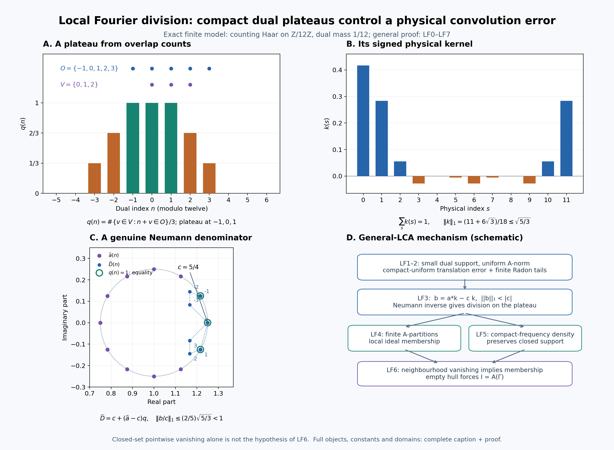

# Local Fourier division and closed ideals on an arbitrary LCA group

Let \(G\) be a locally compact Hausdorff abelian group, written additively, and let \(\Gamma=\widehat G\). Neither group is assumed second countable or sigma compact. Fix Haar measure \(m\) on \(G\) and the paired dual Haar measure \(\widehat m\). All neighbourhood limits below are nets.

The earlier inputs are the complete [Haar regularity and finite-exponent conventions](OA-FLOW-HR.md#hr-03), [group function-space and convolution proofs](OA-FLOW-L24.md#oa-flow.grp.haarconventions), [character topology and Fourier injectivity](OA-FLOW-HARMONIC.md#l138-h1), [onto scalar Plancherel](OA-FLOW-PLANCHEREL.md#scalar-plancherel-p3), and [biduality and returned Haar normalization](OA-FLOW-HARMONIC-LATE.md#l138-h3). In particular, \(L^1\) and \(L^2\) mean the common finite-exponent Radon/locally determined spaces of L24. Representatives can be chosen Borel with sigma compact carriers. Qualified product integration is used on such carriers; no unrestricted equality of product Borel sigma algebras is required.

## LF0. Conventions and the product identity

Use the negative forward transform and positive inverse:

\[
 \widehat a(\gamma)=\int_G a(s)\overline{\gamma(s)}\,dm(s),
 \qquad
 \mathcal F^{-1}v(s)=\int_\Gamma v(\gamma)\gamma(s)\,d\widehat m(\gamma)
 \quad(v\in L^1\cap L^2).
 \tag{LF1}
\]
The inverse integral represents the \(L^2\) inverse by [H2](OA-FLOW-HARMONIC-LATE.md#l138-h2). For arbitrary \(L^2\) vectors the inverse is the Plancherel unitary inverse; an absolutely convergent inverse integral is not asserted there.

Define

\[
 A(\Gamma)=\{\widehat a:a\in L^1(G)\},
 \qquad \|\widehat a\|_A=\|a\|_1.
 \tag{LF2}
\]
Fourier injectivity makes this norm well defined. The \(L^1\) convolution theorem makes \(A(\Gamma)\) a commutative Banach algebra of continuous functions vanishing at infinity, with

\[
 \|uv\|_A\leq\|u\|_A\|v\|_A,\qquad
 \|u\|_\infty\leq\|u\|_A.
 \tag{LF3}
\]
Both assertions follow by transporting L24's complete \(L^1\) algebra and its integral bound through the injective Fourier map.

Write \(L_s a(t)=a(t-s)\) and \(M_\theta a(t)=\theta(t)a(t)\). Haar substitution gives

\[
 \mathcal F(L_s a)(\gamma)=\overline{\gamma(s)}\widehat a(\gamma),
 \qquad
 \mathcal F(M_\theta a)(\gamma)=\widehat a(\gamma-\theta).
 \tag{LF4}
\]
Both maps are isometries in each finite-exponent space. The identities on \(L^2\) follow by approximation by \(C_c(G)\), using unitarity; conjugation likewise gives
\(\mathcal F(\overline a)(\gamma)=\overline{\mathcal Fa(-\gamma)}\).

We shall use, at its whole domain, the identity

\[
 uv\in L^1(G),\qquad
 \widehat{uv}=(\mathcal Fu)*_\Gamma(\mathcal Fv)
 \quad(u,v\in L^2(G)).
 \tag{LF5}
\]
Here the convolution integral on the right exists at every \(\gamma\). For completeness, with inner products linear in the first variable, write
\(\widehat{uv}(\gamma)=\langle u,\gamma\overline v\rangle\).
The preceding \(L^2\) identities give
\(\mathcal F(\gamma\overline v)(\eta)=\overline{\mathcal Fv(\gamma-\eta)}\).
Parseval gives (LF5). Cauchy–Schwarz bounds the absolute convolution integral by \(\|u\|_2\|v\|_2\). It is continuous: translate one \(L^2(\Gamma)\) factor, use L24's norm continuity of translations on that group, and apply the same bound. This is the full-vector argument of [H3.5](OA-FLOW-HARMONIC-LATE.md#l138-h3), now applied to \(G\).

## LF1. Compact plateaus with a uniform Fourier-algebra norm

**Lemma.** For each identity neighbourhood \(N\subset\Gamma\) there is \(q\in A(\Gamma)\) such that

\[
 0\leq q\leq1,\qquad q=1\text{ on an identity neighbourhood},\qquad
 \operatorname{supp}q\text{ is compact and contained in }N,\qquad
 \|q\|_A<\sqrt2.
 \tag{LF6}
\]
Here and below support is the closed support.

**Proof.** Choose a relatively compact open identity neighbourhood \(W\) with
\(\overline W-\overline W\subset N\). Continuity of subtraction supplies a small neighbourhood whose difference is inside \(N\); local compactness and shrinking supply this \(W\). Choose a compact neighbourhood \(V\subset W\) of the identity. Haar full support and finiteness on compact sets give
\(0<\widehat m(V)<\infty\).
Outer regularity supplies a relatively compact open \(O\) with

\[
 V\subset O\subset W,\qquad
 \widehat m(O)<2\widehat m(V).
 \tag{LF7}
\]
Indeed intersect a sufficiently small-measure open superset of \(V\) with \(W\). Compactness gives an identity neighbourhood \(U\) with \(U+V\subset O\): use finitely many product neighbourhoods of the points of \(V\).

Put

\[
 q(\gamma)=\frac{(1_O *_\Gamma 1_{-V})(\gamma)}{\widehat m(V)}
 =\frac{\widehat m\{v\in V:\gamma+v\in O\}}{\widehat m(V)}.
 \tag{LF8}
\]
Thus \(0\leq q\leq1\), and \(q=1\) on \(U\). Outside \(\overline O-V\) it is zero; this is a compact subset of \(N\). Take the \(L^2\) vectors

\[
 u=\mathcal F^{-1}1_O,\qquad
 v=\mathcal F^{-1}\!\left(1_{-V}/\widehat m(V)\right),\qquad k=uv.
 \tag{LF9}
\]
Equation (LF5) says \(\widehat k=q\), pointwise, and proves its continuity. Plancherel and Cauchy–Schwarz give

\[
 \|k\|_1\leq\|u\|_2\|v\|_2
 =\sqrt{\widehat m(O)/\widehat m(V)}<\sqrt2.
 \tag{LF10}
\]
This proves every assertion. Translating \(q\) by \(\gamma_0\) is Fourier transformation of \(M_{\gamma_0}k\), so the same conclusion holds at any point, with its prescribed open neighbourhood. \(\square\)

## LF2. Small local convolution errors

**Lemma.** Given \(a\in L^1(G)\), \(c=\widehat a(0)=\int a\), and any prescribed identity neighbourhood \(N\subset\Gamma\), the plateau kernel \(k\) of LF1 can be chosen with support of \(\widehat k\) inside \(N\) and

\[
 \|a*k-ck\|_1<\varepsilon
 \tag{LF11}
\]
for any \(\varepsilon>0\). All its plateau and norm conclusions persist.

**Proof.** Keep the construction (LF7)–(LF9), while choosing \(W\) smaller. Formula (LF4) and Plancherel give

\[
 \|L_s k-k\|_1
 \leq\sqrt{\widehat m(O)/\widehat m(V)}
 \left(\sup_{\gamma\in O}|\gamma(s)-1|
       +\sup_{\gamma\in V}|\gamma(s)-1|\right).
 \tag{LF12}
\]
To check this estimate, expand
\((L_su)(L_sv)-uv=(L_su-u)L_sv+u(L_sv-v)\)
and use the \(L^2\) Fourier multiplier formula. The supremum on \(-V\) equals that on \(V\), since characters have modulus one.

For a compact \(C\subset G\), the compact-open topology supplies an identity neighbourhood in \(\Gamma\) on which
\(\sup_{s\in C}|\gamma(s)-1|\) is arbitrarily small. Require \(W\) inside this neighbourhood as well as the neighbourhood controlling \(N\). Therefore (LF12) tends uniformly to zero for \(s\in C\), independently of the particular \(V,O\) chosen inside \(W\). For every \(s\) we also have
\(\|L_s k-k\|_1\leq2\|k\|_1<2\sqrt2\).

The Bochner identity, in \(L^1(G)\), is

\[
 a*k-ck=\int_G a(s)(L_s k-k)\,dm(s).
 \tag{LF13}
\]
L24's vector integral and convolution theorem justify it. More explicitly, the norm-continuous translation orbit has separable range on the sigma compact carrier of \(a\): each compact image in the metric \(L^1\) space is separable, and a countable union retains that property. The integrand is strongly measurable and has integrable norm bounded by \(2\sqrt2|a(s)|\). The scalar convolution and vector integral agree by L24's qualified Fubini argument.

The finite Radon measure \(|a|\,dm\), proved regular in [HR-03](OA-FLOW-HR.md#hr-03), admits compact tail approximation. Choose \(C\) with \(2\sqrt2\int_{G\setminus C}|a|<\varepsilon/2\). Then make the uniform error on \(C\) less than \(\varepsilon/(2(1+\|a\|_1))\). Equation (LF13) gives (LF11). This uses a compact-tail estimate, rather than a dominated-convergence assertion for arbitrary nets. \(\square\)

## LF3. Local division by a nonzero Fourier transform

**Theorem.** If \(a\in L^1(G)\) and \(\widehat a(\gamma_0)\ne0\), there is an open neighbourhood \(U\) of \(\gamma_0\) such that every \(\psi\in A(\Gamma)\) supported in \(U\) has the form

\[
 \psi=\widehat a\,\widehat h\qquad(h\in L^1(G)).
 \tag{LF14}
\]
No compactness of \(\operatorname{supp}\psi\) is required.

**Proof.** First suppose \(\gamma_0=0\), and put \(c=\widehat a(0)\). Choose \(k\) by LF2 with \(b=a*k-ck\) satisfying \(\|b\|_1<|c|\). In the formal convolution unitization
\(L^1(G)^+=\mathbb C\delta\oplus L^1(G)\), give \(\lambda\delta+f\) norm \(|\lambda|+\|f\|_1\), and let \(\delta\) be its identity. Completeness follows from completeness of the two summands; the convolution bound gives submultiplicativity. This formal construction also applies when \(L^1(G)\) already has an identity. The series

\[
 D=c\delta+b,\qquad
 D^{-1}=\frac1c\sum_{n=0}^{\infty}(-b/c)^{*n}
 \tag{LF15}
\]
converges in that norm. Multiplying a partial geometric sum by \(D\) leaves a remainder of norm tending to zero, so the displayed limit is its two-sided inverse. Moreover

\[
 \|D^{-1}\|\leq\frac1{|c|-\|b\|_1}.
 \tag{LF16}
\]
Extend Fourier evaluation to the unitization by \(\widehat\delta=1\). It is a bounded multiplicative map. If \(q=\widehat k\), then

\[
 \widehat D=c+(\widehat a-c)q=\widehat a
 \quad\text{where }q=1.
 \tag{LF17}
\]
Let \(U\) be the open plateau neighbourhood, and write \(\psi=\widehat r\), \(r\in L^1(G)\). Put \(h=D^{-1}*r\). This lies in the \(L^1\) ideal. On \(U\), (LF17) and the inverse identity give \(\widehat a\,\widehat h=\psi\); outside \(U\), \(\psi=0\) and \(\widehat h=\widehat D^{-1}\psi=0\). Thus equality holds everywhere. In particular

\[
 \|h\|_1\leq\frac{\|\psi\|_A}{|c|-\|b\|_1}.
 \tag{LF18}
\]

For arbitrary \(\gamma_0\), set \(a'=M_{-\gamma_0}a\). Its transform is \(\widehat a(\gamma+\gamma_0)\), with value \(c\ne0\) at zero. Apply the preceding construction to \(a'\) and \(\psi'(\gamma)=\psi(\gamma+\gamma_0)\), whose support is shifted by \(-\gamma_0\). If \(h'\) is the resulting solution, \(h=M_{\gamma_0}h'\) gives (LF14) by (LF4) and the convolution identity. All modulation norms are unchanged. \(\square\)

## LF4. Compact plateaus and subordinate finite partitions

**Lemma.** If \(K\subset\Gamma\) is compact and \(K\subset\bigcup_{i=1}^m U_i\), with \(U_i\) open, there are nonnegative \(p_i\in A(\Gamma)\) with compact support contained in \(U_i\) such that \(\sum_i p_i=1\) on an open neighbourhood of \(K\). Their sum is at most one everywhere. In particular, if \(K\subset U\) is compact inside an open set, there is \(Q\in A(\Gamma)\), \(0\leq Q\leq1\), equal to one near \(K\), with compact support inside \(U\).

**Proof.** For each point of \(K\), LF1 gives a translated compact plateau \(q_j\) whose support is inside one of the \(U_i\). Its open plateau neighbourhood covers that point. Retain finitely many covering neighbourhoods. Define

\[
 r_j=q_j\prod_{l<j}(1-q_l),\qquad
 Q=\sum_j r_j=1-\prod_j(1-q_j).
 \tag{LF19}
\]
Every expression belongs to \(A(\Gamma)\): expand the finite products, and note that the constant terms cancel in \(Q\), while each \(r_j\) has a factor \(q_j\). No constant function is presumed to belong to \(A(\Gamma)\). We have \(0\leq r_j\), \(0\leq Q\leq1\), and \(\operatorname{supp}r_j\subset\operatorname{supp}q_j\). On the union of the selected open plateau neighbourhoods at least one factor \(1-q_j\) is zero, hence \(Q=1\). Group the \(r_j\) according to their assigned \(U_i\) to obtain \(p_i\). A finite union of compact supports inside the same \(U_i\) is compact and remains inside it. For empty \(K\), all \(p_i=0\) suffice and the neighbourhood can be empty. Taking a one-set cover proves the last assertion. \(\square\)

## LF5. A contractive approximate identity with compact frequency support

**Theorem.** There is a net \(k_i\in L^1(G)_+\) with

\[
 \int_G k_i\,dm=\|k_i\|_1=1,\qquad
 \operatorname{supp}\widehat k_i\text{ compact},\qquad
 k_i*a\longrightarrow a\text{ in }L^1(G)\quad(a\in L^1(G)).
 \tag{LF20}
\]
Consequently \(A(\Gamma)\cap C_c(\Gamma)\) is dense in \(A(\Gamma)\) in the \(A\)-norm. More precisely every \(\psi\in A(\Gamma)\) has approximants

\[
 \psi_i=\psi\,\widehat k_i,\qquad
 \|\psi_i-\psi\|_A\longrightarrow0,\qquad
 \operatorname{supp}\psi_i\subset\operatorname{supp}\psi,
 \tag{LF21}
\]
whose supports are compact.

**Proof.** For each identity neighbourhood \(V\subset G\), choose the positive mass-one bump \(a_V\in C_c(G)\) supported in \(V\) from [L24 Theorem 5.2](OA-FLOW-L24.md#oa-flow.grp.algebra). Its shrinking-neighbourhood net is an \(L^1\) approximate identity. Put \(u_V=\sqrt{a_V}\), so \(\|u_V\|_2=1\).

For \(0<\epsilon<1/2\), \(C_c(\Gamma)\) is \(L^2(\Gamma)\)-dense by HR-03 and L24's finite-exponent convention. Plancherel surjectivity therefore supplies \(w=\mathcal F^{-1}\phi\), \(\phi\in C_c(\Gamma)\), with \(\|w-u_V\|_2<\epsilon/2\). Its norm \(\rho\) is positive and \(|\rho-1|<\epsilon/2\). Set \(v=w/\rho\) and \(k_{V,\epsilon}=|v|^2\). Then

\[
 \|v-u_V\|_2<\epsilon,\qquad
 \|k_{V,\epsilon}-a_V\|_1
 \leq(\|v\|_2+\|u_V\|_2)\|v-u_V\|_2<2\epsilon.
 \tag{LF22}
\]
The inequality follows pointwise from
\(\big||v|^2-|u_V|^2\big|\leq|v-u_V|(|v|+|u_V|)\)
and Cauchy–Schwarz. Also \(k_{V,\epsilon}\geq0\) and its integral is one. With \(\widetilde\phi(\gamma)=\overline{\phi(-\gamma)}\), (LF5) gives

\[
 \widehat k_{V,\epsilon}
 =\rho^{-2}\phi *_\Gamma\widetilde\phi,\qquad
 \operatorname{supp}\widehat k_{V,\epsilon}
 \subset\operatorname{supp}\phi-\operatorname{supp}\phi.
 \tag{LF23}
\]
The latter set is compact, and the transform is continuous, as already proved in LF0.

Order pairs \((V,\epsilon)\) by shrinking both entries: a later neighbourhood is contained in the earlier one and its positive \(\epsilon\) is no larger. This set is directed, using intersections and the smaller of two positive numbers. Choose one of the preceding approximants for each pair. The convolution estimate gives

\[
 \|k_{V,\epsilon}*a-a\|_1
 \leq2\epsilon\|a\|_1+\|a_V*a-a\|_1\longrightarrow0.
 \tag{LF24}
\]
This proves (LF20) for a net on the original group. It makes no countable reduction of that group. Transporting (LF24) through the isometry (LF2) gives (LF21). The support of a product of continuous functions is contained in the intersection of their closed supports; this proves its support assertions and the stated density. \(\square\)

## LF6. Closed ideals, empty hulls and neighbourhood vanishing

For a closed ideal \(I\subset A(\Gamma)\) and a closed subset \(E\subset\Gamma\), write

\[
 h(I)=\{\gamma:u(\gamma)=0\text{ for all }u\in I\},\qquad
 I(E)=\{u\in A(\Gamma):u|_E=0\},
 \quad
 j(E)=\overline{\{u\in A(\Gamma):\operatorname{supp}u
                 \text{ compact and disjoint from }E\}}^{\,\|\cdot\|_A}.
 \tag{LF25}
\]
The set inside the last closure is a linear ideal: sums have support inside the union of the two compact supports, and multiplication by an arbitrary element decreases support. Thus \(j(E)\) is a closed ideal. \(I(E)\) is closed by the evaluation bound (LF3).

**Theorem.** If \(E=h(I)\), then

\[
 j(E)\subset I\subset I(E).
 \tag{LF26}
\]
In particular:

1. if \(h(I)=\varnothing\), then \(I=A(\Gamma)\);
2. if \(u\in A(\Gamma)\) vanishes on some open neighbourhood of \(h(I)\), then \(u\in I\);
3. for every closed \(E\), the ideal \(I_0(E)\) of functions vanishing on some open neighbourhood of \(E\) has hull exactly \(E\).

**Proof.** If \(\gamma\notin h(I)\), choose \(\widehat a\in I\) nonzero there. LF3 gives an open \(U_\gamma\) such that every \(A\)-function supported in \(U_\gamma\) equals \(\widehat a\,\widehat h\), hence belongs to \(I\).

Now suppose \(u\in A(\Gamma)\) has compact support \(K\) disjoint from \(E\). Cover \(K\) by finitely many such \(U_\gamma\), and choose the subordinate \(p_i\) of LF4. Because their sum equals one on \(K\),

\[
 u=\sum_i up_i.
 \tag{LF27}
\]
Each summand is supported in its \(U_\gamma\) and therefore belongs to \(I\). Closedness gives \(j(E)\subset I\); the other inclusion is the definition of \(h(I)\).

Empty hull now gives every compactly supported \(A\)-function in \(I\); LF5 gives all of \(A(\Gamma)\). If \(u\) vanishes on an open set containing \(E\), its closed support is disjoint from \(E\). The support-preserving compact approximants in LF5 belong to \(j(E)\), so \(u\in j(E)\subset I\).

Finally every element of \(I_0(E)\) vanishes on \(E\), giving \(E\subset h(I_0(E))\). If \(\gamma\notin E\), LF1 gives a translated compact plateau \(q\) with \(q(\gamma)=1\) and compact support \(K\subset\Gamma\setminus E\). It vanishes on the open neighbourhood \(\Gamma\setminus K\) of \(E\), so belongs to \(I_0(E)\), and \(\gamma\) is not in that hull. This proves assertion 3. \(\square\)

Every assertion transports isometrically to closed convolution ideals in \(L^1(G)\). Thus a closed convolution ideal with empty character hull is all of \(L^1(G)\), and an integrable function whose transform vanishes near that hull belongs to the ideal. The argument proves no equality \(j(E)=I(E)\) for an arbitrary closed \(E\): vanishing at the points of \(E\) alone is a different hypothesis.

## LF7. The exact annihilation consequence

Let \(X\) be a Banach space and let \(\pi:L^1(G)\to\mathcal B(X)\) be a bounded algebra homomorphism. No nondegeneracy is assumed. For \(x\in X\), define

\[
 I_x=\{a:\pi(a)x=0\},\qquad
 \operatorname{sp}_\pi(x)=\{\gamma:\widehat a(\gamma)=0
                                      \text{ for every }a\in I_x\}.
 \tag{LF28}
\]
The map \(a\mapsto\pi(a)x\) is bounded, so \(I_x\) is closed. Commutativity and the homomorphism identity make it an ideal. LF6 therefore proves

\[
 \widehat a=0\text{ near }\operatorname{sp}_\pi(x)
 \ \Longrightarrow\ \pi(a)x=0.
 \tag{LF29}
\]
For any closed \(E\subset\Gamma\), it also gives the exact equivalence

\[
 \operatorname{sp}_\pi(x)\subset E
 \ \Longleftrightarrow\
 \pi(a)x=0\text{ whenever }\widehat a=0\text{ on a neighbourhood of }E.
 \tag{LF30}
\]
The forward implication uses (LF29). Conversely the hypothesis says that \(I_x\) contains the inverse Fourier image of \(I_0(E)\); taking hulls reverses inclusion, and LF6.3 gives the hull \(E\). Consequently the set of these \(x\) is an intersection of closed kernels. If a topology on \(X\) is given for which all \(\pi(a)\) are continuous and \(\{0\}\) is closed, that same intersection is closed for that topology.

If \(\operatorname{sp}_\pi(x)=\varnothing\), LF6 says \(\pi(a)x=0\) for every \(a\). An inference \(x=0\) needs an additional essential-space hypothesis such as \(\pi(a_V)x\to x\); it follows immediately when that hypothesis is supplied. This paragraph introduces no integration or weak compactness theorem for an arbitrary Banach-space action.

## LF8. An exact finite example

For \(G=\mathbb Z/12\mathbb Z\), use counting Haar on \(G\) and mass \(1/12\) on each dual character \(\gamma_n(s)=e^{2\pi ins/12}\). In the dual take \(V=\{0,1,2\}\), \(O=\{-1,0,1,2,3\}\). Formula (LF8) becomes

\[
 q(n)=\frac{\#\{v\in V:n+v\in O\}}3,\qquad
 q(0)=q(\pm1)=1,\quad q(\pm2)=\tfrac23,\quad
 q(\pm3)=\tfrac13,\quad q(n)=0\ (n=4,5,6,7,8).
 \tag{LF31}
\]
All set arithmetic is modulo twelve. Its physical kernel is

\[
 k(s)=\frac1{12}\sum_{n=0}^{11}q(n)e^{2\pi ins/12}
 =\frac1{36}\left(\sum_{n\in O}e^{2\pi ins/12}\right)
              \left(\sum_{n\in -V}e^{2\pi ins/12}\right),
 \qquad \|k\|_1\leq\sqrt{5/3}.
 \tag{LF32}
\]
The product equality follows by grouping terms with the same sum \(n\); their multiplicity is exactly the numerator of (LF31). The negative-forward geometric-sum identity of P4 verifies \(\widehat k=q\).

For \(a=\delta_0+\frac14\delta_1\), with the physical point masses in the counting-measure \(L^1\) algebra, \(c=\widehat a(0)=5/4\) and

\[
 b=a*k-ck=\tfrac14(L_1k-k),\qquad
 \|b/c\|_1\leq\tfrac25\sqrt{5/3}<1,\qquad
 \widehat D(n)=\tfrac54+
       \left(1+\tfrac14e^{-2\pi in/12}-\tfrac54\right)q(n).
 \tag{LF33}
\]
The strict inequality follows on squaring: \((2/5)^2(5/3)=4/15<1\). On \(n=-1,0,1\), \(\widehat D(n)=\widehat a(n)\); elsewhere (LF33) describes the denominator actually used. Thus the same local division and geometric-series mechanism is visible with exact rational plateau values and the specified signs.

[The complete figure caption](OA-FLOW-LF.md#oa-flow.lf.figure) records the exact finite example and the general proof mechanism.

Compare Pierre Eymard, [*L'algèbre de Fourier d'un groupe localement compact*](https://www.numdam.org/article/BSMF_1964__92__181_0.pdf), Bull. Soc. Math. France 92 (1964), Lemma 3.2 and Proposition 3.4/Example 3.6(2) and the Tauberian statement 3.38; and William Arveson, [*On groups of automorphisms of operator algebras*](https://www.isibang.ac.in/~soumyashant/misc/collected-works-of-arveson/1970s/1974_On_groups_of_automorphisms_of_operator_algebras.pdf), J. Funct. Anal. 15 (1974), Definition 2.1 and its remarks. LF0–LF7 give the local proofs needed here, using the earlier programme results stated at the beginning. Singleton synthesis, the full general-action spectral calculus and general Connes-spectrum/cohomology constructions remain separate.

The original text, figure and reproduction code in this chapter are released under CC0.

## Compact dual plateaus and local division

The top two panels are exact objects for \(G=\mathbb Z/12\mathbb Z\). Physical Haar measure is counting measure. The character \(\gamma_n(s)=e^{2\pi ins/12}\) has dual Haar mass \(1/12\). The forward transform has the negative sign and the inverse has the positive sign, as in LF0 and the earlier P4 finite normalization proof. Frequencies displayed from \(-5\) through \(6\) represent all twelve dual elements.

**A: the dual plateau.** The sets are \(V=\{0,1,2\}\) and \(O=\{-1,0,1,2,3\}\), with arithmetic modulo twelve. The plotted function is
\[
 q(n)=\frac{\#\{v\in V:n+v\in O\}}3.
\]
The overlap count is three at \(n=-1,0,1\), two at \(n=\pm2\), one at \(n=\pm3\), and zero at the other five frequencies. Thus the bars are the exact rational values \(1,2/3,1/3,0\). The upper dots identify the two sets; they are not additional values of \(q\). This is the finite version of the Haar overlap construction LF1, (LF8).

**B: the physical kernel.** The inverse transform is
\[
 k(s)=\frac1{12}\sum_nq(n)e^{2\pi ins/12}
 =\frac1{36}\left(\sum_{n\in O}e^{2\pi ins/12}\right)
              \left(\sum_{n\in -V}e^{2\pi ins/12}\right).
\]
Grouping the two finite sums by their sum frequency proves the equality. The geometric-sum identity gives \(\widehat k=q\), including the signs and the factor \(1/12\). In order \(s=0,\ldots,11\), the exact values are
\[
 \left(\frac5{12},\frac{5+3\sqrt3}{36},\frac1{18},-\frac1{36},0,
 \frac{5-3\sqrt3}{36},-\frac1{36},\frac{5-3\sqrt3}{36},0,-\frac1{36},
 \frac1{18},\frac{5+3\sqrt3}{36}\right).
\]
These follow by pairing the frequencies \(n\) and \(-n\) in the inverse sum, using the elementary cosine values at multiples of \(\pi/6\). In particular
\[
 \sum_s k(s)=1,\qquad
 \|k\|_1=\frac{11+6\sqrt3}{18}\leq\sqrt{5/3}.
\]
The norm bound is the Plancherel/Cauchy–Schwarz bound (LF10), since \(\widehat m(O)/\widehat m(V)=5/3\). The orange bars show genuinely negative values: this LF1 plateau kernel is signed. LF5 constructs a separate positive mass-one compact-frequency approximate identity; positivity of this particular \(k\) is not asserted. Bar heights are numerical renderings of the listed exact values.

**C: the local denominator.** Here \(a=\delta_0+\frac14\delta_1\), \(c=5/4\), and \(\widehat a(n)=1+\frac14e^{-2\pi in/12}\). Purple points lie on the circle of radius \(1/4\) centered at the real number one. The blue points are
\[
 \widehat D(n)=c+(\widehat a(n)-c)q(n).
\]
They are convex interpolations between \(c\) and the corresponding purple points, with the exact coefficient \(q(n)\); dotted segments only connect the samples in frequency order. Green rings mark the plateau frequencies \(-1,0,1\), where the two points coincide. Other frequencies need not give equality. Their common physical convolution error satisfies
\[
 b=a*k-ck=\tfrac14(L_1k-k),\qquad
 \|b/c\|_1\leq\tfrac25\sqrt{5/3}<1.
\]
The squared upper bound is \(4/15<1\). Thus the series in (LF15) converges in the formal convolution unitization and really gives \(D^{-1}\). The complex-plane picture does not replace that Banach-algebra norm argument. The displayed denominator and its exact plateau are the LF3/LF8 construction.

**D: the general mechanism.** The boxes are a schematic of the proved arbitrary-LCH-abelian argument, not a reduction of that argument to the finite group. LF1 gives compact dual plateaus with uniformly bounded \(A\)-norm. LF2 uses the compact-open character topology and one finite Radon tail to make the convolution error small, without dominated convergence for arbitrary nets. LF3 then uses the explicit Neumann inverse on the plateau. LF4 supplies finite subordinate partitions in the Fourier algebra. LF5 supplies \(A\)-norm approximation by functions of compact frequency support while preserving the original support. These two ingredients give LF6: an \(A\)-function vanishing on an open neighbourhood of a closed ideal's hull belongs to that ideal, and empty hull forces the entire algebra. No synthesis theorem for arbitrary closed sets follows merely from pointwise vanishing.

The complete argument is [LF0–LF8](OA-FLOW-LF.md). Compare Eymard, [*L'algèbre de Fourier d'un groupe localement compact*, Lemma 3.2 and Proposition 3.4/Example 3.6(2)](https://www.numdam.org/article/BSMF_1964__92__181_0.pdf), and Arveson, [*On groups of automorphisms of operator algebras*, Definition 2.1 and remarks](https://www.isibang.ac.in/~soumyashant/misc/collected-works-of-arveson/1970s/1974_On_groups_of_automorphisms_of_operator_algebras.pdf). Earlier programme proof links are stated in LF0 and in each place they are used.

The [reproduction source](../assets/general-lca-local-fourier/render_local_fourier.py) writes the PNG, SVG and exact-value data. The original figure, caption and reproduction code are CC0.
