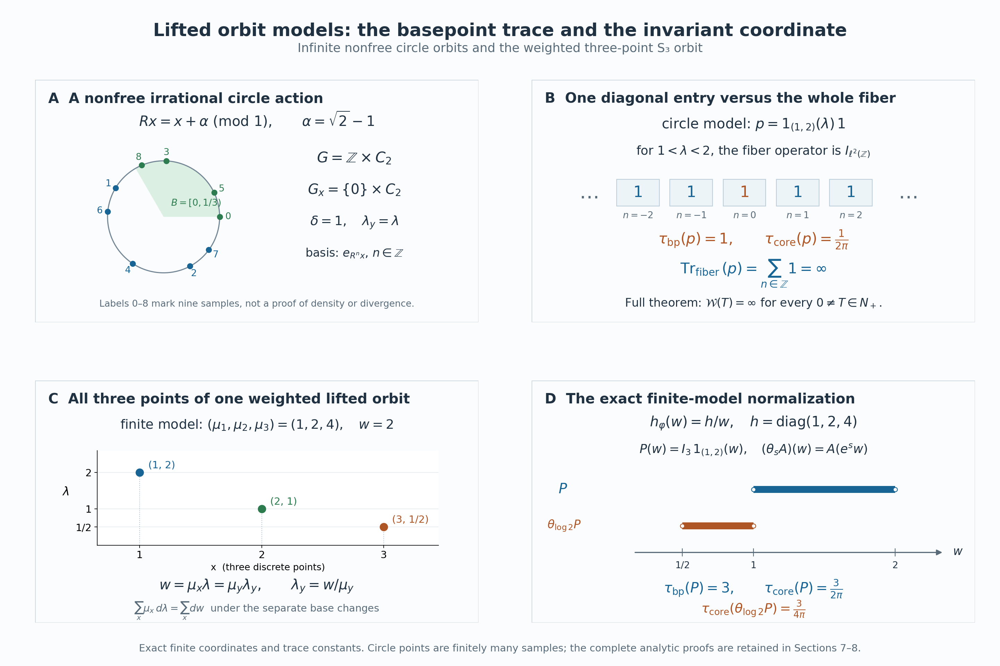

# Lifted orbit relations and the normalized core

*Self-checked by the writing AI. Original exposition and illustration sources: CC0-1.0; earlier and font components retain their recorded terms.*

A nonsingular action changes the mass of a set. An extra positive coordinate can compensate for that change, producing a measure-preserving action. The operator algebra of the lifted action is the core of the original orbit algebra. We prove the identification by an onto Fourier transform, determine its trace with the exact constant, and distinguish the countable lifted orbits from a separate continuous orbit representation.

## The orbit relation and its positive coordinate

Use the setting and the invariant conull version constructed in [Countable orbit algebras](OA-FLOW-REL.md#rel-1): a finite or countably infinite group \(G\) acts by nonsingular Borel bijections on a standard sigma-finite measure space \((X,\mu)\). Write
\[
 E=\{(y,x):y\in Gx\},\qquad
 H=L^2(E,\nu_r),\qquad
 \delta=\frac{d\nu_l}{d\nu_r}.
\tag{LFT0.a}
\]
Right counting integrates the base coordinate \(x\), and counts each distinct \(y\in Gx\) once. The reciprocal and chain identities for \(\delta\) hold on every related triple of the chosen invariant conull space. The original orbit algebra is \(M\subset B(H)\), with generators \(\pi(f)\) and \(u_g\). Its diagonal weight
\(\varphi=\mu\circ E_D\) is faithful normal semifinite by [REL5](OA-FLOW-REL.md#rel-5), which also proves the complete GNS realization and modular formula.

Put \(L=\Lambda=(0,\infty)\). We will use two positive coordinates with different roles. The lifted **base coordinate** is \(\lambda\), with Lebesgue measure \(d\lambda\). Only in Section 6 do we introduce an additional continuous **orbit coordinate** \(\zeta\), with multiplicative Haar measure \(d\zeta/\zeta\). They must not be identified.

Inner products are linear in the first variable. All weights and traces below are defined on the whole positive cone, including infinite values. There is no freeness, ergodicity, factor or finite-measure assumption unless a particular example says so. If \(\mu=0\), all represented algebras and maps are zero; the assertions have that immediate interpretation.

## 1. A measure-preserving lift with the same orbit points

Use the invariant conull version of the cocycle constructed in [REL1](OA-FLOW-REL.md#rel-1). Put
\[
 \Lambda=(0,\infty),\qquad
 \widetilde X=X\times\Lambda,\qquad
 \widetilde\mu=\mu\otimes d\lambda,\qquad
 d_g(x)=\delta(gx,x).
\tag{LFT1.a}
\]
The product is standard Borel and its measure is sigma-finite. Nonnegative interchange on these products follows from the [rectangle proof of scalar interchange](OA-FLOW-FF.md#oa-flow.ff.1): standard Borel products have the product Borel sigma-algebra, since countable bases in Polish realizations generate it by rectangles. On finite-measure pieces the same rectangle and monotone-class proof applies; a countable finite-measure partition gives the sigma-finite statement. We use the complex version only when the integral of the absolute value is finite.

Define
\[
 \widetilde g(x,\lambda)
       =\left(gx,\frac{\lambda}{d_g(x)}\right)
       =(gx,\delta(x,gx)\lambda).
\tag{LFT1.b}
\]
These are Borel maps. The cocycle identity gives
\(d_{gh}(x)=d_g(hx)d_h(x)\), so
\(\widetilde g\,\widetilde h=\widetilde{gh}\);
\(\widetilde e\) is the identity and
\(\widetilde{g^{-1}}\) is the inverse of \(\widetilde g\). Thus they form a Borel action.

It preserves the whole measure. For every nonnegative Borel \(F\), scalar substitution in \(\lambda\) and REL1's exact change of variables give
\[
 \begin{aligned}
 \int_{\widetilde X}F(\widetilde g(x,\lambda))\,
                   d\mu(x)\,d\lambda
  &=\int_X d_g(x)\int_0^\infty F(gx,u)\,du\,d\mu(x)\\
  &=\int_X\int_0^\infty F(y,u)\,du\,d\mu(y).
 \end{aligned}
\tag{LFT1.c}
\]
Both sides may be infinite. No invariance of the original \(\mu\) was assumed.

The lifted orbit of \((x,\lambda)\) contains exactly one point over each \(y\in Gx\), namely
\[
 (y,\lambda_y),\qquad
 \lambda_y=\delta(x,y)\lambda.
\tag{LFT1.d}
\]
Indeed any \(g\) with \(gx=y\) gives that value by (LFT1.b), which depends only on the point pair \((x,y)\). Conversely every lifted point has this form. If \(gx=x\), then \(d_g(x)=\delta(x,x)=1\), so \(g\) fixes the lifted point too. In particular the stabilizer is unchanged, and the lift introduces no group-label multiplicity.

Let \(\widetilde E\) be the orbit relation of this action. The map
\[
 (y,x;\lambda)\longmapsto
       \bigl((y,\delta(x,y)\lambda),(x,\lambda)\bigr)
\tag{LFT1.e}
\]
is a Borel bijection \(E\times\Lambda\to\widetilde E\), with inverse obtained by reading \(y,x,\lambda\). Its right counting measure becomes \(\nu_r\otimes d\lambda\). The full regular Hilbert space is therefore
\[
 \widetilde H=L^2(E\times\Lambda,\nu_r\otimes d\lambda)
   =\int_{\widetilde X}^{\oplus}\ell^2(Gx)\,
                             d\mu(x)\,d\lambda.
\tag{LFT1.f}
\]
This is the onto coordinate identification of [REL2](OA-FLOW-REL.md#rel-2), applied to the lifted action and then to (LFT1.e). The point \(y\) indexes the basis vector corresponding to \((y,\lambda_y)\).

Write \(N\) for the lifted relation algebra and \(\widetilde D\) for its diagonal. In these coordinates their generators are
\[
 \begin{aligned}
 (\widetilde\pi(F)\eta)(y,x;\lambda)
       &=F(y,\lambda_y)\eta(y,x;\lambda),\\
 (\widetilde u_g\eta)(y,x;\lambda)
       &=\eta(g^{-1}y,x;\lambda),\\
 N&=\{\widetilde\pi(L^\infty(\widetilde X)),
                          \widetilde u_g:g\in G\}'',\qquad
 \widetilde D=\widetilde\pi(L^\infty(\widetilde X)).
 \end{aligned}
\tag{LFT1.g}
\]
In the second formula the source \((x,\lambda)\) stays fixed; the cocycle identity changes its lifted target to the point over \(g^{-1}y\). Hence no further coordinate or density factor occurs.

All hypotheses of the full [REL3 field criterion](OA-FLOW-REL.md#rel-3) now hold. Thus \(N\) consists exactly of the essentially bounded measurable fields \(A(x,\lambda)\in B(\ell^2(Gx))\) satisfying
\[
 A(gx,\delta(x,gx)\lambda)=A(x,\lambda)
                 \qquad(g\in G)
\tag{LFT1.h}
\]
on an invariant conull set of the lifted base. The equality fixes the point labels \(y\); the corresponding lifted points are the same under the two choices of basepoint. The norm is the essential supremum of the whole fiber norms. Countable first-occurrence frames give all the measurability and common-null-set assertions, including when orbit sizes vary.

We will need inversion of the entire counting measure. Since each \(\widetilde g\) preserves \(\widetilde\mu\), the right and left counting measures of \(\widetilde E\) agree. Here is the precise countable argument. Disjointify the group graphs by their first representatives, as in REL1. A Borel subset of one graph is the graph of a restriction of \(\widetilde g\); its right measure is the measure of its domain and its left measure is the measure of its image. These are equal by (LFT1.c). Add over the disjoint graph pieces. Inversion therefore preserves this measure. In the coordinates (LFT1.e) it is
\[
 \begin{aligned}
 \mathcal I(y,x;\lambda)
       &=(x,y;\delta(x,y)\lambda),\\
 \int K\circ\mathcal I\,d(\nu_r\otimes d\lambda)
       &=\int K\,d(\nu_r\otimes d\lambda)
       \quad(K\geq0).
 \end{aligned}
\tag{LFT1.i}
\]
The cocycle makes \(\mathcal I^2\) the identity. The integral equality counts each arrow once, including for an ineffective action.

## 2. The entire basepoint trace and the center

The faithful normal completely positive expectation of [REL4](OA-FLOW-REL.md#rel-4), applied to the lifted action, is
\[
 E_{\widetilde D}(A)=\widetilde\pi(a_A),\qquad
 a_A(x,\lambda)=\langle A(x,\lambda)e_x,e_x\rangle .
\tag{LFT2.a}
\]
For \(A\in N_+\), define
\[
 \tau_{\mathrm{bp}}(A)=
       \int_X\int_0^\infty a_A(x,\lambda)\,d\lambda\,d\mu(x)
       \ \in[0,\infty].
\tag{LFT2.b}
\]
We prove that this is a faithful normal semifinite trace on the entire positive cone.

Additivity and positive homogeneity follow from the expectation and nonnegative integration. If the value is zero, its nonnegative diagonal function is zero almost everywhere; faithfulness of \(E_{\widetilde D}\) gives \(A=0\).

For full normality, choose Borel \(B_n\uparrow X\) with \(\mu(B_n)<\infty\) and put
\[
 C_n=B_n\times[1/n,n],\qquad
 q_n=\widetilde\pi(1_{C_n}),\qquad
 \rho_n(A)=\int_{C_n}a_A\,d\widetilde\mu .
\tag{LFT2.c}
\]
The function \(1_{C_n}\) is integrable, so REL4's normal expectation pairing makes \(\rho_n\) a bounded normal positive functional. More explicitly it is the vector functional of
\(\eta_n(y,x;\lambda)=1_{\{y=x\}}1_{C_n}(x,\lambda)\).
We have \(\tau_{\mathrm{bp}}(A)=\sup_n\rho_n(A)\). For any bounded increasing positive net \(A_i\uparrow A\),
\[
 \tau_{\mathrm{bp}}(A)
   =\sup_n\sup_i\rho_n(A_i)
   =\sup_i\sup_n\rho_n(A_i)
   =\sup_i\tau_{\mathrm{bp}}(A_i).
\tag{LFT2.d}
\]
This proves normality by interchanging two suprema of numbers. It does not use an arbitrary-net pointwise monotone convergence assertion.

To prove traciality for every bounded \(A\in N\), let
\[
 k_A(y,x;\lambda)
      =\langle A(x,\lambda)e_x,e_y\rangle.
\tag{LFT2.e}
\]
It is a measurable function on \(E\times\Lambda\) by the countable frame description. Fiberwise adjoints and products in REL give
\[
 \begin{aligned}
 \tau_{\mathrm{bp}}(A^*A)
   &=\int_X\int_0^\infty
             \sum_{y\in Gx}|k_A(y,x;\lambda)|^2
                          \,d\lambda\,d\mu(x),\\
 \tau_{\mathrm{bp}}(AA^*)
   &=\int_X\int_0^\infty
             \sum_{y\in Gx}
               |k_A(x,y;\delta(x,y)\lambda)|^2
                          \,d\lambda\,d\mu(x).
 \end{aligned}
\tag{LFT2.f}
\]
For the second line, the square norm of the \(x\)-row of \(A(x,\lambda)\) is the square norm of \(A(x,\lambda)^*e_x\). Orbit constancy identifies its \((x,y)\) entry with the basepoint column entry of \(A(y,\delta(x,y)\lambda)\). Each displayed sum is nonnegative; countable interchange is valid even if its integral is infinite. Applying (LFT1.i) to \(|k_A|^2\) proves
\[
 \tau_{\mathrm{bp}}(A^*A)=\tau_{\mathrm{bp}}(AA^*)
                         \qquad(A\in N).
\tag{LFT2.g}
\]
This is the full trace identity, with no restriction to finite graph kernels.

The projections \(q_n\) increase strongly to \(1\). In fact their multipliers are \(1_{C_n}(y,\lambda_y)\), which increase to one at every lifted point; dominated convergence on \(|\eta|^2\) proves strong convergence on every \(\eta\in\widetilde H\). Their trace is
\(\tau_{\mathrm{bp}}(q_n)=\widetilde\mu(C_n)<\infty\).
For \(A\in N_+\), set \(A_n=A^{1/2}q_nA^{1/2}\). Then
\[
 \begin{gathered}
 0\leq A_n\uparrow A,\qquad
 \tau_{\mathrm{bp}}(A_n)
       =\tau_{\mathrm{bp}}(q_nAq_n)
       \leq\|A\|\,\widetilde\mu(C_n)<\infty .
 \end{gathered}
\tag{LFT2.h}
\]
The equality is (LFT2.g) applied to \(q_nA^{1/2}\). Thus every positive element is the increasing supremum of positive elements below it with finite trace. This proves semifiniteness in its full order sense. The increasing operators are \(A^{1/2}q_nA^{1/2}\); no monotonicity of \(q_nAq_n\) is needed.

The basepoint in (LFT2.b) is part of the formula: one tests the vector corresponding to the measured source point and then integrates over that point. This differs from summing the entire operator trace of every orbit fiber. The examples below will compare these two expressions.

The diagonal and center are given by the whole [REL4 MASA and center theorem](OA-FLOW-REL.md#rel-4):
\[
 \begin{aligned}
  \widetilde D'\cap N&=\widetilde D,\\
  Z(N)&=\widetilde\pi\bigl(L^\infty(\widetilde X,\widetilde\mu)^G\bigr).
 \end{aligned}
\tag{LFT2.i}
\]
In the second line invariance means
\(F(gx,\delta(x,gx)\lambda)=F(x,\lambda)\) almost everywhere for every \(g\). The applicable base is standard and sigma-finite, and the lifted group remains countable; freeness is not among the hypotheses. Thus this statement concerns all bounded central operators, not only a selected diagonal subalgebra.

## 3. Dilation, trace scaling, and the whole fixed algebra

Define
\[
 (D_s\eta)(y,x;\lambda)
       =e^{s/2}\eta(y,x;e^s\lambda),\qquad s\in\mathbb R.
\tag{LFT3.a}
\]
Substitution \(u=e^s\lambda\) proves that \(D_s\) is unitary, with inverse \(D_{-s}\), and \(D_sD_t=D_{s+t}\).

The group is strongly continuous on the full Hilbert space. On the scalar factor \(L^2(\Lambda,d\lambda)\), the onto unitary
\[
 (\mathcal Lf)(r)=e^{r/2}f(e^r),\qquad
 (\mathcal L^{-1}h)(\lambda)=\lambda^{-1/2}h(\log\lambda)
\tag{LFT3.b}
\]
transports \(D_s\) to \(h(r)\mapsto h(r+s)\). Its strong continuity is the full \(L^2\) translation theorem in [FF1](OA-FLOW-FF.md#oa-flow.ff.2). Finite linear combinations of products
\(\xi(y,x)f(\lambda)\) are dense in \(\widetilde H\): on finite-measure rectangles the monotone-class argument approximates measurable indicators by rectangle-simple functions, and finite-measure and value truncations give the general \(L^2\) assertion. Scalar interchange gives their tensor norm. Thus
\(\widetilde H=H\otimes L^2(\Lambda,d\lambda)\) as full Hilbert spaces. Strong continuity extends from these finite products to every vector by the common unitary bound.

Conjugation by \(D_s\) acts on the generators by
\[
 \begin{aligned}
 D_s\widetilde\pi(F)D_s^*
       &=\widetilde\pi(F_s),
       &F_s(x,\lambda)&=F(x,e^s\lambda),\\
 D_s\widetilde u_gD_s^*&=\widetilde u_g .
 \end{aligned}
\tag{LFT3.c}
\]
It therefore defines normal automorphisms \(\theta_s\) of \(N\), with inverse \(\theta_{-s}\). For every \(A\in N\),
\[
 (\theta_s(A))(x,\lambda)=A(x,e^s\lambda).
\tag{LFT3.d}
\]
This follows either by substituting in the full field action or by the generator formulas and normality. The map \(s\mapsto\theta_s(A)\) is strongly continuous, as is the adjoint map, because \(D_s\) and \(D_s^*\) are strongly continuous and all have norm one. Bounded vector-series tests from [CP6](OA-FLOW-CP.md#oa-flow.cp.6) then give point-ultraweak continuity as well.

The diagonal expectation has the same field transformation. For every \(A\in N_+\), nonnegative substitution in (LFT2.b) gives the exact scaling
\[
 \begin{aligned}
 \tau_{\mathrm{bp}}(\theta_s(A))
   &=\int_X\int_0^\infty a_A(x,e^s\lambda)\,d\lambda\,d\mu(x)\\
   &=e^{-s}\tau_{\mathrm{bp}}(A).
 \end{aligned}
\tag{LFT3.e}
\]
It holds also when either value is infinite.

Let \(M\subset B(H)\) be the original relation algebra. A right orbit-constant field \(B(x)\) defines the lifted field independent of \(\lambda\), so (LFT1.h) gives a faithful unital star homomorphism
\[
 j:M\longrightarrow N,\qquad
 j(B)(x,\lambda)=B(x),\qquad
 j(B)=B\otimes1.
\tag{LFT3.f}
\]
It is isometric, by testing a unit product vector in the second factor. Its image is fixed by (LFT3.d). We prove the reverse inclusion on the entire fixed algebra.

### Rational invariance makes every matrix coefficient constant

Use the first-occurrence frame \(s_n(x)\) of REL2, which is independent of \(\lambda\). For \(A\in N^\theta\), its coefficients in logarithmic coordinates are
\[
 a_{ij}(x,r)
   =\langle A(x,e^r)s_j(x),s_i(x)\rangle.
\tag{LFT3.g}
\]
They are jointly measurable and bounded in absolute value by \(\|A\|\), after one null modification. The measures \(e^r\,dr\) and \(dr\) are equivalent. For each rational \(q\), the equality \(\theta_q(A)=A\) and whole-field uniqueness give
\(a_{ij}(x,r+q)=a_{ij}(x,r)\) for almost every \((x,r)\). Countability of \(i,j,q\) and scalar interchange give a conull set of \(x\)'s for which all these equalities hold almost everywhere in \(r\).

We spell out the scalar assertion needed at each such \(x\). Let \(b\in L^\infty(\mathbb R)\) satisfy \(b(\,\cdot+q)=b\) almost everywhere for every \(q\in\mathbb Q\). Choose nonnegative \(\phi\in C_c(\mathbb R)\) with integral one and support in \([-1,1]\), and put \(\phi_\varepsilon(r)=\varepsilon^{-1}\phi(r/\varepsilon)\). The convolution \(b*\phi_\varepsilon\) is continuous: translating its kernel changes its value by at most
\(\|b\|_\infty\) times the \(L^1\) norm of that translated-kernel difference, which tends to zero by FF1. Changing variables and using the almost-everywhere equality for one rational \(q\) shows that this continuous convolution is invariant under that translation at every real point. It is therefore invariant under all real translations by density of \(\mathbb Q\), and hence is a constant \(c_\varepsilon\).

Moreover \(b*\phi_\varepsilon\to b\) in \(L^1(I)\) for each bounded interval \(I\). To verify this without a pointwise differentiation theorem, choose a bounded larger interval \(J\) containing \(I+[-1,1]\). For \(0<\varepsilon<1\),
\[
 \|b*\phi_\varepsilon-b\|_{L^1(I)}
 \leq\int\phi_\varepsilon(t)
          \|b(\,\cdot-t)-b\|_{L^1(I)}\,dt.
\tag{LFT3.h}
\]
The inner difference is bounded by the corresponding difference for
\(b1_J\in L^1(\mathbb R)\). Its norm tends to zero as \(t\to0\), by FF1, while the kernel is supported in \([-\varepsilon,\varepsilon]\) and has integral one. This proves the claim. On a fixed interval of length one the constants \(c_\varepsilon\) are consequently Cauchy. Let their limit be \(c\); convergence on every bounded interval gives \(b=c\) almost everywhere. Only countably many exceptional translation statements were used.

Apply this argument to all \(a_{ij}(x,\cdot)\). Their constants can be chosen measurably by
\[
 b_{ij}(x)=\int_0^1 a_{ij}(x,r)\,dr.
\tag{LFT3.i}
\]
They define a measurable bounded operator \(B(x)\) on \(H_x\). Indeed, for finite linear combinations \(\xi,\eta\) of the nonzero frame vectors at \(x\), integration of the fiber bounds gives
\[
 \left|\sum_{i,j}b_{ij}(x)\xi_j\overline{\eta_i}\right|
       \leq\|A\|\,\|\xi\|\,\|\eta\|.
\tag{LFT3.j}
\]
Zero frame vectors have zero rows and columns. The bounded sesquilinear form therefore extends to the complete fiber and gives a unique operator \(B(x)\), with \(\|B(x)\|\leq\|A\|\), for each \(x\) in the chosen conull set. Set \(B(x)=0\) on the exceptional base set. Its frame entries are the measurable functions in (LFT3.i) on the conull set, and zero elsewhere. Countability of all matrix entries and density of the frame show
\(A(x,\lambda)=B(x)\) for almost every \((x,\lambda)\).

The lifted orbit identity (LFT1.h) now implies \(B(gx)=B(x)\) for almost every \(x\). More explicitly, substitution of \(A(x,\lambda)=B(x)\) into both sides is legitimate because \(\widetilde g\) preserves \(\widetilde\mu\). It yields equality for almost every \((x,\lambda)\); the two resulting operators are independent of \(\lambda\), so testing the countable frame entries on a fixed finite positive-length \(\lambda\)-interval gives the equality for almost every \(x\). Saturate the countable union of these exceptions under \(G\). On the remaining invariant conull base \(B\) is orbit constant, so the full REL3 criterion puts \(B\) in \(M\). We have proved
\[
 N^\theta=j(M).
\tag{LFT3.k}
\]

### Normality in both directions

The maps in (LFT3.k) are normal. For \(j(B)=B\otimes1\), expand any pair of vectors in the second tensor factor along an orthonormal basis. Each vector has only countably many nonzero coordinates, and
\[
 \begin{aligned}
 \langle j(B)\xi,\eta\rangle
       &=\sum_n\langle B\xi_n,\eta_n\rangle,\\
 \sum_n\|\xi_n\|\,\|\eta_n\|
       &\leq\|\xi\|\,\|\eta\|.
 \end{aligned}
\tag{LFT3.l}
\]
A full normal vector series on the target gives a countable double series with the same summable bound, hence a normal vector series on the source after enumeration and rescaling of its two factors. CP6 proves normality of \(j\) for the full ultraweak topologies.

Choose any unit vector \(k\in L^2(\Lambda,d\lambda)\), and let
\(V_k:H\to\widetilde H\) be \(V_k\xi=\xi\otimes k\). The inverse on the actual fixed algebra is the restriction of a normal compression:
\[
 j^{-1}(A)=V_k^*AV_k\qquad(A\in N^\theta).
\tag{LFT3.m}
\]
Indeed the fixed-field proof has already written \(A=j(B)\), and this compression is \(B\). Composing a vector series with the compression replaces each vector by its image under \(V_k\), so it is normal by CP6. Thus (LFT3.k) is a normal isomorphism with a normal inverse, rather than merely a bijection on selected fields. On the original generators,
\[
 j(\pi(f))=\widetilde\pi\bigl((x,\lambda)\mapsto f(x)\bigr),
 \qquad j(u_g)=\widetilde u_g .
\tag{LFT3.n}
\]

The center description in (LFT2.i) is preserved by dilation:
\(\theta_s(\widetilde\pi(F))=\widetilde\pi(F_s)\).
It also gives the precise fixed-center identity
\[
 Z(N)^\theta=j(Z(M)).
\tag{LFT3.o}
\]
A central fixed element is \(j(B)\) by (LFT3.k), and its commutation with \(j(M)\) forces \(B\in Z(M)\). Conversely REL4 writes each \(B\in Z(M)\) as \(\pi(f)\) with \(f\) invariant on original orbits. The function \(F(x,\lambda)=f(x)\) is invariant on lifted orbits, so \(j(B)\) is central by (LFT2.i), and it is fixed. These are assertions about the whole algebras and their centers; the Fourier construction will identify them with the canonical core and its center flow.

## 4. An onto Fourier realization of the core

Form the regular core \(C_\varphi=M\rtimes_{\sigma^\varphi}\mathbb R\) on
\(\mathcal K=L^2(\mathbb R,H)\), using Lebesgue measure \(dr\). To distinguish its coefficient embedding from the original diagonal \(\pi\), write
\[
 (\Pi_\varphi(A)\xi)(r)=\sigma_{-r}^\varphi(A)\xi(r),
 \qquad (\Lambda(t)\xi)(r)=\xi(r-t).
\tag{LFT4.a}
\]
The [normal regular representation](OA-FLOW-NR.md#oa-flow.nr.3) makes these a faithful normal copy of \(M\) and its covariant translation group. Their generated algebra is \(C_\varphi\). Its dual action \(\widehat\theta_s\) fixes \(\Pi_\varphi(M)\) and sends \(\Lambda(t)\) to \(e^{-ist}\Lambda(t)\); on \(\mathcal K\) it is implemented by multiplication by \(e^{-isr}\), as proved in [DA's spatial dual action](OA-FLOW-DA.md#da-action).

Use the negative Fourier transform in \(r\):
\[
 \widehat\xi(y,x;p)=(2\pi)^{-1/2}
           \int_{\mathbb R}e^{-irp}\xi(y,x;r)\,dr.
\tag{LFT4.b}
\]
The integral formula is initially for integrable square-integrable tensors. The [onto scalar Plancherel theorem](OA-FLOW-FF.md#oa-flow.ff.3), followed by completion of finite Hilbert tensors, defines the full unitary on \(\mathcal K\). Thus (LFT4.b) never requires an ordinary convergent integral for an arbitrary \(L^2\) vector.

Recall from Section 1 that the lifted point over \(y\in Gx\), for base point \((x,\lambda)\), has height
\(\lambda_y=\delta(x,y)\lambda\). Define
\[
 (W\xi)(y,x;\lambda)
    =\lambda^{-1/2}\widehat\xi
       \bigl(y,x;\log(\delta(x,y)\lambda)\bigr).
\tag{LFT4.c}
\]
This is a unitary from the entire regular Hilbert space \(\mathcal K\) onto
\(\widetilde H=L^2(E\times L,\nu_r\,d\lambda)\). Indeed the substitution
\(p=\log(\delta(x,y)\lambda)\) gives \(dp=d\lambda/\lambda\), so nonnegative scalar interchange and Plancherel give
\[
 \int_E\int_0^\infty |W\xi(y,x;\lambda)|^2\,d\lambda\,d\nu_r
       =\int_E\int_{\mathbb R}|\widehat\xi(y,x;p)|^2\,dp\,d\nu_r
       =\|\xi\|^2.
\tag{LFT4.d}
\]
All functions in this change of variables are Borel, and for each \((y,x)\) the substitution preserves the relevant null classes. Tonelli therefore makes the formula independent of the chosen measurable representative. There is a full inverse after Fourier transformation:
\[
 \widehat\xi(y,x;p)
   =\bigl(\delta(y,x)e^p\bigr)^{1/2}
       \eta\bigl(y,x;\delta(y,x)e^p\bigr),
       \qquad\eta\in\widetilde H.
\tag{LFT4.e}
\]
The same substitution proves that the right side is square integrable with norm \(\|\eta\|\). Apply the inverse Fourier unitary to obtain \(\xi\). This establishes surjectivity, with no unspecified completion or multiplicity space.

### Compute on one orbit arrow, then on the whole algebra

Let \(\widetilde\pi(F)\) and \(\widetilde u_g\) be the lifted generators of \(N\), and let \(j:M\to N\) be the lambda-independent field embedding from Section 3. The [modular matrix formula](OA-FLOW-REL.md#rel-5) gives
\[
 (\Pi_\varphi(u_g)\xi)(y,x;r)
     =\delta(y,g^{-1}y)^{-ir}\xi(g^{-1}y,x;r).
\tag{LFT4.f}
\]
Put \(z=g^{-1}y\). Negative Fourier transformation turns the scalar multiplier in (LFT4.f) into the shift
\(p\mapsto p+\log\delta(y,z)\). But the cocycle identity gives
\[
 \log(\delta(x,y)\lambda)+\log\delta(y,z)
        =\log(\delta(x,z)\lambda).
\tag{LFT4.g}
\]
The factor \(\lambda^{-1/2}\) in \(W\) is unchanged. Diagonal multipliers have no Fourier shift, since their original modular action is trivial. Consequently
\[
 \begin{aligned}
 W\Pi_\varphi(\pi(f))W^*&=\widetilde\pi(f(y))=j(\pi(f)),\\
 W\Pi_\varphi(u_g)W^*&=\widetilde u_g=j(u_g),\\
 W\Lambda(t)W^*&=\widetilde\pi(\lambda_y^{-it}).
 \end{aligned}
\tag{LFT4.h}
\]
The notation in the last line means multiplication by \(\lambda_y^{-it}\) on the represented lifted relation; its function on the lifted base is \((y,a)\mapsto a^{-it}\). The last equality follows because the Fourier transform of \(\xi(r-t)\) is \(e^{-itp}\widehat\xi(p)\).

The translation and modulation identities hold on all of \(L^2\), by the scalar theorem and tensor completion. Formula (LFT4.g) is a pointwise identity on the invariant conull relation. These facts justify (LFT4.h) as identities of bounded operators on their full Hilbert spaces. Moreover both maps
\(A\mapsto W\Pi_\varphi(A)W^*\) and \(A\mapsto j(A)\) are normal. They agree on the unital star algebra spanned by \(\pi(f)u_g\), so ultraweak density and normality yield
\[
 W\Pi_\varphi(A)W^*=j(A)\qquad(A\in M).
\tag{LFT4.i}
\]
No Fourier integral has been interchanged with an arbitrary infinite orbit-matrix sum.

We also need the entire image algebra. The functions \(a\mapsto a^{-it}\) generate every bounded Borel function of \(a\in L\). One explicit verification uses only \(t=1/n\): the continuous map
\[
 r\longmapsto(e^{-ir/n})_{n\ge1}\quad
     \text{from }\mathbb R\text{ to }\mathbb T^{\mathbb N}
\tag{LFT4.j}
\]
is injective, since a nonzero difference cannot be an integer multiple of \(2\pi n\) for every sufficiently large \(n\). Its image is Borel and its inverse on that image is Borel by the [Borel image and inverse theorem](../../NCG-FOLIATIONS/companions/polish-spaces-and-standard-borel-spaces.html#oa-fnd-pb-06). Spectral projections of the real and imaginary coordinate multipliers belong to their generated von Neumann algebra by the [bounded Borel spectral calculus](OA-FLOW-SF.md#oa-flow.sf1.spectral-calculus). The class of sets whose characteristic multipliers belong is closed under complements and countable disjoint unions, using bounded strong limits. A monotone-class argument therefore gives every Borel function of \(r\), and hence every bounded Borel function of \(a=e^r\).

Together with \(\widetilde\pi(f(y))\), these multipliers give every \(\widetilde\pi(F)\) for \(F\in L^\infty(X\times L,\mu\,d\lambda)\). To see the joint assertion, rectangle indicators belong; their finite intersections are again rectangles. Complements and disjoint bounded strong sums give a lambda-system, so the [proved pi–lambda argument](OA-FLOW-L75.md#oa-flow.kernel.integration) gives all product Borel indicators. Simple approximation gives bounded functions, and completion only changes null representatives. The representation \(\widetilde\pi\) is normal and faithful by REL2 applied to the lifted system. Thus (LFT4.h) contains all lifted diagonal generators and all \(\widetilde u_g\). The reverse inclusion of generating algebras is already in (LFT4.h)–(LFT4.i), proving the spatial normal isomorphism
\[
 \Gamma:C_\varphi\longrightarrow N,\qquad
 \Gamma(B)=WBW^*,\qquad \Gamma(C_\varphi)=N.
\tag{LFT4.k}
\]
Its inverse is conjugation by \(W^*\), also normal.

### The dual flow and the full density domain

Fourier modulation \(e^{-isr}\) shifts \(p\) to \(p+s\). In (LFT4.c) this replaces \(\lambda\) by \(e^s\lambda\). Its square-root factor gives
\[
 W(e^{-isr}\xi)(y,x;\lambda)
    =e^{s/2}(W\xi)(y,x;e^s\lambda).
\tag{LFT4.l}
\]
The right side is the dilation unitary implementing \(\theta_s\) in Section 3. Therefore
\(\Gamma\widehat\theta_s=\theta_s\Gamma\) on the whole algebra. The core's positive nonsingular generator \(h_\varphi\), characterized by
\(h_\varphi^{it}=\Lambda(t)\), is constructed with its full spectral domains in [CORE1](OA-FLOW-CORE.md#core-1). The last line of (LFT4.h), or uniqueness of that self-adjoint generator, gives
\[
 \Gamma(h_\varphi)=M_{\lambda_y^{-1}},\qquad
 D\bigl(\Gamma(h_\varphi)^z\bigr)
   =\left\{\eta\in\widetilde H:
       \int_{E\times L}\lambda_y^{-2\operatorname{Re}z}
                    |\eta|^2\,d\nu_r\,d\lambda<\infty\right\}.
\tag{LFT4.m}
\]
Here \(z\in\mathbb C\), and the operator value is multiplication by \(\lambda_y^{-z}\) on this domain. In particular \(\theta_s(h_\varphi)=e^{-s}h_\varphi\) in these coordinates. The reciprocal height, not the height, is forced by the chosen translation and Fourier signs.

## 5. The trace constant on the whole positive cone

Let \(\Phi\) be the full dual weight of \(\varphi\) on \(C_\varphi\), and let \(\tau_{\rm core}\) denote the canonical trace transported to \(N\) by \(\Gamma\). We use Lebesgue measure \(dt\) for the original real group and \(ds/(2\pi)\) for its dual characters \(t\mapsto e^{-ist}\), as in the [core normalization](OA-FLOW-CORE.md#core-setting). This convention is essential to the constant below.

The whole dual weight is the composition of \(\varphi\) with the extended-positive dual-action average: this is [GDA8](OA-FLOW-GDA.md#gda-8), with the [entire positive average](OA-FLOW-DA.md#da-positive). Under \(\Gamma\) its value algebra is \(j(M)\), and we apply \(\varphi\circ j^{-1}\) to that average. Take \(f\in L^1(X,\mu)_+\cap L^\infty(X,\mu)\) and \(g\in C_c(L)_+\), and write
\[
 A_{f,g}=\widetilde\pi\bigl((y,a)\mapsto f(y)g(a)\bigr).
\tag{LFT5.a}
\]
For every normal positive vector functional, scalar Tonelli and \(u=e^s\lambda_y\) evaluate its dual-action integral. The multiplier \(f(y)\) is fixed, and
\[
 \int_{\mathbb R}g(e^s\lambda_y)\,\frac{ds}{2\pi}
       =\frac1{2\pi}\int_0^\infty g(u)\,\frac{du}{u}.
\tag{LFT5.b}
\]
The integral is finite because the compact support of \(g\) is bounded away from zero. Compact positive averages increase to this bounded multiple of \(j(\pi(f))\). Equality of all normal positive pairings identifies the entire extended-positive average, not only its values on a preferred dense set. Consequently
\[
 (\Phi\circ\Gamma^{-1})(A_{f,g})
     =\frac{\mu(f)}{2\pi}\int_0^\infty g(u)\,\frac{du}{u}.
\tag{LFT5.c}
\]

By [CORE2](OA-FLOW-CORE.md#core-2), the normalized trace is the centralizer perturbation
\(\Phi_{h_\varphi^{-1}}\), including all infinite values. On \(A_{f,g}\), its density is \(\lambda_y\) by (LFT4.m). The bounded spectral-band cutoffs of this density multiply \(g(u)\) by \(u1_{[1/n,n]}(u)\), as in [CZ2](OA-FLOW-CZ.md#cz-2). For all sufficiently large \(n\), the compact support of \(g\) lies in \((1/n,n)\), so the product is exactly \(u g(u)\). Apply (LFT5.c) to get
\[
 \tau_{\rm core}(A_{f,g})
       =\frac{\mu(f)}{2\pi}\int_0^\infty g(u)\,du.
\tag{LFT5.d}
\]
This proves the normalization on diagonal tests. A further argument is necessary to conclude equality on the full algebra.

### Why these tests determine the entire trace

Both \(\tau_{\rm core}\) and the basepoint trace \(\tau_{\rm bp}\) of Section 2 are faithful normal semifinite traces on \(N\). The [central-density comparison for traces](OA-FLOW-L18.md#l18-2) gives a unique nonsingular positive self-adjoint operator \(k\), affiliated with \(Z(N)\), such that
\[
 \tau_{\rm core}=(\tau_{\rm bp})_k.
\tag{LFT5.e}
\]
The center lies in the lifted diagonal by Section 2. All spectral projections of \(k\) therefore lie in that diagonal, and its full spectral calculus realizes \(k\) as multiplication by an almost-everywhere finite positive measurable function \(k(x,\lambda)\) on the lifted base. On its diagonal, \(\tau_{\rm bp}\) is precisely integration against \(\mu\,d\lambda\). Bounded spectral cutoffs and monotone convergence turn (LFT5.d) into
\[
 \int_X\int_0^\infty
       k(x,\lambda)f(x)g(\lambda)\,d\lambda\,d\mu(x)
    =\frac1{2\pi}\mu(f)\int_0^\infty g(\lambda)\,d\lambda.
\tag{LFT5.f}
\]

Here is the measure-uniqueness step in full. Fix a finite-measure base set \(B_m\) and a compact interval \([a,b]\subset L\). Choose a nonnegative continuous function of compact support which is at least one on \([a,b]\). Equation (LFT5.f) with \(f=1_{B_m}\) makes \(k\) integrable on \(B_m\times[a,b]\). For every Borel \(B\subset B_m\), use \(f=1_B\). Continuous nonnegative functions increasing to the indicator of an open bounded interval inside \(L\) can be obtained by the triangular cutoffs
\(\min(1,n(\lambda-a)_+,n(b-\lambda)_+)\).
Monotone convergence in (LFT5.f) proves equality of the measures
\(k\,d\mu\,d\lambda\) and \((2\pi)^{-1}d\mu\,d\lambda\) on these rectangles. On a finite-measure strip \(B_m\times(a,b)\), rectangle intersections form a generating pi-system; both measures have the same finite total mass. The finite pi–lambda uniqueness proof from [L75](OA-FLOW-L75.md#oa-flow.kernel.integration) makes them equal on every Borel subset of that strip. Such strips exhaust the product. Thus their densities agree almost everywhere. One can also finish directly by integrating on the sets where \(k-(2\pi)^{-1}\) is bounded away from zero; a nonnull such set would contradict the equality of measures.

Therefore \(k=(2\pi)^{-1}\) almost everywhere. Substituting this **central** density into (LFT5.e) proves
\[
 \boxed{\quad
 \tau_{\rm core}(T)=\frac1{2\pi}\tau_{\rm bp}(T)
       \quad(T\in N_+),\quad}
\tag{LFT5.g}
\]
including \(+\infty\). This conclusion uses a uniqueness theorem for traces on the whole algebra. Agreement on diagonal tests alone would not prove equality for arbitrary normal semifinite weights.

The isomorphism (LFT4.k) now identifies the entire core, its dual flow, its fixed algebra, its normalized trace and its positive density with the lifted relation construction. Its restriction to the center identifies the flow of weights with the dilation action on
\(L^\infty(X\times L,\mu\,d\lambda)^G\), by Section 2. When the original action is ergodic, REL4 makes \(M\) a factor; no ergodicity assumption was used in the construction or in (LFT5.g).

## 6. The continuous orbit coordinate and the full tensor algebra

Adjoining dilations makes the orbit through \((x,\lambda)\) equal to \(Gx\times(0,\infty)\). Its second coordinate is continuous. We specify its measure and representation directly. Counting the distinct points of this larger orbit would give a different Hilbert space from the one used here.

Write \(L=(0,\infty)\), and put
\[
 \begin{aligned}
 H&=L^2(E,\nu_r),&
 K&=L^2(L,d\zeta/\zeta),& J&=L^2(L,d\lambda),\\
 \mathcal H_{\rm c}&=H\otimes K\otimes J.
 \end{aligned}
 \tag{LFT6.a}
\]
Equivalently, the fiber over \((x,\lambda)\) is
\(\ell^2(Gx)\otimes K\), with counting measure on the **distinct** points \(y\in Gx\) and Haar measure \(d\zeta/\zeta\) on the continuous coordinate. Integration of the squared fiber norm against \(d\mu(x)d\lambda\) gives (LFT6.a). The countable first-occurrence graphs from [REL Section 2](OA-FLOW-REL.md#rel-2), followed by scalar product integration, establish this identification on the whole Hilbert space. Neither \(x\) nor the base coordinate \(\lambda\) is discarded.

For \(F\in L^\infty(X\times L,d\mu\,d\zeta/\zeta)\), \(g\in G\), and \(t\in\mathbb R\), define
\[
 \begin{aligned}
 (\Pi_F\xi)(y,x;\zeta,\lambda)
    &=F(y,\zeta)\xi(y,x;\zeta,\lambda),\\
 (U_g\xi)(y,x;\zeta,\lambda)
    &=\xi\left(g^{-1}y,x;
           \frac{\zeta}{\delta(g^{-1}y,y)},\lambda\right),\\
 (V_t\xi)(y,x;\zeta,\lambda)
    &=\xi(y,x;e^t\zeta,\lambda).
 \end{aligned}
 \tag{LFT6.b}
\]
The continuous-orbit algebra in this section means precisely
\[
 \mathcal R_{\rm c}
   =\{\Pi_F,U_g,V_t:F\in L^\infty(X\times L),\ g\in G,
                                  \ t\in\mathbb R\}''.
 \tag{LFT6.c}
\]
Thus its definition includes the continuous fiber measure and the actual operators. It is not an application of the countable counting-fiber definition with an uncountable group substituted into it.

For the geometric action one can use
\[
 (g,t)\cdot(y,\zeta)
       =(gy,e^{-t}\delta(y,gy)\zeta).
 \tag{LFT6.d}
\]
The chain rule in [REL Section 1](OA-FLOW-REL.md#rel-1) proves the group law. Its orbits are exactly \(Gx\times L\); the sign of \(t\) makes pullback by \((e,t)^{-1}\) equal to \(V_t\). Pullback by \((g,0)^{-1}\) is \(U_g\). On each fiber, \(g\) permutes the point labels and rescales the Haar variable, so \(U_g\) is unitary. Haar invariance also proves unitarity of \(V_t\). Substitution and the chain rule give
\[
 U_gU_h=U_{gh},\qquad V_tV_s=V_{t+s},\qquad U_gV_t=V_tU_g.
 \tag{LFT6.e}
\]
For example
\(U_g\Pi_FU_g^*=\Pi_{F\circ(g,0)^{-1}}\).
Stabilizers create no extra copies of a point in any of these formulas.

The multiplication map \(F\mapsto\Pi_F\) is faithful and normal, including for arbitrary increasing nets. Here are the measure details. For \(\xi\in\mathcal H_{\rm c}\), integration in \(\lambda\) and the identity \(d\nu_l=\delta\,d\nu_r\) give the nonnegative integrable function
\[
 \begin{aligned}
 b_\xi(y,\zeta)
    &=\sum_{x\in Gy}\int_L
       \frac{|\xi(y,x;\zeta,\lambda)|^2}{\delta(y,x)}\,d\lambda,\\
 \int_{X\times L}b_\xi\,d\mu\,\frac{d\zeta}{\zeta}
       &=\|\xi\|^2.
 \end{aligned}
 \tag{LFT6.f}
\]
Consequently
\(\langle\Pi_F\xi,\xi\rangle=\int F b_\xi\,d\mu\,d\zeta/\zeta\).
This also shows that changes on product null sets have zero operator effect. Polarization and summable vector-series tails prove full ultraweak continuity, just as in (REL2.f). Faithfulness follows by testing diagonal graph vectors \(y=x\), a unit vector in \(J\), and scalar functions supported on finite-measure portions of \(X\times L\) where \(|F|\) is bounded away from zero. Thus \(\|\Pi_F\|=\|F\|_\infty\).

**Measurable dilation fields.** On \(K\) let
\[
 (D_a f)(\zeta)=f(e^a\zeta),\qquad
 a_g(y)=\log\delta(y,g^{-1}y).
 \tag{LFT6.g}
\]
Under the logarithmic unitary \(f\mapsto[p\mapsto f(e^p)]\), \(D_a\) becomes \(h(p)\mapsto h(p+a)\). This is strongly continuous: first check uniform translation convergence for compactly supported continuous functions, then use their density and the unitary norm bound. Its adjoints \(D_{-a}\) are strongly continuous too. The function \(a_g\) is finite and Borel on the invariant conull space fixed in REL; it need not be bounded.

Define
\[
 (C_g\xi)(y,x;\zeta,\lambda)
      =\xi(y,x;e^{a_g(y)}\zeta,\lambda).
 \tag{LFT6.h}
\]
This is a genuine measurable unitary field belonging to
\(D\,\overline\otimes B(K)\otimes1_J\), where
\(D=\pi(L^\infty(X,\mu))\subset M\). To prove the assertion, choose finite-valued real Borel functions \(a_{g,n}\to a_g\), for example by clipping at \(\pm n\) and then rounding down on a mesh of size \(1/n\). Write their finite level partitions as \((A_{n,j})_j\), with values \(a_{n,j}\). Then
\[
 C_{g,n}
   =\sum_j\pi(1_{A_{n,j}})\otimes D_{a_{n,j}}\otimes1_J
      \ \in\ D\,\overline\otimes B(K)\otimes1_J.
 \tag{LFT6.i}
\]
Each is unitary. View an arbitrary vector as a square-integrable \(K\)-valued function \(\xi(y,x;\lambda)\). Strong continuity of \(D_a\) gives pointwise convergence of its images, and
\[
 \bigl\|(D_{a_{g,n}(y)}-D_{a_g(y)})\xi(y,x;\lambda)\bigr\|_K^2
       \le4\|\xi(y,x;\lambda)\|_K^2.
 \tag{LFT6.j}
\]
Scalar dominated convergence proves strong convergence on **every** vector. The same argument with negative parameters proves strong convergence of the adjoints. Measurability follows either from these finite-valued approximations and pointwise vector limits, or by the displayed change of variables on measurable scalar representatives. Hence \(C_{g,n}\to C_g\) strongly-star, and the generated von Neumann algebra contains \(C_g\). This proof uses no operator-norm continuity of dilation and no boundedness of \(a_g\).

The order of the factors is
\[
 U_g=C_g(u_g\otimes1_K\otimes1_J),\qquad
 u_g\otimes1_K\otimes1_J=C_g^*U_g.
 \tag{LFT6.k}
\]
Indeed \(e^{a_g(y)}=1/\delta(g^{-1}y,y)\). The factor \(C_g\) depends on the output point \(y\), which fixes the order in (LFT6.k).

**Both full tensor-algebra inclusions.** We claim
\[
 \boxed{\quad
 \mathcal R_{\rm c}
       =(M\,\overline\otimes B(K))\otimes1_J.
 \quad}
 \tag{LFT6.l}
\]
For the forward inclusion, rectangle multipliers are
\(\Pi_{f(y)b(\zeta)}=\pi(f)\otimes M_b\otimes1_J\).
Indicators of measurable rectangles generate all product Borel sets. The class of sets whose multiplication projections belong to the von Neumann algebra generated by these rectangle multipliers is closed under complements and countable disjoint unions, the latter by bounded strong convergence. The monotone class argument therefore includes every product Borel indicator. Null-set equivalence from (LFT6.f), simple approximation and bounded strong convergence then include every \(\Pi_F\). Thus these multipliers lie in
\(D\,\overline\otimes B(K)\otimes1_J\).
Equations (LFT6.i)–(LFT6.k) put every \(U_g\) in the right side of (LFT6.l), and \(V_t=1_H\otimes D_t\otimes1_J\) is there as well. Strong closure proves the whole forward inclusion.

For the reverse inclusion, take \(F(y,\zeta)=b(\zeta)\). These generators give \(1_H\otimes M_b\otimes1_J\), while the \(V_t\) give all dilations. In logarithmic coordinates the characters \(\zeta^{-is}\) become \(e^{-isp}\), and \(D_t\) becomes the translation \(h(p)\mapsto h(p+t)\). The latter is \(L_{-t}\) in ND's convention. The [proved concrete Weyl lemma](OA-FLOW-ND.md#nd-weyl-proof), whose multiplier and commutant proof includes the entire Hilbert space, therefore gives
\[
 \{M_b,D_t:b\in L^\infty(L),\ t\in\mathbb R\}''=B(K).
 \tag{LFT6.m}
\]
It follows that \(\mathcal R_{\rm c}\) contains \(1_H\otimes B(K)\otimes1_J\). It also contains \(\pi(f)\otimes1_K\otimes1_J\), hence the von Neumann algebra generated by these two families, including every \(C_g\). Now (LFT6.k) recovers every \(u_g\otimes1_K\otimes1_J\). The definition of \(M\) in (REL2.h) recovers \(M\otimes1_K\otimes1_J\); together with the full second factor this generates the right side of (LFT6.l). This proves the reverse inclusion on the entire tensor algebra, not merely on elementary tensors.

The factor \(1_J\) records the remaining base-coordinate multiplicity. Amplification \(T\mapsto T\otimes1_J\) is a faithful normal isomorphism onto this represented algebra. Its inverse there is the normal slice by any fixed unit vector of \(J\). The [finite-matrix tensor proof](OA-FLOW-ND.md#nd-tensor) supplies the same full normal conclusion for arbitrary coefficient Hilbert multiplicity. If \(\mu=0\), the coefficient Hilbert space and both algebras are zero, with their unique zero-algebra identification.

**The exact second crossing.** Let
\(C_\varphi=M\rtimes_{\sigma^\varphi}\mathbb R\), with its coefficient inclusion \(i=\Pi_\varphi\), unitaries \(\Lambda(t)\), and dual action
\(\widehat\theta_s(\Lambda(t))=e^{-ist}\Lambda(t)\).
Let \(\jmath\) and \(\ell_s\) denote the coefficient inclusion and the second group unitaries in \(C_\varphi\rtimes_{\widehat\theta}\mathbb R\).
The [full normal biduality construction](OA-FLOW-ND.md#nd-construction), with its [normal inverse](OA-FLOW-ND.md#nd-inverse), supplies
\[
 \Phi_{\rm ND}:C_\varphi\rtimes_{\widehat\theta}\mathbb R
        \longrightarrow M\,\overline\otimes B(L^2(\mathbb R,dr)),
 \tag{LFT6.n}
\]
whose three generator formulas are
\[
 \begin{aligned}
 [\Phi_{\rm ND}(\jmath(i(A)))\xi](r)&=\sigma_{-r}^\varphi(A)\xi(r),\\
 \Phi_{\rm ND}(\jmath(\Lambda(t)))&=1\otimes L_t,\\
 \Phi_{\rm ND}(\ell_s)&=1\otimes M_{e^{-isr}}.
 \end{aligned}
 \tag{LFT6.o}
\]
Here \(L_t\xi(r)=\xi(r-t)\). These formulas are the actual normal theorem, rather than a universal-property assertion about an arbitrary covariant representation.

Use the same normalized negative Fourier convention as [Section 4](OA-FLOW-LFT.md#lft-4), and then set \(p=\log\zeta\). The resulting onto unitary \(\mathscr F:L^2(\mathbb R,dr)\to K\) is
\[
 (\mathscr Ff)(\zeta)
    =(2\pi)^{-1/2}\int_{\mathbb R}
              e^{-ir\log\zeta}f(r)\,dr
       \quad(f\in L^1\cap L^2).
 \tag{LFT6.p}
\]
The [normalized real-line Fourier theorem](OA-FLOW-FF.md#oa-flow.ff.3) proves that the two signs extend to onto inverse unitaries, with exactly this constant. Tensoring with the coefficient identity is justified on finite Hilbert tensors and then by completion. On the corresponding integrable inverse domain the inverse uses \(e^{ir\log\zeta}\), the factor \((2\pi)^{-1/2}\), and \(d\zeta/\zeta\). No integral formula is imposed on an arbitrary \(L^2\) representative.

Define the full normal isomorphism
\[
 \Psi(Z)
   =\bigl[(1_H\otimes\mathscr F)\Phi_{\rm ND}(Z)
                  (1_H\otimes\mathscr F)^*\bigr]\otimes1_J.
 \tag{LFT6.q}
\]
Its range is \(\mathcal R_{\rm c}\) by (LFT6.l), and its inverse on that range is obtained by undoing amplification, conjugating by \(1_H\otimes\mathscr F^*\), and applying \(\Phi_{\rm ND}^{-1}\). Each step is normal on its whole domain. In particular, \(\Psi\) has not lost the coefficient Hilbert space or a normality condition.

The [full modular calculation in REL](OA-FLOW-REL.md#rel-5) says
\(\sigma_{-r}^\varphi(u_g)=\pi(e^{-ir a_g})u_g\) and fixes \(\pi(f)\).
Negative Fourier transform turns multiplication by \(e^{-ir a_g(y)}\) into evaluation at \(p+a_g(y)\), exactly the shift in (LFT6.b). Also
\(\mathscr F L_t\mathscr F^*=M_{\zeta^{-it}}\), and
\(\mathscr F M_{e^{-isr}}\mathscr F^*=D_s\).
Initially these identities follow from substitution on integrable compact scalar tensors; unitarity and density extend them to all vectors, and the measurable-field argument (LFT6.i)–(LFT6.j) also verifies the variable shift. Therefore
\[
 \begin{aligned}
 \Psi(\jmath(i(\pi(f))))&=\Pi_{f(y)},&
 \Psi(\jmath(i(u_g)))&=U_g,\\
 \Psi(\jmath(\Lambda(t)))&=\Pi_{\zeta^{-it}},&
 \Psi(\ell_s)&=V_s.
 \end{aligned}
 \tag{LFT6.r}
\]
Normality extends the coefficient identification from these generators to every \(A\in M\). The characters \(\zeta^{-it}\) generate all multiplication operators on \(K\), by the multiplier part of the same Weyl proof, and rectangle generation then gives all \(\Pi_F\). Hence (LFT6.r) identifies exactly the continuous-orbit algebra (LFT6.c) with the double crossing.

The equivariant normal core identification of Section 4 transports this statement also to the lifted algebra crossed by its dilation action. More explicitly, represent that lifted algebra faithfully, compose its representation with the Section 4 core isomorphism, and form the two regular coefficient representations. Equivariance identifies their formulas. [NR4's normal representation-independence proof](OA-FLOW-NR.md#oa-flow.nr.4), including its normal inverse, therefore supplies the normal isomorphism of these second crossings, fixing the second group parameter. Composing with (LFT6.q) gives the asserted product model for the lifted system itself.

For an additional sign check, let \(\beta\) be the bidual action. It becomes
\[
 \Psi\beta_a\Psi^{-1}
    =\bigl(\sigma_a^\varphi\,\overline\otimes
                    \operatorname{Ad}M_{\zeta^{ia}}\bigr)\otimes\mathrm{id},
 \tag{LFT6.s}
\]
where the final identity acts on the scalar amplification factor. Indeed ND's right translation \(f(r)\mapsto f(r+a)\) becomes multiplication by \(\zeta^{ia}\). The two factors in (LFT6.s) cancel on \(U_g\); it fixes \(\Pi_{f(y)}\) and \(\Pi_{\zeta^{-it}}\), and sends \(V_s\) to \(e^{-ias}V_s\), as required for the second dual action.

**Changing the continuous fiber from Haar to Lebesgue measure.** Put \(K_0=L^2(L,d\zeta)\). The correct unitary and its full inverse are
\[
 \begin{aligned}
 Q:K\longrightarrow K_0,\qquad &(Qf)(\zeta)=\zeta^{-1/2}f(\zeta),\\
 &(Q^{-1}h)(\zeta)=\zeta^{1/2}h(\zeta).
 \end{aligned}
 \tag{LFT6.t}
\]
The identity \(\int|Qf|^2d\zeta=\int|f|^2d\zeta/\zeta\) proves isometry, and the displayed inverse proves surjectivity on the entire spaces. Multipliers are unchanged, whereas
\[
 (QD_aQ^{-1}h)(\zeta)=e^{a/2}h(e^a\zeta).
 \tag{LFT6.u}
\]
Consequently, after conjugating by \(1_H\otimes Q\otimes1_J\), the continuous-orbit unitaries are
\[
 \begin{aligned}
 (U_g^{(0)}\xi)(y,x;\zeta,\lambda)
    &=\delta(y,g^{-1}y)^{1/2}
        \xi(g^{-1}y,x;\delta(y,g^{-1}y)\zeta,\lambda),\\
 (V_t^{(0)}\xi)(y,x;\zeta,\lambda)
    &=e^{t/2}\xi(y,x;e^t\zeta,\lambda).
 \end{aligned}
 \tag{LFT6.v}
\]
The square-root factors are forced by the Lebesgue change of variables. The resulting full algebra is
\((M\,\overline\otimes B(K_0))\otimes1_J\).

There is a corresponding kernel correction. If a Hilbert–Schmidt operator on \(K\) has Haar kernel \(k\), so that
\[
 (T_kf)(\zeta)=\int_L k(\zeta,\eta)f(\eta)\,\frac{d\eta}{\eta},
 \qquad
 k\in L^2\left(L\times L,\frac{d\zeta\,d\eta}{\zeta\eta}\right),
 \tag{LFT6.w}
\]
then its Lebesgue kernel after applying \(Q\) is
\[
 k_0(\zeta,\eta)=\frac{k(\zeta,\eta)}{\sqrt{\zeta\eta}},\qquad
 \int_{L\times L}|k_0|^2\,d\zeta\,d\eta
    =\int_{L\times L}|k|^2\,\frac{d\zeta\,d\eta}{\zeta\eta}.
 \tag{LFT6.x}
\]
For almost every \(\zeta\), Cauchy–Schwarz makes the defining row integral meaningful; inserting \(Q^{-1}h(\eta)=\eta^{1/2}h(\eta)\) proves (LFT6.x), first on a dense domain and then on all vectors by the Hilbert–Schmidt bound. Thus the correction involves both kernel variables. General bounded operators are transported by \(T\mapsto QTQ^{-1}\); no measurable integral kernel is asserted for every bounded operator. These measure, unitary and kernel conventions complete the continuous product realization. The [reading note](OA-FLOW-LFT.md#lft-reading) places it alongside the source's lifted-orbit construction.

## 7. Infinite nonfree orbits and a weighted finite coordinate

Two explicit models distinguish the basepoint trace from the ordinary trace of an entire orbit fiber. The first has infinite orbits and a nontrivial ineffective stabilizer. The second retains the unequal point masses of [REL6](OA-FLOW-REL.md#rel-6), so the invariant lifted coordinate and every normalization factor can be calculated.

**An irrational rotation with an ineffective factor.** Let
\[
 X=\mathbb R/\mathbb Z,\qquad d\mu(x)=dx,\qquad
 \alpha=\sqrt2-1,\qquad R x=x+\alpha\pmod1,
 \tag{LFT7.a}
\]
where \(\mu(X)=1\). Let \(G=\mathbb Z\times C_2\) act by
\((n,\varepsilon)x=R^n x\); the \(C_2\)-factor acts trivially. The number \(\alpha\) is irrational: a rational expression \(\sqrt2=p/q\) in lowest terms would make \(p^2=2q^2\), forcing both \(p\) and \(q\) even. Thus \(R^n x=x\) implies \(n=0\). Every stabilizer is exactly \(\{0\}\times C_2\), while every distinct orbit is indexed once by \(n\in\mathbb Z\). Each orbit Hilbert space is \(\ell^2(\mathbb Z)\), with its basis labeled by the distinct points \(R^n x\). Translations preserve \(\mu\), so \(\delta(y,x)=1\).

Here is a full elementary ergodicity proof. First the subgroup
\(\{n\alpha+\mathbb Z:n\in\mathbb Z\}\) is dense in the circle. For a positive integer \(N\), put the \(N+1\) fractional parts of \(0,\alpha,\ldots,N\alpha\) into \(N\) half-open intervals of length \(1/N\). Two lie in one interval, so
\[
 0<|q\alpha-p|<1/N
 \quad\text{for some integers }q\ne0,\ p.
 \tag{LFT7.b}
\]
Write \(\beta=|q\alpha-p|\). It represents an element of the cyclic subgroup, using \(q\) or \(-q\). For any \(t\in[0,1)\), the integer \(k=\lfloor t/\beta\rfloor\) satisfies \(0\le k\beta\le t<(k+1)\beta\) and \(k\beta<1\). The subgroup element represented by \(k\beta\) is within \(1/N\) of \(t\). Arbitrary \(N\) proves density.

Next the circle translations \(T_t f(x)=f(x+t)\) are strongly continuous on \(L^2(X)\). For an arc \(I\), the measure of its symmetric difference with a sufficiently small translate is at most \(2|t|\), so \(\|T_t1_I-1_I\|_2\to0\). Finite linear combinations of arc indicators are dense. To justify this density, identify the circle with \([0,1)\), extend a function by zero, and use [FF's scalar \(L^2\) approximation](OA-FLOW-FF.md#oa-flow.ff.2). A continuous approximant restricted to \([0,1]\) is uniformly approximated there by finite interval step functions. Translation is an isometry, so
\[
 \|T_tf-f\|_2
 \le 2\|f-g\|_2+\|T_tg-g\|_2
 \tag{LFT7.c}
\]
extends continuity from these step functions to every \(f\in L^2(X)\).

If a measurable set \(B\) is invariant under \(R\) modulo null sets, then \(T_{n\alpha}1_B=1_B\) in \(L^2\) for every integer \(n\). Density of the subgroup and (LFT7.c) give \(T_t1_B=1_B\) for every real \(t\). Put \(b=\mu(B)\). Scalar nonnegative Fubini and translation invariance yield
\[
 0=\int_X\int_X|1_B(x+t)-1_B(x)|^2\,d\mu(x)\,d\mu(t)
   =2b(1-b).
 \tag{LFT7.d}
\]
Thus \(b=0\) or \(1\), proving ergodicity. This calculation uses one jointly measurable Borel representative and two ordinary integrals; it does not require an uncountable intersection of conull sets. More generally, a bounded \(R\)-invariant function \(f\) is invariant under all translations in \(L^2\). Integrating \(f(x+t)=f(x)\) by scalar Fubini gives \(f(x)=\int_X f\,d\mu\) almost everywhere.

Let \(M\) be the orbit algebra. [REL4's entire center theorem](OA-FLOW-REL.md#rel-4) now gives \(Z(M)=\mathbb C1\). Its faithful normal diagonal weight
\[
 \tau_M(A)=\int_X\langle A(x)e_x,e_x\rangle\,d\mu(x)
 \quad(A\in M_+)
 \tag{LFT7.e}
\]
is a trace, and \(\tau_M(1)=1\). Indeed [REL5's two complete square-norm identities](OA-FLOW-REL.md#rel-5) have the same integrand because \(\delta=1\), giving \(\tau_M(A^*A)=\tau_M(AA^*)\) for every bounded \(A\). Faithfulness and normality are those of the diagonal expectation and integral in REL4–5. In particular \(M\) is a finite factor: if \(v^*v=1\), then \(\tau_M(1-vv^*)=0\), so \(vv^*=1\).

**The lifted algebra and its center.** In this model the lifted action is simply
\[
 (n,\varepsilon)(x,\lambda)=(R^n x,\lambda).
 \tag{LFT7.f}
\]
The lifted Hilbert space is \(H_E\otimes L^2((0,\infty),d\lambda)\), and the full algebra is
\[
 N=M\,\overline\otimes\,L^\infty((0,\infty),d\lambda),\qquad
 Z(N)=1\otimes L^\infty((0,\infty),d\lambda).
 \tag{LFT7.g}
\]
For the algebra equality, each orbit permutation acts on the first factor. Lifted diagonal multipliers contain every product \(f(y)g(\lambda)\). Bounded rectangular simple approximations, followed by vector dominated convergence, put every bounded product-measurable multiplier in the generated tensor algebra, while those product multipliers and the orbit generators generate the displayed tensor product. All identifications are the literal Hilbert-space identification just given, hence normal.

The center can also be verified directly, without a tensor-center assumption. Apply REL4 to the lifted countable action: its central elements are invariant diagonal functions \(F(x,\lambda)\). Countability of \(\mathbb Z\times C_2\) and Fubini give, for almost every \(\lambda\), an \(R\)-invariant bounded function of \(x\). The preceding averaging argument makes it constant almost everywhere in \(x\). Its constant
\(c(\lambda)=\int_X F(x,\lambda)\,d\mu(x)\) is measurable and essentially bounded. Conversely every such \(c(\lambda)\) is invariant. This proves the whole center in (LFT7.g).

For \(T\in N_+\), write its measurable basepoint diagonal as
\[
 a_T(x,\lambda)
 =\langle T(x,\lambda)e_{(x,\lambda)},e_{(x,\lambda)}\rangle.
\]
Then the complete basepoint trace, canonical core trace and core density are
\[
 \begin{aligned}
 \tau_{\rm bp}(T)&=\int_0^\infty\int_X
                      a_T(x,\lambda)\,d\mu(x)\,d\lambda,\\
 \tau_{\rm core}&=\frac1{2\pi}\tau_{\rm bp},\qquad
 h_{\tau_M}(y,\lambda)=\lambda^{-1}.
 \end{aligned}
 \tag{LFT7.h}
\]
The first trace is faithful normal semifinite by [Sections 1–2](#lft-2), or by REL5 applied to the measure-preserving lifted action: its two square norms agree, and the diagonal projections \(1_{[1/k,k]}(\lambda)\) have finite trace and increase to \(1\). The second equality and the affiliated density are the whole-cone normalization and generator calculation of [Sections 4–5](#lft-5). They are not inferred from a single projection test. The dual action and trace scaling are
\[
 \theta_s(c)(\lambda)=c(e^s\lambda),\qquad
 \tau_{\rm bp}\circ\theta_s=e^{-s}\tau_{\rm bp}.
 \tag{LFT7.i}
\]
In particular \(p=1_{(1,2)}(\lambda)1\) has \(\tau_{\rm bp}(p)=1\) and \(\tau_{\rm core}(p)=1/(2\pi)\).

**The ordinary full-fiber weight is infinite on every nonzero positive element.** Define
\[
 \mathcal W(T)
 =\int_0^\infty\int_X
       \operatorname{Tr}_{\ell^2(Gx)}(T(x,\lambda))
           \,d\mu(x)\,d\lambda\qquad(T\in N_+).
 \tag{LFT7.j}
\]
The trace in this formula sums the entire fiber diagonal over distinct points. It differs from the single basepoint entry in (LFT7.h).

We first prove the elementary divergence fact needed to identify it. If \(0\le f\in L^\infty(X)\) and \(\int_X f\,d\mu>0\), then
\[
 \sum_{n\ge0}f(R^n x)=\infty
 \quad\text{for almost every }x.
 \tag{LFT7.k}
\]
Choose a bounded nonnegative Borel representative and let \(B_f\) be the set where this sum is finite. Deleting its first finite summand does not change convergence, so \(R^{-1}B_f=B_f\). Ergodicity gives \(\mu(B_f)\in\{0,1\}\). If \(\mu(B_f)=1\), the terms \(f(R^n x)\) tend to zero almost everywhere. They are bounded by \(\|f\|_\infty\), so dominated convergence gives
\(\int_X f(R^n x)\,d\mu\to0\). Every one of these integrals equals the fixed positive integral of \(f\), a contradiction. Hence \(\mu(B_f)=0\). This proves divergence directly.

Now let \(0\ne T\in N_+\). The faithful diagonal expectation makes \(a_T\) nonzero as a nonnegative function, and \(0\le a_T\le\|T\|\) almost everywhere. By Fubini the measurable set
\[
 L_T=\left\{\lambda>0:
          \int_X a_T(x,\lambda)\,d\mu(x)>0\right\}
 \tag{LFT7.l}
\]
has positive Lebesgue measure. For almost every \(\lambda\in L_T\), apply (LFT7.k) to \(f(x)=a_T(x,\lambda)\). On one invariant conull product set, orbit constancy identifies all the fiber diagonal entries:
\[
 \begin{aligned}
 \operatorname{Tr}_{\ell^2(Gx)}(T(x,\lambda))
 &=\sum_{n\in\mathbb Z}a_T(R^n x,\lambda)\\
 &\ge\sum_{n\ge0}a_T(R^n x,\lambda)=\infty
 \end{aligned}
 \tag{LFT7.m}
\]
for almost every \(x\), for almost every \(\lambda\in L_T\). The simultaneous identities require only the countable orbit labels. Product Fubini is legitimate for these jointly measurable nonnegative sums. Since \(L_T\) has positive measure, (LFT7.j) is infinite. We have proved
\[
 \mathcal W(T)=
 \begin{cases}
 0,&T=0,\\
 \infty,&T\in N_+,\ T\ne0.
 \end{cases}
 \tag{LFT7.n}
\]
In particular \(\mathcal W\) is not semifinite: its finite positive cone is \(\{0\}\). This conclusion concerns every nonzero positive operator, including those with finite basepoint trace.

There is a useful integrated check. Nonnegative Tonelli and invariance of \(\mu\) give
\[
 \mathcal W(T)
   =\sum_{n\in\mathbb Z}\int_0^\infty\int_X
             a_T(R^n x,\lambda)\,d\mu(x)\,d\lambda
   =\sum_{n\in\mathbb Z}\tau_{\rm bp}(T).
 \tag{LFT7.o}
\]
Faithfulness of \(\tau_{\rm bp}\) recovers (LFT7.n). Formula (LFT7.m) additionally locates the divergence inside almost every fiber over the positive-measure set \(L_T\). The weight in (LFT7.n) is normal: an increasing positive net with nonzero supremum has a nonzero member, after which its weight supremum is infinite; the zero-supremum case is immediate. Normality therefore does not repair the failure of semifiniteness.

**The weighted three-point lift.** Return to \(S_3\) on \(\{1,2,3\}\) with masses \((1,2,4)\), writing \(h=\operatorname{diag}(1,2,4)\), as in [REL6's complete finite model](OA-FLOW-REL.md#rel-6). Here \(\delta(y,x)=\mu_y/\mu_x\). The lifted point over \(y\) from the base \((x,\lambda)\) is
\[
 (y,\lambda_y),\qquad
 \lambda_y=\frac{\mu_x}{\mu_y}\lambda,\qquad
 w=\mu_x\lambda=\mu_y\lambda_y.
 \tag{LFT7.p}
\]
Thus \(w>0\) is an invariant coordinate of the lifted orbit. At \(w=2\), the three points are \((1,2),(2,1),(3,1/2)\), each counted once. The stabilizers still have two elements.

The unitary change of Hilbert coordinates is
\[
 (V\eta)_{yx}(w)=\eta(y,x;w/\mu_x),\qquad
 V:\widetilde H\longrightarrow
       L^2((0,\infty),dw;M_3(\mathbb C)_{\rm HS}).
 \tag{LFT7.q}
\]
Indeed the original squared norm is
\(\sum_{x,y}\mu_x\int_0^\infty|\eta(y,x;\lambda)|^2d\lambda\).
The substitution \(w=\mu_x\lambda\) cancels \(\mu_x\), giving the target norm. The inverse is \(\eta(y,x;\lambda)=(V\eta)_{yx}(\mu_x\lambda)\), so the isometry is onto.

A lifted diagonal multiplier \(F(y,\lambda_y)\) becomes the diagonal matrix field with \(y\)-entry \(F(y,w/\mu_y)\). These include every bounded measurable diagonal field: prescribe its entries \(b_y(w)\) by \(F(y,u)=b_y(\mu_yu)\). Orbit permutations become the constant permutation matrices. The matrix-unit construction (REL6.e) then gives every bounded measurable matrix field. Conversely each generator has this form. Thus the full spatial identification is
\[
 N\cong M_3(\mathbb C)\,\overline\otimes\,L^\infty((0,\infty),dw),
 \qquad T(x,\lambda)=A(\mu_x\lambda).
 \tag{LFT7.r}
\]
It and its inverse are normal, being induced by (LFT7.q). The center consists precisely of the scalar fields \(c(w)I_3\), as commutation with the finitely many constant matrix units shows.

For every bounded positive matrix field \(A(w)\), direct substitution in the whole basepoint integral gives
\[
 \begin{aligned}
 \tau_{\rm bp}(A)
 &=\sum_{x=1}^3\mu_x
          \int_0^\infty A(\mu_x\lambda)_{xx}\,d\lambda\\
 &=\int_0^\infty\operatorname{Tr}(A(w))\,dw,\qquad
 \tau_{\rm core}(A)=\frac1{2\pi}
          \int_0^\infty\operatorname{Tr}(A(w))\,dw.
 \end{aligned}
 \tag{LFT7.s}
\]
These formulas include infinite values. The canonical constant uses [Section 5](#lft-5), whose normalization is already proved on the whole positive cone.

The original coefficient algebra is the constant matrix fields. Its weight is \(\varphi(B)=\operatorname{Tr}(hB)\). The core density and the represented core group have exact coordinates
\[
 h_\varphi(w)=\frac{h}{w},\qquad
 h_\varphi^{it}(w)=h^{it}w^{-it}.
 \tag{LFT7.t}
\]
At row \(y\), this density is \(\mu_y/w=\lambda_y^{-1}\), matching the generator of [Section 4](#lft-4). The equality specifies the entire positive affiliated multiplication operator. Its domain consists of those \(F\) in the \(L^2\) space displayed in (LFT7.q) for which
\(\int_0^\infty\|hF(w)/w\|_{\rm HS}^2dw<\infty\).
For the same reason,
\[
 (\theta_sA)(w)=A(e^sw),\qquad
 \theta_s(h_\varphi)=e^{-s}h_\varphi,\qquad
 \tau_{\rm core}\circ\theta_s=e^{-s}\tau_{\rm core}.
 \tag{LFT7.u}
\]
The unitary implementing the action in (LFT7.q) is \(F(w)\mapsto e^{s/2}F(e^sw)\). Scalar substitution proves its norm equality and the trace factor.

Finally the entire dual weight is
\[
 \widehat\varphi(A)
 =\frac1{2\pi}\int_0^\infty
          \operatorname{Tr}(hA(w))\,\frac{dw}{w}.
 \tag{LFT7.v}
\]
To justify this beyond commuting fields, use
\(\widehat\varphi=(\tau_{\rm core})_{h_\varphi}\) and [TD2's bounded density cutoffs](OA-FLOW-TD.md#td-2). Cyclicity of the finite matrix trace turns each positive cutoff integral into
\((2\pi)^{-1}\int\operatorname{Tr}(((h/w)\wedge(RI_3))A(w))\,dw\).
As \(R\uparrow\infty\), these scalar integrands increase to
\(\operatorname{Tr}(hA(w))/w\). Monotone convergence proves (LFT7.v) at every positive field, including infinite values. No commutation of \(A(w)\) with \(h\) is assumed.

The circle panel displays only the exact points \(n(\sqrt2-1)\pmod1\) for \(0\le n\le8\); it is a finite sample, and the density and divergence proofs are (LFT7.b)–(LFT7.d) and (LFT7.k). The trace panel compares the basepoint projection \(p=1_{(1,2)}(\lambda)\) with the full identity on each of its infinite orbit fibers: its three values are \(1\), \(1/(2\pi)\), and \(\infty\). The weighted finite panel shows all three lifted points at \(w=2\), with their exact coordinates from (LFT7.p). The final panel uses \(P=I_3\,1_{(1,2)}(w)\): (LFT7.s) gives basepoint trace \(3\) and canonical trace \(3/(2\pi)\); at \(s=\log2\) its support becomes \((1/2,1)\) and both traces are halved. The two models have different orbit cardinalities, and their displayed trace values are labeled separately. For human-source context see [Further reading](#lft-reading). Original diagram, exact data and renderer: CC0-1.0 to the extent of rights held; font terms are separate. [Editable SVG](../assets/lifted-orbit-flow/lifted-orbit-flow.svg), [exact data](../assets/lifted-orbit-flow/data.json), [renderer](../assets/lifted-orbit-flow/render.py), and font terms are included.

## 8. Five solved diagnostics

**Diagnostic A: ineffective stabilizers and the lift.** For the circle action, determine the stabilizer, the lifted point over \(R^n x\), and the effect of summing over \(\mathbb Z\times C_2\) rather than over distinct orbit points.

**Solution.** Irrationality gives \(R^n x=x\) exactly when \(n=0\), so the stabilizer is \(\{0\}\times C_2\), both before and after lifting. Since \(\delta=1\), the point over \(R^n x\) is \((R^n x,\lambda)\). There is one such point for each \(n\), but two group elements \((n,0),(n,1)\) reach it. Thus for every nonnegative function \(F\),
\[
 \sum_{(n,\varepsilon)\in\mathbb Z\times C_2}
       F(R^n x,\lambda)
   =2\sum_{n\in\mathbb Z}F(R^n x,\lambda).
 \tag{LFT8.a}
\]
The orbit Hilbert space counts the right-hand side once. In particular the ineffective group factor does not create a second copy of each basis vector. This is the same distinction that gives dimension \(3\), rather than \(6\), in the finite \(S_3\)-model.

**Diagnostic B: a factor can have a core with a nontrivial center.** Determine the center in the circle model and the support and trace of \(\theta_s p\), where \(p=1_{(1,2)}(\lambda)1\).

**Solution.** The base algebra \(M\) is a factor by the complete ergodicity proof and REL4. The lifted algebra has center \(L^\infty((0,\infty),d\lambda)\), by (LFT7.g), and \(p\) is a nontrivial central projection. Since the dual action evaluates a function at \(e^s\lambda\),
\[
 \theta_sp=1_{(e^{-s},\,2e^{-s})}(\lambda)1,\qquad
 \tau_{\rm bp}(\theta_sp)=e^{-s},\qquad
 \tau_{\rm core}(\theta_sp)=\frac{e^{-s}}{2\pi}.
 \tag{LFT8.b}
\]
The ordinary fiber operator is the identity on \(\ell^2(\mathbb Z)\) wherever this projection is nonzero, so \(\mathcal W(\theta_sp)=\infty\). Nontriviality of the core center is compatible with factoriality of the original algebra.

**Diagnostic C: finite basepoint trace with divergent orbit sums.** Put \(B=[0,1/3)\subset X\), and let \(T\) be the lifted diagonal projection
\[
 T(y,\lambda)=1_B(y)1_{(1,2)}(\lambda).
 \tag{LFT8.c}
\]
Compute both normalized traces, and determine the ordinary fiber trace almost everywhere on its \(\lambda\)-support.

**Solution.** Its basepoint diagonal is \(a_T(x,\lambda)=1_B(x)1_{(1,2)}(\lambda)\), so
\[
 \tau_{\rm bp}(T)=\frac13,\qquad
 \tau_{\rm core}(T)=\frac1{6\pi}.
 \tag{LFT8.d}
\]
For \(\lambda\in(1,2)\), the fiber trace is
\(\sum_{n\in\mathbb Z}1_B(R^n x)\).
The forward sum diverges for almost every \(x\) by (LFT7.k), because \(\mu(B)=1/3>0\). Therefore the full fiber trace is infinite for almost every \(x\) at every such \(\lambda\), after one null-set choice independent of \(\lambda\). Its integral is infinite. The proof supplies divergence, with no assertion about a numerical visit frequency or a rate.

**Diagnostic D: use the invariant coordinate before integrating.** In the finite weighted model, start at \((x,\lambda)=(1,2)\). Find its lifted orbit and the density there. Then take \(P(w)=I_3\,1_{(1,2)}(w)\) and compute its basepoint trace, canonical trace, and dual weight.

**Solution.** The invariant coordinate is \(w=\mu_1\lambda=2\). The complete lifted orbit and the density matrix at that coordinate are
\[
 \{(1,2),(2,1),(3,1/2)\},\qquad
 h_\varphi(2)=\operatorname{diag}(1/2,1,2).
 \tag{LFT8.e}
\]
The entries are the reciprocals of the three positive coordinates. Equations (LFT7.s) and (LFT7.v) give
\[
 \tau_{\rm bp}(P)=3,\qquad
 \tau_{\rm core}(P)=\frac3{2\pi},\qquad
 \widehat\varphi(P)=\frac{7\log2}{2\pi}.
 \tag{LFT8.f}
\]
The first two integrate \(\operatorname{Tr}(I_3)=3\) against \(dw\); the third integrates \(\operatorname{Tr}(h)=7\) against \(dw/w\). A common interval in the original positive coordinate gives a different matrix field:
\[
 F(y,u)=1_{(1,2)}(u)
 \quad\longleftrightarrow\quad
 Q(w)=\operatorname{diag}
       \bigl(1_{(1,2)}(w),1_{(2,4)}(w),1_{(4,8)}(w)\bigr).
 \tag{LFT8.g}
\]
Consequently \(\tau_{\rm bp}(Q)=1+2+4=7\) and \(\tau_{\rm core}(Q)=7/(2\pi)\), while \(\widehat\varphi(Q)=7\log2/(2\pi)\). Equality of these two dual-weight values does not equate \(P,Q\) or their canonical traces.

**Diagnostic E: why a rank-one fiber field is not a counterexample.** In the circle model define
\[
 Q(x,\lambda)=1_{(1,2)}(\lambda)
       |e_{(x,\lambda)}\rangle\langle e_{(x,\lambda)}|
 \tag{LFT8.h}
\]
on the point-labeled orbit fiber. Every nonzero fiber has ordinary trace \(1\). Does this give a nonzero element of \(N\) with finite \(\mathcal W\)? Compare the full-fiber integral with the basepoint trace in the finite \(S_3\)-model.

**Solution.** The field \(Q\) is measurable and bounded, but it is not orbit constant. Over \((x,\lambda)\) it projects onto the vector labeled by \((x,\lambda)\); over \((Rx,\lambda)\), under the canonical identification of the same orbit Hilbert space, it projects onto the distinct, orthogonal vector labeled by \((Rx,\lambda)\). These fields differ whenever \(1<\lambda<2\). The [full field criterion](OA-FLOW-REL.md#rel-3) therefore excludes \(Q\) from \(N\). The finite integral of its fiber trace is an integral for a field outside the orbit algebra.

For the finite model, an actual positive element has field \(A(\mu_x\lambda)\). Its full-fiber integral is instead
\[
 \begin{aligned}
 \mathcal W_{\rm fin}(A)
 &=\sum_{x=1}^3\mu_x\int_0^\infty
               \operatorname{Tr}(A(\mu_x\lambda))\,d\lambda\\
 &=3\int_0^\infty\operatorname{Tr}(A(w))\,dw
  =3\tau_{\rm bp}(A).
 \end{aligned}
 \tag{LFT8.i}
\]
This finite multiplicity factor differs from both the canonical factor \(1/(2\pi)\) and the infinite-orbit behavior (LFT7.n). In the circle model, every nonzero positive element of \(N\) has infinite \(\mathcal W\), so no finite-rank field can evade the orbit-constancy requirement to produce a semifinite trace.

## Further reading and the two trace constructions

M. Takesaki, *Theory of Operator Algebras III*, Chapter XIII, §2, Theorem 2.23 and Definition 2.24, printed pp. 28–30, relate a nonsingular orbit system to its associated flow. The Fourier realization in Section 4 supplies the entire spatial identification, and Section 5 fixes its normalization for Lebesgue group measure and dual measure \(ds/(2\pi)\).

Two distinctions matter when comparing formulas. The basepoint trace integrates the diagonal coefficient at the chosen base point; integrating the ordinary trace of the whole countable fiber instead can give infinity on every nonzero positive element, as Section 7 proves. Also the countable orbit construction of REL applies to the lifted action of \(G\). For the additional continuous action, Section 6 specifies its continuous orbit coordinate, its Haar measure and its complete represented algebra. This supplies the precise continuous model and its double-crossing comparison rather than applying the countable-fiber definition to an uncountable orbit.

The earlier programme lessons on [diagonal expectations and invariant measures](../../OA-ERGODIC/reader/diagonal-expectations-and-invariant-measures.html#2-when-diagonal-integration-is-a-trace) and relation kernels and modular coordinates give complementary proofs of the underlying trace and modular constructions. Their source-counting measure \(\nu_s\) is our \(\nu_r\). The [abstract normalized core](OA-FLOW-CORE.md#core-2) and [normal biduality](OA-FLOW-ND.md#nd-construction) explain how the measured model fits the general operator-algebraic theory.
