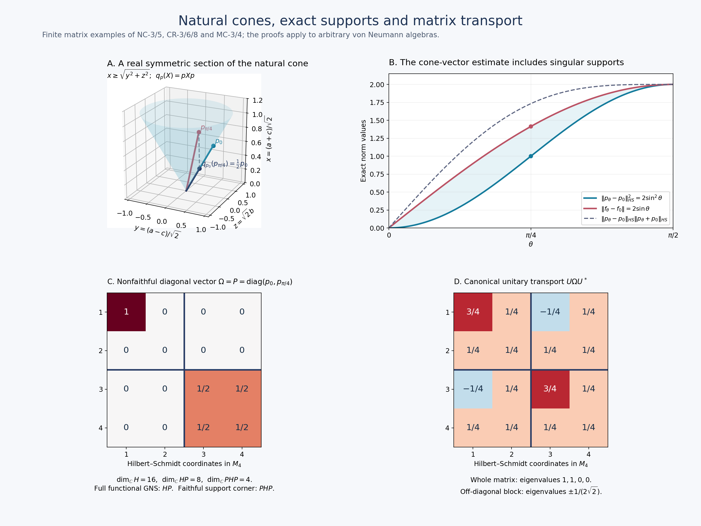

# Canonical standard-form transport and finite balanced matrices

*Fresh local proof, GPT-6 Astra (OpenAI), Ultra, 2026-10-04. CC0-1.0 to the extent of rights held.*

The inputs are the complete [natural-cone construction NC-1–5](OA-FLOW-NC.md), [corner and representative proofs CR-1–9](OA-FLOW-CR.md), and the actual full finite balanced GNS/graph construction [BC-1–3](OA-FLOW-BC.md#oa-flow.bc.1). In particular arbitrary weights in BC remain faithful n.s.f.; nonfaithful positive functionals enter as cone vectors and support corners, not by silently strengthening BC's hypotheses.

Free human context is [Hiai, Example 3.11 and Theorems 3.12–3.13, printed pp.25–27](https://arxiv.org/pdf/2004.02383v1#page=25). The following arguments prove the arbitrary-algebra transport and every matrix assertion needed here at the stated local inputs.

## MC-1. Canonical transport on arbitrary von Neumann algebras

Consider two standard forms of the same abstract von Neumann algebra \(M\), with faithful normal representations on \(H,\widetilde H\). Write their data as \(J,P\) and \(\widetilde J,\widetilde P\). We identify the algebra notation through those representations. There is a unique unitary \(U:H\to\widetilde H\) intertwining \(M\) and carrying \(P\) onto \(\widetilde P\); it also intertwines the two conjugations.

Here is a construction that does not assume \(M\) has a faithful normal state. Choose the orthogonal family of normal-state supports \(p_i\) from [CR-9](OA-FLOW-CR.md#oa-flow.cr.9), with sum \(1\). For every nonempty finite subset \(E\) put \(p_E=\sum_{i\in E}p_i\), and let \(f_E=\sum_{i\in E}f_i\). This is a finite positive normal functional with support \(p_E\), faithful on \(p_EMp_E\). Let \(\Omega_E,\widetilde\Omega_E\) be its unique cone vectors in the two forms. By [CR-3](OA-FLOW-CR.md#oa-flow.cr.3) they are cyclic and separating on

\[
 q_EH,\quad \widetilde q_E\widetilde H,\qquad
 q_E=p_EJp_EJ,\quad
 \widetilde q_E=p_E\widetilde Jp_E\widetilde J.
 \tag{MC1}
\]
The map \(a\Omega_E\mapsto a\widetilde\Omega_E\), \(a\in p_EMp_E\), preserves all inner products and extends to a unitary \(U_E\) between these spaces, intertwining the corner algebras. It transports the entire closed finite-star graph, its adjoint and polar operators, since their initial cores have the indicated identical action. [CR-4](OA-FLOW-CR.md#oa-flow.cr.4) therefore gives

\[
 U_EJ|_{q_EH}=\widetilde J|_{\widetilde q_E\widetilde H}U_E,
 \qquad U_E(P\cap q_EH)=\widetilde P\cap\widetilde q_E\widetilde H.
 \tag{MC2}
\]

Such a corner unitary is unique. If two unitaries intertwine its algebra and preserve its cone, they send each cone vector to the unique cone vector of the same positive normal functional, by [CR-8](OA-FLOW-CR.md#oa-flow.cr.8). Since the cone spans its Hilbert space by [CR-1](OA-FLOW-CR.md#oa-flow.cr.1), the unitaries agree. For \(E\subseteq F\), equation ([MC2](OA-FLOW-MC.md#equation-mc2)) and algebra intertwining show that \(U_F\) maps \(q_EH\) onto \(\widetilde q_E\widetilde H\) and preserves their cones. This uniqueness proves \(U_F|_{q_EH}=U_E\).

The projections \(q_E\) increase strongly to \(I\). Indeed both \(p_E\) and \(Jp_EJ\) do so, and they commute; the norm of \((1-q_E)\xi\) is at most the sum of the two complementary projection norms. The compatible isometries \(U_E\) consequently extend to a unitary \(U:H\to\widetilde H\). It intertwines \(J,\widetilde J\). For \(x\in M\), the bounded corner approximants \(p_Ex p_E\) tend strongly to \(x\); apply the established corner intertwining to vectors in \(q_FH\), with \(E\supseteq F\), then pass to the limit. This proves \(Ux=xU\) in the represented sense. Since \(q_EP\subseteq P\) and \(q_E\xi\to\xi\), ([MC2](OA-FLOW-MC.md#equation-mc2)) proves \(UP=\widetilde P\). Uniqueness follows once more from all cone representatives and their spanning property.

The same construction applies to a normal \(*\)-isomorphism by pulling the target representation back through it. In particular it canonically identifies the standard forms constructed from any two faithful n.s.f. weights. No equality of those weights' modular positive operators is claimed: for a fixed representing functional, its full graph and polar data transport through the canonical unitary by the core argument above.

## MC-2. The uniform finite matrix standard form

Fix one faithful n.s.f. weight \(\varphi\) on \(M\), with standard form \((M,H,J,P)\) as in NC. For a positive integer \(n\), put

\[
 \Theta(X)=\sum_{i=1}^n\varphi(x_{ii}),\qquad X=(x_{ij})\in M_n(M)_+.
 \tag{MC3}
\]
[BC-1](OA-FLOW-BC.md#oa-flow.bc.1) proves that \(\Theta\) is faithful normal semifinite and realizes its GNS space as \(H^{n\times n}\), with

\[
 (L_A\Xi)_{ij}=\sum_{k=1}^n a_{ik}\xi_{kj},\qquad
 \Lambda_\Theta(X)_{ij}=\Lambda_\varphi(x_{ij}).
 \tag{MC4}
\]
The latter formula has exactly the BC finite domain: every entry of column \(j\) belongs to \(N_\varphi\); the finite-star domain also requires every adjoint entry to belong there.

[BC-2](OA-FLOW-BC.md#oa-flow.bc.2) proves the complete closed graph identities, not just their core versions:

\[
 (S_n\Xi)_{ij}=S\xi_{ji},\quad
 (J_n\Xi)_{ij}=J\xi_{ji},\quad
 (\Delta_n^z\Xi)_{ij}=\Delta^z\xi_{ij}.
 \tag{MC5}
\]
For \(S_n\) the domain is all matrices with every entry in \(D(S)\); for each power the domain is all matrices with entries in \(D(\Delta^z)\). The finite number of coordinates makes the corresponding graph square-sum condition automatic. Let \(P_n\) be NC's cone for \(\Theta\). NC proves that
\((M_n(M),H^{n\times n},J_n,P_n)\) is a standard form.

Let \(e_i=E_{ii}\) be a scalar diagonal matrix projection. Left multiplication by \(e_i\) selects row \(i\), and \(j_n(e_i)=J_ne_iJ_n\) selects column \(i\). Their product \(q_i\) selects the single diagonal coordinate \((i,i)\). It commutes with \(\Delta_n\). Compressing a bounded positive finite-\(\Theta\) element to that coordinate gives a positive finite-\(\varphi\) diagonal entry, and conversely each such entry embeds diagonally. Applying this observation before the quarter power in [NC-2](OA-FLOW-NC.md#oa-flow.nc.2)/3, and then taking closures, proves

\[
 q_iP_n=\{\text{the vector }\xi\in P\text{ in coordinate }(i,i),
                    \text{ zero elsewhere}\}.
 \tag{MC6}
\]
For the closure passage, \(q_i\) is bounded and commutes with the quarter power on its entire domain. Images of the dense cone generators lie in the displayed closed cone; the reverse inclusion follows from diagonal generators. Thus

\[
 P_n\cap\{\text{diagonal vector matrices}\}
 =\{\operatorname{diag}(\xi_1,\ldots,\xi_n):\xi_i\in P\}.
 \tag{MC7}
\]
We do not identify the entire matrix cone with entrywise membership in \(P\); that would be a different and generally incorrect assertion.

## MC-3. Every finite diagonal family, including nonfaithful functionals

Let \(f_1,\ldots,f_n\in M_*^+\) be arbitrary, possibly zero or nonfaithful, and let \(\xi_i\in P\) be their [CR-8](OA-FLOW-CR.md#oa-flow.cr.8) representatives. Define the normal positive functional

\[
 \Psi(X)=\sum_{i=1}^n f_i(x_{ii}),\qquad
 \Omega_\Psi=\operatorname{diag}(\xi_1,\ldots,\xi_n).
 \tag{MC8}
\]
By ([MC7](OA-FLOW-MC.md#equation-mc7)), \(\Omega_\Psi\in P_n\). Formula ([MC4](OA-FLOW-MC.md#equation-mc4)) gives
\(\langle L_X\Omega_\Psi,\Omega_\Psi\rangle=\Psi(X)\).
[CR-8](OA-FLOW-CR.md#oa-flow.cr.8) applied to the matrix standard form proves that this is its **unique** cone representative, with

\[
 \|\Omega_\Psi\|^2=\sum_i f_i(1),\qquad
 s(\Psi)=P_f:=\operatorname{diag}(p_1,\ldots,p_n),\quad p_i=s(f_i).
 \tag{MC9}
\]
For the support formula, a positive matrix \(X\) has zero \(\Psi\)-value exactly when \(x_{ii}^{1/2}p_i=0\) for all \(i\), equivalently \(X^{1/2}P_f=0\). The equivalence follows by testing the positive diagonal compressions of \(P_fXP_f\), or by the sum of the squared column norms of \(X^{1/2}P_f\). Hence the zero positive elements are exactly those supported on \(1-P_f\).

For clarity, the full GNS space of this possibly nonfaithful functional is the cyclic subspace

\[
 \overline{M_n(M)\Omega_\Psi}
 =j_n(P_f)H^{n\times n}
 =\{\Xi:\xi_{ij}\in j(p_j)H\text{ for all }i,j\}.
 \tag{MC10}
\]
The explicit GNS isometry is \(\Lambda_\Psi(X)\mapsto(x_{ij}\xi_j)_{ij}\); its squared norm is \(\Psi(X^*X)\), and its range is dense in the stated column spaces by [CR-1](OA-FLOW-CR.md#oa-flow.cr.1)'s right-support formula. This subspace is generally larger than the standard-form support corner

\[
 Q_fH^{n\times n},\qquad Q_f=P_fj_n(P_f),\qquad
 (Q_f\Xi)_{ij}=p_i j(p_j)\xi_{ij}.
 \tag{MC11}
\]
[CR-3](OA-FLOW-CR.md#oa-flow.cr.3)/4 realizes \(P_fM_n(M)P_f\) in standard form on that exact corner, where \(\Omega_\Psi\) is cyclic and separating and has the full Tomita conjugation \(J_n|_{Q_fH^{n\times n}}\). This distinguishes the original functional's GNS space from its faithful support-corner standard form.

If \(g_i\in M_*^+\) is another diagonal family, ([CR18](OA-FLOW-CR.md#equation-cr18)) gives

\[
 \sum_i\|\xi_{f_i}-\xi_{g_i}\|^2
 \leq\sum_i\|f_i-g_i\|
 =\|\Psi_f-\Psi_g\|.
 \tag{MC12}
\]
The final equality follows by testing diagonal self-adjoint contractions, choosing each entry to approximate the norm of its Hermitian functional with the positive sign. For a Hermitian functional that norm can be tested on self-adjoint contractions: rotate a scalar value at an arbitrary contraction to the positive real axis and take the self-adjoint real part. The reverse inequality follows because every matrix contraction has diagonal entries of norm at most one.

## MC-4. Exact row, column and cone-action formulas

For \(A=(a_{ij})\in M_n(M)\), equation ([MC5](OA-FLOW-MC.md#equation-mc5)) gives

\[
 (j_n(A)\Xi)_{ij}=\sum_k j(a_{jk})\xi_{ik},\qquad
 (L_Aj_n(A)\Xi)_{ij}
   =\sum_{k,l}a_{ik}j(a_{jl})\xi_{kl}.
 \tag{MC13}
\]
The conjugate linearity of \(j\) is essential in the first formula. It has the correct scalar-matrix specialization: on Hilbert–Schmidt matrices it is right multiplication by \(A^*\).
For the canonical diagonal vector this becomes

\[
 (L_Aj_n(A)\Omega_\Psi)_{ij}
   =\sum_k a_{ik}j(a_{jk})\xi_k,\qquad
 L_Aj_n(A)\Omega_\Psi\in P_n.
 \tag{MC14}
\]
The membership assertion concerns the **whole matrix**; it does not assert entrywise cone positivity.

If \(U\) is unitary, \(L_Uj_n(U)\Omega_\Psi\) is the unique cone vector of
\(X\mapsto\Psi(U^*XU)\): the operator \(j_n(U)\) commutes with the left algebra and is unitary, so its vector functional is the displayed conjugate. More generally the analogous base-algebra assertion is

\[
 \xi_{\,f\circ\operatorname{Ad}(u^*)}=u\,j(u)\xi_f
 \quad(u\in M\text{ unitary}).
 \tag{MC15}
\]
The Hilbert norm used here is the standard-form norm, and the square-root functional comparison is precisely ([CR18](OA-FLOW-CR.md#equation-cr18)), including singular supports.

## MC-5. Compatibility with every faithful balanced weight family

Now let \(\varphi_1,\ldots,\varphi_n\) be arbitrary faithful n.s.f. weights on \(M\), with their own standard forms \((H_i,J_i,P_i)\), and let
\(\Theta_{\boldsymbol\varphi}(X)=\sum_i\varphi_i(x_{ii})\).
BC realizes its GNS Hilbert space as vector matrices whose column \(j\) has entries in \(H_j\), with the full relative closed graphs and positive operators proved there. NC supplies its cone \(P_{\boldsymbol\varphi}\).

Let \(U_i:H_i\to H\) be the canonical standard-form unitaries of [MC-1](OA-FLOW-MC.md#oa-flow.mc.1) to the fixed reference form. Then the canonical standard-form unitary from the balanced matrix form to the uniform matrix form is exactly

\[
 (W\Xi)_{ij}=U_j\xi_{ij}.
 \tag{MC16}
\]
To prove this, first take the unique matrix standard-form unitary from [MC-1](OA-FLOW-MC.md#oa-flow.mc.1). [BC-2](OA-FLOW-BC.md#oa-flow.bc.2) gives \(J_{\boldsymbol\varphi}e_iJ_{\boldsymbol\varphi}\) as the column projection; thus \(e_iJ_{\boldsymbol\varphi}e_iJ_{\boldsymbol\varphi}\) selects coordinate \((i,i)\). Its restricted closed graph, conjugation and positive operator are exactly those of \(\varphi_i\). Compressing finite positive generators before the quarter power, just as in the proof of ([MC6](OA-FLOW-MC.md#equation-mc6)), identifies its cone with \(P_i\). The matrix unitary therefore restricts to \(U_i\) there by uniqueness in [MC-1](OA-FLOW-MC.md#oa-flow.mc.1). Left multiplication by \(E_{ij}\) sends the entire \((j,j)\) coordinate isometrically onto \((i,j)\). Intertwining these matrix units forces ([MC16](OA-FLOW-MC.md#equation-mc16)) on each coordinate and hence everywhere.

Consequently

\[
 WP_{\boldsymbol\varphi}=P_n,\qquad
 WJ_{\boldsymbol\varphi}=J_nW,\qquad
 (J_{\boldsymbol\varphi}\Xi)_{ij}=U_j^{-1}JU_i\,\xi_{ji}.
 \tag{MC17}
\]
The index placement follows from the column convention: the output \((i,j)\) lies in \(H_j\), while the input \((j,i)\) lies in \(H_i\). These are antiunitary identities on the full Hilbert spaces.

For arbitrary normal positive \(f_i\), the canonical balanced-matrix cone vector of \(\sum_i f_i(x_{ii})\) is therefore

\[
 \operatorname{diag}(U_1^{-1}\xi_{f_1},\ldots,U_n^{-1}\xi_{f_n}),
 \tag{MC18}
\]
including every nonfaithful and zero diagonal functional. Equations ([MC9](OA-FLOW-MC.md#equation-mc9))–([MC15](OA-FLOW-MC.md#equation-mc15)) transport through \(W\), with their exact supports, cyclic subspaces, projection corners and norm statements. When the diagonal functionals are faithful, this vector is cyclic and separating for the whole matrix algebra; [CR-4](OA-FLOW-CR.md#oa-flow.cr.4) identifies its full modular graph with that of the balanced faithful-functional GNS construction. For nonfaithful inputs that assertion holds on the precise support corner ([MC11](OA-FLOW-MC.md#equation-mc11)).

The modular positive operator of an arbitrary balanced weight family remains the weight-dependent relative operator constructed in BC. Equation ([MC17](OA-FLOW-MC.md#equation-mc17)) fixes the standard conjugation under canonical transport; it does not equate different weights' positive modular operators or their powers. Every such power retains its BC/SF domain, transported only when its particular weight or representing functional is transported.

This completes the standard-form, cone-representative, arbitrary projection-corner and finite balanced matrix-cone obligations at the stated local foundations. It proves no type classification, Connes-spectrum identification or state-homogeneity theorem.

### Natural-cone illustration: exact finite-matrix calculations

This original figure is a finite-dimensional illustration of [NC-3/5](OA-FLOW-NC.md#oa-flow.nc.3), [CR-3/6/8](OA-FLOW-CR.md#oa-flow.cr.3) and [MC-3/4](OA-FLOW-MC.md#oa-flow.mc.3). It is not a restriction of those theorems to a trace or to finite dimension. The reproducible source is [../assets/natural-cone/render_natural_cone.py](../assets/natural-cone/render_natural_cone.py); the native output is [natural-cone.png](../assets/natural-cone/assets/natural-cone.png), with [SVG](../assets/natural-cone/assets/natural-cone.svg) also retained. The freely accessible human context is [Hiai, Section 3](https://arxiv.org/pdf/2004.02383v1#page=20); the calculations below are supplied in full.

#### A. The cone section and its actual metric

For the usual trace on \(M_2(\mathbb C)\), identify the GNS Hilbert space with Hilbert–Schmidt matrices, with \(\langle X,Y\rangle=\operatorname{Tr}(Y^*X)\). The finite-star operator is \(S(X)=X^*\), so \(J=S\) and \(\Delta=I\). NC's cone is exactly the positive matrices: all their square roots are matrices, and the cone is already closed.

The real symmetric section consists of \(X=\begin{pmatrix}a&b\\b&c\end{pmatrix}\). Use
\[
 x=\frac{a+c}{\sqrt2},\qquad y=\frac{a-c}{\sqrt2},\qquad z=\sqrt2 b.
\]
Then \(\|X\|_{HS}^2=x^2+y^2+z^2\), and the eigenvalues of \(X\) are \((x\pm\sqrt{y^2+z^2})/\sqrt2\). Thus this section is exactly the Euclidean cone \(x\geq\sqrt{y^2+z^2}\). The plotted surface is its boundary in the finite window \(0\leq x\leq1.1\). It is a section of the four-real-dimensional Hermitian cone, not the whole complex positive cone.

Put \(v_\theta=(\cos\theta,\sin\theta)^T\) and \(p_\theta=v_\theta v_\theta^*\). Each has Hilbert–Schmidt norm one. Since \(JpJ\) is right multiplication by \(p\), the support-corner projection is
\[
 q_p(X)=pXp=\operatorname{Tr}(pX)p\quad\text{when }p\text{ has rank one}.
\]
This is the Hilbert–Schmidt orthogonal projection onto \(\mathbb C p\), and its cone is \(\mathbb R_+p\), as in CR-3. At \(\theta=\pi/4\), the plotted coordinates \((y,z,x)\) are \((1/\sqrt2,0,1/\sqrt2)\) for \(p_0\), \((0,1/\sqrt2,1/\sqrt2)\) for \(p_{\pi/4}\), and \((1/(2\sqrt2),0,1/(2\sqrt2))\) for \(q_{p_0}(p_{\pi/4})=p_0/2\). The dashed segment is the actual orthogonal projection segment; both its displacement and its inner product with \(p_0\) are obtained from these coordinates.

#### B. The exact two-sided norm estimate

Let \(f_\theta(a)=\operatorname{Tr}(p_\theta a)\). Its unique cone vector is \(p_\theta\), because \(p_\theta^2=p_\theta\). For \(0\leq\theta\leq\pi/2\), the traceless Hermitian matrix \(p_\theta-p_0\) has determinant \(-\sin^2\theta\), hence eigenvalues \(\pm\sin\theta\). Therefore
\[
 \|p_\theta-p_0\|_{HS}^2=2\sin^2\theta,\qquad
 \|f_\theta-f_0\|=2\sin\theta,\qquad
 \|p_\theta+p_0\|_{HS}^2=2+2\cos^2\theta.
\]
For the middle equality, diagonalize the difference: the absolute value of its trace pairing with any contraction is at most the sum of its absolute eigenvalues, and its sign matrix attains that sum. No trace-density correspondence is needed. The three plotted curves are consequently exactly the lower, middle and upper quantities in [CR18](OA-FLOW-CR.md#equation-cr18). Their ordering follows also from \(0\leq\sin\theta\leq1\) and \(\sqrt{1+\cos^2\theta}\geq1\). At \(\pi/4\) the marked lower and middle values are \(1\) and \(\sqrt2\); both functionals have singular, rank-one supports.

#### C. Full functional GNS versus faithful support corner

Take \(M_2(M_2)=M_4\), with its Hilbert–Schmidt standard space \(H=M_4\). The diagonal functional of [MC8](OA-FLOW-MC.md#equation-mc8) for \(f_0,f_{\pi/4}\) has cone vector and support
\[
 \Omega=P=\operatorname{diag}(p_0,p_{\pi/4}),\qquad P^2=P,\quad\operatorname{rank}P=2.
\]
Its norm squared and functional value at one are both \(2\). Left multiplication gives its full GNS space \(HP=M_4P\), which has complex dimension \(4\cdot2=8\). Its faithful support-corner standard space is \(PHP\), of complex dimension \(2^2=4\), inside the ambient space of dimension \(4^2=16\). These dimensions follow by choosing an orthonormal basis for the range of \(P\): the right ideal has two arbitrary columns, whereas the corner has a two-by-two free block. These are exactly [MC10](OA-FLOW-MC.md#equation-mc10) and [MC11](OA-FLOW-MC.md#equation-mc11), with different domains, not two names for one space.

#### D. Matrix cone transport is not entrywise positivity

With two-by-two blocks, put
\[
 U=\frac1{\sqrt2}\begin{pmatrix}I&I\\-I&I\end{pmatrix},\qquad
 U\Omega U^*=\frac12\begin{pmatrix}p_0+p_{\pi/4}&p_{\pi/4}-p_0\\p_{\pi/4}-p_0&p_0+p_{\pi/4}\end{pmatrix}.
\]
Direct multiplication proves \(UU^*=I\), and hence the displayed matrix is a positive rank-two projection with eigenvalues \(1,1,0,0\). Its off-diagonal block has eigenvalues \(\pm1/(2\sqrt2)\), by panel B's calculation. Thus this **whole** matrix is a cone vector even though an off-diagonal block is indefinite. [MC14](OA-FLOW-MC.md#equation-mc14)–15 identify it as the canonical cone vector of \(X\mapsto\Psi(U^*XU)\). Every heatmap entry is an exact quarter, half, one or zero; colors encode signed entries, not eigenvalues or an approximate positivity test.

The numerical JSON checks only reproduce these explicit finite calculations. The proofs above and the full NC/CR/MC arguments carry the mathematical claims. Figure and local text: CC0-1.0 to the extent of rights held.

[Exact numerical checks](../assets/natural-cone/FIGURE_NUMERICAL_CHECKS.json) accompany the original reproduction source and editable SVG.
