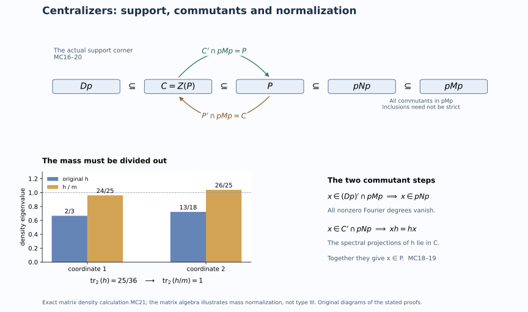

# States with abelian centralizers and mutual commutants

A normalized coefficient density controls exactly which elements survive modular time. We use that control in two ways: to construct a faithful normal state with maximal abelian centralizer, and to compute both relative commutants for every faithful normal semifinite weight on a type III-zero factor. The second argument works inside the support of a normalized representative, which can be smaller than the identity even when the original weight was faithful.

*Original exposition, examples, figures, data and reproducible drawing code in this lesson are dedicated to CC0-1.0. Source publications retain their own terms.*

## 1. Statements and the precise hypotheses

Let \(M\ne0\) be a factor with separable predual. We prove:

1. If \(M\) has type \(\mathrm{III}_\lambda\), \(0\leq\lambda<1\), then there is a faithful normal state \(\omega\) whose centralizer \(M_\omega\) is a maximal abelian von Neumann subalgebra of \(M\).
2. If \(M\) has type \(\mathrm{III}_0\) and \(\psi\) is any faithful normal semifinite weight, then, with \(C_\psi=Z(M_\psi)\),
\[
 C_\psi'\cap M=M_\psi,
 \qquad M_\psi'\cap M=C_\psi.
 \tag{MC1}
\]
The second statement does not assume that \(\psi\) is bounded, strictly semifinite, lacunary, integrable or of infinite multiplicity. The [diffuse-center theorem](OA-FLOW-LAC.md#lac-diffuse) already holds for arbitrary predual; our proof of (MC1) uses the separable discrete normal form and retains that hypothesis.

Use the specified [discrete reference](OA-FLOW-NCOEF.md#nc-density-cocycle)
\[
 M=N\rtimes_\theta\mathbb Z,\quad UxU^*=\theta(x),\quad
 \phi=\tau E,\quad \tau\theta=\tau_\rho,
 \qquad0<\rho\leq\lambda_0 1<1.
 \tag{MC2}
\]
Here \(N=M_\phi\) is type \(\mathrm{II}_\infty\), possibly nonfactor, and \(E\) is the faithful normal coefficient expectation. For \(\lambda>0\) the reference has its specified fundamental modular period. The [complete normal form](OA-FLOW-CBND.md#cb-normal-form) says that every normal semifinite weight is equivalent to some \(\phi_h\), where
\[
 p=s(h),\quad \rho p\leq h\leq p,\quad\ker_p(p-h)=0,
 \qquad M_{\phi_h}=\{h\}'\cap pNp.
 \tag{MC3}
\]
This centralizer is always taken in \(pMp\).

## 2. Construct the state and normalize its mass

Semifiniteness and faithfulness of \(\tau\) supply a nonzero finite positive element. A nonzero spectral projection above some \(\varepsilon>0\) then gives \(e\in N\) with \(0<\tau(e)<\infty\). No prescribed trace value for \(e\) is needed.

Choose a maximal abelian algebra \(A\) in \(eNe\). One exists by the maximal-chain argument: the von Neumann algebra generated by an increasing chain of abelian algebras remains abelian, because commutation passes through bounded strong closures. Maximality implies \(Z(eNe)\subset A\). Since \(M\) has a faithful normal representation on a separable Hilbert space, so does this corner. The [single-generator construction DC13](../../OA-MOD/src/central-decomposition.md#realizing-an-abelian-algebra-as-the-diagonal-algebra) gives commuting projections \(q_j\) generating \(A\) and
\[
 a=\sum_{j\geq1}3^{-j}q_j,\qquad0\leq a\leq e/2,
 \qquad W^*(a)=A.
 \tag{MC4}
\]
Its proof recovers each digit projection by continuous functional calculus on the compact zero-one ternary digit set. In particular the series gives an actual single generator, not only a dense family of scalar observations.

Set
\[
 h=\lambda_0e+\frac{1-\lambda_0}{3}(e+a).
 \tag{MC5}
\]
This affine change preserves the generated algebra. Its precise bounds are
\[
 \frac{1+2\lambda_0}{3}e\leq h\leq
 \frac{1+\lambda_0}{2}e<e.
 \tag{MC6}
\]
Thus \(s(h)=e\), \(\rho e\leq h\), and the normalized coefficient theorem applies. The functional \(\omega_0=\phi_h|_{eMe}\) is faithful normal and bounded, since
\[
 m:=\omega_0(e)=\tau(h),\qquad
 0<\frac{1+2\lambda_0}{3}\tau(e)\leq m
 \leq\frac{1+\lambda_0}{2}\tau(e)<\infty.
 \tag{MC7}
\]
Its centralizer is \(\{h\}'\cap eNe=A\).

We must prove maximality in \(eMe\), rather than just in \(eNe\). A bounded faithful functional is strictly semifinite: its restriction to its centralizer is finite on the identity. The [ambient-MASA theorem](OA-FLOW-CMAS.md#cp-masa) therefore supplies a maximal abelian subalgebra \(B\) of \(eMe\) contained in \(A\). Since \(A\) is abelian, \(A\subset B'\cap eMe=B\), so \(A=B\). The corner is a type \(\mathrm{III}_\lambda\) factor: [PC8](OA-FLOW-PC.md#pc-8) gives an isometry \(v\in M\) with \(v^*v=1\), \(vv^*=e\). The resulting normal isomorphism and its inverse are
\[
 \alpha:M\to eMe,\quad\alpha(x)=vxv^*,\qquad
 \alpha^{-1}(y)=v^*yv.
 \tag{MC8}
\]
They preserve the type through the actual weight correspondence. The hypotheses of the ambient-MASA theorem are therefore satisfied on the corner.

Now define
\[
 \omega(x)=m^{-1}\omega_0(vxv^*)\qquad(x\in M_+).
 \tag{MC9}
\]
It is faithful and normal, and \(\omega(1)=1\). Multiplying a weight by a positive scalar does not alter its modular group: the scalar multiple of its GNS inner product has the same closed finite-star involution and the same modular operator after the scalar unitary identification. Spatial weight transport conjugates the entire modular group and its fixed algebra. Consequently
\[
 M_\omega=v^*Av,
 \tag{MC10}
\]
which is maximal abelian in \(M\). The factor \(m^{-1}\) in (MC9) is essential; neither (MC5) nor finite trace of \(e\) makes the original mass equal to one.

## 3. Why the coefficient center has no periodic pieces

For the rest of the lesson assume that \(M\) has type \(\mathrm{III}_0\), and put \(D=Z(N)\). It is diffuse by the [every-weight diffuse-center theorem](OA-FLOW-LAC.md#lac-diffuse), applied to the faithful reference weight \(\phi\). Also \(D^\theta=\mathbb C1\): a fixed central coefficient commutes with \(N\) and \(U\), hence with their generated factor. Both facts are needed.

We spell out the measure model. The [normal diagonal realization DC16](../../OA-MOD/src/central-decomposition.md#realizing-an-abelian-algebra-as-the-diagonal-algebra) identifies \(D\) with \(L^\infty(X,\mu)\) on a compact metric subset of the real line with finite measure, where the coordinate function generates the algebra. We may normalize \(\mu\) to a probability measure. Diffuseness says that this measure has no atoms.

The normal automorphism \(\theta\) is induced by an invertible nonsingular Borel transformation modulo null sets. Here is a direct verification in these coordinates. Represent \(\theta(\operatorname{id}_X)\) by a Borel function \(S:X\to X\). Its values belong to \(X\) almost everywhere by spectral calculus. For a bounded Borel function \(f\), normality and spectral approximation give \(\theta(f)=f\circ S\). Apply the same construction to \(\theta^{-1}\), obtaining \(R\). The identities on the generating coordinate give \(S\circ R=R\circ S=\operatorname{id}_X\) almost everywhere. Furthermore
\(\mu(B)=0\) if and only if \(1_B=0\), if and only if \(\theta(1_B)=1_{S^{-1}B}=0\). Thus \(S\) and \(R\) are nonsingular. Removing the countable union of the exceptional sets and their iterated inverse images gives a common conull Borel set on which they are inverse maps. Write \(T=R\), so \(\theta(f)=f\circ T^{-1}\). The identity \(D^\theta=\mathbb C1\) makes \(T\) ergodic.

Fix \(k\ne0\). The measurable set \(F_k=\{x:T^kx=x\}\) is invariant. If it had positive measure, ergodicity would make it conull. On that conull set the finite cyclic group generated by \(T\) has order dividing \(r=|k|\). Average the finite equivalent measure:
\[
 \nu=\frac1r\sum_{j=0}^{r-1}(T^j)_*\mu.
 \tag{MC11}
\]
It is invariant, equivalent to \(\mu\), and nonatomic. A nonatomic probability measure on a compact metric subset of the line has sets of arbitrarily small positive measure: repeatedly split a nonzero measurable set that is not an atom, retaining a positive part of at most half its former measure. Choose such a set \(A\) with \(0<\nu(A)<1/r\). Its finite orbit union is invariant and has measure between \(\nu(A)\) and \(r\nu(A)<1\), contradicting ergodicity. Therefore
\[
 \mu(F_k)=0\qquad(k\ne0).
 \tag{MC12}
\]
The countable union over \(k\) gives a conull set with no nontrivial period.

There is also a direct finite-orbit alternative. If \(T^r=1\) almost everywhere, the least point of each finite orbit in the real coordinate is a Borel function \(b(x)=\min_{0\leq j<r}T^jx\). It is invariant, and each fiber has at most \(r\) points. Its pushforward of \(\mu\) is therefore nonatomic. Such a real probability measure has a Borel set with measure strictly between zero and one: otherwise each rational half-line has measure zero or one, forcing a unit atom at the transition cut. Pulling that set back by \(b\) contradicts ergodicity. This alternative also uses nonatomicity explicitly.

## 4. The center commutant from actual Fourier coefficients

For \(x\in M\), use the normal coefficients \(x_n=E(xU^{-n})\). The [regular-model Fejer proof](OA-FLOW-VD.md#equation-vd8) gives bounded strong-star reconstruction
\[
 x=\lim_{m\to\infty}\sum_{|n|<m}(1-|n|/m)x_nU^n.
 \tag{MC13}
\]
Take \(x\in D'\cap M\). Bimodularity and \(dU^{-n}=U^{-n}\theta^n(d)\) give
\[
 (d-\theta^n(d))x_n=0\qquad(d\in D).
 \tag{MC14}
\]
Let \(z_n\in D\) be the central support in \(N\) of the range projection of \(x_n\). The kernel of the central multiplier \(d-\theta^n(d)\) contains that range, hence contains its central support. Thus \((d-\theta^n(d))z_n=0\) for every \(d\in D\).

Apply this to the indicators of rational half-lines in the coordinate model. There are countably many, so their identities hold on one common conull set. If \(z_n\ne0\), these indicators agree at \(x\) and \(T^{-n}x\) on the positive-measure set represented by \(z_n\). Rational half-lines separate points, so \(T^{-n}x=x\) there. Equation (MC12) excludes this when \(n\ne0\). Hence all nonzero coefficients vanish, and (MC13) gives \(x=x_0\in N\). The reverse inclusion follows from centrality of \(D\) in \(N\). We have proved
\[
 D'\cap M=N.
 \tag{MC15}
\]
No convergence of the unaveraged Fourier series was assumed.

## 5. Keep the support corner throughout

Let \(\psi\) be any faithful normal semifinite weight on the type \(\mathrm{III}_0\) factor \(M\). By (MC3), choose a normalized density \(h\) and put
\[
 p=s(h),\qquad P=M_{\phi_h}=\{h\}'\cap pNp,\qquad C=Z(P).
 \tag{MC16}
\]
The equivalence \(\psi\sim\phi_h\) supplies a partial isometry \(v\) with \(v^*v=1\), \(vv^*=p\), such that \(\psi(x)=\phi_h(vxv^*)\) on all positive elements. Thus \(\beta(x)=vxv^*\) is a normal onto isomorphism from \(M\) to \(pMp\), with inverse \(y\mapsto v^*yv\), and
\[
 \beta(M_\psi)=P,\qquad\beta(C_\psi)=C.
 \tag{MC17}
\]
Faithfulness of \(\psi\) does not force \(p=1\).

Because \(p\in N\) commutes with \(D\), equation (MC15) compresses exactly to
\[
 (Dp)'\cap pMp=pNp.
 \tag{MC18}
\]
Indeed, if \(x=pxp\) commutes with every \(dp\), then \(xd=xpd=dpx=dx\); hence \(x\in N\), and the support puts it in \(pNp\). The reverse inclusion is immediate.

We have \(Dp\subset C\). Every supported spectral projection of \(h\) is also central in \(P\): it lies in \(P\), and every element of \(P\) commutes with it by the defining spectral commutation. If \(x\in C'\cap pMp\), (MC18) puts \(x\) in \(pNp\); commutation with those spectral projections then puts it in \(P\). Since \(P\) commutes with its center, this proves
\[
 C'\cap pMp=P.
 \tag{MC19}
\]
For \(x\in P'\cap pMp\), use \(C\subset P\) to obtain \(x\in C'\cap pMp=P\). Thus \(x\in Z(P)=C\), and the reverse inclusion is automatic:
\[
 P'\cap pMp=C.
 \tag{MC20}
\]
Finally every onto isomorphism transports relative commutants: an element of the target commutes with the image of an algebra exactly when its inverse image commutes with that algebra. Applying \(\beta^{-1}\) to (MC19)–(MC20) proves both identities (MC1).

The projection \(z_N(p)\) need not be invariant under \(\theta\). The proof never restricts \(\theta\) to that possibly noninvariant central summand. It retains the original crossed product for (MC15) and computes directly in \(pMp\) afterward.

## 6. Exact models and solved diagnostics

The commutant diagram shows (MC16)–(MC20). Its inclusions can be equalities in special cases; it does not assert strict inclusion. The mass panel is the finite coefficient calculation below, illustrating the normalization step rather than claiming that a matrix algebra is type III.

**1. An exact mass calculation.** In \(M_2(\mathbb C)\) take normalized trace, \(e=1\), \(\lambda_0=1/2\), and \(a=\operatorname{diag}(0,1/3)\). Formula (MC5) gives
\[
 h=\operatorname{diag}(2/3,13/18),\qquad
 m=\operatorname{tr}_2(h)=25/36,
 \qquad m^{-1}h=\operatorname{diag}(24/25,26/25).
 \tag{MC21}
\]
The last density has normalized-trace mass one, and both densities have the same diagonal centralizer. The rescaled density need not satisfy the fundamental-band upper bound: that bound was needed to compute the centralizer before scalar normalization, which leaves it unchanged.

**2. Why ergodicity alone does not imply freeness.** On \(r\) points with equal masses, a cyclic permutation is ergodic, but its \(r\)-th power fixes every point. This atomic example is excluded by the diffuse-center input, not by ergodicity. In contrast, rotation by an irrational number on the circle has no nonzero integer period at any point; its Fourier characters also prove ergodicity because only the constant character has multiplier one.

**3. A normalized representative may have smaller support.** In a diagonal coefficient corner take a nontrivial projection \(p\) and \(h=cp\) with \(\lambda_0<c<1\). It satisfies the inequalities in (MC3) and has support exactly \(p\). The corresponding weight vanishes on \(1-p\). If it is transported to a faithful weight through \(v^*v=1\), \(vv^*=p\), the transporter identifies \(M\) with \(pMp\); it does not make \(\phi_h\) faithful on the original whole algebra.

**4. Why finite trace of \(e\) suffices.** If \(\tau(e)=t\) for any finite positive \(t\), then (MC7) bounds the mass between \((1+2\lambda_0)t/3\) and \((1+\lambda_0)t/2\). Dividing by the actual mass always gives a state. No theorem realizing an arbitrarily prescribed trace value is required.

**5. Which algebra forces the Fourier coefficients to vanish?** Commuting with \(D=Z(N)\) yields the central multiplier in (MC14), whose kernel detects fixed points on the base. After normalization, commuting with \(Dp\) first forces an element of \(pMp\) into \(pNp\); commuting additionally with the spectral projections of \(h\) forces it into \(P\). These are two different steps.

**6. Is an abelian centralizer automatically ambient maximal?** Its equality with \(A'\cap eNe\) proves maximality only in \(eNe\). The separate ambient-MASA theorem supplies \(B\subset A\) maximal in \(eMe\), and the inclusion \(A\subset B'\cap eMe=B\) proves the desired ambient maximality. Omitting that step would weaken the state theorem.

## Further reading

M. Takesaki, *Theory of Operator Algebras II*, Section XII.4, Corollaries 4.16–4.17, p.416. The proofs above retain the full faithful-weight scope while making the state mass, finite-orbit argument, normal supported transport and both relative commutants explicit. The earlier programme supplies the complete normalized-form and ambient-MASA proofs linked at their use.
