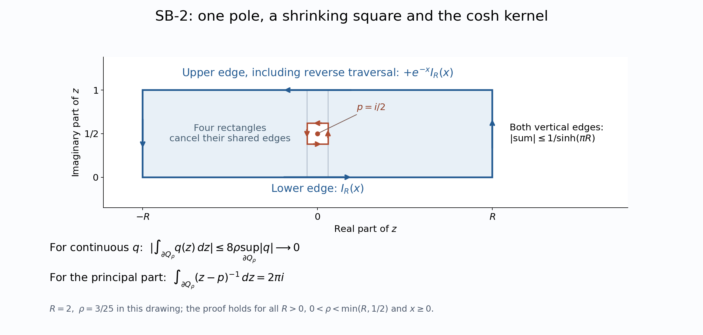

# MF-06: narrow scalar and vector integration bridge

Original proof with independently reconstructed earlier inputs, 2026-10-04. This bridge proves the scalar kernel, continuous-function Fourier uniqueness and vectorwise integrals used in the modular fundamental theorem. Its mathematical inputs are actual earlier local proof bodies. New exposition and the original illustration are CC0-1.0 to the extent of rights held.

## Exact earlier local proofs

Every input used below is a complete proof in one of the following earlier notes.

| Local proof | Exact scope used here |
| --- | --- |
| CF Section 1 | Continuous Banach-valued Riemann integrals, norm bounds, bounded-map commutation and the fundamental theorem |
| [SC-02–05](OA-FLOW-SC.md#sc-02) | Normalized Lebesgue measure, affine changes of variables, complex integration and monotone/dominated convergence |
| [SC-08–09](OA-FLOW-SC.md#sc-08) | Continuous Riemann/Lebesgue agreement, oriented substitution and dominated scalar differentiation |
| FF scalar interchange | Interchange on sigma-finite real Borel spaces; the complex case only after absolute integrability is checked |
| FF-1 | Gaussian normalization, transform and concentration, proved from disk sections and scalar calculus |
| [SF-4](OA-FLOW-SF.md#oa-flow.sf4.rectangle-cauchy) | Rectangle Cauchy theorem, the directly computed small-square integral, and the local rectangle criterion for holomorphy |

These proofs use the earlier CF/SC foundations and explicit scalar/set conventions. All double integrals below concern the real line and Lebesgue measure, so the stated real-Borel interchange theorem supplies exactly their required generality. No theorem about product measures on arbitrary spaces is imported. Hilbert spaces remain arbitrary.

## SB-1. Absolutely convergent vectorwise integrals

Let $X$ be a Banach space and $F:\mathbb R\to X$ continuous, with the continuous scalar function $\|F\|$ integrable for Lebesgue measure. CF Section 1 constructs the Riemann integral of $F$ on every compact interval; SC-08 identifies the integral of its continuous norm with the corresponding Lebesgue integral. If $b>a>0$, then

$$
 \left\|\int_{-b}^{b}F(t)\,dt-\int_{-a}^{a}F(t)\,dt\right\|
 \leq\int_{|t|>a}\|F(t)\|\,dt.
$$

The right side tends to zero by integrability and MCT/DCT. Completeness gives an improper integral independent of the compact exhaustion, with norm at most the scalar integral of the norm. Compact linearity and commutation with a bounded complex-linear map pass to the limit. In particular inner-product pairings commute with these Hilbert-valued integrals, with the appropriate convention in the second variable. Commutation is not asserted for a lone anti-linear map; a scalar coefficient must then be conjugated.

If $F_n$ and $F$ are continuous, $F_n(t)\to F(t)$ in norm for every $t$, and $\|F_n(t)\|,\|F(t)\|\leq g(t)$ for an integrable nonnegative scalar $g$, DCT applied to $\|F_n-F\|\leq2g$ gives

$$
 \left\|\int F_n-\int F\right\|\leq\int\|F_n-F\|\longrightarrow0.
\tag{SB.1}
$$

The same proof applies to operator-norm continuous $B(H)$-valued functions. For a strongly continuous operator function $A(t)$ with $\|A(t)\|\leq g(t)$, define $Tq=\int A(t)q\,dt$ for every $q$ in $H$. The vector construction proves that $T$ is complex-linear and bounded with $\|T\|\leq\int g$. Pairings and bounded left/right multiplication commute with it: for $B,C$ in $B(H)$, $(BTC)q=B\int A(t)Cq\,dt$. A strongly continuous integrand need not be continuous in operator norm. No separability of $H$ is used, since each individual vector integral is constructed by compact Riemann sums. The same argument yields strong convergence of such integrals under pointwise strong convergence and a common integrable operator bound.

## SB-2. The single simple-pole calculation actually needed

For real $x$ put

$$
 I(x)=\int_{\mathbb R}\frac{e^{ixt}}{2\cosh(\pi t)}\,dt.
$$

The integral converges absolutely, since $1/(2\cosh(\pi t))\leq e^{-\pi|t|}$. Suppose first $x\geq0$ and let $p=i/2$. On the convex strip $V=\{z:-1/4<\operatorname{Im}z<5/4\}$, the only zero of $\cosh(\pi z)$ is $p$. Indeed its vanishing is equivalent to $e^{2\pi z}=-1$, so its zeros are $i(n+1/2)$; these are the elementary exponential identities from the scalar conventions of SF, SB-0. Its derivative at $p$ is $\pi\sinh(\pi p)=\pi i$.

We subtract the principal part explicitly. Put

$$
 q(z)=\frac{e^{ixz}}{2\cosh(\pi z)}-
       \frac{e^{-x/2}}{2\pi i(z-p)}\quad(z\ne p).
$$

This $q$ has a continuous extension at $p$. To verify that assertion without any removable-singularity theorem, write $z=p+u$. Repeated differentiation of elementary exponentials at zero gives

$$
 e^{ixu}=1+ixu+O(|u|^2),\qquad
 \sinh(\pi u)=\pi u+O(|u|^3),\qquad
 \cosh(\pi(p+u))=i\sinh(\pi u).
$$

These remainder bounds follow from repeated scalar FTC along the segment 0 to $u$, using CF Section 1, and boundedness of the exponential derivatives on a small disk. Consequently $q(p+u)$ tends to $e^{-x/2}x/(2\pi)$. This is its value at $p$. Thus $q$ is continuous throughout $V$ and holomorphic off $p$. We now prove the contour conclusion directly from SF-4. Choose a closed axis-parallel rectangle contained in $V$ with $p$ in its interior, and remove the centered square of half-side $\rho$, smaller than every distance from $p$ to the rectangle's sides. The remainder splits into four rectangles away from $p$. SF-4's rectangle Cauchy theorem for $q$ makes their interior edges cancel. The outer positively oriented integral equals the small square's positively oriented integral. The latter has modulus at most $8\rho$ times the supremum of $|q|$ near $p$ and tends to zero. The outer integral is therefore zero. Rectangles avoiding $p$ already have zero integral. If $p$ is on a rectangle's boundary, translate the rectangle by arbitrarily small vectors so $p$ is not on that boundary; continuity of $q$ and the compact integral norm bound let the integrals pass to the limit. Thus all rectangles compactly contained in $V$ have zero integral.

The local rectangle criterion in SF-4 now proves that $q$ is holomorphic also at $p$. For completeness it also gives the original closed-path conclusion on the whole strip: fix a base point in $V$ and integrate $q$ first horizontally at its height and then vertically. Comparing two such paths by their connecting rectangle shows that a small endpoint increment is $hq(z)+o(|h|)$, so this function has derivative $q$. Its composition with a piecewise continuously differentiable path has derivative $q(z)$ times the path derivative, by the real chain rule. The fundamental theorem proves that $q$ has integral zero around every such closed path in $V$. No index or general residue theorem is needed.

Let $\Gamma_R$ be the positively oriented boundary of $[-R,R]+i[0,1]$, $R>0$. Apply the same four-rectangle cancellation to $1/(z-p)$, with a centered square of half-side $\rho<\min(R,1/2)$. The outer integral equals the small-square integral $2\pi i$ computed explicitly in SF-4. Integrating the definition of $q$ therefore gives

$$
 \int_{\Gamma_R}\frac{e^{ixz}}{2\cosh(\pi z)}\,dz
 =2\pi i\,\frac{e^{-x/2}}{2\pi i}
 =e^{-x/2}.
\tag{SB.2}
$$

On either vertical side, $|\cosh(\pi(\pm R+iy))|\geq\sinh(\pi R)$ for $0\leq y\leq1$, while $|e^{ix(\pm R+iy)}|=e^{-xy}\leq1$. The total absolute value of their integrals is at most $1/\sinh(\pi R)$, which tends to zero. The upper-edge integrand is $-e^{-x}$ times the lower-edge integrand; the upper path is traversed right to left. Hence its contribution is $+e^{-x}$ times the lower integral. Letting $R$ tend to infinity in (SB.2), DCT gives

$$
 (1+e^{-x})I(x)=e^{-x/2},\qquad
 I(x)=\frac1{2\cosh(x/2)}.
\tag{SB.3}
$$

For $x<0$ complex conjugation gives $I(x)=\overline{I(-x)}$; the right side is real and even, so (SB.3) holds for all real $x$.

For $s>0$ define $k_s(t)=s^{-1/2}e^{-it\log s}/(2\cosh(\pi t))$. Substituting $x=\log(a/b)-\log s$ into (SB.3) proves, for $a,b>0$,

$$
 \int_{\mathbb R}k_s(t)e^{it\log(a/b)}\,dt
 =\frac{\sqrt{ab}}{a+sb},\qquad
 \int_{\mathbb R}|k_s(t)|\,dt=\frac1{2\sqrt s}.
\tag{SB.4}
$$

This computes precisely the kernel used in MF equations (21)–(25), with its sign and constant.

## SB-3. Continuous L1 Fourier uniqueness

For $r>0$ put $g_r(v)=\sqrt{r/\pi}\,e^{-rv^2}$. FF-1, by rescaling its Gaussian, proves $\int g_r=1$ and concentration at zero as $r$ tends to infinity. The same proved Gaussian transform, now with $x=a/(2\sqrt r)$ and with $a$ treated as frequency, gives the exact pointwise formula

$$
 g_r(v)=\frac1{2\pi}\int_{\mathbb R}
            e^{-a^2/(4r)}e^{iav}\,da.
\tag{SB.5}
$$

This is a direct evaluation of a Gaussian integral, not an invocation of a Fourier inversion theorem.

Let $f:\mathbb R\to\mathbb C$ be continuous and integrable, and assume its transform $\widehat f(a)=\int e^{-iau}f(u)\,du$ vanishes for every real $a$. Fix $t$. Substitute (SB.5) into $\int f(u)g_r(t-u)\,du$. The absolute value of the double integrand is $|f(u)|e^{-a^2/(4r)}/(2\pi)$, whose double integral is finite. FF scalar interchange therefore permits interchange of the two scalar integrals and yields

$$
 (f*g_r)(t)=\frac1{2\pi}\int_{\mathbb R}
             e^{-a^2/(4r)}e^{iat}\widehat f(a)\,da=0.
\tag{SB.6}
$$

These convolution integrals exist absolutely at every $t$, because $g_r$ is bounded. Translation and reflection invariance from SC-02 rewrite their difference from $f(t)$ as $\int g_r(v)(f(t-v)-f(t))\,dv$. Given $\varepsilon>0$, continuity at $t$ supplies $\delta>0$ such that the absolute value of the difference inside $|v|<\delta$ is less than $\varepsilon$. Its integral there is at most $\varepsilon$. Outside that interval, its absolute integral is at most

$$
 \|f\|_1\sqrt{r/\pi}\,e^{-r\delta^2}
       +|f(t)|\int_{|v|\geq\delta}g_r(v)\,dv,
$$

which tends to zero by the Gaussian concentration theorem and the elementary exponential estimate. Thus $(f*g_r)(t)\to f(t)$, so $f(t)=0$. This holds for every $t$, with no assumption that a continuous $L^1$ function is globally bounded.

The same conclusion holds for a continuous $F:\mathbb R\to H$ with integrable norm and vanishing vector Fourier integrals: apply the scalar proof to $f(t)=\langle F(t),q\rangle$ for each $q$ in $H$, using SB-1 to commute the pairing with the integral. Hilbert pairings separate vectors, giving $F(t)=0$ for every $t$. No Banach-valued Fourier theorem or Hahn–Banach extension is needed for that conclusion.

## SB-4. The exact Fourier use in MF-06

If $A(t)$ and $B(t)$ are continuous $H$-valued functions bounded in norm, and

$$
 \int k_s(t)(A(t)-B(t))\,dt=0\quad\hbox{for every }s>0,
$$

write $s=e^r$ and cancel the scalar $e^{-r/2}$. The continuous integrable function $F(t)=(A(t)-B(t))/(2\cosh(\pi t))$ has zero Fourier transform at every $r$. SB-3 gives $A(t)=B(t)$ for every $t$. This is exactly the passage from MF (26) to (27). In that application $A(t)=U_tR_wU_{-t}Jz$ and $B(t)=(JR_zJ)U_tw$, which are norm continuous as Hilbert vectors and bounded; $JR_zJ$ is complex-linear, so SB-1 applies with no scalar-conjugation change.

## The contour mechanism

The drawing uses $R=2$ and $\rho=0.12$. Both boundaries are counterclockwise. Cancellation on the four intervening rectangles equates their integrals for a function holomorphic away from $p=i/2$. For $q$ the inner integral tends to zero by continuity; for $1/(z-p)$ it is exactly $2\pi i$. On the upper edge, the displayed factor includes the reversal of traversal, so its contribution is $+e^{-x}$ times the lower integral for $x\geq0$. The vertical-edge bound vanishes as $R$ tends to infinity. These are the actual cancellations used in SB-2; the full proof applies to every $R>0$.

The exact contour source is retained in [render_kernel_contour.py](../assets/mf-scalar-reconstruction/render_kernel_contour.py). The earlier local SF contour proof was independently developed with the freely accessible [Vizeff Lecture 9](https://math.berkeley.edu/~avizeff/complex_analysis_S26/lecture_9.html) and [Lecture 11](https://math.berkeley.edu/~avizeff/complex_analysis_S26/lecture_11.html). The Gaussian comparison is the freely accessible [MIT Fourier handout](https://math.mit.edu/~jerison/103/handouts/fourierint1.13.pdf). These references supplement the written earlier proofs.

## Exact scope

SB-1–SB-4 and all six numbered identities are retained. Every scalar input now has a written earlier CF, SC, SF or FF proof; no historical contour, compact-trace or product-measure provider is a premise. This closes the bounded analytic input route for the general Hilbert-algebra argument. It does not prove the separate arbitrary-weight GNS and Hilbert-algebra correspondence.
