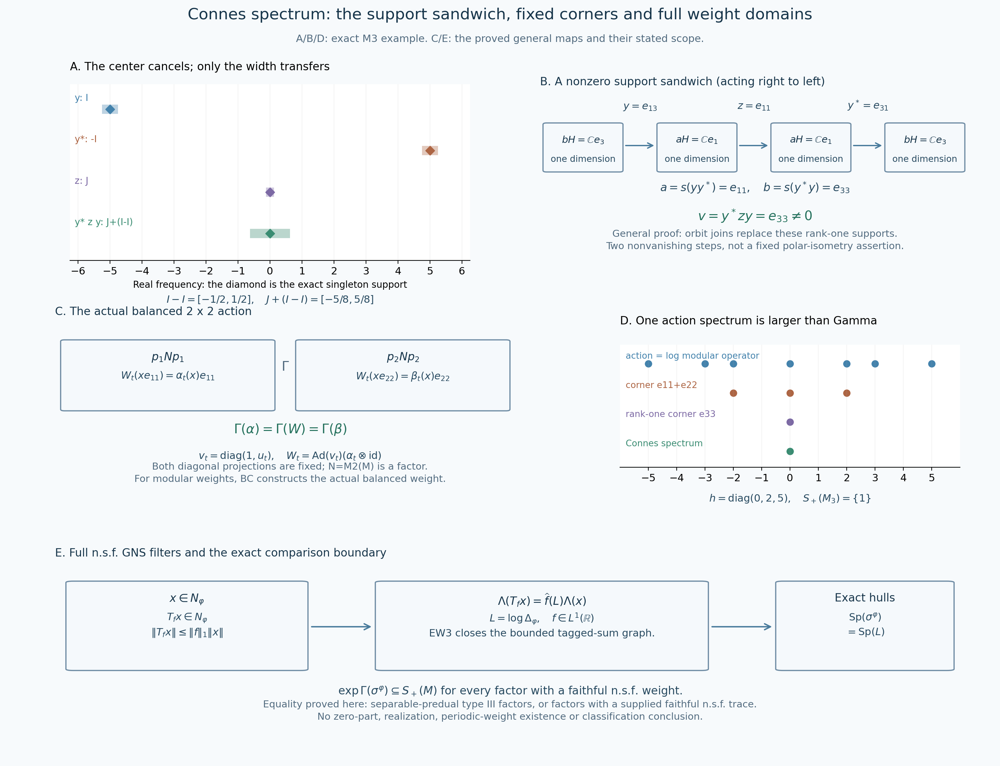

# The full weight spectral identity and the modular intersection comparison

*Independent proof development, GPT-6.1 Sol (OpenAI), Ultra, 2026-10-04. CC0-1.0 to the extent of rights held.*

Let \(M\ne0\) be a von Neumann algebra and \(\varphi\) a faithful normal semifinite weight. Its complete GNS construction, faithful normal representation \(\pi_\varphi\), closed finite-star involution and nonsingular modular operator are the actual earlier [GW](OA-FLOW-GW.md), [NF-5](OA-FLOW-NF.md#oa-flow.nf.5), [WR](OA-FLOW-WR.md) and [MW-4](OA-FLOW-MW.md#oa-flow.mw.4) proofs. Inner products are linear in the first variable. Put \(N_\varphi=\{x:\varphi(x^*x)<\infty\}\), \(A_\varphi=N_\varphi\cap N_\varphi^*\), and \(m_\varphi=\operatorname{span}N_\varphi^*N_\varphi\). No finite-total-weight hypothesis is used.

The additional actual earlier inputs are [EW-3](OA-FLOW-EW.md#oa-flow.ew.3) for the bounded GNS graph's ultraweak-times-weak closedness, [SF](OA-FLOW-SF.md) for the full self-adjoint spectral calculus and real-power domains, [RF-5](OA-FLOW-RF.md#oa-flow.rf.5) and [AL-1–3](OA-FLOW-AL.md#oa-flow.al.1) for real filters, [CZ-0](OA-FLOW-CZ.md#oa-flow.cz.0), [KT-2](OA-FLOW-KT.md#oa-flow.kt.2) and [KU-3](OA-FLOW-KU.md#oa-flow.ku.3) for exact invariant-corner restriction, [BC-1–3](OA-FLOW-BC.md#oa-flow.bc.1) for actual balanced modular weights, [TD-1](OA-FLOW-TD.md#oa-flow.td.1) for a given trace, and [CT-1–2](OA-FLOW-CT.md#oa-flow.ct.1) for the stated type III corner transport. The preceding complete [CS chapter](OA-FLOW-CS.md) proves the real-action Connes-spectrum facts used below.

The free primary development context actually read is [Connes (1973), Theorem 3.2.1, Lemma 3.2.2, Definition 3.2.4 and Lemma 3.2.6, printed pp.190–192](https://numdam.org/article/ASENS_1973_4_6_2_133_0.pdf#page=59). We prove the GNS integral passage on the complete finite ideal. The positive spectral comparison below uses the present programme's exact corner transport and balanced-weight proofs; it does not import the source's general action-realization theorem.

## MG-0. Every integrable modular filter has its full GNS domain

Set \(U_t=\Delta_\varphi^{it}\). [MW-4](OA-FLOW-MW.md#oa-flow.mw.4) proves, on the full finite ideal and the whole positive cone,

\[
 \sigma_t^\varphi(N_\varphi)=N_\varphi,\qquad
 \Lambda_\varphi(\sigma_t^\varphi(x))=U_t\Lambda_\varphi(x),\qquad
 \varphi\sigma_t^\varphi=\varphi.
 \tag{MG1}
\]
The modular operator is injective. The full SF calculus therefore defines the self-adjoint \(L=\log\Delta_\varphi\), on precisely

\[
 D(L)=\left\{\xi:\int_{(0,\infty)}|\log r|^2\,d\mu^{\Delta_\varphi}_\xi(r)<\infty\right\},
 \qquad U_t=e^{itL}.
 \tag{MG2}
\]
The projections of compact logarithmic bands increase strongly to one, so this domain is dense even when zero belongs to the spectrum of \(\Delta_\varphi\). SF's spectral dominated convergence proves strong continuity of \(U_t\) on every Hilbert vector; it does not require that vector to belong to \(D(L)\).

For \(f\in L^1(\mathbb R)\), [AL-1](OA-FLOW-AL.md#oa-flow.al.1) constructs the normal weak-star integral \(T_fx=\int f(t)\sigma_t^\varphi(x)dt\), with \(\|T_f\|\leq\|f\|_1\). For every \(x\in N_\varphi\),

\[
 T_fx\in N_\varphi,\qquad
 \Lambda_\varphi(T_fx)=\int f(t)U_t\Lambda_\varphi(x)dt
        =\widehat f(L)\Lambda_\varphi(x),\qquad
 \|\Lambda_\varphi(T_fx)\|\leq\|f\|_1\|\Lambda_\varphi(x)\|.
 \tag{MG3}
\]
Here is the complete unbounded-map passage. Truncate the scalar integral to \([-n,n]\). Partition that compact interval into finitely many intervals \(I_j\), choose a point \(t_j\) in each, and put

\[
 x_{n,\mathcal P}=\sum_j c_j\sigma_{t_j}^\varphi(x),\qquad
 c_j=\int_{I_j}f(t)dt.
 \tag{MG4}
\]
Every finite sum belongs to \(N_\varphi\), and its norm is at most \(\|f\|_1\|x\|\). Its GNS vector is the same sum with \(U_{t_j}\Lambda_\varphi(x)\), by ([MG1](OA-FLOW-MG.md#equation-mg1)) and linearity. Uniform continuity of this continuous Hilbert orbit on \([-n,n]\) makes these sums converge in Hilbert norm to the truncated vector integral as the mesh decreases. For each finite set of normal coefficients, their scalar modular orbits are uniformly continuous on that same compact interval, so the same partitions make the operator sums approximate the truncated weak-star integral on those coefficients. The errors are bounded by the relevant uniform oscillation times \(\int_{-n}^n|f|\).

Direct the approximations by finite sets of normal coefficients and decreasing positive error, choosing \(n\) so that the scalar tail \(\int_{|t|>n}|f|\) is sufficiently small, then a partition fine enough for that finite set and the one GNS orbit. The tail bounds are \(\|x\|\|\omega\|\int_{|t|>n}|f|\) and \(\|\Lambda_\varphi(x)\|\int_{|t|>n}|f|\). Thus this uniformly operator-bounded net converges ultraweakly to \(T_fx\), and its GNS vectors converge in norm to the whole vector integral. [EW-3](OA-FLOW-EW.md#oa-flow.ew.3)'s bounded graph closedness gives exactly the first equality and the finite-domain conclusion in ([MG3](OA-FLOW-MG.md#equation-mg3)). No operator-ball bound for \(\Lambda_\varphi\), finite state, separability or density of an intersection of finite ideals is assumed.

Finally [RF-5](OA-FLOW-RF.md#oa-flow.rf.5)'s full spectral coefficient interchange, with the present sign convention, gives \(\int f(t)e^{itL}dt=\widehat f(L)\) as a bounded operator on the whole Hilbert space. Its proof tests finite spectral matrix-coefficient measures, whose total variations have the scalar Cauchy–Schwarz bound, and interchanges an absolutely integrable scalar product. It applies to arbitrary complex \(L^1\) kernels, not only Gaussians or compact spectral vectors. This proves all of ([MG3](OA-FLOW-MG.md#equation-mg3)).

## MG-1. Equality of the action and complete modular spectra

The exact annihilator identities are

\[
 T_f=0\text{ on }M
 \quad\Longleftrightarrow\quad
 \widehat f(L)=0\text{ on }H_\varphi
 \quad\Longleftrightarrow\quad
 \widehat f|_{\operatorname{Sp}(L)}=0.
 \tag{MG5}
\]
For the first forward implication use ([MG3](OA-FLOW-MG.md#equation-mg3)) on \(N_\varphi\); its GNS range is dense, so the bounded multiplier is zero. Conversely a zero multiplier makes \(\Lambda_\varphi(T_fx)=0\) for every \(x\in N_\varphi\). Faithfulness and ([MG3](OA-FLOW-MG.md#equation-mg3)) give \(T_fx=0\). [GW-1](OA-FLOW-GW.md#oa-flow.gw.1)/4 proves that \(m_\varphi\subseteq N_\varphi\) is ultraweakly dense in \(M\); normality of \(T_f\) therefore gives \(T_f=0\) on all of \(M\).

We give the support-on-spectrum argument locally at the full SF calculus. For any self-adjoint \(A\) with its complete spectral domains, every nonreal \(z\) has bounded inverse \(g(A)\) for \(A-z\), where \(g(s)=(s-z)^{-1}\). The functions \(g\) and \(sg(s)=1+zg(s)\) are bounded, so the squared-integral domain criterion puts the range of \(g(A)\) in \(D(A)\); the pointwise products give both inverse identities, including the one on \(D(A)\). Thus its operator spectrum is real.

For real \(r\), a zero spectral projection on \((r-\varepsilon,r+\varepsilon)\) similarly gives the bounded inverse of \(A-r\) by \((s-r)^{-1}\) off that interval, defined arbitrarily on the zero-projection part. Its range is in \(D(A)\) because \(s/(s-r)=1+r/(s-r)\) is bounded there. Conversely if every \(E_A((r-1/n,r+1/n))\) is nonzero, choose a unit vector \(\xi_n\) in each range. These bounded spectral bands put \(\xi_n\in D(A)\) and give \(\|(A-r)\xi_n\|\le1/n\). A bounded inverse would force \(1\le\|(A-r)^{-1}\|/n\) for every \(n\), a contradiction. We have proved that a real spectral point is exactly a point with nonzero spectral projection in every neighborhood.

Every real resolvent point consequently has a zero-projection neighborhood. Rational open intervals contained in these neighborhoods give a countable cover of the real resolvent set, and their countable union has zero spectral projection by scalar countable additivity on every vector measure. Hence \(E_A(\mathbb R\setminus\operatorname{Sp}(A))=0\). Applying this to \(L\), vanishing of \(\widehat f\) on its spectrum makes its multiplier zero. If the continuous \(\widehat f\) is nonzero at \(r\in\operatorname{Sp}(L)\), an open interval around \(r\) has \(|\widehat f|\ge c>0\) and a nonzero spectral projection. The squared spectral-norm identity on a nonzero vector in that projection makes the multiplier nonzero. This proves the second equivalence in ([MG5](OA-FLOW-MG.md#equation-mg5)) without an additional spectral-support theorem.

Intersect the zero sets in ([MG5](OA-FLOW-MG.md#equation-mg5)). Each point of \(\operatorname{Sp}(L)\) is in the action hull. Conversely if \(r\notin\operatorname{Sp}(L)\), choose a smooth compact bump \(\chi\) supported in the open complement, with \(\chi(r)\ne0\). [RF-1](OA-FLOW-RF.md#oa-flow.rf.1) gives \(f=k_\chi\in L^1\) with \(\widehat f=\chi\). Then ([MG5](OA-FLOW-MG.md#equation-mg5)) says \(T_f=0\), so \(r\) is outside that hull. We have proved, for every faithful n.s.f. weight on every nonzero von Neumann algebra,

\[
 \operatorname{Sp}(\sigma^\varphi)=\operatorname{Sp}(\log\Delta_\varphi),\qquad
 \exp\operatorname{Sp}(\sigma^\varphi)
     =\operatorname{Sp}(\Delta_\varphi)\cap(0,\infty).
 \tag{MG6}
\]
The second identity is the same full spectral measure under \(r\mapsto\log r\): for \(\lambda>0\), neighborhoods of \(\lambda\) and of \(\log\lambda\) correspond, and their spectral projections are nonzero simultaneously. Possible zero spectrum is retained in \(\operatorname{Sp}(\Delta_\varphi)\) but excluded from this positive identity.

## MG-2. A fixed corner restriction is n.s.f. and has the restricted modular group

Let \(e\in M_\varphi\) be a nonzero projection, and define \(\varphi_e=\varphi|_{(eMe)_+}\). Its normality and faithfulness follow directly from restriction; increasing bounded corner nets have the same ambient strong supremum. Its exact domains are

\[
 N_{\varphi_e}=eMe\cap N_\varphi,\quad
 A_{\varphi_e}=eMe\cap A_\varphi,\quad
 m_{\varphi_e}=\operatorname{span}N_{\varphi_e}^*N_{\varphi_e}
                   \subseteq m_\varphi.
 \tag{MG7}
\]
The equality of finite scalar extensions on the latter domain follows from [GW-2](OA-FLOW-GW.md#oa-flow.gw.2)'s uniqueness, since both agree with the same weight on finite positive corner elements.

[CZ-0](OA-FLOW-CZ.md#oa-flow.cz.0) proves \(N_\varphi e\subseteq N_\varphi\), with
\(\Lambda_\varphi(xe)=J_\varphi\pi_\varphi(e)J_\varphi\Lambda_\varphi(x)\).
The left-ideal property then gives \(ex e\in N_{\varphi_e}\) for every \(x\in N_\varphi\). Since \(N_\varphi\) is ultraweakly dense, normal compression makes this set dense in \(eMe\). [GW-4](OA-FLOW-GW.md#oa-flow.gw.4)'s exact finite-ideal criterion proves semifiniteness of \(\varphi_e\); no assumption that \(\varphi(e)<\infty\) is made.

The restricted group \(\alpha_t=\sigma_t^\varphi|_{eMe}\) consists of normal automorphisms, is pointwise ultraweakly continuous, and preserves \(\varphi_e\) on its whole positive cone, including infinity. Every \(a,b\in A_{\varphi_e}\) is in \(A_\varphi\). [KT-2](OA-FLOW-KT.md#oa-flow.kt.2)'s full finite-star upper strip therefore has boundary values

\[
 K_{a,b}(t)=(\varphi_e)_0(\alpha_t(a)b),\qquad
 K_{a,b}(t+i)=(\varphi_e)_0(b\alpha_t(a)),
 \tag{MG8}
\]
using the finite-extension equality above. All its products have finite domains. The invariant-weight hypothesis of [KU-3](OA-FLOW-KU.md#oa-flow.ku.3) is satisfied explicitly, so its arbitrary-weight uniqueness proof gives

\[
 \sigma_t^{\varphi_e}=\sigma_t^\varphi|_{eMe}
       \quad(t\in\mathbb R).
 \tag{MG9}
\]
This is a full weight and modular-group identification, rather than a state-only formula or an assertion about a preliminary dense subalgebra.

## MG-3. The Connes spectrum is the same for all faithful n.s.f. weights of a factor

Now assume \(M\) is a factor. For any two faithful n.s.f. weights \(\varphi,\psi\), [BC-1](OA-FLOW-BC.md#oa-flow.bc.1) constructs the faithful n.s.f. balanced weight \(\Theta\) on \(N=M_2(M)\). [BC-2](OA-FLOW-BC.md#oa-flow.bc.2) proves the entire finite-star graph reductions, and [BC-3](OA-FLOW-BC.md#oa-flow.bc.3) identifies the restrictions of \(\sigma^\Theta\) to its two nonzero fixed diagonal corners with \(\sigma^\varphi\) and \(\sigma^\psi\). [CS-5](OA-FLOW-CS.md#oa-flow.cs.5) proved directly that this matrix algebra is a factor. Applying [CS-3](OA-FLOW-CS.md#oa-flow.cs.3)'s corner invariance to these exact actions gives

\[
 \Gamma(\sigma^\varphi)=\Gamma(\sigma^\Theta)
                      =\Gamma(\sigma^\psi).
 \tag{MG10}
\]
This comparison uses constructed balanced modular weights; it does not realize an arbitrary cocycle as a weight. Denote the common closed additive subgroup by \(G_M\).

Define \(S(M)\) as the intersection of \(\operatorname{Sp}(\Delta_\psi)\) over all faithful normal semifinite weights \(\psi\) on \(M\), and put \(S_+(M)=S(M)\cap(0,\infty)\). The class of weights is nonempty because the given \(\varphi\) belongs to it. For every such \(\psi\), the defining corner intersection gives \(G_M\subseteq\operatorname{Sp}(\sigma^\psi)\). [MG-1](OA-FLOW-MG.md#oa-flow.mg.1) thus proves, at arbitrary-factor scope,

\[
 \exp G_M\subseteq S_+(M),\qquad G_M\subseteq\log S_+(M).
 \tag{MG11}
\]
In addition [CS-4](OA-FLOW-CS.md#oa-flow.cs.4) and [MG-1](OA-FLOW-MG.md#oa-flow.mg.1) give

\[
 G_M+\operatorname{Sp}(\log\Delta_\varphi)
      =\operatorname{Sp}(\log\Delta_\varphi),\qquad
 \exp(G_M)\bigl(\operatorname{Sp}(\Delta_\varphi)\cap(0,\infty)\bigr)
      =\operatorname{Sp}(\Delta_\varphi)\cap(0,\infty).
 \tag{MG12}
\]
These conclusions require no countability or trace.

## MG-4. Equality for the exact type III corner-transport scope

Suppose \(M\) is a type III factor with separable predual. [CT-2](OA-FLOW-CT.md#oa-flow.ct.2), from its actual PC countability/comparison proof, gives a normal unital isomorphism \(M\cong eMe\) for every nonzero projection \(e\). [CT-1](OA-FLOW-CT.md#oa-flow.ct.1) matches all faithful n.s.f. weights and transports their entire involution graphs, adjoints, modular operators and resolvents. Consequently \(S(eMe)=S(M)\), with zero retained precisely by the intersection definition.

For every nonzero \(e\in M_\varphi\), [MG-2](OA-FLOW-MG.md#oa-flow.mg.2) supplies the faithful n.s.f. restriction \(\varphi_e\). If \(\lambda\in S_+(M)=S_+(eMe)\), then \(\lambda\in\operatorname{Sp}(\Delta_{\varphi_e})\). By [MG-1](OA-FLOW-MG.md#oa-flow.mg.1) and ([MG9](OA-FLOW-MG.md#equation-mg9)),

\[
 \log\lambda\in\operatorname{Sp}(\sigma^{\varphi_e})
        =\operatorname{Sp}((\sigma^\varphi)^e).
 \tag{MG13}
\]
Intersecting over every such \(e\) gives \(\log S_+(M)\subseteq\Gamma(\sigma^\varphi)=G_M\). Combined with ([MG11](OA-FLOW-MG.md#equation-mg11)), this proves

\[
 S(M)\cap(0,\infty)=\exp\Gamma(\sigma^\varphi)
 \quad\text{for every type III factor with separable predual
 and every faithful n.s.f. }\varphi.
 \tag{MG14}
\]
Every nonzero fixed corner is included; its projection need not have finite weight. Neither this positive equality nor any preceding step assigns the zero part of \(S(M)\), constructs a periodic weight or proves a type classification.

## MG-5. Equality for factors equipped with a faithful n.s.f. trace

Instead suppose the factor has a given faithful normal semifinite trace \(\tau\), with no predual restriction. [TD-1](OA-FLOW-TD.md#oa-flow.td.1) proves that its full finite-star involution extends to the antiunitary \(J_\tau\), so \(\Delta_\tau=I\). Its modular action is the identity by [MW-4](OA-FLOW-MW.md#oa-flow.mw.4). Since the GNS space is nonzero, \(\operatorname{Sp}(\Delta_\tau)=\{1\}\); the identity corner actions have spectrum \(\{0\}\), so \(G_M=\{0\}\) by ([MG10](OA-FLOW-MG.md#equation-mg10)). Equation ([MG11](OA-FLOW-MG.md#equation-mg11)) contains \(1\) in \(S_+(M)\), while the trace's spectrum contains that intersection in \(\{1\}\). Hence

\[
 S_+(M)=\{1\}=\exp G_M.
 \tag{MG15}
\]
This establishes the comparison for the trace-equipped factor class, without importing existence of traces on other factors or a classification theorem.

## MG-6. The matrix example separates one weight spectrum from the intersection

For \(M=M_3(\mathbb C)\), take \(h=\operatorname{diag}(0,2,5)\), \(d=e^h/\operatorname{Tr}(e^h)\), and \(\varphi(x)=\operatorname{Tr}(dx)\). Its exact Hilbert–Schmidt GNS realization is \(\Lambda_\varphi(x)=xd^{1/2}\), with left multiplication representation. The antilinear map \(S(X)=d^{-1/2}X^*d^{1/2}\) satisfies \(S\Lambda_\varphi(x)=\Lambda_\varphi(x^*)\); its polar factors are \(J(X)=X^*\) and \(\Delta_\varphi(X)=dXd^{-1}\). All domains are the complete nine-dimensional Hilbert space; the diagonal eigenvalues of the latter positive operator identify it with the actual adjoint product.

Thus

\[
 \operatorname{Sp}(\log\Delta_\varphi)=\{0,\pm2,\pm3,\pm5\},\quad
 \operatorname{Sp}(\Delta_\varphi)=\{1,e^{\pm2},e^{\pm3},e^{\pm5}\},\quad
 \Gamma(\sigma^\varphi)=\{0\},\quad S_+(M)=\{1\}.
 \tag{MG16}
\]
The first two spectra follow on matrix units from the differences \(h_i-h_j\); the Connes spectrum is [CS-6](OA-FLOW-CS.md#oa-flow.cs.6)'s rank-one-corner calculation, and the intersection is [MG-5](OA-FLOW-MG.md#oa-flow.mg.5)'s trace proof. A single modular operator therefore carries more spectrum than the all-weight invariant, even though its entire logarithmic spectrum agrees with its modular action spectrum.

**Exercise.** Which part of the comparison holds for an arbitrary factor with a faithful n.s.f. weight, without the type III countability or given-trace hypothesis? **Solution.** [MG-0](OA-FLOW-MG.md#oa-flow.mg.0)–3 prove the full action/modular spectral identity, exact fixed-corner weight restriction, common all-weight \(G_M\), the inclusion \(\exp G_M\subseteq S_+(M)\), and the spectral translation formulas. The reverse inclusion additionally needs the corner-transport proof used in [MG-4](OA-FLOW-MG.md#oa-flow.mg.4), or the trace argument in [MG-5](OA-FLOW-MG.md#oa-flow.mg.5). It is not asserted outside those exact established classes.

### Orbit supports and the modular spectral comparison

The five panels distinguish an exact finite-dimensional example from the general proof maps. Panels A, B and D use \(M=M_3(\mathbb C)\), \(H=\mathbb C^3\), \(h=\operatorname{diag}(0,2,5)\), and \(\alpha_t(x)=e^{ith}xe^{-ith}\). The frequency convention is \(\widehat f(r)=\int f(t)e^{itr}dt\). Thus \(e_{ij}\) has frequency \(h_i-h_j\). Panels C and E state the actual general constructions, with their hypotheses preserved; the matrix sample is not a numerical model of a type III factor or a numerical proof of an infinite intersection.

#### A. Difference bands, rather than the location of a band, control transfer

Take \(y=e_{13}\), \(z=e_{11}\), so \(y^*=e_{31}\) and \(v=y^*zy=e_{33}\). Their exact supports are the singletons \(\{-5\}\), \(\{0\}\), \(\{5\}\), and \(\{0\}\), represented by diamonds. The translucent bars are enclosing bounds, not assertions that every point in a bar belongs to a spectrum. They use
\[
 I=[-21/4,-19/4],\quad -I=[19/4,21/4],\quad J=[-1/8,1/8],
 \qquad I-I=[-1/2,1/2],\quad J+(I-I)=[-5/8,5/8].
\]
The length of \(I\) is \(1/2\). The product rule in [AL-4](OA-FLOW-AL.md#oa-flow.al.4) and the actual nonzero sandwich in [CS-1](OA-FLOW-CS.md#oa-flow.cs.1) give \(\operatorname{Sp}_\alpha(v)\subseteq-I+J+I\). The center \(-5\) cancels. In the general proof the band can have arbitrarily small width around any center, which is why its orbit supports transfer spectra between corners with an arbitrarily small error.

#### B. The nonzero sandwich and its spaces

In the sample the final support is \(a=s(yy^*)=e_{11}\), and the initial support is \(b=s(y^*y)=e_{33}\). The arrows are the actual maps
\[
 bH=\mathbb C e_3\xrightarrow{\ y\ }aH=\mathbb C e_1
 \xrightarrow{\ z\ }aH=\mathbb C e_1
 \xrightarrow{\ y^*\ }bH=\mathbb C e_3.
\]
Composition acts right to left in \(y^*zy\); every displayed space has complex dimension one, and the composite is the identity on \(bH\). In [CS-1](OA-FLOW-CS.md#oa-flow.cs.1), the actual fixed supports are the joins of the supports of \(\alpha_t(y)\alpha_t(y)^*\) and \(\alpha_t(y)^*\alpha_t(y)\) over all \(t\in\mathbb R\). A nonzero \(z\in aMa\) first admits \(t\) with \(w=\alpha_t(y)^*z\ne0\); then \(wa=w\) gives \(u\) with \(w\alpha_u(y)\ne0\). These two range-join steps prove nonvanishing. They do not assume that a fixed polar isometry intertwines the actions.

#### C. The two fixed corners are inside a constructed action

For a strongly continuous unitary \(\alpha\)-cocycle \(u_t\), put \(\beta_t=\operatorname{Ad}(u_t)\alpha_t\), \(N=M_2(M)\), \(v_t=\operatorname{diag}(1,u_t)\), and \(W_t=\operatorname{Ad}(v_t)(\alpha_t\otimes\mathrm{id})\). [CS-5](OA-FLOW-CS.md#oa-flow.cs.5) proves the group law, continuity and factor property. The nonzero diagonal projections \(p_1,p_2\) are fixed and their corner actions are precisely \(\alpha,\beta\). [CS-3](OA-FLOW-CS.md#oa-flow.cs.3) gives \(\Gamma(\alpha)=\Gamma(W)=\Gamma(\beta)\), the common invariant indicated between the boxes. For two faithful n.s.f. weights, [MG-3](OA-FLOW-MG.md#oa-flow.mg.3) instead uses [BC-1](OA-FLOW-BC.md#oa-flow.bc.1)–3's actually constructed balanced modular weight and its complete graph reductions. Neither construction realizes an arbitrary cocycle as a weight.

#### D. The spectrum of one action is not the all-corner intersection

For the sample action,
\[
 \operatorname{Sp}(\alpha)=\{0,\pm2,\pm3,\pm5\},\quad
 \operatorname{Sp}(\alpha^{e_{11}+e_{22}})=\{0,\pm2\},\quad
 \operatorname{Sp}(\alpha^{e_{33}})=\{0\},\quad \Gamma(\alpha)=\{0\}.
\]
Each point is an exact frequency, not a sampled continuous band. Every nonzero corner contains its fixed unit, hence zero is in each corner spectrum; the rank-one corner forces the intersection to be exactly \(\{0\}\). With \(d=e^h/\operatorname{Tr}(e^h)\), [MG-6](OA-FLOW-MG.md#oa-flow.mg.6) proves on the full nine-dimensional Hilbert–Schmidt GNS space that \(\Delta(X)=dXd^{-1}\). Its logarithmic spectrum is the top row. The trace comparison proves \(S_+(M_3)=\{1\}\). The cocycle \(u_t=e^{-ith}\) changes this action to the identity while preserving its Connes spectrum.

#### E. The full finite ideal is retained through every integrable filter

Let \(\varphi\) be any faithful n.s.f. weight on a nonzero von Neumann algebra, \(L=\log\Delta_\varphi\), and \(f\in L^1(\mathbb R)\). [MG-0](OA-FLOW-MG.md#oa-flow.mg.0) proves
\[
 T_fx\in N_\varphi,\qquad
 \Lambda_\varphi(T_fx)=\widehat f(L)\Lambda_\varphi(x),\qquad
 \|T_fx\|\le\|f\|_1\|x\|,\quad
 \|\Lambda_\varphi(T_fx)\|\le\|f\|_1\|\Lambda_\varphi(x)\|.
\]
The tagged operator sums have their own uniform norm bound. Their ultraweak limit and the Hilbert-norm limit of their GNS vectors enter [EW-3](OA-FLOW-EW.md#oa-flow.ew.3)'s closed graph. No operator-ball bound on the unbounded GNS map is assumed. The two annihilator directions and the complete spectral-support/resolvent proof in [MG-1](OA-FLOW-MG.md#oa-flow.mg.1) give \(\operatorname{Sp}(\sigma^\varphi)=\operatorname{Sp}(L)\). The logarithm uses its full squared-integral domain; zero may belong to \(\operatorname{Sp}(\Delta_\varphi)\) without being an eigenvalue.

For factors, [MG-3](OA-FLOW-MG.md#oa-flow.mg.3) proves \(\exp\Gamma(\sigma^\varphi)\subseteq S(M)\cap(0,\infty)\). [MG-4](OA-FLOW-MG.md#oa-flow.mg.4) proves equality for separable-predual type III factors using the actual all-n.s.f.-weight corner transport. [MG-5](OA-FLOW-MG.md#oa-flow.mg.5) proves equality for a factor equipped with a faithful n.s.f. trace, without a countability condition. No zero-part, periodic-weight-existence, arbitrary-cocycle-realization or classification conclusion is drawn.

The human primary source is [Alain Connes (1973), printed pp.174–178 and 190–192](https://numdam.org/article/ASENS_1973_4_6_2_133_0.pdf#page=43). The complete local proofs linked above supply the mathematical claims; source credit is not a substitute for those proofs. This original illustration and caption are CC0-1.0 to the extent of rights held. The native PNG is 3000×2300 pixels; [editable SVG](../assets/connes-spectrum/assets/connes-spectrum.svg), [exact rational and spectral data](../assets/connes-spectrum/assets/connes-spectrum-data.json), and [reproduction source](../assets/connes-spectrum/render_connes_spectrum.py) are retained.
