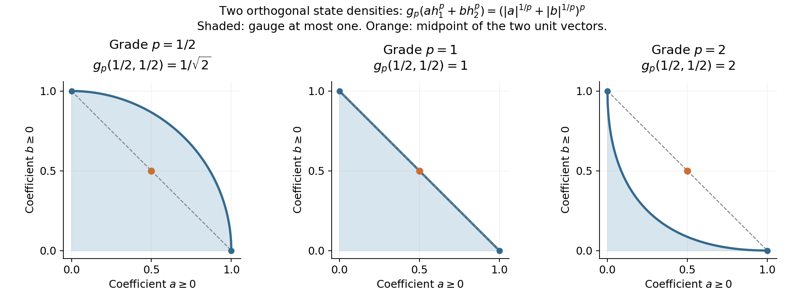

# Finite densities and the graded integral

A homogeneous measurable operator has an exact power-law spectral distribution. Its coefficient is the mass of a normal functional, with a factor of \(2\pi\) fixed by the core's Haar convention. We derive that functional directly from a finite spectral projection. This avoids both a countability assumption and an identification of the graded integral with the usually infinite core trace.

Let \(M\) be any von Neumann algebra, including zero, and let \((C,\theta,\tau)\) be its continuous core with the conventions proved in [the core construction](OA-FLOW-CORE.md#core-setting):
\[
 M=C^\theta,\qquad \tau\theta_s=e^{-s}\tau,\qquad
 T_\theta(Y)=\frac1{2\pi}\int_{\mathbb R}\theta_s(Y)\,ds.
 \tag{GI1}
\]
The average takes values in the extended positive cone of \(M\). Its normality and bimodularity are [the dual-action averaging theorem](OA-FLOW-DA.md#da-positive). The supported weight density, including its full spectral domain, is [SCW.1–2](OA-FLOW-SCW.md#scw-1):
\[
 \varphi\circ T_\theta=\tau_{h_\varphi},\qquad
 \theta_s(h_\varphi)=e^{-s}h_\varphi,\qquad
 s(h_\varphi)=s(\varphi).
 \tag{GI2}
\]
Products, sums and adjoints of measurable operators have the closed-domain meanings established in [Trace cutoffs, transport and homogeneous domains](OA-FLOW-MGO.md#mgo-measure-algebra). Write \(S_\alpha\) for its closed grade-\(\alpha\) subspace. No separability or faithful normal state is assumed.

## 1. A finite cut determines a positive functional

Put \(K=1/(2\pi)\). For every normal positive functional \(\varphi\), take the bounded spectral function
\[
 g(r)=r^{-1}1_{(1,\infty)}(r),\quad g(0)=0.
\]
For \(r>0\), substitution gives \(\int_{\mathbb R}g(e^{-s}r)\,ds=1\); at zero the integral is zero. Integrating first on compact intervals and then taking increasing limits in scalar spectral measures proves
\[
 T_\theta(g(h_\varphi))=K s(\varphi),\qquad
 \tau(1_{(1,\infty)}(h_\varphi))=K\varphi(1).
 \tag{GI3}
\]
The second equality uses (GI2) and the spectral identity \(h_\varphi g(h_\varphi)=1_{(1,\infty)}(h_\varphi)\). It involves positive trace pairings, so the same calculation holds for a normal semifinite weight even if both sides are infinite. Trace scaling then gives, for every \(a>0\),
\[
 \tau(1_{(a,\infty)}(h_\varphi))=K\varphi(1)/a.
 \tag{GI4}
\]
In particular finite functionals have measurable densities. A semifinite weight has a measurable density only if it is finite: measurability supplies a finite high tail, and (GI4) then makes \(\varphi(1)\) finite.

We prove the converse directly. Let \(h\ge0\) be measurable and have grade one. Its tail \(d_h(a)\) satisfies
\(d_h(e^s a)=e^{-s}d_h(a)\). A finite high tail therefore implies
\[
 d_h(a)=c/a\quad(a>0),\qquad 0\le c<\infty.
\]
Set \(e=1_{(1,\infty)}(h)\) and define
\[
 \varphi_h(x)=2\pi\tau(exe),\qquad x\in M_+.
 \tag{GI5}
\]
This is a bounded positive normal functional, of mass \(2\pi\tau(e)=2\pi c\). Indeed the finite trace corner supplies positivity, additivity and the bound by \(\|x\|\tau(e)\); normality follows from increasing positive limits. For every \(Y\in C_+\), trace scaling, nonnegative interchange and the substitution \(t=e^{-s}\) give
\[
\begin{aligned}
 \widetilde\varphi_h(Y)
 &=\int_{\mathbb R}\tau(e\theta_s(Y)e)\,ds\\
 &=\int_{\mathbb R}e^{-s}
       \tau(Y^{1/2}\theta_{-s}(e)Y^{1/2})\,ds\\
 &=\int_0^\infty\tau(Y^{1/2}1_{(t,\infty)}(h)Y^{1/2})\,dt
   =\tau_h(Y).
\end{aligned}
 \tag{GI6}
\]
The last identity is the scalar layer-cake identity on complete spectral forms, followed by the monotone trace extension proved in [TD.2](OA-FLOW-TD.md#oa-flow.td.2). None of these steps subtracts infinite values. Uniqueness of the complete density in [TD.5](OA-FLOW-TD.md#oa-flow.td.5) proves \(h=h_{\varphi_h}\). Uniqueness of \(\varphi_h\) also follows from (GI5), or from dual-weight uniqueness. If \(h=0\), every expression is zero. The proof used no countability property of \(M\).

Thus positive measurable grade-one operators and positive normal functionals are in bijection, including their supports and the zero element.

## 2. Polar decomposition gives every positive-real grade

Let \(\alpha=p+it\) with \(p>0\), and \(A\in S_\alpha\). Its polar decomposition \(A=v|A|\) satisfies
\[
 \theta_s(|A|)=e^{-ps}|A|,\qquad
 \theta_s(v)=e^{-its}v.
 \tag{GI7}
\]
The positive power \(h=|A|^{1/p}\) is measurable: its high spectral tails are exactly those of \(|A|\) at the transformed thresholds. It has grade one. Section 1 supplies one and only one \(\omega_A\in M_*^+\) with
\[
 |A|=h_{\omega_A}^{p},\qquad v^*v=s(\omega_A).
 \tag{GI8}
\]
Conversely these data, with \(v\) a partial isometry of grade \(it\) and the indicated initial support, give a measurable grade-\(\alpha\) operator. The domain is the spectral domain of \(h_{\omega_A}^{p}\); multiplication by \(v\) is isometric on its range support and preserves closedness.

For real \(p\), the polar factor belongs to \(M\). For nonreal \(\alpha\), choose a faithful normal semifinite weight \(\psi\), whose existence is supplied by [FR.1](OA-FLOW-FR.md#oa-flow.fr.1). Its density need not be measurable, but \(u_t=h_\psi^{it}\) is a bounded unitary. The map
\[
 A\longmapsto A u_t^* : S_{p+it}\longrightarrow S_p
 \tag{GI9}
\]
is a linear bijection. Right unitary multiplication conjugates the absolute value and preserves its spectral traces. This observation will identify the size and completeness of the complex and real grades. It uses a semifinite weight, not an unavailable faithful state on a general algebra.

## 3. Linearity is a theorem about domains

Write \(D(\varphi)=h_\varphi\) for positive normal functionals. We first justify the complete-form operations involved in extending \(D\).

For positive measurable \(h,k\), their measurable sum is positive and selfadjoint by the polar and positive-cone construction in [MT.12](../../OA-MOD/OA-MOD-MT.html#oa-mod-mt-12). It equals their closed form sum. In detail, the form \(q_h+q_k\) has dense domain because it contains \(D(h)\cap D(k)\); it is closed since a Cauchy sequence for its form norm is Cauchy for both closed form norms and has the same Hilbert limit. The associated positive selfadjoint operator from [the closed-form representation theorem](OA-FLOW-FF.md#oa-flow.ff.5) extends the ordinary sum on \(D(h)\cap D(k)\). The closure of that ordinary sum is already selfadjoint by the measure-algebra theorem. A selfadjoint operator has no proper selfadjoint extension: taking adjoints of an inclusion reverses it. Thus the two operators coincide.

Likewise, for bounded \(x\in C\), the positive measurable product \(xhx^*\) is the operator of the closed form \(\xi\mapsto\|h^{1/2}x^*\xi\|^2\). The composition \(h^{1/2}x^*\) is closed; its domain is dense by the measurable-product cutoff construction. Its squared closed form represents a selfadjoint extension of the ordinary \(xhx^*\); positivity and selfadjointness of the measurable closure give equality as above. Consequently the extended-positive addition and congruence identities of [TD.2](OA-FLOW-TD.md#oa-flow.td.2) and [TD.7](OA-FLOW-TD.md#oa-flow.td.7) apply to these actual measurable operators.

It follows that
\[
 \tau_{h_\varphi+h_\chi}=\tau_{h_\varphi}+\tau_{h_\chi}
      =\widetilde{\varphi+\chi}.
\]
Density uniqueness and the same argument for nonnegative scalars prove
\[
 D(\varphi+\chi)=D(\varphi)+D(\chi),\qquad D(c\varphi)=cD(\varphi)
       \quad(c\ge0).
 \tag{GI10}
\]
Every normal functional is a complex linear combination of four positive normal functionals, with no countability assumption on the algebra. Indeed [CP.4 and CP.6](OA-FLOW-CP.md#oa-flow.cp.4) give a representation \(F(x)=\sum_n\langle x\xi_n,\eta_n\rangle\), where both vector sequences are square summable. For \(j=0,1,2,3\), set
\[
 \varphi_j(x)=\frac14\sum_n
 \langle x(\xi_n+i^j\eta_n),\xi_n+i^j\eta_n\rangle.
\]
The sums converge in functional norm, define normal positive functionals, and direct expansion gives \(F=\sum_{j=0}^3i^j\varphi_j\). If \(F\) is selfadjoint, its imaginary part vanishes and \(F=\varphi_0-\varphi_2\). Additivity makes
\(D(\varphi_1-\varphi_2)=D(\varphi_1)-D(\varphi_2)\) well-defined on selfadjoint normal functionals: equality of two differences is equality of the corresponding positive sums. Taking real and imaginary parts therefore extends \(D\) complex linearly to \(M_*\). It is injective by positive density uniqueness, first on differences and then on real and imaginary parts, and respects adjoints.

For \(x\in M\), put \(\varphi_x(y)=\varphi(x^*yx)\). The congruence identity just justified and bimodularity of \(T_\theta\) give
\[
 \tau_{xh_\varphi x^*}(Y)
 =\tau_{h_\varphi}(x^*Yx)
 =\varphi(x^*T_\theta(Y)x)=\widetilde{\varphi_x}(Y),\qquad Y\ge0.
\]
Hence \(D(\varphi_x)=xh_\varphi x^*\). Polarization gives, for \(b,c\in M\),
\[
 D[y\mapsto\varphi(b^*yc)]=c h_\varphi b^*.
 \tag{GI11}
\]
For example, the polarization follows by expanding the four values at \(c+i^j b\), \(j=0,1,2,3\), and taking the coefficients of the cross terms; it is an identity of the same sesquilinear forms on both sides.

Every \(A\in S_1\) has the form \(v h_\omega\), with \(v\in M\) and \(v^*v=s(\omega)\), by Section 2. Formula (GI11) says that it is \(D(F_A)\), where
\[
 F_A(x)=\omega(xv).
 \tag{GI12}
\]
Thus \(D:M_*\to S_1\) is onto. Cauchy–Schwarz for \(\omega\) gives
\(|F_A(x)|\le\|x\|\omega(1)\), and testing at \(x=v^*\) gives equality in its norm. Therefore
\[
 \|F_A\|=\omega(1).
 \tag{GI13}
\]

## 4. The integral and its normalization

Define
\[
 \mathcal I(A)=D^{-1}(A)(1),\qquad
 \|A\|_1=\mathcal I(|A|)\quad(A\in S_1).
 \tag{GI14}
\]
This is a linear integral; \(\|A\|_1\) is a norm because (GI13) identifies it isometrically with the predual norm. The normal functionals form a Banach space, as proved by their concrete quotient construction in [CP.5–6](OA-FLOW-CP.md#oa-flow.cp.5). Thus \(S_1\) is Banach, and
\[
 F_A(x)=\mathcal I(xA)=\mathcal I(Ax),\qquad
 \mathcal I(vh_\omega)=\omega(v).
 \tag{GI15}
\]
Both module identities follow from (GI11), first for positive functionals and then by linearity. In particular
\(\|xAy\|_1\le\|x\|\|A\|_1\|y\|\) for \(x,y\in M\), since the corresponding normal functional is composed with \(z\mapsto yzx\).

For an explicit normalized localizer take a faithful semifinite \(\psi\), and put \(a=2\pi g(h_\psi)\). The calculation in Section 1 gives \(T_\theta(a)=1\). For positive \(\omega\),
\[
 \tau(a^{1/2}h_\omega a^{1/2})=
 \tau_{h_\omega}(a)=\omega(T_\theta(a))=\omega(1).
\]
The positive measurable product has finite trace, so it belongs to ordinary tracial \(L^1(C,\tau)\). Decomposing an arbitrary normal functional into four positive ones and using the measurable algebra laws proves
\[
 \mathcal I(A)=\tau(a^{1/2}Aa^{1/2})\quad(A\in S_1).
 \tag{GI16}
\]
This expression is independent of the positive bounded localizer with \(T_\theta(a)=1\). Notice which normalization is required: \(\int\theta_s(a)\,ds=2\pi\,1\), not \(1\).

In the scalar core, \(h_c(q)=ce^q\) and
\(\tau(f)=K\int e^{-q}f(q)\,dq\). Its ordinary positive trace is infinite when \(c>0\), whereas \(\mathcal I(h_c)=c\). Also \(\tau(1_{(1,\infty)}(h_c))=Kc\). These three values are different objects.

## 5. Spectral size, quasi-norms and completeness

For \(\alpha=p+it\), \(p>0\), define
\[
 g_\alpha(A)=\bigl(\mathcal I(|A|^{1/p})\bigr)^p
            =\omega_A(1)^p.
 \tag{GI17}
\]
At a purely imaginary grade use the operator norm, since that grade is bounded. The exact size function \(\mu_r\), defined by bounded-domain cutoffs of discarded trace at most \(r\), and its noncommuting sum and product estimates are proved in [TI.2–3](../../OA-MOD/OA-MOD-TI.html#oa-mod-ti-02). From (GI4) and (GI8), for \(a,r>0\),
\[
 d_A(a)=K g_\alpha(A)^{1/p}a^{-1/p},\qquad
 \mu_r(A)=g_\alpha(A)(K/r)^p.
 \tag{GI18}
\]
Thus \(g_\alpha(A)=\mu_K(A)\), and convergence in measure within a fixed grade is precisely convergence of the gauge of the difference. The same formulas prove absolute scalar homogeneity, definiteness, adjoint invariance, and
\[
 g_\alpha(xAy)\le\|x\|g_\alpha(A)\|y\|\qquad(x,y\in M).
 \tag{GI19}
\]
Taking \(r=K/2\) in the cutoff estimate for a sum gives
\[
 g_\alpha(A+B)\le 2^p\bigl(g_\alpha(A)+g_\alpha(B)\bigr).
 \tag{GI20}
\]
So this is a quasi-norm for every \(p>0\), before a sharp triangle inequality is available.

It is complete. A gauge-Cauchy net is measure-Cauchy by (GI18); the complete measure algebra gives a limit \(A\), and closedness of the grade puts \(A\in S_\alpha\). More explicitly, if \(B_i\to B\) in measure within one grade, the cutoff sum inequality gives, for \(0<t<K\),
\[
 g_\alpha(B)=\mu_K(B)
 \le \mu_{K-t}(B_i)+\mu_t(B-B_i)
 =\left(\frac K{K-t}\right)^p g_\alpha(B_i)+\mu_t(B-B_i).
\]
Take the directed liminf, then let \(t\downarrow0\). This proves lower semicontinuity of the gauge. Apply it to the difference between a fixed tail element of the Cauchy net and its limit. The Cauchy bound then implies convergence in gauge. This proves completeness for nets as well as sequences, in particular the quasi-Banach assertion for \(p>1\). It does not use a scalar Fatou lemma for an arbitrary net.

Right multiplication by the unitary in (GI9) preserves (GI18). Hence it is an isometric isomorphism for these gauges. Conjugation by a unitary of purely imaginary grade likewise preserves \(S_1\), positivity and its positive integral: spectral traces are unchanged. Positive decomposition extends this to
\[
 \mathcal I(uAu^*)=\mathcal I(A)
 \quad(A\in S_1,\ u\text{ unitary of purely imaginary grade}).
 \tag{GI21}
\]

The distinction between a norm and a quasi-norm is necessary. Let \(M=\mathbb C\oplus\mathbb C\), and let \(h_1,h_2\) be the densities of its two coordinate states. Their supports are orthogonal. For a real grade \(p>0\), put \(A=h_1^p\), \(B=h_2^p\). Spectral calculus on the orthogonal supports gives
\[
 g_p(A)=g_p(B)=1,\qquad g_p(A+B)=2^p.
 \tag{GI22}
\]
For \(p>1\) the triangle inequality fails. This disproves a universal norm assertion in that range; it does not say every algebra gives a failure, since each scalar grade is one-dimensional. The same counterexample occurs in the separable factor \(M_2(\mathbb C)\): take the two vector states of its standard orthonormal basis. Their density support projections are the two diagonal matrix units, so they are orthogonal; the preceding spectral calculation and (GI22) apply without change. The next lesson proves the sharp norm range \(0<p\le1\), all finite Hölder products of total grade one, and onto duality in the interior.

The shaded sets are exactly \((a^{1/p}+b^{1/p})^p\le1\), \(a,b\ge0\). The midpoint of the two coordinate unit vectors has gauge \(2^{p-1}\): respectively \(1/\sqrt2\), \(1\), and \(2\) in the displayed panels. Thus the last gauge ball is not convex. This is the explicit model (GI22), not an assertion about the geometry of every algebra. The [renderer](../assets/measurable-grading/generate_models.py), [exact data](../assets/measurable-grading/norm-data.json), [editable SVG](../assets/measurable-grading/norm-and-quasinorm.svg) and [terms](../assets/measurable-grading/TERMS.md) accompany the figure.

## 6. Checks on the dictionary

**1. Which mass is measured by a unit spectral cut?**  
For \(\omega(1)=3\), (GI3) gives \(\tau(1_{(1,\infty)}(h_\omega))=3/(2\pi)\). The graded integral is \(3\). Multiplying the trace itself by \(2\pi\) would change the Haar convention of every earlier core formula, so it is the integral, rather than the core trace, that has mass \(3\).

**2. Can an infinite weight enter an imaginary grade?**  
Yes. Its faithful density has bounded imaginary powers on the whole Hilbert space. Formula (GI9) uses these unitaries only. Positive-real measurable powers, by contrast, have finite functional mass by (GI8).

**3. What identifies the complex predual?**  
The polar form alone identifies positive masses but does not prove addition. The form-domain argument and dual-density uniqueness establish (GI10); polarization then establishes the bimodule identity (GI11). Only after these steps does (GI12) give a linear onto map, with its norm computed by Cauchy–Schwarz and the test \(v^*\).

**4. Does the larger-grade failure mean incompleteness?**  
No. For \(p>1\), (GI20) and the closed-grade measure limit prove a complete quasi-normed space. Formula (GI22) shows exactly why that same gauge is not a norm in general. Completeness and the sharp triangle inequality are separate conclusions.

The source questions are Takesaki, *Theory of Operator Algebras II*, XII.6, Exercise 7, printed p.457. A freely accessible comparison for spectral size is Fumio Hiai, [*Concise lectures on selected topics of von Neumann algebras*, Lemma 11.14 and Corollary 11.15, pp.108–109](https://arxiv.org/pdf/2004.02383v1#page=108); his real \(L^r\) exponent is the reciprocal of our real grade, and his core-trace normalization differs by \(2\pi\). The construction here is arranged around a finite spectral cut, complete-form operations, and an explicit normalization check. Every asserted identity is proved here or at the linked earlier programme proof; the source citations supply context and coverage, not a missing argument.
