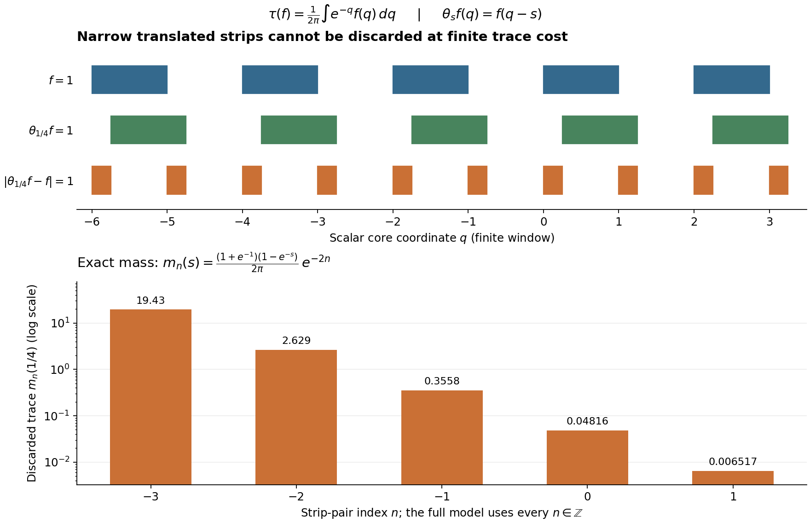

# Trace cutoffs, transport and homogeneous domains

**Self-checked by the writing AI.**

A trace cutoff controls the part of a domain that may be discarded. It makes closed sums and products into an algebra and gives a complete topology. When an automorphism rescales the trace, each fixed automorphism transports that topology exactly. Continuity in the time parameter is a different question; a scalar continuous core already separates the two statements.

Let \(N\subseteq B(H)\) act nondegenerately and let \(\tau\) be a faithful normal semifinite trace. Neither \(H\) nor \(N\) is assumed separable or sigma-finite. The zero algebra is allowed. All products of unbounded operators below include their domains.

## 1. Why a closed operator is bounded on a complete cutoff

We supply the closed graph input explicitly. First, a complete metric space is a Baire space. To prove this, given dense open sets \(G_n\) and a nonempty open set \(V\), choose successively nonempty closed balls \(B_n\) of positive radius, with radius at most \(2^{-n}\), such that
\[
 B_1\subset V\cap G_1,\qquad B_{n+1}\subset\operatorname{int}(B_n)\cap G_{n+1}.
\]
The centers are Cauchy. Their limit belongs to every closed \(B_n\), hence to \(V\cap\bigcap_nG_n\). Equivalently a complete metric space cannot be a countable union of closed sets with empty interior. The one-point space is immediate.

If a bounded linear map \(F:X\to Y\) between Banach spaces is onto, then
\(Y=\bigcup_{n\ge1}F(nB_X)\), where \(B_X\) is the closed unit ball. Baire applied to the closures shows that \(\overline{F(B_X)}\) has nonempty interior. This set is symmetric and convex. Subtracting a ball in its interior from itself and dividing by two gives a number \(\delta>0\) such that
\[
 B_Y(0,\delta)\subset\overline{F(B_X)}.
\]
For \(\|y\|<\delta/2\), construct \(x_j\) with \(\|x_j\|\le2^{-j}\) and
\[
 \left\|y-F\!\left(\sum_{j=1}^n x_j\right)\right\|<\delta\,2^{-n-1}.
\]
At each step use the preceding closure inclusion after scaling. The convergent series \(x=\sum_jx_j\) satisfies \(\|x\|\le1\) and \(Fx=y\). Thus \(F\) maps a ball onto a set containing a ball. Translation and scaling prove that \(F\) is open. In particular a bounded linear bijection of Banach spaces has bounded inverse.

Now let \(A:X\to Y\) be linear and everywhere defined with closed graph. Its graph, with the product norm, is Banach. The first coordinate map from this graph onto \(X\) is a bounded bijection; its inverse is bounded by the preceding argument. Composing with the second coordinate proves that \(A\) is bounded.

Consequently, if \(T\) is a closed operator on \(H\) and \(eH\subset D(T)\) for a projection \(e\), then the everywhere defined map \(\xi\mapsto T(e\xi)\) has closed graph and is bounded. If \(T\) is affiliated with \(N\) and \(e\in N\), this map commutes with the commutant unitaries and therefore belongs to \(N\). We have proved
\[
 eH\subset D(T)\quad\Longrightarrow\quad Te\in N.                 \tag{MG1}
\]
This statement concerns the bounded restriction followed by the projection. It does not say that \(T\) is bounded on its entire original domain.

## 2. The complete algebra behind the cutoffs

A closed densely defined affiliated operator \(T\) is called \(\tau\)-measurable if, for every \(\delta>0\), a projection \(e\in N\) satisfies
\[
 \tau(1-e)<\delta,\qquad eH\subset D(T).
\]
Write \(S(N,\tau)\) for these operators. For \(\varepsilon,\delta>0\), put
\[
 U_\tau(\varepsilon,\delta)=
 \{T\in S(N,\tau):\|Te\|<\varepsilon,\ 
       \tau(1-e)<\delta\text{ for some projection }e\in N\}.       \tag{MG2}
\]
Membership includes \(eH\subset D(T)\), so (MG1) makes the norm meaningful.

The earlier programme construction [Operators recovered from small trace defects](../../OA-MOD/OA-MOD-MT.html#oa-mod-mt-02) supplies the following precise theorem. Its closed graph input is established in Section 1 above. Its remaining named inputs have the following earlier proofs in this course as well: [the bounded spectral calculus](OA-FLOW-SF.md#oa-flow.shared-foundations.sf-0), [full unbounded spectral domains](OA-FLOW-SF.md#oa-flow.shared-foundations.sf-1), [closed linear polar decomposition](OA-FLOW-HA-R.md#oa-flow.ha-r.4), and [the finite trace ideal and bounded cyclic identities](OA-FLOW-TD.md#oa-flow.td.1). These proofs are for arbitrary Hilbert spaces and the same faithful normal semifinite trace convention. Thus the application retains the hypotheses of the actual measure-algebra proof.

**Measure-algebra theorem.** The translates of (MG2) form a complete Hausdorff topological star-algebra. In this algebra
\[
 S+T:=\overline{S|_{D(S)\cap D(T)}+T|_{D(S)\cap D(T)}},\qquad
 ST:=\overline{S\circ T|_{\{\xi\in D(T):T\xi\in D(S)\}}}.          \tag{MG3}
\]
Both initial domains are dense and both indicated operators are closable. These operations are associative and distributive, and the algebra involution is the Hilbert-space adjoint with its full domain. Bounded \(N\) is dense in this topology. Spectral cutoffs and bounded regularizations give
\[
 \begin{split}
 e_n&=1_{[0,n]}(|T|),\qquad Te_n\longrightarrow T,\\
 T(1+\eta|T|)^{-1}&\longrightarrow T\quad(\eta\downarrow0).
 \end{split}                                                    \tag{MG4}
\]
These are limits in measure. Moreover,
\[
 \begin{split}
 T\in S(N,\tau)
 &\Longleftrightarrow
 \tau(1_{(r,\infty)}(|T|))\longrightarrow0\quad(r\to\infty)\\
 &\Longleftrightarrow
 \tau(1_{(r_0,\infty)}(|T|))<\infty
       \text{ for some finite }r_0. 
 \end{split}                                                    \tag{MG5}
\]

Here are the exact proof locations, including the domain assertions. [MT-02](../../OA-MOD/OA-MOD-MT.html#oa-mod-mt-02) proves the noncommuting projection estimates
\(\tau(e\vee f)\le\tau(e)+\tau(f)\) and \(e\wedge f=0\Rightarrow e\precsim1-f\).
[MT-03–06](../../OA-MOD/OA-MOD-MT.html#oa-mod-mt-03) construct the operator and vector measure completions by Cauchy sequences, reduce Cauchy nets to the countable neighborhood base, and prove continuity of multiplication on bounded-in-measure sets. [MT-07–08](../../OA-MOD/OA-MOD-MT.html#oa-mod-mt-07) use graph projections in \(M_2(N)\) to identify a unique closed affiliated operator for every completion element. [MT-09](../../OA-MOD/OA-MOD-MT.html#oa-mod-mt-09) proves precisely both domains and closures in (MG3); it transfers associativity from bounded representatives, rather than multiplying three unbounded symbols formally. [MT-10–11](../../OA-MOD/OA-MOD-MT.html#oa-mod-mt-10) prove the increasing-domain and spectral-tail statements. [MT-12–13](../../OA-MOD/OA-MOD-MT.html#oa-mod-mt-12) give the polar calculus and (MG4). These are internal written proofs of the theorem, not external references in its place.

One useful quantitative consequence is
\[
 \begin{split}
 U_\tau(\varepsilon_1,\delta_1)+U_\tau(\varepsilon_2,\delta_2)
 &\subset U_\tau(\varepsilon_1+\varepsilon_2,\delta_1+\delta_2),\\
 U_\tau(\varepsilon_1,\delta_1)U_\tau(\varepsilon_2,\delta_2)
 &\subset U_\tau(\varepsilon_1\varepsilon_2,\delta_1+\delta_2).
 \end{split}                                                    \tag{MG6}
\]
For the second estimate, choose \(e,f\) bounding \(S,T\), respectively. The right support \(r\) of the measurable operator \((1-e)T\) has trace at most \(\tau(1-e)\), by polar equivalence with its left support. On \(q=f\wedge(1-r)\), one has \(Tq=eTq\), so the ordinary product is defined and has norm at most \(\|Se\|\|Tf\|\). The projection estimate bounds \(\tau(1-q)\) by the sum of the two discarded traces. This explains why intersecting the two original cutoffs alone would not suffice for a product.

## 3. Transport under one trace-scaling automorphism

Let \(\gamma\) be a normal star-automorphism of \(N\) and suppose
\(\tau\gamma=c\tau\) for a fixed \(c>0\). For bounded \(x\), applying \(\gamma\) to its cutoff, and then applying \(\gamma^{-1}\) for the converse, gives the exact equality
\[
 \gamma\bigl(U_\tau(\varepsilon,\delta)\cap N\bigr)
       =U_\tau(\varepsilon,c\delta)\cap N.                        \tag{MG7}
\]
Thus \(\gamma\) and its inverse are uniformly continuous for the additive measure structures. Apply them to bounded Cauchy representatives in the completion of Section 2. Equivalent representatives have equivalent images by (MG7); completeness gives one extension. The inverse extends in the same way. The bounded algebra identities and continuity of multiplication show that the extensions are mutually inverse star-algebra maps on \(S(N,\tau)\).

This extension has an explicit operator interpretation. If \(T=v|T|\), apply \(\gamma\) to \(v\) and to every spectral projection of \(|T|\). Normality preserves the strong supremum of the bounded spectral cuts, so the resulting spectral resolution defines a densely defined positive operator \(h'\) on its full spectral domain
\[
 D(h')=\{\xi:\int_0^\infty t^2\,d\langle\gamma(E_{|T|}(t))\xi,\xi\rangle
                  <\infty\}.
\]
Its tail trace is \(c\) times the original tail trace, hence tends to zero. The closed operator \(\gamma(v)h'\) is measurable; its bounded spectral pieces are the images of those of \(T\). By (MG4) and uniqueness of the completion limit, it is exactly the extension just constructed. In particular \(\gamma\) transports full domains through their spectral description even when no implementing unitary in this representation was specified.

The equality (MG7) holds on the whole measurable algebra as well: apply the same cutoff and its inverse to this concrete description. If \(\theta_s\) is a trace-scaling action with \(\tau\theta_s=e^{-s}\tau\), each fixed \(s\) therefore acts by a homeomorphism. The group law on the extension follows from the group law on the dense bounded algebra.

## 4. Closed grades and their zero-real-part boundary

Suppose additionally that \(N^\theta=M\). Define
\[
 S_\alpha=\{T\in S(N,\tau):\theta_s(T)=e^{-\alpha s}T
                    \text{ for every }s\in\mathbb R\}.
                                                                    \tag{MG8}
\]
Every \(S_\alpha\) is closed in measure: for each fixed \(s\), both sides of its defining equation are continuous functions of \(T\), by Section 3. Intersect their equalizers over all \(s\). No continuity in the time parameter on the whole algebra is used. Closed algebra operations give
\[
 S_\alpha S_\beta\subset S_{\alpha+\beta},\qquad
 S_\alpha^*=S_{\bar\alpha}.
                                                                    \tag{MG9}
\]
If a nonzero \(T\) had two grades, their scalar exponential characters would agree for every real \(s\); differentiation at zero gives equality of the grades.

Write \(T=v|T|\), \(\alpha=p+it\). Uniqueness of the polar decomposition, including its supports, gives
\[
 \theta_s(|T|)=e^{-ps}|T|,\qquad
 \theta_s(v)=e^{-its}v.
\]
For \(d_T(a)=\tau(1_{(a,\infty)}(|T|))\), spectral transport gives
\[
 d_T(e^{ps}a)=e^{-s}d_T(a).                                      \tag{MG10}
\]
If \(p<0\) and \(T\) is bounded and nonzero, preservation of its norm under \(\theta_s\) contradicts its nonunit scalar scaling. If \(T\) is unbounded and measurable, choose \(a\) with \(0<d_T(a)<\infty\), using (MG5). For \(s>0\), the left side of (MG10) is at least \(d_T(a)\), whereas its right side is strictly smaller. Thus \(S_\alpha=\{0\}\) when \(\Re\alpha<0\).

If \(p=0\), choose a high spectral projection of \(|T|\) with finite trace. It is fixed by \(\theta_s\), so its trace equals \(e^{-s}\) times itself. Its trace, and hence the projection, is zero. Therefore \(T\) is bounded. We obtain
\[
 S_0=M,\qquad
 S_{it}=\{x\in N:\theta_s(x)=e^{-its}x\text{ for all }s\},
                                                                    \tag{MG11}
\]
with the operator norm on the latter bounded fiber.

For a continuous core, let \(h_\psi\) be the supported density of a faithful normal semifinite weight. Faithfulness makes \(h_\psi^{it}\) a unitary, even if \(\psi(1)=\infty\). The core spectral relation gives
\(\theta_s(h_\psi^{it})=e^{-its}h_\psi^{it}\). Hence
\[
 M\longrightarrow S_{it},\quad x\longmapsto xh_\psi^{it}
                                                                    \tag{MG12}
\]
is an onto linear isometry, with inverse \(T\mapsto Th_\psi^{-it}\). Indeed the product in the inverse is bounded and fixed. This argument uses no faithful normal state and no assertion that \(h_\psi\) itself is measurable. The density spectral relation and full domains are those of [supported intrinsic-core coordinates](OA-FLOW-SCW.md#scw-2).

## 5. Time continuity can fail in the scalar core

Take
\[
 N=L^\infty(\mathbb R),\qquad
 \tau(f)=\frac1{2\pi}\int_{\mathbb R}e^{-q}f(q)\,dq,\qquad
 \theta_s(f)(q)=f(q-s).
                                                                    \tag{MG13}
\]
This is a faithful normal semifinite trace and \(\tau\theta_s=e^{-s}\tau\). Represent \(N\) on \(L^2(\mathbb R,e^{-q}dq/(2\pi))\). The unitaries
\[
 (U_s\xi)(q)=e^{s/2}\xi(q-s)
\]
implement \(\theta_s\). Multiplication by \(e^{-q/2}/\sqrt{2\pi}\) identifies these unitaries with ordinary translations on \(L^2(dq)\). Translations are strongly continuous: prove the assertion first for continuous compactly supported functions using uniform continuity and a common compact support, then use their \(L^2\)-density and the unitary norm bound. Thus this is a continuous action in its usual represented sense.

Let \(f\) be the indicator of \(\bigcup_{n\in\mathbb Z}[2n,2n+1)\). It is bounded, hence measurable. For \(0<s<1\), the absolute value of \(\theta_s(f)-f\) is one precisely on the disjoint strips
\[
 [2n,2n+s)\ \cup\ [2n+1,2n+1+s),\qquad n\in\mathbb Z,
\]
up to endpoints. Their individual discarded traces are
\[
 m_n(s)=\frac{(1+e^{-1})(1-e^{-s})}{2\pi}\,e^{-2n}.                \tag{MG14}
\]
Their sum is infinite; already the terms \(n=-k\) tend to infinity as \(k\to\infty\). In this commutative representation every projection is an indicator. A cutoff making
\(\|(\theta_s(f)-f)e\|<1/2\) must discard every strip, and would have infinite complementary trace. Hence
\[
 \theta_s(f)-f\notin U_\tau(1/2,\delta)
 \quad(0<s<1,\ 0<\delta<\infty).                                  \tag{MG15}
\]
The orbit of \(f\) is not continuous at zero for the global measure topology.

The figure displays only finitely many strips at \(s=1/4\). Formula (MG14), not the finite drawing, proves divergence of the full sum. The two types of continuity in Sections 3 and 5 therefore must not be interchanged. The original [renderer](../assets/measurable-grading/generate_models.py), [exact model data](../assets/measurable-grading/model-data.json), [editable SVG](../assets/measurable-grading/time-and-measure.svg) and [terms](../assets/measurable-grading/TERMS.md) accompany the figure.

## 6. Domain and continuity diagnostics

**1. A faithful weight need not be finite.** Why is (MG12) still valid when \(h_\psi\) is not measurable?  
**Solution.** The spectral function \(\lambda^{it}\) has modulus one on \((0,\infty)\), and faithfulness removes the zero spectral support. Thus it defines a bounded unitary on all of \(H\). Bounded operators are measurable, and only this bounded unitary, not its unbounded logarithm or density, enters (MG12).

**2. An atom changes the topology.** Let \(N=B(\ell^2(I))\) have counting trace. Prove that every measurable affiliated operator is bounded.  
**Solution.** Every nonzero projection has trace at least one. By (MG5), a sufficiently high tail has trace less than one, so that tail vanishes. Moreover, in (MG2), \(\delta<1\) forces \(e=1\). The global measure topology is exactly the operator norm topology here, for arbitrary \(I\).

**3. Strong continuity is insufficient.** Does the strong continuity of \(U_s\) in Section 5 contradict (MG15)?  
**Solution.** No. Strong continuity controls each Hilbert vector. A global measure neighborhood also requires one projection with finite small complementary trace on which a uniform operator bound holds. The infinitely many strips in (MG14) defeat that uniform trace requirement.

**4. Closed grade limits.** Let a measure-Cauchy net lie in one \(S_\alpha\). Show that its limit has the same grade.  
**Solution.** The measure algebra is complete, so there is a limit \(T\). For each fixed \(s\), apply the homeomorphism of Section 3 and scalar multiplication to the net's defining equation. Uniqueness of its limit gives \(\theta_s(T)=e^{-\alpha s}T\). This proof does not need the time-continuity assertion disproved in Section 5.

The homogeneous questions addressed here are part of Takesaki, *Theory of Operator Algebras II*, XII.6, Exercise 7, p.457. The complete measurable algebra is supplied by the earlier programme proof specified in Section 2. Positive-real grades, their normalized integral and Hölder and duality theorems require additional arguments; (MG8) alone does not establish them.
