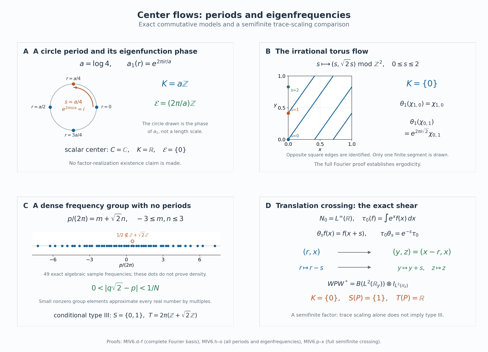

# Modular spectra and periods from the center flow

*Self-checked by the writing AI. Original exposition and illustration sources: CC0-1.0; earlier and font components retain their recorded terms.*

Two different subsets of the real line occur in the modular theory of a factor. One consists of times that fix its whole center flow. The other consists of frequencies carried by central eigenunitaries. The first determines the spectrum shared by all modular operators; the second determines when a modular automorphism is inner. We prove both identifications, keeping all faithful normal semifinite weights and arbitrary predual size.

## A trace-scaling presentation of the factor

Let \(N\ne0\) be a von Neumann algebra, let \(\theta:\mathbb R\to\operatorname{Aut}(N)\) be point-ultraweakly continuous, and let \(\tau\) be a faithful normal semifinite trace satisfying
\[
 \tau\circ\theta_s=e^{-s}\tau.
\tag{MIV0.a}
\]
Assume that the crossed product
\[
 P=N\rtimes_\theta\mathbb R
\tag{MIV0.b}
\]
is a type III factor. Here type III means that it has no nonzero finite projection. Every type III factor admits such a presentation at arbitrary predual size by [Continuous decompositions](OA-FLOW-CDEC.md#cdec-3). We identify \(N\) with its faithful normal coefficient copy in \(P\), and write \(u(s)\) for the crossed-product unitaries. Thus
\[
 u(s)xu(s)^*=\theta_s(x)\qquad(x\in N).
\tag{MIV0.c}
\]
The original group parameter is \(s\). We label dual characters by \(\chi_t(s)=e^{its}\); the dual action uses the multiplier \(\overline{\chi_t(s)}=e^{-its}\).

Let \(\Phi\) be the full dual weight of \(\tau\). The [modular and fixed-algebra calculation](OA-FLOW-L18.md#l18-1) proves, on the entire algebras,
\[
 \begin{aligned}
 \sigma_t^\Phi(x)&=x &&(x\in N),&
 \sigma_t^\Phi(u(s))&=e^{-its}u(s),\\
 P_\Phi&=N,&Z(P)&=Z(N)^\theta.
 \end{aligned}
\tag{MIV0.d}
\]
In particular \(\Phi\) is faithful normal semifinite and, on putting \(C=Z(N)\), we have \(C^\theta=\mathbb C1\). This is ergodicity of the center flow. The coefficient algebra \(N\) need not be a factor.

Our two modular invariants are
\[
 \begin{aligned}
 S(P)&=\bigcap_{\psi\ {\rm faithful\ normal\ semifinite}}
                  \operatorname{Sp}(\Delta_\psi),\\
 T(P)&=\{p\in\mathbb R:\sigma_p^\psi
                         \text{ is inner}\}.
 \end{aligned}
\tag{MIV0.e}
\]
The intersection in the first line includes every such weight, without requiring finite total mass. The second line is independent of the weight; Section 5 proves this explicitly. The modular operators and their spectra are those of the complete GNS constructions, including their unbounded domains.

There is no separability or sigma-finiteness assumption on either algebra or on its represented Hilbert space. The countable Fourier expansions in particular examples do not change these hypotheses. Some examples below are comparisons of commutative flows; assertions about a factor with such an associated flow are stated conditionally. The semifinite comparison is explicitly separated from the type III hypothesis in (MIV0.b).

## 1. The center kernel through the full second crossing

Denote the coefficient inclusion by \(i:N\to P\), and put
\[
 K=\{s\in\mathbb R:\theta_s(z)=z\text{ for every }z\in C\}.
\]

Put \(\alpha=\sigma^\Phi=\widehat\theta\), with the equality supplied by [L18's dual-weight calculation](OA-FLOW-L18.md#l18-1), and write
\[
 D=P\rtimes_\alpha\mathbb R.
\]
Let \(j:P\to D\) be the coefficient map and \(v(t)\) its implementing unitary group. With the original Haar measure \(ds\) and its dual \(dt/(2\pi)\), the remaining dual action is
\[
 \delta_s(j(y))=j(y),\qquad
 \delta_s(v(t))=e^{-ist}v(t)
 \quad(y\in P).
 \tag{MIV1.a}
\]
The character used to label \(s\) on the second group is \(t\mapsto e^{ist}\); the dual action uses its conjugate. Haar rescaling gives the same normally represented crossed product: multiplication of \(L^2\) functions by the square root of the constant measure ratio is an onto unitary intertwining coefficient fields and translations. Thus choosing this dual Haar measure imposes no additional hypothesis on the modular action.

The full [normal double-duality construction](OA-FLOW-ND.md#nd-construction), applied to the original action \(\theta\), gives a normal isomorphism with normal inverse
\[
 \Xi:D\longrightarrow
       N\,\overline\otimes\,B(L^2(\mathbb R,dr)).
 \tag{MIV1.b}
\]
In an arbitrary faithful normal representation \(N\subseteq B(H)\), its exact values are
\[
 \begin{aligned}
 \bigl[\Xi(j(i(x)))\xi\bigr](r)&=\theta_{-r}(x)\xi(r),\\
 \Xi(j(u(s)))&=1\otimes L_s,
       & [L_s\xi](r)&=\xi(r-s),\\
 \Xi(v(t))&=1\otimes Q_t,
       & [Q_t\xi](r)&=e^{-itr}\xi(r).
 \end{aligned}
 \tag{MIV1.c}
\]
These formulas describe the full map. For its existence and onto image, ND first uses the partial Fourier unitary on the second real variable, then the shear \((q,r)\mapsto(q+r,r)\), and finally tensor regrouping. If \(\mathscr W\) is their composite and
\[
 [\rho(x)\eta](q)=\theta_{-q}(x)\eta(q),
\]
then its [whole-domain inverse formulas](OA-FLOW-ND.md#nd-inverse) are
\[
 \begin{aligned}
 \Xi(Y)&=(\rho^{-1}\bar\otimes\mathrm{id})
                 (\mathscr W Y\mathscr W^*),\\
 \Xi^{-1}(Z)&=\mathscr W^*
                 (\rho\bar\otimes\mathrm{id})(Z)\mathscr W .
 \end{aligned}
 \tag{MIV1.d}
\]
Here \(\rho\) is faithful and normal onto its von Neumann image. The [finite-matrix tensor proof](OA-FLOW-ND.md#nd-tensor) constructs both tensor maps normally on the entire tensor algebras. The [orbit-field and Weyl-pair proof](OA-FLOW-ND.md#nd-orbits) identifies the image after the Fourier transform and shear with that whole tensor algebra. Consequently (MIV1.d) proves normality and surjectivity of (MIV1.b), including its inverse; covariance on generators alone is not being used to obtain normal extension.

Let \(R_s\xi(r)=\xi(r+s)\). The surviving action is
\[
 \Xi\delta_s\Xi^{-1}
       =\theta_s\bar\otimes\operatorname{Ad}R_s .
 \tag{MIV1.e}
\]
One can check its sign on each family in (MIV1.c). On the coefficient field, the right translation first changes \(\theta_{-r}(x)\) to \(\theta_{-(r+s)}(x)\), and \(\theta_s\) restores it. Left and right translations commute. Finally
\[
 R_sQ_tR_s^*=e^{-ist}Q_t,
\]
which is exactly (MIV1.a). Both actions are normal and the three families generate the algebra, so these checks prove (MIV1.e) everywhere.

We need the entire center of the tensor algebra in (MIV1.b). Put \(K_0=L^2(\mathbb R,dr)\), choose an orthonormal basis \((e_k)\), and use its matrix units \(E_{kl}\). An operator \(Z\in N\bar\otimes B(K_0)\) has entries \(Z_{kl}\in N\), by the finite-compression proof in ND. If \(Z\) is central, commutation with \(1\otimes E_{kk}\) makes its off-diagonal entries zero; commutation with \(1\otimes E_{kl}\) makes all diagonal entries the same \(z\in N\). Equality of the operators follows on the dense finite-coordinate vectors, so \(Z=z\otimes1\). Commutation with every \(x\otimes1\) now says \(z\in Z(N)\). Conversely such a \(z\otimes1\) commutes with the algebraic tensor generators, and separate ultraweak continuity of multiplication extends this to their von Neumann closure. Hence
\[
 Z(N\bar\otimes B(K_0))=Z(N)\otimes1 .
 \tag{MIV1.f}
\]
The map \(z\mapsto z\otimes1\) is normal: for each positive bounded increasing net, its supremum is detected on elementary vectors, hence on all vectors by density and boundedness. Its inverse on this range is compression by the isometry \(\eta\mapsto\eta\otimes e_{k_0}\), and is normal as well. Thus (MIV1.f) is a normal identification in both directions, not just an algebraic center equality. No countable basis of \(H\), or of a representation of \(N\), has been assumed.

It follows that
\[
 \kappa_C:C=Z(N)\longrightarrow Z(D),\qquad
 \kappa_C(z)=\Xi^{-1}(z\otimes1)
\]
is an onto normal isomorphism with normal inverse. Equations (MIV1.e)–(MIV1.f) give
\[
 \delta_s\kappa_C(z)=\kappa_C(\theta_s(z)),\qquad
 \ker(\delta|_{Z(D)})=\ker(\theta|_C)=K .
 \tag{MIV1.g}
\]
This is the center map used here. The original coefficient \(j(i(z))\) has image \(r\mapsto\theta_{-r}(z)\), which need not be constant or central in the full tensor algebra.

For each \(z\in C\), the set \(\{s:\theta_s(z)=z\}\) is closed, since every normal functional evaluated on \(\theta_s(z)-z\) is continuous and the predual separates points. Their intersection \(K\) is therefore closed. The action law gives \(0\in K\), closure under addition, and closure under inverses. Thus \(K\) is a closed additive subgroup of \(\mathbb R\).

Finally apply the [dual-center kernel theorem, L115 equation K43](OA-FLOW-L115.md#oa-flow.connes.centerkernel), to \(\alpha=\sigma^\Phi\) on \(P\). Its hypotheses are a point-ultraweakly continuous action on an arbitrary von Neumann algebra and a locally compact Hausdorff abelian group. They all hold here. Its crossed product is \(D\), and its negative-character dual action is precisely \(\delta\). Therefore (MIV1.g) proves
\[
 \boxed{\ \Gamma(\sigma^\Phi)=K.\ }
 \tag{MIV1.h}
\]
L115's [Fourier conventions](OA-FLOW-L115.md#oa-flow.l115.conventions) identify the positive and negative conventions for whole action spectra: adjoint reflection makes those spectra symmetric. No reflection of an individual spectral vector is presumed. In particular the real subgroup in (MIV1.h) is expressed in the original parameter \(s\), with no extra \(2\pi\) factor. The proof of this section works for every specified trace-scaling system; factoriality and type III will enter the all-weight and zero-spectrum steps.

## 2. Intersect over all faithful semifinite weights

Let \(\mathcal W_0(P)\) be the set of all faithful normal semifinite weights on \(P\). It is nonempty because \(\Phi\) belongs to it. For \(\psi\in\mathcal W_0(P)\), let \(\Delta_\psi\) be its complete modular operator on its GNS Hilbert space. Put
\[
 S_+(P)=
 \left(\bigcap_{\psi\in\mathcal W_0(P)}
                \operatorname{Sp}(\Delta_\psi)\right)
                 \cap(0,\infty).
 \tag{MIV2.a}
\]
The separate GNS Hilbert spaces present no difficulty: each spectrum is a subset of the same scalar half-line. All weights in this intersection may have infinite value at the identity.

We first recall the exact analytic link between a modular action and its operator. With the positive Fourier convention
\(\widehat f(r)=\int_{\mathbb R}f(t)e^{itr}\,dt\), put
\[
 T_f^\psi(x)=\int_{\mathbb R} f(t)\sigma_t^\psi(x)\,dt
 \quad(f\in L^1(\mathbb R)).
\]
The integral is normal and weak-star. The full GNS filter theorem [MG0](OA-FLOW-MG.md#oa-flow.mg.0) proves, on every element of the finite left ideal,
\[
 \begin{gathered}
 T_f^\psi(\mathfrak n_\psi)\subseteq\mathfrak n_\psi,\\
 \Lambda_\psi(T_f^\psi x)
    =\widehat f(\log\Delta_\psi)\Lambda_\psi(x),
       \qquad x\in\mathfrak n_\psi .
 \end{gathered}
 \tag{MIV2.b}
\]
That theorem obtains the domain inclusion from simultaneous bounded operator sums and convergent Hilbert-vector sums, followed by the closed GNS graph. Thus (MIV2.b) holds even though the GNS map need not be bounded on operator balls.

Here is how it gives the entire action spectrum. If \(T_f^\psi=0\), the multiplier on the right of (MIV2.b) vanishes on the dense range of \(\Lambda_\psi\), hence is zero. Conversely a zero multiplier makes \(\Lambda_\psi(T_f^\psi x)=0\) for every \(x\in\mathfrak n_\psi\). Faithfulness gives \(T_f^\psi x=0\). The finite left ideal is ultraweakly dense and \(T_f^\psi\) is normal, so it vanishes everywhere. The full spectral-support argument in [MG1](OA-FLOW-MG.md#oa-flow.mg.1) identifies the resulting filter annihilator:
\[
 \begin{aligned}
 \operatorname{Sp}(\sigma^\psi)
       &=\operatorname{Sp}(\log\Delta_\psi),\\
 \exp\operatorname{Sp}(\sigma^\psi)
       &=\operatorname{Sp}(\Delta_\psi)\cap(0,\infty).
 \end{aligned}
 \tag{MIV2.c}
\]
Indeed a neighborhood of a positive number \(\lambda\) has nonzero \(\Delta_\psi\)-spectral projection exactly when its logarithmic image has nonzero \(\log\Delta_\psi\)-spectral projection. MG1 proves the support criterion from the full resolvents and squared spectral-domain integrals. The statement at \(\lambda>0\) makes no assertion about zero.

Fix \(\alpha=\sigma^\Phi\), and let \(Z^1_\alpha(\mathbb R,P)\) denote the strongly continuous unitary cocycles:
\[
 w_{t+r}=w_t\alpha_t(w_r).
\]
Such a path is also strongly* continuous. For example,
\(\|(w_t^*-w_{t_0}^*)\xi\|
 =\|(w_{t_0}-w_t)w_{t_0}^*\xi\|\).
The [balanced-cocycle theorem BC4](OA-FLOW-BC.md#oa-flow.bc.4) assigns to every \(\psi\in\mathcal W_0(P)\) a cocycle
\[
 w_t^\psi=(D\psi:D\Phi)_t,\qquad
 \sigma_t^\psi=\operatorname{Ad}(w_t^\psi)\alpha_t .
 \tag{MIV2.d}
\]
Conversely, the complete [unitary-cocycle reconstruction UR0–5](OA-FLOW-UR.md#oa-flow.ur.0) assigns to every \(w\in Z^1_\alpha(\mathbb R,P)\) a unique faithful normal semifinite weight \(\psi_w\) on \(P\), with
\[
 (D\psi_w:D\Phi)_t=w_t,\qquad
 \sigma_t^{\psi_w}=\operatorname{Ad}(w_t)\alpha_t .
 \tag{MIV2.e}
\]
Its hypotheses are exactly a faithful n.s.f. reference and a strongly* continuous unitary cocycle. UR1 constructs the dense mixed analytic space with its GNS curve; UR2 closes its full involution; UR3 recovers a weight on the entire positive cone. UR4 aligns the natural cones, and [UR5's complete relative graph](OA-FLOW-UR.md#oa-flow.ur.5) gives the normalized derivative in (MIV2.e), including its scalar normalization. Thus every cocycle in the intersection below is realized on this same algebra. Neither a finite reference weight nor a countability assumption is required.

Since \(P\) is a factor, \(Z(P)^\alpha=\mathbb C1\). The full [cocycle spectral-intersection theorem L120](OA-FLOW-L120.md#ci-intersection), equation C29, therefore applies:
\[
 \Gamma(\alpha)
   =\bigcap_{w\in Z^1_\alpha(\mathbb R,P)}
         \operatorname{Sp}(\operatorname{Ad}(w)\alpha).
 \tag{MIV2.f}
\]
The [actual setting of L120](OA-FLOW-L120.md#ci-setting) allows arbitrary Hilbert dimension and arbitrary algebra cardinality. Its central-ergodicity assumption, just verified, is the only additional action hypothesis needed here. Its proof compares the reduced spectra of every nonzero fixed corner. The [matrix transport](OA-FLOW-L120.md#ci-transport) preserves the entire action spectrum under amplification by any nonzero Hilbert space; the first-corner construction fixes the prescribed corner exactly before lifting to a cocycle. The resulting containment for each fixed projection is what yields C29. Full central support alone is not substituted for an isomorphism \(ePe\cong P\).

We prove both inclusions in the weight intersection. If \(r\in\Gamma(\alpha)\), (MIV2.f) puts \(r\) in the spectrum of the perturbation associated with every \(\psi\) in (MIV2.d). Equation (MIV2.c) then puts \(e^r\) in every \(\operatorname{Sp}(\Delta_\psi)\), so \(e^r\in S_+(P)\).

Conversely let \(\lambda\in S_+(P)\) and set \(r=\log\lambda\). For any cocycle \(w\), use the weight \(\psi_w\) from (MIV2.e). Since \(\lambda\) belongs to that weight's complete modular spectrum, (MIV2.c) puts \(r\) in
\(\operatorname{Sp}(\operatorname{Ad}(w)\alpha)\).
This holds for every \(w\); (MIV2.f) therefore gives \(r\in\Gamma(\alpha)\). We have proved
\[
 \boxed{\quad S_+(P)=\exp\Gamma(\sigma^\Phi)=\exp K.\quad}
 \tag{MIV2.g}
\]
The logarithm and exponential in this proof are inverse bijections at positive scalar values. No closure operation at zero has been moved through an intersection.

Only factoriality was used in the comparison leading to the first equality in (MIV2.g). Thus the same argument proves, for every nonzero factor \(A\) and every faithful n.s.f. reference weight \(\omega\),
\[
 \left(\bigcap_{\psi\in\mathcal W_0(A)}
                \operatorname{Sp}(\Delta_\psi)\right)
       \cap(0,\infty)
       =\exp\Gamma(\sigma^\omega).
 \tag{MIV2.h}
\]
Such a reference always exists by [FR1](OA-FLOW-FR.md#oa-flow.fr.1), whose proof uses an arbitrary orthogonal family of normal-state supports. Formula (MIV2.h) is independent of the reference because its left side is. The proof used the unrestricted cocycle reconstruction and cocycle intersection; it did not use the separable-predual corner-isomorphism conclusion in MG4.

## 3. Zero belongs to each complete modular spectrum

We retain the type III hypothesis on \(P\). In fact the argument in this section applies to any nonzero type III algebra equipped with a faithful normal semifinite weight. Fix such a weight \(\psi\). Its complete modular data satisfy the closed-operator identity
\[
 J_\psi\Delta_\psi J_\psi=\Delta_\psi^{-1}.
 \tag{MIV3.a}
\]
This includes equality of domains; \(\Delta_\psi\) is injective, even when zero belongs to its spectrum.

Suppose, for a contradiction, that \(0\notin\operatorname{Sp}(\Delta_\psi)\). The exact [reciprocal-domain argument in MT1](OA-FLOW-MT.md#oa-flow.mt.1) then gives a number \(0<c<1\) such that
\[
 cI\le\Delta_\psi\le c^{-1}I,\qquad
 L=\log\Delta_\psi=L^*\in B(H_\psi).
 \tag{MIV3.b}
\]
To recall the domain mechanism, the spectral gap at zero makes the reciprocal spectral function bounded, so \(\Delta_\psi^{-1}\) has domain all of \(H_\psi\). Conjugating (MIV3.a) then makes \(\Delta_\psi\) bounded on all of \(H_\psi\) as well. The same full spectral calculus makes the logarithm bounded, with \(\|L\|\le|\log c|\).

Identify \(P\) with its faithful normal GNS image. Modular implementation gives
\(\sigma_t^\psi(x)=e^{itL}xe^{-itL}\).
The norm-convergent exponential series yields the operator-norm limit
\[
 d(x)=\lim_{t\to0}\frac{\sigma_t^\psi(x)-x}{t}
       =i[L,x]\in P,\qquad
 \|d\|\le2\|L\|.
 \tag{MIV3.c}
\]
Membership in \(P\) follows because every difference quotient lies in its norm-closed image. The commutator identities show that \(d\) is a bounded star derivation. The [already-bounded implementer construction used in MT2](OA-FLOW-MT.md#oa-flow.mt.2) supplies \(b=b^*\in P\) with \(d(x)=i[b,x]\). The two norm-continuous groups with this bounded generator agree: differentiating \(e^{-td}\sigma_t^\psi\) gives zero derivative and value the identity at zero, and the same calculation applies to \(\operatorname{Ad}(e^{itb})\). Hence
\[
 \sigma_t^\psi=\operatorname{Ad}(e^{itb}),\qquad
 b\in P_\psi .
 \tag{MIV3.d}
\]
The last assertion follows by applying the first to \(b\). This argument invokes the proved bounded-derivation result inside MT2; it requires no automatic boundedness assertion about arbitrary derivations.

Put \(h=e^{-b}\). It is bounded, positive, invertible, and belongs to the centralizer. The [whole-positive-cone construction in MT3](OA-FLOW-MT.md#oa-flow.mt.3), using the bounded centralizer-density theorem, defines
\[
 \eta(a)=\psi(h^{1/2}ah^{1/2})
 \quad(a\in P_+)
\]
and proves
\[
 e^{-\|b\|}\psi\le\eta\le e^{\|b\|}\psi,\qquad
 \sigma_t^\eta(x)
   =h^{it}\sigma_t^\psi(x)h^{-it}=x .
 \tag{MIV3.e}
\]
These weight inequalities hold on the entire positive cone, including infinite values. They make \(\eta\) faithful and give exactly the same finite left ideal as \(\psi\), so semifiniteness is preserved. Normality follows from normal compression and normality of \(\psi\). The full trace criterion in MT3 now gives
\[
 \eta(x^*x)=\eta(xx^*)\quad(x\in P),
 \tag{MIV3.f}
\]
also when the values are infinite. Thus \(\eta\) is a faithful normal semifinite trace.

For completeness, here is the projection contradiction from [MT4](OA-FLOW-MT.md#oa-flow.mt.4). Semifiniteness on the nonzero algebra gives \(0\ne x\in\mathfrak n_\eta\). Then \(a=x^*x\ne0\) has \(0<\eta(a)<\infty\). Some spectral projection
\[
 q=1_{[\varepsilon,\infty)}(a),\qquad \varepsilon>0,
\]
is nonzero, since these projections increase to the support of \(a\) as \(\varepsilon\downarrow0\). Spectral order and faithfulness give
\[
 0<\eta(q)\le\varepsilon^{-1}\eta(a)<\infty.
 \tag{MIV3.g}
\]
If \(q'\le q\) is equivalent to \(q\), choose \(w\in P\) with \(w^*w=q\), \(ww^*=q'\). Equation (MIV3.f) gives \(\eta(q)=\eta(q')\). Additivity at \(q=q'+(q-q')\), and the finite value already proved in (MIV3.g), imply \(\eta(q-q')=0\). Faithfulness gives \(q'=q\). Therefore \(q\) is finite, contradicting the definition of type III.

The contradiction proves, for every weight in the full defining intersection,
\[
 0\in\operatorname{Sp}(\Delta_\psi)
 \quad(\psi\in\mathcal W_0(P)).
 \tag{MIV3.h}
\]
The spectrum of each positive self-adjoint modular operator is contained in \([0,\infty)\). Combining (MIV3.h) with (MIV2.g) therefore gives the complete invariant
\[
 \boxed{\quad
 S(P)=\bigcap_{\psi\in\mathcal W_0(P)}
                    \operatorname{Sp}(\Delta_\psi)
       =\{0\}\cup\exp K .
 \quad}
 \tag{MIV3.i}
\]
No weight in the intersection has been replaced by a state or by a restriction to a countably decomposable corner. The zero term was proved separately for each full modular operator. It is compatible with injectivity: \(E_{\Delta_\psi}(\{0\})=0\) excludes a zero eigenvector, whereas (MIV3.h) says there is no bounded everywhere-defined inverse.

## 4. Three closed kernels and three modular spectra

The preceding sections have identified
\[
 K=\{s\in\mathbb R:\theta_s|_C=\operatorname{id}\},
 \qquad S(P)=\{0\}\cup\exp K.
\tag{MIV4.a}
\]
Here \(K\) is a closed additive subgroup, and \(\exp K=\{e^s:s\in K\}\). We now classify these subsets directly.

If \(K\) has no positive element, symmetry under negation gives \(K=\{0\}\). Otherwise let
\[
 a=\inf\bigl(K\cap(0,\infty)\bigr).
\tag{MIV4.b}
\]
Suppose first that \(a=0\). Choose \(k_n\in K\) with \(0<k_n<1/n\). For any \(r\in\mathbb R\), put \(m_n=\lfloor r/k_n\rfloor\). Then
\[
 0\le r-m_nk_n<k_n,\qquad m_nk_n\in K.
\tag{MIV4.c}
\]
Thus \(r\) is a limit of points of \(K\), so closedness gives \(r\in K\). Consequently \(K=\mathbb R\).

If \(a>0\), the definition of the infimum supplies \(k_n\in K\cap(0,\infty)\) tending to \(a\). Closedness puts \(a\) in \(K\). Given \(r\in K\), divide by \(a\): for \(m=\lfloor r/a\rfloor\),
\(r-ma\in K\cap[0,a)\). A positive remainder would contradict the definition of \(a\). Hence \(r=ma\), and conversely every integer multiple of \(a\) is in \(K\). We have proved the complete list
\[
 K=\{0\},\qquad K=a\mathbb Z\ (a>0),\qquad K=\mathbb R.
\tag{MIV4.d}
\]
This proof includes negative \(r\) and uses neither a measurable model of the center nor a countability assumption on its algebra.

Ergodicity identifies the last case precisely. If \(K=\mathbb R\), every element of \(C\) is fixed, so \(C=C^\theta=\mathbb C1\). If \(C=\mathbb C1\), every automorphism fixes it, so \(K=\mathbb R\). Therefore
\[
 K=\mathbb R\quad\Longleftrightarrow\quad C=\mathbb C1.
\tag{MIV4.e}
\]
In the case \(K=a\mathbb Z\), \(a\) is exactly the least positive period of the center flow. Put \(\lambda=e^{-a}\), so \(0<\lambda<1\). Negating the integer index gives
\(\exp(a\mathbb Z)=\lambda^{\mathbb Z}\). In the case \(K=\{0\}\), the center flow is faithful as an action of \(\mathbb R\), and its center cannot be scalar by (MIV4.e). Combining with (MIV4.a) gives:

| Center-flow condition | Modular spectrum \(S(P)\) | Type |
| --- | --- | --- |
| Kernel \(a\mathbb Z\), with least positive period \(a>0\) | \(\{0\}\cup\{\lambda^n:n\in\mathbb Z\}\), \(\lambda=e^{-a}\) | \({\rm III}_\lambda\) |
| Kernel \(\{0\}\) | \(\{0,1\}\) | \({\rm III}_0\) |
| Scalar center, equivalently kernel \(\mathbb R\) | \([0,\infty)\) | \({\rm III}_1\) |

These are equivalent spectral and center-flow descriptions of the subtypes of a given type III factor. The implications go in both directions: the positive part of \(S(P)\) recovers \(K\) by the logarithm, and (MIV4.d)–(MIV4.e) recover the corresponding center-flow condition. This is not an isomorphism classification within a subtype or an existence proof for a factor realizing a prescribed flow.

A trivial flow has every real time in its kernel. A faithful aperiodic flow has only zero in its kernel. The distinction between these statements, rather than the phrase “no least positive period,” separates the last two rows.

## 5. Inner modular times are central eigenfrequencies

We first verify that the definition of \(T(P)\) is independent of \(\psi\). If \(\psi,\eta\) are faithful normal semifinite weights, the [balanced cocycle covariance theorem](OA-FLOW-BC.md#oa-flow.bc.4) gives unitary elements
\[
 v_t=[D\eta:D\psi]_t,\qquad
 \sigma_t^\eta=\operatorname{Ad}(v_t)\circ\sigma_t^\psi.
\tag{MIV5.a}
\]
For each fixed \(p\), the right side differs from \(\sigma_p^\psi\) by an inner automorphism. A composition of two inner automorphisms is inner, and the inverse of an inner automorphism is inner. It follows that \(\sigma_p^\eta\) is inner exactly when \(\sigma_p^\psi\) is inner. The modular group law also shows that \(T(P)\) is an additive subgroup: inner times are closed under addition and negation and contain zero. No closedness of this subgroup is asserted.

Define the central eigenfrequency group by
\[
 E_\theta(C)=
 \{p\in\mathbb R:\text{there is }a\in\mathcal U(C)
                 \text{ with }\theta_s(a)=e^{isp}a
                 \text{ for every }s\in\mathbb R\}.
\tag{MIV5.b}
\]
Then
\[
 \boxed{\quad T(P)=E_\theta(C).\quad}
\tag{MIV5.c}
\]
The units in (MIV5.b) are bounded elements of the whole center, and the equations are operator equalities for every \(s\).

To prove the forward implication, use weight independence to choose \(\Phi\). Let \(p\in T(P)\), and choose a unitary \(a\in P\) with
\(\sigma_p^\Phi=\operatorname{Ad}(a)\).
The whole-positive modular invariance gives
\[
 \Phi\circ\operatorname{Ad}(a)=\Phi.
\tag{MIV5.d}
\]
The [weight-preserving-unitary criterion](OA-FLOW-CZ.md#cz-0) now puts \(a\) in \(P_\Phi=N\). Its proof works on the full finite ideal of an arbitrary semifinite weight: preservation gives right stability and the finite cyclic identity, and the modular strip test then proves that the unitary is in the centralizer. In particular this step is valid when \(\Phi(1)=\infty\). It is also the precise mechanism in [PW1](OA-FLOW-PW.md#pw-1).

By (MIV0.d), \(\sigma_p^\Phi\) fixes \(N\) pointwise. Therefore \(a\), already known to belong to \(N\), commutes with every element of \(N\). Thus \(a\in C\). Apply its adjoint action to \(u(s)\). Covariance and (MIV0.d) give
\[
 a\theta_s(a^*)u(s)=a u(s)a^*
                 =e^{-ips}u(s).
\tag{MIV5.e}
\]
Cancel the unitary \(u(s)\), multiply by \(a^*\), and take adjoints. The result is
\[
 \theta_s(a)=e^{isp}a\qquad(s\in\mathbb R).
\tag{MIV5.f}
\]
This is (MIV5.b), with its positive eigenfrequency sign.

Conversely let \(a\in\mathcal U(C)\) satisfy (MIV5.f). Its adjoint action fixes \(N\). The same covariance calculation yields
\[
 a u(s)a^*=a\theta_s(a^*)u(s)=e^{-ips}u(s).
\tag{MIV5.g}
\]
Hence \(\operatorname{Ad}(a)\) and \(\sigma_p^\Phi\) agree on \(N\) and on every \(u(s)\). They are normal automorphisms, so agreement on the unital star algebra generated by these operators extends by ultraweak density to all of \(P\). Thus \(\sigma_p^\Phi\) is inner, proving (MIV5.c). The proof did not require a computation of \(N'\cap P\).

The eigenspaces have an additional rigidity. Suppose \(0\ne b\in C\) satisfies
\(\theta_s(b)=e^{isp}b\). Then \(b^*b\in C^\theta=\mathbb C1\), so \(b^*b=c1\) for a positive scalar \(c\). Since \(C\) is abelian, also \(bb^*=c1\). Thus \(c^{-1/2}b\) is an eigenunitary. If \(a_1,a_2\) are two eigenunitaries of frequency \(p\), their product \(a_1a_2^*\) is fixed and central, hence is a scalar of modulus one. We obtain
\[
 \{b\in C:\theta_s(b)=e^{isp}b\ \forall s\}
   =\mathbb C a
 \quad\text{whenever this space is nonzero.}
\tag{MIV5.h}
\]
Products and adjoints give eigenunitaries at frequencies \(p+q\) and \(-p\), respectively. Thus the right side of (MIV5.c) is an additive group directly as well.

The closed period kernel \(K\) and the possibly nonclosed group \(T(P)\) encode different properties. Any \(s\in K\) and \(p\in T(P)\) satisfy
\[
 e^{isp}=1,
\tag{MIV5.i}
\]
because \(\theta_s\) fixes the eigenunitary. This necessary relation does not say that every character trivial on \(K\) occurs as an eigenfrequency. The irrational-flow example below will show why it is essential to distinguish the kernel from the complete eigenfrequency group.

## 6. Periods, eigenfrequencies and a semifinite comparison

For a commutative flow \((C,\theta)\), distinguish its period group from its unitary eigenfrequency group:
\[
 \begin{aligned}
 K(C,\theta)&=\{s\in\mathbb R:\theta_s=\mathrm{id}_C\},\\
 \mathcal E(C,\theta)
 &=\{p\in\mathbb R:\text{some }a\in\mathcal U(C)
                    \text{ satisfies }\theta_s(a)=e^{isp}a
                    \text{ for every }s\}.
 \end{aligned}
 \tag{MIV6.a}
\]
The first records times; the second records frequencies, with the positive phase fixed in [Section 5](#miv-5). We calculate three complete commutative flows. Whenever such a flow is the center flow of a trace-scaling system whose crossing is a type III factor as in the setting, [Sections 3–5](#miv-3) give
\[
 S(P)=\{0\}\cup\exp K(C,\theta),\qquad
 T(P)=\mathcal E(C,\theta).
 \tag{MIV6.b}
\]
The commutative calculations alone do not construct any such factor or assert a factor-realization theorem. Their use of finite-dimensional tori is a property of these examples, not a restriction on the earlier arbitrary-predual theorem.

**The complete Fourier basis needed below.** Put \(\mathbb T=\mathbb R/\mathbb Z\), with normalized Lebesgue measure, and let \(d=1\) or \(2\). The functions
\[
 \chi_k(x)=e^{2\pi i k\cdot x},\qquad k\in\mathbb Z^d,
 \tag{MIV6.c}
\]
are orthonormal: integration of \(e^{2\pi i nt}\) over \([0,1]\) is \(0\) for a nonzero integer \(n\) and \(1\) for \(n=0\), and product integration handles \(d=2\). Here is a proof that their span is dense.

Translations are strongly continuous on \(L^2(\mathbb T)\) by [LFT7's arc-indicator argument](OA-FLOW-LFT.md#lft-7), which proves density of the interval step functions as well. Finite sums of products of such functions are dense in \(L^2(\mathbb T^2)\): this is the onto scalar-product identification in [L24, Proposition 4.2](OA-FLOW-L24.md#oa-flow.grp.vectorintegration), or directly its proof by finite simple functions and scalar Fubini. Translations of each product are norm continuous, by the triangle inequality and invariance of the two \(L^2\) norms. Uniform norm one then extends continuity to every vector in \(L^2(\mathbb T^2)\).

For \(N\ge1\) define the one-variable Fejér kernel
\[
 \begin{aligned}
 F_N(t)
 &=\frac1N\left|\sum_{j=0}^{N-1}e^{2\pi ijt}\right|^2\\
 &=\sum_{|k|<N}\left(1-\frac{|k|}{N}\right)e^{2\pi ikt},
 \qquad F_N\ge0,\qquad \int_{\mathbb T}F_N=1.
 \end{aligned}
 \tag{MIV6.d}
\]
The expansion counts pairs of indices with difference \(k\), proving all these assertions by finite sums and the preceding scalar integral. If the distance of \(t\) to \(\mathbb Z\) is at least \(\delta\), where \(0<\delta<1/2\), the geometric-sum formula gives
\[
 F_N(t)\le\frac1{N\sin^2(\pi\delta)}.
 \tag{MIV6.e}
\]
For \(d=2\) use \(K_N(t_1,t_2)=F_N(t_1)F_N(t_2)\), and for \(d=1\) put \(K_N=F_N\). The integral over the set where at least one coordinate has distance at least \(\delta\) from \(\mathbb Z\) is at most \(d/(N\sin^2(\pi\delta))\), by the union bound and the integral-one identities.

For \(f\in L^2(\mathbb T^d)\), its continuous translation orbit is Bochner integrable against \(K_N\); the elementary Hilbert integral estimate, also proved in [L24, Section 4](OA-FLOW-L24.md#oa-flow.grp.vectorintegration), gives
\[
 \|K_N*f-f\|_2
 \le\int_{\mathbb T^d}K_N(t)\|f(\,\cdot-t)-f\|_2\,dt
 \longrightarrow0.
 \tag{MIV6.f}
\]
Indeed first make the norm difference uniformly small near \(0\), and then use the displayed tail bound and the global bound \(2\|f\|_2\). Since \(L^2\subset L^1\) on this probability space, finite expansion of \(K_N\) and scalar integration show that \(K_N*f\) is a finite linear combination of the \(\chi_k\), with coefficient
\(\prod_{j=1}^d(1-|k_j|/N)\widehat f(k)\) when all \(|k_j|<N\), and zero otherwise. This proves completeness. In particular a nonzero \(L^2\) function has a nonzero Fourier coefficient, and two functions with the same coefficients agree in \(L^2\).

These arguments also verify continuity of the flows used below. Translations of multipliers are implemented on \(L^2(\mathbb T^d)\) by the strongly continuous translation unitaries, so their conjugations are pointwise ultraweakly continuous. The multiplication algebra, its inherited normal topology and its \(L^1\) predual are the full construction in [ND's multiplication lemma](OA-FLOW-ND.md#nd-multiplication).

**The circle of circumference \(a\).** Let \(a>0\), let
\(C_a=L^\infty(\mathbb R/a\mathbb Z,dr/a)\), and put
\[
 (\theta_s f)(r)=f(r+s),\qquad
 e_n(r)=e^{2\pi inr/a}.
 \tag{MIV6.g}
\]
Rescaling \(r=ax\) identifies the preceding orthonormal basis with \((e_n)_{n\in\mathbb Z}\), and
\[
 \theta_s(e_n)=e^{2\pi ins/a}e_n,\qquad
 K(C_a,\theta)=a\mathbb Z,\qquad
 \mathcal E(C_a,\theta)=\frac{2\pi}{a}\mathbb Z.
 \tag{MIV6.h}
\]
For the period assertion, \(s\in a\mathbb Z\) acts trivially; conversely triviality on \(e_1\) forces \(e^{2\pi is/a}=1\), hence \(s\in a\mathbb Z\). To prove the entire eigenfrequency assertion, suppose \(0\ne f\in C_a\) satisfies \(\theta_s(f)=e^{isp}f\) for all \(s\). If its coefficient at \(e_n\) is nonzero, comparison of that coefficient for all real \(s\) gives \(p=2\pi n/a\). Completeness ensures such a coefficient exists. Distinct integers have distinct frequencies, so all other coefficients vanish and \(f\) is a scalar multiple of \(e_n\). For a unitary \(f\), that scalar has modulus one. In particular the fixed functions are precisely the constants; this flow is ergodic.

Conditionally on the type III setting, (MIV6.b) therefore reads
\[
 \begin{aligned}
 S(P)&=\{0\}\cup\{e^{an}:n\in\mathbb Z\}\\
     &=\{0\}\cup\{\lambda^n:n\in\mathbb Z\},\qquad\lambda=e^{-a},\\
 T(P)&=\frac{2\pi}{a}\mathbb Z.
 \end{aligned}
 \tag{MIV6.i}
\]
The last equality of the two multiplicative groups uses \(n\mapsto-n\); it introduces no sign change in the eigenunitary equation.

**The scalar flow.** On \(C=\mathbb C1\) every complex-linear unital automorphism is the identity. Every nonzero scalar is fixed, so its eigenfrequency must be zero. Thus
\[
 C^\theta=\mathbb C1,\qquad K(C,\theta)=\mathbb R,\qquad
 \mathcal E(C,\theta)=\{0\}.
 \tag{MIV6.j}
\]
In the type III setting this gives \(S(P)=[0,\infty)\) and \(T(P)=\{0\}\). Here “scalar flow” means the action on a scalar center; it is different from the translation action on an algebra of scalar-valued functions considered below.

**An irrational Kronecker flow.** On \(C=L^\infty(\mathbb T^2)\), let
\[
 (\theta_s f)(x,y)=f(x+s,y+\sqrt2\,s),\qquad
 \chi_{m,n}(x,y)=e^{2\pi i(mx+ny)}.
 \tag{MIV6.k}
\]
Coordinates are taken modulo \(1\). Direct substitution gives
\[
 \theta_s(\chi_{m,n})
   =e^{\,2\pi i(m+\sqrt2\,n)s}\chi_{m,n}.
 \tag{MIV6.l}
\]
If \(m+\sqrt2\,n=0\) with integers \(m,n\), then \(m=n=0\), because \(\sqrt2\) is irrational. Its irrationality follows from the parity proof in [LFT7](OA-FLOW-LFT.md#lft-7). More generally these frequencies are distinct for distinct pairs.

For an invariant \(f\in C\), each nonconstant Fourier coefficient is zero: its coefficient must equal that coefficient times the nontrivial phase in (MIV6.l) for every \(s\). Completeness proves \(f\) constant, hence ergodicity. For any nonzero bounded eigenfunction with frequency \(p\), one nonzero Fourier coefficient gives \(p=2\pi(m+\sqrt2\,n)\). Distinctness and completeness show that this eigenfunction is a scalar multiple of the corresponding character. Consequently
\[
 K(C,\theta)=\{0\},\qquad
 \mathcal E(C,\theta)=2\pi(\mathbb Z+\sqrt2\,\mathbb Z).
 \tag{MIV6.m}
\]
To check the period group independently, triviality on \(\chi_{1,0}\) and \(\chi_{0,1}\) requires \(s\in\mathbb Z\) and \(\sqrt2\,s\in\mathbb Z\). Irrationality forces \(s=0\).

The eigenfrequency group is dense in \(\mathbb R\), despite being countable. Here is the full approximation argument. Pigeonholing the \(N+1\) fractional parts of \(0,\sqrt2,\ldots,N\sqrt2\) into \(N\) equal intervals produces integers \(q\ne0,p\) with
\[
 0<|q\sqrt2-p|<1/N.
 \tag{MIV6.n}
\]
Write \(\beta=|q\sqrt2-p|\), which belongs to \(\mathbb Z+\sqrt2\mathbb Z\). For any \(u\in\mathbb R\), choose an integer \(k\) nearest to \(u/\beta\). Then \(|u-k\beta|\le\beta/2<1/(2N)\). Letting \(N\) increase proves density, and multiplication by \(2\pi\) preserves it. The group is proper: \(1/2\notin\mathbb Z+\sqrt2\mathbb Z\), since a nonzero coefficient of \(\sqrt2\) would make it rational and a zero coefficient would make \(1/2\) an integer.

Thus, conditionally on the type III setting,
\[
 S(P)=\{0,1\},\qquad
 T(P)=2\pi(\mathbb Z+\sqrt2\,\mathbb Z),
 \tag{MIV6.o}
\]
and \(T(P)\) is a proper dense subgroup of \(\mathbb R\). A nonzero period of the center action and a nonzero eigenfrequency are different assertions.

**A trace-scaling translation whose crossing is semifinite.** This comparison deliberately drops the type III hypothesis. Let
\[
 N_0=L^\infty(\mathbb R,dx),\qquad
 \tau_0(f)=\int_{\mathbb R}e^x f(x)\,dx\quad(f\ge0),\qquad
 (\theta_s f)(x)=f(x+s).
 \tag{MIV6.p}
\]
The multiplier representation on \(L^2(\mathbb R,dx)\) is faithful and normal by ND's multiplication lemma. The weight is faithful since \(e^x>0\). It is normal: each integral restricted to \([-n,n]\) is a positive normal vector functional, represented by \(e^{x/2}1_{[-n,n]}\); their increasing supremum is the displayed weight and preserves bounded increasing positive suprema. It is a trace because the algebra is commutative. For \(f\in(N_0)_+\), the elements \(f1_{[-n,n]}\) increase to \(f\), and
\(\tau_0(f1_{[-n,n]})\le\|f\|(e^n-e^{-n})<\infty\). This proves semifiniteness on the whole positive cone. Substitution \(u=x+s\) gives
\[
 \tau_0(\theta_s f)=e^{-s}\tau_0(f).
 \tag{MIV6.q}
\]
The translation unitaries on \(L^2(\mathbb R)\) are strongly continuous: verify this first on compactly supported continuous functions by uniform continuity and a common compact bound, then use their scalar \(L^2\) density from [FF2](OA-FLOW-FF.md#oa-flow.ff.2). They implement \(\theta\), proving pointwise ultraweak continuity.

The center is all of \(N_0\). Its fixed functions are constants by [ND's convolution proof of translation invariance](OA-FLOW-ND.md#nd-weyl-proof), which applies to \(L^\infty(\mathbb R)\) without a finite measure assumption. Its periods and eigenfrequencies are
\[
 \begin{aligned}
 K(N_0,\theta)&=\{0\},\qquad
 \mathcal E(N_0,\theta)=\mathbb R,\\
 a_p(x)&=e^{ipx},\qquad\theta_s(a_p)=e^{isp}a_p.
 \end{aligned}
 \tag{MIV6.r}
\]
Every real number occurs in the eigenfrequency group. If \(\theta_s=\mathrm{id}\), the equality \(e^{ips}=1\) for every \(p\in\mathbb R\) forces \(s=0\).

We identify the entire crossing, including its representation multiplicity. Its regular representation on \(L^2(\mathbb R_r\times\mathbb R_x,dr\,dx)\) is
\[
 \begin{aligned}
 (\pi(f)\xi)(r,x)&=f(x-r)\xi(r,x),\\
 (u(s)\xi)(r,x)&=\xi(r-s,x).
 \end{aligned}
 \tag{MIV6.s}
\]
Set \(y=x-r,\ z=x\), and define
\[
 (W\xi)(y,z)=\xi(z-y,z),\qquad
 (W^*\eta)(r,x)=\eta(x-r,x).
 \tag{MIV6.t}
\]
The linear change of variables has absolute determinant \(1\). Scalar change of variables proves equality of norms; the displayed inverse proves onto unitarity. On all vectors the generators become
\[
 \begin{aligned}
 W\pi(f)W^*&=M_f\otimes I,\\
 Wu(s)W^*&=R_s\otimes I,\qquad (R_sg)(y)=g(y+s).
 \end{aligned}
 \tag{MIV6.u}
\]
In particular the sign of the translation is positive in \(y\), since replacing \(r\) by \(r-s\) replaces \(x-r\) by \(y+s\).

All first-factor multipliers occur, and they include \(e^{ipy}\). [ND's proved concrete Weyl lemma](OA-FLOW-ND.md#nd-weyl-proof) therefore gives
\[
 \begin{aligned}
 W(N_0\rtimes_\theta\mathbb R)W^*
   &=B(L^2(\mathbb R_y))\otimes I_{L^2(\mathbb R_z)},\\
 N_0\rtimes_\theta\mathbb R&\cong B(L^2(\mathbb R)).
 \end{aligned}
 \tag{MIV6.v}
\]
This is equality of the full generated von Neumann algebras. The map \(A\mapsto A\otimes I\) is normal by expanding vector coefficients in an orthonormal basis of the second factor and taking their absolutely summable series. Its inverse is normal as well: for any unit vector \(v\) in that factor, each coefficient \(\langle A\xi,\eta\rangle\) is the ambient coefficient at \(\xi\otimes v,\eta\otimes v\). Summable vector series give all normal functionals, as in ND's multiplication and tensor proofs. Thus (MIV6.v) is a normal isomorphism, with no missing multiplicity or proper-subalgebra assertion.

For completeness, the canonical trace on \(B(H)\), here \(H=L^2(\mathbb R)\), is
\[
 \operatorname{Tr}(A)=\sum_j\langle Ae_j,e_j\rangle
 \quad(A\ge0)
 \tag{MIV6.w}
\]
for an orthonormal basis. Nonnegative sums mean suprema of finite subsums. Faithfulness follows because all \(A^{1/2}e_j\) vanish if this sum is zero. Normality follows by interchanging two increasing suprema. The matrix-entry identity
\(\sum_j\|Ae_j\|^2=\sum_{i,j}|\langle Ae_j,e_i\rangle|^2
=\sum_i\|A^*e_i\|^2\)
proves the trace identity, including infinity. If \(q_F\) is the projection onto a finite set of basis vectors, then \(A^{1/2}q_FA^{1/2}\uparrow A\); its trace is at most \(|F|\|A\|\). This proves semifiniteness. The trace identity also gives invariance under unitary changes of basis, so the trace is independent of the chosen basis. The algebra is a factor since an operator commuting with every rank-one matrix unit is scalar. Rank-one projections are nonzero finite projections, so this factor is not type III.

By [TD1's full trace GNS proof](OA-FLOW-TD.md#oa-flow.td.1), its modular operator for \(\operatorname{Tr}\) is \(I\), so \(S(B(H))\subseteq\{1\}\). Conversely \(1\) belongs to the modular spectrum of every faithful normal semifinite weight \(\psi\): every modular action fixes the identity, so an integrable filter annihilating the action on all of \(B(H)\) has \(\int f(t)\,dt=0\). Thus \(0\) belongs to its action spectrum, and [MG1's arbitrary-weight full GNS spectral identity](OA-FLOW-MG.md#oa-flow.mg.1) gives \(1\in\operatorname{Sp}\Delta_\psi\). Finally [BC4's entire cocycle conjugacy formula](OA-FLOW-BC.md#bc-4), with the trace as reference, makes every \(\sigma_t^\psi\) inner. We have proved
\[
 \begin{aligned}
 S(N_0\rtimes_\theta\mathbb R)&=\{1\},\\
 T(N_0\rtimes_\theta\mathbb R)&=\mathbb R.
 \end{aligned}
 \tag{MIV6.x}
\]
The zero term in (MIV6.b) is therefore a substantive type III conclusion. Trace scaling, an ergodic center action and \(K=\{0\}\) by themselves do not supply it.

The circle panel uses circumference \(a=\log4\), and labels a time \(s=a/4\) and its eigenfunction phase \(e^{2\pi is/a}=i\). The torus panel displays a finite segment of the exact curve \(s\mapsto(s,\sqrt2 s)\bmod\mathbb Z^2\); the drawn segment does not prove ergodicity or the Fourier-basis assertion. The frequency panel shows only the specified finite lattice sample \(2\pi(m+\sqrt2 n)\); density is proved by (MIV6.n), not inferred from the dots. The translation panel retains the coordinate \(z\) as a representation multiplicity and displays the entire crossing (MIV6.v). Conditional type III consequences require the setting of this lesson; no factor existence is inferred from these diagrams. For human-source context see [Further reading](#miv-reading). Original diagram, exact data and renderer: CC0-1.0 to the extent of rights held, with separate font terms. [Editable SVG](../assets/modular-invariants/modular-invariants.svg), [data](../assets/modular-invariants/data.json), [renderer](../assets/modular-invariants/render.py), and font terms are retained.

## 7. Five solved diagnostics

**Diagnostic A: the period \(\log4\).** Suppose the center flow of a system satisfying the type III setting is the circle translation flow of circumference \(a=\log4\). Compute \(K,S(P),T(P)\), the parameter \(\lambda\), and a central eigenunitary for the smallest positive element of \(T(P)\).

**Solution.** Equations (MIV6.h)–(MIV6.i) give
\[
 \begin{aligned}
 K&=(\log4)\mathbb Z,&
 \lambda&=e^{-\log4}=\frac14,\\
 S(P)&=\{0\}\cup\{4^n:n\in\mathbb Z\},&
 T(P)&=\frac{2\pi}{\log4}\mathbb Z.
 \end{aligned}
 \tag{MIV7.a}
\]
The eigenunitary is \(a_1(r)=e^{2\pi ir/\log4}\), since
\(\theta_s(a_1)=e^{is(2\pi/\log4)}a_1\).
At \(s=(\log4)/4\) this multiplier is \(i\), and at \(s=\log4\) it is \(1\). The period \(a\) and the smallest positive frequency \(2\pi/a\) have different roles.

**Diagnostic B: a dense \(T\)-group with only two \(S\)-values.** Suppose instead that the center flow in the type III setting is the irrational torus flow (MIV6.k). Determine whether \(2\pi\sqrt2,\pi,2\pi(1-\sqrt2)\) belong to \(T(P)\). Does density of \(T(P)\) force \(T(P)=\mathbb R\) or force \(S(P)=[0,\infty)\)?

**Solution.** The characters \(e^{2\pi iy}\) and \(e^{2\pi i(x-y)}\) have frequencies \(2\pi\sqrt2\) and \(2\pi(1-\sqrt2)\), respectively. Both belong to \(T(P)\). If \(\pi\in T(P)\), then \(m+\sqrt2 n=1/2\) for integers \(m,n\), which is impossible by the argument after (MIV6.n). Thus
\[
 T(P)=2\pi(\mathbb Z+\sqrt2\mathbb Z)\ne\mathbb R,
 \qquad \overline{T(P)}=\mathbb R,\qquad S(P)=\{0,1\}.
 \tag{MIV7.b}
\]
The group is dense by the complete pigeonhole argument, while \(S(P)\) follows from the period group \(K=\{0\}\). Replacing \(T(P)\) by its closure would erase information.

**Diagnostic C: one sampled translation does not test flow ergodicity.** The torus flow satisfies \(\theta_1(e^{2\pi ix})=e^{2\pi ix}\). Does this contradict the ergodicity proved in Section 6? Is \(s=1\) a period of the flow?

**Solution.** Ergodicity concerns invariance for every real \(s\). Here
\[
 \theta_s(e^{2\pi ix})=e^{2\pi is}e^{2\pi ix},
 \qquad
 \theta_1(e^{2\pi iy})=e^{2\pi i\sqrt2}e^{2\pi iy}.
 \tag{MIV7.c}
\]
The first function is fixed at integer times but not, for example, at \(s=1/2\). The second is not fixed at \(s=1\), because \(\sqrt2\notin\mathbb Z\). Hence the time-one automorphism has nonconstant fixed functions and is not the identity, while the full real flow has only constant fixed functions and \(1\notin K\). Neither a finite trajectory plot nor the fixed algebra of a single sampled time replaces the full Fourier argument.

**Diagnostic D: test the sign of the implementing eigenunitary.** In the setting of this lesson, suppose \(a\in\mathcal U(Z(N))\) obeys \(\theta_s(a)=e^{isp}a\). Show directly on the coefficient and group generators that \(\operatorname{Ad}i(a)\) has the modular sign \(\sigma_p^\Phi(u(s))=e^{-ips}u(s)\). What changes if \(a\) is replaced by \(a^*\)?

**Solution.** The covariance relation is \(u(s)i(b)u(s)^*=i(\theta_s(b))\). Centrality of \(a\) makes conjugation by \(i(a)\) fix every \(i(x)\). On the group generator,
\[
 \begin{aligned}
 i(a)u(s)i(a)^*
 &=i\bigl(a\,\theta_s(a^*)\bigr)u(s)\\
 &=e^{-isp}u(s).
 \end{aligned}
 \tag{MIV7.d}
\]
These are exactly the two values of \(\sigma_p^\Phi\). Both automorphisms are normal, so equality on the generating families gives equality on the entire crossing. The adjoint \(a^*\) has eigenfrequency \(-p\) and implements \(\sigma_{-p}^\Phi\). Thus the positive phase in the center-flow eigenunitary equation and the negative modular phase on \(u(s)\) agree.

**Diagnostic E: the scalar-valued translation trap.** Take \(N_0,\tau_0,\theta\) from (MIV6.p). Since the center action is ergodic and has \(K=\{0\}\), may one conclude that its crossing is type \(\mathrm{III}_0\)? Compute the trace-scaling test at \(f=1_{[0,1]}\) and \(s=\log2\), and identify a nonzero finite projection in the crossing.

**Solution.** The full normal coordinate calculation (MIV6.s)–(MIV6.v) gives \(B(L^2(\mathbb R))\), so the proposed conclusion is false. Explicitly,
\[
 \begin{aligned}
 \tau_0(1_{[0,1]})&=e-1,\\
 \theta_{\log2}(1_{[0,1]})
   &=1_{[-\log2,\,1-\log2]},\\
 \tau_0\!\left(\theta_{\log2}(1_{[0,1]})\right)
   &=\frac{e-1}{2}.
 \end{aligned}
 \tag{MIV7.e}
\]
This verifies trace scaling without implying type III. For the unit vector \(g=1_{[0,1]}\in L^2(\mathbb R_y)\), let \(q=|g\rangle\langle g|\). The projection
\[
 W^*(q\otimes I_{L^2(\mathbb R_z)})W
 \tag{MIV7.f}
\]
belongs to the crossing by the proved onto algebra equality. It is finite as an algebra projection: its corresponding corner \(qB(L^2(\mathbb R_y))q\) is one-dimensional, and no proper nonzero subprojection can be equivalent to \(q\). Its canonical factor trace is \(1\), even though \(q\otimes I\) has an infinite-dimensional range in the regular representation. Thus representation multiplicity does not alter finiteness inside the algebra. The complete invariants here are \(S=\{1\}\), \(T=\mathbb R\), from (MIV6.x). The type III hypothesis is the missing premise; the phrase “scalar-valued functions” does not mean the scalar algebra \(\mathbb C\).

## Further reading

M. Takesaki, *Theory of Operator Algebras II*, Chapter XII, §1, Definition 1.5 and Theorem 1.6, printed pp. 368–370, introduce the modular spectrum and modular period group and connect them with the flow of weights. The all-weight argument here uses the complete arbitrary-cardinal corner amplification and unrestricted cocycle reconstruction proved earlier in the programme. It does not identify an arbitrary nonzero corner of a large factor with the whole factor.

The distinction between an individual modular spectrum and their intersection is developed in [The full weight spectral identity](OA-FLOW-MG.md#oa-flow.mg.1). The [arbitrary-cardinal cocycle intersection](OA-FLOW-L120.md#ci-intersection) is the step that makes the present all-weight theorem independent of a separable-predual restriction. [Zero in every modular spectrum](OA-FLOW-MT.md#mt-1) explains the type III zero term. The examples retain separate calculations of kernel, eigenfrequency group, and modular intersection so that these invariants are not conflated.
