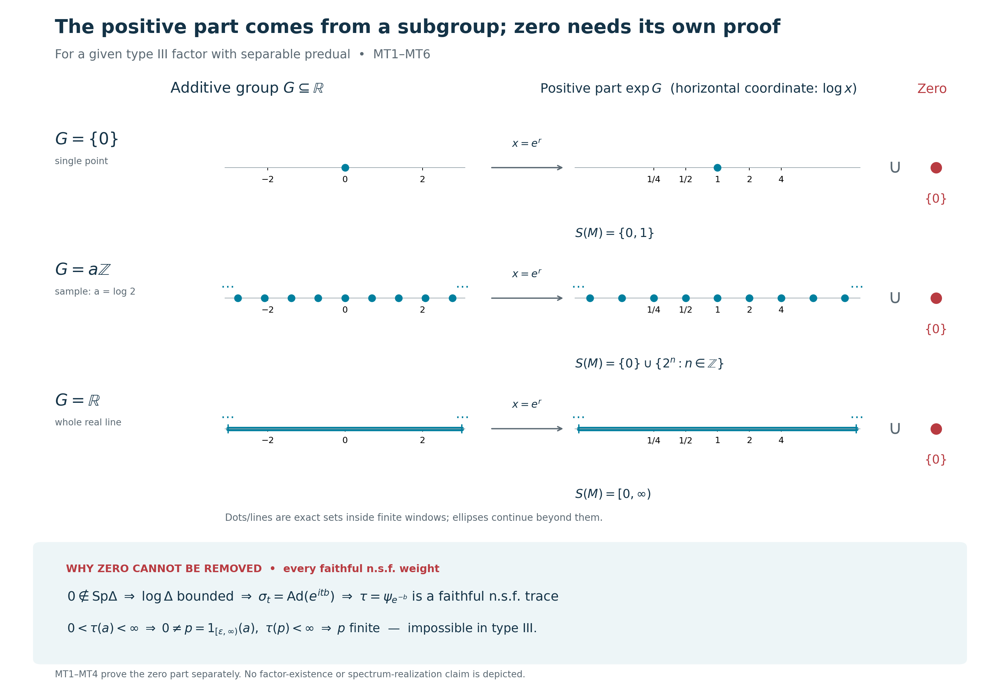

# Zero in every modular spectrum and the type III spectral trichotomy

*Fresh consequence proof, GPT-6 Astra (OpenAI), Ultra, 2026-10-04. Original exposition and reproducible illustration: CC0-1.0 to the extent of rights held.*

Let \(M\ne0\) be a von Neumann algebra. Type III means that \(M\) has no nonzero finite projection. A projection \(p\) is finite if \(q\le p,\ q\sim p\) implies \(q=p\), where equivalence is implemented by a partial isometry in \(M\). All Hilbert spaces below are arbitrary.

We first prove that every faithful normal semifinite weight \(\psi\) on a type III algebra has

\[
0\in\operatorname{Sp}(\Delta_\psi).
\tag{MT1}
\]
For a type III factor with separable predual, this determines the missing zero part of the all-weight invariant

\[
S(M)=\bigcap_{\psi\ {\rm faithful\ n.s.f.}}\operatorname{Sp}(\Delta_\psi).
\tag{MT2}
\]
Combining it with the already proved positive spectral comparison will give exactly the three possible **forms**

\[
\{0,1\},\qquad
\{0\}\cup\{\lambda^n:n\in\mathbb Z\}\quad(0<\lambda<1),\qquad
[0,\infty).
\tag{MT3}
\]
This is a necessary trichotomy for each given factor. It is neither an existence theorem for any of these classes nor a classification up to isomorphism.

The actual complete earlier inputs are [CI-3](OA-FLOW-CI.md#oa-flow.ci.3), [SF, SB-4–6 and SF-1](OA-FLOW-SF.md#oa-flow.sf.sb4), MW-4, ST-2, the **already bounded** star-derivation construction in L35, Sections 2–6, [CZ-1 and CZ-4](OA-FLOW-CZ.md#oa-flow.cz.1), [KT-5](OA-FLOW-KT.md#oa-flow.kt.5), [GW-1/4](OA-FLOW-GW.md#oa-flow.gw.1), [CP-4–6](OA-FLOW-CP.md#oa-flow.cp.4), and the scalar completeness/order arguments in CF. In particular L34 automatic boundedness is not a premise.

We also use the actual complete [CS-0–4](OA-FLOW-CS.md) closed additive subgroup proof and [MG-0–4](OA-FLOW-MG.md), including its full self-adjoint spectral-support proof and its all-faithful-weight comparison at the stated type III/separable-predual scope. The GNS norm fact for a positive functional is [GNS Theorem 4.1](OA-FLOW-GNS.md#gns-theorem-4-1). Exact body and range hashes accompany this chapter.

The free primary context is [Connes, *Une classification des facteurs de type III* (1973), Definition 3.1.1 and Lemma 3.1.2, printed p.188, and Theorem 3.2.1/Corollary 3.2.3, printed pp.190–191](https://www.numdam.org/item/10.24033/asens.1247.pdf), together with the bounded implementer construction in [Olesen, *Derivations of AW\*-algebras are inner* (1974), printed pp.557–560](https://msp.org/pjm/1974/53-2/pjm-v53-n2-p23-s.pdf). Connes's external innerness and trace-conversion citations are replaced here by the actual local L35/CZ/KT proofs. None of those cited external bodies is a premise.

## MT-1. An invertible modular operator and its reciprocal have full bounded domains

Let \(\psi\) be a faithful n.s.f. weight, with full GNS data \((H_\psi,\pi_\psi,\Lambda_\psi,S_\psi,J_\psi,\Delta_\psi)\). The finite-star involution is the closed one proved in WR/CI, and

\[
\Delta_\psi\ge0,\quad \ker\Delta_\psi=0,\quad J_\psi^2=I,\qquad
J_\psi\Delta_\psi J_\psi=\Delta_\psi^{-1}
\tag{MT4}
\]
holds with equality of the complete spectral domains, by [CI-3](OA-FLOW-CI.md#oa-flow.ci.3). The representation is faithful and normal by MW-4; it is isometric and has von Neumann range with normal inverse by ST-2.

Suppose \(0\notin\operatorname{Sp}(\Delta_\psi)\). The spectrum of a positive self-adjoint operator is closed and lies in \([0,\infty)\). The exact resolvent and spectral-projection arguments are proved in [MG-1](OA-FLOW-MG.md#oa-flow.mg.1): a real resolvent neighborhood has zero spectral projection, and the spectral measure is concentrated on the operator spectrum. Hence some \(0<c<1\) has

\[
E_{\Delta_\psi}([0,c))=0.
\tag{MT5}
\]
The reciprocal spectral function is bounded by \(c^{-1}\) on that support. SF's squared-integral domain rule therefore makes \(\Delta_\psi^{-1}\) an everywhere-defined bounded positive operator, of norm at most \(c^{-1}\). Its products with \(\Delta_\psi\) are the identities on their full respective domains; this is the actual reciprocal operator in ([MT4](OA-FLOW-MT.md#equation-mt4)).

Conjugate that equality by the antiunitary involution \(J_\psi\). Its domain equality says

\[
D(\Delta_\psi)=J_\psi D(\Delta_\psi^{-1})=H_\psi,\qquad
\Delta_\psi=J_\psi\Delta_\psi^{-1}J_\psi.
\tag{MT6}
\]
Thus \(\Delta_\psi\) is bounded too, with the same norm bound. Together with ([MT5](OA-FLOW-MT.md#equation-mt5)), the full bounded spectral calculus gives

\[
cI\le\Delta_\psi\le c^{-1}I,\qquad
L=\log\Delta_\psi=L^*\in B(H_\psi),\qquad
\|L\|\le|\log c|.
\tag{MT7}
\]
The logarithm has domain all of \(H_\psi\); \(\Delta_\psi^{it}=e^{itL}\) follows from composition in the same spectral calculus. In particular this step uses the reciprocal **domain equality**, not a formal cancellation of unbounded products.

## MT-2. A bounded logarithm supplies an already bounded inner derivation

Write \(\pi=\pi_\psi\). MW-4 gives on the entire algebra

\[
\pi(\sigma_t^\psi(x))=e^{itL}\pi(x)e^{-itL}.
\tag{MT8}
\]
The norm-convergent exponential series and its remainder after the linear term show, uniformly for \(\|x\|\le1\),

\[
\frac{\pi(\sigma_t^\psi(x))-\pi(x)}{t}
\longrightarrow i[L,\pi(x)]\qquad(t\to0)
\tag{MT9}
\]
in operator norm. Since \(\pi(M)\) is norm closed, the limit belongs to that algebra. Its isometric inverse defines a bounded complex-linear map \(d:M\to M\) with

\[
\pi(d(x))=i[L,\pi(x)],\qquad
\|d\|\le2\|L\|,\qquad
d(xy)=d(x)y+xd(y),\qquad d(x^*)=d(x)^*.
\tag{MT10}
\]
The commutator identities directly give the last two assertions. Thus no automatic boundedness result is needed.

For completeness the norm-differentiable group is its exponential. Differentiating the group law gives \((\sigma_t^\psi)'=\sigma_t^\psi d=d\sigma_t^\psi\). The norm derivative of \(e^{-td}\sigma_t^\psi\), computed by its convergent series and the product rule, is zero. The Banach-valued fundamental theorem in L35 Section 2 makes it constant and equal to \(I\) at zero. Therefore \(\sigma_t^\psi=e^{td}\).

Apply the actual already-bounded construction in L35 Sections 2–6 to \(d\). Its annihilator projections, norm sums and finite spectral-block transfer, followed by its complete diagonal-localization lemma, give \(b=b^*\in M\) with

\[
d(x)=i[b,x],\qquad \sigma_t^\psi(x)=e^{itb}xe^{-itb}.
\tag{MT11}
\]
For \(d=0\) take \(b=0\). For nonzero \(d\) that proof actually supplies \(0\le b\le\|d\|1\); we only need bounded selfadjointness. The inner group and \(\sigma^\psi\) have the same bounded generator and hence agree by the preceding uniqueness argument. Formula ([MT11](OA-FLOW-MT.md#equation-mt11)), applied to \(b\), gives \(\sigma_t^\psi(b)=b\), so \(b\) lies in the centralizer \(M_\psi\).

## MT-3. Remove the bounded implementer on the whole positive cone

Put \(h=e^{-b}\). Bounded spectral calculus and fixedness give

\[
h\in(M_\psi)_+,\qquad
e^{-\|b\|}1\le h\le e^{\|b\|}1.
\tag{MT12}
\]
Use CZ's actual bounded centralizer perturbation, on every positive element:

\[
\tau(a)=\psi(h^{1/2}ah^{1/2})\quad(a\in M_+).
\tag{MT13}
\]
Compression is a positive normal linear map, so this is an additive, positively homogeneous normal weight. The proved whole-cone parameter order in [CZ-1](OA-FLOW-CZ.md#oa-flow.cz.1) gives

\[
e^{-\|b\|}\psi\le\tau\le e^{\|b\|}\psi
\quad\hbox{on }M_+,
\tag{MT14}
\]
including infinite values. It follows that \(\tau\) is faithful and that its positive finite cone, finite left ideal, finite-star algebra and finite linear-extension domain agree with those of \(\psi\). Their weak-star density proves semifiniteness by [GW-4](OA-FLOW-GW.md#oa-flow.gw.4). No finite-total-mass assumption or hidden positive-cone restriction occurs.

[CZ-4](OA-FLOW-CZ.md#oa-flow.cz.4) gives the full modular group, with the sign determined by \(h=e^{-b}\):

\[
\sigma_t^\tau(x)=h^{it}\sigma_t^\psi(x)h^{-it}
=e^{-itb}(e^{itb}xe^{-itb})e^{itb}=x.
\tag{MT15}
\]
[KT-5](OA-FLOW-KT.md#oa-flow.kt.5) now yields the entire-positive-cone tracial identity

\[
\tau(x^*x)=\tau(xx^*)\qquad(x\in M),
\tag{MT16}
\]
including the case when both sides are infinite. Thus ([MT13](OA-FLOW-MT.md#equation-mt13)) is a genuine faithful normal semifinite trace. No assertion that the original \(\psi\) was a trace is made.

## MT-4. A faithful n.s.f. trace forces a nonzero finite projection

Suppose \(M\ne0\) has a faithful n.s.f. trace \(\tau\). [GW-4](OA-FLOW-GW.md#oa-flow.gw.4) makes \(N_\tau\) weak-star dense. Thus some \(x\in N_\tau\) is nonzero, and

\[
a=x^*x\ne0,\qquad a\in M_+,\qquad 0<\tau(a)<\infty.
\tag{MT17}
\]
The strict positivity is faithfulness. SF constructs the spectral projections of this bounded positive \(a\) inside \(M\). Since \(a\ne0\), one of

\[
p=1_{[\varepsilon,\infty)}(a),\qquad \varepsilon=1/n,\quad n\ge1,
\tag{MT18}
\]
is nonzero: these projections increase to the support of \(a\), which would be zero if all of them vanished. Pointwise scalar order and bounded calculus give \(\varepsilon p\le a\), and monotonicity and homogeneity of the weight imply

\[
0<\tau(p)\le\varepsilon^{-1}\tau(a)<\infty.
\tag{MT19}
\]

If \(q\le p\) and a partial isometry \(v\in M\) has \(v^*v=p,\ vv^*=q\), ([MT16](OA-FLOW-MT.md#equation-mt16)) gives \(\tau(p)=\tau(q)\). Additivity at the orthogonal decomposition \(p=q+(p-q)\), with the already proved finite value of \(\tau(p)\), forces \(\tau(p-q)=0\). Faithfulness yields \(q=p\). This proves that \(p\) is finite in the projection sense, rather than inferring finiteness merely from a chosen trace's total mass.

Apply this to the trace constructed in [MT-3](OA-FLOW-MT.md#oa-flow.mt.3). In a type III algebra the resulting nonzero finite projection is impossible. Consequently the supposition in [MT-1](OA-FLOW-MT.md#oa-flow.mt.1) was false, and ([MT1](OA-FLOW-MT.md#equation-mt1)) holds for **every** faithful n.s.f. weight on every nonzero type III algebra. This conclusion needs neither factoriality nor separable predual, provided such a weight is given.

## MT-5. Nonemptiness and the elementary closed-subgroup alternatives

Now let \(M\ne0\) be a type III factor with separable predual. Its normal-state set is nonempty: any unit vector in a nonzero concrete representation gives one, by [CP-4](OA-FLOW-CP.md#oa-flow.cp.4). This set, as a subset of the separable metric space \(M_*\), has a finite or countable norm-dense sequence \((\rho_n)_{n\ge1}\), with repetitions if necessary. Indeed take a countable metric base and one state from each base set meeting the state set. The norm series

\[
\theta=\sum_{n\ge1}2^{-n}\rho_n
\tag{MT20}
\]
converges in the concrete Banach predual by [CP-6](OA-FLOW-CP.md#oa-flow.cp.6) and is a positive normal functional with \(\theta(1)=1\). If \(a\ge0\) and \(\theta(a)=0\), positivity makes every \(\rho_n(a)=0\). Norm density implies the same for every normal state. Vector states separate positive concrete operators, so \(a=0\). Hence \(\theta\) is faithful. Its finite ideal is all of \(M\), so it is semifinite. Thus the intersection ([MT2](OA-FLOW-MT.md#equation-mt2)) is over a nonempty class.

The actual [CS-0](OA-FLOW-CS.md#oa-flow.cs.0)–4 proof makes

\[
G=\Gamma(\sigma^\theta)
=\bigcap_{0\ne p\in\operatorname{Proj}(M_\theta)}
       \operatorname{Sp}((\sigma^\theta)^p)
\tag{MT21}
\]
a closed additive subgroup of \(\mathbb R\), using the positive characters \(e^{itr}\). We prove its possible scalar forms rather than import a subgroup-classification theorem.

If \(G\) has no positive element, symmetry makes \(G=\{0\}\). Otherwise let

\[
a=\inf(G\cap(0,\infty))\ge0.
\tag{MT22}
\]
If \(a=0\), for each \(n\) choose \(g_n\in G\) with \(0<g_n<1/n\). For any real \(r\), the Archimedean property supplies an integer \(k_n\) with
\(k_ng_n\le r<(k_n+1)g_n\).
Thus \(k_ng_n\to r\). Integer multiples belong to \(G\), and closedness gives \(r\in G\). Therefore \(G=\mathbb R\).

If \(a>0\), the definition of infimum supplies \(g_n\in G\) with \(a\le g_n

\[
G=\{0\},\qquad G=a\mathbb Z\ (a>0),\qquad\hbox{or}\qquad G=\mathbb R.
\tag{MT23}
\]

## MT-6. Reassemble the zero and positive parts without a realization theorem

[MG-4](OA-FLOW-MG.md#oa-flow.mg.4), with its actual all-weight balanced comparison and full corner graph transport, applies to this given type III factor and gives

\[
S(M)\cap(0,\infty)=\exp G.
\tag{MT24}
\]
Every modular operator is positive, so the intersection has no negative or nonreal point. [MT-4](OA-FLOW-MT.md#oa-flow.mt.4) puts zero in every one of those complete spectra. Consequently

\[
S(M)=\{0\}\cup\exp G.
\tag{MT25}
\]

If \(G=\{0\}\), this is \(\{0,1\}\). If \(G=a\mathbb Z\), put \(\lambda=e^{-a}\in(0,1)\). Since \(-\mathbb Z=\mathbb Z\),

\[
\exp(a\mathbb Z)=\{\lambda^n:n\in\mathbb Z\}.
\tag{MT26}
\]
The positive generator \(a\), equivalently \(\lambda\in(0,1)\), is uniquely determined. If \(G=\mathbb R\), its exponential is \((0,\infty)\), giving \([0,\infty)\). The three forms in ([MT3](OA-FLOW-MT.md#equation-mt3)) are mutually exclusive by their logarithms: the positive part has respectively one point, a nonzero discrete additive logarithm, or the whole real logarithm.

Zero in ([MT25](OA-FLOW-MT.md#equation-mt25)) is not obtained by taking the exponential of a formal point \(-\infty\). It was proved separately for each weight. In the discrete case it is also the accumulation point of \(\lambda^n\) as \(n\to+\infty\); in the singleton case it is isolated in the invariant \(S(M)\), even though every individual modular operator is injective.

**Exercise.** Why does \(\ker\Delta_\psi=0\) not contradict ([MT1](OA-FLOW-MT.md#equation-mt1))? **Solution.** Injectivity is \(E_{\Delta_\psi}(\{0\})=0\). The operator-spectrum assertion means that no bounded everywhere-defined inverse exists. Zero may have no eigenvector while every neighborhood of zero has nonzero spectral projection, by the complete spectral-support proof in [MG-1](OA-FLOW-MG.md#oa-flow.mg.1).

**Exercise.** Does \(S(M)=\{0\}\cup\lambda^\mathbb Z\) itself produce a weight whose complete modular spectrum equals that set or whose modular group has a specified period? **Solution.** No such realization is constructed here. An intersection of spectra is not automatically attained by one member. This chapter proves ([MT25](OA-FLOW-MT.md#equation-mt25)) and the elementary possibilities for its positive logarithm. A periodic-weight or classification theorem needs its own complete proof.

This establishes the zero part at arbitrary-type-III/given-faithful-weight scope and the exact all-weight trichotomy at separable-predual factor scope. All weights and complete domains retain their stated generality. Factor existence, realization of any prescribed subgroup, periodicity and isomorphism classification remain separate statements.

### The zero part and the three logarithmic possibilities

This original diagram illustrates [MT1–MT6](OA-FLOW-MT.md#mt-1) for a **given** nonzero type III factor with separable predual. It is a diagram of sets and proved implications, not a construction or picture of a type III factor.

Each left axis has coordinate \(r\in\mathbb R\). Each right axis has coordinate \(\log x\) for \(x>0\), although its tick labels show \(x\) itself. The corresponding points therefore occupy the same horizontal positions under \(x=e^r\). The right-hand ticks \(1/4,1/2,1,2,4\) are at \(-\log4,-\log2,0,\log2,\log4\), respectively. Zero has no logarithmic coordinate; its included point is shown in solid red separately, joined by a set-union symbol.

The first row is exactly \(G=\{0\}\), with \(\exp G=\{1\}\) and \(S(M)=\{0,1\}\). The single blue dot does not depict zero in the right coordinate: it depicts \(x=1\).

The second row illustrates the discrete form with the explicit parameter \(a=\log2\), equivalently \(\lambda=e^{-a}=1/2\). The displayed indices are \(n=-4,\ldots,4\). Their additive coordinates are \(n\log2\), and their multiplicative values are
\[
1/16,\ 1/8,\ 1/4,\ 1/2,\ 1,\ 2,\ 4,\ 8,\ 16.
\]
The entire sets are \((\log2)\mathbb Z\) and \(2^\mathbb Z=(1/2)^\mathbb Z\); the equality follows by replacing \(n\) by \(-n\). Ellipses mark the omitted members outside the finite plotting window \([-3.1,3.1]\) in logarithmic coordinate. The added zero is the limit of \(2^n\) as \(n\to-\infty\), but its membership in the all-weight intersection was already proved independently in [MT1](OA-FLOW-MT.md#oa-flow.mt.1)–[MT4](OA-FLOW-MT.md#oa-flow.mt.4). A chosen sample parameter does not assert that a factor realizing it has been constructed here.

The third row shows the full subgroup \(G=\mathbb R\). Its positive image is \((0,\infty)\), and adjoining zero gives \([0,\infty)\). The solid lines, with continuation marks, represent the entire continuous sets; they are not numerical samples or a claim that the plotted finite segment is the full set.

The lower box is the separate zero-spectrum proof. If zero were outside one complete modular spectrum, CI's full-domain identity \(J\Delta J=\Delta^{-1}\), together with SF, would make both reciprocal operators bounded and force \(\log\Delta\) to be bounded. The modular action then has the explicitly bounded star derivation \(d\), with \(\|d\|\le2\|\log\Delta\|\). L35's already-bounded construction gives a bounded selfadjoint \(b\in M_\psi\). The exact perturbation \(\tau=\psi_{e^{-b}}\), with **negative** sign in the exponential, has the identity modular group by [CZ4](OA-FLOW-CZ.md#oa-flow.cz.4) and is a faithful n.s.f. trace by [KT5](OA-FLOW-KT.md#oa-flow.kt.5).

Semifiniteness supplies a bounded \(a\ge0\) with \(0<\tau(a)<\infty\). Some spectral projection \(p=1_{[\varepsilon,\infty)}(a)\) is nonzero, and \(\tau(p)\le\varepsilon^{-1}\tau(a)<\infty\). If \(v^*v=p,\ vv^*=q\le p\), the trace identity gives equal **finite** values at \(p,q\). Additivity and faithfulness then give \(q=p\). Thus \(p\) is finite in the Murray–von Neumann projection sense, contradicting type III. The inference from finite trace value to projection finiteness is justified here specifically by the trace identity and faithfulness; no such inference is made for an arbitrary weight.

The scalar alternatives in the top rows are proved completely in [MT5](OA-FLOW-MT.md#mt-5): a nonzero closed subgroup either has positive infimum \(a\) of its positive elements and equals \(a\mathbb Z\), or that infimum is zero and integer multiples of arbitrarily small positive members approximate every real number. [MT6](OA-FLOW-MT.md#mt-6) then uses the exact local CS/MG comparison to obtain \(S(M)=\{0\}\cup\exp G\).

Free primary context actually read: [Connes (1973), printed p.188 and pp.190–191](https://www.numdam.org/item/10.24033/asens.1247.pdf), and [Olesen (1974), printed pp.557–560](https://msp.org/pjm/1974/53-2/pjm-v53-n2-p23-s.pdf). These identify the historical context; the full local proofs and their exact earlier inputs are retained alongside the diagram. No source image is incorporated into this original figure.

Reproduce with [../assets/modular-trichotomy/render_modular_trichotomy.py](../assets/modular-trichotomy/render_modular_trichotomy.py). Exact parameters are retained in [../assets/modular-trichotomy/FIGURE_DATA.json](../assets/modular-trichotomy/FIGURE_DATA.json). PNG dimensions are 2880×1980; the SVG is scalable. A fixed SVG hash salt, absent date metadata and explicit UTF-8/LF text output make repeated local rendering deterministic. DejaVu font terms are retained in ../assets/modular-trichotomy/FONT-LICENSE.txt. This illustration's scope excludes factor existence, converse realization, period existence and isomorphism classification.
