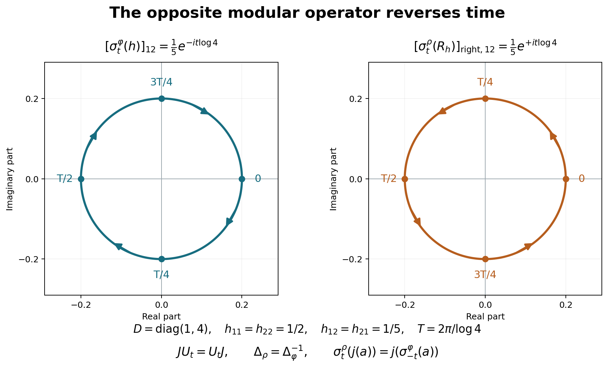

# Modular covariance and the canonical opposite weight

*Fresh consequence proof, GPT-6 Astra (OpenAI), Ultra, 2026-10-04. CC0-1.0 to the extent of rights held.*

The precise modular premise is the actual [MF-06 proof, Sections 1–6, especially equations 28–30 and the whole bounded-vector argument in Section 6](OA-FLOW-MF06.md#oa-flow.mf06.8). Its earlier inputs are rebound as follows: [CI](OA-FLOW-CI.md#oa-flow.ci.1) for closed involutions and exact polar domains; [HA-R](OA-FLOW-HA-R.md#oa-flow.ha-r.1) for multipliers, polar cutoffs and complete dual algebras; [BD](OA-FLOW-BD.md#oa-flow.bd.5) for bounded density; [WH-04 Sections 2–4](OA-FLOW-WH04.md#oa-flow.wh04.2) for fullification and mixed products; [SF, SB-0–6](OA-FLOW-SF.md#oa-flow.sf.sf0) for spectral operations; and the completely reconstructed [MF scalar bridge](OA-FLOW-MF-SB.md#oa-flow.mf-sb.1), with its scalar interchange input supplied by fresh CF/SC/FF, for the kernel and continuous-integrable Fourier uniqueness. The old labels printed in the MF source table do not import the old provider bodies.

The new weight inputs are [WF-1–6](OA-FLOW-WF.md#oa-flow.wf.1), [EW](OA-FLOW-EW.md#ew-1), [WR-1–7](OA-FLOW-WR.md#wr-1), and [ST-2](OA-FLOW-ST12.md#oa-flow.st.2), with its concrete predual bound to [CP01–06](OA-FLOW-CP.md#oa-flow.cp.1). MF-06's old arbitrary-weight application in Section 7 is not used as a premise. The free human context for weight covariance is [Combes, Theorem 2.11, printed pp.53–55](https://www.numdam.org/item/CM_1971__23_1_49_0.pdf#page=6). Every consequence below is deduced from the displayed local proofs.

Actual earlier proof ranges: [OA-FLOW.MF06.1](OA-FLOW-MF06.md#oa-flow.mf06.1), [OA-FLOW.MF06.2](OA-FLOW-MF06.md#oa-flow.mf06.2), [OA-FLOW.MF06.3](OA-FLOW-MF06.md#oa-flow.mf06.3), [OA-FLOW.MF06.4](OA-FLOW-MF06.md#oa-flow.mf06.4), [OA-FLOW.MF06.5](OA-FLOW-MF06.md#oa-flow.mf06.5), [OA-FLOW.MF06.6](OA-FLOW-MF06.md#oa-flow.mf06.6), [OA-FLOW.MF06.7](OA-FLOW-MF06.md#oa-flow.mf06.7), [OA-FLOW.MF06.8](OA-FLOW-MF06.md#oa-flow.mf06.8), [OA-FLOW.WF.1](OA-FLOW-WF.md#oa-flow.wf.1), [OA-FLOW.WF.2](OA-FLOW-WF.md#oa-flow.wf.2), [OA-FLOW.WF.3](OA-FLOW-WF.md#oa-flow.wf.3), [OA-FLOW.WF.4](OA-FLOW-WF.md#oa-flow.wf.4), [OA-FLOW.WF.5](OA-FLOW-WF.md#oa-flow.wf.5), [OA-FLOW.WF.6](OA-FLOW-WF.md#oa-flow.wf.6), [OA-FLOW.EW.1](OA-FLOW-EW.md#ew-1), [OA-FLOW.EW.2](OA-FLOW-EW.md#ew-2), [OA-FLOW.EW.3](OA-FLOW-EW.md#ew-3), [OA-FLOW.EW.4](OA-FLOW-EW.md#ew-4), [OA-FLOW.EW.5](OA-FLOW-EW.md#ew-5), [OA-FLOW.WR.1](OA-FLOW-WR.md#wr-1), [OA-FLOW.WR.2](OA-FLOW-WR.md#wr-2), [OA-FLOW.WR.3](OA-FLOW-WR.md#wr-3), [OA-FLOW.WR.4](OA-FLOW-WR.md#wr-4), [OA-FLOW.WR.5](OA-FLOW-WR.md#wr-5), [OA-FLOW.WR.6](OA-FLOW-WR.md#wr-6), [OA-FLOW.WR.7](OA-FLOW-WR.md#wr-7), [OA-FLOW.ST.2](OA-FLOW-ST12.md#oa-flow.st.2), [OA-FLOW.CP.1](OA-FLOW-CP.md#oa-flow.cp.1), [OA-FLOW.CP.2](OA-FLOW-CP.md#oa-flow.cp.2), [OA-FLOW.CP.3](OA-FLOW-CP.md#oa-flow.cp.3), [OA-FLOW.CP.4](OA-FLOW-CP.md#oa-flow.cp.4), [OA-FLOW.CP.5](OA-FLOW-CP.md#oa-flow.cp.5), [OA-FLOW.CP.6](OA-FLOW-CP.md#oa-flow.cp.6), [OA-FLOW.CI.1](OA-FLOW-CI.md#oa-flow.ci.1), [OA-FLOW.CI.2](OA-FLOW-CI.md#oa-flow.ci.2), [OA-FLOW.CI.3](OA-FLOW-CI.md#oa-flow.ci.3), [OA-FLOW.HA-R.1](OA-FLOW-HA-R.md#oa-flow.ha-r.1), [OA-FLOW.HA-R.2](OA-FLOW-HA-R.md#oa-flow.ha-r.2), [OA-FLOW.HA-R.3](OA-FLOW-HA-R.md#oa-flow.ha-r.3), [OA-FLOW.HA-R.4](OA-FLOW-HA-R.md#oa-flow.ha-r.4), [OA-FLOW.HA-R.5](OA-FLOW-HA-R.md#oa-flow.ha-r.5), [OA-FLOW.HA-R.6](OA-FLOW-HA-R.md#oa-flow.ha-r.6), [OA-FLOW.HA-R.7](OA-FLOW-HA-R.md#oa-flow.ha-r.7), [OA-FLOW.WH04.2](OA-FLOW-WH04.md#oa-flow.wh04.2), [OA-FLOW.WH04.3](OA-FLOW-WH04.md#oa-flow.wh04.3), [OA-FLOW.WH04.4](OA-FLOW-WH04.md#oa-flow.wh04.4), [OA-FLOW.SF.SF0](OA-FLOW-SF.md#oa-flow.sf.sf0), [OA-FLOW.SF.SB0](OA-FLOW-SF.md#oa-flow.sf.sb0), [OA-FLOW.SF.SB1](OA-FLOW-SF.md#oa-flow.sf.sb1), [OA-FLOW.SF.SB2](OA-FLOW-SF.md#oa-flow.sf.sb2), [OA-FLOW.SF.SB3](OA-FLOW-SF.md#oa-flow.sf.sb3), [OA-FLOW.SF.SB4](OA-FLOW-SF.md#oa-flow.sf.sb4), [OA-FLOW.SF.SB5](OA-FLOW-SF.md#oa-flow.sf.sb5), [OA-FLOW.SF.SB6](OA-FLOW-SF.md#oa-flow.sf.sb6), [OA-FLOW.MF-SB.1](OA-FLOW-MF-SB.md#oa-flow.mf-sb.1), [OA-FLOW.MF-SB.2](OA-FLOW-MF-SB.md#oa-flow.mf-sb.2), [OA-FLOW.MF-SB.3](OA-FLOW-MF-SB.md#oa-flow.mf-sb.3), [OA-FLOW.MF-SB.4](OA-FLOW-MF-SB.md#oa-flow.mf-sb.4), [OA-FLOW.MF-SB.5](OA-FLOW-MF-SB.md#oa-flow.mf-sb.5).

## MW-1. Modular conjugation on every bounded vector

Start with a full left Hilbert algebra \(\mathcal A\subset H\), its full right algebra \(\mathcal D\), and \(P=\lambda(\mathcal A)''\), \(P'=R(\mathcal D)''\). Let \(S=J\Delta^{1/2}\), \(F=J\Delta^{-1/2}\), and \(U_t=\Delta^{it}\). The actual MF proof gives
\[
J\mathcal A=\mathcal D,\quad J\mathcal D=\mathcal A,\quad JPJ=P',
\qquad
R_{Ja}=J\lambda_aJ\ (a\in\mathcal A),\quad
\lambda_{Jd}=JR_dJ\ (d\in\mathcal D).
\tag{MW1}
\]
Its Section 6 also gives \(U_tB_l=B_l\), \(U_tB_r=B_r\), with the corresponding conjugation of all bounded multipliers. We now extend the \(J\) identities in (MW1) to the entire bounded-vector spaces, rather than infer that extension from the involution-domain part.

If \(\xi\in B_l\) and \(a\in\mathcal A\), the mixed-product identity gives
\[
\lambda_aJ\xi
=JR_{Ja}\xi
=J\lambda_\xi(Ja)
=(J\lambda_\xi J)a.
\tag{MW2}
\]
The right side has norm at most \(\|\lambda_\xi\|\|a\|\). Hence \(J\xi\in B_r\), and its bounded multiplier is
\(R_{J\xi}=J\lambda_\xi J\).
Conversely, for \(\eta\in B_r,d\in\mathcal D\),
\[
R_dJ\eta
=J\lambda_{Jd}\eta
=JR_\eta(Jd)
=(JR_\eta J)d.
\tag{MW3}
\]
Thus \(J\eta\in B_l\) and \(\lambda_{J\eta}=JR_\eta J\). Since \(J^2=I\), these prove
\[
JB_l=B_r,\qquad JB_r=B_l
\tag{MW4}
\]
with the exact multiplier identities on those whole spaces. No unbounded product or extra involution-domain assumption occurs in (MW2)–(MW4).

## MW-2. Equality of the two canonical weights through \(J\)

Let \(\Phi\) be WF's canonical weight on \(P\), and \(\rho\) the canonical weight on \(P'\) from the right algebra, as in [WR-6](OA-FLOW-WR.md#wr-6). Write \(I_l,I_r\) for their full finite ideals and \(\theta_l,\theta_r\) for their vector maps. The map
\[
j:P\longrightarrow P',\qquad j(a)=JaJ
\]
is a conjugate-linear multiplicative \*-isomorphism with inverse of the same form; on positive elements it preserves order. It is not being described as a complex-linear homomorphism. The complex-linear \*-anti-isomorphism is \(a\mapsto Ja^*J\), whose restriction to positive elements is the same.

Equations (MW2)–(MW4) give
\[
j(I_l)=I_r,\qquad
\theta_r(j(a))=J\theta_l(a)\quad(a\in I_l).
\tag{MW5}
\]
For \(a\in P_+\), positivity and uniqueness of positive square roots give \(j(a)^{1/2}=j(a^{1/2})\). Therefore
\[
\begin{split}
\Phi(a)<\infty
&\ \Longleftrightarrow\ a^{1/2}\in I_l\\
&\ \Longleftrightarrow\ j(a)^{1/2}\in I_r
\ \Longleftrightarrow\ \rho(j(a))<\infty.
\end{split}
\]
In that case WF and (MW5) imply
\[
\rho(j(a))=\|\theta_r(j(a^{1/2}))\|^2
=\|J\theta_l(a^{1/2})\|^2=\Phi(a).
\tag{MW6}
\]
Otherwise both values are infinite. Hence \(\rho(b)=\Phi(JbJ)\) for every \(b\in(P')_+\), with no finiteness restriction.

## MW-3. Covariance of the weights and their full finite ideals

MF's whole-vector covariance gives
\[
U_t I_l U_{-t}=I_l,\quad
\theta_l(U_taU_{-t})=U_t\theta_l(a)\quad(a\in I_l).
\tag{MW7}
\]
Let \(\beta_t(a)=U_taU_{-t}\) on \(P\). MF gives normalization of \(P\), and unitary conjugation is an ultraweakly continuous \*-automorphism: its pullback on each concrete vector series replaces both vector sequences by \(U_{-t}\) applied to them. The group law follows from that of \(U_t\).

For \(a\geq0\) of finite \(\Phi\)-value, apply (MW7) to \(a^{1/2}\). Automorphisms preserve its positive square root, and unitarity gives
\[
\Phi(\beta_t(a))
=\|U_t\theta_l(a^{1/2})\|^2
=\Phi(a).
\tag{MW8}
\]
Using \(-t\) shows that finiteness holds in both directions; thus (MW8) also holds when \(\Phi(a)=\infty\). This proves invariance on the whole positive cone. It also proves the exact finite-ideal transport and GNS vector identity (MW7).

For the right algebra viewed as a left algebra with opposite product, the closed involution is \(F=S^*=J\Delta^{-1/2}\). CI's uniqueness of polar data identifies its modular operator as \(\Delta^{-1}\), with the same \(J\) and the full spectral domains. Its modular group on \(P'\) is therefore
\[
\gamma_t(b)=U_{-t}bU_t.
\tag{MW9}
\]
The right version of (MW7) with parameter \(-t\) proves \(\rho\circ\gamma_t=\rho\), including infinite values and full finite ideals. Since CI proves \(JU_t=U_tJ\), with the sign dictated by anti-linearity, (MW9) also gives
\[
\gamma_t(j(a))=j(\beta_{-t}(a)).
\tag{MW10}
\]
The minus sign comes from the reciprocal modular operator of the opposite algebra.

## MW-4. The arbitrary faithful normal semifinite weight

Now let \(\varphi\) be any faithful normal semifinite weight on a concrete von Neumann algebra \(M\). WR supplies its faithful normal GNS representation \(\pi:M\to P\), the full finite-star algebra and the exact identity \(\Phi\circ\pi=\varphi\). [ST-2](OA-FLOW-ST12.md#oa-flow.st.2) gives the ultraweakly continuous inverse of \(\pi\). Thus
\[
\sigma_t^\varphi(x)=\pi^{-1}(U_t\pi(x)U_{-t})
\tag{MW11}
\]
is a normal \*-automorphism group, and (MW7)–(MW8) become
\[
\sigma_t^\varphi(N)=N,\qquad
\Lambda(\sigma_t^\varphi(x))=U_t\Lambda(x)\ (x\in N),\qquad
\varphi\circ\sigma_t^\varphi=\varphi\text{ on }M_+.
\tag{MW12}
\]
It is pointwise \(\sigma\)-strong* continuous. Indeed strong continuity of \(U_t\) gives strong* continuity of \(U_t aU_{-t}\) for every fixed bounded \(a\). Its norm is constantly \(\|a\|\); [ST-2](OA-FLOW-ST12.md#oa-flow.st.2)'s explicit finite-sum and square-summable-tail estimate turns this into intrinsic \(\sigma\)-strong* continuity and transports it back through \(\pi^{-1}\). This argument concerns all real \(t\), arbitrary nets of parameters and every fixed \(x\in M\), not merely a dense algebra.

The canonical opposite weight on \(P'\) now has the precise formula
\[
\rho(b)=\varphi\!\left(\pi^{-1}(JbJ)\right)\quad(b\in(P')_+),
\qquad
\mathfrak n_\rho=J\pi(N)J.
\tag{MW13}
\]
The conjugate-linear rule
\[
\mathcal J\Lambda(x)=\Lambda_\rho(J\pi(x)J)\quad(x\in N)
\]
is isometric by (MW13), and its range is dense because the whole finite ideal on the right is \(J\pi(N)J\). It extends to an antiunitary \(H_\varphi\to H_\rho\). If \(U_\rho:H_\rho\to H_\varphi\) is WF's right GNS unitary, then (MW5) gives \(U_\rho\mathcal J=J\), on the whole Hilbert space.

Finally, for \(f\in M_*^+\) dominated by a finite multiple of \(\varphi\), use WR's \(t_f\in P'_+\) and canonical vector \(\alpha_f\). Put
\[
h_f=\pi^{-1}(Jt_fJ)\in M_+.
\]
Then (MW13) and WR15 give \(\varphi(h_f)=\rho(t_f)=\|f\|\). The square-root multiplier identity (MW3) gives
\[
J\alpha_f=\Lambda(h_f^{1/2}),\qquad
f(a)=\langle\pi(a)J\Lambda(h_f^{1/2}),J\Lambda(h_f^{1/2})\rangle.
\tag{MW14}
\]
In particular \(f\leq\varphi\) if and only if \(h_f\leq1\), by WR16 and order preservation of \(j,\pi\). This is the stated implementing-vector formula; no product formula such as \(\varphi(h_fa)\) is inferred for noncommuting \(h_f,a\).

## Boundary

These deductions prove the canonical opposite-weight formula through \(J\), both complete finite-ideal transports, the GNS antiunitary, modular covariance including infinite values, the opposite time-reversal sign, and the canonical implementing vectors, at the exact MF/WR/WF inputs. They do not prove KMS characterization or uniqueness, natural-cone standard-form axioms, arbitrary sum decompositions of normal weights, or general operator-valued weight statements. The proofs of the MF/WR/WF inputs are not given here.

## MW-5. The opposite modular time direction

This exact matrix example illustrates [MW-2–4, especially equations MW9–MW14](OA-FLOW-MW.md#mw-2). Its reproducible source is [render_modular_opposite.py](../assets/weight-recovery/render_modular_opposite.py). The two circles are trajectories of one complex matrix coefficient; neither is a picture of the full positive cone.

Let \(M=M_2(\mathbb C)\), \(D=\operatorname{diag}(1,4)\), and \(\varphi(a)=\operatorname{Tr}(Da)\). Realize the GNS Hilbert space as Hilbert–Schmidt matrices, with \(\Lambda(x)=xD^{1/2}\) and \(\pi(a)=L_a\), left multiplication. A direct adjoint computation gives
\[
S\xi=D^{-1/2}\xi^*D^{1/2},\quad
F\xi=D^{1/2}\xi^*D^{-1/2},\quad
\Delta\xi=D\xi D^{-1},\quad J\xi=\xi^*.
\]
All domains here are the entire finite-dimensional Hilbert space. The displayed positive \(\Delta\) and antiunitary \(J\) satisfy \(S=J\Delta^{1/2}\), so uniqueness in CI identifies the polar data. Hence
\[
U_t\xi=D^{it}\xi D^{-it},\qquad
\sigma_t^\varphi(a)=D^{it}aD^{-it},\qquad
j(L_a)=JL_aJ=R_{a^*}.
\]
Right multiplication means \(R_b\xi=\xi b\). Its products satisfy \(R_bR_c=R_{cb}\); the label “right coefficient” in the second panel refers to the matrix \(b\), not to entries of the superoperator \(R_b\). MW-2 and MW-3 give
\[
\rho(R_b)=\operatorname{Tr}(Db)\quad(b\geq0),\qquad
\sigma_t^\rho(R_b)=R_{D^{-it}bD^{it}}.
\]
These formulas can also be checked by multiplying \(U_{-t}R_bU_t\) on a Hilbert–Schmidt matrix.

Choose
\[
h=\begin{pmatrix}1/2&1/5\\1/5&1/2\end{pmatrix}.
\]
Its eigenvalues are \(7/10\) and \(3/10\), so \(h>0\). In the first panel the off-diagonal coefficient is \(e^{-it\log4}/5\); in the second it is \(e^{+it\log4}/5\). Both have radius \(1/5\), and their common period is \(T=2\pi/\log4\). Labels mark the exact times \(0,T/4,T/2,3T/4\); arrows show increasing time. Throughout these orbits,
\[
\varphi(\sigma_t^\varphi(h))
=\rho(\sigma_t^\rho(R_h))
=\frac52,
\]
because the two diagonal entries remain \(1/2\). The direction reversal is precisely \(\Delta_\rho=\Delta_\varphi^{-1}\), while \(JU_t=U_tJ\) still holds. With \(j(L_h)=R_h\), the equation \(\sigma_t^\rho(j(a))=j(\sigma_{-t}^\varphi(a))\) is verified entry by entry.

The preceding [polar-vector example](OA-FLOW-WR.md#wr-8) has this same \(h=C\): its functional density is \(B=D^{1/2}hD^{1/2}\), and its canonical implementing vector is \(J\Lambda(h^{1/2})=D^{1/2}h^{1/2}\), exactly MW14. Thus the two illustrations use consistent normalizations.

The full arbitrary-weight and infinite-value proof remains in MW and its exact earlier inputs. For human context see [Combes, Theorem 2.11, printed pp.53–55](https://www.numdam.org/item/CM_1971__23_1_49_0.pdf#page=6). This figure, source and example proof are CC0-1.0 to the extent of rights held.

[Editable SVG](../assets/weight-recovery/assets/modular-opposite-time.svg); [exact numerical data](../assets/weight-recovery/modular-opposite-figure-numerics.json).
