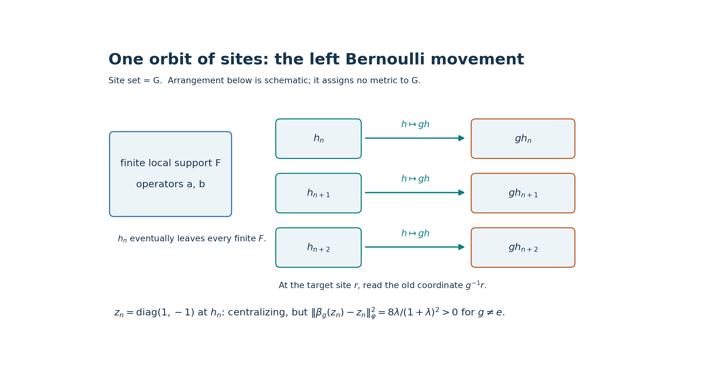
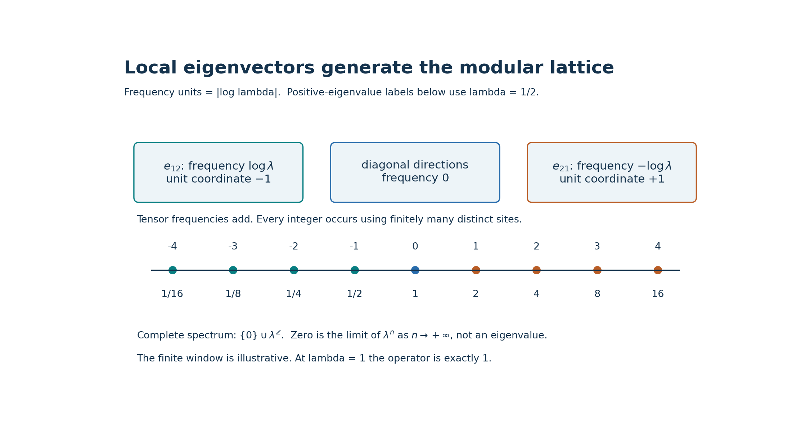
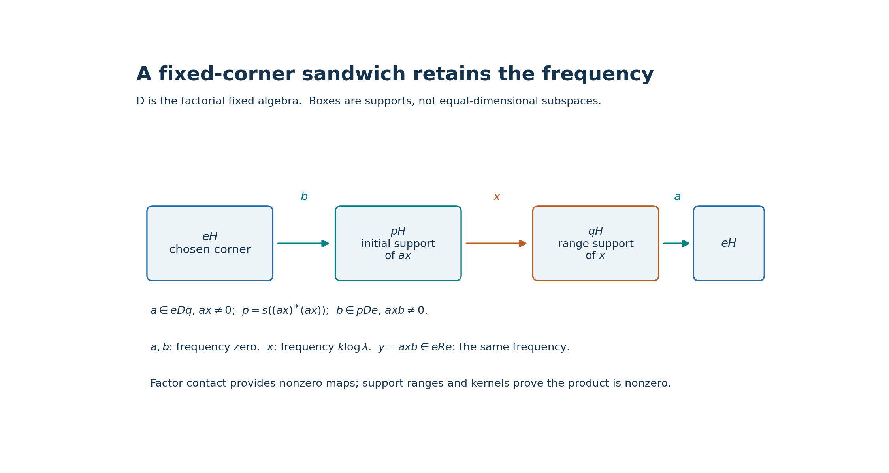

# Nontracial Bernoulli shifts on the original group of sites

*Original exposition, arguments, solved diagnostics and reproducible figures: CC0-1.0 to the extent of rights held. Existing mathematical sources, software and fonts retain their own terms.*

**Self-checked by the writing AI.**

An infinite supply of identical sites does two different jobs. A diagonal observable can escape every fixed finite set of sites while a nonidentity translation still moves it a definite distance. Off-diagonal observables supply every integral modular frequency. We prove that these frequencies survive every nonzero fixed corner, so the crossed product has the asserted subtype even for a nonamenable group.

## 1. The statement and the site convention

Let \(G\) be any countable infinite discrete group and let \(0<\lambda\le1\). Put
\[
 \rho=\frac1{1+\lambda}\begin{pmatrix}\lambda&0\\0&1\end{pmatrix},
 \qquad \omega(a)=\operatorname{Tr}(\rho a),\qquad a\in M_2(\mathbb C).
 \tag{NB1}
\]
Here \(\operatorname{Tr}\) is the ordinary, unnormalized matrix trace. The site set throughout this lesson is **\(G\) itself**. We will construct the represented infinite product \(P\), its faithful normal product state \(\varphi\), and the action \(\beta\) that moves an observable at site \(h\) to site \(gh\). We prove:

1. \(P\) is an AFD factor. For \(0<\lambda<1\), \(S(P)=\{0\}\cup\lambda^{\mathbb Z}\).
2. Every \(\beta_g\), \(g\ne e\), is outer and is not centrally trivial. Thus \(\beta^{-1}(\operatorname{Cnt}(P))=\{e\}\).
3. The countable crossed product \(M=P\rtimes_\beta G\) is a factor and has a supplied faithful normal state. For \(0<\lambda<1\), \(S(M)=\{0\}\cup\lambda^{\mathbb Z}\); both \(P\) and \(M\) are of type \(\mathrm{III}_\lambda\).
4. At \(\lambda=1\), the same original site-\(G\) construction makes both \(P\) and \(M\) factors of type \(\mathrm{II}_1\), with explicitly proved faithful normal traces.

We use “free action” in the operator-algebra sense that each nonidentity automorphism is outer. We make no AFD assertion about \(M\) for an arbitrary \(G\). No replacement of \(G\) by another site set is involved.

If \(a=\bigotimes_h a_h\) is a finite-support elementary tensor, the convention is
\[
 \beta_g(a)=\bigotimes_h a_{g^{-1}h},\qquad
 \beta_g\beta_k=\beta_{gk}.
 \tag{NB2}
\]
The inverse in the coordinate formula expresses **left movement of the occupied site**. Writing \(a_{gh}\) instead gives the opposite multiplication order. Section 12 compares this convention with the source exercise.

*Figure 1. The arrows move the occupied sites \(h\mapsto gh\); the target coordinate reads \(g^{-1}h\). The displayed finite set is a schematic of a finite support, not a geometry or ordering of \(G\). Outside that support the diagonal tail commutes with every local operator. A nonidentity \(g\) moves every individual site. The displacement is the exact number in (NB9), not a bound depending on the depicted distances. Proof: Sections 2 and 5. Reproducible data and figure terms: [TERMS](../assets/nontracial-bernoulli/TERMS.md).*

## 2. The faithful product representation and its finite-leg maps

At one site take the four-dimensional Hilbert space \(H_0=M_2(\mathbb C)\) with \(\langle X,Y\rangle=\operatorname{Tr}(Y^*X)\), linear in the first argument, and distinguished unit vector \(\Omega_0=\rho^{1/2}\). Left and right matrix multiplication are bounded, have the expected adjoints, and commute. Both orbits of \(\Omega_0\) span \(H_0\), because \(\rho^{1/2}\) is invertible.

Form the pointed tensor Hilbert space
\[
 H=\bigotimes_{h\in G}(H_0,\Omega_0),\qquad
 \Omega=\bigotimes_{h\in G}\Omega_0.
 \tag{NB3}
\]
Explicitly, tensor a finite number of vectors and use \(\Omega_0\) at the other sites, give these elementary tensors the product inner product, and complete their linear span. Choose an orthonormal basis of \(H_0\) beginning with \(\Omega_0\). The tensors with finitely many nonvacuum basis entries form an orthonormal basis of this completion: expansion at finitely many sites proves density and the product inner product proves orthonormality. This also gives a concrete separable model, without a tensor-product existence theorem.

For a finite \(F\subset G\), let \(A_F\cong\bigotimes_{h\in F}M_2\) act by left multiplication at its sites and identically elsewhere. Its norm is its finite-dimensional matrix norm: write the Hilbert space as \(H_F\otimes H_{G\setminus F}\), and use a unit vector in the second factor for the lower bound. Let \(\mathcal A=\bigcup_F A_F\) and \(P=\mathcal A''\). The finite-vector bicommutant proof, or its complete [bounded approximation proof in TRP Section 1](../../OA-FLOW/OA-FLOW-TRP.html#trp-setting), identifies \(P\) with the weak closure of \(\mathcal A\). That proof supplies uniformly bounded strong-star approximants when needed below; this is an earlier proved input, not an implicit unit-ball density assumption.

The local right algebras commute with \(P\), and their orbit of \(\Omega\) is dense. Thus \(\Omega\) is separating for \(P\): if \(X\Omega=0\), then \(Xb'\Omega=b'X\Omega=0\) for every local right operator \(b'\), so \(X=0\). The local left orbit is dense as well. Therefore
\[
 \varphi(X)=\langle X\Omega,\Omega\rangle
 \tag{NB4}
\]
is a faithful normal state on \(P\), agrees with the product of the states \(\omega\) on every \(A_F\), and realizes its own GNS space. Normality here is concrete vector normality; it follows immediately from the vector-series definition of the ultraweak topology. Faithfulness follows from separation and a positive square root.

We require a more precise approximation than weak density. Under \(H=H_F\otimes H_{G\setminus F}\), put \(J_F\xi=\xi\otimes\Omega_{G\setminus F}\). Compression \(J_F^*XJ_F\) belongs to the left copy of \(A_F\): this holds on a local tensor by applying the product state to its other legs and passes to the weak closure, since this finite-dimensional copy is weakly closed. Define \(E_F(X)\in A_F\) by this compression. It is a normal unital positive contraction, indeed completely positive: matrix compression preserves positivity at every finite matrix size. It is \(A_F\)-bimodular, \(\varphi\)-preserving, and equals partial evaluation by \(\omega\) on local tensors. All these assertions follow from compression and the tensor formula, then pass to the weak closure by normality.

Let \(Q_F=J_FJ_F^*\). The subspaces \(Q_FH\) increase to a dense subspace, so \(Q_F\to1\) strongly as \(F\) increases. We have
\[
 E_F(X)\Omega=Q_FX\Omega,\qquad E_F(X^*)=E_F(X)^*,
 \qquad \|E_F(X)\|\le\|X\|.
 \tag{NB5}
\]
For \(b\in A_K\) and \(F\supset K\), bimodularity gives
\(E_F(X)b\Omega=E_F(Xb)\Omega=Q_FXb\Omega\to Xb\Omega\).
The density of local \(b\Omega\) and the uniform bound extend this convergence to every vector. Apply the same argument to \(X^*\). Consequently \(E_F(X)\to X\) strongly-star. An enumeration of \(G\) gives an increasing sequence of finite \(F\)'s, and hence an increasing sequence of full matrix algebras with strongly dense union. This proves the AFD assertion about \(P\).

## 3. The complete modular operator, computed from its graph

At a site define \(J_0X=X^*\) and \(\Delta_0X=\rho X\rho^{-1}\). The first is antiunitary and the second is positive and invertible on the Hilbert space \(H_0\). On the left orbit of the vacuum,
\(J_0\Delta_0^{1/2}(a\rho^{1/2})=a^*\rho^{1/2}\).
The diagonal subspace of \(H_0\) has eigenvalue \(1\) for \(\Delta_0\); choose its orthonormal basis to contain \(\Omega_0\). The normalized off-diagonal vectors \(e_{12},e_{21}\) have eigenvalues \(\lambda,\lambda^{-1}\), respectively. Thus the tensor basis constructed in Section 2 is an eigenbasis. Write its eigenvalue as \(\lambda^{k(\nu)}\), where \(k(\nu)\) is the number of \(e_{12}\) entries minus the number of \(e_{21}\) entries.

Define on the whole tensor completion
\[
 \begin{aligned}
 D(\Delta^{s})&=\left\{\sum_\nu c_\nu v_\nu:
             \sum_\nu\lambda^{2s k(\nu)}|c_\nu|^2<\infty\right\},\\
 \Delta^s\sum_\nu c_\nu v_\nu&=\sum_\nu\lambda^{s k(\nu)}c_\nu v_\nu,
 \qquad J\bigotimes_h X_h=\bigotimes_h X_h^*.
 \end{aligned}
 \tag{NB6}
\]
The diagonal formula proves closedness, positivity for \(s=1\), selfadjointness and dense domains by square-sum truncation. For example, the adjoint domain of the positive diagonal operator is exactly the set on which its coefficient pairing is bounded, which is the displayed weighted square-sum domain. The same construction defines every real power and the unitary powers \(\Delta^{it}\). The tensor antiunitary extends from a dense subspace, is onto, and squares to one.

On every local \(a\Omega\), \(J\Delta^{1/2}a\Omega=a^*\Omega\). Finite tensor vectors form a graph core for \(J\Delta^{1/2}\): truncate their weighted square sums, and each finite selection of basis tensors lies in \(A_F\Omega\) for some \(F\). Conversely, for every \(X\in P\), (NB5) gives
\(E_F(X)\Omega\to X\Omega\) and \(E_F(X)^*\Omega\to X^*\Omega\).
Closedness therefore puts \(X\Omega\) in the domain and gives \(J\Delta^{1/2}X\Omega=X^*\Omega\). The closure of the full involution \(X\Omega\mapsto X^*\Omega\), \(X\in P\), is consequently exactly \(J\Delta^{1/2}\): one inclusion uses this closed extension, the other uses the local graph core. Its polar decomposition is precisely the displayed \(J,\Delta\). We have computed the actual modular operator, including its domain, rather than inferred it from a proposed KMS condition.

Conjugation by \(\Delta^{it}\) acts on a local leg as conjugation by \(\rho^{it}\). It normalizes \(\mathcal A\), hence \(P\), and fixes \(\Omega\). For \(0<\lambda<1\), the modular group and its period are therefore
\[
 \sigma_t^\varphi(a_h)=(\rho^{it}a\rho^{-it})_h,
 \qquad T=\frac{2\pi}{|\log\lambda|},\qquad \sigma_T^\varphi=\mathrm{id}.
 \tag{NB7}
\]
The implementing unitary group is strongly continuous by dominated convergence in the eigenbasis. This gives normal, pointwise strong-star continuous automorphisms on the full algebra. Compression \(E_F\) commutes with this group, because the vacuum and finite tensor subspace are fixed or reducing for the implementing operators.

Each integer \(k\) occurs: use \(k\) distinct \(e_{12}\) legs if \(k>0\), \(-k\) distinct \(e_{21}\) legs if \(k<0\), and the vacuum if \(k=0\). Infinitude of the original \(G\) is used here. For \(0<\lambda<1\), the complete operator spectrum is
\[
 \operatorname{Sp}(\Delta)=\{0\}\cup\lambda^{\mathbb Z}.
 \tag{NB8}
\]
Indeed each \(\lambda^k\) is an eigenvalue, and normalized eigenvectors with \(k\to+\infty\) make \(0\) an approximate spectral value. At a complex number outside the displayed closed subset of \([0,\infty)\), coefficientwise division by \(\lambda^k-z\) is bounded. Its range is in \(D(\Delta)\), since \(\lambda^k/(\lambda^k-z)\) is bounded; this proves both inverse identities and excludes every other spectral value. The eigenvalue \(0\) itself does not occur. Unboundedness above creates no extra finite spectral values. At \(\lambda=1\), all eigenvalues are instead \(1\), so \(\Delta=1\) and its spectrum is \(\{1\}\).

## 4. A factorial fixed algebra, using disjoint finite blocks

Put \(Q=P^{\sigma^\varphi}\). For every finite permutation \(\pi\) of the sites, there is a unitary \(u_\pi\) in the corresponding local matrix algebra that permutes the tensor factors of its defining finite-dimensional representation. It commutes with \(\rho^{\otimes F}\), because the site densities are identical. Thus \(u_\pi\in Q\), and \(\operatorname{Ad}(u_\pi)\) is the state-preserving site permutation on \(P\). The equality holds first on local tensors and then on the weak closure.

Suppose \(X\in Q'\cap P\). It is invariant under all these finite permutations. Choose \(a=E_F(X)\) with \(\|X-a\|_\varphi\) as small as desired, where \(\|Y\|_\varphi^2=\varphi(Y^*Y)\). Choose a finite permutation taking \(F\) to a disjoint finite set \(F'\). This is possible in every infinite \(G\), with no assumption about its group structure. Put \(b=\operatorname{Ad}(u_\pi)(a)\). Invariance of \(X\) and of the state gives \(\|X-b\|_\varphi=\|X-a\|_\varphi\). Product independence and state preservation by \(E_F\) give
\(\varphi(a^*b)=\overline{\varphi(a)}\varphi(b)=|\varphi(X)|^2\).
State Cauchy-Schwarz bounds its difference from \(\varphi(X^*X)\) by
\(\|X-a\|_\varphi\|b\|_\varphi+\|X\|_\varphi\|X-b\|_\varphi\), which tends to zero. Hence \(\|X-\varphi(X)1\|_\varphi=0\), and faithfulness proves \(X=\varphi(X)1\). We have proved
\[
 Q'\cap P=\mathbb C1.
\]
In particular both \(P\) and \(Q\) are factors. No assertion that a fixed algebra is automatically factorial is used.

For \(X\in Q\), \(\Delta^{it}X\Omega=X\Omega\). Expanding in the eigenbasis shows that \(X\Omega\) lies in the eigenvalue-one subspace, and hence \(X\Omega\in D(\Delta^{1/2})\) with \(\Delta^{1/2}X\Omega=X\Omega\). Section 3 and antiunitarity give \(\varphi(X^*X)=\varphi(XX^*)\). Applying this equality to \(X+zY\), \(z=1,i\), proves \(\varphi(XY)=\varphi(YX)\) for all \(X,Y\in Q\) after replacing one variable by its adjoint. Thus \(\varphi|_Q\) is a faithful normal tracial state. This trace is proved, rather than assumed from the terminology “centralizer.”

The fixed algebra also is the functional centralizer \(\{X:\varphi(XY)=\varphi(YX)\text{ for every }Y\in P\}\). For the forward direction use \(E_F\), which commutes with \(\sigma\): \(E_F(X)\) commutes with \(\rho_F\), so \(\varphi(E_F(X)E_F(Y))=\varphi(E_F(Y)E_F(X))\); bounded strong-star passage gives the desired equality. Conversely, a functional-centralizer \(X\) has \(E_F(X)\) in the finite-dimensional functional centralizer, hence commutes with \(\rho_F\). Therefore \(\sigma_t(E_F(X))=E_F(X)\), and the same bounded passage proves \(\sigma_t(X)=X\). In using this converse, bimodularity and state preservation test against every \(Y\in A_F\).

## 5. The action and an exact noncentral-triviality witness

The permutation of tensor sites \(h\mapsto gh\) defines a unitary \(V_g\) on \(H\), fixing \(\Omega\). It gives \(V_gV_k=V_{gk}\), commutes with \(J\) and \(\Delta\), and implements (NB2). Thus \(\beta_g=\operatorname{Ad}(V_g)|_P\) is a normal, state-preserving action, and it preserves \(Q\).

Enumerate pairwise distinct sites \(h_n\). They eventually escape every finite subset of \(G\). Let \(z_n\) be \(z=\operatorname{diag}(1,-1)\) at \(h_n\), and the identity elsewhere. Then \(z_n=z_n^*=z_n^{-1}\) and \(z_n\in Q\). Since \(gh_n\ne h_n\) for \(g\ne e\), product independence gives, for every \(n\),
\[
 \begin{aligned}
 m&=\varphi(z_n)=\frac{\lambda-1}{\lambda+1},\\
 \|\beta_g(z_n)-z_n\|_\varphi^2
   &=2-2m^2=\frac{8\lambda}{(1+\lambda)^2}>0
       \qquad(g\ne e).
 \end{aligned}
 \tag{NB9}
\]
The state is nontracial, so \(m\) is not zero. The adjoint seminorm has the same value because this difference is selfadjoint.

We check the definition involving the **whole predual**. Call a bounded sequence \(x_n\) centralizing when \(\|x_n\omega-\omega x_n\|\to0\) for every \(\omega\in P_*\), where the two module functionals evaluate \(Y\mapsto\omega(Yx_n)\) and \(Y\mapsto\omega(x_nY)\). If \(\xi=a\Omega,\eta=b\Omega\) with \(a,b\) local and \(h_n\) outside both supports, left multiplication by \(z_n\) agrees on \(\xi,\eta\) with right multiplication by \(z_n\). This follows from \(z\rho^{1/2}=\rho^{1/2}z\). The right operator is selfadjoint and commutes with every \(Y\in P\). Moving it across the coefficient pairing shows
\(\langle Yz_n\xi,\eta\rangle=\langle z_nY\xi,\eta\rangle\)
for all \(Y\), so the functional commutator is exactly zero for such a pair.

The complete [CP-01–06 predual proof](../../OA-FLOW/OA-FLOW-CP.html#oa-flow.cp.6) says that every normal functional is a restricted square-summable vector series and that its predual norm is its functional norm. Truncate such a series; Cauchy-Schwarz bounds the tail norm. Approximate its finitely many vectors by local \(a\Omega,b\Omega\); the elementary bound \(\|\omega_{\xi,\eta}-\omega_{\xi',\eta'}\|\le\|\xi-\xi'\|\|\eta\|+\|\xi'\|\|\eta-\eta'\|\) bounds the error. Commutation by a norm-one \(z_n\) changes that error by at most a factor two. The preceding exact vanishing then proves \(\|z_n\omega-\omega z_n\|\to0\) for every \(\omega\in P_*\). Thus \(z_n\) is centralizing at the precise predual definition.

It also asymptotically commutes strongly-star with every fixed \(u\in P\). Indeed \(z_n\) is in the functional centralizer, so right multiplication by \(z_n\) preserves \(\|\cdot\|_\varphi\). For a local \(a=E_F(u)\) and \(h_n\notin F\),
\[
 \|[u,z_n]\|_\varphi\le2\|u-a\|_\varphi.
 \tag{NB10}
\]
First make the right side small by increasing \(F\), then let \(n\) increase. Apply the argument to \(u^*\) for the adjoints. A uniformly bounded sequence \(Y_n\in P\) with \(Y_n\Omega\to0\) converges strongly to zero: on each local right vector \(b'\Omega\), \(Y_nb'\Omega=b'Y_n\Omega\to0\), and those vectors are dense. This proves the claimed strong-star convergence, not just one vector estimate.

An automorphism is centrally trivial if its displacement tends strongly-star to zero on every bounded predual-centralizing sequence. Equation (NB9) contradicts that requirement for every \(g\ne e\), whereas the identity plainly has it. It also proves outerness directly: if \(\beta_g=\operatorname{Ad}(u)\), then
\(\|\beta_g(z_n)-z_n\|_\varphi=\|[u,z_n]u^*\|_\varphi\to0\)
by strong convergence from (NB10), tested at the fixed vector \(u^*\Omega\). This contradicts (NB9). More strongly, no unitary of \(P\) can implement \(\beta_g\) **on \(Q\)**, because all the \(z_n\) belong to \(Q\). This stronger conclusion will remove every nonidentity Fourier coefficient below.

## 6. The regular crossed product, its right action and expectation

On \(K=\ell^2(G,H)\), define
\[
 (\pi(a)\xi)(t)=\beta_{t^{-1}}(a)\xi(t),\qquad
 (L_g\xi)(t)=\xi(g^{-1}t),\qquad
 M=(\pi(P)\cup L(G))''.
 \tag{NB11}
\]
These are bounded operators; \(\|\pi(a)\|=\|a\|\), \(L_g\) is unitary, and \(L_g\pi(a)L_g^*=\pi(\beta_g(a))\). Thus finite sums \(\sum_g\pi(a_g)L_g\) form a unital star algebra with product coefficient \(a_g\beta_g(b_h)\) at \(gh\), and adjoint coefficient \(\beta_{g^{-1}}(a_g^*)\) at \(g^{-1}\). The local-coefficient finite-sum algebra has the same bicommutant: (NB5) approximates each \(a\in P\), and its translates approximate \(\pi(a)\) strongly-star coordinatewise with a uniform bound; finite-coordinate truncation of an \(\ell^2\) vector controls the remaining tail. Thus \(\pi(\mathcal A)\) generates \(\pi(P)\). The bounded approximation proof cited in Section 2 applies to this local-coefficient algebra as well.

Put \(\Omega_c=\delta_e\otimes\Omega\). Its left orbit is dense: a monomial gives \(\beta_{g^{-1}}(a)\Omega\) at coordinate \(g\), and \(P\Omega\) is dense. For separation we provide commuting **bounded** right operators. If \(b\in P'\), let \(B_b\) act as \(b\) at every coordinate. Also set
\[
 (R_g\xi)(t)=V_{g^{-1}}\xi(tg^{-1}).
 \tag{NB12}
\]
Each \(R_g\) is unitary and \(B_b\) is bounded with norm \(\|b\|\). Direct substitution gives commutation with all \(L_h\) and \(\pi(a)\): for the latter use
\(V_{g^{-1}}\beta_{gt^{-1}}(a)=\beta_{t^{-1}}(a)V_{g^{-1}}\).
The orbit obtained from \(R_g\) and \(B_b\) contains, at every coordinate \(g\), a dense set \(P'\Omega\). Therefore \(\Omega_c\) is separating, and
\[
 \psi(X)=\langle X\Omega_c,\Omega_c\rangle
 \tag{NB13}
\]
is a faithful normal state on \(M\).

Compression to the \(e\)-coordinate belongs to \(P\). This is true on the finite-sum algebra, whose \(e,e\) entry is \(a_e\), and passes to its weak closure, because \(P\) is weakly closed. Let \(E:M\to P\) denote this compression. It is normal, unital, completely positive, contractive and \(P\)-bimodular, by the compression formula and (NB11). It has \(E(\pi(a))=a\), \(E(L_g)=0\) for \(g\ne e\), and \(\psi=\varphi\circ E\). It is faithful on positive elements: \(E(X)=0\), \(X\ge0\), gives \(\psi(X)=0\), then \(X=0\). Neither \(E\) nor \(\psi\) is asserted to be tracial on \(M\).

## 7. Normal Fourier coefficients and irreducibility

For \(X\in M\), define the normal coefficients \(x_g=E(XL_g^*)\). The entry in row \(t\), column \(s\) satisfies
\[
 X_{t,s}=\beta_{t^{-1}}(x_{ts^{-1}}),\qquad
 (X\Omega_c)(t)=\beta_{t^{-1}}(x_t)\Omega.
 \tag{NB14}
\]
For a finite sum these are its operator matrix entries. Entry compression, multiplication by a fixed unitary, \(E\), and every \(\beta_t\) are normal, so the formulas pass to the weak closure. The represented \(\beta\) is ultraweakly continuous because \(V_g\) is bounded unitary. All entries zero imply \(X=0\) by coordinate vector tests. In particular these are normal Fourier uniqueness statements. We do **not** claim that arbitrary Fourier partial sums have a uniform operator bound. The second formula and product-state invariance do give the legitimate vector identity
\(\|X\Omega_c\|^2=\sum_t\varphi(x_t^*x_t)\).

If \(X\) commutes with \(\pi(Q)\), coefficient extraction gives
\[
 x_g\beta_g(q)=q x_g\qquad(q\in Q).
 \tag{NB15}
\]
Taking adjoints and multiplying show that \(x_g^*x_g\) commutes with \(\beta_g(Q)=Q\), and \(x_gx_g^*\) commutes with \(Q\). Section 4 gives that both are scalars. If \(x_g\ne0\), both scalars equal \(\|x_g\|^2>0\), so \(x_g/\|x_g\|\) is a unitary of \(P\). For \(g\ne e\), (NB15) would implement \(\beta_g\) on \(Q\), contradicting Section 5. For \(g=e\), \(x_e\) itself is scalar. Fourier uniqueness now proves
\[
 \pi(Q)'\cap M=\mathbb C1.
 \tag{NB16}
\]
In particular \(M\) is a factor. This argument proves the stronger irreducibility needed later and does not import a factoriality theorem for crossed products.

## 8. The crossed-product modular graph and fixed algebra

Define a diagonal positive operator \(\Delta_c\) on \(K\) by the coefficientwise tensor operator \(\Delta\), with the full domain
\(D(\Delta_c^s)=\{\xi:\sum_t\|\Delta^s\xi(t)\|^2<\infty,\ \xi(t)\in D(\Delta^s)\}\).
Define the antiunitary
\[
 (J_c\xi)(t)=V_{t^{-1}}J\xi(t^{-1}),\qquad
 \Delta_c=1_{\ell^2(G)}\otimes\Delta.
 \tag{NB17}
\]
Coordinate inversion and unitary factors preserve the sum norm. Since \(V_g\) commutes with \(J\), direct substitution gives \(J_c^2=1\). The diagonal weighted-square-sum proof from Section 3 proves closedness, positivity, selfadjointness and all domains of \(\Delta_c\).

On a monomial \(X=\pi(a)L_g\), \(X\Omega_c\) has coordinate \(g\) equal to \(\beta_{g^{-1}}(a)\Omega=V_{g^{-1}}a\Omega\). Because \(V\) commutes with \(\Delta\) and \(J\), (NB17) maps this by \(J_c\Delta_c^{1/2}\) to coordinate \(g^{-1}\) equal to \(a^*\Omega\), exactly \(X^*\Omega_c\). The same holds for a finite sum with local coefficients. Such vectors include every finite-coordinate finite tensor eigenvector, and therefore are a graph core for \(J_c\Delta_c^{1/2}\).

For arbitrary \(X\in M\), choose uniformly bounded strong-star finite-sum approximants \(X_i\) by the proved bounded approximation lemma, using local coefficients in the generating algebra. Then \(X_i\Omega_c\to X\Omega_c\) and \(X_i^*\Omega_c\to X^*\Omega_c\). Closedness and the core argument give that the full closed involution of \(M,\Omega_c\) is exactly \(J_c\Delta_c^{1/2}\). This proves its modular operator and antiunitary. For \(0<\lambda<1\), conjugation by \(\Delta_c^{it}\) consequently gives
\[
 \sigma_t^\psi(\pi(a))=\pi(\sigma_t^\varphi(a)),\qquad
 \sigma_t^\psi(L_g)=L_g,
 \quad \sigma_T^\psi=\mathrm{id},\quad
 \operatorname{Sp}(\Delta_c)=\{0\}\cup\lambda^{\mathbb Z}.
 \tag{NB18}
\]
These identities follow also by testing the regular formulas. The spectrum follows from the same diagonal inverse test as (NB8). At \(\lambda=1\), \(\Delta_c=1\), its spectrum is \(\{1\}\), and the modular group is the identity. No KMS converse is used to identify this state or group.

Let \(C=M^{\sigma^\psi}\). It contains \(\pi(Q)\), so (NB16) gives \(C'\cap M=\mathbb C1\), and in particular \(C\) is a factor. It has faithful normal trace \(\psi|_C\): fixed vectors \(X\Omega_c\) lie in the eigenvalue-one subspace of \(\Delta_c\), and the exact involution gives \(\psi(X^*X)=\psi(XX^*)\); polarization as in Section 4 proves the trace identity.

For \(0<\lambda<1\), this fixed algebra is exactly the regular \(Q\rtimes G\) inside \(M\). Integrate the periodic action over \([0,T]\), divided by \(T\), to form \(A_0\). On every vector the integrand \(U_tXU_t^*\), \(U_t=\Delta_c^{it}\), is strongly continuous and bounded; Riemann sums converge strongly, their adjoints converge strongly, and normal vector-series tests define the same ultraweak integral. It is a contractive unital positive projection onto \(C\), and on a finite sum it replaces each coefficient by its periodic average in \(Q\). If uniformly bounded \(X_i\to X\) strongly-star, then \(A_0(X_i)\to A_0(X)\) strongly-star: bounded convergence is uniform on the compact vector orbit \(\{U_t^*\xi:0\le t\le T\}\), by a finite norm net and the uniform operator bound. Apply this to the bounded finite-sum approximants of a fixed \(X\). Their averages are in the finite-sum algebra with coefficients in \(Q\), proving the assertion. This step uses bounded algebraic approximants, not unbounded Fourier truncations.

*Figure 2. At a site the diagonal directions have frequency zero, \(e_{12}\) has frequency \(\log\lambda\), and \(e_{21}\) has frequency \(-\log\lambda\). Frequencies add across finitely many distinct sites. The horizontal axis is frequency in units of \(|\log\lambda|\); the listed positive eigenvalues use the numerical sample \(\lambda=1/2\). The lattice and zero accumulation in the positive spectrum are proved in Sections 3 and 8. No plotted finite window is the entire spectrum.*

## 9. Every fixed corner retains the entire lattice

In Sections 9 and 10 through (NB24), assume \(0<\lambda<1\). We give a single argument valid for \(R=P\), \(\theta=\varphi\), \(D=Q\), and for \(R=M\), \(\theta=\psi\), \(D=C\). Each \(D=R^{\sigma^\theta}\) is a factor by the preceding proofs. For every integer \(k\) there is a nonzero bounded eigenoperator \(x\in R\) with
\(\sigma_t^\theta(x)=e^{itk\log\lambda}x\): choose a finite product of the appropriate off-diagonal legs, viewed in \(P\) or \(\pi(P)\).

We first spell out the elementary factor-contact fact. For nonzero projections \(e,f\) in a factor \(D\), \(eDf\ne0\). Indeed the join of \(ufu^*\), over all unitaries \(u\in D\), is invariant under all unitary conjugations and is therefore central. It is nonzero, hence one. Joins here are projections onto closed spans of the ranges; commutation with the commutant puts them in \(D\). If \(eDf=0\), then \(euf=0\) for every such \(u\), so \(e\) kills all those ranges and their span, contradicting \(e\ne0\). An operator commuting with all unitaries is central because every selfadjoint contraction is the real part of \(h+i(1-h^2)^{1/2}\), a unitary; scaling and decomposition handle all operators.

Fix \(0\ne e\in\operatorname{Proj}(D)\). The range support \(q=s(xx^*)\) is a nonzero projection of \(D\), since \(xx^*\) is fixed and its support is obtained from its bounded spectral calculus. Choose \(0\ne a\in eDq\). Then \(ax\ne0\), because \(xH\) is dense in \(qH\) and \(a=aq\). The initial support \(p=s((ax)^*(ax))\) is nonzero and belongs to \(D\). Choose \(0\ne b\in pDe\). Since the kernel of \(ax\) is \((1-p)H\), we have \(axb\ne0\). Thus
\[
 0\ne y=axb\in eRe,\qquad
 \sigma_t^\theta(y)=e^{itk\log\lambda}y.
 \tag{NB19}
\]
This proves survival in **every** nonzero fixed corner, even when the corner projection uses group operators. Merely listing the eigenvectors in the full algebra would not prove this assertion.

To translate it into the real action spectrum, use the convention \(\widehat f(r)=\int f(t)e^{itr}dt\), and \(T_f(X)=\int f(t)\sigma_t^\theta(X)dt\), \(f\in L^1(\mathbb R)\). These normal weak-star filters and their norm bound are proved in [AL-1](../../OA-FLOW/OA-FLOW-AL.html#oa-flow.al.1). The action spectrum on \(eRe\) is the intersection of the zero sets of \(\widehat f\) for the filters vanishing on that whole corner. Equation (NB19) forces every such transform to vanish at each \(k\log\lambda\).

Conversely put \(f_0(t)=e^{-t}1_{[0,\infty)}(t)\) and \(f(t)=f_0(t-T)-f_0(t)\). Periodicity gives \(T_f=0\) on all of \(R\), while
\[
 \widehat f(r)=\frac{e^{irT}-1}{1-ir}.
 \tag{NB20}
\]
This is nonzero at every real \(r\notin\log\lambda\,\mathbb Z\). Restriction still has zero filter, so it excludes every such \(r\) from each corner spectrum. We have proved the exact equality
\[
 \operatorname{Sp}(\sigma^{\theta,e})=\log\lambda\,\mathbb Z
       \quad(0\ne e\in\operatorname{Proj}(D)),\qquad
 \Gamma(\sigma^\theta)=\log\lambda\,\mathbb Z.
 \tag{NB21}
\]
The intersection defining \(\Gamma\) ranges over all nonzero fixed projections. No separability restriction on that intersection and no corner-isomorphism theorem is used.

*Figure 3. A frequency-\(k\log\lambda\) operator \(x\) has fixed range support \(q\). Factor contact in \(D\) gives \(a\in eDq\) with \(ax\ne0\), then \(b\in pDe\) with \(axb\ne0\), where \(p\) is the initial support of \(ax\). The maps marked zero-frequency belong to \(D\); the resulting nonzero operator is in \(eRe\) with the original frequency. This is a support schematic, not an assertion of equal ranks or that \(x\) is an isometry. Proof: (NB19).*

## 10. The all-weight subtype invariant

For a factor \(R\), define
\[
 S(R)=\bigcap_{\eta\ \mathrm{faithful\ normal\ semifinite}}
            \operatorname{Sp}(\Delta_\eta).
 \tag{NB22}
\]
The intersection includes weights taking infinite values. It is not restricted to states or to weights whose centralizers happen to be factors. The precise earlier theorem needed here is
\[
 \exp\Gamma(\sigma^\theta)\ \subseteq\ S(R)\cap(0,\infty)
 \tag{NB23}
\]
for a faithful normal semifinite \(\theta\) on an arbitrary factor. This is proved at that scope in [MG-3, equations MG10–MG11](../../OA-FLOW/OA-FLOW-MG.html#oa-flow.mg.3). We recall its proof mechanism and the exact earlier interfaces to distinguish it from a period criterion or a classification theorem.

Given any other faithful normal semifinite weight \(\eta\), [BC-1–3](../../OA-FLOW/OA-FLOW-BC.html#oa-flow.bc.1) construct the faithful normal semifinite balanced weight on \(M_2(R)\) with diagonal entries \(\theta,\eta\). Its exact finite-star graph has reducing row and column projections, so the two diagonal projections are fixed by the modular group. The corner groups are exactly \(\sigma^\theta\) and \(\sigma^\eta\), including their entire finite ideals and infinite weight values. The identification uses the earlier **invariant** finite-star KMS uniqueness theorem [KU-3](../../OA-FLOW/OA-FLOW-KU.html#oa-flow.ku.3); BC proves the required invariance and does not infer it for an arbitrary noninvariant weight.

The matrix algebra is a factor (commutation with scalar matrix units makes its center the scalar diagonal center of \(R\)). [CS-3](../../OA-FLOW/OA-FLOW-CS.html#oa-flow.cs.3) proves \(\Gamma\) is unchanged by passing to any nonzero fixed corner of a factor action. Its proof chooses arbitrarily narrow spectral bridges between two nonzero corners, transfers their compressed spectra with arbitrarily small interval-length error, and intersects the closed neighborhoods. Thus the two corner modular groups have the same \(\Gamma\), at arbitrary-weight and arbitrary-Hilbert-dimension scope. By definition this common \(\Gamma\) lies in the full action spectrum of \(\sigma^\eta\). Finally [MG-1](../../OA-FLOW/OA-FLOW-MG.html#oa-flow.mg.1) proves
\(\exp\operatorname{Sp}(\sigma^\eta)=\operatorname{Sp}(\Delta_\eta)\cap(0,\infty)\).
Its bounded-graph passage for the GNS map and its normal filters are part of that earlier proof; they do not suppose that the GNS map is bounded on an operator ball. Intersecting over \(\eta\) proves (NB23). These are exactly the earlier proved results used here. No general normality converse, arbitrary-cocycle realization, type III corner transport or factor classification is an input.

Apply (NB23) first to \(P,\varphi\), then to \(M,\psi\). The hypotheses are established in Sections 2, 4, 6 and 7. Equation (NB21) proves that \(\lambda^{\mathbb Z}\) is contained in each \(S\)-invariant. Equations (NB8) and (NB18) give the reverse inclusion up to zero, because the supplied state is one of the weights in (NB22). Each intersection of closed operator spectra is closed. Since \(\lambda^n\to0\), the lower inclusion also puts \(0\) in both intersections. Therefore
\[
 S(P)=S(M)=\{0\}\cup\lambda^{\mathbb Z}.
 \tag{NB24}
\]
We also check type III in the projection sense. A nonzero finite projection in either factor would have central support one. The earlier [finite-factor trace construction, FCT6–8](../../OA-FLOW/OA-FLOW-FCT.html#oa-flow.fct.6) supplies a faithful normal tracial state on that finite corner. The full-corner extension proved in [L18 Section 6, equations L18.6.a–d](../../OA-FLOW/OA-FLOW-L18.html#l18-6) then supplies a faithful normal semifinite trace on the whole factor. Explicitly it fills the unit by orthogonal final supports of partial isometries whose initial supports lie in the corner and sums the corner trace on their compressions. The double-sum trace identity includes infinite values; its finite final-support compressions prove semifiniteness. These exact earlier arguments require no separability or classification.

For a faithful normal semifinite trace, the involution on its finite-star GNS core is an isometry, by the trace identity, and is involutive with dense range. It therefore closes to an antiunitary and has modular operator \(1\). Its spectrum \(\{1\}\) would be one of the spectra intersected in (NB22), contrary to (NB24). Thus neither factor has a nonzero finite projection: both are type III. The exact value (NB24) gives their subtype \(\mathrm{III}_\lambda\), \(0<\lambda<1\). This all-weight calculation proves both type assertions without assuming in advance that either factor is type III or deducing the subtype from the period of one state.

**The endpoint on the same sites, \(\lambda=1\).** At this parameter \(\rho=\frac12 1\), so the operator in (NB6) is exactly \(1\), with whole Hilbert domain, and \(\sigma^\varphi=\mathrm{id}\). There is no positive logarithmic period \(T\) to use. The full involution already proved in Section 3 gives \(\varphi(X^*X)=\varphi(XX^*)\) for every \(X\in P\); polarization proves that \(\varphi\) is a faithful normal tracial state. Section 4 now has \(Q=P\) and proves that it is a factor. Its proof by disjoint finite blocks is unchanged.

The action on the original sites and its tail sequence in Section 5 remain valid: \(m=0\) and (NB9) is \(2\). Hence every nonidentity action element is outer and noncentrally trivial, and the stronger nonimplementation statement on \(Q=P\) holds. The regular formulas (NB11)–(NB17), right commutant, faithful normal expectation and Fourier proof in Sections 6–8 are unchanged. Equation (NB16) proves factoriality. The entire diagonal operator \(\Delta_c\) is now \(1\), so the exact closed involution gives \(\psi(X^*X)=\psi(XX^*)\) for every \(X\in M\). Thus \(\psi\) is a supplied faithful normal tracial state. The fixed algebras are simply \(P\) and \(M\); no periodic averaging is needed.

Both factors are infinite-dimensional because they contain the unital matrix algebras \(A_F\) with dimensions unbounded as \(|F|\) increases. Here is the complete finite-factor step that identifies their type. Suppose a factor \(R\) with faithful normal tracial state \(\tau\) has a nonzero minimal projection \(p\). Every selfadjoint element of \(pRp\) is scalar: if its spectrum had two points, a spectral cut between them would give a nonzero proper subprojection of \(p\). Thus \(pRp=\mathbb Cp\). Build orthogonal projections \(p_1=p,p_2,\ldots\), each equivalent to \(p\). If \(r=1-\sum_{j=1}^n p_j\ne0\), factor contact from Section 9 supplies \(0\ne x\in rRp\). The polar decomposition of \(x\) has initial projection \(p\), by minimality, and a final projection \(p_{n+1}\le r\). Trace gives \(\tau(p_j)=\tau(p)>0\) for every \(j\), so this construction must terminate after at most \(\lfloor1/\tau(p)\rfloor\) steps. At termination \(\sum p_j=1\). Choose partial isometries \(v_j\) from \(p\) to \(p_j\). The products \(v_iv_j^*\) are matrix units, and every entry \(v_i^*Xv_j\) is in \(\mathbb Cp\). Hence every \(X\in R\) is a finite linear combination of those matrix units, making \(R\) a full finite matrix algebra. This contradicts the infinite dimension of \(P\) and \(M\). They therefore have no nonzero minimal projections. A factor with a finite faithful normal trace and no minimal projections is, by definition, of type \(\mathrm{II}_1\). This proves the endpoint for the exact site-\(G\) action.

## 11. Solved diagnostics

**1. Which coordinate formula represents a left action?** Suppose the occupied leg is at \(h\). Formula (NB2) occupies \(gh\). At a target site \(r\), its coefficient is the old coefficient at \(g^{-1}r\). Applying \(k\) then \(g\) moves \(h\) to \(gkh\), proving the action law. The alternative coordinate \(a_{gr}\) moves \(h\) to \(g^{-1}h\) and composes in the reversed order. The two formulas agree on some abelian special cases, which cannot certify the arbitrary-group convention.

**2. Is the tail centered in this state?** No: \(\varphi(z_n)=(\lambda-1)/(\lambda+1)\). For two distinct sites, \(\varphi(z_hz_r)=m^2\). Hence the exact squared displacement is \(2-2m^2\), which simplifies to (NB9). At \(\lambda=1/2\), \(m=-1/3\) and the squared displacement is \(16/9\). Taking it to be \(2\) would incorrectly import the trace-state calculation.

**3. Does a nonzero Fourier coefficient only provide a partial isometry?** In (NB15) both squared absolute values commute with \(Q\); irreducibility \(Q'\cap P=\mathbb C\) makes them nonzero scalars. Division by the norm therefore gives a unitary on the entire \(P\)-representation. The tail argument excludes even a unitary implementation restricted to \(Q\), which is stronger than merely excluding an inner automorphism of \(P\).

**4. Why does the period fail to finish the subtype proof?** It bounds the eigenfrequencies and gives a particular modular spectrum. The intersection in (NB22) can shrink when other weights are considered. Equation (NB19) proves that no nonzero fixed corner loses a lattice frequency; (NB23) then carries those frequencies into every faithful normal semifinite weight. Those two extra steps give the lower inclusion for \(S\).

**5. Where is infinitude essential?** It supplies a disjoint copy of any finite block, a sequence of distinct escaping sites, and arbitrarily many distinct off-diagonal legs. A finite group acting on its own finite site set has a finite matrix product and does not satisfy the theorem's conclusion. Countability supplies the Hilbert and AFD sequences and the countable regular sum; none of the arguments uses an ordering, finite generation or amenability of \(G\).

**6. What happens at \(\lambda=1\)?** The density is scalar and the modular operator is one. Sections 2–8 still prove the faithful product representation, factoriality, the original site-\(G\) action, the predual-centralizing tail, the regular representation, its normal expectation and Fourier uniqueness. The tail has squared displacement \(2\), so freeness and the exact \(\operatorname{Cnt}\)-kernel persist. The complete endpoint proof is given earlier in [Section 10](#nb-trace-endpoint); no transfer from an action on another site set is needed.

## 12. Prerequisites and source comparison

The construction uses the bounded Hilbert, bicommutant, functional-calculus and polar-decomposition proofs in [the bounded operator kernel](../../OA-MOD/OA-MOD-BK.html), the proved bounded approximation lemma in [TRP Section 1](../../OA-FLOW/OA-FLOW-TRP.html#trp-setting), and the complete concrete predual construction in [CP-01–06](../../OA-FLOW/OA-FLOW-CP.html#oa-flow.cp.1). The product and crossed-product state, expectation, involution domains, action, normal Fourier coefficients, irreducibility, centralizing tail and corner frequencies are proved in this lesson. The general arbitrary-weight comparison used for the subtype is the precise earlier MG-1/3 theorem and its BC/KU/CS proof interfaces described in Section 10. The projection interpretation also uses the exact earlier FCT6–8 and L18 Section 6 trace construction, as explained in Section 10. The weight normality hypotheses are supplied hypotheses, never conclusions inferred from continuity of finite ideals.

The motivating exercise is M. Takesaki, *Theory of Operator Algebras III*, Springer, 2003, Exercise XVII.3.4, printed p.293, [DOI 10.1007/978-3-662-10453-8](https://doi.org/10.1007/978-3-662-10453-8). It specifies a countable **infinite** discrete group and one \(M_2\) site at each group element. Its density with entries \(\lambda^{1/2}/(\lambda^{1/2}+\lambda^{-1/2})\) and \(\lambda^{-1/2}/(\lambda^{1/2}+\lambda^{-1/2})\) is exactly (NB1). The displayed coordinate \(x_{hg}\), when read with the usual left action composition law, reverses that law; (NB2) fixes the convention while preserving the original site set and every group in the exercise. The present proof computes the modular graphs and the all-weight invariant explicitly, and imposes no amenability hypothesis on the crossed-product assertion. It does not assert that the crossed product remains AFD for all countable groups, and it proves no classification of the actions or of arbitrary type \(\mathrm{III}_\lambda\) factors.

