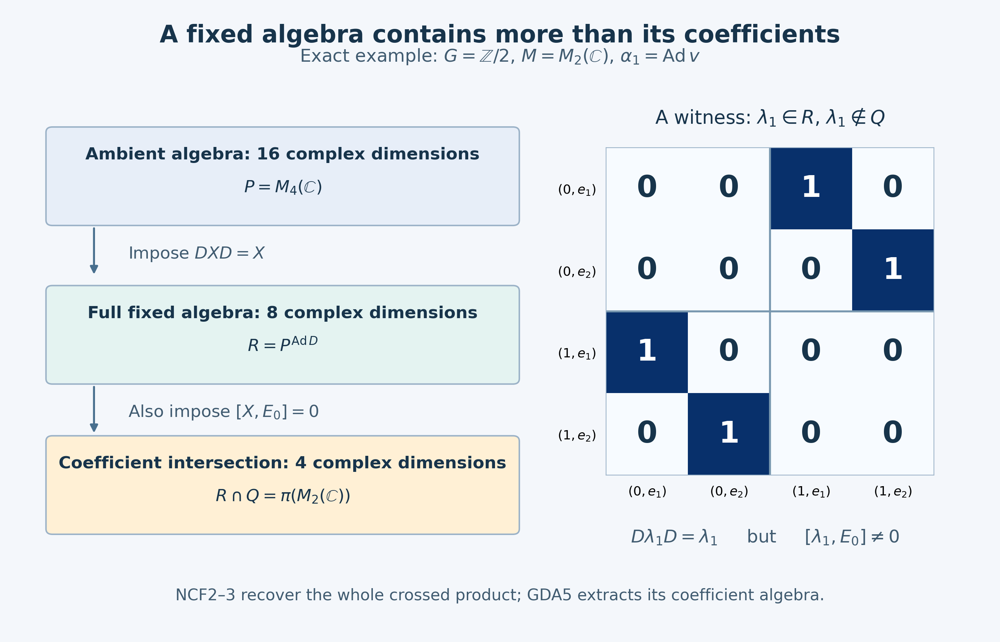

# A normal crossed product as a fixed algebra

*Independent reconciliation, GPT-6 Astra (OpenAI), Ultra, 2026-10-05. New exposition and the finite example are CC0-1.0 to the extent of rights held.*

Let \(G\) be an arbitrary locally compact Hausdorff group, \(M\) a von Neumann algebra, and \(\alpha:G\to\operatorname{Aut}(M)\) a point-ultraweakly continuous action by normal automorphisms. Write \(L=L^2(G)\), with left Haar convention

\[
\mu(Es)=\delta(s)\mu(E),\qquad
(\ell_s f)(t)=f(s^{-1}t),\qquad
(r_s f)(t)=\delta(s)^{1/2}f(ts).
\tag{NCF1}
\]
The right factor is a strongly continuous unitary representation: its norm identity is the right Haar change, and \(r_s r_u=r_{su}\). Strong continuity follows first on compact continuous functions and then by density and the unitary bound, as proved in [L24 Section3](OA-FLOW-L24.md#oa-flow.grp.translations).

We prove, with an explicit normal identification,

\[
M\rtimes_\alpha G
\ \cong\
\bigl(M\bar\otimes B(L)\bigr)^{
       \alpha_s\bar\otimes\operatorname{Ad}r_s,\ s\in G}.
\tag{NCF2}
\]
There is no separability, second-countability, sigma-finiteness, unimodularity or invariant-weight hypothesis. A second commuting action can be passed through this fixed-algebra realization; that bounded consequence is proved separately below. No quotient-space disintegration or general induction theorem is a premise or conclusion.

The substantive crossed-product input is the entire [CCM1–8 commutant proof](OA-FLOW-CCM.md#ccm-1), especially [CCM7](OA-FLOW-CCM.md#ccm-7), already at this arbitrary-group scope. [NR1–4](OA-FLOW-NR.md#oa-flow.nr.1) gives the standard implementation, faithful normal regular model and normal representation independence. [AT1–4](OA-FLOW-AT.md#oa-flow.at.1) supplies the exact continuity implications. The elementary tools are [CF1](OA-FLOW-CF.md#oa-flow.cf.1) and [CF6–8](OA-FLOW-CF.md#oa-flow.cf.6), [CP4–6](OA-FLOW-CP.md#oa-flow.cp.4), [BD1/4/5](OA-FLOW-BD.md#oa-flow.bd.1), [ST2](OA-FLOW-ST12.md#oa-flow.st.2), the [SF spectral calculus](OA-FLOW-SF.md#oa-flow.sf1.spectral-calculus), and [L24's Hilbert tensor construction](OA-FLOW-L24.md#oa-flow.grp.vectorintegration).

The historical mathematical statement is Takesaki, [*Theory of Operator Algebras II*](https://doi.org/10.1007/978-3-662-10451-4), Theorem X.1.21 and Corollary X.1.22(ii), printed253–255. The present deduction uses the current bounded CCM proof, rather than the historical lesson's then-conditional dual-weight Tomita import. The matrix and normality details are written here. A citation does not supply any internal proof.

## NCF1. Matrix entries give the required tensor and normal transport facts

Let \(A\subseteq B(H)\) be a concrete von Neumann algebra and let \(L_0\) be any Hilbert space. Choose an orthonormal basis \((e_i)_{i\in I}\) of \(L_0\), with arbitrary index set. Such a basis follows from CF1's maximal principle and CF8's projections: a nonzero orthogonal complement would supply another unit vector. Write \(V_i\xi=\xi\otimes e_i\), \(X_{ij}=V_i^*XV_j\), and \(P_F=1_H\otimes p_F\), where \(p_F\) projects onto a finite subset \(F\subset I\).

Finite-coordinate vectors are dense, so \(P_F\to1\) strongly as the finite subsets increase. For every bounded \(X\),

\[
P_FXP_F\longrightarrow X\quad\hbox{strongly*},\qquad
\|P_FXP_F\|\leq\|X\|.
\tag{NCF3}
\]
For example, \(P_FXP_F\xi-X\xi=P_FX(P_F-1)\xi+(P_F-1)X\xi\); apply the same estimate to \(X^*\).

Commutation with every \(a'\otimes1\), \(a'\in A'\), is equivalent to \(X_{ij}\in A''=A\) for every \(i,j\). In that case
\[
P_FXP_F=\sum_{i,j\in F}X_{ij}\otimes |e_i\rangle\langle e_j|
\]
belongs to the spatial tensor product, defined as the von Neumann algebra generated by elementary tensors. Equation(NCF3) proves

\[
A\bar\otimes B(L_0)=(A'\otimes1)'.
\tag{NCF4}
\]
Conversely the elementary tensor generators commute with \(A'\otimes1\), proving the other inclusion. This also proves that an operator belongs to the tensor product exactly when all its matrix entries belong to \(A\). No measurable operator-field representation is used.

We need the following normal transport, not only an algebraic tensor map. Let \(\theta:A\to B\subseteq B(K)\) be a normal unital star homomorphism. For \(X\in A\bar\otimes B(L_0)\), the finite matrices
\[
\bigl[\theta(X_{ij})\bigr]_{i,j\in F}
\]
have norms at most \(\|X\|\). Indeed entrywise \(\theta\) is a unital star homomorphism on each finite matrix algebra. It preserves positive elements by their square roots, and \(X_F^*X_F\leq\|X\|^2 1\) therefore proves the norm bound. CF6–8 applies to these concrete finite matrix algebras.

On finite-coordinate vectors these compatible entries define a sesquilinear form of bound \(\|X\|\). Extend the form continuously and use CF8's Hilbert representation to get a unique bounded operator \(\Theta(X)\), with

\[
\Theta(X)_{ij}=\theta(X_{ij}),\qquad
\|\Theta(X)\|\leq\|X\|.
\tag{NCF5}
\]
Its entries lie in \(B\), so (NCF4) puts it in \(B\bar\otimes B(L_0)\). This defines a linear map.

For finite-coordinate vectors \(\xi,\eta\), the functional
\(X\mapsto\langle\Theta(X)\xi,\eta\rangle\) is a finite sum of normal functionals: the entry maps are normal vector compressions, and \(\theta\) is normal. Approximate arbitrary \(\xi,\eta\) by finite-coordinate vectors. The norm error is bounded by

\[
\|\xi-\xi_F\|\,\|\eta\|+\|\xi_F\|\,\|\eta-\eta_F\|,
\tag{NCF6}
\]
uniformly for \(\|X\|\leq1\). CP6's norm closure of the predual makes the limiting functional normal. CP4's absolutely summable vector-series description then proves that every ultraweak functional pulls back normally. Thus \(\Theta\) is ultraweakly continuous on the whole space, including arbitrary nets; no boundedness of an arbitrary convergent net was assumed.

On finite matrices, \(\Theta\) preserves products and adjoints. Those matrices are ultraweakly dense by (NCF3) and BD5. Left and right multiplication by a fixed bounded operator are ultraweakly continuous, since they send vector-series tests to vector-series tests. Extend the product identity first in its second argument with the first finite, then in its first argument. Adjoint preservation follows in the same way. Also \(\Theta(1)=1\) by its entries. This proves the normal tensor homomorphism, denoted \(\theta\bar\otimes\mathrm{id}\).

If \(\theta\) is a normal star isomorphism with normal inverse, the same construction for \(\theta^{-1}\) gives the inverse of \(\Theta\), by entries. For a faithful normal representation, ST2 proves precisely that its image is a von Neumann algebra and its inverse onto that image is normal. Hence normal tensor transport applies to every faithful normal representation. It is determined uniquely by elementary tensors and normality.

Finally, if normal automorphisms \(\gamma_h\) act on \(A\), the matrix entries immediately give

\[
\bigl(A\bar\otimes B(L_0)\bigr)^{\gamma_h\bar\otimes\mathrm{id},\,h}
=A^\gamma\bar\otimes B(L_0).
\tag{NCF7}
\]
For completeness \(A^\gamma\) is a von Neumann algebra: it is a unital star algebra closed ultraweakly; BD4 approximates every element of its bicommutant bounded strongly*, and BD5 turns those approximants into an ultraweak limit in the same algebra. The forward inclusion in(NCF7) puts every entry in \(A^\gamma\) and then uses(NCF3); the reverse follows on elementary tensors and by normality.

## NCF2. The diagonal fixed algebra in a spatial model

Suppose first that \(M\subseteq B(H)\) and a strongly continuous unitary group \(U_s\) implements \(\alpha_s\). Identify \(H\otimes L\) with \(L^2(G,H)\) by \(\xi\otimes f\mapsto[t\mapsto f(t)\xi]\). NR3 supplies the faithful normal regular coefficient map and the regular crossed product

\[
(\pi(a)\zeta)(t)=\alpha_{t^{-1}}(a)\zeta(t),\qquad
(\lambda_s\zeta)(t)=\zeta(s^{-1}t),\qquad
R=\{\pi(M),\lambda(G)\}''.
\tag{NCF8}
\]
Put \(D_s=U_s\otimes r_s\). Its strong continuity follows on simple tensors from that of each factor, and then on all vectors by finite tensor approximation and the unitary bound. The action

\[
\beta_s(X)=D_sXD_s^*,\qquad X\in P:=M\bar\otimes B(L),
\tag{NCF9}
\]
preserves \(P\), since on elementary tensors it is
\(\alpha_s\bar\otimes\operatorname{Ad}r_s\). Each \(\beta_s\) and its inverse are normal. Strong continuity of \(D_s\) makes each vector functional of \(\beta_s(X)\) continuous; the square-summable vector-series tail bound proves point-ultraweak continuity. It is a group action, with no reversed product.

The full CCM7 conclusion, not just commutation of the displayed generators, is

\[
R'=\{M'\otimes1,\ D_s:s\in G\}''.
\tag{NCF10}
\]
Taking commutants and using(NCF4) gives the actual concrete equality

\[
R=(M'\otimes1)'\cap\{D_s:s\in G\}'
  =P^\beta .
\tag{NCF11}
\]
This proves(NCF2) in the given spatial model. Directly, both generator families in(NCF8) are fixed. For the coefficient,

\[
U_s\,\alpha_{(ts)^{-1}}(a)\,U_s^*
=\alpha_s\alpha_{s^{-1}t^{-1}}(a)=\alpha_{t^{-1}}(a);
\tag{NCF12}
\]
the Haar factors in the conjugation cancel. Left and right translations commute, so \(\lambda_u\) is fixed too. The reverse inclusion in(NCF11) is supplied by the already proved reverse commutant inclusion in CCM7.

The often useful coordinate change \(W\zeta(t)=U_t\zeta(t)\) is unitary on the entire \(L^2\) space, initially on compact tensors and then by completion. CCM7's direct formulas are

\[
W\pi(a)W^*=a\otimes1,\quad
W\lambda_sW^*=U_s\otimes\ell_s,\quad
WD_sW^*=1\otimes r_s .
\tag{NCF13}
\]
It follows that

\[
WRW^*=\{a\otimes1,\ U_s\otimes\ell_s:a\in M,s\in G\}''.
\tag{NCF14}
\]
One must transform the ambient algebra too: \(WPW^*=(W(M'\otimes1)W^*)'\), whose right coefficients are the fields \(t\mapsto U_ty'U_t^*\). Thus(NCF13) is not permission to replace the ambient algebra in(NCF11) by \(P\) while only replacing \(D_s\) by \(r_s\).

Changing the implementation on the same \(H\) changes none of this fixed algebra. If \(V_s\) also implements \(\alpha_s\), then \(v_s=V_sU_s^*\in M'\); on \(P\), \(v_s\otimes1\) commutes with every operator. Consequently conjugation by \(V_s\otimes r_s=(v_s\otimes1)D_s\) has exactly the same restriction to \(P\).

## NCF3. Arbitrary faithful normal representations

For a general \(M\), NR1 supplies a faithful standard representation \(\sigma\) on \(H_0\) and strongly continuous implementers \(U_s^0\). NCF2 gives the fixed-algebra theorem in that model. Let \(\rho:M\to B(H)\) be any faithful normal unital representation. It need not implement \(\alpha\) spatially. ST2 and NCF1 construct the onto normal isomorphism

\[
\Phi=(\rho\circ\sigma^{-1})\bar\otimes\mathrm{id}:
\sigma(M)\bar\otimes B(L)\longrightarrow
\rho(M)\bar\otimes B(L).
\tag{NCF15}
\]
It carries \(\beta_s^0\) to the unique normal tensor action

\[
\beta_s^\rho=(\rho\alpha_s\rho^{-1})\bar\otimes\operatorname{Ad}r_s.
\tag{NCF16}
\]
The equality is checked on elementary tensors and extended normally. Point-ultraweak continuity follows by transport of the already continuous action \(\beta^0\), so no separate spatial action on \(H\) is presumed.

Here is the exact generator identification. For \(f,g\in C_c(G)\), the group-coordinate slice of the standard regular coefficient is

\[
(\mathrm{id}\otimes\omega_{f,g})(\pi_\sigma(a))
=\int_G f(t)\overline{g(t)}
             \sigma(\alpha_{t^{-1}}(a))\,dt,
\tag{NCF17}
\]
where equality is tested on every normal functional. The integral exists in the coefficient algebra by its predual duality; it is the same normal coefficient calculation as NR3. Normality of \(\rho\circ\sigma^{-1}\) moves it through that integral. The resulting slice is precisely the corresponding slice of \(\pi_\rho(a)\).

NCF1's entry construction agrees with all vector slices: first for finite-coordinate vectors, then for arbitrary vectors by the norm estimate(NCF6). Compact scalar functions are dense in \(L^2(G)\), and their matrix slices determine a bounded operator. Thus

\[
\Phi(\pi_\sigma(a))=\pi_\rho(a),\qquad
\Phi(1\otimes\ell_s)=1\otimes\ell_s.
\tag{NCF18}
\]
The second equality is an elementary tensor identity. A normal isomorphism with normal inverse carries the generated von Neumann algebras onto each other. Equivalently apply BD4/5 to bounded approximants from the generator algebras in both directions. Therefore

\[
R_\rho=\bigl(\rho(M)\bar\otimes B(L)\bigr)^{\beta^\rho}.
\tag{NCF19}
\]
Its normal identification with the abstract regular crossed product is exactly NR4's unique generator-preserving map. Equations(NCF15)–(NCF18) give its explicit extension to the two ambient tensor algebras. A nonunital faithful representation is treated on its identity corner \(\rho(1)H\); the assertion on that corner is unchanged.

## NCF4. Passing a commuting action through the crossed product

Let a second arbitrary locally compact Hausdorff group \(J_0\) act point-ultraweakly continuously on a von Neumann algebra \(B\) by normal automorphisms \(\gamma_h\), and suppose \(\gamma_h\alpha_s=\alpha_s\gamma_h\) for every \(h,s\). Put \(F=B^\gamma\). It is a von Neumann algebra by NCF1, is preserved by \(\alpha\), and its restricted action has the same continuity. Indeed its concrete ultraweak topology is the inherited topology by CP6.

Realize everything faithfully on a common \(H\). NCF1 constructs \(\Gamma_h=\gamma_h\bar\otimes\mathrm{id}\) on \(B\bar\otimes B(L)\); it is point-ultraweakly continuous. To check this without a tensor-topology shortcut, finite-coordinate vector functionals are finite sums of continuous normal coefficient tests; approximation by finite-coordinate vectors and the isometric action bound is uniform in \(h\). Finish with the vector-series tail estimate.

The actions \(\Gamma\) and \(\beta_s=\alpha_s\bar\otimes\operatorname{Ad}r_s\) commute, first on elementary tensors and then normally on the whole tensor product. Using(NCF7) and(NCF19) twice gives

\[
\begin{aligned}
F\rtimes_{\alpha|_F}G
&=\bigl(F\bar\otimes B(L)\bigr)^\beta\\
&=\bigl(B\bar\otimes B(L)\bigr)^\Gamma\cap
  \bigl(B\bar\otimes B(L)\bigr)^\beta\\
&=(B\rtimes_\alpha G)^{\widetilde\gamma},
\end{aligned}
\tag{NCF20}
\]
where the first and last algebras are their regular concrete copies and \(\widetilde\gamma_h=\Gamma_h|_{R_B}\). The coefficient-slice calculation(NCF17) and commutation of the actions give

\[
\widetilde\gamma_h(\pi_\alpha(b))=\pi_\alpha(\gamma_h(b)),
\qquad \widetilde\gamma_h(\lambda_s)=\lambda_s.
\tag{NCF21}
\]
Both sides of(NCF20) are therefore identified with the intended actions and embeddings, not merely with abstractly isomorphic algebras. This uses intersections of fixed-point algebras; there is no average over \(J_0\), compactness requirement on \(J_0\), or assertion of a bounded conditional expectation.

## NCF5. The precise nonfaithful quotient qualification

Suppose a normal unital representation \(\rho:M\to B(H)\) is covariant under a strongly continuous \(V_s\), but is not necessarily faithful. Its kernel \(I\) is an ultraweakly closed two-sided star ideal, invariant under \(\alpha\). We give the central-support argument needed to say exactly which crossed product is represented.

Let \(e\) be the supremum of the projections in \(I\). Their finite joins still lie in \(I\): for \(p,q\in I\), the support of \(p+q\) is the bounded strong limit of
\((p+q)(p+q+1/n)^{-1}\), all belonging to \(I\); BD5 and ultraweak closedness keep the limit in \(I\). The increasing net of these finite joins converges strongly to the projection onto their closed range span. Hence \(e\in I\), again by BD5. Conjugation by any unitary of \(M\) preserves \(I\), so it fixes \(e\). Every self-adjoint contraction \(a\in M\) is \((u+u^*)/2\) for \(u=a+i(1-a^2)^{1/2}\), by CF6–7. Thus commuting with all unitaries makes \(e\) central.

For \(x\in I\), the same bounded support cutoff applied to \(x^*x\) gives \(s(x^*x)\in I\), so \(x=xe\). Conversely \(Me\subseteq I\). Therefore

\[
I=Me,\qquad z=1-e\in Z(M),\qquad \alpha_s(z)=z.
\tag{NCF22}
\]
The last equality follows from invariance of \(I\) and its uniquely specified largest projection. The quotient is normally identified with \(zM\), and \(\rho|_{zM}\) is faithful, normal and unital relative to its identity \(z\). Applying(NCF19) to \(zM\), or NCF2 directly to \(\rho(M)\) with implementation \(V\), proves

\[
R_\rho=
\bigl(\rho(M)\bar\otimes B(L)\bigr)^{
  \operatorname{Ad}V_s|_{\rho(M)}\bar\otimes\operatorname{Ad}r_s}
\ \cong\ zM\rtimes_{\alpha|_{zM}}G.
\tag{NCF23}
\]
There is no claimed faithful identification with the crossed product of the discarded central summand. For a nonunital covariant representation, its identity projection is \(V\)-invariant; restrict to that corner first. Zero coefficient or identity spaces have their zero-algebra interpretation.

## NCF6. This is a different fixed-algebra statement from coefficient recovery

On \(H\otimes L^2(G)\) write
\[
Q=(1_H\otimes L^\infty(G))'.
\]
[GDA5](OA-FLOW-GDA.md#gda-5) proves \(R\cap Q=\pi(M)\), using the whole coefficient intersection, scalar multiplication and right translations. Its proof has no decomposable-field assumption. That result extracts the coefficient algebra from the crossed product. Equation(NCF19), instead, recovers the entire crossed product as a fixed algebra inside \(M\bar\otimes B(L)\). It follows directly from the full CCM commutant theorem and does not require the averaging construction in GDA.

Here is an exact finite illustration of the distinction. Let \(G=\mathbb Z/2\) with counting Haar measure, \(M=M_2(\mathbb C)\), \(v=\begin{pmatrix}0&1\\1&0\end{pmatrix}\), and \(\alpha_1=\operatorname{Ad}v\). Order \(H\otimes L\) as \(H\oplus H\), by the two group coordinates. Then

\[
D_1=\begin{pmatrix}0&v\\v&0\end{pmatrix},\qquad
\pi(a)=\begin{pmatrix}a&0\\0&vav\end{pmatrix},\qquad
\lambda_1=\begin{pmatrix}0&I_2\\I_2&0\end{pmatrix}.
\tag{NCF24}
\]
For a block matrix \(X=\begin{pmatrix}A&B\\C&E\end{pmatrix}\), the equation \(D_1XD_1=X\) is exactly \(E=vAv,\ C=vBv\). Consequently

\[
P^\beta=R=
\left\{\begin{pmatrix}A&B\\vBv&vAv\end{pmatrix}:A,B\in M_2(\mathbb C)\right\},
\qquad
R\cap Q=
\left\{\begin{pmatrix}A&0\\0&vAv\end{pmatrix}:A\in M_2(\mathbb C)\right\}.
\tag{NCF25}
\]
Conversely every matrix in the first set is \(\pi(A)+\pi(B)\lambda_1\), so the finite description also follows directly from the generators. Their complex dimensions are \(8\) and \(4\), respectively; the ambient \(P=M_4(\mathbb C)\) has dimension \(16\). The element \(\lambda_1\) belongs to the first algebra and not to \(Q\), since it fails to commute with \(\operatorname{diag}(I_2,0)\). Thus the two conclusions cannot be substituted for each other even in this finite inner-action example.

The complete local conclusions are(NCF19), the commuting-action identity(NCF20), and the support-qualified version(NCF23), at the current CCM/NR foundations. They settle the fixed-algebra component of C2.NC. They do not establish general von Neumann induction, quotient disintegration, a subgroup crossed-product decomposition, or all of C2.

## The whole fixed algebra and its coefficient intersection

This is the exact example in [NCF6, equations(NCF24)–(NCF25)](OA-FLOW-NCF.md#ncf-6), not a finite-dimensional reduction of the general theorem. Let \(G=\mathbb Z/2\) with counting Haar measure, \(M=M_2(\mathbb C)\), \(v=\begin{pmatrix}0&1\\1&0\end{pmatrix}\), and \(\alpha_1=\operatorname{Ad}v\). The four coordinates are ordered by group coordinate first and coefficient coordinate second:
\((0,e_1),(0,e_2),(1,e_1),(1,e_2)\).

The ambient algebra \(P=M_4(\mathbb C)\) has complex dimension16. The diagonal right action is conjugation by
\[
D=\begin{pmatrix}0&v\\v&0\end{pmatrix}
=\begin{pmatrix}
0&0&0&1\\0&0&1&0\\0&1&0&0\\1&0&0&0
\end{pmatrix}.
\]
For \(X=\begin{pmatrix}A&B\\C&E\end{pmatrix}\), ordinary block multiplication gives
\[
DXD=\begin{pmatrix}vEv&vCv\\vBv&vAv\end{pmatrix}.
\]
Hence the fixed algebra is
\[
R=P^{\operatorname{Ad}D}
=\left\{\begin{pmatrix}A&B\\vBv&vAv\end{pmatrix}:A,B\in M_2(\mathbb C)\right\},
\qquad \dim_{\mathbb C}R=8.
\]
These are eight independent complex matrix entries, not eight real dimensions. The left arrow in the figure applies the fixed-point condition; it is not a claim that a linear projection of this form exists for an arbitrary group.

Scalar multiplication on the group coordinate is generated by
\[
E_0=\operatorname{diag}(I_2,0).
\]
Its commutant \(Q\) consists of block diagonal matrices. Therefore the additional condition of commuting with scalar multiplication sets \(B=0\) in the preceding fixed algebra:
\[
R\cap Q=\pi(M)=
\left\{\begin{pmatrix}A&0\\0&vAv\end{pmatrix}:A\in M_2(\mathbb C)\right\},
\qquad \dim_{\mathbb C}\pi(M)=4.
\]
This is [GDA5's coefficient intersection](OA-FLOW-GDA.md#gda-5) in this example. The full fixed-algebra identity is the different conclusion proved in [NCF2–3](OA-FLOW-NCF.md#ncf-2).

The right panel displays the actual left translation
\[
\lambda_1=\begin{pmatrix}0&I_2\\I_2&0\end{pmatrix}
=\begin{pmatrix}
0&0&1&0\\0&0&0&1\\1&0&0&0\\0&1&0&0
\end{pmatrix}.
\]
It commutes with \(D\), so belongs to \(R\), while
\[
[\lambda_1,E_0]
=\begin{pmatrix}0&-I_2\\I_2&0\end{pmatrix}\ne0.
\]
Thus it is a concrete witness that \(R\ne R\cap Q\). Blue cells mark entries equal to1, white cells entries equal to0; every entry is labeled exactly. No numerical tolerance determines membership.

The proof of the arbitrary-group result is [NCF1–5](OA-FLOW-NCF.md#ncf-1), using the current CCM and NR bodies. Human source context is Takesaki, [*Theory of Operator Algebras II*](https://doi.org/10.1007/978-3-662-10451-4), Theorem X.1.21 and Corollary X.1.22(ii), printed253–255. The illustration and example are independently authored; they reproduce no source figure.

The renderer writes a \(2800\times1800\) PNG, a deterministic SVG and exact integer data. [Reproduction code](../assets/general-fixed-algebra/render_fixed_algebra.py), [editable SVG](../assets/general-fixed-algebra/assets/fixed-algebra-distinction.svg), [exact data](../assets/general-fixed-algebra/figure-data.json). All are CC0-1.0 to the extent of rights held.
