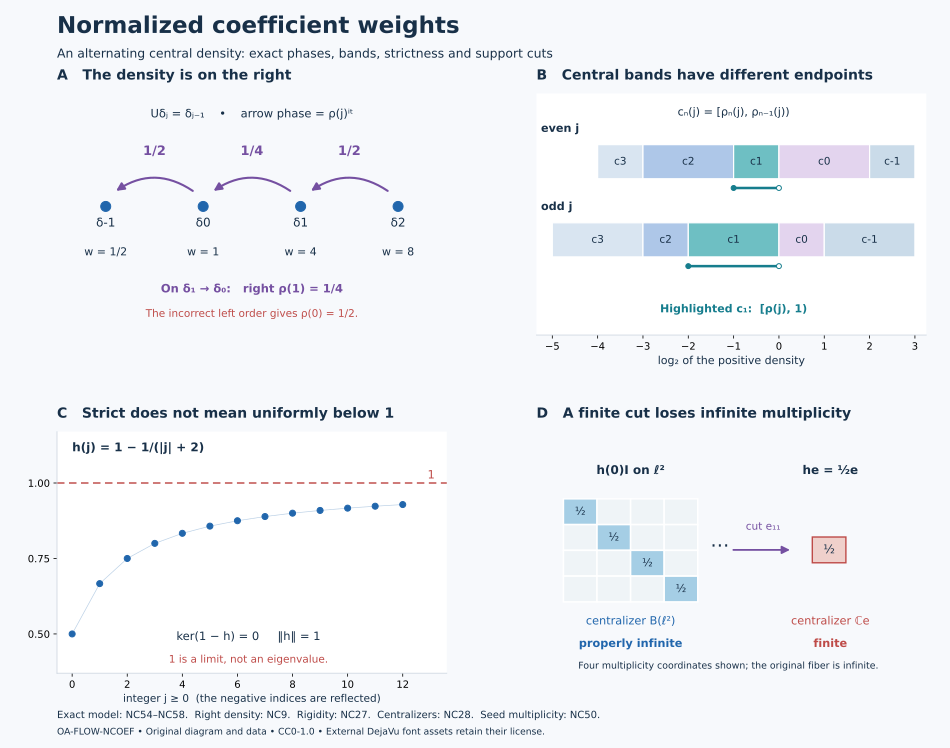

# Normalized weights in a discrete coefficient algebra

A single half-open interval of coefficient densities removes the ambiguity created by the implementing integer unitary. Within that interval, a partial isometry that transports weights must already belong to the coefficient algebra. We prove this by two independent arguments, identify the entire support centralizer, and then construct a nonzero coefficient subweight whose coefficient centralizer is properly infinite. The last condition is essential when the subweight is subsequently placed in the global carrier.

*Original exposition, models and reproducible figures are dedicated to CC0-1.0 to the extent of rights held. Source publications and the separately supplied font components retain their terms.*

## 1. The two scopes and supported comparison

For Sections 2–5 let \(N\ne0\) be any semifinite von Neumann algebra with a specified faithful normal semifinite trace \(\tau\). Let \(\theta\in\operatorname{Aut}(N)\), and assume, on the entire positive cone,
\[
 \tau\circ\theta=\tau_\rho,\qquad
 0<\rho\le\lambda_0 1,\qquad 0<\lambda_0<1.
 \tag{NC1}
\]
Here \(\rho\) is affiliated with \(Z(N)\), and \(0<\rho\) means that its kernel is zero. The upper bound makes it bounded; its inverse need not be bounded. Put
\[
 M=N\rtimes_\theta\mathbb Z,\qquad
 UxU^*=\theta(x),\qquad E:M\longrightarrow N,\qquad \phi=\tau\circ E.
 \tag{NC2}
\]
The regular representation, the faithful normal coefficient expectation and full coefficient reconstruction are the actual ones in [VD](OA-FLOW-VD.md#vd-discrete-regular). No separable-predual, factoriality, proper-infiniteness or faithful-state assumption is imposed in these sections. For the zero algebra, their assertions reduce to the unique zero weight and zero transporter.

For the nonzero seed in [Section 6](#nc-seed), assume additionally that \(M\) is a factor with separable predual of type \(\mathrm{III}_\lambda\), \(0\le\lambda<1\), and that (NC2) is its specified lacunary infinite-multiplicity decomposition. For \(\lambda=0\), this is [LAC](OA-FLOW-LAC.md#lac-unitary); its \(N\) is type \(\mathrm{II}_\infty\) and may have nontrivial center. For \(0<\lambda<1\), choose the specified fundamental-period infinite generalized trace of [DDP](OA-FLOW-DDP.md#dd-recognition), so that \(\rho=\lambda1\). The importance of this last qualification is proved in [Section 7](#nc-two-block).

Every weight below is normal and semifinite, but need not be faithful on \(M\). Its centralizer is taken in its support corner. We use [WC's supported comparison](../../OA-MOD/OA-MOD-WC.html#support-corners-cuts-and-the-comparison-relation):
\[
 \eta_2=\eta_1\circ\operatorname{Ad}v,\qquad
 vv^*=s(\eta_1),\quad v^*v=s(\eta_2)
 \quad\Longrightarrow\quad \eta_1\sim\eta_2.
 \tag{NC3}
\]
The displayed equality means equality on \(M_+\), including infinity. Subequivalence means equivalence to a cut by a projection in the target support centralizer.

Call \(h\in N_+\) **normalized** when, with \(p=s(h)\),
\[
 \rho p\le h\le1,\qquad \ker(1-h)=\{0\}.
 \tag{NC4}
\]
The zero density is allowed. The last condition does not assert \(h\le(1-\varepsilon)1\) for any \(\varepsilon>0\). Whenever \(a<b\) is used for commuting positive affiliated operators, it means \(a\le b\) and that \(b-a\) has zero kernel on \(s(b)\). Products and differences of the central operators used here are their joint spectral calculi; arbitrary unbounded products are never being assigned an unstated domain.

The conclusions in the first scope are
\[
 \begin{gathered}
  \phi_{h_2}=\phi_{h_1}\circ\operatorname{Ad}v
  \text{ with the supports in (NC3)}
       \ \Longrightarrow\ v\in N,\\
  M_{\phi_h}=N_{\tau_h}
       =\{h\}'\cap pNp,\\
  \phi_{h_1}\precsim\phi_{h_2}
       \ \Longleftrightarrow\ \tau_{h_1}\precsim\tau_{h_2}.
 \end{gathered}
 \tag{NC5}
\]
Thus both equivalence and subequivalence of normalized weights are decided in the coefficient algebra. No claim that every weight has a normalized representative is needed in proving (NC5).

## 2. The reference weight and the right-sided density

The arbitrary-algebra converse in [LAC, (LAC1)–(LACC4)](OA-FLOW-LAC.md#lac-converse) proves that \(\phi=\tau E\) is the actual faithful normal semifinite dual weight and that
\[
 \sigma_t^\phi(x)=x\quad(x\in N),\qquad
 \sigma_t^\phi(U)=U\rho^{it},\qquad M_\phi=N.
 \tag{NC6}
\]
The proof identifies the whole weight through the counting-Haar expectation, then applies the normalized dual-weight derivative. In particular it is a full-cone assertion. Its GNS space is the orthogonal sum of the \(U^nL^2(N,\tau)\) summands. Finite-trace projections form a directed net in that argument; their existence does not impose a countable decomposition on \(N\).

For \(n\in\mathbb Z\), the density of the trace \(\tau\theta^n\) is the central positive nonsingular affiliated operator
\[
 \begin{aligned}
 \rho_0&=1,\\
 \rho_n&=\prod_{j=0}^{n-1}\theta^{-j}(\rho)\quad(n>0),\\
 \rho_{-m}&=\prod_{j=1}^{m}\theta^j(\rho^{-1})\quad(m>0).
 \end{aligned}
 \tag{NC7}
\]
For clarity, transport of a trace density has the exact orientation
\[
 \tau_a\circ\theta^k=\tau_{\rho_k\,\theta^{-k}(a)}.
 \tag{NC8}
\]
Apply \(\theta^k\) to bounded spectral cutoffs of \(\theta^{-k}(a)\), use \(\tau\theta^k=\tau_{\rho_k}\), and then take the increasing extended values. Trace cyclicity and commutation with the central \(\rho_k\) identify the resulting joint density. The complete trace-density uniqueness theorem [TD5–7](OA-FLOW-TD.md#td-5) gives (NC8), including its form domains. In particular,
\[
 \rho_{n+m}=\rho_n\theta^{-n}(\rho_m),\qquad
 \theta^n(\rho_n)=\rho_{-n}^{-1},\qquad
 \sigma_t^\phi(U^n)=U^n\rho_n^{it}.
 \tag{NC9}
\]
The last identity follows by multiplying (NC6) in the displayed order, using
\(aU=U\theta^{-1}(a)\); negative powers follow by taking adjoints. All imaginary powers are bounded unitaries, even when a positive or inverse density is unbounded.

The inequalities needed below are
\[
 0<\rho_n\le\lambda_0^{\,n-1}\rho\le\rho\quad(n\ge1),
 \qquad \rho_{-m}\ge\lambda_0^{-m}1\quad(m\ge1).
 \tag{NC10}
\]
They follow from the commuting factors of (NC7). No lower scalar bound for \(\rho\) has been introduced.

For any bounded \(h\in N_+\), [CZ1](OA-FLOW-CZ.md#cz-1) gives the normal semifinite weight \(\phi_h\). Its support is exactly \(p=s(h)\): faithfulness of \(\phi\) makes \(\phi_h(x)=0\) equivalent to \(x^{1/2}h^{1/2}=0\), hence to \(x^{1/2}p=0\). Normal bimodularity of \(E\) gives, directly on all \(x\in M_+\),
\[
 \begin{aligned}
 \phi_h(x)
 &=\phi(h^{1/2}xh^{1/2})\\
 &=\tau\!\left(h^{1/2}E(x)h^{1/2}\right)
 =(\tau_h\circ E)(x).
 \end{aligned}
 \tag{NC11}
\]
The equality includes infinite values. Both sides are normal semifinite weights, by the perturbation theorem or [WC's full expectation theorem](../../OA-MOD/OA-MOD-WC.html#faithful-expectations-preserve-support-comparison-and-orthogonal-sums). The normalized supported derivative is
\[
 (D\phi_h:D\phi)_t=h^{it},
 \tag{NC12}
\]
where \(h^{it}\) is its unitary power on \(p\), extended by zero outside \(p\). On \(pMp\) its modular group is
\[
 \sigma_t^{\phi_h}(x)=h^{it}\sigma_t^\phi(x)h^{-it}.
 \tag{NC13}
\]
These are the actual supported versions of [CZ's density derivative](OA-FLOW-CZ.md#cz-balanced-cocycle), or equivalently [WC's balanced supported construction](../../OA-MOD/OA-MOD-WC.html#the-supported-cocycle-against-a-faithful-reference). Equality of modular groups alone would not establish (NC12)'s scalar normalization.

## 3. Two complete separation arguments

We need a lemma whose strictness is spectral rather than uniform.

**Separation lemma.** Let \(A,B\) be positive nonsingular selfadjoint operators affiliated with a von Neumann algebra \(Q\), with
\[
 0<A\le1,\qquad \ker(1-A)=0,\qquad B\ge1.
 \tag{NC14}
\]
If \(x\in Q\) satisfies \(A^{it}x=xB^{it}\) for every real \(t\), then \(x=0\). There is no separability hypothesis.

**Spectral proof.** Put \(D=\log A\), \(F=\log B\). We first justify the spectral-intertwining step. For a selfadjoint \(T\), scalar spectral calculus gives
\[
 (1-iT)^{-1}=\int_0^\infty e^{-s}e^{isT}\,ds.
 \tag{NC15}
\]
The integral is strong on each vector, has norm at most one, and equals the resolvent because the scalar integral is \((1-it)^{-1}\). Thus the given intertwiner also intertwines these resolvents and their adjoints. In the direct sum representation, the operator
\[
 X=\begin{pmatrix}0&x\\0&0\end{pmatrix}
\]
commutes with the resolvent of \(D\oplus F\) and its adjoint. It consequently commutes with the bounded Borel calculus of that normal resolvent: the actual cyclic/Borel proof in [SK](../../OA-MOD/OA-MOD-SK.html#bounded-borel-functions-and-the-spectral-measure) gives this commutant property. The resolvent has zero kernel, so its spectral projection at zero vanishes even when zero belongs to its spectrum. The map \(r\mapsto(1-ir)^{-1}\) is injective with Borel inverse on its image; pullback of its spectral projections therefore gives
\[
 E_D(S)x=xE_F(S)\quad(S\subset\mathbb R\text{ Borel}).
 \tag{NC16}
\]
This also proves the assertion by normal resolvent calculus on the full affiliated domains, rather than by an unproved rule for unbounded multiplication.

For \(S=(-\infty,0)\), the left projection is \(1\): \(D\le0\), and its zero projection is \(\ker(1-A)=0\). The right projection is zero because \(F\ge0\). Equation (NC16) makes \(x=0\).

**Half-plane proof.** Write \(x=v|x|\). The intertwining identity and its adjoint show that \(x^*x\) commutes with all \(B^{it}\) and \(xx^*\) with all \(A^{it}\). Their support projections \(e=v^*v\), \(f=vv^*\) have the same commutations. Bounded polar approximation then gives
\[
 A^{it}v=vB^{it},\qquad
 A^{it}f=vB^{it}v^*.
 \tag{NC17}
\]
For example \(v\) is the strong limit of \(x(\varepsilon+|x|)^{-1}\); each bounded approximate inverse commutes with \(B^{it}\). Spectral commutation can also be read from the resolvent argument above, applied to the bounded products.

Define a bounded operator-valued function by
\[
 H(z)=
 \begin{cases}
   A^{iz}f,&\operatorname{Im}z\le0,\\
   vB^{iz}v^*,&\operatorname{Im}z\ge0.
 \end{cases}
 \qquad \|H(z)\|\le1.
 \tag{NC18}
\]
The signs matter: \(A^{-y}\) is a contraction for \(y\le0\), and \(B^{-y}\) is a contraction for \(y\ge0\). Spectral dominated convergence gives strong boundary continuity. Inside either half-plane, the functions
\(|\log r|^k r^a\) for \(0<r\le1\), or \((\log r)^k r^{-a}\) for \(r\ge1\), are bounded for every \(a>0\). Their spectral integrals justify local norm derivatives of every order. Equation (NC17) makes the two boundary values equal.

Apply a normal functional to \(H\). [AS2's rectangle/Morera gluing proof](OA-FLOW-AS.md#as-2) makes the resulting scalar function entire. It is bounded, so the scalar Cauchy derivative estimate on a circle of radius \(R\) gives derivative at most \(\|\omega\|/R\); letting \(R\to\infty\) makes it constant. Normal functionals separate \(Q\), and hence \(H(z)=H(0)=f\).

It follows that \(A^{it}f=f\) for all \(t\). For any vector \(\xi\), the spectral measure of \(A\) at \(f\xi\) therefore gives zero integral of \(|r^{it}-1|^2\) for every rational \(t\). The countable intersection of their zero sets in \((0,1]\) is \(\{1\}\). Thus \(f\xi\) belongs to the 1-eigenspace of \(A\), which is zero. Hence \(f=0\), and \(x=0\). This argument uses scalar measures one vector at a time, not a common exceptional set for an arbitrary Hilbert basis.

## 4. A normalized transporter has only degree zero

Let \(h_1,h_2\) be normalized, \(p_j=s(h_j)\), and suppose \(v\in M\) has
\[
 vv^*=p_1,\qquad v^*v=p_2,\qquad
 \phi_{h_2}(x)=\phi_{h_1}(vxv^*)\quad(x\in M_+).
 \tag{NC19}
\]
The zero cases force \(v=0\); the following formulas also include them. Define
\[
 k_j=\rho(1-p_j)+h_j.
 \tag{NC20}
\]
Because \(\rho\) is central and \(p_j\) supports \(h_j\),
\[
 0<\rho\le k_j\le1,\qquad \ker(1-k_j)=0.
 \tag{NC21}
\]
On \(p_j\) this is normalization; on \(1-p_j\) it follows from \(\rho\le\lambda_0<1\). Thus \(k_j\) is nonsingular even if \(h_j\) is not faithful.

The exact supported covariance in [WC.12–14](../../OA-MOD/OA-MOD-WC.html#the-balanced-centralizer-records-every-comparison), applied to (NC12) and (NC19), gives
\[
 v h_2^{it}=h_1^{it}\sigma_t^\phi(v).
 \tag{NC22}
\]
Both \(p_j\) are \(\phi\)-fixed. Consequently \(vp_2=v\), \(p_1\sigma_t^\phi(v)=\sigma_t^\phi(v)\), and (NC22) is equivalently
\[
 v k_2^{it}=k_1^{it}\sigma_t^\phi(v).
 \tag{NC23}
\]

For \(n\in\mathbb Z\), put \(x_n=E(vU^{-n})\in N\). The coefficient maps are normal. Their values on covariant words, together with (NC9), give on the full algebra
\[
 k_1^{it}x_n\theta^n(\rho_n^{it})
      =x_n\theta^n(k_2^{it}),\qquad
 k_1^{it}x_n=x_n\,\theta^n(k_2^{it}\rho_n^{-it}).
 \tag{NC24}
\]
One may verify this first on the bounded Fejer polynomials of \(v\). Normality and their strong-star convergence justify passage to \(v\); no unaveraged Fourier convergence is used.

If \(n>0\), all factors in
\[
 B_n=\theta^n(k_2\rho_n^{-1})
 \tag{NC25}
\]
strongly commute where required, because \(\rho_n\) is central. Joint spectral calculus defines a positive nonsingular affiliated \(B_n\), and (NC10), (NC21) give \(B_n\ge1\). Its unitary powers are precisely those on the right of (NC24). The separation lemma, by either proof, gives \(x_n=0\).

If \(n<0\), move the central factor in the first equation of (NC24) to the left and put
\[
 C_n=k_1\theta^n(\rho_n)=k_1\rho_{-n}^{-1}\ge1,\qquad
 D_n=\theta^n(k_2)\le1,\qquad \ker(1-D_n)=0.
 \tag{NC26}
\]
The inequality follows from \(\rho_{-n}\le\rho\le k_1\), since \(-n>0\). The coefficient identity is \(C_n^{it}x_n=x_nD_n^{it}\). Take adjoints and replace \(t\) by \(-t\) to get
\(D_n^{it}x_n^*=x_n^*C_n^{it}\). The same lemma gives \(x_n=0\).

Only \(x_0\) remains. The [full coefficient uniqueness theorem](OA-FLOW-VD.md#vd-discrete-regular), or its bounded Fejer reconstruction, yields
\[
 v=x_0\in N.
 \tag{NC27}
\]
Both proofs of the separation lemma have therefore proved the complete transport assertion, including nonfaithful and zero supports and without a uniform upper gap for \(h_j\).

## 5. Exact centralizers, cuts and comparison

Let \(h\) be normalized and \(p=s(h)\). A unitary \(w\) of the actual support centralizer \(M_{\phi_h}\) has \(w^*w=ww^*=p\) and preserves \(\phi_h\) on the whole positive cone. The latter assertion is the full centralizer-unitary invariance in [CZ0](OA-FLOW-CZ.md#oa-flow.cz.0), not a finite-value trace computation. Apply (NC27) to \(w\) to get \(w\in N\).

Every element of a unital von Neumann algebra is a linear combination of its unitaries: a selfadjoint contraction \(a\) is the real part of \(a+i(p-a^2)^{1/2}\) in its corner; split a general element into real and imaginary parts and rescale. Hence \(M_{\phi_h}\subset pNp\). On this corner (NC13) reduces to \(\operatorname{Ad}h^{it}\). The spectral-intertwining argument (NC15)–(NC16) identifies its fixed algebra exactly:
\[
 \boxed{\quad M_{\phi_h}=N_{\tau_h}
           =\{h\}'\cap pNp.\quad}
 \tag{NC28}
\]
For the trace-density centralizer use the same perturbation formula with tracial reference \(\tau\). Thus equality holds with the entire centralizer, not just a convenient subalgebra.

If \(e\in\operatorname{Proj}(M_{\phi_h})\), then \(e\le p\), \(e\in N\) and \(eh=he\). With \(k=eh\), faithfulness of \(h\) on \(p\) gives \(s(k)=e\), and
\[
 \rho e\le k,\qquad k\le1,\qquad \ker(1-k)=0,\qquad
 (\phi_h)_e=\phi_k.
 \tag{NC29}
\]
For the kernel claim, \(k\) is zero on \(1-e\), and on \(e\) its 1-eigenspace is contained in that of \(h\). The weight identity is the direct equality of the two bounded sandwiches on every positive \(x\).

Suppose \(\phi_{h_1}\precsim\phi_{h_2}\). Choose \(e\in M_{\phi_{h_2}}\) and the actual supported equivalence to \((\phi_{h_2})_e\). Equation (NC29) writes this cut as the normalized \(\phi_{eh_2}\); (NC27) puts its implementing partial isometry in \(N\). Restricting the whole-cone identity to \(N_+\) gives
\(\tau_{h_1}\sim(\tau_{h_2})_e\), hence \(\tau_{h_1}\precsim\tau_{h_2}\). Conversely [expectation transfer WC36–42](../../OA-MOD/OA-MOD-WC.html#faithful-expectations-preserve-support-comparison-and-orthogonal-sums), together with (NC11), gives the reverse implication. The same argument with full target support proves
\[
 \begin{aligned}
 \phi_{h_1}\precsim\phi_{h_2}
     &\iff\tau_{h_1}\precsim\tau_{h_2},\\
 \phi_{h_1}\sim\phi_{h_2}
     &\iff\tau_{h_1}\sim\tau_{h_2}.
 \end{aligned}
 \tag{NC30}
\]
Compression preserves normalization. It need not preserve infinite multiplicity: a finite nonzero projection in a properly infinite semifinite centralizer gives a finite compressed centralizer. The seed construction next retains proper infiniteness by an explicit unital subalgebra, rather than by an unrestricted compression assertion.

## 6. A coefficient seed with infinite multiplicity

We now use the separable type \(\mathrm{III}_\lambda\) factor scope in Section 1. Denote by \(W_\infty(B)\) the zero weight and the normal semifinite weights on \(B\) whose nonzero support centralizer is properly infinite.

**Seed theorem.** For every nonzero \(\psi\in W_\infty(M)\), there is \(0\ne g\in N_+\) such that
\[
 \phi_g\precsim\psi,\qquad \tau_g\in W_\infty(N).
 \tag{NC31}
\]
The density \(g\) is bounded. It need not yet satisfy (NC4). The second assertion is an essential part of the theorem.

### A central perturbation and its old centralizer

Use the [central lacunary perturbation theorem, CPB16–18](OA-FLOW-CMAS.md#cp-weights), on the nonzero reduced weight \(\psi\). It supplies a nonzero \(q\in Z(M_\psi)\) and a bounded \(k\in Z(M_\psi)q\), invertible in \(qM_\psi q\), such that
\[
 \chi=\psi_k,\qquad s(\chi)=q,\qquad
 \chi\text{ is lacunary on }qMq.
 \tag{NC32}
\]
For \(0<\lambda<1\), use specifically the fundamental-period correction, so \(\sigma_P^\chi=\mathrm{id}\), \(P=2\pi/(-\log\lambda)\). The bounded phase proof in [DDP7](OA-FLOW-DDP.md#dd-existence) and [PW3](OA-FLOW-PW.md#oa-flow.pw.3) supplies this directly; arbitrary lacunarity would be insufficient for the generalized-trace comparison below.

The inclusion
\[
 qM_\psi q\subset Q:=(qMq)_\chi
 \tag{NC33}
\]
follows from the modular perturbation formula: \(k\) is central in the old centralizer. Since \(q\) is a nonzero central projection there, \(qM_\psi q\) is properly infinite. Its two orthogonal isometries have initial projection \(q\), so (NC33) proves that \(Q\) is properly infinite. Thus the perturbation retains infinite multiplicity, without asserting that arbitrary centralizer compression does so.

### Positive lambda: undo the specified periodic correction

Assume \(0<\lambda<1\). The separable type III projection theorem [PC8](OA-FLOW-PC.md#oa-flow.pc.8) gives a partial isometry from \(1\) onto \(q\). Transport \(\chi\) to \(M\) through its normal corner isomorphism. It has period \(P\), and its centralizer is properly infinite, so its trace mass is infinite. The specified-periodic-weight theorem and comparison in [DDP Sections 2 and 7](OA-FLOW-DDP.md#dd-comparison) give \(a\in(\lambda,1]\) and a partial isometry \(u\in M\) with
\[
 u^*u=1,\quad uu^*=q,\qquad
 \chi(uxu^*)=a\phi(x)\quad(x\in M_+).
 \tag{NC34}
\]
This incorporates the unitary from the generalized-trace comparison into the chosen corner isometry. It is an equality of normalized weights, not an equality only of modular actions.

Modular covariance gives \(uNu^*=Q\). Since \(k\in Q\), put
\[
 b=u^*ku\in N,\qquad g=a b^{-1}.
 \tag{NC35}
\]
The inverse is bounded, \(g\ne0\), and \(s(g)=1\). Undoing the bounded density in (NC32), directly on every positive element, gives
\[
 \begin{aligned}
 \psi_q(uxu^*)
 &=\chi(k^{-1/2}uxu^*k^{-1/2})\\
 &=a\phi(b^{-1/2}xb^{-1/2})
 =\phi_g(x).
 \end{aligned}
 \tag{NC36}
\]
The factors commute where square roots are combined, and the products are bounded. Infinity is preserved by the same literal sandwiches. Hence \(\phi_g\sim\psi_q\precsim\psi\).

The properly infinite algebra \(u^*(qM_\psi q)u\) is a unital subalgebra of \(N\). It commutes with \(b\), because \(k\) is central in \(M_\psi\), and therefore commutes with \(g\). The trace-density modular formula gives
\(N_{\tau_g}=\{g\}'\cap N\). It contains that unital properly infinite algebra, so it too is properly infinite. This proves both assertions of (NC31).

### Type III-zero: build both central supports

Assume \(\lambda=0\). Both \(\phi\) on \(M\) and \(\chi\) on \(qMq\) are faithful lacunary weights of infinite multiplicity. Form their faithful balanced weight on the support algebra
\[
 B=
 \begin{pmatrix}1&0\\0&q\end{pmatrix}
 M_2(M)
 \begin{pmatrix}1&0\\0&q\end{pmatrix},
 \qquad
 \Omega(X)=\phi(X_{11})+\chi(X_{22}).
 \tag{NC37}
\]
Its modular action restricts to the two given actions on the diagonal corners. This is the full balanced construction in [WC](../../OA-MOD/OA-MOD-WC.html#the-balanced-centralizer-records-every-comparison). The off-diagonal space is \(Mq\ne0\).

Using [MG1](OA-FLOW-MG.md#oa-flow.mg.1) for the modular action gap and [SS3](OA-FLOW-SS.md#ss-3) for the singleton fixed space, choose \(\delta>0\) smaller than both diagonal action gaps. Thus in either diagonal algebra the closed spectral subspace in \([-\delta,\delta]\) is its fixed algebra. The balanced action itself need **not** have a gap. Normal spectral filters and nonzero-element detection in [GL3–4](OA-FLOW-GL.md#gl-3) give a nonzero off-diagonal \(x\) with compact spectrum in an interval \(I\) whose difference \(I-I\) is contained in \((-\delta,\delta)\). To see that one such filter is nonzero, otherwise every compactly supported Fourier filter in the interval cover would kill the off-diagonal element; a finite partition of a compact Fourier support and the bounded compact-spectrum approximate identity would then kill it altogether.

Write \(x=v_0|x|\). Products land in their respective diagonal gaps:
\(x^*x\in Q\), \(xx^*\in N\).
Bounded polar approximation within the fixed right algebra, followed by [GL's closed spectral subspaces](OA-FLOW-GL.md#gl-4), gives
\[
 e_0=v_0^*v_0\in Q,\quad f_0=v_0v_0^*\in N,\qquad
 v_0(e_0Qe_0)v_0^*=f_0Nf_0.
 \tag{NC38}
\]
Indeed \(v_0Qv_0^*\) has diagonal spectrum in \(I-I\), hence lies in \(N\), and \(v_0^*Nv_0\subset Q\) by the same calculation. These two inclusions and the actual support equations give the equality. This is the local narrow-band argument of [LAC, (LAC8)–(LAC9)](OA-FLOW-LAC.md#lac-local), applied to the two diagonal gaps; it does not assume lacunarity of \(\Omega\).

Put \(e=z_Q(e_0)\), \(f=z_N(f_0)\). Both \(Q\) and \(N\) are properly infinite and countably decomposable: a faithful normal state of the separable ambient support algebra restricts faithfully to either one. The explicit amplification in [LACN2](OA-FLOW-LAC.md#lac-local), including finite initial projections, gives partial isometries
\[
 \begin{gathered}
 a_j\in Q,\quad a_j^*a_j=e_0,\quad
       \sum_j a_ja_j^*=e,\\
 b_j\in N,\quad b_j^*b_j=f_0,\quad
       \sum_j b_jb_j^*=f,
 \end{gathered}
 \tag{NC39}
\]
with orthogonal final projections in each family. The sums are strong. The construction compares \(e\otimes E_{11}\) with \(e_0\otimes1\) in \(Qe\bar\otimes B(\ell^2)\), and similarly on the other side; it never supposes that \(e_0\) or \(f_0\) was properly infinite.

The orthogonal sum
\[
 v=\sum_j b_jv_0a_j^*,\qquad v^*v=e,\quad vv^*=f
 \tag{NC40}
\]
converges strongly-star by square-sum tails. Its finite partial sums have the same compact spectral support as \(v_0\), since their outside factors are fixed. The limit belongs to that closed spectral subspace. The two diagonal gap calculations again give
\[
 v(eQe)v^*=fNf.
 \tag{NC41}
\]
Thus both endpoints, not only the initial one, have been made central in their respective centralizers.

### The central density and the cut that preserves multiplicity

On \(eMe\), define \(\eta(x)=\phi(vxv^*)\). The actual corner modular theorem [MG2](OA-FLOW-MG.md#oa-flow.mg.2) and normal transport show
\[
 (eMe)_\eta=eQe=(eMe)_{\chi_e}=:P.
 \tag{NC42}
\]
Both weights are faithful, lacunary and strictly semifinite. For the last assertion, the lacunary expectation/trace proof [LAC Section 1](OA-FLOW-LAC.md#lac-expectation) makes the restriction to the centralizer semifinite, and [WC24–27](../../OA-MOD/OA-MOD-WC.html#strict-semifiniteness-is-semifiniteness-on-the-centralizer) gives the equivalence with strict semifiniteness.

Here is the precise relative-commutant premise needed for central Radon–Nikodym comparison. A faithful lacunary strictly semifinite weight has an orthogonal family of finite centralizer projections filling its support. Each corresponding finite corner weight is faithful and lacunary, by spectral restriction. [WC's bounded lacunary MASA theorem](../../OA-MOD/OA-MOD-WC.html#a-lacunary-functional-carries-ambient-maximal-abelian-algebras) supplies a MASA of each corner lying in its centralizer. Their block sum is an ambient MASA: a commuting element commutes with every block unit, hence has no mixed blocks, and is diagonal in the respective corner MASAs. It follows that the centralizer's relative commutant is its center. Apply this to \(\eta\) in \(eMe\).

The full conditional theorem [WC34–35](../../OA-MOD/OA-MOD-WC.html#centralizer-inclusion-and-a-central-affiliated-density) therefore gives a positive nonsingular selfadjoint \(h_1\), affiliated with \(Z(P)\), such that
\[
 \chi_e=\eta_{h_1}.
 \tag{NC43}
\]
This invokes the density theorem, not merely the existence of a lacunary perturbation. The normalization is fixed by the Connes derivative, and the equality is on the whole positive cone.

Choose \(0<r<R<\infty\) with
\[
 0\ne e_1=1_{[r,R]}(h_1)\in Z(P).
 \tag{NC44}
\]
Such a cut exists because \(h_1\) is positive nonsingular; the countable cuts \([1/n,n]\) increase to \(e\).

We verify carefully that this cut is also central in the *old* centralizer \(M_\psi\). The operator \(k\) is fixed by the modular action of \(\chi\), so \(k\in Q\). Since \(e\in Z(Q)\), it commutes with \(k\), and
\(\sigma_t^\psi(e)=k^{-it}\sigma_t^\chi(e)k^{it}=e\).
Moreover \(qM_\psi q\subset Q\), so \(e\) commutes with \(qM_\psi q\). As \(q\in Z(M_\psi)\), this proves \(e\in Z(M_\psi)\). Next \(ek\in P\); centrality of \(e_1\) in \(P\) makes it commute with \(k\). The same inverse perturbation formula makes \(e_1\) \(\psi\)-fixed. Also \(eM_\psi e\subset P\), so \(e_1\) commutes with this algebra and, by centrality of \(e\), with all of \(M_\psi\). Hence
\[
 e_1\in Z(M_\psi),\qquad
 \mathcal R=e_1M_\psi e_1\text{ is properly infinite}.
 \tag{NC45}
\]

Within \(P\) put
\[
 h=k^{-1}h_1e_1,\qquad
 \frac r{\|k\|}e_1\le h\le R\,\|k^{-1}\|e_1,\qquad s(h)=e_1.
 \tag{NC46}
\]
The product is bounded and positive because \(h_1e_1\) is a bounded central element of \(P\) commuting with \(ek^{-1}\). There is no product of two noncommuting unbounded operators.

Undo (NC32) on \(e_1\) and use (NC43). For every positive \(x\),
\[
 \begin{aligned}
 \psi_{e_1}(x)
 &=\chi_e(k^{-1/2}e_1xe_1k^{-1/2})\\
 &=\eta(h^{1/2}xh^{1/2}).
 \end{aligned}
 \tag{NC47}
\]
This is first a literal bounded sandwich with the bounded spectral cut \(h_1e_1\); the full perturbation theorem identifies it with (NC43), including infinite values.

Finally define
\[
 g=vhv^*\in N_+,\qquad
 f_1=ve_1v^*=s(g),\qquad
 w=ve_1,\quad w^*w=e_1,\quad ww^*=f_1.
 \tag{NC48}
\]
The order of the conjugation is forced by (NC40). Equation (NC41) puts \(g\) in \(N\), and (NC47) gives
\[
 \psi_{e_1}(x)=\phi_g(wxw^*)\quad(x\in M_+).
 \tag{NC49}
\]
Indeed \(g^{1/2}w=vh^{1/2}\), so the two positive sandwiches coincide. Thus \(\phi_g\sim\psi_{e_1}\precsim\psi\).

Every element of \(\mathcal R=e_1M_\psi e_1\) commutes with \(k\), because \(k\in Z(M_\psi)\), and with \(h_1e_1\), because this density is central in \(P\). Hence it commutes with \(h\). Consequently
\[
 v\mathcal R v^*\subset\{g\}'\cap f_1Nf_1=N_{\tau_g}.
 \tag{NC50}
\]
The left algebra is properly infinite and has unit \(f_1\), the unit of the right algebra. Its two orthogonal isometries therefore prove that \(N_{\tau_g}\) is properly infinite. This establishes the missing multiplicity clause and completes (NC31) in type \(\mathrm{III}_0\).

## 7. Lacunarity alone does not specify a generalized trace

Let \(0<\lambda<1\), let \(\phi\) be the specified fundamental-period generalized trace, and let \(N=M_\phi\) be its \(\mathrm{II}_\infty\) factor. Choose orthogonal properly infinite projections \(p,q\in N\) with \(p+q=1\), using [properly infinite halving](OA-FLOW-PC.md#oa-flow.pc.5). Set
\[
 b=p+\lambda^{1/2}q,\qquad \omega=\phi_b.
 \tag{NC51}
\]
The density is bounded invertible. Write \(\varepsilon_p=0\), \(\varepsilon_q=1/2\). For \(i,j\in\{p,q\}\), \(x\in N\) and \(n\in\mathbb Z\),
\[
 \sigma_t^\omega(i xU^n j)
   =\lambda^{it(n+\varepsilon_i-\varepsilon_j)}
                      i xU^n j .
 \tag{NC52}
\]
All exponents belong to \(\tfrac12\mathbb Z\). Thus \(\omega\) has modular period \(2P\), \(P=2\pi/(-\log\lambda)\), and its complete positive modular spectrum is contained in \(\lambda^{\mathbb Z/2}\). This spectral assertion follows from the periodic Fourier/GNS proof [PW4 and PW6](OA-FLOW-PW.md#oa-flow.pw.6), not from eigenvector notation alone. Hence \(\omega\) is lacunary.

Its centralizer is exactly
\[
 M_\omega=pNp\oplus qNq.
 \tag{NC53}
\]
To prove it, take Fourier coefficients for the original degree action and compress each to its \(i,j\) blocks. Fixedness in (NC52) requires \(n+\varepsilon_i-\varepsilon_j=0\). For integer \(n\), only \(n=0\), \(i=j\) survives. The bounded Fejer reconstruction gives (NC53); the converse is immediate. Both summands are properly infinite, so \(\omega\) has infinite multiplicity, but its centralizer is not a factor.

Also \(pNq\ne0\), since \(N\) is a factor and both projections are nonzero: otherwise their central supports would be orthogonal by [PC2](OA-FLOW-PC.md#oa-flow.pc.2). A nonzero element of this corner has the frequency \(-\tfrac12\log\lambda\) in (NC52), which forces every modular period to be in \(2P\mathbb Z\). The converse is already proved. Thus the fundamental period has changed from \(P\) to \(2P\). Infinite multiplicity plus lacunarity cannot replace the specified-period hypothesis used in (NC34).

## 8. An exact nonconstant density and solved diagnostics

The following model belongs to the arbitrary-algebra scope of Sections 2–5. It is deliberately a type-I example, not a purported type-III-zero factor.

Let
\[
 N=\ell^\infty(\mathbb Z)\bar\otimes B(\ell^2\mathbb N),\qquad
 w_{2j}=8^j,\quad w_{2j+1}=4\cdot8^j,
 \qquad
 \tau(x)=\sum_{j\in\mathbb Z}w_j\operatorname{Tr}(x(j)).
 \tag{NC54}
\]
The positive sum defines a faithful normal semifinite trace: finite central-coordinate cuts combined with finite-rank cuts have finite trace and increase to one. Let \(\theta(x)(j)=x(j+1)\). Reindexing the nonnegative sum gives
\[
 \rho(j)=\frac{w_{j-1}}{w_j}
   =\begin{cases}1/2,&j\text{ even},\\1/4,&j\text{ odd},\end{cases}
 \qquad \tau\theta=\tau_\rho,\qquad
 \rho_n(j)=\frac{w_{j-n}}{w_j}.
 \tag{NC55}
\]
The equality holds for infinite sums as well, since both are suprema of finite subsums. All \(\rho_n\) are determined exactly by (NC55); in particular \(\rho_2=1/8\), while \(\rho_{-1}\) is 4 on even indices and 2 on odd indices.

Represent the crossing on \(\ell^2(\mathbb Z)\otimes\ell^2(\mathbb N)\), with \(N\) diagonal in the first coordinate and
\[
 U\delta_j=\delta_{j-1}.
 \tag{NC56}
\]
The projections of individual integers and powers of \(U\) generate every matrix unit in the first coordinate; bounded finite matrix compressions generate the full \(B(\ell^2\mathbb Z)\). Thus this represented crossing is normally \(B(\ell^2\mathbb Z)\bar\otimes B(\ell^2\mathbb N)\). The coefficient expectation is its first-coordinate diagonal map, and
\(\phi=\operatorname{Tr}_{D}\otimes\operatorname{Tr}\), where \(D\delta_j=w_j\delta_j\). Positive finite diagonal compressions and monotone convergence prove the weight equality on the entire cone; the normal onto recognition and its inverse also follow from the expectation/GNS proof [LAC33](OA-FLOW-LAC.md#lac-recognition).

The first panel uses the exact weights in (NC54), so the phase on the arrow \(\delta_{j+1}\mapsto\delta_j\) is \(\rho(j+1)^{it}\). The second panel plots the exact central bands determined by (NC55), in the coordinate \(\log_2\rho_n(j)\). The third panel uses (NC58) below; its horizontal line is a limit and is not an eigenvalue. The final panel compares the infinite coefficient fiber with its actual rank-one corner. These are exact models of (NC9), (NC21), (NC28) and (NC50), not drawings of the measure space of a general type III factor.

**1. Which side contains the modular density?** At coordinate \(j\),
\[
 [D^{it}UD^{-it}\xi](j)
       =\left(\frac{w_j}{w_{j+1}}\right)^{it}\xi(j+1)
       =[U\rho^{it}\xi](j).
 \tag{NC57}
\]
At \(j=0\) its scalar is \((1/4)^{it}\); the incorrectly ordered \(\rho^{it}U\) gives \((1/2)^{it}\). Thus the two operators differ, for example at \(t=1\). The difference is not a Fourier convention: it is the noncommutation of \(U\) with the central coefficient.

**2. Strictness need not leave a uniform gap.** Define the central density
\[
 h(j)=1-\frac1{|j|+2}.
 \tag{NC58}
\]
Then \(1/2\le h(j)<1\), so \(\rho\le h\le1\). The operator \(1-h\) has zero kernel, but its values tend to zero as \(|j|\to\infty\); hence \(\|h\|=1\) and \((1-h)^{-1}\) is unbounded. Formula (NC28) still applies and gives \(M_{\phi_h}=N\), since \(h\) is central in \(N\). No uniform spectral gap below one was used.

**3. Why exclude the upper endpoint?** The restriction excluding a 1-eigenspace is indispensable. In the model take
\(h_1=1_{\{0\}}\), \(h_2=\rho(1)1_{\{1\}}=\tfrac14 1_{\{1\}}\), tensored with the identity of the multiplicity factor. Both obey \(\rho s(h_j)\le h_j\le1\), but \(h_1\) has eigenvalue one. Let \(v=1_{\{0\}}U1_{\{1\}}\). It lies in degree one, has final support \(1_{\{0\}}\) and initial support \(1_{\{1\}}\). The two density masses in the first coordinate are
\(w_0 h_1(0)=1=w_1 h_2(1)\).
The trace formula therefore gives \(\phi_{h_2}=\phi_{h_1}\operatorname{Ad}v\) on all positive elements, although \(v\notin N\). The strict upper endpoint in (NC4) is exactly what rules this out.

**4. Why does a finite cut lose multiplicity?** Use \(h\) from (NC58), and let
\(e=1_{\{0\}}\otimes e_{11}\).
It is a projection in \(N=M_{\phi_h}\). The compressed normalized density is \(he=\tfrac12e\). Its coefficient centralizer is \(eNe=\mathbb Ce\), which is finite; before the cut the centralizer \(N\) is properly infinite. The cut is not central in \(N\). In contrast, a nonzero central cut of a properly infinite algebra is properly infinite. Equations (NC44)–(NC50) deliberately obtain a cut central in the *old* centralizer before using that fact.

**5. Check a negative degree.** Here \(\rho_2=1/8\), so for \(n=-2\),
\(\theta^{-2}(\rho_{-2})=8=\rho_2^{-1}\).
For any \(k_1\ge\rho\), the operator \(C_{-2}=8k_1\) is at least 2. Meanwhile \(D_{-2}=\theta^{-2}(k_2)\le1\) and has no 1-eigenvector. The adjoint intertwiner in (NC26) must vanish by either separation proof. The reciprocal identity, not an informal reversal of the positive-degree inequality, supplies the sign.

**6. A seed has to belong to the coefficient carrier's domain.** A comparison \(\phi_g\precsim\psi\) alone says nothing about whether \(p_N(\tau_g)\) is defined in the infinite-multiplicity carrier. The rank-one \(g=\tfrac12e\) in diagnostic 4 has a perfectly good induced supported weight and a finite coefficient centralizer. The seed proof instead produces the unital inclusion \(v\mathcal R v^*\subset N_{\tau_g}\), with \(\mathcal R\) properly infinite. Its two isometries have initial projection \(s(g)\), so proper infiniteness follows in the required support algebra itself.

**7. The transport direction is dictated by the support.** In (NC40), \(v^*v=e\) is the corner containing \(h\), and \(vv^*=f\) is in \(N\). Therefore \(vhv^*\) belongs to \(fNf\), and its support is \(ve_1v^*\). The expression \(v^*hv\) has no such conclusion. Equation (NC49) independently checks the direction by a literal positive sandwich.

## Further reading

The historical antecedents are Takesaki, *Theory of Operator Algebras II*, XII.4.10–4.11 and 4.13–4.14, printed pp.410–414. The present proof keeps the full arbitrary-algebra rigidity statement separate from the separable factor seed, proves both separation mechanisms, includes the coefficient infinite-multiplicity conclusion needed by the carrier construction, and treats the two diagonal gaps of the balanced weight individually. The neighboring results construct central carrier intervals and then use this seed to exhaust the normalized band.

