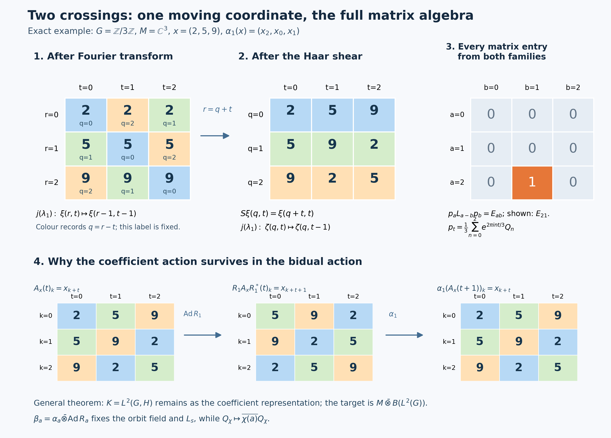

# Two crossed products and the surviving action

Crossing by an abelian action and then by its dual reveals a full algebra of operators on the group Hilbert space. The calculation also leaves an action behind. We identify the algebra and that surviving action in one system of coordinates, and test the answer on finite, uncountable, and trivial actions.

The proof applies to every locally compact Hausdorff abelian group and every von Neumann algebra. The earlier Haar, scalar Fourier, regular-representation and concrete predual proofs supply its exact foundations. We retain the finite-matrix proof of normal tensor transport and supply the multiplication-algebra argument at the same arbitrary-group scope.

For the source theorem and its coordinate calculation, see Takesaki, *Theory of Operator Algebras II*, X.2, Proposition 2.2 and Theorem 2.3(iii)–(iv), printed pp.257–263. The full proof below keeps its own negative-character convention.

*Newly written and restored original expression and illustration code in this chapter are dedicated to CC0-1.0. Source publications and programme dependencies retain their own terms.*

## Setting and prerequisites

### Groups, actions, and background results

Throughout, \(G\) is a locally compact Hausdorff abelian group, written additively. It need not be second countable, metrizable, discrete, compact, or sigma compact. A von Neumann algebra \(M\) need not have separable predual or a faithful normal state. An action \(\alpha:G\to\operatorname{Aut}(M)\) consists of normal unital \(*\)-automorphisms and is point ultraweakly continuous. Faithful normal representations turn its individual orbits into strong-star continuous operator-valued functions: weak continuity of \(\alpha_s(x)\), \(\alpha_s(x)^*\alpha_s(x)=\alpha_s(x^*x)\), and their adjoints gives this assertion by expanding squared vector norms.

The following earlier proofs provide the inputs; each applies at the generality just stated.

- [L24 Sections 2–4](OA-FLOW-L24.md#oa-flow.grp.haarconventions) fixes the locally determined Haar completion, proves the finite-exponent comparison, compact continuous density, translation continuity and arbitrary-Hilbert Bochner/tensor identification. Its Section 5 gives the compact positive approximate-identity nets. [HR-05](OA-FLOW-HR.md#hr-05) supplies Radon-product integration with its sigma-finite-carrier qualification; [HR-07](OA-FLOW-HR.md#hr-07) supplies Haar changes of variables. The abstract tensor and compact-cutoff proofs are [H0](OA-FLOW-TOPOLOGY.md#l138-h0).
- [Scalar Plancherel SP3–4](OA-FLOW-PLANCHEREL.md#scalar-plancherel-p3) proves the onto scalar Fourier unitary and its actual integral domains. [H3–4](OA-FLOW-HARMONIC-LATE.md#l138-h3) proves topological biduality and the exact returned Haar measure. [H1](OA-FLOW-HARMONIC.md#l138-h1) supplies the dual group's locally compact topology. No scalar Plancherel or biduality theorem is inferred from the duality theorem below.
- [NR-3](OA-FLOW-NR.md#oa-flow.nr.3) constructs the full faithful normal regular coefficient map, and [NR-4](OA-FLOW-NR.md#oa-flow.nr.4) proves normal representation independence by arbitrary amplification and faithful compression, including a normal inverse. These proofs apply separately to the first and second crossed products. [ST-2](OA-FLOW-ST12.md#oa-flow.st.2) proves that every faithful normal representation has a von Neumann image and a normal inverse. [AT1–3](OA-FLOW-AT.md#oa-flow.at.1) proves the action-topology and predual passages used in NR.
- [CF6–8](OA-FLOW-CF.md#oa-flow.cf.6) proves the C\* norm, positivity and bounded Hilbert-form facts, [CF10](OA-FLOW-CF.md#oa-flow.cf.10) the completion facts, and [CF1](OA-FLOW-CF.md#oa-flow.cf.1) the maximal principle used for arbitrary orthonormal bases. [CP4–6](OA-FLOW-CP.md#oa-flow.cp.4) supplies the complete concrete vector-series predual, its norm closure and its annihilator separation. [BD1,4,5](OA-FLOW-BD.md#oa-flow.bd.1) proves the bicommutant theorem, bounded density and the bounded strong-to-ultraweak passage. Fixed operator multiplication and compression are ultraweakly continuous by sending each summable vector-series test to another such test. [NCF1](OA-FLOW-NCF.md#ncf-1) also proves the normal matrix-entry tensor transport; Lemma 2 retains a direct proof here.

The multiplication algebra required in Lemma 1 is proved locally below. An independent compact-kernel route is available in [WY1–2](OA-FLOW-WY.md#wy-1), and is retained after that lemma. Neither proof presumes a countable group or Hilbert basis. If \(M=0\), both crossed products and the target are zero and all maps have the unique zero-algebra interpretation; in the proof we may therefore take a nonzero faithful representation.

For the rest of this chapter \(L^\infty(G)\) means the sectionwise completed, locally determined convention of L24 Section 2. An \(L^p\) vector for \(p<\infty\) has a representative on a sigma compact Borel carrier and has the same norm as for outer-regular Radon Haar. A raw locally null set need not be globally Radon null. Product substitutions are first checked on compact continuous tensors, using the Radon product, and then extended by Hilbert density. No unrestricted product-Borel equality or non-sigma-finite Fubini theorem is asserted.

## The duality statement

### Fourier and translation conventions

Write \(\widehat G\) multiplicatively: its elements are continuous characters \(\chi:G\to\mathbb T\), with \(\chi(s+t)=\chi(s)\chi(t)\). For the Fourier transform from the dual group back to the group we use
\[
 [\mathcal F_{\widehat G}f](t)
 =\int_{\widehat G}\overline{\chi(t)}f(\chi)\,d\chi.
\]
This formula initially applies to integrable functions. The symbol also denotes its unitary \(L^2\) extension. This is a Fourier transform on \(\widehat G\), not the inverse of the same-sign Fourier transform on \(G\). Distinguishing those operations prevents a sign error later.

On \(L^2(G)\), put
\[
 [L_s f](t)=f(t-s),\qquad
 [R_s f](t)=f(t+s),\qquad
 [Q_\chi f](t)=\overline{\chi(t)}f(t).
\]
Since \(G\) is abelian it is unimodular, so these translations are unitary without a modular-function factor. In particular \(R_s=L_{-s}\). The commutation relation is
\[
 L_sQ_\chi L_s^*=\chi(s)Q_\chi.
\]

Let \(N=M\rtimes_\alpha G\), with its named inclusions \(i:M\to N\) and \(s\mapsto\lambda_s\in\mathcal U(N)\). Thus \(\lambda_s i(x)\lambda_s^*=i(\alpha_s(x))\). The dual action is

\[
 \theta_\chi(i(x))=i(x),\qquad
 \theta_\chi(\lambda_s)=\overline{\chi(s)}\lambda_s.
 \tag{D1}
\]
Let \(P=N\rtimes_\theta\widehat G\). Its named generators are \(j(n)\), \(n\in N\), and \(\ell_\chi\), \(\chi\in\widehat G\). The bidual action \(\delta:G\to\operatorname{Aut}(P)\), under the evaluation identification of Pontryagin duality, is

\[
 \delta_a(j(n))=j(n),\qquad
 \delta_a(\ell_\chi)=\overline{\chi(a)}\ell_\chi.
 \tag{D2}
\]

### Duality and the bidual action

**Theorem (duality, including the bidual action).** There is a unique normal \(*\)-isomorphism

\[
 \Phi:(M\rtimes_\alpha G)\rtimes_\theta\widehat G
 \longrightarrow M\,\overline\otimes\,B(L^2(G))
 \tag{D3}
\]
with the following formulas in any faithful normal representation of \(M\):

\[
 \begin{aligned}{}
 [\Phi(j(i(x)))\xi](t)&=\alpha_{-t}(x)\xi(t),\\
 \Phi(j(\lambda_s))&=1\otimes L_s,\\
 \Phi(\ell_\chi)&=1\otimes Q_\chi.
 \end{aligned}
 \tag{D4}
\]
Moreover,

\[
 \Phi\delta_a\Phi^{-1}
 =\alpha_a\otimes\operatorname{Ad}R_a
 \quad(a\in G).
 \tag{D5}
\]
The theorem makes no assertion that the embedding of \(M\) in (D4) is \(x\mapsto x\otimes1\). Usually it is not. It also makes no assertion that \(M\rtimes_\alpha G\) itself is a tensor product.

We prove (D3) before (D5). The supporting lemmas isolate the two possible sources of a hidden multiplicity or a hidden countability assumption.

## Translations and characters on the group Hilbert space

### Why the Weyl pair generates all operators

**Lemma 1 (the concrete Weyl pair).** For every locally compact Hausdorff abelian group,

\[
 \{L_s,Q_\chi:s\in G,\ \chi\in\widehat G\}''=B(L^2(G)).
 \tag{D6}
\]

**The multiplication and predual details.** Choose L24's open sigma compact subgroup and its clopen cosets \(D\). Then \(L^2(G)=\bigoplus_D L^2(D)\): finite coset sums are dense by the finite-exponent carrier proof. On each \(D\) choose measurable finite-measure sets \(E_n\uparrow D\), for example finite unions of a compact exhaustion. If \(T\) commutes with every multiplier, it commutes with the coset projections and is diagonal in this sum. On a coset put \(f_n=T1_{E_n}\). For every measurable \(F\subset E_n\), commutation with \(1_F\) gives \(T1_F=f_n1_F\). Therefore
\[
 \int_F |f_n|^2\leq\|T\|^2\mu(F).
\]
Testing sets on which \(|f_n|>\|T\|+\varepsilon\) proves \(|f_n|\leq\|T\|\) almost everywhere on \(E_n\). For \(m\geq n\), restriction of \(T1_{E_m}\) to \(E_n\) equals \(T1_{E_n}\); the countable compatible representatives give one bounded measurable \(f_D\). Finite-measure simple functions are dense in \(L^2(D)\) by SC3 and SC7, so \(T=M_{f_D}\) there. Assemble these sectionwise representatives to \(f\in L^\infty(G)\), with the same bound. This proves that the multiplier algebra is its own commutant, hence is a von Neumann algebra, without a Radon–Nikodym theorem or a global union of Radon null sets. Conversely all multipliers commute with one another. Faithfulness and the equality \(\|M_f\|=\|f\|_\infty\) follow by testing finite-measure subsets of a coset on which a proposed smaller bound fails.

Every normal functional on this algebra is, by CP4–6, a restricted vector series. With the inner product linear in its first argument it has the form
\[
 \omega(M_f)=\sum_n\int_G f(t)\xi_n(t)\overline{\eta_n(t)}\,dt
             =\int_G f(t)g(t)\,dt,\qquad
 g=\sum_n\xi_n\overline{\eta_n}\in L^1(G).
\]
Scalar Cauchy–Schwarz and \(\sum_n\|\xi_n\|_2\|\eta_n\|_2<\infty\) justify the norm-convergent \(L^1\) sum and interchange. Conversely any \(g\in L^1(G)\) is a vector product: take \(\xi=\sqrt{|g|}\), \(\eta=\overline g/\sqrt{|g|}\), both zero at zeros. Thus the inherited ultraweak topology is exactly \(\sigma(L^\infty,L^1)\); the functional norm equals \(\|g\|_1\), by the sectionwise measurable phase test. This establishes the multiplication predual premise rather than postulating it.

**Proof of Lemma 1.** First show that the characters span an ultraweakly dense subspace of this multiplication algebra. If \(g\in L^1(G)\) annihilates every character, its Fourier transform is zero. Here is the needed Fourier uniqueness argument. For \(h\in C_c(G)\subset L^1(G)\cap L^2(G)\), the convolution belongs to both spaces: absolute integration gives \(\|g*h\|_1\leq\|g\|_1\|h\|_1\), while the Hilbert-space integral inequality gives
\[
 \|g*h\|_2
 \leq\int_G|g(s)|\,\|L_sh\|_2\,ds
 =\|g\|_1\|h\|_2.
\]
The convolution identity, obtained by an absolutely integrable iterated integral, gives
\[
 \widehat{g*h}=\widehat g\,\widehat h=0.
\]
The compatibility and injectivity in the Plancherel theorem imply \(g*h=0\). Choose the approximate identity with \(h_i\in C_c(G)\), \(h_i\geq0\), \(\int h_i=1\), and supports tending to the identity. Such functions exist by local compactness and continuous compactly supported cutoffs; continuity of translations in \(L^1\) gives \(g*h_i\to g\) in \(L^1\). Thus \(g=0\). The just-proved predual description and CP5 annihilator separation prove the ultraweak density claim. Consequently
\[
 \{Q_\chi:\chi\in\widehat G\}''
 =\{M_f:f\in L^\infty(G)\}.
\]

An operator commuting with all \(Q_\chi\) is therefore a multiplier \(M_f\), because multiplication operators form a maximal abelian von Neumann algebra. It commutes also with every \(L_s\) exactly when

\[
 f(\,\cdot-s)=f
 \quad\text{in }L^\infty(G)\quad(s\in G).
 \tag{D7}
\]
It remains to deduce that \(f\) is constant without intersecting uncountably many sets of full measure.

For \(h\in C_c(G)\), define
\[
 k_h(t)=\int_G f(u)h(t-u)\,du.
\]
This is a bounded continuous function, because
\[
 |k_h(t+a)-k_h(t)|
 \leq\|f\|_\infty\,\|h(\,\cdot+a)-h\|_1.
\]
For each fixed \(a\), the change of variable \(u=v+a\), followed by (D7) for that one \(a\), gives \(k_h(t+a)=k_h(t)\) for every \(t\). Thus \(k_h\) is constant. If \(h_i\geq0\), \(\int h_i=1\), is an approximate identity, then \(f*h_i\to f\) weak*: pairing against \(g\in L^1\) reduces this assertion to \(g*\check h_i\to g\) in \(L^1\), where \(\check h_i(s)=h_i(-s)\). The constants form a weak* closed one-dimensional subspace. Therefore \(f\) is constant.

The commutant of the operators in (D6) is precisely the scalars. Applying the bicommutant theorem proves (D6). Every approximation above is a net, and the argument used no simultaneous pointwise version of (D7). ∎

**The retained compact-kernel alternative.** Integrating \(Q_\chi\) against \(g\in L^1(\widehat G)\) gives multiplication by \(\widehat g(j(t))\). H1 identifies the uniform closure of these functions with \(C_0(G)\); integrated multipliers belong to \(\{Q_\chi\}''\) by CP5 separation and the actual L24 integrals. For \(p,q\in C_c(G)\), set \(F_s(t)=p(t)\overline{q(t-s)}\). This is a compact continuous \(C_0(G)\)-valued function of \(s\). On each vector \(M_{F_s}L_s\) is continuous and has the integrable norm bound \(\|F_s\|_\infty\|\xi\|_2\); L24's vector Bochner integral therefore defines a bounded operator of norm at most \(\int\|F_s\|_\infty\,ds\). CP5 separation puts that operator in the generated algebra, since its normal functional pairings are integrals of elements of that algebra. No norm continuity of \(s\mapsto L_s\) in \(B(L^2(G))\) is assumed. On compact continuous vectors, qualified Fubini and \(u=t-s\) give
\[
 \int_G[M_{F_s}L_s\xi](t)\,ds
   =p(t)\int_G\overline{q(u)}\xi(u)\,du
   =[\theta_{p,q}\xi](t).
\]
The integral bound extends the identity to all \(L^2\) vectors. Compact continuous density and \(\|\theta_{p,q}\|\leq\|p\|_2\|q\|_2\) put every rank-one operator in the algebra. Finite-basis projection nets converge strongly to \(1\); their compressions of any bounded operator are finite rank and converge strongly to that operator. BD gives (D6) again. This is the concrete case of WY2 with reflected translation signs; no multiplicity theorem is needed for this alternative.

### Tensor commutants and normal multiplicity

**Lemma 2 (tensor commutants and normal multiplicity).** Let \(H,K\ne0\) be arbitrary Hilbert spaces.

(a) The commutant of \(1_H\otimes B(K)\) on \(H\otimes K\) is \(B(H)\otimes1_K\).

(b) If \(A\subset B(H)\) is a von Neumann algebra, then

\[
 (A'\otimes1_K)'=A\,\overline\otimes\,B(K).
 \tag{D8}
\]

(c) Every normal unital representation \(\sigma:B(K)\to B(E)\) is an amplification: there are a Hilbert space \(F\) and a unitary \(V:K\otimes F\to E\) with \(V^*\sigma(b)V=b\otimes1_F\).

(d) Every normal \(*\)-isomorphism \(\gamma:A\to B\) of von Neumann algebras has a normal tensor extension \(\gamma\otimes\operatorname{id}:A\overline\otimes B(K)\to B\overline\otimes B(K)\), with its expected value on elementary tensors.

**Proof.** Choose an orthonormal basis \((e_i)_{i\in I}\) of \(K\), without a countability assumption, and its matrix units \(E_{ij}\). For (a), commuting with \(1\otimes E_{ii}\) makes an operator diagonal with blocks \(T_i\in B(H)\). Commuting with \(1\otimes E_{ij}\) gives \(T_i=T_j\). Thus the operator is \(T\otimes1\).

For (b), if \(T\) commutes with \(A'\otimes1\), each matrix coefficient \(T_{ij}\in B(H)\) commutes with \(A'\), so \(T_{ij}\in A\). For finite \(J\subset I\), put \(p_J=\sum_{i\in J}E_{ii}\). The compression
\[
 (1\otimes p_J)T(1\otimes p_J)
 =\sum_{i,j\in J}T_{ij}\otimes E_{ij}
\]
belongs to the algebraic tensor product. As \(J\) increases through finite subsets of \(I\), the compressions converge strongly to \(T\). This proves one containment in (D8); the other follows by commutation on elementary tensors.

For (c), fix \(i_0\in I\) and put \(F=\sigma(E_{i_0i_0})E\). Define
\[
 V(e_i\otimes\eta)=\sigma(E_{ii_0})\eta\quad(\eta\in F).
\]
The matrix-unit relations show that this map preserves inner products on finite sums. Normality gives
\[
 \sum_{i\in I}\sigma(E_{ii})=1_E
\]
as the strong limit of finite partial sums, so the isometry is onto. It intertwines every matrix unit. Finite compressions of any \(b\in B(K)\) converge strongly and ultraweakly to \(b\); normality, or their matrix coefficients in the preceding decomposition, extends the intertwining identity to all \(b\). This proves \(c\).

For (d), ST-2 first makes \(\gamma^{-1}\) normal: apply it to the faithful normal representation \(\gamma:A\to B\subset B(H_B)\). Represent \(A\subset B(H_A)\) and \(B\subset B(H_B)\) faithfully and normally, and retain the arbitrary basis \((e_i)_{i\in I}\) of \(K\). Write
\[
 P_J=1_{H_A}\otimes p_J,\qquad Q_J=1_{H_B}\otimes p_J
\]
for finite \(J\subset I\). Every \(T\in A\overline\otimes B(K)\) has coefficients \(T_{ij}\in A\), by the same commutant calculation as in (b). Its compression \(P_JTP_J\) is the finite matrix \([T_{ij}]_{i,j\in J}\).

**Finite corners and reconstruction.** The entrywise map
\[
 \gamma_J:M_J(A)\longrightarrow M_J(B),\qquad
 [a_{ij}]\longmapsto[\gamma(a_{ij})]
\]
is a bijective \(*\)-homomorphism by finite matrix multiplication and the corresponding properties of \(\gamma\). The finite C\(*\)-norm fact stated above therefore gives

\[
 \|[\gamma(T_{ij})]_{i,j\in J}\|
 =\|[T_{ij}]_{i,j\in J}\|
 =\|P_JTP_J\|\leq\|T\|.
 \tag{D8a}
\]
For vectors \(\xi=\sum_j\xi_j\otimes e_j\) and \(\eta=\sum_i\eta_i\otimes e_i\) with finite coordinate supports in \(H_B\otimes K\), set
\[
 b_T(\xi,\eta)=\sum_{i,j}\langle\gamma(T_{ij})\xi_j,\eta_i\rangle.
\]
Choose a finite \(J\) containing both supports. Equation (D8a) bounds its absolute value by \(\|T\|\|\xi\|\|\eta\|\). Hence this form extends to all vectors and is represented by a unique bounded operator \(\Theta(T)\), with

\[
 \Theta(T)_{ij}=\gamma(T_{ij}),\qquad\|\Theta(T)\|\leq\|T\|.
 \tag{D8b}
\]
Every finite compression \(Q_J\Theta(T)Q_J\) lies in \(B\otimes B(K)\), and these compressions converge strongly to \(\Theta(T)\). Thus \(\Theta(T)\in B\overline\otimes B(K)\). The coefficient formula proves linearity, preservation of adjoints, and \(\Theta(1)=1\). Apply the same construction using \(\gamma^{-1}\) to obtain a contractive linear map \(\Psi\) in the reverse direction. The coefficients of \(\Psi\Theta(T)\) are exactly those of \(T\), and likewise for \(\Theta\Psi\). Since finite-support vectors are dense, coefficients determine operators. Consequently \(\Theta\) is bijective with inverse \(\Psi\), and both contractive estimates make it isometric.

**Multiplication.** Let \(T,U\in A\overline\otimes B(K)\). As finite \(F\subset I\) increase, \(TP_FU\to TU\) strongly, with a uniform norm bound. Therefore its \((i,j)\) coefficient
\[
 \sum_{k\in F}T_{ik}U_{kj}
\]
converges ultraweakly to \((TU)_{ij}\). Normality of \(\gamma\) permits passage through this limit. Finite multiplicativity gives

\[
 \gamma\!\left(\sum_{k\in F}T_{ik}U_{kj}\right)
 =\sum_{k\in F}\gamma(T_{ik})\gamma(U_{kj})
 =[\Theta(T)Q_F\Theta(U)]_{ij}.
 \tag{D8c}
\]
The operators on the right also converge strongly, with a uniform bound, to \(\Theta(T)\Theta(U)\). Their coefficients therefore converge ultraweakly to the coefficients of that product. Taking the two limits in (D8c) gives
\[
 \gamma((TU)_{ij})=[\Theta(T)\Theta(U)]_{ij}
 \quad(i,j\in I).
\]
By (D8b), the left side is \(\Theta(TU)_{ij}\). Equality of all coefficients proves \(\Theta(TU)=\Theta(T)\Theta(U)\). Thus \(\Theta\) is a unital \(*\)-isomorphism; in particular it and its inverse preserve positivity and order.

**Normality and elementary tensors.** Suppose \(0\leq T_\lambda\uparrow T\) is a bounded increasing net. Then \(\Theta(T_\lambda)\) is positive, increasing, and bounded by \(\|T\|\); let its supremum be \(S\). Strong and ultraweak monotone convergence, followed by normality of \(\gamma\), give
\[
 (T_\lambda)_{ij}\longrightarrow T_{ij}\ \text{ultraweakly},
 \qquad
 S_{ij}=\lim_\lambda\gamma((T_\lambda)_{ij})=\gamma(T_{ij}).
\]
Thus \(S=\Theta(T)\), verifying preservation of these suprema. Full ultraweak normality follows directly, as in NCF1: for finite-coordinate vectors \(\xi,\eta\), the functional \(T\mapsto\langle\Theta(T)\xi,\eta\rangle\) is a finite sum of normal coefficient functionals of \(\gamma\). For arbitrary \(\xi,\eta\), approximate in norm by finite-coordinate vectors. The error on \(\|T\|\leq1\) is at most \(\|\xi-\xi_F\|\|\eta\|+\|\xi_F\|\|\eta-\eta_F\|\). CP6's norm closure makes the limit functional normal, and CP4's summable vector series makes every target ultraweak functional pull back normally. This proves ultraweak continuity on the entire space, not only on bounded nets. The identical argument for \(\gamma^{-1}\) proves that \(\Psi\) is normal. The order-isomorphism argument also preserves all bounded positive suprema in both directions: upper bounds pull back to upper bounds, so least upper bounds are preserved.

If \(a\in A\) and \(b\in B(K)\), the coefficients of \(a\otimes b\) are \(b_{ij}a\). Formula (D8b) therefore gives
\[
 \Theta(a\otimes b)=\gamma(a)\otimes b.
\]
Finally, any normal extension with these values agrees with \(\Theta\) on each finite compression \(P_JTP_J\), a finite sum of elementary tensors. Those compressions converge ultraweakly to \(T\), so normality proves equality on every \(T\). This proves uniqueness, independence of the auxiliary basis, and part (d). Every finite-subset limit here is a net; no countable basis, spatial implementer for \(\gamma\), or previously asserted infinite tensor extension has been used. ∎

Part (c) explains multiplicity only after normality has been established. It does not by itself prove the full Stone-von Neumann theorem for an arbitrary pair of strongly continuous representations satisfying Weyl commutation. Extending an arbitrary Weyl pair normally from this concrete \(B(L^2(G))\) requires a further theorem, which is not used below.

## Recognizing the tensor product

### Orbit fields and the Weyl pair

**Lemma 3 (orbit fields plus the Weyl pair).** Represent \(M\subset B(H)\) faithfully and normally, and let
\[
 [A_x\xi](t)=\alpha_{-t}(x)\xi(t).
\]
Then

\[
 \{A_x,1\otimes L_s,1\otimes Q_\chi:
       x\in M,s\in G,\chi\in\widehat G\}''
 =M\,\overline\otimes\,B(L^2(G)).
 \tag{D9}
\]

**Proof.** Let the left side be \(\mathcal A\). Every \(A_x\) commutes with \(M'\otimes1\); this can be checked on elementary \(H\)-valued functions using \(\alpha_{-t}(x)\in M\). Lemma 2(b) gives \(A_x\in M\overline\otimes B(L^2(G))\), so \(\mathcal A\) is contained in the right side.

By Lemma 1, \(\mathcal A\supset1\otimes B(L^2(G))\). Hence every operator in \(\mathcal A'\) has the form \(T\otimes1\), by Lemma 2(a). Fix \(x\in M\) and vectors \(\eta,\zeta\in H\). Commutation with \(A_x\) implies that the scalar function

\[
 t\longmapsto
 \langle[T,\alpha_{-t}(x)]\eta,\zeta\rangle
 \tag{D10}
\]
is zero locally almost everywhere: test the operator commutator on vectors \(h\otimes\eta\), \(k\otimes\zeta\) with \(h,k\in C_c(G)\). Products \(h\overline k\) include all compactly supported continuous test functions after choosing a compactly supported cutoff equal to one on their support. A locally integrable scalar function with all these integrals zero is locally zero almost everywhere.

The function (D10) is continuous by the assumed action continuity, so it vanishes at every \(t\). In particular its value at \(t=0\) is zero. This argument is performed separately for each \(x,\eta,\zeta\); there is no assertion of a common exceptional null set. Since these choices are arbitrary, \(T\in M'\). Conversely every \(T\in M'\) commutes with every displayed generator. Thus \(\mathcal A'=M'\otimes1\), and Lemma 2(b) and the bicommutant theorem yield (D9). ∎

## Proof of duality

### Fourier transform, shear, and surviving action

**Proof of the theorem.** We first verify that (D1) defines a continuous action. On the regular space \(L^2(G,H_0)\), multiplication by \(\overline{\chi(r)}\) fixes every \(\pi_{\alpha,\rho_0}(x)\), while a direct computation gives
\[
 Q_\chi\lambda_sQ_\chi^*
 =\overline{\chi(s)}\lambda_s.
\]
Thus conjugation preserves the generated von Neumann algebra and has inverse conjugation by \(Q_{\chi^{-1}}\). On compactly supported continuous scalar functions, compact-open convergence of characters implies \(L^2\) convergence of their multiplication operators. Density and their uniform norm one extend this to strong continuity on the whole Hilbert space. Their conjugations are consequently point ultraweakly continuous. This proves (D1), and the same construction on the second crossed product gives (D2).

Choose a faithful normal representation \(M\subset B(H)\). The regular construction described above lets us compute both crossed products in this representation and identify the coefficient representation produced by the shear below.

The regular double crossed product acts on
\[
 \mathcal H=L^2(\widehat G,L^2(G,H)).
\]
Use \(r\in G\) and \(\chi\in\widehat G\) as its variables. The regular definition and (D1) give

\[
 \begin{aligned}{}
 [j(i(x))\xi](r,\chi)&=\alpha_{-r}(x)\xi(r,\chi),\\
 [j(\lambda_s)\xi](r,\chi)&=\chi(s)\xi(r-s,\chi),\\
 [\ell_\eta\xi](r,\chi)&=\xi(r,\eta^{-1}\chi).
 \end{aligned}
 \tag{D12}
\]
The factor \(\chi(s)\) in the second line is not a typographical reversal of (D1): the regular representation evaluates \(\theta_{\chi^{-1}}\), which reverses that factor.

Apply the partial Fourier unitary \(F=1_{L^2(G,H)}\otimes\mathcal F_{\widehat G}\). On \(L^1\cap L^2\) functions, multiplication by \(\chi(s)\) becomes translation \(t\mapsto t-s\); translation \(\chi\mapsto\eta^{-1}\chi\) becomes multiplication by \(\overline{\eta(t)}\). Checking these identities by substitution in the defining integrals and extending by unitarity gives

\[
 \begin{aligned}{}
 [Fj(i(x))F^*\xi](r,t)&=\alpha_{-r}(x)\xi(r,t),\\
 [Fj(\lambda_s)F^*\xi](r,t)&=\xi(r-s,t-s),\\
 [F\ell_\eta F^*\xi](r,t)&=\overline{\eta(t)}\xi(r,t).
 \end{aligned}
 \tag{D13}
\]

Next separate the coordinate changed by translation from the coordinate left unchanged. Define the shear
\[
 [S\xi](q,t)=\xi(q+t,t).
\]
It is a unitary with inverse \(S^*\zeta(r,t)=\zeta(r-t,t)\). Indeed, integration in \(q\) for fixed \(t\) is a Haar translation, and the equality of norms on compactly supported continuous functions extends by density. Formula (D13) becomes

\[
 \begin{aligned}{}
 [SFj(i(x))F^*S^*\zeta](q,t)&=\alpha_{-(q+t)}(x)\zeta(q,t),\\
 [SFj(\lambda_s)F^*S^*\zeta](q,t)&=\zeta(q,t-s),\\
 [SF\ell_\eta F^*S^*\zeta](q,t)&=\overline{\eta(t)}\zeta(q,t).
 \end{aligned}
 \tag{D14}
\]

Regroup the Hilbert space as \(K\otimes L^2(G)_t\), where \(K=L^2(G_q,H)\), and define

\[
 [\sigma(x)\eta](q)=\alpha_{-q}(x)\eta(q).
 \tag{D15}
\]
NR-3 makes this a faithful normal representation of \(M\). Its image is a von Neumann algebra and its inverse is normal by the faithful normal image theorem used in NR-4. Since \(G\) is abelian,
\[
 \alpha_{-(q+t)}(x)=\alpha_{-q}(\alpha_{-t}(x)).
\]
Thus the three families in (D14), after regrouping, are

\[
 [B_x\zeta](t)=\sigma(\alpha_{-t}(x))\zeta(t),
 \qquad1_K\otimes L_s,
 \qquad1_K\otimes Q_\chi.
 \tag{D16}
\]
The transferred action \(\widetilde\alpha_a(\sigma(x))=\sigma(\alpha_a(x))\) on \(\sigma(M)\) is point ultraweakly continuous, since \(\sigma\) is a faithful normal isomorphism onto its range. Apply Lemma 3 to this action. It shows that \(SF\), followed by tensor regrouping, sends \(P\) onto
\[
 \sigma(M)\overline\otimes B(L^2(G)_t).
\]
Compose this spatial isomorphism with the faithful normal coefficient identification \(\sigma^{-1}\otimes\operatorname{id}\). The tensor identification exists and is normal by Lemma 2(d). To check its value on the orbit field, slice in the \(t\)-variable against \(h,k\in C_c(G)\). The slice is the ultraweak integral of \(\overline{h(t)}k(t)\sigma(\alpha_{-t}(x))\). Normality of \(\sigma^{-1}\) carries this integral to the corresponding integral of \(\alpha_{-t}(x)\). These slices separate operators, so the coefficient identification has the stated pointwise value. The result is (D3), and (D16) gives exactly (D4). The variable \(q\) has become the Hilbert space carrying the coefficient representation. We have not deleted a Hilbert-space variable or presumed that \(K\) is separable.

Uniqueness follows because the three named families generate \(P\), and two normal homomorphisms agreeing on them agree on their ultraweakly dense unital \(*\)-algebra and hence everywhere. The same observation shows that the answer, specified by (D4), is independent of the faithful normal representation used in the construction.

It remains to prove (D5). The map \(\beta_a=\alpha_a\otimes\operatorname{Ad}R_a\) is a normal automorphism by Lemma 2(d) and conjugation by \(1\otimes R_a\). The same normal-slice argument just used shows that \(\alpha_a\otimes\operatorname{id}\) applies \(\alpha_a\) pointwise to the orbit field. Its action on the first generator is
\[
 [\beta_a(A_x)\xi](t)
 =\alpha_a(\alpha_{-(t+a)}(x))\xi(t)
 =\alpha_{-t}(x)\xi(t).
\]
Left and right translations commute, so \(\beta_a(1\otimes L_s)=1\otimes L_s\). On the third family,
\[
 R_aQ_\chi R_a^*
 =\overline{\chi(a)}Q_\chi.
\]
These are exactly the images under \(\Phi\) of (D2). Agreement on the generators proves (D5); it also gives the action continuity after transport from \(\delta\). ∎

## Models that expose the role of the second crossing

**Model 1: a three-point orbit with an arbitrary coefficient algebra.** Let \(G=\mathbb Z/3\mathbb Z\), let \(B\) be any von Neumann algebra, and set \(M=B\oplus B\oplus B\), with \(\alpha_1(b_0,b_1,b_2)=(b_2,b_0,b_1)\). No assumption on the type of \(B\) is needed. For \(x\in M\), (D4) becomes the diagonal matrix
\[
 A_x=\operatorname{diag}(x,\alpha_{-1}(x),\alpha_{-2}(x))
 \quad\text{in }M\overline\otimes M_3(\mathbb C).
\]
The first crossed-product unitaries provide the cyclic shift matrix. The second provide the diagonal character matrices. Their spectral projections are the coordinate projections \(p_0,p_1,p_2\), and
\[
 E_{ab}=p_aL_{a-b}p_b
\]
are all matrix units. More specifically,
\[
 (1\otimes E_{a0})A_x(1\otimes E_{0b})=x\otimes E_{ab}.
\]
Thus the full coefficient algebra can be recovered in each matrix entry. The bidual action permutes the matrix coordinates by right translation while simultaneously acting on every coefficient by \(\alpha\).

**Model 2: an uncountable discrete group.** Let \(I\) be uncountable and give \(G=\bigoplus_{i\in I}\mathbb Z/2\mathbb Z\) the discrete topology. Then \(L^2(G)=\ell^2(G)\) is nonseparable. Its compact dual is \(\prod_{i\in I}\mathbb Z/2\mathbb Z\). For each \(t\in G\), Haar integration over the dual gives the coordinate projection
\[
 p_t=\int_{\widehat G}\chi(t)Q_\chi\,d\chi,
\]
where the integral is taken weakly and the dual Haar measure has mass one. Character orthogonality verifies this equality on the basis of \(\ell^2(G)\). The projections satisfy
\[
 \sum_{t\in G}p_t=1
\]
in the strong sense of the net over finite subsets, and their translates again give all matrix units. No sequence of finite subsets exhausts \(G\). This model explains why replacing nets by sequences would change the theorem's scope.

**Model 3: the trivial action.** If \(\alpha_s=\operatorname{id}_M\), the first crossed product is \(M\overline\otimes\operatorname{VN}(G)\), directly from the regular generators. The second crossing adds the character multipliers to the translations on \(L^2(G)\), and Lemma 1 turns their generated algebra into \(B(L^2(G))\). The surviving action is \(\operatorname{id}_M\otimes\operatorname{Ad}R\). Even a trivial original action produces a nontrivial bidual action when \(G\ne\{0\}\).

## Exercises with solutions

**Exercise 1 (a sign test).** For \(G=\mathbb R\), set \(\chi_p(t)=e^{ipt}\). Compute \(Q_pL_sQ_p^*\), \(R_aQ_pR_a^*\), and the image under \(\mathcal F_{\widehat G}\) of multiplication by \(e^{ips}\).

**Solution.** Apply each operator to a test function. The first gives \(e^{-ips}L_s\); the second gives \(e^{-ipa}Q_p\). In the Fourier integral, \(e^{-ipt}e^{ips}=e^{-ip(t-s)}\), so the third is \(L_s\). These three identities separately check (D1), (D5), and the middle line of (D13).

**Exercise 2 (recovering a corner).** Choose a unit vector \(h\in L^2(G)\) and let \(e=|h\rangle\langle h|\). Show that the corner
\[
 (1\otimes e)(M\overline\otimes B(L^2(G)))(1\otimes e)
\]
is canonically isomorphic to \(M\). Is this corner necessarily invariant under the bidual action?

**Solution.** Since \(eB(L^2(G))e=\mathbb Ce\), compression gives precisely \(M\otimes\mathbb Ce\); the map \(x\mapsto x\otimes e\) is the required normal isomorphism. Under (D5), \(1\otimes e\) is sent to \(1\otimes|R_ah\rangle\langle R_ah|\). Thus invariance requires the line \(\mathbb Ch\) to be invariant under all right translations. Such a line need not exist: for \(G=\mathbb R\), a translation eigenvector in \(L^2(\mathbb R)\) would have essentially constant modulus and is zero. To see the modulus assertion, apply the translation-invariant-function argument to bounded truncations of \(|h|\), or convolve the invariant \(|h|^2\in L^1\) with an approximate identity. A nonzero constant cannot be integrable over \(\mathbb R\).

**Exercise 3 (why the coefficient action remains).** Suppose one proposes \(\operatorname{id}_M\otimes\operatorname{Ad}R_a\) as the bidual action in (D5). Compute its value on \(A_x\), and give the exact condition under which it fixes all \(A_x\).

**Solution.** The value at \(t\) is \(\alpha_{-(t+a)}(x)\). Equality with \(\alpha_{-t}(x)\) for every \(x,t\) is equivalent, by setting \(t=0\), to \(\alpha_a=\operatorname{id}_M\). For all \(a\), the proposed formula is therefore correct exactly when the original action is trivial. The coefficient factor \(\alpha_a\) cancels the shift of the orbit field in the general theorem.

**Exercise 4 (finite-group coefficients).** For a finite abelian group \(G\), write an explicit finite sum in \(j(\lambda_s)\) and \(\ell_\chi\) whose image under \(\Phi\) is \(1\otimes E_{ab}\), and then an element whose image is \(x\otimes E_{ab}\).

**Solution.** Put
\[
 q_t=\frac1{|G|}\sum_{\chi\in\widehat G}\chi(t)\ell_\chi,
 \qquad v_{ab}=q_a j(\lambda_{a-b})q_b.
\]
Character orthogonality gives \(\Phi(q_t)=1\otimes p_t\), hence \(\Phi(v_{ab})=1\otimes E_{ab}\). The element \(v_{a0}j(i(x))v_{0b}\) maps to \(x\otimes E_{ab}\). This also verifies surjectivity in finite dimension without any commutant argument.

## The full inverse and the parts still separate

The construction provides an inverse on the whole tensor algebra, not only on its algebraic generators. Let \(C\) denote tensor regrouping after the shear, and \(U=CSF\). Then

\[
 \Phi(X)=(\sigma^{-1}\bar\otimes\mathrm{id})(UXU^*),\qquad
 \Phi^{-1}(Y)=U^*(\sigma\bar\otimes\mathrm{id})(Y)U.
 \tag{D17}
\]
Both tensor maps are the full normal inverse maps of Lemma 2(d). Unitary conjugation is ultraweakly continuous by vector-series tests. Consequently both displayed maps are normal on arbitrary nets, are mutual inverses, and have precisely the full domains \(P\) and \(M\bar\otimes B(L^2(G))\). Changing the original faithful representation uses NR-4 on both crossings and Lemma 2(d) on the target; the resulting normal identifications intertwine these maps because they agree on all three generating families. In the zero-algebra case (D17) is interpreted as the unique map between zero algebras.

The two tensor factors in (D5) are indispensable: the right translation changes the orbit field to \(\alpha_{-(t+a)}(x)\), and the coefficient automorphism \(\alpha_a\) restores \(\alpha_{-t}(x)\). The character multiplier acquires exactly the negative phase \(\overline{\chi(a)}\). No undetermined Haar scalar remains, because H4 proves that the bidual Haar measure is the original one.

This theorem proves full normal double duality and the exact bidual action at arbitrary LCA scope. Recognition of an arbitrary covariant system from eigenunitaries, its integrability, characterization of invariant weights as dual weights, and the full second-dual weight comparison are distinct assertions. They are not inferred here from an isomorphism of algebras or equality of modular groups. The theorem also does not assert nonabelian duality, type classification, or existence of a periodic weight.

## Source

Masamichi Takesaki, *Theory of Operator Algebras II* (Springer), Chapter X, Section 2: Proposition 2.2, pp.257–259, and Theorem 2.3(iii)–(iv), statements pp.259–260 and Fourier/shear proof pp.262–263, [DOI](https://doi.org/10.1007/978-3-662-10451-4). The character convention in this chapter is explicitly negative. The book's additional fixed-point, weight-recognition and second-dual weight assertions are not inputs to this proof. The earlier programme proofs linked above and the local multiplier, matrix and orbit-field arguments give every mathematical input used here.

## Fourier, shear and the coefficient cancellation

The image is an exact finite model of the maps in [(D13)–(D16)](OA-FLOW-ND.md#equation-d13) and the action in [(D5)](OA-FLOW-ND.md#equation-d5), rather than a reduction of the arbitrary-group theorem. Take \(G=\mathbb Z/3\mathbb Z\), \(M=\mathbb C^3\), \(x=(2,5,9)\), and \(\alpha_1(x)=(x_2,x_0,x_1)\). All indices in the image are modulo three. Haar on \(G\) is counting measure and the paired dual Haar assigns mass \(1/3\) to each character. Put \(\chi_n(t)=e^{2\pi int/3}\).

The first panel is **after** the partial negative Fourier transform, with coordinates \((r,t)\). It shows component \(k=0\) of the coefficient \(\alpha_{-r}(x)\), whose value is \(x_r\). Acting by \(j(\lambda_1)\) on a vector evaluates it at \((r-1,t-1)\); both coordinates move, while \(q=r-t\) remains fixed. Blue, green and orange cells in this panel label respectively \(q=0,1,2\).

The second panel applies the Haar shear \(S\xi(q,t)=\xi(q+t,t)\). The same component now has value \(x_{q+t}\). The three colours label the rows \(q=0,1,2\). The group unitary evaluates \(\zeta\) at \((q,t-1)\), with \(q\) unchanged; the dual unitary multiplies it by \(\overline{\chi_n(t)}\). The invariant coordinate has become the coefficient Hilbert space \(K=L^2(G,H)\), not a discarded variable. For a general group the same shear is the actual Haar unitary proved in [(D14)](OA-FLOW-ND.md#equation-d14).

The third panel shows \(E_{21}=p_2L_1p_1\). In this finite model,
\[
 p_t=\frac13\sum_{n=0}^{2}\chi_n(t)Q_{\chi_n},
 \qquad E_{ab}=p_aL_{a-b}p_b.
\]
Applying the character sum to \(\delta_u\) gives \(1\) exactly when \(u=t\) and \(0\) otherwise. Hence these formulas provide every coordinate projection and matrix unit. As shown in [Model 1](OA-FLOW-ND.md#nd-models),
\[
 (1\otimes E_{a0})A_x(1\otimes E_{0b})=x\otimes E_{ab}.
\]
The orange entry is an operator matrix entry, not a probability. For arbitrary \(G\), the two full local proofs of [(D6)](OA-FLOW-ND.md#equation-d6), followed by the orbit-field commutant argument, replace this finite matrix calculation.

The fourth panel displays all three coefficient components \(k=0,1,2\), with columns \(t=0,1,2\):
\[
 A_x(t)_k=x_{k+t},\qquad
 [R_1A_xR_1^*](t)_k=x_{k+t+1},\qquad
 [\alpha_1(A_x(t+1))]_k=x_{k+t}.
\]
Here the colours track the values \(2,5,9\), respectively. The right translation changes the field, and the coefficient automorphism restores it. This is why the surviving action is \(\alpha_a\bar\otimes\operatorname{Ad}R_a\). It fixes the coefficient field and \(L_s\), while sending \(Q_\chi\) to \(\overline{\chi(a)}Q_\chi\). The negative phase and the coefficient cancellation are separately checked in the [four solved exercises](OA-FLOW-ND.md#nd-exercises).

The reproduction source uses the whole \(27\)-dimensional double-regular Hilbert space for this example, including the faithful three-dimensional coefficient representation. In orthonormal Fourier coordinates its matrix has entries \(3^{-1/2}e^{-2\pi int/3}\). It verifies the conjugated coefficient and both group generators against [(D14)](OA-FLOW-ND.md#equation-d14). These finite floating-point residuals test the depicted example; they are not the proof of a general-group limit, normality or onto assertion. The full maps and inverse on arbitrary groups and Hilbert spaces are proved in [(D3)–(D17)](OA-FLOW-ND.md#equation-d17), using finite-subset nets when a basis is uncountable.

The source theorem is Takesaki, *Theory of Operator Algebras II*, X.2, Theorem 2.3(iii)–(iv), printed pp.259–263, [DOI](https://doi.org/10.1007/978-3-662-10451-4). The arrangement, finite example, numeric tables and reproduction source here are original. The picture asserts neither recognition of arbitrary systems nor integrability or a second-dual weight comparison.
