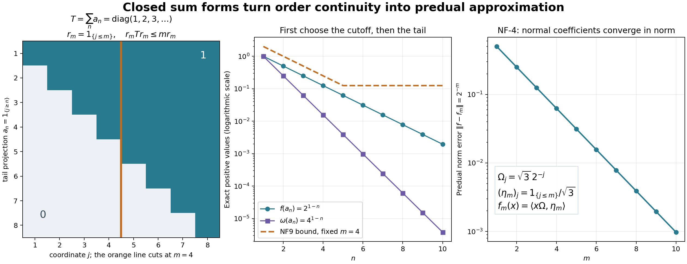

# Order-normal positive functionals and ultraweak continuity

*Fresh proof, GPT-6 Astra (OpenAI), Ultra, 2026-10-04. CC0-1.0 to the extent of rights held.*

Let \(M\subseteq B(K)\) be an arbitrary concrete von Neumann algebra. We prove that a bounded positive functional \(f\) preserving bounded increasing positive suprema belongs to its concrete predual. This finite-functional result then proves ultraweak normality of the GNS representation of every normal weight, without requiring semifiniteness. It is not the corresponding characterization of arbitrary extended-valued weights.

The exact inputs are [GW-1–5](OA-FLOW-GW.md#oa-flow.gw.1), [CF-1](OA-FLOW-CF.md#OA-FLOW.CF.1), [CF-4](OA-FLOW-CF.md#OA-FLOW.CF.4), [CF-10](OA-FLOW-CF.md#OA-FLOW.CF.10), [SF-0](OA-FLOW-SF.md#oa-flow.shared-foundations.sf-0)/[SB-0](OA-FLOW-SF.md#OA-FLOW.SF.SB0) with [SB-1–SB-6](OA-FLOW-SF.md#OA-FLOW.SF.SB1), [FF-4](OA-FLOW-FF.md#oa-flow.ff.5), [CP01–06](OA-FLOW-CP.md#oa-flow.cp.1), [ST-2](OA-FLOW-ST12.md#oa-flow.st.2) and [ST-3 coefficient proof](OA-FLOW-STC.md#oa-flow.st.coefficient). The latter is used only for a positive functional already known to be ultraweakly continuous by an explicit vector series. It contains exactly the earlier ST coefficient/GNS-normality proof, excluding the later modular application. Thus it introduces no order-normality assumption into the premise. The inverse topology result ST-2 is likewise applied only to an already ultraweakly continuous faithful representation.

For context, the freely available [Hiai author notes, Definition 7.1 and Theorem 7.2](https://arxiv.org/pdf/2004.02383v1#page=63) state broader weight criteria. No implication of that theorem is used here. The proof below instead constructs a faithful concrete vector-series functional on the support, uses a closed sum form to establish uniform absolute continuity on the positive unit ball, and gives an explicit Hahn–Banach approximation in the predual.

## NF-1. The support of an order-normal bounded positive functional

A bounded positive functional is real on self-adjoint elements and satisfies
\[
|f(y^*x)|^2\leq f(x^*x)f(y^*y).
\tag{NF1}
\]
These assertions follow from GW-2, applied to the finite weight \(f|_{M_+}\). Monotonicity also gives \(f(a)\leq\|a\|f(1)\) for \(a\geq0\), and (NF1) implies \(\|f\|=f(1)\).

Suppose from now on that \(f\) is order-normal. If \(e,g\) are projections with \(f(e)=f(g)=0\), then \(f(e+g)=0\). Its spectral projection \(1_{[\epsilon,\infty)}(e+g)\) is at most \(\epsilon^{-1}(e+g)\), and hence has zero \(f\)-value. As \(\epsilon\downarrow0\) these increase to \(s(e+g)=e\vee g\); order normality gives \(f(e\vee g)=0\). The equality of this support with the join follows from
\(\ker(e+g)=\ker e\cap\ker g\), by taking the quadratic form.

Every family of projections has a join in \(M\): project onto the closed span of its ranges, which is invariant under all unitaries of \(M'\); SF-0's test puts that projection in \(M\). Finite joins increase to this join, because their ranges have dense union in its range. Let \(q\) be the join of all projections with zero \(f\)-value. Their finite joins also have zero value, so \(f(q)=0\). Put \(p=1-q\).

By (NF1), \(f(qx)=f(xq)=0\) for all \(x\in M\); consequently
\[
f(x)=f(pxp).
\tag{NF2}
\]
The restriction \(f_p\) to \(pMp\) is faithful. If \(a\in(pMp)_+\) has zero value, all its positive spectral cutoffs have zero value, so they are at most both \(p\) and \(q\), and therefore vanish. Thus \(a=0\). It remains order-normal: an increasing bounded net in the corner has the same supremum in the corner as in \(M\), by its strong limit. If \(f=0\), the desired theorem is immediate. Otherwise \(p\ne0\) and \(f_p(p)>0\).

## NF-2. A faithful vector-series functional on this support corner

Any family of nonzero pairwise orthogonal projections in \(pMp\) is countable. Indeed, their strictly positive \(f_p\)-values have every finite sum at most \(f_p(p)\). For each positive integer \(n\), there can be only finitely many with value at least \(1/n\); the union of those finite sets contains the whole family.

For a nonzero vector \(\xi\in pK\), let \(r_\xi\) project onto \(\overline{M'\xi}\). The space and its orthogonal complement are invariant under the unitaries of \(M'\), hence \(r_\xi\in M\); moreover \(r_\xi\leq p\), because \(p\) commutes with \(M'\). The functional \(x\mapsto\langle x\xi,\xi\rangle\) is faithful on \(r_\xi M r_\xi\): if \(a\geq0\) there has zero value, then \(a^{1/2}\xi=0\), and commutation makes \(a^{1/2}\) zero on the dense set \(M'\xi\) in \(r_\xi K\). Thus \(a=0\).

Use the maximal principle to select a maximal pairwise orthogonal family of nonzero projections of the form \(r_{\xi_j}\) contained in \(p\). Their join is \(p\): otherwise a nonzero vector in the complementary subspace gives one more such projection. This family is finite or countable by the preceding paragraph. Normalize each \(\xi_j\) to norm one, and choose strictly positive numbers \(c_j\) with sum one. Define on \(pMp\)
\[
\omega(x)=\sum_j c_j\langle x\xi_j,\xi_j\rangle.
\tag{NF3}
\]
The series defines an element of the concrete predual by CP01–06, or directly by its absolutely summable vector coefficients. It is a state. It is faithful: for positive \(x\), zero value implies \(x^{1/2}\xi_j=0\) for every \(j\), hence \(x^{1/2}\) vanishes on every \(r_{\xi_j}K\), whose ranges span \(pK\).

Its GNS representation \((\pi,H,\Omega)\) is faithful and unital, and \(\Omega\) is cyclic and separating. Faithfulness follows already from \(\|\pi(x)\Omega\|^2=\omega(x^*x)\); separation is the same equality. [ST-3 coefficient proof](OA-FLOW-STC.md#oa-flow.st.coefficient) proves that \(\pi\) is ultraweakly continuous, since \(\omega\) is the explicit predual functional (NF3). [ST-2](OA-FLOW-ST12.md#oa-flow.st.2) proves that \(\pi(pMp)\) is a concrete von Neumann algebra, with ultraweakly continuous inverse. Thus the spectral constructions used below take place inside the exact represented image.

## NF-3. The summable-sequence closed-form argument

We claim that for a sequence \(0\leq a_n\leq p\) in \(pMp\),
\[
\omega(a_n)\longrightarrow0\quad\Longrightarrow\quad f_p(a_n)\longrightarrow0.
\tag{NF4}
\]
It suffices first to treat \(\sum_n\omega(a_n)<\infty\). Write \(A_n=\pi(a_n)\) and define
\[
q(v)=\sum_{n\geq1}\|A_n^{1/2}v\|^2,\qquad
\mathcal V=\{v\in H:q(v)<\infty\}.
\tag{NF5}
\]
The domain is linear; finite-sum Cauchy–Schwarz and passage to increasing partial sums give its quadratic-form identities. It contains \(\Omega\) by summability. It also contains \(\pi(pMp)'\Omega\), because for a commuting bounded operator \(b'\),
\[
q(b'\Omega)\leq\|b'\|^2q(\Omega).
\]
This subspace is dense. Indeed its closure projection lies in \(\pi(pMp)\) by the commutant-unitary test and fixes \(\Omega\); separation forces that projection to be the identity.

The form is closed. If \(v_k\) is Cauchy for \(\|v\|^2+q(v)\), let \(v\) be its limit in \(H\). Every finite partial sum of \(q(v_k-v)\) is the limit of the corresponding partial sums of \(q(v_k-v_l)\), since each \(A_n^{1/2}\) is bounded. Thus
\[
q(v_k-v)\leq\liminf_{l\to\infty}q(v_k-v_l).
\]
The right side tends to zero as \(k\to\infty\). The inequality for \(q(v)\) obtained from \(v=v_k+(v-v_k)\) makes \(v\in\mathcal V\). This proves completeness of the form domain.

FF-4 supplies its positive self-adjoint representing operator \(T\), with
\(q(v)=\|T^{1/2}v\|^2\) on exactly \(\mathcal V\). For a unitary \(u'\) in the commutant, \(q(u'v)=q(v)\). Uniqueness in FF-4 therefore gives \(u'Tu'^*=T\), including domains, and SF's spectral covariance puts
\[
r_m=1_{[0,m]}(T)\in\pi(pMp),\qquad r_m\uparrow1_H
\tag{NF6}
\]
strongly. Since the form is densely defined, there is no infinite-domain projection. For every finite \(N\) and every \(v\),
\[
\left\langle r_m\left(\sum_{n=1}^N A_n\right)r_mv,v\right\rangle
\leq q(r_mv)\leq m\|r_mv\|^2.
\tag{NF7}
\]
Set \(e_m=\pi^{-1}(r_m)\). The faithful isomorphism preserves order, so \(e_m\) are projections increasing to \(p\). For clarity, their least upper bound is \(p\): any upper bound maps to an upper bound of all \(r_m\), whose supremum is the identity. Transporting (NF7) and applying finite additivity gives
\[
\sum_{n=1}^N f_p(e_m a_n e_m)\leq m f_p(e_m).
\tag{NF8}
\]
For each fixed \(m\), it follows that \(f_p(e_m a_n e_m)\to0\).

We also have
\[
f_p(a_n)\leq
2f_p(e_m a_n e_m)+2f_p(p-e_m).
\tag{NF9}
\]
For a direct operator proof, positivity of
\((a_n^{1/2}e_m-a_n^{1/2}(p-e_m))^*
 (a_n^{1/2}e_m-a_n^{1/2}(p-e_m))\)
gives \(a_n\leq2e_m a_n e_m+2(p-e_m)a_n(p-e_m)\).
The latter second term is at most \(2(p-e_m)\); apply \(f_p\).
Since \(e_m\uparrow p\), order normality gives \(f_p(p-e_m)\to0\). First choose \(m\), then let \(n\to\infty\) in (NF9). This proves (NF4) in the summable case.

In general, if (NF4) failed, select a subsequence with \(f_p(a_n)\) bounded below by one fixed positive number, and refine it so that \(\omega(a_n)\leq2^{-n}\). The summable case contradicts that lower bound. Thus (NF4) holds for every sequence as asserted.

Equivalently, for every \(\varepsilon>0\) there is \(\delta>0\) such that
\[
0\leq a\leq p,\quad \omega(a)<\delta
\quad\Longrightarrow\quad f_p(a)<\varepsilon.
\tag{NF10}
\]
If this uniform assertion failed, choosing one violating contraction for \(\delta=1/n\) would contradict (NF4). This use of sequences does not require the algebra or its Hilbert space to be separable; it establishes a scalar uniform implication.

## NF-4. Norm approximation by actual predual coefficients

Fix \(\varepsilon>0\). By (NF1) and (NF10), there is a \(\delta>0\) such that for every contraction \(x\in pMp\),
\[
\|\pi(x)\Omega\|<\delta\quad\Longrightarrow\quad |f_p(x)|<\varepsilon.
\]
Indeed the squared vector norm is \(\omega(x^*x)\), and
\(|f_p(x)|^2\leq f_p(p)f_p(x^*x)\).
For all contractions, split according to the preceding inequality or its failure to obtain
\[
|f_p(x)|\leq\varepsilon+C\|\pi(x)\Omega\|,
\qquad C=\|f_p\|/\delta.
\]
Rescaling gives the homogeneous bound
\[
|f_p(x)|\leq\varepsilon\|x\|+C\|\pi(x)\Omega\|
\quad(x\in pMp).
\tag{NF11}
\]
Apply the complex Hahn–Banach theorem from CF-1 to the functional
\((x,\pi(x)\Omega)\mapsto f_p(x)\) on the diagonal linear subspace of \(pMp\oplus H\), equipped with the norm
\(\varepsilon\|x\|+C\|v\|\).
Here \(C>0\), since \(f_p\ne0\). The extension has the form
\[
F(x,v)=h_\varepsilon(x)+\langle v,\eta_\varepsilon\rangle,
\qquad \|h_\varepsilon\|\leq\varepsilon,\quad
\|\eta_\varepsilon\|\leq C.
\]
The decomposition follows by restricting the extension to the two summands, and the Hilbert representation theorem supplies \(\eta_\varepsilon\). Its restriction to the diagonal says
\[
\big\|f_p-\big[x\mapsto
\langle\pi(x)\Omega,\eta_\varepsilon\rangle\big]\big\|
\leq\varepsilon.
\tag{NF12}
\]
The bracketed coefficient is ultraweakly continuous because \(\pi\) already is. CP01–06 prove that the concrete predual is a norm-closed subspace of the bounded dual. Taking \(\varepsilon\downarrow0\) proves \(f_p\in(pMp)_*\).

Finally, compression \(x\mapsto pxp\) is ultraweakly continuous: substituting it in a vector series replaces its vectors by their \(p\)-compressions, preserving the summability bound. Equation (NF2) therefore gives \(f\in M_*\). This proves the theorem for every bounded order-normal positive functional.

Conversely, if \(f\in M_*\) is positive, a bounded increasing positive net converges strongly to its supremum by the earlier bounded-operator lemma and hence ultraweakly by BD7. Applying \(f\) proves order normality. Thus both directions are now proved, for arbitrary concrete von Neumann algebras.

## NF-5. The representation of every normal weight is ultraweakly continuous

Let \(\varphi\) be any normal weight, without faithfulness or semifiniteness, and let \((H_\varphi,\pi_\varphi,\Lambda_\varphi)\) be the GW-3 construction. For \(x\in N\), the functional
\[
f_x(a)=\varphi_0(x^*ax)\quad(a\in M)
\tag{NF13}
\]
is well defined and linear, since \(x^*ax\in\mathfrak m\). It is positive and bounded by \(f_x(1)=\varphi(x^*x)\). If \(0\leq a_i\uparrow a\), the same conjugated net has supremum \(x^*ax\); normality of \(\varphi\) gives \(f_x(a_i)\uparrow f_x(a)\). NF-1–4 therefore place \(f_x\) in \(M_*\).

Polarization in \(\Lambda_\varphi(x)\) gives every mixed coefficient on the dense space \(\Lambda_\varphi(N)\) as a finite linear combination of these normal positive functionals. Approximate arbitrary vectors \(\xi,\eta\in H_\varphi\) in norm by vectors from this dense space. The estimate
\[
|\langle\pi_\varphi(a)\xi,\eta\rangle
-\langle\pi_\varphi(a)\xi',\eta'\rangle|
\leq\|a\|\bigl(\|\xi-\xi'\|\|\eta\|+
                  \|\xi'\|\|\eta-\eta'\|\bigr)
\tag{NF14}
\]
shows norm convergence of the corresponding functionals, so CP's closedness places every coefficient in \(M_*\).

A concrete ultraweak functional on \(B(H_\varphi)\) is an absolutely summable vector series. Its pullback is a norm-convergent sum of the just proved normal coefficients, with total coefficient-norm bound \(\sum_j\|\xi_j\|\|\eta_j\|\). It too belongs to \(M_*\). Since those functionals define the target ultraweak topology, \(\pi_\varphi\) is ultraweakly continuous on its entire domain.

If \(\varphi\) is additionally faithful and semifinite, GW-4 proves faithfulness of \(\pi_\varphi\); [ST-2](OA-FLOW-ST12.md#oa-flow.st.2) then proves that its image is a von Neumann algebra and its inverse is ultraweakly continuous. These are precisely the normal representation and topology statements needed before the general finite-star Hilbert-algebra construction. They do not prove closability of its involution, identify opposite-weight implementing vectors, or establish the full extended-valued normality equivalence. The later [extended-valued normality theorem](OA-FLOW-EW.md#ew-5) applies to every weight; [finite-star closability](OA-FLOW-WR.md#wr-3), [fullness](OA-FLOW-WR.md#wr-4) and [the canonical opposite finite cone](OA-FLOW-WR.md#wr-6) apply to faithful n.s.f. weights. They remain separate from the finite-functional proof here.

## NF-6. Positive maps: the full order-to-topology equivalence

Let \(T:M\to N\) be a complex-linear positive map between concrete von Neumann algebras. It is bounded: for self-adjoint \(x\),
\(-\|x\|1\leq x\leq\|x\|1\) gives
\(\|T(x)\|\leq\|x\|\|T(1)\|\).
Splitting a general \(x\) into its real and imaginary parts yields the sufficient bound
\(\|T(x)\|\leq2\|T(1)\|\|x\|\).
No sharp positive-map norm theorem is needed.

Suppose \(T\) preserves bounded increasing positive suprema. If \(\omega\in N_*^+\), the functional \(\omega\circ T\) is bounded and positive. It is order-normal: \(T(a_i)\uparrow T(a)\), and the already proved converse in NF-4 applies to \(\omega\). Hence NF-1–4 put \(\omega\circ T\) in \(M_*\).

Every member of \(N_*\) is a linear combination of four positive members of \(N_*\). To include the exact proof, write its CP vector series as
\(g(a)=\sum_j\langle a u_j,v_j\rangle\), with both vector sequences square summable. For \(k=0,1,2,3\), set
\[
\omega_k(a)=\sum_j
\langle a(u_j+i^kv_j),u_j+i^kv_j\rangle.
\]
The squared vector norms have finite sum, so these are bounded positive predual functionals. Direct expansion with the linear-first convention gives
\[
g=\frac14\sum_{k=0}^3 i^k\omega_k.
\tag{NF15}
\]
Thus \(g\circ T\in M_*\) for every \(g\in N_*\), proving that \(T\) is ultraweakly continuous on all of \(M\).

Conversely, suppose \(T\) is positive and ultraweakly continuous, and \(0\leq a_i\uparrow a\). The bounded-operator strong-limit lemma and BD7 give \(a_i\to a\) ultraweakly. The increasing positive net \(T(a_i)\) is bounded above by \(T(a)\), so it has a supremum \(b\) and converges to \(b\) strongly, hence ultraweakly. Ultraweak continuity also gives convergence to \(T(a)\); vector functionals separate operators, so \(b=T(a)\). This proves the converse.

In particular every order-normal \*-representation is ultraweakly continuous, and the topology conclusions of ST-2 apply whenever it is faithful. This general positive-map theorem is independent of the normality equivalence for extended-valued weights: its only scalar normality input is the complete finite-functional proof NF-1–4.

## NF-7. A closed sum form and norm approximation of a functional

This is an exact commutative example of [NF-3 and NF-4](OA-FLOW-NF.md#oa-flow.nf.3), not a reduction of the general proof to commutative algebras. Let \(M=\ell^\infty(\mathbb N)\) act on \(\ell^2(\mathbb N)\), and set
\[
\omega(x)=\sum_{j\geq1}3\,4^{-j}x_j,\qquad
f(x)=\sum_{j\geq1}2^{-j}x_j,\qquad
\Omega_j=\sqrt3\,2^{-j}.
\]
Both are faithful states; absolute summability puts them in the concrete predual directly. The vector \(\Omega\) implements \(\omega\) and is cyclic and separating: finite coordinate vectors are in \(M\Omega\), and every coordinate of \(\Omega\) is nonzero.

For the tail projection \(a_n=1_{\{j\geq n\}}\), summing geometric series gives
\[
\omega(a_n)=4^{1-n},\qquad f(a_n)=2^{1-n},\qquad
q(v)=\sum_n\|a_n v\|^2=\sum_j j|v_j|^2.
\]
The double nonnegative sums agree because both are suprema of finite subsums. Thus the associated operator is \(T=\operatorname{diag}(1,2,3,\ldots)\), with exact operator domain \(\{v:\sum_j j^2|v_j|^2<\infty\}\) and form domain \(\{v:\sum_j j|v_j|^2<\infty\}\). The first panel displays only \(1\leq n,j\leq8\); the construction and the domain formulas are infinite. Its cutoff \(r_m=1_{\{j\leq m\}}\) is exactly \(1_{[0,m]}(T)\). Also \(q(\Omega)=\sum_n4^{1-n}=4/3\), verifying the summability premise.

For \(m=4\), the middle panel compares \(f(a_n)\), \(\omega(a_n)\), and the precise NF9 upper bound
\[
2f(r_m a_n r_m)+2f(1-r_m),\qquad
f(r_m a_n r_m)=
\begin{cases}2^{1-n}-2^{-m},&n\leq m,\\0,&n>m.\end{cases}
\]
The fixed-cutoff bound levels off at \(2^{1-m}\). The proof therefore chooses a sufficiently large cutoff before taking \(n\) large; it does not incorrectly claim that one fixed-cutoff estimate tends to zero.

In the final panel, the coefficient vectors
\((\eta_m)_j=1_{\{j\leq m\}}/\sqrt3\) give
\[
f_m(x)=\langle x\Omega,\eta_m\rangle
=\sum_{j\leq m}2^{-j}x_j,\qquad
\|f-f_m\|=2^{-m}.
\]
The upper bound is the tail sum times \(\|x\|_\infty\); taking \(x=1\) gives equality. Hence these concrete normal coefficients converge in predual norm. The vectors have norm \(\sqrt{m/3}\), and do not converge in \(\ell^2\); boundedness of a common coefficient vector is not required for predual norm approximation. This displays the mechanism behind NF12. The general theorem obtains its approximants by the explicit Hahn–Banach argument, rather than assuming such coordinate formulas.

The exact plotted formulas and finite sample arrays are retained in [render_normality_mechanism.py](../assets/general-weight/render_normality_mechanism.py) and [normality-figure-numerics.json](../assets/general-weight/normality-figure-numerics.json). Human context is [Hiai's free author notes, §7.1](https://arxiv.org/pdf/2004.02383v1#page=63); no unproved implication from its broader weight theorem is used. Original figure, code and caption: CC0-1.0 to the extent of rights held.
