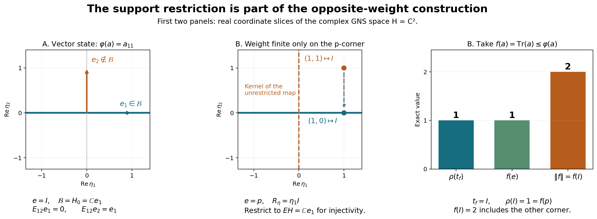

# A commutant weight without faithfulness or semifiniteness of the input

*Fresh local reconstruction, GPT-6 Astra (OpenAI), Ultra, 2026-10-04. CC0-1.0 to the extent of rights held.*

Let \(\varphi\) be any normal weight on \(M\subseteq B(K)\). Normality means preservation of bounded increasing positive suprema. Faithfulness and semifiniteness are not assumed; zero GNS spaces are allowed. We construct a faithful normal semifinite weight on the commutant of its GNS representation, and identify its full finite positive cone with the normal positive functionals supported on the finite-domain projection and dominated by a finite multiple of \(\varphi\). This is a separate construction from the faithful Hilbert-algebra theorem.

The actual proof inputs are [GW-1–4](OA-FLOW-GW.md#oa-flow.gw.1), [NF-5](OA-FLOW-NF.md#oa-flow.nf.5), [EW-1–5](OA-FLOW-EW.md#ew-1), [CV-3](OA-FLOW-CV.md#cv-3) with the exact Hilbert–Riesz proof, CF Sections 6–8, [SF, SB-0–6](OA-FLOW-SF.md#oa-flow.sf.sf0), [BD7](OA-FLOW-BD.md#oa-flow.bd.5), ST-2, and [WF-2–5](OA-FLOW-WF.md#oa-flow.wf.2). The WF proofs will be applied only through the module axioms explicitly verified below; their original dense Hilbert-algebra hypothesis is not assumed here. WR-1–2 supplies a proved bounded polar-intertwiner construction, whose density and support hypotheses are checked again for the present setting. No finite-star involution, modular conjugation or KMS assertion is used.

The free human context is [Combes, Theorem 2.13 and Proposition 2.14, printed pp.55–57](https://www.numdam.org/item/CM_1971__23_1_49_0.pdf#page=8). Those statements do not replace the extension proved here. In particular the support reduction below is necessary when the input weight is not semifinite.

Actual earlier construction proof ranges: [OA-FLOW.GW.1](OA-FLOW-GW.md#oa-flow.gw.1), [OA-FLOW.GW.2](OA-FLOW-GW.md#oa-flow.gw.2), [OA-FLOW.GW.3](OA-FLOW-GW.md#oa-flow.gw.3), [OA-FLOW.GW.4](OA-FLOW-GW.md#oa-flow.gw.4), [OA-FLOW.NF.1](OA-FLOW-NF.md#oa-flow.nf.1), [OA-FLOW.NF.5](OA-FLOW-NF.md#oa-flow.nf.5), [OA-FLOW.EW.1](OA-FLOW-EW.md#oa-flow.ew.1), [OA-FLOW.EW.2](OA-FLOW-EW.md#oa-flow.ew.2), [OA-FLOW.EW.3](OA-FLOW-EW.md#oa-flow.ew.3), [OA-FLOW.EW.4](OA-FLOW-EW.md#oa-flow.ew.4), [OA-FLOW.EW.5](OA-FLOW-EW.md#oa-flow.ew.5), [OA-FLOW.CV.3](OA-FLOW-CV.md#oa-flow.cv.3), OA-FLOW.CF.6, OA-FLOW.CF.7, OA-FLOW.CF.8, [OA-FLOW.SF.SF0](OA-FLOW-SF.md#oa-flow.sf.sf0), [OA-FLOW.SF.SB0](OA-FLOW-SF.md#oa-flow.sf.sb0), [OA-FLOW.SF.SB1](OA-FLOW-SF.md#oa-flow.sf.sb1), [OA-FLOW.SF.SB2](OA-FLOW-SF.md#oa-flow.sf.sb2), [OA-FLOW.SF.SB3](OA-FLOW-SF.md#oa-flow.sf.sb3), [OA-FLOW.SF.SB4](OA-FLOW-SF.md#oa-flow.sf.sb4), [OA-FLOW.SF.SB5](OA-FLOW-SF.md#oa-flow.sf.sb5), [OA-FLOW.SF.SB6](OA-FLOW-SF.md#oa-flow.sf.sb6), [OA-FLOW.BD.5](OA-FLOW-BD.md#oa-flow.bd.5), OA-FLOW.ST.2, [OA-FLOW.CP.1](OA-FLOW-CP.md#oa-flow.cp.1), [OA-FLOW.CP.2](OA-FLOW-CP.md#oa-flow.cp.2), [OA-FLOW.CP.3](OA-FLOW-CP.md#oa-flow.cp.3), [OA-FLOW.CP.4](OA-FLOW-CP.md#oa-flow.cp.4), [OA-FLOW.CP.5](OA-FLOW-CP.md#oa-flow.cp.5), [OA-FLOW.CP.6](OA-FLOW-CP.md#oa-flow.cp.6), [OA-FLOW.WF.2](OA-FLOW-WF.md#oa-flow.wf.2), [OA-FLOW.WF.3](OA-FLOW-WF.md#oa-flow.wf.3), [OA-FLOW.WF.4](OA-FLOW-WF.md#oa-flow.wf.4), [OA-FLOW.WF.5](OA-FLOW-WF.md#oa-flow.wf.5), OA-FLOW.WR.1, OA-FLOW.WR.2. Only the pure module arguments of WF2–5 and bounded polar/approximation arguments of WR1–2 are transported after their hypotheses are proved in NO2–3. The faithful comparison in NO6 additionally uses OA-FLOW.WR.4, [OA-FLOW.HA-R.5](OA-FLOW-HA-R.md#oa-flow.ha-r.5), OA-FLOW.MW.1, OA-FLOW.MW.2, OA-FLOW.MW.3, OA-FLOW.MW.4. It is not a premise of NO1–5.

## NO-1. The finite-domain projection

Write \(N=\{x:\varphi(x^*x)<\infty\}\), \(\mathfrak m=\operatorname{span}\{a\geq0:\varphi(a)<\infty\}\), and \((H,\Lambda,\pi)\) for GW's quotient GNS representation. [NF-5](OA-FLOW-NF.md#oa-flow.nf.5) makes \(\pi\) ultraweakly continuous. Put \(P=\pi(M)''\), \(Q=P'=\pi(M)'\).

Let \(e\in M\) be the join of all projections of finite \(\varphi\)-weight. The projection-join construction is the range-span/bicommutant argument used in [NF-1](OA-FLOW-NF.md#oa-flow.nf.1). For \(a\geq0\) of finite weight, its spectral projections \(1_{[\epsilon,\infty)}(a)\leq\epsilon^{-1}a\) have finite weight, so \(a=eae\). Hence every \(x\in N\) satisfies \(x=xe\), by applying this to \(x^*x\).

There is an increasing net of finite positive contractions \(u_i\uparrow e\). Explicitly index by the finite positive cone, directed by operator order using sums as upper bounds, and set
\[
u_a=a(1+a)^{-1}.
\tag{NO1}
\]
[GW-4](OA-FLOW-GW.md#oa-flow.gw.4) proves order monotonicity by inverse order, and \(0\leq u_a\leq a\), so its weight is finite. Every \(u_a\) is supported on \(e\). For a finite-weight projection \(p\), the elements \(u_{np}=n(1+n)^{-1}p\) tend increasingly to \(p\). Thus the supremum of the whole net dominates every such \(p\), and is exactly \(e\).

For every \(x\in Me\), \(xu_i\in N\), \(\|xu_i\|\leq\|x\|\), and \(xu_i\to x\) strongly. Conversely every element of \(N\) lies in \(Me\), a weak-operator closed space. Therefore
\[
\overline N^{\,{\rm WOT}}=Me.
\tag{NO2}
\]
Similarly, \(u_i a u_i\in\mathfrak m\) for \(a\in eMe\), with a uniform norm bound and strong limit \(a\); all elements of \(\mathfrak m\) are supported on \(e\). Thus its ultraweak closure is \(eMe\). In particular \(e=1\) exactly when \(\varphi\) is semifinite in GW's sense. The projection \(e\) describes the finite domain, not the zero-weight support.

Put \(E=\pi(e)\). Normality gives \(\pi(u_i)\uparrow E\). For a normal positive functional \(f\leq c\varphi\), define
\[
f_e(a)=f(eae).
\tag{NO3}
\]
It is normal, positive and supported on \(e\). Also \(f_e\leq c\varphi\): at a positive element of finite weight, \(a=eae\), and at an infinite value the inequality is automatic. Its norm is \(f_e(1)=f(e)\), which need not equal \(f(1)\).

## NO-2. Right bounded vectors on the exact support space

Define
\[
\mathcal B=\{\eta\in EH:\text{some }C<\infty
\text{ has }\|\pi(x)\eta\|\leq C\|\Lambda(x)\|\ (x\in N)\}.
\tag{NO4}
\]
The inequality makes the rule \(R_\eta\Lambda(x)=\pi(x)\eta\) well defined on the quotient and bounded; let \(R_\eta\in B(H)\) be its extension. The left-ideal property of \(N\) gives, on its dense GNS range,
\[
R_\eta\pi(a)\Lambda(x)=R_\eta\Lambda(ax)
=\pi(a)\pi(x)\eta=\pi(a)R_\eta\Lambda(x).
\]
Thus \(R_\eta\in Q\).

The map \(\eta\mapsto R_\eta\) is injective on \(\mathcal B\). If \(R_\eta=0\), then \(\pi(u_i)\eta=0\) for all \(i\); taking the strong limit gives \(E\eta=0\), while \(\eta\in EH\). For \(b\in Q\), \(b\eta\in EH\), since \(b\) commutes with \(E\), and
\[
b\eta\in\mathcal B,\qquad R_{b\eta}=bR_\eta.
\tag{NO5}
\]
Consequently
\[
I=\{R_\eta:\eta\in\mathcal B\}
\]
is a linear left ideal of \(Q\), with an injective linear inverse vector map
\(\theta:I\to EH\), \(\theta(R_\eta)=\eta\), satisfying \(\theta(ba)=b\theta(a)\).

Its graph has the exact weak closedness needed below: if \(a_j\in I\), \(a_j\to a\) in the weak operator topology and \(\theta(a_j)\to\eta\) weakly in \(H\), then \(\eta\in EH\) and
\[
a\Lambda(x)=\pi(x)\eta\qquad(x\in N),
\]
by testing against every Hilbert vector. Hence \(\eta\in\mathcal B\), \(R_\eta=a\), and \(\theta(a)=\eta\). No common norm bound for an arbitrary convergent net is inferred.

The restriction \(\eta\in EH\) in (NO4) is essential. Without it, any vector in \(E^\perp H\) satisfies \(\pi(x)\eta=0\) for all \(x=xe\in N\), giving the zero multiplier and destroying injectivity.

## NO-3. The ideal contains positive contractions converging strongly to \(I_H\)

Let
\[
\mathcal F_e=\{g\in M_*^+:g\leq\varphi,\ g(a)=g(eae)\ (a\in M)\}.
\]
On every finite-weight positive element, EW and (NO3) imply
\[
\varphi(a)=\sup_{g\in\mathcal F_e}g(a).
\tag{NO6}
\]
This statement is not asserted on elements outside the finite-domain corner.

For \(g\in\mathcal F_e\), define \(T_g\Lambda(x)=\pi_g(x)\Omega_g\) as in WR-1. It is a contractive intertwiner. Its range is dense in \(H_g\): normality gives
\[
\pi_g(u_i)\Omega_g\longrightarrow\pi_g(e)\Omega_g=\Omega_g,
\]
where the last equality follows from \(g(1-e)=0\). The range closure is invariant under \(\pi_g(M)\), so cyclicity proves the claim.

WR-1's explicit bounded polar argument now supplies \(t_g=T_g^*T_g\in Q\), \(0\leq t_g\leq I\), and \(\alpha_g=V_g^*\Omega_g\), with
\[
\pi(x)\alpha_g=t_g^{1/2}\Lambda(x)\quad(x\in N),\qquad
g(a)=\langle\pi(a)\alpha_g,\alpha_g\rangle,\qquad
\|\alpha_g\|^2=g(1).
\tag{NO7}
\]
The support condition gives \(\|(1-E)\alpha_g\|^2=g(1-e)=0\); hence \(\alpha_g\in\mathcal B\) and \(R_{\alpha_g}=t_g^{1/2}\in I\).

For finitely many \(x_j\in N\), the element \(\sum_jx_j^*x_j\) has finite weight. Formula (NO6), applied once to that sum, makes
\[
\sum_j\langle(I-t_g)\Lambda(x_j),\Lambda(x_j)\rangle
=\varphi\!\left(\sum_jx_j^*x_j\right)
-g\!\left(\sum_jx_j^*x_j\right)
\]
arbitrarily small. The same density and positive-contraction estimate as WR-2 therefore produces a net \(t_g\to I_H\) strongly, and \(t_g^{1/2}\to I_H\) strongly. These square roots are positive contractions in \(I\cap I^*\). No density of \(\mathcal B\) in \(H\) has been used or proved.

## NO-4. The full weight on the commutant

For \(a\in Q_+\), define
\[
\rho(a)=
\begin{cases}
\|\theta(a^{1/2})\|^2,&a^{1/2}\in I,\\
\infty,&a^{1/2}\notin I.
\end{cases}
\tag{NO8}
\]
The pure module proofs [WF-2](OA-FLOW-WF.md#oa-flow.wf.2)–5 apply to the axioms proved in [NO-2](OA-FLOW-NO.md#no-2). Here are their exact uses, including the density issue.

For \(0\leq a\leq b\), [WF-2](OA-FLOW-WF.md#oa-flow.wf.2) constructs a contraction \(d\in Q\) with \(a^{1/2}=db^{1/2}\). The left ideal and module norm give heredity of the finite cone and \(\rho(a)\leq\rho(b)\). For finite \(a,b\), the polar decomposition of the column \((a^{1/2},b^{1/2})^T=V(a+b)^{1/2}\), with entries in \(Q\), gives exactly the [WF-3](OA-FLOW-WF.md#oa-flow.wf.3) norm identity
\(\rho(a+b)=\rho(a)+\rho(b)\).
Its proof uses only the module identity for the entries of the partial isometry and its support projection; it never requires \(\theta(I)\) to be dense in \(H\). Heredity supplies every infinite-value case. Positive homogeneity is immediate. Injectivity of \(\theta\) makes \(\rho\) faithful.

For any \(x\in Q\), its bounded polar decomposition and the module identity give
\[
x\in I\quad\Longleftrightarrow\quad |x|\in I,\qquad
\rho(x^*x)=\|\theta(x)\|^2\quad(x\in I).
\tag{NO9}
\]
For the norm equality, if \(x=v|x|\), then
\(\theta(x)=v\theta(|x|)\) and
\(v^*v\theta(|x|)=\theta(|x|)\), because \(v^*v|x|=|x|\).
Thus the entire finite left ideal of \(\rho\) is \(I\); [GW-1](OA-FLOW-GW.md#oa-flow.gw.1)–2 give its finite algebra \(\operatorname{span}I^*I\) and unique linear extension.

If \(a_j\uparrow a\) boundedly and \(L=\sup_j\rho(a_j)<\infty\), the vectors \(\theta(a_j^{1/2})\) lie in a weakly compact Hilbert ball. Bounded increasing positive operators, and then their square roots, converge strongly by [WF-2](OA-FLOW-WF.md#oa-flow.wf.2). A weak cluster subnet and [NO-2](OA-FLOW-NO.md#no-2)'s weak graph give \(a^{1/2}\in I\) and \(\rho(a)\leq L\); monotonicity gives equality. If \(L=\infty\), monotonicity gives equality directly. Hence \(\rho\) is normal. EW consequently also gives its unrestricted ultraweak lower semicontinuity.

To prove semifiniteness, use the positive contractions \(c_j=t_g^{1/2}\in I\cap I^*\) from [NO-3](OA-FLOW-NO.md#no-3), with \(c_j\to I\) strongly. For every \(b\in Q\),
\[
c_jbc_j=c_j^*(bc_j)\in I^*I,\qquad
\|c_jbc_j\|\leq\|b\|,\qquad c_jbc_j\to b\text{ strongly}.
\]
[BD7](OA-FLOW-BD.md#oa-flow.bd.5)'s bounded strong-to-ultraweak result, used already in [WF-5](OA-FLOW-WF.md#oa-flow.wf.5), makes the finite algebra ultraweakly dense. Thus \(\rho\) is a faithful normal semifinite weight on \(Q\), even though \(\varphi\) need be neither faithful nor semifinite.

## NO-5. The exact normal-functional correspondence and the value \(f(e)\)

Let
\[
\mathcal Q_e=\{g\in M_*^+:g(a)=g(eae)\text{ for all }a,\quad
g\leq c\varphi\text{ for some finite }c\geq0\}.
\]
Scaling [NO-3](OA-FLOW-NO.md#no-3) supplies a unique bounded positive \(t_g\in Q\) with
\[
g(y^*x)=\langle t_g\Lambda(x),\Lambda(y)\rangle\quad(x,y\in N).
\tag{NO10}
\]
Uniqueness follows from GNS density. The canonical vector satisfies \(R_{\alpha_g}=t_g^{1/2}\); hence
\[
\rho(t_g)=\|\alpha_g\|^2=g(1)=\|g\|,\qquad
g\leq\varphi\ \Longleftrightarrow\ t_g\leq I.
\tag{NO11}
\]
The reverse inequality test uses \(x=a^{1/2}\) on every positive finite-weight \(a\), and is automatic elsewhere.

Conversely, \(\eta\in\mathcal B\) gives the normal positive functional
\(g_\eta(a)=\langle\pi(a)\eta,\eta\rangle\), supported on \(e\). For finite-weight \(a\geq0\),
\[
g_\eta(a)=\|R_\eta\Lambda(a^{1/2})\|^2
\leq\|R_\eta\|^2\varphi(a).
\]
Thus \(g_\eta\in\mathcal Q_e\), and on all \(N\), \(t_{g_\eta}=R_\eta^*R_\eta\). For a finite-weight \(t\in Q_+\), (NO9) gives the unique \(\eta\in\mathcal B\) with \(R_\eta=t^{1/2}\), so \(t_{g_\eta}=t\). The map \(g\mapsto t_g\) is additive, positively homogeneous and onto the finite positive cone of \(\rho\). It is injective: equality of (NO10) gives equality on \(\mathfrak m\), ultraweakly dense in \(eMe\) by [NO-1](OA-FLOW-NO.md#no-1); the functionals are normal and supported on \(e\).

For an arbitrary normal \(f\leq c\varphi\) without the support restriction, its form on \(N\) equals that of \(f_e\), since \(y^*x=e y^*x e\). If this form is denoted by \(t_f\), the exact conclusion is
\[
t_f=t_{f_e},\qquad
\rho(t_f)=f(e).
\tag{NO12}
\]
There is no assertion \(\rho(t_f)=\|f\|\) unless \(f\) is supported on \(e\). Such unrestricted \(f\)'s need not be determined by \(t_f\).

## NO-6. GNS range and comparison with the faithful route

Polarization of (NO9), with GW's linear-first convention, gives
\[
\rho_0(b^*a)=\langle\theta(a),\theta(b)\rangle\qquad(a,b\in I).
\]
Therefore \(\Lambda_\rho(a)\mapsto\theta(a)\) extends to a unitary from \(H_\rho\) onto
\[
H_0=\overline{\theta(I)}=\overline{\mathcal B}\subseteq EH.
\]
The subspace \(H_0\) reduces \(Q\) by the module identity, and the unitary identifies its GNS representation with the restriction of \(Q\) to \(H_0\). This restriction is faithful: if \(b\in Q\) vanishes on \(H_0\), then \(\theta(ba)=b\theta(a)=0\) for every \(a\in I\), so \(ba=0\); taking the positive contractions of [NO-3](OA-FLOW-NO.md#no-3) gives \(b=0\). It is normal because restriction to a reducing subspace pulls back each concrete vector-series functional. ST-2 therefore applies to this representation if its image topology is needed.

If the original weight is faithful and semifinite, then \(e=1\), WR identifies the whole right-bounded space with the present \(\mathcal B\), and [HA-R](OA-FLOW-HA-R.md#oa-flow.ha-r.5) proves its density. In that case \(H_0=H\) and (NO8) is exactly WR's canonical opposite weight, so MW's modular-\(J\) formula applies. For a merely normal weight, neither \(H_0=H\) nor a finite-star involution on the whole original GNS space is inferred.

## Boundary and counterexamples to the omitted shortcuts

The construction and cone correspondence cover every normal weight, including nonfaithful and nonsemifinite ones. For a vector state on \(M_2\), the GNS space is \(\mathbb C^2\), \(e=1\), while the right-bounded vectors form only the line through the state vector; density in the original GNS space fails. For a weight finite only on one matrix corner, \(e\ne1\); then the unrestricted dominated-functional formula must use \(f(e)\). These examples are proved in the accompanying illustration. Norm density of \(\mathcal Q_e\) in the entire \(M_*^+\) is not asserted for a nonfaithful input, since the vector-state example disproves it. No generalized modular conjugation, KMS theorem, standard-form theorem or operator-valued weight assertion is part of this provider.

## NO-8. The finite-domain support cannot be omitted

This figure illustrates [NO-1](OA-FLOW-NO.md#no-1), [NO-2](OA-FLOW-NO.md#no-2), [NO-5, including equation NO12](OA-FLOW-NO.md#no-5), and [NO-6](OA-FLOW-NO.md#no-6). Its source is [render_general_opposite.py](../assets/general-opposite/render_general_opposite.py). The first two panels show the real coordinate slice \(\operatorname{Im}\eta_1=\operatorname{Im}\eta_2=0\) of \(\mathbb C^2\); the proofs below concern all complex vectors. The third panel displays exact scalar values.

## Example A: a nonfaithful normal state

Let \(M=M_2(\mathbb C)\), with standard basis \(e_1,e_2\), matrix units \(E_{ij}\), and \(\varphi(a)=a_{11}=\langle ae_1,e_1\rangle\). This positive functional is normal because every matrix coefficient is ultraweakly continuous. Every element has finite weight, so \(N=M\) and the finite-domain projection is \(e=I\). Its GNS space is \(\mathbb C^2\), with \(\Lambda(x)=xe_1\) and the ordinary action \(\pi(a)=a\): the squared GNS norm is
\(\varphi(x^*x)=\|xe_1\|^2\), the range is all \(\mathbb C^2\), and the product action agrees.

Write \(\eta=\eta_1e_1+\eta_2e_2\). The right-boundedness test is
\[
\|x\eta\|\leq C\|xe_1\|\qquad(x\in M).
\]
At \(x=E_{12}\), the right side is zero and the left side is \(|\eta_2|\), so \(\eta_2=0\). Conversely, if \(\eta=c e_1\), then \(x\eta=cxe_1\), giving \(R_\eta=cI\). Thus
\[
\mathcal B=\mathbb C e_1,\qquad Q=\mathbb C I,\qquad
\rho(rI)=r\quad(r\geq0),\qquad H_\rho\simeq H_0=\mathbb C e_1.
\]
The original GNS space is two-dimensional and the opposite GNS range is only one-dimensional, even though \(e=I\).

Every positive functional dominated by a finite multiple of \(\varphi\) vanishes at \(E_{22}\). It therefore cannot approximate the vector state at \(e_2\) in norm: evaluating their difference at the norm-one projection \(E_{22}\) gives distance at least one. This proves the stated failure of full-predual cone density for nonfaithful inputs.

## Example B: a faithful normal weight that is not semifinite

Put \(p=E_{11}\), and define on positive matrices
\[
\varphi(a)=
\begin{cases}
a_{11},&a=pap,\\
\infty,&a\ne pap.
\end{cases}
\]
This is a weight. If a positive sum \(a+b\) is supported on \(p\), both summands are supported there: the quadratic value at \(e_2\) is zero for each, and positivity, via the scalar Cauchy–Schwarz inequality, makes its off-diagonal entries zero. Thus sums are finite exactly when both summands are in the corner, where additivity and homogeneity are scalar. The zero convention is as usual.

It is normal for arbitrary bounded increasing nets. If their supremum is supported on \(p\), every term is supported there and the conclusion is scalar order continuity of \(a_{11}\). If the supremum is not supported there, at least one term is not supported there, since bounded increasing positive nets converge strongly and the corner is strongly closed. That term already has infinite weight. The weight is faithful: any nonzero positive corner element has positive \(a_{11}\), and every other nonzero positive element has infinite weight. It is not semifinite because its finite algebra is only \(\mathbb C p\).

Its finite left ideal is \(N=Mp\), the matrices with zero second column. Indeed \(x^*x\) is supported on \(p\) exactly when \(xe_2=0\). As in Example A, the GNS space is \(\mathbb C^2\), \(\Lambda(x)=xe_1\), \(\pi(a)=a\), and the commutant is \(\mathbb C I\). Here the finite-domain projection is \(e=p\), so \(E=\pi(e)=p\).

For \(x\in Mp\), \(x\eta=\eta_1xe_1\). Therefore every \(\eta\in\mathbb C^2\) passes the unrestricted right-boundedness test, but its multiplier is \(R_\eta=\eta_1I\). The kernel of this vector-to-multiplier map is \(\mathbb C e_2\). Restriction to \(EH=\mathbb C e_1\) gives the injective map required by [NO-2](OA-FLOW-NO.md#no-2) and the resulting weight \(\rho(rI)=r\).

Now take \(f(a)=\operatorname{Tr}(a)\). On finite-weight positive elements \(a=sp\), \(f(a)=s=\varphi(a)\); elsewhere domination is automatic because \(\varphi(a)=\infty\). Hence \(f\leq\varphi\). For \(x,y\in Mp\), the matrix \(y^*x\) has only its \((1,1)\) entry nonzero, and
\[
f(y^*x)=\langle xe_1,ye_1\rangle.
\]
Thus \(t_f=I\) on the original GNS space. Nevertheless,
\[
\rho(t_f)=1=f(e),\qquad \|f\|=f(I)=2.
\]
The compressed functional \(f_e(a)=a_{11}\) has the same \(t_f\), proving explicitly why unrestricted \(f\mapsto t_f\) need not be injective and why NO12 must use \(f(e)\).

These finite examples are proved locally and are not substitutes for the arbitrary-net construction in NO. For the related positive right-multiplier mechanism see the freely accessible [Combes, Theorem 2.13 and Proposition 2.14, printed pp.55–57](https://www.numdam.org/item/CM_1971__23_1_49_0.pdf#page=8), whose earlier imports have been replaced in WR and NO. This figure, reproducible source and example proof are CC0-1.0 to the extent of rights held.

[Editable SVG](../assets/general-opposite/assets/general-opposite-support.svg); [exact numerical data](../assets/general-opposite/general-opposite-figure-numerics.json).
