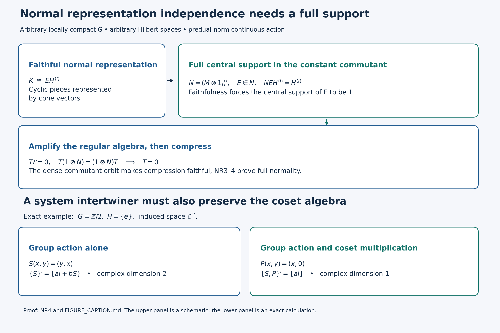

# A normal regular construction on arbitrary Hilbert spaces

*Original proof exposition: GPT-6 Astra (OpenAI), Ultra, 2026-10-04. CC0-1.0 to the extent of rights held.*

This chapter proves the normal regular construction, its faithful-representation independence and cocycle transport for every locally compact Hausdorff group. It does not prove the crossed-product commutant theorem, closed-subgroup imprimitivity, disintegration, or the induced-system converse.

Let \(M\ne0\) be a von Neumann algebra and \(G\) a locally compact Hausdorff group. Assume that \(\alpha:G\to\operatorname{Aut}(M)\) is a homomorphism into normal star automorphisms and

\[
 s\longmapsto \omega\circ\alpha_s\quad\hbox{is norm continuous in }M_*
 \qquad(\omega\in M_*).                                      \tag{NR0}
\]
No separability, countability, sigma finiteness or unimodularity is assumed. The equivalence of (NR0) with merely point-ultraweak continuity for arbitrary \(G\) is proved in the earlier [AT1–3](OA-FLOW-AT.md#oa-flow.at.3). All integrals below use the exact locally determined Haar convention of L24 Section 2 and its finite-exponent identification with completed outer regular Radon classes. Inner products are linear in the first variable.

The earlier written inputs are [HR-03/05/08/09](OA-FLOW-HR.md#hr-03); L24 [Sections 2–5](OA-FLOW-L24.md#oa-flow.grp.haarconventions) and [7–9](OA-FLOW-L24.md#oa-flow.grp.integration) (vector integrals, tensor model, Haar transformations, approximate identities and integrated actions); L25 [integration](OA-FLOW-L25.md#oa-flow.ccov.integration), [coefficient recovery](OA-FLOW-L25.md#oa-flow.ccov.coefficientrecovery) and [group recovery](OA-FLOW-L25.md#oa-flow.ccov.grouprecovery); [CP-04–06](OA-FLOW-CP.md#oa-flow.cp.4) (concrete predual, Banach norm closure and vector series); [ST-1–2](OA-FLOW-ST12.md#oa-flow.st.1) (compact balls and faithful normal topology); [BD-1–5](OA-FLOW-BD.md#oa-flow.bd.1) (bicommutant and bounded density); [NC](OA-FLOW-NC.md#oa-flow.nc.1), [CR-1](OA-FLOW-CR.md#oa-flow.cr.1), [CR-6](OA-FLOW-CR.md#oa-flow.cr.6), [CR-8–9](OA-FLOW-CR.md#oa-flow.cr.8) and [MC-1](OA-FLOW-MC.md#oa-flow.mc.1) (arbitrary standard forms, cone vectors and their exact norm bound). [AT1–6](OA-FLOW-AT.md#oa-flow.at.1) proves the full action-topology and integrated-map input. Only these actual local arguments are imported. The matrix-entry facts needed below are proved again locally.

## NR-1. Canonical implementation is strongly continuous

Choose the standard form \((\sigma,H,J,P)\) provided by NC and CR-9, and identify \(M\) with its faithful normal image. MC-1 applied to each \(\alpha_s\) supplies a unique unitary \(U_s\) such that

\[
 U_s\sigma(x)U_s^*=\sigma(\alpha_s(x)),\qquad U_sP=P,\qquad U_sJ=JU_s.
                                                               \tag{NR1}
\]
Uniqueness gives \(U_sU_t=U_{st}\) and \(U_e=1\). For the unique cone vector \(\xi_f\) of \(f\in M_*^+\),

\[
 U_s\xi_f=\xi_{f\circ\alpha_{s^{-1}}},\qquad
 \|U_s\xi_f-\xi_f\|^2\leq\|f\circ\alpha_{s^{-1}}-f\|.           \tag{NR2}
\]
The first equality follows by evaluating its vector functional and cone membership; the second is CR-6/8. Hypothesis (NR0) proves continuity at \(e\) on every cone vector. CR-1 says the complex span of \(P\) is all \(H\), so linearity and the uniform unitary bound prove strong continuity on all vectors. The group law gives continuity everywhere. Thus no separable standard Hilbert space or faithful normal state is being tacitly chosen.

For later use, every normal representation \(\rho:M\to B(K)\) has point-strong-star continuous coefficient orbits. For \(y_s=\alpha_s(x)-x\), expansion of
\(\|\rho(y_s)\eta\|^2\) uses the four normal functionals evaluating \(\alpha_s(x^*x),\alpha_s(x)^*x,x^*\alpha_s(x),x^*x\). Point-ultraweak continuity, which follows from (NR0), makes their sum tend to zero. The same argument for \(x^*\), followed by translation of the parameter, proves the assertion.

## NR-2. The norm-continuous coefficient core

Define

\[
 A=\{x\in M:s\mapsto\alpha_s(x)\text{ is norm continuous}\}.
                                                               \tag{NR3}
\]
It is an invariant norm-closed unital C\* subalgebra: sums, adjoints and products preserve orbit continuity by the triangle inequality and isometry of the automorphisms; a uniform norm limit preserves it by a three-term estimate. Invariance uses continuity of conjugation \(s\mapsto t^{-1}st\).

For \(f\in L^1(G)\), define \(\alpha_f(x)\in M=(M_*)^*\) by

\[
 \omega(\alpha_f(x))=\int_G f(t)\omega(\alpha_t(x))\,dt.
                                                               \tag{NR4}
\]
This is a bounded functional of \(\omega\) of norm at most \(\|f\|_1\|x\|\), so CP-06 gives exactly one element of \(M\). The scalar integrand is measurable on the sigma compact carrier of \(f\), and is absolutely integrable. Left invariance, tested by every \(\omega\), gives

\[
 \alpha_s(\alpha_f(x))=\alpha_{L_sf}(x),\qquad
 \|\alpha_s(\alpha_f(x))-\alpha_f(x)\|
 \leq\|L_sf-f\|_1\|x\|.                                     \tag{NR5}
\]
Normality of \(\alpha_s\) justifies its passage through the weak-star integral by the predual test. L24 Section 3 proves the last \(L^1\) difference tends to zero. Therefore \(\alpha_f(x)\in A\).

For the nonnegative normalized bumps \(a_V\) of L24 Section 5,

\[
 \|\alpha_{a_V}(x)\|\leq\|x\|,\qquad
 \omega(\alpha_{a_V}(x)-x)\longrightarrow0.                    \tag{NR6}
\]
Indeed the absolute error is at most \(\|x\|\sup_{t\in V}\|\omega\circ\alpha_t-\omega\|\). Thus \(A\) is ultraweakly dense in \(M\), with bounded approximants. This supplies the precise bridge to L25; applying that point-norm theorem to all of \(M\) without passing to \(A\) would not be justified.

## NR-3. Faithful normality of the actual regular coefficient map

Let \(\rho:M\to B(K)\) be a faithful normal unital representation, with arbitrary \(K\ne0\). On the tensor/function model \(L^2(G)\otimes K=L^2(G,K)\), define

\
 [\pi_\rho(x)\xi=\rho(\alpha_{t^{-1}}(x))\xi(t),\qquad
 \lambda_s\xi=\xi(s^{-1}t).                              \tag{NR7}
\]
For a compact scalar tensor \(h\eta\), NR-1 gives a continuous vector field \(t\mapsto\rho(\alpha_{t^{-1}}(x))\eta\). Its image on a compact set is separable, by finite metric nets, and multiplication by \(h\) is strongly measurable and square integrable. Finite compact scalar tensors are dense by L24 Section 4. The bound \(\|\pi_\rho(x)\xi\|_2\leq\|x\|\|\xi\|_2\) therefore defines an operator on all \(L^2(G,K)\); approximation identifies it with the displayed field on any strongly measurable representative. No simultaneous exceptional-set union over all Hilbert vectors is used.

Pointwise products and adjoints, first tested on compact tensors, prove that \(\pi_\rho\) is a unital star homomorphism. L24 proves that \(\lambda\) is a strongly continuous unitary representation. Direct substitution gives

\[
 \lambda_s\pi_\rho(x)\lambda_s^*=\pi_\rho(\alpha_s(x)).        \tag{NR8}
\]
Faithfulness follows without a direct integral theorem. If \(\rho(x)\eta\ne0\), the norm of the continuous orbit vector in (NR7) is bounded below on an identity neighbourhood. A nonzero compact bump supported there has positive Haar integral, so \(\pi_\rho(x)\ne0\).

To prove full ultraweak continuity, not just sequential normality, first use compact tensors \(h\eta,k\zeta\). Their coefficient on \(M\) is the \(M_*\)-valued Bochner integral

\[
 \omega_{h\eta,k\zeta}\circ\pi_\rho
 =\int_G h(t)\overline{k(t)}
       (\omega_{\eta,\zeta}\circ\rho\circ\alpha_{t^{-1}})\,dt. \tag{NR9}
\]
The vector-valued integrand is norm continuous and compactly supported by (NR0), and is integrable by L24's arbitrary-Banach-space construction. Its integral lies in the Banach space \(M_*\). Equality holds by testing at each \(x\). Approximate general pairs of \(L^2\) vectors by these finite tensors. The estimate
\(\|\omega_{v,w}-\omega_{v',w'}\|\leq\|v-v'\|\|w\|+\|v'\|\|w-w'\|\)
and CP-06's norm closure put every vector coefficient pullback in \(M_*\). Finally every ultraweak functional on \(B(L^2(G,K))\) is a vector series. Its pulled-back series converges in \(M_*\), with the Cauchy–Schwarz tail bound from CP-04. This proves ultraweak continuity for the entire topology, including arbitrary nets.

Put \(R_\rho=\{\pi_\rho(M),\lambda(G)\}''\). The bounded approximants (NR6) and normality imply

\[
 R_\rho=\{\pi_\rho(A),\lambda(G)\}''.
                                                               \tag{NR10}
\]
The latter is the von Neumann algebra generated by the integrated L25 representation of \(L^1(G,A)\). Here is the recovery detail: the integrated elements for \(a_V(t)x\) tend strongly to \(\pi_\rho(x)\), for \(x\in A\), because \(\int a_V(t)\lambda_tdt\to1\). Taking \(x=1\) and translating the bump recovers every \(\lambda_s\). The integrated operators themselves belong to \(R_\rho\), since their scalar pairings are integrals of elements of its ultraweakly closed linear span (or separate a putative exterior operator by its preannihilator, CP-05). Thus the two generated algebras coincide.

## NR-4. Amplification and normal independence of the initial representation

We give the representation comparison, rather than infer a normal isomorphism merely from equality of C\* norms.

Fix the standard representation \(\sigma\) of NR-1. Decompose \(K\) into an orthogonal sum of cyclic reducing subspaces \(K_i=\overline{\rho(M)\eta_i}\), \(i\in I\). A maximal such family exists by the maximal principle; a nonzero orthogonal complement would contain a vector generating an additional reducing subspace. The index set may be arbitrary. For each \(i\), the functional \(f_i(x)=\langle\rho(x)\eta_i,\eta_i\rangle\) is normal positive. CR-8 provides its cone vector \(\zeta_i\in H\). The map

\[
 \rho(x)\eta_i\longmapsto\sigma(x)\zeta_i
                                                               \tag{NR11}
\]
preserves all inner products, hence extends to a unitary from \(K_i\) onto \(q_iH=\overline{\sigma(M)\zeta_i}\). This subspace is reducing, so \(q_i\in\sigma(M)'\). Taking the arbitrary orthogonal sum gives a unitary

\[
 W:K\longrightarrow EH^{(I)},\qquad
 E=\operatorname{diag}(q_i)\in N:=\{\sigma(M)\otimes1_I\}',
 \quad W\rho(x)W^*=(\sigma(x)\otimes1_I)|_{EH^{(I)}}.          \tag{NR12}
\]

For clarity, \(N=\sigma(M)'\,\bar\otimes B(\ell^2(I))\) follows directly from matrix entries: commutation with \(\sigma(M)\otimes1\) says every entry belongs to \(\sigma(M)'\); finite matrix compressions converge strongly to the operator and belong to the algebra generated by those matrix entries. This proves equality with the indicated generated von Neumann tensor product. Similarly \(N'=\sigma(M)\otimes1_I\), either by the bicommutant theorem or by commuting with all matrix units and then all constant commutant entries. In particular
\(Z(N)=Z(\sigma(M))\otimes1_I\).

Let \(Q\) project onto \(\overline{N E H^{(I)}}\). The subspace is invariant under \(N\) and its adjoints, hence \(Q\in N'\). It is invariant under \(N'\) and its adjoints, since \(E\in N\), hence \(Q\in N\) as well. It contains \(EH^{(I)}\), so \(QE=E\). Write \(Q=\sigma(z)\otimes1_I\) with a central projection \(z\in M\). Equation (NR12) then gives \(\rho(1-z)=0\). Faithfulness forces \(z=1\), and consequently

\[
 \overline{N E H^{(I)}}=H^{(I)}.                              \tag{NR13}
\]
This is the exact support argument needed for the next compression.

Tensor \(W\) with \(1_{L^2(G)}\). The arbitrary sum identification
\(L^2(G)\otimes H^{(I)}\cong(L^2(G)\otimes H)^{(I)}\)
is defined isometrically on finite simple tensors, whose spans are dense on both sides. It transports (NR7) to the compression by \(\mathcal E=1\otimes E\) of the amplification \(R_\sigma\otimes1_I\). The constant algebra \(1_{L^2(G)}\otimes N\) commutes with every amplified regular generator: its entries commute with all \(\sigma(\alpha_{t^{-1}}(M))=\sigma(M)\), and translations act only on the \(G\)-variable. Thus it commutes with the whole amplified algebra, and in particular \(\mathcal E\) does too.

Compression on \(\mathcal E\) is faithful on \(R_\sigma\otimes1_I\). Indeed, an operator \(T\) there whose compression is zero kills the range of \(\mathcal E\), since it commutes with that projection. Commutation with \(1\otimes N\) makes it kill the dense span \((1\otimes N)\mathcal E(L^2(G)\otimes H^{(I)})\), which is all the space by (NR13). Hence \(T=0\).

Amplification \(T\mapsto T\otimes1_I\) is ultraweakly continuous: its vector pairings are sums of component pairings, with uniform square-summable tails. Its range is ultraweakly closed, since matrix entries characterize it by zero off-diagonal entries and identical diagonal entries. Compression is also ultraweakly continuous by vector-series tests. ST-2 therefore proves that their faithful composite has a von Neumann image and a normal inverse. That image is exactly \(R_\rho\): it contains the regular generators, and the converse containment follows by applying bounded strong-star density (BD) to the algebra of amplified generators and compressing its bounded approximants. We obtain the unique normal star isomorphism

\[
 R_\sigma\longrightarrow R_\rho,\qquad
 \pi_\sigma(x)\mapsto\pi_\rho(x),\quad\lambda_s\mapsto\lambda_s.
                                                               \tag{NR14}
\]
Uniqueness follows from ultraweak generation. Comparing two faithful normal representations through \(\sigma\) proves full normal representation independence. This argument does not assert that arbitrary faithful normal representations themselves are unitarily equivalent; the intervening amplification and compression are indispensable.

## NR-5. Exact cocycle transport

Let \(u:G\to\mathcal U(M)\) be sigma-strong-star continuous and satisfy \(u_{st}=u_s\alpha_s(u_t)\). Put \(\beta_s=\operatorname{Ad}(u_s)\alpha_s\). This is an action. It satisfies (NR0): for a vector functional, its pullback under \(\operatorname{Ad}(u_s)\) is norm continuous by the vector-functional estimate; finite vector-series approximation gives this for every normal functional, and the original predual action gives continuity of the composite. The same argument works after any faithful normal realization using ST-2's bounded topology comparison.

The field

\
 [V\xi=\rho(u_{t^{-1}})\xi(t)                              \tag{NR15}
\]
defines a unitary on all \(L^2(G,K)\). On compact tensors its vector field is continuous and has separable compact image; approximate arbitrary \(L^2\) vectors. The adjoint is multiplication by \(\rho(u_{t^{-1}}^*)\). Direct evaluation gives

\[
 V\pi_\alpha(x)V^*=\pi_\beta(x),\qquad
 V\lambda_sV^*=\pi_\beta(u_s^*)\lambda_s.                     \tag{NR16}
\]
For the second formula use
\(u_{t^{-1}s}=u_{t^{-1}}\alpha_{t^{-1}}(u_s)\), so that
\(u_{t^{-1}}u_{t^{-1}s}^*=\beta_{t^{-1}}(u_s^*)\).
The displayed images generate the beta regular algebra, because \(\lambda_s=\pi_\beta(u_s)V\lambda_sV^*\). Consequently conjugation by \(V\) is an onto normal spatial isomorphism of the two actual crossed products. This establishes the adjoint and the noncommutative order explicitly.

## Scope and source development

The proof above was constructed from the current Haar, concrete-predual and natural-cone arguments. No historical induction or commutant lesson body was used as a template. Free primary context for the remaining induction problem is Rieffel, *Induced representations of C\*-algebras* (1974), especially Theorems 6.23, 6.29 and 7.18, [author-hosted complete edition](https://math.berkeley.edu/~rieffel/papers/rieffel-C-induced.pdf). Its theorem is not substituted for a local proof. Takesaki, [*Covariant representations of C\*-algebras and their locally compact automorphism groups*](https://projecteuclid.org/euclid.acta/1485889537), Acta Math. 119 (1967), Sections 3–4, supplies separable induction/disintegration context, not an arbitrary-Hilbert theorem.

For a nonfaithful normal representation, (NR7) is still a normal covariant construction, but the proof of (NR13) fails precisely on its central kernel. If the kernel is invariant, it can be treated after passing to the quotient supported algebra. No isomorphism with the original faithful crossed product is claimed in that case. General commutant identification, closed-subgroup quotient measures, imprimitivity and direct-integral reconstruction require further proofs.

## What the two operator pictures prove

The upper panel illustrates [NR4](OA-FLOW-NR.md#oa-flow.nr.4). It is a commuting-algebra schematic, not a finite-dimensional model or a dimension comparison. The Hilbert spaces and index set \(I\) can be arbitrary. The initial faithful normal representation on \(K\) is unitarily a reducing compression of the standard representation amplified on \(H^{(I)}\):
\[
 W:K\longrightarrow EH^{(I)},\qquad
 N=(M\otimes1_I)',\qquad E=\operatorname{diag}(q_i)\in N.
\]
The canonical cone vectors for the cyclic normal functionals construct \(W\), using current CR8 and MC1. The projection onto \(\overline{NEH^{(I)}}\) belongs to both \(N\) and \(N'\). It therefore equals \(z\otimes1_I\) for a central projection \(z\in M\). Since this projection contains \(E\), its complementary central projection is killed by the original faithful representation. Hence \(z=1\).

On \(L^2(G)\otimes H^{(I)}\), the constant algebra \(1\otimes N\) commutes with the regular coefficients and with translations. Thus an operator \(T\) in the amplified regular algebra which vanishes on \(\mathcal E=1\otimes E\) vanishes on the dense span \((1\otimes N)\mathcal E(L^2(G)\otimes H^{(I)})\). Therefore \(T=0\). This proves the faithfulness of compression. Full normality is proved separately in NR3–4 by vector-series tests and ST12; the image is the entire regular algebra by bounded density. The picture must not be read as asserting that two arbitrary faithful initial representations have a unitary between their original spaces.

The lower panel is an exact finite example explaining the qualification for systems of imprimitivity. Let \(G=\mathbb Z/2\), \(H=\{e\}\), and induce the one-dimensional representation of \(H\). On \(\mathbb C^2\) with the two cosets as the ordered basis, the nonidentity group element acts by
\[
 S=\begin{pmatrix}0&1\\1&0\end{pmatrix}.
\]
For a matrix \(T=\begin{pmatrix}a&b\\c&d\end{pmatrix}\), the equation \(TS=ST\) is exactly \(d=a,c=b\). Thus the group commutant is
\[
 \{S\}'=\{aI+bS:a,b\in\mathbb C\},
\]
of complex dimension two. The coset algebra acts by every diagonal matrix. In particular commutation with \(P=\operatorname{diag}(1,0)\) forces \(b=c=0\). Combining this with commutation with \(S\) leaves precisely \(T=aI\). The full system commutant is therefore one-dimensional, as is the intertwiner space of the original one-dimensional \(H\)-representation.

This calculation does not refute imprimitivity. It shows why its morphisms must preserve the coset multiplication action as well as the group action. Rieffel, [*Induced representations of C\*-algebras*](https://math.berkeley.edu/~rieffel/papers/rieffel-C-induced.pdf) (1974), Theorem 7.18, and Green, [*The local structure of twisted covariance algebras*](https://projecteuclid.org/euclid.acta/1485889984), Acta Math. 140 (1978), Theorem 6, provide context; neither is being substituted for the missing local inverse-module proof.

The new diagram and this explanation are CC0-1.0 to the extent of rights held. Run render_c2_foundation.py with Python and matplotlib. It writes PNG, deterministic SVG and the exact diagram data beside this caption. The renderer uses fixed coordinates, a stable SVG hash salt, no SVG Date metadata, UTF-8 and LF newlines. The receipt records the actual native inspection and byte-identical rerender check.
