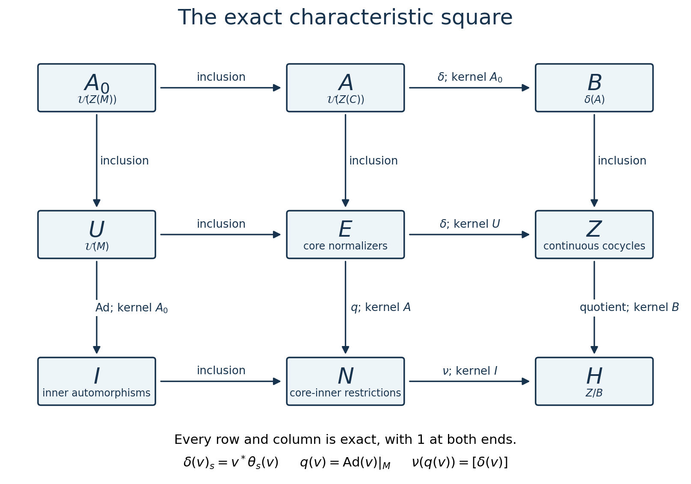
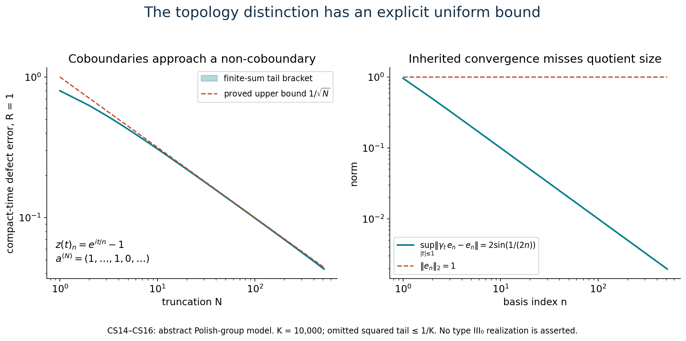
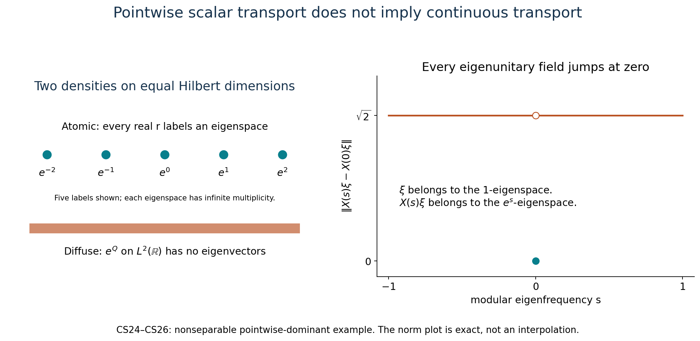

# Normalizer defects and the characteristic square

A unitary of the continuous core may normalize the original algebra without belonging to it. Its failure to be fixed by the dual action is central. That central defect describes both the extra normalizers and the topology of their quotient.

The algebraic results below apply to arbitrary von Neumann algebras. Polish assertions require separable predual. The dominant-weight comparison has two precise versions: every pointwise dominant weight in the separable case, and weights with properly infinite centralizer and supplied continuous eigenfields at arbitrary cardinality. A concrete example proves why the latter field hypothesis cannot simply be erased.

*The original exposition, arguments, examples and figures in this lesson are dedicated to CC0-1.0 to the extent of the author's rights. Referenced publications retain their own terms.*

## 1. The core and the defect

Write \(C=C(M)\), let \(M\subset C\) be its coefficient algebra, and let \(\theta\) be the negative dual action. The actual earlier core results give
\[
 C^\theta=M,\quad M'\cap C=Z(C),\quad
 \tau\theta_s=e^{-s}\tau,\quad
 \theta_s(\lambda_\varphi(t))=e^{-ist}\lambda_\varphi(t).
 \tag{CS1}
\]
Here \(\varphi\) is any faithful normal semifinite weight. The relative commutant is the unrestricted theorem [RCC1–5](OA-FLOW-RCC.md#rcc-1). The normal core functor and its precise characterization by trace and flow are [CIM1–5](OA-FLOW-CIM.md#cim-1). The full cocycle-stability theorem [CST](OA-FLOW-CST.md#cst-setting) says that every continuous unitary cocycle for this trace-scaling action has the form \(v^*\theta_s(v)\), with \(v\in\mathcal U(C)\). Its proof allows arbitrary centers and Hilbert dimension.

Put
\[
\begin{split}
 A&=\mathcal U(Z(C)),&
 A_0&=\mathcal U(Z(M)),\\
 U&=\mathcal U(M),&
 E&=\{v\in\mathcal U(C):vMv^*=M\},\\
 N&=\{\operatorname{Ad}v|_M:v\in E\},&
 I&=\operatorname{Int}(M).
\end{split}
\tag{CS2}
\]
All unitary groups use strong convergence. On unitaries this is also strong-star convergence: if \(v_i\to v\), then
\(\|(v_i^*-v^*)\xi\|=\|(v-v_i)v^*\xi\|\to0\).

For an abelian unitary group \(A\) with the action inherited from \(\theta\), set
\[
 Z=Z^1_\theta(\mathbb R,A)
 =\{c:c_{s+t}=c_s\theta_s(c_t),\ c_0=1,\ c\text{ strongly continuous}\}.
\]
Its topology is uniform strong convergence on compact time intervals. Define
\[
 \delta(v)_s=v^*\theta_s(v),\qquad B=\delta(A),\qquad H=Z/B.
 \tag{CS3}
\]

**The central-defect lemma.** For \(v\in E\), \(\delta(v)_s\in A\). The map \(\delta:E\to Z\) is a surjective homomorphism with kernel \(U\).

*Proof.* For \(x\in M\), both \(x\) and \(vxv^*\) are fixed by \(\theta_s\). Consequently
\[
 \theta_s(v)x\theta_s(v)^*=vxv^*,
\]
and \(v^*\theta_s(v)\) commutes with \(M\). It is central in \(C\) by (CS1). Strong continuity and the cocycle equation follow from the action law. For \(v,w\in E\),
\[
 \delta(vw)_s=w^*v^*\theta_s(v)\theta_s(w)
             =\delta(v)_s\delta(w)_s,
\]
because the first defect is central. Its kernel consists exactly of the fixed unitaries, hence is \(U\).

Given \(c\in Z\), CST supplies \(v\in\mathcal U(C)\) with \(v^*\theta_s(v)=c_s\). For \(x\in M\),
\[
 \theta_s(vxv^*)=vc_sxc_s^*v^*=vxv^* .
\]
The same computation for \(v^*\) gives both inclusions \(vMv^*\subset M\) and \(v^*Mv\subset M\). Thus \(v\in E\), and \(\delta\) is onto. ∎

The fixed elements of \(A\) are \(A_0\): a central fixed unitary lies in \(M\) and its center; conversely every central element of \(M\) commutes with every \(\lambda_\varphi(t)\), since modular automorphisms fix the center. This also follows from the fixed-center identity in the normal core functor.

## 2. Every arrow and every kernel

**Characteristic-square theorem.** The following diagram commutes. Every row and every column is a short exact sequence, with a \(1\) at both omitted ends:
\[
\begin{array}{ccccc}
 A_0&\longrightarrow&A&\xrightarrow{\delta}&B\\
 \downarrow&&\downarrow&&\downarrow\\
 U&\longrightarrow&E&\xrightarrow{\delta}&Z\\
 \downarrow\operatorname{Ad}&&
 \downarrow q&&\downarrow\\
 I&\longrightarrow&N&\xrightarrow{\nu}&H .
\end{array}
\tag{CS4}
\]
Here \(q(v)=\operatorname{Ad}v|_M\), the unlabeled horizontal and upper vertical arrows are inclusions, and
\[
 \nu(q(v))=[\delta(v)].
 \tag{CS5}
\]
For a nonzero factor \(A_0=\mathbb T1\). For the zero algebra all nine groups are the one-element group; the top-left entry is then not an additional scalar circle.

The six surjections are labeled with their exact kernels. All rows and columns begin and end with the trivial group. The diagram uses \(A_0=\mathcal U(Z(M))\), so it includes nonfactors; its proof is (CS1)–(CS5).

*Proof.* The first row is exact by the definition of \(B\) and the equality \(A^\theta=A_0\). The second row is the central-defect lemma. In the first column, the kernel of \(\operatorname{Ad}:U\to I\) is exactly \(\mathcal U(Z(M))\), and surjectivity is the definition of \(I\). In the middle column, \(q(v)=\mathrm{id}\) exactly when \(v\in M'\cap C\), which is \(Z(C)\); hence the kernel is \(A\), and \(q\) is onto by definition.

If \(q(v)=q(w)\), then \(w^*v\in A\), and
\(\delta(v)\delta(w)^{-1}\in B\). Thus (CS5) is well defined. It is a homomorphism and onto because \(\delta:E\to Z\) is onto. If \(q(v)\) is inner, choose \(u\in U\) with \(q(v)=q(u)\). Then \(u^*v\in A\), and \(\delta(v)=\delta(u^*v)\in B\). Conversely, if \(\delta(v)=\delta(a)\) for \(a\in A\), then \(va^*\in U\), and \(q(v)=\operatorname{Ad}(va^*)|_M\) is inner. This proves the bottom kernel. The last column is \(1\to B\to Z\to Z/B\to1\). Inclusions clearly commute with their restrictions; the only remaining square is precisely (CS5). ∎

**The lift of a normalizer.** For every \(v\in E\),
\[
 C(q(v))=\operatorname{Ad}v\quad\hbox{on }C.
 \tag{CS6}
\]
Indeed \(\theta_s(v)=v\delta(v)_s\), with a central second factor, so \(\operatorname{Ad}v\) commutes with \(\theta\). It preserves the entire trace, as every inner automorphism does. Its restriction to \(M\) is \(q(v)\). CIM4's uniqueness of the trace-preserving, flow-commuting extension now gives (CS6). This proof applies to nonfactors as well.

For a factor there is a related rigidity statement without a trace assumption. If \(\beta\in\operatorname{Aut}(C)\) fixes \(M\) pointwise and commutes with \(\theta\), put
\(a_t=\lambda_\varphi(t)^*\beta(\lambda_\varphi(t))\).
The two unitaries implement the same modular automorphism of \(M\), so \(a_t\in M'\cap C=Z(C)\). The action equation gives \(\theta_s(a_t)=a_t\). Hence \(a_t\in Z(M)=\mathbb C1\), and the group law makes it a continuous scalar character. Thus \(a_t=e^{-ipt}\) for a unique real \(p\), and \(\beta=\theta_p\) on generators, hence on the whole core by normality. The elementary character fact follows by lifting its values near \(0\) to the real argument, using additivity there, then subdividing any real time. For a nonfactor the same proof gives a continuous unitary group in \(Z(M)\); it need not have a single scalar frequency.

## 3. Equivariance on the entire square

Let \(G=\operatorname{Aut}(M)\). The action of \((\alpha,r)\in G\times\mathbb R\) on \(C\) is
\[
 F_{\alpha,r}=C(\alpha)\theta_r.
 \tag{CS7}
\]
These maps commute in their two parameters and preserve \(M,Z(C),E,A\). They act on \(U\) by \(\alpha\), on \(A_0\) by the restriction of \(\alpha\), and on \(I,N\) by \(\eta\mapsto\alpha\eta\alpha^{-1}\). The real parameter acts trivially on \(U,A_0,I,N\). On cocycles use
\[
 ((\alpha,r)c)_s=F_{\alpha,r}(c_s).
 \tag{CS8}
\]
This respects the cocycle law because \(F_{\alpha,r}\theta_s=\theta_sF_{\alpha,r}\).

Every arrow in (CS4) is equivariant. For the nontrivial checks,
\[
 \delta(F_{\alpha,r}(v))_s
      =F_{\alpha,r}(v^*\theta_s(v)),\qquad
 q(F_{\alpha,r}(v))=\alpha q(v)\alpha^{-1}.
 \tag{CS9}
\]
Thus \(B\) is invariant and the quotient action on \(H\) is well defined. The real action on \(H\) is trivial: the cocycle identity and commutativity of \(A\) give
\[
 \theta_r(c_s)
   =c_s\,c_r^*\theta_s(c_r)
   =c_s\,\delta(c_r)_s .
 \tag{CS10}
\]
This proves the last assertion directly, including when \(H\) is non-Hausdorff. The \(G\)-action on \(H\) need not be declared trivial in general. A normal isomorphism of algebras transports (CS1)–(CS10), all nine groups and every arrow through the exact core functor; identity and composition are preserved.

## 4. The quotient topologies are part of the result

Assume now that \(M_*\) is separable. A faithful normal state and its standard representation give a separable Hilbert space. The regular core representation is again separable. For a dense sequence of unit vectors \((\xi_j)\), the metric
\[
 d(u,v)=\sum_{j\ge1}2^{-j-1}
   \bigl(\|(u-v)\xi_j\|+\|(u^*-v^*)\xi_j\|\bigr)
 \tag{CS11}
\]
on unitaries is compatible with strong-star convergence and is complete. For a Cauchy sequence both \(u_n\) and \(u_n^*\) have strong limits, say \(u,w\), by the dense-vector bounds. Inner products give \(w=u^*\). Bounded strong convergence of products gives \(u^*u=uu^*=1\), so the limit is unitary. Separability follows from the embedding into the countable product of separable vector balls. This applies to closed unitary subgroups of \(C\).

The subgroups \(A,U,A_0\) are closed. So is \(E\): if \(v_i\to v\) strongly-star, then \(v_ixv_i^*\to vxv^*\) for \(x\in M\), and the limit lies in the strongly closed algebra \(M\). Apply the same argument to \(v_i^*xv_i\) to obtain the reverse inclusion. These arguments also work for nets.

We use the proved Polish quotient and open-mapping theorems in [Borel models and Polish group quotients, Section D](../../NCG-FOLIATIONS/companions/polish-spaces-and-standard-borel-spaces.html#d-recover-topology-on-a-group-quotient). In particular, the quotient by a closed normal subgroup of a Polish group is Polish, and a continuous surjective homomorphism between Polish groups is open. Give the groups in (CS4) the following topologies:
\[
 B=A/A_0,\qquad I=U/A_0,\qquad N=E/A,\qquad
 H=Z/B .
 \tag{CS12}
\]
The last is the quotient topology for the continuous inclusion \(B\to Z\), not an assertion that its image is closed.

Here is the complete identification of the remaining topology. If \(D\) is a Polish group with complete compatible metric \(d_D\), then \(C(\mathbb R,D)\), with uniform convergence on compact intervals, is Polish. A complete metric is
\[
 \sum_{n\ge1}2^{-n}\min\{1,\sup_{|t|\le n}d_D(f(t),g(t))\}.
\]
A Cauchy sequence has compatible uniform limits on all intervals, and these are continuous. The compact-open topology is second countable: use finite intersections of conditions \(f(K)\subset V\), with \(V\) from a countable base of \(D\) and \(K\) finite unions of compact intervals with rational endpoints. To refine a neighborhood at a particular map, continuity gives small intervals with image in suitable \(V\)'s; compactness gives a finite cover, whose closures may be chosen inside those intervals. Second countability implies separability by choosing one point in each nonempty basic open set. The cocycle identities define a closed subspace: pass to limits at \(s,t,s+t\), using continuity of multiplication and \(\theta_s\). Hence \(Z\) is Polish.

The map \(\delta:E\to Z\) is continuous for this topology. To see the uniform-in-time point, implement \(\theta_t\) on the standard Hilbert space by a strongly continuous unitary group \(V_t\). If \(v_i\to v\) strongly-star, the uniformly bounded operators \(v_i-v\) converge uniformly on each compact set of vectors, by a finite-net estimate. The orbit \(\{V_t^*\xi:|t|\le R\}\) is compact. Therefore
\[
 \sup_{|t|\le R}\|(\theta_t(v_i)-\theta_t(v))\xi\|\longrightarrow0,
\]
and the same holds for adjoints. Product expansion proves uniform convergence of the defects. The central-defect lemma gives surjectivity, so Polish open mapping proves
\[
 E/U\ \cong\ Z
 \quad\hbox{as topological groups}.
 \tag{CS13}
\]

Thus the eight groups in (CS4) other than \(H\) are Polish. Every arrow is continuous. Each surjective arrow onto one of those eight groups is an open quotient map by the same theorem. The restriction map from \(E\) into \(\operatorname{Aut}(M)\) is continuous for the \(u\)-topology: for a vector functional, conjugating the vector by a strongly converging unitary gives norm convergence of the functional; approximate any normal functional by a summable vector-functional series and control its tail. The same proof works for \(U\). It does not make the quotient topologies of \(I,N\) equal to their inherited topologies in \(\operatorname{Aut}(M)\).

The remaining surjections are open even if \(H\) is not Hausdorff. The quotient \(Z\to Z/B\) is open because the saturation of an open set is its union of translates. If \(O\subset N\) is open, its inverse image in \(E\) is open; apply the open map \(\delta:E\to Z\), and then this open quotient. The result is exactly \(\nu(O)\). Thus \(N/I\cong H\) with their quotient topologies. No closedness of \(I\) in \(N\), or of \(B\) in \(Z\), has been smuggled into this identification.

The inclusion \(B\to Z\) is continuous and injective but need not be an embedding. Its image is closed exactly when \(H\) is Hausdorff. If closed, that image is Polish with its subspace topology; open mapping then identifies the two topologies on \(B\), and \(H\) is Polish. Conversely the inverse image of the identity of a Hausdorff quotient is closed, proving necessity. Joint continuity of the action (CS7) follows from CIM5 and the compact-vector estimate above. It descends to the quotient groups because group quotient maps are open. Thus all the equivariance assertions are assertions about continuous actions as well.

## 5. A complete model of the topological distinction

This example is an abstract Polish-group square, not an asserted realization as the flow of a type III factor. Let
\[
 A=\ell^2(\mathbb N;\mathbb C)\quad\hbox{additively},\qquad
 (\gamma_t a)_n=e^{it/n}a_n .
\]
Dominated summation proves strong continuity, and \(A^\gamma=0\). Let \(Z\) be its continuous cocycle group and \(B=\{t\mapsto\gamma_ta-a:a\in A\}\). For every \(t\),
\[
 z(t)=(e^{it/n}-1)_{n\ge1}\in A,\qquad
 \|z(t)-z(s)\|_2\le |t-s|\Bigl(\sum n^{-2}\Bigr)^{1/2}.
 \tag{CS14}
\]
It is a cocycle by coordinatewise multiplication. Put \(a^{(N)}=(1,\ldots,1,0,\ldots)\), with \(N\) ones. Then
\[
 \sup_{|t|\le R}\|z(t)-(\gamma_ta^{(N)}-a^{(N)})\|_2
 \le R\Bigl(\sum_{n>N}n^{-2}\Bigr)^{1/2}\le R/\sqrt N .
 \tag{CS15}
\]
If \(z(t)=\gamma_ta-a\), choose for each \(n\) a time with \(e^{it/n}\ne1\). The \(n\)-th equation forces \(a_n=1\), impossible in \(\ell^2\). Hence \(B\) is not closed and \(Z/B\) is non-Hausdorff.

Moreover \(\gamma_t e_n-e_n\to0\) uniformly on compact time intervals, while \(\|e_n\|_2=1\). The quotient topology on \(B\), which here is the norm topology of \(A\), is strictly finer than the topology inherited from \(Z\).

For a genuine square exhibiting these facts, take \(E=A\times Z\) with addition and
\[
 \Gamma_t(a,c)=(\gamma_ta+c_t,c).
 \tag{CS16}
\]
The cocycle identity proves the action law. Its defect is
\(\Gamma_t(a,c)-(a,c)=\gamma_ta-a+c_t\), which takes values in the central copy \(A\times\{0\}\) and is onto \(Z\), already on \((0,c)\). Fixed points and the six kernels now follow from the proof of (CS4), with addition in place of multiplication. Thus the topology phenomenon occurs in a complete equivariant exact-square model.

The curves and points are the explicit finite-coordinate calculations in (CS14)–(CS15), with \(R=1\). The dashed bound is \(1/\sqrt N\); the narrow shaded band adds the proved squared-tail allowance \(1/10000\) to the finite sum. The figure makes no claim about a particular type III0 factor.

## 6. Dominant weights give an actual multiplier construction

First suppose that a faithful normal semifinite \(\varphi\) has a specified realization
\[
 M=N_\varphi\rtimes_\beta\mathbb R,\qquad
 \varphi=\widetilde{\tau_\varphi},\qquad
 \tau_\varphi\beta_s=e^{-s}\tau_\varphi .
 \tag{CS17}
\]
The equality of weights is on the whole positive cone. In particular
\(M_\varphi=N_\varphi\), and for the crossing unitaries \(u_s\),
\(\sigma_t^\varphi(u_s)=e^{-ist}u_s\).
The trace \(\tau_\varphi\) is not the restriction of the noncompact dual weight to \(N_\varphi\); that restriction generally takes value infinity on every nonzero positive element.

Normal double duality, with its complete inverse in [ND](OA-FLOW-ND.md#nd-construction), gives coordinates
\
\begin{aligned}
 C(M)&\cong N_\varphi\bar\otimes B(L^2(\mathbb R,dr)),\\
 [\pi(n)\xi&=\beta_{-r}(n)\xi(r),&
 u_s&=L_s,\quad (L_s\xi)(r)=\xi(r-s),\\
 \lambda_\varphi(t)&=M_{e^{-itr}},&
 \theta_q&=\beta_q\bar\otimes\operatorname{Ad}R_q,\quad
                  (R_q\xi)(r)=\xi(r+q).
\end{aligned}
\tag{CS18}
\]
These are normal maps on the entire algebras, not an arbitrary covariant representation. The center is \(Z(N_\varphi)\otimes1\); its flow is \(\beta\). In these coordinates \(A\)-valued cocycles are central \(\beta\)-cocycles.

For \(c\in Z\), define on the whole Hilbert space
\[
 (B_\varphi(c)\xi)(r)=c_{-r}^*\xi(r).
 \tag{CS19}
\]
A strongly continuous bounded operator field is strongly measurable on every vector, even on an arbitrary Hilbert space: its orbit on each compact interval is separable, and simple-vector approximations handle a general square-integrable vector field. The adjoint field is equally continuous. Thus (CS19) is a unitary. It commutes with \(N_\varphi'\otimes1\), hence belongs to the full tensor algebra; equivalently approximate the scalar variable on compact intervals, and use the full tensor commutant. Since its values are central, it belongs to \(Z(N_\varphi)\bar\otimes L^\infty(\mathbb R)\).

The cocycle equation gives three exact identities:
\[
\begin{aligned}
 B_\varphi(c)\pi(n)B_\varphi(c)^*&=\pi(n),\\
 B_\varphi(c)L_sB_\varphi(c)^*&=\pi(c_s)L_s,\\
 \theta_q(B_\varphi(c))&=B_\varphi(c)c_q .
\end{aligned}
\tag{CS20}
\]
For the middle one its multiplier is \(c_{-r}^*c_{s-r}\), which equals \(\beta_{-r}(c_s)\). For the last, use
\(c_{-r}=c_q\beta_q(c_{-r-q})\).
These calculations prove normalizer membership, and
\[
 \delta(B_\varphi(c))=c.
 \tag{CS21}
\]
They define the actual extended modular automorphism
\[
 \sigma_c^\varphi(n)=n,\qquad
 \sigma_c^\varphi(u_s)=c_su_s,\qquad
 \sigma_c^\varphi=\operatorname{Ad}(B_\varphi(c))|_M .
 \tag{CS22}
\]
There is no normal-extension gap: (CS19) is an actual implementing unitary, and replacing \(c\) by \(c^{-1}\) gives the inverse.

The map \(c\mapsto B_\varphi(c)\) is a homomorphism, because its values commute pointwise. It is continuous for the compact-open strong topology. On a compactly supported simple vector field this follows from uniform convergence on its finitely many constant vectors. General fields are approximated by such fields; the uniform unitary bound controls the approximation error independently of \(c\). The same proof applies to adjoints and to nets.

This construction is independent of the crossing group chosen for the same weight. Indeed if \(u'_s\) is another continuous group with the same modular eigenvalue, then \(w_s=u'_su_s^*\in N_\varphi\), and
\(\beta'_s=\operatorname{Ad}(w_s)\beta_s\). It acts on \(Z(N_\varphi)\) just as \(\beta_s\) does. The two versions of (CS18) are intertwined by multiplication by \(w_{-r}^*\): it sends the new coefficient field to the old one, sends the new shift to \(\pi(w_s)L_s\), and fixes the scalar multipliers. This multiplier is an inner unitary of the tensor algebra, hence fixes its center; it commutes with (CS19). It therefore identifies the same \(B_\varphi(c)\) in the intrinsic core. This also proves the asserted identification of the two center coordinates.

**Dominant comparison theorem.** Under (CS17),
\[
 C(\alpha)\text{ is inner}
 \quad\Longleftrightarrow\quad
 \alpha=\operatorname{Ad}(v)\sigma_c^\varphi
 \quad\text{for some }v\in\mathcal U(M),\ c\in Z .
 \tag{CS23}
\]
If \(C(\alpha)=\operatorname{Ad}(w)\), then \(w\in E\). Put \(c=\delta(w)\). By (CS21), \(v=wB_\varphi(c)^*\) is fixed by \(\theta\), hence belongs to \(\mathcal U(M)\); this proves the required factorization. Conversely \(vB_\varphi(c)\in E\) implements the displayed automorphism, and (CS6) identifies its canonical lift with that inner automorphism on the entire core. Thus no phase has been inferred from equality of modular groups.

Here is the full extent to which (CS17) is available for a specified weight. Call a faithful weight pointwise dominant when its centralizer is properly infinite and it is inner equivalent, with exact scalar normalization, to every positive scalar multiple.

- If \(M_*\) is separable and \(M\) is properly infinite, every pointwise dominant weight has (CS17). The actual [DS faithful comparison](OA-FLOW-DS.md#ds-5) proves exact unitary equivalence from this pointwise hypothesis.
- At arbitrary predual, the same conclusion holds if the specified weight has properly infinite centralizer and a strongly continuous eigenunitary field \(X(r)\), satisfying \(\sigma_t^\varphi(X(r))=e^{irt}X(r)\). No group law for this supplied field is needed. [DWC1–3](OA-FLOW-DWC.md#dwc-1) proves exact comparison and cancellation in precisely this generality.

For clarity, the common reference decomposition exists on every properly infinite \(M\), without a type III assumption. Take \(N=C(M)\) and its trace-scaling dual action. This \(N\) is properly infinite because it contains the isometries of \(M\). Its second crossing is \(M\bar\otimes B(L^2\mathbb R)\), by ND. Choose filling isometries \(r_j\in M\). The unitary
\[
 W:H\otimes\ell^2\longrightarrow H,\qquad
 W((\xi_j))=\sum_j r_j\xi_j
\]
has inverse \(\xi\mapsto(r_j^*\xi)_j\). Conjugation gives a normal isomorphism from \(M\bar\otimes B(\ell^2)\) onto \(M\), with
\(x\otimes e_{ij}\mapsto r_ixr_j^*\). Transport the dual trace weight through these two normal isomorphisms. DWC4 proves its centralizer is the image of \(N\), is properly infinite, and supplies its continuous eigenunitary group. DS or DWC, in their respective scopes, now compares the specified \(\varphi\) exactly with this reference. Transporting the reference crossing by that unitary proves (CS17), with its trace, full finite domains and exact weight equality. In particular (CS23) holds for some and hence every pointwise dominant weight under separable predual, and for every specified continuous-field weight at arbitrary predual.

The change of specified weight can also be made exact inside the intrinsic core. For two weights \(\varphi,\psi\) admitting (CS17), set
\[
 D_{\varphi,\psi}(c)=B_\varphi(c)B_\psi(c)^*.
 \tag{CS23a}
\]
Both factors have defect \(c\), so their product is fixed by \(\theta\); it is an actual unitary of \(M\). Multiplication, without passing to implemented automorphisms, gives
\[
 \begin{aligned}
 \sigma_c^\varphi&=\operatorname{Ad}(D_{\varphi,\psi}(c))\sigma_c^\psi,\\
 D_{\varphi,\psi}(cd)
   &=D_{\varphi,\psi}(c)\,
      \sigma_c^\psi(D_{\varphi,\psi}(d)),\\
 D_{\varphi,\psi}(c)D_{\psi,\eta}(c)&=D_{\varphi,\eta}(c).
 \end{aligned}
 \tag{CS23b}
\]
For the second formula the right side is
\(B_\varphi(c)B_\varphi(d)B_\psi(d)^*B_\psi(c)^*\), exactly the left side because each \(B\) is a homomorphism. The third cancels the two adjacent \(B_\psi\)'s. These unitaries are continuous in \(c\) by the earlier multiplier estimate; hence every extended modular realization gives the same outer class, with a specified continuous change unitary and no unaccounted scalar phase.

They are natural under normal isomorphisms. Transport a crossing for \(\varphi\) through an isomorphism \(\alpha\); it is a crossing for \(\varphi\circ\alpha^{-1}\), with crossing group \(\alpha(u_s)\). The full double-dual isomorphism transports each field in (CS19) by the center map induced by \(C(\alpha)\). Normality commutes with the bounded weak-star matrix-entry integrals defining the multiplication operator, as in DWC1.b–c. Independence of the crossing group, already proved above, therefore yields
\[
 C(\alpha)(B_\varphi(c))
   =B_{\varphi\circ\alpha^{-1}}(C(\alpha)c).
 \tag{CS23c}
\]
Taking products gives the corresponding exact transport of (CS23a). These formulas concern weights admitting the stated continuous decomposition; the final diagnostic below rules out extending this particular assertion to every faithful weight.

## 7. Why pointwise dominance alone has a cardinality boundary

Let
\[
 \mathcal H_a=\ell^2(\mathbb R)\otimes\ell^2(\mathbb N),\qquad
 H_a(\delta_r\otimes e_j)=e^r\delta_r\otimes e_j .
 \tag{CS24}
\]
Its domain consists of vectors with
\(\sum_{r,j}e^{2r}|\xi_{rj}|^2<\infty\); every vector has at most countable support, and finite-support vectors are dense. Thus \(H_a\) is positive, self-adjoint, nonsingular and densely defined. On \(B(\mathcal H_a)\) define
\[
 \varphi_a(x)=\operatorname{Tr}_{H_a}(x)
   =\sup_n\operatorname{Tr}((H_a\wedge n)^{1/2}x(H_a\wedge n)^{1/2}).
\]
This is a faithful normal semifinite weight. The whole-cone cutoff construction is [TD2](OA-FLOW-TD.md#oa-flow.td.2). Normality and faithfulness follow from positive spectral truncation and the ordinary trace; finite-rank operators built from domain vectors give a dense finite ideal. Its modular action is \(x\mapsto H_a^{it}xH_a^{-it}\), by the full [centralizer-density modular formula CZ5](OA-FLOW-CZ.md#cz-5), with the trace as reference. Its centralizer is
\(\prod_{r\in\mathbb R}B(\ell^2(\mathbb N))\), which is properly infinite: the even and odd isometries in the second factor commute with \(H_a\).

For \(s\in\mathbb R\), let \(V_s\delta_r=\delta_{r+s}\), tensored with the second identity. Then \(V_s^*H_aV_s=e^sH_a\), so spectral cutoffs and trace cyclicity give
\[
 \varphi_a\circ\operatorname{Ad}V_s=e^s\varphi_a
 \quad\hbox{on the entire positive cone}.
 \tag{CS25}
\]
Hence \(\varphi_a\) is pointwise dominant.

There is no strongly continuous eigenunitary field for this weight. If
\(H_a^{it}X(s)H_a^{-it}=e^{ist}X(s)\), uniqueness of the spectral resolution of the unitary group shows that \(X(s)\) sends the \(e^r\)-eigenspace onto the \(e^{r+s}\)-eigenspace. For a unit vector \(\xi\) in the \(1\)-eigenspace, \(X(s)\xi\) and \(X(0)\xi\) are orthogonal when \(s\ne0\). Consequently
\[
 \|X(s)\xi-X(0)\xi\|=\sqrt2\quad(s\ne0).
 \tag{CS26}
\]
In particular this specified weight cannot be a continuous-decomposition dual trace weight: its crossing group would provide just such a continuous eigenfield.

The failure also concerns uniqueness. The Hilbert space
\(\mathcal H_d=L^2(\mathbb R,dq)\otimes\ell^2(\mathbb R)\otimes\ell^2(\mathbb N)\)
has the same Hilbert dimension as \(\mathcal H_a\). On it let \(H_d=e^Q\otimes1\), where \(Q\) is multiplication by \(q\), and let \(\varphi_d=\operatorname{Tr}_{H_d}\). The same cutoff construction makes this a faithful normal semifinite weight. Its centralizer contains the even and odd isometries of the last factor; translations in the first coordinate give a strongly continuous family implementing all positive scalars. Thus it too is pointwise dominant. But \(H_d\) has no eigenvectors: a putative eigenvector for \(\lambda>0\) must be supported on the null set \(\{q=\log\lambda\}\).

Identify the two Hilbert spaces by a unitary. If the resulting weights were inner equivalent, their quadratic forms on rank-one positive operators would be unitarily equivalent:
\[
 \varphi_H(|\xi\rangle\langle\xi|)
 =\|H^{1/2}\xi\|^2,
\]
with value infinity off the form domain. Equality of these closed positive forms determines their spectral operators. The two densities would therefore be unitarily conjugate, contradicting the point-spectrum distinction. This proves an actual obstruction to extending the separable pointwise-dominant equivalence to arbitrary preduals. It does not weaken any algebraic or arbitrary-Hilbert assertion in Sections 1–4 and 6.

Only finitely many atomic labels are drawn; the operator in (CS24) has all real labels. The right-hand panel represents the exact norm in (CS26), including its value zero at \(s=0\), not a numerical approximation to a continuous curve.

## 8. The cohomology groups outside type III0

For a semifinite factor, the actual tracial-core model identifies its center with \(L^\infty(\mathbb R)\) and its action with translation. The complete transfer-function proof in [TCC3–5](OA-FLOW-TCC.md#tcc-3) gives every continuous unitary cocycle as a coboundary. It constructs a joint measurable representative, uses a generic Fubini slice rather than evaluation at a predetermined point, and extends the resulting almost-everywhere-in-time identity by strong continuity. Reflection changes its positive translation convention to ours. Thus \(H=0\), for every semifinite factor.

For type \(\mathrm{III}_1\), the full center-kernel and all-weight spectrum theorem [MIV1–4](OA-FLOW-MIV.md#miv-4) gives \(Z(C)=\mathbb C\). Hence \(B=1\) and
\[
 Z=H=\{s\mapsto e^{-its}:t\in\mathbb R\}\cong\mathbb R .
 \tag{CS27}
\]
This is a homeomorphism. Forward continuity is uniform on compact intervals. For the inverse near zero, a parameter of magnitude at least \(\pi\) attains the value \(-1\) somewhere on \([-1,1]\); after this excludes large parameters, the value at \(1\) and the local argument show that uniformly convergent characters have convergent parameters.

For \(0<\lambda<1\), put \(P=-\log\lambda\). The full center computation [DDP40–42](OA-FLOW-DDP.md#dd-center) identifies \(Z(C)\) with \(L^\infty(\mathbb R/P\mathbb Z)\), with \(\theta_s f(q)=f(q-s)\). We now prove
\[
 H\cong\mathbb R/T\mathbb Z,\qquad
 T=\frac{2\pi}{-\log\lambda}.
 \tag{CS28}
\]
For a continuous cocycle \(c\), the identities for \(c_{s+P}\) and \(c_{P+s}\) imply \(\theta_s(c_P)=c_P\). Hence \(c_P=\zeta1\) is scalar: convolution on the circle with continuous approximate identities gives continuous translation-invariant functions, which are constant, and converges in \(L^2\). Choose \(t\in\mathbb R\) with \(e^{-iPt}=\zeta\).

Pull the cocycle back to line multipliers. This preserves strong continuity, since testing a line vector amounts to testing its periodized squared density on one period. The proved line-translation theorem TCC3–5, reflected to negative translation, supplies a unitary multiplier \(b\) with \(c_s(q)=b(q)^*b(q-s)\) for every \(s\), as equality of multiplier classes. At \(s=P\), this says \(b(q-P)=\zeta b(q)\) almost everywhere. Therefore \(a(q)=e^{-itq}b(q)\) has a periodic representative: remove the countable union of exceptional sets for integer translates, then extend its restriction to \([0,P)\) periodically. Direct cancellation gives
\[
 c_s(q)=e^{-its}a(q)^*a(q-s).
\]
This proves that evaluation \(c\mapsto c_P\) has precisely the coboundaries as its kernel. It is a continuous homomorphism and is onto the scalar circle, already on scalar characters. The cocycle group is Polish by Section 4, so the proved Polish open-mapping theorem identifies its quotient with \(\mathbb T\). Finally \([t]\mapsto e^{-iPt}\) identifies \(\mathbb R/T\mathbb Z\) with that circle, since \(PT=2\pi\). This proves (CS28), its topology, and closedness of the coboundaries. The periodic-core lesson develops the represented compact crossing and lifting problem from these facts.

These results make \(H\) Polish in every non-III0 factor case. In type III0 the exact criterion remains closedness of \(B\) in \(Z\); no assertion that every such \(H\) is non-Hausdorff follows from the general theorem.

## 9. Solved diagnostics

**An abelian coefficient algebra.** If \(M\) is abelian, its core is \(M\bar\otimes L^\infty(\mathbb R)\), hence is abelian. Then \(E=A\), \(U=A_0=\mathcal U(M)\), and \(I=N=1\). The defect theorem gives \(Z=B\) and \(H=1\). Thus replacing the upper-left group by \(\mathbb T\) would break exactness unless \(M=\mathbb C\).

**Zero.** If \(M=0\), its identity is \(0\), its unitary group consists of that one element, and every group and map in (CS4) is trivial. There is no embedded nontrivial scalar circle. Each short exact sequence remains exact.

**A scalar phase in a lift.** Suppose \(M\) is a factor and a core automorphism fixes \(M\) and commutes with the flow. The rigidity argument in Section 2 makes it \(\theta_p\). Requiring trace preservation gives \(e^{-p}\tau=\tau\). Evaluate at a positive element of finite nonzero trace to obtain \(p=0\). This checks why trace preservation removes the residual real character.

**Why a faithful weight alone cannot supply a continuous homomorphic section in its spectral algebra.** Take \(M=\mathbb C\) with a nonzero finite weight, or \(M=B(\ell^2)\) with its ordinary trace. The core center and the weight's spectral algebra are both \(L^\infty(\mathbb R)\). If \(\delta:A\to Z\) had a continuous homomorphic right inverse \(s\), then
\[
 r(a)=a\,s(\delta(a))^*
\]
would be a continuous homomorphism from \(A=\mathcal U(L^\infty(\mathbb R))\) to the scalar circle, restricting to the identity on scalar unitaries.

Every continuous homomorphism \(r:A\to\mathbb T\) is instead trivial. Choose a strictly positive probability density \(w\); on this bounded group the strong topology is convergence in \(L^2(w\,dq)\). This follows first on the vector \(\sqrt w\), then on arbitrary vectors by approximating their squared density by bounded multiples of \(w\). Continuity provides an identity neighborhood mapped into a proper open arc containing no nontrivial subgroup of \(\mathbb T\). For a measurable set of sufficiently small \(w\,dq\)-measure, every unitary equal to one off that set belongs to this neighborhood, since its squared \(L^2\) distance to one is at most four times that measure. The image of that entire subgroup must therefore be trivial. Partition the probability space into finitely many sets of such small measure. Every unitary is the product of its restrictions, extended by one, to those sets. Thus \(r\) is trivial everywhere, a contradiction.

The existence of arbitrarily small finite partitions is elementary here: the cumulative integral of \(w\) is continuous, strictly increasing from zero to one. This argument proves the obstruction without invoking homotopy theory. It explains why the genuine tensor coordinate in (CS18), and the weight hypotheses that provide it, matter. It does not assert a universal section for every faithful weight.

**A failure of subspace topology.** In Section 5, the defects of \(e_n\) converge to zero compactly in time, while the classes \(e_n+A^\gamma=e_n\) stay at distance one. This tests the precise topology on the top-right group in (CS4), independently of any source terminology.

## Reading

Masamichi Takesaki, *Theory of Operator Algebras II*, XII.6.12–6.15, printed pp.449–453, treats the extended unitary group and characteristic square. The source's Definition XII.4.20, p.418, occurs in a section expressly restricted to separable algebras on p.403; Section 7 above explains why that scope matters. Exercise XII.6.10, pp.458–460, motivates canonical sections, but its initial faithful-weight hypothesis does not imply the continuous homomorphic section ruled out by the diagnostic above. The construction here uses the full double-crossing model under its proved dominant-weight hypotheses. The eight-group topology is proved with explicit quotient topologies; the abstract \(\ell^2\) model separates them from inherited topologies.

The figure source, exact data, terms and reproduction checks are retained in the accompanying model-figures directory.
