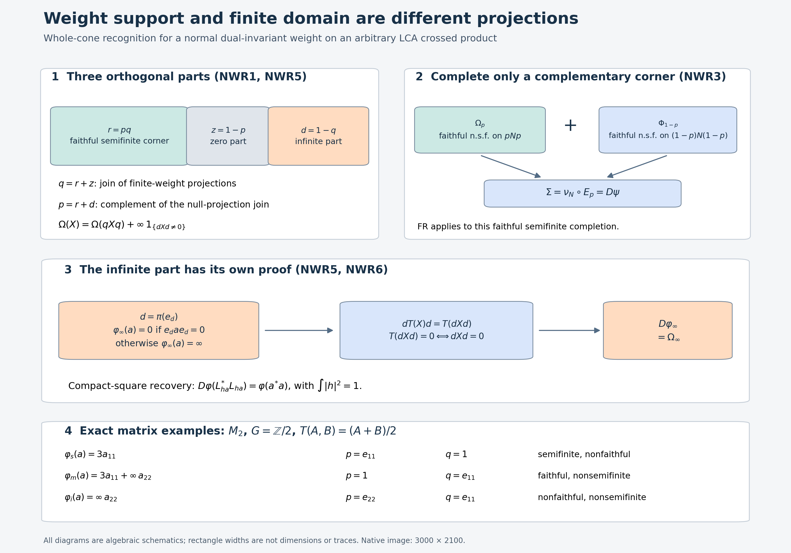

# Recognizing dual-invariant normal weights, including their infinite part

*Self-checked by the writing AI. Original exposition: CC0-1.0; earlier components retain their recorded terms.*

A faithful cocycle recognizes a faithful semifinite weight. To use that result for a weight with a zero part, we complete only its complementary corner. For a weight which is not semifinite, we first separate the finite-domain corner from the part on which every nonzero positive element has infinite value. These are different projections.

Let \(G\) be any locally compact Hausdorff abelian group and \(\alpha\) a point-ultraweakly continuous action on an arbitrary von Neumann algebra \(M\). Use the already constructed normal crossed product

\[
 N=M\rtimes_\alpha G,\qquad \pi:M\longrightarrow N,
 \qquad \theta_\chi(\lambda_s)=\overline{\chi(s)}\lambda_s,
 \qquad \theta_\chi(\pi(a))=\pi(a).
\tag{NWR1}
\]
Fix the paired Haar measures of DA. Let \(T:N_+\to\widehat{\pi(M)}_+\) be the faithful normal semifinite whole dual-action average. For any normal weight \(\varphi\) on \(M\), write

\[
 D\varphi(X)=\widehat{\varphi\circ\pi^{-1}}(T(X)),\qquad X\in N_+.
\tag{NWR2}
\]
The hat denotes the actual normal extension to the extended positive cone. The symbol \(D\) here is a map of weights, not a relative modular derivative. All zero and infinite values are retained; \(0\cdot\infty=0\).

The earlier local proofs used are [EP4–6](OA-FLOW-EP.md#oa-flow.ep.4), [EW5](OA-FLOW-EW.md#oa-flow.ew.5), [GW1–4](OA-FLOW-GW.md#oa-flow.gw.1), [NO1](OA-FLOW-NO.md#oa-flow.no.1), [WS1–2](OA-FLOW-WS.md#oa-flow.weight-sum.ws1), [GF1](OA-FLOW-WS.md#oa-flow.weight-sum.gf1), [NC4](OA-FLOW-NC.md#oa-flow.nc.4), [OT5](OA-FLOW-OT.md#oa-flow.ot.5), [GDA4–8](OA-FLOW-GDA.md#gda-4), [DA fixed algebra](OA-FLOW-DA.md#da-fixed), [DA invariance](OA-FLOW-DA.md#da-invariant), and [FR1–2](OA-FLOW-FR.md#oa-flow.fr.1). The last proof is used only with faithful normal semifinite weights. Projection joins and bounded Borel spectral cuts are [NF1](OA-FLOW-NF.md#oa-flow.nf.1) and [SF0/SB0–6](OA-FLOW-SF.md#oa-flow.shared-foundations.sf-0); bounded increasing positive limits are the pure bounded-operator proof [WF2](OA-FLOW-WF.md#oa-flow.wf.2); bounded square roots are [CF6–8](OA-FLOW-CF.md#oa-flow.cf.6), and bounded strong-to-ultraweak passages are [ST2](OA-FLOW-ST12.md#oa-flow.st.2). Compact cutoffs and Haar positivity are the earlier [topology slice](OA-FLOW-TOPOLOGY.md#l138-h0), [HR6–7](OA-FLOW-HR.md#hr-06), and [L24 Lemma3.1](OA-FLOW-L24.md#oa-flow.grp.translations). Exact scopes, source identities and line ranges accompany this chapter.

## NWR0. The forward statement

The map \(D\) is a bijection from all normal weights on \(M\) to all normal weights on \(N\) invariant under every \(\theta_\chi\). It restricts to a bijection on the normal semifinite weights, without requiring faithfulness. Its scalar and arbitrary-sum laws are the existing GDA8 laws. The proof of the asserted recognition is NWR1–7 below, not this opening statement. No arbitrary covariant-system recognition or nonabelian dual-action assertion is made.

## NWR1. Zero support and finite-domain support must be distinguished

Let \(\omega\) be any normal weight on a concrete von Neumann algebra \(Q\). A projection is called null when \(\omega(e)=0\). If \(e,f\) are null projections, additivity gives \(\omega(e+f)=0\). The spectral projections \(1_{[\varepsilon,\infty)}(e+f)\le\varepsilon^{-1}(e+f)\) are null and increase to \(s(e+f)=e\vee f\). The last identity follows from \(\ker(e+f)=\ker e\cap\ker f\). Thus their join is null by normality. Projection joins exist by the range-span and commutant-unitary argument in NF1/SF0. Finite joins of all null projections increase to their join \(z\), so \(\omega(z)=0\).

Set \(p=1-z\), the zero-weight support. Every bounded normal positive functional \(f\le\omega\) vanishes on \(z\). Its Cauchy–Schwarz inequality gives \(f(za)=f(az)=0\), hence \(f(a)=f(pap)\). EW5 recovers \(\omega\) as the supremum of these minorants, including at infinity. Therefore

\[
 \omega(a)=\omega(pap)\qquad(a\in Q_+).
\tag{NWR3}
\]
The restriction to \(pQp\) is faithful: a positive element with zero value has null positive spectral cutoffs, all at most both \(p\) and \(z\); they vanish, so the element is zero. The argument includes \(p=0\).

Let \(q\) instead be the join of all finite-weight projections. NO1 proves that every finite-value positive element is supported on \(q\), that there are finite positive contractions \(u_i\uparrow q\), and that the restriction \(\omega_q\) to \(qQq\) is normal semifinite. In particular \(q=1\) precisely when \(\omega\) is semifinite. Since the null projection \(z\) is finite, \(z\le q\). The projections \(p,q\) commute, but they need not be central. Put

\[
 r=pq,\qquad d=1-q.
\tag{NWR4}
\]
Then \(r,z,d\) are orthogonal and sum to one. Formula (NWR3) makes the normal semifinite restriction \(\omega_q\) faithful on \(rQr\), with zero support complement \(z\) inside the finite corner. The \(d\) part will be handled without a modular cocycle.

If \(\omega\) is invariant under an action by normal automorphisms, both joins \(z\) and \(q\) are invariant: each automorphism permutes, respectively, the null and finite projections. Thus all four projections above are invariant. For the dual action on \(N\), DA's full fixed-algebra theorem puts each in \(\pi(M)\). This does not require that its preimage be \(\alpha\)-invariant.

## NWR2. A reference weight adapted to a prescribed projection

For a projection \(e\) in an arbitrary von Neumann algebra \(Q\), put

\[
 K=eQe\oplus(1-e)Q(1-e),\qquad
 E_e(a)=eae+(1-e)a(1-e).
\tag{NWR5}
\]
This is a unital normal positive \(K\)-bimodule map onto \(K\). Each property follows directly from the two products and normality of multiplication. It is faithful: if \(a\ge0\) and \(E_e(a)=0\), positivity makes both diagonal compressions zero; then \(a^{1/2}e=a^{1/2}(1-e)=0\), giving \(a=0\). As an operator-valued weight it is semifinite because every positive output is bounded, so \(N_{E_e}=Q\).

FR1 supplies a faithful normal semifinite weight \(\nu\) on \(K\). By EP6,

\[
 \eta=\nu\circ E_e
\tag{NWR6}
\]
is faithful normal semifinite on \(Q\). The projection \(e\) is central in \(K\). NC4 proves that central self-adjoint elements commute with the complete modular operator and its imaginary powers; consequently \(\sigma_t^\nu(e)=e\). OT5's modular restriction gives \(\sigma_t^\eta(e)=e\). The zero corner is simply omitted, so this construction covers \(e=0,1\). No invariant state is used.

We also need the complete finite-domain consequence. If \(\rho\) is faithful normal semifinite and \(e\) is modular-fixed, GF1's constant entire orbit proves

\[
 \rho(eae)\le\rho(a)\quad(a\ge0,\ \rho(a)<\infty).
\tag{NWR7}
\]
Choose GW4's finite positive contractions \(a_i\uparrow1\). Their compressions \(ea_ie\uparrow e\) are finite by (NWR7). Thus \(\rho|_{eQe}\) is faithful normal semifinite by GW4 in that corner. Its compression to all of \(Q\) is normal semifinite: \(ea_ie+(1-e)\uparrow1\) are finite positive contractions for that compressed weight, again giving GW4. Its largest null projection is \(1-e\), so its support is \(e\). Neither \(\rho(e)<\infty\) nor an intersection of unrelated finite ideals is assumed.

## NWR3. Completing a nonfaithful semifinite target in its complementary corner

Let \(\Omega\) be a normal semifinite dual-invariant weight on \(N\). NWR1 gives its support \(p\in\pi(M)\). Its restriction \(\Omega_p\) to \(pNp\) is faithful normal semifinite: compress GW4's finite positive contractions, using (NWR3), to get finite contractions increasing to \(p\). If \(p=0\), the target is zero and its preimage is the zero weight, so suppose \(p\ne0\).

Write \(e=\pi^{-1}(p)\). NWR2 supplies a faithful normal semifinite \(\eta\) on \(M\) with \(e\) modular-fixed. Let \(\Phi=D\eta\). It is faithful normal semifinite and dual-invariant by EP6 and DA. GDA8's modular restriction makes \(p\) modular-fixed for \(\Phi\). Thus NWR2 proves that \(\Phi_{1-p}:=\Phi|_{(1-p)N(1-p)}\) is faithful normal semifinite. It is dual-invariant because \(\Phi\) and \(p\) are.

On \(K_N=pNp\oplus(1-p)N(1-p)\), define

\[
 \nu_N(a\oplus b)=\Omega_p(a)+\Phi_{1-p}(b).
\tag{NWR8}
\]
This is faithful and normal. Finite positive contractions increasing to the two corner identities have sums increasing to \(1\) with finite value; GW4 proves semifiniteness. Define

\[
 \Sigma=\nu_N\circ E_p,\qquad
 \Sigma(X)=\Omega(X)+\Phi((1-p)X(1-p)).
\tag{NWR9}
\]
EP6 makes \(\Sigma\) faithful normal semifinite. It is dual-invariant term by term. OT5 and centrality of \(p\) in \(K_N\) make \(p\) modular-fixed for \(\Sigma\). This orthogonal completion avoids the invalid step of assuming that the sum of two arbitrary semifinite weights is semifinite.

FR2 now gives a faithful normal semifinite \(\psi\) on \(M\) with \(D\psi=\Sigma\). GDA8's modular restriction and injectivity of \(\pi\) give \(\sigma_t^\psi(e)=e\). Set

\[
 \varphi(a)=\psi(eae)\qquad(a\in M_+).
\tag{NWR10}
\]
NWR2 proves normality and semifiniteness of \(\varphi\). Since \(\Sigma(pXp)=\Omega(X)\), the whole bimodule identity for \(T\) yields

\[
 \Omega(X)=\widehat{\psi\circ\pi^{-1}}(pT(X)p)
           =\widehat{\varphi\circ\pi^{-1}}(T(X))=D\varphi(X).
\tag{NWR11}
\]
The middle equality holds for every extended positive value. Indeed, both extensions are normal and agree on bounded positive elements after compression; EP5's uniqueness, or its arbitrary increasing bounded approximation, proves equality on the entire extended cone. Infinite values are never cancelled.

## NWR4. Semifinite inputs remain semifinite

Conversely let \(\varphi\) be any normal semifinite weight on \(M\), and let \(e\) be its support. Its restriction to \(eMe\) is faithful normal semifinite, by NWR1 and compressed finite contractions. Choose a faithful normal semifinite weight on \((1-e)M(1-e)\) by FR1. Their direct sum \(\nu\) on the block diagonal algebra is faithful normal semifinite by the same finite-contraction argument as (NWR8). Thus \(\psi=\nu\circ E_e\) is faithful normal semifinite, \(e\) is modular-fixed, and \(\varphi(a)=\psi(eae)\).

Set \(p=\pi(e)\). GDA8 makes \(p\) modular-fixed for \(D\psi\), and EP's extended compression identity gives

\[
 D\varphi(X)=D\psi(pXp).
\tag{NWR12}
\]
NWR2 applied on \(N\) proves that this is normal semifinite, including when it is nonfaithful. Invariance follows from DA for every normal input. No assertion that restriction to an arbitrary corner preserves semifiniteness was used; the corner is modular-fixed for the constructed faithful completion.

## NWR5. The nonsemifinite part is an explicit normal weight

For an arbitrary normal dual-invariant \(\Omega\), let \(q\) be its finite-domain projection from NWR1. Put \(d=1-q\), and define

\[
 \Omega_s(X)=\Omega(qXq),\qquad
 \Omega_\infty(X)=
 \begin{cases}0,&dXd=0,\\ \infty,&dXd\ne0.\end{cases}
\tag{NWR13}
\]
The restriction to \(qNq\) is normal semifinite by NO1. Its compression \(\Omega_s\) to all of \(N\) is also normal semifinite: NO1's finite contractions \(u_i\uparrow q\) give \(u_i+(1-q)\uparrow1\) with finite \(\Omega_s\)-value, and GW4 applies. Both \(q\) and \(\Omega\) are invariant, so \(\Omega_s\) is invariant. NWR3 supplies a normal semifinite input \(\varphi_s\) with \(D\varphi_s=\Omega_s\).

For positive \(X\), \(dXd=0\) is equivalent to \(X=qXq\), because \(\|X^{1/2}d\xi\|^2=\langle dXd\xi,\xi\rangle\). If \(X\ne qXq\), it cannot have finite \(\Omega\)-value by the definition of \(q\) and NO1. Thus WS2's full-cone identity is exactly

\[
 \Omega(X)=\Omega_s(X)+\Omega_\infty(X).
\tag{NWR14}
\]
The value \(\Omega(qXq)\) can itself be infinite; (NWR14) remains valid.

For completeness \(\Omega_\infty\) is a normal weight. Additivity follows since the sum of two positive compressions vanishes exactly when both vanish. Positive homogeneity is immediate with \(0\cdot\infty=0\). If \(X_i\uparrow X\), then \(dX_id\uparrow dXd\). If the latter is nonzero, some \(dX_id\) is nonzero, since a bounded positive supremum of zero elements is zero. This proves preservation of the supremum, including the infinite case. Invariance follows from fixedness of \(d\). This supplies a proof independent of a faithful cocycle for the infinite part.

Write \(e_d=\pi^{-1}(d)\), and define the normal weight on \(M\)

\[
 \varphi_\infty(a)=
 \begin{cases}0,&e_dae_d=0,\\ \infty,&e_dae_d\ne0.\end{cases}
\tag{NWR15}
\]
The same argument proves all its weight and normality properties. EP5 gives, for \(m\in\widehat{\pi(M)}_+\),

\[
 \widehat{\varphi_\infty\circ\pi^{-1}}(m)=0
 \quad\Longleftrightarrow\quad dmd=0;
 \quad\text{otherwise its value is }\infty.
\tag{NWR16}
\]
To verify this on an unbounded extended value, take EP2's bounded increasing approximants \(a_n\uparrow m\). Their compressions increase to \(dmd\). If this is zero every compression is zero. If it is nonzero, some compression is nonzero, and the supremum of the weight values is infinite. EP5 allows these compressed approximants even though they need not be the canonical approximants of \(dmd\).

Now \(dT(X)d=T(dXd)\) by the full bimodule identity, and faithfulness of \(T\) says that this is zero exactly when \(dXd=0\). Hence

\[
 D\varphi_\infty=\Omega_\infty.
\tag{NWR17}
\]
Normality of \(\varphi:=\varphi_s+\varphi_\infty\) follows by interchanging a bounded increasing supremum with the sum of two increasing nonnegative numerical nets, also at infinity. EP5/GDA8's additivity on the entire extended cone gives

\[
 D\varphi=D\varphi_s+D\varphi_\infty=\Omega.
\tag{NWR18}
\]
This proves surjectivity for all normal targets. It includes \(q=0\), \(q=1\), a zero algebra, and mixed finite/zero/infinite corners; no countable exhaustion occurs.

## NWR6. Compact squares give injectivity for every normal input

Choose \(h\in C_c(G)\) with \(\int|h(s)|^2ds=1\). Such a function exists: the proved compact-cutoff construction gives a nonzero compactly supported continuous function, Haar positivity gives positive squared integral, and compact finiteness gives finiteness; divide by its positive square root. For \(a\in M\), the function \(x_a(s)=h(s)a\) is bounded, compactly supported and strongly* continuous, so it is in GDA's compact coefficient algebra \(\mathscr K\). Let \(L_{x_a}\) be its bounded normal integrated operator. GDA6's whole bounded-square formula, independent of any finite-weight hypothesis, says

\[
 T(L_{x_a}^*L_{x_a})
 =\pi\left(\int |h(s)|^2a^*a\,ds\right)=\pi(a^*a).
\tag{NWR19}
\]
Consequently, for every normal weight \(\varphi\),

\[
 D\varphi(L_{x_a}^*L_{x_a})=\varphi(a^*a),
\tag{NWR20}
\]
including an infinite value. Equal dual weights therefore have equal values at every \(a^*a\). CF7's bounded positive square root writes every \(b\in M_+\) as \((b^{1/2})^*b^{1/2}\); thus they agree on the entire positive cone. This proves injectivity without extending unitary cocycles to nonfaithful weights. EP6/GDA8 show that every normal input has a normal dual, and DA proves its invariance on the entire positive cone. Together with NWR3–5, these facts prove NWR0; NWR3–4 and injectivity give the stated restriction to semifinite weights.

## NWR7. Three exact finite-dimensional cases

Take \(G=\mathbb Z/2\mathbb Z\) with counting Haar measure and trivial action on \(M_2\). FR4's normal identification gives \(N=M_2\oplus M_2\), \(\pi(a)=(a,a)\), dual action interchanging the summands, and

\[
 T(A,B)=\pi((A+B)/2).
\tag{NWR21}
\]
Let \(e=e_{11}\), \(d=e_{22}\). For \(a\ge0\) consider

\[
 \varphi_s(a)=3a_{11},\qquad
 \varphi_m(a)=3a_{11}+\infty\,a_{22},\qquad
 \varphi_i(a)=\infty\,a_{22},
\tag{NWR22}
\]
where \(\infty\,0=0\). Each infinite term is defined as in (NWR15); it is not a finite matrix trace. For all positive \(A,B\),

\[
 D\varphi_s(A,B)=\tfrac32(A_{11}+B_{11}),\qquad
 D\varphi_m(A,B)=\tfrac32(A_{11}+B_{11})+\infty(A_{22}+B_{22}),
\tag{NWR23}
\]
and \(D\varphi_i(A,B)=\infty(A_{22}+B_{22})\). These are interchange-invariant. The three input support/finite-domain pairs \((p,q)\) are, respectively, \((e,1),(1,e),(d,e)\); on \(N\) the corresponding projections are their diagonal images under \(\pi\). Indeed a positive matrix with zero \((2,2)\) entry has zero mixed entries, so finite elements of the latter two weights are exactly those supported on \(e\). For \(\varphi_s\), all elements have finite value while its zero support complement is \(d\). This verifies directly that \(p\) and \(q\) cannot be conflated. A faithful completion of the first case is \(\psi(a)=3a_{11}+a_{22}\), while the last two need the independent infinite-part construction.

**Exercise 1.** Could NWR3 replace its orthogonal completion by \(\Omega+\Phi\) for an arbitrary faithful semifinite reference \(\Phi\)?

**Solution.** The existing premises do not say that an arbitrary sum of two semifinite weights is semifinite. Its finite left ideal is the intersection of their finite ideals, whose density has not been proved. NWR3 instead proves semifiniteness from two nets confined to complementary corners, or equivalently EP6's block conditional-expectation composition. That is the actual justification used by FR2.

**Exercise 2.** Why does (NWR16) require the full extended cone rather than just a formula on bounded coefficient elements?

**Solution.** \(T(X)\) can be unbounded or have an infinite-value part even for bounded \(X\ge0\). EP's arbitrary bounded increasing approximation and faithfulness of \(T\) identify precisely when its \(d\)-compression is zero. This gives both outcomes of (NWR17); bounded-core equality alone supplies neither infinite values nor the zero test.

## NWR8. Further reading

Haagerup, [*On the dual weights for crossed products of von Neumann algebras I*](https://journals.msp.org/mscand/article/view/1879), Math. Scand. 43 (1978), Theorem 3.7, proves faithful normal semifinite recognition. Its following remark announces extension of the forward construction to all normal weights. Haagerup's sequel, [*On the dual weights for crossed products of von Neumann algebras II*](https://journals.msp.org/mscand/article/view/1878), Math. Scand. 43 (1978), Corollary 3.6, supplies that extension, additivity and the compact-square formula; its Theorem 1.1 supplies the whole dual average for abelian groups. Neither of those cited extension statements is itself an all-normal invariant-target recognition proof.

The complementary-corner argument and the infinite-part construction use different features of a normal weight. FR2 supplies recognition for the faithful semifinite completion; the infinite part is recovered from the faithfulness of the whole averaging map. NWR6 proves uniqueness for every normal input by compact squares.

## Weight support, finite domain, and the infinite-value part

This original algebraic diagram illustrates [NWR1](OA-FLOW-NWR.md#nwr-1), [NWR3](OA-FLOW-NWR.md#nwr-3), [NWR5](OA-FLOW-NWR.md#nwr-5), and [NWR6–7](OA-FLOW-NWR.md#nwr-6). It is not a numerical approximation or a depiction of dimensions. The projection rectangles have arbitrary widths.

For a normal weight \(\Omega\) on \(N\), let \(z\) be the join of its null projections and \(q\) the join of its finite-weight projections. Since \(\Omega(z)=0\), one has \(z\le q\). Put \(p=1-z\), \(r=pq\), and \(d=1-q\). These satisfy

\[
 r+z+d=1,\qquad q=r+z,\qquad p=r+d,
 \qquad rz=rd=zd=0.
\tag{NWRF1}
\]
The first panel distinguishes the faithful semifinite restriction on \(rNr\), the zero corner, and the infinite-value part. NO1 supplies the entire finite-domain reduction. If \(X\ge0\), then \(dXd=0\) implies \(X=qXq\), by applying the positive square root to \(d\). Every finite-value element has that support. Consequently

\[
 \Omega(X)=\Omega(qXq)+
 \begin{cases}0,&dXd=0,\\ \infty,&dXd\ne0.\end{cases}
\tag{NWRF2}
\]
For an invariant weight both projection joins are fixed by the dual action, hence belong to \(\pi(M)\). This does not assert invariance of their preimages under the original action \(\alpha\).

The second panel applies only to a semifinite target, for which \(q=1\). A faithful reference weight on \(M\) is chosen with \(\pi^{-1}(p)\) in its centralizer. Its dual \(\Phi\) has \(p\) in its centralizer. On the block algebra use the faithful semifinite weight \(\nu_N=\Omega_p\oplus\Phi_{1-p}\); compose it with the faithful normal conditional expectation \(E_p\). Thus

\[
 \Sigma(X)=\Omega(X)+\Phi((1-p)X(1-p))=D\psi(X).
\tag{NWRF3}
\]
The finite contraction nets lie in complementary corners and their sums increase to one. This proves semifiniteness of \(\Sigma\), rather than assuming density of an arbitrary finite-ideal intersection. FR recognizes this faithful completion. Restricting its recovered input by \(e=\pi^{-1}(p)\) gives the original target on its whole cone.

The third panel handles the infinite part separately. For \(e_d=\pi^{-1}(d)\), define \(\varphi_\infty(a)\) to be zero when \(e_dae_d=0\), and infinite otherwise. EP's full increasing approximation proves the same zero test for its extended-positive evaluation. Then

\[
 dT(X)d=T(dXd),\qquad
 T(dXd)=0\Longleftrightarrow dXd=0,
 \qquad D\varphi_\infty=\Omega_\infty.
\tag{NWRF4}
\]
The equivalence uses faithfulness of the whole operator-valued weight. It uses no modular derivative of \(\Omega_\infty\). The compact-square identity underneath proves injectivity of dualization for every normal input, including infinite values.

The last panel gives the exact \(M_2\), trivial \(\mathbb Z/2\) action from NWR7, with counting original Haar and dual point mass \(1/2\). For positive \(a\), the weights \(3a_{11}\), \(3a_{11}+\infty a_{22}\), and \(\infty a_{22}\) have \((p,q)=(e_{11},1),(1,e_{11}),(e_{22},e_{11})\), respectively. Positivity makes both mixed entries zero whenever \(a_{22}=0\); this verifies the finite corner in the last two examples. Here \(\infty\,0=0\), and an infinite term is defined by its zero test, not by multiplication of ordinary finite matrices.

For context see Haagerup, [*On the dual weights for crossed products of von Neumann algebras I*](https://journals.msp.org/mscand/article/view/1879), Theorem 3.7 and the following remark, and [*On the dual weights for crossed products of von Neumann algebras II*](https://journals.msp.org/mscand/article/view/1878), Corollary 3.6, both in Math. Scand. 43 (1978). These provide the faithful recognition and general forward-extension context. The support completion and infinite-part recognition are the local proofs above.

The native PNG is 3000 × 2100. [Editable SVG](../assets/normal-weight-recognition/assets/normal-weight-recognition.svg), [exact data](../assets/normal-weight-recognition/assets/normal-weight-recognition-data.json), and [reproduction source](../assets/normal-weight-recognition/render_recognition.py) are included. Original illustration and caption: GPT-6.1 Sol (OpenAI), Ultra, 5 October 2026. CC0-1.0 to the extent of rights held.
