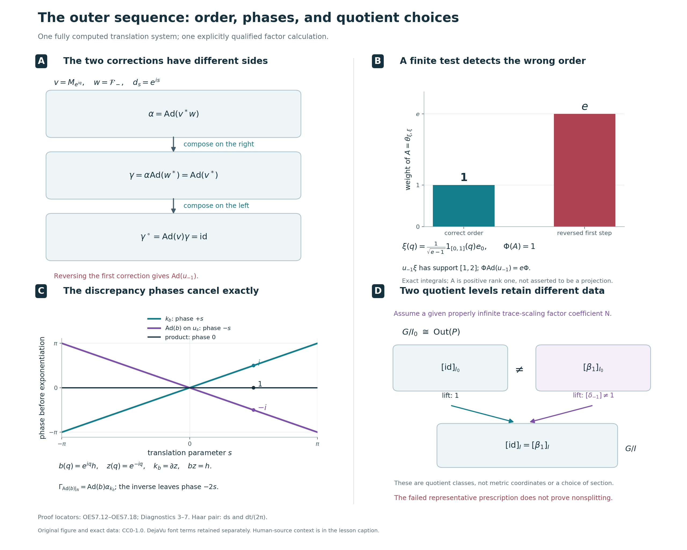

# Automorphisms and the outer exact sequence

An automorphism of a crossed product can move its coefficient algebra. We first adjust it by inner automorphisms until it preserves the specified dual weight and fixes every translation unitary. Its restriction then becomes a trace-preserving automorphism of the coefficient algebra that commutes with the original action.

Two different kinds of inner automorphisms remain in this description. One is implemented by a unitary of the coefficient algebra; the other is implemented by a unitary fixed by the action. Their difference is measured by central cocycles. We prove the quotient identifications, the exact sequence they determine, and compatibility with isomorphisms of the original trace-scaling systems.

*Original exposition, examples, figures, data and reproducible drawing code in this lesson are dedicated to CC0-1.0. Source publications and font components retain their own terms.*

## The trace-scaling system and its three quotient groups

Let \(N\ne0\) be a properly infinite von Neumann algebra, with a specified faithful normal semifinite trace \(\tau\). Let \(\theta:\mathbb R\to\operatorname{Aut}(N)\) be a normal point-ultraweakly continuous action such that
\[
 \tau\circ\theta_s=e^{-s}\tau,\qquad
 P=N\rtimes_\theta\mathbb R,\qquad
 \Phi=\widetilde\tau .
 \tag{OES0.a}
\]
The trace equation holds on all of \(N_+\), including infinite values. Proper infiniteness means that the identity contains two orthogonal projections each equivalent to the identity; [PC5](OA-FLOW-PC.md#oa-flow.pc.5) proves the filling-family consequences used by the earlier comparison theorem. No factor, separable-predual, faithful-state or countable-decomposition assumption is imposed.

Write \(u_s\) for the specified translation unitaries, so
\[
 u_sxu_s^*=\theta_s(x),\qquad
 \delta_t(x)=x,\qquad
 \delta_t(u_s)=e^{-ist}u_s
       \quad(x\in N).
 \tag{OES0.b}
\]
The original Haar measure is \(ds\), and the dual Haar measure is \(dt/(2\pi)\). [L18](OA-FLOW-L18.md#l18-1) identifies \(\sigma^\Phi=\delta\) and \(P_\Phi=N\); [DA](OA-FLOW-DA.md#da-equality) identifies the full coefficient-valued weight with the dual average in this normalization.

Let \(\operatorname{Inn}(B)=\{\operatorname{Ad}(b):b\in\mathcal U(B)\}\) for a von Neumann algebra \(B\), where \(\operatorname{Ad}(b)(x)=bxb^*\), and set \(\operatorname{Out}(B)=\operatorname{Aut}(B)/\operatorname{Inn}(B)\). Define
\[
 \begin{aligned}
 G&=\{\beta\in\operatorname{Aut}(N):
       \beta\theta_s=\theta_s\beta\text{ for all }s,\
       \tau\circ\beta=\tau\},\\
 I&=G\cap\operatorname{Inn}(N),\\
 I_0&=\{\operatorname{Ad}(h)|_N:
                  h\in\mathcal U(N^\theta)\}.
 \end{aligned}
 \tag{OES0.c}
\]
Thus \(I_0\subseteq I\subseteq G\). The proofs below establish the needed normality. The quotient \(G/I\) is precisely the image of \(G\) in the full group \(\operatorname{Out}(N)\); it is not generally \(G/I_0\).

A central cocycle is a strongly continuous map \(c:\mathbb R\to\mathcal U(Z(N))\) satisfying
\[
 c_{s+t}=c_s\theta_s(c_t).
\]
Centrality makes these cocycles an abelian group under pointwise multiplication. With our inner-automorphism convention, the central coboundaries are
\[
 (\partial z)_s=z\theta_s(z^*),\qquad
 z\in\mathcal U(Z(N)).
 \tag{OES0.d}
\]
Write
\[
 H^1_\theta=H^1_\theta(\mathbb R,\mathcal U(Z(N)))
\]
for the central cocycle group modulo these coboundaries. [RCC6](OA-FLOW-RCC.md#rcc-6) proves that every such \(c\) gives the full normal automorphism
\[
 \alpha_c(x)=x\quad(x\in N),\qquad
 \alpha_c(u_s)=c_su_s,
 \tag{OES0.e}
\]
and proves that \(\alpha_c\) is inner exactly when \(c=\partial z\) for a central unitary \(z\).

The theorem of this lesson is the algebraic short exact sequence
\[
 1\longrightarrow H^1_\theta
 \mathrel{\mathop{\longrightarrow}^{\iota}}
 \operatorname{Out}(P)
 \mathrel{\mathop{\longrightarrow}^{\mathfrak r}}
 G/I\longrightarrow1,
 \qquad
 \iota([c])=[\alpha_c].
 \tag{OES0.f}
\]
We also prove the more explicit quotient descriptions
\[
 \boxed{\ \operatorname{Out}(P)\cong G/I_0,\qquad
                  H^1_\theta\cong I/I_0.\ }
 \tag{OES0.g}
\]
For \(\beta\in G\), its normal lift \(\Gamma_\beta\) extends \(\beta\) and fixes each \(u_s\). Its outer class induces the first isomorphism. The second isomorphism uses the central cocycle
\[
 k_b(s)=b^*\theta_s(b)
       \quad\text{when }\operatorname{Ad}(b)|_N\in I.
 \tag{OES0.h}
\]
The exact sequence is then the quotient sequence for \(I_0\subseteq I\subseteq G\), with the signs and maps identified explicitly.

All quotients here are algebraic groups. An exact sequence does not by itself provide a homomorphic section. Naturality is proved for specified normal isomorphisms \(f:N\to N'\) satisfying \(f\theta_s=\theta'_sf\) and \(\tau'\circ f=\tau\).

The normalization uses [DWC4](OA-FLOW-DWC.md#dwc-4) and [CST5](OA-FLOW-CST.md#cst-5), both with their full proved hypotheses. The coefficient commutant and central-cocycle kernel use [RCC5–6](OA-FLOW-RCC.md#rcc-5). All normal crossed-product extensions use the [normal representation comparison NR4](OA-FLOW-NR.md#oa-flow.nr.4), and every use of the unbounded dual weight retains the full positive cone.

If the crossed product \(P\) is type III, [L18, Section 8](OA-FLOW-L18.md#l18-8) proves that \(N\) is properly infinite, so the theorem applies. Type III is therefore a sufficient additional description of an important case. The conclusion also covers properly infinite coefficient systems whose crossed products are semifinite. The zero system has its separate unique interpretation.

## 1. Choose a representative preserving the dual weight

Let \(N\ne0\) be properly infinite, let \(\tau\) be a faithful normal semifinite trace on \(N\), and suppose
\(\tau\circ\theta_s=e^{-s}\tau\) for a normal continuous action of \(\mathbb R\). Write
\(P=N\rtimes_\theta\mathbb R\), identify \(N\) with its canonical image, and use the implementing unitaries \(u_s\), so that
\(u_sxu_s^*=\theta_s(x)\). All automorphisms below are normal. We use \(\operatorname{Ad}(a)(X)=aXa^*\) for unitary \(a\), and compose maps from right to left.

The dual action and actual dual weight \(\Phi=\widetilde\tau\) satisfy
\[
 \begin{gathered}
 \delta_t(x)=x\quad(x\in N),\qquad
 \delta_t(u_s)=e^{-ist}u_s,\\
 \sigma_t^\Phi=\delta_t,\qquad P_\Phi=P^\delta=N.
 \end{gathered}                                                    \tag{OES1.a}
\]
The modular formula is [L18, Section 1](OA-FLOW-L18.md#l18-1); the equality of the entire fixed algebra with \(N\) is [DA's fixed-algebra theorem](OA-FLOW-DA.md#da-fixed). In particular, the last equality is about all of \(P\), not only finite coefficient sums.

Let \(T:P_+\to\widehat N_+\) denote the canonical operator-valued weight. The whole-cone identification in [DA](OA-FLOW-DA.md#da-equality) and [GDA8](OA-FLOW-GDA.md#gda-8) gives
\[
 T(X)=\int_{\mathbb R}\delta_t(X)\,\frac{dt}{2\pi},
 \qquad \Phi(X)=\widehat\tau(T(X))\quad(X\in P_+).
                                                                  \tag{OES1.b}
\]
The crossed-product variable has measure \(ds\); its dual variable has measure \(dt/(2\pi)\), as fixed in [DA's Haar convention](OA-FLOW-DA.md#da-haar). The integral in (OES1.b) is an extended positive element. More explicitly, if
\[
 A_R(X)=\int_{-R}^{R}\delta_t(X)\,\frac{dt}{2\pi}\quad(R>0),
                                                                  \tag{OES1.c}
\]
then \(A_R(X)\) is the bounded ultraweak integral, defined by
\(\omega(A_R(X))=\int_{-R}^{R}\omega(\delta_t(X))\,dt/(2\pi)\) for every \(\omega\in P_*\), and \(T(X)=\sup_{R>0}A_R(X)\) in the extended positive cone. [DA's compact averages](OA-FLOW-DA.md#da-compact) and [positive averaging theorem](OA-FLOW-DA.md#da-positive) establish these statements, including the meaning of the target \(\widehat N_+\) and its possible infinite-value spectral part.

The first normalization uses proper infiniteness of \(N\). By [DWC4](OA-FLOW-DWC.md#dwc-4), for each \(\alpha\in\operatorname{Aut}(P)\) there is a unitary \(w\in P\) such that
\[
 \Phi\circ\alpha=\Phi\circ\operatorname{Ad}(w)
 \quad\hbox{on }P_+.
                                                                  \tag{OES1.d}
\]
The hypotheses of that result can be seen directly here. The two weights are \(\Phi\) and \(\Phi\circ\alpha\), their centralizers are \(N\) and \(\alpha^{-1}(N)\), and both centralizers are properly infinite. For the first weight the required continuous unitary field is \(r\mapsto u_{-r}\); for the second it is \(r\mapsto\alpha^{-1}(u_{-r})\). Modular transport gives eigenvalue \(e^{irt}\) for both fields at modular time \(t\). Thus DWC's continuous-field comparison and filling-row argument apply at arbitrary center and Hilbert multiplicity. They yield the equality on the whole positive cone in (OES1.d).

Set
\[
 \gamma=\alpha\circ\operatorname{Ad}(w^*).
                                                                  \tag{OES1.e}
\]
The order matters: substitution of (OES1.d) gives
\[
 \Phi\circ\gamma
 =\Phi\circ\operatorname{Ad}(w)\circ\operatorname{Ad}(w^*)
 =\Phi.
                                                                  \tag{OES1.f}
\]
Moreover
\(\gamma=\operatorname{Ad}(\alpha(w^*))\circ\alpha\), so \(\gamma\) and \(\alpha\) define the same element of \(\operatorname{Out}(P)\). This proves that every outer class has a representative in the group
\[
 \mathcal A_\Phi
 =\{\gamma\in\operatorname{Aut}(P):\Phi\circ\gamma=\Phi\}.
                                                                  \tag{OES1.g}
\]
It is a group because the whole-cone equality is preserved under composition, and substituting \(\gamma^{-1}(X)\) gives the equality for the inverse. No type III assumption on \(P\) has entered this normalization.

## 2. Recover the trace and identify the translation cocycle

Fix \(\gamma\in\mathcal A_\Phi\). The modular transport formula of [BC5](OA-FLOW-BC.md#bc-5) says that the modular group of \(\Phi\circ\gamma^{-1}\) is \(\gamma\sigma_t^\Phi\gamma^{-1}\). Since this transported weight equals \(\Phi\), (OES1.a) gives
\[
 \gamma\delta_t=\delta_t\gamma,
 \qquad\gamma(N)=N,
 \qquad\beta:=\gamma|_N\in\operatorname{Aut}(N).
                                                                  \tag{OES2.a}
\]
Both \(\beta\) and its inverse are normal restrictions. At this stage \(\beta\) need not commute with \(\theta\).

**Transport of the complete average.** For each compact interval in (OES1.c), normality lets \(\gamma\) pass through the ultraweak integral: testing against \(\omega\) is the same as testing the original integral against \(\omega\circ\gamma\). Therefore
\[
 A_R(\gamma(X))=\gamma(A_R(X))\quad(X\in P_+).
\]
Normal-isomorphism transport on the extended positive cone preserves increasing suprema by [EP4](OA-FLOW-EP.md#oa-flow.ep.4). Take the supremum in this equality. Because \(T(X)\) is affiliated with \(N\) in the extended sense and \(\gamma|_N=\beta\), the result is
\[
 T(\gamma(X))=\widehat\beta(T(X))\quad(X\in P_+).
                                                                  \tag{OES2.b}
\]
Here, for \(h\in\widehat N_+\) and \(\rho\in N_*^+\),
\(\widehat\beta(h)(\rho)=h(\rho\circ\beta)\). In particular this transport includes the infinite-value projection of \(h\). Equivalently, it carries each canonical bounded spectral cutoff \(h\wedge n\) to \(\widehat\beta(h)\wedge n\), and carries their increasing supremum to the full element. The scalar extension theorem [EP5](OA-FLOW-EP.md#oa-flow.ep.5) consequently gives
\[
 \widehat\tau(\widehat\beta(h))
 =\sup_n\tau\bigl(\beta(h\wedge n)\bigr)
 =\widehat{\tau\circ\beta}(h).
                                                                  \tag{OES2.c}
\]
This formula retains the value \(+\infty\) whenever it occurs.

**Every bounded positive coefficient is an exact average.** Take any \(a\in N_+\), without a finite-trace assumption, and choose \(f\in C_c(\mathbb R)\) with \(\int_{\mathbb R}|f(s)|^2\,ds=1\). Define
\[
 x(s)=f(s)a^{1/2},\qquad
 L_x=\int_{\mathbb R}u_sx(s)\,ds,\qquad
 Y=L_x^*L_x\in P_+.
                                                                  \tag{OES2.d}
\]
This is the right-coefficient convention of [GDW1](OA-FLOW-GDW.md#gdw-1): the unitary \(u_s\) is on the left of \(x(s)\). The field \(x\) is bounded, strongly-star continuous and compactly supported, hence lies in the coefficient algebra \(\mathscr K\) used there. Its integrated operator is a bounded ultraweak integral with
\(\|L_x\|\le\|f\|_1\|a\|^{1/2}\). Membership in \(\mathscr K\) does not require membership in the finite-weight coefficient ideal.

The exact operator-valued square formula [GDA29](OA-FLOW-GDA.md#equation-gda29), valid for every \(x\in\mathscr K\), yields
\[
 T(Y)=\int_{\mathbb R}x(s)^*x(s)\,ds
     =\left(\int_{\mathbb R}|f(s)|^2\,ds\right)a=a.
                                                                  \tag{OES2.e}
\]
Only this operator-valued output is required to be bounded; its scalar trace can be infinite. Equations (OES1.b), (OES2.b) and weight preservation now give, for this particular \(Y\),
\[
 \begin{aligned}
 \tau(\beta(a))
 &=\widehat\tau\bigl(T(\gamma(Y))\bigr)\\
 &=\Phi(\gamma(Y))
  =\Phi(Y)
  =\widehat\tau(T(Y))
  =\tau(a).
 \end{aligned}                                                    \tag{OES2.f}
\]
Thus \(\tau\circ\beta=\tau\) on all of \(N_+\). The proof compares the original values directly, including the case \(\tau(a)=+\infty\); it neither subtracts infinities nor extends a finite-ideal equality by an unsupported density argument.

We also record the converse that will be used for lifts. Suppose a normal automorphism \(\eta\) of \(P\) commutes with \(\delta\). It then preserves \(N=P^\delta\), and the compact-average proof of (OES2.b) applies with \(\eta\) in place of \(\gamma\), regardless of weight preservation. If \(b=\eta|_N\) satisfies \(\tau\circ b=\tau\), (OES1.b) and (OES2.c) imply
\[
 \Phi(\eta(X))
 =\widehat\tau(\widehat b(T(X)))
 =\widehat{\tau\circ b}(T(X))
 =\Phi(X)\quad(X\in P_+).
                                                                  \tag{OES2.g}
\]

**The defect on the implementing unitaries.** For the weight-preserving \(\gamma\), put
\[
 d_s=\gamma(u_s)u_s^*.
                                                                  \tag{OES2.h}
\]
Using (OES2.a) and the two opposite scalar phases,
\[
 \delta_t(d_s)
 =e^{-ist}\gamma(u_s)\,e^{ist}u_s^*=d_s.
\]
Therefore \(d_s\in\mathcal U(N)\). The path is strongly continuous: \(u_s\) is strongly-star continuous, a normal isomorphism preserves bounded strong-star convergence by [ST2](OA-FLOW-ST12.md#oa-flow.st.2), and multiplication is strongly-star continuous on bounded sets. The product law gives
\[
 \begin{aligned}
 d_{s+t}
 &=\gamma(u_s)\gamma(u_t)u_t^*u_s^*\\
 &=\gamma(u_s)d_tu_s^*
  =d_su_sd_tu_s^*
  =d_s\theta_s(d_t).
 \end{aligned}                                                    \tag{OES2.i}
\]
Thus \(d\) is a strongly continuous unitary \(\theta\)-cocycle. There is no centrality conclusion here. For \(x\in N\), applying \(\gamma\) to covariance gives
\[
 \beta(\theta_s(x))=d_s\theta_s(\beta(x))d_s^*,
 \qquad
 \beta\theta_s\beta^{-1}=\operatorname{Ad}(d_s)\theta_s.
                                                                  \tag{OES2.j}
\]
This describes precisely the remaining obstruction to exact equivariance of \(\beta\).

## 3. Untwist the cocycle and construct every normal lift

The trace-scaling cocycle theorem [CST5](OA-FLOW-CST.md#cst-5) applies to the cocycle in (OES2.i). Its proof allows arbitrary \(N\) and noncentral cocycles. Choose \(v\in\mathcal U(N)\) such that
\[
 d_s=v^*\theta_s(v)\quad(s\in\mathbb R),
 \qquad
 \gamma^\circ=\operatorname{Ad}(v)\circ\gamma,
 \qquad
 \beta^\circ=\operatorname{Ad}(v)\circ\beta.
                                                                  \tag{OES3.a}
\]
The factor order removes the cocycle:
\[
 \gamma^\circ(u_s)
 =v d_su_sv^*
 =v d_s\theta_s(v^*)u_s
 =u_s.
                                                                  \tag{OES3.b}
\]
Since \(v\in N=P_\Phi\), the whole-cone unitary centralizer criterion [CZ0](OA-FLOW-CZ.md#cz-0) shows that \(\operatorname{Ad}(v)\) preserves \(\Phi\). Hence \(\gamma^\circ\in\mathcal A_\Phi\). Applying \(\gamma^\circ\) to \(u_sxu_s^*=\theta_s(x)\) gives
\(\beta^\circ\theta_s=\theta_s\beta^\circ\). Traciality, including infinite values, gives
\(\tau\circ\operatorname{Ad}(v)=\tau\), so (OES2.f) yields
\[
 \beta^\circ\in G
 :=\{b\in\operatorname{Aut}(N):b\theta_s=\theta_sb
       \text{ for all }s,\ \tau\circ b=\tau\}.
                                                                  \tag{OES3.c}
\]
This is a group by composition and inverse. The two inner changes made in (OES1.e) and (OES3.a) preserve the original outer class.

**The lift is a normal automorphism.** For \(b\in G\), we claim that there is a unique normal automorphism \(\Gamma_b\) of \(P\) with
\[
 \Gamma_b(x)=b(x)\quad(x\in N),\qquad
 \Gamma_b(u_s)=u_s\quad(s\in\mathbb R).
                                                                  \tag{OES3.d}
\]
To construct it, choose any faithful normal representation \(\rho:N\to B(H)\). Its Hilbert space can have arbitrary dimension. In the regular representation on \(L^2(\mathbb R,H)\), write
\[
 [\pi_\rho(x)\xi](r)=\rho(\theta_{-r}(x))\xi(r),
 \qquad [u_s\xi](r)=\xi(r-s).
                                                                  \tag{OES3.e}
\]
The representation \(\rho\circ b\) is again faithful and normal. Exact equivariance gives
\[
 \pi_{\rho\circ b}(x)=\pi_\rho(b(x)).
                                                                  \tag{OES3.f}
\]
Its regular translation unitaries are the same \(u_s\). Since \(b(N)=N\), the regular crossed-product algebras arising from \(\rho\) and \(\rho\circ b\) are therefore the same concrete von Neumann algebra.

The normal representation-independence theorem [NR4](OA-FLOW-NR.md#oa-flow.nr.4) supplies a normal isomorphism between these regular algebras, carrying \(\pi_\rho(x)\) to \(\pi_{\rho\circ b}(x)\) and fixing \(u_s\). That theorem compares arbitrary faithful normal representations through an amplification of a standard representation and a faithful compression with full central support; both the comparison and its inverse are normal. Together with (OES3.f), it is exactly the automorphism in (OES3.d). Thus the construction proves normal extension, not merely covariance of a proposed image of the generators. Uniqueness follows because these generators generate \(P\) ultraweakly and the maps are normal.

The same uniqueness, now applied to compositions and inverses, gives
\[
 \Gamma_{b_1b_2}=\Gamma_{b_1}\Gamma_{b_2},
 \qquad \Gamma_{\mathrm{id}}=\mathrm{id},
 \qquad \Gamma_b^{-1}=\Gamma_{b^{-1}}.
                                                                  \tag{OES3.g}
\]
Also \(\Gamma_b\delta_t=\delta_t\Gamma_b\): the maps agree on \(N\) and on each \(u_s\), since both sides multiply the latter by \(e^{-ist}\). The converse (OES2.g) now proves
\[
 T(\Gamma_b(X))=\widehat b(T(X)),
 \qquad \Phi(\Gamma_b(X))=\Phi(X)\quad(X\in P_+).
                                                                  \tag{OES3.h}
\]
These equalities include every infinite scalar or operator-valued output.

For the \(\beta^\circ\) constructed from \(\alpha\), equations (OES3.b) and (OES3.d) and normal uniqueness show that
\(\gamma^\circ=\Gamma_{\beta^\circ}\). Consequently
\[
 G\longrightarrow\operatorname{Out}(P),\qquad
 b\longmapsto[\Gamma_b]
 \quad\hbox{is a surjective group homomorphism.}
                                                                  \tag{OES3.i}
\]
Surjectivity follows from the two normalizations of an arbitrary \(\alpha\); the group law follows from (OES3.g). No simultaneous or continuous choice of the normalizing unitaries has been asserted.

**Exact control of the choices.** The following identities keep track of the actual implementing unitaries and will determine the quotient of \(G\).

First suppose \(\gamma_1,\gamma_2\in\mathcal A_\Phi\) and
\(\gamma_2=\operatorname{Ad}(z)\gamma_1\) for a unitary \(z\in P\). Then
\[
 \Phi\circ\operatorname{Ad}(z)
 =(\Phi\circ\gamma_2)\circ\gamma_1^{-1}
 =\Phi\circ\gamma_1^{-1}=\Phi.
                                                                  \tag{OES3.j}
\]
The converse direction of [CZ0](OA-FLOW-CZ.md#cz-0), together with (OES1.a), puts this very unitary \(z\) in \(N\). In particular the restrictions satisfy
\(\gamma_2|_N=\operatorname{Ad}(z)(\gamma_1|_N)\).

For two choices \(w_1,w_2\) in the first normalization of a fixed \(\alpha\), direct composition gives
\[
 \gamma_2\gamma_1^{-1}
 =\operatorname{Ad}\!\bigl(\alpha(w_2^*w_1)\bigr),
 \qquad \alpha(w_2^*w_1)\in\mathcal U(N).
                                                                  \tag{OES3.k}
\]
The membership follows from (OES3.j). More generally, if
\(\alpha'=\operatorname{Ad}(a)\alpha\) with \(a\in\mathcal U(P)\), and \(w',w\) are the respective choices, then
\[
 \gamma'\gamma^{-1}
 =\operatorname{Ad}\!\bigl(a\,\alpha(w'^*w)\bigr),
 \qquad a\,\alpha(w'^*w)\in\mathcal U(N).
                                                                  \tag{OES3.l}
\]
Here \(\gamma'=\alpha'\operatorname{Ad}(w'^*)\) and
\(\gamma=\alpha\operatorname{Ad}(w^*)\). Thus the same conclusion covers changes of the original outer representative.

For a fixed cocycle \(d\), two solutions \(v_1,v_2\) of (OES3.a) satisfy
\[
 \theta_s(v_2v_1^*)
 =v_2d_s d_s^*v_1^*=v_2v_1^*.
                                                                  \tag{OES3.m}
\]
Their ratio is therefore a unitary of \(N^\theta\). Conversely, multiplying any one solution on the left by a unitary of \(N^\theta\) gives another solution, as substitution in \(v^*\theta_s(v)\) shows.

Finally suppose both normalizations change. Write
\(\gamma_2=\operatorname{Ad}(z)\gamma_1\), with the unitary \(z\in N\) just proved, and let \(v_j\) untwist the cocycle belonging to \(\gamma_j\). Set
\[
 h=v_2zv_1^*\in\mathcal U(N).
 \qquad
 \gamma_2^\circ=\operatorname{Ad}(h)\gamma_1^\circ.
                                                                  \tag{OES3.n}
\]
Both fully normalized maps fix every \(u_s\). Applying their equality to \(u_s\) gives
\(hu_sh^*=u_s\), and covariance rewrites this as
\(h\theta_s(h^*)=1\). Thus \(\theta_s(h)=h\) for every \(s\). In particular,
\[
 h\in\mathcal U(N^\theta),\qquad
 \beta_2^\circ=\operatorname{Ad}(h)\beta_1^\circ.
                                                                  \tag{OES3.o}
\]
Conversely, for any \(h\in\mathcal U(N^\theta)\), the automorphism \(\operatorname{Ad}(h)|_N\) belongs to \(G\), and (OES3.d) gives
\(\Gamma_{\operatorname{Ad}(h)|_N}=\operatorname{Ad}(h)\) on \(P\): both maps conjugate \(N\) by \(h\) and fix each \(u_s\). These statements describe the full fixed-unitary ambiguity without presupposing any quotient or exact-sequence theorem.

## 4. Central cocycles and the outer exact sequence

Keep the specified system \((N,\tau,\theta)\): \(N\ne0\) is properly infinite, \(\tau\) is a faithful normal semifinite trace, and \(\theta\) is a normal continuous real action satisfying \(\tau\circ\theta_s=e^{-s}\tau\). Put \(P=N\rtimes_\theta\mathbb R\), identify its named coefficient algebra with \(N\), and write \(u_sxu_s^*=\theta_s(x)\). All automorphisms below are normal, and \(\alpha\beta=\alpha\circ\beta\), with the rightmost map acting first.

We use the following conclusions of [Sections 1–3](#oes-1). The actual dual weight \(\Phi=\widetilde\tau\) has \(P_\Phi=N\), and every outer class has a representative in
\[
 \mathcal A_\Phi=\{\gamma\in\operatorname{Aut}(P):\Phi\gamma=\Phi\}.
 \tag{OES4.a}
\]
For such a representative, [Section 2](#oes-2) proves that \(\beta=\gamma|_N\) preserves \(\tau\) on the entire positive cone. Its translation cocycle \(d_s=\gamma(u_s)u_s^*\) belongs to \(N\). By [Section 3](#oes-3), a unitary \(v\in N\) with \(d_s=v^*\theta_s(v)\) makes
\[
 \gamma^\circ=\operatorname{Ad}(v)\gamma,
 \qquad \gamma^\circ(u_s)=u_s,
 \qquad \beta^\circ=\gamma^\circ|_N\in G,
 \tag{OES4.b}
\]
where
\[
 G=\{\beta\in\operatorname{Aut}(N):
       \beta\theta_s=\theta_s\beta\ (s\in\mathbb R),\ 
       \tau\beta=\tau\text{ on }N_+\}.
\]
The analytic inputs are the whole-cone inner normalization in [DWC, Section 4](OA-FLOW-DWC.md#dwc-4) and full cocycle stability in [CST, Section 5](OA-FLOW-CST.md#cst-5). No restriction on the center, predual, or Hilbert multiplicity is added here. For each \(\beta\in G\), Section 3 constructs the unique normal lift
\[
 \Gamma_\beta|_N=\beta,\qquad
 \Gamma_\beta(u_s)=u_s,\qquad \Phi\Gamma_\beta=\Phi.
 \tag{OES4.c}
\]
It has normal inverse \(\Gamma_{\beta^{-1}}\); this is the full crossed-product extension, obtained from [NR4](OA-FLOW-NR.md#oa-flow.nr.4), rather than a map asserted only on generators.

**The target group.** The set \(G\) is a group: the commutation equations and full trace equalities are preserved by composition; composing \(\tau\beta=\tau\) with \(\beta^{-1}\) gives \(\tau\beta^{-1}=\tau\), and the equivariance equation also passes to the inverse. For any algebra \(M\), inner automorphisms form a normal subgroup, because
\[
 \eta\operatorname{Ad}(b)\eta^{-1}=\operatorname{Ad}(\eta(b)).
\]
Let \(q_N:\operatorname{Aut}(N)\to\operatorname{Out}(N)\) be the quotient map and set \(I=G\cap\operatorname{Inn}(N)\). Thus \(I\) is normal in \(G\). The map
\[
 j:G/I\longrightarrow\operatorname{Out}(N),\qquad
 j(\beta I)=q_N(\beta)
 \tag{OES4.d}
\]
is an injective homomorphism with image \(q_N(G)\): two elements of \(G\) have the same outer class precisely when their quotient belongs to \(I\). This proves the target identification, including its group law, identity, and inverse.

**Central cocycles give normal automorphisms.** Write \(Z=Z(N)\). The strongly continuous maps \(c:\mathbb R\to\mathcal U(Z)\) satisfying \(c_{s+t}=c_s\theta_s(c_t)\) form an abelian group \(Z^1_\theta\) under pointwise multiplication. Indeed, centrality allows the factors in the product cocycle identity to be reordered, and pointwise adjoints give inverses. Define
\[
 (\partial z)_s=z\theta_s(z^*),\qquad
 B^1_\theta=\{\partial z:z\in\mathcal U(Z)\},\qquad
 H^1_\theta=Z^1_\theta/B^1_\theta.
 \tag{OES4.e}
\]
The action preserves \(Z\). Its continuity makes \(\partial z\) strongly continuous, and
\(z\theta_s(z^*)\theta_s(z\theta_t(z^*))=z\theta_{s+t}(z^*)\)
proves the cocycle law. Centrality gives \(\partial(zw)=(\partial z)(\partial w)\), so \(B^1_\theta\) is a subgroup. This fixes the coboundary convention.

For completeness, the normal realization from [RCC, Section 6](OA-FLOW-RCC.md#rcc-6) works as follows. Represent \(N\) faithfully and normally on an arbitrary Hilbert space \(K\), and use the regular model
\[
 [\pi(x)\xi](r)=\theta_{-r}(x)\xi(r),\qquad
 [u_s\xi](r)=\xi(r-s).
\]
The unitary multiplication operator
\[
 [D_c\xi](r)=c_{-r}^*\xi(r),\qquad
 [D_c^*\xi](r)=c_{-r}\xi(r)
 \tag{OES4.f}
\]
is defined on all of \(L^2(\mathbb R,K)\). For each fixed vector, continuity supplies measurable images on compact intervals by step approximation. Apply this to elementary sections and extend by their \(L^2\) density; the pointwise norm identity and the inverse field give inverse isometries. This construction requires no separability of \(K\).

Centrality makes \(D_c\) commute with each \(\pi(x)\), while
\[
 c_{-r}^*c_{s-r}=\theta_{-r}(c_s)
\]
gives \(D_cu_sD_c^*=\pi(c_s)u_s\). Thus spatial conjugation restricts to an automorphism
\[
 \alpha_c(x)=x\quad(x\in N),\qquad
 \alpha_c(u_s)=c_su_s.
 \tag{OES4.g}
\]
Its image contains the coefficients and every translation, since \(u_s=c_s^*\alpha_c(u_s)\). The spatial map and its inverse are normal; its image is a von Neumann algebra, so it is all of \(P\). Centrality gives \(D_cD_d=D_{cd}\), whence
\(\alpha_c\alpha_d=\alpha_{cd}\), \(\alpha_1=\mathrm{id}\), and \(\alpha_c^{-1}=\alpha_{c^*}\). The two generator formulas uniquely determine the normal map on \(P\).

The relative-commutant theorem [RCC, Section 5](OA-FLOW-RCC.md#rcc-5) states \(N'\cap P=Z(N)\) for this entire trace-scaling system. Consequently,
\[
 \alpha_c\text{ is inner}
 \quad\Longleftrightarrow\quad
 c=\partial z\text{ for some }z\in\mathcal U(Z).
 \tag{OES4.h}
\]
If \(\alpha_c=\operatorname{Ad}(z)\), coefficient fixation puts its implementing unitary in \(N'\cap P=Z\), and
\(zu_sz^*=z\theta_s(z^*)u_s\) gives the asserted formula. Conversely that formula makes \(\alpha_{\partial z}=\operatorname{Ad}(z)\) on coefficients and translations and hence on all of \(P\). Therefore
\[
 \iota:H^1_\theta\longrightarrow\operatorname{Out}(P),\qquad
 \iota([c])=[\alpha_c]
 \tag{OES4.i}
\]
is a well-defined injective group homomorphism, with the displayed coboundary sign.

We also need the converse recovery proved in the same [RCC section](OA-FLOW-RCC.md#rcc-6). If a normal automorphism \(\eta\) fixes \(N\) pointwise, put \(c_s=\eta(u_s)u_s^*\). For \(x\in N\),
\[
 c_sxc_s^*
 =\eta(u_s)\theta_{-s}(x)\eta(u_s)^*
 =\eta(u_s\theta_{-s}(x)u_s^*)=x.
\]
Thus \(c_s\in\mathcal U(N'\cap P)=\mathcal U(Z)\). Multiplication of \(\eta(u_su_t)\) proves its cocycle identity. Normal isomorphisms preserve the bounded strong-star topology by [ST2](OA-FLOW-ST12.md#oa-flow.st.2), so the normal map \(\eta\), multiplication by \(u_s^*\), and the normal coefficient identification give strong continuity. Hence \(\eta=\alpha_c\), uniquely. Dual-action commutation was not an extra hypothesis of this recovery.

**The outer map and every normalization choice.** For \([\alpha]\in\operatorname{Out}(P)\), choose \(\gamma\in\mathcal A_\Phi\) with \([\gamma]=[\alpha]\), and put
\[
 \mathfrak r([\alpha])=j^{-1}\bigl(q_N(\gamma|_N)\bigr)
                    =\beta^\circ I\in G/I.
 \tag{OES4.j}
\]
The inverse \(j^{-1}\) is used only on \(q_N(G)\). Equation (OES4.b) proves that \(q_N(\gamma|_N)=q_N(\beta^\circ)\) is in that image; the definition itself needs no choice of a stability implementer.

Suppose \(\gamma_2=\operatorname{Ad}(z)\gamma_1\), with both representatives in \(\mathcal A_\Phi\) and initially \(z\in\mathcal U(P)\). The weight identities on the full cone imply
\[
 \Phi\operatorname{Ad}(z)
 =(\Phi\gamma_2)\gamma_1^{-1}
 =\Phi\gamma_1^{-1}=\Phi.
\]
The converse unitary centralizer test [CZ0](OA-FLOW-CZ.md#oa-flow.cz.0) puts this actual \(z\) in \(P_\Phi=N\). The restrictions therefore differ by an inner automorphism of \(N\), and (OES4.j) is independent of both the normalized representative and the initial representative of \([\alpha]\).

The precise orders can be recorded explicitly. If \(\gamma_j=\alpha\operatorname{Ad}(w_j^*)\) are obtained from two weight-normalizing choices, then
\[
 \gamma_2\gamma_1^{-1}
   =\operatorname{Ad}\bigl(\alpha(w_2^*w_1)\bigr).
\]
If instead \(\alpha'=\operatorname{Ad}(a)\alpha\), \(\gamma'=\alpha'\operatorname{Ad}(w'^*)\), and \(\gamma=\alpha\operatorname{Ad}(w^*)\), then
\[
 \gamma'\gamma^{-1}
   =\operatorname{Ad}\bigl(a\alpha(w'^*w)\bigr).
 \tag{OES4.k}
\]
The preceding centralizer argument puts both displayed implementers in \(N\); it does not interchange any of their factors.

There is a stronger choice statement. If \(\gamma_2=\operatorname{Ad}(z)\gamma_1\) and \(\gamma_j^\circ=\operatorname{Ad}(v_j)\gamma_j\) both fix every \(u_s\), then
\[
 \gamma_2^\circ=\operatorname{Ad}(h)\gamma_1^\circ,
 \qquad h=v_2zv_1^*\in\mathcal U(N^\theta).
 \tag{OES4.l}
\]
The factor identity follows by composition. Fixation of \(u_s\) on both sides gives \(hu_sh^*=u_s\), or \(h\theta_s(h^*)=1\), hence \(\theta_s(h)=h\). With the same \(\gamma\), this specializes to \(h=v_2v_1^*\), the full implementer ambiguity in [CST, Section 5](OA-FLOW-CST.md#cst-5).

The set \(\mathcal A_\Phi\) is a group: \(\Phi\gamma_1\gamma_2=\Phi\), and composing \(\Phi\gamma=\Phi\) with \(\gamma^{-1}\) gives \(\Phi\gamma^{-1}=\Phi\). Products of normalized representatives therefore represent products of outer classes and restrict to products on \(N\). Since \(j\) is an injective homomorphism, (OES4.j) proves
\[
 \mathfrak r([\alpha_1][\alpha_2])
 =\mathfrak r([\alpha_1])\mathfrak r([\alpha_2]).
\]
The identity representative gives the identity target, and \(\gamma^{-1}\) gives \(\mathfrak r([\alpha]^{-1})=\mathfrak r([\alpha])^{-1}\).

**Exactness and recovery of the kernel class.** Each \(\alpha_c\) commutes with the dual action on the named generators and therefore on \(P\). It fixes \(N\), so the full-average transport in [Section 2](#oes-2) gives \(\Phi\alpha_c=\Phi\). Thus it is a normalized representative and \(\mathfrak r([\alpha_c])=1\).

Conversely, let \(\mathfrak r([\alpha])=1\) and choose normalized \(\gamma\) as above. The injectivity of \(j\) implies that \(\gamma|_N=\operatorname{Ad}(b)|_N\) for some \(b\in\mathcal U(N)\). Then
\[
 \eta=\operatorname{Ad}(b^*)\gamma
\]
fixes \(N\) pointwise. The converse recovery gives a unique central continuous cocycle \(c\) with \(\eta=\alpha_c\). All changes were inner in \(P\), so \([\alpha]=[\eta]=\iota([c])\). We have proved \(\ker\mathfrak r=\operatorname{im}\iota\).

The recovered cohomology class can also be checked directly. If \(\gamma_2=\operatorname{Ad}(z)\gamma_1\), \(z\in\mathcal U(N)\), and \(\gamma_j|_N=\operatorname{Ad}(b_j)|_N\), then
\[
 k=b_2^*zb_1\in\mathcal U(Z),\qquad
 \eta_2=\operatorname{Ad}(k)\eta_1.
\]
Indeed \(\operatorname{Ad}(b_2)=\operatorname{Ad}(zb_1)\) on \(N\), so their quotient implementer is central. If \(\eta_j=\alpha_{c_j}\), the translation equation is
\[
 (c_2)_s=k(c_1)_s\theta_s(k^*)
        =(\partial k)_s(c_1)_s.
 \tag{OES4.m}
\]
This proves independence of the normalized representative and of the coefficient implementer \(b\), including the coboundary orientation of the inverse kernel map.

Finally, for every \(\beta\in G\), (OES4.c) is already normalized, and
\(\mathfrak r([\Gamma_\beta])=\beta I\). Thus \(\mathfrak r\) is onto. Together with injectivity of \(\iota\) and the kernel calculation, this proves the algebraic exact sequence
\[
 \boxed{\quad
 1\longrightarrow H^1_\theta
   \mathop{\longrightarrow}^{\iota}\operatorname{Out}(P)
   \mathop{\longrightarrow}^{\mathfrak r}G/I
   \longrightarrow1.
 \quad}
 \tag{OES4.n}
\]

## 5. The fixed-unitary quotient and the discrepancy cocycle

The middle group has an explicit quotient description that keeps track of a finer ambiguity. Define
\[
 I_0=\{\operatorname{Ad}(h)|_N:h\in\mathcal U(N^\theta)\}.
 \tag{OES5.a}
\]
Products, adjoints, and the identity of fixed unitaries are fixed, so \(I_0\) is a subgroup. For \(h\) fixed, its inner automorphism commutes with \(\theta\). Every inner automorphism preserves the trace on the whole positive cone: for \(x\ge0\), apply the trace identity to \(hx^{1/2}\) to obtain \(\tau(hxh^*)=\tau(x)\), including infinity. Consequently \(I_0\subset I\). Every \(\beta\in G\) maps \(N^\theta\) onto itself, and
\[
 \beta\operatorname{Ad}(h)\beta^{-1}
   =\operatorname{Ad}(\beta(h)),
 \qquad \beta(h)\in\mathcal U(N^\theta).
\]
Hence \(I_0\) is normal in \(G\). The subgroup \(I\) is normal as the kernel of \(q_N|_G\), as proved in Section 4; thus all three quotients \(G/I_0\), \(G/I\), and \(I/I_0\) are groups.

**The quotient giving all outer automorphisms.** Normal uniqueness on the generators gives
\[
 \Gamma_{\beta_1\beta_2}=\Gamma_{\beta_1}\Gamma_{\beta_2},
 \qquad \Gamma_{\mathrm{id}}=\mathrm{id},
 \qquad \Gamma_{\beta^{-1}}=\Gamma_\beta^{-1}.
\]
Therefore \(Q:G\to\operatorname{Out}(P)\), \(Q(\beta)=[\Gamma_\beta]\), is a homomorphism. It is onto: every \([\alpha]\) has the fully normalized representative \(\gamma^\circ\) of [Section 3](#oes-3), and normal uniqueness identifies \(\gamma^\circ=\Gamma_{\beta^\circ}\).

Its kernel is exactly \(I_0\). Suppose \(\Gamma_\beta=\operatorname{Ad}(h)\) for \(h\in\mathcal U(P)\). Because \(\Phi\Gamma_\beta=\Phi\), [CZ0's converse test](OA-FLOW-CZ.md#oa-flow.cz.0) gives \(h\in P_\Phi=N\). Since \(\Gamma_\beta(u_s)=u_s\), we have \(h\theta_s(h^*)=1\), so \(h\in N^\theta\) and \(\beta=\operatorname{Ad}(h)|_N\in I_0\). Conversely, for such a fixed \(h\), the normal maps \(\Gamma_{\operatorname{Ad}(h)|_N}\) and \(\operatorname{Ad}(h)\) agree on coefficients and translations, so they agree on all of \(P\). Thus
\[
 \overline Q:G/I_0\overset{\cong}{\longrightarrow}\operatorname{Out}(P),
 \qquad \overline Q(\beta I_0)=[\Gamma_\beta].
 \tag{OES5.b}
\]
Explicitly, equality of two images means \(\beta_2^{-1}\beta_1\in\ker Q=I_0\), giving injectivity on cosets; surjectivity was just proved. Multiplication, identity, and inversion of cosets are preserved because the corresponding formulas for \(\Gamma\) hold. Its inverse sends \([\alpha]\) to \(\beta^\circ I_0\); (OES4.l) verifies directly that every choice of normalization gives the same coset.

Under this isomorphism the right map is precisely
\[
 \mathfrak r\,\overline Q(\beta I_0)=\beta I,
 \qquad G/I_0\longrightarrow G/I.
 \tag{OES5.c}
\]
Its kernel is the embedded quotient \(I/I_0\): a coset \(\beta I_0\) maps to the identity exactly when \(\beta\in I\).

**The discrepancy carried by an inner coefficient map.** Take \(\operatorname{Ad}(b)|_N\in I\), with \(b\in\mathcal U(N)\). Equivariance says
\(\operatorname{Ad}(\theta_s(b))=\operatorname{Ad}(b)\), and hence
\[
 k_b(s)=b^*\theta_s(b)\in\mathcal U(Z).
 \tag{OES5.d}
\]
It is strongly continuous, and its cocycle law follows without any commutation assumption on \(b\):
\[
 k_b(s)\theta_s(k_b(t))
 =b^*\theta_s(b)\theta_s(b^*\theta_t(b))
 =b^*\theta_{s+t}(b)=k_b(s+t).
\]
Any other unitary implementing the same coefficient automorphism is \(bz\) for some \(z\in\mathcal U(Z)\), because \(b^*b'\) must commute with all of \(N\). Its cocycle is
\[
 k_{bz}(s)=z^*k_b(s)\theta_s(z)
          =k_b(s)(\partial(z^*))_s.
 \tag{OES5.e}
\]
This shows that the class \([k_b]\), rather than the particular cocycle, depends only on \(\operatorname{Ad}(b)|_N\).

If \(\operatorname{Ad}(a)|_N\) is another element of \(I\), their product is implemented by \(ba\). Centrality of \(k_b(s)\) gives
\[
 k_{ba}(s)=a^*b^*\theta_s(b)\theta_s(a)
          =a^*k_b(s)\theta_s(a)=k_b(s)k_a(s).
\]
Thus
\[
 \chi:I\longrightarrow H^1_\theta,
 \qquad \chi(\operatorname{Ad}(b)|_N)=[k_b]
 \tag{OES5.f}
\]
is a well-defined homomorphism. In particular \(k_1=1\), and applying the product formula to \(bb^*=1\) gives \(k_{b^*}=k_b^{-1}\).

Its kernel is exactly \(I_0\). If \([k_b]=1\), write \(k_b=\partial z=z\theta_s(z^*)\). Then
\[
 \theta_s(bz)=b k_b(s)\theta_s(z)=bz.
\]
The unitary \(bz\) is fixed and implements the same inner automorphism as \(b\), so that automorphism belongs to \(I_0\). Conversely, a fixed implementer has discrepancy cocycle one, and (OES5.e) makes every other implementer yield the same trivial class.

The map is onto. Let \(c\) be a central continuous cocycle. The unrestricted stability theorem [CST, Section 5](OA-FLOW-CST.md#cst-5) supplies \(v\in\mathcal U(N)\) such that \(c_s=v^*\theta_s(v)\). Centrality now implies
\[
 \theta_s(vxv^*)
 =v c_s\theta_s(x)c_s^*v^*
 =v\theta_s(x)v^*\qquad(x\in N).
\]
Together with inner trace invariance, this gives \(\operatorname{Ad}(v)|_N\in I\), and \(\chi(\operatorname{Ad}(v)|_N)=[c]\). We obtain the group isomorphism
\[
 \overline\chi:I/I_0\overset{\cong}{\longrightarrow}H^1_\theta,
 \qquad \operatorname{Ad}(b)|_N\, I_0\longmapsto[k_b].
 \tag{OES5.g}
\]

Its inverse is explicit: for \([c]\), choose a stability implementer \(v\) and take \(\operatorname{Ad}(v)|_N I_0\). For a fixed cocycle all choices are \(hv\), \(h\in\mathcal U(N^\theta)\), by CST, so the coset is unchanged. If \(c'=(\partial z)c\) with \(z\) central, then \(vz^*\) implements \(c'\), since
\[
 (vz^*)^*\theta_s(vz^*)
   =z c_s\theta_s(z^*)=(\partial z)_s c_s.
\]
It implements the same coefficient automorphism as \(v\). Thus the inverse is independent of both choices. Applying it to \([k_b]\) permits the choice \(v=b\), while applying \(\overline\chi\) to its value returns \([c]\), proving both inverse identities. Products are represented by \(va\) when \(v,a\) implement the two central cocycles, by the product computation above; inverses are represented by \(v^*\). These also check the group operations on the explicit inverse.

**Agreement with the injected cohomology class.** The exact normal-map identity is
\[
 \boxed{\ 
 \Gamma_{\operatorname{Ad}(b)|_N}
    =\operatorname{Ad}(b)\,\alpha_{k_b}.
 \ }
 \tag{OES5.h}
\]
It holds on \(N\) by definition. On \(u_s\), the right side is
\[
 b k_b(s)u_sb^*
   =b k_b(s)\theta_s(b^*)u_s
   =\theta_s(b)\theta_s(b^*)u_s=u_s.
\]
Both maps are normal, so their agreement on the generating families proves the identity on \(P\). Passing to outer classes gives
\[
 \overline Q\bigl(\operatorname{Ad}(b)|_N I_0\bigr)
     =\iota\bigl(\overline\chi(\operatorname{Ad}(b)|_N I_0)\bigr).
 \tag{OES5.i}
\]
Thus \(\overline\chi\) identifies the kernel inclusion \(I/I_0\subset G/I_0\) with \(\iota\), with the sign in (OES4.e), not its inverse.

This quotient description does not supply a splitting of (OES4.n). More explicitly, if \(\beta'=\operatorname{Ad}(b)\beta\) are two representatives of a coset in \(G/I\), then \(\operatorname{Ad}(b)|_N\in I\) and
\[
 [\Gamma_{\beta'}]=\iota([k_b])\,[\Gamma_\beta].
\]
Their lifted outer classes therefore agree precisely when \([k_b]=1\), equivalently when the difference lies in \(I_0\). Central cohomology measures this ambiguity even though every such cocycle has a possibly noncentral stability implementer in \(N\). All the quotient assertions here are algebraic; no quotient topology, continuous choice, or simultaneous choice of implementers has been asserted.

## 6. Naturality under an isomorphism of the specified systems

Let \((N',\tau',\theta')\) be another system with the same hypotheses, and let \(f:N\to N'\) be a normal \(*\)-isomorphism with normal inverse satisfying
\[
 f\theta_s=\theta'_s f\quad(s\in\mathbb R),\qquad
 \tau' f=\tau\quad\text{on }N_+.
 \tag{OES6.a}
\]
Use primes for its crossed product \(P'\), translations \(u'_s\), dual action \(\delta'\), dual weight \(\Phi'\), and groups. Both systems use \(ds\) on the original group and \(dt/(2\pi)\) on the dual group, with \(\delta_t(u_s)=e^{-ist}u_s\).

**The normal crossed-product isomorphism and full weights.** There is a unique normal isomorphism with normal inverse
\[
 F:P\longrightarrow P',\qquad F(x)=f(x)\ (x\in N),\qquad
 F(u_s)=u'_s.
 \tag{OES6.b}
\]
To justify the full extension, take a faithful normal representation \(\rho'\) of \(N'\). Its pullback \(\rho'f\) is a faithful normal representation of \(N\), and the regular coefficients satisfy
\[
 [\pi_{\rho'f,\theta}(x)\xi](r)
 =\rho'(f(\theta_{-r}(x)))\xi(r)
 =[\pi_{\rho',\theta'}(f(x))\xi](r).
\]
The translations are the same. [NR4's full normal representation-independence proof](OA-FLOW-NR.md#oa-flow.nr.4), using arbitrary amplification and faithful compression, therefore produces (OES6.b). Its range contains all named generators of \(P'\), and the same construction for \(f^{-1}\) provides its normal inverse. Generator uniqueness shows that these two maps compose to the respective identities.

On generators, \(F\delta_t=\delta'_tF\), and normality extends this identity to all of \(P\). Let \(T,T'\) be the canonical whole-cone averages. For bounded compact intervals \(K\subset\mathbb R\), normal-functional testing gives
\[
 \int_K\delta'_t(F(X))\,\frac{dt}{2\pi}
 =F\left(\int_K\delta_t(X)\,\frac{dt}{2\pi}\right)
 \qquad(X\in P_+).
\]
The [positive-average construction](OA-FLOW-DA.md#da-positive) and [intrinsic transport of extended suprema](OA-FLOW-EP.md#oa-flow.ep.4) pass this equality to the increasing supremum. Its values lie in the named coefficient extended cones, so
\[
 T'F=\widehat f\,T,
 \qquad \Phi'F=\widehat{\tau'}\,\widehat f\,T
              =\widehat\tau\,T=\Phi.
 \tag{OES6.c}
\]
The middle scalar equality follows from \(\tau'f=\tau\) and the increasing bounded spectral approximation in [EP5](OA-FLOW-EP.md#oa-flow.ep.5); it includes the infinite-value part. Thus no unbounded weight was moved formally through an integral. The dual-weight composition used here is the one fixed in [Section 1](#oes-1).

**Transport every group and quotient.** Conjugation gives group isomorphisms
\[
 \begin{aligned}
 C_F:\operatorname{Out}(P)&\longrightarrow\operatorname{Out}(P'),
       &C_F([\alpha])&=[F\alpha F^{-1}],\\
 g_f:G&\longrightarrow G',
       &g_f(\beta)&=f\beta f^{-1}.
 \end{aligned}
 \tag{OES6.d}
\]
The first is well-defined because \(F\operatorname{Ad}(a)F^{-1}=\operatorname{Ad}(F(a))\), so it transports inner classes. The second preserves equivariance by (OES6.a), and for every \(x'\in N'_+\),
\[
 \tau'(f\beta f^{-1}(x'))
 =\tau(\beta(f^{-1}(x')))
 =\tau(f^{-1}(x'))=\tau'(x').
\]
The maps associated to \(F^{-1},f^{-1}\) are their inverses, proving surjectivity as well as injectivity. They preserve products by cancellation of the adjacent inverse maps, and preserve identities and inverses by the same formula.

Since \(f(N^\theta)=(N')^{\theta'}\), and
\(g_f(\operatorname{Ad}(b)|_N)=\operatorname{Ad}(f(b))|_{N'}\), we have \(g_f(I)=I'\) and \(g_f(I_0)=I'_0\). It follows directly that \(g_f\) induces group isomorphisms
\[
 g_f^0:G/I_0\longrightarrow G'/I'_0,\qquad
 g_f^1:G/I\longrightarrow G'/I',\qquad
 g_f^I:I/I_0\longrightarrow I'/I'_0,
\]
each defined by applying \(g_f\) to a representative. Equality of representatives is preserved because the relevant normal subgroup is carried onto its primed counterpart; the inverse maps come from \(f^{-1}\).

The cohomology map is
\[
 h_f:H^1_\theta\longrightarrow H^1_{\theta'},\qquad
 h_f([c])=[f(c)],\qquad f(c)_s=f(c_s).
 \tag{OES6.e}
\]
A normal isomorphism maps the center onto the center and preserves bounded strong-star continuity by [ST2](OA-FLOW-ST12.md#oa-flow.st.2). Applying \(f\) to the cocycle equation and using equivariance proves that \(f(c)\) is a central continuous \(\theta'\)-cocycle. Also
\[
 f((\partial z)_s)
 =f(z)\theta'_s(f(z)^*)=(\partial f(z))_s.
\]
Thus coboundaries are carried onto coboundaries. Pointwise multiplication, identity, and inverses are preserved, and \(h_{f^{-1}}\) is the inverse of \(h_f\).

**All arrows commute.** Normal uniqueness on coefficients and translations gives
\[
 F\alpha_cF^{-1}=\alpha'_{f(c)},\qquad
 F\Gamma_\beta F^{-1}=\Gamma'_{g_f(\beta)}.
\]
For the first identity, the image of \(u'_s\) is \(f(c_s)u'_s\), and coefficients are fixed. For the second, coefficients are acted on by \(f\beta f^{-1}\) and every \(u'_s\) is fixed. These are exactly the stated primed maps. Therefore
\[
 C_F\iota=\iota' h_f,\qquad
 C_F\overline Q=\overline Q' g_f^0.
\]
For the right-hand arrow, (OES6.c) implies that \(F\gamma F^{-1}\) is \(\Phi'\)-preserving whenever \(\gamma\) is \(\Phi\)-preserving: compose \(\Phi'F=\Phi\) successively with \(\gamma\) and \(F^{-1}\). Its coefficient restriction is \(f(\gamma|_N)f^{-1}\). The definition (OES4.j) consequently gives
\[
 \mathfrak r' C_F=g_f^1\mathfrak r.
\]
Finally the discrepancy has the exact transported value
\[
 k'_{f(b)}(s)
 =f(b)^*\theta'_s(f(b))=f(b^*\theta_s(b))=f(k_b(s)).
\]
Thus
\[
 \boxed{\begin{gathered}
 C_F\iota=\iota'h_f,\qquad
 \mathfrak r'C_F=g_f^1\mathfrak r,\\
 C_F\overline Q=\overline Q'g_f^0,\qquad
 \overline\chi' g_f^I=h_f\overline\chi.
 \end{gathered}}
 \tag{OES6.f}
\]
The quotient projection \(G/I_0\to G/I\) and the kernel inclusion \(I/I_0\to G/I_0\) also commute with transport, since every induced map applies \(g_f\) to the same representative. This proves naturality of the exact sequence, its quotient description, and its cohomology identification together.

These transports respect identities and composition. If \(f':N'\to N''\) is another specified system isomorphism, the two normal maps \(F_{f'f}\) and \(F_{f'}F_f\) agree on coefficients and translations, so they are equal. The identity system map lifts to the identity. The formulas defining \(C_F,g_f,h_f\) and their quotient maps then give the same identity and composition laws. Naturality here preserves the specified traces exactly, along with their Haar normalizations; no trace-rescaling convention is implicit.

If \(N=0\), then \(P=0\). Its automorphism group, inner automorphism group, and outer automorphism group are the one-element groups; the unitary group of the zero center likewise has one element. Thus \(G,I,I_0,Z^1_\theta,B^1_\theta,H^1_\theta\) are all trivial, the sequence and both quotient isomorphisms hold, and the only system isomorphisms involving this case are between zero systems. Their lifts and all naturality identities are unique. This supplies the separate zero-algebra convention without a proper-infiniteness assumption on the zero unit.

## 7. Models that retain the normalization and quotient data

The two quotients in the theorem record different choices. The following translation system computes the normalization inside a concrete crossed product. A separate factor calculation then exhibits the possible difference between \(I\) and \(I_0\). Composition is rightmost first, \(\operatorname{Ad}(a)(x)=axa^*\), and the Haar pair remains \(ds,dt/(2\pi)\).

### An infinite-multiplicity translation system

Let \(K=\ell^2(\mathbb N_0)\), \(L=L^2(\mathbb R,dq)\), and
\[
 \begin{aligned}
 N&=B(K)\,\overline\otimes\,L^\infty(\mathbb R,dq),\\
 (\theta_s x)(q)&=x(q+s),\qquad
 \tau(x)=\int_{\mathbb R}e^q\operatorname{Tr}_K(x(q))\,dq
       \quad(x\in N_+).
 \end{aligned}                                                   \tag{OES7.1}
\]
This uses the usual matrix trace, with rank-one projections of trace one. The formula can be defined without choosing every operator-field entry at once: for the standard basis \((e_j)\) of \(K\), take the supremum of the finite sums
\(\sum_{j\in F}\int_{[-m,m]}e^q\langle x(q)e_j,e_j\rangle dq\).
Each is a normal positive functional on the concrete tensor algebra, and these finite sums increase to the displayed value. This proves normality by interchange of numerical suprema. Faithfulness follows because all diagonal values of a positive operator vanish only when its positive square root annihilates every basis vector. The trace identity follows by expanding the two nonnegative sums of squared matrix coefficients and interchanging their order; it retains infinity. For the finite-rank coordinate projection \(p_F\), put \(e_{F,m}=p_F\otimes1_{[-m,m]}\). These projections increase strongly to one and have finite trace. For \(x\ge0\),
\[
 x^{1/2}e_{F,m}x^{1/2}\uparrow x,\qquad
 \tau(x^{1/2}e_{F,m}x^{1/2})
   =\tau(e_{F,m}xe_{F,m})\le\|x\|\tau(e_{F,m})<\infty.
                                                                  \tag{OES7.2}
\]
Thus \(\tau\) is semifinite. This is the same whole-cone usual-trace construction used in [RCC's trace model](OA-FLOW-RCC.md#rcc-7).

On \(K\otimes L\), the unitaries \(U_s\xi(q)=\xi(q+s)\) implement \(\theta_s\). They are strongly continuous: first use compactly supported continuous scalar functions and finite tensor sums, then density and their common norm one. Spatial conjugation is normal, and bounded products give point-strong-star continuity of the action. Scalar substitution gives
\[
 \tau(\theta_s x)=e^{-s}\tau(x)\quad(x\in N_+).            \tag{OES7.3}
\]
The two constant isometries \(S_0e_j=e_{2j}\), \(S_1e_j=e_{2j+1}\) have orthogonal ranges summing to \(K\). Tensoring them with one proves that \(N\) is properly infinite. Hence this model satisfies the actual hypothesis of the outer-sequence theorem. The finite-matrix translation systems in [CST, Section 6](OA-FLOW-CST.md#cst-6) illustrate cocycle stability, but their coefficient units are finite and would not suffice for this stronger theorem.

### The whole crossed product and its actual dual weight

In the regular representation on \(L^2(\mathbb R_r\times\mathbb R_q;K)\), the specified generators act by
\[
 [\pi(x)\xi](r,q)=x(q-r)\xi(r,q),\qquad
 [u_s\xi](r,q)=\xi(r-s,q).
                                                                  \tag{OES7.4}
\]
Use coordinates \(y=q-r\), \(z=q\), and define
\(W\xi(y,z)=\xi(z-y,z)\).
The inverse is \(W^*\eta(r,q)=\eta(q-r,q)\). The absolute Jacobian is one, so scalar change of variables proves that these are inverse unitaries on the whole space. In the new coordinates,
\[
 W\pi(x)W^*=M_x\otimes I_z,\qquad
 Wu_sW^*=U_s\otimes I_z,\qquad [U_s\eta](y)=\eta(y+s).
                                                                  \tag{OES7.5}
\]
All constant \(B(K)\)-operators, all scalar multipliers, and all translations occur. The [proved scalar Weyl-pair theorem](OA-FLOW-ND.md#nd-weyl-proof) and [tensor commutant theorem](OA-FLOW-ND.md#nd-tensor) therefore identify the entire generated algebra with
\[
 P\cong B(K\otimes L),\qquad N=B(K)\overline\otimes L^\infty(\mathbb R),
 \qquad u_s=U_s.                                         \tag{OES7.6}
\]
The omitted \(z\)-factor is precisely the identity multiplicity in (OES7.5). Amplification \(A\mapsto A\otimes I_z\) is normal by summable vector-coefficient expansions; its inverse is normal by testing at one fixed unit vector of the \(z\)-space. Thus (OES7.6) is a normal identification of the specified crossed product. It is not merely a covariant representation of an abstract algebra. This repeats the concrete coordinate mechanism of [RCC's translation model](OA-FLOW-RCC.md#rcc-7), with the opposite translation sign and an infinite matrix multiplicity.

Write \(Q\) for multiplication by the real coordinate on \(L\), \(D=1_K\otimes e^Q\), and
\(\chi=(\operatorname{Tr}_{K\otimes L})_D\), defined by the increasing bounded spectral truncations of \(D\). The full construction and its domain are proved in [DWC's infinite-multiplicity model](OA-FLOW-DWC.md#dwc-5). In particular \(\chi\) is faithful normal semifinite,
\[
 \sigma_t^\chi=\operatorname{Ad}(1_K\otimes e^{itQ}),\qquad
 \chi(\theta_{\xi,\xi})=\int e^q\|\xi(q)\|_K^2dq
       \quad(\xi\in K\otimes L),                         \tag{OES7.7}
\]
where \(\theta_{\xi,\xi}\eta=\langle\eta,\xi\rangle\xi\); the value may be infinite. Conjugating (OES7.5) by \(e^{itQ}\) fixes \(N\) and multiplies \(u_s\) by \(e^{-ist}\). Thus \(\sigma^\chi\) is the prescribed dual action.

We check that \(\chi\) is exactly the dual weight \(\Phi=\widetilde\tau\), with no unknown scalar. By [DWC4](OA-FLOW-DWC.md#dwc-4), \(\sigma^\Phi\) is this same dual action. The full central-density comparison in [GDA7](OA-FLOW-GDA.md#gda-7) makes \(\Phi=c\chi\) for some \(c>0\), because (OES7.6) is a factor. To determine \(c\), choose \(f\in C_c(\mathbb R)\) with \(\int|f|^2ds=1\), let \(e\) be the rank-one projection onto \(\mathbb Ce_0\), put \(g=1_{[0,1]}\), and use the right coefficient
\(x(s)=f(s)(e\otimes M_g)\).
The integrated operator \(L_x=\int u_sx(s)ds\) is zero off the \(e\)-coordinate and has scalar kernel
\[
 (L_x\eta)(q)=\int f(t-q)g(t)\eta(t)dt.
                                                                  \tag{OES7.8}
\]
For bounded truncations \(D_m=D\wedge m\), the kernel of \(L_xD_m^{1/2}\) is \(f(t-q)g(t)\min(e^t,m)^{1/2}\). Scalar Parseval in an orthonormal basis and nonnegative interchange give its squared Hilbert–Schmidt norm as the integral of the squared kernel. Consequently
\[
 \begin{aligned}
 \chi(L_x^*L_x)
 &=\sup_m\iint|f(t-q)|^2|g(t)|^2\min(e^t,m)\,dq\,dt\\
 &=\int_0^1e^t dt=e-1.
 \end{aligned}                                                   \tag{OES7.9}
\]
On the other hand [GDA29](OA-FLOW-GDA.md#equation-gda29) and the [full dual-weight composition](OA-FLOW-GDA.md#gda-8) give
\(T(L_x^*L_x)=e\otimes M_g\) and \(\Phi(L_x^*L_x)=e-1\).
This finite nonzero value forces \(c=1\). Hence
\[
 \boxed{\ \Phi=(\operatorname{Tr}_{K\otimes L})_D\ }
 \quad\text{on the entire positive cone},\qquad
 \Phi\operatorname{Ad}(u_s)=e^{-s}\Phi.                  \tag{OES7.10}
\]
The whole-cone equality came from the proved density comparison before its scalar was fixed; no equality of unbounded weights was inferred from a dense set. The canonical average is still
\(T(X)=\int\delta_t(X)dt/(2\pi)\), by [DA's whole-average theorem](OA-FLOW-DA.md#da-equality).

### A wrong composition order has a finite witness

All the following unitaries now belong to the concrete algebra \(P=B(K\otimes L)\). Use the [proved scalar Fourier unitary](OA-FLOW-FF.md#oa-flow.ff.3), with
\(\mathcal F_-\xi(p)=(2\pi)^{-1/2}\int e^{-ipq}\xi(q)dq\) initially on \(L^1\cap L^2\), and put
\[
 v=1_K\otimes M_{e^{iq}},\qquad w=1_K\otimes\mathcal F_-,
 \qquad \alpha=\operatorname{Ad}(v^*w).
                                                                  \tag{OES7.11}
\]
Since \(v\in N=P_\Phi\), conjugation by \(v^*\) preserves \(\Phi\). Therefore
\(\Phi\alpha=\Phi\operatorname{Ad}(w)\), exactly the hypothesis of the first normalization. Its correct order gives
\[
 \gamma=\alpha\operatorname{Ad}(w^*)=\operatorname{Ad}(v^*),\qquad
 d_s=\gamma(u_s)u_s^*=e^{is}1=v^*\theta_s(v),\qquad
 \operatorname{Ad}(v)\gamma=\mathrm{id}_P.                \tag{OES7.12}
\]
Both corrections have been computed on the whole algebra, rather than only asserted to exist. The intermediate automorphism fixes \(N\) pointwise and changes the translations by a character.

Reverse only the first correction. The scalar Fourier translation formula, first on compact smooth functions and then by its full unitary extension, gives
\[
 \mathcal F_-^*M_{e^{-iq}}\mathcal F_-\xi(q)=\xi(q-1),\qquad
 \operatorname{Ad}(w^*)\alpha=\operatorname{Ad}(u_{-1}),\qquad
 \Phi\operatorname{Ad}(w^*)\alpha=e\Phi.                  \tag{OES7.13}
\]
For a fully finite test, take
\(\xi(q)=(e-1)^{-1/2}1_{[0,1]}(q)e_0\) and \(A=\theta_{\xi,\xi}\).
Then \(\Phi(A)=1\), the correctly normalized value is one, and the reversed-order value is \(e\). The positive rank-one operator \(A\) need not be a projection; its normalization is a weight normalization. This gives a direct reason for the order in [Section 1](#oes-1).

### An exact discrepancy calculation in the translation model

Fix \(a\in\mathbb R\) and a constant unitary \(h\in B(K)\), and put
\[
 b(q)=e^{iaq}h,\qquad k_b(s)=b(q)^*b(q+s)=e^{ias}1,
 \qquad z_a(q)=e^{-iaq}1.
                                                                  \tag{OES7.14}
\]
The automorphism \(\beta=\operatorname{Ad}(b)|_N=\operatorname{Ad}(h)|_N\) preserves the trace and commutes with translation, so \(\beta\in I_0\subseteq I\). The central coboundary convention is
\[
 (\partial z_a)_s=z_a\theta_s(z_a^*)=e^{ias}1=k_b(s).
                                                                  \tag{OES7.15}
\]
Thus [RCC6](OA-FLOW-RCC.md#rcc-6) gives the full normal map \(\alpha_{k_b}=\operatorname{Ad}(z_a)\). The precise discrepancy is
\[
 \operatorname{Ad}(b)\alpha_{k_b}
   =\operatorname{Ad}(bz_a)=\operatorname{Ad}(h)=\Gamma_\beta.
                                                                  \tag{OES7.16}
\]
On \(u_s\), the first map contributes \(e^{ias}\), while conjugation by \(b\) contributes \(e^{-ias}\); they cancel. Using \(\alpha_{k_b}^{-1}\) would instead leave \(e^{-2ias}\). This example also shows why a nonconstant choice of \(b\) does not by itself prove \(\beta\notin I_0\): its central phase can be removed.

In fact \(H^1_\theta\) is zero for this translation center. Every central cocycle is a cocycle on \(L^\infty(\mathbb R)\); [CST's full theorem](OA-FLOW-CST.md#cst-5), applied to that commutative algebra with the trace \(\int e^q(\cdot)dq\), gives \(c_s=t^*\theta_s(t)=\partial(t^*)_s\) with \(t\) central. Hence \(I=I_0\) in this model and the map \(G/I_0\to G/I\) is an isomorphism. We do not infer this from an unproved assertion that all automorphisms of \(B(K\otimes L)\) are spatial, and no classification of all such automorphisms is required for these computations.

### Fixed center: a qualified factor calculation

Now suppose that a **given** trace-scaling system satisfies the theorem's hypotheses and that its coefficient algebra \(N\) is a factor. This paragraph is a consequence for every such system, not a construction of a trace-scaling action on an arbitrary factor. In particular the usual trace on \(B(K)\) with an inner action would preserve the trace and would not supply this hypothesis.

Since \(Z(N)=\mathbb C1\) and \(\theta\) fixes scalars, central cocycles are exactly continuous characters of \((\mathbb R,+)\). Every such character has the form
\[
 c^a_s=e^{ias}1\quad(a\in\mathbb R),\qquad
 H^1_\theta\cong(\mathbb R,+).                            \tag{OES7.17}
\]
Here is the character identification. Continuity at zero permits a continuous argument \(\ell(s)\in(-\pi/3,\pi/3)\) on a sufficiently small symmetric interval, with \(\ell(0)=0\). When \(s,t,s+t\) lie in that interval, the character equation says that \(\ell(s+t)-\ell(s)-\ell(t)\) is a multiple of \(2\pi\); its absolute value is less than \(\pi\), so it is zero. Continuous local additivity gives \(\ell(s)=as\), first on rational subdivisions of a fixed smaller interval and then by continuity. For arbitrary \(s\), choose an integer \(n\) large enough that \(s/n\) is in the smaller interval, and use \(c_s=c_{s/n}^n=e^{ias}\). Uniqueness follows because \(e^{i(a-a')s}=1\) for every real \(s\) forces \(a=a'\). All central coboundaries are one, since every central implementing unitary is scalar and fixed. This proves (OES7.17), including its quotient assertion.

For each individual \(a\), CST supplies \(b_a\in\mathcal U(N)\) with
\[
 \theta_s(b_a)=e^{ias}b_a,\qquad
 \beta_a=\operatorname{Ad}(b_a)|_N\in I,\qquad
 [\Gamma_{\beta_a}]=[\alpha_{c^a}]=[\delta_{-a}].          \tag{OES7.18}
\]
Trace preservation is traciality; equivariance follows because the scalar phase disappears in conjugation. The last equality has a **negative** dual parameter, because \(\delta_t(u_s)=e^{-ist}u_s\). RCC's inner-kernel theorem proves that \(\alpha_{c^a}\) is outer for \(a\ne0\). Thus \(\beta_a\notin I_0\) for \(a\ne0\), although \(\beta_a\in I\). Equivalently, if a fixed \(h\) implemented the same coefficient automorphism, then \(h^*b_a\) would be scalar; it would force \(b_a\) fixed, contradicting its nontrivial character.

Consequently the identity and \(\beta_a\) represent the same point in \(G/I\), but their classes in \(G/I_0\cong\operatorname{Out}(P)\) differ for \(a\ne0\). The representative lift \(\beta\mapsto[\Gamma_\beta]\) therefore does not descend automatically to \(G/I\). This disproves that proposed construction of a section; it does **not** prove that no different splitting exists. Nor does the existence of each \(b_a\) assert a continuous choice in \(a\), a group law \(b_ab_d=b_{a+d}\), or a simultaneous normalization theorem.

**Figure.** The upper path is the actual translation-model calculation (OES7.11)–(OES7.13), using \(v=M_{e^{iq}}\) and the negative Fourier unitary \(w\). Its reversed-order branch is \(\operatorname{Ad}(u_{-1})\), with a finite test value \(e\) instead of one. The phase panel uses \(a=1\) in (OES7.14)–(OES7.16): the real lifted phases are \(+s\) for \(k_b\), \(-s\) for conjugation by \(b\) on \(u_s\), and zero for their product. These lines are phases before exponentiation, not complex unitary values plotted as real numbers. The quotient panel assumes a given properly infinite trace-scaling **factor coefficient system**, as in (OES7.17)–(OES7.18); the two displayed points have distinct \(I_0\)-classes but the same \(I\)-class. They are not metric coordinates on either quotient. The panel shows failure of the representative-lift prescription, not a nonsplitting theorem. Exact proof locators are (OES7.12)–(OES7.18) and Diagnostics 3–7. Human-source context for the outer sequence is recorded in [Further reading](#oes-reading), alongside [RCC's central-cocycle reading](OA-FLOW-RCC.md#rcc-reading). Original [SVG](../assets/outer-automorphism-sequence/oes-models.svg), [data](../assets/outer-automorphism-sequence/data.json), [renderer](../assets/outer-automorphism-sequence/render.py), [terms](../assets/outer-automorphism-sequence/TERMS.md), and font license are included.

## 8. Eight diagnostics with complete solutions

### 1. Check the hypothesis on the coefficient unit

Why does the infinite-multiplicity model satisfy proper infiniteness, while replacing \(K\) by \(\mathbb C^n\) does not? Does infinite trace of the unit decide the question?

**Solution.** For \(K=\ell^2(\mathbb N_0)\), the even and odd isometries in Section 7 satisfy
\[
 S_i^*S_j=\delta_{ij}1,\qquad S_0S_0^*+S_1S_1^*=1.
                                                                  \tag{OES8.1}
\]
Their constant multipliers belong to \(N\), producing two orthogonal copies of its unit. For finite-dimensional \(K\), an isometry-valued measurable matrix field is pointwise unitary, since its initial and final matrix ranks agree. Thus the coefficient algebra is finite. Both models have \(\tau(1)=\infty\), so that scalar value does not distinguish them. The outer-sequence theorem uses proper infiniteness of the coefficient unit, while CST applies to both models.

### 2. Recover a bounded coefficient of infinite trace

In (OES7.1), let \(a=1_N\). Give an explicit compact coefficient square with \(T(L_x^*L_x)=a\), and evaluate its dual weight. Explain why finiteness of the operator-valued output does not imply finiteness of the scalar weight.

**Solution.** Take
\[
 f(s)=\sqrt{3/2}\max(1-|s|,0),\qquad x(s)=f(s)1_N.
                                                                  \tag{OES8.2}
\]
This \(f\) is continuous and compactly supported, and
\(\int|f|^2ds=3\int_0^1(1-s)^2ds=1\).
The right-coefficient integral \(L_x=\int u_sx(s)ds\) is bounded, with \(\|L_x\|\le\int|f|ds=\sqrt{3/2}\). GDA29 gives the exact bounded value
\[
 T(L_x^*L_x)=\int|f(s)|^2ds\,1_N=1_N,\qquad
 \Phi(L_x^*L_x)=\tau(1_N)=\infty.                         \tag{OES8.3}
\]
The average is the canonical dual average with measure \(dt/(2\pi)\), while the coefficient integral and its square norm use \(ds\). No additional \(2\pi\) occurs. This is why the trace-recovery argument in [Section 2](#oes-2) tests every bounded positive coefficient, including those of infinite trace.

### 3. Determine the correct side of each normalization

Use \(v,w,\alpha\) from (OES7.11). Compute \(\alpha\operatorname{Ad}(w^*)\), then its translation cocycle, then the second correction. Test \(\operatorname{Ad}(w^*)\alpha\) on the finite positive operator in (OES7.13).

**Solution.** Right composition gives
\(\operatorname{Ad}(v^*ww^*)=\operatorname{Ad}(v^*)\).
For its translation cocycle,
\[
 v^*u_sv u_s^*=v^*\theta_s(v)=e^{is}1.
                                                                  \tag{OES8.4}
\]
Left composition by \(\operatorname{Ad}(v)\) now gives the identity. Reversing only the first correction gives
\(\operatorname{Ad}(w^*v^*w)=\operatorname{Ad}(u_{-1})\), by the scalar Fourier identity in (OES7.13). For
\(\xi=(e-1)^{-1/2}1_{[0,1]}e_0\),
\[
 \Phi(\theta_{\xi,\xi})=1,\qquad
 \Phi(\theta_{u_{-1}\xi,u_{-1}\xi})
    =\frac1{e-1}\int_1^2e^q dq=e.
                                                                  \tag{OES8.5}
\]
This is a finite numerical failure of the reversed order. All three automorphisms are inner in \(P\); belonging to the same outer class does not make their weight normalizations equal.

### 4. Fix the discrepancy sign on a translation unitary

For \(b(q)=e^{iaq}h\), compute the action on \(u_s\) of \(\operatorname{Ad}(b)\), \(\alpha_{k_b}\), and their product. What remains if the cocycle automorphism is inverted?

**Solution.** Since \(\theta_s(b)=e^{ias}b\),
\[
 b u_s b^*=b\theta_s(b^*)u_s=e^{-ias}u_s,\qquad
 \alpha_{k_b}(u_s)=e^{ias}u_s.
                                                                  \tag{OES8.6}
\]
The scalar values are fixed by \(\operatorname{Ad}(b)\), so
\(\operatorname{Ad}(b)\alpha_{k_b}(u_s)=u_s\).
On coefficients the same product is \(\operatorname{Ad}(b)|_N\); normal uniqueness gives \(\Gamma_{\operatorname{Ad}(b)|_N}\). Inverting \(\alpha_{k_b}\) replaces its phase by \(e^{-ias}\), leaving \(e^{-2ias}u_s\). Also \(k_b=\partial z_a\) with \(z_a=e^{-iaq}\), so \(bz_a=h\) is the fixed implementing unitary. This verifies both the sign in \(\Gamma_{\operatorname{Ad}(b)}=\operatorname{Ad}(b)\alpha_{k_b}\) and the actual membership in \(I_0\) for this example.

### 5. Use a factor coefficient without inventing central coboundaries

Assume a given system meets the theorem's hypotheses with factor coefficient \(N\). For \(a\ne0\), compare a CST implementer of \(e^{ias}1\), a central coboundary implementer, and an inner implementer of \(\alpha_{c^a}\) in \(P\). Identify the corresponding dual parameter.

**Solution.** CST supplies \(b_a\in\mathcal U(N)\) with \(b_a^*\theta_s(b_a)=e^{ias}1\). It cannot be central, since scalar unitaries are fixed by \(\theta\). Every central coboundary \(z\theta_s(z^*)\) is therefore one, so the character with \(a\ne0\) represents a nonzero class in \(H^1_\theta\). If \(\alpha_{c^a}=\operatorname{Ad}(w)\) for \(w\in P\), coefficient fixation and [RCC6](OA-FLOW-RCC.md#rcc-6) would put \(w\) in \(Z(N)=\mathbb C1\), contradicting the nontrivial phase on \(u_s\). Thus this cocycle has an unrestricted implementer in \(N\), but its coefficient-fixing automorphism is outer in \(P\). The exact dual identification is
\[
 \alpha_{c^a}=\delta_{-a},\qquad
 \iota(a)=[\delta_{-a}].                                  \tag{OES8.7}
\]
The assertion is conditional on the specified factor trace-scaling system. It does not claim that the trace-preserving inner flow of a type-I factor has the required scaling.

### 6. Track simultaneous changes of the two choices

Suppose \(\gamma_j\) preserve \(\Phi\), \(\gamma_2=\operatorname{Ad}(z)\gamma_1\), and \(v_j\) remove their respective translation cocycles. Find the unitary relating the fully normalized maps and show that it is fixed by \(\theta\). For one original \(\alpha\), also record \(z\) in terms of two first-step choices \(w_1,w_2\).

**Solution.** The full centralizer test used in [Section 4](#oes-4) puts \(z\in N\). Direct composition gives
\[
 h=v_2zv_1^*,\qquad
 \operatorname{Ad}(v_2)\gamma_2
   =\operatorname{Ad}(h)\operatorname{Ad}(v_1)\gamma_1.
                                                                  \tag{OES8.8}
\]
Both normalized maps fix every \(u_s\); hence \(hu_sh^*=u_s\). Multiplying by \(u_s^*\) gives \(h\theta_s(h^*)=1\), or \(\theta_s(h)=h\). Their coefficient restrictions therefore differ by an element of \(I_0\), exactly the subgroup used in \(G/I_0\). If \(\gamma_j=\alpha\operatorname{Ad}(w_j^*)\), then
\[
 \gamma_2\gamma_1^{-1}
   =\operatorname{Ad}\bigl(\alpha(w_2^*w_1)\bigr),\qquad
 z=\alpha(w_2^*w_1)\in\mathcal U(N).                      \tag{OES8.9}
\]
The order \(w_2^*w_1\) follows from composition; the centralizer test, rather than a presumed commutation relation, puts its image in \(N\).

### 7. Explain exactly why the proposed section is not defined

Consider the prescription \([\beta]_I\mapsto[\Gamma_\beta]\). Test it in the factor setting of Diagnostic 5 using \(\mathrm{id}_N\) and \(\beta_a=\operatorname{Ad}(b_a)|_N\), \(a\ne0\). What does this prove about splitting?

**Solution.** The two coefficient automorphisms lie in \(G\) and have the same \(I\)-coset, because \(\beta_a\in I\). Their proposed images are
\[
 [\Gamma_{\mathrm{id}}]=1,\qquad
 [\Gamma_{\beta_a}]=[\alpha_{c^a}]=[\delta_{-a}]\ne1.
                                                                  \tag{OES8.10}
\]
The last inequality is the central-coboundary kernel calculation in Diagnostic 5. Thus the prescription depends on its representative and does not define a map on \(G/I\). The valid homomorphism starts on \(G\), kills precisely \(I_0\), and induces \(G/I_0\cong\operatorname{Out}(P)\). A group section of \(G/I_0\to G/I\) would require an additional coherent choice whose products agree in \(G/I_0\); exactness alone supplies no such choice. The calculation does not rule out every possible section for a particular system and is not a claim of universal nonsplitting.

### 8. Test naturality by swapping two central summands

Starting with any one system satisfying the theorem, form
\(N^{(2)}=N\oplus N\), \(\tau^{(2)}=\tau\oplus\tau\), and \(\theta^{(2)}=\theta\oplus\theta\). Show that swapping the summands is an allowed system isomorphism. Compute its effect on cocycles, crossed products, and the three quotient groups. In the factor setting, describe its effect on the two phase parameters.

**Solution.** Finite direct sums preserve normality, faithfulness and semifiniteness; scaling holds in each coordinate and hence for their sum, including infinite values. The two properly infinite coefficient units supply coordinatewise halving isometries, so the summed unit is properly infinite. The map \(f(x_1,x_2)=(x_2,x_1)\) is a normal isomorphism, preserves \(\tau^{(2)}\), and commutes with \(\theta^{(2)}\). The two invariant central coordinate projections split the regular crossed product into the two regular coordinate algebras, giving \(P^{(2)}=P\oplus P\), with \(u_s^{(2)}=(u_s,u_s)\). Its lifted normal isomorphism is the swap \(F\).

For \(c=(c_1,c_2)\), \(z=(z_1,z_2)\), and \(\beta\in G^{(2)}\), direct substitution gives
\[
 \begin{aligned}
 f(c)_s&=((c_2)_s,(c_1)_s),& f(\partial z)&=\partial f(z),\\
 F\alpha_cF^{-1}&=\alpha_{f(c)},&
 F\Gamma_\beta F^{-1}&=\Gamma_{f\beta f^{-1}}.
 \end{aligned}                                                   \tag{OES8.11}
\]
The last two are equalities of normal maps on both generator families, hence on the whole crossed product. Conjugation by \(f\) carries coefficient-inner maps to coefficient-inner maps and fixed implementing unitaries to fixed implementing unitaries; it therefore carries \(I^{(2)}\) and \(I_0^{(2)}\) to themselves and induces maps on both quotients. Equations (OES8.11) prove that their arrows and the cohomology injection commute. If the original coefficient is a factor, the center of \(N^{(2)}\) is \(\mathbb C\oplus\mathbb C\), so the character proof in Section 7 gives \(H^1_{\theta^{(2)}}\cong\mathbb R^2\); the swap is exactly \((a_1,a_2)\mapsto(a_2,a_1)\). This does not classify all of \(G^{(2)}\) or \(\operatorname{Out}(P^{(2)})\), and no such classification is needed for this naturality test.

## Further reading

M. Takesaki, *Theory of Operator Algebras II*, Theorem XII.1.10, printed pp. 376–378, develops central-cocycle automorphisms and the outer exact sequence for a continuous decomposition. The footnote on p. 377 explains why the dominant-weight comparison needed there does not require separability when a continuous modular eigenunitary group is present.

For the preceding proofs used here, see [dominant-weight comparison](OA-FLOW-DWC.md#dwc-4), [noncentral cocycle stability](OA-FLOW-CST.md#cst-5), and [relative commutants and central cocycles](OA-FLOW-RCC.md#rcc-6).
