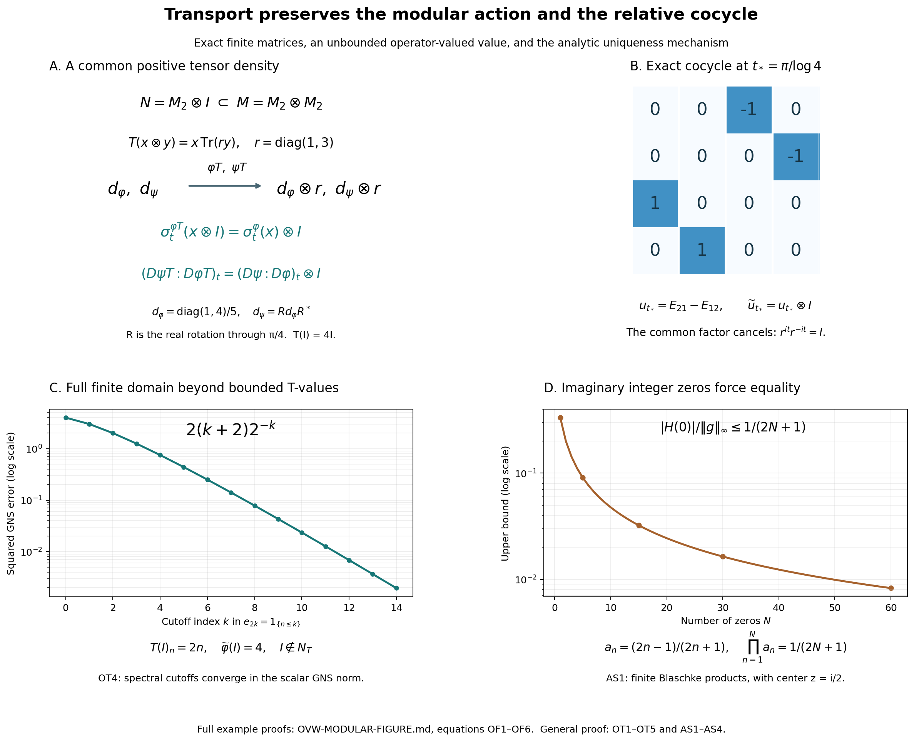

# Modular restriction and cocycle preservation for operator-valued weights

*Fresh local reconstruction, GPT-6 Astra (OpenAI), Ultra, 2026-10-04. CC0-1.0 to the extent of rights held.*

Let \(N\subset M\) be a unital inclusion of arbitrary von Neumann algebras, and let \(T:M_+\to\widehat N_+\) be a faithful normal semifinite operator-valued weight. Thus \(T\) is additive, positively homogeneous, preserves increasing positive suprema, and satisfies \(T(b^*xb)=b^*T(x)b\) for \(b\in N\). Faithfulness means \(T(x)=0\Rightarrow x=0\). Semifiniteness means that
\[
 N_T=\{x\in M:T(x^*x)\text{ is a bounded element of }N_+\}
\]
is weak-operator dense in \(M\). Let \(\varphi,\psi\) be faithful normal semifinite weights on \(N\), and use the actual EP extension to set
\[
 \widetilde\varphi=\widehat\varphi\circ T,\qquad
 \widetilde\psi=\widehat\psi\circ T.
\]
Then, for every real \(t\),

\[
 \sigma_t^{\widetilde\varphi}(x)=\sigma_t^\varphi(x)\quad(x\in N),
 \qquad
 (D\widetilde\psi:D\widetilde\varphi)_t=(D\psi:D\varphi)_t\in N.    \tag{OT1}
\]
The cocycles on each side are the balanced-matrix cocycles constructed in BC. There is no separability, finiteness or countable-decomposability hypothesis.

Exact earlier written proofs are [EP2](OA-FLOW-EP.md#oa-flow.ep.2), [EP3](OA-FLOW-EP.md#oa-flow.ep.3), [EP4](OA-FLOW-EP.md#oa-flow.ep.4), [EP5](OA-FLOW-EP.md#oa-flow.ep.5), [EP6](OA-FLOW-EP.md#oa-flow.ep.6); [BC1](OA-FLOW-BC.md#oa-flow.bc.1), [BC2](OA-FLOW-BC.md#oa-flow.bc.2), [BC3](OA-FLOW-BC.md#oa-flow.bc.3), [BC4](OA-FLOW-BC.md#oa-flow.bc.4); [GW1](OA-FLOW-GW.md#oa-flow.gw.1), [GW2](OA-FLOW-GW.md#oa-flow.gw.2); [SF0](OA-FLOW-SF.md#oa-flow.sf.sf0), [SB0](OA-FLOW-SF.md#oa-flow.sf.sb0), [SB1](OA-FLOW-SF.md#oa-flow.sf.sb1), [SB2](OA-FLOW-SF.md#oa-flow.sf.sb2), [SB3](OA-FLOW-SF.md#oa-flow.sf.sb3), [SB4](OA-FLOW-SF.md#oa-flow.sf.sb4), [SB5](OA-FLOW-SF.md#oa-flow.sf.sb5), [SB6](OA-FLOW-SF.md#oa-flow.sf.sb6); [MA1](OA-FLOW-MA.md#oa-flow.ma.1), [MA2](OA-FLOW-MA.md#oa-flow.ma.2), [MA3](OA-FLOW-MA.md#oa-flow.ma.3), [MA4](OA-FLOW-MA.md#oa-flow.ma.4); [AS1](OA-FLOW-AS.md#oa-flow.as.1), [AS2](OA-FLOW-AS.md#oa-flow.as.2), [AS3](OA-FLOW-AS.md#oa-flow.as.3), [AS4](OA-FLOW-AS.md#oa-flow.as.4); and [CP1](OA-FLOW-CP.md#oa-flow.cp.1), [CP2](OA-FLOW-CP.md#oa-flow.cp.2), [CP3](OA-FLOW-CP.md#oa-flow.cp.3), [CP4](OA-FLOW-CP.md#oa-flow.cp.4), [CP5](OA-FLOW-CP.md#oa-flow.cp.5), [CP6](OA-FLOW-CP.md#oa-flow.cp.6). EP binds positive-functional Cauchy–Schwarz to [GNS Lemma2.1](OA-FLOW-GNS.md#gns-lemma-2-1) and [Lemma2.2](OA-FLOW-GNS.md#gns-lemma-2-2), the norm identity to [GNS Theorem4.1](OA-FLOW-GNS.md#gns-theorem-4-1), and the Hilbert-sum construction to [GNS Lemma7.1](OA-FLOW-GNS.md#gns-lemma-7-1). The finite algebra \(m_T=\operatorname{span}N_T^*N_T\) and its \(N\)-valued bimodule linear extension \(T_0:m_T\to N\) on this finite algebra are precisely [EP6](OA-FLOW-EP.md#oa-flow.ep.6). No uniform norm bound is asserted.

The free development source is [F. Hiai's author manuscript, Theorem 8.7 and Lemmas 8.13–8.16, printed pp.71–80](https://arxiv.org/pdf/2004.02383v1#page=71). The proof here replaces the analytic-generator and Carlson imports by AS and MA, and uses EP's independently reconstructed extension by normal minorants. It never assumes a decomposition of a general normal weight as a sum of bounded normal functionals.

## OT1. Positivity of the coefficient-algebra-valued finite matrix extension

For a positive integer \(k\), define
\[
 R:M_k(m_T)\longrightarrow M_k(N),\qquad
 R([x_{ij}])=[T_0(x_{ij})].
\]
The bimodule identity is a finite entrywise calculation:

\[
 R(CXD)=CR(X)D\qquad(C,D\in M_k(N),\ X\in M_k(m_T)).              \tag{OT2}
\]
The space \(M_k(m_T)\) is spanned by its positive elements. Indeed, a matrix with one entry \(y^*x\), \(x,y\in N_T\), is \((yE_{ri})^*(xE_{rj})\) for the required entry \((i,j)\). The polarization formula for two such matrices expresses each product as a linear combination of matrices \(Z^*Z\) with entries in \(m_T\). This proves the span assertion.

We claim

\[
 X\in M_k(m_T),\quad X\geq0\quad\Longrightarrow\quad R(X)\geq0.    \tag{OT3}
\]
Fix \(f\in N_*^+\). [EP5](OA-FLOW-EP.md#oa-flow.ep.5)–[EP6](OA-FLOW-EP.md#oa-flow.ep.6) give the normal scalar weight \(\nu_f=\widehat f\circ T\) on \(M\), with no faithfulness or semifiniteness required. On \(M_k(M)_+\) define
\[
 \Psi_f(X)=\sum_{j=1}^k\nu_f(x_{jj}),\qquad
 \theta_f(Y)=\sum_{j=1}^k f(y_{jj})\quad(Y\in M_k(N)).
\]
The first is a weight simply by the diagonal formula. If \(X\in M_k(m_T)_+\), then each \(x_{jj}\) is positive in \(m_T\), hence in the finite bounded-value cone of \(T\) by [EP6](OA-FLOW-EP.md#oa-flow.ep.6). Thus \(\Psi_f(X)<\infty\). Since these positive matrices span \(M_k(m_T)\), its elements all belong to \(m_{\Psi_f}\). Uniqueness of the scalar finite extension, or polarization, gives

\[
 (\Psi_f)_0(X)=\theta_f(R(X))\qquad(X\in M_k(m_T)).                \tag{OT4}
\]
For positive such \(X\) and any \(C\in M_k(N)\), equations ([OT2](OA-FLOW-OT.md#equation-ot2))–([OT4](OA-FLOW-OT.md#equation-ot4)) imply

\[
 \theta_f(C^*R(X)C)=\Psi_f(C^*XC)\geq0.                           \tag{OT5}
\]
Here \(C^*XC\) is still positive in \(M_k(m_T)\), so its finite value has already been justified.

The matrix \(R(X)\) is self-adjoint because \(T_0\) preserves adjoints. If it were not positive, a nonzero spectral projection \(P=1_{(-\infty,-\varepsilon]}(R(X))\) would exist for some \(\varepsilon>0\). Take \(C=P\). Then \(P R(X)P\leq-\varepsilon P\). At least one positive diagonal entry of \(P\) is nonzero: if they were all zero, \(\|P\iota_j\xi\|^2=\langle P\iota_j\xi,\iota_j\xi\rangle=0\) for every coordinate vector, giving \(P=0\). A vector functional on a nonzero diagonal entry supplies \(f\in N_*^+\) with \(\theta_f(P)>0\). This contradicts ([OT5](OA-FLOW-OT.md#equation-ot5)), proving ([OT3](OA-FLOW-OT.md#equation-ot3)). No operator-valued amplification theorem is being assumed.

## OT2. Transfer of a finite mixed product

[EP6](OA-FLOW-EP.md#oa-flow.ep.6) proves that \(\widetilde\varphi,\widetilde\psi\) are faithful normal semifinite. Write \(N_\omega=\mathfrak n_\omega\) for each scalar weight \(\omega\), and
\[
 Z_{\varphi,\psi}=\operatorname{span}(N_\varphi^*N_\psi).
\]
If \(y\in N_{\widetilde\varphi}\cap N_T\) and \(z\in N_{\widetilde\psi}\cap N_T\), then

\[
 T_0(y^*z)\in Z_{\varphi,\psi}.                                  \tag{OT6}
\]
Indeed the Gram matrix
\[
 X=\begin{pmatrix}y^*y&y^*z\\z^*y&z^*z\end{pmatrix}
   =\begin{pmatrix}y&z\\0&0\end{pmatrix}^*
     \begin{pmatrix}y&z\\0&0\end{pmatrix}
\]
is positive in \(M_2(m_T)\). [OT1](OA-FLOW-OT.md#oa-flow.ot.1) makes \(R(X)\) positive in \(M_2(N)\), and its value under the balanced weight \(\Theta(\varphi,\psi)\) is
\[
 \varphi(T(y^*y))+\psi(T(z^*z))
 =\widetilde\varphi(y^*y)+\widetilde\psi(z^*z)<\infty.
\]
Thus \(R(X)\in m_\Theta\). [BC3](OA-FLOW-BC.md#oa-flow.bc.3)'s exact entry description says that its \((1,2)\) entry belongs to \(Z_{\varphi,\psi}\), proving ([OT6](OA-FLOW-OT.md#equation-ot6)).

We will also use the exact compatibility of finite extensions. If
\(v,w\in N_{\widetilde\omega}\cap N_T\), where \(\widetilde\omega=\widehat\omega T\), then

\[
 \widetilde\omega_0(v^*w)=\omega_0(T_0(v^*w)).                    \tag{OT7}
\]
Polarize \(v^*w\) into the squares of \(v+i^j w\), \(j=0,1,2,3\). This intersection is a linear space, and every square has bounded \(T\)-value and finite \(\widetilde\omega\)-value. On such squares the equation is exactly the definition of composition. Their \(T\)-values belong to \(m_\omega\); linearity of both finite extensions proves ([OT7](OA-FLOW-OT.md#equation-ot7)) and the domain of its right side.

## OT3. Entire base elements give bounded mixed right multipliers upstairs

Let \(a\in N\) be norm entire for \(\beta^{\psi,\varphi}\), and put
\[
 b=\beta_{-i}^{\psi,\varphi}(a),\qquad
 c=\beta_{-i/2}^{\psi,\varphi}(a),\qquad k=\max(1,\|c\|).
\]
[MA11](OA-FLOW-MA.md#equation-ma11)–[MA13](OA-FLOW-MA.md#equation-ma13) on \(N\) give

\[
 \psi(aha^*)\leq k^2\varphi(h),\qquad
 \varphi(b^*hb)\leq k^2\psi(h)\quad(h\in N_+),                    \tag{OT8}
\]
and \(\psi_0(az)=\varphi_0(zb)\) for every \(z\in Z_{\varphi,\psi}\).

The two inequalities extend to all \(m\in\widehat N_+\). To see this, take [EP2](OA-FLOW-EP.md#oa-flow.ep.2)'s increasing bounded approximants \(h_n\uparrow m\) in the extended cone. Sandwiching preserves their increasing pointwise supremum: for each normal positive \(f\),
\[
 (a h_n a^*)(f)=h_n(f_{a^*})\uparrow m(f_{a^*})=(a m a^*)(f).
\]
[EP5](OA-FLOW-EP.md#oa-flow.ep.5)'s normal extension now yields \(\widehat\psi(a m a^*)\leq k^2\widehat\varphi(m)\), and the same proof gives the second inequality. Composing with \(T\) and using its bimodule property gives

\[
 \widetilde\psi(a h a^*)\leq k^2\widetilde\varphi(h),\qquad
 \widetilde\varphi(b^*hb)\leq k^2\widetilde\psi(h)
 \quad(h\in M_+).                                               \tag{OT9}
\]
In particular

\[
 N_{\widetilde\varphi}a^*\subset N_{\widetilde\psi},\qquad
 N_{\widetilde\psi}b\subset N_{\widetilde\varphi},                 \tag{OT10}
\]

\[
 \|\Lambda_{\widetilde\psi}(ya^*)\|
       \leq k\|\Lambda_{\widetilde\varphi}(y)\|,\qquad
 \|\Lambda_{\widetilde\varphi}(zb)\|
       \leq k\|\Lambda_{\widetilde\psi}(z)\|.                     \tag{OT11}
\]
These hold on the entire indicated finite ideals, including elements with unbounded \(T(y^*y)\).

For \(y_0\in N_{\widetilde\varphi}\cap N_T\), \(z_0\in N_{\widetilde\psi}\cap N_T\), put \(x_0=y_0^*z_0\). By ([OT6](OA-FLOW-OT.md#equation-ot6)), \(T_0(x_0)\in Z_{\varphi,\psi}\), so
\[
 \psi_0(aT_0(x_0))=\varphi_0(T_0(x_0)b).
\]
The elements \(y_0a^*,z_0b\) still belong to \(N_T\), since [EP6](OA-FLOW-EP.md#oa-flow.ep.6) makes \(N_T\) a right \(N\)-module. They belong to the appropriate scalar finite ideals by ([OT10](OA-FLOW-OT.md#equation-ot10)). Thus ([OT7](OA-FLOW-OT.md#equation-ot7)) and the \(N\)-bimodule identity for \(T_0\) identify both sides, proving

\[
 \widetilde\psi_0(a x_0)=\widetilde\varphi_0(x_0 b).               \tag{OT12}
\]
This equality is between finite values of actual elements of the respective finite algebras.

## OT4. Spectral cutoffs cover the whole mixed finite domain

Let \(y\in N_{\widetilde\varphi}\), and put \(m=T(y^*y)\in\widehat N_+\). Then \(\widehat\varphi(m)<\infty\). In [EP2](OA-FLOW-EP.md#oa-flow.ep.2)'s representation of \(m\), its infinite-value projection \(p\) must vanish. Indeed \(m\geq n p\) for all positive integers \(n\), so
\[
 \widehat\varphi(m)\geq n\varphi(p).
\]
Faithfulness gives \(\varphi(p)>0\) when \(p\neq0\), possibly infinite, contradicting finiteness. Thus \(m\) is represented by a densely defined positive self-adjoint operator \(A_m\) affiliated with \(N\), with no infinite-value part.

For \(s>0\) put \(e_s=1_{[0,s]}(A_m)\in N\). These projections increase strongly to \(1\); write, as extended positive elements,

\[
 m_s=e_sme_s,\qquad r_s=(1-e_s)m(1-e_s),\qquad m=m_s+r_s.         \tag{OT13}
\]
The identity follows by the orthogonal spectral decomposition, equivalently by testing every positive normal vector series as in [EP3](OA-FLOW-EP.md#oa-flow.ep.3). The element \(m_s\) is bounded by \(s1\), and \(m_s\uparrow m\) pointwise on \(N_*^+\). Therefore

\[
 \widehat\varphi(m_s)\uparrow\widehat\varphi(m)<\infty,\qquad
 \widehat\varphi(r_s)=\widehat\varphi(m)-\widehat\varphi(m_s)
          \longrightarrow0.                                   \tag{OT14}
\]
The subtraction in the second formula is subtraction of two finite real numbers, justified by [EP5](OA-FLOW-EP.md#oa-flow.ep.5) additivity and ([OT13](OA-FLOW-OT.md#equation-ot13)); it is not subtraction of unbounded operators or of infinite weight values.

Bimodularity now gives

\[
 \begin{gathered}
 T((ye_s)^*(ye_s))=m_s,\qquad
 ye_s\in N_T\cap N_{\widetilde\varphi},\\
 \|\Lambda_{\widetilde\varphi}(y-ye_s)\|^2
 =\widehat\varphi(r_s)\longrightarrow0.                          \tag{OT15}
 \end{gathered}
\]
The second line applies \(T\) directly to \((1-e_s)y^*y(1-e_s)\); no extension of \(T_0\) to an undefined difference is used. Similarly, for \(z\in N_{\widetilde\psi}\) there are spectral projections \(f_s\uparrow1\) with \(zf_s\in N_T\cap N_{\widetilde\psi}\) and
\(\Lambda_{\widetilde\psi}(zf_s)\to\Lambda_{\widetilde\psi}(z)\).

Apply ([OT12](OA-FLOW-OT.md#equation-ot12)) to \(x_s=(ye_s)^*(zf_s)\). Equations ([OT11](OA-FLOW-OT.md#equation-ot11)) and ([OT15](OA-FLOW-OT.md#equation-ot15)) give convergence of all four GNS vectors in
\[
 \begin{split}
 \widetilde\psi_0(a x_s)
 &=\langle\Lambda_{\widetilde\psi}(zf_s),
             \Lambda_{\widetilde\psi}(ye_s a^*)\rangle,\\
 \widetilde\varphi_0(x_s b)
 &=\langle\Lambda_{\widetilde\varphi}(zf_s b),
             \Lambda_{\widetilde\varphi}(ye_s)\rangle.
 \end{split}
\]
Taking their limits proves

\[
 \widetilde\psi_0(a y^*z)=\widetilde\varphi_0(y^*zb)
 \quad(y\in N_{\widetilde\varphi},\ z\in N_{\widetilde\psi}).       \tag{OT16}
\]
Linearity proves the same equality on the entire space
\(\operatorname{span}(N_{\widetilde\varphi}^*N_{\widetilde\psi})\).

## OT5. Comparison and both conclusions

For every entire \(\beta^{\psi,\varphi}\)-element \(a\in N\), ([OT10](OA-FLOW-OT.md#equation-ot10)) and ([OT16](OA-FLOW-OT.md#equation-ot16)) are exactly [MA12](OA-FLOW-MA.md#equation-ma12)–[MA13](OA-FLOW-MA.md#equation-ma13) for the upstairs weights, with \(b=\beta_{-i}^{\psi,\varphi}(a)\). [MA4](OA-FLOW-MA.md#oa-flow.ma.4) therefore supplies a bounded ultraweak strip whose edges are

\[
 B_a(t)=\beta_t^{\widetilde\psi,\widetilde\varphi}(a),\qquad
 B_a(t-i)=
 \beta_t^{\widetilde\psi,\widetilde\varphi}
       (\beta_{-i}^{\psi,\varphi}(a)).                           \tag{OT17}
\]
[BC3](OA-FLOW-BC.md#oa-flow.bc.3) proves that both real groups in ([OT17](OA-FLOW-OT.md#equation-ot17)) are groups of weak-star continuous surjective linear isometries, with pointwise ultraweakly continuous orbits. The inclusion \(N\subset M\) carries the inherited ultraweak topology: in a concrete representation each vector-series functional on \(N\) extends to \(M\) by the same series, as proved in CP01–06. Thus [AS4](OA-FLOW-AS.md#oa-flow.as.4) applies with \(Y=N\), \(X=M\), and gives

\[
 \beta_t^{\widetilde\psi,\widetilde\varphi}(x)
       =\beta_t^{\psi,\varphi}(x)
 \qquad(x\in N,\ t\in\mathbb R).                                \tag{OT18}
\]

Take \(\psi=\varphi\). [BC4](OA-FLOW-BC.md#oa-flow.bc.4) for two identical weights says their off-diagonal group is \(\sigma^\varphi\), and similarly upstairs. Hence ([OT18](OA-FLOW-OT.md#equation-ot18)) proves the modular restriction in ([OT1](OA-FLOW-OT.md#equation-ot1)). For general \(\varphi,\psi\), put \(x=1\) in ([OT18](OA-FLOW-OT.md#equation-ot18)). [BC18](OA-FLOW-BC.md#oa-flow.bc.4) defines the two cocycles as precisely these values of \(\beta_t\), proving the second assertion in ([OT1](OA-FLOW-OT.md#equation-ot1)).

The proof establishes both assertions for every faithful normal semifinite \(T,\varphi,\psi\) with their full extended positive values and their whole scalar finite ideals. It does not construct \(T\), classify operator-valued weights, realize arbitrary abstract cocycles, establish a sum decomposition for general normal weights, or settle standard-form and spatial-derivative theorems.

## OT6. Three explicit mechanisms in operator-valued weight transport

The figure gives exact examples for [OT1–OT5](OA-FLOW-OT.md#oa-flow.ot.1), the finite-domain strip construction in [MA2–MA4](OA-FLOW-MA.md#oa-flow.ma.2), and the zero argument in [AS1](OA-FLOW-AS.md#oa-flow.as.1). The matrices and tail formulas below are proved, not inferred from plotted samples. Source context for the general theorem is [Hiai's free author manuscript, printed pp.71–80](https://arxiv.org/pdf/2004.02383v1#page=71). These particular examples and the finite-product illustration are local constructions.

### The common tensor density cancels in the cocycle

Let \(M=M_2(\mathbb C)\otimes M_2(\mathbb C)\), \(N=M_2(\mathbb C)\otimes I\), and identify \(N\) with \(M_2(\mathbb C)\). Put

\[
 r=\operatorname{diag}(1,3),\qquad
 T(x\otimes y)=x\,\operatorname{Tr}(ry),\qquad
 d_\varphi=\tfrac15\operatorname{diag}(1,4),\qquad
 d_\psi=R d_\varphi R^*,\quad
 R=2^{-1/2}\begin{pmatrix}1&-1\\1&1\end{pmatrix}.                 \tag{OF1}
\]
Thus \(d_\psi=\frac12I-\frac3{10}(E_{12}+E_{21})\). Define \(\varphi(x)=\operatorname{Tr}(d_\varphi x)\) and \(\psi(x)=\operatorname{Tr}(d_\psi x)\). The map \(T\) is the sum of the two positive coordinate compression maps, with coefficients \(1\) and \(3\), so it is positive. For positive \(X\), \(T(X)=0\) forces both diagonal compressions of \(X\) to vanish; equivalently \(X^{1/2}\) kills every coordinate vector, so \(X=0\). It is faithful, normal in finite dimension, \(N\)-bimodular, and finite everywhere, hence semifinite. Its value at the identity is \(4I\); it is not normalized to a conditional expectation.

Matrix units and the finite trace show that \(\widetilde\varphi=\varphi T\), \(\widetilde\psi=\psi T\) have densities \(d_\varphi\otimes r\), \(d_\psi\otimes r\). For any positive invertible matrix \(d\), the modular group of \(\operatorname{Tr}(d\,\cdot)\) is

\[
 \sigma_t(x)=d^{it}x d^{-it}.                                    \tag{OF2}
\]
For a direct verification, this group preserves the weight by cyclicity of the finite trace, and
\(G_{a,b}(z)=\operatorname{Tr}(d\,d^{iz}a d^{-iz}b)\) is entire and bounded on each horizontal band. Its upper unit-strip edges satisfy
\(G_{a,b}(t)=\varphi(\sigma_t(a)b)\) and
\(G_{a,b}(t+i)=\varphi(b\sigma_t(a))\), by multiplying the powers of \(d\) and cyclically moving the last factor. Every element is in the finite-star algebra, so [KU](OA-FLOW-KU.md#oa-flow.ku.3) identifies ([OF2](OA-FLOW-OT.md#equation-of2)) with the recovered modular group. Applying ([OF2](OA-FLOW-OT.md#equation-of2)) to the balanced block density \(\operatorname{diag}(d_\varphi,d_\psi)\) gives the BC cocycle
\[
 u_t=d_\psi^{it}d_\varphi^{-it}.
\]
Diagonalizing the positive matrices proves \((d\otimes r)^{it}=d^{it}\otimes r^{it}\) entry by entry. Hence, exactly,

\[
 \begin{split}
 \sigma_t^{\widetilde\varphi}(x\otimes I)
   &=\sigma_t^\varphi(x)\otimes I,\\
 (D\widetilde\psi:D\widetilde\varphi)_t
   &=(d_\psi^{it}d_\varphi^{-it})\otimes(r^{it}r^{-it})
     =u_t\otimes I.                                             \tag{OF3}
 \end{split}
\]
At \(t_*=\pi/\log4\), the common scalar factor \(5^{-it_*}\) cancels, while \(4^{it_*}=-1\). Thus
\[
 u_{t_*}=R\operatorname{diag}(1,-1)R^*\operatorname{diag}(1,-1)
   =\begin{pmatrix}0&-1\\1&0\end{pmatrix}.
\]
Panel B shows the exact \(4\times4\) matrix \(u_{t_*}\otimes I\), in the ordered basis \((e_1\otimes e_1,e_1\otimes e_2,e_2\otimes e_1,e_2\otimes e_2)\). Shading records entry modulus only. Panel A displays the two density routes and the exact restriction identity, not a claim that \(T\) itself intertwines every real modular action on every element of \(M\).

### A bounded element with unbounded operator-valued weight

Let \(M=\prod_{n\geq1}M_2(\mathbb C)\), the algebra of bounded matrix sequences, and \(N=\ell^\infty(\mathbb N)I\), its central scalar subalgebra. For \(X=(X_n)\in M_+\) put

\[
 T(X)_n=n\operatorname{Tr}(X_n),\qquad
 \varphi(a)=\sum_{n\geq1}2^{-n}a_n.                              \tag{OF4}
\]
The positive normal functionals on \(N\) are exactly the \(\ell^1_+\) sequences: normality on the increasing finite coordinate projections gives the sum representation, and nonnegative summation proves normality conversely. The sequence on the right defining \(T\) may be unbounded. It defines an extended positive element through
\(T(X)(f)=\sum_n f_n n\operatorname{Tr}(X_n)\) for \(f\in\ell^1_+\).
Finite partial sums are continuous positive linear functionals on \(\ell^1_+\); their supremum is lower semicontinuous and additive by nonnegative series, so this is precisely EP's extended cone. Monotone convergence of scalar series proves normality of \(T\), its faithfulness follows coordinatewise from the faithful finite trace, and central scalar multiplication gives bimodularity. Finite coordinate truncations of any bounded matrix sequence are in \(N_T\) and converge strongly in the direct-sum representation. Hence \(T\) is semifinite. The state \(\varphi\) is faithful and normal since every coefficient \(2^{-n}\) is positive and sums to \(1\).

Take \(y=I\). Then \(m=T(y^*y)\) is the unbounded sequence \(m_n=2n\), so \(y\notin N_T\), but
\[
 \widetilde\varphi(y^*y)=\sum_{n\geq1}2n\,2^{-n}=4<\infty.
\]
The finite sum identity
\(\sum_{n=1}^k n2^{-n}=2-(k+2)2^{-k}\)
follows by induction, starting at \(k=0\); letting \(k\to\infty\) proves the preceding total and the tail identity below. [OT4](OA-FLOW-OT.md#oa-flow.ot.4)'s spectral cutoff is exactly

\[
 e_{2k}(n)=1_{\{n\leq k\}},\qquad
 \|\Lambda_{\widetilde\varphi}(y-ye_{2k})\|^2
   =2(k+2)2^{-k}.                                               \tag{OF5}
\]
Panel C plots this squared GNS error for \(k=0,\ldots,14\), on a logarithmic vertical scale. At \(k=0\) the cutoff is zero. The exact formula tends to zero, although the untruncated \(T(y^*y)\) has no bounded norm. This explicitly displays why the proof must pass beyond \(N_T\).

### The finite-product obstruction to a nonzero difference

[AS1](OA-FLOW-AS.md#oa-flow.as.1) considers a bounded analytic function \(g\) on the upper half-plane with \(g(in)=0\) for every positive integer. If \(g(i/2)\neq0\), the disk transform
\[
 H(w)=g\!\left(\tfrac i2\,\frac{1+w}{1-w}\right)
\]
has zeros \(a_n=(2n-1)/(2n+1)\). Dividing by a finite set of its Blaschke factors, with the removable singularities and the disk maximum principle proved in [AS1](OA-FLOW-AS.md#oa-flow.as.1), gives

\[
 \frac{|H(0)|}{\|g\|_\infty}
 \leq\prod_{n=1}^N\frac{2n-1}{2n+1}
 =\frac1{2N+1}\longrightarrow0.                                \tag{OF6}
\]
The product telescopes exactly. Panel D plots this upper bound for \(N=1,\ldots,60\); it does not plot values of an assumed nonzero \(g\), whose existence the bound rules out. In the general [AS1](OA-FLOW-AS.md#oa-flow.as.1) proof the point \(iy\) is chosen wherever \(g(iy)\neq0\); the divergence of \(\sum_n2y/(n+y)\) replaces the special telescoping identity. [AS4](OA-FLOW-AS.md#oa-flow.as.4) applies this obstruction to the difference of two entire orbit functions after their horizontal exponential bounds have been established.

[Editable original SVG](../assets/ovw-modular/assets/ovw-modular.svg), [figure data](../assets/ovw-modular/ovw-modular-numerics.json), and [reproduction source](../assets/ovw-modular/render_ovw_modular.py).
