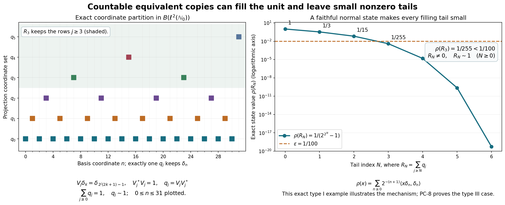

# Projection comparison and the countably decomposable type III case

*Independent exposition and original figure/source: CC0-1.0 to the extent of rights held. Self-checked by the writing AI.*

Let \(M=M''\subseteq B(H)\), where \(H\) is any complex Hilbert space and the identity is \(1_H\). Zero spaces are permitted. A projection is an element \(p=p^*=p^2\). Write \(p\sim q\) if some \(v\in M\) has \(v^*v=p,\ vv^*=q\), and \(p\precsim q\) if the final projection may instead be any subprojection of \(q\). A projection \(p\) is finite if \(p\sim q\leq p\) forces \(q=p\). Proper infiniteness means that \(p\neq0\) and every nonzero central compression of the unit of \(pMp\) is infinite. Type III means absence of nonzero finite projections. A projection is countably decomposable if every orthogonal family of its nonzero subprojections is countable.

The actual earlier mathematical inputs are CF Sections 1, 6–8 and 10, with Sections 2–5 as the continuous-calculus predecessors (choice/maximality, norm series, bounded C\* calculus, Hilbert projection/adjoints/completion), [SF-0](OA-FLOW-SF.md#oa-flow.sf.sf0) and SB-0 (the commutant-unitary test and elementary Hilbert facts), and CP-01–06 (concrete predual and vector-series topology). The polar construction below is the bounded specialization of the reviewed HA-R4 range-isometry argument, written completely here; its unbounded form theorem is not an additional input. No bounded or unbounded spectral representation theorem, weight theorem, trace existence, spectral classification or cardinal-dimension theorem is an input.

Free source comparison: [Jesse Peterson's author notes, 2020, Sections 5.1–5.2, printed 83–90](https://math.vanderbilt.edu/peters10/teaching/spring2020/OperatorAlgebras.pdf#page=83), and [Brent Nelson's author notes, Lemma 5.2.9 and Proposition 5.2.13, printed 49–51](https://users.math.msu.edu/users/banelson/teaching/209/209_notes.pdf#page=50). Every statement used in this proof is proved below or bound to the specified earlier programme proof. In particular the countability condition will concern only the projection to be embedded.

Actual earlier proof ranges: [OA-FLOW.CF.1](OA-FLOW-CF.md#oa-flow.cf.1), [OA-FLOW.CF.2](OA-FLOW-CF.md#oa-flow.cf.2), [OA-FLOW.CF.3](OA-FLOW-CF.md#oa-flow.cf.3), [OA-FLOW.CF.4](OA-FLOW-CF.md#oa-flow.cf.4), [OA-FLOW.CF.5](OA-FLOW-CF.md#oa-flow.cf.5), [OA-FLOW.CF.6](OA-FLOW-CF.md#oa-flow.cf.6), [OA-FLOW.CF.7](OA-FLOW-CF.md#oa-flow.cf.7), [OA-FLOW.CF.8](OA-FLOW-CF.md#oa-flow.cf.8), [OA-FLOW.CF.10](OA-FLOW-CF.md#oa-flow.cf.10), [OA-FLOW.SF.SF0](OA-FLOW-SF.md#oa-flow.sf.sf0), [OA-FLOW.SF.SB0](OA-FLOW-SF.md#oa-flow.sf.sb0), [OA-FLOW.CP.1](OA-FLOW-CP.md#oa-flow.cp.1), [OA-FLOW.CP.2](OA-FLOW-CP.md#oa-flow.cp.2), [OA-FLOW.CP.3](OA-FLOW-CP.md#oa-flow.cp.3), [OA-FLOW.CP.4](OA-FLOW-CP.md#oa-flow.cp.4), [OA-FLOW.CP.5](OA-FLOW-CP.md#oa-flow.cp.5), [OA-FLOW.CP.6](OA-FLOW-CP.md#oa-flow.cp.6). The bounded polar construction in PC1 is proved locally. Its comparison with the later HA-R range-isometry proof is historical development context and adds no unbounded-form premise.

## PC-0. The two set-theoretic operations

We need no unproved infinite-cardinal arithmetic. If \(u:A\to B\) and \(v:B\to A\) are injections, set \(A_0=A\setminus v(B)\) and \(D=\bigcup_{n\geq0}(vu)^nA_0\). The map equal to \(u\) on \(D\) and to \(v^{-1}\) on \(A\setminus D\) is a bijection \(A\to B\). The second inverse is defined since \(A_0\subseteq D\). Their images are disjoint because \(vu(D)\subseteq D\). For surjectivity, if \(v(b)\in D\), then \(v(b)\notin A_0\), so \(v(b)\in vu(D)\) and injectivity gives \(b\in u(D)\); otherwise the inverse branch maps \(v(b)\) to \(b\).

An infinite set \(I\) is in bijection with \(I\setminus\{i_0\}\) for any \(i_0\in I\): choose distinct \(i_0,i_1,\ldots\), shift \(i_n\mapsto i_{n+1}\), and fix all other points.

Every infinite set \(I\) has a partition \(I=I_0\sqcup I_1\) with both pieces in bijection with \(I\). Here are details at the choice convention of [CF-1](OA-FLOW-CF.md#oa-flow.cf.1). Well-order \(I\), and identify its cardinal with an infinite initial ordinal \(\kappa\). If any infinite cardinal up to \(\kappa\) failed to have \(|\lambda\times\{0,1\}|=\lambda\), take the least failing one \(\lambda\). Order its pairs first by their ordinal coordinate, then by the second coordinate. The predecessors of any pair have cardinal at most \(2|\beta|+1<\lambda\), by minimality when \(|\beta|\) is infinite and by finiteness otherwise; adjoining one point does not change an infinite cardinal by the preceding shift argument. The order type cannot exceed \(\lambda\): a point at position \(\lambda\) would have \(\lambda\) predecessors. Thus there is an injection of the pairs into \(\lambda\); the converse injection is immediate, and the bijection just proved gives a contradiction. Transport the two images to \(I\).

## PC-1. Corners, supports and arbitrary orthogonal sums

The orthogonal projection onto an intersection of projection ranges commutes with every unitary of \(M'\), since that intersection reduces those unitaries. [SF-0](OA-FLOW-SF.md#oa-flow.sf.sf0) puts the projection in \(M\). This supplies all meets. Complements give joins; equivalently a join projects onto the closed span of the ranges. Orthogonal joins are their strong sums.

For \(e\in M\) a projection, \(eMe\) acting on \(eH\) is a concrete von Neumann algebra. Indeed extend a weak operator limit on \(eH\) by zero on \((1-e)H\); it is a weak operator limit of elements of \(M\), hence lies in \(M\) and is compressed by \(e\). The following finite-vector argument gives its bicommutant characterization locally.

For completeness the latter argument uses only Hilbert projection. For a unital \*-algebra \(A\) and a tuple \((\xi_1,\ldots,\xi_n)\), project onto the closed orbit \(\overline{\{(a\xi_j)_j:a\in A\}}\). Its matrix entries commute with \(A\). Every diagonal \(x\in A''\) therefore preserves this space, which contains the original tuple. Thus \(x\) is a strong limit of elements of \(A\), on arbitrary finite tuples. If \(A\) is weak operator closed the limit belongs to \(A\), proving \(A=A''\).

Given \(x\in M\), put \(h=(x^*x)^{1/2}\). The rule \(h\xi\mapsto x\xi\) is a well-defined isometry, because \(\|h\xi\|=\|x\xi\|\). Extend it to \(\overline{hH}=(\ker x)^\perp\), and set it to zero on \(\ker x\). This gives a partial isometry \(v\), with
\[
x=vh,\qquad v^*v=[x^*H],\qquad vv^*=[xH].
\tag{PC1}
\]
The brackets mean projection onto the closed indicated range. The initial range equality follows from \((x^*H)^\perp=\ker x\). Every unitary of \(M'\) commutes with \(x,h\), preserves their kernels and ranges, and therefore commutes with this isometry and its zero summand. [SF-0](OA-FLOW-SF.md#oa-flow.sf.sf0) gives \(v\in M\); consequently both support projections lie in \(M\). This proves the entire bounded polar input, including zero and noninjective operators.

Suppose \((v_i)_{i\in I}\subset M\) are partial isometries with initial projections \(p_i\) and final projections \(q_i\), each family separately orthogonal. For every finite \(F\subset I\),
\[
\left\|\sum_{i\in F}v_i\xi\right\|^2
=\sum_{i\in F}\|p_i\xi\|^2\leq\|\xi\|^2.
\tag{NP1}
\]
The scalar sum is the supremum of its finite subsums. For any \(\varepsilon>0\) a finite subsum is within \(\varepsilon^2\) of that supremum, so every complementary finite vector sum has norm at most \(\varepsilon\). Completeness gives a strong limit \(v\); applying the same argument to the adjoints gives their strong limit \(v^*\). The limits commute with \(M'\), hence belong to \(M\). Uniformly bounded strong products converge strongly by expanding their differences, so
\[
v^*v=\sum_i p_i,\qquad vv^*=\sum_i q_i.
\tag{PC2}
\]
Thus equivalences or subequivalences can be added over arbitrary orthogonal index sets. More generally uniformly bounded operators supported on separate orthogonal corners have a strong-star diagonal sum, by the same squared-norm tail estimate.

Composition of implementing partial isometries proves transitivity of \(\precsim\): if \(u^*u=p,\ uu^*\leq q=v^*v,\ vv^*\leq r\), then \((vu)^*(vu)=p\) and \((vu)(vu)^*\leq r\). Adjoints give symmetry of \(\sim\); identity projections give reflexivity.

## PC-2. Central supports and comparison

For a projection \(p\), let \(c(p)\) project onto \(\overline{\operatorname{span}}MpH\). This space reduces \(M\), so its projection commutes with \(M\). It also reduces \(M'\), because \(y'xp\xi=xpy'\xi\). [SF-0](OA-FLOW-SF.md#oa-flow.sf.sf0) puts that projection in \(M\); hence \(c(p)\in Z(M)\). It dominates \(p\). Any central projection \(z\geq p\) contains every \(xpH\), so \(c(p)\leq z\). This proves the least-central-projection definition without an imported support theorem.

If \(pMq=\{0\}\), then \(p\) vanishes on \(MqH\), giving \(pc(q)=0\). Since \(c(q)\) is central, minimality gives \(c(p)\leq1-c(q)\). Conversely orthogonal central supports force \(pxq=0\) for every \(x\in M\). We have proved
\[
pMq=\{0\}\quad\Longleftrightarrow\quad c(p)c(q)=0.
\tag{PC3}
\]
When \(pMq\neq0\), polar decomposition of a nonzero \(pxq\) supplies nonzero equivalent projections below \(q\) and \(p\), respectively. Equivalence also preserves central support: every central projection dominating one initial projection dominates the final projection, by commuting through its partial isometry, and conversely.

Take a maximal collection of nonzero partial isometries with separately orthogonal initial projections below \(p\) and final projections below \(q\). Chain unions supply upper bounds, so [CF-1](OA-FLOW-CF.md#oa-flow.cf.1) applies. Let \(v\) be its [PC-1](OA-FLOW-PC.md#oa-flow.projection.pc1) strong-star sum and set \(p_0=p-v^*v,\ q_0=q-vv^*\). A nonzero bridge from \(p_0\) to \(q_0\) could be added, so \(c(p_0)c(q_0)=0\). With \(z=c(q_0)\) we have \(zp_0=0\) and \((1-z)q_0=0\). Compressing \(v\) gives
\[
zp\sim z v^*v\precsim zq,\qquad
(1-z)q\sim(1-z)vv^*\precsim(1-z)p.
\tag{NP2}
\]
This is central comparison for arbitrary projections and arbitrary cardinality.

## PC-3. Mutual subequivalence and the join formula

Suppose \(p\precsim q\) and \(q\precsim p\), implemented by \(u^*u=p,\ uu^*\leq q\) and \(v^*v=q,\ vv^*\leq p\). In the corner with unit \(p\), \(T=vu\) is an isometry. Put
\[
a_0=p-vv^*,\quad a_n=T^na_0(T^*)^n,\quad
A=\sum_{n\geq0}a_n,\quad B=uAu^*.
\]
Since \(a_0T=0\), the \(a_n\) are orthogonal: for \(m>n\), their product contains \(a_0T^{m-n}=0\). Also \(v^*a_0v=0\) and \(v^*a_{n+1}v=ua_nu^*\), so \(v^*Av=B\). The projection \(p-A\) is at most \(vv^*\). Therefore \(v^*(p-A)\) has initial projection \(p-A\) and final projection \(q-B\). Its initial and final projections are orthogonal to those of \(uA\). Their sum satisfies
\[
W=uA+v^*(p-A),\qquad W^*W=p,\qquad WW^*=q.
\tag{NP3}
\]
This proves mutual subequivalence implies equivalence, including zero projections.

For \(x=(1-p)q\), its kernel is \((1-q)H\oplus(pH\cap qH)\). Its initial support is therefore \(q-p\wedge q\). Also \(\ker x^*=pH\oplus((1-p)H\cap(1-q)H)\), so its final support is \(p\vee q-p\). [PC-1](OA-FLOW-PC.md#oa-flow.projection.pc1) gives
\[
(p\vee q)-p\sim q-(p\wedge q).
\tag{NP4}
\]

## PC-4. The center of any projection corner

For \(e\neq0\), work in \(Mc(e)\), with identity \(c(e)\). Compression maps \(Z(M)c(e)\) into \(Z(eMe)\). It is injective: a central \(h\) with \(he=0\) annihilates \(MeH\), whose span is dense in \(c(e)H\).

Choose a maximal orthogonal family \((r_i)\) of nonzero projections subequivalent to \(e\), including \(r_0=e\). The residual projection is zero: otherwise PC3 provides a bridge to \(e\) and thus an additional member. Choose \(v_i^*v_i\leq e,\ v_iv_i^*=r_i,\ v_0=e\). For \(h\in Z(eMe)\) define
\[
\widetilde h=\sum_i v_i h v_i^*.
\tag{PC4}
\]
Each summand is supported on \(r_i\) and has norm at most \(\|h\|\); [PC-1](OA-FLOW-PC.md#oa-flow.projection.pc1) supplies the bounded strong-star sum. It compresses to \(h\) at \(e\). For \(x\in Mc(e)\), \(v_i^*xv_j\in eMe\), so it commutes with \(h\). Multiplying this identity by \(v_i,v_j^*\) shows \(r_i\widetilde h x r_j=r_i x\widetilde h r_j\). Since finite sums of \(r_i\) converge strongly to \(c(e)\), all matrix corners determine an operator, and \(\widetilde h\) is central.

Commutation of \(h\) with \(v_i^*v_i\) gives, in each \(r_i\) corner, preservation of products and adjoints; hence extension and compression are inverse unital \*-isomorphisms. Their continuity is also explicit. For vectors \(\xi,\eta\),
\[
\langle\widetilde h\xi,\eta\rangle
=\sum_i\langle h v_i^*\xi,v_i^*\eta\rangle,\qquad
\sum_i\|v_i^*\xi\|^2\leq\|\xi\|^2.
\tag{PC5}
\]
Only countably many coordinates are nonzero: for each integer \(n\), finitely many squared norms exceed \(1/n\). Thus this is a CP vector-series functional on \(eMe\). A square-summable series of ambient vector pairs remains square summable after these substitutions, by the same inequality and the countable union of their supports. Extension is ultraweakly continuous on its entire domain; compression is too by its vector-pair substitutions. In particular central projections of \(eMe\) are precisely \(ez\), \(z\in Z(M)c(e)\), and this identification preserves bounded increasing suprema.

## PC-5. Finite central parts and properly infinite halving

Finiteness passes to subprojections: a partial isometry from \(r\leq p\) onto a strict subprojection of \(r\), added to \(p-r\), would make \(p\) equivalent to a strict subprojection of itself. Finiteness passes through equivalence by conjugating the corner with its implementing partial isometry. The same corner isomorphism preserves proper infiniteness.

In any projection corner with unit \(e\), choose a maximal orthogonal family of finite central projections. Its sum \(z_f\) is finite. Indeed an equivalence from \(z_f\) to a subprojection commutes with each central summand and restricts there to equality; its full final projection must therefore equal \(z_f\). Every finite central projection is below \(z_f\), since its portion outside \(z_f\), if nonzero, could be added. Hence \(e-z_f\), when nonzero, has no nonzero finite central compression and is properly infinite. This decomposition is unique and, by [PC-4](OA-FLOW-PC.md#oa-flow.projection.pc4), arises from an ambient central split on \(c(e)\).

We prove halving in a corner \(A\) whose unit \(e\) is properly infinite. In every nonzero central corner \(zA\), infiniteness gives \(w^*w=z,\ ww^*<z\). Its defect \(d=z-ww^*\neq0\) has orthogonal equivalent translates \(w^nd(w^*)^n\), because \(dw=0\). Let \(h=c_A(d)\leq z\). Equivalence preserves their common central support \(h\), so they lie in \(hA\) and have full support there.

Extend this countable seed to a maximal orthogonal family \((d_i)_{i\in I}\) equivalent to \(d\) inside \(hA\). Let \(Q=\sum_i d_i,\ r=h-Q\), and fix \(i_0\). Comparison in \(hA\) gives a central \(t\leq h\) with \(rt\precsim d_{i_0}t\) and \(d_{i_0}(h-t)\precsim r(h-t)\). If \(t=0\), another copy of \(d\) fits in \(r\), contradicting maximality. Thus \(t\neq0\).

The infinite family absorbs this residual on \(t\). Every \(d_it\) is nonzero because \(c_A(d_i)=h\), and they remain mutually equivalent by central compression of their implementing partial isometries. Map \(rt\) into \(d_{i_0}t\), and use a bijection \(I\to I\setminus\{i_0\}\) to map \(Qt\) into the other summands. Orthogonal addition gives \(t\precsim Qt\); the reverse subequivalence is inclusion. [PC-3](OA-FLOW-PC.md#oa-flow.projection.pc3) gives \(t\sim Qt\). Partition \(I\) into two pieces each in bijection with \(I\), using [PC-0](OA-FLOW-PC.md#oa-flow.projection.pc0). Their sums in \(Qt\) are each equivalent to \(Qt\). Transport them through the equivalence \(t\sim Qt\). We obtain \(t=r_t+s_t\), with \(r_t\sim s_t\sim t\).

This construction works inside every nonzero central portion of \(e\). A maximal orthogonal family of central portions admitting such a halving must therefore fill \(e\). Adding their halves and their equivalences by [PC-1](OA-FLOW-PC.md#oa-flow.projection.pc1) proves
\[
e=r+s,\qquad r\sim s\sim e.
\tag{NP5}
\]
No countability assumption was used. Repeated splitting is consequently legitimate.

There are countably many orthogonal copies of \(e\) inside \(e\): choose an isometry \(w\) from \(e\) onto \(s\), and put \(e_n=w^n r(w^*)^n\). Their orthogonality follows from \(rw=0\); each is equivalent to \(e\). Their sum \(Q\) contains \(e_0\sim e\), so \(e\precsim Q\leq e\) and [PC-3](OA-FLOW-PC.md#oa-flow.projection.pc3) gives \(Q\sim e\). Transport the family through this equivalence to obtain a filling family
\[
e=\sum_{n\geq0}f_n,\qquad f_n\sim e,\qquad f_nf_m=0\ (n\neq m).
\tag{PC6}
\]
This argument does not incorrectly assume that the first shift's original ranges already fill \(e\).

## PC-6. The finite-join consequence

If \(p,q\) are finite, NP4 makes \(p\vee q-p\) finite. Replace \(q\) by this projection and work in the corner with unit \(p+q\). If that unit were infinite, [PC-5](OA-FLOW-PC.md#oa-flow.projection.pc5) would give a nonzero properly infinite central piece; compress to it. We would have a properly infinite unit \(1=p+q\) with both summands finite.

Choose its halving \(1=r+s,\ r\sim s\sim1\). Compare \(p\wedge r\) and \(q\wedge s\), with central \(z\) satisfying \(z(p\wedge r)\precsim z(q\wedge s)\) and the reverse comparison on \(1-z\). On \(z\), NP4 and orthogonal addition give
\[
zr=z(r-p\wedge r)+z(p\wedge r)
\precsim z((p\vee r)-p)+z(q\wedge s)\leq zq.
\tag{NP6}
\]
The target summands are orthogonal: \(q\wedge s\) is orthogonal to both \(p\) and \(r\), thus to their join. Both lie under \(q\). If \(z\neq0\), \(zr\sim z\) is infinite and cannot be subequivalent to finite \(zq\); hence \(z=0\). On \(1-z\) interchange \(p,r\) with \(q,s\) to get the same contradiction unless \(1-z=0\). This is impossible for a nonzero unit. Therefore \(p\vee q\) is finite. Induction also proves every finite orthogonal sum of finite projections finite.

## PC-7. Countability belongs to the source corner

A faithful normal state on \(fMf\) makes \(f\) countably decomposable. Every nonzero orthogonal subprojection has strictly positive state value. Finitely many can have value at least \(1/n\), since their finite sums have value at most one; taking their union over \(n\) proves countability. No state on \(M\) is inferred.

Conversely suppose \(f\neq0\) is countably decomposable. For a unit vector \(\xi\in fH\), let \(r_\xi\) project onto \(\overline{M'\xi}\). [SF-0](OA-FLOW-SF.md#oa-flow.sf.sf0) gives \(r_\xi\in M\), and \(r_\xi\leq f\). The vector functional is faithful on \(r_\xi Mr_\xi\): if a positive \(a\) there has zero value, then \(a^{1/2}\xi=0\), so commutation makes \(a^{1/2}\) zero on the dense orbit \(M'\xi\).

A maximal orthogonal collection of such nonzero \(r_{\xi_j}\leq f\) fills \(f\); a nonzero remainder would contain a vector providing an additional one. It is finite or countable by assumption. With strictly positive \(c_j\) summing to one,
\[
\omega(x)=\sum_j c_j\langle x\xi_j,\xi_j\rangle,\qquad x\in fMf,
\tag{PC7}
\]
is normal by CP's square-summable vector-series description. It is a state. Zero value on positive \(x\) forces \(x^{1/2}\) to vanish on every commutant orbit, hence on their filling sum, proving faithfulness. This proves the exact equivalence of the two corner conventions.

Now let \(e\) be properly infinite and let \(f\) be countably decomposable, with \(c(f)\leq c(e)\). A maximal orthogonal family of nonzero \(q_i\leq f\) with \(q_i\precsim e\) fills \(f\): a nonzero residual \(a\) has \(c(a)c(e)=c(a)\neq0\), so PC3 supplies another subprojection. The family is countable by the hypothesis on \(f\). Use distinct copies \(e_i\sim e\) from [PC-5](OA-FLOW-PC.md#oa-flow.projection.pc5) to place each \(q_i\) under \(e_i\), then add the implementing partial isometries. We have proved
\[
c(f)\leq c(e),\quad e\text{ properly infinite},\quad
f\text{ countably decomposable}\quad\Longrightarrow\quad f\precsim e.
\tag{PC8}
\]
The zero source case is immediate. In particular two countably decomposable properly infinite projections with the same central support are equivalent by applying PC8 twice and [PC-3](OA-FLOW-PC.md#oa-flow.projection.pc3). The whole ambient algebra need not be countably decomposable.

## PC-8. Type III, small filling tails and unitary completion

If \(M\) is type III, every nonzero projection corner has no nonzero finite projections: an equivalence witnessing corner infiniteness or finiteness is the same partial isometry in \(M\). Every nonzero central compression of its unit is therefore infinite, so every nonzero projection is properly infinite. In a factor the central support of every nonzero projection is \(1\). PC8 proves that every two nonzero projections in a countably decomposable type III factor are equivalent, without a separable-predual hypothesis.

For any properly infinite \(e\), take PC6's filling family and let \(R_N=e-\sum_{n<N}f_n=\sum_{n\geq N}f_n\). Then \(R_N\neq0,\ R_N\sim e\), since it contains \(f_N\sim e\) and is at most \(e\). The net of finite sums defining the filling family gives \(R_N\downarrow0\) strongly. For every normal positive functional \(\rho\), CP gives a vector series \(\rho(x)=\sum_j\langle xu_j,v_j\rangle\) with both sequences square summable. Its tail at \(R_N\) is uniformly bounded by \(\sum_{j>J}\|u_j\|\|v_j\|\), which tends to zero by scalar Cauchy–Schwarz. Its finite initial sum tends to zero by strong convergence. Hence \(\rho(R_N)\to0\). Thus finitely many such functionals can be made simultaneously smaller than any specified \(\varepsilon>0\), while the chosen tail remains nonzero and equivalent to \(e\).

If \(v^*v=p,\ vv^*=q\) and the complementary projections \(e-p,e-q\) are equivalent in \(eMe\), an implementing \(w\) on those complements makes \(v+w\) unitary in that corner: the initial and final summands are orthogonal and both sums equal \(e\). In a countably decomposable type III factor this applies whenever both complements are nonzero (or both are zero). A zero complement cannot be matched to a nonzero one; no unconditional unitary-extension assertion is made.

For completeness there is a central projection split into a projection-semifinite part and a type III part. Let \(z\) be the join of all finite projections. Unitary conjugation preserves that family, so \(z\) commutes with all unitaries and hence with \(M\) by [SF-0](OA-FLOW-SF.md#oa-flow.sf.sf0)'s exponential argument. Every nonzero projection under \(z\) has a nonzero finite subprojection: otherwise it has no polar bridge to any finite projection, and is orthogonal to their join. A maximal orthogonal finite family therefore fills \(z\). The complementary algebra has no nonzero finite projections. This is the projection formulation only; existence of scalar or center-valued traces is not claimed.

## Exact illustrated model

The model is \(B(\ell^2(\mathbb N_0))\), illustrating the projection mechanism rather than asserting that this algebra is type III. Put
\[
S_j=\{2^j(2k+1)-1:k\geq0\},\qquad
V_j\delta_k=\delta_{2^j(2k+1)-1},\qquad q_j=V_jV_j^*.
\tag{PC9}
\]
Every \(n+1\) has exactly one finite power of two dividing it, so the \(S_j\) partition \(\mathbb N_0\). Each displayed map is a bijection from the full basis to its coordinate set. It preserves norms on finite coordinate sums and extends by CF completion to an isometry on the full Hilbert space. Thus \(V_j^*V_j=1,\ \sum_jq_j=1,\ q_j\sim1\). The tail \(R_N=\sum_{j\geq N}q_j\) consists exactly of coordinates \(n+1\) divisible by \(2^N\).

The functional \(\rho(x)=\sum_{n\geq0}2^{-(n+1)}\langle x\delta_n,\delta_n\rangle\) is a normal state by CP, with value one at the identity. It is faithful: zero value on positive \(x\) forces \(x^{1/2}\delta_n=0\) for every \(n\), and density of the finite coordinate sums gives \(x=0\). Its exact tail value is the geometric sum
\[
\rho(R_N)=\sum_{k\geq1}2^{-k2^N}
=\frac1{2^{\,2^N}-1}\longrightarrow0.
\tag{PC10}
\]
Every tail is nevertheless infinite-dimensional and equivalent to \(1\). The finite coordinate samples and logarithmic plot show precisely this filling and small-value mechanism; their formulas, not the samples, prove the assertions. The reproduction script and exact rational values are retained with this proof.

[Reproduction source](../assets/projection-reconstruction/render_projection_mechanism.py); [editable SVG](../assets/projection-reconstruction/assets/projection-tail-mechanism.svg); [exact rational data](../assets/projection-reconstruction/figure-data.json).
