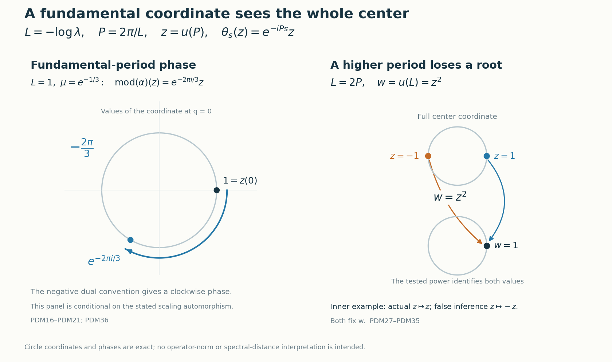

# Periodic weights and the scaling modulus

A weight scaled by an automorphism determines a phase on the center of its continuous core. At the fundamental modular period, this phase determines the entire modulus. A higher period sees only a power of the center coordinate and can lose a finite choice of roots. We compute the full center and construct a matrix-weight example that makes this loss explicit.

*Original exposition, examples, figures, data and reproducible drawing code in this lesson are dedicated to CC0-1.0. Source publications and font components retain their own terms.*

## The two periods and the center coordinate

Let \(0<\lambda<1\). The two parameters that enter this calculation are
\[
 L=-\log\lambda>0,\qquad P=\frac{2\pi}{L},\qquad LP=2\pi.
 \tag{PDM1}
\]
The center flow has least period \(L\). A fundamental periodic weight has modular period \(P\). The translation unitary that generates the whole core center is \(u(P)\).

## 1. The complete assertion at the fundamental period

Let \(M\) be a nonzero type \(\mathrm{III}_\lambda\) factor. Let \(0\ne\psi\) be a normal semifinite weight of infinite multiplicity, with support \(p=s(\psi)\), such that
\[
 \sigma_P^\psi=\operatorname{id}_{pMp}.
 \tag{PDM2}
\]
Assume also that \(p\sim1\) in \(M\). This includes every faithful weight on an arbitrary such factor and every nonzero supported weight when the factor has separable predual, as proved in Section 2. Here infinite multiplicity means that its support centralizer is properly infinite. Let \(\alpha\in\operatorname{Aut}(M)\), and suppose, on the entire positive cone, that
\[
 \psi\circ\alpha^{-1}=\mu\psi,\qquad \mu>0.
 \tag{PDM3}
\]
Write \(\theta\) for the negative dual action on the center of the intrinsic core, and define \(\operatorname{mod}(\alpha)\) as the restriction of the canonical core automorphism to that center. Then
\[
 \boxed{\operatorname{mod}(\alpha)=\theta_{-\log\mu}.}
 \tag{PDM4}
\]
In particular this proves the normalized statement with \(\lambda<\mu\le1\). No choice of a different periodic weight is substituted for the specified \(\psi\).

Lacunarity is retained as a conclusion of this period hypothesis: after the faithful reduction below, [the unrestricted periodic spectrum theorem](OA-FLOW-DDP.md#dd-existence) gives the full modular spectrum \(\{0\}\cup\lambda^{\mathbb Z}\), in which \(1\) is isolated.

The [given-weight construction](OA-FLOW-DDP.md#dd-recognition) proves the discrete decomposition for this precise faithful periodic weight, including its spectral unitary, its whole-cone scaling identity, the onto regular GNS unitary and the normal inverse. The canonical lift [CIM1](OA-FLOW-CIM.md#cim-1), [CIM2](OA-FLOW-CIM.md#cim-2), [CIM3](OA-FLOW-CIM.md#cim-3) constructs the normalized automorphism on the full core and proves compatibility with every faithful chart. The needed full-center calculation is given below explicitly. Its discrete-decomposition input is already available; the [existence and centralizer theorem](OA-FLOW-DDP.md#dd-existence) is available without a countability assumption.

## 2. Faithful reduction and inner triviality

First record inner triviality in the actual core. For a faithful normal semifinite weight \(\varphi\) and \(w\in\mathcal U(M)\), the [balanced inner-derivative calculation GDA34](OA-FLOW-GDA.md#equation-gda34) gives
\[
 [D(\varphi\circ\operatorname{Ad}w^*):D\varphi]_t
       =w\sigma_t^\varphi(w^*).
 \tag{PDM5}
\]
The full normal generator formulas in [CIM2](OA-FLOW-CIM.md#cim-2), together with crossed-product covariance, show that the lift of \(\operatorname{Ad}w\) is exactly \(\operatorname{Ad}\pi_\varphi(w)\). This holds on \(\pi_\varphi(M)\), and on translations because
\[
 \pi_\varphi(w)u(t)\pi_\varphi(w)^*
  =\pi_\varphi(w\sigma_t^\varphi(w^*))u(t).
 \tag{PDM6}
\]
Normality extends the equality to the whole core. Thus inner automorphisms act trivially on its center.

The support of the left side of (PDM3) is \(\alpha(p)\); the support of the right side is \(p\). Hence \(\alpha(p)=p\). For a faithful weight take \(v=1\). More generally the assumption \(p\sim1\) supplies an isometry onto the support. When \(M\) has separable predual, this assumption follows automatically: a countable norm-dense family of normal states with strictly positive summable coefficients gives a faithful normal state on \(M\), so its unit is countably decomposable. The nonzero projection \(p\) is properly infinite in the type III factor and has central support one. [Source-countable comparison PC7](OA-FLOW-PC.md#oa-flow.projection.pc7) gives \(1\precsim p\); the reverse comparison and [projection Cantor–Bernstein](OA-FLOW-PC.md#oa-flow.projection.pc3) give \(p\sim1\). Thus in every stated case choose
\[
 v^*v=1,\qquad vv^*=p,\qquad
 \kappa(x)=vxv^*:M\overset{\cong}{\longrightarrow}pMp.
 \tag{PDM7}
\]
This is a normal isomorphism with inverse \(y\mapsto v^*yv\).

Define
\[
 \psi'=\psi\circ\kappa,\qquad
 \alpha'=\kappa^{-1}\circ\alpha|_{pMp}\circ\kappa,\qquad
 k=v^*\alpha(v).
 \tag{PDM8}
\]
The [faithful support reduction](OA-FLOW-NWR.md#oa-flow.nwr.1) makes \(\psi'\) faithful normal semifinite. The finite-domain GNS unitary for a normal isomorphism carries the initial Tomita graphs onto one another, hence carries their closures and modular operators onto one another, by [CT1](OA-FLOW-CT.md#oa-flow.ct.1). This covariance transports its modular group and centralizer, so it retains (PDM2) and infinite multiplicity. Moreover,
\[
 k\in\mathcal U(M),\qquad
 \alpha'=\operatorname{Ad}(k)\circ\alpha,\qquad
 \psi'\circ(\alpha')^{-1}=\mu\psi'.
 \tag{PDM9}
\]
For example \(k^*k=\alpha(v)^*p\alpha(v)=1\), and
\(kk^*=v^*\alpha(p)v=1\); expanding (PDM8) gives the automorphism equality. Thus \(\operatorname{mod}(\alpha')=\operatorname{mod}(\alpha)\).

Finally \(\psi'(1)=\infty\). If it were finite, the centralizer restriction would be a faithful finite trace by finite-domain cyclicity in [CZ0](OA-FLOW-CZ.md#oa-flow.cz.0). Two orthogonal copies of its identity would have total trace at least \(2\psi'(1)>\psi'(1)\), contradicting proper infiniteness. We may therefore apply [the arbitrary-cardinality given-weight decomposition](OA-FLOW-DDP.md#dd-recognition) to the faithful given weight \(\psi'\). In Sections 3–4 write it as \(\psi\), and write the corresponding automorphism as \(\alpha\). This reduction is an inner change of the original automorphism, not an assumption of faithfulness.

## 3. The full center, with its actual generating unitary

For the faithful specified weight, [the given-weight decomposition](OA-FLOW-DDP.md#dd-recognition) supplies
\[
 N=M_\psi\text{ a type }\mathrm{II}_\infty\text{ factor},\qquad
 \tau=\psi|_{N_+},\qquad
 M=N\rtimes_\vartheta\mathbb Z,
 \tag{PDM10}
\]
where a unitary \(U\in M\) satisfies
\[
 \vartheta=\operatorname{Ad}U|_N,\qquad
 \tau\circ\vartheta=\lambda\tau,\qquad
 \sigma_t^\psi(U)=e^{-iLt}U.
 \tag{PDM11}
\]
The trace identity holds at infinity as well. Every \(\vartheta^n\), \(n\ne0\), is outer: an inner automorphism preserves the trace, while scaling would change the finite nonzero trace of a nonzero finite-trace projection by \(\lambda^n\ne1\).

Let \(K=M\rtimes_{\sigma^\psi}\mathbb R\). In its actual regular representation,
\
 [\pi(x)\xi=\sigma_{-r}^\psi(x)\xi(r),\qquad
 u(t)\xi=\xi(r-t),\qquad
 \theta_s(u(t))=e^{-ist}u(t).
 \tag{PDM12}
\]
These are the conventions of [CORE's setting](OA-FLOW-CORE.md#core-setting). Omit \(\pi\) on coefficient operators. The algebra generated by \(N\) and \(u(\mathbb R)\) is
\[
 D=N\bar\otimes L(\mathbb R).
 \tag{PDM13}
\]
Indeed \(N\) acts constantly on the Hilbert factor and the translations act on the real variable. The spatial tensor representation is faithful and normal. The onto positive Fourier unitary of [FF](OA-FLOW-FF.md#oa-flow.ff.3) turns \(u(t)\) into multiplication by \(e^{itq}\). The bounded Laplace resolvent and spectral construction of [CORE1](OA-FLOW-CORE.md#core-1) recover all real interval indicators, so \(L(\mathbb R)=L^\infty(\mathbb R,dq)\), with \(u(t)=e^{itQ}\). Tensoring the Fourier unitary with the identity is onto by finite Hilbert-tensor density; no field disintegration is needed.

The other generator \(U\) normalizes \(D\):
\[
 UdU^*=\vartheta(d)\quad(d\in N),\qquad
 Uu(t)U^*=e^{iLt}u(t),\qquad K=(D\cup\{U\})''.
 \tag{PDM14}
\]
The positive sign in its second formula follows by rearranging
\(u(t)Uu(t)^*=e^{-iLt}U\).

Since \(\sigma_P^\psi=\operatorname{id}\), the unitary \(u(P)\) commutes with \(M\) and with every \(u(t)\), and is central. Thus \(\gamma_{e^{iLt}}=\operatorname{Ad}u(t)\) is a well-defined circle action on \(K\), fixing \(D\) and sending \(U\) to \(e^{-iLt}U\). It is point-strong-star continuous. Normal circle averaging has range exactly \(D\). To verify the reverse inclusion, the span of \(DU^n\), \(n\in\mathbb Z\), is an ultraweakly dense star algebra by (PDM14); the average kills its nonzero degrees and keeps its constant term. Normality carries this into the ultraweakly closed algebra \(D\). The bounded Fejér convergence proof of [PF1](OA-FLOW-PF.md#oa-flow.pf.1) applies to this actual action. A coefficient of degree \(n\), multiplied by \(U^{-n}\), is fixed, so every such coefficient has the form \(a_nU^n\), \(a_n\in D\).

Let \(x\in Z(K)\). Its coefficient \(a_nU^n\) commutes with \(N\), whence
\[
 a_n(\vartheta^n(d)\otimes1)=(d\otimes1)a_n
       \quad(d\in N).
 \tag{PDM15}
\]
Every normal slice on \(L^\infty(\mathbb R)\) is an intertwiner in \(N\). If \(b\ne0\) is such a slice, \(b\vartheta^n(d)=db\) implies that \(b^*b\) and \(bb^*\) are positive scalars. Its polar part is therefore unitary and implements innerness of \(\vartheta^n\). For \(n\ne0\) this contradicts (PDM11). All slices vanish; product normal functionals separate the tensor algebra, so \(a_n=0\). Explicitly, they test every matrix coefficient between simple Hilbert tensors, hence between finite sums of such tensors; density and boundedness then test every matrix coefficient of the operator.

For \(n=0\), commutation with \(N\) gives \(a_0=1\otimes f(Q)\). For completeness, choose a normal state \(\rho\) on \(N\), set \(f=(\rho\otimes\operatorname{id})(a_0)\), and slice \(a_0-1\otimes f\). Every slice with values in \(N\) is scalar by factoriality and has zero value under \(\rho\), so it is zero. Separation gives the asserted equality. Fejér convergence now gives \(x=a_0\). Commutation with \(U\) is precisely \(f(q+L)=f(q)\) as a Lebesgue class. Conversely these periodic scalar multipliers commute with every generator. Consequently
\[
 Z(K)=1\otimes L^\infty(\mathbb R/L\mathbb Z)
     =W^*(z),\qquad z=u(P)=e^{iPQ}.
 \tag{PDM16}
\]
This is equality with the whole center. To check its measure content, discard the countable union of null sets needed for the integer-translation equalities, restrict a representative to \([0,L)\), and extend it periodically. The map \(q\mapsto e^{iPq}\) is a Borel bijection from that half-open interval to the circle, with Borel inverse and equivalent Haar measure. Bounded Borel functional calculus of \(z\), including its spectral projections, therefore gives every bounded periodic measurable multiplier. Norm density of trigonometric polynomials in \(L^\infty\) is neither used nor true.

The center flow is
\[
 \theta_s(f(Q))=f(Q-s),\qquad
 \theta_s(z)=e^{-iPs}z,\qquad
 \ker(\theta|_{Z(K)})=L\mathbb Z.
 \tag{PDM17}
\]
The last equality follows by testing \(z\), and its converse follows from (PDM16). This entire center calculation uses only the decomposition (PDM10)–(PDM11); it applies to such supplied decompositions even without separable predual. The supported reduction in Section 2 uses exactly its stated support-equivalence hypothesis.

## 4. The canonical phase determines the modulus

The scalar-normalized cocycle theorem [BC5](OA-FLOW-BC.md#oa-flow.bc.5), applied to (PDM3), gives
\[
 c_t=[D(\psi\circ\alpha^{-1}):D\psi]_t
       =\mu^{it}1.
 \tag{PDM18}
\]
Consequently \(\alpha\) commutes with \(\sigma^\psi\), by modular covariance. The onto normal core automorphism proved in [CIM1](OA-FLOW-CIM.md#cim-1), [CIM2](OA-FLOW-CIM.md#cim-2) has the exact values
\[
 \widetilde\alpha(\pi(x))=\pi(\alpha(x)),\qquad
 \widetilde\alpha(u(t))=\mu^{it}u(t).
 \tag{PDM19}
\]
In the full regular Hilbert space its implementing unitary is simply
\
 [V_\psi(\alpha)\xi=\mu^{ir}U(\alpha)\xi(r),
 \tag{PDM20}
\]
where \(U(\alpha)\) is the standard implementing unitary. This is an onto unitary, with inverse multiplier \(\mu^{-ir}U(\alpha)^*\). On translations its two scalar factors give
\(\mu^{ir}\mu^{-i(r-t)}=\mu^{it}\); on coefficients modular commutation gives \(\pi(\alpha(x))\). Its images generate the full core since the scalar factors in (PDM19) are invertible. Thus the phase has not been inferred merely from equality of modular groups.

Evaluate on the full center generator:
\[
 \widetilde\alpha(z)=\mu^{iP}z
       =e^{-iP(-\log\mu)}z=\theta_{-\log\mu}(z).
 \tag{PDM21}
\]
Both maps are normal. By (PDM16), bounded Borel calculus, or ultraweak generation, their restrictions agree on the entire center. This proves (PDM4). [CIM3's exact chart square](OA-FLOW-CIM.md#cim-3) and [CORE8's isomorphism functor](OA-FLOW-CORE.md#core-8) transport the identity to the intrinsic core, independently of the faithful chart. Section 2 returns it to the original supported weight and automorphism.

## 5. Normalization and choices

Every \(\mu>0\) has a unique representative \(\mu_0=\lambda^j\mu\) in \((\lambda,1]\), since \(-\log\mu_0\) must lie in the half-open interval \([0,L)\). The difference of their flow parameters is \(jL\), so
\[
 \theta_{-\log\mu_0}=\theta_{-\log\mu}.
 \tag{PDM22}
\]
For the faithful chart this normalization can be realized by an inner change of the automorphism. Put
\[
 \alpha_0=\operatorname{Ad}(U^{-j})\circ\alpha.
 \quad\text{Then}\quad
 \psi\circ\alpha_0^{-1}=\lambda^j\mu\,\psi.
 \tag{PDM23}
\]
Indeed the inverse is \(\alpha^{-1}\circ\operatorname{Ad}(U^j)\), and the whole-cone scaling identity from [the given-weight construction](OA-FLOW-DDP.md#dd-recognition), iterated for positive powers and substituted through the inverse for negative powers, gives the factor \(\lambda^j\). Inner triviality proves equality of their moduli.

Changing the degree-one unitary \(U\) changes neither the core translation \(u(P)\) nor the coordinate-free conclusion. Multiplying \(z\) by a fixed scalar phase also changes neither (PDM21) nor its consequence. A positive rescaling of \(\psi\) leaves \(\mu\) and its modular group unchanged; the normalized chart transition multiplies \(z\) by a scalar phase and conjugates both maps identically. Replacing \(z\) by \(z^*\) reverses both displayed characters together. Replacing the negative dual convention by the positive convention changes the written translation parameter to \(+\log\mu\), because it replaces \(\theta_s\) by \(\theta_{-s}\).

An inner check is \(\alpha=\operatorname{Ad}(U^*)\). Then \(\psi\circ\alpha^{-1}=\lambda\psi\), so (PDM4) gives \(\theta_L=\operatorname{id}\), and \(\lambda^{iP}=1\). This tests the endpoint excluded by the normalized interval. The normalized representative is \(\mu_0=1\).

The choice of the supporting isometry is immaterial as well. If \(v^*v=w^*w=1\) and \(vv^*=ww^*=p\), then \(a=v^*w\) is unitary and \(w=va\). With the notation of Section 2, direct composition gives
\[
 \begin{aligned}
 \kappa_w&=\kappa_v\circ\operatorname{Ad}a,&
 \psi_w&=\psi_v\circ\operatorname{Ad}a,\\
 \alpha_w&=\operatorname{Ad}(a^*)\circ\alpha_v\circ\operatorname{Ad}a
          =\operatorname{Ad}(a^*\alpha_v(a))\circ\alpha_v.
 \end{aligned}
\]
Inner triviality therefore gives equal moduli. The full GNS graph transport in [CT1](OA-FLOW-CT.md#oa-flow.ct.1) preserves the modular period group and centralizer. Moreover [CORE8](OA-FLOW-CORE.md#core-8) gives
\(C(\kappa_w)=C(\kappa_v)\circ C(\operatorname{Ad}a)\).
The second factor fixes the full center, so both supporting isometries induce the same identification of centers. Together with [CIM3](OA-FLOW-CIM.md#cim-3), this also proves independence of the faithful chart. If two fundamental center coordinates have character \(e^{-iPs}\), their ratio is translation-invariant and hence constant by normal Haar averaging; this proves, rather than assumes, the scalar-phase assertion above.

## 6. What a higher modular period actually determines

First determine which positive periods can occur. Let \(0\ne\omega\) be a normal semifinite weight with support equivalent to one, and let \(T>0\) satisfy \(\sigma_T^\omega=\operatorname{id}\) on that support. Infinite multiplicity is unnecessary for this assertion. Section 2 and [CT1](OA-FLOW-CT.md#oa-flow.ct.1) transport \(\omega\) to a faithful weight with the same modular period. In its core, \(u_\omega(T)\) commutes with coefficients by modular covariance and with translations because \(\mathbb R\) is abelian. It is central. Use the [fundamental-period existence theorem](OA-FLOW-DDP.md#dd-existence), the full center in Section 3, and the dual-equivariant chart transition [CORE5](OA-FLOW-CORE.md#core-5) to view this unitary as \(w\) in the circle center. Then
\[
 \theta_s(w)=e^{-isT}w,\qquad
 w=\theta_L(w)=e^{-iLT}w.
\]
Cancellation of the unitary gives \(LT\in2\pi\mathbb Z\), hence \(T\in P\mathbb N_{>0}\). Thus a weight for which \(P\) is a period has least positive period exactly \(P\). For separable-predual factors Section 2 proves the support-equivalence hypothesis for every nonzero weight, so this conclusion applies to all such weights.

There is also a spectral proof that removes the support-equivalence condition from this period-lattice lemma. For any nonzero normal semifinite weight \(\omega\), put \(q=s(\omega)\) and restrict to the faithful normal semifinite weight \(\omega_q\) on \(qMq\). The [arbitrary-corner spectral inclusion](OA-FLOW-DDP.md#dd-corners) gives
\[
 \lambda\in S(M)\subseteq S(qMq)\subseteq
 \operatorname{Sp}\Delta_{\omega_q}.
\]
If \(T>0\) is a modular period, the GNS implementation on the dense finite domain satisfies
\[
 \Delta_{\omega_q}^{iT}\Lambda_{\omega_q}(x)
 =\Lambda_{\omega_q}(\sigma_T^{\omega_q}(x))
 =\Lambda_{\omega_q}(x),
\]
so \(\Delta_{\omega_q}^{iT}=1\). The spectral theorem forces \(r^{iT}=1\) at every positive spectral value \(r\). Indeed, if it failed near such a value, the identity \(\Delta^{iT}-1=0\) would annihilate every continuous cutoff supported in that neighborhood, contradicting its membership in the spectrum. Taking \(r=\lambda\) proves \(LT\in2\pi\mathbb Z\) and \(T\in P\mathbb N_{>0}\). This proves the period-lattice assertion for every nonzero supported normal semifinite weight on an arbitrary type \(\mathrm{III}_\lambda\) factor. It does not require \(q\sim1\), and does not change the support condition in the modulus theorem of Section 1.

Suppose instead that a faithful normal semifinite weight \(\eta\) on the same factor is known only to have period \(kP\), with integer \(k\ge1\), and that \(\eta\circ\alpha^{-1}=\mu\eta\). In its core chart \(w=u_\eta(kP)\) is central. Choose a fundamental faithful periodic chart using the existing [fundamental-period existence theorem](OA-FLOW-DDP.md#dd-existence), and transfer its coordinate \(z\) to this chart by the normal dual-equivariant transition [CORE5](OA-FLOW-CORE.md#core-5).

The \(-kP\) center eigenspace for the flow is one-dimensional. Indeed, in the circle model (PDM16), dividing such an eigenfunction by \(z^k\) gives a translation-invariant bounded function. Normal Haar averaging is a scalar constant and fixes an invariant function, so that function is constant. Since \(w\) is unitary, there is \(c\in\mathbb T\) with
\[
 w=c\,z^k.
 \tag{PDM24}
\]
For \(k>1\), this generates a proper subalgebra: rotation by \(L/k\) fixes \(z^k\) but moves \(z\).

Every normal center automorphism commuting with the flow sends \(z\) to \(a z\), \(a\in\mathbb T\), by the same one-dimensional eigenspace argument. It is a rotation of the full circle. The scalar cocycle determines only
\[
 \widetilde\alpha(w)=\mu^{ikP}w,\qquad
 a^k=\mu^{ikP},\qquad
 a=\mu^{iP}e^{2\pi i j/k}
 \quad(0\le j<k).
 \tag{PDM25}
\]
Equivalently its modulus is one of
\[
 \theta_{-\log\mu-jL/k},\qquad 0\le j<k.
 \tag{PDM26}
\]
The higher-period test does not distinguish these \(k\) possibilities. Thus it does not prove (PDM4) unless a fundamental-generator condition, or an equivalent additional argument selecting \(j=0\), is supplied. The interval \(\lambda<\mu\le1\) does not remove this ambiguity.

## 7. An exact higher-period obstruction to the literal printed hypothesis

Fix an integer \(k\ge2\), and set
\[
 L=\sqrt{2\pi k},\qquad P=\frac{2\pi}{L},\qquad
 L=kP,\qquad \lambda=e^{-L},\qquad r=\lambda^{1/k}.
 \tag{PDM27}
\]
Start with a type \(\mathrm{III}_\lambda\) factor \(M_0\) with separable predual. The [fundamental-weight existence theorem](OA-FLOW-DDP.md#dd-existence) supplies an infinite faithful fundamental periodic weight \(\varphi\), and its [given-weight construction](OA-FLOW-DDP.md#dd-recognition) supplies \(U\) with
\(\varphi\circ\operatorname{Ad}U=\lambda\varphi\).
All assertions below hold for every such starting factor and weight; no particular realization or classification of \(M_0\) is used.

On \(M=M_k(M_0)\), define the faithful normal semifinite weight
\[
 \eta(X)=\sum_{j=0}^{k-1}r^j\varphi(X_{jj}),\qquad
 V=\sum_{j=0}^{k-2}1\otimes e_{j+1,j}
                      +U\otimes e_{0,k-1}.
 \tag{PDM28}
\]
The matrix-index convention is \(j=0,\ldots,k-1\). The summands of \(V\) have orthogonal initial and final projections filling the identity, so \(V\) is unitary. The finite balanced-weight construction [BC1](OA-FLOW-BC.md#oa-flow.bc.1), [BC2](OA-FLOW-BC.md#oa-flow.bc.2), [BC3](OA-FLOW-BC.md#oa-flow.bc.3) proves all normality, support, finite domains and modular formulas. In particular
\[
 [\sigma_t^\eta(X)]_{ij}
       =r^{(i-j)it}\sigma_t^\varphi(X_{ij}),\qquad
 \sigma_L^\eta=\operatorname{id}.
 \tag{PDM29}
\]
For the second equality, \(L=kP\) is a period of \(\varphi\), and
\(r^{iL}=\exp(-iL^2/k)=e^{-2\pi i}=1\).

It is the least positive period. Any real period \(t\) must fix the nonzero matrix unit \(1\otimes e_{10}\). But (PDM29) gives
\[
 \sigma_t^\eta(1\otimes e_{10})
   =e^{-iLt/k}(1\otimes e_{10}).
\]
Therefore \(Lt/k\in2\pi\mathbb Z\), or \(t\in kP\mathbb Z\). Conversely (PDM29) shows that every integer multiple of \(kP\) is a period. Thus the entire period group is \(kP\mathbb Z\) and the least positive period is exactly \(kP=L\).

This weight is lacunary and has infinite multiplicity. Here lacunarity has the meaning in Takesaki XII.3.9, printed p.397: \(1\) is isolated in the modular spectrum. In the complete balanced GNS decomposition, [BC5](OA-FLOW-BC.md#oa-flow.bc.5) gives modular operators \(r^{i-j}\Delta_\varphi\), and the [full spectrum computation DD6](OA-FLOW-DD.md#oa-flow.dd.6) gives
\[
 \operatorname{Sp}\Delta_\eta
   =\{0\}\cup r^{\mathbb Z}.
 \tag{PDM30}
\]
Indeed \(\operatorname{Sp}\Delta_\varphi=\{0\}\cup\lambda^{\mathbb Z}\); the residues \(i-j\) cover all classes modulo \(k\), and the finite direct-sum resolvent calculation gives exactly this union. Thus \(1\) is isolated in the nonzero spectrum. For a fixed off-diagonal entry, evaluate (PDM29) at \(t=P\). Since \(\sigma_P^\varphi=\operatorname{id}\), it gives \(X_{ij}=e^{-2\pi i(i-j)/k}X_{ij}\), forcing \(X_{ij}=0\) when \(0<|i-j|<k\). The diagonal fixed entries are \(N_0=(M_0)_\varphi\). Therefore
\[
 M_\eta=\bigoplus_{j=0}^{k-1}N_0
 \tag{PDM31}
\]
is properly infinite, since \(N_0\) is type \(\mathrm{II}_\infty\). The factor \(M\) is still type \(\mathrm{III}_\lambda\) with separable predual. Here is the finite-\(k\) version of [CT3](OA-FLOW-CT.md#oa-flow.ct.3): successively halve the type III unit to obtain \(k\) nonzero orthogonal projections summing to one; [PC7](OA-FLOW-PC.md#oa-flow.projection.pc7) identifies each with the unit. Choose \(a_j^*a_j=1\) with these final projections. The maps \(X\mapsto\sum_{i,j}a_iX_{ij}a_j^*\) and \(x\mapsto[a_i^*xa_j]\) are inverse normal star isomorphisms, as finite multiplication verifies. [CT1](OA-FLOW-CT.md#oa-flow.ct.1) preserves every transported full modular spectrum. Their predual maps preserve separability.

For every positive \(X\), matrix multiplication and the full-cone scaling of \(\varphi\) give
\[
 \begin{aligned}
 \eta(VXV^*)
 &=\sum_{j=0}^{k-2}r^{j+1}\varphi(X_{jj})
                  +\lambda\varphi(X_{k-1,k-1})\\
 &=r\,\eta(X).
 \end{aligned}
 \tag{PDM32}
\]
There is no subtraction or cancellation of infinite weight values. Let \(\alpha=\operatorname{Ad}V^*\). Then
\[
 \eta\circ\alpha^{-1}=r\eta,\qquad
 \lambda<r<1,\qquad
 \operatorname{mod}(\alpha)=\operatorname{id}.
 \tag{PDM33}
\]
But \(-\log r=L/k\) is not a period of the full center flow, by (PDM17). Hence
\[
 \operatorname{mod}(\alpha)\ne\theta_{-\log r}.
 \tag{PDM34}
\]
This is an inner-automorphism counterexample to retaining the printed hypothesis \(T=L\) literally, even with faithfulness, lacunarity, infinite multiplicity and the printed scalar normalization. Its least positive modular period is \(L=kP\); for instance \(\sigma_P^\eta(e_{10})=e^{-2\pi i/k}e_{10}\ne e_{10}\).

The lost information is explicit. Put \(\Omega=\varphi\otimes\operatorname{Tr}_k\) and \(h=\operatorname{diag}(1,r,\ldots,r^{k-1})\), so \(\eta=\Omega_h\), with \(h\) bounded, invertible and fixed by \(\sigma^\Omega\). The normalized centralizer-density cocycle of [CZ6](OA-FLOW-CZ.md#oa-flow.cz.6) and [CORE5](OA-FLOW-CORE.md#core-5) give
\[
 J_{\eta,\Omega}(u_\eta(L))
      =h^{iL}u_\Omega(L)
      =u_\Omega(P)^k.
 \tag{PDM35}
\]
The weight \(\Omega\) is a fundamental infinite periodic weight on \(M\), so \(u_\Omega(P)\) generates its entire core center by Section 3. Meanwhile \(r^{iL}=1\): the lift is the identity on the tested higher-period unitary, consistently with inner triviality, but this test cannot identify its action on a chosen \(k\)-th root.

These calculations exhaust the literal condition \(T=L\). Set \(q=L/P=L^2/(2\pi)\). For a nonzero normal semifinite weight with support equivalent to one, Section 6 proves the following three cases.

- If \(q\notin\mathbb N_{>0}\), there is no such weight with modular period \(L\); this impossibility does not require infinite multiplicity.
- If \(q=1\), then \(L=P=\sqrt{2\pi}\). The period is fundamental and automatically least. For infinite multiplicity and the whole-cone scaling identity, Sections 2–4 prove (PDM4).
- If \(q=k\ge2\) is an integer, then \(L=\sqrt{2\pi k}=kP\). On every supplied separable-predual type \(\mathrm{III}_\lambda\) factor, the preceding matrix construction and normal matrix isomorphism give a faithful, lacunary, infinite-multiplicity weight with least period exactly \(L\), whose inner scaling automorphism contradicts (PDM4).

For separable predual, the support condition in this trichotomy holds automatically. Requiring the printed period to be least therefore leaves the higher-period counterexample intact.

## 8. Exact phase diagnostics

For a weight satisfying the fundamental-period hypotheses, take \(\lambda=e^{-1}\) and a scaling automorphism with \(\mu=e^{-1/3}\). Here \(L=1\), \(P=2\pi\), and
\[
 \operatorname{mod}(\alpha)(z)=e^{-2\pi i/3}z,\qquad
 \operatorname{mod}(\alpha)(f(q))=f(q-1/3).
 \tag{PDM36}
\]
This is a conditional diagnostic for such an automorphism; it does not assert that every factor admits every positive scalar scaling. On the coordinate \(z(q)=e^{2\pi iq}\), the image of \(1=z(0)\) is \(e^{-2\pi i/3}\). Using \(+\log\mu\) with the negative dual convention would give its conjugate, and so fails this exact test.

For the fully constructed inner example of Section 7 with \(k=2\), \(L=2\sqrt\pi\), \(P=\sqrt\pi\), and \(r=e^{-\sqrt\pi}\). Its modulus fixes \(z\), whereas the falsely inferred translation would send \(z\) to \(-z\). Both transformations fix \(z^2\). This is the precise information lost when \(u(L)=u(2P)\) is treated as a generator of the entire center.

**Figure.** The left panel evaluates the transformed fundamental coordinate at \(q=0\), using the conditional data of (PDM36). The right panel depicts the exact squaring map for the fully constructed inner example with \(k=2\): \(1\) and \(-1\) both give \(w=1\). The higher-period test sees neither the distinction between the two roots nor the difference between the identity and the falsely inferred half-turn. Equations (PDM24)–(PDM35) establish every represented identification.

## 9. Zero weights and the scaling boundary

The nonzero hypothesis is essential. If \(\psi=0\), then \(s(\psi)=0\); the zero support corner has the trivial modular action, every \(T>0\) is a period, and there is no least positive period. Moreover \(\psi\circ\alpha^{-1}=\mu\psi\) holds for every \(\alpha\) and every positive \(\mu\). It cannot determine a modulus. For example, take \(\alpha=\operatorname{id}_M\) and \(\mu=e^{-L/2}\). The scaling identity holds, but
\[
 \operatorname{mod}(\alpha)=\operatorname{id}_A,\qquad
 \theta_{-\log\mu}(z)=\theta_{L/2}(z)=-z.
\]
Thus the zero weight is excluded both from the period-lattice conclusion and from the scaling-modulus theorem, irrespective of any convention about proper infiniteness of the zero algebra.

For a nonzero normal semifinite weight, the scalar in a scaling identity must be strictly positive. If \(\mu=0\), the right-hand side is the zero weight, and surjectivity of \(\alpha^{-1}\) would force \(\psi=0\). A negative scalar is not scalar multiplication within the cone of weights. Even if the proposed equality were read formally on finite values, semifiniteness and nonzeroness provide \(x\ge0\) with \(0<\psi(x)<\infty\): otherwise every finite positive approximation has zero value and normality makes the weight zero. For \(\mu<0\), its proposed right-hand side at \(x\) is negative whereas the left-hand side is nonnegative. There is therefore no nonzero positive-weight solution. The modulus formula uses a finite real scalar \(0<\mu<\infty\), so \(\log\mu\) is defined.

At the legitimate value \(\mu=1\), the fundamental-period theorem gives trivial modulus. More generally \(\mu=\lambda^n\), \(n\in\mathbb Z\), gives \(-\log\mu=nL\) and hence the identity on \(A\). Every positive \(\mu\) has a unique representative \(\lambda^j\mu\in(\lambda,1]\), and the two written flow parameters differ by \(jL\), so they give the same center automorphism. These observations concern the fundamental-period theorem; they do not remove the higher-period ambiguity in Sections 6–7. Throughout, \(0<\lambda<1\) remains fixed; no assertion at \(\lambda=0\) or \(\lambda=1\) is obtained by substituting into the reciprocal-period formulas.

## Further reading

M. Takesaki, *Theory of Operator Algebras II*, Corollary XII.4.23(ii), printed p.420, relates scaling of a periodic weight to the modulus. Its printed modular-period hypothesis uses \(T=-\log\lambda=L\), whereas the full center generator in the fundamental chart is \(u(P)\), where \(P=2\pi/L\). Sections 6–7 give the precise consequences of a higher period and the least-period matrix example. Definition XII.2.3(iii), printed p.383, defines the period to be the least positive modular period; the example satisfies that definition exactly. Definition XII.3.9, printed p.397, defines lacunarity through the isolation of the modular spectral value one.

The complete arbitrary-cardinality [discrete-decomposition proof](OA-FLOW-DDP.md#dd-recognition) and [full core-center calculation](OA-FLOW-DDP.md#dd-center) provide complementary derivations. The [canonical core lift](OA-FLOW-CIM.md#cim-2) retains the actual normalized scalar cocycle and its chart-independent meaning.
